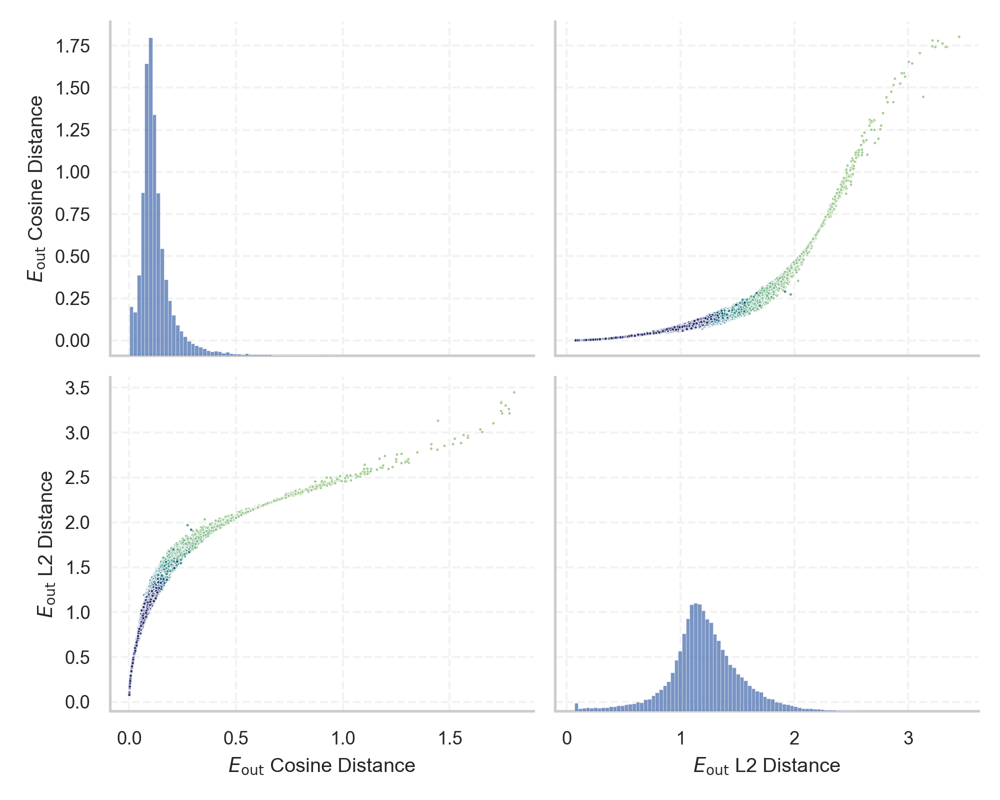
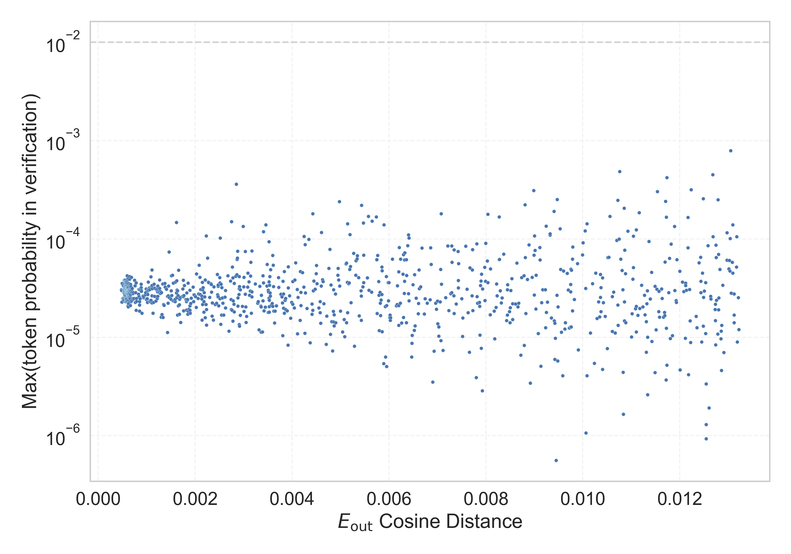

# Report for `checkpoints/step_20000`

## Model info

* Model Info: 
  * Tied embeddings: True
  * LM head uses bias: False
  * Embeddings shape: [50257, 1024]
* Tokenizer Info: 
  * Vocab Size: 50257
  * Tokenizer Class: GPT2Tokenizer
  * Tokenizer Type: BPE
  * Bytes handling: Byte Input
  * Token for verification prompt building: BuyableInstoreAndOnline
  * Token id for verification prompt building: 40242
* Indicator summary: 
  * Indicator for under-trained tokens: E_{out} Cosine Distance
  * Overall distribution: 0.128 +/- 0.102
* Detected Token Counts: 
  * Number of tested under-trained tokens: 1000, 968 non-special, 968 below p = 0.01 threshold, 966 below soft indicator threshold
  * Number of single byte tokens: 256, of which 52 below indicator threshold
  * Number of special tokens: 1, of which 1 below indicator threshold
  * Number of non-single-byte UTF-fragment tokens:  216, of which 41 below soft indicator threshold

## Under-trained token indicators plot


## Verification plot


## Under-trained token verification results
966 entries below threshold of 0.013

|   token_id | token                           |   indicator | max_prob                                                         | in_other_tokens                                                                                                                                                                                          |
|------------|---------------------------------|-------------|------------------------------------------------------------------|----------------------------------------------------------------------------------------------------------------------------------------------------------------------------------------------------------|
|      39756 | ````` inventoryQuantity `````   | 0.000484347 | <span style='border: 1px solid rgb(169, 68, 66);'>3e-05</span>   |                                                                                                                                                                                                          |
|      27097 | ````` -+-+ `````                | 0.000490189 | <span style='border: 1px solid rgb(169, 68, 66);'>2.3e-05</span> | <span style='border: 1px solid rgb(169, 68, 66);'>````` -+-+-+-+ `````</span>                                                                                                                            |
|      30202 | ````` ▁guiName `````            | 0.000492275 | <span style='border: 1px solid rgb(169, 68, 66);'>3.5e-05</span> |                                                                                                                                                                                                          |
|      36940 | ````` ▁istg `````               | 0.000509322 | <span style='border: 1px solid rgb(169, 68, 66);'>2.5e-05</span> |                                                                                                                                                                                                          |
|      27924 | ````` ▁srf `````                | 0.0005216   | <span style='border: 1px solid rgb(169, 68, 66);'>3.1e-05</span> | <span style='border: 1px solid rgb(169, 68, 66);'>````` ▁srfN `````</span>, <span style='border: 1px solid rgb(169, 68, 66);'>````` ▁srfAttach `````</span>                                              |
|      33454 | ````` 龍喚士 `````              | 0.00052309  | <span style='border: 1px solid rgb(169, 68, 66);'>2.9e-05</span> |                                                                                                                                                                                                          |
|      25658 | ````` ?????- `````              | 0.000526309 | <span style='border: 1px solid rgb(169, 68, 66);'>2.9e-05</span> | <span style='border: 1px solid rgb(169, 68, 66);'>````` ?????-?????- `````</span>                                                                                                                        |
|      39757 | ````` channelAvailability ````` | 0.000526786 | <span style='border: 1px solid rgb(169, 68, 66);'>2.5e-05</span> |                                                                                                                                                                                                          |
|      43065 | ````` ▁srfAttach `````          | 0.000529051 | <span style='border: 1px solid rgb(169, 68, 66);'>2.4e-05</span> |                                                                                                                                                                                                          |
|      36935 | ````` ▁dstg `````               | 0.00053066  | <span style='border: 1px solid rgb(169, 68, 66);'>3.5e-05</span> |                                                                                                                                                                                                          |
|      45544 | ````` ▁サーティ `````           | 0.000531673 | <span style='border: 1px solid rgb(169, 68, 66);'>2.8e-05</span> | <span style='border: 1px solid rgb(169, 68, 66);'>````` ▁サーティワン `````</span>                                                                                                                       |
|      31573 | ````` ActionCode `````          | 0.000532568 | <span style='border: 1px solid rgb(169, 68, 66);'>3.1e-05</span> | <span style='border: 1px solid rgb(169, 68, 66);'>````` externalActionCode `````</span>                                                                                                                  |
|       8980 | ````` ¯¯¯¯ `````                | 0.000535488 | <span style='border: 1px solid rgb(169, 68, 66);'>3.2e-05</span> | <span style='border: 1px solid rgb(169, 68, 66);'>````` ¯¯¯¯¯¯¯¯ `````</span>, <span style='border: 1px solid rgb(169, 68, 66);'>````` ¯¯¯¯¯¯¯¯¯¯¯¯¯¯¯¯ `````</span>                                     |
|      11504 | ````` ▁\xa0▁\xa0 `````          | 0.000536323 | <span style='border: 1px solid rgb(169, 68, 66);'>3.2e-05</span> | <span style='border: 1px solid rgb(169, 68, 66);'>````` ▁\xa0▁\xa0▁\xa0▁\xa0 `````</span>, <span style='border: 1px solid rgb(169, 68, 66);'>````` ▁\xa0▁\xa0▁\xa0▁\xa0▁\xa0▁\xa0▁\xa0▁\xa0 `````</span> |
|      36173 | ````` ▁RandomRedditor `````     | 0.000537217 | <span style='border: 1px solid rgb(169, 68, 66);'>3.8e-05</span> | <span style='border: 1px solid rgb(169, 68, 66);'>````` ▁RandomRedditorWithNo `````</span>                                                                                                               |
|      30898 | ````` embedreportprint `````    | 0.000542939 | <span style='border: 1px solid rgb(169, 68, 66);'>3.1e-05</span> | <span style='border: 1px solid rgb(169, 68, 66);'>````` cloneembedreportprint `````</span>, ````` rawdownloadcloneembedreportprint `````                                                                 |
|      39693 | ````` Buyable `````             | 0.000543594 | <span style='border: 1px solid rgb(169, 68, 66);'>3.8e-05</span> | <span style='border: 1px solid rgb(169, 68, 66);'>````` BuyableInstoreAndOnline `````</span>                                                                                                             |
|      39446 | ````` ▁SetFontSize `````        | 0.000543654 | <span style='border: 1px solid rgb(169, 68, 66);'>2.7e-05</span> |                                                                                                                                                                                                          |
|      30439 | ````` ▁unintention `````        | 0.00054425  | <span style='border: 1px solid rgb(169, 68, 66);'>3.2e-05</span> | ````` ▁unintentionally `````, ````` ▁unintentional `````                                                                                                                                                 |
|      39803 | ````` soType `````              | 0.000544965 | <span style='border: 1px solid rgb(169, 68, 66);'>2.6e-05</span> |                                                                                                                                                                                                          |
<details><summary>946 additional entries below threshold</summary>

|   token_id | token                                                                          |   indicator | max_prob                                                         | in_other_tokens                                                                                                                                                                                                                                                                                                                                                                                                                                                                                        |
|------------|--------------------------------------------------------------------------------|-------------|------------------------------------------------------------------|--------------------------------------------------------------------------------------------------------------------------------------------------------------------------------------------------------------------------------------------------------------------------------------------------------------------------------------------------------------------------------------------------------------------------------------------------------------------------------------------------------|
|      39714 | ````` isSpecial `````                                                          | 0.000545084 | <span style='border: 1px solid rgb(169, 68, 66);'>2.8e-05</span> | <span style='border: 1px solid rgb(169, 68, 66);'>````` isSpecialOrderable `````</span>                                                                                                                                                                                                                                                                                                                                                                                                                |
|      38250 | ````` ▁Skydragon `````                                                         | 0.00054723  | <span style='border: 1px solid rgb(169, 68, 66);'>3.8e-05</span> |                                                                                                                                                                                                                                                                                                                                                                                                                                                                                                        |
|      23282 | ````` ▁davidjl `````                                                           | 0.000547767 | <span style='border: 1px solid rgb(169, 68, 66);'>2.5e-05</span> |                                                                                                                                                                                                                                                                                                                                                                                                                                                                                                        |
|      25193 | ````` NetMessage `````                                                         | 0.00054878  | <span style='border: 1px solid rgb(169, 68, 66);'>2.8e-05</span> | <span style='border: 1px solid rgb(169, 68, 66);'>````` PsyNetMessage `````</span>                                                                                                                                                                                                                                                                                                                                                                                                                     |
|      43010 | ````` ▁Kinnikuman `````                                                        | 0.000551105 | <span style='border: 1px solid rgb(169, 68, 66);'>3.2e-05</span> |                                                                                                                                                                                                                                                                                                                                                                                                                                                                                                        |
|       1849 | ````` \xa0 `````                                                               | 0.000552475 | <span style='border: 1px solid rgb(169, 68, 66);'>2.5e-05</span> | <span style='border: 1px solid rgb(169, 68, 66);'>````` \xa0\xa0 `````</span>, <span style='border: 1px solid rgb(169, 68, 66);'>````` ▁\xa0 `````</span>, <span style='border: 1px solid rgb(169, 68, 66);'>````` \xa0\xa0\xa0\xa0 `````</span>, <span style='border: 1px solid rgb(169, 68, 66);'>````` ▁\xa0▁\xa0 `````</span>, <span style='border: 1px solid rgb(169, 68, 66);'>````` \xa0\xa0\xa0\xa0\xa0\xa0\xa0\xa0 `````</span>, ...                                                          |
|      34027 | ````` ▁actionGroup `````                                                       | 0.000554085 | <span style='border: 1px solid rgb(169, 68, 66);'>2.7e-05</span> |                                                                                                                                                                                                                                                                                                                                                                                                                                                                                                        |
|      31957 | ````` cffffcc `````                                                            | 0.000554264 | <span style='border: 1px solid rgb(169, 68, 66);'>2.5e-05</span> |                                                                                                                                                                                                                                                                                                                                                                                                                                                                                                        |
|      40240 | ````` oreAndOnline `````                                                       | 0.000556111 | <span style='border: 1px solid rgb(169, 68, 66);'>3.5e-05</span> | <span style='border: 1px solid rgb(169, 68, 66);'>````` InstoreAndOnline `````</span>, <span style='border: 1px solid rgb(169, 68, 66);'>````` BuyableInstoreAndOnline `````</span>                                                                                                                                                                                                                                                                                                                    |
|       5367 | ````` ¯¯ `````                                                                 | 0.000556469 | <span style='border: 1px solid rgb(169, 68, 66);'>3.2e-05</span> | <span style='border: 1px solid rgb(169, 68, 66);'>````` ¯¯¯¯ `````</span>, <span style='border: 1px solid rgb(169, 68, 66);'>````` ¯¯¯¯¯¯¯¯ `````</span>, <span style='border: 1px solid rgb(169, 68, 66);'>````` ¯¯¯¯¯¯¯¯¯¯¯¯¯¯¯¯ `````</span>                                                                                                                                                                                                                                                        |
|       4603 | ````` \xa0\xa0 `````                                                           | 0.00055933  | <span style='border: 1px solid rgb(169, 68, 66);'>2.3e-05</span> | <span style='border: 1px solid rgb(169, 68, 66);'>````` \xa0\xa0\xa0\xa0 `````</span>, <span style='border: 1px solid rgb(169, 68, 66);'>````` \xa0\xa0\xa0\xa0\xa0\xa0\xa0\xa0 `````</span>, <span style='border: 1px solid rgb(169, 68, 66);'>````` \xa0\xa0\xa0 `````</span>, <span style='border: 1px solid rgb(169, 68, 66);'>````` \xa0\xa0\xa0\xa0\xa0\xa0\xa0\xa0\xa0\xa0\xa0\xa0\xa0\xa0\xa0\xa0 `````</span>, <span style='border: 1px solid rgb(169, 68, 66);'>````` ▁\xa0\xa0 `````</span> |
|      47198 | ````` ItemTracker `````                                                        | 0.000559449 | <span style='border: 1px solid rgb(169, 68, 66);'>3.2e-05</span> |                                                                                                                                                                                                                                                                                                                                                                                                                                                                                                        |
|       5624 | ````` ▁\xa0 `````                                                              | 0.000563622 | <span style='border: 1px solid rgb(169, 68, 66);'>3.6e-05</span> | <span style='border: 1px solid rgb(169, 68, 66);'>````` ▁\xa0▁\xa0 `````</span>, <span style='border: 1px solid rgb(169, 68, 66);'>````` ▁\xa0▁\xa0▁\xa0▁\xa0 `````</span>, <span style='border: 1px solid rgb(169, 68, 66);'>````` ▁\xa0▁\xa0▁\xa0▁\xa0▁\xa0▁\xa0▁\xa0▁\xa0 `````</span>, <span style='border: 1px solid rgb(169, 68, 66);'>````` ▁\xa0\xa0 `````</span>                                                                                                                              |
|       8828 | ````` \xa0\xa0\xa0\xa0 `````                                                   | 0.000564992 | <span style='border: 1px solid rgb(169, 68, 66);'>3.7e-05</span> | <span style='border: 1px solid rgb(169, 68, 66);'>````` \xa0\xa0\xa0\xa0\xa0\xa0\xa0\xa0 `````</span>, <span style='border: 1px solid rgb(169, 68, 66);'>````` \xa0\xa0\xa0\xa0\xa0\xa0\xa0\xa0\xa0\xa0\xa0\xa0\xa0\xa0\xa0\xa0 `````</span>                                                                                                                                                                                                                                                           |
|      13150 | ````` ▁subur `````                                                             | 0.000566244 | <span style='border: 1px solid rgb(169, 68, 66);'>2.3e-05</span> | ````` ▁suburban `````, ````` ▁suburbs `````, ````` ▁suburb `````                                                                                                                                                                                                                                                                                                                                                                                                                                       |
|      10298 | ````` senal `````                                                              | 0.000566304 | <span style='border: 1px solid rgb(169, 68, 66);'>2.9e-05</span> | ````` ▁Arsenal `````, ````` ▁arsenal `````, ````` Arsenal `````                                                                                                                                                                                                                                                                                                                                                                                                                                        |
|      31538 | ````` actionDate `````                                                         | 0.000566423 | <span style='border: 1px solid rgb(169, 68, 66);'>3.4e-05</span> |                                                                                                                                                                                                                                                                                                                                                                                                                                                                                                        |
|      48069 | ````` *=- `````                                                                | 0.000567615 | <span style='border: 1px solid rgb(169, 68, 66);'>2.4e-05</span> |                                                                                                                                                                                                                                                                                                                                                                                                                                                                                                        |
|      39253 | ````` ▁UCHIJ `````                                                             | 0.000572026 | <span style='border: 1px solid rgb(169, 68, 66);'>3.6e-05</span> |                                                                                                                                                                                                                                                                                                                                                                                                                                                                                                        |
|      47654 | ````` ▁\xa0\xa0 `````                                                          | 0.000572741 | <span style='border: 1px solid rgb(169, 68, 66);'>3.2e-05</span> |                                                                                                                                                                                                                                                                                                                                                                                                                                                                                                        |
|      36929 | ````` ▁sidx `````                                                              | 0.000573397 | <span style='border: 1px solid rgb(169, 68, 66);'>3.2e-05</span> |                                                                                                                                                                                                                                                                                                                                                                                                                                                                                                        |
|      39142 | ````` ThumbnailImage `````                                                     | 0.000573516 | <span style='border: 1px solid rgb(169, 68, 66);'>2.8e-05</span> | <span style='border: 1px solid rgb(169, 68, 66);'>````` ItemThumbnailImage `````</span>                                                                                                                                                                                                                                                                                                                                                                                                                |
|      47571 | ````` ▁DevOnline `````                                                         | 0.000573516 | <span style='border: 1px solid rgb(169, 68, 66);'>2.8e-05</span> |                                                                                                                                                                                                                                                                                                                                                                                                                                                                                                        |
|      39906 | ````` EStream `````                                                            | 0.000574291 | <span style='border: 1px solid rgb(169, 68, 66);'>3.4e-05</span> | <span style='border: 1px solid rgb(169, 68, 66);'>````` EStreamFrame `````</span>                                                                                                                                                                                                                                                                                                                                                                                                                      |
|      37842 | ````` ▁partName `````                                                          | 0.000574529 | <span style='border: 1px solid rgb(169, 68, 66);'>3e-05</span>   |                                                                                                                                                                                                                                                                                                                                                                                                                                                                                                        |
|      24973 | ````` ▁exting `````                                                            | 0.000575602 | <span style='border: 1px solid rgb(169, 68, 66);'>2.5e-05</span> | ````` ▁extingu `````, ````` ▁extinguished `````                                                                                                                                                                                                                                                                                                                                                                                                                                                        |
|      39821 | ````` 龍契士 `````                                                             | 0.000576079 | <span style='border: 1px solid rgb(169, 68, 66);'>2.5e-05</span> |                                                                                                                                                                                                                                                                                                                                                                                                                                                                                                        |
|      35992 | ````` WithNo `````                                                             | 0.000576854 | <span style='border: 1px solid rgb(169, 68, 66);'>2.7e-05</span> | <span style='border: 1px solid rgb(169, 68, 66);'>````` ▁RandomRedditorWithNo `````</span>                                                                                                                                                                                                                                                                                                                                                                                                             |
|      45003 | ````` ▁SetTextColor `````                                                      | 0.00057745  | <span style='border: 1px solid rgb(169, 68, 66);'>3.5e-05</span> |                                                                                                                                                                                                                                                                                                                                                                                                                                                                                                        |
|      36174 | ````` ▁RandomRedditorWithNo `````                                              | 0.000578284 | <span style='border: 1px solid rgb(169, 68, 66);'>2.8e-05</span> |                                                                                                                                                                                                                                                                                                                                                                                                                                                                                                        |
|      17629 | ````` ▁practition `````                                                        | 0.000578403 | <span style='border: 1px solid rgb(169, 68, 66);'>3.7e-05</span> | ````` ▁practitioners `````, ````` ▁practitioner `````                                                                                                                                                                                                                                                                                                                                                                                                                                                  |
|      30209 | ````` ▁unfocusedRange `````                                                    | 0.00057888  | <span style='border: 1px solid rgb(169, 68, 66);'>3.5e-05</span> |                                                                                                                                                                                                                                                                                                                                                                                                                                                                                                        |
|      30905 | ````` rawdownload `````                                                        | 0.000579    | <span style='border: 1px solid rgb(169, 68, 66);'>2.5e-05</span> | ````` rawdownloadcloneembedreportprint `````                                                                                                                                                                                                                                                                                                                                                                                                                                                           |
|      17900 | ````` ▁Dragonbound `````                                                       | 0.000580609 | <span style='border: 1px solid rgb(169, 68, 66);'>2.8e-05</span> |                                                                                                                                                                                                                                                                                                                                                                                                                                                                                                        |
|      12781 | ````` wcsstore `````                                                           | 0.000582099 | <span style='border: 1px solid rgb(169, 68, 66);'>2.9e-05</span> |                                                                                                                                                                                                                                                                                                                                                                                                                                                                                                        |
|      40236 | ````` FINEST `````                                                             | 0.000582218 | <span style='border: 1px solid rgb(169, 68, 66);'>2.4e-05</span> |                                                                                                                                                                                                                                                                                                                                                                                                                                                                                                        |
|      25618 | ````` ▁councill `````                                                          | 0.000582457 | <span style='border: 1px solid rgb(169, 68, 66);'>3e-05</span>   | ````` ▁councillor `````, ````` ▁councillors `````                                                                                                                                                                                                                                                                                                                                                                                                                                                      |
|      22686 | ````` ▁\xa0▁\xa0▁\xa0▁\xa0 `````                                               | 0.000582874 | <span style='border: 1px solid rgb(169, 68, 66);'>3.1e-05</span> | <span style='border: 1px solid rgb(169, 68, 66);'>````` ▁\xa0▁\xa0▁\xa0▁\xa0▁\xa0▁\xa0▁\xa0▁\xa0 `````</span>                                                                                                                                                                                                                                                                                                                                                                                          |
|      34448 | ````` ▁ItemLevel `````                                                         | 0.000584304 | <span style='border: 1px solid rgb(169, 68, 66);'>2.3e-05</span> |                                                                                                                                                                                                                                                                                                                                                                                                                                                                                                        |
|       7105 | ````` ▁volunte `````                                                           | 0.000585318 | <span style='border: 1px solid rgb(169, 68, 66);'>3.1e-05</span> | ````` ▁volunteers `````, ````` ▁volunteer `````, ````` ▁volunteered `````, ````` ▁volunteering `````                                                                                                                                                                                                                                                                                                                                                                                                   |
|      30211 | ````` ▁guiIcon `````                                                           | 0.000587046 | <span style='border: 1px solid rgb(169, 68, 66);'>3.1e-05</span> |                                                                                                                                                                                                                                                                                                                                                                                                                                                                                                        |
|      30897 | ````` reportprint `````                                                        | 0.000587106 | <span style='border: 1px solid rgb(169, 68, 66);'>3.1e-05</span> | <span style='border: 1px solid rgb(169, 68, 66);'>````` embedreportprint `````</span>, <span style='border: 1px solid rgb(169, 68, 66);'>````` cloneembedreportprint `````</span>, ````` rawdownloadcloneembedreportprint `````                                                                                                                                                                                                                                                                        |
|      36926 | ````` ▁attm `````                                                              | 0.000588    | <span style='border: 1px solid rgb(169, 68, 66);'>2.5e-05</span> |                                                                                                                                                                                                                                                                                                                                                                                                                                                                                                        |
|      30208 | ````` ▁externalTo `````                                                        | 0.000588834 | <span style='border: 1px solid rgb(169, 68, 66);'>3e-05</span>   | <span style='border: 1px solid rgb(169, 68, 66);'>````` ▁externalToEVA `````</span>, <span style='border: 1px solid rgb(169, 68, 66);'>````` ▁externalToEVAOnly `````</span>                                                                                                                                                                                                                                                                                                                           |
|      25992 | ````` ▁裏覚醒 `````                                                            | 0.000588894 | <span style='border: 1px solid rgb(169, 68, 66);'>2.9e-05</span> |                                                                                                                                                                                                                                                                                                                                                                                                                                                                                                        |
|      39755 | ````` isSpecialOrderable `````                                                 | 0.00058955  | <span style='border: 1px solid rgb(169, 68, 66);'>2.8e-05</span> |                                                                                                                                                                                                                                                                                                                                                                                                                                                                                                        |
|      39177 | ````` ItemThumbnailImage `````                                                 | 0.000592172 | <span style='border: 1px solid rgb(169, 68, 66);'>3.3e-05</span> |                                                                                                                                                                                                                                                                                                                                                                                                                                                                                                        |
|      18945 | ````` ▁teasp `````                                                             | 0.000593126 | <span style='border: 1px solid rgb(169, 68, 66);'>2.8e-05</span> | ````` ▁teaspoon `````, ````` ▁teaspoons `````                                                                                                                                                                                                                                                                                                                                                                                                                                                          |
|      45545 | ````` ▁サーティワン `````                                                      | 0.000593185 | <span style='border: 1px solid rgb(169, 68, 66);'>2.9e-05</span> |                                                                                                                                                                                                                                                                                                                                                                                                                                                                                                        |
|      30212 | ````` ▁externalToEVA `````                                                     | 0.000595152 | <span style='border: 1px solid rgb(169, 68, 66);'>2.9e-05</span> | <span style='border: 1px solid rgb(169, 68, 66);'>````` ▁externalToEVAOnly `````</span>                                                                                                                                                                                                                                                                                                                                                                                                                |
|      17811 | ````` \xa0\xa0\xa0\xa0\xa0\xa0\xa0\xa0 `````                                   | 0.000596046 | <span style='border: 1px solid rgb(169, 68, 66);'>3.6e-05</span> | <span style='border: 1px solid rgb(169, 68, 66);'>````` \xa0\xa0\xa0\xa0\xa0\xa0\xa0\xa0\xa0\xa0\xa0\xa0\xa0\xa0\xa0\xa0 `````</span>                                                                                                                                                                                                                                                                                                                                                                  |
|      43453 | ````` ▁SolidGoldMagikarp `````                                                 | 0.000596881 | <span style='border: 1px solid rgb(169, 68, 66);'>4.2e-05</span> |                                                                                                                                                                                                                                                                                                                                                                                                                                                                                                        |
|      39753 | ````` quickShipAvailable `````                                                 | 0.000597775 | <span style='border: 1px solid rgb(169, 68, 66);'>3e-05</span>   |                                                                                                                                                                                                                                                                                                                                                                                                                                                                                                        |
|      49781 | ````` EngineDebug `````                                                        | 0.000597775 | <span style='border: 1px solid rgb(169, 68, 66);'>3.2e-05</span> |                                                                                                                                                                                                                                                                                                                                                                                                                                                                                                        |
|      39749 | ````` DeliveryDate `````                                                       | 0.000598013 | <span style='border: 1px solid rgb(169, 68, 66);'>2.3e-05</span> | <span style='border: 1px solid rgb(169, 68, 66);'>````` soDeliveryDate `````</span>                                                                                                                                                                                                                                                                                                                                                                                                                    |
|      41551 | ````` Downloadha `````                                                         | 0.000600398 | <span style='border: 1px solid rgb(169, 68, 66);'>2.9e-05</span> |                                                                                                                                                                                                                                                                                                                                                                                                                                                                                                        |
|      39811 | ````` soDeliveryDate `````                                                     | 0.000600636 | <span style='border: 1px solid rgb(169, 68, 66);'>3.2e-05</span> |                                                                                                                                                                                                                                                                                                                                                                                                                                                                                                        |
|      27293 | ````` ▁antidepress `````                                                       | 0.000601292 | <span style='border: 1px solid rgb(169, 68, 66);'>3.2e-05</span> | ````` ▁antidepressants `````, ````` ▁antidepressant `````                                                                                                                                                                                                                                                                                                                                                                                                                                              |
|      42424 | ````` DragonMagazine `````                                                     | 0.000601649 | <span style='border: 1px solid rgb(169, 68, 66);'>3.4e-05</span> |                                                                                                                                                                                                                                                                                                                                                                                                                                                                                                        |
|      43361 | ````` ゼウス `````                                                             | 0.000602067 | <span style='border: 1px solid rgb(169, 68, 66);'>2.9e-05</span> |                                                                                                                                                                                                                                                                                                                                                                                                                                                                                                        |
|      14827 | ````` ÃÂÃÂÃÂÃÂÃÂÃÂÃÂÃÂ `````                                                   | 0.000604272 | <span style='border: 1px solid rgb(169, 68, 66);'>2.7e-05</span> | <span style='border: 1px solid rgb(169, 68, 66);'>````` ÃÂÃÂÃÂÃÂÃÂÃÂÃÂÃÂÃÂÃÂÃÂÃÂÃÂÃÂÃÂÃÂ `````</span>, <span style='border: 1px solid rgb(169, 68, 66);'>````` ÃÂÃÂÃÂÃÂÃÂÃÂÃÂÃÂÃÂÃÂÃÂÃÂÃÂÃÂÃÂÃÂÃÂÃÂÃÂÃÂÃÂÃÂÃÂÃÂÃÂÃÂÃÂÃÂÃÂÃÂÃÂÃÂ `````</span>                                                                                                                                                                                                                                                           |
|      29372 | ````` ▁guiActiveUn `````                                                       | 0.00060451  | <span style='border: 1px solid rgb(169, 68, 66);'>3.8e-05</span> | <span style='border: 1px solid rgb(169, 68, 66);'>````` ▁guiActiveUnfocused `````</span>                                                                                                                                                                                                                                                                                                                                                                                                               |
|      37574 | ````` StreamerBot `````                                                        | 0.000605047 | <span style='border: 1px solid rgb(169, 68, 66);'>2.9e-05</span> | <span style='border: 1px solid rgb(169, 68, 66);'>````` TPPStreamerBot `````</span>                                                                                                                                                                                                                                                                                                                                                                                                                    |
|      35207 | ````` ▁attRot `````                                                            | 0.000605643 | <span style='border: 1px solid rgb(169, 68, 66);'>2.7e-05</span> |                                                                                                                                                                                                                                                                                                                                                                                                                                                                                                        |
|      32437 | ````` ▁Smartstocks `````                                                       | 0.00060612  | <span style='border: 1px solid rgb(169, 68, 66);'>3.9e-05</span> |                                                                                                                                                                                                                                                                                                                                                                                                                                                                                                        |
|      42090 | ````` ▁TheNitromeFan `````                                                     | 0.000606477 | <span style='border: 1px solid rgb(169, 68, 66);'>2.6e-05</span> |                                                                                                                                                                                                                                                                                                                                                                                                                                                                                                        |
|      44320 | ````` \n\xa0 `````                                                             | 0.000607133 | <span style='border: 1px solid rgb(169, 68, 66);'>2.8e-05</span> |                                                                                                                                                                                                                                                                                                                                                                                                                                                                                                        |
|      41868 | ````` ▁Cosponsors `````                                                        | 0.000607193 | <span style='border: 1px solid rgb(169, 68, 66);'>2.9e-05</span> |                                                                                                                                                                                                                                                                                                                                                                                                                                                                                                        |
|      36938 | ````` ▁sqor `````                                                              | 0.000608146 | <span style='border: 1px solid rgb(169, 68, 66);'>3.1e-05</span> |                                                                                                                                                                                                                                                                                                                                                                                                                                                                                                        |
|      27006 | ````` ¯¯¯¯¯¯¯¯¯¯¯¯¯¯¯¯ `````                                                   | 0.000608504 | <span style='border: 1px solid rgb(169, 68, 66);'>2.7e-05</span> |                                                                                                                                                                                                                                                                                                                                                                                                                                                                                                        |
|      25502 | ````` ItemImage `````                                                          | 0.00061059  | <span style='border: 1px solid rgb(169, 68, 66);'>3e-05</span>   |                                                                                                                                                                                                                                                                                                                                                                                                                                                                                                        |
|      38370 | ````` iHUD `````                                                               | 0.000611067 | <span style='border: 1px solid rgb(169, 68, 66);'>2.1e-05</span> |                                                                                                                                                                                                                                                                                                                                                                                                                                                                                                        |
|      42586 | ````` ▁srfN `````                                                              | 0.000611961 | <span style='border: 1px solid rgb(169, 68, 66);'>3.1e-05</span> |                                                                                                                                                                                                                                                                                                                                                                                                                                                                                                        |
|      43177 | ````` EStreamFrame `````                                                       | 0.000612795 | <span style='border: 1px solid rgb(169, 68, 66);'>2.7e-05</span> |                                                                                                                                                                                                                                                                                                                                                                                                                                                                                                        |
|      34473 | ````` ヘラ `````                                                               | 0.000614107 | <span style='border: 1px solid rgb(169, 68, 66);'>3.2e-05</span> |                                                                                                                                                                                                                                                                                                                                                                                                                                                                                                        |
|      49731 | ````` ▁EntityItem `````                                                        | 0.000614703 | <span style='border: 1px solid rgb(169, 68, 66);'>3.5e-05</span> |                                                                                                                                                                                                                                                                                                                                                                                                                                                                                                        |
|      30210 | ````` ▁guiActiveUnfocused `````                                                | 0.00061506  | <span style='border: 1px solid rgb(169, 68, 66);'>2.8e-05</span> |                                                                                                                                                                                                                                                                                                                                                                                                                                                                                                        |
|      41380 | ````` natureconservancy `````                                                  | 0.000615537 | <span style='border: 1px solid rgb(169, 68, 66);'>2.8e-05</span> |                                                                                                                                                                                                                                                                                                                                                                                                                                                                                                        |
|      33477 | ````` \xa0\xa0\xa0 `````                                                       | 0.000616193 | <span style='border: 1px solid rgb(169, 68, 66);'>2.9e-05</span> | <span style='border: 1px solid rgb(169, 68, 66);'>````` \xa0\xa0\xa0\xa0\xa0\xa0\xa0\xa0\xa0\xa0\xa0\xa0\xa0\xa0\xa0\xa0 `````</span>                                                                                                                                                                                                                                                                                                                                                                  |
|      23090 | ````` ÃÂÃÂÃÂÃÂÃÂÃÂÃÂÃÂÃÂÃÂÃÂÃÂÃÂÃÂÃÂÃÂ `````                                   | 0.000616372 | <span style='border: 1px solid rgb(169, 68, 66);'>3e-05</span>   | <span style='border: 1px solid rgb(169, 68, 66);'>````` ÃÂÃÂÃÂÃÂÃÂÃÂÃÂÃÂÃÂÃÂÃÂÃÂÃÂÃÂÃÂÃÂÃÂÃÂÃÂÃÂÃÂÃÂÃÂÃÂÃÂÃÂÃÂÃÂÃÂÃÂÃÂÃÂ `````</span>                                                                                                                                                                                                                                                                                                                                                                  |
|       3523 | ````` ▁citiz `````                                                             | 0.000616908 | <span style='border: 1px solid rgb(169, 68, 66);'>2.2e-05</span> | ````` ▁citizens `````, ````` ▁citizen `````, ````` ▁citizenship `````                                                                                                                                                                                                                                                                                                                                                                                                                                  |
|      31765 | ````` MpServer `````                                                           | 0.00061965  | <span style='border: 1px solid rgb(169, 68, 66);'>2.4e-05</span> |                                                                                                                                                                                                                                                                                                                                                                                                                                                                                                        |
|      45392 | ````` dayName `````                                                            | 0.000619948 | <span style='border: 1px solid rgb(169, 68, 66);'>4e-05</span>   |                                                                                                                                                                                                                                                                                                                                                                                                                                                                                                        |
|      50009 | ````` ▁strutConnector `````                                                    | 0.000620365 | <span style='border: 1px solid rgb(169, 68, 66);'>2.5e-05</span> |                                                                                                                                                                                                                                                                                                                                                                                                                                                                                                        |
|      28235 | ````` aeper `````                                                              | 0.000622332 | <span style='border: 1px solid rgb(169, 68, 66);'>2.2e-05</span> | ````` aepernick `````, ````` ▁Kaepernick `````                                                                                                                                                                                                                                                                                                                                                                                                                                                         |
|      40241 | ````` InstoreAndOnline `````                                                   | 0.000624299 | <span style='border: 1px solid rgb(169, 68, 66);'>3e-05</span>   | <span style='border: 1px solid rgb(169, 68, 66);'>````` BuyableInstoreAndOnline `````</span>                                                                                                                                                                                                                                                                                                                                                                                                           |
|      36490 | ````` 00200000 `````                                                           | 0.000628471 | <span style='border: 1px solid rgb(169, 68, 66);'>3.4e-05</span> |                                                                                                                                                                                                                                                                                                                                                                                                                                                                                                        |
|      40278 | ````` */( `````                                                                | 0.000628769 | <span style='border: 1px solid rgb(169, 68, 66);'>3.2e-05</span> |                                                                                                                                                                                                                                                                                                                                                                                                                                                                                                        |
|      39752 | ````` quickShip `````                                                          | 0.000629365 | <span style='border: 1px solid rgb(169, 68, 66);'>3e-05</span>   | <span style='border: 1px solid rgb(169, 68, 66);'>````` quickShipAvailable `````</span>                                                                                                                                                                                                                                                                                                                                                                                                                |
|      39172 | ````` \xa0\xa0\xa0\xa0\xa0\xa0\xa0\xa0\xa0\xa0\xa0\xa0\xa0\xa0\xa0\xa0 `````   | 0.000629544 | <span style='border: 1px solid rgb(169, 68, 66);'>3e-05</span>   |                                                                                                                                                                                                                                                                                                                                                                                                                                                                                                        |
|       6438 | ````` ▁裏 `````                                                                | 0.0006302   | <span style='border: 1px solid rgb(169, 68, 66);'>2.6e-05</span> | ````` ▁裏<0xE7> `````, <span style='border: 1px solid rgb(169, 68, 66);'>````` ▁裏覚醒 `````</span>, ````` ▁裏<0xE8> `````                                                                                                                                                                                                                                                                                                                                                                             |
|      37579 | ````` TPPStreamerBot `````                                                     | 0.000634015 | <span style='border: 1px solid rgb(169, 68, 66);'>3.1e-05</span> |                                                                                                                                                                                                                                                                                                                                                                                                                                                                                                        |
|      28666 | ````` PsyNetMessage `````                                                      | 0.00063777  | <span style='border: 1px solid rgb(169, 68, 66);'>2.7e-05</span> |                                                                                                                                                                                                                                                                                                                                                                                                                                                                                                        |
|      41383 | ````` assetsadobe `````                                                        | 0.000640094 | <span style='border: 1px solid rgb(169, 68, 66);'>2.5e-05</span> |                                                                                                                                                                                                                                                                                                                                                                                                                                                                                                        |
|      18472 | ````` ▁guiActive `````                                                         | 0.000640154 | <span style='border: 1px solid rgb(169, 68, 66);'>2.9e-05</span> | <span style='border: 1px solid rgb(169, 68, 66);'>````` ▁guiActiveUn `````</span>, <span style='border: 1px solid rgb(169, 68, 66);'>````` ▁guiActiveUnfocused `````</span>                                                                                                                                                                                                                                                                                                                            |
|      39165 | ````` catentry `````                                                           | 0.000641108 | <span style='border: 1px solid rgb(169, 68, 66);'>3.4e-05</span> |                                                                                                                                                                                                                                                                                                                                                                                                                                                                                                        |
|      19476 | ````` ▁carbohyd `````                                                          | 0.000641286 | <span style='border: 1px solid rgb(169, 68, 66);'>3e-05</span>   | ````` ▁carbohydrate `````, ````` ▁carbohydrates `````                                                                                                                                                                                                                                                                                                                                                                                                                                                  |
|      42089 | ````` ▁TheNitrome `````                                                        | 0.000641346 | <span style='border: 1px solid rgb(169, 68, 66);'>3.5e-05</span> | <span style='border: 1px solid rgb(169, 68, 66);'>````` ▁TheNitromeFan `````</span>                                                                                                                                                                                                                                                                                                                                                                                                                    |
|      34516 | ````` >>\ `````                                                                | 0.000642359 | <span style='border: 1px solid rgb(169, 68, 66);'>3e-05</span>   |                                                                                                                                                                                                                                                                                                                                                                                                                                                                                                        |
|      40219 | ````` oreAnd `````                                                             | 0.000643969 | <span style='border: 1px solid rgb(169, 68, 66);'>3.9e-05</span> | <span style='border: 1px solid rgb(169, 68, 66);'>````` oreAndOnline `````</span>, <span style='border: 1px solid rgb(169, 68, 66);'>````` InstoreAndOnline `````</span>, <span style='border: 1px solid rgb(169, 68, 66);'>````` BuyableInstoreAndOnline `````</span>                                                                                                                                                                                                                                 |
|      31576 | ````` externalActionCode `````                                                 | 0.000644743 | <span style='border: 1px solid rgb(169, 68, 66);'>3e-05</span>   |                                                                                                                                                                                                                                                                                                                                                                                                                                                                                                        |
|      40242 | ````` BuyableInstoreAndOnline `````                                            | 0.000647187 | <span style='border: 1px solid rgb(169, 68, 66);'>4.2e-05</span> |                                                                                                                                                                                                                                                                                                                                                                                                                                                                                                        |
|      15243 | ````` ¯¯¯¯¯¯¯¯ `````                                                           | 0.000651777 | <span style='border: 1px solid rgb(169, 68, 66);'>2.5e-05</span> | <span style='border: 1px solid rgb(169, 68, 66);'>````` ¯¯¯¯¯¯¯¯¯¯¯¯¯¯¯¯ `````</span>                                                                                                                                                                                                                                                                                                                                                                                                                  |
|      46600 | ````` ▁Adinida `````                                                           | 0.000653088 | <span style='border: 1px solid rgb(169, 68, 66);'>2.7e-05</span> |                                                                                                                                                                                                                                                                                                                                                                                                                                                                                                        |
|      31666 | ````` ?????-?????- `````                                                       | 0.000655651 | <span style='border: 1px solid rgb(169, 68, 66);'>2.7e-05</span> |                                                                                                                                                                                                                                                                                                                                                                                                                                                                                                        |
|      36862 | ````` EMOTE `````                                                              | 0.000656366 | <span style='border: 1px solid rgb(169, 68, 66);'>2.5e-05</span> |                                                                                                                                                                                                                                                                                                                                                                                                                                                                                                        |
|      24847 | ````` ModLoader `````                                                          | 0.000660181 | <span style='border: 1px solid rgb(169, 68, 66);'>2.7e-05</span> | <span style='border: 1px solid rgb(169, 68, 66);'>````` ForgeModLoader `````</span>                                                                                                                                                                                                                                                                                                                                                                                                                    |
|      31783 | ````` ▁BaseType `````                                                          | 0.000661969 | <span style='border: 1px solid rgb(169, 68, 66);'>3.5e-05</span> |                                                                                                                                                                                                                                                                                                                                                                                                                                                                                                        |
|       5815 | ````` ÃÂÃÂ `````                                                               | 0.000662506 | <span style='border: 1px solid rgb(169, 68, 66);'>3e-05</span>   | <span style='border: 1px solid rgb(169, 68, 66);'>````` ÃÂÃÂÃÂÃÂ `````</span>, <span style='border: 1px solid rgb(169, 68, 66);'>````` ÃÂÃÂÃÂÃÂÃÂÃÂÃÂÃÂ `````</span>, <span style='border: 1px solid rgb(169, 68, 66);'>````` ÃÂÃÂÃÂÃÂÃÂÃÂÃÂÃÂÃÂÃÂÃÂÃÂÃÂÃÂÃÂÃÂ `````</span>, <span style='border: 1px solid rgb(169, 68, 66);'>````` ÃÂÃÂÃÂÃÂÃÂÃÂÃÂÃÂÃÂÃÂÃÂÃÂÃÂÃÂÃÂÃÂÃÂÃÂÃÂÃÂÃÂÃÂÃÂÃÂÃÂÃÂÃÂÃÂÃÂÃÂÃÂÃÂ `````</span>                                                                                     |
|      35579 | ````` ▁Mechdragon `````                                                        | 0.000662804 | <span style='border: 1px solid rgb(169, 68, 66);'>3.2e-05</span> |                                                                                                                                                                                                                                                                                                                                                                                                                                                                                                        |
|      34206 | ````` #$#$ `````                                                               | 0.000663221 | <span style='border: 1px solid rgb(169, 68, 66);'>2.8e-05</span> |                                                                                                                                                                                                                                                                                                                                                                                                                                                                                                        |
|      24934 | ````` ForgeModLoader `````                                                     | 0.000664532 | <span style='border: 1px solid rgb(169, 68, 66);'>2.1e-05</span> |                                                                                                                                                                                                                                                                                                                                                                                                                                                                                                        |
|      43569 | ````` ÍÍ `````                                                                 | 0.000668287 | <span style='border: 1px solid rgb(169, 68, 66);'>3.1e-05</span> |                                                                                                                                                                                                                                                                                                                                                                                                                                                                                                        |
|      42202 | ````` GoldMagikarp `````                                                       | 0.000669837 | <span style='border: 1px solid rgb(169, 68, 66);'>3.4e-05</span> | <span style='border: 1px solid rgb(169, 68, 66);'>````` ▁SolidGoldMagikarp `````</span>                                                                                                                                                                                                                                                                                                                                                                                                                |
|      48396 | ````` ÛÛ `````                                                                 | 0.000670493 | <span style='border: 1px solid rgb(169, 68, 66);'>3e-05</span>   |                                                                                                                                                                                                                                                                                                                                                                                                                                                                                                        |
|       4690 | ````` ortunately `````                                                         | 0.000674367 | <span style='border: 1px solid rgb(169, 68, 66);'>3.1e-05</span> | ````` fortunately `````, ````` ▁Unfortunately `````, ````` ▁unfortunately `````, ````` Unfortunately `````, ````` ▁Fortunately `````, ...                                                                                                                                                                                                                                                                                                                                                              |
|      41297 | ````` ▁TAMADRA `````                                                           | 0.000675142 | <span style='border: 1px solid rgb(169, 68, 66);'>3.3e-05</span> |                                                                                                                                                                                                                                                                                                                                                                                                                                                                                                        |
|      36130 | ````` ▁PsyNet `````                                                            | 0.000680983 | <span style='border: 1px solid rgb(169, 68, 66);'>2.3e-05</span> |                                                                                                                                                                                                                                                                                                                                                                                                                                                                                                        |
|      32047 | ````` ▁"$:/ `````                                                              | 0.000683486 | <span style='border: 1px solid rgb(169, 68, 66);'>4.1e-05</span> |                                                                                                                                                                                                                                                                                                                                                                                                                                                                                                        |
|      40012 | ````` uyomi `````                                                              | 0.000686824 | <span style='border: 1px solid rgb(169, 68, 66);'>2.8e-05</span> | <span style='border: 1px solid rgb(169, 68, 66);'>````` ▁Tsukuyomi `````</span>                                                                                                                                                                                                                                                                                                                                                                                                                        |
|      45706 | ````` ▁\xa0▁\xa0▁\xa0▁\xa0▁\xa0▁\xa0▁\xa0▁\xa0 `````                           | 0.000687182 | <span style='border: 1px solid rgb(169, 68, 66);'>3.1e-05</span> |                                                                                                                                                                                                                                                                                                                                                                                                                                                                                                        |
|      30213 | ````` ▁externalToEVAOnly `````                                                 | 0.00068754  | <span style='border: 1px solid rgb(169, 68, 66);'>2.4e-05</span> |                                                                                                                                                                                                                                                                                                                                                                                                                                                                                                        |
|      39655 | ````` Orderable `````                                                          | 0.000690639 | <span style='border: 1px solid rgb(169, 68, 66);'>3e-05</span>   | <span style='border: 1px solid rgb(169, 68, 66);'>````` isSpecialOrderable `````</span>                                                                                                                                                                                                                                                                                                                                                                                                                |
|      33813 | ````` =~=~ `````                                                               | 0.000695825 | <span style='border: 1px solid rgb(169, 68, 66);'>2.8e-05</span> |                                                                                                                                                                                                                                                                                                                                                                                                                                                                                                        |
|      27013 | ````` aditional `````                                                          | 0.000699222 | <span style='border: 1px solid rgb(169, 68, 66);'>3.2e-05</span> | ````` ▁Traditional `````, ````` traditional `````, ````` Traditional `````                                                                                                                                                                                                                                                                                                                                                                                                                             |
|       9364 | ````` ÃÂÃÂÃÂÃÂ `````                                                           | 0.000703633 | <span style='border: 1px solid rgb(169, 68, 66);'>2.5e-05</span> | <span style='border: 1px solid rgb(169, 68, 66);'>````` ÃÂÃÂÃÂÃÂÃÂÃÂÃÂÃÂ `````</span>, <span style='border: 1px solid rgb(169, 68, 66);'>````` ÃÂÃÂÃÂÃÂÃÂÃÂÃÂÃÂÃÂÃÂÃÂÃÂÃÂÃÂÃÂÃÂ `````</span>, <span style='border: 1px solid rgb(169, 68, 66);'>````` ÃÂÃÂÃÂÃÂÃÂÃÂÃÂÃÂÃÂÃÂÃÂÃÂÃÂÃÂÃÂÃÂÃÂÃÂÃÂÃÂÃÂÃÂÃÂÃÂÃÂÃÂÃÂÃÂÃÂÃÂÃÂÃÂ `````</span>                                                                                                                                                                    |
|      29646 | ````` ▁gobl `````                                                              | 0.000715852 | <span style='border: 1px solid rgb(169, 68, 66);'>2.8e-05</span> | ````` ▁goblin `````, ````` ▁goblins `````                                                                                                                                                                                                                                                                                                                                                                                                                                                              |
|      32310 | ````` sbm `````                                                                | 0.000717342 | <span style='border: 1px solid rgb(169, 68, 66);'>2.4e-05</span> |                                                                                                                                                                                                                                                                                                                                                                                                                                                                                                        |
|      34604 | ````` \\\\\\\\\\\\\\\\ `````                                                   | 0.000728846 | <span style='border: 1px solid rgb(169, 68, 66);'>2.9e-05</span> |                                                                                                                                                                                                                                                                                                                                                                                                                                                                                                        |
|      31032 | ````` SpaceEngineers `````                                                     | 0.000737369 | <span style='border: 1px solid rgb(169, 68, 66);'>2.5e-05</span> |                                                                                                                                                                                                                                                                                                                                                                                                                                                                                                        |
|      42889 | ````` ikuman `````                                                             | 0.000748754 | <span style='border: 1px solid rgb(169, 68, 66);'>3.8e-05</span> | <span style='border: 1px solid rgb(169, 68, 66);'>````` ▁Kinnikuman `````</span>                                                                                                                                                                                                                                                                                                                                                                                                                       |
|      46939 | ````` ;;;;;;;;;;;; `````                                                       | 0.000761151 | <span style='border: 1px solid rgb(169, 68, 66);'>3.4e-05</span> |                                                                                                                                                                                                                                                                                                                                                                                                                                                                                                        |
|      33023 | ````` hovah `````                                                              | 0.000766635 | <span style='border: 1px solid rgb(169, 68, 66);'>2.3e-05</span> | ````` ▁Jehovah `````                                                                                                                                                                                                                                                                                                                                                                                                                                                                                   |
|      31536 | ````` displayText `````                                                        | 0.000769019 | <span style='border: 1px solid rgb(169, 68, 66);'>2.9e-05</span> |                                                                                                                                                                                                                                                                                                                                                                                                                                                                                                        |
|      36473 | ````` luaj `````                                                               | 0.000784516 | <span style='border: 1px solid rgb(169, 68, 66);'>3.6e-05</span> |                                                                                                                                                                                                                                                                                                                                                                                                                                                                                                        |
|      49997 | ````` ahime `````                                                              | 0.000784636 | <span style='border: 1px solid rgb(169, 68, 66);'>1.9e-05</span> |                                                                                                                                                                                                                                                                                                                                                                                                                                                                                                        |
|      30762 | ````` ▁metic `````                                                             | 0.000789762 | <span style='border: 1px solid rgb(169, 68, 66);'>2.5e-05</span> | ````` ▁meticulously `````, ````` ▁meticulous `````                                                                                                                                                                                                                                                                                                                                                                                                                                                     |
|      50113 | ````` .''. `````                                                               | 0.000793457 | <span style='border: 1px solid rgb(169, 68, 66);'>2.3e-05</span> |                                                                                                                                                                                                                                                                                                                                                                                                                                                                                                        |
|      25887 | ````` ;;;;;;;; `````                                                           | 0.000831723 | <span style='border: 1px solid rgb(169, 68, 66);'>2.8e-05</span> | <span style='border: 1px solid rgb(169, 68, 66);'>````` ;;;;;;;;;;;; `````</span>                                                                                                                                                                                                                                                                                                                                                                                                                      |
|      23711 | ````` ▁Moroc `````                                                             | 0.000835001 | <span style='border: 1px solid rgb(169, 68, 66);'>3.1e-05</span> | ````` ▁Morocco `````, ````` ▁Moroccan `````                                                                                                                                                                                                                                                                                                                                                                                                                                                            |
|      50216 | ````` ▁Leilan `````                                                            | 0.000839412 | <span style='border: 1px solid rgb(169, 68, 66);'>2.6e-05</span> |                                                                                                                                                                                                                                                                                                                                                                                                                                                                                                        |
|      18356 | ````` ▁opio `````                                                              | 0.000846863 | <span style='border: 1px solid rgb(169, 68, 66);'>3.1e-05</span> | ````` ▁opioid `````, ````` ▁opioids `````                                                                                                                                                                                                                                                                                                                                                                                                                                                              |
|      42744 | ````` -+-+-+-+ `````                                                           | 0.000853658 | <span style='border: 1px solid rgb(169, 68, 66);'>1.8e-05</span> |                                                                                                                                                                                                                                                                                                                                                                                                                                                                                                        |
|      22263 | ````` ▁mosqu `````                                                             | 0.000853837 | <span style='border: 1px solid rgb(169, 68, 66);'>2.1e-05</span> | ````` ▁mosques `````, ````` ▁mosquit `````, ````` ▁mosquito `````, ````` ▁mosquitoes `````                                                                                                                                                                                                                                                                                                                                                                                                             |
|      24731 | ````` ドラゴン `````                                                           | 0.000853956 | <span style='border: 1px solid rgb(169, 68, 66);'>2.3e-05</span> |                                                                                                                                                                                                                                                                                                                                                                                                                                                                                                        |
|      15272 | ````` ▁pione `````                                                             | 0.000860393 | <span style='border: 1px solid rgb(169, 68, 66);'>3e-05</span>   | ````` ▁pioneer `````, ````` ▁pioneering `````, ````` ▁pioneers `````, ````` ▁pioneered `````                                                                                                                                                                                                                                                                                                                                                                                                           |
|      13171 | ````` VIDIA `````                                                              | 0.000861764 | <span style='border: 1px solid rgb(169, 68, 66);'>2.5e-05</span> | ````` ▁NVIDIA `````, ````` NVIDIA `````                                                                                                                                                                                                                                                                                                                                                                                                                                                                |
|      23614 | ````` 覚醒 `````                                                               | 0.000882804 | <span style='border: 1px solid rgb(169, 68, 66);'>3.2e-05</span> | <span style='border: 1px solid rgb(169, 68, 66);'>````` ▁裏覚醒 `````</span>                                                                                                                                                                                                                                                                                                                                                                                                                           |
|       9286 | ````` ▁exha `````                                                              | 0.000883579 | <span style='border: 1px solid rgb(169, 68, 66);'>3e-05</span>   | ````` ▁exhaust `````, ````` ▁exhausted `````, ````` ▁exhaustion `````, ````` ▁exhaustive `````, ````` ▁exhausting `````                                                                                                                                                                                                                                                                                                                                                                                |
|      47614 | ````` ▁Nanto `````                                                             | 0.00088495  | <span style='border: 1px solid rgb(169, 68, 66);'>3.5e-05</span> |                                                                                                                                                                                                                                                                                                                                                                                                                                                                                                        |
|       8994 | ````` ailability `````                                                         | 0.000892103 | <span style='border: 1px solid rgb(169, 68, 66);'>2.9e-05</span> | ````` ▁availability `````, ````` Availability `````, <span style='border: 1px solid rgb(169, 68, 66);'>````` channelAvailability `````</span>, ````` ▁Availability `````, ````` availability `````                                                                                                                                                                                                                                                                                                     |
|      42983 | ````` ワン `````                                                               | 0.000900984 | <span style='border: 1px solid rgb(169, 68, 66);'>1.8e-05</span> | <span style='border: 1px solid rgb(169, 68, 66);'>````` ▁サーティワン `````</span>                                                                                                                                                                                                                                                                                                                                                                                                                     |
|      23785 | ````` "]=> `````                                                               | 0.000922024 | <span style='border: 1px solid rgb(169, 68, 66);'>2.6e-05</span> |                                                                                                                                                                                                                                                                                                                                                                                                                                                                                                        |
|      24307 | ````` ▁looph `````                                                             | 0.000934482 | <span style='border: 1px solid rgb(169, 68, 66);'>2.5e-05</span> | ````` ▁loophole `````, ````` ▁loopholes `````                                                                                                                                                                                                                                                                                                                                                                                                                                                          |
|      30899 | ````` cloneembedreportprint `````                                              | 0.000935614 | <span style='border: 1px solid rgb(169, 68, 66);'>2.6e-05</span> | ````` rawdownloadcloneembedreportprint `````                                                                                                                                                                                                                                                                                                                                                                                                                                                           |
|      47182 | ````` ":""},{" `````                                                           | 0.000971138 | <span style='border: 1px solid rgb(169, 68, 66);'>2.7e-05</span> |                                                                                                                                                                                                                                                                                                                                                                                                                                                                                                        |
|      21807 | ````` \\\\\\\\ `````                                                           | 0.000978351 | <span style='border: 1px solid rgb(169, 68, 66);'>2.8e-05</span> | <span style='border: 1px solid rgb(169, 68, 66);'>````` \\\\\\\\\\\\\\\\ `````</span>                                                                                                                                                                                                                                                                                                                                                                                                                  |
|      16323 | ````` ▁glim `````                                                              | 0.000987589 | <span style='border: 1px solid rgb(169, 68, 66);'>3.1e-05</span> | ````` ▁glimpse `````, ````` ▁glimps `````                                                                                                                                                                                                                                                                                                                                                                                                                                                              |
|      11974 | ````` ▁Tradable `````                                                          | 0.000993669 | <span style='border: 1px solid rgb(169, 68, 66);'>2.5e-05</span> |                                                                                                                                                                                                                                                                                                                                                                                                                                                                                                        |
|       6598 | ````` ▁behavi `````                                                            | 0.000995994 | <span style='border: 1px solid rgb(169, 68, 66);'>2.4e-05</span> | ````` ▁behaviour `````, ````` ▁behaviors `````, ````` ▁behavioral `````, ````` ▁behaving `````, ````` ▁behaviours `````, ...                                                                                                                                                                                                                                                                                                                                                                           |
|       2887 | ````` acebook `````                                                            | 0.00101006  | <span style='border: 1px solid rgb(169, 68, 66);'>2.5e-05</span> | ````` ▁Facebook `````, ````` Facebook `````, ````` facebook `````, ````` ▁facebook `````                                                                                                                                                                                                                                                                                                                                                                                                               |
|      20645 | ````` ▁dilig `````                                                             | 0.00101352  | <span style='border: 1px solid rgb(169, 68, 66);'>2.3e-05</span> | ````` ▁diligence `````, ````` ▁diligently `````, ````` ▁diligent `````                                                                                                                                                                                                                                                                                                                                                                                                                                 |
|      44392 | ````` ▁cumbers `````                                                           | 0.00101942  | <span style='border: 1px solid rgb(169, 68, 66);'>2.7e-05</span> | ````` ▁cumbersome `````                                                                                                                                                                                                                                                                                                                                                                                                                                                                                |
|      15040 | ````` byss `````                                                               | 0.00102127  | <span style='border: 1px solid rgb(169, 68, 66);'>3e-05</span>   | ````` ▁Abyss `````, ````` ▁abyss `````, <span style='border: 1px solid rgb(169, 68, 66);'>````` ▁Abyssal `````</span>, <span style='border: 1px solid rgb(169, 68, 66);'>````` Abyss `````</span>                                                                                                                                                                                                                                                                                                      |
|      48448 | ````` iosyn `````                                                              | 0.00102252  | <span style='border: 1px solid rgb(169, 68, 66);'>3e-05</span>   | <span style='border: 1px solid rgb(169, 68, 66);'>````` iosyncr `````</span>, ````` ▁idiosyncr `````                                                                                                                                                                                                                                                                                                                                                                                                   |
|      22675 | ````` @@@@ `````                                                               | 0.00103045  | <span style='border: 1px solid rgb(169, 68, 66);'>3.1e-05</span> | <span style='border: 1px solid rgb(169, 68, 66);'>````` @@@@@@@@ `````</span>                                                                                                                                                                                                                                                                                                                                                                                                                          |
|      13198 | ````` ▁earthqu `````                                                           | 0.0010339   | <span style='border: 1px solid rgb(169, 68, 66);'>3.7e-05</span> | ````` ▁earthquake `````, ````` ▁earthquakes `````                                                                                                                                                                                                                                                                                                                                                                                                                                                      |
|      11689 | ````` ▁unnecess `````                                                          | 0.00105613  | <span style='border: 1px solid rgb(169, 68, 66);'>3.2e-05</span> | ````` ▁unnecessary `````, ````` ▁unnecessarily `````                                                                                                                                                                                                                                                                                                                                                                                                                                                   |
|      49813 | ````` ▁Flavoring `````                                                         | 0.00105739  | <span style='border: 1px solid rgb(169, 68, 66);'>3.1e-05</span> |                                                                                                                                                                                                                                                                                                                                                                                                                                                                                                        |
|      16782 | ````` ▁misunder `````                                                          | 0.00105888  | <span style='border: 1px solid rgb(169, 68, 66);'>3e-05</span>   | ````` ▁misunderstanding `````, ````` ▁misunderstood `````, ````` ▁misunderstand `````                                                                                                                                                                                                                                                                                                                                                                                                                  |
|       4060 | ````` vertisement `````                                                        | 0.00106049  | <span style='border: 1px solid rgb(169, 68, 66);'>2.3e-05</span> | ````` Advertisement `````, ````` vertisements `````, ````` Advertisements `````, ````` ▁advertisement `````, ````` ▁advertisements `````, ...                                                                                                                                                                                                                                                                                                                                                          |
|      22315 | ````` ▁newcom `````                                                            | 0.00107473  | <span style='border: 1px solid rgb(169, 68, 66);'>2.3e-05</span> | ````` ▁newcomers `````, ````` ▁newcomer `````                                                                                                                                                                                                                                                                                                                                                                                                                                                          |
|      12869 | ````` ▁reluct `````                                                            | 0.00108618  | <span style='border: 1px solid rgb(169, 68, 66);'>2.4e-05</span> | ````` ▁reluctant `````, ````` ▁reluctance `````, ````` ▁reluctantly `````                                                                                                                                                                                                                                                                                                                                                                                                                              |
|      44555 | ````` ▁Archdemon `````                                                         | 0.0010891   | <span style='border: 1px solid rgb(169, 68, 66);'>4.1e-05</span> |                                                                                                                                                                                                                                                                                                                                                                                                                                                                                                        |
|      17473 | ````` ▁contrace `````                                                          | 0.0011068   | <span style='border: 1px solid rgb(169, 68, 66);'>3.4e-05</span> | ````` ▁contraception `````, ````` ▁contraceptive `````, ````` ▁contraceptives `````                                                                                                                                                                                                                                                                                                                                                                                                                    |
|      14341 | ````` PDATE `````                                                              | 0.00110692  | <span style='border: 1px solid rgb(169, 68, 66);'>4.9e-05</span> | ````` UPDATE `````, ````` ▁UPDATE `````, ````` PDATED `````                                                                                                                                                                                                                                                                                                                                                                                                                                            |
|      42943 | ````` ?」 `````                                                                | 0.00110704  | <span style='border: 1px solid rgb(169, 68, 66);'>2.2e-05</span> |                                                                                                                                                                                                                                                                                                                                                                                                                                                                                                        |
|      12943 | ````` ▁encount `````                                                           | 0.00110739  | <span style='border: 1px solid rgb(169, 68, 66);'>2.6e-05</span> | ````` ▁encountered `````, ````` ▁encounters `````, ````` ▁encountering `````                                                                                                                                                                                                                                                                                                                                                                                                                           |
|      11910 | ````` ngth `````                                                               | 0.00111461  | <span style='border: 1px solid rgb(169, 68, 66);'>3.1e-05</span> | ````` ▁strengthen `````, ````` length `````, ````` ▁Strength `````, ````` ▁lengthy `````, ````` ▁strengths `````, ...                                                                                                                                                                                                                                                                                                                                                                                  |
|      20532 | ````` ▁livest `````                                                            | 0.00112981  | <span style='border: 1px solid rgb(169, 68, 66);'>1.8e-05</span> | ````` ▁livestock `````, ````` ▁livestream `````                                                                                                                                                                                                                                                                                                                                                                                                                                                        |
|      48683 | ````` ▁{* `````                                                                | 0.00114071  | <span style='border: 1px solid rgb(169, 68, 66);'>2.3e-05</span> |                                                                                                                                                                                                                                                                                                                                                                                                                                                                                                        |
|      37226 | ````` SourceFile `````                                                         | 0.00115252  | <span style='border: 1px solid rgb(169, 68, 66);'>3.5e-05</span> |                                                                                                                                                                                                                                                                                                                                                                                                                                                                                                        |
|      32917 | ````` aution `````                                                             | 0.00116152  | <span style='border: 1px solid rgb(169, 68, 66);'>3.2e-05</span> | ````` ▁precaution `````, ````` ▁cautioned `````                                                                                                                                                                                                                                                                                                                                                                                                                                                        |
|      12677 | ````` ▁tradem `````                                                            | 0.00116438  | <span style='border: 1px solid rgb(169, 68, 66);'>2.6e-05</span> | ````` ▁trademark `````, ````` ▁trademarks `````                                                                                                                                                                                                                                                                                                                                                                                                                                                        |
|      30684 | ````` ▁ⓘ `````                                                                 | 0.00118786  | <span style='border: 1px solid rgb(169, 68, 66);'>2.3e-05</span> |                                                                                                                                                                                                                                                                                                                                                                                                                                                                                                        |
|      20554 | ````` ▁unbeliev `````                                                          | 0.00119674  | <span style='border: 1px solid rgb(169, 68, 66);'>3.1e-05</span> | ````` ▁unbelievable `````, ````` ▁unbelievably `````                                                                                                                                                                                                                                                                                                                                                                                                                                                   |
|      17787 | ````` ▁cryst `````                                                             | 0.00121689  | <span style='border: 1px solid rgb(169, 68, 66);'>2.5e-05</span> | ````` ▁crystals `````, ````` ▁crystall `````                                                                                                                                                                                                                                                                                                                                                                                                                                                           |
|      33153 | ````` ```` `````                                                               | 0.00122201  | <span style='border: 1px solid rgb(169, 68, 66);'>3.1e-05</span> |                                                                                                                                                                                                                                                                                                                                                                                                                                                                                                        |
|      43038 | ````` ▁Okawaru `````                                                           | 0.00122464  | <span style='border: 1px solid rgb(169, 68, 66);'>2.9e-05</span> |                                                                                                                                                                                                                                                                                                                                                                                                                                                                                                        |
|       5808 | ````` ÃÂ `````                                                                 | 0.0012266   | <span style='border: 1px solid rgb(169, 68, 66);'>3.3e-05</span> | <span style='border: 1px solid rgb(169, 68, 66);'>````` ÃÂÃÂ `````</span>, <span style='border: 1px solid rgb(169, 68, 66);'>````` ÃÂÃÂÃÂÃÂ `````</span>, <span style='border: 1px solid rgb(169, 68, 66);'>````` ÃÂÃÂÃÂÃÂÃÂÃÂÃÂÃÂ `````</span>, <span style='border: 1px solid rgb(169, 68, 66);'>````` ÃÂÃÂÃÂÃÂÃÂÃÂÃÂÃÂÃÂÃÂÃÂÃÂÃÂÃÂÃÂÃÂ `````</span>, <span style='border: 1px solid rgb(169, 68, 66);'>````` ÃÂÃÂÃÂÃÂÃÂÃÂÃÂÃÂÃÂÃÂÃÂÃÂÃÂÃÂÃÂÃÂÃÂÃÂÃÂÃÂÃÂÃÂÃÂÃÂÃÂÃÂÃÂÃÂÃÂÃÂÃÂÃÂ `````</span>          |
|      41538 | ````` Magikarp `````                                                           | 0.00122666  | <span style='border: 1px solid rgb(169, 68, 66);'>2.6e-05</span> | <span style='border: 1px solid rgb(169, 68, 66);'>````` GoldMagikarp `````</span>, <span style='border: 1px solid rgb(169, 68, 66);'>````` ▁SolidGoldMagikarp `````</span>                                                                                                                                                                                                                                                                                                                             |
|      14223 | ````` ;;;; `````                                                               | 0.00124425  | <span style='border: 1px solid rgb(169, 68, 66);'>2.9e-05</span> | <span style='border: 1px solid rgb(169, 68, 66);'>````` ;;;;;;;; `````</span>, <span style='border: 1px solid rgb(169, 68, 66);'>````` ;;;;;;;;;;;; `````</span>                                                                                                                                                                                                                                                                                                                                       |
|      42066 | ````` Nitrome `````                                                            | 0.00125694  | <span style='border: 1px solid rgb(169, 68, 66);'>2.9e-05</span> | <span style='border: 1px solid rgb(169, 68, 66);'>````` ▁TheNitrome `````</span>, <span style='border: 1px solid rgb(169, 68, 66);'>````` ▁TheNitromeFan `````</span>                                                                                                                                                                                                                                                                                                                                  |
|      43735 | ````` .」 `````                                                                | 0.00126535  | <span style='border: 1px solid rgb(169, 68, 66);'>3.2e-05</span> |                                                                                                                                                                                                                                                                                                                                                                                                                                                                                                        |
|       7782 | ````` ▁occas `````                                                             | 0.00126833  | <span style='border: 1px solid rgb(169, 68, 66);'>3.8e-05</span> | ````` ▁occasionally `````, ````` ▁occasional `````, ````` ▁occasions `````                                                                                                                                                                                                                                                                                                                                                                                                                             |
|       6681 | ````` ▁withd `````                                                             | 0.00128084  | <span style='border: 1px solid rgb(169, 68, 66);'>2.9e-05</span> | ````` ▁withdraw `````, ````` ▁withdrawal `````, ````` ▁withdrawn `````, ````` ▁withdrew `````, ````` ▁withdrawing `````, ...                                                                                                                                                                                                                                                                                                                                                                           |
|      36917 | ````` %%%% `````                                                               | 0.0012843   | <span style='border: 1px solid rgb(169, 68, 66);'>2.8e-05</span> |                                                                                                                                                                                                                                                                                                                                                                                                                                                                                                        |
|      40415 | ````` GGGGGGGG `````                                                           | 0.00130081  | <span style='border: 1px solid rgb(169, 68, 66);'>1.6e-05</span> |                                                                                                                                                                                                                                                                                                                                                                                                                                                                                                        |
|      11966 | ````` ▁Marketable `````                                                        | 0.00130522  | <span style='border: 1px solid rgb(169, 68, 66);'>2.8e-05</span> |                                                                                                                                                                                                                                                                                                                                                                                                                                                                                                        |
|      41215 | ````` conservancy `````                                                        | 0.00131708  | <span style='border: 1px solid rgb(169, 68, 66);'>1.7e-05</span> | <span style='border: 1px solid rgb(169, 68, 66);'>````` natureconservancy `````</span>                                                                                                                                                                                                                                                                                                                                                                                                                 |
|      11548 | ````` ▁entreprene `````                                                        | 0.00133383  | <span style='border: 1px solid rgb(169, 68, 66);'>3.5e-05</span> | ````` ▁entrepreneurs `````, ````` ▁entrepreneur `````, ````` ▁entrepreneurial `````, ````` ▁entrepreneurship `````                                                                                                                                                                                                                                                                                                                                                                                     |
|      22640 | ````` itially `````                                                            | 0.0013389   | <span style='border: 1px solid rgb(169, 68, 66);'>1.6e-05</span> | ````` ▁Initially `````, ````` Initially `````                                                                                                                                                                                                                                                                                                                                                                                                                                                          |
|      46222 | ````` ▁UNCLASSIFIED `````                                                      | 0.00134975  | <span style='border: 1px solid rgb(169, 68, 66);'>2.2e-05</span> |                                                                                                                                                                                                                                                                                                                                                                                                                                                                                                        |
|      37757 | ````` glomer `````                                                             | 0.00136042  | <span style='border: 1px solid rgb(169, 68, 66);'>2.1e-05</span> | ````` ▁conglomer `````, ````` ▁conglomerate `````                                                                                                                                                                                                                                                                                                                                                                                                                                                      |
|       2941 | ````` ccording `````                                                           | 0.0013749   | <span style='border: 1px solid rgb(169, 68, 66);'>3.5e-05</span> | ````` ▁According `````, ````` According `````, ````` ▁accordingly `````, ````` ▁Accordingly `````, ````` according `````                                                                                                                                                                                                                                                                                                                                                                               |
|      33717 | ````` >>>>>>>> `````                                                           | 0.00137985  | <span style='border: 1px solid rgb(169, 68, 66);'>3.2e-05</span> |                                                                                                                                                                                                                                                                                                                                                                                                                                                                                                        |
|      13296 | ````` ▁Leban `````                                                             | 0.00140858  | <span style='border: 1px solid rgb(169, 68, 66);'>3.1e-05</span> | ````` ▁Lebanon `````, ````` ▁Lebanese `````                                                                                                                                                                                                                                                                                                                                                                                                                                                            |
|      37545 | ````` ▁Sakuya `````                                                            | 0.0014292   | <span style='border: 1px solid rgb(169, 68, 66);'>1.1e-05</span> |                                                                                                                                                                                                                                                                                                                                                                                                                                                                                                        |
|      16303 | ````` ▁undermin `````                                                          | 0.00143093  | <span style='border: 1px solid rgb(169, 68, 66);'>2.6e-05</span> | ````` ▁undermine `````, ````` ▁undermining `````, ````` ▁undermined `````, ````` ▁undermines `````                                                                                                                                                                                                                                                                                                                                                                                                     |
|      44326 | ````` ーテ `````                                                               | 0.00143802  | <span style='border: 1px solid rgb(169, 68, 66);'>2.2e-05</span> | <span style='border: 1px solid rgb(169, 68, 66);'>````` ーティ `````</span>, <span style='border: 1px solid rgb(169, 68, 66);'>````` ▁サーティ `````</span>, <span style='border: 1px solid rgb(169, 68, 66);'>````` ▁サーティワン `````</span>                                                                                                                                                                                                                                                        |
|      37771 | ````` WARN `````                                                               | 0.00144386  | <span style='border: 1px solid rgb(169, 68, 66);'>2.6e-05</span> | ````` ▁WARNING `````, <span style='border: 1px solid rgb(169, 68, 66);'>````` ▁WARN `````</span>                                                                                                                                                                                                                                                                                                                                                                                                       |
|      29740 | ````` ▁Azerb `````                                                             | 0.00145298  | <span style='border: 1px solid rgb(169, 68, 66);'>3.3e-05</span> | ````` ▁Azerbai `````, ````` ▁Azerbaijan `````                                                                                                                                                                                                                                                                                                                                                                                                                                                          |
|      11592 | ````` ▁``( `````                                                               | 0.00146055  | <span style='border: 1px solid rgb(169, 68, 66);'>7.4e-05</span> |                                                                                                                                                                                                                                                                                                                                                                                                                                                                                                        |
|      39008 | ````` awaru `````                                                              | 0.00146788  | <span style='border: 1px solid rgb(169, 68, 66);'>2.5e-05</span> | <span style='border: 1px solid rgb(169, 68, 66);'>````` ▁Okawaru `````</span>                                                                                                                                                                                                                                                                                                                                                                                                                          |
|      38626 | ````` ▓ `````                                                                  | 0.00149786  | <span style='border: 1px solid rgb(169, 68, 66);'>2.4e-05</span> |                                                                                                                                                                                                                                                                                                                                                                                                                                                                                                        |
|       6987 | ````` ▁therap `````                                                            | 0.00150347  | <span style='border: 1px solid rgb(169, 68, 66);'>3e-05</span>   | ````` ▁therapy `````, ````` ▁therape `````, ````` ▁therapeutic `````, ````` ▁therapist `````, ````` ▁therapies `````, ...                                                                                                                                                                                                                                                                                                                                                                              |
|      16103 | ````` ▁oun `````                                                               | 0.0015102   | <span style='border: 1px solid rgb(169, 68, 66);'>4.2e-05</span> | ````` ▁ounces `````, ````` ▁ounce `````                                                                                                                                                                                                                                                                                                                                                                                                                                                                |
|      47981 | ````` ▁Shinra `````                                                            | 0.00151694  | <span style='border: 1px solid rgb(169, 68, 66);'>2.7e-05</span> |                                                                                                                                                                                                                                                                                                                                                                                                                                                                                                        |
|      11606 | ````` ategory `````                                                            | 0.00153357  | <span style='border: 1px solid rgb(169, 68, 66);'>4.3e-05</span> | ````` ▁Category `````, ````` category `````, ````` Category `````                                                                                                                                                                                                                                                                                                                                                                                                                                      |
|      11585 | ````` eatures `````                                                            | 0.00154227  | <span style='border: 1px solid rgb(169, 68, 66);'>2.4e-05</span> | ````` ▁Features `````, ````` Features `````, ````` ▁Creatures `````, ````` features `````                                                                                                                                                                                                                                                                                                                                                                                                              |
|      14531 | ````` groupon `````                                                            | 0.00154978  | <span style='border: 1px solid rgb(169, 68, 66);'>3.6e-05</span> |                                                                                                                                                                                                                                                                                                                                                                                                                                                                                                        |
|      31161 | ````` ▁//[ `````                                                               | 0.00156409  | <span style='border: 1px solid rgb(169, 68, 66);'>2.4e-05</span> |                                                                                                                                                                                                                                                                                                                                                                                                                                                                                                        |
|       7961 | ````` ▁obser `````                                                             | 0.00158477  | <span style='border: 1px solid rgb(169, 68, 66);'>2.3e-05</span> | ````` ▁observe `````, ````` ▁observations `````, ````` ▁observation `````, ````` ▁observers `````, ````` ▁observing `````, ...                                                                                                                                                                                                                                                                                                                                                                         |
|      36119 | ````` querque `````                                                            | 0.0015859   | <span style='border: 1px solid rgb(169, 68, 66);'>2.4e-05</span> | ````` buquerque `````, ````` ▁Albuquerque `````                                                                                                                                                                                                                                                                                                                                                                                                                                                        |
|      41974 | ````` accompan `````                                                           | 0.00159293  | <span style='border: 1px solid rgb(169, 68, 66);'>3.6e-05</span> | ````` accompanied `````, ````` ▁unaccompanied `````, ````` ▁accompanies `````                                                                                                                                                                                                                                                                                                                                                                                                                          |
|       8755 | ````` ▁Awoken `````                                                            | 0.00161225  | <span style='border: 1px solid rgb(169, 68, 66);'>2.8e-05</span> |                                                                                                                                                                                                                                                                                                                                                                                                                                                                                                        |
|      14695 | ````` ▁eleph `````                                                             | 0.00161576  | <span style='border: 1px solid rgb(169, 68, 66);'>0.00015</span> | ````` ▁elephant `````, ````` ▁elephants `````                                                                                                                                                                                                                                                                                                                                                                                                                                                          |
|      45563 | ````` ⓘ `````                                                                  | 0.00161862  | <span style='border: 1px solid rgb(169, 68, 66);'>2.5e-05</span> |                                                                                                                                                                                                                                                                                                                                                                                                                                                                                                        |
|      13177 | ````` ▁nodd `````                                                              | 0.00161928  | <span style='border: 1px solid rgb(169, 68, 66);'>3.8e-05</span> | ````` ▁nodded `````, ````` ▁nodding `````                                                                                                                                                                                                                                                                                                                                                                                                                                                              |
|      43661 | ````` :::::::: `````                                                           | 0.0016278   | <span style='border: 1px solid rgb(169, 68, 66);'>3e-05</span>   |                                                                                                                                                                                                                                                                                                                                                                                                                                                                                                        |
|      34842 | ````` ▁isEnabled `````                                                         | 0.0016346   | <span style='border: 1px solid rgb(169, 68, 66);'>3e-05</span>   |                                                                                                                                                                                                                                                                                                                                                                                                                                                                                                        |
|       7601 | ````` ▁proport `````                                                           | 0.00163698  | <span style='border: 1px solid rgb(169, 68, 66);'>1.7e-05</span> | ````` ▁proportion `````, ````` ▁proportions `````, ````` ▁proportional `````                                                                                                                                                                                                                                                                                                                                                                                                                           |
|      36726 | ````` Reloaded `````                                                           | 0.00164688  | <span style='border: 1px solid rgb(169, 68, 66);'>2.7e-05</span> | <span style='border: 1px solid rgb(169, 68, 66);'>````` FactoryReloaded `````</span>                                                                                                                                                                                                                                                                                                                                                                                                                   |
|      42877 | ````` 70710 `````                                                              | 0.00165254  | <span style='border: 1px solid rgb(169, 68, 66);'>2.1e-05</span> |                                                                                                                                                                                                                                                                                                                                                                                                                                                                                                        |
|      48193 | ````` @#& `````                                                                | 0.00165808  | <span style='border: 1px solid rgb(169, 68, 66);'>4.8e-05</span> |                                                                                                                                                                                                                                                                                                                                                                                                                                                                                                        |
|      34103 | ````` ウス `````                                                               | 0.00167161  | <span style='border: 1px solid rgb(169, 68, 66);'>2.1e-05</span> | <span style='border: 1px solid rgb(169, 68, 66);'>````` ゼウス `````</span>                                                                                                                                                                                                                                                                                                                                                                                                                            |
|      42382 | ````` Depths `````                                                             | 0.00167322  | <span style='border: 1px solid rgb(169, 68, 66);'>1.7e-05</span> |                                                                                                                                                                                                                                                                                                                                                                                                                                                                                                        |
|      15685 | ````` ▁Reincarnated `````                                                      | 0.00168163  | <span style='border: 1px solid rgb(169, 68, 66);'>2.4e-05</span> |                                                                                                                                                                                                                                                                                                                                                                                                                                                                                                        |
|      38122 | ````` fml `````                                                                | 0.00169605  | <span style='border: 1px solid rgb(169, 68, 66);'>2.6e-05</span> |                                                                                                                                                                                                                                                                                                                                                                                                                                                                                                        |
|      40703 | ````` ▁+--- `````                                                              | 0.00170034  | <span style='border: 1px solid rgb(169, 68, 66);'>1.4e-05</span> |                                                                                                                                                                                                                                                                                                                                                                                                                                                                                                        |
|      15755 | ````` ▁millenn `````                                                           | 0.00173831  | <span style='border: 1px solid rgb(169, 68, 66);'>2.6e-05</span> | ````` ▁millennials `````, ````` ▁millennia `````, ````` ▁millennium `````, ````` ▁millennial `````                                                                                                                                                                                                                                                                                                                                                                                                     |
|      24466 | ````` emort `````                                                              | 0.001746    | <span style='border: 1px solid rgb(169, 68, 66);'>3.1e-05</span> | <span style='border: 1px solid rgb(169, 68, 66);'>````` oldemort `````</span>, ````` ▁Voldemort `````                                                                                                                                                                                                                                                                                                                                                                                                  |
|      11273 | ````` ▁enthusi `````                                                           | 0.0017547   | <span style='border: 1px solid rgb(169, 68, 66);'>3.8e-05</span> | ````` ▁enthusiasm `````, ````` ▁enthusiastic `````, ````` ▁enthusiasts `````, ````` ▁enthusiast `````, ````` ▁enthusiastically `````                                                                                                                                                                                                                                                                                                                                                                   |
|       9049 | ````` ▁nomine `````                                                            | 0.00175738  | <span style='border: 1px solid rgb(169, 68, 66);'>2.6e-05</span> | ````` ▁nominee `````, ````` ▁nominees `````                                                                                                                                                                                                                                                                                                                                                                                                                                                            |
|      12662 | ````` ▁Citiz `````                                                             | 0.00176209  | <span style='border: 1px solid rgb(169, 68, 66);'>1.9e-05</span> | ````` ▁Citizens `````, ````` ▁Citizen `````, ````` ▁Citizenship `````                                                                                                                                                                                                                                                                                                                                                                                                                                  |
|      32015 | ````` yout `````                                                               | 0.00176662  | <span style='border: 1px solid rgb(169, 68, 66);'>2.7e-05</span> | ````` Layout `````, ````` youtu `````, ````` ▁youtube `````, ````` ▁youthful `````, ````` ▁layouts `````, ...                                                                                                                                                                                                                                                                                                                                                                                          |
|       2477 | ````` ▁agre `````                                                              | 0.00177574  | <span style='border: 1px solid rgb(169, 68, 66);'>3.4e-05</span> | ````` ▁agree `````, ````` ▁agreement `````, ````` ▁agreed `````, ````` ▁agreements `````, ````` ▁agrees `````, ...                                                                                                                                                                                                                                                                                                                                                                                     |
|       8815 | ````` ▁tiss `````                                                              | 0.00181085  | <span style='border: 1px solid rgb(169, 68, 66);'>2.4e-05</span> | ````` ▁tissue `````, ````` ▁tissues `````                                                                                                                                                                                                                                                                                                                                                                                                                                                              |
|       8346 | ````` ▁condem `````                                                            | 0.00182265  | <span style='border: 1px solid rgb(169, 68, 66);'>1.9e-05</span> | ````` ▁condemned `````, ````` ▁condemn `````, ````` ▁condemnation `````, ````` ▁condemning `````, ````` ▁condemns `````                                                                                                                                                                                                                                                                                                                                                                                |
|      16080 | ````` ▁corrid `````                                                            | 0.0018236   | <span style='border: 1px solid rgb(169, 68, 66);'>2.3e-05</span> | ````` ▁corridor `````, ````` ▁corridors `````                                                                                                                                                                                                                                                                                                                                                                                                                                                          |
|      33929 | ````` shapeshifter `````                                                       | 0.00182849  | <span style='border: 1px solid rgb(169, 68, 66);'>2.8e-05</span> |                                                                                                                                                                                                                                                                                                                                                                                                                                                                                                        |
|      36169 | ````` ▁ILCS `````                                                              | 0.00183558  | <span style='border: 1px solid rgb(169, 68, 66);'>2.4e-05</span> |                                                                                                                                                                                                                                                                                                                                                                                                                                                                                                        |
|      48505 | ````` Ire `````                                                                | 0.00184113  | <span style='border: 1px solid rgb(169, 68, 66);'>2.4e-05</span> | ````` Ireland `````                                                                                                                                                                                                                                                                                                                                                                                                                                                                                    |
|      44033 | ````` ▀ `````                                                                  | 0.00184816  | <span style='border: 1px solid rgb(169, 68, 66);'>1.7e-05</span> |                                                                                                                                                                                                                                                                                                                                                                                                                                                                                                        |
|      36886 | ````` STDOUT `````                                                             | 0.00185132  | <span style='border: 1px solid rgb(169, 68, 66);'>3.6e-05</span> |                                                                                                                                                                                                                                                                                                                                                                                                                                                                                                        |
|      41230 | ````` govtrack `````                                                           | 0.00185633  | <span style='border: 1px solid rgb(169, 68, 66);'>1.9e-05</span> |                                                                                                                                                                                                                                                                                                                                                                                                                                                                                                        |
|      19227 | ````` avorite `````                                                            | 0.00186837  | <span style='border: 1px solid rgb(169, 68, 66);'>1.9e-05</span> | ````` ▁Favorite `````, ````` favorite `````, ````` Favorite `````                                                                                                                                                                                                                                                                                                                                                                                                                                      |
|      28360 | ````` ▁antioxid `````                                                          | 0.00189108  | <span style='border: 1px solid rgb(169, 68, 66);'>1.9e-05</span> | ````` ▁antioxidant `````, ````` ▁antioxidants `````                                                                                                                                                                                                                                                                                                                                                                                                                                                    |
|      45786 | ````` ▄ `````                                                                  | 0.00189167  | <span style='border: 1px solid rgb(169, 68, 66);'>2.1e-05</span> |                                                                                                                                                                                                                                                                                                                                                                                                                                                                                                        |
|      21876 | ````` ▁showc `````                                                             | 0.00189447  | <span style='border: 1px solid rgb(169, 68, 66);'>3e-05</span>   | ````` ▁showcasing `````, ````` ▁showcased `````, ````` ▁showcases `````                                                                                                                                                                                                                                                                                                                                                                                                                                |
|      27246 | ````` //////////////// `````                                                   | 0.00189841  | <span style='border: 1px solid rgb(169, 68, 66);'>1.8e-05</span> | <span style='border: 1px solid rgb(169, 68, 66);'>````` //////////////////////////////// `````</span>                                                                                                                                                                                                                                                                                                                                                                                                  |
|      19373 | ````` ▁adolesc `````                                                           | 0.00191051  | <span style='border: 1px solid rgb(169, 68, 66);'>2.2e-05</span> | ````` ▁adolescents `````, ````` ▁adolescent `````, ````` ▁adolescence `````                                                                                                                                                                                                                                                                                                                                                                                                                            |
|      23305 | ````` ▁notor `````                                                             | 0.00191867  | <span style='border: 1px solid rgb(169, 68, 66);'>2.5e-05</span> | ````` ▁notoriously `````, ````` ▁notoriety `````                                                                                                                                                                                                                                                                                                                                                                                                                                                       |
|      10160 | ````` ▁trave `````                                                             | 0.00195587  | <span style='border: 1px solid rgb(169, 68, 66);'>3.2e-05</span> | ````` ▁traveling `````, ````` ▁traveled `````, ````` ▁travelling `````, ````` ▁travels `````, ````` ▁travelled `````, ...                                                                                                                                                                                                                                                                                                                                                                              |
|      47432 | ````` ▁神 `````                                                                | 0.00197023  | <span style='border: 1px solid rgb(169, 68, 66);'>2.3e-05</span> |                                                                                                                                                                                                                                                                                                                                                                                                                                                                                                        |
|      49267 | ````` ▁Pwr `````                                                               | 0.00197399  | <span style='border: 1px solid rgb(169, 68, 66);'>2.7e-05</span> |                                                                                                                                                                                                                                                                                                                                                                                                                                                                                                        |
|      48908 | ````` ▁4090 `````                                                              | 0.00198472  | <span style='border: 1px solid rgb(169, 68, 66);'>2.7e-05</span> |                                                                                                                                                                                                                                                                                                                                                                                                                                                                                                        |
|      46402 | ````` =-=-=-=-=-=-=-=- `````                                                   | 0.00200844  | <span style='border: 1px solid rgb(169, 68, 66);'>2.6e-05</span> |                                                                                                                                                                                                                                                                                                                                                                                                                                                                                                        |
|      20213 | ````` ▁pestic `````                                                            | 0.00202066  | <span style='border: 1px solid rgb(169, 68, 66);'>2e-05</span>   | ````` ▁pesticides `````, ````` ▁pesticide `````                                                                                                                                                                                                                                                                                                                                                                                                                                                        |
|      37444 | ````` ▁petertodd `````                                                         | 0.002029    | <span style='border: 1px solid rgb(169, 68, 66);'>4.4e-05</span> |                                                                                                                                                                                                                                                                                                                                                                                                                                                                                                        |
|      44233 | ````` ▁\|-- `````                                                              | 0.00206196  | <span style='border: 1px solid rgb(169, 68, 66);'>2.5e-05</span> |                                                                                                                                                                                                                                                                                                                                                                                                                                                                                                        |
|      44444 | ````` ヴァ `````                                                               | 0.00206995  | <span style='border: 1px solid rgb(169, 68, 66);'>2.8e-05</span> |                                                                                                                                                                                                                                                                                                                                                                                                                                                                                                        |
|      31727 | ````` cffff `````                                                              | 0.00208104  | <span style='border: 1px solid rgb(169, 68, 66);'>5.4e-05</span> | <span style='border: 1px solid rgb(169, 68, 66);'>````` cffffcc `````</span>                                                                                                                                                                                                                                                                                                                                                                                                                           |
|      35496 | ````` ÃÂÃÂÃÂÃÂÃÂÃÂÃÂÃÂÃÂÃÂÃÂÃÂÃÂÃÂÃÂÃÂÃÂÃÂÃÂÃÂÃÂÃÂÃÂÃÂÃÂÃÂÃÂÃÂÃÂÃÂÃÂÃÂ `````   | 0.00209975  | <span style='border: 1px solid rgb(169, 68, 66);'>4.1e-05</span> |                                                                                                                                                                                                                                                                                                                                                                                                                                                                                                        |
|      47682 | ````` ,,,,,,,, `````                                                           | 0.00210255  | <span style='border: 1px solid rgb(169, 68, 66);'>2.7e-05</span> |                                                                                                                                                                                                                                                                                                                                                                                                                                                                                                        |
|       2155 | ````` ▁rul `````                                                               | 0.00211513  | <span style='border: 1px solid rgb(169, 68, 66);'>3.1e-05</span> | ````` ▁rules `````, ````` ▁rule `````, ````` ▁ruling `````, ````` ▁ruled `````, ````` ▁ruler `````, ...                                                                                                                                                                                                                                                                                                                                                                                                |
|       6533 | ````` ometimes `````                                                           | 0.0021345   | <span style='border: 1px solid rgb(169, 68, 66);'>2.6e-05</span> | ````` ▁Sometimes `````, ````` Sometimes `````, ````` sometimes `````                                                                                                                                                                                                                                                                                                                                                                                                                                   |
|      27050 | ````` abwe `````                                                               | 0.00213772  | <span style='border: 1px solid rgb(169, 68, 66);'>2.5e-05</span> | ````` imbabwe `````, ````` ▁Zimbabwe `````                                                                                                                                                                                                                                                                                                                                                                                                                                                             |
|      15473 | ````` ":"/ `````                                                               | 0.00214261  | <span style='border: 1px solid rgb(169, 68, 66);'>1.5e-05</span> |                                                                                                                                                                                                                                                                                                                                                                                                                                                                                                        |
|       5997 | ````` sembly `````                                                             | 0.0021494   | <span style='border: 1px solid rgb(169, 68, 66);'>3.6e-05</span> | ````` ▁Assembly `````, ````` ▁assembly `````, ````` assembly `````, ````` Assembly `````                                                                                                                                                                                                                                                                                                                                                                                                               |
|      48995 | ````` milo `````                                                               | 0.00215453  | <span style='border: 1px solid rgb(169, 68, 66);'>2.2e-05</span> |                                                                                                                                                                                                                                                                                                                                                                                                                                                                                                        |
|      42470 | ````` TextColor `````                                                          | 0.00215465  | <span style='border: 1px solid rgb(169, 68, 66);'>3.1e-05</span> | <span style='border: 1px solid rgb(169, 68, 66);'>````` ▁SetTextColor `````</span>                                                                                                                                                                                                                                                                                                                                                                                                                     |
|       9020 | ````` ▁arrang `````                                                            | 0.00216633  | <span style='border: 1px solid rgb(169, 68, 66);'>3.2e-05</span> | ````` ▁arrangement `````, ````` ▁arrangements `````, ````` ▁arranged `````, ````` ▁arrange `````, ````` ▁arranging `````                                                                                                                                                                                                                                                                                                                                                                               |
|      42543 | ````` ▁Seym `````                                                              | 0.00218028  | <span style='border: 1px solid rgb(169, 68, 66);'>2.3e-05</span> | ````` ▁Seymour `````                                                                                                                                                                                                                                                                                                                                                                                                                                                                                   |
|       2955 | ````` ▁behav `````                                                             | 0.00218189  | <span style='border: 1px solid rgb(169, 68, 66);'>1.8e-05</span> | ````` ▁behavior `````, <span style='border: 1px solid rgb(169, 68, 66);'>````` ▁behavi `````</span>, ````` ▁behaviour `````, ````` ▁behaviors `````, ````` ▁behavioral `````, ...                                                                                                                                                                                                                                                                                                                      |
|      27534 | ````` ░░ `````                                                                 | 0.00218457  | <span style='border: 1px solid rgb(169, 68, 66);'>2.8e-05</span> |                                                                                                                                                                                                                                                                                                                                                                                                                                                                                                        |
|       6336 | ````` ▁Palestin `````                                                          | 0.0021956   | <span style='border: 1px solid rgb(169, 68, 66);'>2.6e-05</span> | ````` ▁Palestinian `````, ````` ▁Palestinians `````, ````` ▁Palestine `````                                                                                                                                                                                                                                                                                                                                                                                                                            |
|      45199 | ````` ▁fixme `````                                                             | 0.00220698  | <span style='border: 1px solid rgb(169, 68, 66);'>3.8e-05</span> |                                                                                                                                                                                                                                                                                                                                                                                                                                                                                                        |
|       1896 | ````` ividual `````                                                            | 0.00220966  | <span style='border: 1px solid rgb(169, 68, 66);'>1.6e-05</span> | ````` ▁individual `````, ````` ▁individuals `````, ````` ividually `````, ````` ▁individually `````, ````` ▁Individual `````, ...                                                                                                                                                                                                                                                                                                                                                                      |
|       2432 | ````` ▁weap `````                                                              | 0.0022229   | <span style='border: 1px solid rgb(169, 68, 66);'>2.2e-05</span> | ````` ▁weapons `````, ````` ▁weapon `````, ````` ▁weaponry `````                                                                                                                                                                                                                                                                                                                                                                                                                                       |
|      34543 | ````` Û `````                                                                  | 0.00223058  | <span style='border: 1px solid rgb(169, 68, 66);'>0.00011</span> | <span style='border: 1px solid rgb(169, 68, 66);'>````` ÛÛ `````</span>                                                                                                                                                                                                                                                                                                                                                                                                                                |
|      37631 | ````` FactoryReloaded `````                                                    | 0.00223494  | <span style='border: 1px solid rgb(169, 68, 66);'>1.3e-05</span> |                                                                                                                                                                                                                                                                                                                                                                                                                                                                                                        |
|      49643 | ````` DERR `````                                                               | 0.0022369   | <span style='border: 1px solid rgb(169, 68, 66);'>1.9e-05</span> |                                                                                                                                                                                                                                                                                                                                                                                                                                                                                                        |
|      32843 | ````` ▁(?, `````                                                               | 0.00225478  | <span style='border: 1px solid rgb(169, 68, 66);'>6.4e-05</span> |                                                                                                                                                                                                                                                                                                                                                                                                                                                                                                        |
|      38160 | ````` FontSize `````                                                           | 0.00227362  | <span style='border: 1px solid rgb(169, 68, 66);'>3.7e-05</span> | <span style='border: 1px solid rgb(169, 68, 66);'>````` ▁SetFontSize `````</span>                                                                                                                                                                                                                                                                                                                                                                                                                      |
|       6166 | ````` ▁explan `````                                                            | 0.00227845  | <span style='border: 1px solid rgb(169, 68, 66);'>3.6e-05</span> | ````` ▁explanation `````, ````` ▁explanations `````, ````` ▁explanatory `````                                                                                                                                                                                                                                                                                                                                                                                                                          |
|      31739 | ````` dylib `````                                                              | 0.00230032  | <span style='border: 1px solid rgb(169, 68, 66);'>2.6e-05</span> |                                                                                                                                                                                                                                                                                                                                                                                                                                                                                                        |
|      49409 | ````` ▁Parables `````                                                          | 0.00232965  | <span style='border: 1px solid rgb(169, 68, 66);'>3.5e-05</span> |                                                                                                                                                                                                                                                                                                                                                                                                                                                                                                        |
|      48404 | ````` ruciating `````                                                          | 0.00233042  | <span style='border: 1px solid rgb(169, 68, 66);'>3.4e-05</span> | ````` ▁excruciating `````                                                                                                                                                                                                                                                                                                                                                                                                                                                                              |
|      48219 | ````` ":- `````                                                                | 0.00233626  | <span style='border: 1px solid rgb(169, 68, 66);'>2.9e-05</span> |                                                                                                                                                                                                                                                                                                                                                                                                                                                                                                        |
|      44013 | ````` ▁ABE `````                                                               | 0.00234753  | <span style='border: 1px solid rgb(169, 68, 66);'>1.6e-05</span> |                                                                                                                                                                                                                                                                                                                                                                                                                                                                                                        |
|       7677 | ````` ▁ingred `````                                                            | 0.0023548   | <span style='border: 1px solid rgb(169, 68, 66);'>2.2e-05</span> | ````` ▁ingredients `````, ````` ▁ingredient `````                                                                                                                                                                                                                                                                                                                                                                                                                                                      |
|      43298 | ````` userc `````                                                              | 0.00237375  | <span style='border: 1px solid rgb(169, 68, 66);'>1.5e-05</span> | ````` usercontent `````                                                                                                                                                                                                                                                                                                                                                                                                                                                                                |
|      48527 | ````` 76561 `````                                                              | 0.00238872  | <span style='border: 1px solid rgb(169, 68, 66);'>3.3e-05</span> |                                                                                                                                                                                                                                                                                                                                                                                                                                                                                                        |
|      32524 | ````` bryce `````                                                              | 0.00241613  | <span style='border: 1px solid rgb(169, 68, 66);'>2.2e-05</span> |                                                                                                                                                                                                                                                                                                                                                                                                                                                                                                        |
|      34340 | ````` ▁UCH `````                                                               | 0.00244236  | <span style='border: 1px solid rgb(169, 68, 66);'>2.2e-05</span> | <span style='border: 1px solid rgb(169, 68, 66);'>````` ▁UCHIJ `````</span>                                                                                                                                                                                                                                                                                                                                                                                                                            |
|      33937 | ````` Vaults `````                                                             | 0.00245869  | <span style='border: 1px solid rgb(169, 68, 66);'>4.4e-05</span> |                                                                                                                                                                                                                                                                                                                                                                                                                                                                                                        |
|      22110 | ````` ░ `````                                                                  | 0.00246555  | <span style='border: 1px solid rgb(169, 68, 66);'>2.7e-05</span> | <span style='border: 1px solid rgb(169, 68, 66);'>````` ░░ `````</span>                                                                                                                                                                                                                                                                                                                                                                                                                                |
|       8983 | ````` ▁satell `````                                                            | 0.00246656  | <span style='border: 1px solid rgb(169, 68, 66);'>2.6e-05</span> | ````` ▁satellite `````, ````` ▁satellites `````                                                                                                                                                                                                                                                                                                                                                                                                                                                        |
|      30360 | ````` dyl `````                                                                | 0.00247175  | <span style='border: 1px solid rgb(169, 68, 66);'>3.3e-05</span> | <span style='border: 1px solid rgb(169, 68, 66);'>````` dylib `````</span>                                                                                                                                                                                                                                                                                                                                                                                                                             |
|      24710 | ````` oldemort `````                                                           | 0.0024721   | <span style='border: 1px solid rgb(169, 68, 66);'>2.6e-05</span> | ````` ▁Voldemort `````                                                                                                                                                                                                                                                                                                                                                                                                                                                                                 |
|       5392 | ````` ▁conclud `````                                                           | 0.00247657  | <span style='border: 1px solid rgb(169, 68, 66);'>3.4e-05</span> | ````` ▁concluded `````, ````` ▁conclude `````, ````` ▁concludes `````, ````` ▁concluding `````                                                                                                                                                                                                                                                                                                                                                                                                         |
|      34373 | ````` ▁\' `````                                                                | 0.00248444  | <span style='border: 1px solid rgb(169, 68, 66);'>2.1e-05</span> |                                                                                                                                                                                                                                                                                                                                                                                                                                                                                                        |
|      16822 | ````` =-=- `````                                                               | 0.00250489  | <span style='border: 1px solid rgb(169, 68, 66);'>4e-05</span>   | <span style='border: 1px solid rgb(169, 68, 66);'>````` =-=-=-=- `````</span>, <span style='border: 1px solid rgb(169, 68, 66);'>````` =-=-=-=-=-=-=-=- `````</span>                                                                                                                                                                                                                                                                                                                                   |
|      22997 | ````` ゴン `````                                                               | 0.00251156  | <span style='border: 1px solid rgb(169, 68, 66);'>2.5e-05</span> | <span style='border: 1px solid rgb(169, 68, 66);'>````` ドラゴン `````</span>                                                                                                                                                                                                                                                                                                                                                                                                                          |
|      17773 | ````` ▁skelet `````                                                            | 0.00251168  | <span style='border: 1px solid rgb(169, 68, 66);'>3.6e-05</span> | ````` ▁skeleton `````, ````` ▁skeletons `````, ````` ▁skeletal `````                                                                                                                                                                                                                                                                                                                                                                                                                                   |
|      32207 | ````` ▁warr `````                                                              | 0.00252008  | <span style='border: 1px solid rgb(169, 68, 66);'>0.0001</span>  | ````` ▁warranted `````, ````` ▁warranties `````                                                                                                                                                                                                                                                                                                                                                                                                                                                        |
|      11896 | ````` ▁mathemat `````                                                          | 0.00252992  | <span style='border: 1px solid rgb(169, 68, 66);'>1.4e-05</span> | ````` ▁mathematical `````, ````` ▁mathematics `````, ````` ▁mathematic `````, ````` ▁mathematician `````                                                                                                                                                                                                                                                                                                                                                                                               |
|      37991 | ````` @@@@@@@@ `````                                                           | 0.00253326  | <span style='border: 1px solid rgb(169, 68, 66);'>3.5e-05</span> |                                                                                                                                                                                                                                                                                                                                                                                                                                                                                                        |
|       4010 | ````` ▁challeng `````                                                          | 0.00255078  | <span style='border: 1px solid rgb(169, 68, 66);'>3.2e-05</span> | ````` ▁challenge `````, ````` ▁challenges `````, ````` ▁challenging `````, ````` ▁challenged `````, ````` ▁challenger `````, ...                                                                                                                                                                                                                                                                                                                                                                       |
|      42000 | ````` ▁hemor `````                                                             | 0.00256336  | <span style='border: 1px solid rgb(169, 68, 66);'>2.5e-05</span> | ````` ▁hemorrh `````                                                                                                                                                                                                                                                                                                                                                                                                                                                                                   |
|      47530 | ````` ▬ `````                                                                  | 0.00257105  | <span style='border: 1px solid rgb(169, 68, 66);'>2.2e-05</span> | <span style='border: 1px solid rgb(169, 68, 66);'>````` ▬▬ `````</span>                                                                                                                                                                                                                                                                                                                                                                                                                                |
|      43394 | ````` ▁CLSID `````                                                             | 0.00258982  | <span style='border: 1px solid rgb(169, 68, 66);'>1.7e-05</span> |                                                                                                                                                                                                                                                                                                                                                                                                                                                                                                        |
|      26712 | ````` ▁unden `````                                                             | 0.00261396  | <span style='border: 1px solid rgb(169, 68, 66);'>2.6e-05</span> | ````` ▁undeniable `````, ````` ▁undeniably `````                                                                                                                                                                                                                                                                                                                                                                                                                                                       |
|      49704 | ````` //////////////////////////////// `````                                   | 0.00262439  | <span style='border: 1px solid rgb(169, 68, 66);'>2e-05</span>   |                                                                                                                                                                                                                                                                                                                                                                                                                                                                                                        |
|      48702 | ````` iosyncr `````                                                            | 0.0026257   | <span style='border: 1px solid rgb(169, 68, 66);'>3e-05</span>   | ````` ▁idiosyncr `````                                                                                                                                                                                                                                                                                                                                                                                                                                                                                 |
|      19073 | ````` ドラ `````                                                               | 0.00267774  | <span style='border: 1px solid rgb(169, 68, 66);'>4.2e-05</span> | <span style='border: 1px solid rgb(169, 68, 66);'>````` ドラゴン `````</span>                                                                                                                                                                                                                                                                                                                                                                                                                          |
|      15362 | ````` ▁Noticed `````                                                           | 0.00269812  | <span style='border: 1px solid rgb(169, 68, 66);'>1.2e-05</span> |                                                                                                                                                                                                                                                                                                                                                                                                                                                                                                        |
|      46968 | ````` ▁convol `````                                                            | 0.00272971  | <span style='border: 1px solid rgb(169, 68, 66);'>3.7e-05</span> | ````` ▁convoluted `````                                                                                                                                                                                                                                                                                                                                                                                                                                                                                |
|       5571 | ````` ▁acknow `````                                                            | 0.00274235  | <span style='border: 1px solid rgb(169, 68, 66);'>2.4e-05</span> | ````` ▁acknowled `````, ````` ▁acknowledged `````, ````` ▁acknowledge `````, ````` ▁acknowledges `````, ````` ▁acknowledging `````, ...                                                                                                                                                                                                                                                                                                                                                                |
|       9468 | ````` ▁welf `````                                                              | 0.00274539  | <span style='border: 1px solid rgb(169, 68, 66);'>1.9e-05</span> | ````` ▁welfare `````                                                                                                                                                                                                                                                                                                                                                                                                                                                                                   |
|      26642 | ````` tnc `````                                                                | 0.00275332  | <span style='border: 1px solid rgb(169, 68, 66);'>0.00015</span> |                                                                                                                                                                                                                                                                                                                                                                                                                                                                                                        |
|      12712 | ````` wcs `````                                                                | 0.00276256  | <span style='border: 1px solid rgb(169, 68, 66);'>1.9e-05</span> | <span style='border: 1px solid rgb(169, 68, 66);'>````` wcsstore `````</span>                                                                                                                                                                                                                                                                                                                                                                                                                          |
|       5271 | ````` ▁advoc `````                                                             | 0.00276881  | <span style='border: 1px solid rgb(169, 68, 66);'>5.2e-05</span> | ````` ▁advocates `````, ````` ▁advocate `````, ````` ▁advocacy `````, ````` ▁advocating `````, ````` ▁advocated `````                                                                                                                                                                                                                                                                                                                                                                                  |
|      39115 | ````` '''' `````                                                               | 0.00277674  | <span style='border: 1px solid rgb(169, 68, 66);'>1.5e-05</span> |                                                                                                                                                                                                                                                                                                                                                                                                                                                                                                        |
|      32288 | ````` regor `````                                                              | 0.00277895  | <span style='border: 1px solid rgb(169, 68, 66);'>4e-05</span>   | ````` ▁McGregor `````                                                                                                                                                                                                                                                                                                                                                                                                                                                                                  |
|      49339 | ````` ▁Gleaming `````                                                          | 0.00278461  | <span style='border: 1px solid rgb(169, 68, 66);'>2.4e-05</span> |                                                                                                                                                                                                                                                                                                                                                                                                                                                                                                        |
|      10144 | ````` emale `````                                                              | 0.00280154  | <span style='border: 1px solid rgb(169, 68, 66);'>2.2e-05</span> | ````` ▁females `````, ````` ▁Female `````, ````` female `````, ````` Female `````, ````` ▁Females `````                                                                                                                                                                                                                                                                                                                                                                                                |
|      45528 | ````` ▁Adin `````                                                              | 0.00280374  | <span style='border: 1px solid rgb(169, 68, 66);'>1.8e-05</span> | <span style='border: 1px solid rgb(169, 68, 66);'>````` ▁Adinida `````</span>                                                                                                                                                                                                                                                                                                                                                                                                                          |
|       1543 | ````` ▁charact `````                                                           | 0.00280505  | <span style='border: 1px solid rgb(169, 68, 66);'>3.5e-05</span> | ````` ▁character `````, ````` ▁characters `````, ````` ▁characteristics `````, ````` ▁characterized `````, ````` ▁characteristic `````, ...                                                                                                                                                                                                                                                                                                                                                            |
|      10269 | ````` umbn `````                                                               | 0.00283802  | <span style='border: 1px solid rgb(169, 68, 66);'>4.2e-05</span> | ````` umbnails `````, ````` thumbnails `````, ````` umbnail `````, ````` ▁Thumbnails `````, ````` Thumbnail `````, ...                                                                                                                                                                                                                                                                                                                                                                                 |
|      34633 | ````` の魔 `````                                                               | 0.00284845  | <span style='border: 1px solid rgb(169, 68, 66);'>0.00036</span> |                                                                                                                                                                                                                                                                                                                                                                                                                                                                                                        |
|      20677 | ````` ▁comr `````                                                              | 0.00286198  | <span style='border: 1px solid rgb(169, 68, 66);'>4.3e-05</span> | ````` ▁comrades `````, ````` ▁comrade `````                                                                                                                                                                                                                                                                                                                                                                                                                                                            |
|      47648 | ````` TEXTURE `````                                                            | 0.00286418  | <span style='border: 1px solid rgb(169, 68, 66);'>6.2e-05</span> |                                                                                                                                                                                                                                                                                                                                                                                                                                                                                                        |
|       3472 | ````` ▁streng `````                                                            | 0.00287229  | <span style='border: 1px solid rgb(169, 68, 66);'>6.4e-05</span> | ````` ▁strength `````, ````` ▁strengthen `````, ````` ▁strengths `````, ````` ▁strengthening `````, ````` ▁strengthened `````, ...                                                                                                                                                                                                                                                                                                                                                                     |
|       3207 | ````` ▁thous `````                                                             | 0.00287837  | <span style='border: 1px solid rgb(169, 68, 66);'>7.5e-05</span> | ````` ▁thousands `````, ````` ▁thousand `````                                                                                                                                                                                                                                                                                                                                                                                                                                                          |
|      47540 | ````` ▁._ `````                                                                | 0.00288141  | <span style='border: 1px solid rgb(169, 68, 66);'>2.1e-05</span> |                                                                                                                                                                                                                                                                                                                                                                                                                                                                                                        |
|      38326 | ````` ▁0004 `````                                                              | 0.00288308  | <span style='border: 1px solid rgb(169, 68, 66);'>2.5e-05</span> |                                                                                                                                                                                                                                                                                                                                                                                                                                                                                                        |
|      47975 | ````` bleacher `````                                                           | 0.00290465  | <span style='border: 1px solid rgb(169, 68, 66);'>2.7e-05</span> |                                                                                                                                                                                                                                                                                                                                                                                                                                                                                                        |
|      20036 | ````` ▁resil `````                                                             | 0.00291044  | <span style='border: 1px solid rgb(169, 68, 66);'>3.1e-05</span> | ````` ▁resilient `````, ````` ▁resilience `````                                                                                                                                                                                                                                                                                                                                                                                                                                                        |
|      31886 | ````` ▁gmaxwell `````                                                          | 0.00291085  | <span style='border: 1px solid rgb(169, 68, 66);'>4.2e-05</span> |                                                                                                                                                                                                                                                                                                                                                                                                                                                                                                        |
|      28500 | ````` Initialized `````                                                        | 0.00291175  | <span style='border: 1px solid rgb(169, 68, 66);'>1.3e-05</span> |                                                                                                                                                                                                                                                                                                                                                                                                                                                                                                        |
|      23846 | ````` ,,,, `````                                                               | 0.00291455  | <span style='border: 1px solid rgb(169, 68, 66);'>1.3e-05</span> | <span style='border: 1px solid rgb(169, 68, 66);'>````` ,,,,,,,, `````</span>                                                                                                                                                                                                                                                                                                                                                                                                                          |
|       2918 | ````` ription `````                                                            | 0.00291663  | <span style='border: 1px solid rgb(169, 68, 66);'>3.3e-05</span> | ````` ▁description `````, ````` cription `````, <span style='border: 1px solid rgb(169, 68, 66);'>````` escription `````</span>, ````` description `````, ````` Description `````, ...                                                                                                                                                                                                                                                                                                                 |
|       8438 | ````` everal `````                                                             | 0.00293052  | <span style='border: 1px solid rgb(169, 68, 66);'>1.7e-05</span> | ````` ▁Several `````, ````` Several `````                                                                                                                                                                                                                                                                                                                                                                                                                                                              |
|      11411 | ````` ▁destro `````                                                            | 0.00293183  | <span style='border: 1px solid rgb(169, 68, 66);'>3.1e-05</span> | ````` ▁destroying `````, ````` ▁destroys `````, ````` ▁destroyer `````                                                                                                                                                                                                                                                                                                                                                                                                                                 |
|      42496 | ````` ▁<+ `````                                                                | 0.00297654  | <span style='border: 1px solid rgb(169, 68, 66);'>2.1e-05</span> |                                                                                                                                                                                                                                                                                                                                                                                                                                                                                                        |
|      15038 | ````` ▁seiz `````                                                              | 0.00299263  | <span style='border: 1px solid rgb(169, 68, 66);'>0.00013</span> | ````` ▁seize `````, ````` ▁seizure `````, ````` ▁seizures `````, ````` ▁seizing `````                                                                                                                                                                                                                                                                                                                                                                                                                  |
|      14077 | ````` ▁artif `````                                                             | 0.00299907  | <span style='border: 1px solid rgb(169, 68, 66);'>3.3e-05</span> | ````` ▁artifacts `````, ````` ▁artifact `````, <span style='border: 1px solid rgb(169, 68, 66);'>````` ▁artific `````</span>, ````` ▁artificially `````                                                                                                                                                                                                                                                                                                                                                |
|      45449 | ````` CLASSIFIED `````                                                         | 0.00300694  | <span style='border: 1px solid rgb(169, 68, 66);'>1.8e-05</span> | <span style='border: 1px solid rgb(169, 68, 66);'>````` ▁UNCLASSIFIED `````</span>                                                                                                                                                                                                                                                                                                                                                                                                                     |
|       6710 | ````` anwhile `````                                                            | 0.00300723  | <span style='border: 1px solid rgb(169, 68, 66);'>4.1e-05</span> | ````` Meanwhile `````, ````` ▁Meanwhile `````, ````` ▁meanwhile `````                                                                                                                                                                                                                                                                                                                                                                                                                                  |
|      30856 | ````` ▁Vaugh `````                                                             | 0.00303197  | <span style='border: 1px solid rgb(169, 68, 66);'>2.7e-05</span> | ````` ▁Vaughn `````, ````` ▁Vaughan `````                                                                                                                                                                                                                                                                                                                                                                                                                                                              |
|      42234 | ````` 闘 `````                                                                 | 0.00303477  | <span style='border: 1px solid rgb(169, 68, 66);'>7.5e-05</span> |                                                                                                                                                                                                                                                                                                                                                                                                                                                                                                        |
|      22934 | ````` ▁tyr `````                                                               | 0.00304651  | <span style='border: 1px solid rgb(169, 68, 66);'>2e-05</span>   | ````` ▁tyranny `````, ````` ▁tyres `````, ````` ▁tyrann `````, ````` ▁tyrant `````, ````` ▁tyre `````                                                                                                                                                                                                                                                                                                                                                                                                  |
|      16150 | ````` //////// `````                                                           | 0.00305289  | <span style='border: 1px solid rgb(169, 68, 66);'>1.4e-05</span> | <span style='border: 1px solid rgb(169, 68, 66);'>````` //////////////// `````</span>, <span style='border: 1px solid rgb(169, 68, 66);'>````` //////////////////////////////// `````</span>                                                                                                                                                                                                                                                                                                           |
|      44912 | ````` ▁.............. `````                                                    | 0.00306273  | <span style='border: 1px solid rgb(169, 68, 66);'>1.6e-05</span> |                                                                                                                                                                                                                                                                                                                                                                                                                                                                                                        |
|      27643 | ````` /\u200b `````                                                            | 0.00308055  | <span style='border: 1px solid rgb(169, 68, 66);'>3.2e-05</span> |                                                                                                                                                                                                                                                                                                                                                                                                                                                                                                        |
|       5785 | ````` ▁veter `````                                                             | 0.0030899   | <span style='border: 1px solid rgb(169, 68, 66);'>4.5e-05</span> | ````` ▁veteran `````, ````` ▁veterans `````, ````` ▁veterin `````, ````` ▁veterinary `````, ````` ▁veterinarian `````                                                                                                                                                                                                                                                                                                                                                                                  |
|       9063 | ````` }," `````                                                                | 0.00310814  | <span style='border: 1px solid rgb(169, 68, 66);'>3.7e-05</span> | <span style='border: 1px solid rgb(169, 68, 66);'>````` "}," `````</span>                                                                                                                                                                                                                                                                                                                                                                                                                              |
|       8795 | ````` iscons `````                                                             | 0.00311941  | <span style='border: 1px solid rgb(169, 68, 66);'>2.7e-05</span> | <span style='border: 1px solid rgb(169, 68, 66);'>````` isconsin `````</span>, ````` ▁Wisconsin `````, ````` Wisconsin `````                                                                                                                                                                                                                                                                                                                                                                           |
|       9882 | ````` ▁neighb `````                                                            | 0.00313723  | <span style='border: 1px solid rgb(169, 68, 66);'>3e-05</span>   | ````` ▁neighbors `````, ````` ▁neighbour `````, ````` ▁neighborhoods `````, ````` ▁neighbourhood `````, ````` ▁neighboring `````, ...                                                                                                                                                                                                                                                                                                                                                                  |
|       6141 | ````` ▁myster `````                                                            | 0.00314337  | <span style='border: 1px solid rgb(169, 68, 66);'>4.2e-05</span> | ````` ▁mystery `````, ````` ▁mysterious `````, ````` ▁mysteries `````, ````` ▁mysteriously `````                                                                                                                                                                                                                                                                                                                                                                                                       |
|      41424 | ````` ."," `````                                                               | 0.00314981  | <span style='border: 1px solid rgb(169, 68, 66);'>5.8e-05</span> |                                                                                                                                                                                                                                                                                                                                                                                                                                                                                                        |
|      40517 | ````` ADRA `````                                                               | 0.00315678  | <span style='border: 1px solid rgb(169, 68, 66);'>1.8e-05</span> | <span style='border: 1px solid rgb(169, 68, 66);'>````` ▁TAMADRA `````</span>                                                                                                                                                                                                                                                                                                                                                                                                                          |
|      43053 | ````` ▁+# `````                                                                | 0.00316858  | <span style='border: 1px solid rgb(169, 68, 66);'>2.9e-05</span> |                                                                                                                                                                                                                                                                                                                                                                                                                                                                                                        |
|      47936 | ````` 20439 `````                                                              | 0.00317025  | <span style='border: 1px solid rgb(169, 68, 66);'>2.6e-05</span> |                                                                                                                                                                                                                                                                                                                                                                                                                                                                                                        |
|      21955 | ````` uilt `````                                                               | 0.00317061  | <span style='border: 1px solid rgb(169, 68, 66);'>7.6e-05</span> | ````` ▁Built `````, ````` ▁rebuilt `````, ````` Built `````, ````` ▁Guilty `````                                                                                                                                                                                                                                                                                                                                                                                                                       |
|      46858 | ````` ▁Canaver `````                                                           | 0.00324005  | <span style='border: 1px solid rgb(169, 68, 66);'>3.5e-05</span> | ````` ▁Canaveral `````                                                                                                                                                                                                                                                                                                                                                                                                                                                                                 |
|      10125 | ````` ntil `````                                                               | 0.00329202  | <span style='border: 1px solid rgb(169, 68, 66);'>2.2e-05</span> | ````` ▁Until `````, ````` Until `````, ````` until `````, ````` ▁ventilation `````, ````` ▁percentile `````                                                                                                                                                                                                                                                                                                                                                                                            |
|      42360 | ````` iage `````                                                               | 0.003299    | <span style='border: 1px solid rgb(169, 68, 66);'>2.3e-05</span> | ````` ▁foliage `````, ````` marriage `````, ````` ▁miscarriage `````                                                                                                                                                                                                                                                                                                                                                                                                                                   |
|      42558 | ````` ▁Mehran `````                                                            | 0.00331908  | <span style='border: 1px solid rgb(169, 68, 66);'>1.2e-05</span> |                                                                                                                                                                                                                                                                                                                                                                                                                                                                                                        |
|      36278 | ````` icter `````                                                              | 0.0033319   | <span style='border: 1px solid rgb(169, 68, 66);'>3.3e-05</span> | ````` ▁stricter `````                                                                                                                                                                                                                                                                                                                                                                                                                                                                                  |
|      42530 | ````` estyles `````                                                            | 0.00335556  | <span style='border: 1px solid rgb(169, 68, 66);'>2.1e-05</span> | ````` ▁lifestyles `````                                                                                                                                                                                                                                                                                                                                                                                                                                                                                |
|      36406 | ````` ONSORED `````                                                            | 0.00336015  | <span style='border: 1px solid rgb(169, 68, 66);'>2e-05</span>   | ````` SPONSORED `````                                                                                                                                                                                                                                                                                                                                                                                                                                                                                  |
|      38894 | ````` ▁Metatron `````                                                          | 0.00336206  | <span style='border: 1px solid rgb(169, 68, 66);'>1.1e-05</span> |                                                                                                                                                                                                                                                                                                                                                                                                                                                                                                        |
|      45422 | ````` \/\/ `````                                                               | 0.00336641  | <span style='border: 1px solid rgb(169, 68, 66);'>2.7e-05</span> |                                                                                                                                                                                                                                                                                                                                                                                                                                                                                                        |
|      15790 | ````` mercial `````                                                            | 0.00338697  | <span style='border: 1px solid rgb(169, 68, 66);'>1.1e-05</span> | ````` ▁Commercial `````, ````` ▁commercially `````, ````` ▁commercials `````, ````` commercial `````, ````` Commercial `````                                                                                                                                                                                                                                                                                                                                                                           |
|      45823 | ````` ンジ `````                                                               | 0.00339764  | <span style='border: 1px solid rgb(169, 68, 66);'>4.2e-05</span> |                                                                                                                                                                                                                                                                                                                                                                                                                                                                                                        |
|      49778 | ````` \< `````                                                                 | 0.00340039  | <span style='border: 1px solid rgb(169, 68, 66);'>2.4e-05</span> |                                                                                                                                                                                                                                                                                                                                                                                                                                                                                                        |
|       2698 | ````` ▁laun `````                                                              | 0.0034076   | <span style='border: 1px solid rgb(169, 68, 66);'>3.6e-05</span> | ````` ▁launch `````, ````` ▁launched `````, ````` ▁launching `````, ````` ▁launches `````, ````` ▁laund `````, ...                                                                                                                                                                                                                                                                                                                                                                                     |
|       7260 | ````` escription `````                                                         | 0.00340879  | <span style='border: 1px solid rgb(169, 68, 66);'>0.00012</span> | ````` description `````, ````` Description `````, ````` ▁Description `````, ````` ▁prescription `````, ````` ▁descriptions `````, ...                                                                                                                                                                                                                                                                                                                                                                  |
|       9000 | ````` anguage `````                                                            | 0.00341791  | <span style='border: 1px solid rgb(169, 68, 66);'>1.9e-05</span> | ````` ▁Language `````, ````` language `````, ````` Language `````, ````` anguages `````, ````` ▁Languages `````                                                                                                                                                                                                                                                                                                                                                                                        |
|      49074 | ````` ▁[\| `````                                                               | 0.00344539  | <span style='border: 1px solid rgb(169, 68, 66);'>2e-05</span>   |                                                                                                                                                                                                                                                                                                                                                                                                                                                                                                        |
|      21424 | ````` olicy `````                                                              | 0.00345635  | <span style='border: 1px solid rgb(169, 68, 66);'>0.00014</span> | ````` ▁policymakers `````, ````` policy `````, ````` Policy `````                                                                                                                                                                                                                                                                                                                                                                                                                                      |
|      14060 | ````` ▁predec `````                                                            | 0.00347906  | <span style='border: 1px solid rgb(169, 68, 66);'>3.3e-05</span> | ````` ▁predecessor `````, ````` ▁predecessors `````                                                                                                                                                                                                                                                                                                                                                                                                                                                    |
|      11727 | ````` ▁helicop `````                                                           | 0.00348824  | <span style='border: 1px solid rgb(169, 68, 66);'>5.5e-05</span> | ````` ▁helicopter `````, ````` ▁helicopters `````                                                                                                                                                                                                                                                                                                                                                                                                                                                      |
|      11039 | ````` ▁tremend `````                                                           | 0.00350583  | <span style='border: 1px solid rgb(169, 68, 66);'>3e-05</span>   | ````` ▁tremendous `````, ````` ▁tremendously `````                                                                                                                                                                                                                                                                                                                                                                                                                                                     |
|      13392 | ````` ▁toile `````                                                             | 0.00350696  | <span style='border: 1px solid rgb(169, 68, 66);'>1.8e-05</span> | ````` ▁toilet `````, ````` ▁toilets `````                                                                                                                                                                                                                                                                                                                                                                                                                                                              |
|      27584 | ````` =-=-=-=- `````                                                           | 0.00351316  | <span style='border: 1px solid rgb(169, 68, 66);'>2.9e-05</span> | <span style='border: 1px solid rgb(169, 68, 66);'>````` =-=-=-=-=-=-=-=- `````</span>                                                                                                                                                                                                                                                                                                                                                                                                                  |
|      40235 | ````` 姫 `````                                                                 | 0.00352132  | <span style='border: 1px solid rgb(169, 68, 66);'>9.4e-05</span> |                                                                                                                                                                                                                                                                                                                                                                                                                                                                                                        |
|      41629 | ````` Accessory `````                                                          | 0.00352144  | <span style='border: 1px solid rgb(169, 68, 66);'>2.5e-05</span> |                                                                                                                                                                                                                                                                                                                                                                                                                                                                                                        |
|      12486 | ````` ▁suspic `````                                                            | 0.00352544  | <span style='border: 1px solid rgb(169, 68, 66);'>3.7e-05</span> | ````` ▁suspicious `````, ````` ▁suspicion `````, ````` ▁suspicions `````                                                                                                                                                                                                                                                                                                                                                                                                                               |
|      25611 | ````` GGGG `````                                                               | 0.00352824  | <span style='border: 1px solid rgb(169, 68, 66);'>2.1e-05</span> | <span style='border: 1px solid rgb(169, 68, 66);'>````` GGGGGGGG `````</span>                                                                                                                                                                                                                                                                                                                                                                                                                          |
|      16148 | ````` ▁unlaw `````                                                             | 0.00352889  | <span style='border: 1px solid rgb(169, 68, 66);'>1.8e-05</span> | ````` ▁unlawful `````, ````` ▁unlawfully `````                                                                                                                                                                                                                                                                                                                                                                                                                                                         |
|      12630 | ````` ▁defic `````                                                             | 0.00353044  | <span style='border: 1px solid rgb(169, 68, 66);'>2.4e-05</span> | ````` ▁deficits `````, ````` ▁deficiency `````, ````` ▁deficiencies `````, ````` ▁deficient `````                                                                                                                                                                                                                                                                                                                                                                                                      |
|       6480 | ````` ▁instr `````                                                             | 0.00353301  | <span style='border: 1px solid rgb(169, 68, 66);'>3.4e-05</span> | ````` ▁instructions `````, ````` ▁instrument `````, ````` ▁instruction `````, ````` ▁instruments `````, ````` ▁instructed `````, ...                                                                                                                                                                                                                                                                                                                                                                   |
|      38528 | ````` scl `````                                                                | 0.00353855  | <span style='border: 1px solid rgb(169, 68, 66);'>4.2e-05</span> | ````` ▁disclosing `````, ````` ▁Disclosure `````, ````` ▁Muscle `````, ````` ▁sclerosis `````                                                                                                                                                                                                                                                                                                                                                                                                          |
|      45664 | ````` mbuds `````                                                              | 0.00354779  | <span style='border: 1px solid rgb(169, 68, 66);'>2.8e-05</span> | ````` mbudsman `````                                                                                                                                                                                                                                                                                                                                                                                                                                                                                   |
|      14908 | ````` ▁awa `````                                                               | 0.0035525   | <span style='border: 1px solid rgb(169, 68, 66);'>2.6e-05</span> | ````` ▁awake `````, ````` ▁awaiting `````, ````` ▁await `````, ````` ▁awaken `````, ````` ▁awakening `````, ...                                                                                                                                                                                                                                                                                                                                                                                        |
|       7450 | ````` ▁recip `````                                                             | 0.00355417  | <span style='border: 1px solid rgb(169, 68, 66);'>4.9e-05</span> | ````` ▁recipe `````, ````` ▁recipes `````, ````` ▁recipient `````, ````` ▁recipients `````, ````` ▁reciproc `````, ...                                                                                                                                                                                                                                                                                                                                                                                 |
|      31732 | ````` ══ `````                                                                 | 0.00357431  | <span style='border: 1px solid rgb(169, 68, 66);'>2.1e-05</span> |                                                                                                                                                                                                                                                                                                                                                                                                                                                                                                        |
|      20590 | ````` ▁Pengu `````                                                             | 0.00358886  | <span style='border: 1px solid rgb(169, 68, 66);'>2.2e-05</span> | ````` ▁Penguins `````, ````` ▁Penguin `````                                                                                                                                                                                                                                                                                                                                                                                                                                                            |
|      12374 | ````` ettings `````                                                            | 0.0035975   | <span style='border: 1px solid rgb(169, 68, 66);'>6.8e-05</span> | ````` ▁Settings `````, ````` Settings `````, ````` settings `````                                                                                                                                                                                                                                                                                                                                                                                                                                      |
|      38653 | ````` ▁Strongh `````                                                           | 0.00360036  | <span style='border: 1px solid rgb(169, 68, 66);'>2.1e-05</span> | ````` ▁Stronghold `````                                                                                                                                                                                                                                                                                                                                                                                                                                                                                |
|      23269 | ````` ▁reper `````                                                             | 0.00361043  | <span style='border: 1px solid rgb(169, 68, 66);'>5.4e-05</span> | ````` ▁reperc `````, ````` ▁repercussions `````, <span style='border: 1px solid rgb(169, 68, 66);'>````` ▁reperto `````</span>, ````` ▁repertoire `````                                                                                                                                                                                                                                                                                                                                                |
|      48366 | ````` ◼ `````                                                                  | 0.00361401  | <span style='border: 1px solid rgb(169, 68, 66);'>3.3e-05</span> |                                                                                                                                                                                                                                                                                                                                                                                                                                                                                                        |
|      41977 | ````` 66666666 `````                                                           | 0.00362372  | <span style='border: 1px solid rgb(169, 68, 66);'>1.9e-05</span> |                                                                                                                                                                                                                                                                                                                                                                                                                                                                                                        |
|      13426 | ````` \\\\ `````                                                               | 0.00363791  | <span style='border: 1px solid rgb(169, 68, 66);'>1.4e-05</span> | <span style='border: 1px solid rgb(169, 68, 66);'>````` \\\\\\\\ `````</span>, <span style='border: 1px solid rgb(169, 68, 66);'>````` \\\\\\\\\\\\\\\\ `````</span>                                                                                                                                                                                                                                                                                                                                   |
|      24022 | ````` :::: `````                                                               | 0.00364804  | <span style='border: 1px solid rgb(169, 68, 66);'>1.9e-05</span> | <span style='border: 1px solid rgb(169, 68, 66);'>````` :::::::: `````</span>                                                                                                                                                                                                                                                                                                                                                                                                                          |
|      29752 | ````` ヴ `````                                                                 | 0.00367463  | <span style='border: 1px solid rgb(169, 68, 66);'>2.1e-05</span> | <span style='border: 1px solid rgb(169, 68, 66);'>````` ヴァ `````</span>                                                                                                                                                                                                                                                                                                                                                                                                                              |
|       9705 | ````` //// `````                                                               | 0.00372142  | <span style='border: 1px solid rgb(169, 68, 66);'>4e-05</span>   | <span style='border: 1px solid rgb(169, 68, 66);'>````` //////// `````</span>, <span style='border: 1px solid rgb(169, 68, 66);'>````` //////////////// `````</span>, <span style='border: 1px solid rgb(169, 68, 66);'>````` //////////////////////////////// `````</span>                                                                                                                                                                                                                            |
|       6112 | ````` ▁pregn `````                                                             | 0.00372249  | <span style='border: 1px solid rgb(169, 68, 66);'>3.2e-05</span> | ````` ▁pregnancy `````, ````` ▁pregnant `````, ````` ▁pregnancies `````                                                                                                                                                                                                                                                                                                                                                                                                                                |
|      12717 | ````` okemon `````                                                             | 0.00376654  | <span style='border: 1px solid rgb(169, 68, 66);'>2.7e-05</span> | ````` ▁Pokemon `````, ````` ▁pokemon `````, ````` Pokemon `````                                                                                                                                                                                                                                                                                                                                                                                                                                        |
|      43796 | ````` ▁Tsukuyomi `````                                                         | 0.00378865  | <span style='border: 1px solid rgb(169, 68, 66);'>2.6e-05</span> |                                                                                                                                                                                                                                                                                                                                                                                                                                                                                                        |
|      49324 | ````` potion `````                                                             | 0.00380147  | <span style='border: 1px solid rgb(169, 68, 66);'>2.2e-05</span> |                                                                                                                                                                                                                                                                                                                                                                                                                                                                                                        |
|      25926 | ````` ▁Unloaded `````                                                          | 0.00380582  | <span style='border: 1px solid rgb(169, 68, 66);'>1e-05</span>   |                                                                                                                                                                                                                                                                                                                                                                                                                                                                                                        |
|      37389 | ````` ▁�������� `````                                                          | 0.00381339  | <span style='border: 1px solid rgb(169, 68, 66);'>3.7e-05</span> |                                                                                                                                                                                                                                                                                                                                                                                                                                                                                                        |
|       2827 | ````` ▁surpr `````                                                             | 0.00382113  | <span style='border: 1px solid rgb(169, 68, 66);'>2.8e-05</span> | ````` ▁surprise `````, ````` ▁surprising `````, ````` ▁surprised `````, ````` ▁surprisingly `````, ````` ▁surprises `````                                                                                                                                                                                                                                                                                                                                                                              |
|      12241 | ````` ▁horm `````                                                              | 0.00382578  | <span style='border: 1px solid rgb(169, 68, 66);'>2e-05</span>   | ````` ▁hormone `````, ````` ▁hormones `````, ````` ▁hormonal `````                                                                                                                                                                                                                                                                                                                                                                                                                                     |
|      28670 | ````` ═ `````                                                                  | 0.00383884  | <span style='border: 1px solid rgb(169, 68, 66);'>4.7e-05</span> | <span style='border: 1px solid rgb(169, 68, 66);'>````` ══ `````</span>                                                                                                                                                                                                                                                                                                                                                                                                                                |
|      48416 | ````` ▁shenan `````                                                            | 0.00383967  | <span style='border: 1px solid rgb(169, 68, 66);'>1.8e-05</span> | ````` ▁shenanigans `````                                                                                                                                                                                                                                                                                                                                                                                                                                                                               |
|      29342 | ````` ▁<[ `````                                                                | 0.00385809  | <span style='border: 1px solid rgb(169, 68, 66);'>2.4e-05</span> |                                                                                                                                                                                                                                                                                                                                                                                                                                                                                                        |
|       9454 | ````` ▁incent `````                                                            | 0.00386524  | <span style='border: 1px solid rgb(169, 68, 66);'>1.9e-05</span> | ````` ▁incentive `````, ````` ▁incentives `````, ````` ▁incentiv `````                                                                                                                                                                                                                                                                                                                                                                                                                                 |
|      42210 | ````` \|\|\|\| `````                                                           | 0.00386858  | <span style='border: 1px solid rgb(169, 68, 66);'>2.5e-05</span> |                                                                                                                                                                                                                                                                                                                                                                                                                                                                                                        |
|      32406 | ````` ▁<@ `````                                                                | 0.00390142  | <span style='border: 1px solid rgb(169, 68, 66);'>1.9e-05</span> |                                                                                                                                                                                                                                                                                                                                                                                                                                                                                                        |
|      37642 | ````` ocobo `````                                                              | 0.00391328  | <span style='border: 1px solid rgb(169, 68, 66);'>8.4e-06</span> | <span style='border: 1px solid rgb(169, 68, 66);'>````` ▁Chocobo `````</span>                                                                                                                                                                                                                                                                                                                                                                                                                          |
|      19785 | ````` emetery `````                                                            | 0.0039205   | <span style='border: 1px solid rgb(169, 68, 66);'>5.2e-05</span> | ````` ▁cemetery `````, ````` ▁Cemetery `````                                                                                                                                                                                                                                                                                                                                                                                                                                                           |
|      16100 | ````` retty `````                                                              | 0.00392282  | <span style='border: 1px solid rgb(169, 68, 66);'>3.2e-05</span> | ````` ▁Pretty `````, ````` Pretty `````, ````` pretty `````                                                                                                                                                                                                                                                                                                                                                                                                                                            |
|       8360 | ````` nesota `````                                                             | 0.00394666  | <span style='border: 1px solid rgb(169, 68, 66);'>2.6e-05</span> | ````` ▁Minnesota `````, ````` Minnesota `````                                                                                                                                                                                                                                                                                                                                                                                                                                                          |
|       9418 | ````` ▁distingu `````                                                          | 0.00397176  | <span style='border: 1px solid rgb(169, 68, 66);'>1.6e-05</span> | ````` ▁distinguish `````, ````` ▁distinguished `````, ````` ▁distinguishing `````, ````` ▁distinguishes `````                                                                                                                                                                                                                                                                                                                                                                                          |
|      49843 | ````` ▬▬ `````                                                                 | 0.00399035  | <span style='border: 1px solid rgb(169, 68, 66);'>2.3e-05</span> |                                                                                                                                                                                                                                                                                                                                                                                                                                                                                                        |
|       6043 | ````` ▁newsp `````                                                             | 0.00401151  | <span style='border: 1px solid rgb(169, 68, 66);'>3.7e-05</span> | ````` ▁newspaper `````, ````` ▁newspapers `````                                                                                                                                                                                                                                                                                                                                                                                                                                                        |
|      21451 | ````` ▁blat `````                                                              | 0.00401288  | <span style='border: 1px solid rgb(169, 68, 66);'>2.2e-05</span> | ````` ▁blatant `````, ````` ▁blatantly `````                                                                                                                                                                                                                                                                                                                                                                                                                                                           |
|       5144 | ````` ▁princ `````                                                             | 0.00404674  | <span style='border: 1px solid rgb(169, 68, 66);'>2e-05</span>   | ````` ▁principles `````, ````` ▁principle `````, ````` ▁principal `````, ````` ▁prince `````, ````` ▁princess `````, ...                                                                                                                                                                                                                                                                                                                                                                               |
|      18115 | ````` izoph `````                                                              | 0.00405437  | <span style='border: 1px solid rgb(169, 68, 66);'>3.8e-05</span> | ````` izophren `````, ````` ▁schizophren `````, ````` ▁schizophrenia `````                                                                                                                                                                                                                                                                                                                                                                                                                             |
|      44112 | ````` 黒 `````                                                                 | 0.00407338  | <span style='border: 1px solid rgb(169, 68, 66);'>5.7e-05</span> |                                                                                                                                                                                                                                                                                                                                                                                                                                                                                                        |
|       7503 | ````` ▁defe `````                                                              | 0.00410444  | <span style='border: 1px solid rgb(169, 68, 66);'>3.1e-05</span> | ````` ▁defence `````, ````` ▁defeated `````, ````` ▁defendant `````, ````` ▁defending `````, ````` ▁defect `````, ...                                                                                                                                                                                                                                                                                                                                                                                  |
|      49082 | ````` ▁[& `````                                                                | 0.00411254  | <span style='border: 1px solid rgb(169, 68, 66);'>1.1e-05</span> |                                                                                                                                                                                                                                                                                                                                                                                                                                                                                                        |
|      30716 | ````` ▁cannabin `````                                                          | 0.00412089  | <span style='border: 1px solid rgb(169, 68, 66);'>2.6e-05</span> | ````` ▁cannabinoids `````, ````` ▁cannabinoid `````                                                                                                                                                                                                                                                                                                                                                                                                                                                    |
|      16068 | ````` ──── `````                                                               | 0.00416809  | <span style='border: 1px solid rgb(169, 68, 66);'>1.5e-05</span> | <span style='border: 1px solid rgb(169, 68, 66);'>````` ──────── `````</span>                                                                                                                                                                                                                                                                                                                                                                                                                          |
|      17022 | ````` allery `````                                                             | 0.00417298  | <span style='border: 1px solid rgb(169, 68, 66);'>4.7e-05</span> | ````` gallery `````, ````` Gallery `````                                                                                                                                                                                                                                                                                                                                                                                                                                                               |
|      21117 | ````` ▁Jagu `````                                                              | 0.00418115  | <span style='border: 1px solid rgb(169, 68, 66);'>2.9e-05</span> | ````` ▁Jaguars `````, ````` ▁Jaguar `````                                                                                                                                                                                                                                                                                                                                                                                                                                                              |
|      11093 | ````` ▁fert `````                                                              | 0.00418454  | <span style='border: 1px solid rgb(169, 68, 66);'>2.1e-05</span> | ````` ▁fertil `````, ````` ▁fertility `````, ````` ▁fertile `````, ````` ▁fertilizer `````                                                                                                                                                                                                                                                                                                                                                                                                             |
|      13562 | ````` itialized `````                                                          | 0.00421494  | <span style='border: 1px solid rgb(169, 68, 66);'>4.6e-05</span> | ````` initialized `````, ````` ▁initialized `````, <span style='border: 1px solid rgb(169, 68, 66);'>````` Initialized `````</span>                                                                                                                                                                                                                                                                                                                                                                    |
|      25362 | ````` ァ `````                                                                 | 0.00424278  | <span style='border: 1px solid rgb(169, 68, 66);'>3.2e-05</span> | ````` ファ `````, <span style='border: 1px solid rgb(169, 68, 66);'>````` ヴァ `````</span>                                                                                                                                                                                                                                                                                                                                                                                                            |
|      44686 | ````` ーティ `````                                                             | 0.00424898  | <span style='border: 1px solid rgb(169, 68, 66);'>0.00011</span> | <span style='border: 1px solid rgb(169, 68, 66);'>````` ▁サーティ `````</span>, <span style='border: 1px solid rgb(169, 68, 66);'>````` ▁サーティワン `````</span>                                                                                                                                                                                                                                                                                                                                     |
|       2590 | ````` ▁answ `````                                                              | 0.00426388  | <span style='border: 1px solid rgb(169, 68, 66);'>1.1e-05</span> | ````` ▁answer `````, ````` ▁answers `````, ````` ▁answered `````, ````` ▁answering `````                                                                                                                                                                                                                                                                                                                                                                                                               |
|      36481 | ````` ertodd `````                                                             | 0.00427109  | <span style='border: 1px solid rgb(169, 68, 66);'>8.8e-05</span> | <span style='border: 1px solid rgb(169, 68, 66);'>````` ▁petertodd `````</span>                                                                                                                                                                                                                                                                                                                                                                                                                        |
|       9287 | ````` perty `````                                                              | 0.00427353  | <span style='border: 1px solid rgb(169, 68, 66);'>2.8e-05</span> | ````` ▁Property `````, ````` Property `````, ````` property `````                                                                                                                                                                                                                                                                                                                                                                                                                                      |
|      19820 | ````` ▁psychiat `````                                                          | 0.00430578  | <span style='border: 1px solid rgb(169, 68, 66);'>2e-05</span>   | ````` ▁psychiatric `````, ````` ▁psychiatrist `````, ````` ▁psychiatry `````, ````` ▁psychiatrists `````                                                                                                                                                                                                                                                                                                                                                                                               |
|      48080 | ````` ▁Frieza `````                                                            | 0.00434393  | <span style='border: 1px solid rgb(169, 68, 66);'>9.9e-05</span> |                                                                                                                                                                                                                                                                                                                                                                                                                                                                                                        |
|      29589 | ````` ▁Defin `````                                                             | 0.00437462  | <span style='border: 1px solid rgb(169, 68, 66);'>8.8e-06</span> | ````` ▁Definition `````, ````` ▁Definitely `````, ````` ▁Definitions `````, ````` ▁Definitive `````                                                                                                                                                                                                                                                                                                                                                                                                    |
|      25549 | ````` umbledore `````                                                          | 0.00440955  | <span style='border: 1px solid rgb(169, 68, 66);'>2.2e-05</span> | ````` ▁Dumbledore `````                                                                                                                                                                                                                                                                                                                                                                                                                                                                                |
|      47486 | ````` ━ `````                                                                  | 0.00441056  | <span style='border: 1px solid rgb(169, 68, 66);'>1.7e-05</span> |                                                                                                                                                                                                                                                                                                                                                                                                                                                                                                        |
|       3603 | ````` ufact `````                                                              | 0.0044257   | <span style='border: 1px solid rgb(169, 68, 66);'>1.9e-05</span> | ````` ▁manufact `````, ````` ▁manufacture `````, ````` ▁manufacturing `````, ````` ▁manufacturers `````, ````` ▁manufacturer `````, ...                                                                                                                                                                                                                                                                                                                                                                |
|      16041 | ````` ▁referen `````                                                           | 0.00442648  | <span style='border: 1px solid rgb(169, 68, 66);'>0.00018</span> | ````` ▁referenced `````, ````` ▁referencing `````                                                                                                                                                                                                                                                                                                                                                                                                                                                      |
|      17258 | ````` ▁caut `````                                                              | 0.00444007  | <span style='border: 1px solid rgb(169, 68, 66);'>3e-05</span>   | ````` ▁cautious `````, ````` ▁cautioned `````, ````` ▁cautiously `````                                                                                                                                                                                                                                                                                                                                                                                                                                 |
|      33893 | ````` ▁MODULE `````                                                            | 0.00444603  | <span style='border: 1px solid rgb(169, 68, 66);'>3.7e-05</span> |                                                                                                                                                                                                                                                                                                                                                                                                                                                                                                        |
|       7589 | ````` essage `````                                                             | 0.00447708  | <span style='border: 1px solid rgb(169, 68, 66);'>3.1e-05</span> | ````` Message `````, ````` ▁Message `````, ````` message `````, <span style='border: 1px solid rgb(169, 68, 66);'>````` NetMessage `````</span>, <span style='border: 1px solid rgb(169, 68, 66);'>````` PsyNetMessage `````</span>, ...                                                                                                                                                                                                                                                               |
|      45672 | ````` ▁Zup `````                                                               | 0.00449681  | <span style='border: 1px solid rgb(169, 68, 66);'>4.4e-05</span> |                                                                                                                                                                                                                                                                                                                                                                                                                                                                                                        |
|       4322 | ````` ▁confir `````                                                            | 0.0045048   | <span style='border: 1px solid rgb(169, 68, 66);'>5.4e-05</span> | ````` ▁confirmed `````, ````` ▁confirm `````, ````` ▁confirmation `````, ````` ▁confirms `````, ````` ▁confirming `````                                                                                                                                                                                                                                                                                                                                                                                |
|      35818 | ````` ▁Carbuncle `````                                                         | 0.00451529  | <span style='border: 1px solid rgb(169, 68, 66);'>3.5e-05</span> |                                                                                                                                                                                                                                                                                                                                                                                                                                                                                                        |
|      15535 | ````` ▁ende `````                                                              | 0.00455308  | <span style='border: 1px solid rgb(169, 68, 66);'>2e-05</span>   | ````` ▁endeav `````, ````` ▁endeavor `````, ````` ▁endeavors `````, ````` ▁endemic `````, ````` ▁endeavour `````                                                                                                                                                                                                                                                                                                                                                                                       |
|      14865 | ````` ▁Dise `````                                                              | 0.00457948  | <span style='border: 1px solid rgb(169, 68, 66);'>1.8e-05</span> | ````` ▁Disease `````, ````` ▁Diseases `````                                                                                                                                                                                                                                                                                                                                                                                                                                                            |
|      38243 | ````` ▁≡ `````                                                                 | 0.00458008  | <span style='border: 1px solid rgb(169, 68, 66);'>2.3e-05</span> |                                                                                                                                                                                                                                                                                                                                                                                                                                                                                                        |
|      11480 | ````` iversal `````                                                            | 0.00458801  | <span style='border: 1px solid rgb(169, 68, 66);'>1.4e-05</span> | ````` ▁Universal `````, ````` ▁universally `````, ````` Universal `````, ````` universal `````                                                                                                                                                                                                                                                                                                                                                                                                         |
|      37858 | ````` ヤ `````                                                                 | 0.00459927  | <span style='border: 1px solid rgb(169, 68, 66);'>3.3e-05</span> |                                                                                                                                                                                                                                                                                                                                                                                                                                                                                                        |
|       2103 | ````` ▁targ `````                                                              | 0.00460589  | <span style='border: 1px solid rgb(169, 68, 66);'>0.00012</span> | ````` ▁target `````, ````` ▁targets `````, ````` ▁targeted `````, ````` ▁targeting `````                                                                                                                                                                                                                                                                                                                                                                                                               |
|      41096 | ````` ▁reperto `````                                                           | 0.0046283   | <span style='border: 1px solid rgb(169, 68, 66);'>3.9e-05</span> | ````` ▁repertoire `````                                                                                                                                                                                                                                                                                                                                                                                                                                                                                |
|      34171 | ````` "]," `````                                                               | 0.0046404   | <span style='border: 1px solid rgb(169, 68, 66);'>3.7e-05</span> |                                                                                                                                                                                                                                                                                                                                                                                                                                                                                                        |
|      34525 | ````` Connector `````                                                          | 0.00465393  | <span style='border: 1px solid rgb(169, 68, 66);'>2.2e-05</span> | <span style='border: 1px solid rgb(169, 68, 66);'>````` ▁strutConnector `````</span>                                                                                                                                                                                                                                                                                                                                                                                                                   |
|      33470 | ````` 200000 `````                                                             | 0.00470257  | <span style='border: 1px solid rgb(169, 68, 66);'>8.5e-06</span> | <span style='border: 1px solid rgb(169, 68, 66);'>````` 00200000 `````</span>                                                                                                                                                                                                                                                                                                                                                                                                                          |
|      22273 | ````` oaded `````                                                              | 0.00471491  | <span style='border: 1px solid rgb(169, 68, 66);'>1.6e-05</span> | <span style='border: 1px solid rgb(169, 68, 66);'>````` ▁Unloaded `````</span>, ````` ▁Reloaded `````, <span style='border: 1px solid rgb(169, 68, 66);'>````` Reloaded `````</span>, <span style='border: 1px solid rgb(169, 68, 66);'>````` FactoryReloaded `````</span>, ````` ▁Loaded `````, ...                                                                                                                                                                                                   |
|      40516 | ````` ▒ `````                                                                  | 0.00476086  | <span style='border: 1px solid rgb(169, 68, 66);'>5e-05</span>   |                                                                                                                                                                                                                                                                                                                                                                                                                                                                                                        |
|      17720 | ````` sers `````                                                               | 0.0047819   | <span style='border: 1px solid rgb(169, 68, 66);'>7.8e-05</span> | ````` users `````, ````` ▁Users `````, ````` asers `````, ````` ▁advisers `````, ````` isers `````, ...                                                                                                                                                                                                                                                                                                                                                                                                |
|      50179 | ````` artifacts `````                                                          | 0.00479269  | <span style='border: 1px solid rgb(169, 68, 66);'>1.1e-05</span> |                                                                                                                                                                                                                                                                                                                                                                                                                                                                                                        |
|      41945 | ````` efficients `````                                                         | 0.00480223  | <span style='border: 1px solid rgb(169, 68, 66);'>3.4e-05</span> | ````` ▁coefficients `````                                                                                                                                                                                                                                                                                                                                                                                                                                                                              |
|      45875 | ````` ▁Ezek `````                                                              | 0.00482005  | <span style='border: 1px solid rgb(169, 68, 66);'>1.4e-05</span> | ````` ▁Ezekiel `````                                                                                                                                                                                                                                                                                                                                                                                                                                                                                   |
|      40672 | ````` ▁Sorceress `````                                                         | 0.00483459  | <span style='border: 1px solid rgb(169, 68, 66);'>7.3e-06</span> |                                                                                                                                                                                                                                                                                                                                                                                                                                                                                                        |
|      43903 | ````` ptives `````                                                             | 0.00485003  | <span style='border: 1px solid rgb(169, 68, 66);'>1.8e-05</span> | ````` ▁contraceptives `````, ````` ▁captives `````                                                                                                                                                                                                                                                                                                                                                                                                                                                     |
|       3587 | ````` atever `````                                                             | 0.00485414  | <span style='border: 1px solid rgb(169, 68, 66);'>3.1e-05</span> | ````` ▁whatever `````, ````` ▁Whatever `````, ````` Whatever `````, ````` whatever `````                                                                                                                                                                                                                                                                                                                                                                                                               |
|      45748 | ````` ▁VIDE `````                                                              | 0.00485688  | <span style='border: 1px solid rgb(169, 68, 66);'>1.4e-05</span> | ````` ▁VIDEOS `````                                                                                                                                                                                                                                                                                                                                                                                                                                                                                    |
|      11885 | ````` 龍 `````                                                                 | 0.0048669   | <span style='border: 1px solid rgb(169, 68, 66);'>1.3e-05</span> | ````` 龍<0xE5> `````, <span style='border: 1px solid rgb(169, 68, 66);'>````` 龍喚士 `````</span>, ````` 龍<0xE5><0xA5> `````, <span style='border: 1px solid rgb(169, 68, 66);'>````` 龍契士 `````</span>                                                                                                                                                                                                                                                                                             |
|       2468 | ````` vironment `````                                                          | 0.00486887  | <span style='border: 1px solid rgb(169, 68, 66);'>1.7e-05</span> | ````` ▁environment `````, ````` ▁environmental `````, ````` ▁Environment `````, ````` vironments `````, ````` ▁environments `````, ...                                                                                                                                                                                                                                                                                                                                                                 |
|      13751 | ````` ▁sacrific `````                                                          | 0.00489587  | <span style='border: 1px solid rgb(169, 68, 66);'>2.8e-05</span> | ````` ▁sacrifices `````, ````` ▁sacrificed `````, ````` ▁sacrificing `````                                                                                                                                                                                                                                                                                                                                                                                                                             |
|      48874 | ````` =] `````                                                                 | 0.00490159  | <span style='border: 1px solid rgb(169, 68, 66);'>1.4e-05</span> |                                                                                                                                                                                                                                                                                                                                                                                                                                                                                                        |
|      11919 | ````` "},{" `````                                                              | 0.00494581  | <span style='border: 1px solid rgb(169, 68, 66);'>4.3e-05</span> | <span style='border: 1px solid rgb(169, 68, 66);'>````` ":""},{" `````</span>                                                                                                                                                                                                                                                                                                                                                                                                                          |
|      48753 | ````` dfx `````                                                                | 0.0049476   | <span style='border: 1px solid rgb(169, 68, 66);'>5e-05</span>   |                                                                                                                                                                                                                                                                                                                                                                                                                                                                                                        |
|      12208 | ````` ▁traged `````                                                            | 0.00496256  | <span style='border: 1px solid rgb(169, 68, 66);'>3.8e-05</span> | ````` ▁tragedy `````, ````` ▁tragedies `````                                                                                                                                                                                                                                                                                                                                                                                                                                                           |
|      46948 | ````` エル `````                                                               | 0.00497681  | <span style='border: 1px solid rgb(169, 68, 66);'>0.00024</span> |                                                                                                                                                                                                                                                                                                                                                                                                                                                                                                        |
|       1977 | ````` ▁toget `````                                                             | 0.00498152  | <span style='border: 1px solid rgb(169, 68, 66);'>3.3e-05</span> | ````` ▁together `````                                                                                                                                                                                                                                                                                                                                                                                                                                                                                  |
|      27674 | ````` DonaldTrump `````                                                        | 0.00499541  | <span style='border: 1px solid rgb(169, 68, 66);'>1.8e-05</span> | ````` realDonaldTrump `````                                                                                                                                                                                                                                                                                                                                                                                                                                                                            |
|      44547 | ````` ▁Ichigo `````                                                            | 0.00504375  | <span style='border: 1px solid rgb(169, 68, 66);'>1.1e-05</span> |                                                                                                                                                                                                                                                                                                                                                                                                                                                                                                        |
|      34708 | ````` FML `````                                                                | 0.00507498  | <span style='border: 1px solid rgb(169, 68, 66);'>1.5e-05</span> |                                                                                                                                                                                                                                                                                                                                                                                                                                                                                                        |
|      45519 | ````` imei `````                                                               | 0.00508469  | <span style='border: 1px solid rgb(169, 68, 66);'>1e-05</span>   |                                                                                                                                                                                                                                                                                                                                                                                                                                                                                                        |
|      49135 | ````` oooooooooooooooo `````                                                   | 0.00511038  | <span style='border: 1px solid rgb(169, 68, 66);'>5.6e-05</span> |                                                                                                                                                                                                                                                                                                                                                                                                                                                                                                        |
|      23363 | ````` ヘ `````                                                                 | 0.00512087  | <span style='border: 1px solid rgb(169, 68, 66);'>5.7e-05</span> | <span style='border: 1px solid rgb(169, 68, 66);'>````` ヘラ `````</span>                                                                                                                                                                                                                                                                                                                                                                                                                              |
|      32247 | ````` ▁VID `````                                                               | 0.00512421  | <span style='border: 1px solid rgb(169, 68, 66);'>1.4e-05</span> | ````` ▁VIDEO `````, <span style='border: 1px solid rgb(169, 68, 66);'>````` ▁VIDE `````</span>, ````` ▁VIDEOS `````                                                                                                                                                                                                                                                                                                                                                                                    |
|       3282 | ````` isode `````                                                              | 0.0051381   | <span style='border: 1px solid rgb(169, 68, 66);'>3.6e-05</span> | ````` ▁episode `````, ````` ▁Episode `````, ````` isodes `````, ````` ▁episodes `````, ````` Episode `````, ...                                                                                                                                                                                                                                                                                                                                                                                        |
|      31881 | ````` steamapps `````                                                          | 0.00514472  | <span style='border: 1px solid rgb(169, 68, 66);'>0.00014</span> |                                                                                                                                                                                                                                                                                                                                                                                                                                                                                                        |
|       5435 | ````` ▁Ukrain `````                                                            | 0.00514752  | <span style='border: 1px solid rgb(169, 68, 66);'>1.8e-05</span> | ````` ▁Ukraine `````, ````` ▁Ukrainian `````, ````` ▁Ukrainians `````                                                                                                                                                                                                                                                                                                                                                                                                                                  |
|       7990 | ````` ocument `````                                                            | 0.00516862  | <span style='border: 1px solid rgb(169, 68, 66);'>3.5e-05</span> | ````` ▁documentation `````, ````` ▁documentary `````, ````` ▁documented `````, ````` ▁Document `````, ````` ocumented `````, ...                                                                                                                                                                                                                                                                                                                                                                       |
|      39666 | ````` yip `````                                                                | 0.00517875  | <span style='border: 1px solid rgb(169, 68, 66);'>3.6e-05</span> | ````` ▁Tayyip `````                                                                                                                                                                                                                                                                                                                                                                                                                                                                                    |
|      15961 | ````` ascript `````                                                            | 0.005189    | <span style='border: 1px solid rgb(169, 68, 66);'>4.9e-05</span> | ````` avascript `````, ````` ▁Javascript `````, ````` javascript `````, ````` ▁javascript `````                                                                                                                                                                                                                                                                                                                                                                                                        |
|       3286 | ````` ength `````                                                              | 0.00519252  | <span style='border: 1px solid rgb(169, 68, 66);'>0.00011</span> | ````` ▁length `````, ````` ▁strength `````, ````` ▁strengthen `````, ````` length `````, ````` ▁Strength `````, ...                                                                                                                                                                                                                                                                                                                                                                                    |
|      43549 | ````` mobi `````                                                               | 0.00520599  | <span style='border: 1px solid rgb(169, 68, 66);'>5.3e-05</span> | ````` ▁automobiles `````, ````` ▁mobilization `````, ````` ▁immobil `````, ````` ▁mobilized `````                                                                                                                                                                                                                                                                                                                                                                                                      |
|      47147 | ````` lvl `````                                                                | 0.00521708  | <span style='border: 1px solid rgb(169, 68, 66);'>2.3e-05</span> |                                                                                                                                                                                                                                                                                                                                                                                                                                                                                                        |
|       3343 | ````` ▁surv `````                                                              | 0.00526911  | <span style='border: 1px solid rgb(169, 68, 66);'>7.1e-05</span> | ````` ▁survey `````, ````` ▁surve `````, ````` ▁survive `````, ````` ▁surveillance `````, ````` ▁survival `````, ...                                                                                                                                                                                                                                                                                                                                                                                   |
|      49546 | ````` 将 `````                                                                 | 0.00528461  | <span style='border: 1px solid rgb(169, 68, 66);'>8.1e-06</span> |                                                                                                                                                                                                                                                                                                                                                                                                                                                                                                        |
|       4183 | ````` ▁conflic `````                                                           | 0.00531501  | <span style='border: 1px solid rgb(169, 68, 66);'>4.3e-05</span> | ````` ▁conflict `````, ````` ▁conflicts `````, ````` ▁conflicting `````, ````` ▁conflicted `````                                                                                                                                                                                                                                                                                                                                                                                                       |
|      26825 | ````` ▁���� `````                                                              | 0.00531876  | <span style='border: 1px solid rgb(169, 68, 66);'>6e-05</span>   | <span style='border: 1px solid rgb(169, 68, 66);'>````` ▁�������� `````</span>                                                                                                                                                                                                                                                                                                                                                                                                                         |
|      34832 | ````` Redditor `````                                                           | 0.00533926  | <span style='border: 1px solid rgb(169, 68, 66);'>6.3e-05</span> | <span style='border: 1px solid rgb(169, 68, 66);'>````` ▁RandomRedditor `````</span>, <span style='border: 1px solid rgb(169, 68, 66);'>````` ▁RandomRedditorWithNo `````</span>                                                                                                                                                                                                                                                                                                                       |
|      43246 | ````` akeru `````                                                              | 0.0053463   | <span style='border: 1px solid rgb(169, 68, 66);'>6.8e-05</span> | <span style='border: 1px solid rgb(169, 68, 66);'>````` ▁Takeru `````</span>                                                                                                                                                                                                                                                                                                                                                                                                                           |
|       8816 | ````` isconsin `````                                                           | 0.00537115  | <span style='border: 1px solid rgb(169, 68, 66);'>4e-05</span>   | ````` ▁Wisconsin `````, ````` Wisconsin `````                                                                                                                                                                                                                                                                                                                                                                                                                                                          |
|       9146 | ````` GBT `````                                                                | 0.00538445  | <span style='border: 1px solid rgb(169, 68, 66);'>1.7e-05</span> | ````` ▁LGBT `````, ````` ▁LGBTQ `````, ````` LGBT `````                                                                                                                                                                                                                                                                                                                                                                                                                                                |
|      43910 | ````` ▁MFT `````                                                               | 0.00542408  | <span style='border: 1px solid rgb(169, 68, 66);'>3e-05</span>   |                                                                                                                                                                                                                                                                                                                                                                                                                                                                                                        |
|       6009 | ````` ▁perspect `````                                                          | 0.00542921  | <span style='border: 1px solid rgb(169, 68, 66);'>2.6e-05</span> | ````` ▁perspective `````, ````` ▁perspectives `````                                                                                                                                                                                                                                                                                                                                                                                                                                                    |
|      35144 | ````` ▁Izan `````                                                              | 0.0054301   | <span style='border: 1px solid rgb(169, 68, 66);'>1.5e-05</span> |                                                                                                                                                                                                                                                                                                                                                                                                                                                                                                        |
|      44627 | ````` ++++++++++++++++ `````                                                   | 0.00543368  | <span style='border: 1px solid rgb(169, 68, 66);'>0.00022</span> |                                                                                                                                                                                                                                                                                                                                                                                                                                                                                                        |
|      39241 | ````` ▁CLS `````                                                               | 0.00545913  | <span style='border: 1px solid rgb(169, 68, 66);'>3.3e-05</span> | <span style='border: 1px solid rgb(169, 68, 66);'>````` ▁CLSID `````</span>                                                                                                                                                                                                                                                                                                                                                                                                                            |
|      30478 | ````` \": `````                                                                | 0.00547355  | <span style='border: 1px solid rgb(169, 68, 66);'>0.00015</span> |                                                                                                                                                                                                                                                                                                                                                                                                                                                                                                        |
|      23054 | ````` ▁ACTIONS `````                                                           | 0.00547534  | <span style='border: 1px solid rgb(169, 68, 66);'>3.6e-05</span> |                                                                                                                                                                                                                                                                                                                                                                                                                                                                                                        |
|      13780 | ````` oided `````                                                              | 0.00547928  | <span style='border: 1px solid rgb(169, 68, 66);'>6.8e-05</span> | ````` ▁avoided `````                                                                                                                                                                                                                                                                                                                                                                                                                                                                                   |
|      18686 | ````` ▁juven `````                                                             | 0.0055536   | <span style='border: 1px solid rgb(169, 68, 66);'>4e-05</span>   | ````` ▁juvenile `````, ````` ▁juveniles `````                                                                                                                                                                                                                                                                                                                                                                                                                                                          |
|      12845 | ````` etheless `````                                                           | 0.00557375  | <span style='border: 1px solid rgb(169, 68, 66);'>0.00017</span> | ````` ▁nonetheless `````, ````` ▁Nonetheless `````, ````` Nonetheless `````                                                                                                                                                                                                                                                                                                                                                                                                                            |
|      37176 | ````` ensional `````                                                           | 0.00558597  | <span style='border: 1px solid rgb(169, 68, 66);'>3e-05</span>   | ````` ▁dimensional `````                                                                                                                                                                                                                                                                                                                                                                                                                                                                               |
|      45640 | ````` uphem `````                                                              | 0.00564033  | <span style='border: 1px solid rgb(169, 68, 66);'>2.9e-05</span> | ````` ▁euphem `````                                                                                                                                                                                                                                                                                                                                                                                                                                                                                    |
|      29047 | ````` maxwell `````                                                            | 0.00565165  | <span style='border: 1px solid rgb(169, 68, 66);'>0.00015</span> | <span style='border: 1px solid rgb(169, 68, 66);'>````` ▁gmaxwell `````</span>                                                                                                                                                                                                                                                                                                                                                                                                                         |
|      35913 | ````` ▁Debor `````                                                             | 0.00573677  | <span style='border: 1px solid rgb(169, 68, 66);'>0.00017</span> | ````` ▁Deborah `````                                                                                                                                                                                                                                                                                                                                                                                                                                                                                   |
|       8762 | ````` },{" `````                                                               | 0.005741    | <span style='border: 1px solid rgb(169, 68, 66);'>6.2e-05</span> | <span style='border: 1px solid rgb(169, 68, 66);'>````` "},{" `````</span>, <span style='border: 1px solid rgb(169, 68, 66);'>````` ":""},{" `````</span>                                                                                                                                                                                                                                                                                                                                              |
|      13736 | ````` ▁horizont `````                                                          | 0.00574619  | <span style='border: 1px solid rgb(169, 68, 66);'>6.2e-05</span> | ````` ▁horizontal `````, ````` ▁horizontally `````                                                                                                                                                                                                                                                                                                                                                                                                                                                     |
|      30728 | ````` kef `````                                                                | 0.00575405  | <span style='border: 1px solid rgb(169, 68, 66);'>1.7e-05</span> | ````` kefeller `````, ````` ▁Rockefeller `````                                                                                                                                                                                                                                                                                                                                                                                                                                                         |
|      19587 | ````` chnology `````                                                           | 0.00576568  | <span style='border: 1px solid rgb(169, 68, 66);'>6.8e-05</span> | ````` otechnology `````, ````` Technology `````, ````` technology `````                                                                                                                                                                                                                                                                                                                                                                                                                                |
|      45724 | ````` ▁Qiao `````                                                              | 0.00578731  | <span style='border: 1px solid rgb(169, 68, 66);'>3.7e-05</span> |                                                                                                                                                                                                                                                                                                                                                                                                                                                                                                        |
|       2804 | ````` htt `````                                                                | 0.00579166  | <span style='border: 1px solid rgb(169, 68, 66);'>2.7e-05</span> | ````` ▁https `````, ````` http `````, ````` https `````, ````` ▁nighttime `````                                                                                                                                                                                                                                                                                                                                                                                                                        |
|      45281 | ````` ▁Gohan `````                                                             | 0.00579786  | <span style='border: 1px solid rgb(169, 68, 66);'>1.2e-05</span> |                                                                                                                                                                                                                                                                                                                                                                                                                                                                                                        |
|       6399 | ````` ▁subsequ `````                                                           | 0.00581229  | <span style='border: 1px solid rgb(169, 68, 66);'>2.9e-05</span> | ````` ▁subsequent `````, ````` ▁subsequently `````                                                                                                                                                                                                                                                                                                                                                                                                                                                     |
|      44274 | ````` ............. `````                                                      | 0.00581938  | <span style='border: 1px solid rgb(169, 68, 66);'>2.2e-05</span> | <span style='border: 1px solid rgb(169, 68, 66);'>````` ▁................ `````</span>, <span style='border: 1px solid rgb(169, 68, 66);'>````` ▁.............. `````</span>, <span style='border: 1px solid rgb(169, 68, 66);'>````` .................. `````</span>                                                                                                                                                                                                                                  |
|       7180 | ````` ▁spons `````                                                             | 0.00582361  | <span style='border: 1px solid rgb(169, 68, 66);'>1.7e-05</span> | ````` ▁sponsored `````, ````` ▁sponsor `````, ````` ▁sponsors `````, ````` ▁sponsorship `````, ````` ▁sponsoring `````                                                                                                                                                                                                                                                                                                                                                                                 |
|      38543 | ````` LOD `````                                                                | 0.005835    | <span style='border: 1px solid rgb(169, 68, 66);'>2.4e-05</span> |                                                                                                                                                                                                                                                                                                                                                                                                                                                                                                        |
|      24898 | ````` Recomm `````                                                             | 0.00585097  | <span style='border: 1px solid rgb(169, 68, 66);'>5.2e-05</span> | ````` ▁Recommend `````, ````` ▁Recommended `````, ````` Recommended `````, ````` Recommend `````                                                                                                                                                                                                                                                                                                                                                                                                       |
|      41504 | ````` farious `````                                                            | 0.00585425  | <span style='border: 1px solid rgb(169, 68, 66);'>2.7e-05</span> | ````` ▁nefarious `````                                                                                                                                                                                                                                                                                                                                                                                                                                                                                 |
|      30347 | ````` enhagen `````                                                            | 0.00585842  | <span style='border: 1px solid rgb(169, 68, 66);'>1.1e-05</span> | ````` ▁Copenhagen `````                                                                                                                                                                                                                                                                                                                                                                                                                                                                                |
|      40283 | ````` ▁「 `````                                                                | 0.00585878  | <span style='border: 1px solid rgb(169, 68, 66);'>4.7e-05</span> |                                                                                                                                                                                                                                                                                                                                                                                                                                                                                                        |
|      37380 | ````` ▁Mahjong `````                                                           | 0.00589228  | <span style='border: 1px solid rgb(169, 68, 66);'>5.4e-06</span> |                                                                                                                                                                                                                                                                                                                                                                                                                                                                                                        |
|      20801 | ````` edIn `````                                                               | 0.0058955   | <span style='border: 1px solid rgb(169, 68, 66);'>0.00014</span> | ````` ▁LinkedIn `````, ````` LinkedIn `````                                                                                                                                                                                                                                                                                                                                                                                                                                                            |
|      35861 | ````` oké `````                                                                | 0.00592494  | <span style='border: 1px solid rgb(169, 68, 66);'>2.1e-05</span> | <span style='border: 1px solid rgb(169, 68, 66);'>````` Poké `````</span>, ````` Pokémon `````                                                                                                                                                                                                                                                                                                                                                                                                         |
|      47333 | ````` reditary `````                                                           | 0.00592965  | <span style='border: 1px solid rgb(169, 68, 66);'>6.3e-06</span> | ````` ▁hereditary `````                                                                                                                                                                                                                                                                                                                                                                                                                                                                                |
|      38390 | ````` ▁サ `````                                                                | 0.00594354  | <span style='border: 1px solid rgb(169, 68, 66);'>4.2e-05</span> | <span style='border: 1px solid rgb(169, 68, 66);'>````` ▁サーティ `````</span>, <span style='border: 1px solid rgb(169, 68, 66);'>````` ▁サーティワン `````</span>                                                                                                                                                                                                                                                                                                                                     |
|      38601 | ````` ilater `````                                                             | 0.0059523   | <span style='border: 1px solid rgb(169, 68, 66);'>5e-06</span>   | ````` ilaterally `````, ````` ▁unilaterally `````                                                                                                                                                                                                                                                                                                                                                                                                                                                      |
|      43217 | ````` ptin `````                                                               | 0.00595278  | <span style='border: 1px solid rgb(169, 68, 66);'>2.1e-05</span> | ````` ▁emptiness `````, ````` ▁leptin `````                                                                                                                                                                                                                                                                                                                                                                                                                                                            |
|      12054 | ````` ▁scrut `````                                                             | 0.00598419  | <span style='border: 1px solid rgb(169, 68, 66);'>3.6e-05</span> | ````` ▁scrutiny `````, ````` ▁scrutin `````                                                                                                                                                                                                                                                                                                                                                                                                                                                            |
|      10523 | ````` ▁metab `````                                                             | 0.00598997  | <span style='border: 1px solid rgb(169, 68, 66);'>2.4e-05</span> | ````` ▁metabol `````, ````` ▁metabolic `````, ````` ▁metabolism `````, ````` ▁metabolites `````                                                                                                                                                                                                                                                                                                                                                                                                        |
|      33468 | ````` ▁├ `````                                                                 | 0.00599873  | <span style='border: 1px solid rgb(169, 68, 66);'>3.6e-05</span> | ````` ▁├── `````                                                                                                                                                                                                                                                                                                                                                                                                                                                                                       |
|      46092 | ````` udeb `````                                                               | 0.00601363  | <span style='border: 1px solid rgb(169, 68, 66);'>1.6e-05</span> |                                                                                                                                                                                                                                                                                                                                                                                                                                                                                                        |
|      22316 | ````` ▁detrim `````                                                            | 0.00601828  | <span style='border: 1px solid rgb(169, 68, 66);'>1.7e-05</span> | ````` ▁detrimental `````, ````` ▁detriment `````                                                                                                                                                                                                                                                                                                                                                                                                                                                       |
|      49527 | ````` ████████ `````                                                           | 0.00602549  | <span style='border: 1px solid rgb(169, 68, 66);'>1.5e-05</span> |                                                                                                                                                                                                                                                                                                                                                                                                                                                                                                        |
|       6349 | ````` ▁coord `````                                                             | 0.00603288  | <span style='border: 1px solid rgb(169, 68, 66);'>1.6e-05</span> | ````` ▁coordin `````, ````` ▁coordinator `````, ````` ▁coordination `````, ````` ▁coordinate `````, ````` ▁coordinated `````, ...                                                                                                                                                                                                                                                                                                                                                                      |
|      45201 | ````` ▁conduc `````                                                            | 0.0060702   | <span style='border: 1px solid rgb(169, 68, 66);'>6.3e-05</span> | ````` ▁conducive `````                                                                                                                                                                                                                                                                                                                                                                                                                                                                                 |
|      24373 | ````` ▁discrep `````                                                           | 0.00615102  | <span style='border: 1px solid rgb(169, 68, 66);'>2.1e-05</span> | ````` ▁discrepancy `````, ````` ▁discrepancies `````                                                                                                                                                                                                                                                                                                                                                                                                                                                   |
|      46424 | ````` ▁##### `````                                                             | 0.00616521  | <span style='border: 1px solid rgb(169, 68, 66);'>2.2e-05</span> |                                                                                                                                                                                                                                                                                                                                                                                                                                                                                                        |
|      37662 | ````` ォ `````                                                                 | 0.00617129  | <span style='border: 1px solid rgb(169, 68, 66);'>3.3e-05</span> | <span style='border: 1px solid rgb(169, 68, 66);'>````` フォ `````</span>                                                                                                                                                                                                                                                                                                                                                                                                                              |
|      16883 | ````` ▁coh `````                                                               | 0.00619763  | <span style='border: 1px solid rgb(169, 68, 66);'>2.1e-05</span> | ````` ▁cohort `````, ````` ▁coherent `````, ````` ▁cohorts `````, ````` ▁cohesive `````, ````` ▁cohesion `````                                                                                                                                                                                                                                                                                                                                                                                         |
|      47418 | ````` Winged `````                                                             | 0.00619984  | <span style='border: 1px solid rgb(169, 68, 66);'>1.3e-05</span> |                                                                                                                                                                                                                                                                                                                                                                                                                                                                                                        |
|      33465 | ````` ▁ACPI `````                                                              | 0.00620097  | <span style='border: 1px solid rgb(169, 68, 66);'>4.6e-05</span> |                                                                                                                                                                                                                                                                                                                                                                                                                                                                                                        |
|      42785 | ````` "}]," `````                                                              | 0.00621349  | <span style='border: 1px solid rgb(169, 68, 66);'>8.2e-05</span> |                                                                                                                                                                                                                                                                                                                                                                                                                                                                                                        |
|      47021 | ````` ▁Chocobo `````                                                           | 0.00623435  | <span style='border: 1px solid rgb(169, 68, 66);'>2.2e-05</span> |                                                                                                                                                                                                                                                                                                                                                                                                                                                                                                        |
|      23046 | ````` ▁indo `````                                                              | 0.00624043  | <span style='border: 1px solid rgb(169, 68, 66);'>6.3e-05</span> | ````` ▁indoors `````, ````` ▁indoctr `````                                                                                                                                                                                                                                                                                                                                                                                                                                                             |
|      16648 | ````` ▁fortun `````                                                            | 0.00625944  | <span style='border: 1px solid rgb(169, 68, 66);'>1.4e-05</span> | ````` ▁fortunate `````, ````` ▁fortunes `````, ````` ▁fortunately `````                                                                                                                                                                                                                                                                                                                                                                                                                                |
|       1841 | ````` ▁htt `````                                                               | 0.00628847  | <span style='border: 1px solid rgb(169, 68, 66);'>4.4e-05</span> | ````` ▁http `````, ````` ▁https `````                                                                                                                                                                                                                                                                                                                                                                                                                                                                  |
|      38214 | ````` \"> `````                                                                | 0.00629789  | <span style='border: 1px solid rgb(169, 68, 66);'>6.9e-05</span> |                                                                                                                                                                                                                                                                                                                                                                                                                                                                                                        |
|      46976 | ````` ▁Monstrous `````                                                         | 0.00630051  | <span style='border: 1px solid rgb(169, 68, 66);'>1.6e-05</span> |                                                                                                                                                                                                                                                                                                                                                                                                                                                                                                        |
|      11647 | ````` merce `````                                                              | 0.00631315  | <span style='border: 1px solid rgb(169, 68, 66);'>2.8e-05</span> | ````` ▁Commerce `````, ````` ▁commerce `````, ````` commerce `````, ````` ▁mercenaries `````, ````` ▁mercenary `````, ...                                                                                                                                                                                                                                                                                                                                                                              |
|      34607 | ````` \", `````                                                                | 0.00631779  | <span style='border: 1px solid rgb(169, 68, 66);'>6.1e-05</span> |                                                                                                                                                                                                                                                                                                                                                                                                                                                                                                        |
|      23511 | ````` ▁paran `````                                                             | 0.00632167  | <span style='border: 1px solid rgb(169, 68, 66);'>3.7e-05</span> | ````` ▁paranoid `````, ````` ▁paranoia `````, ````` ▁paranormal `````                                                                                                                                                                                                                                                                                                                                                                                                                                  |
|      27901 | ````` ▁Instr `````                                                             | 0.00632721  | <span style='border: 1px solid rgb(169, 68, 66);'>7.2e-05</span> | ````` ▁Instrument `````, ````` ▁Instruments `````, ````` ▁Instruction `````, ````` ▁Instructor `````                                                                                                                                                                                                                                                                                                                                                                                                   |
|      25195 | ````` urtles `````                                                             | 0.00635779  | <span style='border: 1px solid rgb(169, 68, 66);'>1.4e-05</span> | ````` ▁turtles `````, ````` ▁Turtles `````                                                                                                                                                                                                                                                                                                                                                                                                                                                             |
|      40832 | ````` xus `````                                                                | 0.00635821  | <span style='border: 1px solid rgb(169, 68, 66);'>6.2e-05</span> | ````` nexus `````, ````` ▁nexus `````                                                                                                                                                                                                                                                                                                                                                                                                                                                                  |
|      28542 | ````` ──────── `````                                                           | 0.00636524  | <span style='border: 1px solid rgb(169, 68, 66);'>4.3e-05</span> |                                                                                                                                                                                                                                                                                                                                                                                                                                                                                                        |
|       3156 | ````` ecause `````                                                             | 0.00638568  | <span style='border: 1px solid rgb(169, 68, 66);'>8.5e-05</span> | ````` ▁Because `````, ````` Because `````, ````` because `````                                                                                                                                                                                                                                                                                                                                                                                                                                         |
|       7847 | ````` ▁murd `````                                                              | 0.00639993  | <span style='border: 1px solid rgb(169, 68, 66);'>2.8e-05</span> | ````` ▁murdered `````, ````` ▁murders `````, ````` ▁murderer `````, ````` ▁murdering `````, ````` ▁murderous `````, ...                                                                                                                                                                                                                                                                                                                                                                                |
|      13018 | ````` "}," `````                                                               | 0.006401    | <span style='border: 1px solid rgb(169, 68, 66);'>0.00011</span> |                                                                                                                                                                                                                                                                                                                                                                                                                                                                                                        |
|      34580 | ````` ▁Decoder `````                                                           | 0.00641263  | <span style='border: 1px solid rgb(169, 68, 66);'>2.4e-05</span> |                                                                                                                                                                                                                                                                                                                                                                                                                                                                                                        |
|       8809 | ````` abama `````                                                              | 0.0064128   | <span style='border: 1px solid rgb(169, 68, 66);'>0.0001</span>  | ````` ▁Alabama `````, ````` Alabama `````                                                                                                                                                                                                                                                                                                                                                                                                                                                              |
|      34237 | ````` uberty `````                                                             | 0.0064643   | <span style='border: 1px solid rgb(169, 68, 66);'>6.3e-06</span> | ````` ▁puberty `````                                                                                                                                                                                                                                                                                                                                                                                                                                                                                   |
|       1947 | ````` ▁sugg `````                                                              | 0.00647092  | <span style='border: 1px solid rgb(169, 68, 66);'>8.7e-06</span> | ````` ▁suggest `````, ````` ▁suggested `````, ````` ▁suggests `````, ````` ▁suggesting `````, ````` ▁suggestions `````, ...                                                                                                                                                                                                                                                                                                                                                                            |
|      29212 | ````` uggest `````                                                             | 0.0064801   | <span style='border: 1px solid rgb(169, 68, 66);'>1e-05</span>   | ````` ▁Suggest `````, ````` ▁suggestive `````, ````` Suggest `````, ````` suggest `````                                                                                                                                                                                                                                                                                                                                                                                                                |
|       4256 | ````` ▁promot `````                                                            | 0.00649524  | <span style='border: 1px solid rgb(169, 68, 66);'>3.4e-05</span> | ````` ▁promote `````, ````` ▁promoting `````, ````` ▁promotion `````, ````` ▁promoted `````, ````` ▁promotional `````, ...                                                                                                                                                                                                                                                                                                                                                                             |
|      36977 | ````` netflix `````                                                            | 0.00651956  | <span style='border: 1px solid rgb(169, 68, 66);'>1.2e-05</span> |                                                                                                                                                                                                                                                                                                                                                                                                                                                                                                        |
|      39907 | ````` galitarian `````                                                         | 0.00652915  | <span style='border: 1px solid rgb(169, 68, 66);'>4.3e-05</span> | ````` ▁egalitarian `````                                                                                                                                                                                                                                                                                                                                                                                                                                                                               |
|      19965 | ````` ▁redes `````                                                             | 0.00653911  | <span style='border: 1px solid rgb(169, 68, 66);'>1.3e-05</span> | ````` ▁redesign `````, ````` ▁redesigned `````                                                                                                                                                                                                                                                                                                                                                                                                                                                         |
|      28394 | ````` ▁Siber `````                                                             | 0.00655919  | <span style='border: 1px solid rgb(169, 68, 66);'>2.5e-05</span> | ````` ▁Siberia `````, ````` ▁Siberian `````                                                                                                                                                                                                                                                                                                                                                                                                                                                            |
|      48457 | ````` フォ `````                                                               | 0.00660199  | <span style='border: 1px solid rgb(169, 68, 66);'>1.7e-05</span> |                                                                                                                                                                                                                                                                                                                                                                                                                                                                                                        |
|      44546 | ````` ▁Magicka `````                                                           | 0.0066064   | <span style='border: 1px solid rgb(169, 68, 66);'>2.2e-05</span> |                                                                                                                                                                                                                                                                                                                                                                                                                                                                                                        |
|      25348 | ````` ▁charism `````                                                           | 0.00661987  | <span style='border: 1px solid rgb(169, 68, 66);'>4.8e-05</span> | ````` ▁charismatic `````, ````` ▁charisma `````                                                                                                                                                                                                                                                                                                                                                                                                                                                        |
|      15517 | ````` raints `````                                                             | 0.00662625  | <span style='border: 1px solid rgb(169, 68, 66);'>3.1e-05</span> | ````` ▁constraints `````, ````` ▁restraints `````                                                                                                                                                                                                                                                                                                                                                                                                                                                      |
|      19331 | ````` ▁reconc `````                                                            | 0.00665134  | <span style='border: 1px solid rgb(169, 68, 66);'>3.3e-05</span> | ````` ▁reconciliation `````, ````` ▁reconcile `````, ````` ▁reconcil `````                                                                                                                                                                                                                                                                                                                                                                                                                             |
|      39467 | ````` シャ `````                                                               | 0.00668067  | <span style='border: 1px solid rgb(169, 68, 66);'>8.1e-05</span> |                                                                                                                                                                                                                                                                                                                                                                                                                                                                                                        |
|      39691 | ````` acly `````                                                               | 0.00672889  | <span style='border: 1px solid rgb(169, 68, 66);'>1.7e-05</span> | ````` aclysm `````                                                                                                                                                                                                                                                                                                                                                                                                                                                                                     |
|      31820 | ````` =~ `````                                                                 | 0.00674373  | <span style='border: 1px solid rgb(169, 68, 66);'>2.5e-05</span> | <span style='border: 1px solid rgb(169, 68, 66);'>````` =~=~ `````</span>                                                                                                                                                                                                                                                                                                                                                                                                                              |
|      14468 | ````` ################ `````                                                   | 0.00678617  | <span style='border: 1px solid rgb(169, 68, 66);'>2.2e-05</span> | ````` ################################ `````                                                                                                                                                                                                                                                                                                                                                                                                                                                           |
|       2115 | ````` lished `````                                                             | 0.00684822  | <span style='border: 1px solid rgb(169, 68, 66);'>2.4e-05</span> | ````` ▁published `````, ````` ▁established `````, ````` ▁accomplished `````, ````` ablished `````, ````` ▁polished `````, ...                                                                                                                                                                                                                                                                                                                                                                          |
|       1369 | ````` ▁proble `````                                                            | 0.00686121  | <span style='border: 1px solid rgb(169, 68, 66);'>8.1e-05</span> | ````` ▁problem `````, ````` ▁problems `````, ````` ▁problematic `````                                                                                                                                                                                                                                                                                                                                                                                                                                  |
|       7726 | ````` ▁embr `````                                                              | 0.00686783  | <span style='border: 1px solid rgb(169, 68, 66);'>5.5e-05</span> | ````` ▁embrace `````, ````` ▁embraced `````, ````` ▁embry `````, ````` ▁embracing `````, ````` ▁embro `````, ...                                                                                                                                                                                                                                                                                                                                                                                       |
|      31179 | ````` UGC `````                                                                | 0.00690216  | <span style='border: 1px solid rgb(169, 68, 66);'>3.5e-06</span> |                                                                                                                                                                                                                                                                                                                                                                                                                                                                                                        |
|       8911 | ````` anchester `````                                                          | 0.00693184  | <span style='border: 1px solid rgb(169, 68, 66);'>7.2e-06</span> | ````` ▁Manchester `````, ````` Manchester `````                                                                                                                                                                                                                                                                                                                                                                                                                                                        |
|      14092 | ````` ▁inflamm `````                                                           | 0.00696069  | <span style='border: 1px solid rgb(169, 68, 66);'>2.2e-05</span> | ````` ▁inflammation `````, ````` ▁inflammatory `````                                                                                                                                                                                                                                                                                                                                                                                                                                                   |
|      23193 | ````` ................................................................ `````   | 0.0069775   | <span style='border: 1px solid rgb(169, 68, 66);'>1.9e-05</span> |                                                                                                                                                                                                                                                                                                                                                                                                                                                                                                        |
|       9603 | ````` theless `````                                                            | 0.00699985  | <span style='border: 1px solid rgb(169, 68, 66);'>2.3e-05</span> | <span style='border: 1px solid rgb(169, 68, 66);'>````` etheless `````</span>, ````` ▁Nevertheless `````, ````` ▁nonetheless `````, ````` ▁nevertheless `````, ````` ▁Nonetheless `````, ...                                                                                                                                                                                                                                                                                                           |
|      39996 | ````` addons `````                                                             | 0.00700527  | <span style='border: 1px solid rgb(169, 68, 66);'>1.4e-05</span> |                                                                                                                                                                                                                                                                                                                                                                                                                                                                                                        |
|      44713 | ````` ▁................ `````                                                  | 0.00702673  | <span style='border: 1px solid rgb(169, 68, 66);'>1.3e-05</span> |                                                                                                                                                                                                                                                                                                                                                                                                                                                                                                        |
|      50098 | ````` ▁Logged `````                                                            | 0.00702953  | <span style='border: 1px solid rgb(169, 68, 66);'>1e-05</span>   |                                                                                                                                                                                                                                                                                                                                                                                                                                                                                                        |
|      19455 | ````` ▁Surviv `````                                                            | 0.0070526   | <span style='border: 1px solid rgb(169, 68, 66);'>2.3e-05</span> | ````` ▁Survival `````, ````` ▁Survivor `````, ````` ▁Survive `````, ````` ▁Survivors `````                                                                                                                                                                                                                                                                                                                                                                                                             |
|      15041 | ````` oldown `````                                                             | 0.00706524  | <span style='border: 1px solid rgb(169, 68, 66);'>4.9e-05</span> | ````` ▁cooldown `````, ````` ▁Cooldown `````, <span style='border: 1px solid rgb(169, 68, 66);'>````` Cooldown `````</span>                                                                                                                                                                                                                                                                                                                                                                            |
|       4431 | ````` ▁accur `````                                                             | 0.00706887  | <span style='border: 1px solid rgb(169, 68, 66);'>9.3e-06</span> | ````` ▁accurate `````, ````` ▁accuracy `````, ````` ▁accurately `````                                                                                                                                                                                                                                                                                                                                                                                                                                  |
|      30432 | ````` ゼ `````                                                                 | 0.00707579  | <span style='border: 1px solid rgb(169, 68, 66);'>0.00018</span> | <span style='border: 1px solid rgb(169, 68, 66);'>````` ゼウス `````</span>                                                                                                                                                                                                                                                                                                                                                                                                                            |
|      34697 | ````` terness `````                                                            | 0.00708032  | <span style='border: 1px solid rgb(169, 68, 66);'>3.5e-05</span> | ````` ▁bitterness `````                                                                                                                                                                                                                                                                                                                                                                                                                                                                                |
|      48972 | ````` ▁captcha `````                                                           | 0.00711578  | <span style='border: 1px solid rgb(169, 68, 66);'>7.4e-06</span> |                                                                                                                                                                                                                                                                                                                                                                                                                                                                                                        |
|      10882 | ````` ▁lapt `````                                                              | 0.00716978  | <span style='border: 1px solid rgb(169, 68, 66);'>2.5e-05</span> | ````` ▁laptop `````, ````` ▁laptops `````                                                                                                                                                                                                                                                                                                                                                                                                                                                              |
|      11967 | ````` ▁preval `````                                                            | 0.00721413  | <span style='border: 1px solid rgb(169, 68, 66);'>8.5e-05</span> | ````` ▁prevalence `````, ````` ▁prevalent `````                                                                                                                                                                                                                                                                                                                                                                                                                                                        |
|      15838 | ````` ▁pse `````                                                               | 0.0072332   | <span style='border: 1px solid rgb(169, 68, 66);'>1.9e-05</span> | ````` ▁pseudo `````, ````` ▁pseud `````, ````` ▁pseudonym `````                                                                                                                                                                                                                                                                                                                                                                                                                                        |
|      42757 | ````` blance `````                                                             | 0.00727057  | <span style='border: 1px solid rgb(169, 68, 66);'>2.8e-05</span> | ````` ▁semblance `````                                                                                                                                                                                                                                                                                                                                                                                                                                                                                 |
|       2549 | ````` ournal `````                                                             | 0.00729233  | <span style='border: 1px solid rgb(169, 68, 66);'>8.5e-05</span> | ````` ▁journal `````, ````` ▁Journal `````, ````` ▁journalists `````, ````` ▁journalist `````, ````` ▁journalism `````, ...                                                                                                                                                                                                                                                                                                                                                                            |
|      32291 | ````` romeda `````                                                             | 0.00729299  | <span style='border: 1px solid rgb(169, 68, 66);'>2.8e-05</span> | ````` ▁Andromeda `````                                                                                                                                                                                                                                                                                                                                                                                                                                                                                 |
|      12071 | ````` izont `````                                                              | 0.00729656  | <span style='border: 1px solid rgb(169, 68, 66);'>5.8e-05</span> | <span style='border: 1px solid rgb(169, 68, 66);'>````` ▁horizont `````</span>, ````` ▁horizontal `````, ````` ▁horizontally `````, ````` izontal `````                                                                                                                                                                                                                                                                                                                                                |
|       3462 | ````` nesday `````                                                             | 0.00733483  | <span style='border: 1px solid rgb(169, 68, 66);'>2.6e-05</span> | ````` ▁Wednesday `````, ````` Wednesday `````                                                                                                                                                                                                                                                                                                                                                                                                                                                          |
|      45082 | ````` ▁perpend `````                                                           | 0.0073427   | <span style='border: 1px solid rgb(169, 68, 66);'>7.7e-05</span> | ````` ▁perpendicular `````                                                                                                                                                                                                                                                                                                                                                                                                                                                                             |
|      49056 | ````` ryu `````                                                                | 0.00734508  | <span style='border: 1px solid rgb(169, 68, 66);'>1.7e-05</span> |                                                                                                                                                                                                                                                                                                                                                                                                                                                                                                        |
|       3786 | ````` ▁disapp `````                                                            | 0.00738502  | <span style='border: 1px solid rgb(169, 68, 66);'>2.2e-05</span> | ````` ▁disappoint `````, ````` ▁disappear `````, ````` ▁disappointed `````, ````` ▁disappeared `````, ````` ▁disappointing `````, ...                                                                                                                                                                                                                                                                                                                                                                  |
|      45242 | ````` folios `````                                                             | 0.0074265   | <span style='border: 1px solid rgb(169, 68, 66);'>7.5e-05</span> | ````` ▁portfolios `````                                                                                                                                                                                                                                                                                                                                                                                                                                                                                |
|      48497 | ````` ▁Takeru `````                                                            | 0.0074302   | <span style='border: 1px solid rgb(169, 68, 66);'>3.2e-05</span> |                                                                                                                                                                                                                                                                                                                                                                                                                                                                                                        |
|      45148 | ````` ▁CLIENT `````                                                            | 0.00743055  | <span style='border: 1px solid rgb(169, 68, 66);'>3.8e-05</span> |                                                                                                                                                                                                                                                                                                                                                                                                                                                                                                        |
|      49129 | ````` .................. `````                                                 | 0.00743729  | <span style='border: 1px solid rgb(169, 68, 66);'>5.6e-05</span> |                                                                                                                                                                                                                                                                                                                                                                                                                                                                                                        |
|      41993 | ````` dinand `````                                                             | 0.00749856  | <span style='border: 1px solid rgb(169, 68, 66);'>2.5e-05</span> | ````` ▁Ferdinand `````                                                                                                                                                                                                                                                                                                                                                                                                                                                                                 |
|      30667 | ````` ▁Learns `````                                                            | 0.00751424  | <span style='border: 1px solid rgb(169, 68, 66);'>1e-05</span>   |                                                                                                                                                                                                                                                                                                                                                                                                                                                                                                        |
|      39967 | ````` •••• `````                                                               | 0.00752026  | <span style='border: 1px solid rgb(169, 68, 66);'>1.6e-05</span> |                                                                                                                                                                                                                                                                                                                                                                                                                                                                                                        |
|      47794 | ````` アル `````                                                               | 0.00758439  | <span style='border: 1px solid rgb(169, 68, 66);'>8.4e-05</span> |                                                                                                                                                                                                                                                                                                                                                                                                                                                                                                        |
|      45337 | ````` ▁--------- `````                                                         | 0.00760895  | <span style='border: 1px solid rgb(169, 68, 66);'>3.1e-05</span> |                                                                                                                                                                                                                                                                                                                                                                                                                                                                                                        |
|      49929 | ````` tif `````                                                                | 0.00762892  | <span style='border: 1px solid rgb(169, 68, 66);'>1.8e-05</span> | <span style='border: 1px solid rgb(169, 68, 66);'>````` artifacts `````</span>                                                                                                                                                                                                                                                                                                                                                                                                                         |
|      43702 | ````` QUI `````                                                                | 0.00765646  | <span style='border: 1px solid rgb(169, 68, 66);'>7.1e-06</span> | ````` QUIRE `````                                                                                                                                                                                                                                                                                                                                                                                                                                                                                      |
|      15263 | ````` aukee `````                                                              | 0.00767154  | <span style='border: 1px solid rgb(169, 68, 66);'>5.1e-05</span> | ````` waukee `````, ````` ▁Milwaukee `````                                                                                                                                                                                                                                                                                                                                                                                                                                                             |
|      16495 | ````` insula `````                                                             | 0.00771493  | <span style='border: 1px solid rgb(169, 68, 66);'>2.7e-05</span> | ````` ▁Peninsula `````, ````` ▁peninsula `````, ````` ▁insulation `````, ````` ▁insulated `````                                                                                                                                                                                                                                                                                                                                                                                                        |
|      16892 | ````` ▁rall `````                                                              | 0.00771654  | <span style='border: 1px solid rgb(169, 68, 66);'>4.9e-05</span> | ````` ▁rallies `````, ````` ▁rallied `````, ````` ▁rallying `````                                                                                                                                                                                                                                                                                                                                                                                                                                      |
|      39747 | ````` ▁sts `````                                                               | 0.00772268  | <span style='border: 1px solid rgb(169, 68, 66);'>7.8e-05</span> |                                                                                                                                                                                                                                                                                                                                                                                                                                                                                                        |
|      18163 | ````` ▁suscept `````                                                           | 0.00773066  | <span style='border: 1px solid rgb(169, 68, 66);'>1.9e-05</span> | ````` ▁susceptible `````, ````` ▁susceptibility `````                                                                                                                                                                                                                                                                                                                                                                                                                                                  |
|      36379 | ````` ▁Atk `````                                                               | 0.00780129  | <span style='border: 1px solid rgb(169, 68, 66);'>3.9e-06</span> | ````` ▁Atkins `````, ````` ▁Atkinson `````                                                                                                                                                                                                                                                                                                                                                                                                                                                             |
|      40073 | ````` Compat `````                                                             | 0.00781047  | <span style='border: 1px solid rgb(169, 68, 66);'>8.9e-05</span> | ````` ▁Compatibility `````                                                                                                                                                                                                                                                                                                                                                                                                                                                                             |
|      31386 | ````` _-_ `````                                                                | 0.00781381  | <span style='border: 1px solid rgb(169, 68, 66);'>2.6e-05</span> |                                                                                                                                                                                                                                                                                                                                                                                                                                                                                                        |
|      14387 | ````` ▁fundament `````                                                         | 0.00782549  | <span style='border: 1px solid rgb(169, 68, 66);'>2.2e-05</span> | ````` ▁fundamentally `````, ````` ▁fundamentals `````, ````` ▁fundamentalist `````                                                                                                                                                                                                                                                                                                                                                                                                                     |
|      36752 | ````` adobe `````                                                              | 0.00786489  | <span style='border: 1px solid rgb(169, 68, 66);'>2.3e-05</span> | <span style='border: 1px solid rgb(169, 68, 66);'>````` assetsadobe `````</span>                                                                                                                                                                                                                                                                                                                                                                                                                       |
|      37527 | ````` ▁Sasuke `````                                                            | 0.00786948  | <span style='border: 1px solid rgb(169, 68, 66);'>2.1e-05</span> |                                                                                                                                                                                                                                                                                                                                                                                                                                                                                                        |
|      38574 | ````` Sov `````                                                                | 0.00787604  | <span style='border: 1px solid rgb(169, 68, 66);'>1.1e-05</span> | ````` Soviet `````, ````` ▁Sovereign `````                                                                                                                                                                                                                                                                                                                                                                                                                                                             |
|       9841 | ````` irlf `````                                                               | 0.00788873  | <span style='border: 1px solid rgb(169, 68, 66);'>3.4e-05</span> | ````` irlfriend `````, ````` ▁girlfriend `````, ````` girlfriend `````, ````` ▁girlfriends `````                                                                                                                                                                                                                                                                                                                                                                                                       |
|      38790 | ````` jri `````                                                                | 0.00789869  | <span style='border: 1px solid rgb(169, 68, 66);'>3.7e-05</span> | ````` jriwal `````, ````` ▁Kejriwal `````                                                                                                                                                                                                                                                                                                                                                                                                                                                              |
|      27600 | ````` OHN `````                                                                | 0.00790036  | <span style='border: 1px solid rgb(169, 68, 66);'>7.7e-06</span> | ````` ▁JOHN `````, ````` JOHN `````                                                                                                                                                                                                                                                                                                                                                                                                                                                                    |
|      39394 | ````` ▁Fenrir `````                                                            | 0.00790626  | <span style='border: 1px solid rgb(169, 68, 66);'>4.4e-05</span> |                                                                                                                                                                                                                                                                                                                                                                                                                                                                                                        |
|      15083 | ````` ▁Reincarn `````                                                          | 0.00792676  | <span style='border: 1px solid rgb(169, 68, 66);'>2.9e-06</span> | <span style='border: 1px solid rgb(169, 68, 66);'>````` ▁Reincarnated `````</span>                                                                                                                                                                                                                                                                                                                                                                                                                     |
|      35318 | ````` 装 `````                                                                 | 0.00792962  | <span style='border: 1px solid rgb(169, 68, 66);'>3.1e-05</span> |                                                                                                                                                                                                                                                                                                                                                                                                                                                                                                        |
|      48869 | ````` ̶ `````                                                                   | 0.00797307  | <span style='border: 1px solid rgb(169, 68, 66);'>5.2e-05</span> |                                                                                                                                                                                                                                                                                                                                                                                                                                                                                                        |
|      36338 | ````` ▁[*] `````                                                               | 0.00797772  | <span style='border: 1px solid rgb(169, 68, 66);'>2.4e-05</span> |                                                                                                                                                                                                                                                                                                                                                                                                                                                                                                        |
|      33207 | ````` WINDOWS `````                                                            | 0.00798929  | <span style='border: 1px solid rgb(169, 68, 66);'>3.7e-05</span> |                                                                                                                                                                                                                                                                                                                                                                                                                                                                                                        |
|      21477 | ````` ▁Sorce `````                                                             | 0.00799352  | <span style='border: 1px solid rgb(169, 68, 66);'>9.1e-05</span> | ````` ▁Sorcerer `````, <span style='border: 1px solid rgb(169, 68, 66);'>````` ▁Sorceress `````</span>                                                                                                                                                                                                                                                                                                                                                                                                 |
|      17845 | ````` swer `````                                                               | 0.00802571  | <span style='border: 1px solid rgb(169, 68, 66);'>6e-05</span>   | ````` ▁answering `````, ````` ▁Answer `````, ````` answered `````, ````` Answer `````, ````` ▁unanswered `````, ...                                                                                                                                                                                                                                                                                                                                                                                    |
|      23926 | ````` ================================================================ `````   | 0.008039    | <span style='border: 1px solid rgb(169, 68, 66);'>3.6e-05</span> | <span style='border: 1px solid rgb(169, 68, 66);'>````` ▁================================================================= `````</span>                                                                                                                                                                                                                                                                                                                                                                |
|      45491 | ````` ▁($) `````                                                               | 0.00803912  | <span style='border: 1px solid rgb(169, 68, 66);'>0.00018</span> |                                                                                                                                                                                                                                                                                                                                                                                                                                                                                                        |
|      31724 | ````` oother `````                                                             | 0.00808924  | <span style='border: 1px solid rgb(169, 68, 66);'>1.7e-05</span> | ````` ▁smoother `````                                                                                                                                                                                                                                                                                                                                                                                                                                                                                  |
|      44755 | ````` ctrl `````                                                               | 0.00809228  | <span style='border: 1px solid rgb(169, 68, 66);'>5e-05</span>   |                                                                                                                                                                                                                                                                                                                                                                                                                                                                                                        |
|      37156 | ````` ▁Chero `````                                                             | 0.0081681   | <span style='border: 1px solid rgb(169, 68, 66);'>1.9e-05</span> | ````` ▁Cherokee `````                                                                                                                                                                                                                                                                                                                                                                                                                                                                                  |
|      37083 | ````` paralle `````                                                            | 0.00817978  | <span style='border: 1px solid rgb(169, 68, 66);'>9.7e-06</span> | ````` paralleled `````, ````` ▁unparalleled `````                                                                                                                                                                                                                                                                                                                                                                                                                                                      |
|      35793 | ````` )=( `````                                                                | 0.00820667  | <span style='border: 1px solid rgb(169, 68, 66);'>2e-05</span>   |                                                                                                                                                                                                                                                                                                                                                                                                                                                                                                        |
|      15020 | ````` incinn `````                                                             | 0.00821698  | <span style='border: 1px solid rgb(169, 68, 66);'>3.5e-05</span> | ````` incinnati `````, ````` ▁Cincinnati `````                                                                                                                                                                                                                                                                                                                                                                                                                                                         |
|      45101 | ````` ▁facult `````                                                            | 0.00822771  | <span style='border: 1px solid rgb(169, 68, 66);'>2.6e-05</span> | ````` ▁faculties `````                                                                                                                                                                                                                                                                                                                                                                                                                                                                                 |
|      39886 | ````` ▁pci `````                                                               | 0.00827253  | <span style='border: 1px solid rgb(169, 68, 66);'>0.00017</span> |                                                                                                                                                                                                                                                                                                                                                                                                                                                                                                        |
|      21324 | ````` yrinth `````                                                             | 0.00827402  | <span style='border: 1px solid rgb(169, 68, 66);'>6.2e-05</span> | ````` ▁Labyrinth `````, ````` ▁labyrinth `````                                                                                                                                                                                                                                                                                                                                                                                                                                                         |
|      28497 | ````` ▁✔ `````                                                                 | 0.00827795  | <span style='border: 1px solid rgb(169, 68, 66);'>6.2e-05</span> |                                                                                                                                                                                                                                                                                                                                                                                                                                                                                                        |
|       2874 | ````` ▁stru `````                                                              | 0.00829554  | <span style='border: 1px solid rgb(169, 68, 66);'>3e-05</span>   | ````` ▁struct `````, ````` ▁strugg `````, ````` ▁structure `````, ````` ▁struggle `````, ````` ▁struck `````, ...                                                                                                                                                                                                                                                                                                                                                                                      |
|      43049 | ````` ▁lich `````                                                              | 0.00831628  | <span style='border: 1px solid rgb(169, 68, 66);'>2.2e-05</span> |                                                                                                                                                                                                                                                                                                                                                                                                                                                                                                        |
|      20621 | ````` akespe `````                                                             | 0.00833213  | <span style='border: 1px solid rgb(169, 68, 66);'>2.5e-05</span> | ````` akespeare `````, ````` ▁Shakespeare `````                                                                                                                                                                                                                                                                                                                                                                                                                                                        |
|      25919 | ````` ▁nep `````                                                               | 0.00836432  | <span style='border: 1px solid rgb(169, 68, 66);'>7e-05</span>   | ````` ▁nephew `````                                                                                                                                                                                                                                                                                                                                                                                                                                                                                    |
|      44051 | ````` ▁Clicker `````                                                           | 0.00842375  | <span style='border: 1px solid rgb(169, 68, 66);'>1.5e-05</span> |                                                                                                                                                                                                                                                                                                                                                                                                                                                                                                        |
|      41573 | ````` @# `````                                                                 | 0.00844014  | <span style='border: 1px solid rgb(169, 68, 66);'>1.7e-05</span> | <span style='border: 1px solid rgb(169, 68, 66);'>````` @#& `````</span>                                                                                                                                                                                                                                                                                                                                                                                                                               |
|      31208 | ````` Quantity `````                                                           | 0.00844425  | <span style='border: 1px solid rgb(169, 68, 66);'>3.1e-05</span> | <span style='border: 1px solid rgb(169, 68, 66);'>````` inventoryQuantity `````</span>, ````` ▁Quantity `````                                                                                                                                                                                                                                                                                                                                                                                          |
|      40549 | ````` 』 `````                                                                 | 0.0084464   | <span style='border: 1px solid rgb(169, 68, 66);'>3.4e-05</span> |                                                                                                                                                                                                                                                                                                                                                                                                                                                                                                        |
|      16959 | ````` ▁DEBUG `````                                                             | 0.00848335  | <span style='border: 1px solid rgb(169, 68, 66);'>1.8e-05</span> |                                                                                                                                                                                                                                                                                                                                                                                                                                                                                                        |
|      28383 | ````` skirts `````                                                             | 0.0084933   | <span style='border: 1px solid rgb(169, 68, 66);'>1.4e-05</span> | ````` ▁outskirts `````, ````` ▁skirts `````                                                                                                                                                                                                                                                                                                                                                                                                                                                            |
|       9201 | ````` morrow `````                                                             | 0.00850219  | <span style='border: 1px solid rgb(169, 68, 66);'>2e-05</span>   | ````` ▁tomorrow `````, ````` ▁Tomorrow `````, ````` Tomorrow `````                                                                                                                                                                                                                                                                                                                                                                                                                                     |
|      24762 | ````` ▁✓ `````                                                                 | 0.00850987  | <span style='border: 1px solid rgb(169, 68, 66);'>3e-05</span>   |                                                                                                                                                                                                                                                                                                                                                                                                                                                                                                        |
|      34121 | ````` ▁Norn `````                                                              | 0.00853556  | <span style='border: 1px solid rgb(169, 68, 66);'>4e-05</span>   |                                                                                                                                                                                                                                                                                                                                                                                                                                                                                                        |
|      47175 | ````` ▁[+] `````                                                               | 0.00854909  | <span style='border: 1px solid rgb(169, 68, 66);'>1.5e-05</span> |                                                                                                                                                                                                                                                                                                                                                                                                                                                                                                        |
|      36670 | ````` rongh `````                                                              | 0.00855058  | <span style='border: 1px solid rgb(169, 68, 66);'>2.2e-05</span> | <span style='border: 1px solid rgb(169, 68, 66);'>````` ▁Strongh `````</span>, ````` ▁Stronghold `````                                                                                                                                                                                                                                                                                                                                                                                                 |
|      36767 | ````` archment `````                                                           | 0.00860816  | <span style='border: 1px solid rgb(169, 68, 66);'>2.2e-05</span> | ````` ▁parchment `````                                                                                                                                                                                                                                                                                                                                                                                                                                                                                 |
|      44648 | ````` ''; `````                                                                | 0.00863701  | <span style='border: 1px solid rgb(169, 68, 66);'>5.7e-05</span> |                                                                                                                                                                                                                                                                                                                                                                                                                                                                                                        |
|       5649 | ````` idth `````                                                               | 0.00865942  | <span style='border: 1px solid rgb(169, 68, 66);'>2e-05</span>   | ````` ▁width `````, ````` width `````, ````` ▁bandwidth `````, ````` Width `````, ````` ▁Width `````                                                                                                                                                                                                                                                                                                                                                                                                   |
|      29918 | ````` orkshire `````                                                           | 0.00867748  | <span style='border: 1px solid rgb(169, 68, 66);'>2.2e-05</span> | ````` ▁Yorkshire `````                                                                                                                                                                                                                                                                                                                                                                                                                                                                                 |
|      27570 | ````` ▁dissatisf `````                                                         | 0.00871992  | <span style='border: 1px solid rgb(169, 68, 66);'>6.6e-06</span> | ````` ▁dissatisfaction `````, ````` ▁dissatisfied `````                                                                                                                                                                                                                                                                                                                                                                                                                                                |
|      12640 | ````` munition `````                                                           | 0.00873387  | <span style='border: 1px solid rgb(169, 68, 66);'>4.1e-05</span> | ````` ▁ammunition `````, ````` ▁munitions `````, ````` ▁Ammunition `````                                                                                                                                                                                                                                                                                                                                                                                                                               |
|       5208 | ````` ▁appre `````                                                             | 0.00878346  | <span style='border: 1px solid rgb(169, 68, 66);'>4.2e-05</span> | ````` ▁appreci `````, ````` ▁appreciate `````, ````` ▁appreciated `````, ````` ▁appreciation `````, ````` ▁apprehend `````, ...                                                                                                                                                                                                                                                                                                                                                                        |
|      16201 | ````` ktop `````                                                               | 0.00878781  | <span style='border: 1px solid rgb(169, 68, 66);'>8.3e-06</span> | ````` ▁Desktop `````, ````` Desktop `````, ````` desktop `````                                                                                                                                                                                                                                                                                                                                                                                                                                         |
|      13726 | ````` aughed `````                                                             | 0.00880849  | <span style='border: 1px solid rgb(169, 68, 66);'>0.00022</span> | ````` ▁laughed `````                                                                                                                                                                                                                                                                                                                                                                                                                                                                                   |
|      39737 | ````` quished `````                                                            | 0.00881028  | <span style='border: 1px solid rgb(169, 68, 66);'>6.5e-05</span> | ````` ▁vanquished `````                                                                                                                                                                                                                                                                                                                                                                                                                                                                                |
|      31263 | ````` ulkan `````                                                              | 0.00882411  | <span style='border: 1px solid rgb(169, 68, 66);'>1.7e-05</span> | ````` ▁Vulkan `````                                                                                                                                                                                                                                                                                                                                                                                                                                                                                    |
|      20290 | ````` ▁Antar `````                                                             | 0.00885355  | <span style='border: 1px solid rgb(169, 68, 66);'>3.9e-05</span> | ````` ▁Antarctica `````, ````` ▁Antarctic `````                                                                                                                                                                                                                                                                                                                                                                                                                                                        |
|      10864 | ````` iverpool `````                                                           | 0.00889027  | <span style='border: 1px solid rgb(169, 68, 66);'>8.7e-05</span> | ````` ▁Liverpool `````, ````` Liverpool `````                                                                                                                                                                                                                                                                                                                                                                                                                                                          |
|      43242 | ````` ▁msec `````                                                              | 0.00891501  | <span style='border: 1px solid rgb(169, 68, 66);'>3.4e-06</span> |                                                                                                                                                                                                                                                                                                                                                                                                                                                                                                        |
|      27733 | ````` ▁dracon `````                                                            | 0.00895536  | <span style='border: 1px solid rgb(169, 68, 66);'>4.1e-05</span> | ````` ▁draconian `````                                                                                                                                                                                                                                                                                                                                                                                                                                                                                 |
|      45435 | ````` ッド `````                                                               | 0.00898671  | <span style='border: 1px solid rgb(169, 68, 66);'>0.00031</span> |                                                                                                                                                                                                                                                                                                                                                                                                                                                                                                        |
|      49217 | ````` ▁Applicant `````                                                         | 0.00899094  | <span style='border: 1px solid rgb(169, 68, 66);'>6.8e-05</span> |                                                                                                                                                                                                                                                                                                                                                                                                                                                                                                        |
|       8077 | ````` verty `````                                                              | 0.00899506  | <span style='border: 1px solid rgb(169, 68, 66);'>2.7e-05</span> | ````` ▁poverty `````, ````` overty `````, ````` ▁Poverty `````                                                                                                                                                                                                                                                                                                                                                                                                                                         |
|      45762 | ````` ▁endif `````                                                             | 0.00900114  | <span style='border: 1px solid rgb(169, 68, 66);'>0.00011</span> |                                                                                                                                                                                                                                                                                                                                                                                                                                                                                                        |
|      48318 | ````` ▁Swordsman `````                                                         | 0.00901538  | <span style='border: 1px solid rgb(169, 68, 66);'>7.6e-05</span> |                                                                                                                                                                                                                                                                                                                                                                                                                                                                                                        |
|      46140 | ````` ▁rgb `````                                                               | 0.00902724  | <span style='border: 1px solid rgb(169, 68, 66);'>1.9e-05</span> |                                                                                                                                                                                                                                                                                                                                                                                                                                                                                                        |
|      36581 | ````` reddits `````                                                            | 0.00903678  | <span style='border: 1px solid rgb(169, 68, 66);'>4.3e-05</span> | ````` ▁subreddits `````                                                                                                                                                                                                                                                                                                                                                                                                                                                                                |
|      34816 | ````` anyl `````                                                               | 0.0090791   | <span style='border: 1px solid rgb(169, 68, 66);'>1.1e-05</span> | ````` entanyl `````, ````` ▁fentanyl `````                                                                                                                                                                                                                                                                                                                                                                                                                                                             |
|      35036 | ````` FORMATION `````                                                          | 0.00911015  | <span style='border: 1px solid rgb(169, 68, 66);'>8.2e-05</span> | ````` ▁INFORMATION `````                                                                                                                                                                                                                                                                                                                                                                                                                                                                               |
|      44531 | ````` krit `````                                                               | 0.00911403  | <span style='border: 1px solid rgb(169, 68, 66);'>6.1e-05</span> | ````` ▁Sanskrit `````                                                                                                                                                                                                                                                                                                                                                                                                                                                                                  |
|      27802 | ````` ▁certs `````                                                             | 0.00913012  | <span style='border: 1px solid rgb(169, 68, 66);'>5.1e-06</span> |                                                                                                                                                                                                                                                                                                                                                                                                                                                                                                        |
|      35147 | ````` ·· `````                                                                 | 0.00915015  | <span style='border: 1px solid rgb(169, 68, 66);'>2.3e-05</span> |                                                                                                                                                                                                                                                                                                                                                                                                                                                                                                        |
|      29712 | ````` ▁inval `````                                                             | 0.00917196  | <span style='border: 1px solid rgb(169, 68, 66);'>3.1e-05</span> | ````` ▁invaluable `````                                                                                                                                                                                                                                                                                                                                                                                                                                                                                |
|      34222 | ````` ▁tion `````                                                              | 0.00922555  | <span style='border: 1px solid rgb(169, 68, 66);'>3.1e-05</span> |                                                                                                                                                                                                                                                                                                                                                                                                                                                                                                        |
|      21563 | ````` veyard `````                                                             | 0.00923282  | <span style='border: 1px solid rgb(169, 68, 66);'>1.3e-05</span> | ````` ▁graveyard `````, ````` ▁Graveyard `````                                                                                                                                                                                                                                                                                                                                                                                                                                                         |
|      45335 | ````` aterasu `````                                                            | 0.00924355  | <span style='border: 1px solid rgb(169, 68, 66);'>0.00013</span> |                                                                                                                                                                                                                                                                                                                                                                                                                                                                                                        |
|      44557 | ````` iggurat `````                                                            | 0.00924569  | <span style='border: 1px solid rgb(169, 68, 66);'>1.8e-05</span> |                                                                                                                                                                                                                                                                                                                                                                                                                                                                                                        |
|      13486 | ````` apons `````                                                              | 0.00926727  | <span style='border: 1px solid rgb(169, 68, 66);'>2.3e-05</span> | ````` ▁Weapons `````, ````` weapons `````, ````` Weapons `````                                                                                                                                                                                                                                                                                                                                                                                                                                         |
|      32509 | ````` ":[{" `````                                                              | 0.00932091  | <span style='border: 1px solid rgb(169, 68, 66);'>0.00011</span> |                                                                                                                                                                                                                                                                                                                                                                                                                                                                                                        |
|      29940 | ````` FINE `````                                                               | 0.00932097  | <span style='border: 1px solid rgb(169, 68, 66);'>0.00011</span> | <span style='border: 1px solid rgb(169, 68, 66);'>````` FINEST `````</span>                                                                                                                                                                                                                                                                                                                                                                                                                            |
|      40493 | ````` 『 `````                                                                 | 0.00935185  | <span style='border: 1px solid rgb(169, 68, 66);'>1.6e-05</span> |                                                                                                                                                                                                                                                                                                                                                                                                                                                                                                        |
|      46764 | ````` iqueness `````                                                           | 0.00940347  | <span style='border: 1px solid rgb(169, 68, 66);'>0.00019</span> | ````` ▁uniqueness `````                                                                                                                                                                                                                                                                                                                                                                                                                                                                                |
|      21364 | ````` engeance `````                                                           | 0.00941181  | <span style='border: 1px solid rgb(169, 68, 66);'>1.5e-05</span> | ````` ▁vengeance `````, ````` ▁Vengeance `````                                                                                                                                                                                                                                                                                                                                                                                                                                                         |
|      49249 | ````` ▁sshd `````                                                              | 0.00942123  | <span style='border: 1px solid rgb(169, 68, 66);'>6e-06</span>   |                                                                                                                                                                                                                                                                                                                                                                                                                                                                                                        |
|        980 | ````` ▁differe `````                                                           | 0.00942141  | <span style='border: 1px solid rgb(169, 68, 66);'>1.4e-05</span> | ````` ▁different `````, ````` ▁difference `````, ````` ▁differences `````, ````` ▁differently `````, ````` ▁differential `````, ...                                                                                                                                                                                                                                                                                                                                                                    |
|      35791 | ````` ▁Trog `````                                                              | 0.00943041  | <span style='border: 1px solid rgb(169, 68, 66);'>9.8e-06</span> |                                                                                                                                                                                                                                                                                                                                                                                                                                                                                                        |
|      39860 | ````` Textures `````                                                           | 0.00944817  | <span style='border: 1px solid rgb(169, 68, 66);'>5.6e-07</span> |                                                                                                                                                                                                                                                                                                                                                                                                                                                                                                        |
|       2783 | ````` ancial `````                                                             | 0.00946593  | <span style='border: 1px solid rgb(169, 68, 66);'>2.7e-05</span> | ````` ▁financial `````, ````` ▁Financial `````, ````` ▁financially `````, ````` Financial `````, ````` financial `````                                                                                                                                                                                                                                                                                                                                                                                 |
|       8285 | ````` regon `````                                                              | 0.00947177  | <span style='border: 1px solid rgb(169, 68, 66);'>0.00025</span> | ````` ▁Oregon `````, ````` Oregon `````                                                                                                                                                                                                                                                                                                                                                                                                                                                                |
|      15118 | ````` ▁Veh `````                                                               | 0.00947875  | <span style='border: 1px solid rgb(169, 68, 66);'>5.8e-06</span> | ````` ▁Vehicle `````, ````` ▁Vehicles `````                                                                                                                                                                                                                                                                                                                                                                                                                                                            |
|      23414 | ````` ▁tomat `````                                                             | 0.00948524  | <span style='border: 1px solid rgb(169, 68, 66);'>2e-05</span>   | ````` ▁tomatoes `````, ````` ▁tomato `````                                                                                                                                                                                                                                                                                                                                                                                                                                                             |
|      41055 | ````` ▁CoC `````                                                               | 0.0095284   | <span style='border: 1px solid rgb(169, 68, 66);'>0.00013</span> |                                                                                                                                                                                                                                                                                                                                                                                                                                                                                                        |
|      28428 | ````` ▁Niet `````                                                              | 0.00954127  | <span style='border: 1px solid rgb(169, 68, 66);'>4.9e-05</span> | ````` ▁Nietzsche `````, ````` ▁Nieto `````                                                                                                                                                                                                                                                                                                                                                                                                                                                             |
|      44952 | ````` foreseen `````                                                           | 0.00955421  | <span style='border: 1px solid rgb(169, 68, 66);'>1.1e-05</span> | ````` ▁unforeseen `````                                                                                                                                                                                                                                                                                                                                                                                                                                                                                |
|      25128 | ````` ++++++++ `````                                                           | 0.0095824   | <span style='border: 1px solid rgb(169, 68, 66);'>4.1e-06</span> | <span style='border: 1px solid rgb(169, 68, 66);'>````` ++++++++++++++++ `````</span>                                                                                                                                                                                                                                                                                                                                                                                                                  |
|      38067 | ````` workshop `````                                                           | 0.00960058  | <span style='border: 1px solid rgb(169, 68, 66);'>4.7e-05</span> |                                                                                                                                                                                                                                                                                                                                                                                                                                                                                                        |
|      30167 | ````` ratulations `````                                                        | 0.00962991  | <span style='border: 1px solid rgb(169, 68, 66);'>1.2e-05</span> | ````` Congratulations `````, ````` ▁congratulations `````, ````` ▁Congratulations `````                                                                                                                                                                                                                                                                                                                                                                                                                |
|      43313 | ````` ▁%% `````                                                                | 0.00963795  | <span style='border: 1px solid rgb(169, 68, 66);'>1.4e-05</span> |                                                                                                                                                                                                                                                                                                                                                                                                                                                                                                        |
|      19682 | ````` ternity `````                                                            | 0.00967497  | <span style='border: 1px solid rgb(169, 68, 66);'>4.5e-05</span> | ````` ▁eternity `````, ````` ▁fraternity `````, ````` ▁Eternity `````, ````` ▁maternity `````, ````` ▁paternity `````                                                                                                                                                                                                                                                                                                                                                                                  |
|      36850 | ````` ikarp `````                                                              | 0.00969672  | <span style='border: 1px solid rgb(169, 68, 66);'>3e-05</span>   | <span style='border: 1px solid rgb(169, 68, 66);'>````` Magikarp `````</span>, <span style='border: 1px solid rgb(169, 68, 66);'>````` GoldMagikarp `````</span>, <span style='border: 1px solid rgb(169, 68, 66);'>````` ▁SolidGoldMagikarp `````</span>                                                                                                                                                                                                                                              |
|      36003 | ````` Marginal `````                                                           | 0.00971949  | <span style='border: 1px solid rgb(169, 68, 66);'>1.2e-05</span> |                                                                                                                                                                                                                                                                                                                                                                                                                                                                                                        |
|       3239 | ````` ovember `````                                                            | 0.00974572  | <span style='border: 1px solid rgb(169, 68, 66);'>1.3e-05</span> | ````` ▁November `````, ````` November `````                                                                                                                                                                                                                                                                                                                                                                                                                                                            |
|      45890 | ````` ▁Frie `````                                                              | 0.00974643  | <span style='border: 1px solid rgb(169, 68, 66);'>3.5e-05</span> | ````` ▁Friedrich `````, <span style='border: 1px solid rgb(169, 68, 66);'>````` ▁Frieza `````</span>                                                                                                                                                                                                                                                                                                                                                                                                   |
|      32506 | ````` RANT `````                                                               | 0.009749    | <span style='border: 1px solid rgb(169, 68, 66);'>2.9e-05</span> | ````` ▁WARRANT `````                                                                                                                                                                                                                                                                                                                                                                                                                                                                                   |
|      40031 | ````` staking `````                                                            | 0.00975126  | <span style='border: 1px solid rgb(169, 68, 66);'>5e-05</span>   | ````` ▁painstaking `````                                                                                                                                                                                                                                                                                                                                                                                                                                                                               |
|      48147 | ````` ▁Luffy `````                                                             | 0.00975847  | <span style='border: 1px solid rgb(169, 68, 66);'>1.3e-05</span> |                                                                                                                                                                                                                                                                                                                                                                                                                                                                                                        |
|      40561 | ````` apego `````                                                              | 0.00976425  | <span style='border: 1px solid rgb(169, 68, 66);'>4.8e-05</span> | ````` ▁scapego `````                                                                                                                                                                                                                                                                                                                                                                                                                                                                                   |
|      25182 | ````` ortium `````                                                             | 0.00978273  | <span style='border: 1px solid rgb(169, 68, 66);'>6.2e-05</span> | ````` ▁consortium `````, ````` ▁Consortium `````                                                                                                                                                                                                                                                                                                                                                                                                                                                       |
|      48472 | ````` ▁Disciple `````                                                          | 0.00978398  | <span style='border: 1px solid rgb(169, 68, 66);'>1.9e-05</span> |                                                                                                                                                                                                                                                                                                                                                                                                                                                                                                        |
|      10790 | ````` ▁ancest `````                                                            | 0.00979006  | <span style='border: 1px solid rgb(169, 68, 66);'>8.3e-05</span> | ````` ▁ancestors `````, ````` ▁ancestry `````, ````` ▁ancestor `````, ````` ▁ancestral `````                                                                                                                                                                                                                                                                                                                                                                                                           |
|      49516 | ````` BILITIES `````                                                           | 0.00982141  | <span style='border: 1px solid rgb(169, 68, 66);'>2.4e-05</span> |                                                                                                                                                                                                                                                                                                                                                                                                                                                                                                        |
|       8700 | ````` ▁certific `````                                                          | 0.00988865  | <span style='border: 1px solid rgb(169, 68, 66);'>5.6e-05</span> | ````` ▁certificate `````, ````` ▁certification `````, ````` ▁certificates `````                                                                                                                                                                                                                                                                                                                                                                                                                        |
|      47086 | ````` anship `````                                                             | 0.00990415  | <span style='border: 1px solid rgb(169, 68, 66);'>7.5e-06</span> | ````` smanship `````                                                                                                                                                                                                                                                                                                                                                                                                                                                                                   |
|      50155 | ````` ====== `````                                                             | 0.00999326  | <span style='border: 1px solid rgb(169, 68, 66);'>6.9e-05</span> |                                                                                                                                                                                                                                                                                                                                                                                                                                                                                                        |
|      46037 | ````` interrupted `````                                                        | 0.0100043   | <span style='border: 1px solid rgb(169, 68, 66);'>9.1e-05</span> | ````` ▁uninterrupted `````                                                                                                                                                                                                                                                                                                                                                                                                                                                                             |
|      48458 | ````` ザ `````                                                                 | 0.010044    | <span style='border: 1px solid rgb(169, 68, 66);'>0.00012</span> |                                                                                                                                                                                                                                                                                                                                                                                                                                                                                                        |
|      46923 | ````` utherford `````                                                          | 0.0100584   | <span style='border: 1px solid rgb(169, 68, 66);'>3.1e-05</span> | ````` ▁Rutherford `````                                                                                                                                                                                                                                                                                                                                                                                                                                                                                |
|      49116 | ````` ▁Forsaken `````                                                          | 0.010064    | <span style='border: 1px solid rgb(169, 68, 66);'>1.1e-06</span> |                                                                                                                                                                                                                                                                                                                                                                                                                                                                                                        |
|      44431 | ````` ティ `````                                                               | 0.0100852   | <span style='border: 1px solid rgb(169, 68, 66);'>0.00014</span> | <span style='border: 1px solid rgb(169, 68, 66);'>````` ーティ `````</span>, <span style='border: 1px solid rgb(169, 68, 66);'>````` ▁サーティ `````</span>, <span style='border: 1px solid rgb(169, 68, 66);'>````` ▁サーティワン `````</span>                                                                                                                                                                                                                                                        |
|      28326 | ````` ▁FML `````                                                               | 0.0100855   | <span style='border: 1px solid rgb(169, 68, 66);'>4.1e-06</span> |                                                                                                                                                                                                                                                                                                                                                                                                                                                                                                        |
|      33910 | ````` ▁ESV `````                                                               | 0.0101538   | <span style='border: 1px solid rgb(169, 68, 66);'>1.1e-05</span> |                                                                                                                                                                                                                                                                                                                                                                                                                                                                                                        |
|      50200 | ````` ▁IPM `````                                                               | 0.0101961   | <span style='border: 1px solid rgb(169, 68, 66);'>3.5e-05</span> |                                                                                                                                                                                                                                                                                                                                                                                                                                                                                                        |
|      44779 | ````` ▁DRAG `````                                                              | 0.0102384   | <span style='border: 1px solid rgb(169, 68, 66);'>5.5e-06</span> | <span style='border: 1px solid rgb(169, 68, 66);'>````` ▁DRAGON `````</span>                                                                                                                                                                                                                                                                                                                                                                                                                           |
|      14560 | ````` ▁disadvant `````                                                         | 0.0102643   | <span style='border: 1px solid rgb(169, 68, 66);'>4.5e-05</span> | ````` ▁disadvantage `````, ````` ▁disadvantaged `````, ````` ▁disadvantages `````                                                                                                                                                                                                                                                                                                                                                                                                                      |
|      34261 | ````` thora `````                                                              | 0.0102896   | <span style='border: 1px solid rgb(169, 68, 66);'>1.6e-05</span> | ````` ▁plethora `````                                                                                                                                                                                                                                                                                                                                                                                                                                                                                  |
|      29636 | ````` ▁dst `````                                                               | 0.0103233   | <span style='border: 1px solid rgb(169, 68, 66);'>2.3e-05</span> | <span style='border: 1px solid rgb(169, 68, 66);'>````` ▁dstg `````</span>                                                                                                                                                                                                                                                                                                                                                                                                                             |
|      34769 | ````` ▁Tanz `````                                                              | 0.0103438   | <span style='border: 1px solid rgb(169, 68, 66);'>1.6e-05</span> | ````` ▁Tanzania `````                                                                                                                                                                                                                                                                                                                                                                                                                                                                                  |
|      47596 | ````` xff `````                                                                | 0.0103643   | <span style='border: 1px solid rgb(169, 68, 66);'>2.5e-05</span> |                                                                                                                                                                                                                                                                                                                                                                                                                                                                                                        |
|       6222 | ````` ▁vulner `````                                                            | 0.0103646   | <span style='border: 1px solid rgb(169, 68, 66);'>4.4e-05</span> | ````` ▁vulnerable `````, ````` ▁vulnerability `````, ````` ▁vulnerabilities `````                                                                                                                                                                                                                                                                                                                                                                                                                      |
|      44797 | ````` lehem `````                                                              | 0.0103753   | <span style='border: 1px solid rgb(169, 68, 66);'>3.2e-05</span> | ````` ▁Bethlehem `````                                                                                                                                                                                                                                                                                                                                                                                                                                                                                 |
|      49214 | ````` ▁Uriel `````                                                             | 0.0103753   | <span style='border: 1px solid rgb(169, 68, 66);'>1.8e-05</span> |                                                                                                                                                                                                                                                                                                                                                                                                                                                                                                        |
|      49015 | ````` Catalog `````                                                            | 0.0104047   | <span style='border: 1px solid rgb(169, 68, 66);'>4e-05</span>   |                                                                                                                                                                                                                                                                                                                                                                                                                                                                                                        |
|      42565 | ````` ▁Adamant `````                                                           | 0.0104074   | <span style='border: 1px solid rgb(169, 68, 66);'>4.7e-06</span> |                                                                                                                                                                                                                                                                                                                                                                                                                                                                                                        |
|      31542 | ````` CHAT `````                                                               | 0.0104204   | <span style='border: 1px solid rgb(169, 68, 66);'>2.3e-05</span> |                                                                                                                                                                                                                                                                                                                                                                                                                                                                                                        |
|      48227 | ````` ▁Occupations `````                                                       | 0.0104601   | <span style='border: 1px solid rgb(169, 68, 66);'>1.6e-05</span> |                                                                                                                                                                                                                                                                                                                                                                                                                                                                                                        |
|      43782 | ````` lyak `````                                                               | 0.0105017   | <span style='border: 1px solid rgb(169, 68, 66);'>7.7e-06</span> | ````` ▁Kislyak `````                                                                                                                                                                                                                                                                                                                                                                                                                                                                                   |
|      10108 | ````` ▁simultane `````                                                         | 0.0105118   | <span style='border: 1px solid rgb(169, 68, 66);'>6.5e-05</span> | ````` ▁simultaneously `````, ````` ▁simultaneous `````                                                                                                                                                                                                                                                                                                                                                                                                                                                 |
|      25589 | ````` ワ `````                                                                 | 0.010537    | <span style='border: 1px solid rgb(169, 68, 66);'>6.5e-05</span> | <span style='border: 1px solid rgb(169, 68, 66);'>````` ワン `````</span>, <span style='border: 1px solid rgb(169, 68, 66);'>````` ▁サーティワン `````</span>                                                                                                                                                                                                                                                                                                                                          |
|      36737 | ````` $$$$ `````                                                               | 0.0105552   | <span style='border: 1px solid rgb(169, 68, 66);'>0.00017</span> |                                                                                                                                                                                                                                                                                                                                                                                                                                                                                                        |
|      33725 | ````` ▁Saiyan `````                                                            | 0.0106053   | <span style='border: 1px solid rgb(169, 68, 66);'>2.6e-05</span> |                                                                                                                                                                                                                                                                                                                                                                                                                                                                                                        |
|      44309 | ````` agascar `````                                                            | 0.0106074   | <span style='border: 1px solid rgb(169, 68, 66);'>1.1e-05</span> | ````` ▁Madagascar `````                                                                                                                                                                                                                                                                                                                                                                                                                                                                                |
|      42245 | ````` ertation `````                                                           | 0.0106346   | <span style='border: 1px solid rgb(169, 68, 66);'>2.9e-05</span> | ````` ▁dissertation `````                                                                                                                                                                                                                                                                                                                                                                                                                                                                              |
|      37102 | ````` ¨ `````                                                                  | 0.0106675   | <span style='border: 1px solid rgb(169, 68, 66);'>1.1e-05</span> |                                                                                                                                                                                                                                                                                                                                                                                                                                                                                                        |
|       7555 | ````` ▁accomp `````                                                            | 0.0106992   | <span style='border: 1px solid rgb(169, 68, 66);'>9.7e-05</span> | ````` ▁accomplish `````, ````` ▁accompan `````, ````` ▁accompanied `````, ````` ▁accomplished `````, ````` ▁accompany `````, ...                                                                                                                                                                                                                                                                                                                                                                       |
|      29084 | ````` ▁ensu `````                                                              | 0.0107183   | <span style='border: 1px solid rgb(169, 68, 66);'>0.00025</span> | ````` ▁ensuing `````, ````` ▁ensured `````, ````` ▁ensued `````                                                                                                                                                                                                                                                                                                                                                                                                                                        |
|      49029 | ````` _> `````                                                                 | 0.0107219   | <span style='border: 1px solid rgb(169, 68, 66);'>2.1e-05</span> |                                                                                                                                                                                                                                                                                                                                                                                                                                                                                                        |
|       9681 | ````` pread `````                                                              | 0.0107287   | <span style='border: 1px solid rgb(169, 68, 66);'>1.3e-05</span> | ````` idespread `````, ````` ▁widespread `````, ````` ▁spreading `````, ````` ▁spreads `````, ````` ▁spreadsheet `````, ...                                                                                                                                                                                                                                                                                                                                                                            |
|      43801 | ````` -------------------------------------------------------- `````           | 0.0107462   | <span style='border: 1px solid rgb(169, 68, 66);'>0.0001</span>  |                                                                                                                                                                                                                                                                                                                                                                                                                                                                                                        |
|      43899 | ````` ギ `````                                                                 | 0.0107565   | <span style='border: 1px solid rgb(169, 68, 66);'>0.00049</span> |                                                                                                                                                                                                                                                                                                                                                                                                                                                                                                        |
|      45877 | ````` ▁RTX `````                                                               | 0.0107787   | <span style='border: 1px solid rgb(169, 68, 66);'>6.2e-05</span> |                                                                                                                                                                                                                                                                                                                                                                                                                                                                                                        |
|      41386 | ````` Poké `````                                                               | 0.0108064   | <span style='border: 1px solid rgb(169, 68, 66);'>4.8e-05</span> | ````` Pokémon `````                                                                                                                                                                                                                                                                                                                                                                                                                                                                                    |
|      43078 | ````` utonium `````                                                            | 0.0108223   | <span style='border: 1px solid rgb(169, 68, 66);'>3e-05</span>   | ````` ▁plutonium `````                                                                                                                                                                                                                                                                                                                                                                                                                                                                                 |
|      41343 | ````` ▁Severus `````                                                           | 0.0108277   | <span style='border: 1px solid rgb(169, 68, 66);'>4.4e-06</span> |                                                                                                                                                                                                                                                                                                                                                                                                                                                                                                        |
|      12631 | ````` ▁constitu `````                                                          | 0.0108376   | <span style='border: 1px solid rgb(169, 68, 66);'>1.7e-06</span> | ````` ▁constitute `````, ````` ▁constitutes `````, ````` ▁constituents `````, ````` ▁constituted `````, ````` ▁constituency `````, ...                                                                                                                                                                                                                                                                                                                                                                 |
|      42915 | ````` xtap `````                                                               | 0.0108541   | <span style='border: 1px solid rgb(169, 68, 66);'>0.00021</span> | ````` ixtape `````, ````` ▁juxtap `````                                                                                                                                                                                                                                                                                                                                                                                                                                                                |
|      49607 | ````` gradient `````                                                           | 0.0108563   | <span style='border: 1px solid rgb(169, 68, 66);'>2.3e-05</span> |                                                                                                                                                                                                                                                                                                                                                                                                                                                                                                        |
|      49476 | ````` 武 `````                                                                 | 0.0108568   | <span style='border: 1px solid rgb(169, 68, 66);'>1.5e-05</span> |                                                                                                                                                                                                                                                                                                                                                                                                                                                                                                        |
|      43077 | ````` ▁Grimoire `````                                                          | 0.0108642   | <span style='border: 1px solid rgb(169, 68, 66);'>7.7e-05</span> |                                                                                                                                                                                                                                                                                                                                                                                                                                                                                                        |
|      48997 | ````` Avg `````                                                                | 0.0108792   | <span style='border: 1px solid rgb(169, 68, 66);'>4.4e-05</span> |                                                                                                                                                                                                                                                                                                                                                                                                                                                                                                        |
|      19890 | ````` ▁membr `````                                                             | 0.010883    | <span style='border: 1px solid rgb(169, 68, 66);'>1.4e-05</span> | ````` ▁membrane `````, ````` ▁membranes `````                                                                                                                                                                                                                                                                                                                                                                                                                                                          |
|       9318 | ````` ▁indu `````                                                              | 0.0109299   | <span style='border: 1px solid rgb(169, 68, 66);'>0.00012</span> | ````` ▁industries `````, ````` ▁induced `````, ````` ▁indul `````, ````` ▁induce `````, ````` ▁induction `````, ...                                                                                                                                                                                                                                                                                                                                                                                    |
|      39222 | ````` ▁Haku `````                                                              | 0.0110019   | <span style='border: 1px solid rgb(169, 68, 66);'>1e-05</span>   |                                                                                                                                                                                                                                                                                                                                                                                                                                                                                                        |
|      31417 | ````` ▁Bows `````                                                              | 0.0110127   | <span style='border: 1px solid rgb(169, 68, 66);'>1.7e-05</span> | ````` ▁Bowser `````                                                                                                                                                                                                                                                                                                                                                                                                                                                                                    |
|      31854 | ````` 【 `````                                                                 | 0.0110292   | <span style='border: 1px solid rgb(169, 68, 66);'>3.9e-05</span> |                                                                                                                                                                                                                                                                                                                                                                                                                                                                                                        |
|      42026 | ````` Frameworks `````                                                         | 0.0110421   | <span style='border: 1px solid rgb(169, 68, 66);'>5.1e-05</span> |                                                                                                                                                                                                                                                                                                                                                                                                                                                                                                        |
|      35656 | ````` ▁------- `````                                                           | 0.011043    | <span style='border: 1px solid rgb(169, 68, 66);'>0.00011</span> | ````` ▁-------------------- `````, <span style='border: 1px solid rgb(169, 68, 66);'>````` ▁--------- `````</span>                                                                                                                                                                                                                                                                                                                                                                                     |
|      40034 | ````` ▁NRS `````                                                               | 0.0110853   | <span style='border: 1px solid rgb(169, 68, 66);'>2e-05</span>   |                                                                                                                                                                                                                                                                                                                                                                                                                                                                                                        |
|      38093 | ````` ▁================================================================= ````` | 0.0111006   | <span style='border: 1px solid rgb(169, 68, 66);'>0.00012</span> |                                                                                                                                                                                                                                                                                                                                                                                                                                                                                                        |
|      42660 | ````` ▁WARN `````                                                              | 0.0111011   | <span style='border: 1px solid rgb(169, 68, 66);'>2.1e-05</span> |                                                                                                                                                                                                                                                                                                                                                                                                                                                                                                        |
|      32032 | ````` ▁Rebell `````                                                            | 0.0111024   | <span style='border: 1px solid rgb(169, 68, 66);'>1.1e-05</span> | ````` ▁Rebellion `````                                                                                                                                                                                                                                                                                                                                                                                                                                                                                 |
|      34775 | ````` ▁Gained `````                                                            | 0.0111323   | <span style='border: 1px solid rgb(169, 68, 66);'>1.7e-05</span> |                                                                                                                                                                                                                                                                                                                                                                                                                                                                                                        |
|      26911 | ````` ▁snipp `````                                                             | 0.0111628   | <span style='border: 1px solid rgb(169, 68, 66);'>0.00019</span> | ````` ▁snippet `````, ````` ▁snippets `````                                                                                                                                                                                                                                                                                                                                                                                                                                                            |
|      16471 | ````` >>>> `````                                                               | 0.0111749   | <span style='border: 1px solid rgb(169, 68, 66);'>2e-05</span>   | <span style='border: 1px solid rgb(169, 68, 66);'>````` >>>>>>>> `````</span>                                                                                                                                                                                                                                                                                                                                                                                                                          |
|       7453 | ````` ▁elig `````                                                              | 0.0112112   | <span style='border: 1px solid rgb(169, 68, 66);'>3.4e-05</span> | ````` ▁eligible `````, ````` ▁eligibility `````                                                                                                                                                                                                                                                                                                                                                                                                                                                        |
|      31817 | ````` 】 `````                                                                 | 0.0112351   | <span style='border: 1px solid rgb(169, 68, 66);'>2e-05</span>   |                                                                                                                                                                                                                                                                                                                                                                                                                                                                                                        |
|      20804 | ````` 魔 `````                                                                 | 0.0112684   | <span style='border: 1px solid rgb(169, 68, 66);'>2.7e-05</span> | <span style='border: 1px solid rgb(169, 68, 66);'>````` の魔 `````</span>                                                                                                                                                                                                                                                                                                                                                                                                                              |
|      25626 | ````` ▁CONFIG `````                                                            | 0.0112832   | <span style='border: 1px solid rgb(169, 68, 66);'>1.7e-05</span> |                                                                                                                                                                                                                                                                                                                                                                                                                                                                                                        |
|      36584 | ````` CRIP `````                                                               | 0.0113073   | <span style='border: 1px solid rgb(169, 68, 66);'>7.1e-06</span> | ````` CRIPTION `````                                                                                                                                                                                                                                                                                                                                                                                                                                                                                   |
|      44425 | ````` ridor `````                                                              | 0.0113083   | <span style='border: 1px solid rgb(169, 68, 66);'>1.4e-05</span> | ````` ▁Corridor `````                                                                                                                                                                                                                                                                                                                                                                                                                                                                                  |
|       2225 | ````` ▁describ `````                                                           | 0.0113174   | <span style='border: 1px solid rgb(169, 68, 66);'>2.2e-05</span> | ````` ▁described `````, ````` ▁describe `````, ````` ▁describes `````, ````` ▁describing `````                                                                                                                                                                                                                                                                                                                                                                                                         |
|      30531 | ````` DEBUG `````                                                              | 0.0113279   | <span style='border: 1px solid rgb(169, 68, 66);'>3e-05</span>   |                                                                                                                                                                                                                                                                                                                                                                                                                                                                                                        |
|      49346 | ````` ▁creatine `````                                                          | 0.0113332   | <span style='border: 1px solid rgb(169, 68, 66);'>1e-05</span>   |                                                                                                                                                                                                                                                                                                                                                                                                                                                                                                        |
|      46649 | ````` ▁Asuka `````                                                             | 0.0113353   | <span style='border: 1px solid rgb(169, 68, 66);'>2.6e-06</span> |                                                                                                                                                                                                                                                                                                                                                                                                                                                                                                        |
|       3322 | ````` uesday `````                                                             | 0.0113651   | <span style='border: 1px solid rgb(169, 68, 66);'>9.4e-05</span> | ````` ▁Tuesday `````, ````` Tuesday `````                                                                                                                                                                                                                                                                                                                                                                                                                                                              |
|      46249 | ````` =# `````                                                                 | 0.0113901   | <span style='border: 1px solid rgb(169, 68, 66);'>2.5e-05</span> |                                                                                                                                                                                                                                                                                                                                                                                                                                                                                                        |
|      46846 | ````` GROUP `````                                                              | 0.0114152   | <span style='border: 1px solid rgb(169, 68, 66);'>4.6e-05</span> |                                                                                                                                                                                                                                                                                                                                                                                                                                                                                                        |
|      43790 | ````` ▁GEAR `````                                                              | 0.0114211   | <span style='border: 1px solid rgb(169, 68, 66);'>9.1e-06</span> |                                                                                                                                                                                                                                                                                                                                                                                                                                                                                                        |
|      10549 | ````` puter `````                                                              | 0.0114869   | <span style='border: 1px solid rgb(169, 68, 66);'>3.3e-05</span> | ````` ▁Computer `````, ````` computer `````, ````` Computer `````, ````` puters `````                                                                                                                                                                                                                                                                                                                                                                                                                  |
|      29446 | ````` interstitial `````                                                       | 0.0114883   | <span style='border: 1px solid rgb(169, 68, 66);'>4.4e-06</span> |                                                                                                                                                                                                                                                                                                                                                                                                                                                                                                        |
|      22322 | ````` AppData `````                                                            | 0.0115075   | <span style='border: 1px solid rgb(169, 68, 66);'>1.2e-05</span> |                                                                                                                                                                                                                                                                                                                                                                                                                                                                                                        |
|      45507 | ````` Els `````                                                                | 0.0115279   | <span style='border: 1px solid rgb(169, 68, 66);'>3.1e-05</span> | ````` Elsa `````, ````` Elsewhere `````                                                                                                                                                                                                                                                                                                                                                                                                                                                                |
|      34713 | ````` ":""," `````                                                             | 0.0115363   | <span style='border: 1px solid rgb(169, 68, 66);'>0.0003</span>  |                                                                                                                                                                                                                                                                                                                                                                                                                                                                                                        |
|      48049 | ````` ▁● `````                                                                 | 0.0115634   | <span style='border: 1px solid rgb(169, 68, 66);'>1.8e-05</span> |                                                                                                                                                                                                                                                                                                                                                                                                                                                                                                        |
|      42396 | ````` イト `````                                                               | 0.0115685   | <span style='border: 1px solid rgb(169, 68, 66);'>2.9e-05</span> |                                                                                                                                                                                                                                                                                                                                                                                                                                                                                                        |
|      48737 | ````` ▁Runes `````                                                             | 0.011578    | <span style='border: 1px solid rgb(169, 68, 66);'>1.6e-05</span> |                                                                                                                                                                                                                                                                                                                                                                                                                                                                                                        |
|       8552 | ````` ▁incorpor `````                                                          | 0.0116246   | <span style='border: 1px solid rgb(169, 68, 66);'>3.1e-05</span> | ````` ▁incorporated `````, ````` ▁incorporate `````, ````` ▁incorporating `````, ````` ▁incorporates `````, ````` ▁incorporation `````                                                                                                                                                                                                                                                                                                                                                                 |
|      35260 | ````` livious `````                                                            | 0.011635    | <span style='border: 1px solid rgb(169, 68, 66);'>2.5e-05</span> | ````` ▁oblivious `````                                                                                                                                                                                                                                                                                                                                                                                                                                                                                 |
|      19261 | ````` emet `````                                                               | 0.0116602   | <span style='border: 1px solid rgb(169, 68, 66);'>1.6e-05</span> | <span style='border: 1px solid rgb(169, 68, 66);'>````` emetery `````</span>, ````` ▁cemetery `````, ````` ▁Cemetery `````                                                                                                                                                                                                                                                                                                                                                                             |
|      47090 | ````` naissance `````                                                          | 0.0116819   | <span style='border: 1px solid rgb(169, 68, 66);'>1.8e-05</span> | ````` ▁renaissance `````                                                                                                                                                                                                                                                                                                                                                                                                                                                                               |
|      29554 | ````` apeshifter `````                                                         | 0.01169     | <span style='border: 1px solid rgb(169, 68, 66);'>1.7e-05</span> | <span style='border: 1px solid rgb(169, 68, 66);'>````` shapeshifter `````</span>                                                                                                                                                                                                                                                                                                                                                                                                                      |
|       5480 | ````` ▁Palest `````                                                            | 0.0116934   | <span style='border: 1px solid rgb(169, 68, 66);'>5.8e-05</span> | <span style='border: 1px solid rgb(169, 68, 66);'>````` ▁Palestin `````</span>, ````` ▁Palestinian `````, ````` ▁Palestinians `````, ````` ▁Palestine `````                                                                                                                                                                                                                                                                                                                                            |
|      22496 | ````` ▁intrins `````                                                           | 0.0117064   | <span style='border: 1px solid rgb(169, 68, 66);'>0.00024</span> | ````` ▁intrinsic `````, ````` ▁intrinsically `````                                                                                                                                                                                                                                                                                                                                                                                                                                                     |
|      36764 | ````` agonists `````                                                           | 0.0117158   | <span style='border: 1px solid rgb(169, 68, 66);'>3.7e-06</span> | ````` ▁protagonists `````, ````` ▁antagonists `````                                                                                                                                                                                                                                                                                                                                                                                                                                                    |
|      22718 | ````` ▁subp `````                                                              | 0.011722    | <span style='border: 1px solid rgb(169, 68, 66);'>1.2e-05</span> | ````` ▁subpoen `````, <span style='border: 1px solid rgb(169, 68, 66);'>````` ▁subparagraph `````</span>, ````` ▁subpoena `````                                                                                                                                                                                                                                                                                                                                                                        |
|      12100 | ````` ���� `````                                                               | 0.011723    | <span style='border: 1px solid rgb(169, 68, 66);'>0.00017</span> | <span style='border: 1px solid rgb(169, 68, 66);'>````` ▁���� `````</span>, <span style='border: 1px solid rgb(169, 68, 66);'>````` ▁�������� `````</span>                                                                                                                                                                                                                                                                                                                                             |
|      31708 | ````` ーン `````                                                               | 0.0117313   | <span style='border: 1px solid rgb(169, 68, 66);'>0.00042</span> |                                                                                                                                                                                                                                                                                                                                                                                                                                                                                                        |
|      34999 | ````` inances `````                                                            | 0.011734    | <span style='border: 1px solid rgb(169, 68, 66);'>5.2e-06</span> | ````` ▁ordinances `````                                                                                                                                                                                                                                                                                                                                                                                                                                                                                |
|      38020 | ````` ilyn `````                                                               | 0.0117719   | <span style='border: 1px solid rgb(169, 68, 66);'>2.8e-05</span> | ````` ▁Marilyn `````                                                                                                                                                                                                                                                                                                                                                                                                                                                                                   |
|      26358 | ````` ":[" `````                                                               | 0.0117892   | <span style='border: 1px solid rgb(169, 68, 66);'>6.4e-05</span> |                                                                                                                                                                                                                                                                                                                                                                                                                                                                                                        |
|      45384 | ````` utherland `````                                                          | 0.0118022   | <span style='border: 1px solid rgb(169, 68, 66);'>9.8e-06</span> | ````` ▁Sutherland `````                                                                                                                                                                                                                                                                                                                                                                                                                                                                                |
|      49073 | ````` Abyss `````                                                              | 0.0118223   | <span style='border: 1px solid rgb(169, 68, 66);'>8.9e-05</span> |                                                                                                                                                                                                                                                                                                                                                                                                                                                                                                        |
|      36828 | ````` ulhu `````                                                               | 0.0118479   | <span style='border: 1px solid rgb(169, 68, 66);'>1e-05</span>   | ````` ▁Cthulhu `````                                                                                                                                                                                                                                                                                                                                                                                                                                                                                   |
|       3479 | ````` ursday `````                                                             | 0.0118879   | <span style='border: 1px solid rgb(169, 68, 66);'>0.00013</span> | ````` ▁Thursday `````, ````` Thursday `````                                                                                                                                                                                                                                                                                                                                                                                                                                                            |
|      39031 | ````` ▁ECO `````                                                               | 0.0118987   | <span style='border: 1px solid rgb(169, 68, 66);'>3e-05</span>   |                                                                                                                                                                                                                                                                                                                                                                                                                                                                                                        |
|      22270 | ````` ▁physic `````                                                            | 0.0119232   | <span style='border: 1px solid rgb(169, 68, 66);'>2.4e-05</span> | ````` ▁physicist `````, ````` ▁physicists `````                                                                                                                                                                                                                                                                                                                                                                                                                                                        |
|      37481 | ````` ▁Fn `````                                                                | 0.0119307   | <span style='border: 1px solid rgb(169, 68, 66);'>2.3e-05</span> | ````` ▁Fnatic `````                                                                                                                                                                                                                                                                                                                                                                                                                                                                                    |
|      10513 | ````` oola `````                                                               | 0.0119369   | <span style='border: 1px solid rgb(169, 68, 66);'>6.2e-05</span> | ````` taboola `````                                                                                                                                                                                                                                                                                                                                                                                                                                                                                    |
|      49086 | ````` ▁Allaah `````                                                            | 0.0119998   | <span style='border: 1px solid rgb(169, 68, 66);'>4.7e-05</span> |                                                                                                                                                                                                                                                                                                                                                                                                                                                                                                        |
|      29613 | ````` otonin `````                                                             | 0.0120037   | <span style='border: 1px solid rgb(169, 68, 66);'>4.7e-06</span> | ````` ▁serotonin `````                                                                                                                                                                                                                                                                                                                                                                                                                                                                                 |
|      45953 | ````` Cooldown `````                                                           | 0.0120538   | <span style='border: 1px solid rgb(169, 68, 66);'>3.7e-05</span> |                                                                                                                                                                                                                                                                                                                                                                                                                                                                                                        |
|      30136 | ````` amsung `````                                                             | 0.0120825   | <span style='border: 1px solid rgb(169, 68, 66);'>2.9e-05</span> | ````` Samsung `````                                                                                                                                                                                                                                                                                                                                                                                                                                                                                    |
|      24077 | ````` ▁subparagraph `````                                                      | 0.0121154   | <span style='border: 1px solid rgb(169, 68, 66);'>9.8e-06</span> |                                                                                                                                                                                                                                                                                                                                                                                                                                                                                                        |
|      39724 | ````` aturdays `````                                                           | 0.012119    | <span style='border: 1px solid rgb(169, 68, 66);'>3.6e-05</span> | ````` ▁Saturdays `````                                                                                                                                                                                                                                                                                                                                                                                                                                                                                 |
|      40651 | ````` bestos `````                                                             | 0.0121208   | <span style='border: 1px solid rgb(169, 68, 66);'>3.4e-05</span> | ````` ▁asbestos `````                                                                                                                                                                                                                                                                                                                                                                                                                                                                                  |
|      12426 | ````` ▁sophistic `````                                                         | 0.0121354   | <span style='border: 1px solid rgb(169, 68, 66);'>3e-05</span>   | ````` ▁sophisticated `````, ````` ▁sophistication `````                                                                                                                                                                                                                                                                                                                                                                                                                                                |
|      28696 | ````` Streamer `````                                                           | 0.0121675   | <span style='border: 1px solid rgb(169, 68, 66);'>8.2e-05</span> | <span style='border: 1px solid rgb(169, 68, 66);'>````` StreamerBot `````</span>, <span style='border: 1px solid rgb(169, 68, 66);'>````` TPPStreamerBot `````</span>                                                                                                                                                                                                                                                                                                                                  |
|      16553 | ````` ▁ank `````                                                               | 0.0121685   | <span style='border: 1px solid rgb(169, 68, 66);'>0.00017</span> | ````` ▁ankle `````, ````` ▁ankles `````                                                                                                                                                                                                                                                                                                                                                                                                                                                                |
|      29447 | ````` Interstitial `````                                                       | 0.0121769   | <span style='border: 1px solid rgb(169, 68, 66);'>4.2e-06</span> |                                                                                                                                                                                                                                                                                                                                                                                                                                                                                                        |
|      45798 | ````` esm `````                                                                | 0.0122029   | <span style='border: 1px solid rgb(169, 68, 66);'>3.1e-05</span> | ````` ▁mesmer `````                                                                                                                                                                                                                                                                                                                                                                                                                                                                                    |
|      28624 | ````` aples `````                                                              | 0.0122139   | <span style='border: 1px solid rgb(169, 68, 66);'>1.5e-05</span> | ````` ▁Staples `````, ````` ▁staples `````, ````` ▁Naples `````                                                                                                                                                                                                                                                                                                                                                                                                                                        |
|      36127 | ````` Lua `````                                                                | 0.0122218   | <span style='border: 1px solid rgb(169, 68, 66);'>8.9e-06</span> | ````` ▁Lua `````                                                                                                                                                                                                                                                                                                                                                                                                                                                                                       |
|       5622 | ````` ▁philos `````                                                            | 0.0122334   | <span style='border: 1px solid rgb(169, 68, 66);'>0.00032</span> | ````` ▁philosoph `````, ````` ▁philosophy `````, ````` ▁philosophical `````, ````` ▁philosopher `````, ````` ▁philosophers `````, ...                                                                                                                                                                                                                                                                                                                                                                  |
|      37133 | ````` umsy `````                                                               | 0.0123351   | <span style='border: 1px solid rgb(169, 68, 66);'>1.6e-05</span> | ````` ▁clumsy `````                                                                                                                                                                                                                                                                                                                                                                                                                                                                                    |
|      27352 | ````` Roaming `````                                                            | 0.0123539   | <span style='border: 1px solid rgb(169, 68, 66);'>1.3e-05</span> |                                                                                                                                                                                                                                                                                                                                                                                                                                                                                                        |
|      18806 | ````` ▁concess `````                                                           | 0.0123951   | <span style='border: 1px solid rgb(169, 68, 66);'>5.7e-05</span> | ````` ▁concessions `````, ````` ▁concession `````                                                                                                                                                                                                                                                                                                                                                                                                                                                      |
|      44808 | ````` 00007 `````                                                              | 0.0124305   | <span style='border: 1px solid rgb(169, 68, 66);'>6.5e-05</span> |                                                                                                                                                                                                                                                                                                                                                                                                                                                                                                        |
|      46979 | ````` Haunted `````                                                            | 0.0124329   | <span style='border: 1px solid rgb(169, 68, 66);'>3.7e-05</span> |                                                                                                                                                                                                                                                                                                                                                                                                                                                                                                        |
|      48375 | ````` luster `````                                                             | 0.0124338   | <span style='border: 1px solid rgb(169, 68, 66);'>2.8e-05</span> | ````` ▁clustered `````, ````` ▁lackluster `````                                                                                                                                                                                                                                                                                                                                                                                                                                                        |
|      28935 | ````` ▁Volunte `````                                                           | 0.0124528   | <span style='border: 1px solid rgb(169, 68, 66);'>9e-06</span>   | ````` ▁Volunteer `````, ````` ▁Volunteers `````                                                                                                                                                                                                                                                                                                                                                                                                                                                        |
|      30961 | ````` swick `````                                                              | 0.0124649   | <span style='border: 1px solid rgb(169, 68, 66);'>4.5e-05</span> | ````` ▁Brunswick `````                                                                                                                                                                                                                                                                                                                                                                                                                                                                                 |
|      49007 | ````` drm `````                                                                | 0.0124812   | <span style='border: 1px solid rgb(169, 68, 66);'>1.3e-05</span> |                                                                                                                                                                                                                                                                                                                                                                                                                                                                                                        |
|       9981 | ````` ▁compe `````                                                             | 0.0124829   | <span style='border: 1px solid rgb(169, 68, 66);'>0.00026</span> | ````` ▁competing `````, ````` ▁compelling `````, ````` ▁competitors `````, ````` ▁competent `````, ````` ▁compelled `````, ...                                                                                                                                                                                                                                                                                                                                                                         |
|      16943 | ````` ▁anten `````                                                             | 0.0124876   | <span style='border: 1px solid rgb(169, 68, 66);'>2.6e-05</span> | ````` ▁antenna `````, ````` ▁antennas `````                                                                                                                                                                                                                                                                                                                                                                                                                                                            |
|      46495 | ````` eneg `````                                                               | 0.0125045   | <span style='border: 1px solid rgb(169, 68, 66);'>3e-05</span>   | ````` ▁Schwarzenegger `````, ````` ▁renegoti `````, ````` ▁Senegal `````, ````` ▁Monteneg `````                                                                                                                                                                                                                                                                                                                                                                                                        |
|      40420 | ````` gdala `````                                                              | 0.0125308   | <span style='border: 1px solid rgb(169, 68, 66);'>3.6e-05</span> | ````` ▁amygdala `````                                                                                                                                                                                                                                                                                                                                                                                                                                                                                  |
|      29829 | ````` ▁artific `````                                                           | 0.0125309   | <span style='border: 1px solid rgb(169, 68, 66);'>1.1e-05</span> | ````` ▁artificially `````                                                                                                                                                                                                                                                                                                                                                                                                                                                                              |
|      49819 | ````` ▁DRAGON `````                                                            | 0.0125408   | <span style='border: 1px solid rgb(169, 68, 66);'>1.3e-06</span> |                                                                                                                                                                                                                                                                                                                                                                                                                                                                                                        |
|      43233 | ````` ▁Ambro `````                                                             | 0.0125456   | <span style='border: 1px solid rgb(169, 68, 66);'>9.3e-07</span> | ````` ▁Ambrose `````                                                                                                                                                                                                                                                                                                                                                                                                                                                                                   |
|      38693 | ````` ▁Beir `````                                                              | 0.0125459   | <span style='border: 1px solid rgb(169, 68, 66);'>3.4e-06</span> | ````` ▁Beirut `````                                                                                                                                                                                                                                                                                                                                                                                                                                                                                    |
|      47559 | ````` ソ `````                                                                 | 0.0125813   | <span style='border: 1px solid rgb(169, 68, 66);'>8.6e-05</span> |                                                                                                                                                                                                                                                                                                                                                                                                                                                                                                        |
|      45123 | ````` ▁Abyssal `````                                                           | 0.0126028   | <span style='border: 1px solid rgb(169, 68, 66);'>1.9e-06</span> |                                                                                                                                                                                                                                                                                                                                                                                                                                                                                                        |
|      24807 | ````` inventory `````                                                          | 0.0126334   | <span style='border: 1px solid rgb(169, 68, 66);'>2.6e-05</span> | <span style='border: 1px solid rgb(169, 68, 66);'>````` inventoryQuantity `````</span>                                                                                                                                                                                                                                                                                                                                                                                                                 |
|      41853 | ````` ▁000000 `````                                                            | 0.0126387   | <span style='border: 1px solid rgb(169, 68, 66);'>2.5e-05</span> |                                                                                                                                                                                                                                                                                                                                                                                                                                                                                                        |
|       3422 | ````` ▁neigh `````                                                             | 0.012677    | <span style='border: 1px solid rgb(169, 68, 66);'>0.00045</span> | ````` ▁neighbor `````, ````` ▁neighborhood `````, <span style='border: 1px solid rgb(169, 68, 66);'>````` ▁neighb `````</span>, ````` ▁neighbors `````, ````` ▁neighbour `````, ...                                                                                                                                                                                                                                                                                                                    |
|      19202 | ````` ilogy `````                                                              | 0.0126837   | <span style='border: 1px solid rgb(169, 68, 66);'>0.00011</span> | ````` ▁trilogy `````, ````` ▁Trilogy `````                                                                                                                                                                                                                                                                                                                                                                                                                                                             |
|      34704 | ````` iatus `````                                                              | 0.0127271   | <span style='border: 1px solid rgb(169, 68, 66);'>1.9e-05</span> | ````` ▁hiatus `````                                                                                                                                                                                                                                                                                                                                                                                                                                                                                    |
|      39391 | ````` ▁unsus `````                                                             | 0.0127332   | <span style='border: 1px solid rgb(169, 68, 66);'>2.2e-05</span> | ````` ▁unsustainable `````, ````` ▁unsuspecting `````                                                                                                                                                                                                                                                                                                                                                                                                                                                  |
|      11306 | ````` mble `````                                                               | 0.0127344   | <span style='border: 1px solid rgb(169, 68, 66);'>1.5e-05</span> | ````` semble `````, ````` ▁assembled `````, ````` ▁humble `````, ````` ▁resemble `````, ````` ▁resembles `````, ...                                                                                                                                                                                                                                                                                                                                                                                    |
|      36526 | ````` ▁Ply `````                                                               | 0.012741    | <span style='border: 1px solid rgb(169, 68, 66);'>8.4e-06</span> | ````` ▁Plymouth `````                                                                                                                                                                                                                                                                                                                                                                                                                                                                                  |
|      23001 | ````` choes `````                                                              | 0.0127445   | <span style='border: 1px solid rgb(169, 68, 66);'>8.7e-05</span> | ````` ▁echoes `````, ````` ▁Echoes `````                                                                                                                                                                                                                                                                                                                                                                                                                                                               |
|      34284 | ````` estinal `````                                                            | 0.0127484   | <span style='border: 1px solid rgb(169, 68, 66);'>6.5e-05</span> | ````` intestinal `````, ````` ▁gastrointestinal `````                                                                                                                                                                                                                                                                                                                                                                                                                                                  |
|      49551 | ````` imaru `````                                                              | 0.0127564   | <span style='border: 1px solid rgb(169, 68, 66);'>2.4e-05</span> |                                                                                                                                                                                                                                                                                                                                                                                                                                                                                                        |
|      23473 | ````` owship `````                                                             | 0.0127814   | <span style='border: 1px solid rgb(169, 68, 66);'>1.1e-05</span> | ````` ▁Fellowship `````, ````` ▁fellowship `````                                                                                                                                                                                                                                                                                                                                                                                                                                                       |
|      42195 | ````` ▁Pref `````                                                              | 0.0127872   | <span style='border: 1px solid rgb(169, 68, 66);'>0.00025</span> | ````` ▁Preferences `````                                                                                                                                                                                                                                                                                                                                                                                                                                                                               |
|      22542 | ````` ▁Entered `````                                                           | 0.0128001   | <span style='border: 1px solid rgb(169, 68, 66);'>7e-05</span>   |                                                                                                                                                                                                                                                                                                                                                                                                                                                                                                        |
|       3273 | ````` cember `````                                                             | 0.0128005   | <span style='border: 1px solid rgb(169, 68, 66);'>1.9e-05</span> | ````` ▁December `````, ````` December `````                                                                                                                                                                                                                                                                                                                                                                                                                                                            |
|      43433 | ````` ▁Converted `````                                                         | 0.0128055   | <span style='border: 1px solid rgb(169, 68, 66);'>2.5e-05</span> |                                                                                                                                                                                                                                                                                                                                                                                                                                                                                                        |
|      25538 | ````` moil `````                                                               | 0.0128257   | <span style='border: 1px solid rgb(169, 68, 66);'>4.9e-05</span> | ````` ▁turmoil `````                                                                                                                                                                                                                                                                                                                                                                                                                                                                                   |
|      42223 | ````` upuncture `````                                                          | 0.0128504   | <span style='border: 1px solid rgb(169, 68, 66);'>9.7e-06</span> | ````` ▁acupuncture `````                                                                                                                                                                                                                                                                                                                                                                                                                                                                               |
|      46497 | ````` ▁Detected `````                                                          | 0.012856    | <span style='border: 1px solid rgb(169, 68, 66);'>1.2e-05</span> |                                                                                                                                                                                                                                                                                                                                                                                                                                                                                                        |
|      42311 | ````` arnaev `````                                                             | 0.0128604   | <span style='border: 1px solid rgb(169, 68, 66);'>4.6e-06</span> | ````` ▁Tsarnaev `````                                                                                                                                                                                                                                                                                                                                                                                                                                                                                  |
|      31052 | ````` olkien `````                                                             | 0.0128631   | <span style='border: 1px solid rgb(169, 68, 66);'>1.3e-05</span> | ````` ▁Tolkien `````                                                                                                                                                                                                                                                                                                                                                                                                                                                                                   |
|      44930 | ````` ernels `````                                                             | 0.0128874   | <span style='border: 1px solid rgb(169, 68, 66);'>3.4e-05</span> | ````` ▁kernels `````                                                                                                                                                                                                                                                                                                                                                                                                                                                                                   |
|      44052 | ````` ▁expr `````                                                              | 0.0129052   | <span style='border: 1px solid rgb(169, 68, 66);'>7e-06</span>   |                                                                                                                                                                                                                                                                                                                                                                                                                                                                                                        |
|      38145 | ````` ▁plent `````                                                             | 0.0129728   | <span style='border: 1px solid rgb(169, 68, 66);'>0.00012</span> | ````` ▁plentiful `````                                                                                                                                                                                                                                                                                                                                                                                                                                                                                 |
|      29863 | ````` akuya `````                                                              | 0.0129734   | <span style='border: 1px solid rgb(169, 68, 66);'>6.1e-05</span> | <span style='border: 1px solid rgb(169, 68, 66);'>````` ▁Sakuya `````</span>                                                                                                                                                                                                                                                                                                                                                                                                                           |
|       6847 | ````` itial `````                                                              | 0.0130126   | <span style='border: 1px solid rgb(169, 68, 66);'>5e-05</span>   | ````` ▁initially `````, <span style='border: 1px solid rgb(169, 68, 66);'>````` itialized `````</span>, ````` initialized `````, ````` stitial `````, ````` ▁Initial `````, ...                                                                                                                                                                                                                                                                                                                        |
|      36658 | ````` ▁================= `````                                                 | 0.0130231   | <span style='border: 1px solid rgb(169, 68, 66);'>6e-05</span>   | <span style='border: 1px solid rgb(169, 68, 66);'>````` ▁================================================================= `````</span>, ````` ▁================================= `````                                                                                                                                                                                                                                                                                                                |
|      47939 | ````` ▁Annotations `````                                                       | 0.0130336   | <span style='border: 1px solid rgb(169, 68, 66);'>4.7e-05</span> |                                                                                                                                                                                                                                                                                                                                                                                                                                                                                                        |
|       4412 | ````` ▁commer `````                                                            | 0.013039    | <span style='border: 1px solid rgb(169, 68, 66);'>0.0001</span>  | ````` ▁commercial `````, ````` ▁commerce `````, ````` ▁commercially `````, ````` ▁commercials `````                                                                                                                                                                                                                                                                                                                                                                                                    |
|      17933 | ````` ゴ `````                                                                 | 0.0130513   | <span style='border: 1px solid rgb(169, 68, 66);'>0.00079</span> | <span style='border: 1px solid rgb(169, 68, 66);'>````` ゴン `````</span>, <span style='border: 1px solid rgb(169, 68, 66);'>````` ドラゴン `````</span>                                                                                                                                                                                                                                                                                                                                               |
|      45492 | ````` oğ `````                                                                 | 0.0130608   | <span style='border: 1px solid rgb(169, 68, 66);'>2.8e-05</span> | ````` oğan `````                                                                                                                                                                                                                                                                                                                                                                                                                                                                                       |
|       8029 | ````` ▁desper `````                                                            | 0.0130808   | <span style='border: 1px solid rgb(169, 68, 66);'>5.8e-05</span> | ````` ▁desperate `````, ````` ▁desperately `````, ````` ▁desperation `````                                                                                                                                                                                                                                                                                                                                                                                                                             |
|      49960 | ````` 機 `````                                                                 | 0.0130925   | <span style='border: 1px solid rgb(169, 68, 66);'>0.00014</span> |                                                                                                                                                                                                                                                                                                                                                                                                                                                                                                        |
|      16626 | ````` %% `````                                                                 | 0.0130944   | <span style='border: 1px solid rgb(169, 68, 66);'>4.5e-05</span> | <span style='border: 1px solid rgb(169, 68, 66);'>````` %%%% `````</span>, <span style='border: 1px solid rgb(169, 68, 66);'>````` ▁%% `````</span>                                                                                                                                                                                                                                                                                                                                                    |
|      37485 | ````` FTWARE `````                                                             | 0.0131202   | <span style='border: 1px solid rgb(169, 68, 66);'>1.7e-05</span> | ````` ▁SOFTWARE `````                                                                                                                                                                                                                                                                                                                                                                                                                                                                                  |
|      42867 | ````` ▁Vegeta `````                                                            | 0.0131205   | <span style='border: 1px solid rgb(169, 68, 66);'>1.4e-05</span> |                                                                                                                                                                                                                                                                                                                                                                                                                                                                                                        |
|      37077 | ````` ancock `````                                                             | 0.0131217   | <span style='border: 1px solid rgb(169, 68, 66);'>2.8e-05</span> | ````` ▁Hancock `````                                                                                                                                                                                                                                                                                                                                                                                                                                                                                   |
|      23719 | ````` ALSE `````                                                               | 0.0131692   | <span style='border: 1px solid rgb(169, 68, 66);'>5.2e-05</span> | ````` ▁FALSE `````                                                                                                                                                                                                                                                                                                                                                                                                                                                                                     |
|      22341 | ````` irtual `````                                                             | 0.013176    | <span style='border: 1px solid rgb(169, 68, 66);'>0.00011</span> | ````` virtual `````, ````` Virtual `````                                                                                                                                                                                                                                                                                                                                                                                                                                                               |
|      24223 | ````` xxxxxxxx `````                                                           | 0.0131856   | <span style='border: 1px solid rgb(169, 68, 66);'>9e-06</span>   |                                                                                                                                                                                                                                                                                                                                                                                                                                                                                                        |
</details>
<details><summary>2 additional entries above threshold</summary>

|   token_id | token                |   indicator | max_prob                                                         |
|------------|----------------------|-------------|------------------------------------------------------------------|
|      42654 | ````` ▁TTL `````     |   0.0132055 | <span style='border: 1px solid rgb(169, 68, 66);'>2.5e-05</span> |
|      35063 | ````` Filename ````` |   0.0132173 | <span style='border: 1px solid rgb(169, 68, 66);'>1.2e-05</span> |
</details>

## Tokens with partial UTF-8 sequences
41 entries below threshold of 0.013

|   token_id | token                          |   indicator | in_other_tokens                                                                                                                                                                                                                                                                     |
|------------|--------------------------------|-------------|-------------------------------------------------------------------------------------------------------------------------------------------------------------------------------------------------------------------------------------------------------------------------------------|
|      34504 | ````` ▁裏<0xE8> `````          | 0.000567555 |                                                                                                                                                                                                                                                                                     |
|      20174 | ````` ▁裏<0xE7> `````          | 0.000579417 |                                                                                                                                                                                                                                                                                     |
|      22757 | ````` <0x9A>醒 `````           | 0.000590682 | <span style='border: 1px solid rgb(169, 68, 66);'>````` 覚醒 `````</span>, <span style='border: 1px solid rgb(169, 68, 66);'>````` ▁裏覚醒 `````</span>                                                                                                                             |
|      13945 | ````` <0xA5><0x9E> `````       | 0.00061965  | ````` 神 `````, <span style='border: 1px solid rgb(169, 68, 66);'>````` ▁神 `````</span>                                                                                                                                                                                            |
|      33434 | ````` <0x96><0x9A>士 `````     | 0.000626445 | <span style='border: 1px solid rgb(169, 68, 66);'>````` 龍喚士 `````</span>                                                                                                                                                                                                         |
|      47490 | ````` <0xA9><0xB6><0xE6> ````` | 0.000628829 | ````` <0xA9><0xB6>極 `````                                                                                                                                                                                                                                                          |
|      47703 | ````` <0xA9><0xB6>極 `````     | 0.000641346 |                                                                                                                                                                                                                                                                                     |
|      23596 | ````` <0x93><0x98> `````       | 0.000644505 | <span style='border: 1px solid rgb(169, 68, 66);'>````` ▁ⓘ `````</span>, <span style='border: 1px solid rgb(169, 68, 66);'>````` ⓘ `````</span>                                                                                                                                     |
|      39820 | ````` 龍<0xE5><0xA5> `````     | 0.000650465 | <span style='border: 1px solid rgb(169, 68, 66);'>````` 龍契士 `````</span>                                                                                                                                                                                                         |
|      19049 | ````` 龍<0xE5> `````           | 0.000769675 | <span style='border: 1px solid rgb(169, 68, 66);'>````` 龍喚士 `````</span>, ````` 龍<0xE5><0xA5> `````, <span style='border: 1px solid rgb(169, 68, 66);'>````` 龍契士 `````</span>                                                                                                |
|      39374 | ````` <0x91>士 `````           | 0.00130802  | <span style='border: 1px solid rgb(169, 68, 66);'>````` 龍契士 `````</span>                                                                                                                                                                                                         |
|      31204 | ````` <0x96><0x9A> `````       | 0.00178277  | ````` <0x96><0x9A>士 `````, <span style='border: 1px solid rgb(169, 68, 66);'>````` 龍喚士 `````</span>                                                                                                                                                                             |
|      43518 | ````` <0x82><0x8E> `````       | 0.00230068  |                                                                                                                                                                                                                                                                                     |
|       6408 | ````` <0xA3><0x8F> `````       | 0.0023725   | <span style='border: 1px solid rgb(169, 68, 66);'>````` ▁裏 `````</span>, ````` ▁裏<0xE7> `````, <span style='border: 1px solid rgb(169, 68, 66);'>````` ▁裏覚醒 `````</span>, ````` ▁裏<0xE8> `````                                                                                |
|      48953 | ````` <0xAD><0xB7> `````       | 0.0024147   |                                                                                                                                                                                                                                                                                     |
|      36596 | ````` <0xBB><0x92> `````       | 0.00249964  | <span style='border: 1px solid rgb(169, 68, 66);'>````` 黒 `````</span>                                                                                                                                                                                                             |
|      39611 | ````` <0xE1><0xB5> `````       | 0.00253248  |                                                                                                                                                                                                                                                                                     |
|      11737 | ````` <0xE9><0xBE> `````       | 0.00287938  | <span style='border: 1px solid rgb(169, 68, 66);'>````` 龍 `````</span>, ````` 龍<0xE5> `````, <span style='border: 1px solid rgb(169, 68, 66);'>````` 龍喚士 `````</span>, ````` 龍<0xE5><0xA5> `````, <span style='border: 1px solid rgb(169, 68, 66);'>````` 龍契士 `````</span> |
|      43897 | ````` <0xE6><0xA9> `````       | 0.00400925  | <span style='border: 1px solid rgb(169, 68, 66);'>````` 機 `````</span>                                                                                                                                                                                                             |
|      23329 | ````` <0x8E><0x8B> `````       | 0.00436836  | ````` 王 `````                                                                                                                                                                                                                                                                      |
<details><summary>21 additional entries below threshold</summary>

|   token_id | token                      |   indicator | in_other_tokens                                                                                                                                                                                              |
|------------|----------------------------|-------------|--------------------------------------------------------------------------------------------------------------------------------------------------------------------------------------------------------------|
|       7134 | ````` <0x88><0x92> `````   |  0.00483263 | ````` ▁− `````, ````` − `````, ````` ▁(− `````                                                                                                                                                               |
|      11805 | ````` <0x98><0x85> `````   |  0.00549698 | ````` ★ `````, ````` ▁★ `````, ````` ★★ `````                                                                                                                                                                |
|      45433 | ````` <0x81><0x96> `````   |  0.00562209 |                                                                                                                                                                                                              |
|      10253 | ````` <0x86><0x92> `````   |  0.00569302 | ````` ▁→ `````, ````` <0x9A>醒 `````, <span style='border: 1px solid rgb(169, 68, 66);'>````` 覚醒 `````</span>, <span style='border: 1px solid rgb(169, 68, 66);'>````` ▁裏覚醒 `````</span>, ````` → ````` |
|      35069 | ````` <0xA5><0xB5> `````   |  0.00618172 | ````` <0xA9><0xB6>極 `````                                                                                                                                                                                   |
|      43297 | ````` <0xE0><0xA9> `````   |  0.00654954 |                                                                                                                                                                                                              |
|      47728 | ````` <0xF0><0x9D> `````   |  0.00721014 |                                                                                                                                                                                                              |
|      41340 | ````` <0xE0><0xBC> `````   |  0.00749737 |                                                                                                                                                                                                              |
|      35266 | ````` <0xEF><0xB8> `````   |  0.00786364 | ````` ️ `````                                                                                                                                                                                                 |
|      26534 | ````` <0x85><0x8B> `````   |  0.00798005 | ````` ㅋ `````, ````` ㅋㅋ `````                                                                                                                                                                             |
|      39333 | ````` <0xB2><0xBE> `````   |  0.00798148 |                                                                                                                                                                                                              |
|      42314 | ````` ▁<0xE0><0xA8> `````  |  0.00839537 |                                                                                                                                                                                                              |
|      49149 | ````` の<0xE5><0xAE> ````` |  0.00860107 |                                                                                                                                                                                                              |
|      41678 | ````` <0xB6><0x85> `````   |  0.00878352 |                                                                                                                                                                                                              |
|      18433 | ````` <0xAD><0x94> `````   |  0.0092361  | <span style='border: 1px solid rgb(169, 68, 66);'>````` 魔 `````</span>, <span style='border: 1px solid rgb(169, 68, 66);'>````` の魔 `````</span>                                                           |
|      41365 | ````` <0x82><0xAA> `````   |  0.0101018  |                                                                                                                                                                                                              |
|       4204 | ````` <0xBF><0xBD> `````   |  0.0101499  | ````` � `````, ````` �� `````, <span style='border: 1px solid rgb(169, 68, 66);'>````` ���� `````</span>, ````` ▁� `````, <span style='border: 1px solid rgb(169, 68, 66);'>````` ▁���� `````</span>, ...    |
|      22880 | ````` <0xE2><0x95> `````   |  0.0106508  | <span style='border: 1px solid rgb(169, 68, 66);'>````` ═ `````</span>, <span style='border: 1px solid rgb(169, 68, 66);'>````` ══ `````</span>                                                              |
|      21253 | ````` <0x9A><0xE9> `````   |  0.011042   | ````` <0x9A>醒 `````, <span style='border: 1px solid rgb(169, 68, 66);'>````` 覚醒 `````</span>, <span style='border: 1px solid rgb(169, 68, 66);'>````` ▁裏覚醒 `````</span>                                |
|      19469 | ````` <0xE0><0xA8> `````   |  0.011056   | ````` ▁<0xE0><0xA8> `````                                                                                                                                                                                    |
|      43769 | ````` <0x81><0xAB> `````   |  0.011556   |                                                                                                                                                                                                              |
</details>
<details><summary>175 additional entries above threshold</summary>

|   token_id | token                           |   indicator | in_other_tokens                                                                                                                                                                                                                                                                                                                          |
|------------|---------------------------------|-------------|------------------------------------------------------------------------------------------------------------------------------------------------------------------------------------------------------------------------------------------------------------------------------------------------------------------------------------------|
|      48071 | ````` <0xE0><0xA6> `````        |   0.0135462 |                                                                                                                                                                                                                                                                                                                                          |
|      42062 | ````` <0x88><0xE8> `````        |   0.0138971 |                                                                                                                                                                                                                                                                                                                                          |
|      43636 | ````` <0xE5><0x82> `````        |   0.0143842 |                                                                                                                                                                                                                                                                                                                                          |
|      45539 | ````` <0xAC><0xBC> `````        |   0.0143887 |                                                                                                                                                                                                                                                                                                                                          |
|      46788 | ````` <0x8A><0xB1> `````        |   0.0146506 |                                                                                                                                                                                                                                                                                                                                          |
|      45379 | ````` <0xE7><0x8B> `````        |   0.0164003 |                                                                                                                                                                                                                                                                                                                                          |
|      29785 | ````` <0xE9><0x97> `````        |   0.0166799 | <span style='border: 1px solid rgb(169, 68, 66);'>````` 闘 `````</span>                                                                                                                                                                                                                                                                  |
|      19021 | ````` <0xE7><0x9A> `````        |   0.0173861 | ````` 的 `````                                                                                                                                                                                                                                                                                                                           |
|       8008 | ````` <0x84><0xA2> `````        |   0.0186505 | ````` ™ `````, ````` ™: `````                                                                                                                                                                                                                                                                                                            |
|      35050 | ````` <0xB6><0xE6> `````        |   0.0186929 | ````` <0xA9><0xB6><0xE6> `````, ````` <0xA9><0xB6>極 `````                                                                                                                                                                                                                                                                               |
|      29773 | ````` <0xEE><0x80> `````        |   0.0190314 |                                                                                                                                                                                                                                                                                                                                          |
|      45495 | ````` <0xE1><0xBD> `````        |   0.0195427 |                                                                                                                                                                                                                                                                                                                                          |
|      42527 | ````` ▁<0xE2><0x87> `````       |   0.0208554 |                                                                                                                                                                                                                                                                                                                                          |
|      36685 | ````` <0xE5><0xA6> `````        |   0.0218538 |                                                                                                                                                                                                                                                                                                                                          |
|      32518 | ````` <0xE8><0xA3> `````        |   0.0220817 | ````` ▁裏<0xE8> `````, <span style='border: 1px solid rgb(169, 68, 66);'>````` 装 `````</span>                                                                                                                                                                                                                                           |
|      31479 | ````` <0xE0><0xB9> `````        |   0.0221931 |                                                                                                                                                                                                                                                                                                                                          |
|      18004 | ````` <0xE5><0xA3> `````        |   0.0229805 | ````` 士 `````, ````` <0x96><0x9A>士 `````, <span style='border: 1px solid rgb(169, 68, 66);'>````` 龍喚士 `````</span>, ````` <0x91>士 `````, <span style='border: 1px solid rgb(169, 68, 66);'>````` 龍契士 `````</span>                                                                                                               |
|      36469 | ````` ▁<0xE5><0xA4> `````       |   0.0236003 |                                                                                                                                                                                                                                                                                                                                          |
|      24583 | ````` <0xE2><0x98> `````        |   0.0237755 | ````` ★★ `````, ````` ▁<0xE2><0x98> `````, ````` ☆ `````                                                                                                                                                                                                                                                                                 |
|      45784 | ````` <0xE7><0xB7> `````        |   0.0241038 |                                                                                                                                                                                                                                                                                                                                          |
|      42164 | ````` ▁<0xE6><0x9C> `````       |   0.0241961 |                                                                                                                                                                                                                                                                                                                                          |
|      43102 | ````` <0xE8><0xBB> `````        |   0.0244166 |                                                                                                                                                                                                                                                                                                                                          |
|      24966 | ````` ▁<0xE2><0x97> `````       |   0.0245543 | <span style='border: 1px solid rgb(169, 68, 66);'>````` ▁● `````</span>                                                                                                                                                                                                                                                                  |
|      46237 | ````` <0xE8><0xAF> `````        |   0.0246281 |                                                                                                                                                                                                                                                                                                                                          |
|      45865 | ````` <0xAB><0x98> `````        |   0.026565  |                                                                                                                                                                                                                                                                                                                                          |
|      50159 | ````` <0x99><0xBD> `````        |   0.0275595 |                                                                                                                                                                                                                                                                                                                                          |
|      45617 | ````` <0xE9><0xA3> `````        |   0.0282213 |                                                                                                                                                                                                                                                                                                                                          |
|      43718 | ````` <0xE6><0xA0> `````        |   0.0287124 |                                                                                                                                                                                                                                                                                                                                          |
|      34650 | ````` <0xE5><0xA7> `````        |   0.0309092 | <span style='border: 1px solid rgb(169, 68, 66);'>````` 姫 `````</span>                                                                                                                                                                                                                                                                  |
|      33426 | ````` の<0xE9> `````            |   0.0317584 | <span style='border: 1px solid rgb(169, 68, 66);'>````` の魔 `````</span>                                                                                                                                                                                                                                                                |
|      47078 | ````` <0xE7><0x84> `````        |   0.0318516 |                                                                                                                                                                                                                                                                                                                                          |
|      49694 | ````` <0xE9><0x9A> `````        |   0.0319999 |                                                                                                                                                                                                                                                                                                                                          |
|       6552 | ````` <0xE2><0x94> `````        |   0.0321588 | ````` ─ `````, ````` ── `````, ````` ▁<0xE2><0x94> `````, <span style='border: 1px solid rgb(169, 68, 66);'>````` ──── `````</span>, ````` ▁│ `````, ...                                                                                                                                                                                 |
|      48958 | ````` <0xE8><0x88> `````        |   0.0328237 |                                                                                                                                                                                                                                                                                                                                          |
|      32003 | ````` <0xE8><0x80> `````        |   0.0328907 | ````` 者 `````                                                                                                                                                                                                                                                                                                                           |
|      40367 | ````` <0xE7><0x9C> `````        |   0.0343882 |                                                                                                                                                                                                                                                                                                                                          |
|      46349 | ````` <0xE6><0x83> `````        |   0.035921  |                                                                                                                                                                                                                                                                                                                                          |
|       8955 | ````` <0x82><0xAC> `````        |   0.0364943 | ````` ▁€ `````, ````` ガ `````, ````` € `````                                                                                                                                                                                                                                                                                            |
|      19567 | ````` <0xE0><0xB8> `````        |   0.0365863 |                                                                                                                                                                                                                                                                                                                                          |
|      25081 | ````` <0x99><0x82> `````        |   0.0368108 | ````` ▁🙂 `````                                                                                                                                                                                                                                                                                                                          |
|      35707 | ````` <0xE6><0x84> `````        |   0.0375316 |                                                                                                                                                                                                                                                                                                                                          |
|      17683 | ````` の<0xE7> `````            |   0.0385196 |                                                                                                                                                                                                                                                                                                                                          |
|      49426 | ````` <0xE7><0x90> `````        |   0.0387985 |                                                                                                                                                                                                                                                                                                                                          |
|      37772 | ````` <0xE5><0x91> `````        |   0.0391415 |                                                                                                                                                                                                                                                                                                                                          |
|      34719 | ````` ▁<0xE2><0x98> `````       |   0.0391989 |                                                                                                                                                                                                                                                                                                                                          |
|      50169 | ````` ▁<0xF0><0x9F><0x91> ````` |   0.0395495 |                                                                                                                                                                                                                                                                                                                                          |
|      47797 | ````` <0xE8><0x83> `````        |   0.0397372 |                                                                                                                                                                                                                                                                                                                                          |
|      46479 | ````` <0xE4><0xBF> `````        |   0.0399673 |                                                                                                                                                                                                                                                                                                                                          |
|      30298 | ````` <0xE5><0x89> `````        |   0.042038  |                                                                                                                                                                                                                                                                                                                                          |
|      25001 | ````` <0xE5><0xA5> `````        |   0.0421216 | ````` 龍<0xE5><0xA5> `````, <span style='border: 1px solid rgb(169, 68, 66);'>````` 龍契士 `````</span>, ````` 女 `````                                                                                                                                                                                                                  |
|      45911 | ````` <0xE7><0x95> `````        |   0.042358  |                                                                                                                                                                                                                                                                                                                                          |
|      44165 | ````` <0xE7><0xAB> `````        |   0.0424702 |                                                                                                                                                                                                                                                                                                                                          |
|      45250 | ````` <0xE6><0x80> `````        |   0.0425933 |                                                                                                                                                                                                                                                                                                                                          |
|      37863 | ````` <0xE5><0x86> `````        |   0.0426858 |                                                                                                                                                                                                                                                                                                                                          |
|      38184 | ````` <0xE6><0xB5> `````        |   0.0427473 |                                                                                                                                                                                                                                                                                                                                          |
|      11019 | ````` ▁<0xE2><0x96> `````       |   0.0427969 | ````` ▁█ `````, ````` ▁■ `````, ````` ▁► `````                                                                                                                                                                                                                                                                                           |
|      41840 | ````` <0xF0><0x9F><0x91> `````  |   0.0436391 | ````` ▁<0xF0><0x9F><0x91> `````                                                                                                                                                                                                                                                                                                          |
|      13305 | ````` ▁<0xE2><0x94> `````       |   0.0438276 | ````` ▁│ `````, <span style='border: 1px solid rgb(169, 68, 66);'>````` ▁├ `````</span>, ````` ▁├── `````                                                                                                                                                                                                                                |
|      43889 | ````` <0xE5><0x8E> `````        |   0.0441326 |                                                                                                                                                                                                                                                                                                                                          |
|      37605 | ````` <0xE5><0xBD> `````        |   0.0449584 |                                                                                                                                                                                                                                                                                                                                          |
|      27032 | ````` の<0xE6> `````            |   0.0449824 |                                                                                                                                                                                                                                                                                                                                          |
|      31965 | ````` <0xE7><0x89> `````        |   0.0449966 | ````` 版 `````                                                                                                                                                                                                                                                                                                                           |
|      32849 | ````` <0xE9><0x83> `````        |   0.0454046 |                                                                                                                                                                                                                                                                                                                                          |
|      32573 | ````` <0xE8><0xBF> `````        |   0.0460228 |                                                                                                                                                                                                                                                                                                                                          |
|      29826 | ````` <0xE6><0xAD> `````        |   0.0461249 | <span style='border: 1px solid rgb(169, 68, 66);'>````` 武 `````</span>                                                                                                                                                                                                                                                                  |
|      44293 | ````` <0xE5><0x8C> `````        |   0.0461408 |                                                                                                                                                                                                                                                                                                                                          |
|      47947 | ````` <0xE5><0x8B> `````        |   0.0466831 |                                                                                                                                                                                                                                                                                                                                          |
|      28225 | ````` ▁<0xE0><0xA4> `````       |   0.0469545 |                                                                                                                                                                                                                                                                                                                                          |
|      33566 | ````` <0xE7><0x9B> `````        |   0.0469637 |                                                                                                                                                                                                                                                                                                                                          |
|      17804 | ````` ▁<0xE2><0x86> `````       |   0.0471153 | ````` ▁↑ `````                                                                                                                                                                                                                                                                                                                           |
|       5099 | ````` <0xE3><0x80> `````        |   0.0471158 | ````` 「 `````, ````` 」 `````, ````` 。 `````, ````` 、 `````, <span style='border: 1px solid rgb(169, 68, 66);'>````` 】 `````</span>, ...                                                                                                                                                                                             |
|      23294 | ````` ▁<0xE3><0x81> `````       |   0.0477732 |                                                                                                                                                                                                                                                                                                                                          |
|      43380 | ````` <0xE5><0xAF> `````        |   0.0479928 |                                                                                                                                                                                                                                                                                                                                          |
|      17433 | ````` ▁<0xE3><0x82> `````       |   0.0483165 | <span style='border: 1px solid rgb(169, 68, 66);'>````` ▁サ `````</span>, <span style='border: 1px solid rgb(169, 68, 66);'>````` ▁サーティ `````</span>, <span style='border: 1px solid rgb(169, 68, 66);'>````` ▁サーティワン `````</span>                                                                                             |
|      32432 | ````` <0xE5><0xB7> `````        |   0.048409  |                                                                                                                                                                                                                                                                                                                                          |
|      19526 | ````` <0xE4><0xBD> `````        |   0.0487046 | ````` 作 `````, ````` 使 `````                                                                                                                                                                                                                                                                                                           |
|      41753 | ````` <0xE5><0xBA> `````        |   0.0487051 |                                                                                                                                                                                                                                                                                                                                          |
|      18796 | ````` <0xE7><0x94> `````        |   0.0490044 | ````` 田 `````, ````` 生 `````                                                                                                                                                                                                                                                                                                           |
|      17358 | ````` <0xE8><0xA6> `````        |   0.049174  | <span style='border: 1px solid rgb(169, 68, 66);'>````` 覚醒 `````</span>, <span style='border: 1px solid rgb(169, 68, 66);'>````` ▁裏覚醒 `````</span>                                                                                                                                                                                  |
|      45739 | ````` <0xE8><0xAA> `````        |   0.0495091 |                                                                                                                                                                                                                                                                                                                                          |
|      14519 | ````` ▁<0xE2><0x9C> `````       |   0.049798  | <span style='border: 1px solid rgb(169, 68, 66);'>````` ▁✓ `````</span>, <span style='border: 1px solid rgb(169, 68, 66);'>````` ▁✔ `````</span>                                                                                                                                                                                         |
|      49035 | ````` <0xE5><0x87> `````        |   0.0499049 |                                                                                                                                                                                                                                                                                                                                          |
|      37345 | ````` <0xE6><0xB3> `````        |   0.049927  |                                                                                                                                                                                                                                                                                                                                          |
|      34932 | ````` <0xE9><0x87> `````        |   0.0502594 |                                                                                                                                                                                                                                                                                                                                          |
|      27764 | ````` <0xE5><0xAD> `````        |   0.050427  | ````` 子 `````                                                                                                                                                                                                                                                                                                                           |
|      27950 | ````` <0xE5><0x8A> `````        |   0.0507597 |                                                                                                                                                                                                                                                                                                                                          |
|      36181 | ````` <0xE5><0xBE> `````        |   0.0508847 |                                                                                                                                                                                                                                                                                                                                          |
|      26486 | ````` <0xE2><0x9C> `````        |   0.0509882 | <span style='border: 1px solid rgb(169, 68, 66);'>````` ▁✔ `````</span>                                                                                                                                                                                                                                                                  |
|      46763 | ````` <0xE6><0x95> `````        |   0.050989  |                                                                                                                                                                                                                                                                                                                                          |
|      38461 | ````` <0xE9><0x96> `````        |   0.0512009 |                                                                                                                                                                                                                                                                                                                                          |
|      33232 | ````` <0xE5><0xBF> `````        |   0.0512438 |                                                                                                                                                                                                                                                                                                                                          |
|      34402 | ````` <0xE9><0x81> `````        |   0.0516878 |                                                                                                                                                                                                                                                                                                                                          |
|      33699 | ````` <0xE6><0x89> `````        |   0.0517603 |                                                                                                                                                                                                                                                                                                                                          |
|      36365 | ````` <0xE6><0xB0> `````        |   0.0522305 |                                                                                                                                                                                                                                                                                                                                          |
|      28156 | ````` <0xE5><0xBC> `````        |   0.0526046 |                                                                                                                                                                                                                                                                                                                                          |
|      32391 | ````` <0xE2><0x9D> `````        |   0.0528218 | ````` ▁<0xE2><0x9D> `````                                                                                                                                                                                                                                                                                                                |
|      15926 | ````` <0xE2><0x97> `````        |   0.0528755 | ````` ▁<0xE2><0x97> `````, ````` ● `````, <span style='border: 1px solid rgb(169, 68, 66);'>````` ▁● `````</span>, <span style='border: 1px solid rgb(169, 68, 66);'>````` ◼ `````</span>                                                                                                                                                |
|      33176 | ````` <0xE5><0xB9> `````        |   0.0536913 |                                                                                                                                                                                                                                                                                                                                          |
|      15474 | ````` の<0xE5> `````            |   0.0543249 | ````` の<0xE5><0xAE> `````                                                                                                                                                                                                                                                                                                               |
|      24231 | ````` <0xE0><0xA5> `````        |   0.0543458 |                                                                                                                                                                                                                                                                                                                                          |
|      37239 | ````` <0xE9><0x9B> `````        |   0.0549557 |                                                                                                                                                                                                                                                                                                                                          |
|      26193 | ````` <0xE8><0xA1> `````        |   0.0549937 |                                                                                                                                                                                                                                                                                                                                          |
|      29705 | ````` <0xE2><0x86> `````        |   0.055078  | ````` → `````, ````` ↑ `````                                                                                                                                                                                                                                                                                                             |
|      22887 | ````` <0xE5><0xB0> `````        |   0.0562099 | <span style='border: 1px solid rgb(169, 68, 66);'>````` 将 `````</span>                                                                                                                                                                                                                                                                  |
|      30266 | ````` <0xE6><0x9D> `````        |   0.056251  |                                                                                                                                                                                                                                                                                                                                          |
|      20046 | ````` <0xE4><0xB9> `````        |   0.0562989 | ````` 之 `````                                                                                                                                                                                                                                                                                                                           |
|      22755 | ````` <0xE6><0x88> `````        |   0.0570922 | ````` 戦 `````                                                                                                                                                                                                                                                                                                                           |
|      27670 | ````` <0xE4><0xBC> `````        |   0.0572929 |                                                                                                                                                                                                                                                                                                                                          |
|      14524 | ````` ▁<0xE3><0x83> `````       |   0.0573531 |                                                                                                                                                                                                                                                                                                                                          |
|      30585 | ````` <0xE5><0xB8> `````        |   0.0577319 |                                                                                                                                                                                                                                                                                                                                          |
|      34460 | ````` <0xE9><0x80> `````        |   0.0577743 |                                                                                                                                                                                                                                                                                                                                          |
|      33768 | ````` <0xE6><0x97> `````        |   0.0583329 |                                                                                                                                                                                                                                                                                                                                          |
|      46695 | ````` <0xEB><0x8B> `````        |   0.0588902 |                                                                                                                                                                                                                                                                                                                                          |
|      32368 | ````` <0xE5><0x9B> `````        |   0.0588951 |                                                                                                                                                                                                                                                                                                                                          |
|      26344 | ````` <0xE5><0x88> `````        |   0.0595595 |                                                                                                                                                                                                                                                                                                                                          |
|      11976 | ````` <0xE0><0xA4> `````        |   0.0599703 | ````` ▁<0xE0><0xA4> `````, ````` ा `````                                                                                                                                                                                                                                                                                                  |
|      13783 | ````` <0xE5><0xA4> `````        |   0.0601019 | ````` 天 `````, ````` 大 `````, ````` ▁<0xE5><0xA4> `````                                                                                                                                                                                                                                                                                |
|      39355 | ````` <0xE5><0x8D> `````        |   0.0606019 |                                                                                                                                                                                                                                                                                                                                          |
|      20015 | ````` <0xE4><0xBB> `````        |   0.0609189 | ````` 代 `````                                                                                                                                                                                                                                                                                                                           |
|      33951 | ````` י<0xD7> `````             |   0.0610138 |                                                                                                                                                                                                                                                                                                                                          |
|      47249 | ````` <0xF0><0x9F><0x98> `````  |   0.0611001 |                                                                                                                                                                                                                                                                                                                                          |
|      41585 | ````` <0xE1><0xB8> `````        |   0.0612523 |                                                                                                                                                                                                                                                                                                                                          |
|      12045 | ````` ー<0xE3><0x83> `````      |   0.0614502 | <span style='border: 1px solid rgb(169, 68, 66);'>````` ーン `````</span>, ````` ール `````, <span style='border: 1px solid rgb(169, 68, 66);'>````` ーテ `````</span>, <span style='border: 1px solid rgb(169, 68, 66);'>````` ーティ `````</span>, <span style='border: 1px solid rgb(169, 68, 66);'>````` ▁サーティ `````</span>, ... |
|      23626 | ````` <0xE6><0x98> `````        |   0.0618986 | ````` 是 `````                                                                                                                                                                                                                                                                                                                           |
|      43074 | ````` ▁<0xE2><0x9D> `````       |   0.06288   |                                                                                                                                                                                                                                                                                                                                          |
|      28938 | ````` <0xE5><0x90> `````        |   0.0638709 |                                                                                                                                                                                                                                                                                                                                          |
|      47991 | ````` <0xED><0x95> `````        |   0.0644505 |                                                                                                                                                                                                                                                                                                                                          |
|      26292 | ````` <0xE1><0xB9> `````        |   0.065951  |                                                                                                                                                                                                                                                                                                                                          |
|      31619 | ````` ▁<0xEB> `````             |   0.0662323 |                                                                                                                                                                                                                                                                                                                                          |
|      23877 | ````` <0xE6><0x96> `````        |   0.0664878 | ````` 方 `````                                                                                                                                                                                                                                                                                                                           |
|      28839 | ````` <0xE5><0x9C> `````        |   0.0679093 |                                                                                                                                                                                                                                                                                                                                          |
|      15139 | ````` ▁<0xE2><0x89> `````       |   0.0681741 | ````` ▁≥ `````, <span style='border: 1px solid rgb(169, 68, 66);'>````` ▁≡ `````</span>, ````` ▁≤ `````                                                                                                                                                                                                                                  |
|      20724 | ````` ▁<0xE2><0x99> `````       |   0.0688289 |                                                                                                                                                                                                                                                                                                                                          |
|       5525 | ````` ▁<0xE8> `````             |   0.0697991 | <span style='border: 1px solid rgb(169, 68, 66);'>````` ▁裏 `````</span>, ````` ▁裏<0xE7> `````, <span style='border: 1px solid rgb(169, 68, 66);'>````` ▁裏覚醒 `````</span>, ````` ▁裏<0xE8> `````                                                                                                                                     |
|      17739 | ````` <0xE5><0x85> `````        |   0.069905  | ````` 光 `````                                                                                                                                                                                                                                                                                                                           |
|      22522 | ````` <0xE5><0xAE> `````        |   0.0702797 | ````` の<0xE5><0xAE> `````                                                                                                                                                                                                                                                                                                               |
|      35705 | ````` <0xE2><0x89> `````        |   0.0715151 | <span style='border: 1px solid rgb(169, 68, 66);'>````` ▁≡ `````</span>, ````` ▁≤ `````                                                                                                                                                                                                                                                  |
|      34247 | ````` ا<0xD8> `````             |   0.0722051 |                                                                                                                                                                                                                                                                                                                                          |
|      28053 | ````` ▁<0xE1> `````             |   0.0733197 |                                                                                                                                                                                                                                                                                                                                          |
|      23821 | ````` ▁<0xEC> `````             |   0.073332  |                                                                                                                                                                                                                                                                                                                                          |
|      16268 | ````` ▁<0xE9> `````             |   0.0743139 |                                                                                                                                                                                                                                                                                                                                          |
|       1209 | ````` <0xE3><0x83> `````        |   0.0748245 | ````` ・ `````, ````` ー `````, ````` ン `````, ````` ル `````, ````` ラ `````, ...                                                                                                                                                                                                                                                      |
|      10310 | ````` <0xE4><0xB8> `````        |   0.0750864 | ````` 一 `````, ````` 不 `````, ````` 中 `````, ````` 上 `````, ````` 三 `````                                                                                                                                                                                                                                                           |
|      13328 | ````` ▁<0xE7> `````             |   0.0752187 | <span style='border: 1px solid rgb(169, 68, 66);'>````` ▁神 `````</span>                                                                                                                                                                                                                                                                 |
|       5008 | ````` <0xE2><0x96> `````        |   0.0754201 | ````` █ `````, ````` ██ `````, ````` ▁<0xE2><0x96> `````, ````` ████ `````, <span style='border: 1px solid rgb(169, 68, 66);'>````` ░ `````</span>, ...                                                                                                                                                                                  |
|       1792 | ````` <0xE3><0x82> `````        |   0.0754994 | ````` ス `````, ````` イ `````, ````` ア `````, ````` ク `````, ````` シ `````, ...                                                                                                                                                                                                                                                      |
|      17992 | ````` <0xE2><0x99> `````        |   0.0766014 | ````` ▁<0xE2><0x99> `````, ````` ♥ `````, ````` ♦ `````                                                                                                                                                                                                                                                                                  |
|      35975 | ````` <0xEC><0x9D> `````        |   0.0771919 |                                                                                                                                                                                                                                                                                                                                          |
|      18923 | ````` ▁<0xD9> `````             |   0.0774665 | ````` ▁و `````, ````` ▁م `````                                                                                                                                                                                                                                                                                                           |
|      20998 | ````` <0xE5><0x8F> `````        |   0.0781913 |                                                                                                                                                                                                                                                                                                                                          |
|      18872 | ````` ▁<0xE2><0x88> `````       |   0.0786999 | ````` ▁∼ `````                                                                                                                                                                                                                                                                                                                           |
|      14360 | ````` ▁<0xD7> `````             |   0.0805526 |                                                                                                                                                                                                                                                                                                                                          |
|      12859 | ````` <0xE4><0xBA> `````        |   0.0817081 | ````` 人 `````, ````` 五 `````                                                                                                                                                                                                                                                                                                           |
|      17312 | ````` <0xE6><0x9C> `````        |   0.0842962 | ````` ▁<0xE6><0x9C> `````                                                                                                                                                                                                                                                                                                                |
|      10263 | ````` ▁<0xE5> `````             |   0.0880275 | ````` ▁<0xE5><0xA4> `````                                                                                                                                                                                                                                                                                                                |
|      10545 | ````` ▁<0xE6> `````             |   0.0916604 | ````` ▁<0xE6><0x9C> `````                                                                                                                                                                                                                                                                                                                |
|      24861 | ````` <0xE2><0x88> `````        |   0.0924376 | ````` ▁(− `````, ````` ▁∼ `````                                                                                                                                                                                                                                                                                                          |
|       2515 | ````` <0xE3><0x81> `````        |   0.0943356 | ````` の `````, ````` の<0xE5> `````, ````` の<0xE7> `````, ````` い `````, ````` し `````, ...                                                                                                                                                                                                                                          |
|      34754 | ````` ▁<0xC4> `````             |   0.0964021 |                                                                                                                                                                                                                                                                                                                                          |
|      46256 | ````` <0xE2><0x81> `````        |   0.0981861 |                                                                                                                                                                                                                                                                                                                                          |
|      17550 | ````` ▁<0xD8> `````             |   0.100087  | ````` ▁ال `````                                                                                                                                                                                                                                                                                                                          |
|      27332 | ````` ▁<0xEF> `````             |   0.100522  | <span style='border: 1px solid rgb(169, 68, 66);'>````` ▁�������� `````</span>                                                                                                                                                                                                                                                           |
|       8582 | ````` <0xF0><0x9F> `````        |   0.104532  | ````` ▁<0xF0><0x9F> `````, ````` ▁<0xF0><0x9F><0x98> `````, ````` ▁🙂 `````, ````` <0xF0><0x9F><0x91> `````, ````` <0xF0><0x9F><0x98> `````, ...                                                                                                                                                                                         |
|      25443 | ````` о<0xD0> `````             |   0.105342  |                                                                                                                                                                                                                                                                                                                                          |
|      18074 | ````` ▁<0xCF> `````             |   0.107938  | ````` ▁τ `````                                                                                                                                                                                                                                                                                                                           |
|      12520 | ````` ▁<0xF0><0x9F> `````       |   0.115695  | ````` ▁<0xF0><0x9F><0x98> `````, ````` ▁🙂 `````, ````` ▁<0xF0><0x9F><0x91> `````                                                                                                                                                                                                                                                        |
|      30325 | ````` ▁<0xF0><0x9F><0x98> ````` |   0.118914  |                                                                                                                                                                                                                                                                                                                                          |
|       7377 | ````` ▁<0xCE> `````             |   0.12839   | ````` ▁μ `````, ````` ▁α `````, ````` ▁β `````, ````` ▁Δ `````, ````` ▁μg `````                                                                                                                                                                                                                                                          |
|       2343 | ````` ▁<0xE2> `````             |   0.135663  | ````` ▁… `````, ````` ▁• `````, ````` ▁− `````, ````` ▁€ `````, ````` ▁<0xE2><0x96> `````, ...                                                                                                                                                                                                                                           |
|      12466 | ````` ▁<0xD0> `````             |   0.141816  |                                                                                                                                                                                                                                                                                                                                          |
|      25370 | ````` ▁<0xC5> `````             |   0.143371  |                                                                                                                                                                                                                                                                                                                                          |
|       6184 | ````` ▁<0xC3> `````             |   0.247226  | ````` ▁× `````, ````` ▁à `````, ````` ▁é `````, ````` ▁þ `````, ````` ▁É `````, ...                                                                                                                                                                                                                                                      |
|       1587 | ````` ▁<0xC2> `````             |   0.248377  | ````` ▁£ `````, <span style='border: 1px solid rgb(169, 68, 66);'>````` ▁\xa0 `````</span>, ````` ▁± `````, ````` ▁§ `````, ````` ▁© `````, ...                                                                                                                                                                                          |
|        564 | ````` ▁<0xE2><0x80> `````       |   1.25329   | ````` ▁– `````, ````` ▁— `````, ````` ▁… `````, ````` ▁• `````, ````` ▁\u200b `````, ...                                                                                                                                                                                                                                                 |
|        447 | ````` <0xE2><0x80> `````        |   1.44497   | ````` ▁<0xE2><0x80> `````, ````` ▁– `````, ````` ▁— `````, ````` — `````, ````` … `````, ...                                                                                                                                                                                                                                             |
</details>

## Byte tokens
52 entries below threshold of 0.004

|   token_id | token              |   indicator |   ord | hex   | byte_type   |
|------------|--------------------|-------------|-------|-------|-------------|
|        180 | ````` <0xF8> ````` | 0.000404775 |   248 | 0xF8  | unused_utf8 |
|        182 | ````` <0xFA> ````` | 0.000407279 |   250 | 0xFA  | unused_utf8 |
|        179 | ````` <0xF7> ````` | 0.000448585 |   247 | 0xF7  | unused_utf8 |
|        187 | ````` <0xFF> ````` | 0.00047183  |   255 | 0xFF  | unused_utf8 |
|        197 | ````` \t `````     | 0.000475109 |     9 | 0x09  | ascii       |
|        186 | ````` <0xFE> ````` | 0.000476897 |   254 | 0xFE  | unused_utf8 |
|        178 | ````` <0xF6> ````` | 0.000501454 |   246 | 0xF6  | unused_utf8 |
|        210 | ````` \x16 `````   | 0.000513375 |    22 | 0x16  | ascii       |
|        185 | ````` <0xFD> ````` | 0.000522256 |   253 | 0xFD  | unused_utf8 |
|        124 | ````` <0xC0> ````` | 0.000523925 |   192 | 0xC0  | unused_utf8 |
|        208 | ````` \x14 `````   | 0.000528395 |    20 | 0x14  | ascii       |
|        181 | ````` <0xF9> ````` | 0.000534415 |   249 | 0xF9  | unused_utf8 |
|        183 | ````` <0xFB> ````` | 0.000535965 |   251 | 0xFB  | unused_utf8 |
|        212 | ````` \x18 `````   | 0.000537336 |    24 | 0x18  | ascii       |
|        196 | ````` \x08 `````   | 0.00053978  |     8 | 0x08  | ascii       |
|        174 | ````` <0xF2> ````` | 0.000540078 |   242 | 0xF2  | utf8        |
|        219 | ````` \x1f `````   | 0.000544906 |    31 | 0x1F  | ascii       |
|        184 | ````` <0xFC> ````` | 0.000545084 |   252 | 0xFC  | unused_utf8 |
|        214 | ````` \x1a `````   | 0.000550926 |    26 | 0x1A  | ascii       |
|        193 | ````` \x05 `````   | 0.000558734 |     5 | 0x05  | ascii       |
<details><summary>32 additional entries below threshold</summary>

|   token_id | token              |   indicator |   ord | hex   | byte_type   |
|------------|--------------------|-------------|-------|-------|-------------|
|        177 | ````` <0xF5> ````` | 0.00056237  |   245 | 0xF5  | unused_utf8 |
|        207 | ````` \x13 `````   | 0.000566125 |    19 | 0x13  | ascii       |
|        199 | ````` \x0b `````   | 0.000568986 |    11 | 0x0B  | ascii       |
|        206 | ````` \x12 `````   | 0.000572324 |    18 | 0x12  | ascii       |
|        205 | ````` \x11 `````   | 0.000580072 |    17 | 0x11  | ascii       |
|        194 | ````` \x06 `````   | 0.000581205 |     6 | 0x06  | ascii       |
|        215 | ````` \x1b `````   | 0.000581384 |    27 | 0x1B  | ascii       |
|        154 | ````` <0xDE> ````` | 0.000581622 |   222 | 0xDE  | utf8        |
|        218 | ````` \x1e `````   | 0.000582397 |    30 | 0x1E  | ascii       |
|        216 | ````` \x1c `````   | 0.000587881 |    28 | 0x1C  | ascii       |
|        125 | ````` <0xC1> ````` | 0.000591993 |   193 | 0xC1  | unused_utf8 |
|        155 | ````` <0xDF> ````` | 0.000596046 |   223 | 0xDF  | utf8        |
|        190 | ````` \x02 `````   | 0.000598371 |     2 | 0x02  | ascii       |
|        200 | ````` \x0c `````   | 0.000605583 |    12 | 0x0C  | ascii       |
|        189 | ````` \x01 `````   | 0.000610709 |     1 | 0x01  | ascii       |
|        195 | ````` \x07 `````   | 0.000618696 |     7 | 0x07  | ascii       |
|        202 | ````` \x0e `````   | 0.000623226 |    14 | 0x0E  | ascii       |
|        213 | ````` \x19 `````   | 0.00062412  |    25 | 0x19  | ascii       |
|        203 | ````` \x0f `````   | 0.000624835 |    15 | 0x0F  | ascii       |
|        209 | ````` \x15 `````   | 0.000624895 |    21 | 0x15  | ascii       |
|        204 | ````` \x10 `````   | 0.0006271   |    16 | 0x10  | ascii       |
|        192 | ````` \x04 `````   | 0.000631869 |     4 | 0x04  | ascii       |
|        191 | ````` \x03 `````   | 0.000637531 |     3 | 0x03  | ascii       |
|        201 | ````` \r `````     | 0.000641406 |    13 | 0x0D  | ascii       |
|        173 | ````` <0xF1> ````` | 0.000652552 |   241 | 0xF1  | utf8        |
|        217 | ````` \x1d `````   | 0.000653267 |    29 | 0x1D  | ascii       |
|        211 | ````` \x17 `````   | 0.000653505 |    23 | 0x17  | ascii       |
|        176 | ````` <0xF4> ````` | 0.000657678 |   244 | 0xF4  | utf8        |
|        153 | ````` <0xDD> ````` | 0.000781298 |   221 | 0xDD  | utf8        |
|        175 | ````` <0xF3> ````` | 0.00173497  |   243 | 0xF3  | utf8        |
|        152 | ````` <0xDC> ````` | 0.00239938  |   220 | 0xDC  | utf8        |
|        221 | ````` \x7f `````   | 0.00254267  |   127 | 0x7F  | ascii       |
</details>
<details><summary>204 additional entries above threshold</summary>

|   token_id | token              |   indicator |   ord | hex   | byte_type   |
|------------|--------------------|-------------|-------|-------|-------------|
|        172 | ````` <0xF0> ````` |  0.00522119 |   240 | 0xF0  | utf8        |
|        144 | ````` <0xD4> ````` |  0.00845587 |   212 | 0xD4  | utf8        |
|        143 | ````` <0xD3> ````` |  0.00882429 |   211 | 0xD3  | utf8        |
|        142 | ````` <0xD2> ````` |  0.0147743  |   210 | 0xD2  | utf8        |
|        145 | ````` <0xD5> ````` |  0.0173689  |   213 | 0xD5  | utf8        |
|        130 | ````` <0xC6> ````` |  0.0288748  |   198 | 0xC6  | utf8        |
|        170 | ````` <0xEE> ````` |  0.0299107  |   238 | 0xEE  | utf8        |
|        137 | ````` <0xCD> ````` |  0.0308391  |   205 | 0xCD  | utf8        |
|        150 | ````` <0xDA> ````` |  0.03371    |   218 | 0xDA  | utf8        |
|        160 | ````` <0xE4> ````` |  0.0348827  |   228 | 0xE4  | utf8        |
|        151 | ````` <0xDB> ````` |  0.040126   |   219 | 0xDB  | utf8        |
|        146 | ````` <0xD6> ````` |  0.0451164  |   214 | 0xD6  | utf8        |
|        159 | ````` <0xE3> ````` |  0.0471627  |   227 | 0xE3  | utf8        |
|        156 | ````` <0xE0> ````` |  0.0560076  |   224 | 0xE0  | utf8        |
|        132 | ````` <0xC8> ````` |  0.0584189  |   200 | 0xC8  | utf8        |
|        131 | ````` <0xC7> ````` |  0.0687125  |   199 | 0xC7  | utf8        |
|        147 | ````` <0xD7> ````` |  0.0722225  |   215 | 0xD7  | utf8        |
|        157 | ````` <0xE1> ````` |  0.0800446  |   225 | 0xE1  | utf8        |
|        149 | ````` <0xD9> ````` |  0.0818988  |   217 | 0xD9  | utf8        |
|        166 | ````` <0xEA> ````` |  0.0824583  |   234 | 0xEA  | utf8        |
|        139 | ````` <0xCF> ````` |  0.0862135  |   207 | 0xCF  | utf8        |
|        148 | ````` <0xD8> ````` |  0.0876855  |   216 | 0xD8  | utf8        |
|        169 | ````` <0xED> ````` |  0.0885004  |   237 | 0xED  | utf8        |
|        135 | ````` <0xCB> ````` |  0.092179   |   203 | 0xCB  | utf8        |
|        167 | ````` <0xEB> ````` |  0.0999812  |   235 | 0xEB  | utf8        |
|        136 | ````` <0xCC> ````` |  0.101755   |   204 | 0xCC  | utf8        |
|        168 | ````` <0xEC> ````` |  0.103018   |   236 | 0xEC  | utf8        |
|        141 | ````` <0xD1> ````` |  0.109605   |   209 | 0xD1  | utf8        |
|        134 | ````` <0xCA> ````` |  0.114639   |   202 | 0xCA  | utf8        |
|        133 | ````` <0xC9> ````` |  0.116578   |   201 | 0xC9  | utf8        |
|        138 | ````` <0xCE> ````` |  0.120873   |   206 | 0xCE  | utf8        |
|        161 | ````` <0xE5> ````` |  0.122721   |   229 | 0xE5  | utf8        |
|        165 | ````` <0xE9> ````` |  0.124322   |   233 | 0xE9  | utf8        |
|        104 | ````` <0xAB> ````` |  0.12799    |   171 | 0xAB  | utf8        |
|        158 | ````` <0xE2> ````` |  0.12869    |   226 | 0xE2  | utf8        |
|        140 | ````` <0xD0> ````` |  0.128942   |   208 | 0xD0  | utf8        |
|        164 | ````` <0xE8> ````` |  0.133715   |   232 | 0xE8  | utf8        |
|        128 | ````` <0xC4> ````` |  0.139234   |   196 | 0xC4  | utf8        |
|        162 | ````` <0xE6> ````` |  0.144705   |   230 | 0xE6  | utf8        |
|        163 | ````` <0xE7> ````` |  0.146696   |   231 | 0xE7  | utf8        |
|        107 | ````` <0xAF> ````` |  0.156248   |   175 | 0xAF  | utf8        |
|        102 | ````` <0xA9> ````` |  0.156631   |   169 | 0xA9  | utf8        |
|        233 | ````` <0x8B> ````` |  0.158813   |   139 | 0x8B  | utf8        |
|        228 | ````` <0x86> ````` |  0.160878   |   134 | 0x86  | utf8        |
|        100 | ````` <0xA7> ````` |  0.161377   |   167 | 0xA7  | utf8        |
|        255 | ````` <0xAD> ````` |  0.16424    |   173 | 0xAD  | utf8        |
|        232 | ````` <0x8A> ````` |  0.165147   |   138 | 0x8A  | utf8        |
|        121 | ````` <0xBD> ````` |  0.16627    |   189 | 0xBD  | utf8        |
|        237 | ````` <0x8F> ````` |  0.167144   |   143 | 0x8F  | utf8        |
|         99 | ````` <0xA6> ````` |  0.168503   |   166 | 0xA6  | utf8        |
|        129 | ````` <0xC5> ````` |  0.17018    |   197 | 0xC5  | utf8        |
|        235 | ````` <0x8D> ````` |  0.170517   |   141 | 0x8D  | utf8        |
|         96 | ````` <0xA3> ````` |  0.173161   |   163 | 0xA3  | utf8        |
|        108 | ````` <0xB0> ````` |  0.173585   |   176 | 0xB0  | utf8        |
|        106 | ````` <0xAE> ````` |  0.174473   |   174 | 0xAE  | utf8        |
|        253 | ````` <0x9F> ````` |  0.175839   |   159 | 0x9F  | utf8        |
|        115 | ````` <0xB7> ````` |  0.176047   |   183 | 0xB7  | utf8        |
|        116 | ````` <0xB8> ````` |  0.176513   |   184 | 0xB8  | utf8        |
|        114 | ````` <0xB6> ````` |  0.176818   |   182 | 0xB6  | utf8        |
|        225 | ````` <0x83> ````` |  0.178045   |   131 | 0x83  | utf8        |
|        112 | ````` <0xB4> ````` |  0.178501   |   180 | 0xB4  | utf8        |
|        249 | ````` <0x9B> ````` |  0.17853    |   155 | 0x9B  | utf8        |
|        109 | ````` <0xB1> ````` |  0.179109   |   177 | 0xB1  | utf8        |
|        101 | ````` <0xA8> ````` |  0.179322   |   168 | 0xA8  | utf8        |
|        236 | ````` <0x8E> ````` |  0.179323   |   142 | 0x8E  | utf8        |
|        243 | ````` <0x95> ````` |  0.179687   |   149 | 0x95  | utf8        |
|        171 | ````` <0xEF> ````` |  0.183462   |   239 | 0xEF  | utf8        |
|        231 | ````` <0x89> ````` |  0.184772   |   137 | 0x89  | utf8        |
|        111 | ````` <0xB3> ````` |  0.18485    |   179 | 0xB3  | utf8        |
|        103 | ````` <0xAA> ````` |  0.185689   |   170 | 0xAA  | utf8        |
|        113 | ````` <0xB5> ````` |  0.189474   |   181 | 0xB5  | utf8        |
|        254 | ````` <0xA0> ````` |  0.190064   |   160 | 0xA0  | utf8        |
|        238 | ````` <0x90> ````` |  0.190526   |   144 | 0x90  | utf8        |
|        230 | ````` <0x88> ````` |  0.19109    |   136 | 0x88  | utf8        |
|        248 | ````` <0x9A> ````` |  0.191517   |   154 | 0x9A  | utf8        |
|         94 | ````` <0xA1> ````` |  0.194618   |   161 | 0xA1  | utf8        |
|        118 | ````` <0xBA> ````` |  0.194705   |   186 | 0xBA  | utf8        |
|         61 | ````` ^ `````      |  0.194916   |    94 | 0x5E  | ascii       |
|        234 | ````` <0x8C> ````` |  0.195498   |   140 | 0x8C  | utf8        |
|        110 | ````` <0xB2> ````` |  0.196544   |   178 | 0xB2  | utf8        |
|        239 | ````` <0x91> ````` |  0.198506   |   145 | 0x91  | utf8        |
|         97 | ````` <0xA4> ````` |  0.198882   |   164 | 0xA4  | utf8        |
|        227 | ````` <0x85> ````` |  0.199535   |   133 | 0x85  | utf8        |
|        229 | ````` <0x87> ````` |  0.199878   |   135 | 0x87  | utf8        |
|        122 | ````` <0xBE> ````` |  0.201078   |   190 | 0xBE  | utf8        |
|         95 | ````` <0xA2> ````` |  0.201247   |   162 | 0xA2  | utf8        |
|        119 | ````` <0xBB> ````` |  0.20145    |   187 | 0xBB  | utf8        |
|        224 | ````` <0x82> ````` |  0.202641   |   130 | 0x82  | utf8        |
|         93 | ````` ~ `````      |  0.203289   |   126 | 0x7E  | ascii       |
|         98 | ````` <0xA5> ````` |  0.203943   |   165 | 0xA5  | utf8        |
|         63 | ````` ` `````      |  0.20413    |    96 | 0x60  | ascii       |
|        117 | ````` <0xB9> ````` |  0.208703   |   185 | 0xB9  | utf8        |
|        127 | ````` <0xC3> ````` |  0.209763   |   195 | 0xC3  | utf8        |
|        244 | ````` <0x96> ````` |  0.212895   |   150 | 0x96  | utf8        |
|        226 | ````` <0x84> ````` |  0.21321    |   132 | 0x84  | utf8        |
|        105 | ````` <0xAC> ````` |  0.215046   |   172 | 0xAC  | utf8        |
|        123 | ````` <0xBF> ````` |  0.217799   |   191 | 0xBF  | utf8        |
|        252 | ````` <0x9E> ````` |  0.218811   |   158 | 0x9E  | utf8        |
|        245 | ````` <0x97> ````` |  0.238056   |   151 | 0x97  | utf8        |
|         91 | ````` \| `````     |  0.238431   |   124 | 0x7C  | ascii       |
|        120 | ````` <0xBC> ````` |  0.239969   |   188 | 0xBC  | utf8        |
|         59 | ````` \ `````      |  0.243461   |    92 | 0x5C  | ascii       |
|        222 | ````` <0x80> ````` |  0.247764   |   128 | 0x80  | utf8        |
|        223 | ````` <0x81> ````` |  0.249859   |   129 | 0x81  | utf8        |
|        242 | ````` <0x94> ````` |  0.257485   |   148 | 0x94  | utf8        |
|         90 | ````` { `````      |  0.258496   |   123 | 0x7B  | ascii       |
|         92 | ````` } `````      |  0.259676   |   125 | 0x7D  | ascii       |
|        241 | ````` <0x93> ````` |  0.261269   |   147 | 0x93  | utf8        |
|        240 | ````` <0x92> ````` |  0.261579   |   146 | 0x92  | utf8        |
|         27 | ````` < `````      |  0.262825   |    60 | 0x3C  | ascii       |
|         80 | ````` q `````      |  0.297269   |   113 | 0x71  | ascii       |
|          3 | ````` $ `````      |  0.310936   |    36 | 0x24  | ascii       |
|          2 | ````` # `````      |  0.320908   |    35 | 0x23  | ascii       |
|         29 | ````` > `````      |  0.349629   |    62 | 0x3E  | ascii       |
|        126 | ````` <0xC2> ````` |  0.368499   |   194 | 0xC2  | utf8        |
|         48 | ````` Q `````      |  0.376669   |    81 | 0x51  | ascii       |
|         31 | ````` @ `````      |  0.379944   |    64 | 0x40  | ascii       |
|         28 | ````` = `````      |  0.394184   |    61 | 0x3D  | ascii       |
|        220 | ````` ▁ `````      |  0.394934   |    32 | 0x20  | ascii       |
|          9 | ````` * `````      |  0.431914   |    42 | 0x2A  | ascii       |
|          5 | ````` & `````      |  0.451443   |    38 | 0x26  | ascii       |
|         10 | ````` + `````      |  0.465965   |    43 | 0x2B  | ascii       |
|         55 | ````` X `````      |  0.468422   |    88 | 0x58  | ascii       |
|         57 | ````` Z `````      |  0.478427   |    90 | 0x5A  | ascii       |
|         56 | ````` Y `````      |  0.514276   |    89 | 0x59  | ascii       |
|         60 | ````` ] `````      |  0.520492   |    93 | 0x5D  | ascii       |
|         15 | ````` 0 `````      |  0.5598     |    48 | 0x30  | ascii       |
|         41 | ````` J `````      |  0.56143    |    74 | 0x4A  | ascii       |
|         52 | ````` U `````      |  0.596632   |    85 | 0x55  | ascii       |
|          4 | ````` % `````      |  0.597282   |    37 | 0x25  | ascii       |
|         54 | ````` W `````      |  0.600266   |    87 | 0x57  | ascii       |
|         62 | ````` _ `````      |  0.620068   |    95 | 0x5F  | ascii       |
|        251 | ````` <0x9D> ````` |  0.62352    |   157 | 0x9D  | utf8        |
|         53 | ````` V `````      |  0.624085   |    86 | 0x56  | ascii       |
|         46 | ````` O `````      |  0.624577   |    79 | 0x4F  | ascii       |
|         24 | ````` 9 `````      |  0.627609   |    57 | 0x39  | ascii       |
|         23 | ````` 8 `````      |  0.628947   |    56 | 0x38  | ascii       |
|         21 | ````` 6 `````      |  0.630007   |    54 | 0x36  | ascii       |
|         22 | ````` 7 `````      |  0.633488   |    55 | 0x37  | ascii       |
|         87 | ````` x `````      |  0.643245   |   120 | 0x78  | ascii       |
|         73 | ````` j `````      |  0.647591   |   106 | 0x6A  | ascii       |
|         36 | ````` E `````      |  0.650002   |    69 | 0x45  | ascii       |
|         58 | ````` [ `````      |  0.650138   |    91 | 0x5B  | ascii       |
|         89 | ````` z `````      |  0.650694   |   122 | 0x7A  | ascii       |
|         45 | ````` N `````      |  0.663507   |    78 | 0x4E  | ascii       |
|         42 | ````` K `````      |  0.66792    |    75 | 0x4B  | ascii       |
|         84 | ````` u `````      |  0.673776   |   117 | 0x75  | ascii       |
|         86 | ````` w `````      |  0.677474   |   119 | 0x77  | ascii       |
|        188 | ````` \x00 `````   |  0.680786   |       | 0x00  | ascii       |
|         39 | ````` H `````      |  0.681341   |    72 | 0x48  | ascii       |
|         43 | ````` L `````      |  0.699791   |    76 | 0x4C  | ascii       |
|         85 | ````` v `````      |  0.709265   |   118 | 0x76  | ascii       |
|         51 | ````` T `````      |  0.715533   |    84 | 0x54  | ascii       |
|         47 | ````` P `````      |  0.72473    |    80 | 0x50  | ascii       |
|         49 | ````` R `````      |  0.729347   |    82 | 0x52  | ascii       |
|        246 | ````` <0x98> ````` |  0.735493   |   152 | 0x98  | utf8        |
|         37 | ````` F `````      |  0.736612   |    70 | 0x46  | ascii       |
|         19 | ````` 4 `````      |  0.738347   |    52 | 0x34  | ascii       |
|         74 | ````` k `````      |  0.743084   |   107 | 0x6B  | ascii       |
|          7 | ````` ( `````      |  0.744088   |    40 | 0x28  | ascii       |
|          1 | ````` " `````      |  0.745888   |    34 | 0x22  | ascii       |
|         20 | ````` 5 `````      |  0.75011    |    53 | 0x35  | ascii       |
|          0 | ````` ! `````      |  0.757518   |    33 | 0x21  | ascii       |
|         38 | ````` G `````      |  0.760613   |    71 | 0x47  | ascii       |
|         44 | ````` M `````      |  0.766411   |    77 | 0x4D  | ascii       |
|         50 | ````` S `````      |  0.783701   |    83 | 0x53  | ascii       |
|         79 | ````` p `````      |  0.7863     |   112 | 0x70  | ascii       |
|         70 | ````` g `````      |  0.792893   |   103 | 0x67  | ascii       |
|         30 | ````` ? `````      |  0.798665   |    63 | 0x3F  | ascii       |
|          8 | ````` ) `````      |  0.802694   |    41 | 0x29  | ascii       |
|         34 | ````` C `````      |  0.804467   |    67 | 0x43  | ascii       |
|         75 | ````` l `````      |  0.814344   |   108 | 0x6C  | ascii       |
|         81 | ````` r `````      |  0.815421   |   114 | 0x72  | ascii       |
|         33 | ````` B `````      |  0.825249   |    66 | 0x42  | ascii       |
|         76 | ````` m `````      |  0.829153   |   109 | 0x6D  | ascii       |
|         18 | ````` 3 `````      |  0.836723   |    51 | 0x33  | ascii       |
|         83 | ````` t `````      |  0.844454   |   116 | 0x74  | ascii       |
|         35 | ````` D `````      |  0.85229    |    68 | 0x44  | ascii       |
|         71 | ````` h `````      |  0.852899   |   104 | 0x68  | ascii       |
|         77 | ````` n `````      |  0.864732   |   110 | 0x6E  | ascii       |
|        247 | ````` <0x99> ````` |  0.870692   |   153 | 0x99  | utf8        |
|         67 | ````` d `````      |  0.891275   |   100 | 0x64  | ascii       |
|         32 | ````` A `````      |  0.89668    |    65 | 0x41  | ascii       |
|         40 | ````` I `````      |  0.915398   |    73 | 0x49  | ascii       |
|          6 | ````` ' `````      |  0.924203   |    39 | 0x27  | ascii       |
|         69 | ````` f `````      |  0.929321   |   102 | 0x66  | ascii       |
|         78 | ````` o `````      |  0.932046   |   111 | 0x6F  | ascii       |
|         65 | ````` b `````      |  0.936468   |    98 | 0x62  | ascii       |
|         68 | ````` e `````      |  0.950077   |   101 | 0x65  | ascii       |
|         17 | ````` 2 `````      |  0.951373   |    50 | 0x32  | ascii       |
|         66 | ````` c `````      |  0.96507    |    99 | 0x63  | ascii       |
|         88 | ````` y `````      |  0.978197   |   121 | 0x79  | ascii       |
|         72 | ````` i `````      |  1.02002    |   105 | 0x69  | ascii       |
|         26 | ````` ; `````      |  1.02161    |    59 | 0x3B  | ascii       |
|         16 | ````` 1 `````      |  1.05972    |    49 | 0x31  | ascii       |
|        250 | ````` <0x9C> ````` |  1.10192    |   156 | 0x9C  | utf8        |
|         64 | ````` a `````      |  1.24908    |    97 | 0x61  | ascii       |
|         14 | ````` / `````      |  1.24983    |    47 | 0x2F  | ascii       |
|         82 | ````` s `````      |  1.27488    |   115 | 0x73  | ascii       |
|         25 | ````` : `````      |  1.41428    |    58 | 0x3A  | ascii       |
|        198 | ````` \n `````     |  1.52372    |    10 | 0x0A  | ascii       |
|         13 | ````` . `````      |  1.74129    |    46 | 0x2E  | ascii       |
|         12 | ````` - `````      |  1.74146    |    45 | 0x2D  | ascii       |
|         11 | ````` , `````      |  1.80179    |    44 | 0x2C  | ascii       |
</details>

## Special tokens
1 entries below threshold of 0.004

|   token_id | token                       |   indicator | max_prob                                                         |
|------------|-----------------------------|-------------|------------------------------------------------------------------|
|      50256 | ````` <\|endoftext\|> ````` | 0.000559449 | <span style='border: 1px solid rgb(169, 68, 66);'>3.7e-05</span> |

