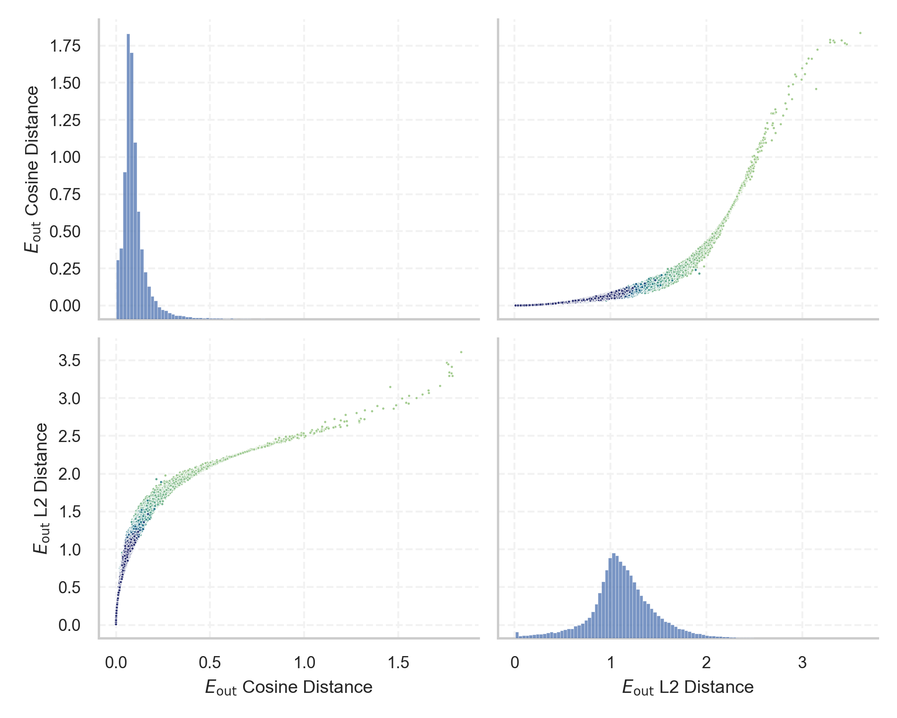
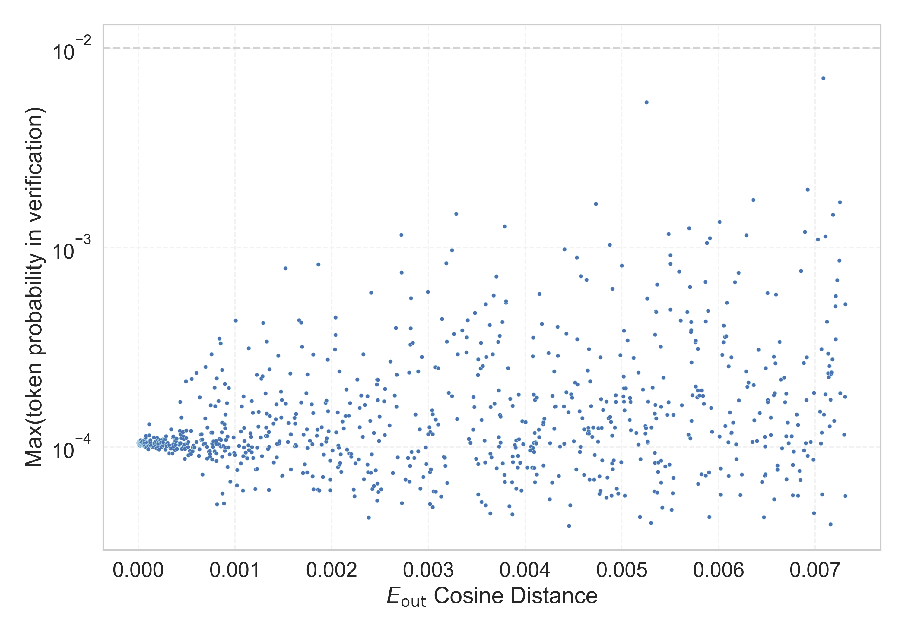

# Report for `checkpoints/step_35000`

## Model info

* Model Info: 
  * Tied embeddings: True
  * LM head uses bias: False
  * Embeddings shape: [50257, 1024]
* Tokenizer Info: 
  * Vocab Size: 50257
  * Tokenizer Class: GPT2Tokenizer
  * Tokenizer Type: BPE
  * Bytes handling: Byte Input
  * Token for verification prompt building: BuyableInstoreAndOnline
  * Token id for verification prompt building: 40242
* Indicator summary: 
  * Indicator for under-trained tokens: E_{out} Cosine Distance
  * Overall distribution: 0.101 +/- 0.092
* Detected Token Counts: 
  * Number of tested under-trained tokens: 1000, 968 non-special, 968 below p = 0.01 threshold, 966 below soft indicator threshold
  * Number of single byte tokens: 256, of which 52 below indicator threshold
  * Number of special tokens: 1, of which 1 below indicator threshold
  * Number of non-single-byte UTF-fragment tokens:  216, of which 49 below soft indicator threshold

## Under-trained token indicators plot


## Verification plot


## Under-trained token verification results
966 entries below threshold of 0.007

|   token_id | token                          |   indicator | max_prob                                                         | in_other_tokens                                                                                                                                                                                          |
|------------|--------------------------------|-------------|------------------------------------------------------------------|----------------------------------------------------------------------------------------------------------------------------------------------------------------------------------------------------------|
|      39756 | ````` inventoryQuantity `````  | 2.44379e-06 | <span style='border: 1px solid rgb(169, 68, 66);'>0.0001</span>  |                                                                                                                                                                                                          |
|      30202 | ````` ▁guiName `````           | 2.6226e-06  | <span style='border: 1px solid rgb(169, 68, 66);'>0.00011</span> |                                                                                                                                                                                                          |
|      42089 | ````` ▁TheNitrome `````        | 2.86102e-06 | <span style='border: 1px solid rgb(169, 68, 66);'>0.00011</span> | <span style='border: 1px solid rgb(169, 68, 66);'>````` ▁TheNitromeFan `````</span>                                                                                                                      |
|      31957 | ````` cffffcc `````            | 3.03984e-06 | <span style='border: 1px solid rgb(169, 68, 66);'>0.0001</span>  |                                                                                                                                                                                                          |
|      30905 | ````` rawdownload `````        | 3.15905e-06 | <span style='border: 1px solid rgb(169, 68, 66);'>0.0001</span>  | ````` rawdownloadcloneembedreportprint `````                                                                                                                                                             |
|      35207 | ````` ▁attRot `````            | 3.21865e-06 | <span style='border: 1px solid rgb(169, 68, 66);'>0.0001</span>  |                                                                                                                                                                                                          |
|      37574 | ````` StreamerBot `````        | 3.21865e-06 | <span style='border: 1px solid rgb(169, 68, 66);'>0.0001</span>  | <span style='border: 1px solid rgb(169, 68, 66);'>````` TPPStreamerBot `````</span>                                                                                                                      |
|      39142 | ````` ThumbnailImage `````     | 3.21865e-06 | <span style='border: 1px solid rgb(169, 68, 66);'>0.0001</span>  | <span style='border: 1px solid rgb(169, 68, 66);'>````` ItemThumbnailImage `````</span>                                                                                                                  |
|      39749 | ````` DeliveryDate `````       | 3.21865e-06 | <span style='border: 1px solid rgb(169, 68, 66);'>0.0001</span>  | <span style='border: 1px solid rgb(169, 68, 66);'>````` soDeliveryDate `````</span>                                                                                                                      |
|      12781 | ````` wcsstore `````           | 3.27826e-06 | <span style='border: 1px solid rgb(169, 68, 66);'>0.0001</span>  |                                                                                                                                                                                                          |
|      38250 | ````` ▁Skydragon `````         | 3.27826e-06 | <span style='border: 1px solid rgb(169, 68, 66);'>0.00011</span> |                                                                                                                                                                                                          |
|      44320 | ````` \n\xa0 `````             | 3.27826e-06 | <span style='border: 1px solid rgb(169, 68, 66);'>0.0001</span>  |                                                                                                                                                                                                          |
|      30898 | ````` embedreportprint `````   | 3.45707e-06 | <span style='border: 1px solid rgb(169, 68, 66);'>0.00011</span> | <span style='border: 1px solid rgb(169, 68, 66);'>````` cloneembedreportprint `````</span>, ````` rawdownloadcloneembedreportprint `````                                                                 |
|      36940 | ````` ▁istg `````              | 3.45707e-06 | <span style='border: 1px solid rgb(169, 68, 66);'>0.0001</span>  |                                                                                                                                                                                                          |
|      17900 | ````` ▁Dragonbound `````       | 3.51667e-06 | <span style='border: 1px solid rgb(169, 68, 66);'>0.00011</span> |                                                                                                                                                                                                          |
|      49731 | ````` ▁EntityItem `````        | 3.51667e-06 | <span style='border: 1px solid rgb(169, 68, 66);'>0.0001</span>  |                                                                                                                                                                                                          |
|      39177 | ````` ItemThumbnailImage ````` | 3.63588e-06 | <span style='border: 1px solid rgb(169, 68, 66);'>0.00011</span> |                                                                                                                                                                                                          |
|      39714 | ````` isSpecial `````          | 3.63588e-06 | <span style='border: 1px solid rgb(169, 68, 66);'>0.0001</span>  | <span style='border: 1px solid rgb(169, 68, 66);'>````` isSpecialOrderable `````</span>                                                                                                                  |
|      30209 | ````` ▁unfocusedRange `````    | 3.69549e-06 | <span style='border: 1px solid rgb(169, 68, 66);'>0.00011</span> |                                                                                                                                                                                                          |
|      11504 | ````` ▁\xa0▁\xa0 `````         | 3.8147e-06  | <span style='border: 1px solid rgb(169, 68, 66);'>0.0001</span>  | <span style='border: 1px solid rgb(169, 68, 66);'>````` ▁\xa0▁\xa0▁\xa0▁\xa0 `````</span>, <span style='border: 1px solid rgb(169, 68, 66);'>````` ▁\xa0▁\xa0▁\xa0▁\xa0▁\xa0▁\xa0▁\xa0▁\xa0 `````</span> |
<details><summary>946 additional entries below threshold</summary>

|   token_id | token                                                                          |   indicator | max_prob                                                         | in_other_tokens                                                                                                                                                                                                                                                                                                                                                                                                                                                                                        |
|------------|--------------------------------------------------------------------------------|-------------|------------------------------------------------------------------|--------------------------------------------------------------------------------------------------------------------------------------------------------------------------------------------------------------------------------------------------------------------------------------------------------------------------------------------------------------------------------------------------------------------------------------------------------------------------------------------------------|
|      23282 | ````` ▁davidjl `````                                                           | 3.8147e-06  | <span style='border: 1px solid rgb(169, 68, 66);'>0.00011</span> |                                                                                                                                                                                                                                                                                                                                                                                                                                                                                                        |
|      24973 | ````` ▁exting `````                                                            | 3.8147e-06  | <span style='border: 1px solid rgb(169, 68, 66);'>0.0001</span>  | ````` ▁extingu `````, ````` ▁extinguished `````                                                                                                                                                                                                                                                                                                                                                                                                                                                        |
|      25658 | ````` ?????- `````                                                             | 3.8147e-06  | <span style='border: 1px solid rgb(169, 68, 66);'>0.0001</span>  | <span style='border: 1px solid rgb(169, 68, 66);'>````` ?????-?????- `````</span>                                                                                                                                                                                                                                                                                                                                                                                                                      |
|      39757 | ````` channelAvailability `````                                                | 3.8147e-06  | <span style='border: 1px solid rgb(169, 68, 66);'>0.00011</span> |                                                                                                                                                                                                                                                                                                                                                                                                                                                                                                        |
|      45544 | ````` ▁サーティ `````                                                          | 3.8147e-06  | <span style='border: 1px solid rgb(169, 68, 66);'>0.0001</span>  | <span style='border: 1px solid rgb(169, 68, 66);'>````` ▁サーティワン `````</span>                                                                                                                                                                                                                                                                                                                                                                                                                     |
|      25193 | ````` NetMessage `````                                                         | 3.8743e-06  | <span style='border: 1px solid rgb(169, 68, 66);'>0.0001</span>  | <span style='border: 1px solid rgb(169, 68, 66);'>````` PsyNetMessage `````</span>                                                                                                                                                                                                                                                                                                                                                                                                                     |
|      31573 | ````` ActionCode `````                                                         | 3.8743e-06  | <span style='border: 1px solid rgb(169, 68, 66);'>0.00011</span> | <span style='border: 1px solid rgb(169, 68, 66);'>````` externalActionCode `````</span>                                                                                                                                                                                                                                                                                                                                                                                                                |
|      47654 | ````` ▁\xa0\xa0 `````                                                          | 3.8743e-06  | <span style='border: 1px solid rgb(169, 68, 66);'>0.00011</span> |                                                                                                                                                                                                                                                                                                                                                                                                                                                                                                        |
|      17811 | ````` \xa0\xa0\xa0\xa0\xa0\xa0\xa0\xa0 `````                                   | 3.93391e-06 | <span style='border: 1px solid rgb(169, 68, 66);'>0.0001</span>  | <span style='border: 1px solid rgb(169, 68, 66);'>````` \xa0\xa0\xa0\xa0\xa0\xa0\xa0\xa0\xa0\xa0\xa0\xa0\xa0\xa0\xa0\xa0 `````</span>                                                                                                                                                                                                                                                                                                                                                                  |
|      30210 | ````` ▁guiActiveUnfocused `````                                                | 3.93391e-06 | <span style='border: 1px solid rgb(169, 68, 66);'>0.0001</span>  |                                                                                                                                                                                                                                                                                                                                                                                                                                                                                                        |
|      36173 | ````` ▁RandomRedditor `````                                                    | 3.93391e-06 | <span style='border: 1px solid rgb(169, 68, 66);'>0.00011</span> | <span style='border: 1px solid rgb(169, 68, 66);'>````` ▁RandomRedditorWithNo `````</span>                                                                                                                                                                                                                                                                                                                                                                                                             |
|      40219 | ````` oreAnd `````                                                             | 3.93391e-06 | <span style='border: 1px solid rgb(169, 68, 66);'>0.0001</span>  | <span style='border: 1px solid rgb(169, 68, 66);'>````` oreAndOnline `````</span>, <span style='border: 1px solid rgb(169, 68, 66);'>````` InstoreAndOnline `````</span>, <span style='border: 1px solid rgb(169, 68, 66);'>````` BuyableInstoreAndOnline `````</span>                                                                                                                                                                                                                                 |
|      45003 | ````` ▁SetTextColor `````                                                      | 3.93391e-06 | <span style='border: 1px solid rgb(169, 68, 66);'>0.0001</span>  |                                                                                                                                                                                                                                                                                                                                                                                                                                                                                                        |
|      47571 | ````` ▁DevOnline `````                                                         | 3.93391e-06 | <span style='border: 1px solid rgb(169, 68, 66);'>0.0001</span>  |                                                                                                                                                                                                                                                                                                                                                                                                                                                                                                        |
|      30439 | ````` ▁unintention `````                                                       | 4.05312e-06 | <span style='border: 1px solid rgb(169, 68, 66);'>0.0001</span>  | ````` ▁unintentionally `````, ````` ▁unintentional `````                                                                                                                                                                                                                                                                                                                                                                                                                                               |
|       1849 | ````` \xa0 `````                                                               | 4.11272e-06 | <span style='border: 1px solid rgb(169, 68, 66);'>0.00011</span> | <span style='border: 1px solid rgb(169, 68, 66);'>````` \xa0\xa0 `````</span>, <span style='border: 1px solid rgb(169, 68, 66);'>````` ▁\xa0 `````</span>, <span style='border: 1px solid rgb(169, 68, 66);'>````` \xa0\xa0\xa0\xa0 `````</span>, <span style='border: 1px solid rgb(169, 68, 66);'>````` ▁\xa0▁\xa0 `````</span>, <span style='border: 1px solid rgb(169, 68, 66);'>````` \xa0\xa0\xa0\xa0\xa0\xa0\xa0\xa0 `````</span>, ...                                                          |
|      21807 | ````` \\\\\\\\ `````                                                           | 4.17233e-06 | <span style='border: 1px solid rgb(169, 68, 66);'>0.00011</span> | <span style='border: 1px solid rgb(169, 68, 66);'>````` \\\\\\\\\\\\\\\\ `````</span>                                                                                                                                                                                                                                                                                                                                                                                                                  |
|      18945 | ````` ▁teasp `````                                                             | 4.23193e-06 | <span style='border: 1px solid rgb(169, 68, 66);'>0.00011</span> | ````` ▁teaspoon `````, ````` ▁teaspoons `````                                                                                                                                                                                                                                                                                                                                                                                                                                                          |
|      30208 | ````` ▁externalTo `````                                                        | 4.29153e-06 | <span style='border: 1px solid rgb(169, 68, 66);'>0.00011</span> | <span style='border: 1px solid rgb(169, 68, 66);'>````` ▁externalToEVA `````</span>, <span style='border: 1px solid rgb(169, 68, 66);'>````` ▁externalToEVAOnly `````</span>                                                                                                                                                                                                                                                                                                                           |
|      49781 | ````` EngineDebug `````                                                        | 4.29153e-06 | <span style='border: 1px solid rgb(169, 68, 66);'>0.0001</span>  |                                                                                                                                                                                                                                                                                                                                                                                                                                                                                                        |
|      45545 | ````` ▁サーティワン `````                                                      | 4.35114e-06 | <span style='border: 1px solid rgb(169, 68, 66);'>0.0001</span>  |                                                                                                                                                                                                                                                                                                                                                                                                                                                                                                        |
|      18472 | ````` ▁guiActive `````                                                         | 4.47035e-06 | <span style='border: 1px solid rgb(169, 68, 66);'>0.00011</span> | <span style='border: 1px solid rgb(169, 68, 66);'>````` ▁guiActiveUn `````</span>, <span style='border: 1px solid rgb(169, 68, 66);'>````` ▁guiActiveUnfocused `````</span>                                                                                                                                                                                                                                                                                                                            |
|      43569 | ````` ÍÍ `````                                                                 | 4.47035e-06 | <span style='border: 1px solid rgb(169, 68, 66);'>0.00011</span> |                                                                                                                                                                                                                                                                                                                                                                                                                                                                                                        |
|      36935 | ````` ▁dstg `````                                                              | 4.52995e-06 | <span style='border: 1px solid rgb(169, 68, 66);'>0.00011</span> |                                                                                                                                                                                                                                                                                                                                                                                                                                                                                                        |
|      41383 | ````` assetsadobe `````                                                        | 4.52995e-06 | <span style='border: 1px solid rgb(169, 68, 66);'>0.0001</span>  |                                                                                                                                                                                                                                                                                                                                                                                                                                                                                                        |
|      37579 | ````` TPPStreamerBot `````                                                     | 4.58956e-06 | <span style='border: 1px solid rgb(169, 68, 66);'>0.0001</span>  |                                                                                                                                                                                                                                                                                                                                                                                                                                                                                                        |
|      48396 | ````` ÛÛ `````                                                                 | 4.58956e-06 | <span style='border: 1px solid rgb(169, 68, 66);'>0.00011</span> |                                                                                                                                                                                                                                                                                                                                                                                                                                                                                                        |
|      25992 | ````` ▁裏覚醒 `````                                                            | 4.70877e-06 | <span style='border: 1px solid rgb(169, 68, 66);'>0.0001</span>  |                                                                                                                                                                                                                                                                                                                                                                                                                                                                                                        |
|       5815 | ````` ÃÂÃÂ `````                                                               | 4.76837e-06 | <span style='border: 1px solid rgb(169, 68, 66);'>0.0001</span>  | <span style='border: 1px solid rgb(169, 68, 66);'>````` ÃÂÃÂÃÂÃÂ `````</span>, <span style='border: 1px solid rgb(169, 68, 66);'>````` ÃÂÃÂÃÂÃÂÃÂÃÂÃÂÃÂ `````</span>, <span style='border: 1px solid rgb(169, 68, 66);'>````` ÃÂÃÂÃÂÃÂÃÂÃÂÃÂÃÂÃÂÃÂÃÂÃÂÃÂÃÂÃÂÃÂ `````</span>, <span style='border: 1px solid rgb(169, 68, 66);'>````` ÃÂÃÂÃÂÃÂÃÂÃÂÃÂÃÂÃÂÃÂÃÂÃÂÃÂÃÂÃÂÃÂÃÂÃÂÃÂÃÂÃÂÃÂÃÂÃÂÃÂÃÂÃÂÃÂÃÂÃÂÃÂÃÂ `````</span>                                                                                     |
|      19476 | ````` ▁carbohyd `````                                                          | 4.76837e-06 | <span style='border: 1px solid rgb(169, 68, 66);'>0.00011</span> | ````` ▁carbohydrate `````, ````` ▁carbohydrates `````                                                                                                                                                                                                                                                                                                                                                                                                                                                  |
|      40240 | ````` oreAndOnline `````                                                       | 4.76837e-06 | <span style='border: 1px solid rgb(169, 68, 66);'>0.00011</span> | <span style='border: 1px solid rgb(169, 68, 66);'>````` InstoreAndOnline `````</span>, <span style='border: 1px solid rgb(169, 68, 66);'>````` BuyableInstoreAndOnline `````</span>                                                                                                                                                                                                                                                                                                                    |
|      36929 | ````` ▁sidx `````                                                              | 4.88758e-06 | <span style='border: 1px solid rgb(169, 68, 66);'>0.0001</span>  |                                                                                                                                                                                                                                                                                                                                                                                                                                                                                                        |
|      22686 | ````` ▁\xa0▁\xa0▁\xa0▁\xa0 `````                                               | 4.94719e-06 | <span style='border: 1px solid rgb(169, 68, 66);'>0.00011</span> | <span style='border: 1px solid rgb(169, 68, 66);'>````` ▁\xa0▁\xa0▁\xa0▁\xa0▁\xa0▁\xa0▁\xa0▁\xa0 `````</span>                                                                                                                                                                                                                                                                                                                                                                                          |
|      46600 | ````` ▁Adinida `````                                                           | 5.00679e-06 | <span style='border: 1px solid rgb(169, 68, 66);'>0.00011</span> |                                                                                                                                                                                                                                                                                                                                                                                                                                                                                                        |
|      15272 | ````` ▁pione `````                                                             | 5.126e-06   | <span style='border: 1px solid rgb(169, 68, 66);'>0.0001</span>  | ````` ▁pioneer `````, ````` ▁pioneering `````, ````` ▁pioneers `````, ````` ▁pioneered `````                                                                                                                                                                                                                                                                                                                                                                                                           |
|      41551 | ````` Downloadha `````                                                         | 5.24521e-06 | <span style='border: 1px solid rgb(169, 68, 66);'>0.0001</span>  |                                                                                                                                                                                                                                                                                                                                                                                                                                                                                                        |
|      24847 | ````` ModLoader `````                                                          | 5.36442e-06 | <span style='border: 1px solid rgb(169, 68, 66);'>0.0001</span>  | <span style='border: 1px solid rgb(169, 68, 66);'>````` ForgeModLoader `````</span>                                                                                                                                                                                                                                                                                                                                                                                                                    |
|      40242 | ````` BuyableInstoreAndOnline `````                                            | 5.36442e-06 | <span style='border: 1px solid rgb(169, 68, 66);'>0.00011</span> |                                                                                                                                                                                                                                                                                                                                                                                                                                                                                                        |
|      42090 | ````` ▁TheNitromeFan `````                                                     | 5.60284e-06 | <span style='border: 1px solid rgb(169, 68, 66);'>0.00011</span> |                                                                                                                                                                                                                                                                                                                                                                                                                                                                                                        |
|      30212 | ````` ▁externalToEVA `````                                                     | 5.84126e-06 | <span style='border: 1px solid rgb(169, 68, 66);'>0.0001</span>  | <span style='border: 1px solid rgb(169, 68, 66);'>````` ▁externalToEVAOnly `````</span>                                                                                                                                                                                                                                                                                                                                                                                                                |
|      25502 | ````` ItemImage `````                                                          | 5.96046e-06 | <span style='border: 1px solid rgb(169, 68, 66);'>0.0001</span>  |                                                                                                                                                                                                                                                                                                                                                                                                                                                                                                        |
|      36862 | ````` EMOTE `````                                                              | 5.96046e-06 | <span style='border: 1px solid rgb(169, 68, 66);'>0.00011</span> |                                                                                                                                                                                                                                                                                                                                                                                                                                                                                                        |
|      34448 | ````` ▁ItemLevel `````                                                         | 6.02007e-06 | <span style='border: 1px solid rgb(169, 68, 66);'>0.0001</span>  |                                                                                                                                                                                                                                                                                                                                                                                                                                                                                                        |
|      33454 | ````` 龍喚士 `````                                                             | 6.19888e-06 | <span style='border: 1px solid rgb(169, 68, 66);'>0.00011</span> |                                                                                                                                                                                                                                                                                                                                                                                                                                                                                                        |
|      38370 | ````` iHUD `````                                                               | 6.19888e-06 | <span style='border: 1px solid rgb(169, 68, 66);'>0.00011</span> |                                                                                                                                                                                                                                                                                                                                                                                                                                                                                                        |
|      47198 | ````` ItemTracker `````                                                        | 6.31809e-06 | <span style='border: 1px solid rgb(169, 68, 66);'>0.0001</span>  |                                                                                                                                                                                                                                                                                                                                                                                                                                                                                                        |
|      28666 | ````` PsyNetMessage `````                                                      | 6.4373e-06  | <span style='border: 1px solid rgb(169, 68, 66);'>0.0001</span>  |                                                                                                                                                                                                                                                                                                                                                                                                                                                                                                        |
|      30897 | ````` reportprint `````                                                        | 6.67572e-06 | <span style='border: 1px solid rgb(169, 68, 66);'>0.0001</span>  | <span style='border: 1px solid rgb(169, 68, 66);'>````` embedreportprint `````</span>, <span style='border: 1px solid rgb(169, 68, 66);'>````` cloneembedreportprint `````</span>, ````` rawdownloadcloneembedreportprint `````                                                                                                                                                                                                                                                                        |
|      50009 | ````` ▁strutConnector `````                                                    | 6.67572e-06 | <span style='border: 1px solid rgb(169, 68, 66);'>0.0001</span>  |                                                                                                                                                                                                                                                                                                                                                                                                                                                                                                        |
|      36174 | ````` ▁RandomRedditorWithNo `````                                              | 6.85453e-06 | <span style='border: 1px solid rgb(169, 68, 66);'>0.00011</span> |                                                                                                                                                                                                                                                                                                                                                                                                                                                                                                        |
|      35579 | ````` ▁Mechdragon `````                                                        | 6.97374e-06 | <span style='border: 1px solid rgb(169, 68, 66);'>0.00011</span> |                                                                                                                                                                                                                                                                                                                                                                                                                                                                                                        |
|      39172 | ````` \xa0\xa0\xa0\xa0\xa0\xa0\xa0\xa0\xa0\xa0\xa0\xa0\xa0\xa0\xa0\xa0 `````   | 7.09295e-06 | <span style='border: 1px solid rgb(169, 68, 66);'>0.0001</span>  |                                                                                                                                                                                                                                                                                                                                                                                                                                                                                                        |
|      42202 | ````` GoldMagikarp `````                                                       | 7.09295e-06 | <span style='border: 1px solid rgb(169, 68, 66);'>0.0001</span>  | <span style='border: 1px solid rgb(169, 68, 66);'>````` ▁SolidGoldMagikarp `````</span>                                                                                                                                                                                                                                                                                                                                                                                                                |
|      39753 | ````` quickShipAvailable `````                                                 | 7.15256e-06 | <span style='border: 1px solid rgb(169, 68, 66);'>0.0001</span>  |                                                                                                                                                                                                                                                                                                                                                                                                                                                                                                        |
|      33477 | ````` \xa0\xa0\xa0 `````                                                       | 7.27177e-06 | <span style='border: 1px solid rgb(169, 68, 66);'>0.0001</span>  | <span style='border: 1px solid rgb(169, 68, 66);'>````` \xa0\xa0\xa0\xa0\xa0\xa0\xa0\xa0\xa0\xa0\xa0\xa0\xa0\xa0\xa0\xa0 `````</span>                                                                                                                                                                                                                                                                                                                                                                  |
|      39752 | ````` quickShip `````                                                          | 7.39098e-06 | <span style='border: 1px solid rgb(169, 68, 66);'>0.00011</span> | <span style='border: 1px solid rgb(169, 68, 66);'>````` quickShipAvailable `````</span>                                                                                                                                                                                                                                                                                                                                                                                                                |
|      43177 | ````` EStreamFrame `````                                                       | 7.51019e-06 | <span style='border: 1px solid rgb(169, 68, 66);'>0.0001</span>  |                                                                                                                                                                                                                                                                                                                                                                                                                                                                                                        |
|      31765 | ````` MpServer `````                                                           | 7.56979e-06 | <span style='border: 1px solid rgb(169, 68, 66);'>0.00011</span> |                                                                                                                                                                                                                                                                                                                                                                                                                                                                                                        |
|      34027 | ````` ▁actionGroup `````                                                       | 7.689e-06   | <span style='border: 1px solid rgb(169, 68, 66);'>0.00011</span> |                                                                                                                                                                                                                                                                                                                                                                                                                                                                                                        |
|      30211 | ````` ▁guiIcon `````                                                           | 8.04663e-06 | <span style='border: 1px solid rgb(169, 68, 66);'>0.0001</span>  |                                                                                                                                                                                                                                                                                                                                                                                                                                                                                                        |
|      42586 | ````` ▁srfN `````                                                              | 8.16584e-06 | <span style='border: 1px solid rgb(169, 68, 66);'>0.00011</span> |                                                                                                                                                                                                                                                                                                                                                                                                                                                                                                        |
|      39803 | ````` soType `````                                                             | 8.22544e-06 | <span style='border: 1px solid rgb(169, 68, 66);'>0.0001</span>  |                                                                                                                                                                                                                                                                                                                                                                                                                                                                                                        |
|      43453 | ````` ▁SolidGoldMagikarp `````                                                 | 8.22544e-06 | <span style='border: 1px solid rgb(169, 68, 66);'>0.00011</span> |                                                                                                                                                                                                                                                                                                                                                                                                                                                                                                        |
|      32310 | ````` sbm `````                                                                | 8.82149e-06 | <span style='border: 1px solid rgb(169, 68, 66);'>0.0001</span>  |                                                                                                                                                                                                                                                                                                                                                                                                                                                                                                        |
|      39755 | ````` isSpecialOrderable `````                                                 | 9.0003e-06  | <span style='border: 1px solid rgb(169, 68, 66);'>0.0001</span>  |                                                                                                                                                                                                                                                                                                                                                                                                                                                                                                        |
|      39906 | ````` EStream `````                                                            | 9.05991e-06 | <span style='border: 1px solid rgb(169, 68, 66);'>0.00011</span> | <span style='border: 1px solid rgb(169, 68, 66);'>````` EStreamFrame `````</span>                                                                                                                                                                                                                                                                                                                                                                                                                      |
|      37842 | ````` ▁partName `````                                                          | 9.11951e-06 | <span style='border: 1px solid rgb(169, 68, 66);'>0.00011</span> |                                                                                                                                                                                                                                                                                                                                                                                                                                                                                                        |
|      31666 | ````` ?????-?????- `````                                                       | 9.41753e-06 | <span style='border: 1px solid rgb(169, 68, 66);'>0.0001</span>  |                                                                                                                                                                                                                                                                                                                                                                                                                                                                                                        |
|      48069 | ````` *=- `````                                                                | 9.41753e-06 | <span style='border: 1px solid rgb(169, 68, 66);'>0.00011</span> |                                                                                                                                                                                                                                                                                                                                                                                                                                                                                                        |
|      36886 | ````` STDOUT `````                                                             | 9.89437e-06 | <span style='border: 1px solid rgb(169, 68, 66);'>0.00011</span> |                                                                                                                                                                                                                                                                                                                                                                                                                                                                                                        |
|      40278 | ````` */( `````                                                                | 1.00732e-05 | <span style='border: 1px solid rgb(169, 68, 66);'>0.00011</span> |                                                                                                                                                                                                                                                                                                                                                                                                                                                                                                        |
|      34206 | ````` #$#$ `````                                                               | 1.03116e-05 | <span style='border: 1px solid rgb(169, 68, 66);'>0.0001</span>  |                                                                                                                                                                                                                                                                                                                                                                                                                                                                                                        |
|       9364 | ````` ÃÂÃÂÃÂÃÂ `````                                                           | 1.055e-05   | <span style='border: 1px solid rgb(169, 68, 66);'>0.0001</span>  | <span style='border: 1px solid rgb(169, 68, 66);'>````` ÃÂÃÂÃÂÃÂÃÂÃÂÃÂÃÂ `````</span>, <span style='border: 1px solid rgb(169, 68, 66);'>````` ÃÂÃÂÃÂÃÂÃÂÃÂÃÂÃÂÃÂÃÂÃÂÃÂÃÂÃÂÃÂÃÂ `````</span>, <span style='border: 1px solid rgb(169, 68, 66);'>````` ÃÂÃÂÃÂÃÂÃÂÃÂÃÂÃÂÃÂÃÂÃÂÃÂÃÂÃÂÃÂÃÂÃÂÃÂÃÂÃÂÃÂÃÂÃÂÃÂÃÂÃÂÃÂÃÂÃÂÃÂÃÂÃÂ `````</span>                                                                                                                                                                    |
|      45706 | ````` ▁\xa0▁\xa0▁\xa0▁\xa0▁\xa0▁\xa0▁\xa0▁\xa0 `````                           | 1.055e-05   | <span style='border: 1px solid rgb(169, 68, 66);'>0.0001</span>  |                                                                                                                                                                                                                                                                                                                                                                                                                                                                                                        |
|      37444 | ````` ▁petertodd `````                                                         | 1.0848e-05  | <span style='border: 1px solid rgb(169, 68, 66);'>0.00011</span> |                                                                                                                                                                                                                                                                                                                                                                                                                                                                                                        |
|      41380 | ````` natureconservancy `````                                                  | 1.09673e-05 | <span style='border: 1px solid rgb(169, 68, 66);'>0.0001</span>  |                                                                                                                                                                                                                                                                                                                                                                                                                                                                                                        |
|      17629 | ````` ▁practition `````                                                        | 1.10269e-05 | <span style='border: 1px solid rgb(169, 68, 66);'>0.0001</span>  | ````` ▁practitioners `````, ````` ▁practitioner `````                                                                                                                                                                                                                                                                                                                                                                                                                                                  |
|      33813 | ````` =~=~ `````                                                               | 1.13845e-05 | <span style='border: 1px solid rgb(169, 68, 66);'>0.0001</span>  |                                                                                                                                                                                                                                                                                                                                                                                                                                                                                                        |
|      43065 | ````` ▁srfAttach `````                                                         | 1.13845e-05 | <span style='border: 1px solid rgb(169, 68, 66);'>0.0001</span>  |                                                                                                                                                                                                                                                                                                                                                                                                                                                                                                        |
|       4603 | ````` \xa0\xa0 `````                                                           | 1.14441e-05 | <span style='border: 1px solid rgb(169, 68, 66);'>0.0001</span>  | <span style='border: 1px solid rgb(169, 68, 66);'>````` \xa0\xa0\xa0\xa0 `````</span>, <span style='border: 1px solid rgb(169, 68, 66);'>````` \xa0\xa0\xa0\xa0\xa0\xa0\xa0\xa0 `````</span>, <span style='border: 1px solid rgb(169, 68, 66);'>````` \xa0\xa0\xa0 `````</span>, <span style='border: 1px solid rgb(169, 68, 66);'>````` \xa0\xa0\xa0\xa0\xa0\xa0\xa0\xa0\xa0\xa0\xa0\xa0\xa0\xa0\xa0\xa0 `````</span>, <span style='border: 1px solid rgb(169, 68, 66);'>````` ▁\xa0\xa0 `````</span> |
|      11689 | ````` ▁unnecess `````                                                          | 1.20401e-05 | <span style='border: 1px solid rgb(169, 68, 66);'>0.00011</span> | ````` ▁unnecessary `````, ````` ▁unnecessarily `````                                                                                                                                                                                                                                                                                                                                                                                                                                                   |
|       5624 | ````` ▁\xa0 `````                                                              | 1.20997e-05 | <span style='border: 1px solid rgb(169, 68, 66);'>0.0001</span>  | <span style='border: 1px solid rgb(169, 68, 66);'>````` ▁\xa0▁\xa0 `````</span>, <span style='border: 1px solid rgb(169, 68, 66);'>````` ▁\xa0▁\xa0▁\xa0▁\xa0 `````</span>, <span style='border: 1px solid rgb(169, 68, 66);'>````` ▁\xa0▁\xa0▁\xa0▁\xa0▁\xa0▁\xa0▁\xa0▁\xa0 `````</span>, <span style='border: 1px solid rgb(169, 68, 66);'>````` ▁\xa0\xa0 `````</span>                                                                                                                              |
|      32047 | ````` ▁"$:/ `````                                                              | 1.2219e-05  | <span style='border: 1px solid rgb(169, 68, 66);'>0.0001</span>  |                                                                                                                                                                                                                                                                                                                                                                                                                                                                                                        |
|      20554 | ````` ▁unbeliev `````                                                          | 1.2517e-05  | <span style='border: 1px solid rgb(169, 68, 66);'>0.0001</span>  | ````` ▁unbelievable `````, ````` ▁unbelievably `````                                                                                                                                                                                                                                                                                                                                                                                                                                                   |
|      12677 | ````` ▁tradem `````                                                            | 1.25766e-05 | <span style='border: 1px solid rgb(169, 68, 66);'>0.00011</span> | ````` ▁trademark `````, ````` ▁trademarks `````                                                                                                                                                                                                                                                                                                                                                                                                                                                        |
|      36938 | ````` ▁sqor `````                                                              | 1.27554e-05 | <span style='border: 1px solid rgb(169, 68, 66);'>0.0001</span>  |                                                                                                                                                                                                                                                                                                                                                                                                                                                                                                        |
|      39811 | ````` soDeliveryDate `````                                                     | 1.33514e-05 | <span style='border: 1px solid rgb(169, 68, 66);'>0.0001</span>  |                                                                                                                                                                                                                                                                                                                                                                                                                                                                                                        |
|      34842 | ````` ▁isEnabled `````                                                         | 1.35303e-05 | <span style='border: 1px solid rgb(169, 68, 66);'>0.00011</span> |                                                                                                                                                                                                                                                                                                                                                                                                                                                                                                        |
|      40241 | ````` InstoreAndOnline `````                                                   | 1.40667e-05 | <span style='border: 1px solid rgb(169, 68, 66);'>0.00011</span> | <span style='border: 1px solid rgb(169, 68, 66);'>````` BuyableInstoreAndOnline `````</span>                                                                                                                                                                                                                                                                                                                                                                                                           |
|      36926 | ````` ▁attm `````                                                              | 1.48416e-05 | <span style='border: 1px solid rgb(169, 68, 66);'>0.00011</span> |                                                                                                                                                                                                                                                                                                                                                                                                                                                                                                        |
|      39821 | ````` 龍契士 `````                                                             | 1.49012e-05 | <span style='border: 1px solid rgb(169, 68, 66);'>0.00011</span> |                                                                                                                                                                                                                                                                                                                                                                                                                                                                                                        |
|      42424 | ````` DragonMagazine `````                                                     | 1.50204e-05 | <span style='border: 1px solid rgb(169, 68, 66);'>0.00011</span> |                                                                                                                                                                                                                                                                                                                                                                                                                                                                                                        |
|       8828 | ````` \xa0\xa0\xa0\xa0 `````                                                   | 1.53184e-05 | <span style='border: 1px solid rgb(169, 68, 66);'>0.0001</span>  | <span style='border: 1px solid rgb(169, 68, 66);'>````` \xa0\xa0\xa0\xa0\xa0\xa0\xa0\xa0 `````</span>, <span style='border: 1px solid rgb(169, 68, 66);'>````` \xa0\xa0\xa0\xa0\xa0\xa0\xa0\xa0\xa0\xa0\xa0\xa0\xa0\xa0\xa0\xa0 `````</span>                                                                                                                                                                                                                                                           |
|      39446 | ````` ▁SetFontSize `````                                                       | 1.53184e-05 | <span style='border: 1px solid rgb(169, 68, 66);'>0.00011</span> |                                                                                                                                                                                                                                                                                                                                                                                                                                                                                                        |
|      32917 | ````` aution `````                                                             | 1.5974e-05  | <span style='border: 1px solid rgb(169, 68, 66);'>0.00011</span> | ````` ▁precaution `````, ````` ▁cautioned `````                                                                                                                                                                                                                                                                                                                                                                                                                                                        |
|      24934 | ````` ForgeModLoader `````                                                     | 1.60336e-05 | <span style='border: 1px solid rgb(169, 68, 66);'>0.00011</span> |                                                                                                                                                                                                                                                                                                                                                                                                                                                                                                        |
|      14827 | ````` ÃÂÃÂÃÂÃÂÃÂÃÂÃÂÃÂ `````                                                   | 1.69873e-05 | <span style='border: 1px solid rgb(169, 68, 66);'>0.0001</span>  | <span style='border: 1px solid rgb(169, 68, 66);'>````` ÃÂÃÂÃÂÃÂÃÂÃÂÃÂÃÂÃÂÃÂÃÂÃÂÃÂÃÂÃÂÃÂ `````</span>, <span style='border: 1px solid rgb(169, 68, 66);'>````` ÃÂÃÂÃÂÃÂÃÂÃÂÃÂÃÂÃÂÃÂÃÂÃÂÃÂÃÂÃÂÃÂÃÂÃÂÃÂÃÂÃÂÃÂÃÂÃÂÃÂÃÂÃÂÃÂÃÂÃÂÃÂÃÂ `````</span>                                                                                                                                                                                                                                                           |
|      30899 | ````` cloneembedreportprint `````                                              | 1.72853e-05 | <span style='border: 1px solid rgb(169, 68, 66);'>0.0001</span>  | ````` rawdownloadcloneembedreportprint `````                                                                                                                                                                                                                                                                                                                                                                                                                                                           |
|      35496 | ````` ÃÂÃÂÃÂÃÂÃÂÃÂÃÂÃÂÃÂÃÂÃÂÃÂÃÂÃÂÃÂÃÂÃÂÃÂÃÂÃÂÃÂÃÂÃÂÃÂÃÂÃÂÃÂÃÂÃÂÃÂÃÂÃÂ `````   | 1.7643e-05  | <span style='border: 1px solid rgb(169, 68, 66);'>0.0001</span>  |                                                                                                                                                                                                                                                                                                                                                                                                                                                                                                        |
|      32437 | ````` ▁Smartstocks `````                                                       | 1.78218e-05 | <span style='border: 1px solid rgb(169, 68, 66);'>0.00011</span> |                                                                                                                                                                                                                                                                                                                                                                                                                                                                                                        |
|       4690 | ````` ortunately `````                                                         | 1.78814e-05 | <span style='border: 1px solid rgb(169, 68, 66);'>0.0001</span>  | ````` fortunately `````, ````` ▁Unfortunately `````, ````` ▁unfortunately `````, ````` Unfortunately `````, ````` ▁Fortunately `````, ...                                                                                                                                                                                                                                                                                                                                                              |
|      27006 | ````` ¯¯¯¯¯¯¯¯¯¯¯¯¯¯¯¯ `````                                                   | 1.83582e-05 | <span style='border: 1px solid rgb(169, 68, 66);'>0.0001</span>  |                                                                                                                                                                                                                                                                                                                                                                                                                                                                                                        |
|      41868 | ````` ▁Cosponsors `````                                                        | 1.98483e-05 | <span style='border: 1px solid rgb(169, 68, 66);'>0.0001</span>  |                                                                                                                                                                                                                                                                                                                                                                                                                                                                                                        |
|      43361 | ````` ゼウス `````                                                             | 2.2471e-05  | <span style='border: 1px solid rgb(169, 68, 66);'>0.00011</span> |                                                                                                                                                                                                                                                                                                                                                                                                                                                                                                        |
|       8980 | ````` ¯¯¯¯ `````                                                               | 2.25902e-05 | <span style='border: 1px solid rgb(169, 68, 66);'>0.00011</span> | <span style='border: 1px solid rgb(169, 68, 66);'>````` ¯¯¯¯¯¯¯¯ `````</span>, <span style='border: 1px solid rgb(169, 68, 66);'>````` ¯¯¯¯¯¯¯¯¯¯¯¯¯¯¯¯ `````</span>                                                                                                                                                                                                                                                                                                                                   |
|      27013 | ````` aditional `````                                                          | 2.33054e-05 | <span style='border: 1px solid rgb(169, 68, 66);'>0.00011</span> | ````` ▁Traditional `````, ````` traditional `````, ````` Traditional `````                                                                                                                                                                                                                                                                                                                                                                                                                             |
|      34604 | ````` \\\\\\\\\\\\\\\\ `````                                                   | 2.51532e-05 | <span style='border: 1px solid rgb(169, 68, 66);'>0.0001</span>  |                                                                                                                                                                                                                                                                                                                                                                                                                                                                                                        |
|      45392 | ````` dayName `````                                                            | 2.58684e-05 | <span style='border: 1px solid rgb(169, 68, 66);'>0.00011</span> |                                                                                                                                                                                                                                                                                                                                                                                                                                                                                                        |
|      43010 | ````` ▁Kinnikuman `````                                                        | 2.67625e-05 | <span style='border: 1px solid rgb(169, 68, 66);'>0.0001</span>  |                                                                                                                                                                                                                                                                                                                                                                                                                                                                                                        |
|      30213 | ````` ▁externalToEVAOnly `````                                                 | 2.72989e-05 | <span style='border: 1px solid rgb(169, 68, 66);'>0.00011</span> |                                                                                                                                                                                                                                                                                                                                                                                                                                                                                                        |
|      37631 | ````` FactoryReloaded `````                                                    | 2.75373e-05 | <span style='border: 1px solid rgb(169, 68, 66);'>0.0001</span>  |                                                                                                                                                                                                                                                                                                                                                                                                                                                                                                        |
|      11592 | ````` ▁``( `````                                                               | 2.76566e-05 | <span style='border: 1px solid rgb(169, 68, 66);'>0.00011</span> |                                                                                                                                                                                                                                                                                                                                                                                                                                                                                                        |
|      40236 | ````` FINEST `````                                                             | 2.89083e-05 | <span style='border: 1px solid rgb(169, 68, 66);'>0.0001</span>  |                                                                                                                                                                                                                                                                                                                                                                                                                                                                                                        |
|      47182 | ````` ":""},{" `````                                                           | 2.89083e-05 | <span style='border: 1px solid rgb(169, 68, 66);'>0.00011</span> |                                                                                                                                                                                                                                                                                                                                                                                                                                                                                                        |
|      29372 | ````` ▁guiActiveUn `````                                                       | 3.03984e-05 | <span style='border: 1px solid rgb(169, 68, 66);'>0.0001</span>  | <span style='border: 1px solid rgb(169, 68, 66);'>````` ▁guiActiveUnfocused `````</span>                                                                                                                                                                                                                                                                                                                                                                                                               |
|      41297 | ````` ▁TAMADRA `````                                                           | 3.57032e-05 | <span style='border: 1px solid rgb(169, 68, 66);'>0.00011</span> |                                                                                                                                                                                                                                                                                                                                                                                                                                                                                                        |
|      33153 | ````` ```` `````                                                               | 3.74317e-05 | <span style='border: 1px solid rgb(169, 68, 66);'>0.0001</span>  |                                                                                                                                                                                                                                                                                                                                                                                                                                                                                                        |
|      15243 | ````` ¯¯¯¯¯¯¯¯ `````                                                           | 3.97563e-05 | <span style='border: 1px solid rgb(169, 68, 66);'>0.0001</span>  | <span style='border: 1px solid rgb(169, 68, 66);'>````` ¯¯¯¯¯¯¯¯¯¯¯¯¯¯¯¯ `````</span>                                                                                                                                                                                                                                                                                                                                                                                                                  |
|       5367 | ````` ¯¯ `````                                                                 | 4.57168e-05 | <span style='border: 1px solid rgb(169, 68, 66);'>0.0001</span>  | <span style='border: 1px solid rgb(169, 68, 66);'>````` ¯¯¯¯ `````</span>, <span style='border: 1px solid rgb(169, 68, 66);'>````` ¯¯¯¯¯¯¯¯ `````</span>, <span style='border: 1px solid rgb(169, 68, 66);'>````` ¯¯¯¯¯¯¯¯¯¯¯¯¯¯¯¯ `````</span>                                                                                                                                                                                                                                                        |
|      42943 | ````` ?」 `````                                                                | 4.8697e-05  | <span style='border: 1px solid rgb(169, 68, 66);'>0.0001</span>  |                                                                                                                                                                                                                                                                                                                                                                                                                                                                                                        |
|      36473 | ````` luaj `````                                                               | 4.93526e-05 | <span style='border: 1px solid rgb(169, 68, 66);'>0.00011</span> |                                                                                                                                                                                                                                                                                                                                                                                                                                                                                                        |
|      23614 | ````` 覚醒 `````                                                               | 5.23329e-05 | <span style='border: 1px solid rgb(169, 68, 66);'>0.0001</span>  | <span style='border: 1px solid rgb(169, 68, 66);'>````` ▁裏覚醒 `````</span>                                                                                                                                                                                                                                                                                                                                                                                                                           |
|      47975 | ````` bleacher `````                                                           | 5.34058e-05 | <span style='border: 1px solid rgb(169, 68, 66);'>0.0001</span>  |                                                                                                                                                                                                                                                                                                                                                                                                                                                                                                        |
|      43735 | ````` .」 `````                                                                | 5.47171e-05 | <span style='border: 1px solid rgb(169, 68, 66);'>0.0001</span>  |                                                                                                                                                                                                                                                                                                                                                                                                                                                                                                        |
|       7105 | ````` ▁volunte `````                                                           | 5.96046e-05 | <span style='border: 1px solid rgb(169, 68, 66);'>0.0001</span>  | ````` ▁volunteers `````, ````` ▁volunteer `````, ````` ▁volunteered `````, ````` ▁volunteering `````                                                                                                                                                                                                                                                                                                                                                                                                   |
|      26642 | ````` tnc `````                                                                | 5.96642e-05 | <span style='border: 1px solid rgb(169, 68, 66);'>0.0001</span>  |                                                                                                                                                                                                                                                                                                                                                                                                                                                                                                        |
|      39693 | ````` Buyable `````                                                            | 6.38366e-05 | <span style='border: 1px solid rgb(169, 68, 66);'>0.00011</span> | <span style='border: 1px solid rgb(169, 68, 66);'>````` BuyableInstoreAndOnline `````</span>                                                                                                                                                                                                                                                                                                                                                                                                           |
|      43298 | ````` userc `````                                                              | 6.39558e-05 | <span style='border: 1px solid rgb(169, 68, 66);'>0.00011</span> | ````` usercontent `````                                                                                                                                                                                                                                                                                                                                                                                                                                                                                |
|      34473 | ````` ヘラ `````                                                               | 6.4075e-05  | <span style='border: 1px solid rgb(169, 68, 66);'>0.00011</span> |                                                                                                                                                                                                                                                                                                                                                                                                                                                                                                        |
|      44392 | ````` ▁cumbers `````                                                           | 6.55651e-05 | <span style='border: 1px solid rgb(169, 68, 66);'>0.00011</span> | ````` ▁cumbersome `````                                                                                                                                                                                                                                                                                                                                                                                                                                                                                |
|      48193 | ````` @#& `````                                                                | 7.00951e-05 | <span style='border: 1px solid rgb(169, 68, 66);'>0.0001</span>  |                                                                                                                                                                                                                                                                                                                                                                                                                                                                                                        |
|      42066 | ````` Nitrome `````                                                            | 7.35521e-05 | <span style='border: 1px solid rgb(169, 68, 66);'>0.00011</span> | <span style='border: 1px solid rgb(169, 68, 66);'>````` ▁TheNitrome `````</span>, <span style='border: 1px solid rgb(169, 68, 66);'>````` ▁TheNitromeFan `````</span>                                                                                                                                                                                                                                                                                                                                  |
|      43038 | ````` ▁Okawaru `````                                                           | 7.48038e-05 | <span style='border: 1px solid rgb(169, 68, 66);'>0.00011</span> |                                                                                                                                                                                                                                                                                                                                                                                                                                                                                                        |
|      34516 | ````` >>\ `````                                                                | 7.689e-05   | <span style='border: 1px solid rgb(169, 68, 66);'>0.00011</span> |                                                                                                                                                                                                                                                                                                                                                                                                                                                                                                        |
|      13296 | ````` ▁Leban `````                                                             | 7.85589e-05 | <span style='border: 1px solid rgb(169, 68, 66);'>0.00011</span> | ````` ▁Lebanon `````, ````` ▁Lebanese `````                                                                                                                                                                                                                                                                                                                                                                                                                                                            |
|       6681 | ````` ▁withd `````                                                             | 8.14199e-05 | <span style='border: 1px solid rgb(169, 68, 66);'>0.0001</span>  | ````` ▁withdraw `````, ````` ▁withdrawal `````, ````` ▁withdrawn `````, ````` ▁withdrew `````, ````` ▁withdrawing `````, ...                                                                                                                                                                                                                                                                                                                                                                           |
|      39165 | ````` catentry `````                                                           | 8.86917e-05 | <span style='border: 1px solid rgb(169, 68, 66);'>0.00011</span> |                                                                                                                                                                                                                                                                                                                                                                                                                                                                                                        |
|      24307 | ````` ▁looph `````                                                             | 0.000100493 | <span style='border: 1px solid rgb(169, 68, 66);'>0.0001</span>  | ````` ▁loophole `````, ````` ▁loopholes `````                                                                                                                                                                                                                                                                                                                                                                                                                                                          |
|      15755 | ````` ▁millenn `````                                                           | 0.000102401 | <span style='border: 1px solid rgb(169, 68, 66);'>9.8e-05</span> | ````` ▁millennials `````, ````` ▁millennia `````, ````` ▁millennium `````, ````` ▁millennial `````                                                                                                                                                                                                                                                                                                                                                                                                     |
|      50113 | ````` .''. `````                                                               | 0.000103772 | <span style='border: 1px solid rgb(169, 68, 66);'>0.0001</span>  |                                                                                                                                                                                                                                                                                                                                                                                                                                                                                                        |
|      11910 | ````` ngth `````                                                               | 0.000110507 | <span style='border: 1px solid rgb(169, 68, 66);'>0.00011</span> | ````` ▁strengthen `````, ````` length `````, ````` ▁Strength `````, ````` ▁lengthy `````, ````` ▁strengths `````, ...                                                                                                                                                                                                                                                                                                                                                                                  |
|      23711 | ````` ▁Moroc `````                                                             | 0.000111878 | <span style='border: 1px solid rgb(169, 68, 66);'>0.00013</span> | ````` ▁Morocco `````, ````` ▁Moroccan `````                                                                                                                                                                                                                                                                                                                                                                                                                                                            |
|      48366 | ````` ◼ `````                                                                  | 0.000112653 | <span style='border: 1px solid rgb(169, 68, 66);'>0.00011</span> |                                                                                                                                                                                                                                                                                                                                                                                                                                                                                                        |
|      44555 | ````` ▁Archdemon `````                                                         | 0.000120103 | <span style='border: 1px solid rgb(169, 68, 66);'>0.00011</span> |                                                                                                                                                                                                                                                                                                                                                                                                                                                                                                        |
|      42889 | ````` ikuman `````                                                             | 0.000122666 | <span style='border: 1px solid rgb(169, 68, 66);'>0.00011</span> | <span style='border: 1px solid rgb(169, 68, 66);'>````` ▁Kinnikuman `````</span>                                                                                                                                                                                                                                                                                                                                                                                                                       |
|      38626 | ````` ▓ `````                                                                  | 0.000123918 | <span style='border: 1px solid rgb(169, 68, 66);'>0.0001</span>  |                                                                                                                                                                                                                                                                                                                                                                                                                                                                                                        |
|       7601 | ````` ▁proport `````                                                           | 0.00012511  | <span style='border: 1px solid rgb(169, 68, 66);'>0.0001</span>  | ````` ▁proportion `````, ````` ▁proportions `````, ````` ▁proportional `````                                                                                                                                                                                                                                                                                                                                                                                                                           |
|      12943 | ````` ▁encount `````                                                           | 0.000129342 | <span style='border: 1px solid rgb(169, 68, 66);'>0.0001</span>  | ````` ▁encountered `````, ````` ▁encounters `````, ````` ▁encountering `````                                                                                                                                                                                                                                                                                                                                                                                                                           |
|      42470 | ````` TextColor `````                                                          | 0.000141621 | <span style='border: 1px solid rgb(169, 68, 66);'>0.0001</span>  | <span style='border: 1px solid rgb(169, 68, 66);'>````` ▁SetTextColor `````</span>                                                                                                                                                                                                                                                                                                                                                                                                                     |
|      23090 | ````` ÃÂÃÂÃÂÃÂÃÂÃÂÃÂÃÂÃÂÃÂÃÂÃÂÃÂÃÂÃÂÃÂ `````                                   | 0.000142753 | <span style='border: 1px solid rgb(169, 68, 66);'>0.0001</span>  | <span style='border: 1px solid rgb(169, 68, 66);'>````` ÃÂÃÂÃÂÃÂÃÂÃÂÃÂÃÂÃÂÃÂÃÂÃÂÃÂÃÂÃÂÃÂÃÂÃÂÃÂÃÂÃÂÃÂÃÂÃÂÃÂÃÂÃÂÃÂÃÂÃÂÃÂÃÂ `````</span>                                                                                                                                                                                                                                                                                                                                                                  |
|      39655 | ````` Orderable `````                                                          | 0.000154257 | <span style='border: 1px solid rgb(169, 68, 66);'>0.0001</span>  | <span style='border: 1px solid rgb(169, 68, 66);'>````` isSpecialOrderable `````</span>                                                                                                                                                                                                                                                                                                                                                                                                                |
|      13198 | ````` ▁earthqu `````                                                           | 0.000159144 | <span style='border: 1px solid rgb(169, 68, 66);'>0.00011</span> | ````` ▁earthquake `````, ````` ▁earthquakes `````                                                                                                                                                                                                                                                                                                                                                                                                                                                      |
|      47682 | ````` ,,,,,,,, `````                                                           | 0.000162542 | <span style='border: 1px solid rgb(169, 68, 66);'>0.0001</span>  |                                                                                                                                                                                                                                                                                                                                                                                                                                                                                                        |
|       6438 | ````` ▁裏 `````                                                                | 0.000165999 | <span style='border: 1px solid rgb(169, 68, 66);'>0.0001</span>  | ````` ▁裏<0xE7> `````, <span style='border: 1px solid rgb(169, 68, 66);'>````` ▁裏覚醒 `````</span>, ````` ▁裏<0xE8> `````                                                                                                                                                                                                                                                                                                                                                                             |
|      48908 | ````` ▁4090 `````                                                              | 0.00016731  | <span style='border: 1px solid rgb(169, 68, 66);'>0.0001</span>  |                                                                                                                                                                                                                                                                                                                                                                                                                                                                                                        |
|      20213 | ````` ▁pestic `````                                                            | 0.000168204 | <span style='border: 1px solid rgb(169, 68, 66);'>0.0001</span>  | ````` ▁pesticides `````, ````` ▁pesticide `````                                                                                                                                                                                                                                                                                                                                                                                                                                                        |
|      15040 | ````` byss `````                                                               | 0.000170588 | <span style='border: 1px solid rgb(169, 68, 66);'>0.0001</span>  | ````` ▁Abyss `````, ````` ▁abyss `````, <span style='border: 1px solid rgb(169, 68, 66);'>````` ▁Abyssal `````</span>, ````` Abyss `````                                                                                                                                                                                                                                                                                                                                                               |
|      33929 | ````` shapeshifter `````                                                       | 0.000178516 | <span style='border: 1px solid rgb(169, 68, 66);'>0.00011</span> |                                                                                                                                                                                                                                                                                                                                                                                                                                                                                                        |
|      22640 | ````` itially `````                                                            | 0.00018394  | <span style='border: 1px solid rgb(169, 68, 66);'>9.9e-05</span> | ````` ▁Initially `````, ````` Initially `````                                                                                                                                                                                                                                                                                                                                                                                                                                                          |
|      27584 | ````` =-=-=-=- `````                                                           | 0.000188529 | <span style='border: 1px solid rgb(169, 68, 66);'>0.00011</span> | <span style='border: 1px solid rgb(169, 68, 66);'>````` =-=-=-=-=-=-=-=- `````</span>                                                                                                                                                                                                                                                                                                                                                                                                                  |
|      29646 | ````` ▁gobl `````                                                              | 0.000192344 | <span style='border: 1px solid rgb(169, 68, 66);'>0.00011</span> | ````` ▁goblin `````, ````` ▁goblins `````                                                                                                                                                                                                                                                                                                                                                                                                                                                              |
|      25926 | ````` ▁Unloaded `````                                                          | 0.000197351 | <span style='border: 1px solid rgb(169, 68, 66);'>0.00011</span> |                                                                                                                                                                                                                                                                                                                                                                                                                                                                                                        |
|      25618 | ````` ▁councill `````                                                          | 0.000198722 | <span style='border: 1px solid rgb(169, 68, 66);'>0.0001</span>  | ````` ▁councillor `````, ````` ▁councillors `````                                                                                                                                                                                                                                                                                                                                                                                                                                                      |
|      22315 | ````` ▁newcom `````                                                            | 0.00020355  | <span style='border: 1px solid rgb(169, 68, 66);'>0.0001</span>  | ````` ▁newcomers `````, ````` ▁newcomer `````                                                                                                                                                                                                                                                                                                                                                                                                                                                          |
|       8983 | ````` ▁satell `````                                                            | 0.000206649 | <span style='border: 1px solid rgb(169, 68, 66);'>9.8e-05</span> | ````` ▁satellite `````, ````` ▁satellites `````                                                                                                                                                                                                                                                                                                                                                                                                                                                        |
|      48448 | ````` iosyn `````                                                              | 0.000210583 | <span style='border: 1px solid rgb(169, 68, 66);'>0.0001</span>  | <span style='border: 1px solid rgb(169, 68, 66);'>````` iosyncr `````</span>, ````` ▁idiosyncr `````                                                                                                                                                                                                                                                                                                                                                                                                   |
|      31783 | ````` ▁BaseType `````                                                          | 0.000214994 | <span style='border: 1px solid rgb(169, 68, 66);'>9.7e-05</span> |                                                                                                                                                                                                                                                                                                                                                                                                                                                                                                        |
|      22263 | ````` ▁mosqu `````                                                             | 0.000218093 | <span style='border: 1px solid rgb(169, 68, 66);'>0.00011</span> | ````` ▁mosques `````, ````` ▁mosquit `````, ````` ▁mosquito `````, ````` ▁mosquitoes `````                                                                                                                                                                                                                                                                                                                                                                                                             |
|      28670 | ````` ═ `````                                                                  | 0.000225484 | <span style='border: 1px solid rgb(169, 68, 66);'>0.00011</span> | <span style='border: 1px solid rgb(169, 68, 66);'>````` ══ `````</span>                                                                                                                                                                                                                                                                                                                                                                                                                                |
|      22997 | ````` ゴン `````                                                               | 0.000228465 | <span style='border: 1px solid rgb(169, 68, 66);'>0.00011</span> | <span style='border: 1px solid rgb(169, 68, 66);'>````` ドラゴン `````</span>                                                                                                                                                                                                                                                                                                                                                                                                                          |
|      19227 | ````` avorite `````                                                            | 0.000235498 | <span style='border: 1px solid rgb(169, 68, 66);'>0.0001</span>  | ````` ▁Favorite `````, ````` favorite `````, ````` Favorite `````                                                                                                                                                                                                                                                                                                                                                                                                                                      |
|      31732 | ````` ══ `````                                                                 | 0.000235498 | <span style='border: 1px solid rgb(169, 68, 66);'>0.00011</span> |                                                                                                                                                                                                                                                                                                                                                                                                                                                                                                        |
|      40516 | ````` ▒ `````                                                                  | 0.000238836 | <span style='border: 1px solid rgb(169, 68, 66);'>0.0001</span>  |                                                                                                                                                                                                                                                                                                                                                                                                                                                                                                        |
|      29047 | ````` maxwell `````                                                            | 0.000251174 | <span style='border: 1px solid rgb(169, 68, 66);'>0.0001</span>  | <span style='border: 1px solid rgb(169, 68, 66);'>````` ▁gmaxwell `````</span>                                                                                                                                                                                                                                                                                                                                                                                                                         |
|      41977 | ````` 66666666 `````                                                           | 0.000254452 | <span style='border: 1px solid rgb(169, 68, 66);'>0.00011</span> |                                                                                                                                                                                                                                                                                                                                                                                                                                                                                                        |
|      48683 | ````` ▁{* `````                                                                | 0.000254929 | <span style='border: 1px solid rgb(169, 68, 66);'>0.0001</span>  |                                                                                                                                                                                                                                                                                                                                                                                                                                                                                                        |
|      39253 | ````` ▁UCHIJ `````                                                             | 0.000255883 | <span style='border: 1px solid rgb(169, 68, 66);'>0.00011</span> |                                                                                                                                                                                                                                                                                                                                                                                                                                                                                                        |
|      31161 | ````` ▁//[ `````                                                               | 0.000268042 | <span style='border: 1px solid rgb(169, 68, 66);'>0.00011</span> |                                                                                                                                                                                                                                                                                                                                                                                                                                                                                                        |
|      45563 | ````` ⓘ `````                                                                  | 0.000278294 | <span style='border: 1px solid rgb(169, 68, 66);'>9.7e-05</span> |                                                                                                                                                                                                                                                                                                                                                                                                                                                                                                        |
|      16782 | ````` ▁misunder `````                                                          | 0.000278652 | <span style='border: 1px solid rgb(169, 68, 66);'>0.00011</span> | ````` ▁misunderstanding `````, ````` ▁misunderstood `````, ````` ▁misunderstand `````                                                                                                                                                                                                                                                                                                                                                                                                                  |
|      11273 | ````` ▁enthusi `````                                                           | 0.000284195 | <span style='border: 1px solid rgb(169, 68, 66);'>0.0001</span>  | ````` ▁enthusiasm `````, ````` ▁enthusiastic `````, ````` ▁enthusiasts `````, ````` ▁enthusiast `````, ````` ▁enthusiastically `````                                                                                                                                                                                                                                                                                                                                                                   |
|      14341 | ````` PDATE `````                                                              | 0.000285983 | <span style='border: 1px solid rgb(169, 68, 66);'>0.00011</span> | ````` UPDATE `````, ````` ▁UPDATE `````, ````` PDATED `````                                                                                                                                                                                                                                                                                                                                                                                                                                            |
|      27924 | ````` ▁srf `````                                                               | 0.000287533 | <span style='border: 1px solid rgb(169, 68, 66);'>0.0001</span>  | <span style='border: 1px solid rgb(169, 68, 66);'>````` ▁srfN `````</span>, <span style='border: 1px solid rgb(169, 68, 66);'>````` ▁srfAttach `````</span>                                                                                                                                                                                                                                                                                                                                            |
|      34633 | ````` の魔 `````                                                               | 0.000289559 | <span style='border: 1px solid rgb(169, 68, 66);'>0.0001</span>  |                                                                                                                                                                                                                                                                                                                                                                                                                                                                                                        |
|      18115 | ````` izoph `````                                                              | 0.000291884 | <span style='border: 1px solid rgb(169, 68, 66);'>0.0001</span>  | ````` izophren `````, ````` ▁schizophren `````, ````` ▁schizophrenia `````                                                                                                                                                                                                                                                                                                                                                                                                                             |
|      23305 | ````` ▁notor `````                                                             | 0.000302136 | <span style='border: 1px solid rgb(169, 68, 66);'>0.0001</span>  | ````` ▁notoriously `````, ````` ▁notoriety `````                                                                                                                                                                                                                                                                                                                                                                                                                                                       |
|       7677 | ````` ▁ingred `````                                                            | 0.000312924 | <span style='border: 1px solid rgb(169, 68, 66);'>0.0001</span>  | ````` ▁ingredients `````, ````` ▁ingredient `````                                                                                                                                                                                                                                                                                                                                                                                                                                                      |
|       4060 | ````` vertisement `````                                                        | 0.000317872 | <span style='border: 1px solid rgb(169, 68, 66);'>9.3e-05</span> | ````` Advertisement `````, ````` vertisements `````, ````` Advertisements `````, ````` ▁advertisement `````, ````` ▁advertisements `````, ...                                                                                                                                                                                                                                                                                                                                                          |
|       9882 | ````` ▁neighb `````                                                            | 0.00031817  | <span style='border: 1px solid rgb(169, 68, 66);'>0.0001</span>  | ````` ▁neighbors `````, ````` ▁neighbour `````, ````` ▁neighborhoods `````, ````` ▁neighbourhood `````, ````` ▁neighboring `````, ...                                                                                                                                                                                                                                                                                                                                                                  |
|      18356 | ````` ▁opio `````                                                              | 0.000318766 | <span style='border: 1px solid rgb(169, 68, 66);'>9.3e-05</span> | ````` ▁opioid `````, ````` ▁opioids `````                                                                                                                                                                                                                                                                                                                                                                                                                                                              |
|      23846 | ````` ,,,, `````                                                               | 0.000330567 | <span style='border: 1px solid rgb(169, 68, 66);'>9.9e-05</span> | <span style='border: 1px solid rgb(169, 68, 66);'>````` ,,,,,,,, `````</span>                                                                                                                                                                                                                                                                                                                                                                                                                          |
|      20645 | ````` ▁dilig `````                                                             | 0.00033927  | <span style='border: 1px solid rgb(169, 68, 66);'>0.00012</span> | ````` ▁diligence `````, ````` ▁diligently `````, ````` ▁diligent `````                                                                                                                                                                                                                                                                                                                                                                                                                                 |
|      50216 | ````` ▁Leilan `````                                                            | 0.000341415 | <span style='border: 1px solid rgb(169, 68, 66);'>9.9e-05</span> |                                                                                                                                                                                                                                                                                                                                                                                                                                                                                                        |
|       3523 | ````` ▁citiz `````                                                             | 0.000351667 | <span style='border: 1px solid rgb(169, 68, 66);'>9.3e-05</span> | ````` ▁citizens `````, ````` ▁citizen `````, ````` ▁citizenship `````                                                                                                                                                                                                                                                                                                                                                                                                                                  |
|      20801 | ````` edIn `````                                                               | 0.000357151 | <span style='border: 1px solid rgb(169, 68, 66);'>0.00011</span> | ````` ▁LinkedIn `````, ````` LinkedIn `````                                                                                                                                                                                                                                                                                                                                                                                                                                                            |
|      40415 | ````` GGGGGGGG `````                                                           | 0.000359118 | <span style='border: 1px solid rgb(169, 68, 66);'>0.0001</span>  |                                                                                                                                                                                                                                                                                                                                                                                                                                                                                                        |
|      11974 | ````` ▁Tradable `````                                                          | 0.00036037  | <span style='border: 1px solid rgb(169, 68, 66);'>0.00011</span> |                                                                                                                                                                                                                                                                                                                                                                                                                                                                                                        |
|      24466 | ````` emort `````                                                              | 0.000362515 | <span style='border: 1px solid rgb(169, 68, 66);'>0.0001</span>  | <span style='border: 1px solid rgb(169, 68, 66);'>````` oldemort `````</span>, ````` ▁Voldemort `````                                                                                                                                                                                                                                                                                                                                                                                                  |
|      10160 | ````` ▁trave `````                                                             | 0.000377595 | <span style='border: 1px solid rgb(169, 68, 66);'>0.00011</span> | ````` ▁traveling `````, ````` ▁traveled `````, ````` ▁travelling `````, ````` ▁travels `````, ````` ▁travelled `````, ...                                                                                                                                                                                                                                                                                                                                                                              |
|      30684 | ````` ▁ⓘ `````                                                                 | 0.000380039 | <span style='border: 1px solid rgb(169, 68, 66);'>9.7e-05</span> |                                                                                                                                                                                                                                                                                                                                                                                                                                                                                                        |
|      12845 | ````` etheless `````                                                           | 0.000382841 | <span style='border: 1px solid rgb(169, 68, 66);'>0.0001</span>  | ````` ▁nonetheless `````, ````` ▁Nonetheless `````, ````` Nonetheless `````                                                                                                                                                                                                                                                                                                                                                                                                                            |
|      30762 | ````` ▁metic `````                                                             | 0.000385404 | <span style='border: 1px solid rgb(169, 68, 66);'>0.00011</span> | ````` ▁meticulously `````, ````` ▁meticulous `````                                                                                                                                                                                                                                                                                                                                                                                                                                                     |
|      17787 | ````` ▁cryst `````                                                             | 0.000389159 | <span style='border: 1px solid rgb(169, 68, 66);'>0.00011</span> | ````` ▁crystals `````, ````` ▁crystall `````                                                                                                                                                                                                                                                                                                                                                                                                                                                           |
|      14695 | ````` ▁eleph `````                                                             | 0.000395417 | <span style='border: 1px solid rgb(169, 68, 66);'>0.00011</span> | ````` ▁elephant `````, ````` ▁elephants `````                                                                                                                                                                                                                                                                                                                                                                                                                                                          |
|      33023 | ````` hovah `````                                                              | 0.00039798  | <span style='border: 1px solid rgb(169, 68, 66);'>9.8e-05</span> | ````` ▁Jehovah `````                                                                                                                                                                                                                                                                                                                                                                                                                                                                                   |
|      33717 | ````` >>>>>>>> `````                                                           | 0.000422955 | <span style='border: 1px solid rgb(169, 68, 66);'>0.0001</span>  |                                                                                                                                                                                                                                                                                                                                                                                                                                                                                                        |
|       8795 | ````` iscons `````                                                             | 0.000427425 | <span style='border: 1px solid rgb(169, 68, 66);'>0.00012</span> | <span style='border: 1px solid rgb(169, 68, 66);'>````` isconsin `````</span>, ````` ▁Wisconsin `````, ````` Wisconsin `````                                                                                                                                                                                                                                                                                                                                                                           |
|      34340 | ````` ▁UCH `````                                                               | 0.000428736 | <span style='border: 1px solid rgb(169, 68, 66);'>0.00011</span> | <span style='border: 1px solid rgb(169, 68, 66);'>````` ▁UCHIJ `````</span>                                                                                                                                                                                                                                                                                                                                                                                                                            |
|      20532 | ````` ▁livest `````                                                            | 0.000430584 | <span style='border: 1px solid rgb(169, 68, 66);'>0.00017</span> | ````` ▁livestock `````, ````` ▁livestream `````                                                                                                                                                                                                                                                                                                                                                                                                                                                        |
|      46968 | ````` ▁convol `````                                                            | 0.000434458 | <span style='border: 1px solid rgb(169, 68, 66);'>0.00012</span> | ````` ▁convoluted `````                                                                                                                                                                                                                                                                                                                                                                                                                                                                                |
|      13171 | ````` VIDIA `````                                                              | 0.000436485 | <span style='border: 1px solid rgb(169, 68, 66);'>0.0001</span>  | ````` ▁NVIDIA `````, ````` NVIDIA `````                                                                                                                                                                                                                                                                                                                                                                                                                                                                |
|      10298 | ````` senal `````                                                              | 0.00044471  | <span style='border: 1px solid rgb(169, 68, 66);'>0.00011</span> | ````` ▁Arsenal `````, ````` ▁arsenal `````, ````` Arsenal `````                                                                                                                                                                                                                                                                                                                                                                                                                                        |
|      35992 | ````` WithNo `````                                                             | 0.000445068 | <span style='border: 1px solid rgb(169, 68, 66);'>0.00014</span> | <span style='border: 1px solid rgb(169, 68, 66);'>````` ▁RandomRedditorWithNo `````</span>                                                                                                                                                                                                                                                                                                                                                                                                             |
|      34171 | ````` "]," `````                                                               | 0.000446856 | <span style='border: 1px solid rgb(169, 68, 66);'>9.8e-05</span> |                                                                                                                                                                                                                                                                                                                                                                                                                                                                                                        |
|       8346 | ````` ▁condem `````                                                            | 0.000460267 | <span style='border: 1px solid rgb(169, 68, 66);'>0.00012</span> | ````` ▁condemned `````, ````` ▁condemn `````, ````` ▁condemnation `````, ````` ▁condemning `````, ````` ▁condemns `````                                                                                                                                                                                                                                                                                                                                                                                |
|       2432 | ````` ▁weap `````                                                              | 0.000465333 | <span style='border: 1px solid rgb(169, 68, 66);'>0.00011</span> | ````` ▁weapons `````, ````` ▁weapon `````, ````` ▁weaponry `````                                                                                                                                                                                                                                                                                                                                                                                                                                       |
|      27246 | ````` //////////////// `````                                                   | 0.000465751 | <span style='border: 1px solid rgb(169, 68, 66);'>0.0001</span>  | <span style='border: 1px solid rgb(169, 68, 66);'>````` //////////////////////////////// `````</span>                                                                                                                                                                                                                                                                                                                                                                                                  |
|       9286 | ````` ▁exha `````                                                              | 0.000467837 | <span style='border: 1px solid rgb(169, 68, 66);'>0.00011</span> | ````` ▁exhaust `````, ````` ▁exhausted `````, ````` ▁exhaustion `````, ````` ▁exhaustive `````, ````` ▁exhausting `````                                                                                                                                                                                                                                                                                                                                                                                |
|      49813 | ````` ▁Flavoring `````                                                         | 0.000474155 | <span style='border: 1px solid rgb(169, 68, 66);'>0.0001</span>  |                                                                                                                                                                                                                                                                                                                                                                                                                                                                                                        |
|       6598 | ````` ▁behavi `````                                                            | 0.000476241 | <span style='border: 1px solid rgb(169, 68, 66);'>9.8e-05</span> | ````` ▁behaviour `````, ````` ▁behaviors `````, ````` ▁behavioral `````, ````` ▁behaving `````, ````` ▁behaviours `````, ...                                                                                                                                                                                                                                                                                                                                                                           |
|      37757 | ````` glomer `````                                                             | 0.000478566 | <span style='border: 1px solid rgb(169, 68, 66);'>8.8e-05</span> | ````` ▁conglomer `````, ````` ▁conglomerate `````                                                                                                                                                                                                                                                                                                                                                                                                                                                      |
|      36130 | ````` ▁PsyNet `````                                                            | 0.000480711 | <span style='border: 1px solid rgb(169, 68, 66);'>9.8e-05</span> |                                                                                                                                                                                                                                                                                                                                                                                                                                                                                                        |
|      39115 | ````` '''' `````                                                               | 0.00048995  | <span style='border: 1px solid rgb(169, 68, 66);'>0.00021</span> |                                                                                                                                                                                                                                                                                                                                                                                                                                                                                                        |
|      36278 | ````` icter `````                                                              | 0.000492811 | <span style='border: 1px solid rgb(169, 68, 66);'>0.00012</span> | ````` ▁stricter `````                                                                                                                                                                                                                                                                                                                                                                                                                                                                                  |
|      49339 | ````` ▁Gleaming `````                                                          | 0.000494838 | <span style='border: 1px solid rgb(169, 68, 66);'>0.00011</span> |                                                                                                                                                                                                                                                                                                                                                                                                                                                                                                        |
|      32406 | ````` ▁<@ `````                                                                | 0.000503123 | <span style='border: 1px solid rgb(169, 68, 66);'>0.0001</span>  |                                                                                                                                                                                                                                                                                                                                                                                                                                                                                                        |
|       9049 | ````` ▁nomine `````                                                            | 0.000511765 | <span style='border: 1px solid rgb(169, 68, 66);'>0.0001</span>  | ````` ▁nominee `````, ````` ▁nominees `````                                                                                                                                                                                                                                                                                                                                                                                                                                                            |
|      14908 | ````` ▁awa `````                                                               | 0.000517547 | <span style='border: 1px solid rgb(169, 68, 66);'>0.00011</span> | ````` ▁awake `````, ````` ▁awaiting `````, ````` ▁await `````, ````` ▁awaken `````, ````` ▁awakening `````, ...                                                                                                                                                                                                                                                                                                                                                                                        |
|      36917 | ````` %%%% `````                                                               | 0.000517666 | <span style='border: 1px solid rgb(169, 68, 66);'>9.1e-05</span> |                                                                                                                                                                                                                                                                                                                                                                                                                                                                                                        |
|      12486 | ````` ▁suspic `````                                                            | 0.000532627 | <span style='border: 1px solid rgb(169, 68, 66);'>9.6e-05</span> | ````` ▁suspicious `````, ````` ▁suspicion `````, ````` ▁suspicions `````                                                                                                                                                                                                                                                                                                                                                                                                                               |
|      36481 | ````` ertodd `````                                                             | 0.000541031 | <span style='border: 1px solid rgb(169, 68, 66);'>9.3e-05</span> | <span style='border: 1px solid rgb(169, 68, 66);'>````` ▁petertodd `````</span>                                                                                                                                                                                                                                                                                                                                                                                                                        |
|       6141 | ````` ▁myster `````                                                            | 0.000543535 | <span style='border: 1px solid rgb(169, 68, 66);'>9.2e-05</span> | ````` ▁mystery `````, ````` ▁mysterious `````, ````` ▁mysteries `````, ````` ▁mysteriously `````                                                                                                                                                                                                                                                                                                                                                                                                       |
|      27600 | ````` OHN `````                                                                | 0.0005458   | <span style='border: 1px solid rgb(169, 68, 66);'>0.00012</span> | ````` ▁JOHN `````, ````` JOHN `````                                                                                                                                                                                                                                                                                                                                                                                                                                                                    |
|      42000 | ````` ▁hemor `````                                                             | 0.000549853 | <span style='border: 1px solid rgb(169, 68, 66);'>0.00022</span> | ````` ▁hemorrh `````                                                                                                                                                                                                                                                                                                                                                                                                                                                                                   |
|      46858 | ````` ▁Canaver `````                                                           | 0.000561118 | <span style='border: 1px solid rgb(169, 68, 66);'>9.5e-05</span> | ````` ▁Canaveral `````                                                                                                                                                                                                                                                                                                                                                                                                                                                                                 |
|      40517 | ````` ADRA `````                                                               | 0.000562012 | <span style='border: 1px solid rgb(169, 68, 66);'>0.0001</span>  | <span style='border: 1px solid rgb(169, 68, 66);'>````` ▁TAMADRA `````</span>                                                                                                                                                                                                                                                                                                                                                                                                                          |
|      47981 | ````` ▁Shinra `````                                                            | 0.00056839  | <span style='border: 1px solid rgb(169, 68, 66);'>0.0001</span>  |                                                                                                                                                                                                                                                                                                                                                                                                                                                                                                        |
|      41230 | ````` govtrack `````                                                           | 0.000577748 | <span style='border: 1px solid rgb(169, 68, 66);'>0.0001</span>  |                                                                                                                                                                                                                                                                                                                                                                                                                                                                                                        |
|       8755 | ````` ▁Awoken `````                                                            | 0.000600636 | <span style='border: 1px solid rgb(169, 68, 66);'>0.00011</span> |                                                                                                                                                                                                                                                                                                                                                                                                                                                                                                        |
|      16303 | ````` ▁undermin `````                                                          | 0.000601351 | <span style='border: 1px solid rgb(169, 68, 66);'>0.00024</span> | ````` ▁undermine `````, ````` ▁undermining `````, ````` ▁undermined `````, ````` ▁undermines `````                                                                                                                                                                                                                                                                                                                                                                                                     |
|      11585 | ````` eatures `````                                                            | 0.000624478 | <span style='border: 1px solid rgb(169, 68, 66);'>9e-05</span>   | ````` ▁Features `````, ````` Features `````, ````` ▁Creatures `````, ````` features `````                                                                                                                                                                                                                                                                                                                                                                                                              |
|      27097 | ````` -+-+ `````                                                               | 0.00063014  | <span style='border: 1px solid rgb(169, 68, 66);'>9.8e-05</span> | <span style='border: 1px solid rgb(169, 68, 66);'>````` -+-+-+-+ `````</span>                                                                                                                                                                                                                                                                                                                                                                                                                          |
|      27293 | ````` ▁antidepress `````                                                       | 0.00063467  | <span style='border: 1px solid rgb(169, 68, 66);'>0.00018</span> | ````` ▁antidepressants `````, ````` ▁antidepressant `````                                                                                                                                                                                                                                                                                                                                                                                                                                              |
|      11548 | ````` ▁entreprene `````                                                        | 0.000643551 | <span style='border: 1px solid rgb(169, 68, 66);'>0.00012</span> | ````` ▁entrepreneurs `````, ````` ▁entrepreneur `````, ````` ▁entrepreneurial `````, ````` ▁entrepreneurship `````                                                                                                                                                                                                                                                                                                                                                                                     |
|      29740 | ````` ▁Azerb `````                                                             | 0.000650883 | <span style='border: 1px solid rgb(169, 68, 66);'>0.00011</span> | ````` ▁Azerbai `````, ````` ▁Azerbaijan `````                                                                                                                                                                                                                                                                                                                                                                                                                                                          |
|      45199 | ````` ▁fixme `````                                                             | 0.000654101 | <span style='border: 1px solid rgb(169, 68, 66);'>0.00012</span> |                                                                                                                                                                                                                                                                                                                                                                                                                                                                                                        |
|      31886 | ````` ▁gmaxwell `````                                                          | 0.000659764 | <span style='border: 1px solid rgb(169, 68, 66);'>0.00011</span> |                                                                                                                                                                                                                                                                                                                                                                                                                                                                                                        |
|      48404 | ````` ruciating `````                                                          | 0.000663757 | <span style='border: 1px solid rgb(169, 68, 66);'>7.3e-05</span> | ````` ▁excruciating `````                                                                                                                                                                                                                                                                                                                                                                                                                                                                              |
|      36169 | ````` ▁ILCS `````                                                              | 0.000672877 | <span style='border: 1px solid rgb(169, 68, 66);'>0.0001</span>  |                                                                                                                                                                                                                                                                                                                                                                                                                                                                                                        |
|       7782 | ````` ▁occas `````                                                             | 0.000687659 | <span style='border: 1px solid rgb(169, 68, 66);'>0.0001</span>  | ````` ▁occasionally `````, ````` ▁occasional `````, ````` ▁occasions `````                                                                                                                                                                                                                                                                                                                                                                                                                             |
|       1543 | ````` ▁charact `````                                                           | 0.000691295 | <span style='border: 1px solid rgb(169, 68, 66);'>0.00014</span> | ````` ▁character `````, ````` ▁characters `````, ````` ▁characteristics `````, ````` ▁characterized `````, ````` ▁characteristic `````, ...                                                                                                                                                                                                                                                                                                                                                            |
|      40012 | ````` uyomi `````                                                              | 0.000692487 | <span style='border: 1px solid rgb(169, 68, 66);'>0.00025</span> | <span style='border: 1px solid rgb(169, 68, 66);'>````` ▁Tsukuyomi `````</span>                                                                                                                                                                                                                                                                                                                                                                                                                        |
|       2887 | ````` acebook `````                                                            | 0.00070858  | <span style='border: 1px solid rgb(169, 68, 66);'>0.0001</span>  | ````` ▁Facebook `````, ````` Facebook `````, ````` facebook `````, ````` ▁facebook `````                                                                                                                                                                                                                                                                                                                                                                                                               |
|      41538 | ````` Magikarp `````                                                           | 0.00071013  | <span style='border: 1px solid rgb(169, 68, 66);'>8.8e-05</span> | <span style='border: 1px solid rgb(169, 68, 66);'>````` GoldMagikarp `````</span>, <span style='border: 1px solid rgb(169, 68, 66);'>````` ▁SolidGoldMagikarp `````</span>                                                                                                                                                                                                                                                                                                                             |
|      28235 | ````` aeper `````                                                              | 0.00071305  | <span style='border: 1px solid rgb(169, 68, 66);'>0.00013</span> | ````` aepernick `````, ````` ▁Kaepernick `````                                                                                                                                                                                                                                                                                                                                                                                                                                                         |
|      44233 | ````` ▁\|-- `````                                                              | 0.000729024 | <span style='border: 1px solid rgb(169, 68, 66);'>9.5e-05</span> |                                                                                                                                                                                                                                                                                                                                                                                                                                                                                                        |
|      34543 | ````` Û `````                                                                  | 0.000737667 | <span style='border: 1px solid rgb(169, 68, 66);'>9.6e-05</span> | <span style='border: 1px solid rgb(169, 68, 66);'>````` ÛÛ `````</span>                                                                                                                                                                                                                                                                                                                                                                                                                                |
|      12869 | ````` ▁reluct `````                                                            | 0.000739932 | <span style='border: 1px solid rgb(169, 68, 66);'>9.2e-05</span> | ````` ▁reluctant `````, ````` ▁reluctance `````, ````` ▁reluctantly `````                                                                                                                                                                                                                                                                                                                                                                                                                              |
|       5392 | ````` ▁conclud `````                                                           | 0.00074017  | <span style='border: 1px solid rgb(169, 68, 66);'>8.9e-05</span> | ````` ▁concluded `````, ````` ▁conclude `````, ````` ▁concludes `````, ````` ▁concluding `````                                                                                                                                                                                                                                                                                                                                                                                                         |
|      44326 | ````` ーテ `````                                                               | 0.000747442 | <span style='border: 1px solid rgb(169, 68, 66);'>0.00016</span> | <span style='border: 1px solid rgb(169, 68, 66);'>````` ーティ `````</span>, <span style='border: 1px solid rgb(169, 68, 66);'>````` ▁サーティ `````</span>, <span style='border: 1px solid rgb(169, 68, 66);'>````` ▁サーティワン `````</span>                                                                                                                                                                                                                                                        |
|       4010 | ````` ▁challeng `````                                                          | 0.00075382  | <span style='border: 1px solid rgb(169, 68, 66);'>0.00012</span> | ````` ▁challenge `````, ````` ▁challenges `````, ````` ▁challenging `````, ````` ▁challenged `````, ````` ▁challenger `````, ...                                                                                                                                                                                                                                                                                                                                                                       |
|      45449 | ````` CLASSIFIED `````                                                         | 0.000755727 | <span style='border: 1px solid rgb(169, 68, 66);'>0.00029</span> | <span style='border: 1px solid rgb(169, 68, 66);'>````` ▁UNCLASSIFIED `````</span>                                                                                                                                                                                                                                                                                                                                                                                                                     |
|      32524 | ````` bryce `````                                                              | 0.00076133  | <span style='border: 1px solid rgb(169, 68, 66);'>8.7e-05</span> |                                                                                                                                                                                                                                                                                                                                                                                                                                                                                                        |
|      21876 | ````` ▁showc `````                                                             | 0.000763178 | <span style='border: 1px solid rgb(169, 68, 66);'>0.0001</span>  | ````` ▁showcasing `````, ````` ▁showcased `````, ````` ▁showcases `````                                                                                                                                                                                                                                                                                                                                                                                                                                |
|      30360 | ````` dyl `````                                                                | 0.000766933 | <span style='border: 1px solid rgb(169, 68, 66);'>0.00012</span> | <span style='border: 1px solid rgb(169, 68, 66);'>````` dylib `````</span>                                                                                                                                                                                                                                                                                                                                                                                                                             |
|      42877 | ````` 70710 `````                                                              | 0.000770211 | <span style='border: 1px solid rgb(169, 68, 66);'>0.0001</span>  |                                                                                                                                                                                                                                                                                                                                                                                                                                                                                                        |
|      31727 | ````` cffff `````                                                              | 0.000771463 | <span style='border: 1px solid rgb(169, 68, 66);'>0.0001</span>  | <span style='border: 1px solid rgb(169, 68, 66);'>````` cffffcc `````</span>                                                                                                                                                                                                                                                                                                                                                                                                                           |
|      22675 | ````` @@@@ `````                                                               | 0.000775099 | <span style='border: 1px solid rgb(169, 68, 66);'>0.00011</span> | <span style='border: 1px solid rgb(169, 68, 66);'>````` @@@@@@@@ `````</span>                                                                                                                                                                                                                                                                                                                                                                                                                          |
|      43661 | ````` :::::::: `````                                                           | 0.000788033 | <span style='border: 1px solid rgb(169, 68, 66);'>9.5e-05</span> |                                                                                                                                                                                                                                                                                                                                                                                                                                                                                                        |
|      31576 | ````` externalActionCode `````                                                 | 0.000788212 | <span style='border: 1px solid rgb(169, 68, 66);'>0.0002</span>  |                                                                                                                                                                                                                                                                                                                                                                                                                                                                                                        |
|       7961 | ````` ▁obser `````                                                             | 0.000794053 | <span style='border: 1px solid rgb(169, 68, 66);'>0.00016</span> | ````` ▁observe `````, ````` ▁observations `````, ````` ▁observation `````, ````` ▁observers `````, ````` ▁observing `````, ...                                                                                                                                                                                                                                                                                                                                                                         |
|      27643 | ````` /\u200b `````                                                            | 0.000803232 | <span style='border: 1px solid rgb(169, 68, 66);'>0.00011</span> |                                                                                                                                                                                                                                                                                                                                                                                                                                                                                                        |
|      49409 | ````` ▁Parables `````                                                          | 0.000805795 | <span style='border: 1px solid rgb(169, 68, 66);'>9.3e-05</span> |                                                                                                                                                                                                                                                                                                                                                                                                                                                                                                        |
|      41974 | ````` accompan `````                                                           | 0.000805974 | <span style='border: 1px solid rgb(169, 68, 66);'>0.0001</span>  | ````` accompanied `````, ````` ▁unaccompanied `````, ````` ▁accompanies `````                                                                                                                                                                                                                                                                                                                                                                                                                          |
|      16100 | ````` retty `````                                                              | 0.000807285 | <span style='border: 1px solid rgb(169, 68, 66);'>8.5e-05</span> | ````` ▁Pretty `````, ````` Pretty `````, ````` pretty `````                                                                                                                                                                                                                                                                                                                                                                                                                                            |
|      31032 | ````` SpaceEngineers `````                                                     | 0.000810027 | <span style='border: 1px solid rgb(169, 68, 66);'>0.00022</span> |                                                                                                                                                                                                                                                                                                                                                                                                                                                                                                        |
|      40235 | ````` 姫 `````                                                                 | 0.000812232 | <span style='border: 1px solid rgb(169, 68, 66);'>5.2e-05</span> |                                                                                                                                                                                                                                                                                                                                                                                                                                                                                                        |
|      38122 | ````` fml `````                                                                | 0.000828743 | <span style='border: 1px solid rgb(169, 68, 66);'>0.00017</span> |                                                                                                                                                                                                                                                                                                                                                                                                                                                                                                        |
|      37226 | ````` SourceFile `````                                                         | 0.000830173 | <span style='border: 1px solid rgb(169, 68, 66);'>0.0001</span>  |                                                                                                                                                                                                                                                                                                                                                                                                                                                                                                        |
|      37545 | ````` ▁Sakuya `````                                                            | 0.000837564 | <span style='border: 1px solid rgb(169, 68, 66);'>0.00011</span> |                                                                                                                                                                                                                                                                                                                                                                                                                                                                                                        |
|      46222 | ````` ▁UNCLASSIFIED `````                                                      | 0.000838161 | <span style='border: 1px solid rgb(169, 68, 66);'>0.00035</span> |                                                                                                                                                                                                                                                                                                                                                                                                                                                                                                        |
|       8994 | ````` ailability `````                                                         | 0.000849485 | <span style='border: 1px solid rgb(169, 68, 66);'>0.00033</span> | ````` ▁availability `````, ````` Availability `````, <span style='border: 1px solid rgb(169, 68, 66);'>````` channelAvailability `````</span>, ````` ▁Availability `````, ````` availability `````                                                                                                                                                                                                                                                                                                     |
|       6112 | ````` ▁pregn `````                                                             | 0.000853837 | <span style='border: 1px solid rgb(169, 68, 66);'>0.0001</span>  | ````` ▁pregnancy `````, ````` ▁pregnant `````, ````` ▁pregnancies `````                                                                                                                                                                                                                                                                                                                                                                                                                                |
|      49704 | ````` //////////////////////////////// `````                                   | 0.000854671 | <span style='border: 1px solid rgb(169, 68, 66);'>0.00011</span> |                                                                                                                                                                                                                                                                                                                                                                                                                                                                                                        |
|       7260 | ````` escription `````                                                         | 0.000862181 | <span style='border: 1px solid rgb(169, 68, 66);'>0.00012</span> | ````` description `````, ````` Description `````, ````` ▁Description `````, ````` ▁prescription `````, ````` ▁descriptions `````, ...                                                                                                                                                                                                                                                                                                                                                                  |
|       6987 | ````` ▁therap `````                                                            | 0.000866234 | <span style='border: 1px solid rgb(169, 68, 66);'>9e-05</span>   | ````` ▁therapy `````, ````` ▁therape `````, ````` ▁therapeutic `````, ````` ▁therapist `````, ````` ▁therapies `````, ...                                                                                                                                                                                                                                                                                                                                                                              |
|      16150 | ````` //////// `````                                                           | 0.000866592 | <span style='border: 1px solid rgb(169, 68, 66);'>0.00013</span> | <span style='border: 1px solid rgb(169, 68, 66);'>````` //////////////// `````</span>, <span style='border: 1px solid rgb(169, 68, 66);'>````` //////////////////////////////// `````</span>                                                                                                                                                                                                                                                                                                           |
|      31538 | ````` actionDate `````                                                         | 0.000867069 | <span style='border: 1px solid rgb(169, 68, 66);'>0.00024</span> |                                                                                                                                                                                                                                                                                                                                                                                                                                                                                                        |
|      13150 | ````` ▁subur `````                                                             | 0.000868857 | <span style='border: 1px solid rgb(169, 68, 66);'>5.9e-05</span> | ````` ▁suburban `````, ````` ▁suburbs `````, ````` ▁suburb `````                                                                                                                                                                                                                                                                                                                                                                                                                                       |
|      11966 | ````` ▁Marketable `````                                                        | 0.00087893  | <span style='border: 1px solid rgb(169, 68, 66);'>0.0001</span>  |                                                                                                                                                                                                                                                                                                                                                                                                                                                                                                        |
|      43394 | ````` ▁CLSID `````                                                             | 0.000883341 | <span style='border: 1px solid rgb(169, 68, 66);'>5.2e-05</span> |                                                                                                                                                                                                                                                                                                                                                                                                                                                                                                        |
|      20036 | ````` ▁resil `````                                                             | 0.000889659 | <span style='border: 1px solid rgb(169, 68, 66);'>0.00013</span> | ````` ▁resilient `````, ````` ▁resilience `````                                                                                                                                                                                                                                                                                                                                                                                                                                                        |
|       8911 | ````` anchester `````                                                          | 0.00089258  | <span style='border: 1px solid rgb(169, 68, 66);'>9.6e-05</span> | ````` ▁Manchester `````, ````` Manchester `````                                                                                                                                                                                                                                                                                                                                                                                                                                                        |
|      17473 | ````` ▁contrace `````                                                          | 0.000894904 | <span style='border: 1px solid rgb(169, 68, 66);'>0.00021</span> | ````` ▁contraception `````, ````` ▁contraceptive `````, ````` ▁contraceptives `````                                                                                                                                                                                                                                                                                                                                                                                                                    |
|      36726 | ````` Reloaded `````                                                           | 0.000895381 | <span style='border: 1px solid rgb(169, 68, 66);'>0.0001</span>  | <span style='border: 1px solid rgb(169, 68, 66);'>````` FactoryReloaded `````</span>                                                                                                                                                                                                                                                                                                                                                                                                                   |
|      16103 | ````` ▁oun `````                                                               | 0.000896454 | <span style='border: 1px solid rgb(169, 68, 66);'>0.00012</span> | ````` ▁ounces `````, ````` ▁ounce `````                                                                                                                                                                                                                                                                                                                                                                                                                                                                |
|       2955 | ````` ▁behav `````                                                             | 0.000900745 | <span style='border: 1px solid rgb(169, 68, 66);'>0.00015</span> | ````` ▁behavior `````, <span style='border: 1px solid rgb(169, 68, 66);'>````` ▁behavi `````</span>, ````` ▁behaviour `````, ````` ▁behaviors `````, ````` ▁behavioral `````, ...                                                                                                                                                                                                                                                                                                                      |
|      45201 | ````` ▁conduc `````                                                            | 0.000902653 | <span style='border: 1px solid rgb(169, 68, 66);'>0.00011</span> | ````` ▁conducive `````                                                                                                                                                                                                                                                                                                                                                                                                                                                                                 |
|       4183 | ````` ▁conflic `````                                                           | 0.000907481 | <span style='border: 1px solid rgb(169, 68, 66);'>0.00011</span> | ````` ▁conflict `````, ````` ▁conflicts `````, ````` ▁conflicting `````, ````` ▁conflicted `````                                                                                                                                                                                                                                                                                                                                                                                                       |
|      37389 | ````` ▁�������� `````                                                          | 0.000916183 | <span style='border: 1px solid rgb(169, 68, 66);'>0.00017</span> |                                                                                                                                                                                                                                                                                                                                                                                                                                                                                                        |
|       2477 | ````` ▁agre `````                                                              | 0.00092113  | <span style='border: 1px solid rgb(169, 68, 66);'>0.00011</span> | ````` ▁agree `````, ````` ▁agreement `````, ````` ▁agreed `````, ````` ▁agreements `````, ````` ▁agrees `````, ...                                                                                                                                                                                                                                                                                                                                                                                     |
|      44686 | ````` ーティ `````                                                             | 0.000922561 | <span style='border: 1px solid rgb(169, 68, 66);'>7.9e-05</span> | <span style='border: 1px solid rgb(169, 68, 66);'>````` ▁サーティ `````</span>, <span style='border: 1px solid rgb(169, 68, 66);'>````` ▁サーティワン `````</span>                                                                                                                                                                                                                                                                                                                                     |
|      42496 | ````` ▁<+ `````                                                                | 0.000932515 | <span style='border: 1px solid rgb(169, 68, 66);'>0.0001</span>  |                                                                                                                                                                                                                                                                                                                                                                                                                                                                                                        |
|      31536 | ````` displayText `````                                                        | 0.000935555 | <span style='border: 1px solid rgb(169, 68, 66);'>0.0002</span>  |                                                                                                                                                                                                                                                                                                                                                                                                                                                                                                        |
|       5808 | ````` ÃÂ `````                                                                 | 0.000942945 | <span style='border: 1px solid rgb(169, 68, 66);'>9.2e-05</span> | <span style='border: 1px solid rgb(169, 68, 66);'>````` ÃÂÃÂ `````</span>, <span style='border: 1px solid rgb(169, 68, 66);'>````` ÃÂÃÂÃÂÃÂ `````</span>, <span style='border: 1px solid rgb(169, 68, 66);'>````` ÃÂÃÂÃÂÃÂÃÂÃÂÃÂÃÂ `````</span>, <span style='border: 1px solid rgb(169, 68, 66);'>````` ÃÂÃÂÃÂÃÂÃÂÃÂÃÂÃÂÃÂÃÂÃÂÃÂÃÂÃÂÃÂÃÂ `````</span>, <span style='border: 1px solid rgb(169, 68, 66);'>````` ÃÂÃÂÃÂÃÂÃÂÃÂÃÂÃÂÃÂÃÂÃÂÃÂÃÂÃÂÃÂÃÂÃÂÃÂÃÂÃÂÃÂÃÂÃÂÃÂÃÂÃÂÃÂÃÂÃÂÃÂÃÂÃÂ `````</span>          |
|      46939 | ````` ;;;;;;;;;;;; `````                                                       | 0.000950038 | <span style='border: 1px solid rgb(169, 68, 66);'>6.7e-05</span> |                                                                                                                                                                                                                                                                                                                                                                                                                                                                                                        |
|       6533 | ````` ometimes `````                                                           | 0.000985324 | <span style='border: 1px solid rgb(169, 68, 66);'>0.00011</span> | ````` ▁Sometimes `````, ````` Sometimes `````, ````` sometimes `````                                                                                                                                                                                                                                                                                                                                                                                                                                   |
|       3587 | ````` atever `````                                                             | 0.000991225 | <span style='border: 1px solid rgb(169, 68, 66);'>9.4e-05</span> | ````` ▁whatever `````, ````` ▁Whatever `````, ````` Whatever `````, ````` whatever `````                                                                                                                                                                                                                                                                                                                                                                                                               |
|      42785 | ````` "}]," `````                                                              | 0.000997782 | <span style='border: 1px solid rgb(169, 68, 66);'>9.1e-05</span> |                                                                                                                                                                                                                                                                                                                                                                                                                                                                                                        |
|      20677 | ````` ▁comr `````                                                              | 0.00100684  | <span style='border: 1px solid rgb(169, 68, 66);'>0.00043</span> | ````` ▁comrades `````, ````` ▁comrade `````                                                                                                                                                                                                                                                                                                                                                                                                                                                            |
|      41215 | ````` conservancy `````                                                        | 0.00101787  | <span style='border: 1px solid rgb(169, 68, 66);'>6.4e-05</span> | <span style='border: 1px solid rgb(169, 68, 66);'>````` natureconservancy `````</span>                                                                                                                                                                                                                                                                                                                                                                                                                 |
|      11606 | ````` ategory `````                                                            | 0.00102121  | <span style='border: 1px solid rgb(169, 68, 66);'>7.7e-05</span> | ````` ▁Category `````, ````` category `````, ````` Category `````                                                                                                                                                                                                                                                                                                                                                                                                                                      |
|      44033 | ````` ▀ `````                                                                  | 0.00104183  | <span style='border: 1px solid rgb(169, 68, 66);'>0.0001</span>  |                                                                                                                                                                                                                                                                                                                                                                                                                                                                                                        |
|       9020 | ````` ▁arrang `````                                                            | 0.00105864  | <span style='border: 1px solid rgb(169, 68, 66);'>8.3e-05</span> | ````` ▁arrangement `````, ````` ▁arrangements `````, ````` ▁arranged `````, ````` ▁arrange `````, ````` ▁arranging `````                                                                                                                                                                                                                                                                                                                                                                               |
|      45519 | ````` imei `````                                                               | 0.00106025  | <span style='border: 1px solid rgb(169, 68, 66);'>0.00012</span> |                                                                                                                                                                                                                                                                                                                                                                                                                                                                                                        |
|       8815 | ````` ▁tiss `````                                                              | 0.00106817  | <span style='border: 1px solid rgb(169, 68, 66);'>0.00016</span> | ````` ▁tissue `````, ````` ▁tissues `````                                                                                                                                                                                                                                                                                                                                                                                                                                                              |
|      14223 | ````` ;;;; `````                                                               | 0.00108105  | <span style='border: 1px solid rgb(169, 68, 66);'>6.1e-05</span> | <span style='border: 1px solid rgb(169, 68, 66);'>````` ;;;;;;;; `````</span>, <span style='border: 1px solid rgb(169, 68, 66);'>````` ;;;;;;;;;;;; `````</span>                                                                                                                                                                                                                                                                                                                                       |
|      36490 | ````` 00200000 `````                                                           | 0.00108325  | <span style='border: 1px solid rgb(169, 68, 66);'>9e-05</span>   |                                                                                                                                                                                                                                                                                                                                                                                                                                                                                                        |
|      33937 | ````` Vaults `````                                                             | 0.00108767  | <span style='border: 1px solid rgb(169, 68, 66);'>0.00018</span> |                                                                                                                                                                                                                                                                                                                                                                                                                                                                                                        |
|       2941 | ````` ccording `````                                                           | 0.00108916  | <span style='border: 1px solid rgb(169, 68, 66);'>0.0001</span>  | ````` ▁According `````, ````` According `````, ````` ▁accordingly `````, ````` ▁Accordingly `````, ````` according `````                                                                                                                                                                                                                                                                                                                                                                               |
|      35793 | ````` )=( `````                                                                | 0.00109339  | <span style='border: 1px solid rgb(169, 68, 66);'>0.00013</span> |                                                                                                                                                                                                                                                                                                                                                                                                                                                                                                        |
|       8438 | ````` everal `````                                                             | 0.00109553  | <span style='border: 1px solid rgb(169, 68, 66);'>0.00011</span> | ````` ▁Several `````, ````` Several `````                                                                                                                                                                                                                                                                                                                                                                                                                                                              |
|      13426 | ````` \\\\ `````                                                               | 0.00110799  | <span style='border: 1px solid rgb(169, 68, 66);'>9.4e-05</span> | <span style='border: 1px solid rgb(169, 68, 66);'>````` \\\\\\\\ `````</span>, <span style='border: 1px solid rgb(169, 68, 66);'>````` \\\\\\\\\\\\\\\\ `````</span>                                                                                                                                                                                                                                                                                                                                   |
|      39691 | ````` acly `````                                                               | 0.00111818  | <span style='border: 1px solid rgb(169, 68, 66);'>8.9e-05</span> | ````` aclysm `````                                                                                                                                                                                                                                                                                                                                                                                                                                                                                     |
|      15535 | ````` ▁ende `````                                                              | 0.00112325  | <span style='border: 1px solid rgb(169, 68, 66);'>8.8e-05</span> | ````` ▁endeav `````, ````` ▁endeavor `````, ````` ▁endeavors `````, ````` ▁endemic `````, ````` ▁endeavour `````                                                                                                                                                                                                                                                                                                                                                                                       |
|      46402 | ````` =-=-=-=-=-=-=-=- `````                                                   | 0.00113553  | <span style='border: 1px solid rgb(169, 68, 66);'>0.0001</span>  |                                                                                                                                                                                                                                                                                                                                                                                                                                                                                                        |
|       9287 | ````` perty `````                                                              | 0.00114137  | <span style='border: 1px solid rgb(169, 68, 66);'>0.00031</span> | ````` ▁Property `````, ````` Property `````, ````` property `````                                                                                                                                                                                                                                                                                                                                                                                                                                      |
|      16041 | ````` ▁referen `````                                                           | 0.00114256  | <span style='border: 1px solid rgb(169, 68, 66);'>9.7e-05</span> | ````` ▁referenced `````, ````` ▁referencing `````                                                                                                                                                                                                                                                                                                                                                                                                                                                      |
|      32207 | ````` ▁warr `````                                                              | 0.00115913  | <span style='border: 1px solid rgb(169, 68, 66);'>0.00012</span> | ````` ▁warranted `````, ````` ▁warranties `````                                                                                                                                                                                                                                                                                                                                                                                                                                                        |
|      38326 | ````` ▁0004 `````                                                              | 0.00116473  | <span style='border: 1px solid rgb(169, 68, 66);'>0.00011</span> |                                                                                                                                                                                                                                                                                                                                                                                                                                                                                                        |
|      46948 | ````` エル `````                                                               | 0.00116998  | <span style='border: 1px solid rgb(169, 68, 66);'>9.4e-05</span> |                                                                                                                                                                                                                                                                                                                                                                                                                                                                                                        |
|      15473 | ````` ":"/ `````                                                               | 0.0011701   | <span style='border: 1px solid rgb(169, 68, 66);'>0.00017</span> |                                                                                                                                                                                                                                                                                                                                                                                                                                                                                                        |
|      10125 | ````` ntil `````                                                               | 0.00117403  | <span style='border: 1px solid rgb(169, 68, 66);'>0.0001</span>  | ````` ▁Until `````, ````` Until `````, ````` until `````, ````` ▁ventilation `````, ````` ▁percentile `````                                                                                                                                                                                                                                                                                                                                                                                            |
|       2590 | ````` ▁answ `````                                                              | 0.00118285  | <span style='border: 1px solid rgb(169, 68, 66);'>0.00015</span> | ````` ▁answer `````, ````` ▁answers `````, ````` ▁answered `````, ````` ▁answering `````                                                                                                                                                                                                                                                                                                                                                                                                               |
|      26358 | ````` ":[" `````                                                               | 0.00118726  | <span style='border: 1px solid rgb(169, 68, 66);'>8.8e-05</span> |                                                                                                                                                                                                                                                                                                                                                                                                                                                                                                        |
|      14531 | ````` groupon `````                                                            | 0.00120938  | <span style='border: 1px solid rgb(169, 68, 66);'>6.2e-05</span> |                                                                                                                                                                                                                                                                                                                                                                                                                                                                                                        |
|      30856 | ````` ▁Vaugh `````                                                             | 0.00121582  | <span style='border: 1px solid rgb(169, 68, 66);'>7.7e-05</span> | ````` ▁Vaughn `````, ````` ▁Vaughan `````                                                                                                                                                                                                                                                                                                                                                                                                                                                              |
|      49997 | ````` ahime `````                                                              | 0.00122494  | <span style='border: 1px solid rgb(169, 68, 66);'>0.00023</span> |                                                                                                                                                                                                                                                                                                                                                                                                                                                                                                        |
|      37991 | ````` @@@@@@@@ `````                                                           | 0.00122672  | <span style='border: 1px solid rgb(169, 68, 66);'>9.9e-05</span> |                                                                                                                                                                                                                                                                                                                                                                                                                                                                                                        |
|      25887 | ````` ;;;;;;;; `````                                                           | 0.00122815  | <span style='border: 1px solid rgb(169, 68, 66);'>7.8e-05</span> | <span style='border: 1px solid rgb(169, 68, 66);'>````` ;;;;;;;;;;;; `````</span>                                                                                                                                                                                                                                                                                                                                                                                                                      |
|       1841 | ````` ▁htt `````                                                               | 0.00123894  | <span style='border: 1px solid rgb(169, 68, 66);'>0.00013</span> | ````` ▁http `````, ````` ▁https `````                                                                                                                                                                                                                                                                                                                                                                                                                                                                  |
|      42983 | ````` ワン `````                                                               | 0.00124162  | <span style='border: 1px solid rgb(169, 68, 66);'>0.00015</span> | <span style='border: 1px solid rgb(169, 68, 66);'>````` ▁サーティワン `````</span>                                                                                                                                                                                                                                                                                                                                                                                                                     |
|       3286 | ````` ength `````                                                              | 0.00126529  | <span style='border: 1px solid rgb(169, 68, 66);'>0.00011</span> | ````` ▁length `````, ````` ▁strength `````, ````` ▁strengthen `````, ````` length `````, ````` ▁Strength `````, ...                                                                                                                                                                                                                                                                                                                                                                                    |
|      48219 | ````` ":- `````                                                                | 0.00127     | <span style='border: 1px solid rgb(169, 68, 66);'>0.00022</span> |                                                                                                                                                                                                                                                                                                                                                                                                                                                                                                        |
|      42382 | ````` Depths `````                                                             | 0.00127763  | <span style='border: 1px solid rgb(169, 68, 66);'>9e-05</span>   |                                                                                                                                                                                                                                                                                                                                                                                                                                                                                                        |
|      42543 | ````` ▁Seym `````                                                              | 0.00128329  | <span style='border: 1px solid rgb(169, 68, 66);'>0.00023</span> | ````` ▁Seymour `````                                                                                                                                                                                                                                                                                                                                                                                                                                                                                   |
|      40703 | ````` ▁+--- `````                                                              | 0.00128889  | <span style='border: 1px solid rgb(169, 68, 66);'>0.00042</span> |                                                                                                                                                                                                                                                                                                                                                                                                                                                                                                        |
|      47432 | ````` ▁神 `````                                                                | 0.00131369  | <span style='border: 1px solid rgb(169, 68, 66);'>0.00019</span> |                                                                                                                                                                                                                                                                                                                                                                                                                                                                                                        |
|       3472 | ````` ▁streng `````                                                            | 0.00131875  | <span style='border: 1px solid rgb(169, 68, 66);'>0.00011</span> | ````` ▁strength `````, ````` ▁strengthen `````, ````` ▁strengths `````, ````` ▁strengthening `````, ````` ▁strengthened `````, ...                                                                                                                                                                                                                                                                                                                                                                     |
|      39967 | ````` •••• `````                                                               | 0.00132203  | <span style='border: 1px solid rgb(169, 68, 66);'>0.00013</span> |                                                                                                                                                                                                                                                                                                                                                                                                                                                                                                        |
|      30478 | ````` \": `````                                                                | 0.00132716  | <span style='border: 1px solid rgb(169, 68, 66);'>0.00015</span> |                                                                                                                                                                                                                                                                                                                                                                                                                                                                                                        |
|      47614 | ````` ▁Nanto `````                                                             | 0.00132817  | <span style='border: 1px solid rgb(169, 68, 66);'>0.00034</span> |                                                                                                                                                                                                                                                                                                                                                                                                                                                                                                        |
|      16648 | ````` ▁fortun `````                                                            | 0.00133431  | <span style='border: 1px solid rgb(169, 68, 66);'>0.00011</span> | ````` ▁fortunate `````, ````` ▁fortunes `````, ````` ▁fortunately `````                                                                                                                                                                                                                                                                                                                                                                                                                                |
|      14060 | ````` ▁predec `````                                                            | 0.00133848  | <span style='border: 1px solid rgb(169, 68, 66);'>9.8e-05</span> | ````` ▁predecessor `````, ````` ▁predecessors `````                                                                                                                                                                                                                                                                                                                                                                                                                                                    |
|      45242 | ````` folios `````                                                             | 0.00134772  | <span style='border: 1px solid rgb(169, 68, 66);'>0.00012</span> | ````` ▁portfolios `````                                                                                                                                                                                                                                                                                                                                                                                                                                                                                |
|      25362 | ````` ァ `````                                                                 | 0.00135046  | <span style='border: 1px solid rgb(169, 68, 66);'>6.1e-05</span> | <span style='border: 1px solid rgb(169, 68, 66);'>````` ファ `````</span>, <span style='border: 1px solid rgb(169, 68, 66);'>````` ヴァ `````</span>                                                                                                                                                                                                                                                                                                                                                   |
|      28500 | ````` Initialized `````                                                        | 0.00135165  | <span style='border: 1px solid rgb(169, 68, 66);'>0.0001</span>  |                                                                                                                                                                                                                                                                                                                                                                                                                                                                                                        |
|      49267 | ````` ▁Pwr `````                                                               | 0.00135618  | <span style='border: 1px solid rgb(169, 68, 66);'>0.00025</span> |                                                                                                                                                                                                                                                                                                                                                                                                                                                                                                        |
|      38214 | ````` \"> `````                                                                | 0.00135809  | <span style='border: 1px solid rgb(169, 68, 66);'>0.00014</span> |                                                                                                                                                                                                                                                                                                                                                                                                                                                                                                        |
|      32843 | ````` ▁(?, `````                                                               | 0.00139487  | <span style='border: 1px solid rgb(169, 68, 66);'>0.00013</span> |                                                                                                                                                                                                                                                                                                                                                                                                                                                                                                        |
|      44648 | ````` ''; `````                                                                | 0.00139916  | <span style='border: 1px solid rgb(169, 68, 66);'>8.4e-05</span> |                                                                                                                                                                                                                                                                                                                                                                                                                                                                                                        |
|       8762 | ````` },{" `````                                                               | 0.00142139  | <span style='border: 1px solid rgb(169, 68, 66);'>0.00014</span> | <span style='border: 1px solid rgb(169, 68, 66);'>````` "},{" `````</span>, <span style='border: 1px solid rgb(169, 68, 66);'>````` ":""},{" `````</span>                                                                                                                                                                                                                                                                                                                                              |
|      11896 | ````` ▁mathemat `````                                                          | 0.00142705  | <span style='border: 1px solid rgb(169, 68, 66);'>0.00016</span> | ````` ▁mathematical `````, ````` ▁mathematics `````, ````` ▁mathematic `````, ````` ▁mathematician `````                                                                                                                                                                                                                                                                                                                                                                                               |
|      39008 | ````` awaru `````                                                              | 0.00142986  | <span style='border: 1px solid rgb(169, 68, 66);'>8.9e-05</span> | <span style='border: 1px solid rgb(169, 68, 66);'>````` ▁Okawaru `````</span>                                                                                                                                                                                                                                                                                                                                                                                                                          |
|      37771 | ````` WARN `````                                                               | 0.00143188  | <span style='border: 1px solid rgb(169, 68, 66);'>0.0001</span>  | ````` ▁WARNING `````, <span style='border: 1px solid rgb(169, 68, 66);'>````` ▁WARN `````</span>                                                                                                                                                                                                                                                                                                                                                                                                       |
|      15038 | ````` ▁seiz `````                                                              | 0.00144517  | <span style='border: 1px solid rgb(169, 68, 66);'>0.00029</span> | ````` ▁seize `````, ````` ▁seizure `````, ````` ▁seizures `````, ````` ▁seizing `````                                                                                                                                                                                                                                                                                                                                                                                                                  |
|      38160 | ````` FontSize `````                                                           | 0.00145084  | <span style='border: 1px solid rgb(169, 68, 66);'>0.0001</span>  | <span style='border: 1px solid rgb(169, 68, 66);'>````` ▁SetFontSize `````</span>                                                                                                                                                                                                                                                                                                                                                                                                                      |
|      21424 | ````` olicy `````                                                              | 0.00145715  | <span style='border: 1px solid rgb(169, 68, 66);'>0.00011</span> | ````` ▁policymakers `````, ````` policy `````, ````` Policy `````                                                                                                                                                                                                                                                                                                                                                                                                                                      |
|       1977 | ````` ▁toget `````                                                             | 0.00147259  | <span style='border: 1px solid rgb(169, 68, 66);'>0.00019</span> | ````` ▁together `````                                                                                                                                                                                                                                                                                                                                                                                                                                                                                  |
|      22110 | ````` ░ `````                                                                  | 0.00147808  | <span style='border: 1px solid rgb(169, 68, 66);'>0.00014</span> | <span style='border: 1px solid rgb(169, 68, 66);'>````` ░░ `````</span>                                                                                                                                                                                                                                                                                                                                                                                                                                |
|      34103 | ````` ウス `````                                                               | 0.00148284  | <span style='border: 1px solid rgb(169, 68, 66);'>0.00017</span> | <span style='border: 1px solid rgb(169, 68, 66);'>````` ゼウス `````</span>                                                                                                                                                                                                                                                                                                                                                                                                                            |
|      44547 | ````` ▁Ichigo `````                                                            | 0.00148588  | <span style='border: 1px solid rgb(169, 68, 66);'>7.2e-05</span> |                                                                                                                                                                                                                                                                                                                                                                                                                                                                                                        |
|       6336 | ````` ▁Palestin `````                                                          | 0.00148892  | <span style='border: 1px solid rgb(169, 68, 66);'>7.2e-05</span> | ````` ▁Palestinian `````, ````` ▁Palestinians `````, ````` ▁Palestine `````                                                                                                                                                                                                                                                                                                                                                                                                                            |
|      23785 | ````` "]=> `````                                                               | 0.0015198   | <span style='border: 1px solid rgb(169, 68, 66);'>0.00079</span> |                                                                                                                                                                                                                                                                                                                                                                                                                                                                                                        |
|      42558 | ````` ▁Mehran `````                                                            | 0.00152421  | <span style='border: 1px solid rgb(169, 68, 66);'>0.00017</span> |                                                                                                                                                                                                                                                                                                                                                                                                                                                                                                        |
|      19820 | ````` ▁psychiat `````                                                          | 0.00154656  | <span style='border: 1px solid rgb(169, 68, 66);'>0.00011</span> | ````` ▁psychiatric `````, ````` ▁psychiatrist `````, ````` ▁psychiatry `````, ````` ▁psychiatrists `````                                                                                                                                                                                                                                                                                                                                                                                               |
|       2549 | ````` ournal `````                                                             | 0.00155145  | <span style='border: 1px solid rgb(169, 68, 66);'>0.00013</span> | ````` ▁journal `````, ````` ▁Journal `````, ````` ▁journalists `````, ````` ▁journalist `````, ````` ▁journalism `````, ...                                                                                                                                                                                                                                                                                                                                                                            |
|      32288 | ````` regor `````                                                              | 0.00157064  | <span style='border: 1px solid rgb(169, 68, 66);'>0.00023</span> | ````` ▁McGregor `````                                                                                                                                                                                                                                                                                                                                                                                                                                                                                  |
|      38390 | ````` ▁サ `````                                                                | 0.00157303  | <span style='border: 1px solid rgb(169, 68, 66);'>0.00012</span> | <span style='border: 1px solid rgb(169, 68, 66);'>````` ▁サーティ `````</span>, <span style='border: 1px solid rgb(169, 68, 66);'>````` ▁サーティワン `````</span>                                                                                                                                                                                                                                                                                                                                     |
|      30716 | ````` ▁cannabin `````                                                          | 0.00157648  | <span style='border: 1px solid rgb(169, 68, 66);'>7.7e-05</span> | ````` ▁cannabinoids `````, ````` ▁cannabinoid `````                                                                                                                                                                                                                                                                                                                                                                                                                                                    |
|      44051 | ````` ▁Clicker `````                                                           | 0.00157839  | <span style='border: 1px solid rgb(169, 68, 66);'>0.00012</span> |                                                                                                                                                                                                                                                                                                                                                                                                                                                                                                        |
|      39860 | ````` Textures `````                                                           | 0.00161421  | <span style='border: 1px solid rgb(169, 68, 66);'>0.00014</span> |                                                                                                                                                                                                                                                                                                                                                                                                                                                                                                        |
|       8809 | ````` abama `````                                                              | 0.00161707  | <span style='border: 1px solid rgb(169, 68, 66);'>0.0001</span>  | ````` ▁Alabama `````, ````` Alabama `````                                                                                                                                                                                                                                                                                                                                                                                                                                                              |
|      44912 | ````` ▁.............. `````                                                    | 0.00162107  | <span style='border: 1px solid rgb(169, 68, 66);'>0.00013</span> |                                                                                                                                                                                                                                                                                                                                                                                                                                                                                                        |
|       5785 | ````` ▁veter `````                                                             | 0.001625    | <span style='border: 1px solid rgb(169, 68, 66);'>0.0001</span>  | ````` ▁veteran `````, ````` ▁veterans `````, ````` ▁veterin `````, ````` ▁veterinary `````, ````` ▁veterinarian `````                                                                                                                                                                                                                                                                                                                                                                                  |
|      47540 | ````` ▁._ `````                                                                | 0.00162911  | <span style='border: 1px solid rgb(169, 68, 66);'>0.00015</span> |                                                                                                                                                                                                                                                                                                                                                                                                                                                                                                        |
|      22934 | ````` ▁tyr `````                                                               | 0.00163382  | <span style='border: 1px solid rgb(169, 68, 66);'>0.0001</span>  | ````` ▁tyranny `````, ````` ▁tyres `````, ````` ▁tyrann `````, ````` ▁tyrant `````, ````` ▁tyre `````                                                                                                                                                                                                                                                                                                                                                                                                  |
|      48995 | ````` milo `````                                                               | 0.00166082  | <span style='border: 1px solid rgb(169, 68, 66);'>0.00043</span> |                                                                                                                                                                                                                                                                                                                                                                                                                                                                                                        |
|       3207 | ````` ▁thous `````                                                             | 0.0016818   | <span style='border: 1px solid rgb(169, 68, 66);'>0.00042</span> | ````` ▁thousands `````, ````` ▁thousand `````                                                                                                                                                                                                                                                                                                                                                                                                                                                          |
|      42210 | ````` \|\|\|\| `````                                                           | 0.00168395  | <span style='border: 1px solid rgb(169, 68, 66);'>0.00017</span> |                                                                                                                                                                                                                                                                                                                                                                                                                                                                                                        |
|      43796 | ````` ▁Tsukuyomi `````                                                         | 0.00169337  | <span style='border: 1px solid rgb(169, 68, 66);'>0.00032</span> |                                                                                                                                                                                                                                                                                                                                                                                                                                                                                                        |
|      45748 | ````` ▁VIDE `````                                                              | 0.00170302  | <span style='border: 1px solid rgb(169, 68, 66);'>7.4e-05</span> | ````` ▁VIDEOS `````                                                                                                                                                                                                                                                                                                                                                                                                                                                                                    |
|       6043 | ````` ▁newsp `````                                                             | 0.00170845  | <span style='border: 1px solid rgb(169, 68, 66);'>0.00012</span> | ````` ▁newspaper `````, ````` ▁newspapers `````                                                                                                                                                                                                                                                                                                                                                                                                                                                        |
|       7555 | ````` ▁accomp `````                                                            | 0.001719    | <span style='border: 1px solid rgb(169, 68, 66);'>8.2e-05</span> | ````` ▁accomplish `````, ````` ▁accompan `````, ````` ▁accompanied `````, ````` ▁accomplished `````, ````` ▁accompany `````, ...                                                                                                                                                                                                                                                                                                                                                                       |
|      26825 | ````` ▁���� `````                                                              | 0.00173593  | <span style='border: 1px solid rgb(169, 68, 66);'>0.00019</span> | <span style='border: 1px solid rgb(169, 68, 66);'>````` ▁�������� `````</span>                                                                                                                                                                                                                                                                                                                                                                                                                         |
|      11093 | ````` ▁fert `````                                                              | 0.00174093  | <span style='border: 1px solid rgb(169, 68, 66);'>0.00012</span> | ````` ▁fertil `````, ````` ▁fertility `````, ````` ▁fertile `````, ````` ▁fertilizer `````                                                                                                                                                                                                                                                                                                                                                                                                             |
|      38894 | ````` ▁Metatron `````                                                          | 0.00174522  | <span style='border: 1px solid rgb(169, 68, 66);'>7.5e-05</span> |                                                                                                                                                                                                                                                                                                                                                                                                                                                                                                        |
|      17773 | ````` ▁skelet `````                                                            | 0.00174969  | <span style='border: 1px solid rgb(169, 68, 66);'>0.00023</span> | ````` ▁skeleton `````, ````` ▁skeletons `````, ````` ▁skeletal `````                                                                                                                                                                                                                                                                                                                                                                                                                                   |
|      13177 | ````` ▁nodd `````                                                              | 0.00174987  | <span style='border: 1px solid rgb(169, 68, 66);'>9.9e-05</span> | ````` ▁nodded `````, ````` ▁nodding `````                                                                                                                                                                                                                                                                                                                                                                                                                                                              |
|      49643 | ````` DERR `````                                                               | 0.00177217  | <span style='border: 1px solid rgb(169, 68, 66);'>0.00011</span> |                                                                                                                                                                                                                                                                                                                                                                                                                                                                                                        |
|      44444 | ````` ヴァ `````                                                               | 0.00179285  | <span style='border: 1px solid rgb(169, 68, 66);'>0.00016</span> |                                                                                                                                                                                                                                                                                                                                                                                                                                                                                                        |
|      29084 | ````` ▁ensu `````                                                              | 0.0017978   | <span style='border: 1px solid rgb(169, 68, 66);'>0.0001</span>  | ````` ▁ensuing `````, ````` ▁ensured `````, ````` ▁ensued `````                                                                                                                                                                                                                                                                                                                                                                                                                                        |
|      45148 | ````` ▁CLIENT `````                                                            | 0.00180292  | <span style='border: 1px solid rgb(169, 68, 66);'>7.1e-05</span> |                                                                                                                                                                                                                                                                                                                                                                                                                                                                                                        |
|      23363 | ````` ヘ `````                                                                 | 0.0018093   | <span style='border: 1px solid rgb(169, 68, 66);'>0.00029</span> | <span style='border: 1px solid rgb(169, 68, 66);'>````` ヘラ `````</span>                                                                                                                                                                                                                                                                                                                                                                                                                              |
|      33893 | ````` ▁MODULE `````                                                            | 0.0018093   | <span style='border: 1px solid rgb(169, 68, 66);'>0.00015</span> |                                                                                                                                                                                                                                                                                                                                                                                                                                                                                                        |
|      20590 | ````` ▁Pengu `````                                                             | 0.00181001  | <span style='border: 1px solid rgb(169, 68, 66);'>6.2e-05</span> | ````` ▁Penguins `````, ````` ▁Penguin `````                                                                                                                                                                                                                                                                                                                                                                                                                                                            |
|      29752 | ````` ヴ `````                                                                 | 0.00184458  | <span style='border: 1px solid rgb(169, 68, 66);'>0.00011</span> | <span style='border: 1px solid rgb(169, 68, 66);'>````` ヴァ `````</span>                                                                                                                                                                                                                                                                                                                                                                                                                              |
|      19373 | ````` ▁adolesc `````                                                           | 0.00185233  | <span style='border: 1px solid rgb(169, 68, 66);'>0.00012</span> | ````` ▁adolescents `````, ````` ▁adolescent `````, ````` ▁adolescence `````                                                                                                                                                                                                                                                                                                                                                                                                                            |
|       6399 | ````` ▁subsequ `````                                                           | 0.00185663  | <span style='border: 1px solid rgb(169, 68, 66);'>6.1e-05</span> | ````` ▁subsequent `````, ````` ▁subsequently `````                                                                                                                                                                                                                                                                                                                                                                                                                                                     |
|      16323 | ````` ▁glim `````                                                              | 0.00186193  | <span style='border: 1px solid rgb(169, 68, 66);'>0.00082</span> | ````` ▁glimpse `````, ````` ▁glimps `````                                                                                                                                                                                                                                                                                                                                                                                                                                                              |
|      48527 | ````` 76561 `````                                                              | 0.00187027  | <span style='border: 1px solid rgb(169, 68, 66);'>6.1e-05</span> |                                                                                                                                                                                                                                                                                                                                                                                                                                                                                                        |
|       7180 | ````` ▁spons `````                                                             | 0.001894    | <span style='border: 1px solid rgb(169, 68, 66);'>0.00013</span> | ````` ▁sponsored `````, ````` ▁sponsor `````, ````` ▁sponsors `````, ````` ▁sponsorship `````, ````` ▁sponsoring `````                                                                                                                                                                                                                                                                                                                                                                                 |
|       8700 | ````` ▁certific `````                                                          | 0.00189435  | <span style='border: 1px solid rgb(169, 68, 66);'>0.0001</span>  | ````` ▁certificate `````, ````` ▁certification `````, ````` ▁certificates `````                                                                                                                                                                                                                                                                                                                                                                                                                        |
|      11039 | ````` ▁tremend `````                                                           | 0.00190735  | <span style='border: 1px solid rgb(169, 68, 66);'>7.1e-05</span> | ````` ▁tremendous `````, ````` ▁tremendously `````                                                                                                                                                                                                                                                                                                                                                                                                                                                     |
|      12084 | ````` ▁compr `````                                                             | 0.00191742  | <span style='border: 1px solid rgb(169, 68, 66);'>9.2e-05</span> | ````` ▁compromise `````, ````` ▁compromised `````, ````` ▁compression `````, ````` ▁comprised `````, ````` ▁comprehend `````, ...                                                                                                                                                                                                                                                                                                                                                                      |
|      39467 | ````` シャ `````                                                               | 0.00193602  | <span style='border: 1px solid rgb(169, 68, 66);'>0.00017</span> |                                                                                                                                                                                                                                                                                                                                                                                                                                                                                                        |
|      47486 | ````` ━ `````                                                                  | 0.00194097  | <span style='border: 1px solid rgb(169, 68, 66);'>0.00011</span> |                                                                                                                                                                                                                                                                                                                                                                                                                                                                                                        |
|      17845 | ````` swer `````                                                               | 0.00194448  | <span style='border: 1px solid rgb(169, 68, 66);'>0.00017</span> | ````` ▁answering `````, ````` ▁Answer `````, ````` answered `````, ````` Answer `````, ````` ▁unanswered `````, ...                                                                                                                                                                                                                                                                                                                                                                                    |
|      14077 | ````` ▁artif `````                                                             | 0.00194955  | <span style='border: 1px solid rgb(169, 68, 66);'>0.00011</span> | ````` ▁artifacts `````, ````` ▁artifact `````, <span style='border: 1px solid rgb(169, 68, 66);'>````` ▁artific `````</span>, ````` ▁artificially `````                                                                                                                                                                                                                                                                                                                                                |
|      12712 | ````` wcs `````                                                                | 0.00195897  | <span style='border: 1px solid rgb(169, 68, 66);'>0.00028</span> | <span style='border: 1px solid rgb(169, 68, 66);'>````` wcsstore `````</span>                                                                                                                                                                                                                                                                                                                                                                                                                          |
|      10144 | ````` emale `````                                                              | 0.00196081  | <span style='border: 1px solid rgb(169, 68, 66);'>0.00015</span> | ````` ▁females `````, ````` ▁Female `````, ````` female `````, ````` Female `````, ````` ▁Females `````                                                                                                                                                                                                                                                                                                                                                                                                |
|      10269 | ````` umbn `````                                                               | 0.001966    | <span style='border: 1px solid rgb(169, 68, 66);'>0.00012</span> | ````` umbnails `````, ````` thumbnails `````, ````` umbnail `````, ````` ▁Thumbnails `````, ````` Thumbnail `````, ...                                                                                                                                                                                                                                                                                                                                                                                 |
|      12662 | ````` ▁Citiz `````                                                             | 0.00198174  | <span style='border: 1px solid rgb(169, 68, 66);'>6.9e-05</span> | ````` ▁Citizens `````, ````` ▁Citizen `````, ````` ▁Citizenship `````                                                                                                                                                                                                                                                                                                                                                                                                                                  |
|      48702 | ````` iosyncr `````                                                            | 0.00198197  | <span style='border: 1px solid rgb(169, 68, 66);'>8.5e-05</span> | ````` ▁idiosyncr `````                                                                                                                                                                                                                                                                                                                                                                                                                                                                                 |
|      48874 | ````` =] `````                                                                 | 0.00198215  | <span style='border: 1px solid rgb(169, 68, 66);'>6.1e-05</span> |                                                                                                                                                                                                                                                                                                                                                                                                                                                                                                        |
|      21955 | ````` uilt `````                                                               | 0.00200832  | <span style='border: 1px solid rgb(169, 68, 66);'>9.6e-05</span> | ````` ▁Built `````, ````` ▁rebuilt `````, ````` Built `````, ````` ▁Guilty `````                                                                                                                                                                                                                                                                                                                                                                                                                       |
|       1896 | ````` ividual `````                                                            | 0.00203371  | <span style='border: 1px solid rgb(169, 68, 66);'>0.00031</span> | ````` ▁individual `````, ````` ▁individuals `````, ````` ividually `````, ````` ▁individually `````, ````` ▁Individual `````, ...                                                                                                                                                                                                                                                                                                                                                                      |
|       5571 | ````` ▁acknow `````                                                            | 0.00203878  | <span style='border: 1px solid rgb(169, 68, 66);'>0.00045</span> | ````` ▁acknowled `````, ````` ▁acknowledged `````, ````` ▁acknowledge `````, ````` ▁acknowledges `````, ````` ▁acknowledging `````, ...                                                                                                                                                                                                                                                                                                                                                                |
|      34832 | ````` Redditor `````                                                           | 0.00204009  | <span style='border: 1px solid rgb(169, 68, 66);'>0.00037</span> | <span style='border: 1px solid rgb(169, 68, 66);'>````` ▁RandomRedditor `````</span>, <span style='border: 1px solid rgb(169, 68, 66);'>````` ▁RandomRedditorWithNo `````</span>                                                                                                                                                                                                                                                                                                                       |
|      35318 | ````` 装 `````                                                                 | 0.00204515  | <span style='border: 1px solid rgb(169, 68, 66);'>0.00012</span> |                                                                                                                                                                                                                                                                                                                                                                                                                                                                                                        |
|      15685 | ````` ▁Reincarnated `````                                                      | 0.00205928  | <span style='border: 1px solid rgb(169, 68, 66);'>0.00015</span> |                                                                                                                                                                                                                                                                                                                                                                                                                                                                                                        |
|      36752 | ````` adobe `````                                                              | 0.00206375  | <span style='border: 1px solid rgb(169, 68, 66);'>7.9e-05</span> | <span style='border: 1px solid rgb(169, 68, 66);'>````` assetsadobe `````</span>                                                                                                                                                                                                                                                                                                                                                                                                                       |
|       9603 | ````` theless `````                                                            | 0.00206667  | <span style='border: 1px solid rgb(169, 68, 66);'>0.0001</span>  | <span style='border: 1px solid rgb(169, 68, 66);'>````` etheless `````</span>, ````` ▁Nevertheless `````, ````` ▁nonetheless `````, ````` ▁nevertheless `````, ````` ▁Nonetheless `````, ...                                                                                                                                                                                                                                                                                                           |
|      50200 | ````` ▁IPM `````                                                               | 0.00207323  | <span style='border: 1px solid rgb(169, 68, 66);'>9.9e-05</span> |                                                                                                                                                                                                                                                                                                                                                                                                                                                                                                        |
|      33470 | ````` 200000 `````                                                             | 0.00207961  | <span style='border: 1px solid rgb(169, 68, 66);'>8.2e-05</span> | <span style='border: 1px solid rgb(169, 68, 66);'>````` 00200000 `````</span>                                                                                                                                                                                                                                                                                                                                                                                                                          |
|      48753 | ````` dfx `````                                                                | 0.00207973  | <span style='border: 1px solid rgb(169, 68, 66);'>0.00024</span> |                                                                                                                                                                                                                                                                                                                                                                                                                                                                                                        |
|      12241 | ````` ▁horm `````                                                              | 0.00208485  | <span style='border: 1px solid rgb(169, 68, 66);'>8.3e-05</span> | ````` ▁hormone `````, ````` ▁hormones `````, ````` ▁hormonal `````                                                                                                                                                                                                                                                                                                                                                                                                                                     |
|      10523 | ````` ▁metab `````                                                             | 0.00209254  | <span style='border: 1px solid rgb(169, 68, 66);'>9.2e-05</span> | ````` ▁metabol `````, ````` ▁metabolic `````, ````` ▁metabolism `````, ````` ▁metabolites `````                                                                                                                                                                                                                                                                                                                                                                                                        |
|      49546 | ````` 将 `````                                                                 | 0.0020988   | <span style='border: 1px solid rgb(169, 68, 66);'>7.5e-05</span> |                                                                                                                                                                                                                                                                                                                                                                                                                                                                                                        |
|      45435 | ````` ッド `````                                                               | 0.00211179  | <span style='border: 1px solid rgb(169, 68, 66);'>0.00013</span> |                                                                                                                                                                                                                                                                                                                                                                                                                                                                                                        |
|      37642 | ````` ocobo `````                                                              | 0.0021227   | <span style='border: 1px solid rgb(169, 68, 66);'>0.00012</span> | <span style='border: 1px solid rgb(169, 68, 66);'>````` ▁Chocobo `````</span>                                                                                                                                                                                                                                                                                                                                                                                                                          |
|      11480 | ````` iversal `````                                                            | 0.00214154  | <span style='border: 1px solid rgb(169, 68, 66);'>0.00014</span> | ````` ▁Universal `````, ````` ▁universally `````, ````` Universal `````, ````` universal `````                                                                                                                                                                                                                                                                                                                                                                                                         |
|      16148 | ````` ▁unlaw `````                                                             | 0.00215179  | <span style='border: 1px solid rgb(169, 68, 66);'>0.00019</span> | ````` ▁unlawful `````, ````` ▁unlawfully `````                                                                                                                                                                                                                                                                                                                                                                                                                                                         |
|      41055 | ````` ▁CoC `````                                                               | 0.00215656  | <span style='border: 1px solid rgb(169, 68, 66);'>9.7e-05</span> |                                                                                                                                                                                                                                                                                                                                                                                                                                                                                                        |
|      42360 | ````` iage `````                                                               | 0.0021745   | <span style='border: 1px solid rgb(169, 68, 66);'>0.00014</span> | ````` ▁foliage `````, ````` marriage `````, ````` ▁miscarriage `````                                                                                                                                                                                                                                                                                                                                                                                                                                   |
|      38653 | ````` ▁Strongh `````                                                           | 0.00217974  | <span style='border: 1px solid rgb(169, 68, 66);'>9.3e-05</span> | ````` ▁Stronghold `````                                                                                                                                                                                                                                                                                                                                                                                                                                                                                |
|      47648 | ````` TEXTURE `````                                                            | 0.00218719  | <span style='border: 1px solid rgb(169, 68, 66);'>0.00017</span> |                                                                                                                                                                                                                                                                                                                                                                                                                                                                                                        |
|      44112 | ````` 黒 `````                                                                 | 0.00220013  | <span style='border: 1px solid rgb(169, 68, 66);'>8.9e-05</span> |                                                                                                                                                                                                                                                                                                                                                                                                                                                                                                        |
|      45528 | ````` ▁Adin `````                                                              | 0.00220138  | <span style='border: 1px solid rgb(169, 68, 66);'>9.3e-05</span> | <span style='border: 1px solid rgb(169, 68, 66);'>````` ▁Adinida `````</span>                                                                                                                                                                                                                                                                                                                                                                                                                          |
|       8360 | ````` nesota `````                                                             | 0.00222677  | <span style='border: 1px solid rgb(169, 68, 66);'>6.1e-05</span> | ````` ▁Minnesota `````, ````` Minnesota `````                                                                                                                                                                                                                                                                                                                                                                                                                                                          |
|       5144 | ````` ▁princ `````                                                             | 0.00223589  | <span style='border: 1px solid rgb(169, 68, 66);'>5.7e-05</span> | ````` ▁principles `````, ````` ▁principle `````, ````` ▁principal `````, ````` ▁prince `````, ````` ▁princess `````, ...                                                                                                                                                                                                                                                                                                                                                                               |
|      45672 | ````` ▁Zup `````                                                               | 0.00224549  | <span style='border: 1px solid rgb(169, 68, 66);'>8.3e-05</span> |                                                                                                                                                                                                                                                                                                                                                                                                                                                                                                        |
|       5271 | ````` ▁advoc `````                                                             | 0.00226444  | <span style='border: 1px solid rgb(169, 68, 66);'>0.00022</span> | ````` ▁advocates `````, ````` ▁advocate `````, ````` ▁advocacy `````, ````` ▁advocating `````, ````` ▁advocated `````                                                                                                                                                                                                                                                                                                                                                                                  |
|      24710 | ````` oldemort `````                                                           | 0.00227886  | <span style='border: 1px solid rgb(169, 68, 66);'>8.7e-05</span> | ````` ▁Voldemort `````                                                                                                                                                                                                                                                                                                                                                                                                                                                                                 |
|      42234 | ````` 闘 `````                                                                 | 0.00228703  | <span style='border: 1px solid rgb(169, 68, 66);'>0.00016</span> |                                                                                                                                                                                                                                                                                                                                                                                                                                                                                                        |
|       6480 | ````` ▁instr `````                                                             | 0.002289    | <span style='border: 1px solid rgb(169, 68, 66);'>0.00013</span> | ````` ▁instructions `````, ````` ▁instrument `````, ````` ▁instruction `````, ````` ▁instruments `````, ````` ▁instructed `````, ...                                                                                                                                                                                                                                                                                                                                                                   |
|      45664 | ````` mbuds `````                                                              | 0.00230372  | <span style='border: 1px solid rgb(169, 68, 66);'>0.00018</span> | ````` mbudsman `````                                                                                                                                                                                                                                                                                                                                                                                                                                                                                   |
|      39737 | ````` quished `````                                                            | 0.00232071  | <span style='border: 1px solid rgb(169, 68, 66);'>0.00011</span> | ````` ▁vanquished `````                                                                                                                                                                                                                                                                                                                                                                                                                                                                                |
|      47530 | ````` ▬ `````                                                                  | 0.00232565  | <span style='border: 1px solid rgb(169, 68, 66);'>0.00029</span> | <span style='border: 1px solid rgb(169, 68, 66);'>````` ▬▬ `````</span>                                                                                                                                                                                                                                                                                                                                                                                                                                |
|      39996 | ````` addons `````                                                             | 0.0023334   | <span style='border: 1px solid rgb(169, 68, 66);'>6.9e-05</span> |                                                                                                                                                                                                                                                                                                                                                                                                                                                                                                        |
|      11411 | ````` ▁destro `````                                                            | 0.00234205  | <span style='border: 1px solid rgb(169, 68, 66);'>0.00016</span> | ````` ▁destroying `````, ````` ▁destroys `````, ````` ▁destroyer `````                                                                                                                                                                                                                                                                                                                                                                                                                                 |
|      11919 | ````` "},{" `````                                                              | 0.00236923  | <span style='border: 1px solid rgb(169, 68, 66);'>8.2e-05</span> | <span style='border: 1px solid rgb(169, 68, 66);'>````` ":""},{" `````</span>                                                                                                                                                                                                                                                                                                                                                                                                                          |
|      43246 | ````` akeru `````                                                              | 0.00237     | <span style='border: 1px solid rgb(169, 68, 66);'>0.00018</span> | <span style='border: 1px solid rgb(169, 68, 66);'>````` ▁Takeru `````</span>                                                                                                                                                                                                                                                                                                                                                                                                                           |
|      24731 | ````` ドラゴン `````                                                           | 0.00237632  | <span style='border: 1px solid rgb(169, 68, 66);'>7.5e-05</span> |                                                                                                                                                                                                                                                                                                                                                                                                                                                                                                        |
|      44013 | ````` ▁ABE `````                                                               | 0.00238073  | <span style='border: 1px solid rgb(169, 68, 66);'>4.4e-05</span> |                                                                                                                                                                                                                                                                                                                                                                                                                                                                                                        |
|      28497 | ````` ▁✔ `````                                                                 | 0.00239712  | <span style='border: 1px solid rgb(169, 68, 66);'>0.00014</span> |                                                                                                                                                                                                                                                                                                                                                                                                                                                                                                        |
|      17720 | ````` sers `````                                                               | 0.00240433  | <span style='border: 1px solid rgb(169, 68, 66);'>7.4e-05</span> | ````` users `````, ````` ▁Users `````, ````` asers `````, ````` ▁advisers `````, ````` isers `````, ...                                                                                                                                                                                                                                                                                                                                                                                                |
|      35144 | ````` ▁Izan `````                                                              | 0.00240594  | <span style='border: 1px solid rgb(169, 68, 66);'>0.00059</span> |                                                                                                                                                                                                                                                                                                                                                                                                                                                                                                        |
|       1947 | ````` ▁sugg `````                                                              | 0.00241435  | <span style='border: 1px solid rgb(169, 68, 66);'>9.2e-05</span> | ````` ▁suggest `````, ````` ▁suggested `````, ````` ▁suggests `````, ````` ▁suggesting `````, ````` ▁suggestions `````, ...                                                                                                                                                                                                                                                                                                                                                                            |
|      26712 | ````` ▁unden `````                                                             | 0.00241989  | <span style='border: 1px solid rgb(169, 68, 66);'>6.2e-05</span> | ````` ▁undeniable `````, ````` ▁undeniably `````                                                                                                                                                                                                                                                                                                                                                                                                                                                       |
|      29589 | ````` ▁Defin `````                                                             | 0.00243539  | <span style='border: 1px solid rgb(169, 68, 66);'>6.4e-05</span> | ````` ▁Definition `````, ````` ▁Definitely `````, ````` ▁Definitions `````, ````` ▁Definitive `````                                                                                                                                                                                                                                                                                                                                                                                                    |
|      19682 | ````` ternity `````                                                            | 0.00243598  | <span style='border: 1px solid rgb(169, 68, 66);'>0.00012</span> | ````` ▁eternity `````, ````` ▁fraternity `````, ````` ▁Eternity `````, ````` ▁maternity `````, ````` ▁paternity `````                                                                                                                                                                                                                                                                                                                                                                                  |
|      31179 | ````` UGC `````                                                                | 0.00245494  | <span style='border: 1px solid rgb(169, 68, 66);'>7.7e-05</span> |                                                                                                                                                                                                                                                                                                                                                                                                                                                                                                        |
|      18163 | ````` ▁suscept `````                                                           | 0.00246716  | <span style='border: 1px solid rgb(169, 68, 66);'>0.00021</span> | ````` ▁susceptible `````, ````` ▁susceptibility `````                                                                                                                                                                                                                                                                                                                                                                                                                                                  |
|      45786 | ````` ▄ `````                                                                  | 0.00246972  | <span style='border: 1px solid rgb(169, 68, 66);'>5.4e-05</span> |                                                                                                                                                                                                                                                                                                                                                                                                                                                                                                        |
|      46424 | ````` ▁##### `````                                                             | 0.00247043  | <span style='border: 1px solid rgb(169, 68, 66);'>0.00022</span> |                                                                                                                                                                                                                                                                                                                                                                                                                                                                                                        |
|       5997 | ````` sembly `````                                                             | 0.00247329  | <span style='border: 1px solid rgb(169, 68, 66);'>6.6e-05</span> | ````` ▁Assembly `````, ````` ▁assembly `````, ````` assembly `````, ````` Assembly `````                                                                                                                                                                                                                                                                                                                                                                                                               |
|      48505 | ````` Ire `````                                                                | 0.00247461  | <span style='border: 1px solid rgb(169, 68, 66);'>0.00017</span> | ````` Ireland `````                                                                                                                                                                                                                                                                                                                                                                                                                                                                                    |
|      43053 | ````` ▁+# `````                                                                | 0.00247884  | <span style='border: 1px solid rgb(169, 68, 66);'>0.00022</span> |                                                                                                                                                                                                                                                                                                                                                                                                                                                                                                        |
|      17022 | ````` allery `````                                                             | 0.00248253  | <span style='border: 1px solid rgb(169, 68, 66);'>6e-05</span>   | ````` gallery `````, ````` Gallery `````                                                                                                                                                                                                                                                                                                                                                                                                                                                               |
|      23269 | ````` ▁reper `````                                                             | 0.0024882   | <span style='border: 1px solid rgb(169, 68, 66);'>0.00011</span> | ````` ▁reperc `````, ````` ▁repercussions `````, <span style='border: 1px solid rgb(169, 68, 66);'>````` ▁reperto `````</span>, ````` ▁repertoire `````                                                                                                                                                                                                                                                                                                                                                |
|      19073 | ````` ドラ `````                                                               | 0.00249493  | <span style='border: 1px solid rgb(169, 68, 66);'>0.00014</span> | <span style='border: 1px solid rgb(169, 68, 66);'>````` ドラゴン `````</span>                                                                                                                                                                                                                                                                                                                                                                                                                          |
|       9418 | ````` ▁distingu `````                                                          | 0.00250977  | <span style='border: 1px solid rgb(169, 68, 66);'>6.1e-05</span> | ````` ▁distinguish `````, ````` ▁distinguished `````, ````` ▁distinguishing `````, ````` ▁distinguishes `````                                                                                                                                                                                                                                                                                                                                                                                          |
|      16822 | ````` =-=- `````                                                               | 0.00254136  | <span style='border: 1px solid rgb(169, 68, 66);'>0.00017</span> | <span style='border: 1px solid rgb(169, 68, 66);'>````` =-=-=-=- `````</span>, <span style='border: 1px solid rgb(169, 68, 66);'>````` =-=-=-=-=-=-=-=- `````</span>                                                                                                                                                                                                                                                                                                                                   |
|      36406 | ````` ONSORED `````                                                            | 0.00254643  | <span style='border: 1px solid rgb(169, 68, 66);'>0.00011</span> | <span style='border: 1px solid rgb(169, 68, 66);'>````` SPONSORED `````</span>                                                                                                                                                                                                                                                                                                                                                                                                                         |
|      45823 | ````` ンジ `````                                                               | 0.00254905  | <span style='border: 1px solid rgb(169, 68, 66);'>0.0002</span>  |                                                                                                                                                                                                                                                                                                                                                                                                                                                                                                        |
|      47400 | ````` risome `````                                                             | 0.00259787  | <span style='border: 1px solid rgb(169, 68, 66);'>0.00013</span> | ````` ▁worrisome `````                                                                                                                                                                                                                                                                                                                                                                                                                                                                                 |
|      47333 | ````` reditary `````                                                           | 0.00260669  | <span style='border: 1px solid rgb(169, 68, 66);'>0.00027</span> | ````` ▁hereditary `````                                                                                                                                                                                                                                                                                                                                                                                                                                                                                |
|       9841 | ````` irlf `````                                                               | 0.00263143  | <span style='border: 1px solid rgb(169, 68, 66);'>7.4e-05</span> | ````` irlfriend `````, ````` ▁girlfriend `````, ````` girlfriend `````, ````` ▁girlfriends `````                                                                                                                                                                                                                                                                                                                                                                                                       |
|      16080 | ````` ▁corrid `````                                                            | 0.00264966  | <span style='border: 1px solid rgb(169, 68, 66);'>0.00018</span> | ````` ▁corridor `````, ````` ▁corridors `````                                                                                                                                                                                                                                                                                                                                                                                                                                                          |
|      39886 | ````` ▁pci `````                                                               | 0.00266355  | <span style='border: 1px solid rgb(169, 68, 66);'>0.0004</span>  |                                                                                                                                                                                                                                                                                                                                                                                                                                                                                                        |
|      12630 | ````` ▁defic `````                                                             | 0.00266802  | <span style='border: 1px solid rgb(169, 68, 66);'>0.00016</span> | ````` ▁deficits `````, ````` ▁deficiency `````, ````` ▁deficiencies `````, ````` ▁deficient `````                                                                                                                                                                                                                                                                                                                                                                                                      |
|      13392 | ````` ▁toile `````                                                             | 0.00267166  | <span style='border: 1px solid rgb(169, 68, 66);'>0.00023</span> | ````` ▁toilet `````, ````` ▁toilets `````                                                                                                                                                                                                                                                                                                                                                                                                                                                              |
|       4322 | ````` ▁confir `````                                                            | 0.00268066  | <span style='border: 1px solid rgb(169, 68, 66);'>8.9e-05</span> | ````` ▁confirmed `````, ````` ▁confirm `````, ````` ▁confirmation `````, ````` ▁confirms `````, ````` ▁confirming `````                                                                                                                                                                                                                                                                                                                                                                                |
|      45422 | ````` \/\/ `````                                                               | 0.00271881  | <span style='border: 1px solid rgb(255, 145, 0);'>0.0012</span>  |                                                                                                                                                                                                                                                                                                                                                                                                                                                                                                        |
|      34607 | ````` \", `````                                                                | 0.00272083  | <span style='border: 1px solid rgb(169, 68, 66);'>0.00075</span> |                                                                                                                                                                                                                                                                                                                                                                                                                                                                                                        |
|      31881 | ````` steamapps `````                                                          | 0.00272596  | <span style='border: 1px solid rgb(169, 68, 66);'>5.2e-05</span> |                                                                                                                                                                                                                                                                                                                                                                                                                                                                                                        |
|       2918 | ````` ription `````                                                            | 0.00276357  | <span style='border: 1px solid rgb(169, 68, 66);'>6.9e-05</span> | ````` ▁description `````, ````` cription `````, <span style='border: 1px solid rgb(169, 68, 66);'>````` escription `````</span>, ````` description `````, ````` Description `````, ...                                                                                                                                                                                                                                                                                                                 |
|      49778 | ````` \< `````                                                                 | 0.00278705  | <span style='border: 1px solid rgb(169, 68, 66);'>8.8e-05</span> |                                                                                                                                                                                                                                                                                                                                                                                                                                                                                                        |
|      20290 | ````` ▁Antar `````                                                             | 0.00279999  | <span style='border: 1px solid rgb(169, 68, 66);'>0.00024</span> | ````` ▁Antarctica `````, ````` ▁Antarctic `````                                                                                                                                                                                                                                                                                                                                                                                                                                                        |
|      36119 | ````` querque `````                                                            | 0.0028019   | <span style='border: 1px solid rgb(169, 68, 66);'>6.7e-05</span> | ````` buquerque `````, ````` ▁Albuquerque `````                                                                                                                                                                                                                                                                                                                                                                                                                                                        |
|      49086 | ````` ▁Allaah `````                                                            | 0.00280833  | <span style='border: 1px solid rgb(169, 68, 66);'>8.1e-05</span> |                                                                                                                                                                                                                                                                                                                                                                                                                                                                                                        |
|       9146 | ````` GBT `````                                                                | 0.00281227  | <span style='border: 1px solid rgb(169, 68, 66);'>0.00033</span> | ````` ▁LGBT `````, ````` ▁LGBTQ `````, ````` LGBT `````                                                                                                                                                                                                                                                                                                                                                                                                                                                |
|      41504 | ````` farious `````                                                            | 0.00281537  | <span style='border: 1px solid rgb(169, 68, 66);'>0.00039</span> | ````` ▁nefarious `````                                                                                                                                                                                                                                                                                                                                                                                                                                                                                 |
|      46249 | ````` =# `````                                                                 | 0.00281894  | <span style='border: 1px solid rgb(169, 68, 66);'>0.00056</span> |                                                                                                                                                                                                                                                                                                                                                                                                                                                                                                        |
|      28360 | ````` ▁antioxid `````                                                          | 0.00282425  | <span style='border: 1px solid rgb(169, 68, 66);'>9.5e-05</span> | ````` ▁antioxidant `````, ````` ▁antioxidants `````                                                                                                                                                                                                                                                                                                                                                                                                                                                    |
|      25182 | ````` ortium `````                                                             | 0.00283682  | <span style='border: 1px solid rgb(169, 68, 66);'>0.00033</span> | ````` ▁consortium `````, ````` ▁Consortium `````                                                                                                                                                                                                                                                                                                                                                                                                                                                       |
|      22496 | ````` ▁intrins `````                                                           | 0.00285345  | <span style='border: 1px solid rgb(169, 68, 66);'>8.8e-05</span> | ````` ▁intrinsic `````, ````` ▁intrinsically `````                                                                                                                                                                                                                                                                                                                                                                                                                                                     |
|      22316 | ````` ▁detrim `````                                                            | 0.0028652   | <span style='border: 1px solid rgb(169, 68, 66);'>0.00015</span> | ````` ▁detrimental `````, ````` ▁detriment `````                                                                                                                                                                                                                                                                                                                                                                                                                                                       |
|      45724 | ````` ▁Qiao `````                                                              | 0.00289243  | <span style='border: 1px solid rgb(169, 68, 66);'>0.00024</span> |                                                                                                                                                                                                                                                                                                                                                                                                                                                                                                        |
|      13562 | ````` itialized `````                                                          | 0.00289249  | <span style='border: 1px solid rgb(169, 68, 66);'>9.5e-05</span> | ````` initialized `````, ````` ▁initialized `````, <span style='border: 1px solid rgb(169, 68, 66);'>````` Initialized `````</span>                                                                                                                                                                                                                                                                                                                                                                    |
|      48416 | ````` ▁shenan `````                                                            | 0.00290793  | <span style='border: 1px solid rgb(169, 68, 66);'>0.00012</span> | ````` ▁shenanigans `````                                                                                                                                                                                                                                                                                                                                                                                                                                                                               |
|      15362 | ````` ▁Noticed `````                                                           | 0.00291663  | <span style='border: 1px solid rgb(169, 68, 66);'>6.2e-05</span> |                                                                                                                                                                                                                                                                                                                                                                                                                                                                                                        |
|       2225 | ````` ▁describ `````                                                           | 0.00292969  | <span style='border: 1px solid rgb(169, 68, 66);'>0.00028</span> | ````` ▁described `````, ````` ▁describe `````, ````` ▁describes `````, ````` ▁describing `````                                                                                                                                                                                                                                                                                                                                                                                                         |
|      44531 | ````` krit `````                                                               | 0.00294685  | <span style='border: 1px solid rgb(169, 68, 66);'>7.1e-05</span> | ````` ▁Sanskrit `````                                                                                                                                                                                                                                                                                                                                                                                                                                                                                  |
|      27534 | ````` ░░ `````                                                                 | 0.00297052  | <span style='border: 1px solid rgb(169, 68, 66);'>0.0001</span>  |                                                                                                                                                                                                                                                                                                                                                                                                                                                                                                        |
|      29342 | ````` ▁<[ `````                                                                | 0.00297904  | <span style='border: 1px solid rgb(169, 68, 66);'>8.2e-05</span> |                                                                                                                                                                                                                                                                                                                                                                                                                                                                                                        |
|       6166 | ````` ▁explan `````                                                            | 0.00299442  | <span style='border: 1px solid rgb(169, 68, 66);'>0.0006</span>  | ````` ▁explanation `````, ````` ▁explanations `````, ````` ▁explanatory `````                                                                                                                                                                                                                                                                                                                                                                                                                          |
|      48497 | ````` ▁Takeru `````                                                            | 0.00299788  | <span style='border: 1px solid rgb(169, 68, 66);'>0.00012</span> |                                                                                                                                                                                                                                                                                                                                                                                                                                                                                                        |
|      49843 | ````` ▬▬ `````                                                                 | 0.00300819  | <span style='border: 1px solid rgb(169, 68, 66);'>0.00013</span> |                                                                                                                                                                                                                                                                                                                                                                                                                                                                                                        |
|      24898 | ````` Recomm `````                                                             | 0.00301516  | <span style='border: 1px solid rgb(169, 68, 66);'>7.5e-05</span> | ````` ▁Recommend `````, ````` ▁Recommended `````, ````` Recommended `````, ````` Recommend `````                                                                                                                                                                                                                                                                                                                                                                                                       |
|      39907 | ````` galitarian `````                                                         | 0.00301671  | <span style='border: 1px solid rgb(169, 68, 66);'>5.2e-05</span> | ````` ▁egalitarian `````                                                                                                                                                                                                                                                                                                                                                                                                                                                                               |
|      37380 | ````` ▁Mahjong `````                                                           | 0.00301796  | <span style='border: 1px solid rgb(169, 68, 66);'>0.00012</span> |                                                                                                                                                                                                                                                                                                                                                                                                                                                                                                        |
|      24022 | ````` :::: `````                                                               | 0.0030238   | <span style='border: 1px solid rgb(169, 68, 66);'>7.7e-05</span> | <span style='border: 1px solid rgb(169, 68, 66);'>````` :::::::: `````</span>                                                                                                                                                                                                                                                                                                                                                                                                                          |
|      16892 | ````` ▁rall `````                                                              | 0.00303835  | <span style='border: 1px solid rgb(169, 68, 66);'>0.00015</span> | ````` ▁rallies `````, ````` ▁rallied `````, ````` ▁rallying `````                                                                                                                                                                                                                                                                                                                                                                                                                                      |
|       5622 | ````` ▁philos `````                                                            | 0.00304192  | <span style='border: 1px solid rgb(169, 68, 66);'>5e-05</span>   | ````` ▁philosoph `````, ````` ▁philosophy `````, ````` ▁philosophical `````, ````` ▁philosopher `````, ````` ▁philosophers `````, ...                                                                                                                                                                                                                                                                                                                                                                  |
|      13780 | ````` oided `````                                                              | 0.00304276  | <span style='border: 1px solid rgb(169, 68, 66);'>0.00015</span> | ````` ▁avoided `````                                                                                                                                                                                                                                                                                                                                                                                                                                                                                   |
|       2155 | ````` ▁rul `````                                                               | 0.00304478  | <span style='border: 1px solid rgb(169, 68, 66);'>0.00012</span> | ````` ▁rules `````, ````` ▁rule `````, ````` ▁ruling `````, ````` ▁ruled `````, ````` ▁ruler `````, ...                                                                                                                                                                                                                                                                                                                                                                                                |
|      15790 | ````` mercial `````                                                            | 0.00305241  | <span style='border: 1px solid rgb(169, 68, 66);'>6e-05</span>   | ````` ▁Commercial `````, ````` ▁commercially `````, ````` ▁commercials `````, ````` commercial `````, ````` Commercial `````                                                                                                                                                                                                                                                                                                                                                                           |
|      32015 | ````` yout `````                                                               | 0.00307184  | <span style='border: 1px solid rgb(169, 68, 66);'>0.00025</span> | ````` Layout `````, ````` youtu `````, ````` ▁youtube `````, ````` ▁youthful `````, ````` ▁layouts `````, ...                                                                                                                                                                                                                                                                                                                                                                                          |
|      23046 | ````` ▁indo `````                                                              | 0.0030731   | <span style='border: 1px solid rgb(169, 68, 66);'>0.00014</span> | ````` ▁indoors `````, ````` ▁indoctr `````                                                                                                                                                                                                                                                                                                                                                                                                                                                             |
|      44627 | ````` ++++++++++++++++ `````                                                   | 0.00307459  | <span style='border: 1px solid rgb(169, 68, 66);'>6e-05</span>   |                                                                                                                                                                                                                                                                                                                                                                                                                                                                                                        |
|      38543 | ````` LOD `````                                                                | 0.00310016  | <span style='border: 1px solid rgb(169, 68, 66);'>0.00013</span> |                                                                                                                                                                                                                                                                                                                                                                                                                                                                                                        |
|      42565 | ````` ▁Adamant `````                                                           | 0.00310034  | <span style='border: 1px solid rgb(169, 68, 66);'>0.00025</span> |                                                                                                                                                                                                                                                                                                                                                                                                                                                                                                        |
|      48080 | ````` ▁Frieza `````                                                            | 0.00313127  | <span style='border: 1px solid rgb(169, 68, 66);'>5.6e-05</span> |                                                                                                                                                                                                                                                                                                                                                                                                                                                                                                        |
|      25611 | ````` GGGG `````                                                               | 0.0031414   | <span style='border: 1px solid rgb(169, 68, 66);'>0.00044</span> | <span style='border: 1px solid rgb(169, 68, 66);'>````` GGGGGGGG `````</span>                                                                                                                                                                                                                                                                                                                                                                                                                          |
|       4256 | ````` ▁promot `````                                                            | 0.00316012  | <span style='border: 1px solid rgb(169, 68, 66);'>9e-05</span>   | ````` ▁promote `````, ````` ▁promoting `````, ````` ▁promotion `````, ````` ▁promoted `````, ````` ▁promotional `````, ...                                                                                                                                                                                                                                                                                                                                                                             |
|      30432 | ````` ゼ `````                                                                 | 0.00316733  | <span style='border: 1px solid rgb(169, 68, 66);'>8.9e-05</span> | <span style='border: 1px solid rgb(169, 68, 66);'>````` ゼウス `````</span>                                                                                                                                                                                                                                                                                                                                                                                                                            |
|      19587 | ````` chnology `````                                                           | 0.00317389  | <span style='border: 1px solid rgb(169, 68, 66);'>8.1e-05</span> | ````` otechnology `````, ````` Technology `````, ````` technology `````                                                                                                                                                                                                                                                                                                                                                                                                                                |
|       7450 | ````` ▁recip `````                                                             | 0.00318265  | <span style='border: 1px solid rgb(169, 68, 66);'>0.00084</span> | ````` ▁recipe `````, ````` ▁recipes `````, ````` ▁recipient `````, ````` ▁recipients `````, ````` ▁reciproc `````, ...                                                                                                                                                                                                                                                                                                                                                                                 |
|      41424 | ````` ."," `````                                                               | 0.00318879  | <span style='border: 1px solid rgb(169, 68, 66);'>0.00034</span> |                                                                                                                                                                                                                                                                                                                                                                                                                                                                                                        |
|      15517 | ````` raints `````                                                             | 0.00319314  | <span style='border: 1px solid rgb(169, 68, 66);'>6.6e-05</span> | ````` ▁constraints `````, ````` ▁restraints `````                                                                                                                                                                                                                                                                                                                                                                                                                                                      |
|       2804 | ````` htt `````                                                                | 0.0032084   | <span style='border: 1px solid rgb(169, 68, 66);'>0.00019</span> | ````` ▁https `````, ````` http `````, ````` https `````, ````` ▁nighttime `````                                                                                                                                                                                                                                                                                                                                                                                                                        |
|      12100 | ````` ���� `````                                                               | 0.00324154  | <span style='border: 1px solid rgb(169, 68, 66);'>0.00097</span> | <span style='border: 1px solid rgb(169, 68, 66);'>````` ▁���� `````</span>, <span style='border: 1px solid rgb(169, 68, 66);'>````` ▁�������� `````</span>                                                                                                                                                                                                                                                                                                                                             |
|      11885 | ````` 龍 `````                                                                 | 0.0032419   | <span style='border: 1px solid rgb(169, 68, 66);'>0.00018</span> | ````` 龍<0xE5> `````, <span style='border: 1px solid rgb(169, 68, 66);'>````` 龍喚士 `````</span>, ````` 龍<0xE5><0xA5> `````, <span style='border: 1px solid rgb(169, 68, 66);'>````` 龍契士 `````</span>                                                                                                                                                                                                                                                                                             |
|      35147 | ````` ·· `````                                                                 | 0.00326443  | <span style='border: 1px solid rgb(169, 68, 66);'>0.00037</span> |                                                                                                                                                                                                                                                                                                                                                                                                                                                                                                        |
|      14865 | ````` ▁Dise `````                                                              | 0.00328809  | <span style='border: 1px solid rgb(255, 145, 0);'>0.0015</span>  | ````` ▁Disease `````, ````` ▁Diseases `````                                                                                                                                                                                                                                                                                                                                                                                                                                                            |
|      37176 | ````` ensional `````                                                           | 0.00329494  | <span style='border: 1px solid rgb(169, 68, 66);'>0.00014</span> | ````` ▁dimensional `````                                                                                                                                                                                                                                                                                                                                                                                                                                                                               |
|       8552 | ````` ▁incorpor `````                                                          | 0.0033015   | <span style='border: 1px solid rgb(169, 68, 66);'>0.00029</span> | ````` ▁incorporated `````, ````` ▁incorporate `````, ````` ▁incorporating `````, ````` ▁incorporates `````, ````` ▁incorporation `````                                                                                                                                                                                                                                                                                                                                                                 |
|      11727 | ````` ▁helicop `````                                                           | 0.00334865  | <span style='border: 1px solid rgb(169, 68, 66);'>0.00038</span> | ````` ▁helicopter `````, ````` ▁helicopters `````                                                                                                                                                                                                                                                                                                                                                                                                                                                      |
|      47794 | ````` アル `````                                                               | 0.00339311  | <span style='border: 1px solid rgb(169, 68, 66);'>0.0003</span>  |                                                                                                                                                                                                                                                                                                                                                                                                                                                                                                        |
|       3343 | ````` ▁surv `````                                                              | 0.00339448  | <span style='border: 1px solid rgb(169, 68, 66);'>0.00036</span> | ````` ▁survey `````, ````` ▁surve `````, ````` ▁survive `````, ````` ▁surveillance `````, ````` ▁survival `````, ...                                                                                                                                                                                                                                                                                                                                                                                   |
|       5649 | ````` idth `````                                                               | 0.00340444  | <span style='border: 1px solid rgb(169, 68, 66);'>0.00043</span> | ````` ▁width `````, ````` width `````, ````` ▁bandwidth `````, ````` Width `````, ````` ▁Width `````                                                                                                                                                                                                                                                                                                                                                                                                   |
|      21117 | ````` ▁Jagu `````                                                              | 0.00341707  | <span style='border: 1px solid rgb(169, 68, 66);'>0.00011</span> | ````` ▁Jaguars `````, ````` ▁Jaguar `````                                                                                                                                                                                                                                                                                                                                                                                                                                                              |
|      39394 | ````` ▁Fenrir `````                                                            | 0.00343424  | <span style='border: 1px solid rgb(169, 68, 66);'>0.00011</span> |                                                                                                                                                                                                                                                                                                                                                                                                                                                                                                        |
|      25128 | ````` ++++++++ `````                                                           | 0.00346065  | <span style='border: 1px solid rgb(169, 68, 66);'>0.00012</span> | <span style='border: 1px solid rgb(169, 68, 66);'>````` ++++++++++++++++ `````</span>                                                                                                                                                                                                                                                                                                                                                                                                                  |
|      43549 | ````` mobi `````                                                               | 0.00346535  | <span style='border: 1px solid rgb(169, 68, 66);'>0.00018</span> | ````` ▁automobiles `````, ````` ▁mobilization `````, ````` ▁immobil `````, ````` ▁mobilized `````                                                                                                                                                                                                                                                                                                                                                                                                      |
|      15961 | ````` ascript `````                                                            | 0.00347251  | <span style='border: 1px solid rgb(169, 68, 66);'>0.00016</span> | ````` avascript `````, ````` ▁Javascript `````, ````` javascript `````, ````` ▁javascript `````                                                                                                                                                                                                                                                                                                                                                                                                        |
|       7503 | ````` ▁defe `````                                                              | 0.00347871  | <span style='border: 1px solid rgb(169, 68, 66);'>0.00047</span> | ````` ▁defence `````, ````` ▁defeated `````, ````` ▁defendant `````, ````` ▁defending `````, ````` ▁defect `````, ...                                                                                                                                                                                                                                                                                                                                                                                  |
|      39724 | ````` aturdays `````                                                           | 0.00349247  | <span style='border: 1px solid rgb(169, 68, 66);'>8.7e-05</span> | ````` ▁Saturdays `````                                                                                                                                                                                                                                                                                                                                                                                                                                                                                 |
|      49082 | ````` ▁[& `````                                                                | 0.00351202  | <span style='border: 1px solid rgb(169, 68, 66);'>0.00023</span> |                                                                                                                                                                                                                                                                                                                                                                                                                                                                                                        |
|      28394 | ````` ▁Siber `````                                                             | 0.00351328  | <span style='border: 1px solid rgb(169, 68, 66);'>5.8e-05</span> | ````` ▁Siberia `````, ````` ▁Siberian `````                                                                                                                                                                                                                                                                                                                                                                                                                                                            |
|      17258 | ````` ▁caut `````                                                              | 0.00351375  | <span style='border: 1px solid rgb(169, 68, 66);'>8.2e-05</span> | ````` ▁cautious `````, ````` ▁cautioned `````, ````` ▁cautiously `````                                                                                                                                                                                                                                                                                                                                                                                                                                 |
|      45101 | ````` ▁facult `````                                                            | 0.00351423  | <span style='border: 1px solid rgb(169, 68, 66);'>0.00028</span> | ````` ▁faculties `````                                                                                                                                                                                                                                                                                                                                                                                                                                                                                 |
|      30347 | ````` enhagen `````                                                            | 0.00353813  | <span style='border: 1px solid rgb(169, 68, 66);'>0.00025</span> | ````` ▁Copenhagen `````                                                                                                                                                                                                                                                                                                                                                                                                                                                                                |
|      37662 | ````` ォ `````                                                                 | 0.00354373  | <span style='border: 1px solid rgb(169, 68, 66);'>0.00033</span> | <span style='border: 1px solid rgb(169, 68, 66);'>````` フォ `````</span>                                                                                                                                                                                                                                                                                                                                                                                                                              |
|      42396 | ````` イト `````                                                               | 0.00354713  | <span style='border: 1px solid rgb(169, 68, 66);'>0.00014</span> |                                                                                                                                                                                                                                                                                                                                                                                                                                                                                                        |
|       3603 | ````` ufact `````                                                              | 0.00354803  | <span style='border: 1px solid rgb(169, 68, 66);'>5.3e-05</span> | <span style='border: 1px solid rgb(169, 68, 66);'>````` ▁manufact `````</span>, ````` ▁manufacture `````, ````` ▁manufacturing `````, ````` ▁manufacturers `````, ````` ▁manufacturer `````, ...                                                                                                                                                                                                                                                                                                       |
|      47936 | ````` 20439 `````                                                              | 0.0035606   | <span style='border: 1px solid rgb(169, 68, 66);'>0.00026</span> |                                                                                                                                                                                                                                                                                                                                                                                                                                                                                                        |
|      31820 | ````` =~ `````                                                                 | 0.00357854  | <span style='border: 1px solid rgb(169, 68, 66);'>0.00011</span> | <span style='border: 1px solid rgb(169, 68, 66);'>````` =~=~ `````</span>                                                                                                                                                                                                                                                                                                                                                                                                                              |
|      48304 | ````` 版 `````                                                                 | 0.00358647  | <span style='border: 1px solid rgb(169, 68, 66);'>8.4e-05</span> |                                                                                                                                                                                                                                                                                                                                                                                                                                                                                                        |
|      34373 | ````` ▁\' `````                                                                | 0.00359184  | <span style='border: 1px solid rgb(169, 68, 66);'>5.1e-05</span> |                                                                                                                                                                                                                                                                                                                                                                                                                                                                                                        |
|       2698 | ````` ▁laun `````                                                              | 0.00359333  | <span style='border: 1px solid rgb(169, 68, 66);'>0.00052</span> | ````` ▁launch `````, ````` ▁launched `````, ````` ▁launching `````, ````` ▁launches `````, ````` ▁laund `````, ...                                                                                                                                                                                                                                                                                                                                                                                     |
|      49074 | ````` ▁[\| `````                                                               | 0.00359792  | <span style='border: 1px solid rgb(169, 68, 66);'>0.00028</span> |                                                                                                                                                                                                                                                                                                                                                                                                                                                                                                        |
|      49324 | ````` potion `````                                                             | 0.00363386  | <span style='border: 1px solid rgb(169, 68, 66);'>0.00041</span> |                                                                                                                                                                                                                                                                                                                                                                                                                                                                                                        |
|      40265 | ````` ▁þ `````                                                                 | 0.00363833  | <span style='border: 1px solid rgb(169, 68, 66);'>9.3e-05</span> |                                                                                                                                                                                                                                                                                                                                                                                                                                                                                                        |
|       7589 | ````` essage `````                                                             | 0.00363922  | <span style='border: 1px solid rgb(169, 68, 66);'>4.7e-05</span> | ````` Message `````, ````` ▁Message `````, ````` message `````, <span style='border: 1px solid rgb(169, 68, 66);'>````` NetMessage `````</span>, <span style='border: 1px solid rgb(169, 68, 66);'>````` PsyNetMessage `````</span>, ...                                                                                                                                                                                                                                                               |
|      30667 | ````` ▁Learns `````                                                            | 0.00364095  | <span style='border: 1px solid rgb(169, 68, 66);'>0.00016</span> |                                                                                                                                                                                                                                                                                                                                                                                                                                                                                                        |
|      33468 | ````` ▁├ `````                                                                 | 0.00365311  | <span style='border: 1px solid rgb(169, 68, 66);'>8.9e-05</span> | ````` ▁├── `````                                                                                                                                                                                                                                                                                                                                                                                                                                                                                       |
|      10882 | ````` ▁lapt `````                                                              | 0.00366455  | <span style='border: 1px solid rgb(169, 68, 66);'>0.00029</span> | ````` ▁laptop `````, ````` ▁laptops `````                                                                                                                                                                                                                                                                                                                                                                                                                                                              |
|       6710 | ````` anwhile `````                                                            | 0.00367445  | <span style='border: 1px solid rgb(169, 68, 66);'>0.00058</span> | ````` Meanwhile `````, ````` ▁Meanwhile `````, ````` ▁meanwhile `````                                                                                                                                                                                                                                                                                                                                                                                                                                  |
|       5208 | ````` ▁appre `````                                                             | 0.00368369  | <span style='border: 1px solid rgb(169, 68, 66);'>0.00017</span> | ````` ▁appreci `````, ````` ▁appreciate `````, ````` ▁appreciated `````, ````` ▁appreciation `````, ````` ▁apprehend `````, ...                                                                                                                                                                                                                                                                                                                                                                        |
|       2783 | ````` ancial `````                                                             | 0.00370282  | <span style='border: 1px solid rgb(169, 68, 66);'>0.00072</span> | ````` ▁financial `````, ````` ▁Financial `````, ````` ▁financially `````, ````` Financial `````, ````` financial `````                                                                                                                                                                                                                                                                                                                                                                                 |
|      27050 | ````` abwe `````                                                               | 0.00370461  | <span style='border: 1px solid rgb(169, 68, 66);'>7.8e-05</span> | ````` imbabwe `````, ````` ▁Zimbabwe `````                                                                                                                                                                                                                                                                                                                                                                                                                                                             |
|      36003 | ````` Marginal `````                                                           | 0.00371939  | <span style='border: 1px solid rgb(169, 68, 66);'>0.00034</span> |                                                                                                                                                                                                                                                                                                                                                                                                                                                                                                        |
|      38145 | ````` ▁plent `````                                                             | 0.00372565  | <span style='border: 1px solid rgb(169, 68, 66);'>0.00019</span> | ````` ▁plentiful `````                                                                                                                                                                                                                                                                                                                                                                                                                                                                                 |
|      49015 | ````` Catalog `````                                                            | 0.00372672  | <span style='border: 1px solid rgb(169, 68, 66);'>0.00011</span> |                                                                                                                                                                                                                                                                                                                                                                                                                                                                                                        |
|      34640 | ````` rored `````                                                              | 0.00372922  | <span style='border: 1px solid rgb(169, 68, 66);'>0.0001</span>  | ````` ▁mirrored `````                                                                                                                                                                                                                                                                                                                                                                                                                                                                                  |
|      41776 | ````` okane `````                                                              | 0.00373524  | <span style='border: 1px solid rgb(169, 68, 66);'>0.00036</span> | ````` ▁Spokane `````                                                                                                                                                                                                                                                                                                                                                                                                                                                                                   |
|      43801 | ````` -------------------------------------------------------- `````           | 0.00373816  | <span style='border: 1px solid rgb(169, 68, 66);'>0.00015</span> |                                                                                                                                                                                                                                                                                                                                                                                                                                                                                                        |
|      43242 | ````` ▁msec `````                                                              | 0.00374568  | <span style='border: 1px solid rgb(169, 68, 66);'>0.00011</span> |                                                                                                                                                                                                                                                                                                                                                                                                                                                                                                        |
|       5435 | ````` ▁Ukrain `````                                                            | 0.00374651  | <span style='border: 1px solid rgb(169, 68, 66);'>0.00014</span> | ````` ▁Ukraine `````, ````` ▁Ukrainian `````, ````` ▁Ukrainians `````                                                                                                                                                                                                                                                                                                                                                                                                                                  |
|      38528 | ````` scl `````                                                                | 0.00376469  | <span style='border: 1px solid rgb(169, 68, 66);'>0.00042</span> | ````` ▁disclosing `````, ````` ▁Disclosure `````, ````` ▁Muscle `````, ````` ▁sclerosis `````                                                                                                                                                                                                                                                                                                                                                                                                          |
|      12374 | ````` ettings `````                                                            | 0.00376779  | <span style='border: 1px solid rgb(169, 68, 66);'>8.3e-05</span> | ````` ▁Settings `````, ````` Settings `````, ````` settings `````                                                                                                                                                                                                                                                                                                                                                                                                                                      |
|      13736 | ````` ▁horizont `````                                                          | 0.00378573  | <span style='border: 1px solid rgb(169, 68, 66);'>7.3e-05</span> | ````` ▁horizontal `````, ````` ▁horizontally `````                                                                                                                                                                                                                                                                                                                                                                                                                                                     |
|      35818 | ````` ▁Carbuncle `````                                                         | 0.00378734  | <span style='border: 1px solid rgb(169, 68, 66);'>6.7e-05</span> |                                                                                                                                                                                                                                                                                                                                                                                                                                                                                                        |
|      14468 | ````` ################ `````                                                   | 0.00378883  | <span style='border: 1px solid rgb(255, 145, 0);'>0.0013</span>  | <span style='border: 1px solid rgb(169, 68, 66);'>````` ################################ `````</span>                                                                                                                                                                                                                                                                                                                                                                                                  |
|      35861 | ````` oké `````                                                                | 0.00380099  | <span style='border: 1px solid rgb(169, 68, 66);'>0.00053</span> | <span style='border: 1px solid rgb(169, 68, 66);'>````` Poké `````</span>, ````` Pokémon `````                                                                                                                                                                                                                                                                                                                                                                                                         |
|       7847 | ````` ▁murd `````                                                              | 0.003802    | <span style='border: 1px solid rgb(169, 68, 66);'>0.00054</span> | ````` ▁murdered `````, ````` ▁murders `````, ````` ▁murderer `````, ````` ▁murdering `````, ````` ▁murderous `````, ...                                                                                                                                                                                                                                                                                                                                                                                |
|      40672 | ````` ▁Sorceress `````                                                         | 0.0038228   | <span style='border: 1px solid rgb(169, 68, 66);'>0.00025</span> |                                                                                                                                                                                                                                                                                                                                                                                                                                                                                                        |
|      43077 | ````` ▁Grimoire `````                                                          | 0.00383598  | <span style='border: 1px solid rgb(169, 68, 66);'>5.1e-05</span> |                                                                                                                                                                                                                                                                                                                                                                                                                                                                                                        |
|      46092 | ````` udeb `````                                                               | 0.00384426  | <span style='border: 1px solid rgb(169, 68, 66);'>0.00017</span> |                                                                                                                                                                                                                                                                                                                                                                                                                                                                                                        |
|       7726 | ````` ▁embr `````                                                              | 0.00386429  | <span style='border: 1px solid rgb(169, 68, 66);'>6.7e-05</span> | ````` ▁embrace `````, ````` ▁embraced `````, ````` ▁embry `````, ````` ▁embracing `````, ````` ▁embro `````, ...                                                                                                                                                                                                                                                                                                                                                                                       |
|      37787 | ````` Iterator `````                                                           | 0.0038662   | <span style='border: 1px solid rgb(169, 68, 66);'>4.6e-05</span> |                                                                                                                                                                                                                                                                                                                                                                                                                                                                                                        |
|       3786 | ````` ▁disapp `````                                                            | 0.0038687   | <span style='border: 1px solid rgb(169, 68, 66);'>0.00016</span> | ````` ▁disappoint `````, ````` ▁disappear `````, ````` ▁disappointed `````, ````` ▁disappeared `````, ````` ▁disappointing `````, ...                                                                                                                                                                                                                                                                                                                                                                  |
|      34237 | ````` uberty `````                                                             | 0.00386876  | <span style='border: 1px solid rgb(169, 68, 66);'>9e-05</span>   | ````` ▁puberty `````                                                                                                                                                                                                                                                                                                                                                                                                                                                                                   |
|      28935 | ````` ▁Volunte `````                                                           | 0.00387406  | <span style='border: 1px solid rgb(169, 68, 66);'>8.4e-05</span> | ````` ▁Volunteer `````, ````` ▁Volunteers `````                                                                                                                                                                                                                                                                                                                                                                                                                                                        |
|      17933 | ````` ゴ `````                                                                 | 0.003892    | <span style='border: 1px solid rgb(169, 68, 66);'>0.0001</span>  | <span style='border: 1px solid rgb(169, 68, 66);'>````` ゴン `````</span>, <span style='border: 1px solid rgb(169, 68, 66);'>````` ドラゴン `````</span>                                                                                                                                                                                                                                                                                                                                               |
|      29212 | ````` uggest `````                                                             | 0.00390112  | <span style='border: 1px solid rgb(169, 68, 66);'>9.9e-05</span> | ````` ▁Suggest `````, ````` ▁suggestive `````, ````` Suggest `````, ````` suggest `````                                                                                                                                                                                                                                                                                                                                                                                                                |
|      31724 | ````` oother `````                                                             | 0.0039078   | <span style='border: 1px solid rgb(169, 68, 66);'>0.00011</span> | ````` ▁smoother `````                                                                                                                                                                                                                                                                                                                                                                                                                                                                                  |
|      40832 | ````` xus `````                                                                | 0.00390887  | <span style='border: 1px solid rgb(169, 68, 66);'>6.2e-05</span> | ````` nexus `````, ````` ▁nexus `````                                                                                                                                                                                                                                                                                                                                                                                                                                                                  |
|      42744 | ````` -+-+-+-+ `````                                                           | 0.00392371  | <span style='border: 1px solid rgb(169, 68, 66);'>7.9e-05</span> |                                                                                                                                                                                                                                                                                                                                                                                                                                                                                                        |
|      18803 | ````` 士 `````                                                                 | 0.00392568  | <span style='border: 1px solid rgb(169, 68, 66);'>9.1e-05</span> | ````` <0x96><0x9A>士 `````, <span style='border: 1px solid rgb(169, 68, 66);'>````` 龍喚士 `````</span>, ````` <0x91>士 `````, <span style='border: 1px solid rgb(169, 68, 66);'>````` 龍契士 `````</span>                                                                                                                                                                                                                                                                                             |
|      29940 | ````` FINE `````                                                               | 0.00393242  | <span style='border: 1px solid rgb(169, 68, 66);'>0.00018</span> | <span style='border: 1px solid rgb(169, 68, 66);'>````` FINEST `````</span>                                                                                                                                                                                                                                                                                                                                                                                                                            |
|       2468 | ````` vironment `````                                                          | 0.00393623  | <span style='border: 1px solid rgb(169, 68, 66);'>0.00011</span> | ````` ▁environment `````, ````` ▁environmental `````, ````` ▁Environment `````, ````` vironments `````, ````` ▁environments `````, ...                                                                                                                                                                                                                                                                                                                                                                 |
|      20804 | ````` 魔 `````                                                                 | 0.0039472   | <span style='border: 1px solid rgb(169, 68, 66);'>8.3e-05</span> | <span style='border: 1px solid rgb(169, 68, 66);'>````` の魔 `````</span>                                                                                                                                                                                                                                                                                                                                                                                                                              |
|      49527 | ````` ████████ `````                                                           | 0.00396067  | <span style='border: 1px solid rgb(169, 68, 66);'>6.1e-05</span> |                                                                                                                                                                                                                                                                                                                                                                                                                                                                                                        |
|      45640 | ````` uphem `````                                                              | 0.00396937  | <span style='border: 1px solid rgb(169, 68, 66);'>0.00014</span> | ````` ▁euphem `````                                                                                                                                                                                                                                                                                                                                                                                                                                                                                    |
|      32291 | ````` romeda `````                                                             | 0.0039798   | <span style='border: 1px solid rgb(169, 68, 66);'>0.0001</span>  | ````` ▁Andromeda `````                                                                                                                                                                                                                                                                                                                                                                                                                                                                                 |
|      24373 | ````` ▁discrep `````                                                           | 0.00400388  | <span style='border: 1px solid rgb(169, 68, 66);'>0.00013</span> | ````` ▁discrepancy `````, ````` ▁discrepancies `````                                                                                                                                                                                                                                                                                                                                                                                                                                                   |
|      48997 | ````` Avg `````                                                                | 0.00402015  | <span style='border: 1px solid rgb(169, 68, 66);'>7.9e-05</span> |                                                                                                                                                                                                                                                                                                                                                                                                                                                                                                        |
|      14387 | ````` ▁fundament `````                                                         | 0.00404978  | <span style='border: 1px solid rgb(169, 68, 66);'>9.6e-05</span> | ````` ▁fundamentally `````, ````` ▁fundamentals `````, ````` ▁fundamentalist `````                                                                                                                                                                                                                                                                                                                                                                                                                     |
|       2103 | ````` ▁targ `````                                                              | 0.00405967  | <span style='border: 1px solid rgb(169, 68, 66);'>0.0001</span>  | ````` ▁target `````, ````` ▁targets `````, ````` ▁targeted `````, ````` ▁targeting `````                                                                                                                                                                                                                                                                                                                                                                                                               |
|      19965 | ````` ▁redes `````                                                             | 0.00407392  | <span style='border: 1px solid rgb(169, 68, 66);'>7.9e-05</span> | ````` ▁redesign `````, ````` ▁redesigned `````                                                                                                                                                                                                                                                                                                                                                                                                                                                         |
|      43903 | ````` ptives `````                                                             | 0.00408059  | <span style='border: 1px solid rgb(169, 68, 66);'>0.00029</span> | ````` ▁contraceptives `````, ````` ▁captives `````                                                                                                                                                                                                                                                                                                                                                                                                                                                     |
|      12071 | ````` izont `````                                                              | 0.00408304  | <span style='border: 1px solid rgb(169, 68, 66);'>9.9e-05</span> | <span style='border: 1px solid rgb(169, 68, 66);'>````` ▁horizont `````</span>, ````` ▁horizontal `````, ````` ▁horizontally `````, ````` izontal `````                                                                                                                                                                                                                                                                                                                                                |
|      44808 | ````` 00007 `````                                                              | 0.00408351  | <span style='border: 1px solid rgb(169, 68, 66);'>0.00035</span> |                                                                                                                                                                                                                                                                                                                                                                                                                                                                                                        |
|      39666 | ````` yip `````                                                                | 0.00408775  | <span style='border: 1px solid rgb(169, 68, 66);'>0.00011</span> | ````` ▁Tayyip `````                                                                                                                                                                                                                                                                                                                                                                                                                                                                                    |
|      28696 | ````` Streamer `````                                                           | 0.00408792  | <span style='border: 1px solid rgb(169, 68, 66);'>0.00018</span> | <span style='border: 1px solid rgb(169, 68, 66);'>````` StreamerBot `````</span>, <span style='border: 1px solid rgb(169, 68, 66);'>````` TPPStreamerBot `````</span>                                                                                                                                                                                                                                                                                                                                  |
|      11647 | ````` merce `````                                                              | 0.00409281  | <span style='border: 1px solid rgb(169, 68, 66);'>9.5e-05</span> | ````` ▁Commerce `````, ````` ▁commerce `````, ````` commerce `````, ````` ▁mercenaries `````, ````` ▁mercenary `````, ...                                                                                                                                                                                                                                                                                                                                                                              |
|      37485 | ````` FTWARE `````                                                             | 0.00409359  | <span style='border: 1px solid rgb(169, 68, 66);'>7.9e-05</span> | ````` ▁SOFTWARE `````                                                                                                                                                                                                                                                                                                                                                                                                                                                                                  |
|       6009 | ````` ▁perspect `````                                                          | 0.00409758  | <span style='border: 1px solid rgb(169, 68, 66);'>0.00012</span> | ````` ▁perspective `````, ````` ▁perspectives `````                                                                                                                                                                                                                                                                                                                                                                                                                                                    |
|      12208 | ````` ▁traged `````                                                            | 0.00410169  | <span style='border: 1px solid rgb(169, 68, 66);'>6.7e-05</span> | ````` ▁tragedy `````, ````` ▁tragedies `````                                                                                                                                                                                                                                                                                                                                                                                                                                                           |
|      47021 | ````` ▁Chocobo `````                                                           | 0.00410217  | <span style='border: 1px solid rgb(169, 68, 66);'>0.00017</span> |                                                                                                                                                                                                                                                                                                                                                                                                                                                                                                        |
|      34901 | ````` ▁Cth `````                                                               | 0.00410652  | <span style='border: 1px solid rgb(169, 68, 66);'>0.00011</span> | ````` ▁Cthulhu `````                                                                                                                                                                                                                                                                                                                                                                                                                                                                                   |
|      49217 | ````` ▁Applicant `````                                                         | 0.00411195  | <span style='border: 1px solid rgb(169, 68, 66);'>0.0001</span>  |                                                                                                                                                                                                                                                                                                                                                                                                                                                                                                        |
|      49135 | ````` oooooooooooooooo `````                                                   | 0.00411886  | <span style='border: 1px solid rgb(169, 68, 66);'>0.00018</span> |                                                                                                                                                                                                                                                                                                                                                                                                                                                                                                        |
|       3479 | ````` ursday `````                                                             | 0.00412017  | <span style='border: 1px solid rgb(169, 68, 66);'>7.3e-05</span> | ````` ▁Thursday `````, ````` Thursday `````                                                                                                                                                                                                                                                                                                                                                                                                                                                            |
|      49476 | ````` 武 `````                                                                 | 0.00414246  | <span style='border: 1px solid rgb(169, 68, 66);'>0.00012</span> |                                                                                                                                                                                                                                                                                                                                                                                                                                                                                                        |
|      23511 | ````` ▁paran `````                                                             | 0.00414318  | <span style='border: 1px solid rgb(169, 68, 66);'>0.00011</span> | ````` ▁paranoid `````, ````` ▁paranoia `````, ````` ▁paranormal `````                                                                                                                                                                                                                                                                                                                                                                                                                                  |
|      41945 | ````` efficients `````                                                         | 0.00414747  | <span style='border: 1px solid rgb(169, 68, 66);'>0.00059</span> | ````` ▁coefficients `````                                                                                                                                                                                                                                                                                                                                                                                                                                                                              |
|      19455 | ````` ▁Surviv `````                                                            | 0.00417399  | <span style='border: 1px solid rgb(169, 68, 66);'>0.00042</span> | ````` ▁Survival `````, ````` ▁Survivor `````, ````` ▁Survive `````, ````` ▁Survivors `````                                                                                                                                                                                                                                                                                                                                                                                                             |
|      28383 | ````` skirts `````                                                             | 0.00418442  | <span style='border: 1px solid rgb(169, 68, 66);'>0.00013</span> | ````` ▁outskirts `````, ````` ▁skirts `````                                                                                                                                                                                                                                                                                                                                                                                                                                                            |
|      34121 | ````` ▁Norn `````                                                              | 0.00418711  | <span style='border: 1px solid rgb(169, 68, 66);'>0.00013</span> |                                                                                                                                                                                                                                                                                                                                                                                                                                                                                                        |
|      39747 | ````` ▁sts `````                                                               | 0.00418919  | <span style='border: 1px solid rgb(169, 68, 66);'>8.1e-05</span> |                                                                                                                                                                                                                                                                                                                                                                                                                                                                                                        |
|       9981 | ````` ▁compe `````                                                             | 0.00419694  | <span style='border: 1px solid rgb(169, 68, 66);'>0.00014</span> | ````` ▁competing `````, ````` ▁compelling `````, ````` ▁competitors `````, ````` ▁competent `````, ````` ▁compelled `````, ...                                                                                                                                                                                                                                                                                                                                                                         |
|       9468 | ````` ▁welf `````                                                              | 0.00424248  | <span style='border: 1px solid rgb(169, 68, 66);'>0.0003</span>  | ````` ▁welfare `````                                                                                                                                                                                                                                                                                                                                                                                                                                                                                   |
|      30728 | ````` kef `````                                                                | 0.00425398  | <span style='border: 1px solid rgb(169, 68, 66);'>5.5e-05</span> | ````` kefeller `````, ````` ▁Rockefeller `````                                                                                                                                                                                                                                                                                                                                                                                                                                                         |
|       8816 | ````` isconsin `````                                                           | 0.00425804  | <span style='border: 1px solid rgb(169, 68, 66);'>0.0001</span>  | ````` ▁Wisconsin `````, ````` Wisconsin `````                                                                                                                                                                                                                                                                                                                                                                                                                                                          |
|       2115 | ````` lished `````                                                             | 0.0042786   | <span style='border: 1px solid rgb(169, 68, 66);'>6.6e-05</span> | ````` ▁published `````, ````` ▁established `````, ````` ▁accomplished `````, ````` ablished `````, ````` ▁polished `````, ...                                                                                                                                                                                                                                                                                                                                                                          |
|      42311 | ````` arnaev `````                                                             | 0.00428152  | <span style='border: 1px solid rgb(169, 68, 66);'>0.00018</span> | ````` ▁Tsarnaev `````                                                                                                                                                                                                                                                                                                                                                                                                                                                                                  |
|      43899 | ````` ギ `````                                                                 | 0.00429922  | <span style='border: 1px solid rgb(169, 68, 66);'>0.00012</span> |                                                                                                                                                                                                                                                                                                                                                                                                                                                                                                        |
|      25549 | ````` umbledore `````                                                          | 0.00430161  | <span style='border: 1px solid rgb(169, 68, 66);'>0.00024</span> | ````` ▁Dumbledore `````                                                                                                                                                                                                                                                                                                                                                                                                                                                                                |
|      22273 | ````` oaded `````                                                              | 0.0043056   | <span style='border: 1px solid rgb(169, 68, 66);'>0.00016</span> | <span style='border: 1px solid rgb(169, 68, 66);'>````` ▁Unloaded `````</span>, ````` ▁Reloaded `````, <span style='border: 1px solid rgb(169, 68, 66);'>````` Reloaded `````</span>, <span style='border: 1px solid rgb(169, 68, 66);'>````` FactoryReloaded `````</span>, ````` ▁Loaded `````, ...                                                                                                                                                                                                   |
|      38574 | ````` Sov `````                                                                | 0.00431722  | <span style='border: 1px solid rgb(169, 68, 66);'>0.00016</span> | ````` Soviet `````, ````` ▁Sovereign `````                                                                                                                                                                                                                                                                                                                                                                                                                                                             |
|       9063 | ````` }," `````                                                                | 0.00433517  | <span style='border: 1px solid rgb(169, 68, 66);'>0.0004</span>  | <span style='border: 1px solid rgb(169, 68, 66);'>````` "}," `````</span>                                                                                                                                                                                                                                                                                                                                                                                                                              |
|      24223 | ````` xxxxxxxx `````                                                           | 0.00433898  | <span style='border: 1px solid rgb(169, 68, 66);'>0.00029</span> |                                                                                                                                                                                                                                                                                                                                                                                                                                                                                                        |
|      45384 | ````` utherland `````                                                          | 0.00434726  | <span style='border: 1px solid rgb(169, 68, 66);'>7.2e-05</span> | ````` ▁Sutherland `````                                                                                                                                                                                                                                                                                                                                                                                                                                                                                |
|      44952 | ````` foreseen `````                                                           | 0.00435984  | <span style='border: 1px solid rgb(169, 68, 66);'>0.0001</span>  | ````` ▁unforeseen `````                                                                                                                                                                                                                                                                                                                                                                                                                                                                                |
|      21477 | ````` ▁Sorce `````                                                             | 0.00439954  | <span style='border: 1px solid rgb(169, 68, 66);'>0.00016</span> | ````` ▁Sorcerer `````, <span style='border: 1px solid rgb(169, 68, 66);'>````` ▁Sorceress `````</span>                                                                                                                                                                                                                                                                                                                                                                                                 |
|      36850 | ````` ikarp `````                                                              | 0.00440484  | <span style='border: 1px solid rgb(169, 68, 66);'>0.0001</span>  | <span style='border: 1px solid rgb(169, 68, 66);'>````` Magikarp `````</span>, <span style='border: 1px solid rgb(169, 68, 66);'>````` GoldMagikarp `````</span>, <span style='border: 1px solid rgb(169, 68, 66);'>````` ▁SolidGoldMagikarp `````</span>                                                                                                                                                                                                                                              |
|      29113 | ````` ################################ `````                                   | 0.00440615  | <span style='border: 1px solid rgb(169, 68, 66);'>0.00098</span> |                                                                                                                                                                                                                                                                                                                                                                                                                                                                                                        |
|       9318 | ````` ▁indu `````                                                              | 0.00442433  | <span style='border: 1px solid rgb(169, 68, 66);'>0.00037</span> | ````` ▁industries `````, ````` ▁induced `````, ````` ▁indul `````, ````` ▁induce `````, ````` ▁induction `````, ...                                                                                                                                                                                                                                                                                                                                                                                    |
|      44309 | ````` agascar `````                                                            | 0.00442654  | <span style='border: 1px solid rgb(169, 68, 66);'>0.00019</span> | ````` ▁Madagascar `````                                                                                                                                                                                                                                                                                                                                                                                                                                                                                |
|      24762 | ````` ▁✓ `````                                                                 | 0.00444788  | <span style='border: 1px solid rgb(169, 68, 66);'>0.00015</span> |                                                                                                                                                                                                                                                                                                                                                                                                                                                                                                        |
|      49960 | ````` 機 `````                                                                 | 0.00445324  | <span style='border: 1px solid rgb(169, 68, 66);'>4e-05</span>   |                                                                                                                                                                                                                                                                                                                                                                                                                                                                                                        |
|      32509 | ````` ":[{" `````                                                              | 0.00446618  | <span style='border: 1px solid rgb(169, 68, 66);'>5.1e-05</span> |                                                                                                                                                                                                                                                                                                                                                                                                                                                                                                        |
|      48457 | ````` フォ `````                                                               | 0.00447559  | <span style='border: 1px solid rgb(169, 68, 66);'>0.00018</span> |                                                                                                                                                                                                                                                                                                                                                                                                                                                                                                        |
|      41629 | ````` Accessory `````                                                          | 0.00448614  | <span style='border: 1px solid rgb(169, 68, 66);'>0.00018</span> |                                                                                                                                                                                                                                                                                                                                                                                                                                                                                                        |
|      17761 | ````` minecraft `````                                                          | 0.00450373  | <span style='border: 1px solid rgb(169, 68, 66);'>0.00011</span> |                                                                                                                                                                                                                                                                                                                                                                                                                                                                                                        |
|      16333 | ````` ▁Celt `````                                                              | 0.00451487  | <span style='border: 1px solid rgb(169, 68, 66);'>0.00021</span> | ````` ▁Celtics `````, ````` ▁Celtic `````                                                                                                                                                                                                                                                                                                                                                                                                                                                              |
|      29164 | ````` :{ `````                                                                 | 0.00452942  | <span style='border: 1px solid rgb(169, 68, 66);'>7.7e-05</span> |                                                                                                                                                                                                                                                                                                                                                                                                                                                                                                        |
|      43910 | ````` ▁MFT `````                                                               | 0.00453609  | <span style='border: 1px solid rgb(169, 68, 66);'>0.0009</span>  |                                                                                                                                                                                                                                                                                                                                                                                                                                                                                                        |
|      49929 | ````` tif `````                                                                | 0.00453764  | <span style='border: 1px solid rgb(169, 68, 66);'>0.00035</span> | <span style='border: 1px solid rgb(169, 68, 66);'>````` artifacts `````</span>                                                                                                                                                                                                                                                                                                                                                                                                                         |
|      40816 | ````` earable `````                                                            | 0.00453973  | <span style='border: 1px solid rgb(169, 68, 66);'>0.00021</span> | ````` ▁unbearable `````                                                                                                                                                                                                                                                                                                                                                                                                                                                                                |
|      34708 | ````` FML `````                                                                | 0.00456148  | <span style='border: 1px solid rgb(169, 68, 66);'>0.00015</span> |                                                                                                                                                                                                                                                                                                                                                                                                                                                                                                        |
|      32247 | ````` ▁VID `````                                                               | 0.00456452  | <span style='border: 1px solid rgb(169, 68, 66);'>9.5e-05</span> | ````` ▁VIDEO `````, <span style='border: 1px solid rgb(169, 68, 66);'>````` ▁VIDE `````</span>, ````` ▁VIDEOS `````                                                                                                                                                                                                                                                                                                                                                                                    |
|       3422 | ````` ▁neigh `````                                                             | 0.00457275  | <span style='border: 1px solid rgb(169, 68, 66);'>0.0001</span>  | ````` ▁neighbor `````, ````` ▁neighborhood `````, <span style='border: 1px solid rgb(169, 68, 66);'>````` ▁neighb `````</span>, ````` ▁neighbors `````, ````` ▁neighbour `````, ...                                                                                                                                                                                                                                                                                                                    |
|      45875 | ````` ▁Ezek `````                                                              | 0.00457424  | <span style='border: 1px solid rgb(169, 68, 66);'>0.00072</span> | ````` ▁Ezekiel `````                                                                                                                                                                                                                                                                                                                                                                                                                                                                                   |
|      40493 | ````` 『 `````                                                                 | 0.00459027  | <span style='border: 1px solid rgb(169, 68, 66);'>0.00014</span> |                                                                                                                                                                                                                                                                                                                                                                                                                                                                                                        |
|      37190 | ````` SPONSORED `````                                                          | 0.00460792  | <span style='border: 1px solid rgb(169, 68, 66);'>0.00012</span> |                                                                                                                                                                                                                                                                                                                                                                                                                                                                                                        |
|      35063 | ````` Filename `````                                                           | 0.00461066  | <span style='border: 1px solid rgb(169, 68, 66);'>7.3e-05</span> |                                                                                                                                                                                                                                                                                                                                                                                                                                                                                                        |
|      49214 | ````` ▁Uriel `````                                                             | 0.00463557  | <span style='border: 1px solid rgb(169, 68, 66);'>0.00069</span> |                                                                                                                                                                                                                                                                                                                                                                                                                                                                                                        |
|      34999 | ````` inances `````                                                            | 0.00464618  | <span style='border: 1px solid rgb(169, 68, 66);'>0.00024</span> | ````` ▁ordinances `````                                                                                                                                                                                                                                                                                                                                                                                                                                                                                |
|      27674 | ````` DonaldTrump `````                                                        | 0.00464767  | <span style='border: 1px solid rgb(169, 68, 66);'>0.00012</span> | ````` realDonaldTrump `````                                                                                                                                                                                                                                                                                                                                                                                                                                                                            |
|      28428 | ````` ▁Niet `````                                                              | 0.00465465  | <span style='border: 1px solid rgb(169, 68, 66);'>0.00013</span> | ````` ▁Nietzsche `````, ````` ▁Nieto `````                                                                                                                                                                                                                                                                                                                                                                                                                                                             |
|       3282 | ````` isode `````                                                              | 0.00465733  | <span style='border: 1px solid rgb(169, 68, 66);'>0.00012</span> | ````` ▁episode `````, ````` ▁Episode `````, ````` isodes `````, ````` ▁episodes `````, ````` Episode `````, ...                                                                                                                                                                                                                                                                                                                                                                                        |
|      47175 | ````` ▁[+] `````                                                               | 0.00465882  | <span style='border: 1px solid rgb(169, 68, 66);'>0.00031</span> |                                                                                                                                                                                                                                                                                                                                                                                                                                                                                                        |
|      37858 | ````` ヤ `````                                                                 | 0.00466049  | <span style='border: 1px solid rgb(169, 68, 66);'>0.00012</span> |                                                                                                                                                                                                                                                                                                                                                                                                                                                                                                        |
|      41573 | ````` @# `````                                                                 | 0.00466639  | <span style='border: 1px solid rgb(169, 68, 66);'>6.9e-05</span> | <span style='border: 1px solid rgb(169, 68, 66);'>````` @#& `````</span>                                                                                                                                                                                                                                                                                                                                                                                                                               |
|      25348 | ````` ▁charism `````                                                           | 0.00467253  | <span style='border: 1px solid rgb(169, 68, 66);'>0.00021</span> | ````` ▁charismatic `````, ````` ▁charisma `````                                                                                                                                                                                                                                                                                                                                                                                                                                                        |
|      34525 | ````` Connector `````                                                          | 0.00468194  | <span style='border: 1px solid rgb(169, 68, 66);'>0.00016</span> | <span style='border: 1px solid rgb(169, 68, 66);'>````` ▁strutConnector `````</span>                                                                                                                                                                                                                                                                                                                                                                                                                   |
|      40549 | ````` 』 `````                                                                 | 0.00469476  | <span style='border: 1px solid rgb(169, 68, 66);'>0.00011</span> |                                                                                                                                                                                                                                                                                                                                                                                                                                                                                                        |
|      26911 | ````` ▁snipp `````                                                             | 0.00470322  | <span style='border: 1px solid rgb(169, 68, 66);'>0.00013</span> | ````` ▁snippet `````, ````` ▁snippets `````                                                                                                                                                                                                                                                                                                                                                                                                                                                            |
|      33207 | ````` WINDOWS `````                                                            | 0.00471312  | <span style='border: 1px solid rgb(169, 68, 66);'>6.9e-05</span> |                                                                                                                                                                                                                                                                                                                                                                                                                                                                                                        |
|      28268 | ````` racuse `````                                                             | 0.00471914  | <span style='border: 1px solid rgb(169, 68, 66);'>9.2e-05</span> | ````` ▁Syracuse `````                                                                                                                                                                                                                                                                                                                                                                                                                                                                                  |
|      45335 | ````` aterasu `````                                                            | 0.00473064  | <span style='border: 1px solid rgb(255, 145, 0);'>0.0017</span>  |                                                                                                                                                                                                                                                                                                                                                                                                                                                                                                        |
|      45626 | ````` landish `````                                                            | 0.00475317  | <span style='border: 1px solid rgb(169, 68, 66);'>0.00011</span> | ````` ▁outlandish `````                                                                                                                                                                                                                                                                                                                                                                                                                                                                                |
|      44713 | ````` ▁................ `````                                                  | 0.00475609  | <span style='border: 1px solid rgb(169, 68, 66);'>0.00012</span> |                                                                                                                                                                                                                                                                                                                                                                                                                                                                                                        |
|      47147 | ````` lvl `````                                                                | 0.00476968  | <span style='border: 1px solid rgb(169, 68, 66);'>5.8e-05</span> |                                                                                                                                                                                                                                                                                                                                                                                                                                                                                                        |
|       9000 | ````` anguage `````                                                            | 0.0047698   | <span style='border: 1px solid rgb(169, 68, 66);'>7.1e-05</span> | ````` ▁Language `````, ````` language `````, ````` Language `````, ````` anguages `````, ````` ▁Languages `````                                                                                                                                                                                                                                                                                                                                                                                        |
|       9454 | ````` ▁incent `````                                                            | 0.00477803  | <span style='border: 1px solid rgb(169, 68, 66);'>6e-05</span>   | ````` ▁incentive `````, ````` ▁incentives `````, ````` ▁incentiv `````                                                                                                                                                                                                                                                                                                                                                                                                                                 |
|      45082 | ````` ▁perpend `````                                                           | 0.00477922  | <span style='border: 1px solid rgb(169, 68, 66);'>0.00028</span> | ````` ▁perpendicular `````                                                                                                                                                                                                                                                                                                                                                                                                                                                                             |
|      27901 | ````` ▁Instr `````                                                             | 0.00478423  | <span style='border: 1px solid rgb(169, 68, 66);'>0.00017</span> | ````` ▁Instrument `````, ````` ▁Instruments `````, ````` ▁Instruction `````, ````` ▁Instructor `````                                                                                                                                                                                                                                                                                                                                                                                                   |
|      44425 | ````` ridor `````                                                              | 0.00479138  | <span style='border: 1px solid rgb(169, 68, 66);'>0.00013</span> | ````` ▁Corridor `````                                                                                                                                                                                                                                                                                                                                                                                                                                                                                  |
|       3322 | ````` uesday `````                                                             | 0.00479507  | <span style='border: 1px solid rgb(169, 68, 66);'>8.6e-05</span> | ````` ▁Tuesday `````, ````` Tuesday `````                                                                                                                                                                                                                                                                                                                                                                                                                                                              |
|      39397 | ````` ^^^^ `````                                                               | 0.00480527  | <span style='border: 1px solid rgb(169, 68, 66);'>0.00015</span> |                                                                                                                                                                                                                                                                                                                                                                                                                                                                                                        |
|      31739 | ````` dylib `````                                                              | 0.00484079  | <span style='border: 1px solid rgb(169, 68, 66);'>0.00017</span> |                                                                                                                                                                                                                                                                                                                                                                                                                                                                                                        |
|      34769 | ````` ▁Tanz `````                                                              | 0.00484127  | <span style='border: 1px solid rgb(169, 68, 66);'>5.6e-05</span> | ````` ▁Tanzania `````                                                                                                                                                                                                                                                                                                                                                                                                                                                                                  |
|      48227 | ````` ▁Occupations `````                                                       | 0.00484866  | <span style='border: 1px solid rgb(169, 68, 66);'>7.1e-05</span> |                                                                                                                                                                                                                                                                                                                                                                                                                                                                                                        |
|      36584 | ````` CRIP `````                                                               | 0.00486189  | <span style='border: 1px solid rgb(169, 68, 66);'>0.00014</span> | ````` CRIPTION `````                                                                                                                                                                                                                                                                                                                                                                                                                                                                                   |
|      40031 | ````` staking `````                                                            | 0.00487524  | <span style='border: 1px solid rgb(255, 145, 0);'>0.001</span>   | ````` ▁painstaking `````                                                                                                                                                                                                                                                                                                                                                                                                                                                                               |
|      49029 | ````` _> `````                                                                 | 0.00487924  | <span style='border: 1px solid rgb(169, 68, 66);'>0.00014</span> |                                                                                                                                                                                                                                                                                                                                                                                                                                                                                                        |
|       9705 | ````` //// `````                                                               | 0.00488806  | <span style='border: 1px solid rgb(169, 68, 66);'>0.00013</span> | <span style='border: 1px solid rgb(169, 68, 66);'>````` //////// `````</span>, <span style='border: 1px solid rgb(169, 68, 66);'>````` //////////////// `````</span>, <span style='border: 1px solid rgb(169, 68, 66);'>````` //////////////////////////////// `````</span>                                                                                                                                                                                                                            |
|      39031 | ````` ▁ECO `````                                                               | 0.00489444  | <span style='border: 1px solid rgb(169, 68, 66);'>5.7e-05</span> |                                                                                                                                                                                                                                                                                                                                                                                                                                                                                                        |
|      34704 | ````` iatus `````                                                              | 0.00489891  | <span style='border: 1px solid rgb(169, 68, 66);'>8.3e-05</span> | ````` ▁hiatus `````                                                                                                                                                                                                                                                                                                                                                                                                                                                                                    |
|      48869 | ````` ̶ `````                                                                   | 0.00489891  | <span style='border: 1px solid rgb(169, 68, 66);'>0.00011</span> |                                                                                                                                                                                                                                                                                                                                                                                                                                                                                                        |
|       7453 | ````` ▁elig `````                                                              | 0.0049035   | <span style='border: 1px solid rgb(169, 68, 66);'>0.00062</span> | ````` ▁eligible `````, ````` ▁eligibility `````                                                                                                                                                                                                                                                                                                                                                                                                                                                        |
|      37133 | ````` umsy `````                                                               | 0.00490659  | <span style='border: 1px solid rgb(169, 68, 66);'>7.8e-05</span> | ````` ▁clumsy `````                                                                                                                                                                                                                                                                                                                                                                                                                                                                                    |
|       3273 | ````` cember `````                                                             | 0.00491494  | <span style='border: 1px solid rgb(169, 68, 66);'>8.6e-05</span> | ````` ▁December `````, ````` December `````                                                                                                                                                                                                                                                                                                                                                                                                                                                            |
|      10864 | ````` iverpool `````                                                           | 0.00492781  | <span style='border: 1px solid rgb(169, 68, 66);'>0.00013</span> | ````` ▁Liverpool `````, ````` Liverpool `````                                                                                                                                                                                                                                                                                                                                                                                                                                                          |
|       6367 | ````` ▁colle `````                                                             | 0.00493616  | <span style='border: 1px solid rgb(169, 68, 66);'>0.00017</span> | ````` ▁collected `````, ````` ▁colleagues `````, ````` ▁collective `````, ````` ▁collecting `````, ````` ▁colleg `````, ...                                                                                                                                                                                                                                                                                                                                                                            |
|       6847 | ````` itial `````                                                              | 0.00493717  | <span style='border: 1px solid rgb(169, 68, 66);'>0.00018</span> | ````` ▁initially `````, <span style='border: 1px solid rgb(169, 68, 66);'>````` itialized `````</span>, ````` initialized `````, ````` stitial `````, ````` ▁Initial `````, ...                                                                                                                                                                                                                                                                                                                        |
|      18686 | ````` ▁juven `````                                                             | 0.00494605  | <span style='border: 1px solid rgb(169, 68, 66);'>6.2e-05</span> | ````` ▁juvenile `````, ````` ▁juveniles `````                                                                                                                                                                                                                                                                                                                                                                                                                                                          |
|      36379 | ````` ▁Atk `````                                                               | 0.00496292  | <span style='border: 1px solid rgb(169, 68, 66);'>5.9e-05</span> | ````` ▁Atkins `````, ````` ▁Atkinson `````                                                                                                                                                                                                                                                                                                                                                                                                                                                             |
|       7551 | ````` zona `````                                                               | 0.00498253  | <span style='border: 1px solid rgb(169, 68, 66);'>0.00029</span> | ````` ▁Arizona `````, ````` Arizona `````                                                                                                                                                                                                                                                                                                                                                                                                                                                              |
|       1369 | ````` ▁proble `````                                                            | 0.00499219  | <span style='border: 1px solid rgb(169, 68, 66);'>8.4e-05</span> | ````` ▁problem `````, ````` ▁problems `````, ````` ▁problematic `````                                                                                                                                                                                                                                                                                                                                                                                                                                  |
|      42869 | ````` ーク `````                                                               | 0.00500047  | <span style='border: 1px solid rgb(169, 68, 66);'>0.00081</span> |                                                                                                                                                                                                                                                                                                                                                                                                                                                                                                        |
|      36767 | ````` archment `````                                                           | 0.0050137   | <span style='border: 1px solid rgb(169, 68, 66);'>0.00018</span> | ````` ▁parchment `````                                                                                                                                                                                                                                                                                                                                                                                                                                                                                 |
|      37083 | ````` paralle `````                                                            | 0.00501812  | <span style='border: 1px solid rgb(169, 68, 66);'>0.00023</span> | <span style='border: 1px solid rgb(169, 68, 66);'>````` paralleled `````</span>, ````` ▁unparalleled `````                                                                                                                                                                                                                                                                                                                                                                                             |
|      38300 | ````` Widget `````                                                             | 0.00501978  | <span style='border: 1px solid rgb(169, 68, 66);'>0.0002</span>  |                                                                                                                                                                                                                                                                                                                                                                                                                                                                                                        |
|      47903 | ````` ּ `````                                                                   | 0.00502062  | <span style='border: 1px solid rgb(169, 68, 66);'>0.00017</span> |                                                                                                                                                                                                                                                                                                                                                                                                                                                                                                        |
|      39827 | ````` enfranch `````                                                           | 0.00502074  | <span style='border: 1px solid rgb(169, 68, 66);'>0.00038</span> | ````` ▁disenfranch `````                                                                                                                                                                                                                                                                                                                                                                                                                                                                               |
|      40561 | ````` apego `````                                                              | 0.00502867  | <span style='border: 1px solid rgb(169, 68, 66);'>0.00015</span> | ````` ▁scapego `````                                                                                                                                                                                                                                                                                                                                                                                                                                                                                   |
|      15020 | ````` incinn `````                                                             | 0.00503099  | <span style='border: 1px solid rgb(169, 68, 66);'>5.7e-05</span> | ````` incinnati `````, ````` ▁Cincinnati `````                                                                                                                                                                                                                                                                                                                                                                                                                                                         |
|      43213 | ````` ▁cx `````                                                                | 0.00504082  | <span style='border: 1px solid rgb(169, 68, 66);'>0.0002</span>  |                                                                                                                                                                                                                                                                                                                                                                                                                                                                                                        |
|      46495 | ````` eneg `````                                                               | 0.00505859  | <span style='border: 1px solid rgb(169, 68, 66);'>0.00034</span> | ````` ▁Schwarzenegger `````, ````` ▁renegoti `````, ````` ▁Senegal `````, ````` ▁Monteneg `````                                                                                                                                                                                                                                                                                                                                                                                                        |
|      35913 | ````` ▁Debor `````                                                             | 0.00508177  | <span style='border: 1px solid rgb(169, 68, 66);'>0.00014</span> | ````` ▁Deborah `````                                                                                                                                                                                                                                                                                                                                                                                                                                                                                   |
|       5480 | ````` ▁Palest `````                                                            | 0.00508517  | <span style='border: 1px solid rgb(169, 68, 66);'>0.00018</span> | <span style='border: 1px solid rgb(169, 68, 66);'>````` ▁Palestin `````</span>, ````` ▁Palestinian `````, ````` ▁Palestinians `````, ````` ▁Palestine `````                                                                                                                                                                                                                                                                                                                                            |
|      28326 | ````` ▁FML `````                                                               | 0.00508934  | <span style='border: 1px solid rgb(169, 68, 66);'>0.00017</span> |                                                                                                                                                                                                                                                                                                                                                                                                                                                                                                        |
|      40629 | ````` ディ `````                                                               | 0.00509202  | <span style='border: 1px solid rgb(169, 68, 66);'>0.00012</span> |                                                                                                                                                                                                                                                                                                                                                                                                                                                                                                        |
|      19785 | ````` emetery `````                                                            | 0.00512165  | <span style='border: 1px solid rgb(169, 68, 66);'>0.00028</span> | ````` ▁cemetery `````, ````` ▁Cemetery `````                                                                                                                                                                                                                                                                                                                                                                                                                                                           |
|      17553 | ````` =\" `````                                                                | 0.00514847  | <span style='border: 1px solid rgb(169, 68, 66);'>0.00012</span> |                                                                                                                                                                                                                                                                                                                                                                                                                                                                                                        |
|       7990 | ````` ocument `````                                                            | 0.00517118  | <span style='border: 1px solid rgb(169, 68, 66);'>0.00024</span> | ````` ▁documentation `````, ````` ▁documentary `````, ````` ▁documented `````, ````` ▁Document `````, ````` ocumented `````, ...                                                                                                                                                                                                                                                                                                                                                                       |
|      14092 | ````` ▁inflamm `````                                                           | 0.00517237  | <span style='border: 1px solid rgb(169, 68, 66);'>0.0001</span>  | ````` ▁inflammation `````, ````` ▁inflammatory `````                                                                                                                                                                                                                                                                                                                                                                                                                                                   |
|      29335 | ````` ▁===== `````                                                             | 0.00518602  | <span style='border: 1px solid rgb(169, 68, 66);'>4.5e-05</span> | ````` ▁================= `````, <span style='border: 1px solid rgb(169, 68, 66);'>````` ▁================================================================= `````</span>, <span style='border: 1px solid rgb(169, 68, 66);'>````` ▁================================= `````</span>                                                                                                                                                                                                                       |
|      21364 | ````` engeance `````                                                           | 0.00519359  | <span style='border: 1px solid rgb(169, 68, 66);'>8.7e-05</span> | ````` ▁vengeance `````, ````` ▁Vengeance `````                                                                                                                                                                                                                                                                                                                                                                                                                                                         |
|      45877 | ````` ▁RTX `````                                                               | 0.00521934  | <span style='border: 1px solid rgb(169, 68, 66);'>0.00019</span> |                                                                                                                                                                                                                                                                                                                                                                                                                                                                                                        |
|        846 | ````` ▁includ `````                                                            | 0.0052433   | <span style='border: 1px solid rgb(169, 68, 66);'>0.00013</span> | ````` ▁including `````, ````` ▁include `````, ````` ▁included `````, ````` ▁includes `````                                                                                                                                                                                                                                                                                                                                                                                                             |
|       2827 | ````` ▁surpr `````                                                             | 0.00524426  | <span style='border: 1px solid rgb(169, 68, 66);'>0.00012</span> | ````` ▁surprise `````, ````` ▁surprising `````, ````` ▁surprised `````, ````` ▁surprisingly `````, ````` ▁surprises `````                                                                                                                                                                                                                                                                                                                                                                              |
|      40283 | ````` ▁「 `````                                                                | 0.00524884  | <span style='border: 1px solid rgb(169, 68, 66);'>0.00012</span> |                                                                                                                                                                                                                                                                                                                                                                                                                                                                                                        |
|      49129 | ````` .................. `````                                                 | 0.00525588  | <span style='border: 1px solid rgb(255, 145, 0);'>0.0054</span>  |                                                                                                                                                                                                                                                                                                                                                                                                                                                                                                        |
|      36127 | ````` Lua `````                                                                | 0.00526017  | <span style='border: 1px solid rgb(169, 68, 66);'>0.00056</span> | ````` ▁Lua `````                                                                                                                                                                                                                                                                                                                                                                                                                                                                                       |
|      22322 | ````` AppData `````                                                            | 0.00526667  | <span style='border: 1px solid rgb(169, 68, 66);'>0.00011</span> |                                                                                                                                                                                                                                                                                                                                                                                                                                                                                                        |
|      12631 | ````` ▁constitu `````                                                          | 0.00526708  | <span style='border: 1px solid rgb(169, 68, 66);'>0.00011</span> | ````` ▁constitute `````, ````` ▁constitutes `````, ````` ▁constituents `````, ````` ▁constituted `````, ````` ▁constituency `````, ...                                                                                                                                                                                                                                                                                                                                                                 |
|      49390 | ````` 五 `````                                                                 | 0.00526929  | <span style='border: 1px solid rgb(169, 68, 66);'>0.00017</span> |                                                                                                                                                                                                                                                                                                                                                                                                                                                                                                        |
|      25719 | ````` "}, `````                                                                | 0.00530314  | <span style='border: 1px solid rgb(169, 68, 66);'>4.2e-05</span> | <span style='border: 1px solid rgb(169, 68, 66);'>````` ":""},{" `````</span>                                                                                                                                                                                                                                                                                                                                                                                                                          |
|      34713 | ````` ":""," `````                                                             | 0.00530612  | <span style='border: 1px solid rgb(169, 68, 66);'>0.00013</span> |                                                                                                                                                                                                                                                                                                                                                                                                                                                                                                        |
|      33465 | ````` ▁ACPI `````                                                              | 0.0053165   | <span style='border: 1px solid rgb(169, 68, 66);'>0.0002</span>  |                                                                                                                                                                                                                                                                                                                                                                                                                                                                                                        |
|      46893 | ````` amaru `````                                                              | 0.00533646  | <span style='border: 1px solid rgb(169, 68, 66);'>6e-05</span>   |                                                                                                                                                                                                                                                                                                                                                                                                                                                                                                        |
|      38218 | ````` ▁Bahá `````                                                              | 0.0053395   | <span style='border: 1px solid rgb(169, 68, 66);'>9.4e-05</span> |                                                                                                                                                                                                                                                                                                                                                                                                                                                                                                        |
|      25626 | ````` ▁CONFIG `````                                                            | 0.00534087  | <span style='border: 1px solid rgb(169, 68, 66);'>0.00015</span> |                                                                                                                                                                                                                                                                                                                                                                                                                                                                                                        |
|      30136 | ````` amsung `````                                                             | 0.00534135  | <span style='border: 1px solid rgb(169, 68, 66);'>8.4e-05</span> | ````` Samsung `````                                                                                                                                                                                                                                                                                                                                                                                                                                                                                    |
|      13018 | ````` "}," `````                                                               | 0.00534165  | <span style='border: 1px solid rgb(169, 68, 66);'>0.00037</span> |                                                                                                                                                                                                                                                                                                                                                                                                                                                                                                        |
|      49058 | ````` MODE `````                                                               | 0.00534517  | <span style='border: 1px solid rgb(169, 68, 66);'>0.00016</span> |                                                                                                                                                                                                                                                                                                                                                                                                                                                                                                        |
|      32571 | ````` ▁Rohing `````                                                            | 0.0053525   | <span style='border: 1px solid rgb(169, 68, 66);'>0.00048</span> | ````` ▁Rohingya `````                                                                                                                                                                                                                                                                                                                                                                                                                                                                                  |
|      41096 | ````` ▁reperto `````                                                           | 0.00535375  | <span style='border: 1px solid rgb(169, 68, 66);'>0.00014</span> | ````` ▁repertoire `````                                                                                                                                                                                                                                                                                                                                                                                                                                                                                |
|      36977 | ````` netflix `````                                                            | 0.00535649  | <span style='border: 1px solid rgb(169, 68, 66);'>0.00048</span> |                                                                                                                                                                                                                                                                                                                                                                                                                                                                                                        |
|      40420 | ````` gdala `````                                                              | 0.00536376  | <span style='border: 1px solid rgb(169, 68, 66);'>0.00065</span> | ````` ▁amygdala `````                                                                                                                                                                                                                                                                                                                                                                                                                                                                                  |
|      23054 | ````` ▁ACTIONS `````                                                           | 0.00536406  | <span style='border: 1px solid rgb(169, 68, 66);'>5.9e-05</span> |                                                                                                                                                                                                                                                                                                                                                                                                                                                                                                        |
|      15263 | ````` aukee `````                                                              | 0.00537241  | <span style='border: 1px solid rgb(169, 68, 66);'>7.5e-05</span> | ````` waukee `````, ````` ▁Milwaukee `````                                                                                                                                                                                                                                                                                                                                                                                                                                                             |
|      42637 | ````` 女 `````                                                                 | 0.00537586  | <span style='border: 1px solid rgb(169, 68, 66);'>8.4e-05</span> |                                                                                                                                                                                                                                                                                                                                                                                                                                                                                                        |
|      41481 | ````` CHAPTER `````                                                            | 0.00540274  | <span style='border: 1px solid rgb(169, 68, 66);'>0.00032</span> |                                                                                                                                                                                                                                                                                                                                                                                                                                                                                                        |
|      48204 | ````` ラン `````                                                               | 0.00540411  | <span style='border: 1px solid rgb(169, 68, 66);'>8.6e-05</span> |                                                                                                                                                                                                                                                                                                                                                                                                                                                                                                        |
|      31542 | ````` CHAT `````                                                               | 0.00540608  | <span style='border: 1px solid rgb(169, 68, 66);'>0.00016</span> |                                                                                                                                                                                                                                                                                                                                                                                                                                                                                                        |
|       3410 | ````` ▁experien `````                                                          | 0.0054065   | <span style='border: 1px solid rgb(169, 68, 66);'>6.6e-05</span> | ````` ▁experienced `````, ````` ▁experiences `````, ````` ▁experiencing `````                                                                                                                                                                                                                                                                                                                                                                                                                          |
|      28122 | ````` orget `````                                                              | 0.00541699  | <span style='border: 1px solid rgb(169, 68, 66);'>5e-05</span>   | ````` orgetown `````, ````` ▁Forget `````, ````` ▁Georgetown `````, ````` ▁forgetting `````, ````` ▁unforgettable `````                                                                                                                                                                                                                                                                                                                                                                                |
|      23320 | ````` redients `````                                                           | 0.00542921  | <span style='border: 1px solid rgb(169, 68, 66);'>0.00022</span> | ````` ▁Ingredients `````, ````` Ingredients `````                                                                                                                                                                                                                                                                                                                                                                                                                                                      |
|      34697 | ````` terness `````                                                            | 0.00544757  | <span style='border: 1px solid rgb(169, 68, 66);'>8e-05</span>   | ````` ▁bitterness `````                                                                                                                                                                                                                                                                                                                                                                                                                                                                                |
|      31263 | ````` ulkan `````                                                              | 0.00547004  | <span style='border: 1px solid rgb(169, 68, 66);'>0.00015</span> | ````` ▁Vulkan `````                                                                                                                                                                                                                                                                                                                                                                                                                                                                                    |
|      34775 | ````` ▁Gained `````                                                            | 0.00548202  | <span style='border: 1px solid rgb(169, 68, 66);'>0.00017</span> |                                                                                                                                                                                                                                                                                                                                                                                                                                                                                                        |
|      44785 | ````` --+ `````                                                                | 0.00548238  | <span style='border: 1px solid rgb(255, 145, 0);'>0.0012</span>  |                                                                                                                                                                                                                                                                                                                                                                                                                                                                                                        |
|      37859 | ````` paralleled `````                                                         | 0.00549328  | <span style='border: 1px solid rgb(169, 68, 66);'>8.2e-05</span> | ````` ▁unparalleled `````                                                                                                                                                                                                                                                                                                                                                                                                                                                                              |
|      44431 | ````` ティ `````                                                               | 0.00550115  | <span style='border: 1px solid rgb(169, 68, 66);'>0.00083</span> | <span style='border: 1px solid rgb(169, 68, 66);'>````` ーティ `````</span>, <span style='border: 1px solid rgb(169, 68, 66);'>````` ▁サーティ `````</span>, <span style='border: 1px solid rgb(169, 68, 66);'>````` ▁サーティワン `````</span>                                                                                                                                                                                                                                                        |
|      42660 | ````` ▁WARN `````                                                              | 0.00550157  | <span style='border: 1px solid rgb(169, 68, 66);'>0.00049</span> |                                                                                                                                                                                                                                                                                                                                                                                                                                                                                                        |
|      29636 | ````` ▁dst `````                                                               | 0.00550163  | <span style='border: 1px solid rgb(169, 68, 66);'>0.00092</span> | <span style='border: 1px solid rgb(169, 68, 66);'>````` ▁dstg `````</span>                                                                                                                                                                                                                                                                                                                                                                                                                             |
|      28725 | ````` ▁>< `````                                                                | 0.00551546  | <span style='border: 1px solid rgb(169, 68, 66);'>4.9e-05</span> |                                                                                                                                                                                                                                                                                                                                                                                                                                                                                                        |
|      26575 | ````` ▁quir `````                                                              | 0.00552726  | <span style='border: 1px solid rgb(169, 68, 66);'>5.9e-05</span> | ````` ▁quirky `````, ````` ▁quirks `````                                                                                                                                                                                                                                                                                                                                                                                                                                                               |
|      25497 | ````` cyclopedia `````                                                         | 0.00553149  | <span style='border: 1px solid rgb(169, 68, 66);'>7e-05</span>   | ````` ▁Encyclopedia `````, ````` ▁encyclopedia `````                                                                                                                                                                                                                                                                                                                                                                                                                                                   |
|      34261 | ````` thora `````                                                              | 0.00553393  | <span style='border: 1px solid rgb(169, 68, 66);'>0.00015</span> | ````` ▁plethora `````                                                                                                                                                                                                                                                                                                                                                                                                                                                                                  |
|      27733 | ````` ▁dracon `````                                                            | 0.00559253  | <span style='border: 1px solid rgb(169, 68, 66);'>0.00076</span> | ````` ▁draconian `````                                                                                                                                                                                                                                                                                                                                                                                                                                                                                 |
|      12717 | ````` okemon `````                                                             | 0.0056079   | <span style='border: 1px solid rgb(169, 68, 66);'>0.00043</span> | ````` ▁Pokemon `````, ````` ▁pokemon `````, ````` Pokemon `````                                                                                                                                                                                                                                                                                                                                                                                                                                        |
|       4011 | ````` ▁manufact `````                                                          | 0.00562143  | <span style='border: 1px solid rgb(169, 68, 66);'>0.00016</span> | ````` ▁manufacture `````, ````` ▁manufacturing `````, ````` ▁manufacturers `````, ````` ▁manufacturer `````, ````` ▁manufactured `````, ...                                                                                                                                                                                                                                                                                                                                                            |
|      24077 | ````` ▁subparagraph `````                                                      | 0.0056749   | <span style='border: 1px solid rgb(169, 68, 66);'>0.00048</span> |                                                                                                                                                                                                                                                                                                                                                                                                                                                                                                        |
|      47418 | ````` Winged `````                                                             | 0.00568879  | <span style='border: 1px solid rgb(169, 68, 66);'>0.00012</span> |                                                                                                                                                                                                                                                                                                                                                                                                                                                                                                        |
|       7804 | ````` ######## `````                                                           | 0.00569522  | <span style='border: 1px solid rgb(255, 145, 0);'>0.0013</span>  | <span style='border: 1px solid rgb(255, 145, 0);'>````` ################ `````</span>, <span style='border: 1px solid rgb(169, 68, 66);'>````` ################################ `````</span>                                                                                                                                                                                                                                                                                                           |
|      29712 | ````` ▁inval `````                                                             | 0.005705    | <span style='border: 1px solid rgb(169, 68, 66);'>0.00064</span> | ````` ▁invaluable `````                                                                                                                                                                                                                                                                                                                                                                                                                                                                                |
|      31708 | ````` ーン `````                                                               | 0.00570899  | <span style='border: 1px solid rgb(169, 68, 66);'>0.00011</span> |                                                                                                                                                                                                                                                                                                                                                                                                                                                                                                        |
|       8285 | ````` regon `````                                                              | 0.00571442  | <span style='border: 1px solid rgb(169, 68, 66);'>0.00038</span> | ````` ▁Oregon `````, ````` Oregon `````                                                                                                                                                                                                                                                                                                                                                                                                                                                                |
|      16068 | ````` ──── `````                                                               | 0.00571567  | <span style='border: 1px solid rgb(169, 68, 66);'>0.00039</span> | <span style='border: 1px solid rgb(169, 68, 66);'>````` ──────── `````</span>                                                                                                                                                                                                                                                                                                                                                                                                                          |
|      21451 | ````` ▁blat `````                                                              | 0.0057193   | <span style='border: 1px solid rgb(169, 68, 66);'>0.00014</span> | ````` ▁blatant `````, ````` ▁blatantly `````                                                                                                                                                                                                                                                                                                                                                                                                                                                           |
|      35347 | ````` hement `````                                                             | 0.00571972  | <span style='border: 1px solid rgb(169, 68, 66);'>0.00027</span> | ````` ▁vehement `````, ````` ▁vehemently `````                                                                                                                                                                                                                                                                                                                                                                                                                                                         |
|      35260 | ````` livious `````                                                            | 0.00572836  | <span style='border: 1px solid rgb(169, 68, 66);'>0.00018</span> | ````` ▁oblivious `````                                                                                                                                                                                                                                                                                                                                                                                                                                                                                 |
|      44052 | ````` ▁expr `````                                                              | 0.00576144  | <span style='border: 1px solid rgb(169, 68, 66);'>0.00034</span> |                                                                                                                                                                                                                                                                                                                                                                                                                                                                                                        |
|      13751 | ````` ▁sacrific `````                                                          | 0.00576246  | <span style='border: 1px solid rgb(169, 68, 66);'>0.0002</span>  | ````` ▁sacrifices `````, ````` ▁sacrificed `````, ````` ▁sacrificing `````                                                                                                                                                                                                                                                                                                                                                                                                                             |
|      44546 | ````` ▁Magicka `````                                                           | 0.00576514  | <span style='border: 1px solid rgb(169, 68, 66);'>0.00034</span> |                                                                                                                                                                                                                                                                                                                                                                                                                                                                                                        |
|      37811 | ````` """ `````                                                                | 0.00577939  | <span style='border: 1px solid rgb(169, 68, 66);'>0.00018</span> |                                                                                                                                                                                                                                                                                                                                                                                                                                                                                                        |
|      47086 | ````` anship `````                                                             | 0.00578606  | <span style='border: 1px solid rgb(169, 68, 66);'>0.00019</span> | ````` smanship `````                                                                                                                                                                                                                                                                                                                                                                                                                                                                                   |
|      27570 | ````` ▁dissatisf `````                                                         | 0.00578648  | <span style='border: 1px solid rgb(169, 68, 66);'>0.00031</span> | ````` ▁dissatisfaction `````, ````` ▁dissatisfied `````                                                                                                                                                                                                                                                                                                                                                                                                                                                |
|       8029 | ````` ▁desper `````                                                            | 0.00578952  | <span style='border: 1px solid rgb(169, 68, 66);'>6.5e-05</span> | ````` ▁desperate `````, ````` ▁desperately `````, ````` ▁desperation `````                                                                                                                                                                                                                                                                                                                                                                                                                             |
|      12404 | ````` @@ `````                                                                 | 0.00580037  | <span style='border: 1px solid rgb(169, 68, 66);'>0.00018</span> | <span style='border: 1px solid rgb(169, 68, 66);'>````` @@@@ `````</span>, ````` ▁@@ `````, <span style='border: 1px solid rgb(169, 68, 66);'>````` @@@@@@@@ `````</span>                                                                                                                                                                                                                                                                                                                              |
|      45798 | ````` esm `````                                                                | 0.00582409  | <span style='border: 1px solid rgb(169, 68, 66);'>7.3e-05</span> | ````` ▁mesmer `````                                                                                                                                                                                                                                                                                                                                                                                                                                                                                    |
|      25589 | ````` ワ `````                                                                 | 0.00582755  | <span style='border: 1px solid rgb(169, 68, 66);'>0.00019</span> | <span style='border: 1px solid rgb(169, 68, 66);'>````` ワン `````</span>, <span style='border: 1px solid rgb(169, 68, 66);'>````` ▁サーティワン `````</span>                                                                                                                                                                                                                                                                                                                                          |
|      43233 | ````` ▁Ambro `````                                                             | 0.00583935  | <span style='border: 1px solid rgb(169, 68, 66);'>0.00018</span> | ````` ▁Ambrose `````                                                                                                                                                                                                                                                                                                                                                                                                                                                                                   |
|       4431 | ````` ▁accur `````                                                             | 0.00584781  | <span style='border: 1px solid rgb(169, 68, 66);'>0.00017</span> | ````` ▁accurate `````, ````` ▁accuracy `````, ````` ▁accurately `````                                                                                                                                                                                                                                                                                                                                                                                                                                  |
|      46111 | ````` ▁================================= `````                                 | 0.00586444  | <span style='border: 1px solid rgb(169, 68, 66);'>0.00067</span> |                                                                                                                                                                                                                                                                                                                                                                                                                                                                                                        |
|      31052 | ````` olkien `````                                                             | 0.00586528  | <span style='border: 1px solid rgb(169, 68, 66);'>7.2e-05</span> | ````` ▁Tolkien `````                                                                                                                                                                                                                                                                                                                                                                                                                                                                                   |
|      37527 | ````` ▁Sasuke `````                                                            | 0.00586605  | <span style='border: 1px solid rgb(169, 68, 66);'>0.00043</span> |                                                                                                                                                                                                                                                                                                                                                                                                                                                                                                        |
|      33012 | ````` ifference `````                                                          | 0.0058797   | <span style='border: 1px solid rgb(255, 145, 0);'>0.0011</span>  | ````` ▁indifference `````, ````` ▁Differences `````, ````` ▁Difference `````                                                                                                                                                                                                                                                                                                                                                                                                                           |
|      44916 | ````` ネ `````                                                                 | 0.0058912   | <span style='border: 1px solid rgb(169, 68, 66);'>0.00048</span> |                                                                                                                                                                                                                                                                                                                                                                                                                                                                                                        |
|      16883 | ````` ▁coh `````                                                               | 0.00590223  | <span style='border: 1px solid rgb(169, 68, 66);'>7.5e-05</span> | ````` ▁cohort `````, ````` ▁coherent `````, ````` ▁cohorts `````, ````` ▁cohesive `````, ````` ▁cohesion `````                                                                                                                                                                                                                                                                                                                                                                                         |
|      39192 | ````` berus `````                                                              | 0.00590432  | <span style='border: 1px solid rgb(169, 68, 66);'>4.5e-05</span> | ````` ▁Cerberus `````                                                                                                                                                                                                                                                                                                                                                                                                                                                                                  |
|      39222 | ````` ▁Haku `````                                                              | 0.00590944  | <span style='border: 1px solid rgb(255, 145, 0);'>0.0011</span>  |                                                                                                                                                                                                                                                                                                                                                                                                                                                                                                        |
|      44557 | ````` iggurat `````                                                            | 0.00592202  | <span style='border: 1px solid rgb(169, 68, 66);'>0.00016</span> |                                                                                                                                                                                                                                                                                                                                                                                                                                                                                                        |
|      49007 | ````` drm `````                                                                | 0.00593227  | <span style='border: 1px solid rgb(169, 68, 66);'>0.00012</span> |                                                                                                                                                                                                                                                                                                                                                                                                                                                                                                        |
|      15838 | ````` ▁pse `````                                                               | 0.00601077  | <span style='border: 1px solid rgb(255, 145, 0);'>0.0013</span>  | ````` ▁pseudo `````, ````` ▁pseud `````, ````` ▁pseudonym `````                                                                                                                                                                                                                                                                                                                                                                                                                                        |
|      37102 | ````` ¨ `````                                                                  | 0.00601172  | <span style='border: 1px solid rgb(169, 68, 66);'>0.00011</span> |                                                                                                                                                                                                                                                                                                                                                                                                                                                                                                        |
|      46745 | ````` Ptr `````                                                                | 0.00602263  | <span style='border: 1px solid rgb(169, 68, 66);'>5.8e-05</span> |                                                                                                                                                                                                                                                                                                                                                                                                                                                                                                        |
|      31854 | ````` 【 `````                                                                 | 0.00602388  | <span style='border: 1px solid rgb(169, 68, 66);'>7.8e-05</span> |                                                                                                                                                                                                                                                                                                                                                                                                                                                                                                        |
|      10108 | ````` ▁simultane `````                                                         | 0.00603765  | <span style='border: 1px solid rgb(169, 68, 66);'>0.00029</span> | ````` ▁simultaneously `````, ````` ▁simultaneous `````                                                                                                                                                                                                                                                                                                                                                                                                                                                 |
|       3462 | ````` nesday `````                                                             | 0.00605106  | <span style='border: 1px solid rgb(169, 68, 66);'>0.00034</span> | ````` ▁Wednesday `````, ````` Wednesday `````                                                                                                                                                                                                                                                                                                                                                                                                                                                          |
|      49464 | ````` ctx `````                                                                | 0.00605237  | <span style='border: 1px solid rgb(169, 68, 66);'>0.00041</span> |                                                                                                                                                                                                                                                                                                                                                                                                                                                                                                        |
|      38601 | ````` ilater `````                                                             | 0.00606507  | <span style='border: 1px solid rgb(169, 68, 66);'>0.00036</span> | ````` ilaterally `````, ````` ▁unilaterally `````                                                                                                                                                                                                                                                                                                                                                                                                                                                      |
|      23414 | ````` ▁tomat `````                                                             | 0.00606936  | <span style='border: 1px solid rgb(169, 68, 66);'>0.00013</span> | ````` ▁tomatoes `````, ````` ▁tomato `````                                                                                                                                                                                                                                                                                                                                                                                                                                                             |
|      42530 | ````` estyles `````                                                            | 0.00607824  | <span style='border: 1px solid rgb(169, 68, 66);'>0.00036</span> | ````` ▁lifestyles `````                                                                                                                                                                                                                                                                                                                                                                                                                                                                                |
|      42915 | ````` xtap `````                                                               | 0.00608599  | <span style='border: 1px solid rgb(169, 68, 66);'>0.00053</span> | ````` ixtape `````, ````` ▁juxtap `````                                                                                                                                                                                                                                                                                                                                                                                                                                                                |
|      48147 | ````` ▁Luffy `````                                                             | 0.00610054  | <span style='border: 1px solid rgb(169, 68, 66);'>0.00011</span> |                                                                                                                                                                                                                                                                                                                                                                                                                                                                                                        |
|      36704 | ````` 戦 `````                                                                 | 0.00610447  | <span style='border: 1px solid rgb(169, 68, 66);'>7.2e-05</span> |                                                                                                                                                                                                                                                                                                                                                                                                                                                                                                        |
|      50179 | ````` artifacts `````                                                          | 0.00610501  | <span style='border: 1px solid rgb(169, 68, 66);'>0.00025</span> |                                                                                                                                                                                                                                                                                                                                                                                                                                                                                                        |
|      34816 | ````` anyl `````                                                               | 0.00611669  | <span style='border: 1px solid rgb(169, 68, 66);'>0.00015</span> | ````` entanyl `````, ````` ▁fentanyl `````                                                                                                                                                                                                                                                                                                                                                                                                                                                             |
|      43217 | ````` ptin `````                                                               | 0.00613046  | <span style='border: 1px solid rgb(169, 68, 66);'>0.00012</span> | ````` ▁emptiness `````, <span style='border: 1px solid rgb(169, 68, 66);'>````` ▁leptin `````</span>                                                                                                                                                                                                                                                                                                                                                                                                   |
|      16943 | ````` ▁anten `````                                                             | 0.00613189  | <span style='border: 1px solid rgb(169, 68, 66);'>0.00028</span> | ````` ▁antenna `````, ````` ▁antennas `````                                                                                                                                                                                                                                                                                                                                                                                                                                                            |
|      35656 | ````` ▁------- `````                                                           | 0.00613368  | <span style='border: 1px solid rgb(169, 68, 66);'>0.00012</span> | ````` ▁-------------------- `````, <span style='border: 1px solid rgb(169, 68, 66);'>````` ▁--------- `````</span>                                                                                                                                                                                                                                                                                                                                                                                     |
|      36828 | ````` ulhu `````                                                               | 0.0061512   | <span style='border: 1px solid rgb(169, 68, 66);'>0.00013</span> | ````` ▁Cthulhu `````                                                                                                                                                                                                                                                                                                                                                                                                                                                                                   |
|      35604 | ````` ベ `````                                                                 | 0.0061692   | <span style='border: 1px solid rgb(169, 68, 66);'>0.00067</span> |                                                                                                                                                                                                                                                                                                                                                                                                                                                                                                        |
|      49337 | ````` ▁leptin `````                                                            | 0.00618237  | <span style='border: 1px solid rgb(169, 68, 66);'>0.0001</span>  |                                                                                                                                                                                                                                                                                                                                                                                                                                                                                                        |
|      30167 | ````` ratulations `````                                                        | 0.00618631  | <span style='border: 1px solid rgb(169, 68, 66);'>8.7e-05</span> | ````` Congratulations `````, ````` ▁congratulations `````, ````` ▁Congratulations `````                                                                                                                                                                                                                                                                                                                                                                                                                |
|      36737 | ````` $$$$ `````                                                               | 0.00620556  | <span style='border: 1px solid rgb(169, 68, 66);'>0.00075</span> |                                                                                                                                                                                                                                                                                                                                                                                                                                                                                                        |
|      21316 | ````` alkyrie `````                                                            | 0.00620919  | <span style='border: 1px solid rgb(169, 68, 66);'>0.00017</span> | ````` ▁Valkyrie `````                                                                                                                                                                                                                                                                                                                                                                                                                                                                                  |
|      43313 | ````` ▁%% `````                                                                | 0.00622618  | <span style='border: 1px solid rgb(169, 68, 66);'>5.8e-05</span> |                                                                                                                                                                                                                                                                                                                                                                                                                                                                                                        |
|       3330 | ````` estern `````                                                             | 0.0062409   | <span style='border: 1px solid rgb(169, 68, 66);'>7.3e-05</span> | ````` ▁Western `````, ````` ▁western `````, ````` western `````, ````` Western `````, ````` ▁Northwestern `````, ...                                                                                                                                                                                                                                                                                                                                                                                   |
|      30138 | ````` ▁[* `````                                                                | 0.00628358  | <span style='border: 1px solid rgb(169, 68, 66);'>0.00024</span> | ````` ▁[*] `````                                                                                                                                                                                                                                                                                                                                                                                                                                                                                       |
|      44975 | ````` ▁appellant `````                                                         | 0.00628769  | <span style='border: 1px solid rgb(255, 145, 0);'>0.0012</span>  |                                                                                                                                                                                                                                                                                                                                                                                                                                                                                                        |
|      41560 | ````` ▁td `````                                                                | 0.00629681  | <span style='border: 1px solid rgb(169, 68, 66);'>0.0002</span>  |                                                                                                                                                                                                                                                                                                                                                                                                                                                                                                        |
|      16201 | ````` ktop `````                                                               | 0.00631005  | <span style='border: 1px solid rgb(169, 68, 66);'>0.00021</span> | ````` ▁Desktop `````, ````` Desktop `````, ````` desktop `````                                                                                                                                                                                                                                                                                                                                                                                                                                         |
|       3429 | ````` apter `````                                                              | 0.00635099  | <span style='border: 1px solid rgb(169, 68, 66);'>0.00011</span> | ````` ▁chapter `````, ````` ▁Chapter `````, ````` apters `````, ````` Chapter `````, ````` ▁chapters `````, ...                                                                                                                                                                                                                                                                                                                                                                                        |
|      12054 | ````` ▁scrut `````                                                             | 0.00635922  | <span style='border: 1px solid rgb(255, 145, 0);'>0.0017</span>  | ````` ▁scrutiny `````, ````` ▁scrutin `````                                                                                                                                                                                                                                                                                                                                                                                                                                                            |
|      41939 | ````` ファ `````                                                               | 0.0063622   | <span style='border: 1px solid rgb(169, 68, 66);'>0.0002</span>  |                                                                                                                                                                                                                                                                                                                                                                                                                                                                                                        |
|      45507 | ````` Els `````                                                                | 0.00636768  | <span style='border: 1px solid rgb(169, 68, 66);'>0.00014</span> | ````` Elsa `````, ````` Elsewhere `````                                                                                                                                                                                                                                                                                                                                                                                                                                                                |
|      45123 | ````` ▁Abyssal `````                                                           | 0.00639755  | <span style='border: 1px solid rgb(169, 68, 66);'>0.00011</span> |                                                                                                                                                                                                                                                                                                                                                                                                                                                                                                        |
|      23926 | ````` ================================================================ `````   | 0.00641185  | <span style='border: 1px solid rgb(169, 68, 66);'>0.00031</span> | <span style='border: 1px solid rgb(169, 68, 66);'>````` ▁================================================================= `````</span>                                                                                                                                                                                                                                                                                                                                                                |
|      13556 | ````` iciary `````                                                             | 0.00642467  | <span style='border: 1px solid rgb(169, 68, 66);'>0.00015</span> | ````` ▁Judiciary `````, ````` ▁judiciary `````, ````` ▁beneficiary `````                                                                                                                                                                                                                                                                                                                                                                                                                               |
|      42948 | ````` haar `````                                                               | 0.00644964  | <span style='border: 1px solid rgb(169, 68, 66);'>6.7e-05</span> | ````` ▁Aadhaar `````                                                                                                                                                                                                                                                                                                                                                                                                                                                                                   |
|      45337 | ````` ▁--------- `````                                                         | 0.00646836  | <span style='border: 1px solid rgb(169, 68, 66);'>4.4e-05</span> |                                                                                                                                                                                                                                                                                                                                                                                                                                                                                                        |
|      10353 | ````` repre `````                                                              | 0.00647813  | <span style='border: 1px solid rgb(169, 68, 66);'>7.2e-05</span> | ````` reprene `````, ````` ▁representation `````, ````` ▁representatives `````, <span style='border: 1px solid rgb(169, 68, 66);'>````` ▁entreprene `````</span>, ````` represent `````, ...                                                                                                                                                                                                                                                                                                           |
|      37669 | ````` invoke `````                                                             | 0.00647974  | <span style='border: 1px solid rgb(169, 68, 66);'>0.00011</span> |                                                                                                                                                                                                                                                                                                                                                                                                                                                                                                        |
|      45890 | ````` ▁Frie `````                                                              | 0.00648248  | <span style='border: 1px solid rgb(169, 68, 66);'>0.0001</span>  | ````` ▁Friedrich `````, <span style='border: 1px solid rgb(169, 68, 66);'>````` ▁Frieza `````</span>                                                                                                                                                                                                                                                                                                                                                                                                   |
|      43302 | ````` スト `````                                                               | 0.00648338  | <span style='border: 1px solid rgb(169, 68, 66);'>7.3e-05</span> |                                                                                                                                                                                                                                                                                                                                                                                                                                                                                                        |
|       9201 | ````` morrow `````                                                             | 0.00648808  | <span style='border: 1px solid rgb(169, 68, 66);'>0.00025</span> | ````` ▁tomorrow `````, ````` ▁Tomorrow `````, ````` Tomorrow `````                                                                                                                                                                                                                                                                                                                                                                                                                                     |
|      50108 | ````` Msg `````                                                                | 0.00650501  | <span style='border: 1px solid rgb(169, 68, 66);'>0.00059</span> |                                                                                                                                                                                                                                                                                                                                                                                                                                                                                                        |
|      46976 | ````` ▁Monstrous `````                                                         | 0.00650853  | <span style='border: 1px solid rgb(169, 68, 66);'>0.00017</span> |                                                                                                                                                                                                                                                                                                                                                                                                                                                                                                        |
|      22341 | ````` irtual `````                                                             | 0.00650996  | <span style='border: 1px solid rgb(169, 68, 66);'>0.00017</span> | ````` virtual `````, ````` Virtual `````                                                                                                                                                                                                                                                                                                                                                                                                                                                               |
|      40719 | ````` ▁\(\ `````                                                               | 0.00654137  | <span style='border: 1px solid rgb(169, 68, 66);'>0.00014</span> |                                                                                                                                                                                                                                                                                                                                                                                                                                                                                                        |
|      25195 | ````` urtles `````                                                             | 0.00654167  | <span style='border: 1px solid rgb(169, 68, 66);'>0.00011</span> | ````` ▁turtles `````, ````` ▁Turtles `````                                                                                                                                                                                                                                                                                                                                                                                                                                                             |
|      35791 | ````` ▁Trog `````                                                              | 0.00657254  | <span style='border: 1px solid rgb(169, 68, 66);'>0.00028</span> |                                                                                                                                                                                                                                                                                                                                                                                                                                                                                                        |
|      15041 | ````` oldown `````                                                             | 0.0065732   | <span style='border: 1px solid rgb(169, 68, 66);'>0.00018</span> | ````` ▁cooldown `````, ````` ▁Cooldown `````, ````` Cooldown `````                                                                                                                                                                                                                                                                                                                                                                                                                                     |
|       9924 | ````` izabeth `````                                                            | 0.00657368  | <span style='border: 1px solid rgb(169, 68, 66);'>5.5e-05</span> | ````` ▁Elizabeth `````, ````` Elizabeth `````                                                                                                                                                                                                                                                                                                                                                                                                                                                          |
|       3728 | ````` ruary `````                                                              | 0.00658095  | <span style='border: 1px solid rgb(169, 68, 66);'>0.00019</span> | ````` ▁February `````, ````` February `````                                                                                                                                                                                                                                                                                                                                                                                                                                                            |
|      41906 | ````` ▁******************************** `````                                  | 0.0065878   | <span style='border: 1px solid rgb(169, 68, 66);'>0.00026</span> |                                                                                                                                                                                                                                                                                                                                                                                                                                                                                                        |
|      49071 | ````` ▁Miko `````                                                              | 0.00659287  | <span style='border: 1px solid rgb(169, 68, 66);'>0.00058</span> |                                                                                                                                                                                                                                                                                                                                                                                                                                                                                                        |
|      47171 | ````` ▁§§ `````                                                                | 0.00660866  | <span style='border: 1px solid rgb(169, 68, 66);'>8.1e-05</span> |                                                                                                                                                                                                                                                                                                                                                                                                                                                                                                        |
|      31386 | ````` _-_ `````                                                                | 0.00660944  | <span style='border: 1px solid rgb(169, 68, 66);'>7.7e-05</span> |                                                                                                                                                                                                                                                                                                                                                                                                                                                                                                        |
|      19331 | ````` ▁reconc `````                                                            | 0.00663215  | <span style='border: 1px solid rgb(169, 68, 66);'>0.00034</span> | ````` ▁reconciliation `````, ````` ▁reconcile `````, ````` ▁reconcil `````                                                                                                                                                                                                                                                                                                                                                                                                                             |
|      34284 | ````` estinal `````                                                            | 0.00664431  | <span style='border: 1px solid rgb(169, 68, 66);'>0.00022</span> | ````` intestinal `````, ````` ▁gastrointestinal `````                                                                                                                                                                                                                                                                                                                                                                                                                                                  |
|      47939 | ````` ▁Annotations `````                                                       | 0.0066554   | <span style='border: 1px solid rgb(169, 68, 66);'>9.9e-05</span> |                                                                                                                                                                                                                                                                                                                                                                                                                                                                                                        |
|      45491 | ````` ▁($) `````                                                               | 0.00667644  | <span style='border: 1px solid rgb(169, 68, 66);'>0.00022</span> |                                                                                                                                                                                                                                                                                                                                                                                                                                                                                                        |
|      40489 | ````` Alias `````                                                              | 0.00668693  | <span style='border: 1px solid rgb(169, 68, 66);'>0.00017</span> |                                                                                                                                                                                                                                                                                                                                                                                                                                                                                                        |
|      35572 | ````` 田 `````                                                                 | 0.00669825  | <span style='border: 1px solid rgb(169, 68, 66);'>0.00019</span> |                                                                                                                                                                                                                                                                                                                                                                                                                                                                                                        |
|      27352 | ````` Roaming `````                                                            | 0.0066992   | <span style='border: 1px solid rgb(169, 68, 66);'>0.00011</span> |                                                                                                                                                                                                                                                                                                                                                                                                                                                                                                        |
|      30581 | ````` ▁¶ `````                                                                 | 0.0067029   | <span style='border: 1px solid rgb(169, 68, 66);'>6.9e-05</span> |                                                                                                                                                                                                                                                                                                                                                                                                                                                                                                        |
|      10790 | ````` ▁ancest `````                                                            | 0.00671452  | <span style='border: 1px solid rgb(169, 68, 66);'>0.00013</span> | ````` ▁ancestors `````, ````` ▁ancestry `````, ````` ▁ancestor `````, ````` ▁ancestral `````                                                                                                                                                                                                                                                                                                                                                                                                           |
|      45398 | ````` Closure `````                                                            | 0.00672418  | <span style='border: 1px solid rgb(169, 68, 66);'>0.0001</span>  |                                                                                                                                                                                                                                                                                                                                                                                                                                                                                                        |
|      40413 | ````` zbek `````                                                               | 0.00675464  | <span style='border: 1px solid rgb(169, 68, 66);'>0.00011</span> | ````` ▁Uzbek `````                                                                                                                                                                                                                                                                                                                                                                                                                                                                                     |
|      50116 | ````` ▁ptr `````                                                               | 0.00676781  | <span style='border: 1px solid rgb(169, 68, 66);'>8.1e-05</span> |                                                                                                                                                                                                                                                                                                                                                                                                                                                                                                        |
|      27985 | ````` ▁Puzz `````                                                              | 0.00676829  | <span style='border: 1px solid rgb(169, 68, 66);'>5.7e-05</span> | ````` ▁Puzzles `````                                                                                                                                                                                                                                                                                                                                                                                                                                                                                   |
|      47082 | ````` ▁...... `````                                                            | 0.00677699  | <span style='border: 1px solid rgb(169, 68, 66);'>9.5e-05</span> |                                                                                                                                                                                                                                                                                                                                                                                                                                                                                                        |
|      13486 | ````` apons `````                                                              | 0.00680983  | <span style='border: 1px solid rgb(169, 68, 66);'>0.00015</span> | ````` ▁Weapons `````, ````` weapons `````, ````` Weapons `````                                                                                                                                                                                                                                                                                                                                                                                                                                         |
|      37156 | ````` ▁Chero `````                                                             | 0.00682151  | <span style='border: 1px solid rgb(169, 68, 66);'>0.00013</span> | ````` ▁Cherokee `````                                                                                                                                                                                                                                                                                                                                                                                                                                                                                  |
|      21945 | ````` roleum `````                                                             | 0.00682282  | <span style='border: 1px solid rgb(169, 68, 66);'>5.7e-05</span> | ````` ▁petroleum `````, ````` ▁Petroleum `````                                                                                                                                                                                                                                                                                                                                                                                                                                                         |
|      31817 | ````` 】 `````                                                                 | 0.00683761  | <span style='border: 1px solid rgb(169, 68, 66);'>7.6e-05</span> |                                                                                                                                                                                                                                                                                                                                                                                                                                                                                                        |
|      16959 | ````` ▁DEBUG `````                                                             | 0.006845    | <span style='border: 1px solid rgb(169, 68, 66);'>6.8e-05</span> |                                                                                                                                                                                                                                                                                                                                                                                                                                                                                                        |
|      11833 | ````` ▁sovere `````                                                            | 0.00685239  | <span style='border: 1px solid rgb(169, 68, 66);'>0.00076</span> | ````` ▁sovereignty `````, ````` ▁sovereign `````                                                                                                                                                                                                                                                                                                                                                                                                                                                       |
|      13233 | ````` ▁cous `````                                                              | 0.00688112  | <span style='border: 1px solid rgb(169, 68, 66);'>0.00026</span> | ````` ▁cousin `````, ````` ▁cousins `````                                                                                                                                                                                                                                                                                                                                                                                                                                                              |
|      28542 | ````` ──────── `````                                                           | 0.00688261  | <span style='border: 1px solid rgb(169, 68, 66);'>9.6e-05</span> |                                                                                                                                                                                                                                                                                                                                                                                                                                                                                                        |
|      29146 | ````` …………………… `````                                                           | 0.00689435  | <span style='border: 1px solid rgb(255, 145, 0);'>0.0012</span>  |                                                                                                                                                                                                                                                                                                                                                                                                                                                                                                        |
|      46268 | ````` 光 `````                                                                 | 0.00690258  | <span style='border: 1px solid rgb(169, 68, 66);'>0.0001</span>  |                                                                                                                                                                                                                                                                                                                                                                                                                                                                                                        |
|      36922 | ````` ビ `````                                                                 | 0.00690842  | <span style='border: 1px solid rgb(169, 68, 66);'>0.00017</span> |                                                                                                                                                                                                                                                                                                                                                                                                                                                                                                        |
|      20598 | ````` ":[ `````                                                                | 0.00691152  | <span style='border: 1px solid rgb(169, 68, 66);'>0.00028</span> | <span style='border: 1px solid rgb(169, 68, 66);'>````` ":[" `````</span>, <span style='border: 1px solid rgb(169, 68, 66);'>````` ":[{" `````</span>                                                                                                                                                                                                                                                                                                                                                  |
|      22718 | ````` ▁subp `````                                                              | 0.0069207   | <span style='border: 1px solid rgb(255, 145, 0);'>0.002</span>   | ````` ▁subpoen `````, <span style='border: 1px solid rgb(169, 68, 66);'>````` ▁subparagraph `````</span>, ````` ▁subpoena `````                                                                                                                                                                                                                                                                                                                                                                        |
|      19202 | ````` ilogy `````                                                              | 0.00692171  | <span style='border: 1px solid rgb(169, 68, 66);'>9e-05</span>   | ````` ▁trilogy `````, ````` ▁Trilogy `````                                                                                                                                                                                                                                                                                                                                                                                                                                                             |
|      22758 | ````` ▁prolet `````                                                            | 0.00695205  | <span style='border: 1px solid rgb(169, 68, 66);'>0.00011</span> | ````` ▁proletariat `````, ````` ▁proletarian `````                                                                                                                                                                                                                                                                                                                                                                                                                                                     |
|      48670 | ````` ▁rg `````                                                                | 0.00698048  | <span style='border: 1px solid rgb(169, 68, 66);'>8.7e-05</span> |                                                                                                                                                                                                                                                                                                                                                                                                                                                                                                        |
|      47559 | ````` ソ `````                                                                 | 0.00698704  | <span style='border: 1px solid rgb(169, 68, 66);'>0.00019</span> |                                                                                                                                                                                                                                                                                                                                                                                                                                                                                                        |
|      41323 | ````` ▁dmg `````                                                               | 0.00698799  | <span style='border: 1px solid rgb(169, 68, 66);'>4.7e-05</span> |                                                                                                                                                                                                                                                                                                                                                                                                                                                                                                        |
|      14560 | ````` ▁disadvant `````                                                         | 0.00702626  | <span style='border: 1px solid rgb(255, 145, 0);'>0.0011</span>  | ````` ▁disadvantage `````, ````` ▁disadvantaged `````, ````` ▁disadvantages `````                                                                                                                                                                                                                                                                                                                                                                                                                      |
|      38093 | ````` ▁================================================================= ````` | 0.00705057  | <span style='border: 1px solid rgb(169, 68, 66);'>0.00015</span> |                                                                                                                                                                                                                                                                                                                                                                                                                                                                                                        |
|      12640 | ````` munition `````                                                           | 0.00705987  | <span style='border: 1px solid rgb(169, 68, 66);'>0.0001</span>  | ````` ▁ammunition `````, ````` ▁munitions `````, ````` ▁Ammunition `````                                                                                                                                                                                                                                                                                                                                                                                                                               |
|      42757 | ````` blance `````                                                             | 0.00706345  | <span style='border: 1px solid rgb(169, 68, 66);'>0.00031</span> | ````` ▁semblance `````                                                                                                                                                                                                                                                                                                                                                                                                                                                                                 |
|      47596 | ````` xff `````                                                                | 0.00706756  | <span style='border: 1px solid rgb(169, 68, 66);'>0.00012</span> |                                                                                                                                                                                                                                                                                                                                                                                                                                                                                                        |
|      42468 | ````` 是 `````                                                                 | 0.00707078  | <span style='border: 1px solid rgb(169, 68, 66);'>5.8e-05</span> |                                                                                                                                                                                                                                                                                                                                                                                                                                                                                                        |
|      23193 | ````` ................................................................ `````   | 0.00708365  | <span style='border: 1px solid rgb(255, 145, 0);'>0.0071</span>  |                                                                                                                                                                                                                                                                                                                                                                                                                                                                                                        |
|      35061 | ````` ositories `````                                                          | 0.00708967  | <span style='border: 1px solid rgb(169, 68, 66);'>0.00015</span> | ````` ▁repositories `````                                                                                                                                                                                                                                                                                                                                                                                                                                                                              |
|       3156 | ````` ecause `````                                                             | 0.00710404  | <span style='border: 1px solid rgb(255, 145, 0);'>0.0011</span>  | ````` ▁Because `````, ````` Because `````, ````` because `````                                                                                                                                                                                                                                                                                                                                                                                                                                         |
|      12851 | ````` ▁epid `````                                                              | 0.00710481  | <span style='border: 1px solid rgb(169, 68, 66);'>0.00018</span> | ````` ▁epidemic `````, ````` ▁epidem `````                                                                                                                                                                                                                                                                                                                                                                                                                                                             |
|      38693 | ````` ▁Beir `````                                                              | 0.00712085  | <span style='border: 1px solid rgb(169, 68, 66);'>0.00043</span> | ````` ▁Beirut `````                                                                                                                                                                                                                                                                                                                                                                                                                                                                                    |
|      34582 | ````` ▁Medline `````                                                           | 0.00713187  | <span style='border: 1px solid rgb(169, 68, 66);'>0.00024</span> |                                                                                                                                                                                                                                                                                                                                                                                                                                                                                                        |
|      16553 | ````` ▁ank `````                                                               | 0.00713426  | <span style='border: 1px solid rgb(169, 68, 66);'>0.00029</span> | ````` ▁ankle `````, ````` ▁ankles `````                                                                                                                                                                                                                                                                                                                                                                                                                                                                |
|      22906 | ````` Tokens `````                                                             | 0.00713944  | <span style='border: 1px solid rgb(169, 68, 66);'>0.00022</span> | ````` ▁Tokens `````                                                                                                                                                                                                                                                                                                                                                                                                                                                                                    |
|      16116 | ````` ▁illum `````                                                             | 0.00714737  | <span style='border: 1px solid rgb(169, 68, 66);'>0.00026</span> | ````` ▁illuminated `````, ````` ▁illuminate `````, ````` ▁illumination `````, ````` ▁illuminating `````                                                                                                                                                                                                                                                                                                                                                                                                |
|      11774 | ````` ▁gui `````                                                               | 0.00714922  | <span style='border: 1px solid rgb(169, 68, 66);'>0.00013</span> | ````` ▁guilt `````, ````` ▁guided `````, ````` ▁guides `````, <span style='border: 1px solid rgb(169, 68, 66);'>````` ▁guiActive `````</span>, ````` ▁guild `````, ...                                                                                                                                                                                                                                                                                                                                 |
|      42381 | ````` ideon `````                                                              | 0.00715858  | <span style='border: 1px solid rgb(169, 68, 66);'>0.00017</span> | ````` ▁Gideon `````                                                                                                                                                                                                                                                                                                                                                                                                                                                                                    |
|      29485 | ````` APTER `````                                                              | 0.00715983  | <span style='border: 1px solid rgb(169, 68, 66);'>4.1e-05</span> | <span style='border: 1px solid rgb(169, 68, 66);'>````` CHAPTER `````</span>                                                                                                                                                                                                                                                                                                                                                                                                                           |
|      48991 | ````` cmp `````                                                                | 0.00716567  | <span style='border: 1px solid rgb(169, 68, 66);'>0.00023</span> |                                                                                                                                                                                                                                                                                                                                                                                                                                                                                                        |
|      15118 | ````` ▁Veh `````                                                               | 0.00716919  | <span style='border: 1px solid rgb(169, 68, 66);'>0.00024</span> | ````` ▁Vehicle `````, ````` ▁Vehicles `````                                                                                                                                                                                                                                                                                                                                                                                                                                                            |
|      46923 | ````` utherford `````                                                          | 0.0071761   | <span style='border: 1px solid rgb(169, 68, 66);'>0.00028</span> | ````` ▁Rutherford `````                                                                                                                                                                                                                                                                                                                                                                                                                                                                                |
|      19890 | ````` ▁membr `````                                                             | 0.00718367  | <span style='border: 1px solid rgb(255, 145, 0);'>0.0015</span>  | ````` ▁membrane `````, ````` ▁membranes `````                                                                                                                                                                                                                                                                                                                                                                                                                                                          |
|      10060 | ````` ithub `````                                                              | 0.0071972   | <span style='border: 1px solid rgb(169, 68, 66);'>0.00014</span> | ````` github `````, ````` ▁github `````, ````` ▁Github `````                                                                                                                                                                                                                                                                                                                                                                                                                                           |
|      37195 | ````` ▁AUTH `````                                                              | 0.00720686  | <span style='border: 1px solid rgb(169, 68, 66);'>0.00051</span> | ````` ▁AUTHOR `````                                                                                                                                                                                                                                                                                                                                                                                                                                                                                    |
|      29829 | ````` ▁artific `````                                                           | 0.00721103  | <span style='border: 1px solid rgb(169, 68, 66);'>0.00035</span> | ````` ▁artificially `````                                                                                                                                                                                                                                                                                                                                                                                                                                                                              |
|      38243 | ````` ▁≡ `````                                                                 | 0.00721252  | <span style='border: 1px solid rgb(169, 68, 66);'>0.00057</span> |                                                                                                                                                                                                                                                                                                                                                                                                                                                                                                        |
|      38953 | ````` gemony `````                                                             | 0.00722843  | <span style='border: 1px solid rgb(169, 68, 66);'>0.00069</span> | ````` ▁hegemony `````                                                                                                                                                                                                                                                                                                                                                                                                                                                                                  |
|      19306 | ````` ▁prosec `````                                                            | 0.00724775  | <span style='border: 1px solid rgb(169, 68, 66);'>0.00086</span> | ````` ▁prosecuted `````, ````` ▁prosecute `````, ````` ▁prosecutions `````, ````` ▁prosecuting `````                                                                                                                                                                                                                                                                                                                                                                                                   |
|      43702 | ````` QUI `````                                                                | 0.00725514  | <span style='border: 1px solid rgb(255, 145, 0);'>0.0017</span>  | ````` QUIRE `````                                                                                                                                                                                                                                                                                                                                                                                                                                                                                      |
|      48375 | ````` luster `````                                                             | 0.00725693  | <span style='border: 1px solid rgb(169, 68, 66);'>0.00019</span> | ````` ▁clustered `````, ````` ▁lackluster `````                                                                                                                                                                                                                                                                                                                                                                                                                                                        |
|      15351 | ````` 神 `````                                                                 | 0.00729728  | <span style='border: 1px solid rgb(169, 68, 66);'>0.00012</span> | <span style='border: 1px solid rgb(169, 68, 66);'>````` ▁神 `````</span>                                                                                                                                                                                                                                                                                                                                                                                                                               |
|       7871 | ````` iami `````                                                               | 0.00730908  | <span style='border: 1px solid rgb(169, 68, 66);'>0.00018</span> | ````` ▁Miami `````, ````` Miami `````                                                                                                                                                                                                                                                                                                                                                                                                                                                                  |
</details>
<details><summary>2 additional entries above threshold</summary>

|   token_id | token                |   indicator | max_prob                                                         | in_other_tokens     |
|------------|----------------------|-------------|------------------------------------------------------------------|---------------------|
|      49607 | ````` gradient ````` |  0.00731027 | <span style='border: 1px solid rgb(169, 68, 66);'>5.7e-05</span> |                     |
|      41386 | ````` Poké `````     |  0.00731081 | <span style='border: 1px solid rgb(169, 68, 66);'>0.00052</span> | ````` Pokémon ````` |
</details>

## Tokens with partial UTF-8 sequences
49 entries below threshold of 0.007

|   token_id | token                          |   indicator | in_other_tokens                                                                                                                                                                                      |
|------------|--------------------------------|-------------|------------------------------------------------------------------------------------------------------------------------------------------------------------------------------------------------------|
|      39820 | ````` 龍<0xE5><0xA5> `````     | 4.76837e-06 | <span style='border: 1px solid rgb(169, 68, 66);'>````` 龍契士 `````</span>                                                                                                                          |
|      33434 | ````` <0x96><0x9A>士 `````     | 4.88758e-06 | <span style='border: 1px solid rgb(169, 68, 66);'>````` 龍喚士 `````</span>                                                                                                                          |
|      34504 | ````` ▁裏<0xE8> `````          | 6.19888e-06 |                                                                                                                                                                                                      |
|      23596 | ````` <0x93><0x98> `````       | 8.22544e-06 | <span style='border: 1px solid rgb(169, 68, 66);'>````` ▁ⓘ `````</span>, <span style='border: 1px solid rgb(169, 68, 66);'>````` ⓘ `````</span>                                                      |
|      20174 | ````` ▁裏<0xE7> `````          | 8.88109e-06 |                                                                                                                                                                                                      |
|      39374 | ````` <0x91>士 `````           | 3.06368e-05 | <span style='border: 1px solid rgb(169, 68, 66);'>````` 龍契士 `````</span>                                                                                                                          |
|      22757 | ````` <0x9A>醒 `````           | 7.35521e-05 | <span style='border: 1px solid rgb(169, 68, 66);'>````` 覚醒 `````</span>, <span style='border: 1px solid rgb(169, 68, 66);'>````` ▁裏覚醒 `````</span>                                              |
|      47703 | ````` <0xA9><0xB6>極 `````     | 0.000159025 |                                                                                                                                                                                                      |
|      19049 | ````` 龍<0xE5> `````           | 0.000160158 | <span style='border: 1px solid rgb(169, 68, 66);'>````` 龍喚士 `````</span>, ````` 龍<0xE5><0xA5> `````, <span style='border: 1px solid rgb(169, 68, 66);'>````` 龍契士 `````</span>                 |
|      13945 | ````` <0xA5><0x9E> `````       | 0.000193655 | <span style='border: 1px solid rgb(169, 68, 66);'>````` 神 `````</span>, <span style='border: 1px solid rgb(169, 68, 66);'>````` ▁神 `````</span>                                                    |
|      31204 | ````` <0x96><0x9A> `````       | 0.000339806 | ````` <0x96><0x9A>士 `````, <span style='border: 1px solid rgb(169, 68, 66);'>````` 龍喚士 `````</span>                                                                                              |
|       7134 | ````` <0x88><0x92> `````       | 0.000411212 | ````` ▁− `````, ````` − `````, ````` ▁(− `````                                                                                                                                                       |
|      47490 | ````` <0xA9><0xB6><0xE6> ````` | 0.000719607 | ````` <0xA9><0xB6>極 `````                                                                                                                                                                           |
|      43518 | ````` <0x82><0x8E> `````       | 0.000808418 |                                                                                                                                                                                                      |
|      36596 | ````` <0xBB><0x92> `````       | 0.000812173 | <span style='border: 1px solid rgb(169, 68, 66);'>````` 黒 `````</span>                                                                                                                              |
|      26534 | ````` <0x85><0x8B> `````       | 0.00166434  | ````` ㅋ `````, ````` ㅋㅋ `````                                                                                                                                                                     |
|      45433 | ````` <0x81><0x96> `````       | 0.00180691  |                                                                                                                                                                                                      |
|      47728 | ````` <0xF0><0x9D> `````       | 0.00201172  |                                                                                                                                                                                                      |
|       6408 | ````` <0xA3><0x8F> `````       | 0.00206047  | <span style='border: 1px solid rgb(169, 68, 66);'>````` ▁裏 `````</span>, ````` ▁裏<0xE7> `````, <span style='border: 1px solid rgb(169, 68, 66);'>````` ▁裏覚醒 `````</span>, ````` ▁裏<0xE8> ````` |
|      39611 | ````` <0xE1><0xB5> `````       | 0.00211108  |                                                                                                                                                                                                      |
<details><summary>29 additional entries below threshold</summary>

|   token_id | token                      |   indicator | in_other_tokens                                                                                                                                                                                                                                                                     |
|------------|----------------------------|-------------|-------------------------------------------------------------------------------------------------------------------------------------------------------------------------------------------------------------------------------------------------------------------------------------|
|      41340 | ````` <0xE0><0xBC> `````   |  0.002114   |                                                                                                                                                                                                                                                                                     |
|      11805 | ````` <0x98><0x85> `````   |  0.00213861 | ````` ★ `````, ````` ▁★ `````, ````` ★★ `````                                                                                                                                                                                                                                       |
|      43897 | ````` <0xE6><0xA9> `````   |  0.00237155 | <span style='border: 1px solid rgb(169, 68, 66);'>````` 機 `````</span>                                                                                                                                                                                                             |
|      21253 | ````` <0x9A><0xE9> `````   |  0.00246096 | ````` <0x9A>醒 `````, <span style='border: 1px solid rgb(169, 68, 66);'>````` 覚醒 `````</span>, <span style='border: 1px solid rgb(169, 68, 66);'>````` ▁裏覚醒 `````</span>                                                                                                       |
|      35069 | ````` <0xA5><0xB5> `````   |  0.0025475  | ````` <0xA9><0xB6>極 `````                                                                                                                                                                                                                                                          |
|      48953 | ````` <0xAD><0xB7> `````   |  0.00263739 |                                                                                                                                                                                                                                                                                     |
|      49149 | ````` の<0xE5><0xAE> ````` |  0.00272208 |                                                                                                                                                                                                                                                                                     |
|      10253 | ````` <0x86><0x92> `````   |  0.00286967 | ````` ▁→ `````, ````` <0x9A>醒 `````, <span style='border: 1px solid rgb(169, 68, 66);'>````` 覚醒 `````</span>, <span style='border: 1px solid rgb(169, 68, 66);'>````` ▁裏覚醒 `````</span>, ````` → `````                                                                        |
|      42314 | ````` ▁<0xE0><0xA8> `````  |  0.00295001 |                                                                                                                                                                                                                                                                                     |
|      43769 | ````` <0x81><0xAB> `````   |  0.00309473 |                                                                                                                                                                                                                                                                                     |
|       4204 | ````` <0xBF><0xBD> `````   |  0.00334537 | ````` � `````, ````` �� `````, <span style='border: 1px solid rgb(169, 68, 66);'>````` ���� `````</span>, ````` ▁� `````, <span style='border: 1px solid rgb(169, 68, 66);'>````` ▁���� `````</span>, ...                                                                           |
|      39333 | ````` <0xB2><0xBE> `````   |  0.00354165 |                                                                                                                                                                                                                                                                                     |
|      19469 | ````` <0xE0><0xA8> `````   |  0.00367922 | ````` ▁<0xE0><0xA8> `````                                                                                                                                                                                                                                                           |
|      43297 | ````` <0xE0><0xA9> `````   |  0.00368339 |                                                                                                                                                                                                                                                                                     |
|      19021 | ````` <0xE7><0x9A> `````   |  0.0037095  | ````` 的 `````                                                                                                                                                                                                                                                                      |
|      43636 | ````` <0xE5><0x82> `````   |  0.00404072 |                                                                                                                                                                                                                                                                                     |
|      42062 | ````` <0x88><0xE8> `````   |  0.00421506 |                                                                                                                                                                                                                                                                                     |
|      23329 | ````` <0x8E><0x8B> `````   |  0.00434536 | ````` 王 `````                                                                                                                                                                                                                                                                      |
|      22880 | ````` <0xE2><0x95> `````   |  0.00440061 | <span style='border: 1px solid rgb(169, 68, 66);'>````` ═ `````</span>, <span style='border: 1px solid rgb(169, 68, 66);'>````` ══ `````</span>                                                                                                                                     |
|      41678 | ````` <0xB6><0x85> `````   |  0.00476432 |                                                                                                                                                                                                                                                                                     |
|      46788 | ````` <0x8A><0xB1> `````   |  0.0051465  |                                                                                                                                                                                                                                                                                     |
|      41365 | ````` <0x82><0xAA> `````   |  0.00534183 |                                                                                                                                                                                                                                                                                     |
|      18433 | ````` <0xAD><0x94> `````   |  0.00544816 | <span style='border: 1px solid rgb(169, 68, 66);'>````` 魔 `````</span>, <span style='border: 1px solid rgb(169, 68, 66);'>````` の魔 `````</span>                                                                                                                                  |
|      29773 | ````` <0xEE><0x80> `````   |  0.00547159 |                                                                                                                                                                                                                                                                                     |
|      35266 | ````` <0xEF><0xB8> `````   |  0.00555784 | ````` ️ `````                                                                                                                                                                                                                                                                        |
|      45539 | ````` <0xAC><0xBC> `````   |  0.00566328 |                                                                                                                                                                                                                                                                                     |
|      11737 | ````` <0xE9><0xBE> `````   |  0.00592792 | <span style='border: 1px solid rgb(169, 68, 66);'>````` 龍 `````</span>, ````` 龍<0xE5> `````, <span style='border: 1px solid rgb(169, 68, 66);'>````` 龍喚士 `````</span>, ````` 龍<0xE5><0xA5> `````, <span style='border: 1px solid rgb(169, 68, 66);'>````` 龍契士 `````</span> |
|      48071 | ````` <0xE0><0xA6> `````   |  0.00657934 |                                                                                                                                                                                                                                                                                     |
|      35050 | ````` <0xB6><0xE6> `````   |  0.00712156 | ````` <0xA9><0xB6><0xE6> `````, ````` <0xA9><0xB6>極 `````                                                                                                                                                                                                                          |
</details>
<details><summary>167 additional entries above threshold</summary>

|   token_id | token                           |   indicator | in_other_tokens                                                                                                                                                                                                                                                                                                                          |
|------------|---------------------------------|-------------|------------------------------------------------------------------------------------------------------------------------------------------------------------------------------------------------------------------------------------------------------------------------------------------------------------------------------------------|
|      43102 | ````` <0xE8><0xBB> `````        |  0.00735271 |                                                                                                                                                                                                                                                                                                                                          |
|      45379 | ````` <0xE7><0x8B> `````        |  0.00742227 |                                                                                                                                                                                                                                                                                                                                          |
|      45865 | ````` <0xAB><0x98> `````        |  0.00763673 |                                                                                                                                                                                                                                                                                                                                          |
|      36685 | ````` <0xE5><0xA6> `````        |  0.00772077 |                                                                                                                                                                                                                                                                                                                                          |
|      45784 | ````` <0xE7><0xB7> `````        |  0.00804347 |                                                                                                                                                                                                                                                                                                                                          |
|      32518 | ````` <0xE8><0xA3> `````        |  0.00819528 | ````` ▁裏<0xE8> `````, <span style='border: 1px solid rgb(169, 68, 66);'>````` 装 `````</span>                                                                                                                                                                                                                                           |
|      31479 | ````` <0xE0><0xB9> `````        |  0.00830686 |                                                                                                                                                                                                                                                                                                                                          |
|      18004 | ````` <0xE5><0xA3> `````        |  0.00846422 | <span style='border: 1px solid rgb(169, 68, 66);'>````` 士 `````</span>, ````` <0x96><0x9A>士 `````, <span style='border: 1px solid rgb(169, 68, 66);'>````` 龍喚士 `````</span>, ````` <0x91>士 `````, <span style='border: 1px solid rgb(169, 68, 66);'>````` 龍契士 `````</span>                                                      |
|      29785 | ````` <0xE9><0x97> `````        |  0.00850701 | <span style='border: 1px solid rgb(169, 68, 66);'>````` 闘 `````</span>                                                                                                                                                                                                                                                                  |
|      33426 | ````` の<0xE9> `````            |  0.00853288 | <span style='border: 1px solid rgb(169, 68, 66);'>````` の魔 `````</span>                                                                                                                                                                                                                                                                |
|      50159 | ````` <0x99><0xBD> `````        |  0.00873256 |                                                                                                                                                                                                                                                                                                                                          |
|      34650 | ````` <0xE5><0xA7> `````        |  0.00876778 | <span style='border: 1px solid rgb(169, 68, 66);'>````` 姫 `````</span>                                                                                                                                                                                                                                                                  |
|      46237 | ````` <0xE8><0xAF> `````        |  0.009857   |                                                                                                                                                                                                                                                                                                                                          |
|      42164 | ````` ▁<0xE6><0x9C> `````       |  0.00990522 |                                                                                                                                                                                                                                                                                                                                          |
|      19567 | ````` <0xE0><0xB8> `````        |  0.0101868  |                                                                                                                                                                                                                                                                                                                                          |
|      32003 | ````` <0xE8><0x80> `````        |  0.0103821  | ````` 者 `````                                                                                                                                                                                                                                                                                                                           |
|      49694 | ````` <0xE9><0x9A> `````        |  0.0108374  |                                                                                                                                                                                                                                                                                                                                          |
|      47797 | ````` <0xE8><0x83> `````        |  0.0110572  |                                                                                                                                                                                                                                                                                                                                          |
|      45617 | ````` <0xE9><0xA3> `````        |  0.0110926  |                                                                                                                                                                                                                                                                                                                                          |
|      46349 | ````` <0xE6><0x83> `````        |  0.0111794  |                                                                                                                                                                                                                                                                                                                                          |
|      48958 | ````` <0xE8><0x88> `````        |  0.0121751  |                                                                                                                                                                                                                                                                                                                                          |
|      49426 | ````` <0xE7><0x90> `````        |  0.0122178  |                                                                                                                                                                                                                                                                                                                                          |
|      40367 | ````` <0xE7><0x9C> `````        |  0.0124943  |                                                                                                                                                                                                                                                                                                                                          |
|      25081 | ````` <0x99><0x82> `````        |  0.0128618  | ````` ▁🙂 `````                                                                                                                                                                                                                                                                                                                          |
|      24583 | ````` <0xE2><0x98> `````        |  0.0136599  | ````` ★★ `````, ````` ▁<0xE2><0x98> `````, ````` ☆ `````                                                                                                                                                                                                                                                                                 |
|      30298 | ````` <0xE5><0x89> `````        |  0.0138253  |                                                                                                                                                                                                                                                                                                                                          |
|      25001 | ````` <0xE5><0xA5> `````        |  0.0138261  | ````` 龍<0xE5><0xA5> `````, <span style='border: 1px solid rgb(169, 68, 66);'>````` 龍契士 `````</span>, <span style='border: 1px solid rgb(169, 68, 66);'>````` 女 `````</span>                                                                                                                                                         |
|      46479 | ````` <0xE4><0xBF> `````        |  0.0138996  |                                                                                                                                                                                                                                                                                                                                          |
|      45250 | ````` <0xE6><0x80> `````        |  0.0144665  |                                                                                                                                                                                                                                                                                                                                          |
|      44165 | ````` <0xE7><0xAB> `````        |  0.0145925  |                                                                                                                                                                                                                                                                                                                                          |
|      49035 | ````` <0xE5><0x87> `````        |  0.0146587  |                                                                                                                                                                                                                                                                                                                                          |
|      43889 | ````` <0xE5><0x8E> `````        |  0.0148699  |                                                                                                                                                                                                                                                                                                                                          |
|      37772 | ````` <0xE5><0x91> `````        |  0.0149602  |                                                                                                                                                                                                                                                                                                                                          |
|      35707 | ````` <0xE6><0x84> `````        |  0.0149949  |                                                                                                                                                                                                                                                                                                                                          |
|      24966 | ````` ▁<0xE2><0x97> `````       |  0.0150462  | ````` ▁● `````                                                                                                                                                                                                                                                                                                                           |
|      43718 | ````` <0xE6><0xA0> `````        |  0.0151203  |                                                                                                                                                                                                                                                                                                                                          |
|      46763 | ````` <0xE6><0x95> `````        |  0.01537    |                                                                                                                                                                                                                                                                                                                                          |
|      37605 | ````` <0xE5><0xBD> `````        |  0.0157976  |                                                                                                                                                                                                                                                                                                                                          |
|      47078 | ````` <0xE7><0x84> `````        |  0.0160629  |                                                                                                                                                                                                                                                                                                                                          |
|       6552 | ````` <0xE2><0x94> `````        |  0.0160738  | ````` ─ `````, ````` ── `````, ````` ▁<0xE2><0x94> `````, <span style='border: 1px solid rgb(169, 68, 66);'>````` ──── `````</span>, ````` ▁│ `````, ...                                                                                                                                                                                 |
|      38184 | ````` <0xE6><0xB5> `````        |  0.0163539  |                                                                                                                                                                                                                                                                                                                                          |
|      17683 | ````` の<0xE7> `````            |  0.0164168  |                                                                                                                                                                                                                                                                                                                                          |
|       8955 | ````` <0x82><0xAC> `````        |  0.0165813  | ````` ▁€ `````, ````` ガ `````, ````` € `````                                                                                                                                                                                                                                                                                            |
|       8008 | ````` <0x84><0xA2> `````        |  0.0169061  | ````` ™ `````, ````` ™: `````                                                                                                                                                                                                                                                                                                            |
|      41840 | ````` <0xF0><0x9F><0x91> `````  |  0.0169914  | ````` ▁<0xF0><0x9F><0x91> `````                                                                                                                                                                                                                                                                                                          |
|      45911 | ````` <0xE7><0x95> `````        |  0.0174441  |                                                                                                                                                                                                                                                                                                                                          |
|      38461 | ````` <0xE9><0x96> `````        |  0.0178213  |                                                                                                                                                                                                                                                                                                                                          |
|      31965 | ````` <0xE7><0x89> `````        |  0.0179165  | <span style='border: 1px solid rgb(169, 68, 66);'>````` 版 `````</span>                                                                                                                                                                                                                                                                  |
|      36469 | ````` ▁<0xE5><0xA4> `````       |  0.017986   |                                                                                                                                                                                                                                                                                                                                          |
|      27032 | ````` の<0xE6> `````            |  0.0180987  |                                                                                                                                                                                                                                                                                                                                          |
|      33566 | ````` <0xE7><0x9B> `````        |  0.0184459  |                                                                                                                                                                                                                                                                                                                                          |
|      47947 | ````` <0xE5><0x8B> `````        |  0.0186182  |                                                                                                                                                                                                                                                                                                                                          |
|      29826 | ````` <0xE6><0xAD> `````        |  0.0186665  | <span style='border: 1px solid rgb(169, 68, 66);'>````` 武 `````</span>                                                                                                                                                                                                                                                                  |
|      32573 | ````` <0xE8><0xBF> `````        |  0.0186808  |                                                                                                                                                                                                                                                                                                                                          |
|      43380 | ````` <0xE5><0xAF> `````        |  0.0186976  |                                                                                                                                                                                                                                                                                                                                          |
|      27764 | ````` <0xE5><0xAD> `````        |  0.0188613  | ````` 子 `````                                                                                                                                                                                                                                                                                                                           |
|      37863 | ````` <0xE5><0x86> `````        |  0.0190257  |                                                                                                                                                                                                                                                                                                                                          |
|      33699 | ````` <0xE6><0x89> `````        |  0.0192676  |                                                                                                                                                                                                                                                                                                                                          |
|      45495 | ````` <0xE1><0xBD> `````        |  0.0192844  |                                                                                                                                                                                                                                                                                                                                          |
|      27950 | ````` <0xE5><0x8A> `````        |  0.0203344  |                                                                                                                                                                                                                                                                                                                                          |
|      34932 | ````` <0xE9><0x87> `````        |  0.0205186  |                                                                                                                                                                                                                                                                                                                                          |
|      41753 | ````` <0xE5><0xBA> `````        |  0.0205327  |                                                                                                                                                                                                                                                                                                                                          |
|      32849 | ````` <0xE9><0x83> `````        |  0.0208924  |                                                                                                                                                                                                                                                                                                                                          |
|      33232 | ````` <0xE5><0xBF> `````        |  0.0210869  |                                                                                                                                                                                                                                                                                                                                          |
|      45739 | ````` <0xE8><0xAA> `````        |  0.0213726  |                                                                                                                                                                                                                                                                                                                                          |
|      28156 | ````` <0xE5><0xBC> `````        |  0.0213792  |                                                                                                                                                                                                                                                                                                                                          |
|      44293 | ````` <0xE5><0x8C> `````        |  0.0216254  |                                                                                                                                                                                                                                                                                                                                          |
|      42527 | ````` ▁<0xE2><0x87> `````       |  0.0220246  |                                                                                                                                                                                                                                                                                                                                          |
|      34460 | ````` <0xE9><0x80> `````        |  0.0220594  |                                                                                                                                                                                                                                                                                                                                          |
|      20046 | ````` <0xE4><0xB9> `````        |  0.0220785  | ````` 之 `````                                                                                                                                                                                                                                                                                                                           |
|      29705 | ````` <0xE2><0x86> `````        |  0.0223618  | ````` → `````, ````` ↑ `````                                                                                                                                                                                                                                                                                                             |
|       5099 | ````` <0xE3><0x80> `````        |  0.0224098  | ````` 「 `````, ````` 」 `````, ````` 。 `````, ````` 、 `````, <span style='border: 1px solid rgb(169, 68, 66);'>````` 】 `````</span>, ...                                                                                                                                                                                             |
|      37239 | ````` <0xE9><0x9B> `````        |  0.0224778  |                                                                                                                                                                                                                                                                                                                                          |
|      15474 | ````` の<0xE5> `````            |  0.0225435  | ````` の<0xE5><0xAE> `````                                                                                                                                                                                                                                                                                                               |
|      33951 | ````` י<0xD7> `````             |  0.022858   |                                                                                                                                                                                                                                                                                                                                          |
|      18796 | ````` <0xE7><0x94> `````        |  0.0229284  | <span style='border: 1px solid rgb(169, 68, 66);'>````` 田 `````</span>, ````` 生 `````                                                                                                                                                                                                                                                  |
|      32432 | ````` <0xE5><0xB7> `````        |  0.0229437  |                                                                                                                                                                                                                                                                                                                                          |
|      13305 | ````` ▁<0xE2><0x94> `````       |  0.0230477  | ````` ▁│ `````, <span style='border: 1px solid rgb(169, 68, 66);'>````` ▁├ `````</span>, ````` ▁├── `````                                                                                                                                                                                                                                |
|      37345 | ````` <0xE6><0xB3> `````        |  0.0230544  |                                                                                                                                                                                                                                                                                                                                          |
|      27670 | ````` <0xE4><0xBC> `````        |  0.0231354  |                                                                                                                                                                                                                                                                                                                                          |
|      17358 | ````` <0xE8><0xA6> `````        |  0.0231446  | <span style='border: 1px solid rgb(169, 68, 66);'>````` 覚醒 `````</span>, <span style='border: 1px solid rgb(169, 68, 66);'>````` ▁裏覚醒 `````</span>                                                                                                                                                                                  |
|      23626 | ````` <0xE6><0x98> `````        |  0.0234177  | <span style='border: 1px solid rgb(169, 68, 66);'>````` 是 `````</span>                                                                                                                                                                                                                                                                  |
|      19526 | ````` <0xE4><0xBD> `````        |  0.0236249  | ````` 作 `````, ````` 使 `````                                                                                                                                                                                                                                                                                                           |
|      30585 | ````` <0xE5><0xB8> `````        |  0.0239892  |                                                                                                                                                                                                                                                                                                                                          |
|      34402 | ````` <0xE9><0x81> `````        |  0.0241607  |                                                                                                                                                                                                                                                                                                                                          |
|      36181 | ````` <0xE5><0xBE> `````        |  0.0242358  |                                                                                                                                                                                                                                                                                                                                          |
|      26193 | ````` <0xE8><0xA1> `````        |  0.0242533  |                                                                                                                                                                                                                                                                                                                                          |
|      22755 | ````` <0xE6><0x88> `````        |  0.024548   | <span style='border: 1px solid rgb(169, 68, 66);'>````` 戦 `````</span>                                                                                                                                                                                                                                                                  |
|      41585 | ````` <0xE1><0xB8> `````        |  0.0245578  |                                                                                                                                                                                                                                                                                                                                          |
|      33176 | ````` <0xE5><0xB9> `````        |  0.025059   |                                                                                                                                                                                                                                                                                                                                          |
|      26486 | ````` <0xE2><0x9C> `````        |  0.0252698  | <span style='border: 1px solid rgb(169, 68, 66);'>````` ▁✔ `````</span>                                                                                                                                                                                                                                                                  |
|      32391 | ````` <0xE2><0x9D> `````        |  0.0259027  | ````` ▁<0xE2><0x9D> `````                                                                                                                                                                                                                                                                                                                |
|      15926 | ````` <0xE2><0x97> `````        |  0.026024   | ````` ▁<0xE2><0x97> `````, ````` ● `````, ````` ▁● `````, <span style='border: 1px solid rgb(169, 68, 66);'>````` ◼ `````</span>                                                                                                                                                                                                         |
|      35705 | ````` <0xE2><0x89> `````        |  0.026701   | <span style='border: 1px solid rgb(169, 68, 66);'>````` ▁≡ `````</span>, ````` ▁≤ `````                                                                                                                                                                                                                                                  |
|      28225 | ````` ▁<0xE0><0xA4> `````       |  0.026908   |                                                                                                                                                                                                                                                                                                                                          |
|      22887 | ````` <0xE5><0xB0> `````        |  0.0269538  | <span style='border: 1px solid rgb(169, 68, 66);'>````` 将 `````</span>                                                                                                                                                                                                                                                                  |
|      36365 | ````` <0xE6><0xB0> `````        |  0.0270619  |                                                                                                                                                                                                                                                                                                                                          |
|      47249 | ````` <0xF0><0x9F><0x98> `````  |  0.0271405  |                                                                                                                                                                                                                                                                                                                                          |
|      46695 | ````` <0xEB><0x8B> `````        |  0.0271694  |                                                                                                                                                                                                                                                                                                                                          |
|      17433 | ````` ▁<0xE3><0x82> `````       |  0.0274473  | <span style='border: 1px solid rgb(169, 68, 66);'>````` ▁サ `````</span>, <span style='border: 1px solid rgb(169, 68, 66);'>````` ▁サーティ `````</span>, <span style='border: 1px solid rgb(169, 68, 66);'>````` ▁サーティワン `````</span>                                                                                             |
|      11019 | ````` ▁<0xE2><0x96> `````       |  0.0276453  | ````` ▁█ `````, ````` ▁■ `````, ````` ▁► `````                                                                                                                                                                                                                                                                                           |
|      23294 | ````` ▁<0xE3><0x81> `````       |  0.0279366  |                                                                                                                                                                                                                                                                                                                                          |
|      39355 | ````` <0xE5><0x8D> `````        |  0.0283275  |                                                                                                                                                                                                                                                                                                                                          |
|      30266 | ````` <0xE6><0x9D> `````        |  0.0286698  |                                                                                                                                                                                                                                                                                                                                          |
|      47991 | ````` <0xED><0x95> `````        |  0.029591   |                                                                                                                                                                                                                                                                                                                                          |
|      24231 | ````` <0xE0><0xA5> `````        |  0.0297003  |                                                                                                                                                                                                                                                                                                                                          |
|      18923 | ````` ▁<0xD9> `````             |  0.0297146  | ````` ▁و `````, ````` ▁م `````                                                                                                                                                                                                                                                                                                           |
|      28938 | ````` <0xE5><0x90> `````        |  0.0298258  |                                                                                                                                                                                                                                                                                                                                          |
|      34719 | ````` ▁<0xE2><0x98> `````       |  0.030381   |                                                                                                                                                                                                                                                                                                                                          |
|      13783 | ````` <0xE5><0xA4> `````        |  0.0304456  | ````` 天 `````, ````` 大 `````, ````` ▁<0xE5><0xA4> `````                                                                                                                                                                                                                                                                                |
|      20015 | ````` <0xE4><0xBB> `````        |  0.0306324  | ````` 代 `````                                                                                                                                                                                                                                                                                                                           |
|      12045 | ````` ー<0xE3><0x83> `````      |  0.030817   | <span style='border: 1px solid rgb(169, 68, 66);'>````` ーン `````</span>, ````` ール `````, <span style='border: 1px solid rgb(169, 68, 66);'>````` ーテ `````</span>, <span style='border: 1px solid rgb(169, 68, 66);'>````` ーティ `````</span>, <span style='border: 1px solid rgb(169, 68, 66);'>````` ▁サーティ `````</span>, ... |
|       5525 | ````` ▁<0xE8> `````             |  0.0315646  | <span style='border: 1px solid rgb(169, 68, 66);'>````` ▁裏 `````</span>, ````` ▁裏<0xE7> `````, <span style='border: 1px solid rgb(169, 68, 66);'>````` ▁裏覚醒 `````</span>, ````` ▁裏<0xE8> `````                                                                                                                                     |
|      16268 | ````` ▁<0xE9> `````             |  0.0317236  |                                                                                                                                                                                                                                                                                                                                          |
|      28839 | ````` <0xE5><0x9C> `````        |  0.0317889  |                                                                                                                                                                                                                                                                                                                                          |
|      14519 | ````` ▁<0xE2><0x9C> `````       |  0.0318089  | <span style='border: 1px solid rgb(169, 68, 66);'>````` ▁✓ `````</span>, <span style='border: 1px solid rgb(169, 68, 66);'>````` ▁✔ `````</span>                                                                                                                                                                                         |
|       1209 | ````` <0xE3><0x83> `````        |  0.0320691  | ````` ・ `````, ````` ー `````, ````` ン `````, ````` ル `````, ````` ラ `````, ...                                                                                                                                                                                                                                                      |
|      20998 | ````` <0xE5><0x8F> `````        |  0.0327399  |                                                                                                                                                                                                                                                                                                                                          |
|      43074 | ````` ▁<0xE2><0x9D> `````       |  0.0327894  |                                                                                                                                                                                                                                                                                                                                          |
|      31619 | ````` ▁<0xEB> `````             |  0.0330583  |                                                                                                                                                                                                                                                                                                                                          |
|      33768 | ````` <0xE6><0x97> `````        |  0.0331315  |                                                                                                                                                                                                                                                                                                                                          |
|      11976 | ````` <0xE0><0xA4> `````        |  0.0344889  | ````` ▁<0xE0><0xA4> `````, ````` ा `````                                                                                                                                                                                                                                                                                                  |
|      32368 | ````` <0xE5><0x9B> `````        |  0.0345042  |                                                                                                                                                                                                                                                                                                                                          |
|      23877 | ````` <0xE6><0x96> `````        |  0.0345289  | ````` 方 `````                                                                                                                                                                                                                                                                                                                           |
|      15139 | ````` ▁<0xE2><0x89> `````       |  0.0346252  | ````` ▁≥ `````, <span style='border: 1px solid rgb(169, 68, 66);'>````` ▁≡ `````</span>, ````` ▁≤ `````                                                                                                                                                                                                                                  |
|      26344 | ````` <0xE5><0x88> `````        |  0.0346695  |                                                                                                                                                                                                                                                                                                                                          |
|      14360 | ````` ▁<0xD7> `````             |  0.0352943  |                                                                                                                                                                                                                                                                                                                                          |
|      34247 | ````` ا<0xD8> `````             |  0.0356811  |                                                                                                                                                                                                                                                                                                                                          |
|      26292 | ````` <0xE1><0xB9> `````        |  0.0359969  |                                                                                                                                                                                                                                                                                                                                          |
|      17739 | ````` <0xE5><0x85> `````        |  0.0362189  | <span style='border: 1px solid rgb(169, 68, 66);'>````` 光 `````</span>                                                                                                                                                                                                                                                                  |
|      22522 | ````` <0xE5><0xAE> `````        |  0.0366566  | ````` の<0xE5><0xAE> `````                                                                                                                                                                                                                                                                                                               |
|      35975 | ````` <0xEC><0x9D> `````        |  0.0371975  |                                                                                                                                                                                                                                                                                                                                          |
|      14524 | ````` ▁<0xE3><0x83> `````       |  0.037878   |                                                                                                                                                                                                                                                                                                                                          |
|      50169 | ````` ▁<0xF0><0x9F><0x91> ````` |  0.0382045  |                                                                                                                                                                                                                                                                                                                                          |
|      23821 | ````` ▁<0xEC> `````             |  0.0401424  |                                                                                                                                                                                                                                                                                                                                          |
|       1792 | ````` <0xE3><0x82> `````        |  0.0401945  | ````` ス `````, ````` イ `````, ````` ア `````, ````` ク `````, ````` シ `````, ...                                                                                                                                                                                                                                                      |
|       5008 | ````` <0xE2><0x96> `````        |  0.0405334  | ````` █ `````, ````` ██ `````, ````` ▁<0xE2><0x96> `````, ````` ████ `````, <span style='border: 1px solid rgb(169, 68, 66);'>````` ░ `````</span>, ...                                                                                                                                                                                  |
|      12859 | ````` <0xE4><0xBA> `````        |  0.0406253  | ````` 人 `````, <span style='border: 1px solid rgb(169, 68, 66);'>````` 五 `````</span>                                                                                                                                                                                                                                                  |
|      17804 | ````` ▁<0xE2><0x86> `````       |  0.0406736  | ````` ▁↑ `````                                                                                                                                                                                                                                                                                                                           |
|      13328 | ````` ▁<0xE7> `````             |  0.0414311  | <span style='border: 1px solid rgb(169, 68, 66);'>````` ▁神 `````</span>                                                                                                                                                                                                                                                                 |
|      10310 | ````` <0xE4><0xB8> `````        |  0.0418335  | ````` 一 `````, ````` 不 `````, ````` 中 `````, ````` 上 `````, ````` 三 `````                                                                                                                                                                                                                                                           |
|      17992 | ````` <0xE2><0x99> `````        |  0.0418511  | ````` ▁<0xE2><0x99> `````, ````` ♥ `````, ````` ♦ `````                                                                                                                                                                                                                                                                                  |
|      18872 | ````` ▁<0xE2><0x88> `````       |  0.0429016  | ````` ▁∼ `````                                                                                                                                                                                                                                                                                                                           |
|      24861 | ````` <0xE2><0x88> `````        |  0.0458732  | ````` ▁(− `````, ````` ▁∼ `````                                                                                                                                                                                                                                                                                                          |
|      28053 | ````` ▁<0xE1> `````             |  0.0470959  |                                                                                                                                                                                                                                                                                                                                          |
|      10545 | ````` ▁<0xE6> `````             |  0.0486037  | ````` ▁<0xE6><0x9C> `````                                                                                                                                                                                                                                                                                                                |
|      17312 | ````` <0xE6><0x9C> `````        |  0.0496675  | ````` ▁<0xE6><0x9C> `````                                                                                                                                                                                                                                                                                                                |
|      46256 | ````` <0xE2><0x81> `````        |  0.0525296  |                                                                                                                                                                                                                                                                                                                                          |
|      17550 | ````` ▁<0xD8> `````             |  0.0531582  | ````` ▁ال `````                                                                                                                                                                                                                                                                                                                          |
|      10263 | ````` ▁<0xE5> `````             |  0.0546659  | ````` ▁<0xE5><0xA4> `````                                                                                                                                                                                                                                                                                                                |
|      20724 | ````` ▁<0xE2><0x99> `````       |  0.0582125  |                                                                                                                                                                                                                                                                                                                                          |
|       2515 | ````` <0xE3><0x81> `````        |  0.0614662  | ````` の `````, ````` の<0xE5> `````, ````` の<0xE7> `````, ````` い `````, ````` し `````, ...                                                                                                                                                                                                                                          |
|      27332 | ````` ▁<0xEF> `````             |  0.0679752  | <span style='border: 1px solid rgb(169, 68, 66);'>````` ▁�������� `````</span>                                                                                                                                                                                                                                                           |
|      18074 | ````` ▁<0xCF> `````             |  0.0692334  | ````` ▁τ `````                                                                                                                                                                                                                                                                                                                           |
|      34754 | ````` ▁<0xC4> `````             |  0.0729129  |                                                                                                                                                                                                                                                                                                                                          |
|       8582 | ````` <0xF0><0x9F> `````        |  0.0746899  | ````` ▁<0xF0><0x9F> `````, ````` ▁<0xF0><0x9F><0x98> `````, ````` ▁🙂 `````, ````` <0xF0><0x9F><0x91> `````, ````` <0xF0><0x9F><0x98> `````, ...                                                                                                                                                                                         |
|      25443 | ````` о<0xD0> `````             |  0.0834436  |                                                                                                                                                                                                                                                                                                                                          |
|       2343 | ````` ▁<0xE2> `````             |  0.0934888  | ````` ▁… `````, ````` ▁• `````, ````` ▁− `````, ````` ▁€ `````, ````` ▁<0xE2><0x96> `````, ...                                                                                                                                                                                                                                           |
|      25370 | ````` ▁<0xC5> `````             |  0.0952829  |                                                                                                                                                                                                                                                                                                                                          |
|       7377 | ````` ▁<0xCE> `````             |  0.0958318  | ````` ▁μ `````, ````` ▁α `````, ````` ▁β `````, ````` ▁Δ `````, ````` ▁μg `````                                                                                                                                                                                                                                                          |
|      12520 | ````` ▁<0xF0><0x9F> `````       |  0.0988848  | ````` ▁<0xF0><0x9F><0x98> `````, ````` ▁🙂 `````, ````` ▁<0xF0><0x9F><0x91> `````                                                                                                                                                                                                                                                        |
|      12466 | ````` ▁<0xD0> `````             |  0.0992979  |                                                                                                                                                                                                                                                                                                                                          |
|      30325 | ````` ▁<0xF0><0x9F><0x98> ````` |  0.108733   |                                                                                                                                                                                                                                                                                                                                          |
|       1587 | ````` ▁<0xC2> `````             |  0.184942   | ````` ▁£ `````, <span style='border: 1px solid rgb(169, 68, 66);'>````` ▁\xa0 `````</span>, ````` ▁± `````, ````` ▁§ `````, ````` ▁© `````, ...                                                                                                                                                                                          |
|       6184 | ````` ▁<0xC3> `````             |  0.196501   | ````` ▁× `````, ````` ▁à `````, ````` ▁é `````, <span style='border: 1px solid rgb(169, 68, 66);'>````` ▁þ `````</span>, ````` ▁É `````, ...                                                                                                                                                                                             |
|        564 | ````` ▁<0xE2><0x80> `````       |  1.27911    | ````` ▁– `````, ````` ▁— `````, ````` ▁… `````, ````` ▁• `````, ````` ▁\u200b `````, ...                                                                                                                                                                                                                                                 |
|        447 | ````` <0xE2><0x80> `````        |  1.45817    | ````` ▁<0xE2><0x80> `````, ````` ▁– `````, ````` ▁— `````, ````` — `````, ````` … `````, ...                                                                                                                                                                                                                                             |
</details>

## Byte tokens
52 entries below threshold of 0.002

|   token_id | token              |   indicator |   ord | hex   | byte_type   |
|------------|--------------------|-------------|-------|-------|-------------|
|        180 | ````` <0xF8> ````` | 2.74181e-06 |   248 | 0xF8  | unused_utf8 |
|        184 | ````` <0xFC> ````` | 2.86102e-06 |   252 | 0xFC  | unused_utf8 |
|        212 | ````` \x18 `````   | 3.03984e-06 |    24 | 0x18  | ascii       |
|        210 | ````` \x16 `````   | 3.21865e-06 |    22 | 0x16  | ascii       |
|        214 | ````` \x1a `````   | 3.27826e-06 |    26 | 0x1A  | ascii       |
|        183 | ````` <0xFB> ````` | 3.45707e-06 |   251 | 0xFB  | unused_utf8 |
|        197 | ````` \t `````     | 3.51667e-06 |     9 | 0x09  | ascii       |
|        216 | ````` \x1c `````   | 3.69549e-06 |    28 | 0x1C  | ascii       |
|        173 | ````` <0xF1> ````` | 3.8147e-06  |   241 | 0xF1  | utf8        |
|        181 | ````` <0xF9> ````` | 3.8147e-06  |   249 | 0xF9  | unused_utf8 |
|        200 | ````` \x0c `````   | 3.93391e-06 |    12 | 0x0C  | ascii       |
|        219 | ````` \x1f `````   | 4.11272e-06 |    31 | 0x1F  | ascii       |
|        206 | ````` \x12 `````   | 4.29153e-06 |    18 | 0x12  | ascii       |
|        202 | ````` \x0e `````   | 4.35114e-06 |    14 | 0x0E  | ascii       |
|        207 | ````` \x13 `````   | 4.35114e-06 |    19 | 0x13  | ascii       |
|        174 | ````` <0xF2> ````` | 4.47035e-06 |   242 | 0xF2  | utf8        |
|        176 | ````` <0xF4> ````` | 4.47035e-06 |   244 | 0xF4  | utf8        |
|        179 | ````` <0xF7> ````` | 4.58956e-06 |   247 | 0xF7  | unused_utf8 |
|        203 | ````` \x0f `````   | 4.58956e-06 |    15 | 0x0F  | ascii       |
|        211 | ````` \x17 `````   | 4.76837e-06 |    23 | 0x17  | ascii       |
<details><summary>32 additional entries below threshold</summary>

|   token_id | token              |   indicator |   ord | hex   | byte_type   |
|------------|--------------------|-------------|-------|-------|-------------|
|        186 | ````` <0xFE> ````` | 4.94719e-06 |   254 | 0xFE  | unused_utf8 |
|        124 | ````` <0xC0> ````` | 5.00679e-06 |   192 | 0xC0  | unused_utf8 |
|        191 | ````` \x03 `````   | 5.126e-06   |     3 | 0x03  | ascii       |
|        217 | ````` \x1d `````   | 5.1856e-06  |    29 | 0x1D  | ascii       |
|        125 | ````` <0xC1> ````` | 5.60284e-06 |   193 | 0xC1  | unused_utf8 |
|        208 | ````` \x14 `````   | 6.19888e-06 |    20 | 0x14  | ascii       |
|        218 | ````` \x1e `````   | 6.67572e-06 |    30 | 0x1E  | ascii       |
|        185 | ````` <0xFD> ````` | 7.09295e-06 |   253 | 0xFD  | unused_utf8 |
|        178 | ````` <0xF6> ````` | 7.51019e-06 |   246 | 0xF6  | unused_utf8 |
|        193 | ````` \x05 `````   | 7.7486e-06  |     5 | 0x05  | ascii       |
|        196 | ````` \x08 `````   | 8.46386e-06 |     8 | 0x08  | ascii       |
|        201 | ````` \r `````     | 8.88109e-06 |    13 | 0x0D  | ascii       |
|        194 | ````` \x06 `````   | 1.01924e-05 |     6 | 0x06  | ascii       |
|        213 | ````` \x19 `````   | 1.12653e-05 |    25 | 0x19  | ascii       |
|        205 | ````` \x11 `````   | 1.16229e-05 |    17 | 0x11  | ascii       |
|        182 | ````` <0xFA> ````` | 1.29342e-05 |   250 | 0xFA  | unused_utf8 |
|        192 | ````` \x04 `````   | 1.35303e-05 |     4 | 0x04  | ascii       |
|        187 | ````` <0xFF> ````` | 1.42455e-05 |   255 | 0xFF  | unused_utf8 |
|        190 | ````` \x02 `````   | 1.46031e-05 |     2 | 0x02  | ascii       |
|        209 | ````` \x15 `````   | 1.48416e-05 |    21 | 0x15  | ascii       |
|        189 | ````` \x01 `````   | 1.508e-05   |     1 | 0x01  | ascii       |
|        199 | ````` \x0b `````   | 1.5974e-05  |    11 | 0x0B  | ascii       |
|        215 | ````` \x1b `````   | 1.60933e-05 |    27 | 0x1B  | ascii       |
|        195 | ````` \x07 `````   | 1.64509e-05 |     7 | 0x07  | ascii       |
|        204 | ````` \x10 `````   | 2.0206e-05  |    16 | 0x10  | ascii       |
|        177 | ````` <0xF5> ````` | 2.97427e-05 |   245 | 0xF5  | unused_utf8 |
|        154 | ````` <0xDE> ````` | 9.07183e-05 |   222 | 0xDE  | utf8        |
|        155 | ````` <0xDF> ````` | 0.000168502 |   223 | 0xDF  | utf8        |
|        153 | ````` <0xDD> ````` | 0.000569344 |   221 | 0xDD  | utf8        |
|        175 | ````` <0xF3> ````` | 0.000602722 |   243 | 0xF3  | utf8        |
|        143 | ````` <0xD3> ````` | 0.00180084  |   211 | 0xD3  | utf8        |
|        152 | ````` <0xDC> ````` | 0.00200027  |   220 | 0xDC  | utf8        |
</details>
<details><summary>204 additional entries above threshold</summary>

|   token_id | token              |   indicator |   ord | hex   | byte_type   |
|------------|--------------------|-------------|-------|-------|-------------|
|        144 | ````` <0xD4> ````` |  0.002958   |   212 | 0xD4  | utf8        |
|        172 | ````` <0xF0> ````` |  0.00334299 |   240 | 0xF0  | utf8        |
|        221 | ````` \x7f `````   |  0.00571722 |   127 | 0x7F  | ascii       |
|        142 | ````` <0xD2> ````` |  0.00674301 |   210 | 0xD2  | utf8        |
|        145 | ````` <0xD5> ````` |  0.00870329 |   213 | 0xD5  | utf8        |
|        130 | ````` <0xC6> ````` |  0.00896436 |   198 | 0xC6  | utf8        |
|        150 | ````` <0xDA> ````` |  0.0114567  |   218 | 0xDA  | utf8        |
|        160 | ````` <0xE4> ````` |  0.0116967  |   228 | 0xE4  | utf8        |
|        170 | ````` <0xEE> ````` |  0.0132814  |   238 | 0xEE  | utf8        |
|        159 | ````` <0xE3> ````` |  0.014939   |   227 | 0xE3  | utf8        |
|        151 | ````` <0xDB> ````` |  0.016165   |   219 | 0xDB  | utf8        |
|        146 | ````` <0xD6> ````` |  0.0189573  |   214 | 0xD6  | utf8        |
|        137 | ````` <0xCD> ````` |  0.0192754  |   205 | 0xCD  | utf8        |
|        156 | ````` <0xE0> ````` |  0.0239338  |   224 | 0xE0  | utf8        |
|        147 | ````` <0xD7> ````` |  0.0318959  |   215 | 0xD7  | utf8        |
|        131 | ````` <0xC7> ````` |  0.0331822  |   199 | 0xC7  | utf8        |
|        135 | ````` <0xCB> ````` |  0.0413799  |   203 | 0xCB  | utf8        |
|        149 | ````` <0xD9> ````` |  0.0428534  |   217 | 0xD9  | utf8        |
|        169 | ````` <0xED> ````` |  0.0440954  |   237 | 0xED  | utf8        |
|        148 | ````` <0xD8> ````` |  0.0441717  |   216 | 0xD8  | utf8        |
|        136 | ````` <0xCC> ````` |  0.0443908  |   204 | 0xCC  | utf8        |
|        166 | ````` <0xEA> ````` |  0.0456771  |   234 | 0xEA  | utf8        |
|        167 | ````` <0xEB> ````` |  0.0487326  |   235 | 0xEB  | utf8        |
|        132 | ````` <0xC8> ````` |  0.0488788  |   200 | 0xC8  | utf8        |
|        157 | ````` <0xE1> ````` |  0.0529253  |   225 | 0xE1  | utf8        |
|        139 | ````` <0xCF> ````` |  0.0546736  |   207 | 0xCF  | utf8        |
|        168 | ````` <0xEC> ````` |  0.0548464  |   236 | 0xEC  | utf8        |
|        133 | ````` <0xC9> ````` |  0.0573636  |   201 | 0xC9  | utf8        |
|        134 | ````` <0xCA> ````` |  0.0615501  |   202 | 0xCA  | utf8        |
|        161 | ````` <0xE5> ````` |  0.0716032  |   229 | 0xE5  | utf8        |
|        138 | ````` <0xCE> ````` |  0.0753384  |   206 | 0xCE  | utf8        |
|        104 | ````` <0xAB> ````` |  0.0761787  |   171 | 0xAB  | utf8        |
|        165 | ````` <0xE9> ````` |  0.0809482  |   233 | 0xE9  | utf8        |
|        141 | ````` <0xD1> ````` |  0.0824701  |   209 | 0xD1  | utf8        |
|        163 | ````` <0xE7> ````` |  0.0853419  |   231 | 0xE7  | utf8        |
|        162 | ````` <0xE6> ````` |  0.0907475  |   230 | 0xE6  | utf8        |
|        164 | ````` <0xE8> ````` |  0.0915644  |   232 | 0xE8  | utf8        |
|        140 | ````` <0xD0> ````` |  0.0959946  |   208 | 0xD0  | utf8        |
|        158 | ````` <0xE2> ````` |  0.097198   |   226 | 0xE2  | utf8        |
|        100 | ````` <0xA7> ````` |  0.0990914  |   167 | 0xA7  | utf8        |
|        237 | ````` <0x8F> ````` |  0.101636   |   143 | 0x8F  | utf8        |
|        102 | ````` <0xA9> ````` |  0.103741   |   169 | 0xA9  | utf8        |
|        128 | ````` <0xC4> ````` |  0.107503   |   196 | 0xC4  | utf8        |
|        255 | ````` <0xAD> ````` |  0.107618   |   173 | 0xAD  | utf8        |
|         96 | ````` <0xA3> ````` |  0.108446   |   163 | 0xA3  | utf8        |
|        107 | ````` <0xAF> ````` |  0.108961   |   175 | 0xAF  | utf8        |
|        243 | ````` <0x95> ````` |  0.110984   |   149 | 0x95  | utf8        |
|        232 | ````` <0x8A> ````` |  0.111286   |   138 | 0x8A  | utf8        |
|        233 | ````` <0x8B> ````` |  0.111298   |   139 | 0x8B  | utf8        |
|        103 | ````` <0xAA> ````` |  0.114807   |   170 | 0xAA  | utf8        |
|        106 | ````` <0xAE> ````` |  0.115401   |   174 | 0xAE  | utf8        |
|        238 | ````` <0x90> ````` |  0.117119   |   144 | 0x90  | utf8        |
|         99 | ````` <0xA6> ````` |  0.117172   |   166 | 0xA6  | utf8        |
|        253 | ````` <0x9F> ````` |  0.119288   |   159 | 0x9F  | utf8        |
|        113 | ````` <0xB5> ````` |  0.120298   |   181 | 0xB5  | utf8        |
|        101 | ````` <0xA8> ````` |  0.120671   |   168 | 0xA8  | utf8        |
|        228 | ````` <0x86> ````` |  0.120973   |   134 | 0x86  | utf8        |
|        109 | ````` <0xB1> ````` |  0.121902   |   177 | 0xB1  | utf8        |
|        235 | ````` <0x8D> ````` |  0.124018   |   141 | 0x8D  | utf8        |
|        230 | ````` <0x88> ````` |  0.124182   |   136 | 0x88  | utf8        |
|        249 | ````` <0x9B> ````` |  0.12464    |   155 | 0x9B  | utf8        |
|        114 | ````` <0xB6> ````` |  0.126173   |   182 | 0xB6  | utf8        |
|        234 | ````` <0x8C> ````` |  0.126218   |   140 | 0x8C  | utf8        |
|         98 | ````` <0xA5> ````` |  0.12658    |   165 | 0xA5  | utf8        |
|        224 | ````` <0x82> ````` |  0.126763   |   130 | 0x82  | utf8        |
|        236 | ````` <0x8E> ````` |  0.127504   |   142 | 0x8E  | utf8        |
|        171 | ````` <0xEF> ````` |  0.127845   |   239 | 0xEF  | utf8        |
|         97 | ````` <0xA4> ````` |  0.129148   |   164 | 0xA4  | utf8        |
|        115 | ````` <0xB7> ````` |  0.131091   |   183 | 0xB7  | utf8        |
|         61 | ````` ^ `````      |  0.131672   |    94 | 0x5E  | ascii       |
|         95 | ````` <0xA2> ````` |  0.132525   |   162 | 0xA2  | utf8        |
|        116 | ````` <0xB8> ````` |  0.132905   |   184 | 0xB8  | utf8        |
|        129 | ````` <0xC5> ````` |  0.133288   |   197 | 0xC5  | utf8        |
|         63 | ````` ` `````      |  0.13479    |    96 | 0x60  | ascii       |
|        111 | ````` <0xB3> ````` |  0.135911   |   179 | 0xB3  | utf8        |
|        252 | ````` <0x9E> ````` |  0.136316   |   158 | 0x9E  | utf8        |
|        248 | ````` <0x9A> ````` |  0.137688   |   154 | 0x9A  | utf8        |
|        108 | ````` <0xB0> ````` |  0.13838    |   176 | 0xB0  | utf8        |
|        254 | ````` <0xA0> ````` |  0.138437   |   160 | 0xA0  | utf8        |
|        118 | ````` <0xBA> ````` |  0.140778   |   186 | 0xBA  | utf8        |
|         93 | ````` ~ `````      |  0.141574   |   126 | 0x7E  | ascii       |
|        231 | ````` <0x89> ````` |  0.142389   |   137 | 0x89  | utf8        |
|        119 | ````` <0xBB> ````` |  0.143266   |   187 | 0xBB  | utf8        |
|         94 | ````` <0xA1> ````` |  0.144331   |   161 | 0xA1  | utf8        |
|        112 | ````` <0xB4> ````` |  0.144715   |   180 | 0xB4  | utf8        |
|        121 | ````` <0xBD> ````` |  0.144729   |   189 | 0xBD  | utf8        |
|        225 | ````` <0x83> ````` |  0.146488   |   131 | 0x83  | utf8        |
|        110 | ````` <0xB2> ````` |  0.147219   |   178 | 0xB2  | utf8        |
|        226 | ````` <0x84> ````` |  0.14962    |   132 | 0x84  | utf8        |
|        244 | ````` <0x96> ````` |  0.151985   |   150 | 0x96  | utf8        |
|        227 | ````` <0x85> ````` |  0.152332   |   133 | 0x85  | utf8        |
|        123 | ````` <0xBF> ````` |  0.152954   |   191 | 0xBF  | utf8        |
|        127 | ````` <0xC3> ````` |  0.152967   |   195 | 0xC3  | utf8        |
|        122 | ````` <0xBE> ````` |  0.154753   |   190 | 0xBE  | utf8        |
|        117 | ````` <0xB9> ````` |  0.156645   |   185 | 0xB9  | utf8        |
|         91 | ````` \| `````     |  0.156808   |   124 | 0x7C  | ascii       |
|        239 | ````` <0x91> ````` |  0.160392   |   145 | 0x91  | utf8        |
|        223 | ````` <0x81> ````` |  0.161163   |   129 | 0x81  | utf8        |
|        245 | ````` <0x97> ````` |  0.16595    |   151 | 0x97  | utf8        |
|        229 | ````` <0x87> ````` |  0.166882   |   135 | 0x87  | utf8        |
|        222 | ````` <0x80> ````` |  0.168385   |   128 | 0x80  | utf8        |
|         59 | ````` \ `````      |  0.169125   |    92 | 0x5C  | ascii       |
|        105 | ````` <0xAC> ````` |  0.170032   |   172 | 0xAC  | utf8        |
|         90 | ````` { `````      |  0.17613    |   123 | 0x7B  | ascii       |
|        242 | ````` <0x94> ````` |  0.183786   |   148 | 0x94  | utf8        |
|        120 | ````` <0xBC> ````` |  0.187454   |   188 | 0xBC  | utf8        |
|         27 | ````` < `````      |  0.190811   |    60 | 0x3C  | ascii       |
|        241 | ````` <0x93> ````` |  0.195196   |   147 | 0x93  | utf8        |
|        240 | ````` <0x92> ````` |  0.196397   |   146 | 0x92  | utf8        |
|         92 | ````` } `````      |  0.197378   |   125 | 0x7D  | ascii       |
|          3 | ````` $ `````      |  0.229073   |    36 | 0x24  | ascii       |
|          2 | ````` # `````      |  0.239853   |    35 | 0x23  | ascii       |
|         29 | ````` > `````      |  0.243688   |    62 | 0x3E  | ascii       |
|         80 | ````` q `````      |  0.266131   |   113 | 0x71  | ascii       |
|         28 | ````` = `````      |  0.285493   |    61 | 0x3D  | ascii       |
|        126 | ````` <0xC2> ````` |  0.287509   |   194 | 0xC2  | utf8        |
|        220 | ````` ▁ `````      |  0.300029   |    32 | 0x20  | ascii       |
|         31 | ````` @ `````      |  0.30149    |    64 | 0x40  | ascii       |
|         48 | ````` Q `````      |  0.328422   |    81 | 0x51  | ascii       |
|          9 | ````` * `````      |  0.340773   |    42 | 0x2A  | ascii       |
|         10 | ````` + `````      |  0.372421   |    43 | 0x2B  | ascii       |
|          5 | ````` & `````      |  0.375802   |    38 | 0x26  | ascii       |
|         57 | ````` Z `````      |  0.400697   |    90 | 0x5A  | ascii       |
|         55 | ````` X `````      |  0.401042   |    88 | 0x58  | ascii       |
|         60 | ````` ] `````      |  0.424006   |    93 | 0x5D  | ascii       |
|         56 | ````` Y `````      |  0.42837    |    89 | 0x59  | ascii       |
|         15 | ````` 0 `````      |  0.467109   |    48 | 0x30  | ascii       |
|         41 | ````` J `````      |  0.482751   |    74 | 0x4A  | ascii       |
|         52 | ````` U `````      |  0.49155    |    85 | 0x55  | ascii       |
|         62 | ````` _ `````      |  0.503258   |    95 | 0x5F  | ascii       |
|          4 | ````` % `````      |  0.518357   |    37 | 0x25  | ascii       |
|         54 | ````` W `````      |  0.519362   |    87 | 0x57  | ascii       |
|         24 | ````` 9 `````      |  0.519755   |    57 | 0x39  | ascii       |
|         58 | ````` [ `````      |  0.523523   |    91 | 0x5B  | ascii       |
|         36 | ````` E `````      |  0.523968   |    69 | 0x45  | ascii       |
|         23 | ````` 8 `````      |  0.524754   |    56 | 0x38  | ascii       |
|         53 | ````` V `````      |  0.533895   |    86 | 0x56  | ascii       |
|         46 | ````` O `````      |  0.538097   |    79 | 0x4F  | ascii       |
|         45 | ````` N `````      |  0.541536   |    78 | 0x4E  | ascii       |
|         21 | ````` 6 `````      |  0.545971   |    54 | 0x36  | ascii       |
|         22 | ````` 7 `````      |  0.546418   |    55 | 0x37  | ascii       |
|        188 | ````` \x00 `````   |  0.549753   |       | 0x00  | ascii       |
|         87 | ````` x `````      |  0.552606   |   120 | 0x78  | ascii       |
|         39 | ````` H `````      |  0.573015   |    72 | 0x48  | ascii       |
|         89 | ````` z `````      |  0.574014   |   122 | 0x7A  | ascii       |
|         73 | ````` j `````      |  0.578133   |   106 | 0x6A  | ascii       |
|         42 | ````` K `````      |  0.584987   |    75 | 0x4B  | ascii       |
|         43 | ````` L `````      |  0.590197   |    76 | 0x4C  | ascii       |
|         84 | ````` u `````      |  0.598216   |   117 | 0x75  | ascii       |
|        251 | ````` <0x9D> ````` |  0.602953   |   157 | 0x9D  | utf8        |
|          1 | ````` " `````      |  0.605579   |    34 | 0x22  | ascii       |
|         86 | ````` w `````      |  0.605691   |   119 | 0x77  | ascii       |
|         51 | ````` T `````      |  0.60744    |    84 | 0x54  | ascii       |
|         49 | ````` R `````      |  0.613551   |    82 | 0x52  | ascii       |
|          7 | ````` ( `````      |  0.623503   |    40 | 0x28  | ascii       |
|         37 | ````` F `````      |  0.624495   |    70 | 0x46  | ascii       |
|         47 | ````` P `````      |  0.629535   |    80 | 0x50  | ascii       |
|         38 | ````` G `````      |  0.637412   |    71 | 0x47  | ascii       |
|         19 | ````` 4 `````      |  0.642024   |    52 | 0x34  | ascii       |
|         74 | ````` k `````      |  0.646677   |   107 | 0x6B  | ascii       |
|         20 | ````` 5 `````      |  0.650412   |    53 | 0x35  | ascii       |
|         85 | ````` v `````      |  0.650832   |   118 | 0x76  | ascii       |
|         44 | ````` M `````      |  0.661056   |    77 | 0x4D  | ascii       |
|        246 | ````` <0x98> ````` |  0.674527   |   152 | 0x98  | utf8        |
|          0 | ````` ! `````      |  0.678595   |    33 | 0x21  | ascii       |
|         50 | ````` S `````      |  0.683816   |    83 | 0x53  | ascii       |
|         33 | ````` B `````      |  0.686754   |    66 | 0x42  | ascii       |
|         34 | ````` C `````      |  0.691458   |    67 | 0x43  | ascii       |
|          8 | ````` ) `````      |  0.699756   |    41 | 0x29  | ascii       |
|         70 | ````` g `````      |  0.706424   |   103 | 0x67  | ascii       |
|         81 | ````` r `````      |  0.708101   |   114 | 0x72  | ascii       |
|         18 | ````` 3 `````      |  0.720653   |    51 | 0x33  | ascii       |
|         79 | ````` p `````      |  0.720832   |   112 | 0x70  | ascii       |
|         75 | ````` l `````      |  0.732298   |   108 | 0x6C  | ascii       |
|         71 | ````` h `````      |  0.740831   |   104 | 0x68  | ascii       |
|         35 | ````` D `````      |  0.746873   |    68 | 0x44  | ascii       |
|         32 | ````` A `````      |  0.754393   |    65 | 0x41  | ascii       |
|         30 | ````` ? `````      |  0.764378   |    63 | 0x3F  | ascii       |
|         77 | ````` n `````      |  0.776095   |   110 | 0x6E  | ascii       |
|         40 | ````` I `````      |  0.789403   |    73 | 0x49  | ascii       |
|         76 | ````` m `````      |  0.817817   |   109 | 0x6D  | ascii       |
|         83 | ````` t `````      |  0.838078   |   116 | 0x74  | ascii       |
|         67 | ````` d `````      |  0.84836    |   100 | 0x64  | ascii       |
|          6 | ````` ' `````      |  0.848845   |    39 | 0x27  | ascii       |
|         78 | ````` o `````      |  0.865618   |   111 | 0x6F  | ascii       |
|        247 | ````` <0x99> ````` |  0.867946   |   153 | 0x99  | utf8        |
|         17 | ````` 2 `````      |  0.871533   |    50 | 0x32  | ascii       |
|         69 | ````` f `````      |  0.881045   |   102 | 0x66  | ascii       |
|         68 | ````` e `````      |  0.881591   |   101 | 0x65  | ascii       |
|         65 | ````` b `````      |  0.884556   |    98 | 0x62  | ascii       |
|         88 | ````` y `````      |  0.89855    |   121 | 0x79  | ascii       |
|         66 | ````` c `````      |  0.922752   |    99 | 0x63  | ascii       |
|         26 | ````` ; `````      |  0.933151   |    59 | 0x3B  | ascii       |
|         16 | ````` 1 `````      |  0.970708   |    49 | 0x31  | ascii       |
|         72 | ````` i `````      |  0.982716   |   105 | 0x69  | ascii       |
|        250 | ````` <0x9C> ````` |  1.11204    |   156 | 0x9C  | utf8        |
|         64 | ````` a `````      |  1.19509    |    97 | 0x61  | ascii       |
|         14 | ````` / `````      |  1.21442    |    47 | 0x2F  | ascii       |
|         82 | ````` s `````      |  1.32333    |   115 | 0x73  | ascii       |
|         25 | ````` : `````      |  1.38962    |    58 | 0x3A  | ascii       |
|        198 | ````` \n `````     |  1.5213     |    10 | 0x0A  | ascii       |
|         12 | ````` - `````      |  1.75921    |    45 | 0x2D  | ascii       |
|         13 | ````` . `````      |  1.76643    |    46 | 0x2E  | ascii       |
|         11 | ````` , `````      |  1.83527    |    44 | 0x2C  | ascii       |
</details>

## Special tokens
1 entries below threshold of 0.002

|   token_id | token                       |   indicator | max_prob                                                         |
|------------|-----------------------------|-------------|------------------------------------------------------------------|
|      50256 | ````` <\|endoftext\|> ````` | 8.46386e-06 | <span style='border: 1px solid rgb(169, 68, 66);'>0.00011</span> |

