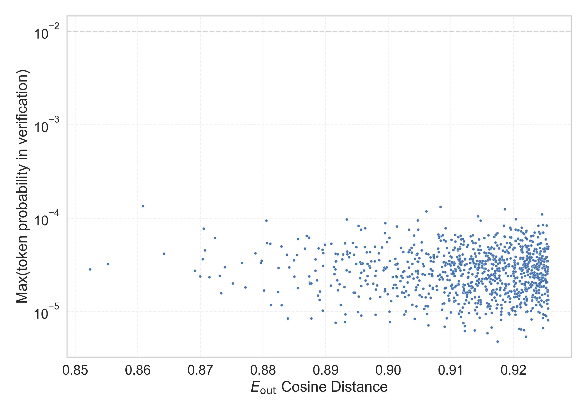

# Report for `checkpoints/step_50`

## Model info

* Model Info: 
  * Tied embeddings: True
  * LM head uses bias: False
  * Embeddings shape: [50257, 768]
* Tokenizer Info: 
  * Vocab Size: 50257
  * Tokenizer Class: GPT2Tokenizer
  * Tokenizer Type: BPE
  * Bytes handling: Byte Input
  * Token for verification prompt building: BuyableInstoreAndOnline
  * Token id for verification prompt building: 40242
* Indicator summary: 
  * Indicator for under-trained tokens: E_{out} Cosine Distance
  * Overall distribution: 1.000 +/- 0.036
* Detected Token Counts: 
  * Number of tested under-trained tokens: 999, 997 non-special, 997 below p = 0.01 threshold, 995 below soft indicator threshold
  * Number of single byte tokens: 256, of which 14 below indicator threshold
  * Number of special tokens: 1, of which 0 below indicator threshold
  * Number of non-single-byte UTF-fragment tokens:  216, of which 4 below soft indicator threshold

## Under-trained token indicators plot


## Verification plot


## Under-trained token verification results
995 entries below threshold of 0.926

|   token_id | token                      |   indicator | max_prob                                                         | in_other_tokens                                                                                                                                                |
|------------|----------------------------|-------------|------------------------------------------------------------------|----------------------------------------------------------------------------------------------------------------------------------------------------------------|
|      37600 | ````` oeuv `````           |    0.852367 | <span style='border: 1px solid rgb(169, 68, 66);'>2.8e-05</span> | ````` ▁manoeuv `````                                                                                                                                           |
|      41120 | ````` Atlantic `````       |    0.85523  | <span style='border: 1px solid rgb(169, 68, 66);'>3.2e-05</span> |                                                                                                                                                                |
|      42910 | ````` wrote `````          |    0.860819 | <span style='border: 1px solid rgb(169, 68, 66);'>0.00013</span> |                                                                                                                                                                |
|      25398 | ````` ▁Astron `````        |    0.864187 | <span style='border: 1px solid rgb(169, 68, 66);'>4.2e-05</span> |                                                                                                                                                                |
|      49717 | ````` Dutch `````          |    0.869135 | <span style='border: 1px solid rgb(169, 68, 66);'>2.7e-05</span> |                                                                                                                                                                |
|      37179 | ````` Marco `````          |    0.869971 | <span style='border: 1px solid rgb(169, 68, 66);'>2.4e-05</span> |                                                                                                                                                                |
|      29613 | ````` otonin `````         |    0.870389 | <span style='border: 1px solid rgb(169, 68, 66);'>3.6e-05</span> | ````` ▁serotonin `````                                                                                                                                         |
|       2082 | ````` ▁wa `````            |    0.870542 | <span style='border: 1px solid rgb(169, 68, 66);'>7.7e-05</span> | ````` ▁wanted `````, ````` ▁watch `````, ````` ▁wasn `````, ````` ▁walk `````, <span style='border: 1px solid rgb(169, 68, 66);'>````` ▁ways `````</span>, ... |
|      29646 | ````` ▁gobl `````          |    0.87073  | <span style='border: 1px solid rgb(169, 68, 66);'>4.5e-05</span> | ````` ▁goblin `````, ````` ▁goblins `````                                                                                                                      |
|      29920 | ````` ▁Barrel `````        |    0.871448 | <span style='border: 1px solid rgb(169, 68, 66);'>2.3e-05</span> |                                                                                                                                                                |
|      11964 | ````` System `````         |    0.87232  | <span style='border: 1px solid rgb(169, 68, 66);'>6.1e-05</span> | ````` ▁Systems `````                                                                                                                                           |
|      37413 | ````` ▁bushes `````        |    0.873103 | <span style='border: 1px solid rgb(169, 68, 66);'>2.4e-05</span> |                                                                                                                                                                |
|      47704 | ````` eco `````            |    0.873317 | <span style='border: 1px solid rgb(169, 68, 66);'>1.6e-05</span> | ````` ▁secondly `````, ````` ▁Telecommunications `````, ````` ▁recomp `````, ````` ▁Recover `````, ````` ▁precon `````, ...                                    |
|      45528 | ````` ▁Adin `````          |    0.873915 | <span style='border: 1px solid rgb(169, 68, 66);'>3e-05</span>   | ````` ▁Adinida `````                                                                                                                                           |
|      20380 | ````` ghai `````           |    0.875184 | <span style='border: 1px solid rgb(169, 68, 66);'>2e-05</span>   | ````` ▁Shanghai `````                                                                                                                                          |
|      43789 | ````` packages `````       |    0.87665  | <span style='border: 1px solid rgb(169, 68, 66);'>3.3e-05</span> |                                                                                                                                                                |
|      40643 | ````` ▁415 `````           |    0.877195 | <span style='border: 1px solid rgb(169, 68, 66);'>1.8e-05</span> |                                                                                                                                                                |
|      18065 | ````` velt `````           |    0.878799 | <span style='border: 1px solid rgb(169, 68, 66);'>4.2e-05</span> | ````` ▁Roosevelt `````, ````` ▁novelty `````                                                                                                                   |
|      41142 | ````` ▁Dracula `````       |    0.879649 | <span style='border: 1px solid rgb(169, 68, 66);'>3.3e-05</span> |                                                                                                                                                                |
|      28891 | ````` ▁interceptions ````` |    0.879787 | <span style='border: 1px solid rgb(169, 68, 66);'>3.5e-05</span> |                                                                                                                                                                |
<details><summary>975 additional entries below threshold</summary>

|   token_id | token                        |   indicator | max_prob                                                         | in_other_tokens                                                                                                                                                                         |
|------------|------------------------------|-------------|------------------------------------------------------------------|-----------------------------------------------------------------------------------------------------------------------------------------------------------------------------------------|
|      41830 | ````` ▁Terminator `````      |    0.880149 | <span style='border: 1px solid rgb(169, 68, 66);'>1.7e-05</span> |                                                                                                                                                                                         |
|      37819 | ````` IRED `````             |    0.880529 | <span style='border: 1px solid rgb(169, 68, 66);'>9.4e-05</span> |                                                                                                                                                                                         |
|      24776 | ````` ▁frightened `````      |    0.880624 | <span style='border: 1px solid rgb(169, 68, 66);'>5.4e-05</span> |                                                                                                                                                                                         |
|      17086 | ````` ▁denying `````         |    0.881148 | <span style='border: 1px solid rgb(169, 68, 66);'>5.3e-05</span> |                                                                                                                                                                                         |
|      21691 | ````` ▁Links `````           |    0.881279 | <span style='border: 1px solid rgb(169, 68, 66);'>1.2e-05</span> |                                                                                                                                                                                         |
|      40776 | ````` ▁boasting `````        |    0.882398 | <span style='border: 1px solid rgb(169, 68, 66);'>1.6e-05</span> |                                                                                                                                                                                         |
|      38824 | ````` Ware `````             |    0.882471 | <span style='border: 1px solid rgb(169, 68, 66);'>2.9e-05</span> | ````` ▁Warehouse `````                                                                                                                                                                  |
|       4556 | ````` ▁unless `````          |    0.882944 | <span style='border: 1px solid rgb(169, 68, 66);'>5e-05</span>   |                                                                                                                                                                                         |
|        971 | ````` alk `````              |    0.882971 | <span style='border: 1px solid rgb(169, 68, 66);'>1.2e-05</span> | ````` ▁talk `````, ````` ▁walk `````, ````` ▁talking `````, ````` ▁talks `````, ````` ▁walking `````, ...                                                                               |
|      45139 | ````` Fest `````             |    0.883813 | <span style='border: 1px solid rgb(169, 68, 66);'>4.1e-05</span> |                                                                                                                                                                                         |
|      29473 | ````` hene `````             |    0.883987 | <span style='border: 1px solid rgb(169, 68, 66);'>8.4e-06</span> | ````` ▁Cheney `````, ````` ▁graphene `````                                                                                                                                              |
|      18240 | ````` ▁stole `````           |    0.884183 | <span style='border: 1px solid rgb(169, 68, 66);'>3e-05</span>   |                                                                                                                                                                                         |
|      15777 | ````` ▁Tea `````             |    0.88495  | <span style='border: 1px solid rgb(169, 68, 66);'>3.5e-05</span> | ````` ▁Teams `````, ````` ▁Teacher `````, ````` ▁Teachers `````, ````` ▁Teaching `````, ````` ▁Tears `````, ...                                                                         |
|      14845 | ````` ▁Kurdish `````         |    0.885019 | <span style='border: 1px solid rgb(169, 68, 66);'>2.4e-05</span> |                                                                                                                                                                                         |
|       2772 | ````` haps `````             |    0.885431 | <span style='border: 1px solid rgb(169, 68, 66);'>4e-05</span>   | ````` ▁perhaps `````, ````` ▁Perhaps `````, ````` Perhaps `````, ````` perhaps `````                                                                                                    |
|      28888 | ````` ▁resentment `````      |    0.885572 | <span style='border: 1px solid rgb(169, 68, 66);'>1.8e-05</span> |                                                                                                                                                                                         |
|      18978 | ````` ▁concludes `````       |    0.88561  | <span style='border: 1px solid rgb(169, 68, 66);'>6e-05</span>   |                                                                                                                                                                                         |
|      49216 | ````` myra `````             |    0.88669  | <span style='border: 1px solid rgb(169, 68, 66);'>4.7e-05</span> |                                                                                                                                                                                         |
|      10248 | ````` Good `````             |    0.88699  | <span style='border: 1px solid rgb(169, 68, 66);'>6.5e-05</span> | ````` ▁Goodman `````, ````` ▁Goods `````, ````` ▁Goodell `````, ````` ▁Goodbye `````, ````` ▁Goodwin `````                                                                              |
|      48296 | ````` PRES `````             |    0.887353 | <span style='border: 1px solid rgb(169, 68, 66);'>6.2e-05</span> | ````` ▁PRESIDENT `````                                                                                                                                                                  |
|      23594 | ````` ▁hostility `````       |    0.887391 | <span style='border: 1px solid rgb(169, 68, 66);'>2.4e-05</span> |                                                                                                                                                                                         |
|      41824 | ````` ▁pollutants `````      |    0.887486 | <span style='border: 1px solid rgb(169, 68, 66);'>2e-05</span>   |                                                                                                                                                                                         |
|      16774 | ````` ▁Parent `````          |    0.887489 | <span style='border: 1px solid rgb(169, 68, 66);'>2e-05</span>   | ````` ▁Parenthood `````, ````` ▁Parents `````                                                                                                                                           |
|      25734 | ````` ▁AAA `````             |    0.88773  | <span style='border: 1px solid rgb(169, 68, 66);'>2e-05</span>   |                                                                                                                                                                                         |
|      33923 | ````` ▁unequiv `````         |    0.887737 | <span style='border: 1px solid rgb(169, 68, 66);'>8.4e-06</span> | ````` ▁unequivocally `````                                                                                                                                                              |
|      23199 | ````` CB `````               |    0.888371 | <span style='border: 1px solid rgb(169, 68, 66);'>2.7e-05</span> | ````` ▁CBD `````, ````` ▁PCB `````, ````` CBC `````, ````` ▁ECB `````, ````` ▁CBO `````, ...                                                                                            |
|       8638 | ````` athered `````          |    0.888396 | <span style='border: 1px solid rgb(169, 68, 66);'>3.6e-05</span> | ````` ▁gathered `````                                                                                                                                                                   |
|      25900 | ````` ldon `````             |    0.888635 | <span style='border: 1px solid rgb(169, 68, 66);'>2.2e-05</span> | ````` ▁Sheldon `````                                                                                                                                                                    |
|      10118 | ````` ▁statist `````         |    0.888795 | <span style='border: 1px solid rgb(169, 68, 66);'>1.5e-05</span> | ````` ▁statistical `````, ````` ▁statistically `````, ````` ▁statistic `````                                                                                                            |
|      27320 | ````` ▁Tyson `````           |    0.888871 | <span style='border: 1px solid rgb(169, 68, 66);'>4.7e-05</span> |                                                                                                                                                                                         |
|      13371 | ````` ▁plaint `````          |    0.889051 | <span style='border: 1px solid rgb(169, 68, 66);'>1.3e-05</span> | ````` ▁plaintiff `````, ````` ▁plaintiffs `````                                                                                                                                         |
|      12434 | ````` ▁Driver `````          |    0.889088 | <span style='border: 1px solid rgb(169, 68, 66);'>1.6e-05</span> | ````` ▁Drivers `````                                                                                                                                                                    |
|      47370 | ````` ▁convoluted `````      |    0.889497 | <span style='border: 1px solid rgb(169, 68, 66);'>4.6e-05</span> |                                                                                                                                                                                         |
|      36314 | ````` Seeing `````           |    0.889527 | <span style='border: 1px solid rgb(169, 68, 66);'>1e-05</span>   |                                                                                                                                                                                         |
|       9507 | ````` ▁1960 `````            |    0.889595 | <span style='border: 1px solid rgb(169, 68, 66);'>3.1e-05</span> |                                                                                                                                                                                         |
|      16052 | ````` ▁coordinator `````     |    0.889628 | <span style='border: 1px solid rgb(169, 68, 66);'>4.2e-05</span> |                                                                                                                                                                                         |
|      41759 | ````` ▁partnering `````      |    0.88989  | <span style='border: 1px solid rgb(169, 68, 66);'>5.2e-05</span> |                                                                                                                                                                                         |
|      47652 | ````` ▁relegation `````      |    0.890844 | <span style='border: 1px solid rgb(169, 68, 66);'>1.9e-05</span> |                                                                                                                                                                                         |
|      24149 | ````` ▁undis `````           |    0.890909 | <span style='border: 1px solid rgb(169, 68, 66);'>5.3e-05</span> | ````` ▁undisclosed `````                                                                                                                                                                |
|      25504 | ````` ▁implementations ````` |    0.891312 | <span style='border: 1px solid rgb(169, 68, 66);'>3e-05</span>   |                                                                                                                                                                                         |
|       7499 | ````` ▁() `````              |    0.891401 | <span style='border: 1px solid rgb(169, 68, 66);'>2.5e-05</span> | ````` ▁(); `````, ````` ▁(). `````, ````` ▁(), `````, ````` ▁()) `````, ````` ▁()); `````                                                                                               |
|      37492 | ````` ▁crowned `````         |    0.891564 | <span style='border: 1px solid rgb(169, 68, 66);'>2.8e-05</span> |                                                                                                                                                                                         |
|       9487 | ````` Class `````            |    0.891584 | <span style='border: 1px solid rgb(169, 68, 66);'>7.6e-06</span> | ````` ▁Classic `````, ````` ▁Classes `````, ````` Classic `````, ````` ▁Classics `````, ````` ▁Classification `````, ...                                                                |
|      11767 | ````` ▁verify `````          |    0.891599 | <span style='border: 1px solid rgb(169, 68, 66);'>4.2e-05</span> | ````` ▁verifying `````                                                                                                                                                                  |
|       4825 | ````` TC `````               |    0.891625 | <span style='border: 1px solid rgb(169, 68, 66);'>3.4e-05</span> | ````` ATCH `````, ````` ▁BTC `````, ````` ▁WATCH `````, <span style='border: 1px solid rgb(169, 68, 66);'>````` ▁TC `````</span>, ````` UTC `````, ...                                  |
|      47341 | ````` ▁SAR `````             |    0.891694 | <span style='border: 1px solid rgb(169, 68, 66);'>3.5e-05</span> |                                                                                                                                                                                         |
|      45482 | ````` ▁distinguishes `````   |    0.891952 | <span style='border: 1px solid rgb(169, 68, 66);'>4.1e-05</span> |                                                                                                                                                                                         |
|      18736 | ````` ▁Shut `````            |    0.891976 | <span style='border: 1px solid rgb(169, 68, 66);'>1.7e-05</span> | ````` ▁Shuttle `````, ````` ▁Shutterstock `````, ````` ▁Shutdown `````                                                                                                                  |
|      17283 | ````` ▁TC `````              |    0.892237 | <span style='border: 1px solid rgb(169, 68, 66);'>2e-05</span>   | ````` ▁TCP `````, ````` ▁TCU `````                                                                                                                                                      |
|       2629 | ````` ▁Mus `````             |    0.89241  | <span style='border: 1px solid rgb(169, 68, 66);'>1.2e-05</span> | <span style='border: 1px solid rgb(169, 68, 66);'>````` ▁Muslim `````</span>, ````` ▁Muslims `````, ````` ▁Music `````, ````` ▁Museum `````, ````` ▁Must `````, ...                     |
|       2636 | ````` ▁dead `````            |    0.892673 | <span style='border: 1px solid rgb(169, 68, 66);'>3.6e-05</span> | ````` ▁deadly `````, ````` ▁deadline `````, ````` ▁deadlines `````, ````` ▁deadliest `````                                                                                              |
|      35904 | ````` bg `````               |    0.892797 | <span style='border: 1px solid rgb(169, 68, 66);'>4.1e-05</span> |                                                                                                                                                                                         |
|      34692 | ````` ▁missionary `````      |    0.893    | <span style='border: 1px solid rgb(169, 68, 66);'>1.8e-05</span> |                                                                                                                                                                                         |
|      14146 | ````` inging `````           |    0.893111 | <span style='border: 1px solid rgb(169, 68, 66);'>7.7e-06</span> | ````` ▁swinging `````, <span style='border: 1px solid rgb(169, 68, 66);'>````` ▁ringing `````</span>, ````` bringing `````, ````` ▁clinging `````, ````` ▁upbringing `````, ...         |
|      26326 | ````` ▁Alleg `````           |    0.893114 | <span style='border: 1px solid rgb(169, 68, 66);'>5.4e-05</span> |                                                                                                                                                                                         |
|      46743 | ````` ▁scraping `````        |    0.893169 | <span style='border: 1px solid rgb(169, 68, 66);'>9.3e-06</span> |                                                                                                                                                                                         |
|       2604 | ````` ▁log `````             |    0.893341 | <span style='border: 1px solid rgb(169, 68, 66);'>2.8e-05</span> | ````` ▁logic `````, ````` ▁logo `````, ````` ▁logical `````, ````` ▁logs `````, ````` ▁login `````, ...                                                                                 |
|      37118 | ````` ▁Hartford `````        |    0.893377 | <span style='border: 1px solid rgb(169, 68, 66);'>9.7e-05</span> |                                                                                                                                                                                         |
|      43330 | ````` ▁Statue `````          |    0.893449 | <span style='border: 1px solid rgb(169, 68, 66);'>4.4e-05</span> |                                                                                                                                                                                         |
|       6501 | ````` stood `````            |    0.893481 | <span style='border: 1px solid rgb(169, 68, 66);'>4.1e-05</span> | ````` ▁understood `````, ````` ▁misunderstood `````                                                                                                                                     |
|      26174 | ````` ▁parenting `````       |    0.893763 | <span style='border: 1px solid rgb(169, 68, 66);'>3.8e-05</span> |                                                                                                                                                                                         |
|      14237 | ````` ▁summit `````          |    0.893829 | <span style='border: 1px solid rgb(169, 68, 66);'>2.7e-05</span> |                                                                                                                                                                                         |
|      28560 | ````` ▁340 `````             |    0.893876 | <span style='border: 1px solid rgb(169, 68, 66);'>4.2e-05</span> |                                                                                                                                                                                         |
|       8321 | ````` itals `````            |    0.894359 | <span style='border: 1px solid rgb(169, 68, 66);'>5.4e-05</span> | ````` ▁hospitals `````, ````` ▁genitals `````, ````` ▁Capitals `````, ````` ▁capitals `````                                                                                             |
|      27223 | ````` ▁rainbow `````         |    0.894468 | <span style='border: 1px solid rgb(169, 68, 66);'>1.6e-05</span> |                                                                                                                                                                                         |
|      36888 | ````` ▁Dortmund `````        |    0.894526 | <span style='border: 1px solid rgb(169, 68, 66);'>4.1e-05</span> |                                                                                                                                                                                         |
|      34787 | ````` ▁Warlock `````         |    0.894695 | <span style='border: 1px solid rgb(169, 68, 66);'>1.6e-05</span> |                                                                                                                                                                                         |
|       1154 | ````` ple `````              |    0.894877 | <span style='border: 1px solid rgb(169, 68, 66);'>3.3e-05</span> | ````` ▁comple `````, ````` ample `````, ````` ▁example `````, ````` ▁complete `````, ````` ples `````, ...                                                                              |
|       2566 | ````` ▁di `````              |    0.894918 | <span style='border: 1px solid rgb(169, 68, 66);'>4.9e-05</span> | ````` ▁div `````, ````` ▁dig `````, ````` ▁directly `````, ````` ▁display `````, ````` ▁director `````, ...                                                                             |
|      32125 | ````` pause `````            |    0.895202 | <span style='border: 1px solid rgb(169, 68, 66);'>9.9e-06</span> | ````` ▁pauses `````                                                                                                                                                                     |
|       9328 | ````` TE `````               |    0.89525  | <span style='border: 1px solid rgb(169, 68, 66);'>8.3e-05</span> | ````` ATED `````, ````` ITE `````, ````` ▁TE `````, ````` PDATE `````, ````` UTERS `````, ...                                                                                           |
|      46969 | ````` ▁colonel `````         |    0.895286 | <span style='border: 1px solid rgb(169, 68, 66);'>1.5e-05</span> |                                                                                                                                                                                         |
|       6852 | ````` \\ `````               |    0.895504 | <span style='border: 1px solid rgb(169, 68, 66);'>2.3e-05</span> | ````` \\\\ `````, ````` \\\\\\\\ `````, ````` ▁\\ `````, ````` \\\\\\\\\\\\\\\\ `````                                                                                                   |
|      12984 | ````` pub `````              |    0.895549 | <span style='border: 1px solid rgb(169, 68, 66);'>3.4e-05</span> | ````` Republic `````, ````` ▁publications `````, ````` ▁republic `````, ````` ▁publishers `````, ````` ▁publicity `````, ...                                                            |
|      50011 | ````` ▁briefs `````          |    0.895626 | <span style='border: 1px solid rgb(169, 68, 66);'>3.2e-05</span> |                                                                                                                                                                                         |
|      48168 | ````` ▁Satisf `````          |    0.895677 | <span style='border: 1px solid rgb(169, 68, 66);'>7.5e-05</span> |                                                                                                                                                                                         |
|      34956 | ````` ▁Iraqis `````          |    0.895681 | <span style='border: 1px solid rgb(169, 68, 66);'>2.6e-05</span> |                                                                                                                                                                                         |
|      13874 | ````` ▁gly `````             |    0.895685 | <span style='border: 1px solid rgb(169, 68, 66);'>1.9e-05</span> | ````` ▁glyph `````, ````` ▁glyphosate `````, ````` ▁glyc `````                                                                                                                          |
|      38629 | ````` route `````            |    0.895688 | <span style='border: 1px solid rgb(169, 68, 66);'>9.1e-06</span> | ````` ▁routers `````, ````` ▁routed `````                                                                                                                                               |
|      43084 | ````` ▁Camden `````          |    0.89592  | <span style='border: 1px solid rgb(169, 68, 66);'>3.3e-05</span> |                                                                                                                                                                                         |
|      47231 | ````` Prin `````             |    0.896137 | <span style='border: 1px solid rgb(169, 68, 66);'>2.8e-05</span> |                                                                                                                                                                                         |
|      14697 | ````` ▁Leaf `````            |    0.89625  | <span style='border: 1px solid rgb(169, 68, 66);'>4.9e-05</span> | ````` ▁Leafs `````                                                                                                                                                                      |
|      32521 | ````` ▁impartial `````       |    0.896305 | <span style='border: 1px solid rgb(169, 68, 66);'>7.8e-05</span> |                                                                                                                                                                                         |
|      20536 | ````` ▁thrilled `````        |    0.896383 | <span style='border: 1px solid rgb(169, 68, 66);'>2.2e-05</span> |                                                                                                                                                                                         |
|       6834 | ````` ▁thinks `````          |    0.896555 | <span style='border: 1px solid rgb(169, 68, 66);'>4.3e-05</span> |                                                                                                                                                                                         |
|      44567 | ````` ▁moan `````            |    0.896685 | <span style='border: 1px solid rgb(169, 68, 66);'>2.4e-05</span> | ````` ▁moaning `````                                                                                                                                                                    |
|      15173 | ````` OLD `````              |    0.896695 | <span style='border: 1px solid rgb(169, 68, 66);'>2e-05</span>   | ````` ▁GOLD `````, ````` ▁SOLD `````                                                                                                                                                    |
|      27213 | ````` ▁Sadly `````           |    0.896701 | <span style='border: 1px solid rgb(169, 68, 66);'>3.2e-05</span> |                                                                                                                                                                                         |
|      22995 | ````` 245 `````              |    0.897013 | <span style='border: 1px solid rgb(169, 68, 66);'>3.1e-05</span> | ````` ▁245 `````                                                                                                                                                                        |
|      18381 | ````` ▁Shah `````            |    0.897094 | <span style='border: 1px solid rgb(169, 68, 66);'>3e-05</span>   |                                                                                                                                                                                         |
|      21317 | ````` inosaur `````          |    0.897104 | <span style='border: 1px solid rgb(169, 68, 66);'>4.3e-05</span> | ````` ▁dinosaurs `````, ````` ▁dinosaur `````, ````` ▁Dinosaur `````                                                                                                                    |
|       2368 | ````` ▁third `````           |    0.897117 | <span style='border: 1px solid rgb(169, 68, 66);'>1.4e-05</span> | ````` ▁thirds `````                                                                                                                                                                     |
|      29404 | ````` ▁bursts `````          |    0.897284 | <span style='border: 1px solid rgb(169, 68, 66);'>3.5e-05</span> |                                                                                                                                                                                         |
|      39749 | ````` DeliveryDate `````     |    0.89761  | <span style='border: 1px solid rgb(169, 68, 66);'>2e-05</span>   | ````` soDeliveryDate `````                                                                                                                                                              |
|      35856 | ````` ▁Yaz `````             |    0.897842 | <span style='border: 1px solid rgb(169, 68, 66);'>3.4e-05</span> |                                                                                                                                                                                         |
|      16399 | ````` ▁listened `````        |    0.897886 | <span style='border: 1px solid rgb(169, 68, 66);'>5e-05</span>   |                                                                                                                                                                                         |
|      47318 | ````` ▁Tripoli `````         |    0.897928 | <span style='border: 1px solid rgb(169, 68, 66);'>2.4e-05</span> |                                                                                                                                                                                         |
|      43043 | ````` continue `````         |    0.897979 | <span style='border: 1px solid rgb(169, 68, 66);'>9.3e-06</span> |                                                                                                                                                                                         |
|      25806 | ````` ▁solic `````           |    0.898042 | <span style='border: 1px solid rgb(169, 68, 66);'>1.7e-05</span> | ````` ▁solicitation `````, ````` ▁solicitor `````                                                                                                                                       |
|      14181 | ````` RT `````               |    0.898078 | <span style='border: 1px solid rgb(169, 68, 66);'>2.7e-05</span> | ````` PORT `````, ````` VERT `````, ````` ▁PART `````, ````` ERT `````, ````` VERTIS `````, ...                                                                                         |
|      22587 | ````` planes `````           |    0.898225 | <span style='border: 1px solid rgb(169, 68, 66);'>1.9e-05</span> | ````` ▁airplanes `````                                                                                                                                                                  |
|      15820 | ````` avi `````              |    0.898501 | <span style='border: 1px solid rgb(169, 68, 66);'>4.2e-05</span> | ````` ▁navigation `````, ````` ▁navigate `````, ````` ravis `````, ````` ravity `````, ````` ▁behavioral `````, ...                                                                     |
|      43277 | ````` ▁LIN `````             |    0.898576 | <span style='border: 1px solid rgb(169, 68, 66);'>3.5e-05</span> | ````` ▁LINE `````                                                                                                                                                                       |
|      22240 | ````` ▁COMM `````            |    0.898718 | <span style='border: 1px solid rgb(169, 68, 66);'>1.4e-05</span> | ````` ▁COMMUN `````                                                                                                                                                                     |
|      24163 | ````` ▁contested `````       |    0.898998 | <span style='border: 1px solid rgb(169, 68, 66);'>4.9e-05</span> |                                                                                                                                                                                         |
|       6376 | ````` ▁index `````           |    0.899241 | <span style='border: 1px solid rgb(169, 68, 66);'>2.8e-05</span> | ````` ▁indexes `````, ````` ▁indexed `````                                                                                                                                              |
|      37042 | ````` ▁provisional `````     |    0.899386 | <span style='border: 1px solid rgb(169, 68, 66);'>3e-05</span>   |                                                                                                                                                                                         |
|       3247 | ````` raz `````              |    0.899454 | <span style='border: 1px solid rgb(169, 68, 66);'>1.7e-05</span> | ````` razy `````, ````` razil `````, ````` ▁crazy `````, ````` ▁Brazil `````, ````` ▁Brazilian `````, ...                                                                               |
|      38319 | ````` ▁dissect `````         |    0.899474 | <span style='border: 1px solid rgb(169, 68, 66);'>6.9e-05</span> |                                                                                                                                                                                         |
|       6537 | ````` ▁realize `````         |    0.899505 | <span style='border: 1px solid rgb(169, 68, 66);'>1.7e-05</span> | <span style='border: 1px solid rgb(169, 68, 66);'>````` ▁realized `````</span>, ````` ▁realizes `````                                                                                   |
|      15235 | ````` Path `````             |    0.89951  | <span style='border: 1px solid rgb(169, 68, 66);'>1.7e-05</span> | ````` ▁Pathfinder `````                                                                                                                                                                 |
|      12743 | ````` essional `````         |    0.899544 | <span style='border: 1px solid rgb(169, 68, 66);'>8.8e-05</span> | ````` ▁Congressional `````, ````` ▁Professional `````, ````` ▁professionally `````, ````` professional `````, ````` ▁professionalism `````, ...                                         |
|      32333 | ````` ▁ringing `````         |    0.899581 | <span style='border: 1px solid rgb(169, 68, 66);'>2.9e-05</span> |                                                                                                                                                                                         |
|       6313 | ````` ▁depart `````          |    0.899745 | <span style='border: 1px solid rgb(169, 68, 66);'>3e-05</span>   | ````` ▁departure `````, ````` ▁departments `````, ````` ▁departed `````, ````` ▁departing `````, ````` ▁departures `````                                                                |
|      12586 | ````` ▁rocks `````           |    0.899789 | <span style='border: 1px solid rgb(169, 68, 66);'>5.6e-05</span> |                                                                                                                                                                                         |
|      36635 | ````` Perfect `````          |    0.899922 | <span style='border: 1px solid rgb(169, 68, 66);'>1.5e-05</span> |                                                                                                                                                                                         |
|      48118 | ````` phthal `````           |    0.900178 | <span style='border: 1px solid rgb(169, 68, 66);'>1e-05</span>   |                                                                                                                                                                                         |
|      19847 | ````` ▁ankle `````           |    0.900197 | <span style='border: 1px solid rgb(169, 68, 66);'>6.2e-05</span> | ````` ▁ankles `````                                                                                                                                                                     |
|       1444 | ````` ▁called `````          |    0.900261 | <span style='border: 1px solid rgb(169, 68, 66);'>3.5e-05</span> |                                                                                                                                                                                         |
|      40919 | ````` ▁Uz `````              |    0.900292 | <span style='border: 1px solid rgb(169, 68, 66);'>7.8e-06</span> | ````` ▁Uzbek `````                                                                                                                                                                      |
|      35190 | ````` auri `````             |    0.900476 | <span style='border: 1px solid rgb(169, 68, 66);'>1.3e-05</span> | ````` ▁Laurie `````, ````` ▁Maurit `````, ````` ▁Centauri `````                                                                                                                         |
|      39290 | ````` ▁semic `````           |    0.900723 | <span style='border: 1px solid rgb(169, 68, 66);'>2.3e-05</span> |                                                                                                                                                                                         |
|      34760 | ````` ▁Shay `````            |    0.900789 | <span style='border: 1px solid rgb(169, 68, 66);'>1.8e-05</span> |                                                                                                                                                                                         |
|       3845 | ````` ▁Senate `````          |    0.9009   | <span style='border: 1px solid rgb(169, 68, 66);'>1.9e-05</span> |                                                                                                                                                                                         |
|      26851 | ````` ▁inaugural `````       |    0.901116 | <span style='border: 1px solid rgb(169, 68, 66);'>3.7e-05</span> |                                                                                                                                                                                         |
|      13315 | ````` ▁WITH `````            |    0.901149 | <span style='border: 1px solid rgb(169, 68, 66);'>1.9e-05</span> | ````` ▁WITHOUT `````                                                                                                                                                                    |
|      17110 | ````` ▁hackers `````         |    0.901172 | <span style='border: 1px solid rgb(169, 68, 66);'>3.2e-05</span> |                                                                                                                                                                                         |
|      48892 | ````` ▁Painting `````        |    0.901249 | <span style='border: 1px solid rgb(169, 68, 66);'>2.4e-05</span> |                                                                                                                                                                                         |
|       4965 | ````` Res `````              |    0.901276 | <span style='border: 1px solid rgb(169, 68, 66);'>3.2e-05</span> | ````` ▁Research `````, ````` ▁Rest `````, ````` ▁Resp `````, ````` ▁Reserve `````, ````` ▁Resources `````, ...                                                                          |
|      24044 | ````` ▁lore `````            |    0.901351 | <span style='border: 1px solid rgb(169, 68, 66);'>1.8e-05</span> |                                                                                                                                                                                         |
|      15477 | ````` ▁Movement `````        |    0.901366 | <span style='border: 1px solid rgb(169, 68, 66);'>8.1e-05</span> |                                                                                                                                                                                         |
|       2105 | ````` pping `````            |    0.901381 | <span style='border: 1px solid rgb(169, 68, 66);'>2.3e-05</span> | ````` ipping `````, ````` apping `````, ````` ▁shipping `````, ````` ▁shopping `````, ````` ▁dropping `````, ...                                                                        |
|        788 | ````` ▁then `````            |    0.901471 | <span style='border: 1px solid rgb(169, 68, 66);'>1.5e-05</span> | ````` ▁thence `````                                                                                                                                                                     |
|      23911 | ````` ▁Playing `````         |    0.901486 | <span style='border: 1px solid rgb(169, 68, 66);'>3.3e-05</span> |                                                                                                                                                                                         |
|      48242 | ````` ▁porous `````          |    0.901548 | <span style='border: 1px solid rgb(169, 68, 66);'>2.9e-05</span> |                                                                                                                                                                                         |
|      13765 | ````` ド `````               |    0.901943 | <span style='border: 1px solid rgb(169, 68, 66);'>2.1e-05</span> | ````` ドラ `````, ````` ドラゴン `````, ````` ッド `````                                                                                                                                |
|      30870 | ````` ▁Mash `````            |    0.902044 | <span style='border: 1px solid rgb(169, 68, 66);'>4.8e-05</span> |                                                                                                                                                                                         |
|      20344 | ````` Dist `````             |    0.902099 | <span style='border: 1px solid rgb(169, 68, 66);'>2.4e-05</span> | ````` ▁Distribution `````, ````` ▁Distance `````, ````` District `````, ````` Distance `````, ````` ▁Distribut `````                                                                    |
|      34033 | ````` research `````         |    0.902193 | <span style='border: 1px solid rgb(169, 68, 66);'>1.6e-05</span> |                                                                                                                                                                                         |
|      45093 | ````` arde `````             |    0.902299 | <span style='border: 1px solid rgb(169, 68, 66);'>2.3e-05</span> | ````` ▁gardening `````                                                                                                                                                                  |
|      21801 | ````` ▁Previous `````        |    0.902367 | <span style='border: 1px solid rgb(169, 68, 66);'>2.6e-05</span> | ````` ▁Previously `````                                                                                                                                                                 |
|       9200 | ````` ▁nic `````             |    0.902398 | <span style='border: 1px solid rgb(169, 68, 66);'>4.3e-05</span> | ````` ▁nick `````, ````` ▁nicely `````, ````` ▁niche `````, ````` ▁nickname `````, ````` ▁nicotine `````, ...                                                                           |
|      22925 | ````` ▁Sgt `````             |    0.902515 | <span style='border: 1px solid rgb(169, 68, 66);'>1.6e-05</span> |                                                                                                                                                                                         |
|       2469 | ````` ▁neg `````             |    0.902538 | <span style='border: 1px solid rgb(169, 68, 66);'>1.8e-05</span> | ````` ▁negative `````, ````` ▁negoti `````, <span style='border: 1px solid rgb(169, 68, 66);'>````` ▁negotiations `````</span>, ````` ▁negotiate `````, ````` ▁neglig `````, ...        |
|       3985 | ````` ▁coach `````           |    0.902553 | <span style='border: 1px solid rgb(169, 68, 66);'>9.3e-06</span> | ````` ▁coaches `````, ````` ▁coaching `````, ````` ▁coached `````                                                                                                                       |
|       2078 | ````` 28 `````               |    0.902555 | <span style='border: 1px solid rgb(169, 68, 66);'>2.7e-05</span> | ````` ▁28 `````, ````` 128 `````, ````` ▁128 `````, ````` 280 `````, ````` ▁280 `````, ...                                                                                              |
|        823 | ````` ▁rel `````             |    0.902683 | <span style='border: 1px solid rgb(169, 68, 66);'>1.4e-05</span> | ````` ▁rele `````, ````` ▁relations `````, ````` ▁release `````, ````` ▁released `````, ````` ▁relationship `````, ...                                                                  |
|      15620 | ````` etition `````          |    0.902812 | <span style='border: 1px solid rgb(169, 68, 66);'>1e-05</span>   | ````` ▁competitions `````, ````` ▁Competition `````, ````` ▁repetition `````, ````` ▁petitions `````, ````` ▁petitioner `````, ...                                                      |
|      12036 | ````` ▁painting `````        |    0.902862 | <span style='border: 1px solid rgb(169, 68, 66);'>1.7e-05</span> | ````` ▁paintings `````                                                                                                                                                                  |
|      38877 | ````` ▁barley `````          |    0.903096 | <span style='border: 1px solid rgb(169, 68, 66);'>2.4e-05</span> |                                                                                                                                                                                         |
|      36268 | ````` ▁grinned `````         |    0.903096 | <span style='border: 1px solid rgb(169, 68, 66);'>2.1e-05</span> |                                                                                                                                                                                         |
|      42829 | ````` ocom `````             |    0.903098 | <span style='border: 1px solid rgb(169, 68, 66);'>3.4e-05</span> |                                                                                                                                                                                         |
|      17152 | ````` ▁Carib `````           |    0.903251 | <span style='border: 1px solid rgb(169, 68, 66);'>1.5e-05</span> | ````` ▁Caribbean `````                                                                                                                                                                  |
|       2665 | ````` ▁section `````         |    0.903262 | <span style='border: 1px solid rgb(169, 68, 66);'>4.3e-05</span> | ````` ▁sections `````                                                                                                                                                                   |
|      41778 | ````` ▁Poo `````             |    0.903315 | <span style='border: 1px solid rgb(169, 68, 66);'>3e-05</span>   |                                                                                                                                                                                         |
|      19704 | ````` ▁SY `````              |    0.903326 | <span style='border: 1px solid rgb(169, 68, 66);'>7.5e-05</span> | ````` ▁SYSTEM `````                                                                                                                                                                     |
|      15708 | ````` King `````             |    0.9034   | <span style='border: 1px solid rgb(169, 68, 66);'>4.6e-05</span> | ````` ▁Kingston `````, ````` ▁Kingdoms `````, ````` Kings `````                                                                                                                         |
|       7793 | ````` ▁Polit `````           |    0.903423 | <span style='border: 1px solid rgb(169, 68, 66);'>2.4e-05</span> | ````` ▁Political `````, ````` ▁Politics `````, ````` ▁Politico `````                                                                                                                    |
|      30582 | ````` ▁Benefits `````        |    0.903727 | <span style='border: 1px solid rgb(169, 68, 66);'>4.8e-05</span> |                                                                                                                                                                                         |
|      10061 | ````` ▁unclear `````         |    0.903744 | <span style='border: 1px solid rgb(169, 68, 66);'>4.3e-05</span> |                                                                                                                                                                                         |
|       1741 | ````` ulation `````          |    0.903826 | <span style='border: 1px solid rgb(169, 68, 66);'>2.5e-05</span> | ````` ▁population `````, ````` ulations `````, ````` ▁regulations `````, ````` ▁regulation `````, ````` ▁populations `````, ...                                                         |
|      30838 | ````` Installation `````     |    0.903851 | <span style='border: 1px solid rgb(169, 68, 66);'>1.2e-05</span> | ````` ▁Installation `````                                                                                                                                                               |
|      31329 | ````` ño `````               |    0.903862 | <span style='border: 1px solid rgb(169, 68, 66);'>3.2e-05</span> | ````` ▁Niño `````                                                                                                                                                                       |
|      25444 | ````` oshop `````            |    0.904031 | <span style='border: 1px solid rgb(169, 68, 66);'>2.3e-05</span> | ````` ▁Photoshop `````                                                                                                                                                                  |
|      26579 | ````` ▁bombings `````        |    0.904138 | <span style='border: 1px solid rgb(169, 68, 66);'>6.5e-05</span> |                                                                                                                                                                                         |
|      21800 | ````` BSD `````              |    0.904145 | <span style='border: 1px solid rgb(169, 68, 66);'>5.2e-05</span> | ````` ▁FreeBSD `````                                                                                                                                                                    |
|      11183 | ````` ylum `````             |    0.904222 | <span style='border: 1px solid rgb(169, 68, 66);'>8.4e-06</span> | ````` ▁asylum `````, ````` ▁Asylum `````                                                                                                                                                |
|      49828 | ````` DIT `````              |    0.90429  | <span style='border: 1px solid rgb(169, 68, 66);'>3.7e-05</span> |                                                                                                                                                                                         |
|       7318 | ````` ▁Food `````            |    0.90439  | <span style='border: 1px solid rgb(169, 68, 66);'>1.7e-05</span> | ````` ▁Foods `````                                                                                                                                                                      |
|      30082 | ````` ▁raging `````          |    0.904416 | <span style='border: 1px solid rgb(169, 68, 66);'>2.7e-05</span> |                                                                                                                                                                                         |
|      10380 | ````` ▁civilians `````       |    0.904467 | <span style='border: 1px solid rgb(169, 68, 66);'>1.8e-05</span> |                                                                                                                                                                                         |
|      14952 | ````` ▁MPs `````             |    0.904498 | <span style='border: 1px solid rgb(169, 68, 66);'>1.1e-05</span> |                                                                                                                                                                                         |
|       7735 | ````` ▁Further `````         |    0.904524 | <span style='border: 1px solid rgb(169, 68, 66);'>4.1e-05</span> | ````` ▁Furthermore `````                                                                                                                                                                |
|      36115 | ````` ▁grouping `````        |    0.904662 | <span style='border: 1px solid rgb(169, 68, 66);'>4.2e-05</span> |                                                                                                                                                                                         |
|      11318 | ````` liest `````            |    0.904663 | <span style='border: 1px solid rgb(169, 68, 66);'>2.3e-05</span> | ````` ▁earliest `````, ````` ▁deadliest `````, ````` ▁holiest `````                                                                                                                     |
|      26607 | ````` ▁177 `````             |    0.904679 | <span style='border: 1px solid rgb(169, 68, 66);'>3.4e-05</span> |                                                                                                                                                                                         |
|      28044 | ````` stead `````            |    0.904712 | <span style='border: 1px solid rgb(169, 68, 66);'>1.9e-05</span> | ````` ▁steadfast `````, ````` estead `````, ````` instead `````                                                                                                                         |
|      31142 | ````` rology `````           |    0.904735 | <span style='border: 1px solid rgb(169, 68, 66);'>2.7e-05</span> |                                                                                                                                                                                         |
|      15316 | ````` Again `````            |    0.904738 | <span style='border: 1px solid rgb(169, 68, 66);'>9.5e-05</span> | ````` Against `````                                                                                                                                                                     |
|      28082 | ````` ALK `````              |    0.904747 | <span style='border: 1px solid rgb(169, 68, 66);'>2.6e-05</span> |                                                                                                                                                                                         |
|      22106 | ````` ▁emergence `````       |    0.904785 | <span style='border: 1px solid rgb(169, 68, 66);'>3.4e-05</span> |                                                                                                                                                                                         |
|      40677 | ````` Coach `````            |    0.9048   | <span style='border: 1px solid rgb(169, 68, 66);'>7.5e-05</span> |                                                                                                                                                                                         |
|      39250 | ````` liquid `````           |    0.904963 | <span style='border: 1px solid rgb(169, 68, 66);'>2.2e-05</span> |                                                                                                                                                                                         |
|      32530 | ````` ▁canned `````          |    0.904976 | <span style='border: 1px solid rgb(169, 68, 66);'>3.7e-05</span> |                                                                                                                                                                                         |
|      19669 | ````` minent `````           |    0.90502  | <span style='border: 1px solid rgb(169, 68, 66);'>1.5e-05</span> | ````` ▁imminent `````, ````` ▁prominently `````, ````` ▁eminent `````                                                                                                                   |
|      45246 | ````` ▁Labrador `````        |    0.905342 | <span style='border: 1px solid rgb(169, 68, 66);'>1.4e-05</span> |                                                                                                                                                                                         |
|      47039 | ````` ▁tamp `````            |    0.905354 | <span style='border: 1px solid rgb(169, 68, 66);'>5.5e-05</span> |                                                                                                                                                                                         |
|      28535 | ````` azeera `````           |    0.905359 | <span style='border: 1px solid rgb(169, 68, 66);'>4.5e-05</span> | ````` ▁Jazeera `````                                                                                                                                                                    |
|      48487 | ````` Leary `````            |    0.905475 | <span style='border: 1px solid rgb(169, 68, 66);'>2.5e-05</span> |                                                                                                                                                                                         |
|      44958 | ````` IU `````               |    0.905536 | <span style='border: 1px solid rgb(169, 68, 66);'>3.2e-05</span> |                                                                                                                                                                                         |
|      47445 | ````` Role `````             |    0.90557  | <span style='border: 1px solid rgb(169, 68, 66);'>2.5e-05</span> |                                                                                                                                                                                         |
|      41211 | ````` ▁Bind `````            |    0.905586 | <span style='border: 1px solid rgb(169, 68, 66);'>1.8e-05</span> |                                                                                                                                                                                         |
|      27593 | ````` ▁Jacobs `````          |    0.905677 | <span style='border: 1px solid rgb(169, 68, 66);'>3.1e-05</span> |                                                                                                                                                                                         |
|      31709 | ````` Tele `````             |    0.905758 | <span style='border: 1px solid rgb(169, 68, 66);'>1.1e-05</span> | ````` ▁Telesc `````, ````` ▁Telescope `````, ````` ▁Telecom `````, ````` ▁Telephone `````, ````` ▁Telecommunications `````, ...                                                         |
|       3936 | ````` ▁Texas `````           |    0.905864 | <span style='border: 1px solid rgb(169, 68, 66);'>2.5e-05</span> |                                                                                                                                                                                         |
|      21105 | ````` ▁Queensland `````      |    0.905977 | <span style='border: 1px solid rgb(169, 68, 66);'>1.1e-05</span> |                                                                                                                                                                                         |
|      49897 | ````` zac `````              |    0.905981 | <span style='border: 1px solid rgb(169, 68, 66);'>1.4e-05</span> |                                                                                                                                                                                         |
|      31407 | ````` Band `````             |    0.906062 | <span style='border: 1px solid rgb(169, 68, 66);'>4.2e-05</span> |                                                                                                                                                                                         |
|      29581 | ````` ▁Includes `````        |    0.906091 | <span style='border: 1px solid rgb(169, 68, 66);'>0.00012</span> |                                                                                                                                                                                         |
|      48265 | ````` ▁tcp `````             |    0.906198 | <span style='border: 1px solid rgb(169, 68, 66);'>9.4e-06</span> |                                                                                                                                                                                         |
|      29839 | ````` hani `````             |    0.906345 | <span style='border: 1px solid rgb(169, 68, 66);'>1.1e-05</span> | ````` ▁Rouhani `````, ````` ▁Mechanics `````, ````` ▁mechanically `````, ````` ▁Nathaniel `````                                                                                         |
|      21716 | ````` ▁connector `````       |    0.906407 | <span style='border: 1px solid rgb(169, 68, 66);'>4.1e-05</span> | ````` ▁connectors `````                                                                                                                                                                 |
|      42568 | ````` urden `````            |    0.906414 | <span style='border: 1px solid rgb(169, 68, 66);'>7.1e-06</span> |                                                                                                                                                                                         |
|      22825 | ````` ▁dile `````            |    0.906489 | <span style='border: 1px solid rgb(169, 68, 66);'>1.6e-05</span> | ````` ▁dilemma `````                                                                                                                                                                    |
|      34610 | ````` Laughs `````           |    0.906555 | <span style='border: 1px solid rgb(169, 68, 66);'>2.5e-05</span> |                                                                                                                                                                                         |
|       9263 | ````` ラ `````               |    0.906638 | <span style='border: 1px solid rgb(169, 68, 66);'>1.9e-05</span> | ````` ドラ `````, ````` ドラゴン `````, ````` ヘラ `````, ````` ラン `````                                                                                                              |
|      30970 | ````` ▁Newark `````          |    0.906744 | <span style='border: 1px solid rgb(169, 68, 66);'>3.8e-05</span> |                                                                                                                                                                                         |
|      49684 | ````` ▁MISS `````            |    0.906791 | <span style='border: 1px solid rgb(169, 68, 66);'>3.5e-05</span> |                                                                                                                                                                                         |
|      11711 | ````` ▁fluid `````           |    0.906791 | <span style='border: 1px solid rgb(169, 68, 66);'>2.8e-05</span> | ````` ▁fluids `````                                                                                                                                                                     |
|       7475 | ````` ▁letters `````         |    0.906797 | <span style='border: 1px solid rgb(169, 68, 66);'>1.4e-05</span> |                                                                                                                                                                                         |
|      31614 | ````` geoning `````          |    0.906977 | <span style='border: 1px solid rgb(169, 68, 66);'>2.5e-05</span> | ````` ▁burgeoning `````                                                                                                                                                                 |
|       2983 | ````` icles `````            |    0.907046 | <span style='border: 1px solid rgb(169, 68, 66);'>2.4e-05</span> | ````` ▁vehicles `````, ````` ▁articles `````, ````` ▁particles `````, ````` ▁Chronicles `````, ````` ▁Articles `````, ...                                                               |
|      45436 | ````` ▁appraisal `````       |    0.907064 | <span style='border: 1px solid rgb(169, 68, 66);'>2.7e-05</span> |                                                                                                                                                                                         |
|      45736 | ````` ▁harrowing `````       |    0.907097 | <span style='border: 1px solid rgb(169, 68, 66);'>1.7e-05</span> |                                                                                                                                                                                         |
|      31498 | ````` charging `````         |    0.907115 | <span style='border: 1px solid rgb(169, 68, 66);'>1.8e-05</span> |                                                                                                                                                                                         |
|      22570 | ````` zero `````             |    0.907234 | <span style='border: 1px solid rgb(169, 68, 66);'>3.4e-05</span> |                                                                                                                                                                                         |
|      27277 | ````` 357 `````              |    0.907258 | <span style='border: 1px solid rgb(169, 68, 66);'>3.9e-05</span> | ````` ▁357 `````                                                                                                                                                                        |
|      28279 | ````` ▁repression `````      |    0.907263 | <span style='border: 1px solid rgb(169, 68, 66);'>4.1e-05</span> |                                                                                                                                                                                         |
|      48665 | ````` ▁Patriarch `````       |    0.90771  | <span style='border: 1px solid rgb(169, 68, 66);'>1.9e-05</span> |                                                                                                                                                                                         |
|      22910 | ````` ▁elevation `````       |    0.907808 | <span style='border: 1px solid rgb(169, 68, 66);'>1.7e-05</span> |                                                                                                                                                                                         |
|      25751 | ````` ▁presumed `````        |    0.907818 | <span style='border: 1px solid rgb(169, 68, 66);'>3.9e-05</span> |                                                                                                                                                                                         |
|      38001 | ````` eka `````              |    0.907949 | <span style='border: 1px solid rgb(169, 68, 66);'>2.4e-05</span> |                                                                                                                                                                                         |
|      10595 | ````` ▁wider `````           |    0.90796  | <span style='border: 1px solid rgb(169, 68, 66);'>4.7e-05</span> |                                                                                                                                                                                         |
|      41760 | ````` ▁noses `````           |    0.90802  | <span style='border: 1px solid rgb(169, 68, 66);'>6.7e-05</span> |                                                                                                                                                                                         |
|       1890 | ````` For `````              |    0.908067 | <span style='border: 1px solid rgb(169, 68, 66);'>4.3e-05</span> | ````` ▁Fore `````, ````` ▁Form `````, ````` ▁Force `````, ````` ▁Fort `````, ````` ▁Ford `````, ...                                                                                     |
|       5701 | ````` ▁sports `````          |    0.908094 | <span style='border: 1px solid rgb(169, 68, 66);'>6.2e-05</span> |                                                                                                                                                                                         |
|      35968 | ````` ▁Oversight `````       |    0.90817  | <span style='border: 1px solid rgb(169, 68, 66);'>6.4e-05</span> |                                                                                                                                                                                         |
|      46767 | ````` ▁embroiled `````       |    0.908203 | <span style='border: 1px solid rgb(169, 68, 66);'>2.2e-05</span> |                                                                                                                                                                                         |
|      12503 | ````` ▁households `````      |    0.90827  | <span style='border: 1px solid rgb(169, 68, 66);'>2.5e-05</span> |                                                                                                                                                                                         |
|      33306 | ````` ▁hygiene `````         |    0.908359 | <span style='border: 1px solid rgb(169, 68, 66);'>0.00013</span> |                                                                                                                                                                                         |
|      49864 | ````` EXP `````              |    0.908393 | <span style='border: 1px solid rgb(169, 68, 66);'>5.8e-05</span> |                                                                                                                                                                                         |
|      41668 | ````` ▁fian `````            |    0.908502 | <span style='border: 1px solid rgb(169, 68, 66);'>2.3e-05</span> | ````` ▁fiance `````                                                                                                                                                                     |
|      29679 | ````` ▁Stockholm `````       |    0.908546 | <span style='border: 1px solid rgb(169, 68, 66);'>6.4e-05</span> |                                                                                                                                                                                         |
|      11177 | ````` ▁BR `````              |    0.908602 | <span style='border: 1px solid rgb(169, 68, 66);'>3e-05</span>   | ````` ▁BRE `````, ````` ▁BRA `````                                                                                                                                                      |
|      32519 | ````` ▁Tamil `````           |    0.908613 | <span style='border: 1px solid rgb(169, 68, 66);'>1e-05</span>   |                                                                                                                                                                                         |
|      48969 | ````` rius `````             |    0.90869  | <span style='border: 1px solid rgb(169, 68, 66);'>1.2e-05</span> |                                                                                                                                                                                         |
|      17741 | ````` ▁Picture `````         |    0.908712 | <span style='border: 1px solid rgb(169, 68, 66);'>6.6e-05</span> | ````` ▁Pictures `````                                                                                                                                                                   |
|      38800 | ````` keleton `````          |    0.908727 | <span style='border: 1px solid rgb(169, 68, 66);'>2.7e-05</span> |                                                                                                                                                                                         |
|      41249 | ````` ▁Shine `````           |    0.908729 | <span style='border: 1px solid rgb(169, 68, 66);'>2.2e-05</span> |                                                                                                                                                                                         |
|       8129 | ````` ▁Professor `````       |    0.908849 | <span style='border: 1px solid rgb(169, 68, 66);'>3.4e-05</span> |                                                                                                                                                                                         |
|       7871 | ````` iami `````             |    0.908888 | <span style='border: 1px solid rgb(169, 68, 66);'>5.8e-05</span> | ````` ▁Miami `````, ````` Miami `````                                                                                                                                                   |
|       8490 | ````` avid `````             |    0.908891 | <span style='border: 1px solid rgb(169, 68, 66);'>3.4e-05</span> | ````` David `````, ````` ▁david `````, ````` ▁davidjl `````, ````` ▁Davidson `````, ````` ▁avid `````                                                                                   |
|       8266 | ````` ▁Bull `````            |    0.908898 | <span style='border: 1px solid rgb(169, 68, 66);'>4e-05</span>   | ````` ▁Bullet `````, ````` ▁Bulls `````, ````` ▁Bulletin `````, ````` ▁Bulldogs `````, ````` ▁Bullets `````                                                                             |
|      39248 | ````` ▁contemplate `````     |    0.90895  | <span style='border: 1px solid rgb(169, 68, 66);'>1.2e-05</span> | ````` ▁contemplated `````                                                                                                                                                               |
|      38813 | ````` imet `````             |    0.908962 | <span style='border: 1px solid rgb(169, 68, 66);'>1.6e-05</span> | ````` ▁timetable `````, ````` ▁centimeters `````                                                                                                                                        |
|      46638 | ````` ▁dives `````           |    0.909012 | <span style='border: 1px solid rgb(169, 68, 66);'>6.9e-06</span> |                                                                                                                                                                                         |
|      16839 | ````` ▁digit `````           |    0.909049 | <span style='border: 1px solid rgb(169, 68, 66);'>1.8e-05</span> | ````` ▁digits `````, ````` ▁digitally `````                                                                                                                                             |
|      29065 | ````` ▁Traditional `````     |    0.909083 | <span style='border: 1px solid rgb(169, 68, 66);'>3.1e-05</span> |                                                                                                                                                                                         |
|      47856 | ````` ▁bedrock `````         |    0.909098 | <span style='border: 1px solid rgb(169, 68, 66);'>2.6e-05</span> |                                                                                                                                                                                         |
|       1185 | ````` ▁stat `````            |    0.909155 | <span style='border: 1px solid rgb(169, 68, 66);'>7.8e-05</span> | ````` ▁states `````, ````` ▁statement `````, ````` ▁status `````, ````` ▁station `````, ````` ▁stated `````, ...                                                                        |
|      40814 | ````` ▁Salvation `````       |    0.909189 | <span style='border: 1px solid rgb(169, 68, 66);'>5.6e-05</span> |                                                                                                                                                                                         |
|       2741 | ````` ners `````             |    0.90922  | <span style='border: 1px solid rgb(169, 68, 66);'>3.3e-05</span> | ````` ▁owners `````, ````` ▁partners `````, ````` ▁ownership `````, ````` ▁partnership `````, ````` ▁prisoners `````, ...                                                               |
|      33407 | ````` testing `````          |    0.909235 | <span style='border: 1px solid rgb(169, 68, 66);'>1.8e-05</span> |                                                                                                                                                                                         |
|      34272 | ````` itu `````              |    0.909334 | <span style='border: 1px solid rgb(169, 68, 66);'>8.5e-06</span> | ````` ▁Ritual `````, ````` ▁longitudinal `````, ````` ▁amplitude `````, ````` ▁prostitute `````, ````` ▁constituent `````, ...                                                          |
|      36243 | ````` 382 `````              |    0.909386 | <span style='border: 1px solid rgb(169, 68, 66);'>4.8e-05</span> |                                                                                                                                                                                         |
|      31772 | ````` ▁Songs `````           |    0.909448 | <span style='border: 1px solid rgb(169, 68, 66);'>2.4e-05</span> |                                                                                                                                                                                         |
|       7591 | ````` ▁Aud `````             |    0.909482 | <span style='border: 1px solid rgb(169, 68, 66);'>2.2e-05</span> | ````` ▁Audio `````, ````` ▁Audi `````, ````` ▁Auditor `````, ````` ▁Audit `````, ````` ▁Audrey `````                                                                                    |
|      23930 | ````` ▁proclaim `````        |    0.909503 | <span style='border: 1px solid rgb(169, 68, 66);'>3.2e-05</span> | ````` ▁proclaimed `````, ````` ▁proclaiming `````                                                                                                                                       |
|      31380 | ````` 334 `````              |    0.909599 | <span style='border: 1px solid rgb(169, 68, 66);'>1.5e-05</span> | ````` ▁334 `````                                                                                                                                                                        |
|      12781 | ````` wcsstore `````         |    0.909725 | <span style='border: 1px solid rgb(169, 68, 66);'>1.4e-05</span> |                                                                                                                                                                                         |
|      42206 | ````` ▁injure `````          |    0.909727 | <span style='border: 1px solid rgb(169, 68, 66);'>4.3e-05</span> |                                                                                                                                                                                         |
|      46936 | ````` ▁Guests `````          |    0.90977  | <span style='border: 1px solid rgb(169, 68, 66);'>3.5e-05</span> |                                                                                                                                                                                         |
|      10035 | ````` iences `````           |    0.90977  | <span style='border: 1px solid rgb(169, 68, 66);'>1.3e-05</span> | ````` ▁Sciences `````, ````` ▁audiences `````, ````` ▁sciences `````                                                                                                                    |
|      43356 | ````` 423 `````              |    0.909773 | <span style='border: 1px solid rgb(169, 68, 66);'>2.2e-05</span> | ````` ▁423 `````                                                                                                                                                                        |
|      30545 | ````` ▁outsider `````        |    0.909778 | <span style='border: 1px solid rgb(169, 68, 66);'>3.2e-05</span> |                                                                                                                                                                                         |
|      40115 | ````` ▁HO `````              |    0.909805 | <span style='border: 1px solid rgb(169, 68, 66);'>1.6e-05</span> | ````` ▁HOME `````, ````` ▁HOT `````, ````` ▁HOUSE `````, ````` ▁HOR `````, ````` ▁HOL `````                                                                                             |
|      14885 | ````` ▁gau `````             |    0.909937 | <span style='border: 1px solid rgb(169, 68, 66);'>3.9e-05</span> | ````` ▁gauge `````                                                                                                                                                                      |
|      36609 | ````` Ub `````               |    0.909984 | <span style='border: 1px solid rgb(169, 68, 66);'>3.1e-05</span> | ````` Uber `````                                                                                                                                                                        |
|      40195 | ````` ▁Tos `````             |    0.910005 | <span style='border: 1px solid rgb(169, 68, 66);'>9.8e-06</span> | ````` ▁Tosh `````                                                                                                                                                                       |
|      36193 | ````` ▁busted `````          |    0.910007 | <span style='border: 1px solid rgb(169, 68, 66);'>1.9e-05</span> |                                                                                                                                                                                         |
|      21784 | ````` ▁sums `````            |    0.91002  | <span style='border: 1px solid rgb(169, 68, 66);'>2.8e-05</span> |                                                                                                                                                                                         |
|       2682 | ````` 34 `````               |    0.910084 | <span style='border: 1px solid rgb(169, 68, 66);'>5.9e-05</span> | ````` ▁34 `````, ````` 134 `````, ````` ▁134 `````, ````` 340 `````, ````` 234 `````, ...                                                                                               |
|      27355 | ````` ▁sob `````             |    0.910118 | <span style='border: 1px solid rgb(169, 68, 66);'>3.3e-05</span> |                                                                                                                                                                                         |
|      13987 | ````` ▁RC `````              |    0.91013  | <span style='border: 1px solid rgb(169, 68, 66);'>2.5e-05</span> | ````` ▁RCMP `````                                                                                                                                                                       |
|      40413 | ````` zbek `````             |    0.910145 | <span style='border: 1px solid rgb(169, 68, 66);'>3.8e-05</span> | ````` ▁Uzbek `````                                                                                                                                                                      |
|      30767 | ````` ▁Aircraft `````        |    0.910164 | <span style='border: 1px solid rgb(169, 68, 66);'>3.4e-05</span> |                                                                                                                                                                                         |
|      10517 | ````` ▁utter `````           |    0.910188 | <span style='border: 1px solid rgb(169, 68, 66);'>1.9e-05</span> | ````` ▁utterly `````, ````` ▁uttered `````                                                                                                                                              |
|      26645 | ````` ▁retaining `````       |    0.910254 | <span style='border: 1px solid rgb(169, 68, 66);'>1.8e-05</span> |                                                                                                                                                                                         |
|      32152 | ````` umpy `````             |    0.910263 | <span style='border: 1px solid rgb(169, 68, 66);'>1.8e-05</span> |                                                                                                                                                                                         |
|      16676 | ````` Remember `````         |    0.9103   | <span style='border: 1px solid rgb(169, 68, 66);'>2.6e-05</span> |                                                                                                                                                                                         |
|      44325 | ````` ▁healer `````          |    0.910342 | <span style='border: 1px solid rgb(169, 68, 66);'>2.7e-05</span> |                                                                                                                                                                                         |
|      44015 | ````` Sequ `````             |    0.910389 | <span style='border: 1px solid rgb(169, 68, 66);'>2.6e-05</span> | ````` ▁Sequence `````                                                                                                                                                                   |
|      49714 | ````` ▁centrally `````       |    0.910421 | <span style='border: 1px solid rgb(169, 68, 66);'>4.6e-05</span> |                                                                                                                                                                                         |
|      32453 | ````` ▁TSA `````             |    0.910511 | <span style='border: 1px solid rgb(169, 68, 66);'>1.4e-05</span> |                                                                                                                                                                                         |
|      33206 | ````` 606 `````              |    0.910512 | <span style='border: 1px solid rgb(169, 68, 66);'>3.2e-05</span> |                                                                                                                                                                                         |
|      23378 | ````` ▁168 `````             |    0.910518 | <span style='border: 1px solid rgb(169, 68, 66);'>2.5e-05</span> |                                                                                                                                                                                         |
|      48213 | ````` ▁TRAN `````            |    0.91052  | <span style='border: 1px solid rgb(169, 68, 66);'>1.3e-05</span> |                                                                                                                                                                                         |
|      35708 | ````` Voice `````            |    0.910546 | <span style='border: 1px solid rgb(169, 68, 66);'>3.4e-05</span> | ````` ▁Voices `````                                                                                                                                                                     |
|       8832 | ````` ▁Tony `````            |    0.910575 | <span style='border: 1px solid rgb(169, 68, 66);'>2.4e-05</span> |                                                                                                                                                                                         |
|      42925 | ````` ▁detachment `````      |    0.910607 | <span style='border: 1px solid rgb(169, 68, 66);'>3.3e-05</span> |                                                                                                                                                                                         |
|      48847 | ````` ▁eyeing `````          |    0.910615 | <span style='border: 1px solid rgb(169, 68, 66);'>4.9e-05</span> |                                                                                                                                                                                         |
|      30667 | ````` ▁Learns `````          |    0.910631 | <span style='border: 1px solid rgb(169, 68, 66);'>2.4e-05</span> |                                                                                                                                                                                         |
|       5694 | ````` ▁Central `````         |    0.910668 | <span style='border: 1px solid rgb(169, 68, 66);'>1.8e-05</span> |                                                                                                                                                                                         |
|       9678 | ````` ▁Word `````            |    0.910683 | <span style='border: 1px solid rgb(169, 68, 66);'>2.8e-05</span> | ````` ▁WordPress `````, ````` ▁Words `````                                                                                                                                              |
|      37194 | ````` ▁Cutler `````          |    0.910706 | <span style='border: 1px solid rgb(169, 68, 66);'>6.6e-05</span> |                                                                                                                                                                                         |
|      16866 | ````` ▁ruin `````            |    0.910709 | <span style='border: 1px solid rgb(169, 68, 66);'>1.3e-05</span> | ````` ▁ruins `````, ````` ▁ruined `````, ````` ▁ruining `````                                                                                                                           |
|      42462 | ````` ▁ripple `````          |    0.910709 | <span style='border: 1px solid rgb(169, 68, 66);'>2.8e-05</span> |                                                                                                                                                                                         |
|      20289 | ````` ▁motive `````          |    0.910728 | <span style='border: 1px solid rgb(169, 68, 66);'>5.6e-05</span> | ````` ▁motives `````                                                                                                                                                                    |
|      26466 | ````` ▁invaded `````         |    0.910746 | <span style='border: 1px solid rgb(169, 68, 66);'>2.7e-05</span> |                                                                                                                                                                                         |
|      42840 | ````` ▁Zoro `````            |    0.910748 | <span style='border: 1px solid rgb(169, 68, 66);'>2.7e-05</span> |                                                                                                                                                                                         |
|      28810 | ````` ▁discrete `````        |    0.910784 | <span style='border: 1px solid rgb(169, 68, 66);'>2.8e-05</span> |                                                                                                                                                                                         |
|       7311 | ````` ▁Network `````         |    0.910791 | <span style='border: 1px solid rgb(169, 68, 66);'>1.9e-05</span> | ````` ▁Networks `````                                                                                                                                                                   |
|      33355 | ````` ▁tiers `````           |    0.910829 | <span style='border: 1px solid rgb(169, 68, 66);'>1.6e-05</span> |                                                                                                                                                                                         |
|      42210 | ````` \|\|\|\| `````         |    0.911017 | <span style='border: 1px solid rgb(169, 68, 66);'>3.8e-05</span> |                                                                                                                                                                                         |
|      42764 | ````` ▁complainant `````     |    0.91103  | <span style='border: 1px solid rgb(169, 68, 66);'>1.5e-05</span> |                                                                                                                                                                                         |
|      34732 | ````` ▁Concord `````         |    0.911101 | <span style='border: 1px solid rgb(169, 68, 66);'>1.9e-05</span> |                                                                                                                                                                                         |
|      48870 | ````` cancer `````           |    0.911119 | <span style='border: 1px solid rgb(169, 68, 66);'>4.5e-05</span> |                                                                                                                                                                                         |
|      24407 | ````` ▁buddy `````           |    0.911126 | <span style='border: 1px solid rgb(169, 68, 66);'>1.9e-05</span> |                                                                                                                                                                                         |
|      47320 | ````` ▁poked `````           |    0.911145 | <span style='border: 1px solid rgb(169, 68, 66);'>4.6e-05</span> |                                                                                                                                                                                         |
|      14901 | ````` ▁advances `````        |    0.911161 | <span style='border: 1px solid rgb(169, 68, 66);'>3e-05</span>   |                                                                                                                                                                                         |
|      36727 | ````` Policy `````           |    0.911197 | <span style='border: 1px solid rgb(169, 68, 66);'>6.3e-05</span> |                                                                                                                                                                                         |
|      39346 | ````` wb `````               |    0.911201 | <span style='border: 1px solid rgb(169, 68, 66);'>3.6e-05</span> | ````` ▁strawberry `````, ````` ▁Strawberry `````, ````` ▁drawbacks `````, ````` ▁cowboy `````, ````` ▁drawback `````, ...                                                               |
|      32168 | ````` ▁prayed `````          |    0.911235 | <span style='border: 1px solid rgb(169, 68, 66);'>1.2e-05</span> |                                                                                                                                                                                         |
|      21514 | ````` ▁exploited `````       |    0.91124  | <span style='border: 1px solid rgb(169, 68, 66);'>2e-05</span>   |                                                                                                                                                                                         |
|      15878 | ````` Field `````            |    0.911278 | <span style='border: 1px solid rgb(169, 68, 66);'>3.6e-05</span> | ````` ▁Fields `````                                                                                                                                                                     |
|      26410 | ````` Output `````           |    0.911279 | <span style='border: 1px solid rgb(169, 68, 66);'>2.1e-05</span> |                                                                                                                                                                                         |
|      48297 | ````` ▁Emerging `````        |    0.911299 | <span style='border: 1px solid rgb(169, 68, 66);'>9.5e-06</span> |                                                                                                                                                                                         |
|       5373 | ````` ▁victory `````         |    0.911337 | <span style='border: 1px solid rgb(169, 68, 66);'>2.9e-05</span> |                                                                                                                                                                                         |
|      44858 | ````` ▁sinful `````          |    0.911368 | <span style='border: 1px solid rgb(169, 68, 66);'>4e-05</span>   |                                                                                                                                                                                         |
|      23307 | ````` Too `````              |    0.911398 | <span style='border: 1px solid rgb(169, 68, 66);'>3.3e-05</span> | ````` Tool `````, ````` Tools `````, ````` ▁Tooth `````                                                                                                                                 |
|      15638 | ````` ▁Si `````              |    0.91141  | <span style='border: 1px solid rgb(169, 68, 66);'>3.5e-05</span> | ````` ▁Sid `````, <span style='border: 1px solid rgb(169, 68, 66);'>````` ▁Simple `````</span>, ````` ▁Sierra `````, ````` ▁Simply `````, ````` ▁Silicon `````, ...                     |
|      44793 | ````` ▁unintentionally ````` |    0.911433 | <span style='border: 1px solid rgb(169, 68, 66);'>3.7e-05</span> |                                                                                                                                                                                         |
|      29122 | ````` ▁imprint `````         |    0.911442 | <span style='border: 1px solid rgb(169, 68, 66);'>4.9e-05</span> |                                                                                                                                                                                         |
|      30720 | ````` ▁coats `````           |    0.911487 | <span style='border: 1px solid rgb(169, 68, 66);'>1e-05</span>   |                                                                                                                                                                                         |
|      35802 | ````` ▁Perception `````      |    0.911488 | <span style='border: 1px solid rgb(169, 68, 66);'>4.7e-05</span> |                                                                                                                                                                                         |
|      31125 | ````` ISM `````              |    0.911526 | <span style='border: 1px solid rgb(169, 68, 66);'>2.8e-05</span> |                                                                                                                                                                                         |
|      26291 | ````` ▁Nationals `````       |    0.911555 | <span style='border: 1px solid rgb(169, 68, 66);'>6.5e-05</span> |                                                                                                                                                                                         |
|      16279 | ````` WAR `````              |    0.911601 | <span style='border: 1px solid rgb(169, 68, 66);'>8.8e-06</span> | ````` WARNING `````, ````` WARE `````, ````` ▁WARRANT `````, ````` FTWARE `````, ````` WARN `````, ...                                                                                  |
|      12359 | ````` ..... `````            |    0.911626 | <span style='border: 1px solid rgb(169, 68, 66);'>5.3e-05</span> | ````` ...... `````, ````` ▁........ `````, ````` ................................................................ `````, ````` ....... `````, ````` ........................ `````, ... |
|      42971 | ````` ▁Strauss `````         |    0.911664 | <span style='border: 1px solid rgb(169, 68, 66);'>5.9e-05</span> |                                                                                                                                                                                         |
|      50147 | ````` ▁aback `````           |    0.911673 | <span style='border: 1px solid rgb(169, 68, 66);'>3.3e-05</span> |                                                                                                                                                                                         |
|       7939 | ````` ▁Kevin `````           |    0.911674 | <span style='border: 1px solid rgb(169, 68, 66);'>3.2e-05</span> |                                                                                                                                                                                         |
|      49354 | ````` Dispatch `````         |    0.911679 | <span style='border: 1px solid rgb(169, 68, 66);'>2.4e-05</span> |                                                                                                                                                                                         |
|      22904 | ````` ▁CONT `````            |    0.911714 | <span style='border: 1px solid rgb(169, 68, 66);'>9.9e-06</span> | ````` ▁CONTR `````, ````` ▁CONTIN `````, ````` ▁CONTROL `````                                                                                                                           |
|       9809 | ````` ▁echo `````            |    0.911851 | <span style='border: 1px solid rgb(169, 68, 66);'>3.5e-05</span> | ````` ▁echoed `````, ````` ▁echoes `````, ````` ▁echoing `````                                                                                                                          |
|        716 | ````` ▁am `````              |    0.911876 | <span style='border: 1px solid rgb(169, 68, 66);'>4.1e-05</span> | ````` ▁among `````, ````` ▁amount `````, ````` ▁amb `````, ````` ▁amazing `````, ````` ▁amounts `````, ...                                                                              |
|      26589 | ````` ▁reprint `````         |    0.911888 | <span style='border: 1px solid rgb(169, 68, 66);'>2.5e-05</span> | ````` ▁reprinted `````                                                                                                                                                                  |
|      21560 | ````` ▁YES `````             |    0.911913 | <span style='border: 1px solid rgb(169, 68, 66);'>1.1e-05</span> |                                                                                                                                                                                         |
|      45347 | ````` ▁avert `````           |    0.911954 | <span style='border: 1px solid rgb(169, 68, 66);'>6e-05</span>   |                                                                                                                                                                                         |
|      14652 | ````` ▁consolid `````        |    0.911995 | <span style='border: 1px solid rgb(169, 68, 66);'>1.6e-05</span> | ````` ▁consolidated `````, ````` ▁consolidation `````, ````` ▁consolidate `````                                                                                                         |
|        926 | ````` tt `````               |    0.912001 | <span style='border: 1px solid rgb(169, 68, 66);'>7.6e-06</span> | ````` att `````, ````` ittle `````, ````` ott `````, ````` ▁little `````, ````` ▁better `````, ...                                                                                      |
|       9788 | ````` ▁pp `````              |    0.912002 | <span style='border: 1px solid rgb(169, 68, 66);'>5.2e-05</span> | ````` ▁ppm `````                                                                                                                                                                        |
|      25269 | ````` ▁MID `````             |    0.912011 | <span style='border: 1px solid rgb(169, 68, 66);'>1.8e-05</span> | ````` ▁MIDI `````                                                                                                                                                                       |
|       2319 | ````` ▁40 `````              |    0.912049 | <span style='border: 1px solid rgb(169, 68, 66);'>1.9e-05</span> | ````` ▁400 `````, ````` ▁401 `````, ````` ▁4000 `````, ````` ▁404 `````, ````` ▁405 `````, ...                                                                                          |
|      15357 | ````` beit `````             |    0.912056 | <span style='border: 1px solid rgb(169, 68, 66);'>1.7e-05</span> | ````` ▁albeit `````, ````` albeit `````                                                                                                                                                 |
|      48745 | ````` ▁powerfully `````      |    0.912076 | <span style='border: 1px solid rgb(169, 68, 66);'>1.7e-05</span> |                                                                                                                                                                                         |
|      12360 | ````` Info `````             |    0.912085 | <span style='border: 1px solid rgb(169, 68, 66);'>5.6e-05</span> | ````` ▁Info `````, ````` Information `````, ````` ▁Inform `````                                                                                                                         |
|      42208 | ````` ▁pag `````             |    0.912109 | <span style='border: 1px solid rgb(169, 68, 66);'>1.9e-05</span> | ````` ▁pageant `````                                                                                                                                                                    |
|      32726 | ````` ▁airborne `````        |    0.91211  | <span style='border: 1px solid rgb(169, 68, 66);'>1.7e-05</span> |                                                                                                                                                                                         |
|      20855 | ````` ▁specification `````   |    0.912117 | <span style='border: 1px solid rgb(169, 68, 66);'>2.8e-05</span> |                                                                                                                                                                                         |
|      21523 | ````` ▁Evan `````            |    0.912185 | <span style='border: 1px solid rgb(169, 68, 66);'>1.2e-05</span> | ````` ▁Evangel `````                                                                                                                                                                    |
|      38143 | ````` Compl `````            |    0.912215 | <span style='border: 1px solid rgb(169, 68, 66);'>6.2e-06</span> | <span style='border: 1px solid rgb(169, 68, 66);'>````` ▁Compliance `````</span>, ````` Completed `````                                                                                 |
|      31863 | ````` ▁Fuller `````          |    0.912224 | <span style='border: 1px solid rgb(169, 68, 66);'>7e-06</span>   |                                                                                                                                                                                         |
|      14358 | ````` ▁considers `````       |    0.912228 | <span style='border: 1px solid rgb(169, 68, 66);'>3.1e-05</span> |                                                                                                                                                                                         |
|      34847 | ````` ▁yuan `````            |    0.912237 | <span style='border: 1px solid rgb(169, 68, 66);'>1.9e-05</span> |                                                                                                                                                                                         |
|      26163 | ````` ▁Bulgar `````          |    0.912266 | <span style='border: 1px solid rgb(169, 68, 66);'>3.6e-05</span> | ````` ▁Bulgaria `````, ````` ▁Bulgarian `````                                                                                                                                           |
|      39024 | ````` ▁FAR `````             |    0.912299 | <span style='border: 1px solid rgb(169, 68, 66);'>3.7e-05</span> |                                                                                                                                                                                         |
|      16908 | ````` ▁surrender `````       |    0.912435 | <span style='border: 1px solid rgb(169, 68, 66);'>1.3e-05</span> | ````` ▁surrendered `````                                                                                                                                                                |
|      24130 | ````` hon `````              |    0.912442 | <span style='border: 1px solid rgb(169, 68, 66);'>1.6e-05</span> | ````` ▁honesty `````, ````` ▁Marathon `````, ````` ▁honors `````, ````` ▁mitochond `````, ````` ▁cellphone `````, ...                                                                   |
|      34481 | ````` onen `````             |    0.912517 | <span style='border: 1px solid rgb(169, 68, 66);'>3.2e-05</span> | ````` ▁Component `````, ````` onential `````, ````` ▁exponentially `````, ````` ▁Components `````, ````` ▁exponential `````, ...                                                        |
|      46021 | ````` ▁Compatibility `````   |    0.912559 | <span style='border: 1px solid rgb(169, 68, 66);'>1.4e-05</span> |                                                                                                                                                                                         |
|       6582 | ````` rum `````              |    0.912591 | <span style='border: 1px solid rgb(169, 68, 66);'>4.9e-05</span> | ````` ▁rum `````, ````` ▁instrument `````, ````` ▁forum `````, ````` ▁spectrum `````, ````` ▁instruments `````, ...                                                                     |
|      27038 | ````` ▁dismant `````         |    0.912609 | <span style='border: 1px solid rgb(169, 68, 66);'>1.5e-05</span> | ````` ▁dismantle `````, ````` ▁dismantling `````, ````` ▁dismantled `````                                                                                                               |
|      38346 | ````` abytes `````           |    0.912709 | <span style='border: 1px solid rgb(169, 68, 66);'>2.3e-05</span> |                                                                                                                                                                                         |
|      13793 | ````` ▁ER `````              |    0.912721 | <span style='border: 1px solid rgb(169, 68, 66);'>5.2e-05</span> | ````` ▁ERA `````, ````` ▁ERROR `````                                                                                                                                                    |
|      17116 | ````` ▁manuscript `````      |    0.912756 | <span style='border: 1px solid rgb(169, 68, 66);'>2e-05</span>   | ````` ▁manuscripts `````                                                                                                                                                                |
|      29769 | ````` 389 `````              |    0.91279  | <span style='border: 1px solid rgb(169, 68, 66);'>1.6e-05</span> | ````` ▁389 `````                                                                                                                                                                        |
|       7380 | ````` ▁fewer `````           |    0.912793 | <span style='border: 1px solid rgb(169, 68, 66);'>2.4e-05</span> |                                                                                                                                                                                         |
|       6222 | ````` ▁vulner `````          |    0.91282  | <span style='border: 1px solid rgb(169, 68, 66);'>2.6e-05</span> | ````` ▁vulnerable `````, ````` ▁vulnerability `````, ````` ▁vulnerabilities `````                                                                                                       |
|       6810 | ````` ▁noticed `````         |    0.912883 | <span style='border: 1px solid rgb(169, 68, 66);'>9.7e-06</span> |                                                                                                                                                                                         |
|      11377 | ````` public `````           |    0.912883 | <span style='border: 1px solid rgb(169, 68, 66);'>1.2e-05</span> | ````` Republic `````, ````` ▁publications `````, ````` ▁republic `````, ````` ▁publicity `````, ````` Republican `````, ...                                                             |
|      35985 | ````` ▁luxurious `````       |    0.912952 | <span style='border: 1px solid rgb(169, 68, 66);'>1.9e-05</span> |                                                                                                                                                                                         |
|      21752 | ````` ▁princess `````        |    0.912968 | <span style='border: 1px solid rgb(169, 68, 66);'>1.7e-05</span> |                                                                                                                                                                                         |
|      23413 | ````` ▁Recently `````        |    0.913002 | <span style='border: 1px solid rgb(169, 68, 66);'>2.9e-05</span> |                                                                                                                                                                                         |
|      22689 | ````` ▁Plug `````            |    0.913042 | <span style='border: 1px solid rgb(169, 68, 66);'>3.6e-05</span> | ````` ▁Plugin `````                                                                                                                                                                     |
|       7771 | ````` ▁steel `````           |    0.913093 | <span style='border: 1px solid rgb(169, 68, 66);'>3.3e-05</span> |                                                                                                                                                                                         |
|      18237 | ````` ^^ `````               |    0.913122 | <span style='border: 1px solid rgb(169, 68, 66);'>1.6e-05</span> | ````` ^^^^ `````                                                                                                                                                                        |
|      45583 | ````` ▁leaping `````         |    0.913153 | <span style='border: 1px solid rgb(169, 68, 66);'>6.4e-05</span> |                                                                                                                                                                                         |
|      14528 | ````` ▁twist `````           |    0.913189 | <span style='border: 1px solid rgb(169, 68, 66);'>2e-05</span>   | ````` ▁twisted `````, ````` ▁twists `````, ````` ▁twisting `````                                                                                                                        |
|       9166 | ````` ▁71 `````              |    0.913211 | <span style='border: 1px solid rgb(169, 68, 66);'>2.9e-05</span> |                                                                                                                                                                                         |
|      17991 | ````` ▁emotionally `````     |    0.913242 | <span style='border: 1px solid rgb(169, 68, 66);'>3.9e-05</span> |                                                                                                                                                                                         |
|      42484 | ````` Benz `````             |    0.913272 | <span style='border: 1px solid rgb(169, 68, 66);'>1.9e-05</span> | ````` ▁Benz `````                                                                                                                                                                       |
|      41721 | ````` ▁Lorenzo `````         |    0.91329  | <span style='border: 1px solid rgb(169, 68, 66);'>3.7e-05</span> |                                                                                                                                                                                         |
|      31193 | ````` ▁depressing `````      |    0.913317 | <span style='border: 1px solid rgb(169, 68, 66);'>1.8e-05</span> |                                                                                                                                                                                         |
|       5307 | ````` ▁symb `````            |    0.913339 | <span style='border: 1px solid rgb(169, 68, 66);'>1.4e-05</span> | ````` ▁symbol `````, ````` ▁symbols `````, ````` ▁symbolic `````, ````` ▁symbolism `````                                                                                                |
|      38483 | ````` ▁Behavioral `````      |    0.913372 | <span style='border: 1px solid rgb(169, 68, 66);'>2.1e-05</span> |                                                                                                                                                                                         |
|      33458 | ````` ▁farewell `````        |    0.913419 | <span style='border: 1px solid rgb(169, 68, 66);'>5.7e-05</span> |                                                                                                                                                                                         |
|      15603 | ````` represent `````        |    0.913447 | <span style='border: 1px solid rgb(169, 68, 66);'>2.5e-05</span> | ````` ▁representations `````, ````` ▁misrepresent `````, ````` represented `````                                                                                                        |
|      38179 | ````` ▁UX `````              |    0.913459 | <span style='border: 1px solid rgb(169, 68, 66);'>1.8e-05</span> |                                                                                                                                                                                         |
|      40536 | ````` ▁Compliance `````      |    0.913505 | <span style='border: 1px solid rgb(169, 68, 66);'>6.6e-05</span> |                                                                                                                                                                                         |
|      15787 | ````` ▁seam `````            |    0.913528 | <span style='border: 1px solid rgb(169, 68, 66);'>3.5e-05</span> | ````` ▁seamless `````, ````` ▁seamlessly `````, ````` ▁seams `````                                                                                                                      |
|      43597 | ````` ▁Calculator `````      |    0.913582 | <span style='border: 1px solid rgb(169, 68, 66);'>3.7e-05</span> |                                                                                                                                                                                         |
|      37586 | ````` ▁POP `````             |    0.913586 | <span style='border: 1px solid rgb(169, 68, 66);'>5.4e-05</span> |                                                                                                                                                                                         |
|      12328 | ````` ▁adjusted `````        |    0.913591 | <span style='border: 1px solid rgb(169, 68, 66);'>4.7e-05</span> |                                                                                                                                                                                         |
|       1449 | ````` ▁bre `````             |    0.913657 | <span style='border: 1px solid rgb(169, 68, 66);'>3.3e-05</span> | ````` ▁break `````, ````` ▁breat `````, ````` ▁breaking `````, ````` ▁breath `````, ````` ▁bread `````, ...                                                                             |
|      24094 | ````` Family `````           |    0.913779 | <span style='border: 1px solid rgb(169, 68, 66);'>1.7e-05</span> |                                                                                                                                                                                         |
|      45796 | ````` ▁amps `````            |    0.913805 | <span style='border: 1px solid rgb(169, 68, 66);'>1.8e-05</span> |                                                                                                                                                                                         |
|        626 | ````` vel `````              |    0.913809 | <span style='border: 1px solid rgb(169, 68, 66);'>6.3e-06</span> | ````` velop `````, ````` ▁develop `````, ````` ▁level `````, ````` ively `````, ````` ▁development `````, ...                                                                           |
|       5227 | ````` rency `````            |    0.913835 | <span style='border: 1px solid rgb(169, 68, 66);'>1.4e-05</span> | ````` ▁currency `````, ````` parency `````, ````` urrency `````, ````` ▁transparency `````, ````` ▁Currency `````, ...                                                                  |
|      47667 | ````` CDC `````              |    0.913843 | <span style='border: 1px solid rgb(169, 68, 66);'>4.2e-05</span> |                                                                                                                                                                                         |
|      41690 | ````` apist `````            |    0.913873 | <span style='border: 1px solid rgb(169, 68, 66);'>3.1e-05</span> |                                                                                                                                                                                         |
|      45933 | ````` ▁ministries `````      |    0.913886 | <span style='border: 1px solid rgb(169, 68, 66);'>1e-05</span>   |                                                                                                                                                                                         |
|      18407 | ````` ▁Repl `````            |    0.913893 | <span style='border: 1px solid rgb(169, 68, 66);'>3e-05</span>   | ````` ▁Replay `````, ````` ▁Replace `````, ````` ▁Replacement `````                                                                                                                     |
|      35064 | ````` ▁shri `````            |    0.913928 | <span style='border: 1px solid rgb(169, 68, 66);'>5.4e-05</span> |                                                                                                                                                                                         |
|      48739 | ````` uders `````            |    0.913939 | <span style='border: 1px solid rgb(169, 68, 66);'>1.2e-05</span> |                                                                                                                                                                                         |
|      34592 | ````` archs `````            |    0.913988 | <span style='border: 1px solid rgb(169, 68, 66);'>2.4e-05</span> |                                                                                                                                                                                         |
|      47161 | ````` ▁gul `````             |    0.914014 | <span style='border: 1px solid rgb(169, 68, 66);'>3.9e-05</span> |                                                                                                                                                                                         |
|       1910 | ````` ▁market `````          |    0.914043 | <span style='border: 1px solid rgb(169, 68, 66);'>2e-05</span>   | ````` ▁markets `````, ````` ▁marketing `````, ````` ▁marketplace `````, ````` ▁marketed `````, ````` ▁marketers `````                                                                   |
|      22180 | ````` し `````               |    0.914074 | <span style='border: 1px solid rgb(169, 68, 66);'>3.2e-05</span> |                                                                                                                                                                                         |
|      46282 | ````` ▁nesting `````         |    0.914137 | <span style='border: 1px solid rgb(169, 68, 66);'>2.4e-05</span> |                                                                                                                                                                                         |
|       2924 | ````` sych `````             |    0.914142 | <span style='border: 1px solid rgb(169, 68, 66);'>1.1e-05</span> | ````` ▁psych `````, ````` ▁Psych `````, ````` ▁psychological `````, ````` ▁psychology `````, ````` ▁Psychology `````, ...                                                               |
|      29902 | ````` ▁Dwight `````          |    0.914176 | <span style='border: 1px solid rgb(169, 68, 66);'>2.9e-05</span> |                                                                                                                                                                                         |
|      22145 | ````` ▁warns `````           |    0.914187 | <span style='border: 1px solid rgb(169, 68, 66);'>3.5e-05</span> |                                                                                                                                                                                         |
|      44462 | ````` ▁scares `````          |    0.914202 | <span style='border: 1px solid rgb(169, 68, 66);'>2.1e-05</span> |                                                                                                                                                                                         |
|      31167 | ````` ▁deliveries `````      |    0.914205 | <span style='border: 1px solid rgb(169, 68, 66);'>9.5e-06</span> |                                                                                                                                                                                         |
|      50229 | ````` JM `````               |    0.914253 | <span style='border: 1px solid rgb(169, 68, 66);'>1.9e-05</span> |                                                                                                                                                                                         |
|      49038 | ````` ▁pepp `````            |    0.914275 | <span style='border: 1px solid rgb(169, 68, 66);'>2.9e-05</span> |                                                                                                                                                                                         |
|       1696 | ````` ocr `````              |    0.914287 | <span style='border: 1px solid rgb(169, 68, 66);'>1.2e-05</span> | ````` ▁Democr `````, ````` ▁Democratic `````, ````` ▁Democrats `````, ````` ▁democr `````, ````` ▁democracy `````, ...                                                                  |
|      34200 | ````` ▁Principles `````      |    0.9143   | <span style='border: 1px solid rgb(169, 68, 66);'>2.6e-05</span> |                                                                                                                                                                                         |
|      21692 | ````` ▁merits `````          |    0.914324 | <span style='border: 1px solid rgb(169, 68, 66);'>2.8e-05</span> |                                                                                                                                                                                         |
|       1908 | ````` ▁sent `````            |    0.914337 | <span style='border: 1px solid rgb(169, 68, 66);'>4.6e-05</span> | ````` ▁sentence `````, ````` ▁sentenced `````, ````` ▁sentences `````, ````` ▁sentiment `````, ````` ▁sentencing `````, ...                                                             |
|       8685 | ````` ▁Irish `````           |    0.914345 | <span style='border: 1px solid rgb(169, 68, 66);'>2.1e-05</span> |                                                                                                                                                                                         |
|      33032 | ````` 457 `````              |    0.914358 | <span style='border: 1px solid rgb(169, 68, 66);'>0.0001</span>  | ````` ▁457 `````                                                                                                                                                                        |
|       2836 | ````` ▁user `````            |    0.914448 | <span style='border: 1px solid rgb(169, 68, 66);'>1.3e-05</span> | ````` ▁users `````, ````` ▁username `````                                                                                                                                               |
|      41797 | ````` ▁sneaking `````        |    0.914461 | <span style='border: 1px solid rgb(169, 68, 66);'>2e-05</span>   |                                                                                                                                                                                         |
|      10443 | ````` ▁Edward `````          |    0.914467 | <span style='border: 1px solid rgb(169, 68, 66);'>4.6e-05</span> | ````` ▁Edwards `````                                                                                                                                                                    |
|       6246 | ````` ▁session `````         |    0.914483 | <span style='border: 1px solid rgb(169, 68, 66);'>3.1e-05</span> | ````` ▁sessions `````                                                                                                                                                                   |
|      40622 | ````` ▁Blackwell `````       |    0.914492 | <span style='border: 1px solid rgb(169, 68, 66);'>5.9e-05</span> |                                                                                                                                                                                         |
|      45510 | ````` ENA `````              |    0.914504 | <span style='border: 1px solid rgb(169, 68, 66);'>2.2e-05</span> |                                                                                                                                                                                         |
|      32444 | ````` ▁Keen `````            |    0.914508 | <span style='border: 1px solid rgb(169, 68, 66);'>1.4e-05</span> |                                                                                                                                                                                         |
|      19117 | ````` Sep `````              |    0.914535 | <span style='border: 1px solid rgb(169, 68, 66);'>2.9e-05</span> |                                                                                                                                                                                         |
|      38231 | ````` axe `````              |    0.914535 | <span style='border: 1px solid rgb(169, 68, 66);'>3.2e-05</span> | ````` ▁Taxes `````                                                                                                                                                                      |
|      12186 | ````` ▁styles `````          |    0.914545 | <span style='border: 1px solid rgb(169, 68, 66);'>4.2e-05</span> |                                                                                                                                                                                         |
|      48336 | ````` ▁Afghans `````         |    0.914573 | <span style='border: 1px solid rgb(169, 68, 66);'>3.4e-05</span> |                                                                                                                                                                                         |
|      14682 | ````` ▁shook `````           |    0.914585 | <span style='border: 1px solid rgb(169, 68, 66);'>8.6e-06</span> |                                                                                                                                                                                         |
|      23889 | ````` ▁Boulevard `````       |    0.914624 | <span style='border: 1px solid rgb(169, 68, 66);'>5e-05</span>   |                                                                                                                                                                                         |
|      34890 | ````` ▁Colleg `````          |    0.914641 | <span style='border: 1px solid rgb(169, 68, 66);'>5.1e-05</span> | ````` ▁Colleges `````                                                                                                                                                                   |
|      49656 | ````` OGR `````              |    0.914706 | <span style='border: 1px solid rgb(169, 68, 66);'>3.4e-05</span> |                                                                                                                                                                                         |
|      32226 | ````` ▁Orwell `````          |    0.914731 | <span style='border: 1px solid rgb(169, 68, 66);'>1.3e-05</span> |                                                                                                                                                                                         |
|      14460 | ````` ▁justified `````       |    0.91476  | <span style='border: 1px solid rgb(169, 68, 66);'>1.2e-05</span> |                                                                                                                                                                                         |
|      30947 | ````` ▁Dob `````             |    0.914767 | <span style='border: 1px solid rgb(169, 68, 66);'>9.4e-05</span> |                                                                                                                                                                                         |
|      33171 | ````` rone `````             |    0.914791 | <span style='border: 1px solid rgb(169, 68, 66);'>4.6e-05</span> | ````` ▁erroneous `````, ````` ▁Drone `````, ````` ▁coroner `````, ````` prone `````                                                                                                     |
|       6258 | ````` ▁Charl `````           |    0.914797 | <span style='border: 1px solid rgb(169, 68, 66);'>1.3e-05</span> | ````` ▁Charles `````, ````` ▁Charlie `````, ````` ▁Charlotte `````, ````` ▁Charlottesville `````, ````` ▁Charleston `````                                                               |
|      10916 | ````` ▁Rank `````            |    0.914819 | <span style='border: 1px solid rgb(169, 68, 66);'>3.4e-05</span> | ````` ▁Rankings `````, ````` ▁Ranked `````, ````` ▁Ranking `````                                                                                                                        |
|      39683 | ````` ß `````                |    0.914862 | <span style='border: 1px solid rgb(169, 68, 66);'>3.5e-05</span> |                                                                                                                                                                                         |
|      45775 | ````` ▁Betsy `````           |    0.914873 | <span style='border: 1px solid rgb(169, 68, 66);'>2.1e-05</span> |                                                                                                                                                                                         |
|      22983 | ````` ▁Hussein `````         |    0.914993 | <span style='border: 1px solid rgb(169, 68, 66);'>3.1e-05</span> |                                                                                                                                                                                         |
|      33270 | ````` ▁primer `````          |    0.915    | <span style='border: 1px solid rgb(169, 68, 66);'>3.3e-05</span> |                                                                                                                                                                                         |
|      33702 | ````` ▁custod `````          |    0.915014 | <span style='border: 1px solid rgb(169, 68, 66);'>3e-05</span>   |                                                                                                                                                                                         |
|      18584 | ````` ▁apost `````           |    0.915023 | <span style='border: 1px solid rgb(169, 68, 66);'>2.2e-05</span> | ````` ▁apostles `````, ````` ▁apostle `````                                                                                                                                             |
|      37007 | ````` ▁Owl `````             |    0.915071 | <span style='border: 1px solid rgb(169, 68, 66);'>2.6e-05</span> |                                                                                                                                                                                         |
|      45931 | ````` ▁miscarriage `````     |    0.915073 | <span style='border: 1px solid rgb(169, 68, 66);'>3.5e-05</span> |                                                                                                                                                                                         |
|      24771 | ````` ▁Juda `````            |    0.915082 | <span style='border: 1px solid rgb(169, 68, 66);'>2e-05</span>   | ````` ▁Judaism `````, ````` ▁Judah `````                                                                                                                                                |
|      34240 | ````` ▁grilled `````         |    0.91534  | <span style='border: 1px solid rgb(169, 68, 66);'>6.1e-05</span> |                                                                                                                                                                                         |
|       2842 | ````` ▁ways `````            |    0.915348 | <span style='border: 1px solid rgb(169, 68, 66);'>2.7e-05</span> |                                                                                                                                                                                         |
|      38735 | ````` ▁insurer `````         |    0.915354 | <span style='border: 1px solid rgb(169, 68, 66);'>4.3e-05</span> |                                                                                                                                                                                         |
|      33083 | ````` ▁saddle `````          |    0.915386 | <span style='border: 1px solid rgb(169, 68, 66);'>2.9e-05</span> |                                                                                                                                                                                         |
|      20458 | ````` ▁Hidden `````          |    0.915392 | <span style='border: 1px solid rgb(169, 68, 66);'>3.2e-05</span> |                                                                                                                                                                                         |
|      20360 | ````` paragraph `````        |    0.915405 | <span style='border: 1px solid rgb(169, 68, 66);'>2.2e-05</span> | ````` ▁paragraphs `````, ````` ▁subparagraph `````                                                                                                                                      |
|      12772 | ````` ▁relatives `````       |    0.915527 | <span style='border: 1px solid rgb(169, 68, 66);'>2.9e-05</span> |                                                                                                                                                                                         |
|      12187 | ````` ▁cake `````            |    0.915534 | <span style='border: 1px solid rgb(169, 68, 66);'>3.5e-05</span> | ````` ▁cakes `````                                                                                                                                                                      |
|      48184 | ````` ▁kitchens `````        |    0.915543 | <span style='border: 1px solid rgb(169, 68, 66);'>3.2e-05</span> |                                                                                                                                                                                         |
|      44272 | ````` ▁Emil `````            |    0.915549 | <span style='border: 1px solid rgb(169, 68, 66);'>1.9e-05</span> |                                                                                                                                                                                         |
|      43940 | ````` ▁horde `````           |    0.91556  | <span style='border: 1px solid rgb(169, 68, 66);'>9.5e-06</span> |                                                                                                                                                                                         |
|      25066 | ````` ▁Gentle `````          |    0.915613 | <span style='border: 1px solid rgb(169, 68, 66);'>3.9e-05</span> | ````` ▁Gentleman `````                                                                                                                                                                  |
|      30469 | ````` ▁Griffith `````        |    0.915617 | <span style='border: 1px solid rgb(169, 68, 66);'>2.3e-05</span> |                                                                                                                                                                                         |
|      40990 | ````` onductor `````         |    0.915627 | <span style='border: 1px solid rgb(169, 68, 66);'>4.2e-05</span> |                                                                                                                                                                                         |
|      40621 | ````` ▁voucher `````         |    0.915697 | <span style='border: 1px solid rgb(169, 68, 66);'>1.7e-05</span> | ````` ▁vouchers `````                                                                                                                                                                   |
|      44882 | ````` ▁Darrell `````         |    0.9157   | <span style='border: 1px solid rgb(169, 68, 66);'>1.7e-05</span> |                                                                                                                                                                                         |
|      14699 | ````` ▁Hub `````             |    0.915751 | <span style='border: 1px solid rgb(169, 68, 66);'>2.2e-05</span> | ````` ▁Hubbard `````, ````` ▁Hubble `````                                                                                                                                               |
|      16999 | ````` ▁Prison `````          |    0.915811 | <span style='border: 1px solid rgb(169, 68, 66);'>1.2e-05</span> |                                                                                                                                                                                         |
|      34510 | ````` ▁Tube `````            |    0.915848 | <span style='border: 1px solid rgb(169, 68, 66);'>1.1e-05</span> |                                                                                                                                                                                         |
|       9962 | ````` …" `````               |    0.915857 | <span style='border: 1px solid rgb(169, 68, 66);'>5.9e-06</span> | ````` ▁…" `````                                                                                                                                                                         |
|       7218 | ````` ▁Fall `````            |    0.915861 | <span style='border: 1px solid rgb(169, 68, 66);'>3.9e-05</span> | ````` ▁Falls `````, ````` ▁Fallout `````, ````` ▁Fallen `````, ````` ▁Fallon `````, ````` ▁Falling `````                                                                                |
|      41688 | ````` ▁shortfall `````       |    0.915892 | <span style='border: 1px solid rgb(169, 68, 66);'>1.1e-05</span> |                                                                                                                                                                                         |
|      45244 | ````` ▁uncanny `````         |    0.915909 | <span style='border: 1px solid rgb(169, 68, 66);'>2.5e-05</span> |                                                                                                                                                                                         |
|      13618 | ````` ▁Reached `````         |    0.915921 | <span style='border: 1px solid rgb(169, 68, 66);'>3.5e-05</span> |                                                                                                                                                                                         |
|      23919 | ````` Crypt `````            |    0.915928 | <span style='border: 1px solid rgb(169, 68, 66);'>1.1e-05</span> | ````` ▁Crypto `````                                                                                                                                                                     |
|      32250 | ````` ▁Broadcasting `````    |    0.91596  | <span style='border: 1px solid rgb(169, 68, 66);'>4.9e-05</span> |                                                                                                                                                                                         |
|      44617 | ````` 587 `````              |    0.915991 | <span style='border: 1px solid rgb(169, 68, 66);'>6.6e-05</span> |                                                                                                                                                                                         |
|      34925 | ````` ▁Trees `````           |    0.915995 | <span style='border: 1px solid rgb(169, 68, 66);'>2.8e-05</span> |                                                                                                                                                                                         |
|      49241 | ````` ▁baseless `````        |    0.916027 | <span style='border: 1px solid rgb(169, 68, 66);'>3.8e-05</span> |                                                                                                                                                                                         |
|      43263 | ````` bley `````             |    0.916043 | <span style='border: 1px solid rgb(169, 68, 66);'>4.3e-05</span> | ````` ▁Wembley `````                                                                                                                                                                    |
|       6402 | ````` ▁considering `````     |    0.916064 | <span style='border: 1px solid rgb(169, 68, 66);'>1.2e-05</span> |                                                                                                                                                                                         |
|       8076 | ````` ▁operate `````         |    0.916115 | <span style='border: 1px solid rgb(169, 68, 66);'>2.3e-05</span> | ````` ▁operated `````, ````` ▁operates `````                                                                                                                                            |
|      27191 | ````` ▁169 `````             |    0.916167 | <span style='border: 1px solid rgb(169, 68, 66);'>4.6e-05</span> |                                                                                                                                                                                         |
|       3164 | ````` ▁approach `````        |    0.916191 | <span style='border: 1px solid rgb(169, 68, 66);'>2.4e-05</span> | ````` ▁approached `````, ````` ▁approaches `````, ````` ▁approaching `````                                                                                                              |
|      44767 | ````` ▁bulldo `````          |    0.916219 | <span style='border: 1px solid rgb(169, 68, 66);'>2.1e-05</span> |                                                                                                                                                                                         |
|       5563 | ````` ▁objects `````         |    0.916246 | <span style='border: 1px solid rgb(169, 68, 66);'>3.6e-05</span> |                                                                                                                                                                                         |
|      41835 | ````` ▁Stores `````          |    0.916246 | <span style='border: 1px solid rgb(169, 68, 66);'>2.1e-05</span> |                                                                                                                                                                                         |
|      22354 | ````` ▁ket `````             |    0.916264 | <span style='border: 1px solid rgb(169, 68, 66);'>1.1e-05</span> | ````` ▁kettle `````                                                                                                                                                                     |
|      35656 | ````` ▁------- `````         |    0.916303 | <span style='border: 1px solid rgb(169, 68, 66);'>1.1e-05</span> | ````` ▁-------------------- `````, ````` ▁--------- `````                                                                                                                               |
|       4640 | ````` ▁executive `````       |    0.916303 | <span style='border: 1px solid rgb(169, 68, 66);'>1.5e-05</span> | ````` ▁executives `````                                                                                                                                                                 |
|      27157 | ````` ▁Copper `````          |    0.916355 | <span style='border: 1px solid rgb(169, 68, 66);'>2.2e-05</span> |                                                                                                                                                                                         |
|      10142 | ````` lication `````         |    0.916389 | <span style='border: 1px solid rgb(169, 68, 66);'>4.7e-05</span> | ````` ▁implications `````, ````` ▁Application `````, ````` ▁publications `````, ````` ▁complications `````, ````` Application `````, ...                                                |
|      26514 | ````` 377 `````              |    0.916412 | <span style='border: 1px solid rgb(169, 68, 66);'>4.2e-05</span> | ````` ▁377 `````                                                                                                                                                                        |
|      37721 | ````` ▁ultrasound `````      |    0.91645  | <span style='border: 1px solid rgb(169, 68, 66);'>2.5e-05</span> |                                                                                                                                                                                         |
|       7126 | ````` ket `````              |    0.916455 | <span style='border: 1px solid rgb(169, 68, 66);'>2e-05</span>   | ````` ▁ticket `````, ````` ▁basket `````, ````` acket `````, <span style='border: 1px solid rgb(169, 68, 66);'>````` ▁tickets `````</span>, ````` ▁basketball `````, ...                |
|      20118 | ````` Brien `````            |    0.91649  | <span style='border: 1px solid rgb(169, 68, 66);'>6.8e-06</span> |                                                                                                                                                                                         |
|      32612 | ````` ▁distributors `````    |    0.916507 | <span style='border: 1px solid rgb(169, 68, 66);'>4.9e-05</span> |                                                                                                                                                                                         |
|      46144 | ````` ITNESS `````           |    0.916517 | <span style='border: 1px solid rgb(169, 68, 66);'>1.5e-05</span> |                                                                                                                                                                                         |
|       6041 | ````` ▁lots `````            |    0.916522 | <span style='border: 1px solid rgb(169, 68, 66);'>9.7e-06</span> |                                                                                                                                                                                         |
|      47916 | ````` ▁innovate `````        |    0.916522 | <span style='border: 1px solid rgb(169, 68, 66);'>3.2e-05</span> |                                                                                                                                                                                         |
|      49059 | ````` ▁flanked `````         |    0.916583 | <span style='border: 1px solid rgb(169, 68, 66);'>1.3e-05</span> |                                                                                                                                                                                         |
|      41786 | ````` ▁scissors `````        |    0.916603 | <span style='border: 1px solid rgb(169, 68, 66);'>1.7e-05</span> |                                                                                                                                                                                         |
|      31570 | ````` zzy `````              |    0.916607 | <span style='border: 1px solid rgb(169, 68, 66);'>2.9e-05</span> | ````` ▁fuzzy `````, ````` izzy `````, ````` ▁Izzy `````                                                                                                                                 |
|       4117 | ````` ▁destroy `````         |    0.916626 | <span style='border: 1px solid rgb(169, 68, 66);'>1.6e-05</span> | ````` ▁destroyed `````, ````` ▁destroying `````, ````` ▁destroys `````, ````` ▁destroyer `````                                                                                          |
|      32675 | ````` ▁Opportunity `````     |    0.916653 | <span style='border: 1px solid rgb(169, 68, 66);'>4e-05</span>   |                                                                                                                                                                                         |
|       4073 | ````` ▁caused `````          |    0.916722 | <span style='border: 1px solid rgb(169, 68, 66);'>2.2e-05</span> |                                                                                                                                                                                         |
|      42853 | ````` ▁moss `````            |    0.916753 | <span style='border: 1px solid rgb(169, 68, 66);'>3.9e-05</span> |                                                                                                                                                                                         |
|      40031 | ````` staking `````          |    0.916763 | <span style='border: 1px solid rgb(169, 68, 66);'>2.5e-05</span> | ````` ▁painstaking `````                                                                                                                                                                |
|      44480 | ````` ▁Dealer `````          |    0.916771 | <span style='border: 1px solid rgb(169, 68, 66);'>4e-05</span>   |                                                                                                                                                                                         |
|      47121 | ````` ▁Bakr `````            |    0.916773 | <span style='border: 1px solid rgb(169, 68, 66);'>1.7e-05</span> |                                                                                                                                                                                         |
|      16539 | ````` button `````           |    0.916795 | <span style='border: 1px solid rgb(169, 68, 66);'>3.2e-05</span> |                                                                                                                                                                                         |
|        281 | ````` ▁an `````              |    0.91682  | <span style='border: 1px solid rgb(169, 68, 66);'>3.6e-05</span> | ````` ▁and `````, ````` ▁any `````, ````` ▁another `````, ````` ▁ann `````, ````` ▁ant `````, ...                                                                                       |
|       1884 | ````` ▁likely `````          |    0.916855 | <span style='border: 1px solid rgb(169, 68, 66);'>2.5e-05</span> |                                                                                                                                                                                         |
|      21203 | ````` ▁Victory `````         |    0.916912 | <span style='border: 1px solid rgb(169, 68, 66);'>4.7e-05</span> |                                                                                                                                                                                         |
|      10630 | ````` ▁actively `````        |    0.916928 | <span style='border: 1px solid rgb(169, 68, 66);'>6.3e-05</span> |                                                                                                                                                                                         |
|      15020 | ````` incinn `````           |    0.916964 | <span style='border: 1px solid rgb(169, 68, 66);'>1.4e-05</span> | ````` incinnati `````, ````` ▁Cincinnati `````                                                                                                                                          |
|      37561 | ````` cise `````             |    0.916986 | <span style='border: 1px solid rgb(169, 68, 66);'>2.4e-05</span> | ````` ▁circumcised `````, ````` ▁excise `````                                                                                                                                           |
|       1526 | ````` ▁Mar `````             |    0.917024 | <span style='border: 1px solid rgb(169, 68, 66);'>2.1e-05</span> | ````` ▁March `````, ````` ▁Mark `````, ````` ▁Mart `````, ````` ▁Mary `````, ````` ▁Martin `````, ...                                                                                   |
|      37520 | ````` atham `````            |    0.91703  | <span style='border: 1px solid rgb(169, 68, 66);'>3.6e-05</span> |                                                                                                                                                                                         |
|      23150 | ````` ▁Supplement `````      |    0.917067 | <span style='border: 1px solid rgb(169, 68, 66);'>2.7e-05</span> | ````` ▁Supplementary `````, ````` ▁Supplemental `````                                                                                                                                   |
|       3226 | ````` ▁Of `````              |    0.917086 | <span style='border: 1px solid rgb(169, 68, 66);'>2.3e-05</span> | ````` ▁Off `````, ````` ▁Office `````, ````` ▁Offic `````, ````` ▁Officer `````, ````` ▁Official `````, ...                                                                             |
|      22577 | ````` ▁differential `````    |    0.917093 | <span style='border: 1px solid rgb(169, 68, 66);'>1.6e-05</span> |                                                                                                                                                                                         |
|      38214 | ````` \"> `````              |    0.917095 | <span style='border: 1px solid rgb(169, 68, 66);'>2.6e-05</span> |                                                                                                                                                                                         |
|      30322 | ````` ▁muc `````             |    0.917135 | <span style='border: 1px solid rgb(169, 68, 66);'>5.5e-05</span> |                                                                                                                                                                                         |
|      27521 | ````` ▁wraps `````           |    0.917168 | <span style='border: 1px solid rgb(169, 68, 66);'>3.4e-05</span> |                                                                                                                                                                                         |
|      44374 | ````` misc `````             |    0.917171 | <span style='border: 1px solid rgb(169, 68, 66);'>6.7e-05</span> | ````` ▁misconceptions `````, <span style='border: 1px solid rgb(169, 68, 66);'>````` ▁miscarriage `````</span>                                                                          |
|      48468 | ````` ▁Ples `````            |    0.917194 | <span style='border: 1px solid rgb(169, 68, 66);'>1.3e-05</span> |                                                                                                                                                                                         |
|      21251 | ````` upiter `````           |    0.917213 | <span style='border: 1px solid rgb(169, 68, 66);'>3.9e-05</span> | ````` ▁Jupiter `````                                                                                                                                                                    |
|      16713 | ````` ▁archae `````          |    0.917221 | <span style='border: 1px solid rgb(169, 68, 66);'>3.5e-05</span> | ````` ▁archaeological `````, ````` ▁archaeologists `````                                                                                                                                |
|      27129 | ````` arious `````           |    0.917252 | <span style='border: 1px solid rgb(169, 68, 66);'>3.1e-05</span> | ````` ▁precarious `````, ````` Various `````, ````` farious `````, ````` ▁nefarious `````                                                                                               |
|      30485 | ````` ▁pillars `````         |    0.91731  | <span style='border: 1px solid rgb(169, 68, 66);'>1.1e-05</span> |                                                                                                                                                                                         |
|      46343 | ````` untled `````           |    0.917321 | <span style='border: 1px solid rgb(169, 68, 66);'>1.7e-05</span> | ````` ▁disgruntled `````                                                                                                                                                                |
|      11657 | ````` ▁tanks `````           |    0.917336 | <span style='border: 1px solid rgb(169, 68, 66);'>1.5e-05</span> |                                                                                                                                                                                         |
|      29264 | ````` ▁owes `````            |    0.917373 | <span style='border: 1px solid rgb(169, 68, 66);'>2.2e-05</span> |                                                                                                                                                                                         |
|      14363 | ````` his `````              |    0.917412 | <span style='border: 1px solid rgb(169, 68, 66);'>5.1e-05</span> | ````` ▁historically `````, ````` ▁whistle `````, ````` ▁historian `````, ````` phis `````, ````` ▁Memphis `````, ...                                                                    |
|      21442 | ````` ▁passwords `````       |    0.917416 | <span style='border: 1px solid rgb(169, 68, 66);'>2.8e-05</span> |                                                                                                                                                                                         |
|      40201 | ````` Shar `````             |    0.917446 | <span style='border: 1px solid rgb(169, 68, 66);'>1.2e-05</span> | ````` Shares `````, ````` ▁Sharif `````, ````` Sharp `````, ````` ▁Shards `````                                                                                                         |
|       7670 | ````` vy `````               |    0.917451 | <span style='border: 1px solid rgb(169, 68, 66);'>6.9e-05</span> | ````` ▁Navy `````, ````` ▁Heavy `````, ````` heavy `````, ````` ▁navy `````, ````` ▁Ivy `````, ...                                                                                      |
|      41224 | ````` ▁Irma `````            |    0.917455 | <span style='border: 1px solid rgb(169, 68, 66);'>2.9e-05</span> |                                                                                                                                                                                         |
|      21585 | ````` ussions `````          |    0.917474 | <span style='border: 1px solid rgb(169, 68, 66);'>4.8e-06</span> | ````` ▁repercussions `````                                                                                                                                                              |
|      12525 | ````` ▁ally `````            |    0.917479 | <span style='border: 1px solid rgb(169, 68, 66);'>2e-05</span>   |                                                                                                                                                                                         |
|      35812 | ````` aghetti `````          |    0.91756  | <span style='border: 1px solid rgb(169, 68, 66);'>3.3e-05</span> | ````` ▁spaghetti `````                                                                                                                                                                  |
|      23703 | ````` ▁FIR `````             |    0.917706 | <span style='border: 1px solid rgb(169, 68, 66);'>4.7e-05</span> | ````` ▁FIRST `````, ````` ▁FIRE `````                                                                                                                                                   |
|      10376 | ````` ▁jurisd `````          |    0.91772  | <span style='border: 1px solid rgb(169, 68, 66);'>2.8e-05</span> | ````` ▁jurisdiction `````, ````` ▁jurisdictions `````                                                                                                                                   |
|        781 | ````` ▁fl `````              |    0.91772  | <span style='border: 1px solid rgb(169, 68, 66);'>2.9e-05</span> | ````` ▁floor `````, ````` ▁fle `````, ````` ▁flow `````, ````` ▁flight `````, ````` ▁flo `````, ...                                                                                     |
|      24856 | ````` ▁armored `````         |    0.917732 | <span style='border: 1px solid rgb(169, 68, 66);'>2.3e-05</span> |                                                                                                                                                                                         |
|      25929 | ````` ▁Alternatively `````   |    0.917746 | <span style='border: 1px solid rgb(169, 68, 66);'>2.7e-05</span> |                                                                                                                                                                                         |
|       5415 | ````` ▁maximum `````         |    0.917748 | <span style='border: 1px solid rgb(169, 68, 66);'>2.4e-05</span> |                                                                                                                                                                                         |
|       7525 | ````` ▁primarily `````       |    0.917756 | <span style='border: 1px solid rgb(169, 68, 66);'>3.6e-05</span> |                                                                                                                                                                                         |
|      24874 | ````` pair `````             |    0.917833 | <span style='border: 1px solid rgb(169, 68, 66);'>3.7e-05</span> | ````` ▁pairing `````, ````` ▁repaired `````, ````` ▁Repair `````, ````` ▁repairing `````, ````` ▁Despair `````, ...                                                                     |
|      49548 | ````` Pure `````             |    0.917862 | <span style='border: 1px solid rgb(169, 68, 66);'>1.7e-05</span> |                                                                                                                                                                                         |
|       7371 | ````` Donald `````           |    0.917864 | <span style='border: 1px solid rgb(169, 68, 66);'>3.4e-05</span> | ````` ▁McDonald `````, ````` DonaldTrump `````, ````` realDonaldTrump `````, ````` ▁MacDonald `````                                                                                     |
|      28025 | ````` ▁examines `````        |    0.917882 | <span style='border: 1px solid rgb(169, 68, 66);'>1.5e-05</span> |                                                                                                                                                                                         |
|      15853 | ````` ▁+= `````              |    0.917897 | <span style='border: 1px solid rgb(169, 68, 66);'>2.2e-05</span> |                                                                                                                                                                                         |
|      11686 | ````` ▁rolled `````          |    0.917903 | <span style='border: 1px solid rgb(169, 68, 66);'>1.8e-05</span> |                                                                                                                                                                                         |
|      13258 | ````` ▁Pope `````            |    0.917986 | <span style='border: 1px solid rgb(169, 68, 66);'>5.2e-05</span> |                                                                                                                                                                                         |
|      42589 | ````` IENCE `````            |    0.918026 | <span style='border: 1px solid rgb(169, 68, 66);'>8.2e-06</span> |                                                                                                                                                                                         |
|      41382 | ````` termination `````      |    0.918029 | <span style='border: 1px solid rgb(169, 68, 66);'>9.3e-06</span> | ````` ▁extermination `````                                                                                                                                                              |
|      49369 | ````` ▁Chr `````             |    0.918059 | <span style='border: 1px solid rgb(169, 68, 66);'>1e-05</span>   | ````` ▁Christy `````                                                                                                                                                                    |
|      48182 | ````` ▁acknowledgment `````  |    0.918065 | <span style='border: 1px solid rgb(169, 68, 66);'>1.2e-05</span> |                                                                                                                                                                                         |
|      32074 | ````` arte `````             |    0.918117 | <span style='border: 1px solid rgb(169, 68, 66);'>3.8e-05</span> | ````` ▁Headquarters `````, ````` ▁cartel `````, ````` ▁Quarterly `````, ````` ▁Starter `````, ````` ▁artery `````, ...                                                                  |
|      16349 | ````` ▁offseason `````       |    0.918144 | <span style='border: 1px solid rgb(169, 68, 66);'>1.1e-05</span> |                                                                                                                                                                                         |
|       3912 | ````` ▁pattern `````         |    0.918164 | <span style='border: 1px solid rgb(169, 68, 66);'>3.9e-05</span> | ````` ▁patterns `````                                                                                                                                                                   |
|      40744 | ````` Manchester `````       |    0.918167 | <span style='border: 1px solid rgb(169, 68, 66);'>2e-05</span>   |                                                                                                                                                                                         |
|      33913 | ````` ▁Kaf `````             |    0.918178 | <span style='border: 1px solid rgb(169, 68, 66);'>2e-05</span>   | ````` ▁Kafka `````                                                                                                                                                                      |
|      10735 | ````` acker `````            |    0.91824  | <span style='border: 1px solid rgb(169, 68, 66);'>3.6e-05</span> | ````` ▁attacker `````, ````` ▁attackers `````, <span style='border: 1px solid rgb(169, 68, 66);'>````` ▁hackers `````</span>, ````` ▁Packers `````, ````` ▁backers `````, ...           |
|       9378 | ````` ▁cust `````            |    0.918252 | <span style='border: 1px solid rgb(169, 68, 66);'>3.6e-05</span> | ````` ▁custody `````, ````` ▁customs `````, ````` ▁customize `````, ````` ▁customized `````, ````` ▁customization `````, ...                                                            |
|       5972 | ````` ▁Log `````             |    0.918287 | <span style='border: 1px solid rgb(169, 68, 66);'>2.9e-05</span> | ````` ▁Logan `````, ````` ▁Login `````, <span style='border: 1px solid rgb(169, 68, 66);'>````` ▁Logic `````</span>, ````` ▁Logo `````, ````` ▁Logged `````                             |
|      19380 | ````` phies `````            |    0.918321 | <span style='border: 1px solid rgb(169, 68, 66);'>4.5e-05</span> | ````` ▁trophies `````, ````` ographies `````, ````` ▁philosophies `````                                                                                                                 |
|      41627 | ````` ▁Mirage `````          |    0.918333 | <span style='border: 1px solid rgb(169, 68, 66);'>1.3e-05</span> |                                                                                                                                                                                         |
|      45323 | ````` ▁translucent `````     |    0.918417 | <span style='border: 1px solid rgb(169, 68, 66);'>2.8e-05</span> |                                                                                                                                                                                         |
|       2475 | ````` lim `````              |    0.918474 | <span style='border: 1px solid rgb(169, 68, 66);'>3.5e-05</span> | ````` ▁limited `````, <span style='border: 1px solid rgb(169, 68, 66);'>````` ▁Muslim `````</span>, ````` ▁limit `````, ````` ▁climate `````, ````` ▁clim `````, ...                    |
|      23272 | ````` ▁axe `````             |    0.918487 | <span style='border: 1px solid rgb(169, 68, 66);'>8.3e-05</span> | ````` ▁axes `````                                                                                                                                                                       |
|      32379 | ````` ▁Crab `````            |    0.918515 | <span style='border: 1px solid rgb(169, 68, 66);'>3.5e-05</span> |                                                                                                                                                                                         |
|      11145 | ````` ▁Wik `````             |    0.918521 | <span style='border: 1px solid rgb(169, 68, 66);'>1.7e-05</span> | ````` ▁Wiki `````, ````` ▁Wikipedia `````, ````` ▁WikiLeaks `````, ````` ▁Wikileaks `````, ````` ▁Wikimedia `````                                                                       |
|       9310 | ````` ds `````               |    0.918571 | <span style='border: 1px solid rgb(169, 68, 66);'>6.4e-05</span> | ````` ▁grounds `````, ````` ▁periods `````, ````` ▁roads `````, ````` ▁commands `````, ````` ▁reads `````, ...                                                                          |
|       3765 | ````` ▁Muslim `````          |    0.918591 | <span style='border: 1px solid rgb(169, 68, 66);'>3.3e-05</span> | ````` ▁Muslims `````                                                                                                                                                                    |
|      31225 | ````` ▁Goldberg `````        |    0.918611 | <span style='border: 1px solid rgb(169, 68, 66);'>4.9e-05</span> |                                                                                                                                                                                         |
|      48281 | ````` ▁clutching `````       |    0.918629 | <span style='border: 1px solid rgb(169, 68, 66);'>6.3e-05</span> |                                                                                                                                                                                         |
|       2181 | ````` ▁pret `````            |    0.918634 | <span style='border: 1px solid rgb(169, 68, 66);'>0.00012</span> | ````` ▁pretty `````, ````` ▁pretend `````, ````` ▁pretending `````, ````` ▁pretext `````, ````` ▁pretended `````, ...                                                                   |
|      22814 | ````` ▁PRE `````             |    0.918663 | <span style='border: 1px solid rgb(169, 68, 66);'>1.5e-05</span> | ````` ▁PRES `````, ````` ▁PRESS `````, ````` ▁PRESIDENT `````                                                                                                                           |
|      17576 | ````` culus `````            |    0.918675 | <span style='border: 1px solid rgb(169, 68, 66);'>3e-05</span>   | ````` ▁Oculus `````, ````` ▁calculus `````                                                                                                                                              |
|      32762 | ````` gren `````             |    0.918685 | <span style='border: 1px solid rgb(169, 68, 66);'>1.8e-05</span> |                                                                                                                                                                                         |
|        487 | ````` ff `````               |    0.918688 | <span style='border: 1px solid rgb(169, 68, 66);'>4.4e-05</span> | ````` ▁off `````, ````` iff `````, ````` ▁diff `````, ````` ▁eff `````, ````` ▁differe `````, ...                                                                                       |
|      16081 | ````` ▁vib `````             |    0.918693 | <span style='border: 1px solid rgb(169, 68, 66);'>1.3e-05</span> | ````` ▁vibrant `````, ````` ▁vibe `````, ````` ▁vibration `````, ````` ▁vibrations `````                                                                                                |
|      32057 | ````` contact `````          |    0.918722 | <span style='border: 1px solid rgb(169, 68, 66);'>2e-05</span>   |                                                                                                                                                                                         |
|      45295 | ````` ▁contraceptives `````  |    0.918736 | <span style='border: 1px solid rgb(169, 68, 66);'>2.9e-05</span> |                                                                                                                                                                                         |
|      16695 | ````` ▁magazines `````       |    0.918748 | <span style='border: 1px solid rgb(169, 68, 66);'>3e-05</span>   |                                                                                                                                                                                         |
|       3382 | ````` ▁wants `````           |    0.918788 | <span style='border: 1px solid rgb(169, 68, 66);'>1.6e-05</span> |                                                                                                                                                                                         |
|       7239 | ````` ▁confront `````        |    0.918792 | <span style='border: 1px solid rgb(169, 68, 66);'>2.6e-05</span> | ````` ▁confronted `````, ````` ▁confrontation `````, ````` ▁confronting `````, ````` ▁confronts `````                                                                                   |
|      12024 | ````` ▁Uber `````            |    0.918816 | <span style='border: 1px solid rgb(169, 68, 66);'>1.9e-05</span> |                                                                                                                                                                                         |
|      16236 | ````` ▁1940 `````            |    0.918892 | <span style='border: 1px solid rgb(169, 68, 66);'>3.1e-05</span> |                                                                                                                                                                                         |
|      46045 | ````` ▁wasteland `````       |    0.918936 | <span style='border: 1px solid rgb(169, 68, 66);'>5.4e-05</span> |                                                                                                                                                                                         |
|       4320 | ````` ▁dream `````           |    0.918955 | <span style='border: 1px solid rgb(169, 68, 66);'>4.5e-05</span> | ````` ▁dreams `````, ````` ▁dreamed `````, ````` ▁dreaming `````                                                                                                                        |
|      33315 | ````` ▁revisions `````       |    0.918958 | <span style='border: 1px solid rgb(169, 68, 66);'>3.6e-05</span> |                                                                                                                                                                                         |
|      22410 | ````` ▁Newcastle `````       |    0.919068 | <span style='border: 1px solid rgb(169, 68, 66);'>4.4e-05</span> |                                                                                                                                                                                         |
|       3800 | ````` ▁stage `````           |    0.919096 | <span style='border: 1px solid rgb(169, 68, 66);'>2.4e-05</span> | ````` ▁stages `````, ````` ▁staged `````                                                                                                                                                |
|      19568 | ````` pound `````            |    0.919115 | <span style='border: 1px solid rgb(169, 68, 66);'>1.4e-05</span> | ````` ▁pounding `````, ````` ▁compounded `````, ````` ▁pounded `````                                                                                                                    |
|      29871 | ````` ▁mortar `````          |    0.919134 | <span style='border: 1px solid rgb(169, 68, 66);'>1.6e-05</span> |                                                                                                                                                                                         |
|      42008 | ````` uci `````              |    0.919184 | <span style='border: 1px solid rgb(169, 68, 66);'>3.2e-05</span> | ````` ▁Lucius `````, ````` ▁inducing `````, ````` ▁lucid `````, ````` ▁conducive `````, ````` inducing `````, ...                                                                       |
|      23341 | ````` rost `````             |    0.91922  | <span style='border: 1px solid rgb(169, 68, 66);'>4.2e-05</span> | ````` ▁prostate `````, ````` ▁prostitutes `````, ````` ▁prostitute `````, ````` ▁rosters `````                                                                                          |
|      30766 | ````` ogical `````           |    0.919225 | <span style='border: 1px solid rgb(169, 68, 66);'>3.1e-05</span> | ````` ▁archaeological `````, ````` ▁Biological `````, ````` ▁logically `````, ````` ▁Geological `````, ````` ▁psychologically `````, ...                                                |
|      23859 | ````` ▁1959 `````            |    0.919225 | <span style='border: 1px solid rgb(169, 68, 66);'>2e-05</span>   |                                                                                                                                                                                         |
|      21121 | ````` ▁caffe `````           |    0.919235 | <span style='border: 1px solid rgb(169, 68, 66);'>1.5e-05</span> | ````` ▁caffeine `````                                                                                                                                                                   |
|      39452 | ````` ▁Bras `````            |    0.919238 | <span style='border: 1px solid rgb(169, 68, 66);'>9.7e-06</span> |                                                                                                                                                                                         |
|      18517 | ````` October `````          |    0.919271 | <span style='border: 1px solid rgb(169, 68, 66);'>3.2e-05</span> |                                                                                                                                                                                         |
|      45683 | ````` ▁Notably `````         |    0.91929  | <span style='border: 1px solid rgb(169, 68, 66);'>4.8e-05</span> |                                                                                                                                                                                         |
|      50244 | ````` ▁desolate `````        |    0.919355 | <span style='border: 1px solid rgb(169, 68, 66);'>9.4e-06</span> |                                                                                                                                                                                         |
|      48605 | ````` ▁Explain `````         |    0.919404 | <span style='border: 1px solid rgb(169, 68, 66);'>4.9e-05</span> |                                                                                                                                                                                         |
|      19452 | ````` Rest `````             |    0.91941  | <span style='border: 1px solid rgb(169, 68, 66);'>1.7e-05</span> | ````` ▁Restaur `````, ````` ▁Restaurant `````, ````` ▁Restoration `````, ````` ▁Restrict `````, ````` ▁Restore `````                                                                    |
|      31927 | ````` becue `````            |    0.91941  | <span style='border: 1px solid rgb(169, 68, 66);'>1.3e-05</span> | ````` ▁barbecue `````                                                                                                                                                                   |
|       2855 | ````` ▁bill `````            |    0.919448 | <span style='border: 1px solid rgb(169, 68, 66);'>5.4e-05</span> | ````` ▁billion `````, ````` ▁bills `````, ````` ▁billions `````, ````` ▁billionaire `````, ````` ▁billing `````, ...                                                                    |
|      35773 | ````` ▁Valencia `````        |    0.919463 | <span style='border: 1px solid rgb(169, 68, 66);'>1.4e-05</span> |                                                                                                                                                                                         |
|       7092 | ````` ▁Sports `````          |    0.919464 | <span style='border: 1px solid rgb(169, 68, 66);'>6.3e-05</span> |                                                                                                                                                                                         |
|      32471 | ````` ▁1932 `````            |    0.919483 | <span style='border: 1px solid rgb(169, 68, 66);'>7.9e-05</span> |                                                                                                                                                                                         |
|      18071 | ````` ▁Cardinals `````       |    0.91954  | <span style='border: 1px solid rgb(169, 68, 66);'>3.7e-05</span> |                                                                                                                                                                                         |
|      30880 | ````` ▁electr `````          |    0.919613 | <span style='border: 1px solid rgb(169, 68, 66);'>7.6e-05</span> | ````` ▁electromagnetic `````, ````` ▁electronically `````, ````` ▁electroly `````, ````` ▁electrodes `````, ````` ▁electrode `````                                                      |
|      34350 | ````` dx `````               |    0.919614 | <span style='border: 1px solid rgb(169, 68, 66);'>6.2e-05</span> | ````` ▁sidx `````, ````` ▁dx `````                                                                                                                                                      |
|      25907 | ````` yet `````              |    0.919618 | <span style='border: 1px solid rgb(169, 68, 66);'>2.4e-05</span> | ````` ayette `````, ````` ▁Lafayette `````                                                                                                                                              |
|       3563 | ````` ▁ST `````              |    0.919648 | <span style='border: 1px solid rgb(169, 68, 66);'>5.2e-05</span> | ````` ▁STAT `````, ````` ▁STR `````, ````` ▁STE `````, ````` ▁STAR `````, ````` ▁START `````, ...                                                                                       |
|      12560 | ````` ▁placing `````         |    0.919662 | <span style='border: 1px solid rgb(169, 68, 66);'>1.6e-05</span> |                                                                                                                                                                                         |
|      49112 | ````` ▁challengers `````     |    0.919677 | <span style='border: 1px solid rgb(169, 68, 66);'>1.1e-05</span> |                                                                                                                                                                                         |
|      46461 | ````` ERA `````              |    0.919851 | <span style='border: 1px solid rgb(169, 68, 66);'>3.1e-05</span> |                                                                                                                                                                                         |
|      48007 | ````` ▁Donn `````            |    0.919851 | <span style='border: 1px solid rgb(169, 68, 66);'>1e-05</span>   |                                                                                                                                                                                         |
|      25641 | ````` vari `````             |    0.919935 | <span style='border: 1px solid rgb(169, 68, 66);'>4.6e-05</span> | ````` ▁invariably `````, ````` ivari `````, ````` ivariate `````, ````` ▁covari `````, ````` variable `````, ...                                                                        |
|      25094 | ````` ▁criticisms `````      |    0.919963 | <span style='border: 1px solid rgb(169, 68, 66);'>2.6e-05</span> |                                                                                                                                                                                         |
|      31507 | ````` ▁Vanguard `````        |    0.920002 | <span style='border: 1px solid rgb(169, 68, 66);'>2.7e-05</span> |                                                                                                                                                                                         |
|      43296 | ````` ▁Honolulu `````        |    0.920008 | <span style='border: 1px solid rgb(169, 68, 66);'>1.1e-05</span> |                                                                                                                                                                                         |
|      10190 | ````` ▁92 `````              |    0.920029 | <span style='border: 1px solid rgb(169, 68, 66);'>2.1e-05</span> | ````` ▁920 `````                                                                                                                                                                        |
|      30904 | ````` ▁inefficient `````     |    0.920053 | <span style='border: 1px solid rgb(169, 68, 66);'>4.8e-05</span> |                                                                                                                                                                                         |
|      41545 | ````` ▁wrongful `````        |    0.920073 | <span style='border: 1px solid rgb(169, 68, 66);'>2.4e-05</span> |                                                                                                                                                                                         |
|        727 | ````` old `````              |    0.920115 | <span style='border: 1px solid rgb(169, 68, 66);'>1.4e-05</span> | ````` ▁told `````, ````` ▁old `````, ````` ▁hold `````, ````` ▁sold `````, ````` hold `````, ...                                                                                        |
|      42926 | ````` ▁aspire `````          |    0.920122 | <span style='border: 1px solid rgb(169, 68, 66);'>1.7e-05</span> |                                                                                                                                                                                         |
|      23935 | ````` ▁disbel `````          |    0.920142 | <span style='border: 1px solid rgb(169, 68, 66);'>1.9e-05</span> | ````` ▁disbelief `````                                                                                                                                                                  |
|      21654 | ````` ▁simplicity `````      |    0.920148 | <span style='border: 1px solid rgb(169, 68, 66);'>3.5e-05</span> |                                                                                                                                                                                         |
|       9661 | ````` ▁98 `````              |    0.92016  | <span style='border: 1px solid rgb(169, 68, 66);'>2e-05</span>   | ````` ▁980 `````                                                                                                                                                                        |
|      21932 | ````` ▁Cinem `````           |    0.920174 | <span style='border: 1px solid rgb(169, 68, 66);'>4.8e-05</span> | ````` ▁Cinema `````                                                                                                                                                                     |
|      19415 | ````` )\ `````               |    0.920175 | <span style='border: 1px solid rgb(169, 68, 66);'>2.9e-05</span> |                                                                                                                                                                                         |
|      36482 | ````` ▁Mushroom `````        |    0.920187 | <span style='border: 1px solid rgb(169, 68, 66);'>3e-05</span>   |                                                                                                                                                                                         |
|      43600 | ````` ▁appendix `````        |    0.920197 | <span style='border: 1px solid rgb(169, 68, 66);'>3.3e-05</span> |                                                                                                                                                                                         |
|      16665 | ````` abul `````             |    0.920228 | <span style='border: 1px solid rgb(169, 68, 66);'>1.6e-05</span> | ````` abulary `````, ````` ▁vocabulary `````, ````` ▁fabulous `````, ````` ▁Kabul `````                                                                                                 |
|      49514 | ````` ▁abras `````           |    0.920237 | <span style='border: 1px solid rgb(169, 68, 66);'>2.3e-05</span> |                                                                                                                                                                                         |
|      15929 | ````` ▁Neil `````            |    0.920246 | <span style='border: 1px solid rgb(169, 68, 66);'>3.1e-05</span> |                                                                                                                                                                                         |
|      21578 | ````` ▁gluten `````          |    0.920249 | <span style='border: 1px solid rgb(169, 68, 66);'>3.1e-05</span> |                                                                                                                                                                                         |
|      17815 | ````` notes `````            |    0.920262 | <span style='border: 1px solid rgb(169, 68, 66);'>1.6e-05</span> | ````` ▁denotes `````                                                                                                                                                                    |
|      46866 | ````` ▁*. `````              |    0.920283 | <span style='border: 1px solid rgb(169, 68, 66);'>1e-05</span>   |                                                                                                                                                                                         |
|       9443 | ````` ▁settlement `````      |    0.920297 | <span style='border: 1px solid rgb(169, 68, 66);'>2e-05</span>   | ````` ▁settlements `````                                                                                                                                                                |
|      44465 | ````` 535 `````              |    0.920303 | <span style='border: 1px solid rgb(169, 68, 66);'>2.3e-05</span> |                                                                                                                                                                                         |
|       9585 | ````` ▁repeat `````          |    0.920303 | <span style='border: 1px solid rgb(169, 68, 66);'>2e-05</span>   | ````` ▁repeating `````, ````` ▁repeats `````                                                                                                                                            |
|       1115 | ````` ▁three `````           |    0.920314 | <span style='border: 1px solid rgb(169, 68, 66);'>9.3e-06</span> |                                                                                                                                                                                         |
|      32654 | ````` ▁secretive `````       |    0.920315 | <span style='border: 1px solid rgb(169, 68, 66);'>5.7e-05</span> |                                                                                                                                                                                         |
|      21368 | ````` ▁cracked `````         |    0.920323 | <span style='border: 1px solid rgb(169, 68, 66);'>2.7e-05</span> |                                                                                                                                                                                         |
|      22428 | ````` acerb `````            |    0.920347 | <span style='border: 1px solid rgb(169, 68, 66);'>7.5e-05</span> | ````` ▁exacerb `````, ````` ▁exacerbated `````, ````` ▁exacerbate `````                                                                                                                 |
|      37060 | ````` heon `````             |    0.920356 | <span style='border: 1px solid rgb(169, 68, 66);'>2e-05</span>   | ````` cheon `````, ````` ▁Cheong `````                                                                                                                                                  |
|      43505 | ````` ukemia `````           |    0.920358 | <span style='border: 1px solid rgb(169, 68, 66);'>3.9e-05</span> | ````` ▁leukemia `````                                                                                                                                                                   |
|      18648 | ````` ▁dominance `````       |    0.920383 | <span style='border: 1px solid rgb(169, 68, 66);'>5.7e-05</span> |                                                                                                                                                                                         |
|      11725 | ````` ▁Reading `````         |    0.920394 | <span style='border: 1px solid rgb(169, 68, 66);'>9.8e-05</span> |                                                                                                                                                                                         |
|      26933 | ````` ([ `````               |    0.920395 | <span style='border: 1px solid rgb(169, 68, 66);'>1.4e-05</span> | ````` ▁([ `````                                                                                                                                                                         |
|      36663 | ````` emphasis `````         |    0.920538 | <span style='border: 1px solid rgb(169, 68, 66);'>1.6e-05</span> |                                                                                                                                                                                         |
|       4343 | ````` ▁2007 `````            |    0.920547 | <span style='border: 1px solid rgb(169, 68, 66);'>1.1e-05</span> |                                                                                                                                                                                         |
|      33816 | ````` ▁Bundes `````          |    0.920559 | <span style='border: 1px solid rgb(169, 68, 66);'>1.7e-05</span> | ````` ▁Bundesliga `````                                                                                                                                                                 |
|      26237 | ````` ▁prefers `````         |    0.920583 | <span style='border: 1px solid rgb(169, 68, 66);'>1.1e-05</span> |                                                                                                                                                                                         |
|      45555 | ````` ▁ministerial `````     |    0.920609 | <span style='border: 1px solid rgb(169, 68, 66);'>2.3e-05</span> |                                                                                                                                                                                         |
|      41769 | ````` atten `````            |    0.920629 | <span style='border: 1px solid rgb(169, 68, 66);'>1.4e-05</span> | ````` ▁flattened `````, ````` ▁attentive `````, ````` ▁attendants `````                                                                                                                 |
|      40856 | ````` ▁lessen `````          |    0.920669 | <span style='border: 1px solid rgb(169, 68, 66);'>3.3e-05</span> |                                                                                                                                                                                         |
|      37144 | ````` ▁335 `````             |    0.920678 | <span style='border: 1px solid rgb(169, 68, 66);'>7.4e-05</span> |                                                                                                                                                                                         |
|      12507 | ````` ▁favourite `````       |    0.920712 | <span style='border: 1px solid rgb(169, 68, 66);'>3.3e-05</span> | ````` ▁favourites `````                                                                                                                                                                 |
|      39772 | ````` responsive `````       |    0.920721 | <span style='border: 1px solid rgb(169, 68, 66);'>6.1e-05</span> | ````` ▁responsiveness `````                                                                                                                                                             |
|      30403 | ````` Nic `````              |    0.920788 | <span style='border: 1px solid rgb(169, 68, 66);'>1.6e-05</span> | ````` ▁Nicarag `````, ````` Nice `````, ````` ▁Nicaragua `````, ````` ▁Nickel `````, ````` ▁Nichols `````, ...                                                                          |
|      44789 | ````` ▁Tags `````            |    0.920794 | <span style='border: 1px solid rgb(169, 68, 66);'>7.4e-05</span> |                                                                                                                                                                                         |
|      40348 | ````` ▁Include `````         |    0.920849 | <span style='border: 1px solid rgb(169, 68, 66);'>5.3e-05</span> |                                                                                                                                                                                         |
|      10096 | ````` ▁Room `````            |    0.920877 | <span style='border: 1px solid rgb(169, 68, 66);'>1.4e-05</span> | ````` ▁Rooms `````                                                                                                                                                                      |
|       4111 | ````` rated `````            |    0.920897 | <span style='border: 1px solid rgb(169, 68, 66);'>1.6e-05</span> | ````` ▁generated `````, ````` ▁demonstrated `````, ````` ▁separated `````, ````` ▁integrated `````, ````` ▁operated `````, ...                                                          |
|      16842 | ````` ▁lifting `````         |    0.920909 | <span style='border: 1px solid rgb(169, 68, 66);'>1.5e-05</span> |                                                                                                                                                                                         |
|      10983 | ````` ▁Hat `````             |    0.920939 | <span style='border: 1px solid rgb(169, 68, 66);'>1.5e-05</span> | ````` ▁Hate `````, ````` ▁Hatch `````, ````` ▁Hath `````, ````` ▁Hats `````, ````` ▁Hatt `````                                                                                          |
|      47139 | ````` Valid `````            |    0.920955 | <span style='border: 1px solid rgb(169, 68, 66);'>6.6e-06</span> | ````` ▁Valid `````                                                                                                                                                                      |
|      26809 | ````` ▁sustainability `````  |    0.921004 | <span style='border: 1px solid rgb(169, 68, 66);'>2.1e-05</span> |                                                                                                                                                                                         |
|       4479 | ````` ▁Union `````           |    0.921016 | <span style='border: 1px solid rgb(169, 68, 66);'>2.9e-05</span> |                                                                                                                                                                                         |
|      20475 | ````` bm `````               |    0.921018 | <span style='border: 1px solid rgb(169, 68, 66);'>2.1e-05</span> | ````` ▁submissions `````, ````` ▁submitting `````, ````` ▁submarine `````, ````` sbm `````, ````` ▁submer `````, ...                                                                    |
|        590 | ````` ance `````             |    0.921068 | <span style='border: 1px solid rgb(169, 68, 66);'>1.2e-05</span> | ````` ances `````, ````` ▁performance `````, ````` ▁chance `````, ````` anced `````, ````` iance `````, ...                                                                             |
|      35804 | ````` ▁silicone `````        |    0.921084 | <span style='border: 1px solid rgb(169, 68, 66);'>3.7e-05</span> |                                                                                                                                                                                         |
|      19450 | ````` ▁olive `````           |    0.921115 | <span style='border: 1px solid rgb(169, 68, 66);'>5.8e-05</span> |                                                                                                                                                                                         |
|      32055 | ````` ▁scholarships `````    |    0.921122 | <span style='border: 1px solid rgb(169, 68, 66);'>1.1e-05</span> |                                                                                                                                                                                         |
|      29530 | ````` ippery `````           |    0.921131 | <span style='border: 1px solid rgb(169, 68, 66);'>3.8e-05</span> | ````` ▁slippery `````                                                                                                                                                                   |
|      22821 | ````` ▁Brief `````           |    0.921133 | <span style='border: 1px solid rgb(169, 68, 66);'>5e-05</span>   |                                                                                                                                                                                         |
|      11567 | ````` mons `````             |    0.921151 | <span style='border: 1px solid rgb(169, 68, 66);'>1.6e-05</span> | ````` ▁demonstration `````, ````` ▁Commons `````, ````` ▁demonstrates `````, ````` ▁demons `````, ````` ▁demonstrations `````, ...                                                      |
|       6267 | ````` ilty `````             |    0.921217 | <span style='border: 1px solid rgb(169, 68, 66);'>1.3e-05</span> | ````` ▁guilty `````, ````` ▁Guilty `````                                                                                                                                                |
|      25802 | ````` fuel `````             |    0.921224 | <span style='border: 1px solid rgb(169, 68, 66);'>6.5e-06</span> | ````` ▁fueling `````, ````` ▁refuel `````, ````` ▁fuelled `````                                                                                                                         |
|      16821 | ````` ▁Cant `````            |    0.921224 | <span style='border: 1px solid rgb(169, 68, 66);'>7.2e-05</span> | ````` ▁Canter `````, ````` ▁Canterbury `````, ````` ▁Cantor `````                                                                                                                       |
|      36003 | ````` Marginal `````         |    0.921229 | <span style='border: 1px solid rgb(169, 68, 66);'>4.6e-05</span> |                                                                                                                                                                                         |
|      43488 | ````` AAAAAAAA `````         |    0.921244 | <span style='border: 1px solid rgb(169, 68, 66);'>2.8e-05</span> |                                                                                                                                                                                         |
|       2438 | ````` ▁code `````            |    0.921261 | <span style='border: 1px solid rgb(169, 68, 66);'>2.5e-05</span> | ````` ▁codes `````, ````` ▁coded `````, ````` ▁codec `````                                                                                                                              |
|      46399 | ````` Putting `````          |    0.92131  | <span style='border: 1px solid rgb(169, 68, 66);'>7.9e-05</span> |                                                                                                                                                                                         |
|      24221 | ````` ▁Abuse `````           |    0.921313 | <span style='border: 1px solid rgb(169, 68, 66);'>1.7e-05</span> |                                                                                                                                                                                         |
|      28112 | ````` !-- `````              |    0.92132  | <span style='border: 1px solid rgb(169, 68, 66);'>4.4e-05</span> | ````` ▁<!-- `````                                                                                                                                                                       |
|      26089 | ````` ▁Sue `````             |    0.92132  | <span style='border: 1px solid rgb(169, 68, 66);'>2e-05</span>   |                                                                                                                                                                                         |
|      26630 | ````` ▁planting `````        |    0.921327 | <span style='border: 1px solid rgb(169, 68, 66);'>2.7e-05</span> |                                                                                                                                                                                         |
|       8738 | ````` opt `````              |    0.921339 | <span style='border: 1px solid rgb(169, 68, 66);'>2.9e-05</span> | ````` ▁adopt `````, ````` ▁optional `````, ````` ▁adoption `````, ````` ▁helicopter `````, ````` ▁optimal `````, ...                                                                    |
|      38765 | ````` cale `````             |    0.921343 | <span style='border: 1px solid rgb(169, 68, 66);'>2.3e-05</span> | ````` ▁upscale `````, ````` ▁calendars `````                                                                                                                                            |
|      35273 | ````` 351 `````              |    0.921393 | <span style='border: 1px solid rgb(169, 68, 66);'>4.7e-05</span> | ````` ▁351 `````                                                                                                                                                                        |
|      13356 | ````` ▁invested `````        |    0.921399 | <span style='border: 1px solid rgb(169, 68, 66);'>5.8e-05</span> |                                                                                                                                                                                         |
|      39700 | ````` ▁Kirst `````           |    0.921431 | <span style='border: 1px solid rgb(169, 68, 66);'>4.3e-05</span> |                                                                                                                                                                                         |
|       2586 | ````` omes `````             |    0.921431 | <span style='border: 1px solid rgb(169, 68, 66);'>2.8e-05</span> | ````` ▁becomes `````, ````` ▁homes `````, ````` ▁domestic `````, ````` comes `````, ````` ▁outcomes `````, ...                                                                          |
|      32039 | ````` ▁Purpose `````         |    0.921456 | <span style='border: 1px solid rgb(169, 68, 66);'>5e-05</span>   |                                                                                                                                                                                         |
|      14288 | ````` ▁median `````          |    0.921476 | <span style='border: 1px solid rgb(169, 68, 66);'>3.7e-05</span> |                                                                                                                                                                                         |
|       3521 | ````` ▁couldn `````          |    0.921517 | <span style='border: 1px solid rgb(169, 68, 66);'>7e-05</span>   |                                                                                                                                                                                         |
|      21270 | ````` ▁cooperate `````       |    0.92154  | <span style='border: 1px solid rgb(169, 68, 66);'>1.6e-05</span> |                                                                                                                                                                                         |
|      30368 | ````` 281 `````              |    0.921575 | <span style='border: 1px solid rgb(169, 68, 66);'>3.8e-05</span> | ````` ▁281 `````                                                                                                                                                                        |
|      20882 | ````` ▁Tehran `````          |    0.921589 | <span style='border: 1px solid rgb(169, 68, 66);'>3.2e-05</span> |                                                                                                                                                                                         |
|       4395 | ````` ▁shooting `````        |    0.921662 | <span style='border: 1px solid rgb(169, 68, 66);'>3.3e-05</span> | ````` ▁shootings `````                                                                                                                                                                  |
|       6939 | ````` ▁realized `````        |    0.921684 | <span style='border: 1px solid rgb(169, 68, 66);'>3e-05</span>   |                                                                                                                                                                                         |
|      37170 | ````` ▁ozone `````           |    0.921694 | <span style='border: 1px solid rgb(169, 68, 66);'>6.8e-05</span> |                                                                                                                                                                                         |
|      35677 | ````` ▁filthy `````          |    0.9217   | <span style='border: 1px solid rgb(169, 68, 66);'>6.3e-06</span> |                                                                                                                                                                                         |
|      18159 | ````` ▁masters `````         |    0.921708 | <span style='border: 1px solid rgb(169, 68, 66);'>2.6e-05</span> |                                                                                                                                                                                         |
|      15715 | ````` ▁dense `````           |    0.921718 | <span style='border: 1px solid rgb(169, 68, 66);'>1.4e-05</span> | ````` ▁densely `````                                                                                                                                                                    |
|      43349 | ````` ▁Erit `````            |    0.921749 | <span style='border: 1px solid rgb(169, 68, 66);'>3.4e-05</span> |                                                                                                                                                                                         |
|      34844 | ````` ▁Ships `````           |    0.921757 | <span style='border: 1px solid rgb(169, 68, 66);'>2e-05</span>   |                                                                                                                                                                                         |
|      10588 | ````` ▁funded `````          |    0.921768 | <span style='border: 1px solid rgb(169, 68, 66);'>3.2e-05</span> |                                                                                                                                                                                         |
|      40805 | ````` ▁crappy `````          |    0.921785 | <span style='border: 1px solid rgb(169, 68, 66);'>3.1e-05</span> |                                                                                                                                                                                         |
|      47443 | ````` vernight `````         |    0.92179  | <span style='border: 1px solid rgb(169, 68, 66);'>1.9e-05</span> |                                                                                                                                                                                         |
|      39699 | ````` Gas `````              |    0.921798 | <span style='border: 1px solid rgb(169, 68, 66);'>3.1e-05</span> |                                                                                                                                                                                         |
|       9768 | ````` ▁1992 `````            |    0.921818 | <span style='border: 1px solid rgb(169, 68, 66);'>1.2e-05</span> |                                                                                                                                                                                         |
|      28029 | ````` wid `````              |    0.921825 | <span style='border: 1px solid rgb(169, 68, 66);'>2.4e-05</span> | ````` ▁Worldwide `````, ````` ▁widened `````, ````` ▁widening `````, ````` ▁widgets `````, ````` widget `````, ...                                                                      |
|      50024 | ````` ▁Kul `````             |    0.921833 | <span style='border: 1px solid rgb(169, 68, 66);'>1.2e-05</span> |                                                                                                                                                                                         |
|      23587 | ````` ▁Aval `````            |    0.92184  | <span style='border: 1px solid rgb(169, 68, 66);'>3.5e-05</span> | ````` ▁Avalanche `````, ````` ▁Avalon `````                                                                                                                                             |
|      43989 | ````` ▁Romeo `````           |    0.921889 | <span style='border: 1px solid rgb(169, 68, 66);'>1.7e-05</span> |                                                                                                                                                                                         |
|      26823 | ````` icultural `````        |    0.921899 | <span style='border: 1px solid rgb(169, 68, 66);'>3.2e-05</span> | ````` ▁multicultural `````, ````` ▁Agricultural `````                                                                                                                                   |
|      24396 | ````` method `````           |    0.921916 | <span style='border: 1px solid rgb(169, 68, 66);'>5.1e-05</span> | ````` ▁methodological `````                                                                                                                                                             |
|      19971 | ````` threat `````           |    0.921928 | <span style='border: 1px solid rgb(169, 68, 66);'>1.8e-05</span> | ````` ▁threatens `````, ````` threatening `````                                                                                                                                         |
|       8464 | ````` ▁winner `````          |    0.921945 | <span style='border: 1px solid rgb(169, 68, 66);'>2.1e-05</span> | ````` ▁winners `````                                                                                                                                                                    |
|      40098 | ````` ▁reigning `````        |    0.921948 | <span style='border: 1px solid rgb(169, 68, 66);'>2.9e-05</span> |                                                                                                                                                                                         |
|      22933 | ````` Pacific `````          |    0.921955 | <span style='border: 1px solid rgb(169, 68, 66);'>6.2e-05</span> |                                                                                                                                                                                         |
|      16183 | ````` ancies `````           |    0.921992 | <span style='border: 1px solid rgb(169, 68, 66);'>5.4e-06</span> | ````` ▁pregnancies `````, ````` ▁discrepancies `````, ````` ▁vacancies `````                                                                                                            |
|      13157 | ````` ▁collecting `````      |    0.921998 | <span style='border: 1px solid rgb(169, 68, 66);'>7.1e-05</span> |                                                                                                                                                                                         |
|      23922 | ````` modern `````           |    0.922009 | <span style='border: 1px solid rgb(169, 68, 66);'>1.7e-05</span> | ````` ▁modernization `````                                                                                                                                                              |
|      30080 | ````` ▁rebuilt `````         |    0.922012 | <span style='border: 1px solid rgb(169, 68, 66);'>1.8e-05</span> |                                                                                                                                                                                         |
|      17822 | ````` Lab `````              |    0.922014 | <span style='border: 1px solid rgb(169, 68, 66);'>1.4e-05</span> | ````` ▁Laboratory `````, ````` ▁Labs `````, ````` ▁Labyrinth `````, ````` Labour `````, ````` Label `````, ...                                                                          |
|      33370 | ````` ▁Tuc `````             |    0.922022 | <span style='border: 1px solid rgb(169, 68, 66);'>3.1e-05</span> | ````` ▁Tucson `````                                                                                                                                                                     |
|       6486 | ````` ▁lie `````             |    0.922039 | <span style='border: 1px solid rgb(169, 68, 66);'>1.2e-05</span> | ````` ▁lies `````, ````` ▁lied `````, ````` ▁lieutenant `````, ````` ▁lieu `````                                                                                                        |
|      29949 | ````` ▁Rough `````           |    0.922056 | <span style='border: 1px solid rgb(169, 68, 66);'>7.3e-05</span> |                                                                                                                                                                                         |
|      32157 | ````` ▁scrim `````           |    0.92206  | <span style='border: 1px solid rgb(169, 68, 66);'>1.7e-05</span> | ````` ▁scrimmage `````                                                                                                                                                                  |
|      49474 | ````` ▁gunned `````          |    0.922074 | <span style='border: 1px solid rgb(169, 68, 66);'>9.9e-06</span> |                                                                                                                                                                                         |
|      12084 | ````` ▁compr `````           |    0.922088 | <span style='border: 1px solid rgb(169, 68, 66);'>4.9e-05</span> | ````` ▁compromise `````, ````` ▁compromised `````, ````` ▁compression `````, ````` ▁comprised `````, ````` ▁comprehend `````, ...                                                       |
|      25375 | ````` ▁IMF `````             |    0.922114 | <span style='border: 1px solid rgb(169, 68, 66);'>3.7e-05</span> |                                                                                                                                                                                         |
|      38441 | ````` oct `````              |    0.922124 | <span style='border: 1px solid rgb(169, 68, 66);'>1.3e-05</span> | ````` ▁doctoral `````, ````` ▁indoctr `````, ````` doctoral `````, ````` ▁concoct `````, ````` Doctors `````                                                                            |
|      44204 | ````` Dialog `````           |    0.922132 | <span style='border: 1px solid rgb(169, 68, 66);'>4.3e-05</span> |                                                                                                                                                                                         |
|      14042 | ````` ▁cheer `````           |    0.922153 | <span style='border: 1px solid rgb(169, 68, 66);'>5.9e-05</span> | ````` ▁cheering `````, ````` ▁cheers `````, ````` ▁cheered `````, ````` ▁cheerful `````                                                                                                 |
|       9242 | ````` ▁null `````            |    0.922155 | <span style='border: 1px solid rgb(169, 68, 66);'>1.4e-05</span> |                                                                                                                                                                                         |
|      37396 | ````` Mayor `````            |    0.922177 | <span style='border: 1px solid rgb(169, 68, 66);'>3.6e-05</span> |                                                                                                                                                                                         |
|      40466 | ````` ▁Investigators `````   |    0.922198 | <span style='border: 1px solid rgb(169, 68, 66);'>3.9e-05</span> |                                                                                                                                                                                         |
|       3732 | ````` inn `````              |    0.922207 | <span style='border: 1px solid rgb(169, 68, 66);'>1.7e-05</span> | ````` inner `````, ````` ▁winning `````, ````` ▁innov `````, ````` ▁innoc `````, ````` ▁dinner `````, ...                                                                               |
|      22456 | ````` ▁BMI `````             |    0.922211 | <span style='border: 1px solid rgb(169, 68, 66);'>2.8e-05</span> |                                                                                                                                                                                         |
|      38754 | ````` ▁detonated `````       |    0.922228 | <span style='border: 1px solid rgb(169, 68, 66);'>1e-05</span>   |                                                                                                                                                                                         |
|        841 | ````` ublic `````            |    0.922237 | <span style='border: 1px solid rgb(169, 68, 66);'>2.7e-05</span> | ````` ▁public `````, ````` ▁Republic `````, ````` ▁Republican `````, ````` ▁Republicans `````, ````` ▁Public `````, ...                                                                 |
|      49169 | ````` ▁ADC `````             |    0.92228  | <span style='border: 1px solid rgb(169, 68, 66);'>3e-05</span>   |                                                                                                                                                                                         |
|      42440 | ````` ▁cytok `````           |    0.922286 | <span style='border: 1px solid rgb(169, 68, 66);'>4.6e-05</span> |                                                                                                                                                                                         |
|       1255 | ````` ▁result `````          |    0.922287 | <span style='border: 1px solid rgb(169, 68, 66);'>3.2e-05</span> | ````` ▁results `````, ````` ▁resulting `````, ````` ▁resulted `````, ````` ▁resultant `````                                                                                             |
|      11153 | ````` ▁professionals `````   |    0.922293 | <span style='border: 1px solid rgb(169, 68, 66);'>2.5e-05</span> |                                                                                                                                                                                         |
|      13728 | ````` ▁Living `````          |    0.922295 | <span style='border: 1px solid rgb(169, 68, 66);'>2.7e-05</span> | ````` ▁Livingston `````                                                                                                                                                                 |
|       9073 | ````` ▁cameras `````         |    0.92237  | <span style='border: 1px solid rgb(169, 68, 66);'>2e-05</span>   |                                                                                                                                                                                         |
|      30502 | ````` ▁NET `````             |    0.92238  | <span style='border: 1px solid rgb(169, 68, 66);'>3.8e-05</span> | ````` ▁NETWORK `````                                                                                                                                                                    |
|      38694 | ````` ▁milliseconds `````    |    0.922385 | <span style='border: 1px solid rgb(169, 68, 66);'>5.1e-05</span> |                                                                                                                                                                                         |
|      35230 | ````` Rap `````              |    0.922398 | <span style='border: 1px solid rgb(169, 68, 66);'>4.7e-05</span> | ````` ▁Rape `````, ````` ▁Rapp `````, ````` ▁Raphael `````                                                                                                                              |
|      28783 | ````` ▁herald `````          |    0.922409 | <span style='border: 1px solid rgb(169, 68, 66);'>4.6e-05</span> |                                                                                                                                                                                         |
|        601 | ````` ress `````             |    0.922417 | <span style='border: 1px solid rgb(169, 68, 66);'>4.2e-05</span> | ````` ▁press `````, ````` ▁address `````, ````` ression `````, ````` ressed `````, ````` ▁Congress `````, ...                                                                           |
|      11718 | ````` hero `````             |    0.922433 | <span style='border: 1px solid rgb(169, 68, 66);'>2.9e-05</span> | ````` ▁heroin `````, ````` ▁superhero `````, ````` ▁heroic `````, ````` ▁Chero `````, ````` ▁Cherokee `````, ...                                                                        |
|      33396 | ````` ▁Reduction `````       |    0.922448 | <span style='border: 1px solid rgb(169, 68, 66);'>1.8e-05</span> |                                                                                                                                                                                         |
|      20251 | ````` ▁Theresa `````         |    0.922453 | <span style='border: 1px solid rgb(169, 68, 66);'>3.4e-05</span> |                                                                                                                                                                                         |
|      49984 | ````` elight `````           |    0.922646 | <span style='border: 1px solid rgb(169, 68, 66);'>3.5e-05</span> |                                                                                                                                                                                         |
|       7244 | ````` ▁Adam `````            |    0.922648 | <span style='border: 1px solid rgb(169, 68, 66);'>2.3e-05</span> | ````` ▁Adams `````, ````` ▁Adamant `````                                                                                                                                                |
|      31684 | ````` ▁Liam `````            |    0.922661 | <span style='border: 1px solid rgb(169, 68, 66);'>3.7e-05</span> |                                                                                                                                                                                         |
|      35629 | ````` ▁Humanity `````        |    0.922665 | <span style='border: 1px solid rgb(169, 68, 66);'>4.2e-05</span> |                                                                                                                                                                                         |
|       4006 | ````` ▁condition `````       |    0.922669 | <span style='border: 1px solid rgb(169, 68, 66);'>3.9e-05</span> | ````` ▁conditioning `````, ````` ▁conditional `````, ````` ▁conditioned `````                                                                                                           |
|      48232 | ````` YP `````               |    0.922672 | <span style='border: 1px solid rgb(169, 68, 66);'>1.9e-05</span> |                                                                                                                                                                                         |
|       8587 | ````` ▁tickets `````         |    0.92269  | <span style='border: 1px solid rgb(169, 68, 66);'>5.7e-05</span> |                                                                                                                                                                                         |
|       4361 | ````` ▁therefore `````       |    0.922712 | <span style='border: 1px solid rgb(169, 68, 66);'>2.5e-05</span> |                                                                                                                                                                                         |
|      32742 | ````` Texture `````          |    0.922764 | <span style='border: 1px solid rgb(169, 68, 66);'>2e-05</span>   | ````` Textures `````, ````` ▁Texture `````                                                                                                                                              |
|       5148 | ````` ▁clot `````            |    0.922785 | <span style='border: 1px solid rgb(169, 68, 66);'>1e-05</span>   | ````` ▁clothes `````, ````` ▁clothing `````, ````` ▁cloth `````, ````` ▁clothed `````                                                                                                   |
|      26610 | ````` ▁quantitative `````    |    0.922801 | <span style='border: 1px solid rgb(169, 68, 66);'>1.8e-05</span> |                                                                                                                                                                                         |
|      35305 | ````` ▁Diss `````            |    0.922823 | <span style='border: 1px solid rgb(169, 68, 66);'>6.4e-05</span> |                                                                                                                                                                                         |
|       2095 | ````` ▁character `````       |    0.922859 | <span style='border: 1px solid rgb(169, 68, 66);'>5.1e-05</span> | ````` ▁characters `````, ````` ▁characteristics `````, ````` ▁characterized `````, ````` ▁characteristic `````, ````` ▁characterization `````, ...                                      |
|      46145 | ````` ▁summarizes `````      |    0.922873 | <span style='border: 1px solid rgb(169, 68, 66);'>8.2e-06</span> |                                                                                                                                                                                         |
|      10806 | ````` omach `````            |    0.922888 | <span style='border: 1px solid rgb(169, 68, 66);'>3.8e-05</span> | ````` ▁stomach `````                                                                                                                                                                    |
|      33795 | ````` Footnote `````         |    0.92291  | <span style='border: 1px solid rgb(169, 68, 66);'>2.8e-05</span> |                                                                                                                                                                                         |
|      10351 | ````` ▁GO `````              |    0.922941 | <span style='border: 1px solid rgb(169, 68, 66);'>5.7e-05</span> | ````` ▁GOOD `````, ````` ▁GOD `````, ````` ▁GOODMAN `````, ````` ▁GOT `````, ````` ▁GOLD `````                                                                                          |
|      11220 | ````` ▁Norm `````            |    0.922972 | <span style='border: 1px solid rgb(169, 68, 66);'>2.1e-05</span> | ````` ▁Normal `````, ````` ▁Norman `````, ````` ▁Normally `````, ````` ▁Normandy `````                                                                                                  |
|      29982 | ````` scope `````            |    0.922985 | <span style='border: 1px solid rgb(169, 68, 66);'>1.3e-05</span> | ````` ▁microscope `````, ````` ▁Telescope `````, ````` oscope `````, ````` ▁telescopes `````                                                                                            |
|      28949 | ````` ▁personalized `````    |    0.922994 | <span style='border: 1px solid rgb(169, 68, 66);'>1.1e-05</span> |                                                                                                                                                                                         |
|      14199 | ````` ▁Active `````          |    0.922996 | <span style='border: 1px solid rgb(169, 68, 66);'>3e-05</span>   |                                                                                                                                                                                         |
|      32667 | ````` elvet `````            |    0.923    | <span style='border: 1px solid rgb(169, 68, 66);'>3.1e-05</span> | ````` ▁Velvet `````, ````` ▁velvet `````                                                                                                                                                |
|       8484 | ````` ▁Turk `````            |    0.92301  | <span style='border: 1px solid rgb(169, 68, 66);'>1.9e-05</span> | ````` ▁Turkish `````, ````` ▁Turks `````                                                                                                                                                |
|      43528 | ````` ▁Dating `````          |    0.923049 | <span style='border: 1px solid rgb(169, 68, 66);'>2.6e-05</span> |                                                                                                                                                                                         |
|      32627 | ````` ▁scientifically `````  |    0.923049 | <span style='border: 1px solid rgb(169, 68, 66);'>1.4e-05</span> |                                                                                                                                                                                         |
|       2087 | ````` ▁added `````           |    0.923071 | <span style='border: 1px solid rgb(169, 68, 66);'>1.1e-05</span> |                                                                                                                                                                                         |
|      30748 | ````` arate `````            |    0.923072 | <span style='border: 1px solid rgb(169, 68, 66);'>1.5e-05</span> | ````` ▁separates `````, ````` ▁disparate `````                                                                                                                                          |
|      25642 | ````` ranch `````            |    0.923079 | <span style='border: 1px solid rgb(169, 68, 66);'>5.6e-05</span> | ````` ▁franchises `````, ````` ▁ranch `````, ````` enfranch `````, ````` ▁disenfranch `````, ````` ▁Franch `````, ...                                                                   |
|       4972 | ````` erences `````          |    0.923083 | <span style='border: 1px solid rgb(169, 68, 66);'>2.4e-05</span> | ````` ▁differences `````, ````` ▁references `````, ````` ▁preferences `````, ````` References `````, ````` ▁conferences `````, ...                                                      |
|       4222 | ````` ▁Please `````          |    0.923088 | <span style='border: 1px solid rgb(169, 68, 66);'>2.4e-05</span> |                                                                                                                                                                                         |
|      18905 | ````` ▁dispens `````         |    0.923091 | <span style='border: 1px solid rgb(169, 68, 66);'>2.4e-05</span> | ````` ▁dispensaries `````, ````` ▁dispensary `````                                                                                                                                      |
|      33064 | ````` ▁antis `````           |    0.923096 | <span style='border: 1px solid rgb(169, 68, 66);'>1.5e-05</span> |                                                                                                                                                                                         |
|      21032 | ````` ▁upwards `````         |    0.923114 | <span style='border: 1px solid rgb(169, 68, 66);'>2.4e-05</span> |                                                                                                                                                                                         |
|       9977 | ````` ▁FL `````              |    0.923146 | <span style='border: 1px solid rgb(169, 68, 66);'>6.5e-05</span> |                                                                                                                                                                                         |
|       3232 | ````` ▁Free `````            |    0.923153 | <span style='border: 1px solid rgb(169, 68, 66);'>3.6e-05</span> | ````` ▁Freedom `````, ````` ▁Freeman `````, ````` ▁Freeze `````, ````` ▁FreeBSD `````, ````` ▁Freed `````, ...                                                                          |
|       9320 | ````` ▁compete `````         |    0.923155 | <span style='border: 1px solid rgb(169, 68, 66);'>2.4e-05</span> | ````` ▁competent `````, ````` ▁competence `````, ````` ▁competed `````                                                                                                                  |
|       6365 | ````` ▁Egypt `````           |    0.923162 | <span style='border: 1px solid rgb(169, 68, 66);'>4.1e-05</span> | ````` ▁Egyptian `````, ````` ▁Egyptians `````                                                                                                                                           |
|      14458 | ````` ▁ethics `````          |    0.923212 | <span style='border: 1px solid rgb(169, 68, 66);'>2.5e-05</span> |                                                                                                                                                                                         |
|      48214 | ````` ▁Cornel `````          |    0.923234 | <span style='border: 1px solid rgb(169, 68, 66);'>3e-05</span>   |                                                                                                                                                                                         |
|      49315 | ````` sites `````            |    0.923251 | <span style='border: 1px solid rgb(169, 68, 66);'>1.7e-05</span> |                                                                                                                                                                                         |
|       9069 | ````` Mon `````              |    0.923285 | <span style='border: 1px solid rgb(169, 68, 66);'>2.4e-05</span> | ````` ▁Monster `````, ````` ▁Montreal `````, ````` ▁Money `````, ````` ▁Month `````, ````` ▁Monitor `````, ...                                                                          |
|        665 | ````` ▁tw `````              |    0.923297 | <span style='border: 1px solid rgb(169, 68, 66);'>1.7e-05</span> | ````` ▁two `````, ````` ▁twe `````, ````` ▁twice `````, ````` ▁tweet `````, ````` ▁twenty `````, ...                                                                                    |
|      13251 | ````` ▁insane `````          |    0.923311 | <span style='border: 1px solid rgb(169, 68, 66);'>4.4e-05</span> | ````` ▁insanely `````                                                                                                                                                                   |
|      32088 | ````` endif `````            |    0.923311 | <span style='border: 1px solid rgb(169, 68, 66);'>3.1e-05</span> | ````` ▁endif `````                                                                                                                                                                      |
|      21117 | ````` ▁Jagu `````            |    0.923313 | <span style='border: 1px solid rgb(169, 68, 66);'>2.3e-05</span> | ````` ▁Jaguars `````, ````` ▁Jaguar `````                                                                                                                                               |
|      14929 | ````` byn `````              |    0.923314 | <span style='border: 1px solid rgb(169, 68, 66);'>2e-05</span>   | ````` ▁Corbyn `````                                                                                                                                                                     |
|      14561 | ````` ▁exploit `````         |    0.923333 | <span style='border: 1px solid rgb(169, 68, 66);'>2.6e-05</span> | ````` ▁exploitation `````, <span style='border: 1px solid rgb(169, 68, 66);'>````` ▁exploited `````</span>, ````` ▁exploits `````, ````` ▁exploiting `````                              |
|      44764 | ````` ▁Mouth `````           |    0.923345 | <span style='border: 1px solid rgb(169, 68, 66);'>2.3e-05</span> |                                                                                                                                                                                         |
|      17670 | ````` ▁variants `````        |    0.923347 | <span style='border: 1px solid rgb(169, 68, 66);'>1.7e-05</span> |                                                                                                                                                                                         |
|      22832 | ````` ▁fren `````            |    0.923388 | <span style='border: 1px solid rgb(169, 68, 66);'>7e-05</span>   | ````` ▁frenzy `````, ````` ▁french `````                                                                                                                                                |
|      10316 | ````` reek `````             |    0.923398 | <span style='border: 1px solid rgb(169, 68, 66);'>4.7e-05</span> | ````` ▁Creek `````, ````` ▁Greeks `````, ````` ▁creek `````, ````` Greek `````                                                                                                          |
|      18623 | ````` ▁Joel `````            |    0.923429 | <span style='border: 1px solid rgb(169, 68, 66);'>2.9e-05</span> |                                                                                                                                                                                         |
|       5168 | ````` azon `````             |    0.923439 | <span style='border: 1px solid rgb(169, 68, 66);'>2e-05</span>   | ````` ▁Amazon `````, ````` Amazon `````, ````` amazon `````                                                                                                                             |
|      28640 | ````` ▁inflict `````         |    0.923458 | <span style='border: 1px solid rgb(169, 68, 66);'>2.4e-05</span> | ````` ▁inflicting `````                                                                                                                                                                 |
|      32531 | ````` 402 `````              |    0.923474 | <span style='border: 1px solid rgb(169, 68, 66);'>1.4e-05</span> | ````` ▁402 `````                                                                                                                                                                        |
|      27535 | ````` Cru `````              |    0.923487 | <span style='border: 1px solid rgb(169, 68, 66);'>3e-05</span>   | ````` ▁Cruise `````, ````` ▁Crusade `````, ````` ▁Crusader `````, ````` ▁Crunch `````, ````` ▁Crush `````, ...                                                                          |
|      34401 | ````` ▁moderation `````      |    0.92349  | <span style='border: 1px solid rgb(169, 68, 66);'>3.5e-05</span> |                                                                                                                                                                                         |
|      20716 | ````` ▁Glen `````            |    0.923542 | <span style='border: 1px solid rgb(169, 68, 66);'>3.1e-05</span> |                                                                                                                                                                                         |
|      12912 | ````` ▁frozen `````          |    0.92356  | <span style='border: 1px solid rgb(169, 68, 66);'>2e-05</span>   |                                                                                                                                                                                         |
|      49286 | ````` ▁strengthens `````     |    0.923571 | <span style='border: 1px solid rgb(169, 68, 66);'>1.8e-05</span> |                                                                                                                                                                                         |
|      17971 | ````` ▁"$ `````              |    0.92363  | <span style='border: 1px solid rgb(169, 68, 66);'>1.2e-05</span> | ````` ▁"$:/ `````                                                                                                                                                                       |
|      47919 | ````` ▁Selling `````         |    0.923645 | <span style='border: 1px solid rgb(169, 68, 66);'>1.6e-05</span> |                                                                                                                                                                                         |
|      12968 | ````` aunt `````             |    0.923658 | <span style='border: 1px solid rgb(169, 68, 66);'>4.6e-05</span> | ````` aunted `````, ````` aunting `````, ````` ▁aunt `````, ````` ▁haunted `````, ````` ▁daunting `````, ...                                                                            |
|      17935 | ````` listed `````           |    0.923697 | <span style='border: 1px solid rgb(169, 68, 66);'>1.7e-05</span> | ````` ▁enlisted `````                                                                                                                                                                   |
|      34614 | ````` ▁catalogue `````       |    0.923708 | <span style='border: 1px solid rgb(169, 68, 66);'>1.9e-05</span> |                                                                                                                                                                                         |
|      28589 | ````` ▁Zimbabwe `````        |    0.923709 | <span style='border: 1px solid rgb(169, 68, 66);'>3.8e-05</span> |                                                                                                                                                                                         |
|       9496 | ````` fare `````             |    0.92371  | <span style='border: 1px solid rgb(169, 68, 66);'>1.4e-05</span> | ````` ▁fare `````, ````` ▁warfare `````, ````` ▁Warfare `````, ````` elfare `````, ````` ▁Welfare `````, ...                                                                            |
|      17099 | ````` ▁Hind `````            |    0.923725 | <span style='border: 1px solid rgb(169, 68, 66);'>1.9e-05</span> | ````` ▁Hindus `````, ````` ▁Hindi `````                                                                                                                                                 |
|      13877 | ````` ▁plugin `````          |    0.923729 | <span style='border: 1px solid rgb(169, 68, 66);'>2.9e-05</span> | ````` ▁plugins `````                                                                                                                                                                    |
|      20547 | ````` ▁viruses `````         |    0.923739 | <span style='border: 1px solid rgb(169, 68, 66);'>4.3e-05</span> |                                                                                                                                                                                         |
|      45789 | ````` ▁clout `````           |    0.923772 | <span style='border: 1px solid rgb(169, 68, 66);'>2.5e-05</span> |                                                                                                                                                                                         |
|      42954 | ````` ▁Rai `````             |    0.923783 | <span style='border: 1px solid rgb(169, 68, 66);'>1.4e-05</span> |                                                                                                                                                                                         |
|      26708 | ````` MY `````               |    0.923783 | <span style='border: 1px solid rgb(169, 68, 66);'>3.2e-05</span> | ````` AMY `````                                                                                                                                                                         |
|       2420 | ````` ▁text `````            |    0.923813 | <span style='border: 1px solid rgb(169, 68, 66);'>2.9e-05</span> | ````` ▁texture `````, ````` ▁texts `````, ````` ▁textures `````, ````` ▁textbook `````, ````` ▁textbooks `````, ...                                                                     |
|      43142 | ````` ▁helium `````          |    0.923819 | <span style='border: 1px solid rgb(169, 68, 66);'>2.3e-05</span> |                                                                                                                                                                                         |
|      10960 | ````` ▁recruit `````         |    0.923825 | <span style='border: 1px solid rgb(169, 68, 66);'>3e-05</span>   | ````` ▁recruiting `````, ````` ▁recruited `````, ````` ▁recruitment `````, ````` ▁recruits `````                                                                                        |
|      10526 | ````` UB `````               |    0.923864 | <span style='border: 1px solid rgb(169, 68, 66);'>2.5e-05</span> | ````` ▁SUB `````, ````` ▁PUBLIC `````                                                                                                                                                   |
|      17164 | ````` kell `````             |    0.923871 | <span style='border: 1px solid rgb(169, 68, 66);'>5.2e-05</span> | ````` ▁Haskell `````                                                                                                                                                                    |
|      29946 | ````` ▁receipts `````        |    0.923874 | <span style='border: 1px solid rgb(169, 68, 66);'>2.4e-05</span> |                                                                                                                                                                                         |
|      11382 | ````` ▁Think `````           |    0.923907 | <span style='border: 1px solid rgb(169, 68, 66);'>1.9e-05</span> | ````` ▁Thinking `````                                                                                                                                                                   |
|      24363 | ````` Joined `````           |    0.923912 | <span style='border: 1px solid rgb(169, 68, 66);'>6.2e-05</span> |                                                                                                                                                                                         |
|       1438 | ````` ▁name `````            |    0.923923 | <span style='border: 1px solid rgb(169, 68, 66);'>2.3e-05</span> | ````` ▁named `````, ````` ▁names `````, ````` ▁namely `````, ````` ▁namespace `````, ````` ▁namesake `````                                                                              |
|      25355 | ````` ▁vocals `````          |    0.923942 | <span style='border: 1px solid rgb(169, 68, 66);'>2.9e-05</span> |                                                                                                                                                                                         |
|       5796 | ````` sm `````               |    0.923969 | <span style='border: 1px solid rgb(169, 68, 66);'>2.8e-05</span> | ````` ▁spokesman `````, ````` isms `````, ````` ▁dismiss `````, ````` ▁smooth `````, ````` ▁smoke `````, ...                                                                            |
|      20958 | ````` OUS `````              |    0.923979 | <span style='border: 1px solid rgb(169, 68, 66);'>8.3e-05</span> | ````` ▁HOUSE `````                                                                                                                                                                      |
|       1612 | ````` ▁mean `````            |    0.923991 | <span style='border: 1px solid rgb(169, 68, 66);'>3.6e-05</span> | ````` ▁means `````, ````` ▁meaning `````, ````` ▁meant `````, ````` ▁meaningful `````, ````` ▁meantime `````, ...                                                                       |
|      28641 | ````` ▁punishing `````       |    0.92401  | <span style='border: 1px solid rgb(169, 68, 66);'>1.3e-05</span> |                                                                                                                                                                                         |
|      29240 | ````` ▁tariffs `````         |    0.924011 | <span style='border: 1px solid rgb(169, 68, 66);'>9.9e-06</span> |                                                                                                                                                                                         |
|      30877 | ````` ▁evasion `````         |    0.924026 | <span style='border: 1px solid rgb(169, 68, 66);'>2e-05</span>   |                                                                                                                                                                                         |
|       1195 | ````` ▁Q `````               |    0.92405  | <span style='border: 1px solid rgb(169, 68, 66);'>3.4e-05</span> | ````` ▁Qu `````, ````` ▁Que `````, ````` ▁Quest `````, ````` ▁Queen `````, <span style='border: 1px solid rgb(169, 68, 66);'>````` ▁Qual `````</span>, ...                              |
|      18614 | ````` ▁militant `````        |    0.924053 | <span style='border: 1px solid rgb(169, 68, 66);'>2.3e-05</span> |                                                                                                                                                                                         |
|      27453 | ````` Mir `````              |    0.924066 | <span style='border: 1px solid rgb(169, 68, 66);'>7.1e-05</span> | ````` ▁Miranda `````, ````` ▁Miracle `````, <span style='border: 1px solid rgb(169, 68, 66);'>````` ▁Mirage `````</span>                                                                |
|      36088 | ````` 804 `````              |    0.924068 | <span style='border: 1px solid rgb(169, 68, 66);'>1.7e-05</span> |                                                                                                                                                                                         |
|      44076 | ````` inelli `````           |    0.924086 | <span style='border: 1px solid rgb(169, 68, 66);'>1.6e-05</span> |                                                                                                                                                                                         |
|      23643 | ````` ▁quarterbacks `````    |    0.924089 | <span style='border: 1px solid rgb(169, 68, 66);'>1.9e-05</span> |                                                                                                                                                                                         |
|      26271 | ````` ▁vandal `````          |    0.924097 | <span style='border: 1px solid rgb(169, 68, 66);'>3e-05</span>   | ````` ▁vandalism `````                                                                                                                                                                  |
|      21755 | ````` ▁limbs `````           |    0.924103 | <span style='border: 1px solid rgb(169, 68, 66);'>5.3e-05</span> |                                                                                                                                                                                         |
|      13168 | ````` ryption `````          |    0.924108 | <span style='border: 1px solid rgb(169, 68, 66);'>3e-05</span>   | ````` ▁encryption `````                                                                                                                                                                 |
|      24034 | ````` ▁weighs `````          |    0.924138 | <span style='border: 1px solid rgb(169, 68, 66);'>3.1e-05</span> |                                                                                                                                                                                         |
|      12454 | ````` ▁UI `````              |    0.924148 | <span style='border: 1px solid rgb(169, 68, 66);'>2.5e-05</span> | ````` ▁UID `````                                                                                                                                                                        |
|       7878 | ````` essel `````            |    0.92417  | <span style='border: 1px solid rgb(169, 68, 66);'>2.2e-05</span> | ````` ▁vessel `````, ````` ▁vessels `````, ````` ▁Vessel `````                                                                                                                          |
|      17411 | ````` oka `````              |    0.92417  | <span style='border: 1px solid rgb(169, 68, 66);'>3.7e-05</span> | ````` okane `````, ````` ▁Spokane `````                                                                                                                                                 |
|      49956 | ````` frog `````             |    0.924173 | <span style='border: 1px solid rgb(169, 68, 66);'>9.8e-06</span> |                                                                                                                                                                                         |
|      22243 | ````` ▁512 `````             |    0.924192 | <span style='border: 1px solid rgb(169, 68, 66);'>4.1e-05</span> |                                                                                                                                                                                         |
|       7112 | ````` RI `````               |    0.924192 | <span style='border: 1px solid rgb(169, 68, 66);'>1.4e-05</span> | ````` ▁MRI `````, ````` RIP `````, ````` ARI `````, ````` ▁RIGHT `````, ````` CRIP `````, ...                                                                                           |
|      41291 | ````` packing `````          |    0.924198 | <span style='border: 1px solid rgb(169, 68, 66);'>1.9e-05</span> |                                                                                                                                                                                         |
|      37896 | ````` illian `````           |    0.924202 | <span style='border: 1px solid rgb(169, 68, 66);'>4.1e-05</span> | ````` ▁brilliantly `````, ````` ▁Brilliant `````                                                                                                                                        |
|      20433 | ````` ▁sandwich `````        |    0.924212 | <span style='border: 1px solid rgb(169, 68, 66);'>4.8e-05</span> | ````` ▁sandwiches `````                                                                                                                                                                 |
|       9537 | ````` ▁Qual `````            |    0.924215 | <span style='border: 1px solid rgb(169, 68, 66);'>6.9e-05</span> | ````` ▁Quality `````, ````` ▁Qualcomm `````                                                                                                                                             |
|      35149 | ````` ▁puberty `````         |    0.92422  | <span style='border: 1px solid rgb(169, 68, 66);'>4.2e-05</span> |                                                                                                                                                                                         |
|      39306 | ````` ▁slang `````           |    0.924223 | <span style='border: 1px solid rgb(169, 68, 66);'>5.3e-05</span> |                                                                                                                                                                                         |
|      49304 | ````` ▁mids `````            |    0.924245 | <span style='border: 1px solid rgb(169, 68, 66);'>2e-05</span>   |                                                                                                                                                                                         |
|      21282 | ````` sd `````               |    0.924256 | <span style='border: 1px solid rgb(169, 68, 66);'>1.8e-05</span> | ````` ▁misdemeanor `````, ````` ▁Wisdom `````, ````` ▁jurisdictions `````, ````` Thursday `````, ````` Tuesday `````, ...                                                               |
|       5867 | ````` ▁300 `````             |    0.924257 | <span style='border: 1px solid rgb(169, 68, 66);'>4.2e-05</span> | ````` ▁3000 `````                                                                                                                                                                       |
|       9188 | ````` ▁critics `````         |    0.924261 | <span style='border: 1px solid rgb(169, 68, 66);'>1.2e-05</span> |                                                                                                                                                                                         |
|      42429 | ````` ▁Osaka `````           |    0.924317 | <span style='border: 1px solid rgb(169, 68, 66);'>3.3e-05</span> |                                                                                                                                                                                         |
|      15212 | ````` igue `````             |    0.924331 | <span style='border: 1px solid rgb(169, 68, 66);'>3.6e-05</span> | ````` ▁fatigue `````, ````` ▁Rodriguez `````, ````` ▁Miguel `````, ````` ▁intrigued `````, ````` ▁intrigue `````                                                                        |
|      42037 | ````` ▁McCorm `````          |    0.924338 | <span style='border: 1px solid rgb(169, 68, 66);'>3.2e-05</span> |                                                                                                                                                                                         |
|      39864 | ````` ▁.......... `````      |    0.924352 | <span style='border: 1px solid rgb(169, 68, 66);'>4.4e-05</span> | ````` ▁................ `````, ````` ▁.............. `````                                                                                                                              |
|       9088 | ````` ▁copies `````          |    0.924386 | <span style='border: 1px solid rgb(169, 68, 66);'>1.8e-05</span> |                                                                                                                                                                                         |
|      33004 | ````` Strong `````           |    0.924403 | <span style='border: 1px solid rgb(169, 68, 66);'>2.1e-05</span> | ````` ▁Strongh `````, ````` ▁Stronghold `````                                                                                                                                           |
|      27729 | ````` pick `````             |    0.924414 | <span style='border: 1px solid rgb(169, 68, 66);'>5.4e-05</span> | ````` picked `````, ````` ▁pickups `````, ````` picking `````                                                                                                                           |
|      43799 | ````` ▁fugitive `````        |    0.924451 | <span style='border: 1px solid rgb(169, 68, 66);'>2.6e-05</span> |                                                                                                                                                                                         |
|      11214 | ````` ▁Meanwhile `````       |    0.924454 | <span style='border: 1px solid rgb(169, 68, 66);'>2.2e-05</span> |                                                                                                                                                                                         |
|       3470 | ````` ▁hundred `````         |    0.92448  | <span style='border: 1px solid rgb(169, 68, 66);'>1.3e-05</span> | ````` ▁hundreds `````                                                                                                                                                                   |
|      10832 | ````` ▁Fixed `````           |    0.924485 | <span style='border: 1px solid rgb(169, 68, 66);'>3.8e-05</span> |                                                                                                                                                                                         |
|      41407 | ````` ▁Strait `````          |    0.924504 | <span style='border: 1px solid rgb(169, 68, 66);'>1.1e-05</span> |                                                                                                                                                                                         |
|      39084 | ````` ▁608 `````             |    0.924507 | <span style='border: 1px solid rgb(169, 68, 66);'>2.3e-05</span> |                                                                                                                                                                                         |
|      18579 | ````` ▁Bot `````             |    0.924512 | <span style='border: 1px solid rgb(169, 68, 66);'>1.9e-05</span> | ````` ▁Bottom `````, ````` ▁Bottle `````, ````` ▁Bots `````                                                                                                                             |
|       4945 | ````` orage `````            |    0.924523 | <span style='border: 1px solid rgb(169, 68, 66);'>2.4e-05</span> | ````` ▁storage `````, ````` ▁Storage `````, ````` Storage `````, ````` storage `````, ````` ▁Anchorage `````                                                                            |
|      38557 | ````` ▁Exodus `````          |    0.92456  | <span style='border: 1px solid rgb(169, 68, 66);'>0.00011</span> |                                                                                                                                                                                         |
|       5986 | ````` ▁pictures `````        |    0.924565 | <span style='border: 1px solid rgb(169, 68, 66);'>3.5e-05</span> |                                                                                                                                                                                         |
|      25205 | ````` aucas `````            |    0.92459  | <span style='border: 1px solid rgb(169, 68, 66);'>1.5e-05</span> | ````` ▁Caucas `````, ````` ▁Caucasian `````, ````` ▁Caucasus `````                                                                                                                      |
|      47572 | ````` Sullivan `````         |    0.924597 | <span style='border: 1px solid rgb(169, 68, 66);'>2.4e-05</span> |                                                                                                                                                                                         |
|        574 | ````` ven `````              |    0.924615 | <span style='border: 1px solid rgb(169, 68, 66);'>3.9e-05</span> | ````` ▁even `````, ````` vent `````, ````` iven `````, ````` ▁event `````, ````` ▁given `````, ...                                                                                      |
|      13786 | ````` ▁Give `````            |    0.92462  | <span style='border: 1px solid rgb(169, 68, 66);'>2.9e-05</span> |                                                                                                                                                                                         |
|      18807 | ````` ▁servant `````         |    0.924664 | <span style='border: 1px solid rgb(169, 68, 66);'>7e-05</span>   |                                                                                                                                                                                         |
|      19306 | ````` ▁prosec `````          |    0.924696 | <span style='border: 1px solid rgb(169, 68, 66);'>8.5e-06</span> | ````` ▁prosecuted `````, ````` ▁prosecute `````, ````` ▁prosecutions `````, ````` ▁prosecuting `````                                                                                    |
|      49058 | ````` MODE `````             |    0.924699 | <span style='border: 1px solid rgb(169, 68, 66);'>2.4e-05</span> |                                                                                                                                                                                         |
|      20371 | ````` ▁raids `````           |    0.924702 | <span style='border: 1px solid rgb(169, 68, 66);'>2.5e-05</span> |                                                                                                                                                                                         |
|      21221 | ````` ▁chef `````            |    0.924705 | <span style='border: 1px solid rgb(169, 68, 66);'>2.1e-05</span> | ````` ▁chefs `````                                                                                                                                                                      |
|      10487 | ````` ▁Marx `````            |    0.924711 | <span style='border: 1px solid rgb(169, 68, 66);'>3e-05</span>   | ````` ▁Marxist `````, ````` ▁Marxism `````                                                                                                                                              |
|      44973 | ````` ▁Candle `````          |    0.924718 | <span style='border: 1px solid rgb(169, 68, 66);'>8.5e-05</span> |                                                                                                                                                                                         |
|      38248 | ````` Jean `````             |    0.924723 | <span style='border: 1px solid rgb(169, 68, 66);'>6.7e-06</span> | ````` ▁Jeanne `````                                                                                                                                                                     |
|      39420 | ````` ▁Bret `````            |    0.924753 | <span style='border: 1px solid rgb(169, 68, 66);'>2.3e-05</span> |                                                                                                                                                                                         |
|      33552 | ````` ▁exclaimed `````       |    0.924758 | <span style='border: 1px solid rgb(169, 68, 66);'>9.4e-06</span> |                                                                                                                                                                                         |
|      42098 | ````` riet `````             |    0.924768 | <span style='border: 1px solid rgb(169, 68, 66);'>7e-05</span>   | ````` ▁notoriety `````, ````` ▁Harriet `````                                                                                                                                            |
|      42528 | ````` Xi `````               |    0.924781 | <span style='border: 1px solid rgb(169, 68, 66);'>4.7e-05</span> | ````` ▁Xiang `````, ````` ▁Xiaomi `````, ````` ▁Xie `````                                                                                                                               |
|       9825 | ````` ▁negotiations `````    |    0.924788 | <span style='border: 1px solid rgb(169, 68, 66);'>1.9e-05</span> |                                                                                                                                                                                         |
|      24122 | ````` mods `````             |    0.924792 | <span style='border: 1px solid rgb(169, 68, 66);'>1.8e-05</span> |                                                                                                                                                                                         |
|      25416 | ````` ▁Smoke `````           |    0.924806 | <span style='border: 1px solid rgb(169, 68, 66);'>3.6e-05</span> |                                                                                                                                                                                         |
|      14317 | ````` ▁accounting `````      |    0.924831 | <span style='border: 1px solid rgb(169, 68, 66);'>3.2e-05</span> |                                                                                                                                                                                         |
|      17427 | ````` ▁Simple `````          |    0.924854 | <span style='border: 1px solid rgb(169, 68, 66);'>1.9e-05</span> |                                                                                                                                                                                         |
|      49914 | ````` reporting `````        |    0.924878 | <span style='border: 1px solid rgb(169, 68, 66);'>1.3e-05</span> |                                                                                                                                                                                         |
|      34469 | ````` ▁kinderg `````         |    0.924915 | <span style='border: 1px solid rgb(169, 68, 66);'>3.4e-05</span> | ````` ▁kindergarten `````                                                                                                                                                               |
|      45631 | ````` ▁Poles `````           |    0.924927 | <span style='border: 1px solid rgb(169, 68, 66);'>4.6e-05</span> |                                                                                                                                                                                         |
|      50051 | ````` ▁Sins `````            |    0.924951 | <span style='border: 1px solid rgb(169, 68, 66);'>3.1e-05</span> |                                                                                                                                                                                         |
|       9270 | ````` sylvania `````         |    0.924954 | <span style='border: 1px solid rgb(169, 68, 66);'>3e-05</span>   | ````` ▁Pennsylvania `````                                                                                                                                                               |
|       6532 | ````` arry `````             |    0.924957 | <span style='border: 1px solid rgb(169, 68, 66);'>4.4e-05</span> | ````` ▁carrying `````, ````` ▁marry `````, ````` ▁Larry `````, ````` ▁Barry `````, ````` Harry `````, ...                                                                               |
|      25710 | ````` 295 `````              |    0.92499  | <span style='border: 1px solid rgb(169, 68, 66);'>3.6e-05</span> | ````` ▁295 `````                                                                                                                                                                        |
|       1317 | ````` ▁mark `````            |    0.924994 | <span style='border: 1px solid rgb(169, 68, 66);'>2.9e-05</span> | <span style='border: 1px solid rgb(169, 68, 66);'>````` ▁market `````</span>, ````` ▁markets `````, ````` ▁marketing `````, ````` ▁marked `````, ````` ▁marks `````, ...                |
|      14797 | ````` ▁Charg `````           |    0.925009 | <span style='border: 1px solid rgb(169, 68, 66);'>2.3e-05</span> | ````` ▁Charge `````, ````` ▁Chargers `````, ````` ▁Charges `````                                                                                                                        |
|      36362 | ````` hyp `````              |    0.925037 | <span style='border: 1px solid rgb(169, 68, 66);'>1.5e-05</span> | ````` ▁hypnot `````, ````` ▁hypertension `````, ````` ▁hypothesized `````, ````` ▁hypers `````, ````` ▁hypocritical `````, ...                                                          |
|       4653 | ````` Se `````               |    0.925041 | <span style='border: 1px solid rgb(169, 68, 66);'>4.4e-05</span> | ````` ▁Security `````, ````` ▁Service `````, ````` ▁Secretary `````, ````` ▁Set `````, ````` ▁Second `````, ...                                                                         |
|      39208 | ````` ▁Fren `````            |    0.925055 | <span style='border: 1px solid rgb(169, 68, 66);'>9.2e-06</span> | ````` ▁Frenchman `````, ````` ▁Frenzy `````                                                                                                                                             |
|      36247 | ````` ▁TOTAL `````           |    0.925062 | <span style='border: 1px solid rgb(169, 68, 66);'>4.8e-05</span> |                                                                                                                                                                                         |
|      39858 | ````` ▁stripe `````          |    0.925065 | <span style='border: 1px solid rgb(169, 68, 66);'>2.8e-05</span> | ````` ▁striped `````                                                                                                                                                                    |
|      47975 | ````` bleacher `````         |    0.925071 | <span style='border: 1px solid rgb(169, 68, 66);'>2.2e-05</span> |                                                                                                                                                                                         |
|       4334 | ````` ▁heavy `````           |    0.92509  | <span style='border: 1px solid rgb(169, 68, 66);'>4.8e-05</span> | ````` ▁heavyweight `````                                                                                                                                                                |
|      33348 | ````` ▁conveyed `````        |    0.925108 | <span style='border: 1px solid rgb(169, 68, 66);'>2.5e-05</span> |                                                                                                                                                                                         |
|      50197 | ````` ▁shrouded `````        |    0.925112 | <span style='border: 1px solid rgb(169, 68, 66);'>2.2e-05</span> |                                                                                                                                                                                         |
|       4753 | ````` ▁definitely `````      |    0.925165 | <span style='border: 1px solid rgb(169, 68, 66);'>5.9e-05</span> |                                                                                                                                                                                         |
|      29649 | ````` ▁pawn `````            |    0.925187 | <span style='border: 1px solid rgb(169, 68, 66);'>2.1e-05</span> |                                                                                                                                                                                         |
|      30559 | ````` ▁Kou `````             |    0.925196 | <span style='border: 1px solid rgb(169, 68, 66);'>3.8e-05</span> |                                                                                                                                                                                         |
|       1213 | ````` bers `````             |    0.925209 | <span style='border: 1px solid rgb(169, 68, 66);'>2.7e-05</span> | ````` ▁members `````, ````` ▁numbers `````, ````` ▁membership `````, ````` ▁Members `````, ````` ambers `````, ...                                                                      |
|      36683 | ````` ▁Lal `````             |    0.92521  | <span style='border: 1px solid rgb(169, 68, 66);'>8.9e-06</span> |                                                                                                                                                                                         |
|      32238 | ````` agogue `````           |    0.925218 | <span style='border: 1px solid rgb(169, 68, 66);'>3e-05</span>   | ````` ▁synagogue `````                                                                                                                                                                  |
|      33048 | ````` Rick `````             |    0.925227 | <span style='border: 1px solid rgb(169, 68, 66);'>3.8e-05</span> |                                                                                                                                                                                         |
|       5561 | ````` ▁approx `````          |    0.925228 | <span style='border: 1px solid rgb(169, 68, 66);'>1.8e-05</span> | ````` ▁approximately `````, ````` ▁approximate `````, ````` ▁approximation `````                                                                                                        |
|      19319 | ````` ▁inserting `````       |    0.925244 | <span style='border: 1px solid rgb(169, 68, 66);'>2e-05</span>   |                                                                                                                                                                                         |
|      39474 | ````` ▁regulates `````       |    0.925266 | <span style='border: 1px solid rgb(169, 68, 66);'>4.8e-05</span> |                                                                                                                                                                                         |
|      26118 | ````` ▁167 `````             |    0.925282 | <span style='border: 1px solid rgb(169, 68, 66);'>3e-05</span>   |                                                                                                                                                                                         |
|      22272 | ````` rint `````             |    0.925291 | <span style='border: 1px solid rgb(169, 68, 66);'>1.3e-05</span> | ````` ▁Sprint `````, ````` ▁footprint `````, ````` ▁fingerprint `````, <span style='border: 1px solid rgb(169, 68, 66);'>````` ▁reprint `````</span>, ````` ▁Labyrinth `````, ...       |
|      13756 | ````` ▁Mi `````              |    0.925306 | <span style='border: 1px solid rgb(169, 68, 66);'>8.4e-05</span> | ````` ▁Mississippi `````, ````` ▁Mis `````, ````` ▁Mitchell `````, ````` ▁Mist `````, ````` ▁Minor `````, ...                                                                           |
|       7529 | ````` ▁deals `````           |    0.925324 | <span style='border: 1px solid rgb(169, 68, 66);'>5.3e-05</span> |                                                                                                                                                                                         |
|      30146 | ````` ▁Logic `````           |    0.925357 | <span style='border: 1px solid rgb(169, 68, 66);'>3.5e-05</span> |                                                                                                                                                                                         |
|      15566 | ````` umblr `````            |    0.925358 | <span style='border: 1px solid rgb(169, 68, 66);'>3.8e-05</span> | ````` ▁Tumblr `````, ````` Tumblr `````, ````` tumblr `````                                                                                                                             |
|      13759 | ````` ▁nit `````             |    0.925391 | <span style='border: 1px solid rgb(169, 68, 66);'>2.1e-05</span> | ````` ▁nitrogen `````                                                                                                                                                                   |
|      34391 | ````` ▁formulated `````      |    0.925409 | <span style='border: 1px solid rgb(169, 68, 66);'>2.5e-05</span> |                                                                                                                                                                                         |
|      38887 | ````` Lady `````             |    0.925411 | <span style='border: 1px solid rgb(169, 68, 66);'>4.9e-05</span> |                                                                                                                                                                                         |
|      20887 | ````` special `````          |    0.925412 | <span style='border: 1px solid rgb(169, 68, 66);'>1.2e-05</span> | ````` ▁specially `````, ````` ▁specialists `````, ````` ▁specialty `````, ````` ▁specializes `````, ````` ▁specials `````, ...                                                          |
|      40782 | ````` ▁Woodward `````        |    0.925412 | <span style='border: 1px solid rgb(169, 68, 66);'>2.7e-05</span> |                                                                                                                                                                                         |
|      44549 | ````` icators `````          |    0.925439 | <span style='border: 1px solid rgb(169, 68, 66);'>1.7e-05</span> |                                                                                                                                                                                         |
|      40671 | ````` ▁nearer `````          |    0.925441 | <span style='border: 1px solid rgb(169, 68, 66);'>1.6e-05</span> |                                                                                                                                                                                         |
|       1689 | ````` ama `````              |    0.925441 | <span style='border: 1px solid rgb(169, 68, 66);'>2.7e-05</span> | ````` ▁damage `````, ````` ▁Obama `````, ````` ▁amazing `````, ````` abama `````, ````` ▁Damage `````, ...                                                                              |
|      32745 | ````` uddled `````           |    0.925479 | <span style='border: 1px solid rgb(169, 68, 66);'>4.9e-05</span> |                                                                                                                                                                                         |
|      14242 | ````` AE `````               |    0.925496 | <span style='border: 1px solid rgb(169, 68, 66);'>2.9e-05</span> | ````` ▁AE `````, ````` ▁UAE `````, ````` ▁AES `````, ````` HAEL `````                                                                                                                   |
|      46437 | ````` PRE `````              |    0.925501 | <span style='border: 1px solid rgb(169, 68, 66);'>3e-05</span>   | <span style='border: 1px solid rgb(169, 68, 66);'>````` PRES `````</span>, ````` ▁PRESIDENT `````                                                                                       |
|      31804 | ````` ▁peppers `````         |    0.925515 | <span style='border: 1px solid rgb(169, 68, 66);'>3.5e-05</span> |                                                                                                                                                                                         |
|      13814 | ````` uum `````              |    0.925517 | <span style='border: 1px solid rgb(169, 68, 66);'>1.5e-05</span> | ````` ▁vacuum `````, ````` ▁continuum `````                                                                                                                                             |
|       9134 | ````` imental `````          |    0.925522 | <span style='border: 1px solid rgb(169, 68, 66);'>1.1e-05</span> | ````` ▁experimental `````, ````` ▁detrimental `````, ````` ▁Experimental `````, ````` ▁sentimental `````                                                                                |
|      40498 | ````` ▁tyres `````           |    0.925535 | <span style='border: 1px solid rgb(169, 68, 66);'>4.8e-05</span> |                                                                                                                                                                                         |
|      41838 | ````` ▁Isabel `````          |    0.925536 | <span style='border: 1px solid rgb(169, 68, 66);'>4.7e-05</span> |                                                                                                                                                                                         |
|      46020 | ````` ▁habitual `````        |    0.925538 | <span style='border: 1px solid rgb(169, 68, 66);'>8.1e-06</span> |                                                                                                                                                                                         |
</details>
<details><summary>2 additional entries above threshold</summary>

|   token_id | token             |   indicator | max_prob                                                         | in_other_tokens                                                                           |
|------------|-------------------|-------------|------------------------------------------------------------------|-------------------------------------------------------------------------------------------|
|      20568 | ````` recy `````  |    0.925564 | <span style='border: 1px solid rgb(169, 68, 66);'>1.3e-05</span> | ````` ▁secrecy `````, ````` ▁recycling `````, ````` ▁recycled `````, ````` ▁recycle ````` |
|      12189 | ````` ▁Self ````` |    0.925564 | <span style='border: 1px solid rgb(169, 68, 66);'>5e-05</span>   |                                                                                           |
</details>

## Tokens with partial UTF-8 sequences
4 entries below threshold of 0.926

|   token_id | token                     |   indicator | in_other_tokens                                                                                |
|------------|---------------------------|-------------|------------------------------------------------------------------------------------------------|
|      47078 | ````` <0xE7><0x84> `````  |    0.874095 |                                                                                                |
|      43380 | ````` <0xE5><0xAF> `````  |    0.901447 |                                                                                                |
|      18872 | ````` ▁<0xE2><0x88> ````` |    0.917594 | ````` ▁∼ `````                                                                                 |
|       5008 | ````` <0xE2><0x96> `````  |    0.923826 | ````` █ `````, ````` ██ `````, ````` ▁<0xE2><0x96> `````, ````` ████ `````, ````` ░ `````, ... |
<details><summary>212 additional entries above threshold</summary>

|   token_id | token                           |   indicator | in_other_tokens                                                                                                                                          |
|------------|---------------------------------|-------------|----------------------------------------------------------------------------------------------------------------------------------------------------------|
|      27764 | ````` <0xE5><0xAD> `````        |    0.926767 | ````` 子 `````                                                                                                                                           |
|       5099 | ````` <0xE3><0x80> `````        |    0.927704 | ````` 「 `````, ````` 」 `````, ````` 。 `````, ````` 、 `````, ````` 】 `````, ...                                                                      |
|      37863 | ````` <0xE5><0x86> `````        |    0.929185 |                                                                                                                                                          |
|       8955 | ````` <0x82><0xAC> `````        |    0.930912 | ````` ▁€ `````, ````` ガ `````, ````` € `````                                                                                                            |
|      36469 | ````` ▁<0xE5><0xA4> `````       |    0.930948 |                                                                                                                                                          |
|      30298 | ````` <0xE5><0x89> `````        |    0.934653 |                                                                                                                                                          |
|      43897 | ````` <0xE6><0xA9> `````        |    0.938223 | ````` 機 `````                                                                                                                                           |
|      35050 | ````` <0xB6><0xE6> `````        |    0.938514 | ````` <0xA9><0xB6><0xE6> `````, ````` <0xA9><0xB6>極 `````                                                                                               |
|      20015 | ````` <0xE4><0xBB> `````        |    0.939299 | ````` 代 `````                                                                                                                                           |
|      47797 | ````` <0xE8><0x83> `````        |    0.943244 |                                                                                                                                                          |
|      24231 | ````` <0xE0><0xA5> `````        |    0.944911 |                                                                                                                                                          |
|      18923 | ````` ▁<0xD9> `````             |    0.947065 | ````` ▁و `````, ````` ▁م `````                                                                                                                           |
|      36181 | ````` <0xE5><0xBE> `````        |    0.948252 |                                                                                                                                                          |
|      37772 | ````` <0xE5><0x91> `````        |    0.949803 |                                                                                                                                                          |
|      23596 | ````` <0x93><0x98> `````        |    0.951089 | ````` ▁ⓘ `````, ````` ⓘ `````                                                                                                                            |
|      42164 | ````` ▁<0xE6><0x9C> `````       |    0.952379 |                                                                                                                                                          |
|      23877 | ````` <0xE6><0x96> `````        |    0.953277 | ````` 方 `````                                                                                                                                           |
|        564 | ````` ▁<0xE2><0x80> `````       |    0.954205 | ````` ▁– `````, ````` ▁— `````, ````` ▁… `````, ````` ▁• `````, ````` ▁\u200b `````, ...                                                                 |
|      20174 | ````` ▁裏<0xE7> `````           |    0.954247 |                                                                                                                                                          |
|      46695 | ````` <0xEB><0x8B> `````        |    0.95542  |                                                                                                                                                          |
|      33699 | ````` <0xE6><0x89> `````        |    0.956214 |                                                                                                                                                          |
|      45539 | ````` <0xAC><0xBC> `````        |    0.956417 |                                                                                                                                                          |
|      43718 | ````` <0xE6><0xA0> `````        |    0.958252 |                                                                                                                                                          |
|      37605 | ````` <0xE5><0xBD> `````        |    0.958337 |                                                                                                                                                          |
|      10263 | ````` ▁<0xE5> `````             |    0.958548 | ````` ▁<0xE5><0xA4> `````                                                                                                                                |
|      39374 | ````` <0x91>士 `````            |    0.959265 | ````` 龍契士 `````                                                                                                                                       |
|      35705 | ````` <0xE2><0x89> `````        |    0.959811 | ````` ▁≡ `````, ````` ▁≤ `````                                                                                                                           |
|      41340 | ````` <0xE0><0xBC> `````        |    0.961127 |                                                                                                                                                          |
|      41678 | ````` <0xB6><0x85> `````        |    0.9615   |                                                                                                                                                          |
|      41365 | ````` <0x82><0xAA> `````        |    0.962429 |                                                                                                                                                          |
|      33768 | ````` <0xE6><0x97> `````        |    0.963406 |                                                                                                                                                          |
|      31479 | ````` <0xE0><0xB9> `````        |    0.964483 |                                                                                                                                                          |
|      44293 | ````` <0xE5><0x8C> `````        |    0.964967 |                                                                                                                                                          |
|       7377 | ````` ▁<0xCE> `````             |    0.967072 | ````` ▁μ `````, ````` ▁α `````, ````` ▁β `````, ````` ▁Δ `````, ````` ▁μg `````                                                                          |
|      45433 | ````` <0x81><0x96> `````        |    0.968031 |                                                                                                                                                          |
|      27332 | ````` ▁<0xEF> `````             |    0.968384 | ````` ▁�������� `````                                                                                                                                    |
|      43102 | ````` <0xE8><0xBB> `````        |    0.970384 |                                                                                                                                                          |
|      19526 | ````` <0xE4><0xBD> `````        |    0.971056 | ````` 作 `````, ````` 使 `````                                                                                                                           |
|      45250 | ````` <0xE6><0x80> `````        |    0.971404 |                                                                                                                                                          |
|       2343 | ````` ▁<0xE2> `````             |    0.971821 | ````` ▁… `````, ````` ▁• `````, ````` ▁− `````, ````` ▁€ `````, ````` ▁<0xE2><0x96> `````, ...                                                           |
|      22887 | ````` <0xE5><0xB0> `````        |    0.971839 | ````` 将 `````                                                                                                                                           |
|      50169 | ````` ▁<0xF0><0x9F><0x91> ````` |    0.972055 |                                                                                                                                                          |
|      12859 | ````` <0xE4><0xBA> `````        |    0.972349 | ````` 人 `````, ````` 五 `````                                                                                                                           |
|      50159 | ````` <0x99><0xBD> `````        |    0.972458 |                                                                                                                                                          |
|      22880 | ````` <0xE2><0x95> `````        |    0.973479 | ````` ═ `````, ````` ══ `````                                                                                                                            |
|      17739 | ````` <0xE5><0x85> `````        |    0.974506 | ````` 光 `````                                                                                                                                           |
|      32849 | ````` <0xE9><0x83> `````        |    0.974664 |                                                                                                                                                          |
|      24861 | ````` <0xE2><0x88> `````        |    0.974909 | ````` ▁(− `````, ````` ▁∼ `````                                                                                                                          |
|      19049 | ````` 龍<0xE5> `````            |    0.97514  | ````` 龍喚士 `````, ````` 龍<0xE5><0xA5> `````, ````` 龍契士 `````                                                                                       |
|      47947 | ````` <0xE5><0x8B> `````        |    0.975222 |                                                                                                                                                          |
|       6184 | ````` ▁<0xC3> `````             |    0.975469 | ````` ▁× `````, ````` ▁à `````, ````` ▁é `````, ````` ▁þ `````, ````` ▁É `````, ...                                                                      |
|      17683 | ````` の<0xE7> `````            |    0.97577  |                                                                                                                                                          |
|      45617 | ````` <0xE9><0xA3> `````        |    0.976602 |                                                                                                                                                          |
|      34247 | ````` ا<0xD8> `````             |    0.976913 |                                                                                                                                                          |
|      20724 | ````` ▁<0xE2><0x99> `````       |    0.978524 |                                                                                                                                                          |
|      32391 | ````` <0xE2><0x9D> `````        |    0.980482 | ````` ▁<0xE2><0x9D> `````                                                                                                                                |
|      45495 | ````` <0xE1><0xBD> `````        |    0.980787 |                                                                                                                                                          |
|      46256 | ````` <0xE2><0x81> `````        |    0.981012 |                                                                                                                                                          |
|      39333 | ````` <0xB2><0xBE> `````        |    0.981225 |                                                                                                                                                          |
|      19021 | ````` <0xE7><0x9A> `````        |    0.981902 | ````` 的 `````                                                                                                                                           |
|      27950 | ````` <0xE5><0x8A> `````        |    0.981994 |                                                                                                                                                          |
|      42314 | ````` ▁<0xE0><0xA8> `````       |    0.982446 |                                                                                                                                                          |
|      26292 | ````` <0xE1><0xB9> `````        |    0.98249  |                                                                                                                                                          |
|      41585 | ````` <0xE1><0xB8> `````        |    0.982542 |                                                                                                                                                          |
|      37239 | ````` <0xE9><0x9B> `````        |    0.983099 |                                                                                                                                                          |
|      14360 | ````` ▁<0xD7> `````             |    0.983499 |                                                                                                                                                          |
|      33176 | ````` <0xE5><0xB9> `````        |    0.983686 |                                                                                                                                                          |
|      10310 | ````` <0xE4><0xB8> `````        |    0.983698 | ````` 一 `````, ````` 不 `````, ````` 中 `````, ````` 上 `````, ````` 三 `````                                                                           |
|      26486 | ````` <0xE2><0x9C> `````        |    0.983831 | ````` ▁✔ `````                                                                                                                                           |
|      18004 | ````` <0xE5><0xA3> `````        |    0.984342 | ````` 士 `````, ````` <0x96><0x9A>士 `````, ````` 龍喚士 `````, ````` <0x91>士 `````, ````` 龍契士 `````                                                 |
|      13945 | ````` <0xA5><0x9E> `````        |    0.984482 | ````` 神 `````, ````` ▁神 `````                                                                                                                          |
|       8582 | ````` <0xF0><0x9F> `````        |    0.984661 | ````` ▁<0xF0><0x9F> `````, ````` ▁<0xF0><0x9F><0x98> `````, ````` ▁🙂 `````, ````` <0xF0><0x9F><0x91> `````, ````` <0xF0><0x9F><0x98> `````, ...         |
|      33566 | ````` <0xE7><0x9B> `````        |    0.984693 |                                                                                                                                                          |
|      34932 | ````` <0xE9><0x87> `````        |    0.984793 |                                                                                                                                                          |
|      28938 | ````` <0xE5><0x90> `````        |    0.985454 |                                                                                                                                                          |
|      34650 | ````` <0xE5><0xA7> `````        |    0.986045 | ````` 姫 `````                                                                                                                                           |
|      46349 | ````` <0xE6><0x83> `````        |    0.987917 |                                                                                                                                                          |
|      24966 | ````` ▁<0xE2><0x97> `````       |    0.988283 | ````` ▁● `````                                                                                                                                           |
|      27670 | ````` <0xE4><0xBC> `````        |    0.98834  |                                                                                                                                                          |
|      31619 | ````` ▁<0xEB> `````             |    0.98866  |                                                                                                                                                          |
|      39820 | ````` 龍<0xE5><0xA5> `````      |    0.989096 | ````` 龍契士 `````                                                                                                                                       |
|      23626 | ````` <0xE6><0x98> `````        |    0.989156 | ````` 是 `````                                                                                                                                           |
|      47490 | ````` <0xA9><0xB6><0xE6> `````  |    0.98919  | ````` <0xA9><0xB6>極 `````                                                                                                                               |
|      19567 | ````` <0xE0><0xB8> `````        |    0.989516 |                                                                                                                                                          |
|      13783 | ````` <0xE5><0xA4> `````        |    0.989675 | ````` 天 `````, ````` 大 `````, ````` ▁<0xE5><0xA4> `````                                                                                                |
|      26344 | ````` <0xE5><0x88> `````        |    0.989713 |                                                                                                                                                          |
|      11737 | ````` <0xE9><0xBE> `````        |    0.991392 | ````` 龍 `````, ````` 龍<0xE5> `````, ````` 龍喚士 `````, ````` 龍<0xE5><0xA5> `````, ````` 龍契士 `````                                                 |
|      36685 | ````` <0xE5><0xA6> `````        |    0.991392 |                                                                                                                                                          |
|      15926 | ````` <0xE2><0x97> `````        |    0.991977 | ````` ▁<0xE2><0x97> `````, ````` ● `````, ````` ▁● `````, ````` ◼ `````                                                                                  |
|      43769 | ````` <0x81><0xAB> `````        |    0.993388 |                                                                                                                                                          |
|      42527 | ````` ▁<0xE2><0x87> `````       |    0.99359  |                                                                                                                                                          |
|      36365 | ````` <0xE6><0xB0> `````        |    0.994003 |                                                                                                                                                          |
|      39611 | ````` <0xE1><0xB5> `````        |    0.996513 |                                                                                                                                                          |
|      47991 | ````` <0xED><0x95> `````        |    0.996715 |                                                                                                                                                          |
|       1792 | ````` <0xE3><0x82> `````        |    0.99786  | ````` ス `````, ````` イ `````, ````` ア `````, ````` ク `````, ````` シ `````, ...                                                                      |
|       7134 | ````` <0x88><0x92> `````        |    0.997979 | ````` ▁− `````, ````` − `````, ````` ▁(− `````                                                                                                           |
|      18433 | ````` <0xAD><0x94> `````        |    0.998113 | ````` 魔 `````, ````` の魔 `````                                                                                                                         |
|      37345 | ````` <0xE6><0xB3> `````        |    0.998121 |                                                                                                                                                          |
|      45784 | ````` <0xE7><0xB7> `````        |    0.998131 |                                                                                                                                                          |
|      17804 | ````` ▁<0xE2><0x86> `````       |    1.00047  | ````` ▁↑ `````                                                                                                                                           |
|      32518 | ````` <0xE8><0xA3> `````        |    1.00096  | ````` ▁裏<0xE8> `````, ````` 装 `````                                                                                                                    |
|      29773 | ````` <0xEE><0x80> `````        |    1.00134  |                                                                                                                                                          |
|      29785 | ````` <0xE9><0x97> `````        |    1.00157  | ````` 闘 `````                                                                                                                                           |
|      16268 | ````` ▁<0xE9> `````             |    1.00226  |                                                                                                                                                          |
|      45739 | ````` <0xE8><0xAA> `````        |    1.0023   |                                                                                                                                                          |
|      49035 | ````` <0xE5><0x87> `````        |    1.00251  |                                                                                                                                                          |
|      25001 | ````` <0xE5><0xA5> `````        |    1.00265  | ````` 龍<0xE5><0xA5> `````, ````` 龍契士 `````, ````` 女 `````                                                                                           |
|      43297 | ````` <0xE0><0xA9> `````        |    1.00267  |                                                                                                                                                          |
|      44165 | ````` <0xE7><0xAB> `````        |    1.00313  |                                                                                                                                                          |
|      46763 | ````` <0xE6><0x95> `````        |    1.00315  |                                                                                                                                                          |
|      41840 | ````` <0xF0><0x9F><0x91> `````  |    1.00342  | ````` ▁<0xF0><0x9F><0x91> `````                                                                                                                          |
|      21253 | ````` <0x9A><0xE9> `````        |    1.00431  | ````` <0x9A>醒 `````, ````` 覚醒 `````, ````` ▁裏覚醒 `````                                                                                              |
|      17992 | ````` <0xE2><0x99> `````        |    1.00432  | ````` ▁<0xE2><0x99> `````, ````` ♥ `````, ````` ♦ `````                                                                                                  |
|      35707 | ````` <0xE6><0x84> `````        |    1.00466  |                                                                                                                                                          |
|      32368 | ````` <0xE5><0x9B> `````        |    1.00549  |                                                                                                                                                          |
|      25081 | ````` <0x99><0x82> `````        |    1.00576  | ````` ▁🙂 `````                                                                                                                                          |
|      23294 | ````` ▁<0xE3><0x81> `````       |    1.00743  |                                                                                                                                                          |
|      23821 | ````` ▁<0xEC> `````             |    1.00759  |                                                                                                                                                          |
|      12520 | ````` ▁<0xF0><0x9F> `````       |    1.00762  | ````` ▁<0xF0><0x9F><0x98> `````, ````` ▁🙂 `````, ````` ▁<0xF0><0x9F><0x91> `````                                                                        |
|       4204 | ````` <0xBF><0xBD> `````        |    1.00788  | ````` � `````, ````` �� `````, ````` ���� `````, ````` ▁� `````, ````` ▁���� `````, ...                                                                  |
|      22757 | ````` <0x9A>醒 `````            |    1.00871  | ````` 覚醒 `````, ````` ▁裏覚醒 `````                                                                                                                    |
|      46237 | ````` <0xE8><0xAF> `````        |    1.00875  |                                                                                                                                                          |
|       1587 | ````` ▁<0xC2> `````             |    1.00903  | ````` ▁£ `````, ````` ▁\xa0 `````, ````` ▁± `````, ````` ▁§ `````, ````` ▁© `````, ...                                                                   |
|      24583 | ````` <0xE2><0x98> `````        |    1.00904  | ````` ★★ `````, ````` ▁<0xE2><0x98> `````, ````` ☆ `````                                                                                                 |
|      43636 | ````` <0xE5><0x82> `````        |    1.00904  |                                                                                                                                                          |
|      34402 | ````` <0xE9><0x81> `````        |    1.00917  |                                                                                                                                                          |
|      33232 | ````` <0xE5><0xBF> `````        |    1.00937  |                                                                                                                                                          |
|      17358 | ````` <0xE8><0xA6> `````        |    1.01019  | ````` 覚醒 `````, ````` ▁裏覚醒 `````                                                                                                                    |
|      28839 | ````` <0xE5><0x9C> `````        |    1.0103   |                                                                                                                                                          |
|      18074 | ````` ▁<0xCF> `````             |    1.01077  | ````` ▁τ `````                                                                                                                                           |
|      17433 | ````` ▁<0xE3><0x82> `````       |    1.01136  | ````` ▁サ `````, ````` ▁サーティ `````, ````` ▁サーティワン `````                                                                                        |
|        447 | ````` <0xE2><0x80> `````        |    1.01161  | ````` ▁<0xE2><0x80> `````, ````` ▁– `````, ````` ▁— `````, ````` — `````, ````` … `````, ...                                                             |
|      19469 | ````` <0xE0><0xA8> `````        |    1.01209  | ````` ▁<0xE0><0xA8> `````                                                                                                                                |
|      49694 | ````` <0xE9><0x9A> `````        |    1.01315  |                                                                                                                                                          |
|      32003 | ````` <0xE8><0x80> `````        |    1.01322  | ````` 者 `````                                                                                                                                           |
|      47703 | ````` <0xA9><0xB6>極 `````      |    1.01368  |                                                                                                                                                          |
|       6552 | ````` <0xE2><0x94> `````        |    1.01417  | ````` ─ `````, ````` ── `````, ````` ▁<0xE2><0x94> `````, ````` ──── `````, ````` ▁│ `````, ...                                                          |
|      47728 | ````` <0xF0><0x9D> `````        |    1.01484  |                                                                                                                                                          |
|      33434 | ````` <0x96><0x9A>士 `````      |    1.01493  | ````` 龍喚士 `````                                                                                                                                       |
|      42062 | ````` <0x88><0xE8> `````        |    1.01524  |                                                                                                                                                          |
|      32573 | ````` <0xE8><0xBF> `````        |    1.01553  |                                                                                                                                                          |
|      22755 | ````` <0xE6><0x88> `````        |    1.01658  | ````` 戦 `````                                                                                                                                           |
|      22522 | ````` <0xE5><0xAE> `````        |    1.01757  | ````` の<0xE5><0xAE> `````                                                                                                                               |
|      45911 | ````` <0xE7><0x95> `````        |    1.01762  |                                                                                                                                                          |
|      28053 | ````` ▁<0xE1> `````             |    1.01764  |                                                                                                                                                          |
|      43889 | ````` <0xE5><0x8E> `````        |    1.01996  |                                                                                                                                                          |
|      48953 | ````` <0xAD><0xB7> `````        |    1.02033  |                                                                                                                                                          |
|      35266 | ````` <0xEF><0xB8> `````        |    1.02042  | ````` ️ `````                                                                                                                                             |
|      11805 | ````` <0x98><0x85> `````        |    1.02043  | ````` ★ `````, ````` ▁★ `````, ````` ★★ `````                                                                                                            |
|      26534 | ````` <0x85><0x8B> `````        |    1.02061  | ````` ㅋ `````, ````` ㅋㅋ `````                                                                                                                         |
|      32432 | ````` <0xE5><0xB7> `````        |    1.02092  |                                                                                                                                                          |
|      31204 | ````` <0x96><0x9A> `````        |    1.02147  | ````` <0x96><0x9A>士 `````, ````` 龍喚士 `````                                                                                                           |
|      10253 | ````` <0x86><0x92> `````        |    1.02149  | ````` ▁→ `````, ````` <0x9A>醒 `````, ````` 覚醒 `````, ````` ▁裏覚醒 `````, ````` → `````                                                               |
|      11019 | ````` ▁<0xE2><0x96> `````       |    1.02161  | ````` ▁█ `````, ````` ▁■ `````, ````` ▁► `````                                                                                                           |
|      49149 | ````` の<0xE5><0xAE> `````      |    1.02248  |                                                                                                                                                          |
|      18796 | ````` <0xE7><0x94> `````        |    1.02301  | ````` 田 `````, ````` 生 `````                                                                                                                           |
|      10545 | ````` ▁<0xE6> `````             |    1.0233   | ````` ▁<0xE6><0x9C> `````                                                                                                                                |
|      38461 | ````` <0xE9><0x96> `````        |    1.02374  |                                                                                                                                                          |
|      35069 | ````` <0xA5><0xB5> `````        |    1.02415  | ````` <0xA9><0xB6>極 `````                                                                                                                               |
|      36596 | ````` <0xBB><0x92> `````        |    1.02509  | ````` 黒 `````                                                                                                                                           |
|      35975 | ````` <0xEC><0x9D> `````        |    1.02605  |                                                                                                                                                          |
|      28225 | ````` ▁<0xE0><0xA4> `````       |    1.02662  |                                                                                                                                                          |
|      23329 | ````` <0x8E><0x8B> `````        |    1.02723  | ````` 王 `````                                                                                                                                           |
|      11976 | ````` <0xE0><0xA4> `````        |    1.02852  | ````` ▁<0xE0><0xA4> `````, ````` ा `````                                                                                                                  |
|      17312 | ````` <0xE6><0x9C> `````        |    1.02884  | ````` ▁<0xE6><0x9C> `````                                                                                                                                |
|       1209 | ````` <0xE3><0x83> `````        |    1.02933  | ````` ・ `````, ````` ー `````, ````` ン `````, ````` ル `````, <span style='border: 1px solid rgb(169, 68, 66);'>````` ラ `````</span>, ...             |
|      47249 | ````` <0xF0><0x9F><0x98> `````  |    1.02949  |                                                                                                                                                          |
|      34504 | ````` ▁裏<0xE8> `````           |    1.0305   |                                                                                                                                                          |
|      29826 | ````` <0xE6><0xAD> `````        |    1.03051  | ````` 武 `````                                                                                                                                           |
|      14519 | ````` ▁<0xE2><0x9C> `````       |    1.03124  | ````` ▁✓ `````, ````` ▁✔ `````                                                                                                                           |
|      20046 | ````` <0xE4><0xB9> `````        |    1.03138  | ````` 之 `````                                                                                                                                           |
|       5525 | ````` ▁<0xE8> `````             |    1.03199  | ````` ▁裏 `````, ````` ▁裏<0xE7> `````, ````` ▁裏覚醒 `````, ````` ▁裏<0xE8> `````                                                                       |
|      33951 | ````` י<0xD7> `````             |    1.03201  |                                                                                                                                                          |
|      34719 | ````` ▁<0xE2><0x98> `````       |    1.03264  |                                                                                                                                                          |
|      39355 | ````` <0xE5><0x8D> `````        |    1.03331  |                                                                                                                                                          |
|      26193 | ````` <0xE8><0xA1> `````        |    1.03403  |                                                                                                                                                          |
|      31965 | ````` <0xE7><0x89> `````        |    1.03497  | ````` 版 `````                                                                                                                                           |
|      17550 | ````` ▁<0xD8> `````             |    1.03512  | ````` ▁ال `````                                                                                                                                          |
|      46479 | ````` <0xE4><0xBF> `````        |    1.03659  |                                                                                                                                                          |
|      45379 | ````` <0xE7><0x8B> `````        |    1.03886  |                                                                                                                                                          |
|       6408 | ````` <0xA3><0x8F> `````        |    1.03943  | ````` ▁裏 `````, ````` ▁裏<0xE7> `````, ````` ▁裏覚醒 `````, ````` ▁裏<0xE8> `````                                                                       |
|      25370 | ````` ▁<0xC5> `````             |    1.04178  |                                                                                                                                                          |
|      41753 | ````` <0xE5><0xBA> `````        |    1.04244  |                                                                                                                                                          |
|      14524 | ````` ▁<0xE3><0x83> `````       |    1.04289  |                                                                                                                                                          |
|      13328 | ````` ▁<0xE7> `````             |    1.04421  | ````` ▁神 `````                                                                                                                                          |
|      29705 | ````` <0xE2><0x86> `````        |    1.04484  | ````` → `````, ````` ↑ `````                                                                                                                             |
|      20998 | ````` <0xE5><0x8F> `````        |    1.04554  |                                                                                                                                                          |
|      34460 | ````` <0xE9><0x80> `````        |    1.0463   |                                                                                                                                                          |
|       2515 | ````` <0xE3><0x81> `````        |    1.0469   | ````` の `````, ````` の<0xE5> `````, ````` の<0xE7> `````, ````` い `````, <span style='border: 1px solid rgb(169, 68, 66);'>````` し `````</span>, ... |
|      25443 | ````` о<0xD0> `````             |    1.04769  |                                                                                                                                                          |
|      45865 | ````` <0xAB><0x98> `````        |    1.04903  |                                                                                                                                                          |
|      43074 | ````` ▁<0xE2><0x9D> `````       |    1.05042  |                                                                                                                                                          |
|       8008 | ````` <0x84><0xA2> `````        |    1.05188  | ````` ™ `````, ````` ™: `````                                                                                                                            |
|      12466 | ````` ▁<0xD0> `````             |    1.0519   |                                                                                                                                                          |
|      13305 | ````` ▁<0xE2><0x94> `````       |    1.05241  | ````` ▁│ `````, ````` ▁├ `````, ````` ▁├── `````                                                                                                         |
|      28156 | ````` <0xE5><0xBC> `````        |    1.05367  |                                                                                                                                                          |
|      30585 | ````` <0xE5><0xB8> `````        |    1.05473  |                                                                                                                                                          |
|      49426 | ````` <0xE7><0x90> `````        |    1.05629  |                                                                                                                                                          |
|      34754 | ````` ▁<0xC4> `````             |    1.05698  |                                                                                                                                                          |
|      48071 | ````` <0xE0><0xA6> `````        |    1.05742  |                                                                                                                                                          |
|      48958 | ````` <0xE8><0x88> `````        |    1.05749  |                                                                                                                                                          |
|      30266 | ````` <0xE6><0x9D> `````        |    1.05754  |                                                                                                                                                          |
|      27032 | ````` の<0xE6> `````            |    1.06084  |                                                                                                                                                          |
|      30325 | ````` ▁<0xF0><0x9F><0x98> ````` |    1.06116  |                                                                                                                                                          |
|      40367 | ````` <0xE7><0x9C> `````        |    1.06309  |                                                                                                                                                          |
|      15139 | ````` ▁<0xE2><0x89> `````       |    1.06544  | ````` ▁≥ `````, ````` ▁≡ `````, ````` ▁≤ `````                                                                                                           |
|      12045 | ````` ー<0xE3><0x83> `````      |    1.07311  | ````` ーン `````, ````` ール `````, ````` ーテ `````, ````` ーティ `````, ````` ▁サーティ `````, ...                                                     |
|      46788 | ````` <0x8A><0xB1> `````        |    1.07467  |                                                                                                                                                          |
|      43518 | ````` <0x82><0x8E> `````        |    1.08107  |                                                                                                                                                          |
|      15474 | ````` の<0xE5> `````            |    1.08433  | ````` の<0xE5><0xAE> `````                                                                                                                               |
|      38184 | ````` <0xE6><0xB5> `````        |    1.09574  |                                                                                                                                                          |
|      33426 | ````` の<0xE9> `````            |    1.10374  | ````` の魔 `````                                                                                                                                         |
</details>

## Byte tokens
14 entries below threshold of 0.916

|   token_id | token              |   indicator |   ord | hex   | byte_type   |
|------------|--------------------|-------------|-------|-------|-------------|
|        183 | ````` <0xFB> ````` |    0.655854 |   251 | 0xFB  | unused_utf8 |
|        177 | ````` <0xF5> ````` |    0.681292 |   245 | 0xF5  | unused_utf8 |
|        184 | ````` <0xFC> ````` |    0.686974 |   252 | 0xFC  | unused_utf8 |
|        178 | ````` <0xF6> ````` |    0.687814 |   246 | 0xF6  | unused_utf8 |
|        187 | ````` <0xFF> ````` |    0.688448 |   255 | 0xFF  | unused_utf8 |
|        186 | ````` <0xFE> ````` |    0.69769  |   254 | 0xFE  | unused_utf8 |
|        179 | ````` <0xF7> ````` |    0.70505  |   247 | 0xF7  | unused_utf8 |
|        185 | ````` <0xFD> ````` |    0.720071 |   253 | 0xFD  | unused_utf8 |
|        181 | ````` <0xF9> ````` |    0.743007 |   249 | 0xF9  | unused_utf8 |
|        180 | ````` <0xF8> ````` |    0.753609 |   248 | 0xF8  | unused_utf8 |
|        182 | ````` <0xFA> ````` |    0.757917 |   250 | 0xFA  | unused_utf8 |
|         20 | ````` 5 `````      |    0.89185  |    53 | 0x35  | ascii       |
|        193 | ````` \x05 `````   |    0.907324 |     5 | 0x05  | ascii       |
|        171 | ````` <0xEF> ````` |    0.915364 |   239 | 0xEF  | utf8        |
<details><summary>242 additional entries above threshold</summary>

|   token_id | token              |   indicator |   ord | hex   | byte_type   |
|------------|--------------------|-------------|-------|-------|-------------|
|        136 | ````` <0xCC> ````` |    0.928831 |   204 | 0xCC  | utf8        |
|        216 | ````` \x1c `````   |    0.931741 |    28 | 0x1C  | ascii       |
|        212 | ````` \x18 `````   |    0.935798 |    24 | 0x18  | ascii       |
|         73 | ````` j `````      |    0.937503 |   106 | 0x6A  | ascii       |
|         34 | ````` C `````      |    0.940743 |    67 | 0x43  | ascii       |
|        121 | ````` <0xBD> ````` |    0.941474 |   189 | 0xBD  | utf8        |
|        116 | ````` <0xB8> ````` |    0.943235 |   184 | 0xB8  | utf8        |
|        222 | ````` <0x80> ````` |    0.944753 |   128 | 0x80  | utf8        |
|        213 | ````` \x19 `````   |    0.945367 |    25 | 0x19  | ascii       |
|        189 | ````` \x01 `````   |    0.946419 |     1 | 0x01  | ascii       |
|        145 | ````` <0xD5> ````` |    0.946956 |   213 | 0xD5  | utf8        |
|        167 | ````` <0xEB> ````` |    0.947046 |   235 | 0xEB  | utf8        |
|         61 | ````` ^ `````      |    0.949865 |    94 | 0x5E  | ascii       |
|          8 | ````` ) `````      |    0.950009 |    41 | 0x29  | ascii       |
|         50 | ````` S `````      |    0.950627 |    83 | 0x53  | ascii       |
|         91 | ````` \| `````     |    0.950767 |   124 | 0x7C  | ascii       |
|         53 | ````` V `````      |    0.952626 |    86 | 0x56  | ascii       |
|        159 | ````` <0xE3> ````` |    0.952653 |   227 | 0xE3  | utf8        |
|        134 | ````` <0xCA> ````` |    0.952685 |   202 | 0xCA  | utf8        |
|        237 | ````` <0x8F> ````` |    0.953965 |   143 | 0x8F  | utf8        |
|        228 | ````` <0x86> ````` |    0.955219 |   134 | 0x86  | utf8        |
|        109 | ````` <0xB1> ````` |    0.956418 |   177 | 0xB1  | utf8        |
|        169 | ````` <0xED> ````` |    0.957194 |   237 | 0xED  | utf8        |
|        234 | ````` <0x8C> ````` |    0.958285 |   140 | 0x8C  | utf8        |
|        117 | ````` <0xB9> ````` |    0.960182 |   185 | 0xB9  | utf8        |
|        230 | ````` <0x88> ````` |    0.961026 |   136 | 0x88  | utf8        |
|        204 | ````` \x10 `````   |    0.961316 |    16 | 0x10  | ascii       |
|         94 | ````` <0xA1> ````` |    0.962858 |   161 | 0xA1  | utf8        |
|        191 | ````` \x03 `````   |    0.964689 |     3 | 0x03  | ascii       |
|         26 | ````` ; `````      |    0.964745 |    59 | 0x3B  | ascii       |
|         66 | ````` c `````      |    0.96518  |    99 | 0x63  | ascii       |
|         25 | ````` : `````      |    0.965528 |    58 | 0x3A  | ascii       |
|        122 | ````` <0xBE> ````` |    0.965837 |   190 | 0xBE  | utf8        |
|        162 | ````` <0xE6> ````` |    0.965948 |   230 | 0xE6  | utf8        |
|         35 | ````` D `````      |    0.966342 |    68 | 0x44  | ascii       |
|         78 | ````` o `````      |    0.966668 |   111 | 0x6F  | ascii       |
|        130 | ````` <0xC6> ````` |    0.966678 |   198 | 0xC6  | utf8        |
|        203 | ````` \x0f `````   |    0.967604 |    15 | 0x0F  | ascii       |
|        128 | ````` <0xC4> ````` |    0.967631 |   196 | 0xC4  | utf8        |
|        158 | ````` <0xE2> ````` |    0.967797 |   226 | 0xE2  | utf8        |
|         62 | ````` _ `````      |    0.969013 |    95 | 0x5F  | ascii       |
|         99 | ````` <0xA6> ````` |    0.969269 |   166 | 0xA6  | utf8        |
|         37 | ````` F `````      |    0.969378 |    70 | 0x46  | ascii       |
|         63 | ````` ` `````      |    0.970171 |    96 | 0x60  | ascii       |
|        113 | ````` <0xB5> ````` |    0.970783 |   181 | 0xB5  | utf8        |
|         98 | ````` <0xA5> ````` |    0.97085  |   165 | 0xA5  | utf8        |
|        123 | ````` <0xBF> ````` |    0.971777 |   191 | 0xBF  | utf8        |
|        208 | ````` \x14 `````   |    0.971842 |    20 | 0x14  | ascii       |
|        102 | ````` <0xA9> ````` |    0.972368 |   169 | 0xA9  | utf8        |
|        148 | ````` <0xD8> ````` |    0.972608 |   216 | 0xD8  | utf8        |
|        138 | ````` <0xCE> ````` |    0.973127 |   206 | 0xCE  | utf8        |
|         16 | ````` 1 `````      |    0.973585 |    49 | 0x31  | ascii       |
|        252 | ````` <0x9E> ````` |    0.974512 |   158 | 0x9E  | utf8        |
|        240 | ````` <0x92> ````` |    0.974701 |   146 | 0x92  | utf8        |
|        120 | ````` <0xBC> ````` |    0.975048 |   188 | 0xBC  | utf8        |
|         87 | ````` x `````      |    0.975239 |   120 | 0x78  | ascii       |
|         82 | ````` s `````      |    0.976338 |   115 | 0x73  | ascii       |
|         39 | ````` H `````      |    0.977271 |    72 | 0x48  | ascii       |
|         57 | ````` Z `````      |    0.978011 |    90 | 0x5A  | ascii       |
|        154 | ````` <0xDE> ````` |    0.978476 |   222 | 0xDE  | utf8        |
|        127 | ````` <0xC3> ````` |    0.979754 |   195 | 0xC3  | utf8        |
|         36 | ````` E `````      |    0.980059 |    69 | 0x45  | ascii       |
|         65 | ````` b `````      |    0.980176 |    98 | 0x62  | ascii       |
|         24 | ````` 9 `````      |    0.980411 |    57 | 0x39  | ascii       |
|         54 | ````` W `````      |    0.980898 |    87 | 0x57  | ascii       |
|         70 | ````` g `````      |    0.981106 |   103 | 0x67  | ascii       |
|        229 | ````` <0x87> ````` |    0.981486 |   135 | 0x87  | utf8        |
|        218 | ````` \x1e `````   |    0.981997 |    30 | 0x1E  | ascii       |
|         41 | ````` J `````      |    0.982024 |    74 | 0x4A  | ascii       |
|        142 | ````` <0xD2> ````` |    0.982078 |   210 | 0xD2  | utf8        |
|        176 | ````` <0xF4> ````` |    0.98208  |   244 | 0xF4  | utf8        |
|         75 | ````` l `````      |    0.982431 |   108 | 0x6C  | ascii       |
|        115 | ````` <0xB7> ````` |    0.983543 |   183 | 0xB7  | utf8        |
|        164 | ````` <0xE8> ````` |    0.984399 |   232 | 0xE8  | utf8        |
|        197 | ````` \t `````     |    0.984533 |     9 | 0x09  | ascii       |
|        152 | ````` <0xDC> ````` |    0.984698 |   220 | 0xDC  | utf8        |
|        135 | ````` <0xCB> ````` |    0.984791 |   203 | 0xCB  | utf8        |
|        129 | ````` <0xC5> ````` |    0.984989 |   197 | 0xC5  | utf8        |
|        196 | ````` \x08 `````   |    0.985094 |     8 | 0x08  | ascii       |
|        201 | ````` \r `````     |    0.985608 |    13 | 0x0D  | ascii       |
|        100 | ````` <0xA7> ````` |    0.98639  |   167 | 0xA7  | utf8        |
|          1 | ````` " `````      |    0.98657  |    34 | 0x22  | ascii       |
|        220 | ````` ▁ `````      |    0.986739 |    32 | 0x20  | ascii       |
|        114 | ````` <0xB6> ````` |    0.987294 |   182 | 0xB6  | utf8        |
|         55 | ````` X `````      |    0.987992 |    88 | 0x58  | ascii       |
|         68 | ````` e `````      |    0.988156 |   101 | 0x65  | ascii       |
|        246 | ````` <0x98> ````` |    0.98876  |   152 | 0x98  | utf8        |
|         17 | ````` 2 `````      |    0.988855 |    50 | 0x32  | ascii       |
|         22 | ````` 7 `````      |    0.988911 |    55 | 0x37  | ascii       |
|         90 | ````` { `````      |    0.989213 |   123 | 0x7B  | ascii       |
|        175 | ````` <0xF3> ````` |    0.989448 |   243 | 0xF3  | utf8        |
|        219 | ````` \x1f `````   |    0.989731 |    31 | 0x1F  | ascii       |
|        190 | ````` \x02 `````   |    0.990354 |     2 | 0x02  | ascii       |
|        140 | ````` <0xD0> ````` |    0.990914 |   208 | 0xD0  | utf8        |
|        244 | ````` <0x96> ````` |    0.991115 |   150 | 0x96  | utf8        |
|         38 | ````` G `````      |    0.991353 |    71 | 0x47  | ascii       |
|        207 | ````` \x13 `````   |    0.991728 |    19 | 0x13  | ascii       |
|         18 | ````` 3 `````      |    0.992971 |    51 | 0x33  | ascii       |
|         13 | ````` . `````      |    0.993565 |    46 | 0x2E  | ascii       |
|         49 | ````` R `````      |    0.993576 |    82 | 0x52  | ascii       |
|        156 | ````` <0xE0> ````` |    0.99365  |   224 | 0xE0  | utf8        |
|         23 | ````` 8 `````      |    0.993665 |    56 | 0x38  | ascii       |
|         52 | ````` U `````      |    0.993718 |    85 | 0x55  | ascii       |
|          7 | ````` ( `````      |    0.994939 |    40 | 0x28  | ascii       |
|         83 | ````` t `````      |    0.995013 |   116 | 0x74  | ascii       |
|        144 | ````` <0xD4> ````` |    0.995112 |   212 | 0xD4  | utf8        |
|        236 | ````` <0x8E> ````` |    0.995518 |   142 | 0x8E  | utf8        |
|        173 | ````` <0xF1> ````` |    0.995567 |   241 | 0xF1  | utf8        |
|        206 | ````` \x12 `````   |    0.995859 |    18 | 0x12  | ascii       |
|        199 | ````` \x0b `````   |    0.996152 |    11 | 0x0B  | ascii       |
|         97 | ````` <0xA4> ````` |    0.997126 |   164 | 0xA4  | utf8        |
|         40 | ````` I `````      |    0.997184 |    73 | 0x49  | ascii       |
|        124 | ````` <0xC0> ````` |    0.997226 |   192 | 0xC0  | unused_utf8 |
|        248 | ````` <0x9A> ````` |    0.997424 |   154 | 0x9A  | utf8        |
|         48 | ````` Q `````      |    0.997546 |    81 | 0x51  | ascii       |
|         30 | ````` ? `````      |    0.998027 |    63 | 0x3F  | ascii       |
|        141 | ````` <0xD1> ````` |    0.998083 |   209 | 0xD1  | utf8        |
|          4 | ````` % `````      |    0.998132 |    37 | 0x25  | ascii       |
|        225 | ````` <0x83> ````` |    0.999524 |   131 | 0x83  | utf8        |
|         45 | ````` N `````      |    0.999781 |    78 | 0x4E  | ascii       |
|          5 | ````` & `````      |    1.00064  |    38 | 0x26  | ascii       |
|          2 | ````` # `````      |    1.00064  |    35 | 0x23  | ascii       |
|        153 | ````` <0xDD> ````` |    1.00121  |   221 | 0xDD  | utf8        |
|         76 | ````` m `````      |    1.00158  |   109 | 0x6D  | ascii       |
|        214 | ````` \x1a `````   |    1.00245  |    26 | 0x1A  | ascii       |
|        251 | ````` <0x9D> ````` |    1.00318  |   157 | 0x9D  | utf8        |
|         67 | ````` d `````      |    1.00324  |   100 | 0x64  | ascii       |
|          9 | ````` * `````      |    1.00497  |    42 | 0x2A  | ascii       |
|        105 | ````` <0xAC> ````` |    1.005    |   172 | 0xAC  | utf8        |
|        249 | ````` <0x9B> ````` |    1.00533  |   155 | 0x9B  | utf8        |
|         28 | ````` = `````      |    1.00618  |    61 | 0x3D  | ascii       |
|        165 | ````` <0xE9> ````` |    1.00652  |   233 | 0xE9  | utf8        |
|        133 | ````` <0xC9> ````` |    1.00674  |   201 | 0xC9  | utf8        |
|         96 | ````` <0xA3> ````` |    1.00751  |   163 | 0xA3  | utf8        |
|         14 | ````` / `````      |    1.00815  |    47 | 0x2F  | ascii       |
|         81 | ````` r `````      |    1.00876  |   114 | 0x72  | ascii       |
|        205 | ````` \x11 `````   |    1.00952  |    17 | 0x11  | ascii       |
|        174 | ````` <0xF2> ````` |    1.00968  |   242 | 0xF2  | utf8        |
|        132 | ````` <0xC8> ````` |    1.01012  |   200 | 0xC8  | utf8        |
|         92 | ````` } `````      |    1.0102   |   125 | 0x7D  | ascii       |
|         71 | ````` h `````      |    1.01039  |   104 | 0x68  | ascii       |
|         12 | ````` - `````      |    1.01157  |    45 | 0x2D  | ascii       |
|        209 | ````` \x15 `````   |    1.01206  |    21 | 0x15  | ascii       |
|          3 | ````` $ `````      |    1.01286  |    36 | 0x24  | ascii       |
|         85 | ````` v `````      |    1.01302  |   118 | 0x76  | ascii       |
|        112 | ````` <0xB4> ````` |    1.01302  |   180 | 0xB4  | utf8        |
|        155 | ````` <0xDF> ````` |    1.01327  |   223 | 0xDF  | utf8        |
|        170 | ````` <0xEE> ````` |    1.01329  |   238 | 0xEE  | utf8        |
|         21 | ````` 6 `````      |    1.01336  |    54 | 0x36  | ascii       |
|        224 | ````` <0x82> ````` |    1.01365  |   130 | 0x82  | utf8        |
|         60 | ````` ] `````      |    1.01421  |    93 | 0x5D  | ascii       |
|        161 | ````` <0xE5> ````` |    1.01451  |   229 | 0xE5  | utf8        |
|         74 | ````` k `````      |    1.01506  |   107 | 0x6B  | ascii       |
|         47 | ````` P `````      |    1.01576  |    80 | 0x50  | ascii       |
|        147 | ````` <0xD7> ````` |    1.01657  |   215 | 0xD7  | utf8        |
|        232 | ````` <0x8A> ````` |    1.0169   |   138 | 0x8A  | utf8        |
|        139 | ````` <0xCF> ````` |    1.01703  |   207 | 0xCF  | utf8        |
|        110 | ````` <0xB2> ````` |    1.01735  |   178 | 0xB2  | utf8        |
|         64 | ````` a `````      |    1.01764  |    97 | 0x61  | ascii       |
|        160 | ````` <0xE4> ````` |    1.01767  |   228 | 0xE4  | utf8        |
|         31 | ````` @ `````      |    1.0184   |    64 | 0x40  | ascii       |
|        255 | ````` <0xAD> ````` |    1.01873  |   173 | 0xAD  | utf8        |
|         89 | ````` z `````      |    1.019    |   122 | 0x7A  | ascii       |
|         15 | ````` 0 `````      |    1.01916  |    48 | 0x30  | ascii       |
|        217 | ````` \x1d `````   |    1.02002  |    29 | 0x1D  | ascii       |
|        166 | ````` <0xEA> ````` |    1.02065  |   234 | 0xEA  | utf8        |
|          6 | ````` ' `````      |    1.02084  |    39 | 0x27  | ascii       |
|        107 | ````` <0xAF> ````` |    1.02101  |   175 | 0xAF  | utf8        |
|         43 | ````` L `````      |    1.02228  |    76 | 0x4C  | ascii       |
|        245 | ````` <0x97> ````` |    1.02239  |   151 | 0x97  | utf8        |
|        131 | ````` <0xC7> ````` |    1.02245  |   199 | 0xC7  | utf8        |
|         11 | ````` , `````      |    1.0225   |    44 | 0x2C  | ascii       |
|        104 | ````` <0xAB> ````` |    1.02321  |   171 | 0xAB  | utf8        |
|        227 | ````` <0x85> ````` |    1.02364  |   133 | 0x85  | utf8        |
|        215 | ````` \x1b `````   |    1.02427  |    27 | 0x1B  | ascii       |
|        103 | ````` <0xAA> ````` |    1.0244   |   170 | 0xAA  | utf8        |
|        202 | ````` \x0e `````   |    1.02489  |    14 | 0x0E  | ascii       |
|        241 | ````` <0x93> ````` |    1.02553  |   147 | 0x93  | utf8        |
|        198 | ````` \n `````     |    1.026    |    10 | 0x0A  | ascii       |
|        200 | ````` \x0c `````   |    1.02652  |    12 | 0x0C  | ascii       |
|        118 | ````` <0xBA> ````` |    1.02655  |   186 | 0xBA  | utf8        |
|        223 | ````` <0x81> ````` |    1.02656  |   129 | 0x81  | utf8        |
|         88 | ````` y `````      |    1.0268   |   121 | 0x79  | ascii       |
|        119 | ````` <0xBB> ````` |    1.02691  |   187 | 0xBB  | utf8        |
|         86 | ````` w `````      |    1.02699  |   119 | 0x77  | ascii       |
|         77 | ````` n `````      |    1.02703  |   110 | 0x6E  | ascii       |
|        211 | ````` \x17 `````   |    1.02748  |    23 | 0x17  | ascii       |
|        250 | ````` <0x9C> ````` |    1.02768  |   156 | 0x9C  | utf8        |
|        243 | ````` <0x95> ````` |    1.02818  |   149 | 0x95  | utf8        |
|        168 | ````` <0xEC> ````` |    1.02842  |   236 | 0xEC  | utf8        |
|         29 | ````` > `````      |    1.0288   |    62 | 0x3E  | ascii       |
|         42 | ````` K `````      |    1.0289   |    75 | 0x4B  | ascii       |
|         56 | ````` Y `````      |    1.02969  |    89 | 0x59  | ascii       |
|        111 | ````` <0xB3> ````` |    1.03012  |   179 | 0xB3  | utf8        |
|        231 | ````` <0x89> ````` |    1.03208  |   137 | 0x89  | utf8        |
|        157 | ````` <0xE1> ````` |    1.03325  |   225 | 0xE1  | utf8        |
|          0 | ````` ! `````      |    1.03513  |    33 | 0x21  | ascii       |
|        106 | ````` <0xAE> ````` |    1.03529  |   174 | 0xAE  | utf8        |
|         79 | ````` p `````      |    1.03584  |   112 | 0x70  | ascii       |
|        125 | ````` <0xC1> ````` |    1.03689  |   193 | 0xC1  | unused_utf8 |
|         72 | ````` i `````      |    1.03822  |   105 | 0x69  | ascii       |
|         95 | ````` <0xA2> ````` |    1.03902  |   162 | 0xA2  | utf8        |
|        210 | ````` \x16 `````   |    1.03964  |    22 | 0x16  | ascii       |
|         10 | ````` + `````      |    1.04027  |    43 | 0x2B  | ascii       |
|        146 | ````` <0xD6> ````` |    1.04051  |   214 | 0xD6  | utf8        |
|        192 | ````` \x04 `````   |    1.04082  |     4 | 0x04  | ascii       |
|        150 | ````` <0xDA> ````` |    1.0416   |   218 | 0xDA  | utf8        |
|        149 | ````` <0xD9> ````` |    1.04163  |   217 | 0xD9  | utf8        |
|        242 | ````` <0x94> ````` |    1.04176  |   148 | 0x94  | utf8        |
|         46 | ````` O `````      |    1.04405  |    79 | 0x4F  | ascii       |
|         93 | ````` ~ `````      |    1.04407  |   126 | 0x7E  | ascii       |
|        253 | ````` <0x9F> ````` |    1.04423  |   159 | 0x9F  | utf8        |
|        101 | ````` <0xA8> ````` |    1.04436  |   168 | 0xA8  | utf8        |
|         84 | ````` u `````      |    1.04449  |   117 | 0x75  | ascii       |
|        238 | ````` <0x90> ````` |    1.04776  |   144 | 0x90  | utf8        |
|        235 | ````` <0x8D> ````` |    1.04813  |   141 | 0x8D  | utf8        |
|         51 | ````` T `````      |    1.04849  |    84 | 0x54  | ascii       |
|        194 | ````` \x06 `````   |    1.04886  |     6 | 0x06  | ascii       |
|        188 | ````` \x00 `````   |    1.04956  |       | 0x00  | ascii       |
|         32 | ````` A `````      |    1.04973  |    65 | 0x41  | ascii       |
|         33 | ````` B `````      |    1.05175  |    66 | 0x42  | ascii       |
|        226 | ````` <0x84> ````` |    1.05183  |   132 | 0x84  | utf8        |
|        254 | ````` <0xA0> ````` |    1.05232  |   160 | 0xA0  | utf8        |
|        108 | ````` <0xB0> ````` |    1.053    |   176 | 0xB0  | utf8        |
|        195 | ````` \x07 `````   |    1.0544   |     7 | 0x07  | ascii       |
|         44 | ````` M `````      |    1.05521  |    77 | 0x4D  | ascii       |
|        137 | ````` <0xCD> ````` |    1.0559   |   205 | 0xCD  | utf8        |
|         59 | ````` \ `````      |    1.05604  |    92 | 0x5C  | ascii       |
|         19 | ````` 4 `````      |    1.05737  |    52 | 0x34  | ascii       |
|        233 | ````` <0x8B> ````` |    1.05798  |   139 | 0x8B  | utf8        |
|        143 | ````` <0xD3> ````` |    1.05951  |   211 | 0xD3  | utf8        |
|         80 | ````` q `````      |    1.06049  |   113 | 0x71  | ascii       |
|        239 | ````` <0x91> ````` |    1.06197  |   145 | 0x91  | utf8        |
|        126 | ````` <0xC2> ````` |    1.06427  |   194 | 0xC2  | utf8        |
|         27 | ````` < `````      |    1.06685  |    60 | 0x3C  | ascii       |
|        151 | ````` <0xDB> ````` |    1.07043  |   219 | 0xDB  | utf8        |
|        172 | ````` <0xF0> ````` |    1.07541  |   240 | 0xF0  | utf8        |
|        163 | ````` <0xE7> ````` |    1.07946  |   231 | 0xE7  | utf8        |
|         69 | ````` f `````      |    1.08208  |   102 | 0x66  | ascii       |
|        247 | ````` <0x99> ````` |    1.08679  |   153 | 0x99  | utf8        |
|         58 | ````` [ `````      |    1.08856  |    91 | 0x5B  | ascii       |
|        221 | ````` \x7f `````   |    1.10772  |   127 | 0x7F  | ascii       |
</details>

## Special tokens
0 entries below threshold of 0.916


<details><summary>1 additional entries above threshold</summary>

|   token_id | token                       |   indicator |
|------------|-----------------------------|-------------|
|      50256 | ````` <\|endoftext\|> ````` |    0.964356 |
</details>
