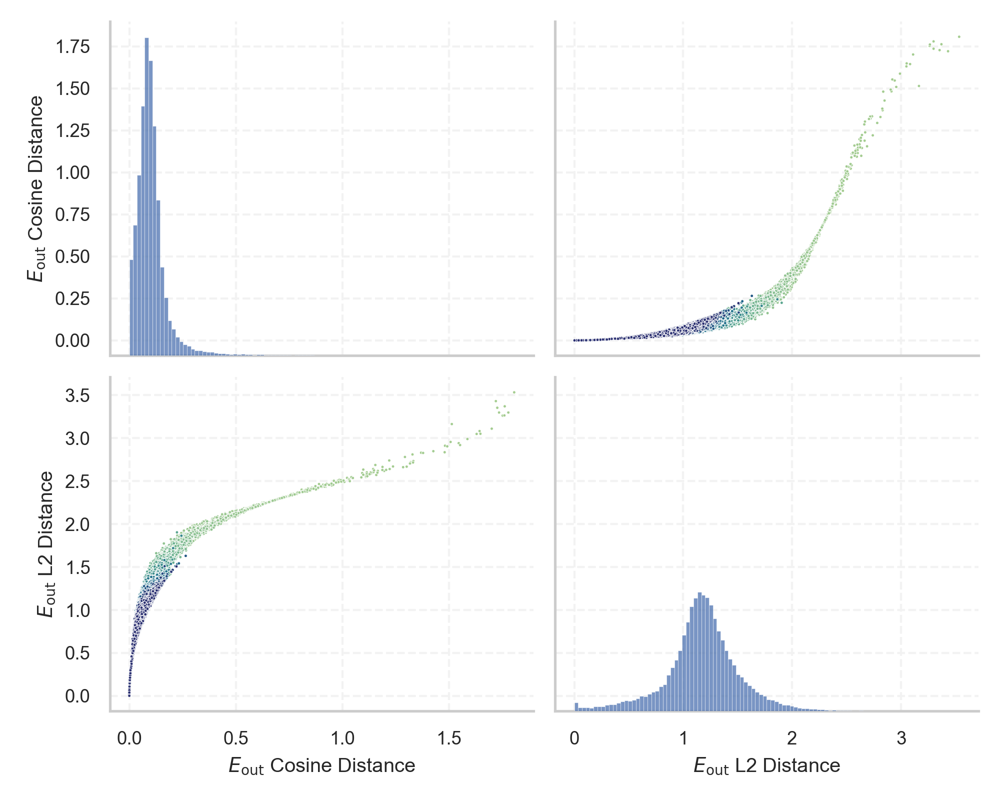
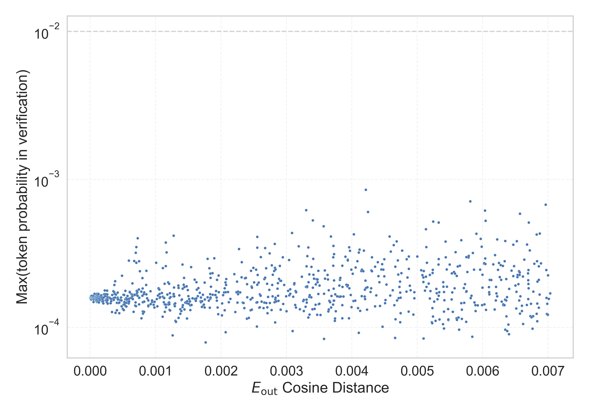

# Report for `checkpoints/step_80000`

## Model info

* Model Info: 
  * Tied embeddings: True
  * LM head uses bias: False
  * Embeddings shape: [50257, 1024]
* Tokenizer Info: 
  * Vocab Size: 50257
  * Tokenizer Class: GPT2Tokenizer
  * Tokenizer Type: BPE
  * Bytes handling: Byte Input
  * Token for verification prompt building: BuyableInstoreAndOnline
  * Token id for verification prompt building: 40242
* Indicator summary: 
  * Indicator for under-trained tokens: E_{out} Cosine Distance
  * Overall distribution: 0.105 +/- 0.093
* Detected Token Counts: 
  * Number of tested under-trained tokens: 1000, 968 non-special, 968 below p = 0.01 threshold, 966 below soft indicator threshold
  * Number of single byte tokens: 256, of which 51 below indicator threshold
  * Number of special tokens: 1, of which 1 below indicator threshold
  * Number of non-single-byte UTF-fragment tokens:  216, of which 40 below soft indicator threshold

## Under-trained token indicators plot


## Verification plot


## Under-trained token verification results
966 entries below threshold of 0.007

|   token_id | token                                                                        |    indicator | max_prob                                                         | in_other_tokens                                                                                                                                                                                                                                                                                                                                                                                                                               |
|------------|------------------------------------------------------------------------------|--------------|------------------------------------------------------------------|-----------------------------------------------------------------------------------------------------------------------------------------------------------------------------------------------------------------------------------------------------------------------------------------------------------------------------------------------------------------------------------------------------------------------------------------------|
|      22686 | ````` ▁\xa0▁\xa0▁\xa0▁\xa0 `````                                             | -3.57628e-07 | <span style='border: 1px solid rgb(169, 68, 66);'>0.00016</span> | <span style='border: 1px solid rgb(169, 68, 66);'>````` ▁\xa0▁\xa0▁\xa0▁\xa0▁\xa0▁\xa0▁\xa0▁\xa0 `````</span>                                                                                                                                                                                                                                                                                                                                 |
|      25658 | ````` ?????- `````                                                           | -3.57628e-07 | <span style='border: 1px solid rgb(169, 68, 66);'>0.00016</span> | <span style='border: 1px solid rgb(169, 68, 66);'>````` ?????-?????- `````</span>                                                                                                                                                                                                                                                                                                                                                             |
|      39714 | ````` isSpecial `````                                                        | -3.57628e-07 | <span style='border: 1px solid rgb(169, 68, 66);'>0.00016</span> | <span style='border: 1px solid rgb(169, 68, 66);'>````` isSpecialOrderable `````</span>                                                                                                                                                                                                                                                                                                                                                       |
|      40242 | ````` BuyableInstoreAndOnline `````                                          | -3.57628e-07 | <span style='border: 1px solid rgb(169, 68, 66);'>0.00016</span> |                                                                                                                                                                                                                                                                                                                                                                                                                                               |
|      25193 | ````` NetMessage `````                                                       | -2.38419e-07 | <span style='border: 1px solid rgb(169, 68, 66);'>0.00016</span> | <span style='border: 1px solid rgb(169, 68, 66);'>````` PsyNetMessage `````</span>                                                                                                                                                                                                                                                                                                                                                            |
|      37574 | ````` StreamerBot `````                                                      | -2.38419e-07 | <span style='border: 1px solid rgb(169, 68, 66);'>0.00016</span> | <span style='border: 1px solid rgb(169, 68, 66);'>````` TPPStreamerBot `````</span>                                                                                                                                                                                                                                                                                                                                                           |
|      41383 | ````` assetsadobe `````                                                      | -2.38419e-07 | <span style='border: 1px solid rgb(169, 68, 66);'>0.00016</span> |                                                                                                                                                                                                                                                                                                                                                                                                                                               |
|      42202 | ````` GoldMagikarp `````                                                     | -2.38419e-07 | <span style='border: 1px solid rgb(169, 68, 66);'>0.00016</span> | <span style='border: 1px solid rgb(169, 68, 66);'>````` ▁SolidGoldMagikarp `````</span>                                                                                                                                                                                                                                                                                                                                                       |
|       1849 | ````` \xa0 `````                                                             | -1.19209e-07 | <span style='border: 1px solid rgb(169, 68, 66);'>0.00016</span> | <span style='border: 1px solid rgb(169, 68, 66);'>````` \xa0\xa0 `````</span>, <span style='border: 1px solid rgb(169, 68, 66);'>````` ▁\xa0 `````</span>, <span style='border: 1px solid rgb(169, 68, 66);'>````` \xa0\xa0\xa0\xa0 `````</span>, <span style='border: 1px solid rgb(169, 68, 66);'>````` ▁\xa0▁\xa0 `````</span>, <span style='border: 1px solid rgb(169, 68, 66);'>````` \xa0\xa0\xa0\xa0\xa0\xa0\xa0\xa0 `````</span>, ... |
|      11504 | ````` ▁\xa0▁\xa0 `````                                                       | -1.19209e-07 | <span style='border: 1px solid rgb(169, 68, 66);'>0.00016</span> | <span style='border: 1px solid rgb(169, 68, 66);'>````` ▁\xa0▁\xa0▁\xa0▁\xa0 `````</span>, <span style='border: 1px solid rgb(169, 68, 66);'>````` ▁\xa0▁\xa0▁\xa0▁\xa0▁\xa0▁\xa0▁\xa0▁\xa0 `````</span>                                                                                                                                                                                                                                      |
|      17811 | ````` \xa0\xa0\xa0\xa0\xa0\xa0\xa0\xa0 `````                                 | -1.19209e-07 | <span style='border: 1px solid rgb(169, 68, 66);'>0.00016</span> | <span style='border: 1px solid rgb(169, 68, 66);'>````` \xa0\xa0\xa0\xa0\xa0\xa0\xa0\xa0\xa0\xa0\xa0\xa0\xa0\xa0\xa0\xa0 `````</span>                                                                                                                                                                                                                                                                                                         |
|      30209 | ````` ▁unfocusedRange `````                                                  | -1.19209e-07 | <span style='border: 1px solid rgb(169, 68, 66);'>0.00016</span> |                                                                                                                                                                                                                                                                                                                                                                                                                                               |
|      30899 | ````` cloneembedreportprint `````                                            | -1.19209e-07 | <span style='border: 1px solid rgb(169, 68, 66);'>0.00016</span> | ````` rawdownloadcloneembedreportprint `````                                                                                                                                                                                                                                                                                                                                                                                                  |
|      31032 | ````` SpaceEngineers `````                                                   | -1.19209e-07 | <span style='border: 1px solid rgb(169, 68, 66);'>0.00016</span> |                                                                                                                                                                                                                                                                                                                                                                                                                                               |
|      33477 | ````` \xa0\xa0\xa0 `````                                                     | -1.19209e-07 | <span style='border: 1px solid rgb(169, 68, 66);'>0.00016</span> | <span style='border: 1px solid rgb(169, 68, 66);'>````` \xa0\xa0\xa0\xa0\xa0\xa0\xa0\xa0\xa0\xa0\xa0\xa0\xa0\xa0\xa0\xa0 `````</span>                                                                                                                                                                                                                                                                                                         |
|      36929 | ````` ▁sidx `````                                                            | -1.19209e-07 | <span style='border: 1px solid rgb(169, 68, 66);'>0.00016</span> |                                                                                                                                                                                                                                                                                                                                                                                                                                               |
|      38370 | ````` iHUD `````                                                             | -1.19209e-07 | <span style='border: 1px solid rgb(169, 68, 66);'>0.00016</span> |                                                                                                                                                                                                                                                                                                                                                                                                                                               |
|      39172 | ````` \xa0\xa0\xa0\xa0\xa0\xa0\xa0\xa0\xa0\xa0\xa0\xa0\xa0\xa0\xa0\xa0 ````` | -1.19209e-07 | <span style='border: 1px solid rgb(169, 68, 66);'>0.00016</span> |                                                                                                                                                                                                                                                                                                                                                                                                                                               |
|      39446 | ````` ▁SetFontSize `````                                                     | -1.19209e-07 | <span style='border: 1px solid rgb(169, 68, 66);'>0.00016</span> |                                                                                                                                                                                                                                                                                                                                                                                                                                               |
|      42090 | ````` ▁TheNitromeFan `````                                                   | -1.19209e-07 | <span style='border: 1px solid rgb(169, 68, 66);'>0.00016</span> |                                                                                                                                                                                                                                                                                                                                                                                                                                               |
<details><summary>946 additional entries below threshold</summary>

|   token_id | token                                                                          |    indicator | max_prob                                                         | in_other_tokens                                                                                                                                                                                                                                                                                                                                                                                                                                                                                        |
|------------|--------------------------------------------------------------------------------|--------------|------------------------------------------------------------------|--------------------------------------------------------------------------------------------------------------------------------------------------------------------------------------------------------------------------------------------------------------------------------------------------------------------------------------------------------------------------------------------------------------------------------------------------------------------------------------------------------|
|      44320 | ````` \n\xa0 `````                                                             | -1.19209e-07 | <span style='border: 1px solid rgb(169, 68, 66);'>0.00016</span> |                                                                                                                                                                                                                                                                                                                                                                                                                                                                                                        |
|      47654 | ````` ▁\xa0\xa0 `````                                                          | -1.19209e-07 | <span style='border: 1px solid rgb(169, 68, 66);'>0.00016</span> |                                                                                                                                                                                                                                                                                                                                                                                                                                                                                                        |
|      17900 | ````` ▁Dragonbound `````                                                       |  0           | <span style='border: 1px solid rgb(169, 68, 66);'>0.00016</span> |                                                                                                                                                                                                                                                                                                                                                                                                                                                                                                        |
|      18472 | ````` ▁guiActive `````                                                         |  0           | <span style='border: 1px solid rgb(169, 68, 66);'>0.00016</span> | <span style='border: 1px solid rgb(169, 68, 66);'>````` ▁guiActiveUn `````</span>, <span style='border: 1px solid rgb(169, 68, 66);'>````` ▁guiActiveUnfocused `````</span>                                                                                                                                                                                                                                                                                                                            |
|      30211 | ````` ▁guiIcon `````                                                           |  0           | <span style='border: 1px solid rgb(169, 68, 66);'>0.00016</span> |                                                                                                                                                                                                                                                                                                                                                                                                                                                                                                        |
|      46600 | ````` ▁Adinida `````                                                           |  0           | <span style='border: 1px solid rgb(169, 68, 66);'>0.00016</span> |                                                                                                                                                                                                                                                                                                                                                                                                                                                                                                        |
|      12781 | ````` wcsstore `````                                                           |  5.96046e-08 | <span style='border: 1px solid rgb(169, 68, 66);'>0.00016</span> |                                                                                                                                                                                                                                                                                                                                                                                                                                                                                                        |
|      23282 | ````` ▁davidjl `````                                                           |  5.96046e-08 | <span style='border: 1px solid rgb(169, 68, 66);'>0.00016</span> |                                                                                                                                                                                                                                                                                                                                                                                                                                                                                                        |
|      25992 | ````` ▁裏覚醒 `````                                                            |  5.96046e-08 | <span style='border: 1px solid rgb(169, 68, 66);'>0.00016</span> |                                                                                                                                                                                                                                                                                                                                                                                                                                                                                                        |
|      31957 | ````` cffffcc `````                                                            |  5.96046e-08 | <span style='border: 1px solid rgb(169, 68, 66);'>0.00016</span> |                                                                                                                                                                                                                                                                                                                                                                                                                                                                                                        |
|      36935 | ````` ▁dstg `````                                                              |  5.96046e-08 | <span style='border: 1px solid rgb(169, 68, 66);'>0.00016</span> |                                                                                                                                                                                                                                                                                                                                                                                                                                                                                                        |
|      36940 | ````` ▁istg `````                                                              |  5.96046e-08 | <span style='border: 1px solid rgb(169, 68, 66);'>0.00016</span> |                                                                                                                                                                                                                                                                                                                                                                                                                                                                                                        |
|      39753 | ````` quickShipAvailable `````                                                 |  5.96046e-08 | <span style='border: 1px solid rgb(169, 68, 66);'>0.00016</span> |                                                                                                                                                                                                                                                                                                                                                                                                                                                                                                        |
|      39756 | ````` inventoryQuantity `````                                                  |  5.96046e-08 | <span style='border: 1px solid rgb(169, 68, 66);'>0.00016</span> |                                                                                                                                                                                                                                                                                                                                                                                                                                                                                                        |
|      39757 | ````` channelAvailability `````                                                |  5.96046e-08 | <span style='border: 1px solid rgb(169, 68, 66);'>0.00016</span> |                                                                                                                                                                                                                                                                                                                                                                                                                                                                                                        |
|      41551 | ````` Downloadha `````                                                         |  5.96046e-08 | <span style='border: 1px solid rgb(169, 68, 66);'>0.00016</span> |                                                                                                                                                                                                                                                                                                                                                                                                                                                                                                        |
|      45545 | ````` ▁サーティワン `````                                                      |  5.96046e-08 | <span style='border: 1px solid rgb(169, 68, 66);'>0.00016</span> |                                                                                                                                                                                                                                                                                                                                                                                                                                                                                                        |
|      30202 | ````` ▁guiName `````                                                           |  1.78814e-07 | <span style='border: 1px solid rgb(169, 68, 66);'>0.00016</span> |                                                                                                                                                                                                                                                                                                                                                                                                                                                                                                        |
|      30898 | ````` embedreportprint `````                                                   |  1.78814e-07 | <span style='border: 1px solid rgb(169, 68, 66);'>0.00016</span> | <span style='border: 1px solid rgb(169, 68, 66);'>````` cloneembedreportprint `````</span>, ````` rawdownloadcloneembedreportprint `````                                                                                                                                                                                                                                                                                                                                                               |
|      35207 | ````` ▁attRot `````                                                            |  1.78814e-07 | <span style='border: 1px solid rgb(169, 68, 66);'>0.00016</span> |                                                                                                                                                                                                                                                                                                                                                                                                                                                                                                        |
|      39803 | ````` soType `````                                                             |  1.78814e-07 | <span style='border: 1px solid rgb(169, 68, 66);'>0.00016</span> |                                                                                                                                                                                                                                                                                                                                                                                                                                                                                                        |
|      42089 | ````` ▁TheNitrome `````                                                        |  1.78814e-07 | <span style='border: 1px solid rgb(169, 68, 66);'>0.00016</span> | <span style='border: 1px solid rgb(169, 68, 66);'>````` ▁TheNitromeFan `````</span>                                                                                                                                                                                                                                                                                                                                                                                                                    |
|      45706 | ````` ▁\xa0▁\xa0▁\xa0▁\xa0▁\xa0▁\xa0▁\xa0▁\xa0 `````                           |  1.78814e-07 | <span style='border: 1px solid rgb(169, 68, 66);'>0.00016</span> |                                                                                                                                                                                                                                                                                                                                                                                                                                                                                                        |
|      47198 | ````` ItemTracker `````                                                        |  1.78814e-07 | <span style='border: 1px solid rgb(169, 68, 66);'>0.00016</span> |                                                                                                                                                                                                                                                                                                                                                                                                                                                                                                        |
|      47571 | ````` ▁DevOnline `````                                                         |  1.78814e-07 | <span style='border: 1px solid rgb(169, 68, 66);'>0.00016</span> |                                                                                                                                                                                                                                                                                                                                                                                                                                                                                                        |
|      48396 | ````` ÛÛ `````                                                                 |  1.78814e-07 | <span style='border: 1px solid rgb(169, 68, 66);'>0.00016</span> |                                                                                                                                                                                                                                                                                                                                                                                                                                                                                                        |
|      30208 | ````` ▁externalTo `````                                                        |  2.38419e-07 | <span style='border: 1px solid rgb(169, 68, 66);'>0.00016</span> | <span style='border: 1px solid rgb(169, 68, 66);'>````` ▁externalToEVA `````</span>, <span style='border: 1px solid rgb(169, 68, 66);'>````` ▁externalToEVAOnly `````</span>                                                                                                                                                                                                                                                                                                                           |
|      30212 | ````` ▁externalToEVA `````                                                     |  2.38419e-07 | <span style='border: 1px solid rgb(169, 68, 66);'>0.00016</span> | <span style='border: 1px solid rgb(169, 68, 66);'>````` ▁externalToEVAOnly `````</span>                                                                                                                                                                                                                                                                                                                                                                                                                |
|      30905 | ````` rawdownload `````                                                        |  2.38419e-07 | <span style='border: 1px solid rgb(169, 68, 66);'>0.00016</span> | ````` rawdownloadcloneembedreportprint `````                                                                                                                                                                                                                                                                                                                                                                                                                                                           |
|      36173 | ````` ▁RandomRedditor `````                                                    |  2.38419e-07 | <span style='border: 1px solid rgb(169, 68, 66);'>0.00016</span> | <span style='border: 1px solid rgb(169, 68, 66);'>````` ▁RandomRedditorWithNo `````</span>                                                                                                                                                                                                                                                                                                                                                                                                             |
|      39906 | ````` EStream `````                                                            |  2.38419e-07 | <span style='border: 1px solid rgb(169, 68, 66);'>0.00016</span> | <span style='border: 1px solid rgb(169, 68, 66);'>````` EStreamFrame `````</span>                                                                                                                                                                                                                                                                                                                                                                                                                      |
|      40240 | ````` oreAndOnline `````                                                       |  2.38419e-07 | <span style='border: 1px solid rgb(169, 68, 66);'>0.00016</span> | <span style='border: 1px solid rgb(169, 68, 66);'>````` InstoreAndOnline `````</span>, <span style='border: 1px solid rgb(169, 68, 66);'>````` BuyableInstoreAndOnline `````</span>                                                                                                                                                                                                                                                                                                                    |
|      43569 | ````` ÍÍ `````                                                                 |  2.38419e-07 | <span style='border: 1px solid rgb(169, 68, 66);'>0.00016</span> |                                                                                                                                                                                                                                                                                                                                                                                                                                                                                                        |
|      49781 | ````` EngineDebug `````                                                        |  2.38419e-07 | <span style='border: 1px solid rgb(169, 68, 66);'>0.00016</span> |                                                                                                                                                                                                                                                                                                                                                                                                                                                                                                        |
|      28666 | ````` PsyNetMessage `````                                                      |  3.57628e-07 | <span style='border: 1px solid rgb(169, 68, 66);'>0.00016</span> |                                                                                                                                                                                                                                                                                                                                                                                                                                                                                                        |
|      33454 | ````` 龍喚士 `````                                                             |  3.57628e-07 | <span style='border: 1px solid rgb(169, 68, 66);'>0.00016</span> |                                                                                                                                                                                                                                                                                                                                                                                                                                                                                                        |
|      37842 | ````` ▁partName `````                                                          |  3.57628e-07 | <span style='border: 1px solid rgb(169, 68, 66);'>0.00016</span> |                                                                                                                                                                                                                                                                                                                                                                                                                                                                                                        |
|      39752 | ````` quickShip `````                                                          |  3.57628e-07 | <span style='border: 1px solid rgb(169, 68, 66);'>0.00016</span> | <span style='border: 1px solid rgb(169, 68, 66);'>````` quickShipAvailable `````</span>                                                                                                                                                                                                                                                                                                                                                                                                                |
|      43453 | ````` ▁SolidGoldMagikarp `````                                                 |  3.57628e-07 | <span style='border: 1px solid rgb(169, 68, 66);'>0.00016</span> |                                                                                                                                                                                                                                                                                                                                                                                                                                                                                                        |
|      45544 | ````` ▁サーティ `````                                                          |  3.57628e-07 | <span style='border: 1px solid rgb(169, 68, 66);'>0.00016</span> | <span style='border: 1px solid rgb(169, 68, 66);'>````` ▁サーティワン `````</span>                                                                                                                                                                                                                                                                                                                                                                                                                     |
|      30897 | ````` reportprint `````                                                        |  4.17233e-07 | <span style='border: 1px solid rgb(169, 68, 66);'>0.00016</span> | <span style='border: 1px solid rgb(169, 68, 66);'>````` embedreportprint `````</span>, <span style='border: 1px solid rgb(169, 68, 66);'>````` cloneembedreportprint `````</span>, ````` rawdownloadcloneembedreportprint `````                                                                                                                                                                                                                                                                        |
|      31666 | ````` ?????-?????- `````                                                       |  4.17233e-07 | <span style='border: 1px solid rgb(169, 68, 66);'>0.00016</span> |                                                                                                                                                                                                                                                                                                                                                                                                                                                                                                        |
|      37579 | ````` TPPStreamerBot `````                                                     |  4.17233e-07 | <span style='border: 1px solid rgb(169, 68, 66);'>0.00016</span> |                                                                                                                                                                                                                                                                                                                                                                                                                                                                                                        |
|      41380 | ````` natureconservancy `````                                                  |  4.17233e-07 | <span style='border: 1px solid rgb(169, 68, 66);'>0.00016</span> |                                                                                                                                                                                                                                                                                                                                                                                                                                                                                                        |
|      32047 | ````` ▁"$:/ `````                                                              |  4.76837e-07 | <span style='border: 1px solid rgb(169, 68, 66);'>0.00016</span> |                                                                                                                                                                                                                                                                                                                                                                                                                                                                                                        |
|      39177 | ````` ItemThumbnailImage `````                                                 |  4.76837e-07 | <span style='border: 1px solid rgb(169, 68, 66);'>0.00016</span> |                                                                                                                                                                                                                                                                                                                                                                                                                                                                                                        |
|      39755 | ````` isSpecialOrderable `````                                                 |  4.76837e-07 | <span style='border: 1px solid rgb(169, 68, 66);'>0.00016</span> |                                                                                                                                                                                                                                                                                                                                                                                                                                                                                                        |
|      39821 | ````` 龍契士 `````                                                             |  4.76837e-07 | <span style='border: 1px solid rgb(169, 68, 66);'>0.00016</span> |                                                                                                                                                                                                                                                                                                                                                                                                                                                                                                        |
|      42586 | ````` ▁srfN `````                                                              |  4.76837e-07 | <span style='border: 1px solid rgb(169, 68, 66);'>0.00016</span> |                                                                                                                                                                                                                                                                                                                                                                                                                                                                                                        |
|      43065 | ````` ▁srfAttach `````                                                         |  4.76837e-07 | <span style='border: 1px solid rgb(169, 68, 66);'>0.00016</span> |                                                                                                                                                                                                                                                                                                                                                                                                                                                                                                        |
|      45003 | ````` ▁SetTextColor `````                                                      |  4.76837e-07 | <span style='border: 1px solid rgb(169, 68, 66);'>0.00016</span> |                                                                                                                                                                                                                                                                                                                                                                                                                                                                                                        |
|       4603 | ````` \xa0\xa0 `````                                                           |  5.96046e-07 | <span style='border: 1px solid rgb(169, 68, 66);'>0.00016</span> | <span style='border: 1px solid rgb(169, 68, 66);'>````` \xa0\xa0\xa0\xa0 `````</span>, <span style='border: 1px solid rgb(169, 68, 66);'>````` \xa0\xa0\xa0\xa0\xa0\xa0\xa0\xa0 `````</span>, <span style='border: 1px solid rgb(169, 68, 66);'>````` \xa0\xa0\xa0 `````</span>, <span style='border: 1px solid rgb(169, 68, 66);'>````` \xa0\xa0\xa0\xa0\xa0\xa0\xa0\xa0\xa0\xa0\xa0\xa0\xa0\xa0\xa0\xa0 `````</span>, <span style='border: 1px solid rgb(169, 68, 66);'>````` ▁\xa0\xa0 `````</span> |
|      11974 | ````` ▁Tradable `````                                                          |  5.96046e-07 | <span style='border: 1px solid rgb(169, 68, 66);'>0.00016</span> |                                                                                                                                                                                                                                                                                                                                                                                                                                                                                                        |
|      25502 | ````` ItemImage `````                                                          |  5.96046e-07 | <span style='border: 1px solid rgb(169, 68, 66);'>0.00016</span> |                                                                                                                                                                                                                                                                                                                                                                                                                                                                                                        |
|      33813 | ````` =~=~ `````                                                               |  5.96046e-07 | <span style='border: 1px solid rgb(169, 68, 66);'>0.00016</span> |                                                                                                                                                                                                                                                                                                                                                                                                                                                                                                        |
|      30210 | ````` ▁guiActiveUnfocused `````                                                |  6.55651e-07 | <span style='border: 1px solid rgb(169, 68, 66);'>0.00016</span> |                                                                                                                                                                                                                                                                                                                                                                                                                                                                                                        |
|      36174 | ````` ▁RandomRedditorWithNo `````                                              |  6.55651e-07 | <span style='border: 1px solid rgb(169, 68, 66);'>0.00016</span> |                                                                                                                                                                                                                                                                                                                                                                                                                                                                                                        |
|      43177 | ````` EStreamFrame `````                                                       |  6.55651e-07 | <span style='border: 1px solid rgb(169, 68, 66);'>0.00016</span> |                                                                                                                                                                                                                                                                                                                                                                                                                                                                                                        |
|      50009 | ````` ▁strutConnector `````                                                    |  6.55651e-07 | <span style='border: 1px solid rgb(169, 68, 66);'>0.00016</span> |                                                                                                                                                                                                                                                                                                                                                                                                                                                                                                        |
|       8828 | ````` \xa0\xa0\xa0\xa0 `````                                                   |  7.15256e-07 | <span style='border: 1px solid rgb(169, 68, 66);'>0.00016</span> | <span style='border: 1px solid rgb(169, 68, 66);'>````` \xa0\xa0\xa0\xa0\xa0\xa0\xa0\xa0 `````</span>, <span style='border: 1px solid rgb(169, 68, 66);'>````` \xa0\xa0\xa0\xa0\xa0\xa0\xa0\xa0\xa0\xa0\xa0\xa0\xa0\xa0\xa0\xa0 `````</span>                                                                                                                                                                                                                                                           |
|       9364 | ````` ÃÂÃÂÃÂÃÂ `````                                                           |  7.15256e-07 | <span style='border: 1px solid rgb(169, 68, 66);'>0.00016</span> | <span style='border: 1px solid rgb(169, 68, 66);'>````` ÃÂÃÂÃÂÃÂÃÂÃÂÃÂÃÂ `````</span>, <span style='border: 1px solid rgb(169, 68, 66);'>````` ÃÂÃÂÃÂÃÂÃÂÃÂÃÂÃÂÃÂÃÂÃÂÃÂÃÂÃÂÃÂÃÂ `````</span>, <span style='border: 1px solid rgb(169, 68, 66);'>````` ÃÂÃÂÃÂÃÂÃÂÃÂÃÂÃÂÃÂÃÂÃÂÃÂÃÂÃÂÃÂÃÂÃÂÃÂÃÂÃÂÃÂÃÂÃÂÃÂÃÂÃÂÃÂÃÂÃÂÃÂÃÂÃÂ `````</span>                                                                                                                                                                    |
|      34206 | ````` #$#$ `````                                                               |  7.15256e-07 | <span style='border: 1px solid rgb(169, 68, 66);'>0.00016</span> |                                                                                                                                                                                                                                                                                                                                                                                                                                                                                                        |
|      39811 | ````` soDeliveryDate `````                                                     |  7.15256e-07 | <span style='border: 1px solid rgb(169, 68, 66);'>0.00016</span> |                                                                                                                                                                                                                                                                                                                                                                                                                                                                                                        |
|       5624 | ````` ▁\xa0 `````                                                              |  8.34465e-07 | <span style='border: 1px solid rgb(169, 68, 66);'>0.00016</span> | <span style='border: 1px solid rgb(169, 68, 66);'>````` ▁\xa0▁\xa0 `````</span>, <span style='border: 1px solid rgb(169, 68, 66);'>````` ▁\xa0▁\xa0▁\xa0▁\xa0 `````</span>, <span style='border: 1px solid rgb(169, 68, 66);'>````` ▁\xa0▁\xa0▁\xa0▁\xa0▁\xa0▁\xa0▁\xa0▁\xa0 `````</span>, <span style='border: 1px solid rgb(169, 68, 66);'>````` ▁\xa0\xa0 `````</span>                                                                                                                              |
|      34027 | ````` ▁actionGroup `````                                                       |  8.9407e-07  | <span style='border: 1px solid rgb(169, 68, 66);'>0.00016</span> |                                                                                                                                                                                                                                                                                                                                                                                                                                                                                                        |
|      36130 | ````` ▁PsyNet `````                                                            |  8.9407e-07  | <span style='border: 1px solid rgb(169, 68, 66);'>0.00016</span> |                                                                                                                                                                                                                                                                                                                                                                                                                                                                                                        |
|      36938 | ````` ▁sqor `````                                                              |  1.01328e-06 | <span style='border: 1px solid rgb(169, 68, 66);'>0.00016</span> |                                                                                                                                                                                                                                                                                                                                                                                                                                                                                                        |
|      40219 | ````` oreAnd `````                                                             |  1.01328e-06 | <span style='border: 1px solid rgb(169, 68, 66);'>0.00016</span> | <span style='border: 1px solid rgb(169, 68, 66);'>````` oreAndOnline `````</span>, <span style='border: 1px solid rgb(169, 68, 66);'>````` InstoreAndOnline `````</span>, <span style='border: 1px solid rgb(169, 68, 66);'>````` BuyableInstoreAndOnline `````</span>                                                                                                                                                                                                                                 |
|      42424 | ````` DragonMagazine `````                                                     |  1.01328e-06 | <span style='border: 1px solid rgb(169, 68, 66);'>0.00016</span> |                                                                                                                                                                                                                                                                                                                                                                                                                                                                                                        |
|      32437 | ````` ▁Smartstocks `````                                                       |  1.07288e-06 | <span style='border: 1px solid rgb(169, 68, 66);'>0.00016</span> |                                                                                                                                                                                                                                                                                                                                                                                                                                                                                                        |
|      40241 | ````` InstoreAndOnline `````                                                   |  1.07288e-06 | <span style='border: 1px solid rgb(169, 68, 66);'>0.00016</span> | <span style='border: 1px solid rgb(169, 68, 66);'>````` BuyableInstoreAndOnline `````</span>                                                                                                                                                                                                                                                                                                                                                                                                           |
|      39749 | ````` DeliveryDate `````                                                       |  1.13249e-06 | <span style='border: 1px solid rgb(169, 68, 66);'>0.00016</span> | <span style='border: 1px solid rgb(169, 68, 66);'>````` soDeliveryDate `````</span>                                                                                                                                                                                                                                                                                                                                                                                                                    |
|      41297 | ````` ▁TAMADRA `````                                                           |  1.3113e-06  | <span style='border: 1px solid rgb(169, 68, 66);'>0.00016</span> |                                                                                                                                                                                                                                                                                                                                                                                                                                                                                                        |
|      30213 | ````` ▁externalToEVAOnly `````                                                 |  1.49012e-06 | <span style='border: 1px solid rgb(169, 68, 66);'>0.00016</span> |                                                                                                                                                                                                                                                                                                                                                                                                                                                                                                        |
|       8980 | ````` ¯¯¯¯ `````                                                               |  1.72853e-06 | <span style='border: 1px solid rgb(169, 68, 66);'>0.00016</span> | <span style='border: 1px solid rgb(169, 68, 66);'>````` ¯¯¯¯¯¯¯¯ `````</span>, <span style='border: 1px solid rgb(169, 68, 66);'>````` ¯¯¯¯¯¯¯¯¯¯¯¯¯¯¯¯ `````</span>                                                                                                                                                                                                                                                                                                                                   |
|      39693 | ````` Buyable `````                                                            |  1.72853e-06 | <span style='border: 1px solid rgb(169, 68, 66);'>0.00016</span> | <span style='border: 1px solid rgb(169, 68, 66);'>````` BuyableInstoreAndOnline `````</span>                                                                                                                                                                                                                                                                                                                                                                                                           |
|      45392 | ````` dayName `````                                                            |  1.72853e-06 | <span style='border: 1px solid rgb(169, 68, 66);'>0.00016</span> |                                                                                                                                                                                                                                                                                                                                                                                                                                                                                                        |
|      31573 | ````` ActionCode `````                                                         |  1.84774e-06 | <span style='border: 1px solid rgb(169, 68, 66);'>0.00016</span> | <span style='border: 1px solid rgb(169, 68, 66);'>````` externalActionCode `````</span>                                                                                                                                                                                                                                                                                                                                                                                                                |
|      29372 | ````` ▁guiActiveUn `````                                                       |  1.90735e-06 | <span style='border: 1px solid rgb(169, 68, 66);'>0.00016</span> | <span style='border: 1px solid rgb(169, 68, 66);'>````` ▁guiActiveUnfocused `````</span>                                                                                                                                                                                                                                                                                                                                                                                                               |
|      19476 | ````` ▁carbohyd `````                                                          |  2.14577e-06 | <span style='border: 1px solid rgb(169, 68, 66);'>0.00016</span> | ````` ▁carbohydrate `````, ````` ▁carbohydrates `````                                                                                                                                                                                                                                                                                                                                                                                                                                                  |
|      39142 | ````` ThumbnailImage `````                                                     |  2.14577e-06 | <span style='border: 1px solid rgb(169, 68, 66);'>0.00016</span> | <span style='border: 1px solid rgb(169, 68, 66);'>````` ItemThumbnailImage `````</span>                                                                                                                                                                                                                                                                                                                                                                                                                |
|      34448 | ````` ▁ItemLevel `````                                                         |  2.32458e-06 | <span style='border: 1px solid rgb(169, 68, 66);'>0.00016</span> |                                                                                                                                                                                                                                                                                                                                                                                                                                                                                                        |
|      23090 | ````` ÃÂÃÂÃÂÃÂÃÂÃÂÃÂÃÂÃÂÃÂÃÂÃÂÃÂÃÂÃÂÃÂ `````                                   |  3.15905e-06 | <span style='border: 1px solid rgb(169, 68, 66);'>0.00016</span> | <span style='border: 1px solid rgb(169, 68, 66);'>````` ÃÂÃÂÃÂÃÂÃÂÃÂÃÂÃÂÃÂÃÂÃÂÃÂÃÂÃÂÃÂÃÂÃÂÃÂÃÂÃÂÃÂÃÂÃÂÃÂÃÂÃÂÃÂÃÂÃÂÃÂÃÂÃÂ `````</span>                                                                                                                                                                                                                                                                                                                                                                  |
|      27006 | ````` ¯¯¯¯¯¯¯¯¯¯¯¯¯¯¯¯ `````                                                   |  3.33786e-06 | <span style='border: 1px solid rgb(169, 68, 66);'>0.00016</span> |                                                                                                                                                                                                                                                                                                                                                                                                                                                                                                        |
|      36926 | ````` ▁attm `````                                                              |  3.33786e-06 | <span style='border: 1px solid rgb(169, 68, 66);'>0.00016</span> |                                                                                                                                                                                                                                                                                                                                                                                                                                                                                                        |
|      39165 | ````` catentry `````                                                           |  3.45707e-06 | <span style='border: 1px solid rgb(169, 68, 66);'>0.00016</span> |                                                                                                                                                                                                                                                                                                                                                                                                                                                                                                        |
|      23785 | ````` "]=> `````                                                               |  3.63588e-06 | <span style='border: 1px solid rgb(169, 68, 66);'>0.00016</span> |                                                                                                                                                                                                                                                                                                                                                                                                                                                                                                        |
|      24973 | ````` ▁exting `````                                                            |  3.63588e-06 | <span style='border: 1px solid rgb(169, 68, 66);'>0.00016</span> | ````` ▁extingu `````, ````` ▁extinguished `````                                                                                                                                                                                                                                                                                                                                                                                                                                                        |
|       7105 | ````` ▁volunte `````                                                           |  4.05312e-06 | <span style='border: 1px solid rgb(169, 68, 66);'>0.00016</span> | ````` ▁volunteers `````, ````` ▁volunteer `````, ````` ▁volunteered `````, ````` ▁volunteering `````                                                                                                                                                                                                                                                                                                                                                                                                   |
|      34473 | ````` ヘラ `````                                                               |  4.23193e-06 | <span style='border: 1px solid rgb(169, 68, 66);'>0.00016</span> |                                                                                                                                                                                                                                                                                                                                                                                                                                                                                                        |
|      45563 | ````` ⓘ `````                                                                  |  4.23193e-06 | <span style='border: 1px solid rgb(169, 68, 66);'>0.00016</span> |                                                                                                                                                                                                                                                                                                                                                                                                                                                                                                        |
|      20554 | ````` ▁unbeliev `````                                                          |  4.29153e-06 | <span style='border: 1px solid rgb(169, 68, 66);'>0.00016</span> | ````` ▁unbelievable `````, ````` ▁unbelievably `````                                                                                                                                                                                                                                                                                                                                                                                                                                                   |
|      42066 | ````` Nitrome `````                                                            |  4.29153e-06 | <span style='border: 1px solid rgb(169, 68, 66);'>0.00016</span> | <span style='border: 1px solid rgb(169, 68, 66);'>````` ▁TheNitrome `````</span>, <span style='border: 1px solid rgb(169, 68, 66);'>````` ▁TheNitromeFan `````</span>                                                                                                                                                                                                                                                                                                                                  |
|      13150 | ````` ▁subur `````                                                             |  4.35114e-06 | <span style='border: 1px solid rgb(169, 68, 66);'>0.00016</span> | ````` ▁suburban `````, ````` ▁suburbs `````, ````` ▁suburb `````                                                                                                                                                                                                                                                                                                                                                                                                                                       |
|      24847 | ````` ModLoader `````                                                          |  4.64916e-06 | <span style='border: 1px solid rgb(169, 68, 66);'>0.00016</span> | <span style='border: 1px solid rgb(169, 68, 66);'>````` ForgeModLoader `````</span>                                                                                                                                                                                                                                                                                                                                                                                                                    |
|      48448 | ````` iosyn `````                                                              |  5.78165e-06 | <span style='border: 1px solid rgb(169, 68, 66);'>0.00016</span> | <span style='border: 1px solid rgb(169, 68, 66);'>````` iosyncr `````</span>, ````` ▁idiosyncr `````                                                                                                                                                                                                                                                                                                                                                                                                   |
|      40278 | ````` */( `````                                                                |  5.90086e-06 | <span style='border: 1px solid rgb(169, 68, 66);'>0.00016</span> |                                                                                                                                                                                                                                                                                                                                                                                                                                                                                                        |
|      36473 | ````` luaj `````                                                               |  6.31809e-06 | <span style='border: 1px solid rgb(169, 68, 66);'>0.00016</span> |                                                                                                                                                                                                                                                                                                                                                                                                                                                                                                        |
|      43010 | ````` ▁Kinnikuman `````                                                        |  7.27177e-06 | <span style='border: 1px solid rgb(169, 68, 66);'>0.00016</span> |                                                                                                                                                                                                                                                                                                                                                                                                                                                                                                        |
|      36862 | ````` EMOTE `````                                                              |  7.39098e-06 | <span style='border: 1px solid rgb(169, 68, 66);'>0.00016</span> |                                                                                                                                                                                                                                                                                                                                                                                                                                                                                                        |
|      25618 | ````` ▁councill `````                                                          |  7.51019e-06 | <span style='border: 1px solid rgb(169, 68, 66);'>0.00016</span> | ````` ▁councillor `````, ````` ▁councillors `````                                                                                                                                                                                                                                                                                                                                                                                                                                                      |
|      35579 | ````` ▁Mechdragon `````                                                        |  7.51019e-06 | <span style='border: 1px solid rgb(169, 68, 66);'>0.00016</span> |                                                                                                                                                                                                                                                                                                                                                                                                                                                                                                        |
|      15243 | ````` ¯¯¯¯¯¯¯¯ `````                                                           |  7.62939e-06 | <span style='border: 1px solid rgb(169, 68, 66);'>0.00016</span> | <span style='border: 1px solid rgb(169, 68, 66);'>````` ¯¯¯¯¯¯¯¯¯¯¯¯¯¯¯¯ `````</span>                                                                                                                                                                                                                                                                                                                                                                                                                  |
|      38250 | ````` ▁Skydragon `````                                                         |  7.62939e-06 | <span style='border: 1px solid rgb(169, 68, 66);'>0.00016</span> |                                                                                                                                                                                                                                                                                                                                                                                                                                                                                                        |
|      39655 | ````` Orderable `````                                                          |  8.04663e-06 | <span style='border: 1px solid rgb(169, 68, 66);'>0.00016</span> | <span style='border: 1px solid rgb(169, 68, 66);'>````` isSpecialOrderable `````</span>                                                                                                                                                                                                                                                                                                                                                                                                                |
|       6438 | ````` ▁裏 `````                                                                |  8.9407e-06  | <span style='border: 1px solid rgb(169, 68, 66);'>0.00016</span> | ````` ▁裏<0xE7> `````, <span style='border: 1px solid rgb(169, 68, 66);'>````` ▁裏覚醒 `````</span>, ````` ▁裏<0xE8> `````                                                                                                                                                                                                                                                                                                                                                                             |
|      14827 | ````` ÃÂÃÂÃÂÃÂÃÂÃÂÃÂÃÂ `````                                                   |  9.77516e-06 | <span style='border: 1px solid rgb(169, 68, 66);'>0.00016</span> | <span style='border: 1px solid rgb(169, 68, 66);'>````` ÃÂÃÂÃÂÃÂÃÂÃÂÃÂÃÂÃÂÃÂÃÂÃÂÃÂÃÂÃÂÃÂ `````</span>, <span style='border: 1px solid rgb(169, 68, 66);'>````` ÃÂÃÂÃÂÃÂÃÂÃÂÃÂÃÂÃÂÃÂÃÂÃÂÃÂÃÂÃÂÃÂÃÂÃÂÃÂÃÂÃÂÃÂÃÂÃÂÃÂÃÂÃÂÃÂÃÂÃÂÃÂÃÂ `````</span>                                                                                                                                                                                                                                                           |
|      40012 | ````` uyomi `````                                                              |  1.00136e-05 | <span style='border: 1px solid rgb(169, 68, 66);'>0.00016</span> | <span style='border: 1px solid rgb(169, 68, 66);'>````` ▁Tsukuyomi `````</span>                                                                                                                                                                                                                                                                                                                                                                                                                        |
|      34516 | ````` >>\ `````                                                                |  1.0252e-05  | <span style='border: 1px solid rgb(169, 68, 66);'>0.00016</span> |                                                                                                                                                                                                                                                                                                                                                                                                                                                                                                        |
|      27924 | ````` ▁srf `````                                                               |  1.04308e-05 | <span style='border: 1px solid rgb(169, 68, 66);'>0.00016</span> | <span style='border: 1px solid rgb(169, 68, 66);'>````` ▁srfN `````</span>, <span style='border: 1px solid rgb(169, 68, 66);'>````` ▁srfAttach `````</span>                                                                                                                                                                                                                                                                                                                                            |
|       4060 | ````` vertisement `````                                                        |  1.14441e-05 | <span style='border: 1px solid rgb(169, 68, 66);'>0.00016</span> | ````` Advertisement `````, ````` vertisements `````, ````` Advertisements `````, ````` ▁advertisement `````, ````` ▁advertisements `````, ...                                                                                                                                                                                                                                                                                                                                                          |
|       8994 | ````` ailability `````                                                         |  1.21593e-05 | <span style='border: 1px solid rgb(169, 68, 66);'>0.00016</span> | ````` ▁availability `````, ````` Availability `````, <span style='border: 1px solid rgb(169, 68, 66);'>````` channelAvailability `````</span>, ````` ▁Availability `````, ````` availability `````                                                                                                                                                                                                                                                                                                     |
|      15272 | ````` ▁pione `````                                                             |  1.22786e-05 | <span style='border: 1px solid rgb(169, 68, 66);'>0.00016</span> | ````` ▁pioneer `````, ````` ▁pioneering `````, ````` ▁pioneers `````, ````` ▁pioneered `````                                                                                                                                                                                                                                                                                                                                                                                                           |
|      47182 | ````` ":""},{" `````                                                           |  1.40071e-05 | <span style='border: 1px solid rgb(169, 68, 66);'>0.00015</span> |                                                                                                                                                                                                                                                                                                                                                                                                                                                                                                        |
|      13171 | ````` VIDIA `````                                                              |  1.41263e-05 | <span style='border: 1px solid rgb(169, 68, 66);'>0.00016</span> | ````` ▁NVIDIA `````, ````` NVIDIA `````                                                                                                                                                                                                                                                                                                                                                                                                                                                                |
|       4690 | ````` ortunately `````                                                         |  1.47223e-05 | <span style='border: 1px solid rgb(169, 68, 66);'>0.00016</span> | ````` fortunately `````, ````` ▁Unfortunately `````, ````` ▁unfortunately `````, ````` Unfortunately `````, ````` ▁Fortunately `````, ...                                                                                                                                                                                                                                                                                                                                                              |
|      34604 | ````` \\\\\\\\\\\\\\\\ `````                                                   |  1.54972e-05 | <span style='border: 1px solid rgb(169, 68, 66);'>0.00016</span> |                                                                                                                                                                                                                                                                                                                                                                                                                                                                                                        |
|      48366 | ````` ◼ `````                                                                  |  1.62721e-05 | <span style='border: 1px solid rgb(169, 68, 66);'>0.00016</span> |                                                                                                                                                                                                                                                                                                                                                                                                                                                                                                        |
|       5367 | ````` ¯¯ `````                                                                 |  1.70469e-05 | <span style='border: 1px solid rgb(169, 68, 66);'>0.00016</span> | <span style='border: 1px solid rgb(169, 68, 66);'>````` ¯¯¯¯ `````</span>, <span style='border: 1px solid rgb(169, 68, 66);'>````` ¯¯¯¯¯¯¯¯ `````</span>, <span style='border: 1px solid rgb(169, 68, 66);'>````` ¯¯¯¯¯¯¯¯¯¯¯¯¯¯¯¯ `````</span>                                                                                                                                                                                                                                                        |
|      35992 | ````` WithNo `````                                                             |  1.9908e-05  | <span style='border: 1px solid rgb(169, 68, 66);'>0.00016</span> | <span style='border: 1px solid rgb(169, 68, 66);'>````` ▁RandomRedditorWithNo `````</span>                                                                                                                                                                                                                                                                                                                                                                                                             |
|      14695 | ````` ▁eleph `````                                                             |  2.11596e-05 | <span style='border: 1px solid rgb(169, 68, 66);'>0.00016</span> | ````` ▁elephant `````, ````` ▁elephants `````                                                                                                                                                                                                                                                                                                                                                                                                                                                          |
|      42889 | ````` ikuman `````                                                             |  2.59876e-05 | <span style='border: 1px solid rgb(169, 68, 66);'>0.00016</span> | <span style='border: 1px solid rgb(169, 68, 66);'>````` ▁Kinnikuman `````</span>                                                                                                                                                                                                                                                                                                                                                                                                                       |
|      48908 | ````` ▁4090 `````                                                              |  2.77162e-05 | <span style='border: 1px solid rgb(169, 68, 66);'>0.00016</span> |                                                                                                                                                                                                                                                                                                                                                                                                                                                                                                        |
|      49997 | ````` ahime `````                                                              |  3.12924e-05 | <span style='border: 1px solid rgb(169, 68, 66);'>0.00016</span> |                                                                                                                                                                                                                                                                                                                                                                                                                                                                                                        |
|       9286 | ````` ▁exha `````                                                              |  3.29018e-05 | <span style='border: 1px solid rgb(169, 68, 66);'>0.00016</span> | ````` ▁exhaust `````, ````` ▁exhausted `````, ````` ▁exhaustion `````, ````` ▁exhaustive `````, ````` ▁exhausting `````                                                                                                                                                                                                                                                                                                                                                                                |
|      37444 | ````` ▁petertodd `````                                                         |  3.45707e-05 | <span style='border: 1px solid rgb(169, 68, 66);'>0.00016</span> |                                                                                                                                                                                                                                                                                                                                                                                                                                                                                                        |
|      35496 | ````` ÃÂÃÂÃÂÃÂÃÂÃÂÃÂÃÂÃÂÃÂÃÂÃÂÃÂÃÂÃÂÃÂÃÂÃÂÃÂÃÂÃÂÃÂÃÂÃÂÃÂÃÂÃÂÃÂÃÂÃÂÃÂÃÂ `````   |  3.72529e-05 | <span style='border: 1px solid rgb(169, 68, 66);'>0.00016</span> |                                                                                                                                                                                                                                                                                                                                                                                                                                                                                                        |
|      30439 | ````` ▁unintention `````                                                       |  3.91603e-05 | <span style='border: 1px solid rgb(169, 68, 66);'>0.00016</span> | ````` ▁unintentionally `````, ````` ▁unintentional `````                                                                                                                                                                                                                                                                                                                                                                                                                                               |
|      43796 | ````` ▁Tsukuyomi `````                                                         |  4.00543e-05 | <span style='border: 1px solid rgb(169, 68, 66);'>0.00016</span> |                                                                                                                                                                                                                                                                                                                                                                                                                                                                                                        |
|      48193 | ````` @#& `````                                                                |  4.11272e-05 | <span style='border: 1px solid rgb(169, 68, 66);'>0.00016</span> |                                                                                                                                                                                                                                                                                                                                                                                                                                                                                                        |
|      30684 | ````` ▁ⓘ `````                                                                 |  4.39882e-05 | <span style='border: 1px solid rgb(169, 68, 66);'>0.00016</span> |                                                                                                                                                                                                                                                                                                                                                                                                                                                                                                        |
|      22315 | ````` ▁newcom `````                                                            |  5.03063e-05 | <span style='border: 1px solid rgb(169, 68, 66);'>0.00016</span> | ````` ▁newcomers `````, ````` ▁newcomer `````                                                                                                                                                                                                                                                                                                                                                                                                                                                          |
|      17629 | ````` ▁practition `````                                                        |  5.03659e-05 | <span style='border: 1px solid rgb(169, 68, 66);'>0.00016</span> | ````` ▁practitioners `````, ````` ▁practitioner `````                                                                                                                                                                                                                                                                                                                                                                                                                                                  |
|      10298 | ````` senal `````                                                              |  5.06639e-05 | <span style='border: 1px solid rgb(169, 68, 66);'>0.00015</span> | ````` ▁Arsenal `````, ````` ▁arsenal `````, ````` Arsenal `````                                                                                                                                                                                                                                                                                                                                                                                                                                        |
|      26642 | ````` tnc `````                                                                |  5.06639e-05 | <span style='border: 1px solid rgb(169, 68, 66);'>0.00016</span> |                                                                                                                                                                                                                                                                                                                                                                                                                                                                                                        |
|      48069 | ````` *=- `````                                                                |  5.126e-05   | <span style='border: 1px solid rgb(169, 68, 66);'>0.00015</span> |                                                                                                                                                                                                                                                                                                                                                                                                                                                                                                        |
|      49813 | ````` ▁Flavoring `````                                                         |  5.52535e-05 | <span style='border: 1px solid rgb(169, 68, 66);'>0.00016</span> |                                                                                                                                                                                                                                                                                                                                                                                                                                                                                                        |
|      11273 | ````` ▁enthusi `````                                                           |  6.17504e-05 | <span style='border: 1px solid rgb(169, 68, 66);'>0.00016</span> | ````` ▁enthusiasm `````, ````` ▁enthusiastic `````, ````` ▁enthusiasts `````, ````` ▁enthusiast `````, ````` ▁enthusiastically `````                                                                                                                                                                                                                                                                                                                                                                   |
|       7782 | ````` ▁occas `````                                                             |  6.56843e-05 | <span style='border: 1px solid rgb(169, 68, 66);'>0.00016</span> | ````` ▁occasionally `````, ````` ▁occasional `````, ````` ▁occasions `````                                                                                                                                                                                                                                                                                                                                                                                                                             |
|      24934 | ````` ForgeModLoader `````                                                     |  6.61612e-05 | <span style='border: 1px solid rgb(169, 68, 66);'>0.00017</span> |                                                                                                                                                                                                                                                                                                                                                                                                                                                                                                        |
|      18945 | ````` ▁teasp `````                                                             |  6.78897e-05 | <span style='border: 1px solid rgb(169, 68, 66);'>0.00016</span> | ````` ▁teaspoon `````, ````` ▁teaspoons `````                                                                                                                                                                                                                                                                                                                                                                                                                                                          |
|       5808 | ````` ÃÂ `````                                                                 |  6.9797e-05  | <span style='border: 1px solid rgb(169, 68, 66);'>0.00016</span> | <span style='border: 1px solid rgb(169, 68, 66);'>````` ÃÂÃÂ `````</span>, <span style='border: 1px solid rgb(169, 68, 66);'>````` ÃÂÃÂÃÂÃÂ `````</span>, <span style='border: 1px solid rgb(169, 68, 66);'>````` ÃÂÃÂÃÂÃÂÃÂÃÂÃÂÃÂ `````</span>, <span style='border: 1px solid rgb(169, 68, 66);'>````` ÃÂÃÂÃÂÃÂÃÂÃÂÃÂÃÂÃÂÃÂÃÂÃÂÃÂÃÂÃÂÃÂ `````</span>, <span style='border: 1px solid rgb(169, 68, 66);'>````` ÃÂÃÂÃÂÃÂÃÂÃÂÃÂÃÂÃÂÃÂÃÂÃÂÃÂÃÂÃÂÃÂÃÂÃÂÃÂÃÂÃÂÃÂÃÂÃÂÃÂÃÂÃÂÃÂÃÂÃÂÃÂÃÂ `````</span>          |
|      20645 | ````` ▁dilig `````                                                             |  7.64132e-05 | <span style='border: 1px solid rgb(169, 68, 66);'>0.00016</span> | ````` ▁diligence `````, ````` ▁diligently `````, ````` ▁diligent `````                                                                                                                                                                                                                                                                                                                                                                                                                                 |
|      42000 | ````` ▁hemor `````                                                             |  7.9453e-05  | <span style='border: 1px solid rgb(169, 68, 66);'>0.00016</span> | ````` ▁hemorrh `````                                                                                                                                                                                                                                                                                                                                                                                                                                                                                   |
|      16323 | ````` ▁glim `````                                                              |  8.26716e-05 | <span style='border: 1px solid rgb(169, 68, 66);'>0.00016</span> | ````` ▁glimpse `````, ````` ▁glimps `````                                                                                                                                                                                                                                                                                                                                                                                                                                                              |
|      16303 | ````` ▁undermin `````                                                          |  8.36253e-05 | <span style='border: 1px solid rgb(169, 68, 66);'>0.00016</span> | ````` ▁undermine `````, ````` ▁undermining `````, ````` ▁undermined `````, ````` ▁undermines `````                                                                                                                                                                                                                                                                                                                                                                                                     |
|      13296 | ````` ▁Leban `````                                                             |  8.53539e-05 | <span style='border: 1px solid rgb(169, 68, 66);'>0.00015</span> | ````` ▁Lebanon `````, ````` ▁Lebanese `````                                                                                                                                                                                                                                                                                                                                                                                                                                                            |
|      36490 | ````` 00200000 `````                                                           |  8.81553e-05 | <span style='border: 1px solid rgb(169, 68, 66);'>0.00016</span> |                                                                                                                                                                                                                                                                                                                                                                                                                                                                                                        |
|      12677 | ````` ▁tradem `````                                                            |  8.85725e-05 | <span style='border: 1px solid rgb(169, 68, 66);'>0.00016</span> | ````` ▁trademark `````, ````` ▁trademarks `````                                                                                                                                                                                                                                                                                                                                                                                                                                                        |
|      32310 | ````` sbm `````                                                                |  8.91685e-05 | <span style='border: 1px solid rgb(169, 68, 66);'>0.00016</span> |                                                                                                                                                                                                                                                                                                                                                                                                                                                                                                        |
|      12869 | ````` ▁reluct `````                                                            |  9.05395e-05 | <span style='border: 1px solid rgb(169, 68, 66);'>0.00015</span> | ````` ▁reluctant `````, ````` ▁reluctance `````, ````` ▁reluctantly `````                                                                                                                                                                                                                                                                                                                                                                                                                              |
|      46939 | ````` ;;;;;;;;;;;; `````                                                       |  9.22084e-05 | <span style='border: 1px solid rgb(169, 68, 66);'>0.00017</span> |                                                                                                                                                                                                                                                                                                                                                                                                                                                                                                        |
|      11548 | ````` ▁entreprene `````                                                        |  9.4831e-05  | <span style='border: 1px solid rgb(169, 68, 66);'>0.00016</span> | ````` ▁entrepreneurs `````, ````` ▁entrepreneur `````, ````` ▁entrepreneurial `````, ````` ▁entrepreneurship `````                                                                                                                                                                                                                                                                                                                                                                                     |
|      41868 | ````` ▁Cosponsors `````                                                        |  9.49502e-05 | <span style='border: 1px solid rgb(169, 68, 66);'>0.00016</span> |                                                                                                                                                                                                                                                                                                                                                                                                                                                                                                        |
|      49731 | ````` ▁EntityItem `````                                                        |  0.000101268 | <span style='border: 1px solid rgb(169, 68, 66);'>0.00015</span> |                                                                                                                                                                                                                                                                                                                                                                                                                                                                                                        |
|      31161 | ````` ▁//[ `````                                                               |  0.00010246  | <span style='border: 1px solid rgb(169, 68, 66);'>0.00015</span> |                                                                                                                                                                                                                                                                                                                                                                                                                                                                                                        |
|      22997 | ````` ゴン `````                                                               |  0.000103354 | <span style='border: 1px solid rgb(169, 68, 66);'>0.00016</span> | <span style='border: 1px solid rgb(169, 68, 66);'>````` ドラゴン `````</span>                                                                                                                                                                                                                                                                                                                                                                                                                          |
|      23614 | ````` 覚醒 `````                                                               |  0.000103354 | <span style='border: 1px solid rgb(169, 68, 66);'>0.00015</span> | <span style='border: 1px solid rgb(169, 68, 66);'>````` ▁裏覚醒 `````</span>                                                                                                                                                                                                                                                                                                                                                                                                                           |
|      40236 | ````` FINEST `````                                                             |  0.000103474 | <span style='border: 1px solid rgb(169, 68, 66);'>0.00017</span> |                                                                                                                                                                                                                                                                                                                                                                                                                                                                                                        |
|      21807 | ````` \\\\\\\\ `````                                                           |  0.000103951 | <span style='border: 1px solid rgb(169, 68, 66);'>0.00016</span> | <span style='border: 1px solid rgb(169, 68, 66);'>````` \\\\\\\\\\\\\\\\ `````</span>                                                                                                                                                                                                                                                                                                                                                                                                                  |
|      27293 | ````` ▁antidepress `````                                                       |  0.000104964 | <span style='border: 1px solid rgb(169, 68, 66);'>0.00016</span> | ````` ▁antidepressants `````, ````` ▁antidepressant `````                                                                                                                                                                                                                                                                                                                                                                                                                                              |
|       5815 | ````` ÃÂÃÂ `````                                                               |  0.000107348 | <span style='border: 1px solid rgb(169, 68, 66);'>0.00016</span> | <span style='border: 1px solid rgb(169, 68, 66);'>````` ÃÂÃÂÃÂÃÂ `````</span>, <span style='border: 1px solid rgb(169, 68, 66);'>````` ÃÂÃÂÃÂÃÂÃÂÃÂÃÂÃÂ `````</span>, <span style='border: 1px solid rgb(169, 68, 66);'>````` ÃÂÃÂÃÂÃÂÃÂÃÂÃÂÃÂÃÂÃÂÃÂÃÂÃÂÃÂÃÂÃÂ `````</span>, <span style='border: 1px solid rgb(169, 68, 66);'>````` ÃÂÃÂÃÂÃÂÃÂÃÂÃÂÃÂÃÂÃÂÃÂÃÂÃÂÃÂÃÂÃÂÃÂÃÂÃÂÃÂÃÂÃÂÃÂÃÂÃÂÃÂÃÂÃÂÃÂÃÂÃÂÃÂ `````</span>                                                                                     |
|      45199 | ````` ▁fixme `````                                                             |  0.000107646 | <span style='border: 1px solid rgb(169, 68, 66);'>0.00016</span> |                                                                                                                                                                                                                                                                                                                                                                                                                                                                                                        |
|      15685 | ````` ▁Reincarnated `````                                                      |  0.000107706 | <span style='border: 1px solid rgb(169, 68, 66);'>0.00017</span> |                                                                                                                                                                                                                                                                                                                                                                                                                                                                                                        |
|       3523 | ````` ▁citiz `````                                                             |  0.000109911 | <span style='border: 1px solid rgb(169, 68, 66);'>0.00015</span> | ````` ▁citizens `````, ````` ▁citizen `````, ````` ▁citizenship `````                                                                                                                                                                                                                                                                                                                                                                                                                                  |
|      16782 | ````` ▁misunder `````                                                          |  0.000110209 | <span style='border: 1px solid rgb(169, 68, 66);'>0.00015</span> | ````` ▁misunderstanding `````, ````` ▁misunderstood `````, ````` ▁misunderstand `````                                                                                                                                                                                                                                                                                                                                                                                                                  |
|      27097 | ````` -+-+ `````                                                               |  0.000116587 | <span style='border: 1px solid rgb(169, 68, 66);'>0.00017</span> | <span style='border: 1px solid rgb(169, 68, 66);'>````` -+-+-+-+ `````</span>                                                                                                                                                                                                                                                                                                                                                                                                                          |
|      44555 | ````` ▁Archdemon `````                                                         |  0.000117958 | <span style='border: 1px solid rgb(169, 68, 66);'>0.00016</span> |                                                                                                                                                                                                                                                                                                                                                                                                                                                                                                        |
|      36169 | ````` ▁ILCS `````                                                              |  0.000118852 | <span style='border: 1px solid rgb(169, 68, 66);'>0.00016</span> |                                                                                                                                                                                                                                                                                                                                                                                                                                                                                                        |
|      40415 | ````` GGGGGGGG `````                                                           |  0.000121355 | <span style='border: 1px solid rgb(169, 68, 66);'>0.00015</span> |                                                                                                                                                                                                                                                                                                                                                                                                                                                                                                        |
|      29646 | ````` ▁gobl `````                                                              |  0.000122845 | <span style='border: 1px solid rgb(169, 68, 66);'>0.00016</span> | ````` ▁goblin `````, ````` ▁goblins `````                                                                                                                                                                                                                                                                                                                                                                                                                                                              |
|      36726 | ````` Reloaded `````                                                           |  0.000124395 | <span style='border: 1px solid rgb(169, 68, 66);'>0.00017</span> | <span style='border: 1px solid rgb(169, 68, 66);'>````` FactoryReloaded `````</span>                                                                                                                                                                                                                                                                                                                                                                                                                   |
|      42744 | ````` -+-+-+-+ `````                                                           |  0.000124454 | <span style='border: 1px solid rgb(169, 68, 66);'>0.00017</span> |                                                                                                                                                                                                                                                                                                                                                                                                                                                                                                        |
|      43298 | ````` userc `````                                                              |  0.000128388 | <span style='border: 1px solid rgb(169, 68, 66);'>0.00016</span> | ````` usercontent `````                                                                                                                                                                                                                                                                                                                                                                                                                                                                                |
|      39253 | ````` ▁UCHIJ `````                                                             |  0.000129402 | <span style='border: 1px solid rgb(169, 68, 66);'>0.00015</span> |                                                                                                                                                                                                                                                                                                                                                                                                                                                                                                        |
|      31765 | ````` MpServer `````                                                           |  0.000131667 | <span style='border: 1px solid rgb(169, 68, 66);'>0.00015</span> |                                                                                                                                                                                                                                                                                                                                                                                                                                                                                                        |
|      48995 | ````` milo `````                                                               |  0.000133038 | <span style='border: 1px solid rgb(169, 68, 66);'>0.00016</span> |                                                                                                                                                                                                                                                                                                                                                                                                                                                                                                        |
|      11966 | ````` ▁Marketable `````                                                        |  0.00013715  | <span style='border: 1px solid rgb(169, 68, 66);'>0.00015</span> |                                                                                                                                                                                                                                                                                                                                                                                                                                                                                                        |
|      50216 | ````` ▁Leilan `````                                                            |  0.000138581 | <span style='border: 1px solid rgb(169, 68, 66);'>0.00016</span> |                                                                                                                                                                                                                                                                                                                                                                                                                                                                                                        |
|      37631 | ````` FactoryReloaded `````                                                    |  0.000139296 | <span style='border: 1px solid rgb(169, 68, 66);'>0.00016</span> |                                                                                                                                                                                                                                                                                                                                                                                                                                                                                                        |
|      11689 | ````` ▁unnecess `````                                                          |  0.000143945 | <span style='border: 1px solid rgb(169, 68, 66);'>0.00016</span> | ````` ▁unnecessary `````, ````` ▁unnecessarily `````                                                                                                                                                                                                                                                                                                                                                                                                                                                   |
|       8815 | ````` ▁tiss `````                                                              |  0.000145674 | <span style='border: 1px solid rgb(169, 68, 66);'>0.00015</span> | ````` ▁tissue `````, ````` ▁tissues `````                                                                                                                                                                                                                                                                                                                                                                                                                                                              |
|       3207 | ````` ▁thous `````                                                             |  0.000148356 | <span style='border: 1px solid rgb(169, 68, 66);'>0.00016</span> | ````` ▁thousands `````, ````` ▁thousand `````                                                                                                                                                                                                                                                                                                                                                                                                                                                          |
|      22640 | ````` itially `````                                                            |  0.000157416 | <span style='border: 1px solid rgb(169, 68, 66);'>0.00016</span> | ````` ▁Initially `````, ````` Initially `````                                                                                                                                                                                                                                                                                                                                                                                                                                                          |
|      31783 | ````` ▁BaseType `````                                                          |  0.000163853 | <span style='border: 1px solid rgb(169, 68, 66);'>0.00016</span> |                                                                                                                                                                                                                                                                                                                                                                                                                                                                                                        |
|      32917 | ````` aution `````                                                             |  0.000166059 | <span style='border: 1px solid rgb(169, 68, 66);'>0.00017</span> | ````` ▁precaution `````, ````` ▁cautioned `````                                                                                                                                                                                                                                                                                                                                                                                                                                                        |
|       6598 | ````` ▁behavi `````                                                            |  0.000167966 | <span style='border: 1px solid rgb(169, 68, 66);'>0.00017</span> | ````` ▁behaviour `````, ````` ▁behaviors `````, ````` ▁behavioral `````, ````` ▁behaving `````, ````` ▁behaviours `````, ...                                                                                                                                                                                                                                                                                                                                                                           |
|      20801 | ````` edIn `````                                                               |  0.000168324 | <span style='border: 1px solid rgb(169, 68, 66);'>0.00016</span> | ````` ▁LinkedIn `````, ````` LinkedIn `````                                                                                                                                                                                                                                                                                                                                                                                                                                                            |
|      49267 | ````` ▁Pwr `````                                                               |  0.000168443 | <span style='border: 1px solid rgb(169, 68, 66);'>0.00016</span> |                                                                                                                                                                                                                                                                                                                                                                                                                                                                                                        |
|      37389 | ````` ▁�������� `````                                                          |  0.000170827 | <span style='border: 1px solid rgb(169, 68, 66);'>0.00016</span> |                                                                                                                                                                                                                                                                                                                                                                                                                                                                                                        |
|      27050 | ````` abwe `````                                                               |  0.000172853 | <span style='border: 1px solid rgb(169, 68, 66);'>0.00016</span> | ````` imbabwe `````, ````` ▁Zimbabwe `````                                                                                                                                                                                                                                                                                                                                                                                                                                                             |
|      13198 | ````` ▁earthqu `````                                                           |  0.000182509 | <span style='border: 1px solid rgb(169, 68, 66);'>0.00015</span> | ````` ▁earthquake `````, ````` ▁earthquakes `````                                                                                                                                                                                                                                                                                                                                                                                                                                                      |
|      33023 | ````` hovah `````                                                              |  0.000182569 | <span style='border: 1px solid rgb(169, 68, 66);'>0.00015</span> | ````` ▁Jehovah `````                                                                                                                                                                                                                                                                                                                                                                                                                                                                                   |
|       5392 | ````` ▁conclud `````                                                           |  0.000183046 | <span style='border: 1px solid rgb(169, 68, 66);'>0.00015</span> | ````` ▁concluded `````, ````` ▁conclude `````, ````` ▁concludes `````, ````` ▁concluding `````                                                                                                                                                                                                                                                                                                                                                                                                         |
|      11910 | ````` ngth `````                                                               |  0.00018543  | <span style='border: 1px solid rgb(169, 68, 66);'>0.00016</span> | ````` ▁strengthen `````, ````` length `````, ````` ▁Strength `````, ````` ▁lengthy `````, ````` ▁strengths `````, ...                                                                                                                                                                                                                                                                                                                                                                                  |
|      43361 | ````` ゼウス `````                                                             |  0.000186086 | <span style='border: 1px solid rgb(169, 68, 66);'>0.00015</span> |                                                                                                                                                                                                                                                                                                                                                                                                                                                                                                        |
|      34633 | ````` の魔 `````                                                               |  0.000187814 | <span style='border: 1px solid rgb(169, 68, 66);'>0.00016</span> |                                                                                                                                                                                                                                                                                                                                                                                                                                                                                                        |
|      34842 | ````` ▁isEnabled `````                                                         |  0.000193298 | <span style='border: 1px solid rgb(169, 68, 66);'>0.00015</span> |                                                                                                                                                                                                                                                                                                                                                                                                                                                                                                        |
|      11585 | ````` eatures `````                                                            |  0.000200748 | <span style='border: 1px solid rgb(169, 68, 66);'>0.00015</span> | ````` ▁Features `````, ````` Features `````, ````` ▁Creatures `````, ````` features `````                                                                                                                                                                                                                                                                                                                                                                                                              |
|      48683 | ````` ▁{* `````                                                                |  0.00020498  | <span style='border: 1px solid rgb(169, 68, 66);'>0.00016</span> |                                                                                                                                                                                                                                                                                                                                                                                                                                                                                                        |
|      32288 | ````` regor `````                                                              |  0.000206888 | <span style='border: 1px solid rgb(169, 68, 66);'>0.00016</span> | ````` ▁McGregor `````                                                                                                                                                                                                                                                                                                                                                                                                                                                                                  |
|      42943 | ````` ?」 `````                                                                |  0.000207841 | <span style='border: 1px solid rgb(169, 68, 66);'>0.00017</span> |                                                                                                                                                                                                                                                                                                                                                                                                                                                                                                        |
|      44392 | ````` ▁cumbers `````                                                           |  0.00021857  | <span style='border: 1px solid rgb(169, 68, 66);'>0.00017</span> | ````` ▁cumbersome `````                                                                                                                                                                                                                                                                                                                                                                                                                                                                                |
|      14531 | ````` groupon `````                                                            |  0.000220835 | <span style='border: 1px solid rgb(169, 68, 66);'>0.00018</span> |                                                                                                                                                                                                                                                                                                                                                                                                                                                                                                        |
|      47975 | ````` bleacher `````                                                           |  0.000229776 | <span style='border: 1px solid rgb(169, 68, 66);'>0.00016</span> |                                                                                                                                                                                                                                                                                                                                                                                                                                                                                                        |
|      32843 | ````` ▁(?, `````                                                               |  0.00023675  | <span style='border: 1px solid rgb(169, 68, 66);'>0.00015</span> |                                                                                                                                                                                                                                                                                                                                                                                                                                                                                                        |
|      28235 | ````` aeper `````                                                              |  0.000240505 | <span style='border: 1px solid rgb(169, 68, 66);'>0.00017</span> | ````` aepernick `````, ````` ▁Kaepernick `````                                                                                                                                                                                                                                                                                                                                                                                                                                                         |
|      23305 | ````` ▁notor `````                                                             |  0.000248313 | <span style='border: 1px solid rgb(169, 68, 66);'>0.00016</span> | ````` ▁notoriously `````, ````` ▁notoriety `````                                                                                                                                                                                                                                                                                                                                                                                                                                                       |
|      19227 | ````` avorite `````                                                            |  0.000251889 | <span style='border: 1px solid rgb(169, 68, 66);'>0.00015</span> | ````` ▁Favorite `````, ````` favorite `````, ````` Favorite `````                                                                                                                                                                                                                                                                                                                                                                                                                                      |
|      23711 | ````` ▁Moroc `````                                                             |  0.000253618 | <span style='border: 1px solid rgb(169, 68, 66);'>0.00015</span> | ````` ▁Morocco `````, ````` ▁Moroccan `````                                                                                                                                                                                                                                                                                                                                                                                                                                                            |
|      48219 | ````` ":- `````                                                                |  0.000258088 | <span style='border: 1px solid rgb(169, 68, 66);'>0.00018</span> |                                                                                                                                                                                                                                                                                                                                                                                                                                                                                                        |
|      38626 | ````` ▓ `````                                                                  |  0.000259519 | <span style='border: 1px solid rgb(169, 68, 66);'>0.00017</span> |                                                                                                                                                                                                                                                                                                                                                                                                                                                                                                        |
|      41215 | ````` conservancy `````                                                        |  0.00026226  | <span style='border: 1px solid rgb(169, 68, 66);'>0.00015</span> | <span style='border: 1px solid rgb(169, 68, 66);'>````` natureconservancy `````</span>                                                                                                                                                                                                                                                                                                                                                                                                                 |
|       6987 | ````` ▁therap `````                                                            |  0.000263333 | <span style='border: 1px solid rgb(169, 68, 66);'>0.00016</span> | ````` ▁therapy `````, ````` ▁therape `````, ````` ▁therapeutic `````, ````` ▁therapist `````, ````` ▁therapies `````, ...                                                                                                                                                                                                                                                                                                                                                                              |
|      29740 | ````` ▁Azerb `````                                                             |  0.000266373 | <span style='border: 1px solid rgb(169, 68, 66);'>0.00015</span> | ````` ▁Azerbai `````, ````` ▁Azerbaijan `````                                                                                                                                                                                                                                                                                                                                                                                                                                                          |
|      41230 | ````` govtrack `````                                                           |  0.000270784 | <span style='border: 1px solid rgb(169, 68, 66);'>0.00016</span> |                                                                                                                                                                                                                                                                                                                                                                                                                                                                                                        |
|      41977 | ````` 66666666 `````                                                           |  0.000295758 | <span style='border: 1px solid rgb(169, 68, 66);'>0.00016</span> |                                                                                                                                                                                                                                                                                                                                                                                                                                                                                                        |
|      19373 | ````` ▁adolesc `````                                                           |  0.000302672 | <span style='border: 1px solid rgb(169, 68, 66);'>0.00016</span> | ````` ▁adolescents `````, ````` ▁adolescent `````, ````` ▁adolescence `````                                                                                                                                                                                                                                                                                                                                                                                                                            |
|      47530 | ````` ▬ `````                                                                  |  0.000311315 | <span style='border: 1px solid rgb(169, 68, 66);'>0.00015</span> | <span style='border: 1px solid rgb(169, 68, 66);'>````` ▬▬ `````</span>                                                                                                                                                                                                                                                                                                                                                                                                                                |
|      20677 | ````` ▁comr `````                                                              |  0.00031817  | <span style='border: 1px solid rgb(169, 68, 66);'>0.00016</span> | ````` ▁comrades `````, ````` ▁comrade `````                                                                                                                                                                                                                                                                                                                                                                                                                                                            |
|      32524 | ````` bryce `````                                                              |  0.000321031 | <span style='border: 1px solid rgb(169, 68, 66);'>0.00015</span> |                                                                                                                                                                                                                                                                                                                                                                                                                                                                                                        |
|      37226 | ````` SourceFile `````                                                         |  0.000331819 | <span style='border: 1px solid rgb(169, 68, 66);'>0.00013</span> |                                                                                                                                                                                                                                                                                                                                                                                                                                                                                                        |
|      22110 | ````` ░ `````                                                                  |  0.000334859 | <span style='border: 1px solid rgb(169, 68, 66);'>0.00017</span> | <span style='border: 1px solid rgb(169, 68, 66);'>````` ░░ `````</span>                                                                                                                                                                                                                                                                                                                                                                                                                                |
|      39115 | ````` '''' `````                                                               |  0.000353098 | <span style='border: 1px solid rgb(169, 68, 66);'>0.00018</span> |                                                                                                                                                                                                                                                                                                                                                                                                                                                                                                        |
|      50113 | ````` .''. `````                                                               |  0.000353456 | <span style='border: 1px solid rgb(169, 68, 66);'>0.00016</span> |                                                                                                                                                                                                                                                                                                                                                                                                                                                                                                        |
|      15755 | ````` ▁millenn `````                                                           |  0.000355959 | <span style='border: 1px solid rgb(169, 68, 66);'>0.00016</span> | ````` ▁millennials `````, ````` ▁millennia `````, ````` ▁millennium `````, ````` ▁millennial `````                                                                                                                                                                                                                                                                                                                                                                                                     |
|      22263 | ````` ▁mosqu `````                                                             |  0.000359774 | <span style='border: 1px solid rgb(169, 68, 66);'>0.00015</span> | ````` ▁mosques `````, ````` ▁mosquit `````, ````` ▁mosquito `````, ````` ▁mosquitoes `````                                                                                                                                                                                                                                                                                                                                                                                                             |
|      25887 | ````` ;;;;;;;; `````                                                           |  0.000368416 | <span style='border: 1px solid rgb(169, 68, 66);'>0.00019</span> | <span style='border: 1px solid rgb(169, 68, 66);'>````` ;;;;;;;;;;;; `````</span>                                                                                                                                                                                                                                                                                                                                                                                                                      |
|      27534 | ````` ░░ `````                                                                 |  0.000369191 | <span style='border: 1px solid rgb(169, 68, 66);'>0.00017</span> |                                                                                                                                                                                                                                                                                                                                                                                                                                                                                                        |
|      20213 | ````` ▁pestic `````                                                            |  0.000374913 | <span style='border: 1px solid rgb(169, 68, 66);'>0.00017</span> | ````` ▁pesticides `````, ````` ▁pesticide `````                                                                                                                                                                                                                                                                                                                                                                                                                                                        |
|      10125 | ````` ntil `````                                                               |  0.000379562 | <span style='border: 1px solid rgb(169, 68, 66);'>0.00016</span> | ````` ▁Until `````, ````` Until `````, ````` until `````, ````` ▁ventilation `````, ````` ▁percentile `````                                                                                                                                                                                                                                                                                                                                                                                            |
|      14341 | ````` PDATE `````                                                              |  0.000380337 | <span style='border: 1px solid rgb(169, 68, 66);'>0.00021</span> | ````` UPDATE `````, ````` ▁UPDATE `````, ````` PDATED `````                                                                                                                                                                                                                                                                                                                                                                                                                                            |
|      41538 | ````` Magikarp `````                                                           |  0.000385404 | <span style='border: 1px solid rgb(169, 68, 66);'>0.00013</span> | <span style='border: 1px solid rgb(169, 68, 66);'>````` GoldMagikarp `````</span>, <span style='border: 1px solid rgb(169, 68, 66);'>````` ▁SolidGoldMagikarp `````</span>                                                                                                                                                                                                                                                                                                                             |
|       6681 | ````` ▁withd `````                                                             |  0.000391304 | <span style='border: 1px solid rgb(169, 68, 66);'>0.00017</span> | ````` ▁withdraw `````, ````` ▁withdrawal `````, ````` ▁withdrawn `````, ````` ▁withdrew `````, ````` ▁withdrawing `````, ...                                                                                                                                                                                                                                                                                                                                                                           |
|      28500 | ````` Initialized `````                                                        |  0.000406027 | <span style='border: 1px solid rgb(169, 68, 66);'>0.00013</span> |                                                                                                                                                                                                                                                                                                                                                                                                                                                                                                        |
|      32207 | ````` ▁warr `````                                                              |  0.000406384 | <span style='border: 1px solid rgb(169, 68, 66);'>0.00015</span> | ````` ▁warranted `````, ````` ▁warranties `````                                                                                                                                                                                                                                                                                                                                                                                                                                                        |
|      31576 | ````` externalActionCode `````                                                 |  0.000409842 | <span style='border: 1px solid rgb(169, 68, 66);'>0.00016</span> |                                                                                                                                                                                                                                                                                                                                                                                                                                                                                                        |
|      17787 | ````` ▁cryst `````                                                             |  0.00041759  | <span style='border: 1px solid rgb(169, 68, 66);'>0.00016</span> | ````` ▁crystals `````, ````` ▁crystall `````                                                                                                                                                                                                                                                                                                                                                                                                                                                           |
|      15040 | ````` byss `````                                                               |  0.00041914  | <span style='border: 1px solid rgb(169, 68, 66);'>0.00017</span> | ````` ▁Abyss `````, ````` ▁abyss `````, <span style='border: 1px solid rgb(169, 68, 66);'>````` ▁Abyssal `````</span>, ````` Abyss `````                                                                                                                                                                                                                                                                                                                                                               |
|      31536 | ````` displayText `````                                                        |  0.000419557 | <span style='border: 1px solid rgb(169, 68, 66);'>0.00016</span> |                                                                                                                                                                                                                                                                                                                                                                                                                                                                                                        |
|      42470 | ````` TextColor `````                                                          |  0.00042057  | <span style='border: 1px solid rgb(169, 68, 66);'>0.00016</span> | <span style='border: 1px solid rgb(169, 68, 66);'>````` ▁SetTextColor `````</span>                                                                                                                                                                                                                                                                                                                                                                                                                     |
|      11592 | ````` ▁``( `````                                                               |  0.000422776 | <span style='border: 1px solid rgb(169, 68, 66);'>0.00015</span> |                                                                                                                                                                                                                                                                                                                                                                                                                                                                                                        |
|       7961 | ````` ▁obser `````                                                             |  0.000435293 | <span style='border: 1px solid rgb(169, 68, 66);'>0.00015</span> | ````` ▁observe `````, ````` ▁observations `````, ````` ▁observation `````, ````` ▁observers `````, ````` ▁observing `````, ...                                                                                                                                                                                                                                                                                                                                                                         |
|       2887 | ````` acebook `````                                                            |  0.000441968 | <span style='border: 1px solid rgb(169, 68, 66);'>0.00015</span> | ````` ▁Facebook `````, ````` Facebook `````, ````` facebook `````, ````` ▁facebook `````                                                                                                                                                                                                                                                                                                                                                                                                               |
|      36278 | ````` icter `````                                                              |  0.000444174 | <span style='border: 1px solid rgb(169, 68, 66);'>0.00013</span> | ````` ▁stricter `````                                                                                                                                                                                                                                                                                                                                                                                                                                                                                  |
|      37757 | ````` glomer `````                                                             |  0.000457108 | <span style='border: 1px solid rgb(169, 68, 66);'>0.00015</span> | ````` ▁conglomer `````, ````` ▁conglomerate `````                                                                                                                                                                                                                                                                                                                                                                                                                                                      |
|       2549 | ````` ournal `````                                                             |  0.000469148 | <span style='border: 1px solid rgb(169, 68, 66);'>0.00016</span> | ````` ▁journal `````, ````` ▁Journal `````, ````` ▁journalists `````, ````` ▁journalist `````, ````` ▁journalism `````, ...                                                                                                                                                                                                                                                                                                                                                                            |
|      36481 | ````` ertodd `````                                                             |  0.000477314 | <span style='border: 1px solid rgb(169, 68, 66);'>0.00015</span> | <span style='border: 1px solid rgb(169, 68, 66);'>````` ▁petertodd `````</span>                                                                                                                                                                                                                                                                                                                                                                                                                        |
|      45748 | ````` ▁VIDE `````                                                              |  0.00047791  | <span style='border: 1px solid rgb(169, 68, 66);'>0.00014</span> | ````` ▁VIDEOS `````                                                                                                                                                                                                                                                                                                                                                                                                                                                                                    |
|       9287 | ````` perty `````                                                              |  0.000485003 | <span style='border: 1px solid rgb(169, 68, 66);'>0.00022</span> | ````` ▁Property `````, ````` Property `````, ````` property `````                                                                                                                                                                                                                                                                                                                                                                                                                                      |
|      16103 | ````` ▁oun `````                                                               |  0.000495851 | <span style='border: 1px solid rgb(169, 68, 66);'>0.00013</span> | ````` ▁ounces `````, ````` ▁ounce `````                                                                                                                                                                                                                                                                                                                                                                                                                                                                |
|      27013 | ````` aditional `````                                                          |  0.000504673 | <span style='border: 1px solid rgb(169, 68, 66);'>0.00017</span> | ````` ▁Traditional `````, ````` traditional `````, ````` Traditional `````                                                                                                                                                                                                                                                                                                                                                                                                                             |
|       6336 | ````` ▁Palestin `````                                                          |  0.000508487 | <span style='border: 1px solid rgb(169, 68, 66);'>0.00014</span> | ````` ▁Palestinian `````, ````` ▁Palestinians `````, ````` ▁Palestine `````                                                                                                                                                                                                                                                                                                                                                                                                                            |
|       7260 | ````` escription `````                                                         |  0.000510812 | <span style='border: 1px solid rgb(169, 68, 66);'>0.00013</span> | ````` description `````, ````` Description `````, ````` ▁Description `````, ````` ▁prescription `````, ````` ▁descriptions `````, ...                                                                                                                                                                                                                                                                                                                                                                  |
|      40516 | ````` ▒ `````                                                                  |  0.000517309 | <span style='border: 1px solid rgb(169, 68, 66);'>0.00017</span> |                                                                                                                                                                                                                                                                                                                                                                                                                                                                                                        |
|      49843 | ````` ▬▬ `````                                                                 |  0.000519633 | <span style='border: 1px solid rgb(169, 68, 66);'>0.00015</span> |                                                                                                                                                                                                                                                                                                                                                                                                                                                                                                        |
|       8438 | ````` everal `````                                                             |  0.000520468 | <span style='border: 1px solid rgb(169, 68, 66);'>0.00014</span> | ````` ▁Several `````, ````` Several `````                                                                                                                                                                                                                                                                                                                                                                                                                                                              |
|      43735 | ````` .」 `````                                                                |  0.000534475 | <span style='border: 1px solid rgb(169, 68, 66);'>0.00018</span> |                                                                                                                                                                                                                                                                                                                                                                                                                                                                                                        |
|      20036 | ````` ▁resil `````                                                             |  0.000537276 | <span style='border: 1px solid rgb(169, 68, 66);'>0.00016</span> | ````` ▁resilient `````, ````` ▁resilience `````                                                                                                                                                                                                                                                                                                                                                                                                                                                        |
|      43394 | ````` ▁CLSID `````                                                             |  0.000537515 | <span style='border: 1px solid rgb(169, 68, 66);'>0.00014</span> |                                                                                                                                                                                                                                                                                                                                                                                                                                                                                                        |
|      10160 | ````` ▁trave `````                                                             |  0.000546634 | <span style='border: 1px solid rgb(169, 68, 66);'>0.00016</span> | ````` ▁traveling `````, ````` ▁traveled `````, ````` ▁travelling `````, ````` ▁travels `````, ````` ▁travelled `````, ...                                                                                                                                                                                                                                                                                                                                                                              |
|      25926 | ````` ▁Unloaded `````                                                          |  0.000550747 | <span style='border: 1px solid rgb(169, 68, 66);'>0.00015</span> |                                                                                                                                                                                                                                                                                                                                                                                                                                                                                                        |
|      11606 | ````` ategory `````                                                            |  0.000551939 | <span style='border: 1px solid rgb(169, 68, 66);'>0.00014</span> | ````` ▁Category `````, ````` category `````, ````` Category `````                                                                                                                                                                                                                                                                                                                                                                                                                                      |
|      31538 | ````` actionDate `````                                                         |  0.000554979 | <span style='border: 1px solid rgb(169, 68, 66);'>0.00016</span> |                                                                                                                                                                                                                                                                                                                                                                                                                                                                                                        |
|      16080 | ````` ▁corrid `````                                                            |  0.000559807 | <span style='border: 1px solid rgb(169, 68, 66);'>0.00015</span> | ````` ▁corridor `````, ````` ▁corridors `````                                                                                                                                                                                                                                                                                                                                                                                                                                                          |
|      17773 | ````` ▁skelet `````                                                            |  0.000561357 | <span style='border: 1px solid rgb(169, 68, 66);'>0.00016</span> | ````` ▁skeleton `````, ````` ▁skeletons `````, ````` ▁skeletal `````                                                                                                                                                                                                                                                                                                                                                                                                                                   |
|      12630 | ````` ▁defic `````                                                             |  0.000568926 | <span style='border: 1px solid rgb(169, 68, 66);'>0.00016</span> | ````` ▁deficits `````, ````` ▁deficiency `````, ````` ▁deficiencies `````, ````` ▁deficient `````                                                                                                                                                                                                                                                                                                                                                                                                      |
|       2432 | ````` ▁weap `````                                                              |  0.000581443 | <span style='border: 1px solid rgb(169, 68, 66);'>0.00015</span> | ````` ▁weapons `````, ````` ▁weapon `````, ````` ▁weaponry `````                                                                                                                                                                                                                                                                                                                                                                                                                                       |
|      16041 | ````` ▁referen `````                                                           |  0.000581741 | <span style='border: 1px solid rgb(169, 68, 66);'>0.00015</span> | ````` ▁referenced `````, ````` ▁referencing `````                                                                                                                                                                                                                                                                                                                                                                                                                                                      |
|      11039 | ````` ▁tremend `````                                                           |  0.000585794 | <span style='border: 1px solid rgb(169, 68, 66);'>0.00015</span> | ````` ▁tremendous `````, ````` ▁tremendously `````                                                                                                                                                                                                                                                                                                                                                                                                                                                     |
|      18356 | ````` ▁opio `````                                                              |  0.000588775 | <span style='border: 1px solid rgb(169, 68, 66);'>0.00028</span> | ````` ▁opioid `````, ````` ▁opioids `````                                                                                                                                                                                                                                                                                                                                                                                                                                                              |
|      44326 | ````` ーテ `````                                                               |  0.000591993 | <span style='border: 1px solid rgb(169, 68, 66);'>0.00015</span> | <span style='border: 1px solid rgb(169, 68, 66);'>````` ーティ `````</span>, <span style='border: 1px solid rgb(169, 68, 66);'>````` ▁サーティ `````</span>, <span style='border: 1px solid rgb(169, 68, 66);'>````` ▁サーティワン `````</span>                                                                                                                                                                                                                                                        |
|      13426 | ````` \\\\ `````                                                               |  0.000593066 | <span style='border: 1px solid rgb(169, 68, 66);'>0.00015</span> | <span style='border: 1px solid rgb(169, 68, 66);'>````` \\\\\\\\ `````</span>, <span style='border: 1px solid rgb(169, 68, 66);'>````` \\\\\\\\\\\\\\\\ `````</span>                                                                                                                                                                                                                                                                                                                                   |
|      47981 | ````` ▁Shinra `````                                                            |  0.000593781 | <span style='border: 1px solid rgb(169, 68, 66);'>0.00016</span> |                                                                                                                                                                                                                                                                                                                                                                                                                                                                                                        |
|      40517 | ````` ADRA `````                                                               |  0.000601232 | <span style='border: 1px solid rgb(169, 68, 66);'>0.00017</span> | <span style='border: 1px solid rgb(169, 68, 66);'>````` ▁TAMADRA `````</span>                                                                                                                                                                                                                                                                                                                                                                                                                          |
|      46222 | ````` ▁UNCLASSIFIED `````                                                      |  0.000604749 | <span style='border: 1px solid rgb(169, 68, 66);'>0.00017</span> |                                                                                                                                                                                                                                                                                                                                                                                                                                                                                                        |
|      48416 | ````` ▁shenan `````                                                            |  0.000619531 | <span style='border: 1px solid rgb(169, 68, 66);'>0.00016</span> | ````` ▁shenanigans `````                                                                                                                                                                                                                                                                                                                                                                                                                                                                               |
|      44033 | ````` ▀ `````                                                                  |  0.000630617 | <span style='border: 1px solid rgb(169, 68, 66);'>0.00016</span> |                                                                                                                                                                                                                                                                                                                                                                                                                                                                                                        |
|      21117 | ````` ▁Jagu `````                                                              |  0.000631869 | <span style='border: 1px solid rgb(169, 68, 66);'>0.00017</span> | ````` ▁Jaguars `````, ````` ▁Jaguar `````                                                                                                                                                                                                                                                                                                                                                                                                                                                              |
|      45786 | ````` ▄ `````                                                                  |  0.000641525 | <span style='border: 1px solid rgb(169, 68, 66);'>0.00016</span> |                                                                                                                                                                                                                                                                                                                                                                                                                                                                                                        |
|      36406 | ````` ONSORED `````                                                            |  0.000642598 | <span style='border: 1px solid rgb(169, 68, 66);'>0.00016</span> | ````` SPONSORED `````                                                                                                                                                                                                                                                                                                                                                                                                                                                                                  |
|      48404 | ````` ruciating `````                                                          |  0.000645459 | <span style='border: 1px solid rgb(169, 68, 66);'>0.0002</span>  | ````` ▁excruciating `````                                                                                                                                                                                                                                                                                                                                                                                                                                                                              |
|      12662 | ````` ▁Citiz `````                                                             |  0.000649273 | <span style='border: 1px solid rgb(169, 68, 66);'>0.00016</span> | ````` ▁Citizens `````, ````` ▁Citizen `````, ````` ▁Citizenship `````                                                                                                                                                                                                                                                                                                                                                                                                                                  |
|       8983 | ````` ▁satell `````                                                            |  0.00065726  | <span style='border: 1px solid rgb(169, 68, 66);'>0.00017</span> | ````` ▁satellite `````, ````` ▁satellites `````                                                                                                                                                                                                                                                                                                                                                                                                                                                        |
|      47540 | ````` ▁._ `````                                                                |  0.000663102 | <span style='border: 1px solid rgb(169, 68, 66);'>0.00013</span> |                                                                                                                                                                                                                                                                                                                                                                                                                                                                                                        |
|      10144 | ````` emale `````                                                              |  0.000671566 | <span style='border: 1px solid rgb(169, 68, 66);'>0.00028</span> | ````` ▁females `````, ````` ▁Female `````, ````` female `````, ````` Female `````, ````` ▁Females `````                                                                                                                                                                                                                                                                                                                                                                                                |
|      16822 | ````` =-=- `````                                                               |  0.000673413 | <span style='border: 1px solid rgb(169, 68, 66);'>0.00017</span> | <span style='border: 1px solid rgb(169, 68, 66);'>````` =-=-=-=- `````</span>, <span style='border: 1px solid rgb(169, 68, 66);'>````` =-=-=-=-=-=-=-=- `````</span>                                                                                                                                                                                                                                                                                                                                   |
|      33717 | ````` >>>>>>>> `````                                                           |  0.000678241 | <span style='border: 1px solid rgb(169, 68, 66);'>0.00017</span> |                                                                                                                                                                                                                                                                                                                                                                                                                                                                                                        |
|       7601 | ````` ▁proport `````                                                           |  0.000679851 | <span style='border: 1px solid rgb(169, 68, 66);'>0.00017</span> | ````` ▁proportion `````, ````` ▁proportions `````, ````` ▁proportional `````                                                                                                                                                                                                                                                                                                                                                                                                                           |
|      34373 | ````` ▁\' `````                                                                |  0.000686169 | <span style='border: 1px solid rgb(169, 68, 66);'>0.00014</span> |                                                                                                                                                                                                                                                                                                                                                                                                                                                                                                        |
|       5997 | ````` sembly `````                                                             |  0.000690877 | <span style='border: 1px solid rgb(169, 68, 66);'>0.00015</span> | ````` ▁Assembly `````, ````` ▁assembly `````, ````` assembly `````, ````` Assembly `````                                                                                                                                                                                                                                                                                                                                                                                                               |
|      42543 | ````` ▁Seym `````                                                              |  0.000695765 | <span style='border: 1px solid rgb(169, 68, 66);'>0.00032</span> | ````` ▁Seymour `````                                                                                                                                                                                                                                                                                                                                                                                                                                                                                   |
|      13562 | ````` itialized `````                                                          |  0.000696898 | <span style='border: 1px solid rgb(169, 68, 66);'>0.00014</span> | ````` initialized `````, ````` ▁initialized `````, <span style='border: 1px solid rgb(169, 68, 66);'>````` Initialized `````</span>                                                                                                                                                                                                                                                                                                                                                                    |
|      26712 | ````` ▁unden `````                                                             |  0.000702798 | <span style='border: 1px solid rgb(169, 68, 66);'>0.00027</span> | ````` ▁undeniable `````, ````` ▁undeniably `````                                                                                                                                                                                                                                                                                                                                                                                                                                                       |
|      22675 | ````` @@@@ `````                                                               |  0.000702858 | <span style='border: 1px solid rgb(169, 68, 66);'>0.00035</span> | <span style='border: 1px solid rgb(169, 68, 66);'>````` @@@@@@@@ `````</span>                                                                                                                                                                                                                                                                                                                                                                                                                          |
|      37545 | ````` ▁Sakuya `````                                                            |  0.000709713 | <span style='border: 1px solid rgb(169, 68, 66);'>0.00018</span> |                                                                                                                                                                                                                                                                                                                                                                                                                                                                                                        |
|      20532 | ````` ▁livest `````                                                            |  0.00071013  | <span style='border: 1px solid rgb(169, 68, 66);'>0.00017</span> | ````` ▁livestock `````, ````` ▁livestream `````                                                                                                                                                                                                                                                                                                                                                                                                                                                        |
|      44912 | ````` ▁.............. `````                                                    |  0.000712097 | <span style='border: 1px solid rgb(169, 68, 66);'>0.00017</span> |                                                                                                                                                                                                                                                                                                                                                                                                                                                                                                        |
|      21876 | ````` ▁showc `````                                                             |  0.000719666 | <span style='border: 1px solid rgb(169, 68, 66);'>0.00017</span> | ````` ▁showcasing `````, ````` ▁showcased `````, ````` ▁showcases `````                                                                                                                                                                                                                                                                                                                                                                                                                                |
|      33937 | ````` Vaults `````                                                             |  0.000722229 | <span style='border: 1px solid rgb(169, 68, 66);'>0.00016</span> |                                                                                                                                                                                                                                                                                                                                                                                                                                                                                                        |
|      37991 | ````` @@@@@@@@ `````                                                           |  0.000724375 | <span style='border: 1px solid rgb(169, 68, 66);'>0.0004</span>  |                                                                                                                                                                                                                                                                                                                                                                                                                                                                                                        |
|      38214 | ````` \"> `````                                                                |  0.000744402 | <span style='border: 1px solid rgb(169, 68, 66);'>0.00018</span> |                                                                                                                                                                                                                                                                                                                                                                                                                                                                                                        |
|      14223 | ````` ;;;; `````                                                               |  0.0007447   | <span style='border: 1px solid rgb(169, 68, 66);'>0.00028</span> | <span style='border: 1px solid rgb(169, 68, 66);'>````` ;;;;;;;; `````</span>, <span style='border: 1px solid rgb(169, 68, 66);'>````` ;;;;;;;;;;;; `````</span>                                                                                                                                                                                                                                                                                                                                       |
|      43038 | ````` ▁Okawaru `````                                                           |  0.000745714 | <span style='border: 1px solid rgb(169, 68, 66);'>0.00016</span> |                                                                                                                                                                                                                                                                                                                                                                                                                                                                                                        |
|      12486 | ````` ▁suspic `````                                                            |  0.000745773 | <span style='border: 1px solid rgb(169, 68, 66);'>0.00016</span> | ````` ▁suspicious `````, ````` ▁suspicion `````, ````` ▁suspicions `````                                                                                                                                                                                                                                                                                                                                                                                                                               |
|      41974 | ````` accompan `````                                                           |  0.000745952 | <span style='border: 1px solid rgb(169, 68, 66);'>0.00014</span> | ````` accompanied `````, ````` ▁unaccompanied `````, ````` ▁accompanies `````                                                                                                                                                                                                                                                                                                                                                                                                                          |
|       9049 | ````` ▁nomine `````                                                            |  0.000750482 | <span style='border: 1px solid rgb(169, 68, 66);'>0.00016</span> | ````` ▁nominee `````, ````` ▁nominees `````                                                                                                                                                                                                                                                                                                                                                                                                                                                            |
|      14908 | ````` ▁awa `````                                                               |  0.000757873 | <span style='border: 1px solid rgb(169, 68, 66);'>0.00024</span> | ````` ▁awake `````, ````` ▁awaiting `````, ````` ▁await `````, ````` ▁awaken `````, ````` ▁awakening `````, ...                                                                                                                                                                                                                                                                                                                                                                                        |
|      34543 | ````` Û `````                                                                  |  0.000777841 | <span style='border: 1px solid rgb(169, 68, 66);'>0.00018</span> | <span style='border: 1px solid rgb(169, 68, 66);'>````` ÛÛ `````</span>                                                                                                                                                                                                                                                                                                                                                                                                                                |
|      45422 | ````` \/\/ `````                                                               |  0.000781715 | <span style='border: 1px solid rgb(169, 68, 66);'>0.00012</span> |                                                                                                                                                                                                                                                                                                                                                                                                                                                                                                        |
|      21424 | ````` olicy `````                                                              |  0.00079596  | <span style='border: 1px solid rgb(169, 68, 66);'>0.00022</span> | ````` ▁policymakers `````, ````` policy `````, ````` Policy `````                                                                                                                                                                                                                                                                                                                                                                                                                                      |
|      28670 | ````` ═ `````                                                                  |  0.000798106 | <span style='border: 1px solid rgb(169, 68, 66);'>0.00016</span> | <span style='border: 1px solid rgb(169, 68, 66);'>````` ══ `````</span>                                                                                                                                                                                                                                                                                                                                                                                                                                |
|      40703 | ````` ▁+--- `````                                                              |  0.000799596 | <span style='border: 1px solid rgb(169, 68, 66);'>0.00018</span> |                                                                                                                                                                                                                                                                                                                                                                                                                                                                                                        |
|      49643 | ````` DERR `````                                                               |  0.000802636 | <span style='border: 1px solid rgb(169, 68, 66);'>0.00015</span> |                                                                                                                                                                                                                                                                                                                                                                                                                                                                                                        |
|      24307 | ````` ▁looph `````                                                             |  0.000803888 | <span style='border: 1px solid rgb(169, 68, 66);'>0.00013</span> | ````` ▁loophole `````, ````` ▁loopholes `````                                                                                                                                                                                                                                                                                                                                                                                                                                                          |
|      45449 | ````` CLASSIFIED `````                                                         |  0.000804782 | <span style='border: 1px solid rgb(169, 68, 66);'>0.00012</span> | <span style='border: 1px solid rgb(169, 68, 66);'>````` ▁UNCLASSIFIED `````</span>                                                                                                                                                                                                                                                                                                                                                                                                                     |
|      33929 | ````` shapeshifter `````                                                       |  0.000817537 | <span style='border: 1px solid rgb(169, 68, 66);'>0.00017</span> |                                                                                                                                                                                                                                                                                                                                                                                                                                                                                                        |
|      38122 | ````` fml `````                                                                |  0.000822127 | <span style='border: 1px solid rgb(169, 68, 66);'>0.00013</span> |                                                                                                                                                                                                                                                                                                                                                                                                                                                                                                        |
|      39886 | ````` ▁pci `````                                                               |  0.000823438 | <span style='border: 1px solid rgb(169, 68, 66);'>0.00015</span> |                                                                                                                                                                                                                                                                                                                                                                                                                                                                                                        |
|      12943 | ````` ▁encount `````                                                           |  0.000824988 | <span style='border: 1px solid rgb(169, 68, 66);'>0.00017</span> | ````` ▁encountered `````, ````` ▁encounters `````, ````` ▁encountering `````                                                                                                                                                                                                                                                                                                                                                                                                                           |
|       4010 | ````` ▁challeng `````                                                          |  0.000853896 | <span style='border: 1px solid rgb(169, 68, 66);'>0.00019</span> | ````` ▁challenge `````, ````` ▁challenges `````, ````` ▁challenging `````, ````` ▁challenged `````, ````` ▁challenger `````, ...                                                                                                                                                                                                                                                                                                                                                                       |
|       9841 | ````` irlf `````                                                               |  0.000856102 | <span style='border: 1px solid rgb(169, 68, 66);'>0.00024</span> | ````` irlfriend `````, ````` ▁girlfriend `````, ````` girlfriend `````, ````` ▁girlfriends `````                                                                                                                                                                                                                                                                                                                                                                                                       |
|      30856 | ````` ▁Vaugh `````                                                             |  0.000858068 | <span style='border: 1px solid rgb(169, 68, 66);'>0.00017</span> | ````` ▁Vaughn `````, ````` ▁Vaughan `````                                                                                                                                                                                                                                                                                                                                                                                                                                                              |
|      30360 | ````` dyl `````                                                                |  0.000870168 | <span style='border: 1px solid rgb(169, 68, 66);'>0.00016</span> | <span style='border: 1px solid rgb(169, 68, 66);'>````` dylib `````</span>                                                                                                                                                                                                                                                                                                                                                                                                                             |
|       6533 | ````` ometimes `````                                                           |  0.000886381 | <span style='border: 1px solid rgb(169, 68, 66);'>0.00015</span> | ````` ▁Sometimes `````, ````` Sometimes `````, ````` sometimes `````                                                                                                                                                                                                                                                                                                                                                                                                                                   |
|      11480 | ````` iversal `````                                                            |  0.000887632 | <span style='border: 1px solid rgb(169, 68, 66);'>0.00014</span> | ````` ▁Universal `````, ````` ▁universally `````, ````` Universal `````, ````` universal `````                                                                                                                                                                                                                                                                                                                                                                                                         |
|      49074 | ````` ▁[\| `````                                                               |  0.000888526 | <span style='border: 1px solid rgb(169, 68, 66);'>0.00014</span> |                                                                                                                                                                                                                                                                                                                                                                                                                                                                                                        |
|      47614 | ````` ▁Nanto `````                                                             |  0.000920594 | <span style='border: 1px solid rgb(169, 68, 66);'>0.00018</span> |                                                                                                                                                                                                                                                                                                                                                                                                                                                                                                        |
|      48080 | ````` ▁Frieza `````                                                            |  0.00092262  | <span style='border: 1px solid rgb(169, 68, 66);'>0.00014</span> |                                                                                                                                                                                                                                                                                                                                                                                                                                                                                                        |
|      17473 | ````` ▁contrace `````                                                          |  0.000943661 | <span style='border: 1px solid rgb(169, 68, 66);'>0.00015</span> | ````` ▁contraception `````, ````` ▁contraceptive `````, ````` ▁contraceptives `````                                                                                                                                                                                                                                                                                                                                                                                                                    |
|      49409 | ````` ▁Parables `````                                                          |  0.000945091 | <span style='border: 1px solid rgb(169, 68, 66);'>0.00015</span> |                                                                                                                                                                                                                                                                                                                                                                                                                                                                                                        |
|      43246 | ````` akeru `````                                                              |  0.000966787 | <span style='border: 1px solid rgb(169, 68, 66);'>0.00014</span> | <span style='border: 1px solid rgb(169, 68, 66);'>````` ▁Takeru `````</span>                                                                                                                                                                                                                                                                                                                                                                                                                           |
|      40235 | ````` 姫 `````                                                                 |  0.00097996  | <span style='border: 1px solid rgb(169, 68, 66);'>0.00014</span> |                                                                                                                                                                                                                                                                                                                                                                                                                                                                                                        |
|      31727 | ````` cffff `````                                                              |  0.000984371 | <span style='border: 1px solid rgb(169, 68, 66);'>0.00015</span> | <span style='border: 1px solid rgb(169, 68, 66);'>````` cffffcc `````</span>                                                                                                                                                                                                                                                                                                                                                                                                                           |
|      11411 | ````` ▁destro `````                                                            |  0.00100625  | <span style='border: 1px solid rgb(169, 68, 66);'>0.00027</span> | ````` ▁destroying `````, ````` ▁destroys `````, ````` ▁destroyer `````                                                                                                                                                                                                                                                                                                                                                                                                                                 |
|       7677 | ````` ▁ingred `````                                                            |  0.00101542  | <span style='border: 1px solid rgb(169, 68, 66);'>0.00016</span> | ````` ▁ingredients `````, ````` ▁ingredient `````                                                                                                                                                                                                                                                                                                                                                                                                                                                      |
|      49135 | ````` oooooooooooooooo `````                                                   |  0.00102413  | <span style='border: 1px solid rgb(169, 68, 66);'>0.00014</span> |                                                                                                                                                                                                                                                                                                                                                                                                                                                                                                        |
|      43053 | ````` ▁+# `````                                                                |  0.00103301  | <span style='border: 1px solid rgb(169, 68, 66);'>0.00016</span> |                                                                                                                                                                                                                                                                                                                                                                                                                                                                                                        |
|      31886 | ````` ▁gmaxwell `````                                                          |  0.00104302  | <span style='border: 1px solid rgb(169, 68, 66);'>0.00018</span> |                                                                                                                                                                                                                                                                                                                                                                                                                                                                                                        |
|      48753 | ````` dfx `````                                                                |  0.00105613  | <span style='border: 1px solid rgb(169, 68, 66);'>0.00018</span> |                                                                                                                                                                                                                                                                                                                                                                                                                                                                                                        |
|      35818 | ````` ▁Carbuncle `````                                                         |  0.00105691  | <span style='border: 1px solid rgb(169, 68, 66);'>0.00017</span> |                                                                                                                                                                                                                                                                                                                                                                                                                                                                                                        |
|      23846 | ````` ,,,, `````                                                               |  0.00106114  | <span style='border: 1px solid rgb(169, 68, 66);'>0.00016</span> | <span style='border: 1px solid rgb(169, 68, 66);'>````` ,,,,,,,, `````</span>                                                                                                                                                                                                                                                                                                                                                                                                                          |
|      46948 | ````` エル `````                                                               |  0.00106627  | <span style='border: 1px solid rgb(169, 68, 66);'>0.00016</span> |                                                                                                                                                                                                                                                                                                                                                                                                                                                                                                        |
|      42785 | ````` "}]," `````                                                              |  0.0010947   | <span style='border: 1px solid rgb(169, 68, 66);'>0.00017</span> |                                                                                                                                                                                                                                                                                                                                                                                                                                                                                                        |
|      34171 | ````` "]," `````                                                               |  0.00110489  | <span style='border: 1px solid rgb(169, 68, 66);'>0.00012</span> |                                                                                                                                                                                                                                                                                                                                                                                                                                                                                                        |
|      33153 | ````` ```` `````                                                               |  0.00111008  | <span style='border: 1px solid rgb(169, 68, 66);'>0.00025</span> |                                                                                                                                                                                                                                                                                                                                                                                                                                                                                                        |
|       9882 | ````` ▁neighb `````                                                            |  0.00111061  | <span style='border: 1px solid rgb(169, 68, 66);'>0.00016</span> | ````` ▁neighbors `````, ````` ▁neighbour `````, ````` ▁neighborhoods `````, ````` ▁neighbourhood `````, ````` ▁neighboring `````, ...                                                                                                                                                                                                                                                                                                                                                                  |
|      31732 | ````` ══ `````                                                                 |  0.00112134  | <span style='border: 1px solid rgb(169, 68, 66);'>0.00016</span> |                                                                                                                                                                                                                                                                                                                                                                                                                                                                                                        |
|       2918 | ````` ription `````                                                            |  0.00112337  | <span style='border: 1px solid rgb(169, 68, 66);'>0.00015</span> | ````` ▁description `````, ````` cription `````, <span style='border: 1px solid rgb(169, 68, 66);'>````` escription `````</span>, ````` description `````, ````` Description `````, ...                                                                                                                                                                                                                                                                                                                 |
|      45875 | ````` ▁Ezek `````                                                              |  0.00112933  | <span style='border: 1px solid rgb(169, 68, 66);'>0.00016</span> | ````` ▁Ezekiel `````                                                                                                                                                                                                                                                                                                                                                                                                                                                                                   |
|      36886 | ````` STDOUT `````                                                             |  0.00113642  | <span style='border: 1px solid rgb(169, 68, 66);'>0.0002</span>  |                                                                                                                                                                                                                                                                                                                                                                                                                                                                                                        |
|      24466 | ````` emort `````                                                              |  0.00113785  | <span style='border: 1px solid rgb(169, 68, 66);'>0.00013</span> | <span style='border: 1px solid rgb(169, 68, 66);'>````` oldemort `````</span>, ````` ▁Voldemort `````                                                                                                                                                                                                                                                                                                                                                                                                  |
|      15790 | ````` mercial `````                                                            |  0.00114024  | <span style='border: 1px solid rgb(169, 68, 66);'>0.00014</span> | ````` ▁Commercial `````, ````` ▁commercially `````, ````` ▁commercials `````, ````` commercial `````, ````` Commercial `````                                                                                                                                                                                                                                                                                                                                                                           |
|      47648 | ````` TEXTURE `````                                                            |  0.00115293  | <span style='border: 1px solid rgb(169, 68, 66);'>0.00037</span> |                                                                                                                                                                                                                                                                                                                                                                                                                                                                                                        |
|       6112 | ````` ▁pregn `````                                                             |  0.0011546   | <span style='border: 1px solid rgb(169, 68, 66);'>0.00026</span> | ````` ▁pregnancy `````, ````` ▁pregnant `````, ````` ▁pregnancies `````                                                                                                                                                                                                                                                                                                                                                                                                                                |
|      38894 | ````` ▁Metatron `````                                                          |  0.00115561  | <span style='border: 1px solid rgb(169, 68, 66);'>0.00014</span> |                                                                                                                                                                                                                                                                                                                                                                                                                                                                                                        |
|      24731 | ````` ドラゴン `````                                                           |  0.00115776  | <span style='border: 1px solid rgb(169, 68, 66);'>0.00014</span> |                                                                                                                                                                                                                                                                                                                                                                                                                                                                                                        |
|       5785 | ````` ▁veter `````                                                             |  0.00116491  | <span style='border: 1px solid rgb(169, 68, 66);'>0.00032</span> | ````` ▁veteran `````, ````` ▁veterans `````, ````` ▁veterin `````, ````` ▁veterinary `````, ````` ▁veterinarian `````                                                                                                                                                                                                                                                                                                                                                                                  |
|       2955 | ````` ▁behav `````                                                             |  0.00117964  | <span style='border: 1px solid rgb(169, 68, 66);'>0.00017</span> | ````` ▁behavior `````, <span style='border: 1px solid rgb(169, 68, 66);'>````` ▁behavi `````</span>, ````` ▁behaviour `````, ````` ▁behaviors `````, ````` ▁behavioral `````, ...                                                                                                                                                                                                                                                                                                                      |
|      30762 | ````` ▁metic `````                                                             |  0.00118959  | <span style='border: 1px solid rgb(169, 68, 66);'>0.0002</span>  | ````` ▁meticulously `````, ````` ▁meticulous `````                                                                                                                                                                                                                                                                                                                                                                                                                                                     |
|       2590 | ````` ▁answ `````                                                              |  0.00119472  | <span style='border: 1px solid rgb(169, 68, 66);'>0.00014</span> | ````` ▁answer `````, ````` ▁answers `````, ````` ▁answered `````, ````` ▁answering `````                                                                                                                                                                                                                                                                                                                                                                                                               |
|      38160 | ````` FontSize `````                                                           |  0.00119704  | <span style='border: 1px solid rgb(169, 68, 66);'>0.00015</span> | <span style='border: 1px solid rgb(169, 68, 66);'>````` ▁SetFontSize `````</span>                                                                                                                                                                                                                                                                                                                                                                                                                      |
|       8795 | ````` iscons `````                                                             |  0.00120401  | <span style='border: 1px solid rgb(169, 68, 66);'>0.0002</span>  | <span style='border: 1px solid rgb(169, 68, 66);'>````` isconsin `````</span>, ````` ▁Wisconsin `````, ````` Wisconsin `````                                                                                                                                                                                                                                                                                                                                                                           |
|       7180 | ````` ▁spons `````                                                             |  0.00120479  | <span style='border: 1px solid rgb(169, 68, 66);'>0.00015</span> | ````` ▁sponsored `````, ````` ▁sponsor `````, ````` ▁sponsors `````, ````` ▁sponsorship `````, ````` ▁sponsoring `````                                                                                                                                                                                                                                                                                                                                                                                 |
|      47486 | ````` ━ `````                                                                  |  0.00120562  | <span style='border: 1px solid rgb(169, 68, 66);'>0.00015</span> |                                                                                                                                                                                                                                                                                                                                                                                                                                                                                                        |
|      25611 | ````` GGGG `````                                                               |  0.00120741  | <span style='border: 1px solid rgb(169, 68, 66);'>0.00014</span> | <span style='border: 1px solid rgb(169, 68, 66);'>````` GGGGGGGG `````</span>                                                                                                                                                                                                                                                                                                                                                                                                                          |
|      48497 | ````` ▁Takeru `````                                                            |  0.00121123  | <span style='border: 1px solid rgb(169, 68, 66);'>0.00013</span> |                                                                                                                                                                                                                                                                                                                                                                                                                                                                                                        |
|      44686 | ````` ーティ `````                                                             |  0.00121558  | <span style='border: 1px solid rgb(169, 68, 66);'>0.00016</span> | <span style='border: 1px solid rgb(169, 68, 66);'>````` ▁サーティ `````</span>, <span style='border: 1px solid rgb(169, 68, 66);'>````` ▁サーティワン `````</span>                                                                                                                                                                                                                                                                                                                                     |
|      44051 | ````` ▁Clicker `````                                                           |  0.00121701  | <span style='border: 1px solid rgb(169, 68, 66);'>0.00017</span> |                                                                                                                                                                                                                                                                                                                                                                                                                                                                                                        |
|      42210 | ````` \|\|\|\| `````                                                           |  0.00122058  | <span style='border: 1px solid rgb(169, 68, 66);'>0.00013</span> |                                                                                                                                                                                                                                                                                                                                                                                                                                                                                                        |
|      44013 | ````` ▁ABE `````                                                               |  0.00122732  | <span style='border: 1px solid rgb(169, 68, 66);'>0.00016</span> |                                                                                                                                                                                                                                                                                                                                                                                                                                                                                                        |
|      34103 | ````` ウス `````                                                               |  0.00125992  | <span style='border: 1px solid rgb(169, 68, 66);'>8.9e-05</span> | <span style='border: 1px solid rgb(169, 68, 66);'>````` ゼウス `````</span>                                                                                                                                                                                                                                                                                                                                                                                                                            |
|      15535 | ````` ▁ende `````                                                              |  0.00127244  | <span style='border: 1px solid rgb(169, 68, 66);'>0.00016</span> | ````` ▁endeav `````, ````` ▁endeavor `````, ````` ▁endeavors `````, ````` ▁endemic `````, ````` ▁endeavour `````                                                                                                                                                                                                                                                                                                                                                                                       |
|      47682 | ````` ,,,,,,,, `````                                                           |  0.00127387  | <span style='border: 1px solid rgb(169, 68, 66);'>0.00042</span> |                                                                                                                                                                                                                                                                                                                                                                                                                                                                                                        |
|      31881 | ````` steamapps `````                                                          |  0.00127506  | <span style='border: 1px solid rgb(169, 68, 66);'>0.00017</span> |                                                                                                                                                                                                                                                                                                                                                                                                                                                                                                        |
|       8755 | ````` ▁Awoken `````                                                            |  0.00127918  | <span style='border: 1px solid rgb(169, 68, 66);'>0.00019</span> |                                                                                                                                                                                                                                                                                                                                                                                                                                                                                                        |
|      28497 | ````` ▁✔ `````                                                                 |  0.00128448  | <span style='border: 1px solid rgb(169, 68, 66);'>0.00016</span> |                                                                                                                                                                                                                                                                                                                                                                                                                                                                                                        |
|      33893 | ````` ▁MODULE `````                                                            |  0.00128764  | <span style='border: 1px solid rgb(169, 68, 66);'>0.00014</span> |                                                                                                                                                                                                                                                                                                                                                                                                                                                                                                        |
|      27600 | ````` OHN `````                                                                |  0.00129175  | <span style='border: 1px solid rgb(169, 68, 66);'>0.00014</span> | ````` ▁JOHN `````, ````` JOHN `````                                                                                                                                                                                                                                                                                                                                                                                                                                                                    |
|      15961 | ````` ascript `````                                                            |  0.00129837  | <span style='border: 1px solid rgb(169, 68, 66);'>0.00015</span> | ````` avascript `````, ````` ▁Javascript `````, ````` javascript `````, ````` ▁javascript `````                                                                                                                                                                                                                                                                                                                                                                                                        |
|       2941 | ````` ccording `````                                                           |  0.00130099  | <span style='border: 1px solid rgb(169, 68, 66);'>0.00011</span> | ````` ▁According `````, ````` According `````, ````` ▁accordingly `````, ````` ▁Accordingly `````, ````` according `````                                                                                                                                                                                                                                                                                                                                                                               |
|       4322 | ````` ▁confir `````                                                            |  0.00131011  | <span style='border: 1px solid rgb(169, 68, 66);'>0.00011</span> | ````` ▁confirmed `````, ````` ▁confirm `````, ````` ▁confirmation `````, ````` ▁confirms `````, ````` ▁confirming `````                                                                                                                                                                                                                                                                                                                                                                                |
|      17720 | ````` sers `````                                                               |  0.00134611  | <span style='border: 1px solid rgb(169, 68, 66);'>0.00019</span> | ````` users `````, ````` ▁Users `````, ````` asers `````, ````` ▁advisers `````, ````` isers `````, ...                                                                                                                                                                                                                                                                                                                                                                                                |
|      12845 | ````` etheless `````                                                           |  0.00134951  | <span style='border: 1px solid rgb(169, 68, 66);'>0.00019</span> | ````` ▁nonetheless `````, ````` ▁Nonetheless `````, ````` Nonetheless `````                                                                                                                                                                                                                                                                                                                                                                                                                            |
|      16148 | ````` ▁unlaw `````                                                             |  0.00135016  | <span style='border: 1px solid rgb(169, 68, 66);'>0.00012</span> | ````` ▁unlawful `````, ````` ▁unlawfully `````                                                                                                                                                                                                                                                                                                                                                                                                                                                         |
|      13392 | ````` ▁toile `````                                                             |  0.00136113  | <span style='border: 1px solid rgb(169, 68, 66);'>0.00017</span> | ````` ▁toilet `````, ````` ▁toilets `````                                                                                                                                                                                                                                                                                                                                                                                                                                                              |
|      43661 | ````` :::::::: `````                                                           |  0.00137502  | <span style='border: 1px solid rgb(169, 68, 66);'>0.00012</span> |                                                                                                                                                                                                                                                                                                                                                                                                                                                                                                        |
|      11896 | ````` ▁mathemat `````                                                          |  0.00137705  | <span style='border: 1px solid rgb(169, 68, 66);'>0.00013</span> | ````` ▁mathematical `````, ````` ▁mathematics `````, ````` ▁mathematic `````, ````` ▁mathematician `````                                                                                                                                                                                                                                                                                                                                                                                               |
|      43910 | ````` ▁MFT `````                                                               |  0.00139201  | <span style='border: 1px solid rgb(169, 68, 66);'>0.00013</span> |                                                                                                                                                                                                                                                                                                                                                                                                                                                                                                        |
|      21955 | ````` uilt `````                                                               |  0.00139546  | <span style='border: 1px solid rgb(169, 68, 66);'>0.00015</span> | ````` ▁Built `````, ````` ▁rebuilt `````, ````` Built `````, ````` ▁Guilty `````                                                                                                                                                                                                                                                                                                                                                                                                                       |
|      19587 | ````` chnology `````                                                           |  0.00140136  | <span style='border: 1px solid rgb(169, 68, 66);'>0.00015</span> | ````` otechnology `````, ````` Technology `````, ````` technology `````                                                                                                                                                                                                                                                                                                                                                                                                                                |
|      20590 | ````` ▁Pengu `````                                                             |  0.00140834  | <span style='border: 1px solid rgb(169, 68, 66);'>0.00014</span> | ````` ▁Penguins `````, ````` ▁Penguin `````                                                                                                                                                                                                                                                                                                                                                                                                                                                            |
|      13177 | ````` ▁nodd `````                                                              |  0.00140893  | <span style='border: 1px solid rgb(169, 68, 66);'>0.00027</span> | ````` ▁nodded `````, ````` ▁nodding `````                                                                                                                                                                                                                                                                                                                                                                                                                                                              |
|      46968 | ````` ▁convol `````                                                            |  0.00141388  | <span style='border: 1px solid rgb(169, 68, 66);'>0.00018</span> | ````` ▁convoluted `````                                                                                                                                                                                                                                                                                                                                                                                                                                                                                |
|      36917 | ````` %%%% `````                                                               |  0.00141466  | <span style='border: 1px solid rgb(169, 68, 66);'>0.00014</span> |                                                                                                                                                                                                                                                                                                                                                                                                                                                                                                        |
|      47432 | ````` ▁神 `````                                                                |  0.00142622  | <span style='border: 1px solid rgb(169, 68, 66);'>0.00019</span> |                                                                                                                                                                                                                                                                                                                                                                                                                                                                                                        |
|      42382 | ````` Depths `````                                                             |  0.00143325  | <span style='border: 1px solid rgb(169, 68, 66);'>0.00022</span> |                                                                                                                                                                                                                                                                                                                                                                                                                                                                                                        |
|      45281 | ````` ▁Gohan `````                                                             |  0.0014382   | <span style='border: 1px solid rgb(169, 68, 66);'>0.00013</span> |                                                                                                                                                                                                                                                                                                                                                                                                                                                                                                        |
|      27643 | ````` /\u200b `````                                                            |  0.00144005  | <span style='border: 1px solid rgb(169, 68, 66);'>0.00019</span> |                                                                                                                                                                                                                                                                                                                                                                                                                                                                                                        |
|      10269 | ````` umbn `````                                                               |  0.00145245  | <span style='border: 1px solid rgb(169, 68, 66);'>0.00015</span> | ````` umbnails `````, ````` thumbnails `````, ````` umbnail `````, ````` ▁Thumbnails `````, ````` Thumbnail `````, ...                                                                                                                                                                                                                                                                                                                                                                                 |
|      44444 | ````` ヴァ `````                                                               |  0.00146532  | <span style='border: 1px solid rgb(169, 68, 66);'>0.00015</span> |                                                                                                                                                                                                                                                                                                                                                                                                                                                                                                        |
|      15038 | ````` ▁seiz `````                                                              |  0.00147229  | <span style='border: 1px solid rgb(169, 68, 66);'>0.00019</span> | ````` ▁seize `````, ````` ▁seizure `````, ````` ▁seizures `````, ````` ▁seizing `````                                                                                                                                                                                                                                                                                                                                                                                                                  |
|       9418 | ````` ▁distingu `````                                                          |  0.0014776   | <span style='border: 1px solid rgb(169, 68, 66);'>0.00015</span> | ````` ▁distinguish `````, ````` ▁distinguished `````, ````` ▁distinguishing `````, ````` ▁distinguishes `````                                                                                                                                                                                                                                                                                                                                                                                          |
|      44648 | ````` ''; `````                                                                |  0.00147974  | <span style='border: 1px solid rgb(169, 68, 66);'>0.00012</span> |                                                                                                                                                                                                                                                                                                                                                                                                                                                                                                        |
|      11093 | ````` ▁fert `````                                                              |  0.00148034  | <span style='border: 1px solid rgb(169, 68, 66);'>0.00015</span> | ````` ▁fertil `````, ````` ▁fertility `````, ````` ▁fertile `````, ````` ▁fertilizer `````                                                                                                                                                                                                                                                                                                                                                                                                             |
|       4183 | ````` ▁conflic `````                                                           |  0.00149065  | <span style='border: 1px solid rgb(169, 68, 66);'>0.00018</span> | ````` ▁conflict `````, ````` ▁conflicts `````, ````` ▁conflicting `````, ````` ▁conflicted `````                                                                                                                                                                                                                                                                                                                                                                                                       |
|      34901 | ````` ▁Cth `````                                                               |  0.00149935  | <span style='border: 1px solid rgb(169, 68, 66);'>0.00016</span> | ````` ▁Cthulhu `````                                                                                                                                                                                                                                                                                                                                                                                                                                                                                   |
|      18115 | ````` izoph `````                                                              |  0.00150549  | <span style='border: 1px solid rgb(169, 68, 66);'>0.00014</span> | ````` izophren `````, ````` ▁schizophren `````, ````` ▁schizophrenia `````                                                                                                                                                                                                                                                                                                                                                                                                                             |
|      34340 | ````` ▁UCH `````                                                               |  0.00151199  | <span style='border: 1px solid rgb(169, 68, 66);'>0.00016</span> | <span style='border: 1px solid rgb(169, 68, 66);'>````` ▁UCHIJ `````</span>                                                                                                                                                                                                                                                                                                                                                                                                                            |
|      39008 | ````` awaru `````                                                              |  0.0015232   | <span style='border: 1px solid rgb(169, 68, 66);'>0.00015</span> | <span style='border: 1px solid rgb(169, 68, 66);'>````` ▁Okawaru `````</span>                                                                                                                                                                                                                                                                                                                                                                                                                          |
|      27584 | ````` =-=-=-=- `````                                                           |  0.00153035  | <span style='border: 1px solid rgb(169, 68, 66);'>0.00014</span> | <span style='border: 1px solid rgb(169, 68, 66);'>````` =-=-=-=-=-=-=-=- `````</span>                                                                                                                                                                                                                                                                                                                                                                                                                  |
|       2827 | ````` ▁surpr `````                                                             |  0.001531    | <span style='border: 1px solid rgb(169, 68, 66);'>0.00013</span> | ````` ▁surprise `````, ````` ▁surprising `````, ````` ▁surprised `````, ````` ▁surprisingly `````, ````` ▁surprises `````                                                                                                                                                                                                                                                                                                                                                                              |
|      46858 | ````` ▁Canaver `````                                                           |  0.00154126  | <span style='border: 1px solid rgb(169, 68, 66);'>0.00026</span> | ````` ▁Canaveral `````                                                                                                                                                                                                                                                                                                                                                                                                                                                                                 |
|      42558 | ````` ▁Mehran `````                                                            |  0.00154847  | <span style='border: 1px solid rgb(169, 68, 66);'>0.00014</span> |                                                                                                                                                                                                                                                                                                                                                                                                                                                                                                        |
|       8346 | ````` ▁condem `````                                                            |  0.0015623   | <span style='border: 1px solid rgb(169, 68, 66);'>0.00016</span> | ````` ▁condemned `````, ````` ▁condemn `````, ````` ▁condemnation `````, ````` ▁condemning `````, ````` ▁condemns `````                                                                                                                                                                                                                                                                                                                                                                                |
|      14060 | ````` ▁predec `````                                                            |  0.00159538  | <span style='border: 1px solid rgb(169, 68, 66);'>0.00021</span> | ````` ▁predecessor `````, ````` ▁predecessors `````                                                                                                                                                                                                                                                                                                                                                                                                                                                    |
|      33468 | ````` ▁├ `````                                                                 |  0.00159889  | <span style='border: 1px solid rgb(169, 68, 66);'>0.00016</span> | ````` ▁├── `````                                                                                                                                                                                                                                                                                                                                                                                                                                                                                       |
|       2103 | ````` ▁targ `````                                                              |  0.00161338  | <span style='border: 1px solid rgb(169, 68, 66);'>0.00015</span> | ````` ▁target `````, ````` ▁targets `````, ````` ▁targeted `````, ````` ▁targeting `````                                                                                                                                                                                                                                                                                                                                                                                                               |
|      42983 | ````` ワン `````                                                               |  0.00161821  | <span style='border: 1px solid rgb(169, 68, 66);'>0.00016</span> | <span style='border: 1px solid rgb(169, 68, 66);'>````` ▁サーティワン `````</span>                                                                                                                                                                                                                                                                                                                                                                                                                     |
|       6141 | ````` ▁myster `````                                                            |  0.00162387  | <span style='border: 1px solid rgb(169, 68, 66);'>0.0002</span>  | ````` ▁mystery `````, ````` ▁mysterious `````, ````` ▁mysteries `````, ````` ▁mysteriously `````                                                                                                                                                                                                                                                                                                                                                                                                       |
|      28360 | ````` ▁antioxid `````                                                          |  0.0016278   | <span style='border: 1px solid rgb(169, 68, 66);'>0.00018</span> | ````` ▁antioxidant `````, ````` ▁antioxidants `````                                                                                                                                                                                                                                                                                                                                                                                                                                                    |
|      15473 | ````` ":"/ `````                                                               |  0.0016436   | <span style='border: 1px solid rgb(169, 68, 66);'>0.00016</span> |                                                                                                                                                                                                                                                                                                                                                                                                                                                                                                        |
|      44547 | ````` ▁Ichigo `````                                                            |  0.00165319  | <span style='border: 1px solid rgb(169, 68, 66);'>0.00019</span> |                                                                                                                                                                                                                                                                                                                                                                                                                                                                                                        |
|      49324 | ````` potion `````                                                             |  0.00167429  | <span style='border: 1px solid rgb(169, 68, 66);'>0.00017</span> |                                                                                                                                                                                                                                                                                                                                                                                                                                                                                                        |
|       3587 | ````` atever `````                                                             |  0.0016861   | <span style='border: 1px solid rgb(169, 68, 66);'>0.00015</span> | ````` ▁whatever `````, ````` ▁Whatever `````, ````` Whatever `````, ````` whatever `````                                                                                                                                                                                                                                                                                                                                                                                                               |
|      42360 | ````` iage `````                                                               |  0.00169069  | <span style='border: 1px solid rgb(169, 68, 66);'>0.00015</span> | ````` ▁foliage `````, ````` marriage `````, ````` ▁miscarriage `````                                                                                                                                                                                                                                                                                                                                                                                                                                   |
|      34832 | ````` Redditor `````                                                           |  0.00169176  | <span style='border: 1px solid rgb(169, 68, 66);'>0.00016</span> | <span style='border: 1px solid rgb(169, 68, 66);'>````` ▁RandomRedditor `````</span>, <span style='border: 1px solid rgb(169, 68, 66);'>````` ▁RandomRedditorWithNo `````</span>                                                                                                                                                                                                                                                                                                                       |
|      29047 | ````` maxwell `````                                                            |  0.00170612  | <span style='border: 1px solid rgb(169, 68, 66);'>0.00014</span> | <span style='border: 1px solid rgb(169, 68, 66);'>````` ▁gmaxwell `````</span>                                                                                                                                                                                                                                                                                                                                                                                                                         |
|       7450 | ````` ▁recip `````                                                             |  0.00171     | <span style='border: 1px solid rgb(169, 68, 66);'>0.00015</span> | ````` ▁recipe `````, ````` ▁recipes `````, ````` ▁recipient `````, ````` ▁recipients `````, ````` ▁reciproc `````, ...                                                                                                                                                                                                                                                                                                                                                                                 |
|      49129 | ````` .................. `````                                                 |  0.00172073  | <span style='border: 1px solid rgb(169, 68, 66);'>0.00017</span> |                                                                                                                                                                                                                                                                                                                                                                                                                                                                                                        |
|      21451 | ````` ▁blat `````                                                              |  0.0017311   | <span style='border: 1px solid rgb(169, 68, 66);'>0.00014</span> | ````` ▁blatant `````, ````` ▁blatantly `````                                                                                                                                                                                                                                                                                                                                                                                                                                                           |
|      39967 | ````` •••• `````                                                               |  0.00173783  | <span style='border: 1px solid rgb(169, 68, 66);'>0.00014</span> |                                                                                                                                                                                                                                                                                                                                                                                                                                                                                                        |
|       1977 | ````` ▁toget `````                                                             |  0.00174898  | <span style='border: 1px solid rgb(169, 68, 66);'>0.0002</span>  | ````` ▁together `````                                                                                                                                                                                                                                                                                                                                                                                                                                                                                  |
|      40672 | ````` ▁Sorceress `````                                                         |  0.0017494   | <span style='border: 1px solid rgb(169, 68, 66);'>0.00014</span> |                                                                                                                                                                                                                                                                                                                                                                                                                                                                                                        |
|      37662 | ````` ォ `````                                                                 |  0.00175202  | <span style='border: 1px solid rgb(169, 68, 66);'>0.00015</span> | <span style='border: 1px solid rgb(169, 68, 66);'>````` フォ `````</span>                                                                                                                                                                                                                                                                                                                                                                                                                              |
|      44112 | ````` 黒 `````                                                                 |  0.00176489  | <span style='border: 1px solid rgb(169, 68, 66);'>7.9e-05</span> |                                                                                                                                                                                                                                                                                                                                                                                                                                                                                                        |
|      48527 | ````` 76561 `````                                                              |  0.00179368  | <span style='border: 1px solid rgb(169, 68, 66);'>0.00016</span> |                                                                                                                                                                                                                                                                                                                                                                                                                                                                                                        |
|       8360 | ````` nesota `````                                                             |  0.0017944   | <span style='border: 1px solid rgb(169, 68, 66);'>0.00029</span> | ````` ▁Minnesota `````, ````` Minnesota `````                                                                                                                                                                                                                                                                                                                                                                                                                                                          |
|      22496 | ````` ▁intrins `````                                                           |  0.00181222  | <span style='border: 1px solid rgb(169, 68, 66);'>0.00015</span> | ````` ▁intrinsic `````, ````` ▁intrinsically `````                                                                                                                                                                                                                                                                                                                                                                                                                                                     |
|      12712 | ````` wcs `````                                                                |  0.00182086  | <span style='border: 1px solid rgb(169, 68, 66);'>0.00025</span> | <span style='border: 1px solid rgb(169, 68, 66);'>````` wcsstore `````</span>                                                                                                                                                                                                                                                                                                                                                                                                                          |
|      23363 | ````` ヘ `````                                                                 |  0.00182706  | <span style='border: 1px solid rgb(169, 68, 66);'>0.00014</span> | <span style='border: 1px solid rgb(169, 68, 66);'>````` ヘラ `````</span>                                                                                                                                                                                                                                                                                                                                                                                                                              |
|      14077 | ````` ▁artif `````                                                             |  0.00183219  | <span style='border: 1px solid rgb(169, 68, 66);'>0.00017</span> | ````` ▁artifacts `````, ````` ▁artifact `````, ````` ▁artific `````, ````` ▁artificially `````                                                                                                                                                                                                                                                                                                                                                                                                         |
|       2477 | ````` ▁agre `````                                                              |  0.00183481  | <span style='border: 1px solid rgb(169, 68, 66);'>0.00016</span> | ````` ▁agree `````, ````` ▁agreement `````, ````` ▁agreed `````, ````` ▁agreements `````, ````` ▁agrees `````, ...                                                                                                                                                                                                                                                                                                                                                                                     |
|      26825 | ````` ▁���� `````                                                              |  0.00183642  | <span style='border: 1px solid rgb(169, 68, 66);'>0.00023</span> | <span style='border: 1px solid rgb(169, 68, 66);'>````` ▁�������� `````</span>                                                                                                                                                                                                                                                                                                                                                                                                                         |
|      11727 | ````` ▁helicop `````                                                           |  0.00183833  | <span style='border: 1px solid rgb(169, 68, 66);'>0.00022</span> | ````` ▁helicopter `````, ````` ▁helicopters `````                                                                                                                                                                                                                                                                                                                                                                                                                                                      |
|      12100 | ````` ���� `````                                                               |  0.00183862  | <span style='border: 1px solid rgb(169, 68, 66);'>0.00016</span> | <span style='border: 1px solid rgb(169, 68, 66);'>````` ▁���� `````</span>, <span style='border: 1px solid rgb(169, 68, 66);'>````` ▁�������� `````</span>                                                                                                                                                                                                                                                                                                                                             |
|      27901 | ````` ▁Instr `````                                                             |  0.00184482  | <span style='border: 1px solid rgb(169, 68, 66);'>0.00019</span> | ````` ▁Instrument `````, ````` ▁Instruments `````, ````` ▁Instruction `````, ````` ▁Instructor `````                                                                                                                                                                                                                                                                                                                                                                                                   |
|      14865 | ````` ▁Dise `````                                                              |  0.0018701   | <span style='border: 1px solid rgb(169, 68, 66);'>0.00023</span> | ````` ▁Disease `````, ````` ▁Diseases `````                                                                                                                                                                                                                                                                                                                                                                                                                                                            |
|      37380 | ````` ▁Mahjong `````                                                           |  0.00187171  | <span style='border: 1px solid rgb(169, 68, 66);'>0.00017</span> |                                                                                                                                                                                                                                                                                                                                                                                                                                                                                                        |
|      42496 | ````` ▁<+ `````                                                                |  0.0018965   | <span style='border: 1px solid rgb(169, 68, 66);'>0.00029</span> |                                                                                                                                                                                                                                                                                                                                                                                                                                                                                                        |
|       1543 | ````` ▁charact `````                                                           |  0.00190926  | <span style='border: 1px solid rgb(169, 68, 66);'>0.00017</span> | ````` ▁character `````, ````` ▁characters `````, ````` ▁characteristics `````, ````` ▁characterized `````, ````` ▁characteristic `````, ...                                                                                                                                                                                                                                                                                                                                                            |
|      24898 | ````` Recomm `````                                                             |  0.00191355  | <span style='border: 1px solid rgb(169, 68, 66);'>0.00017</span> | ````` ▁Recommend `````, ````` ▁Recommended `````, ````` Recommended `````, ````` Recommend `````                                                                                                                                                                                                                                                                                                                                                                                                       |
|      37771 | ````` WARN `````                                                               |  0.00192285  | <span style='border: 1px solid rgb(169, 68, 66);'>0.00018</span> | ````` ▁WARNING `````, <span style='border: 1px solid rgb(169, 68, 66);'>````` ▁WARN `````</span>                                                                                                                                                                                                                                                                                                                                                                                                       |
|      10864 | ````` iverpool `````                                                           |  0.0019325   | <span style='border: 1px solid rgb(169, 68, 66);'>0.00016</span> | ````` ▁Liverpool `````, ````` Liverpool `````                                                                                                                                                                                                                                                                                                                                                                                                                                                          |
|      32406 | ````` ▁<@ `````                                                                |  0.00193363  | <span style='border: 1px solid rgb(169, 68, 66);'>0.00015</span> |                                                                                                                                                                                                                                                                                                                                                                                                                                                                                                        |
|      27246 | ````` //////////////// `````                                                   |  0.00193787  | <span style='border: 1px solid rgb(169, 68, 66);'>0.00021</span> | <span style='border: 1px solid rgb(169, 68, 66);'>````` //////////////////////////////// `````</span>                                                                                                                                                                                                                                                                                                                                                                                                  |
|      41424 | ````` ."," `````                                                               |  0.00194663  | <span style='border: 1px solid rgb(169, 68, 66);'>0.00014</span> |                                                                                                                                                                                                                                                                                                                                                                                                                                                                                                        |
|      16150 | ````` //////// `````                                                           |  0.00195581  | <span style='border: 1px solid rgb(169, 68, 66);'>0.00012</span> | <span style='border: 1px solid rgb(169, 68, 66);'>````` //////////////// `````</span>, <span style='border: 1px solid rgb(169, 68, 66);'>````` //////////////////////////////// `````</span>                                                                                                                                                                                                                                                                                                           |
|      45672 | ````` ▁Zup `````                                                               |  0.00196248  | <span style='border: 1px solid rgb(169, 68, 66);'>0.00022</span> |                                                                                                                                                                                                                                                                                                                                                                                                                                                                                                        |
|      17022 | ````` allery `````                                                             |  0.00196612  | <span style='border: 1px solid rgb(169, 68, 66);'>0.00017</span> | ````` gallery `````, ````` Gallery `````                                                                                                                                                                                                                                                                                                                                                                                                                                                               |
|      29589 | ````` ▁Defin `````                                                             |  0.00201344  | <span style='border: 1px solid rgb(169, 68, 66);'>0.00012</span> | ````` ▁Definition `````, ````` ▁Definitely `````, ````` ▁Definitions `````, ````` ▁Definitive `````                                                                                                                                                                                                                                                                                                                                                                                                    |
|      24710 | ````` oldemort `````                                                           |  0.00201702  | <span style='border: 1px solid rgb(169, 68, 66);'>0.00015</span> | ````` ▁Voldemort `````                                                                                                                                                                                                                                                                                                                                                                                                                                                                                 |
|      48874 | ````` =] `````                                                                 |  0.00202942  | <span style='border: 1px solid rgb(169, 68, 66);'>0.00017</span> |                                                                                                                                                                                                                                                                                                                                                                                                                                                                                                        |
|      11885 | ````` 龍 `````                                                                 |  0.00204569  | <span style='border: 1px solid rgb(169, 68, 66);'>0.00017</span> | ````` 龍<0xE5> `````, <span style='border: 1px solid rgb(169, 68, 66);'>````` 龍喚士 `````</span>, ````` 龍<0xE5><0xA5> `````, <span style='border: 1px solid rgb(169, 68, 66);'>````` 龍契士 `````</span>                                                                                                                                                                                                                                                                                             |
|      49082 | ````` ▁[& `````                                                                |  0.0020535   | <span style='border: 1px solid rgb(169, 68, 66);'>0.00018</span> |                                                                                                                                                                                                                                                                                                                                                                                                                                                                                                        |
|      29752 | ````` ヴ `````                                                                 |  0.00205374  | <span style='border: 1px solid rgb(169, 68, 66);'>0.00013</span> | <span style='border: 1px solid rgb(169, 68, 66);'>````` ヴァ `````</span>                                                                                                                                                                                                                                                                                                                                                                                                                              |
|       2698 | ````` ▁laun `````                                                              |  0.00206578  | <span style='border: 1px solid rgb(169, 68, 66);'>0.0002</span>  | ````` ▁launch `````, ````` ▁launched `````, ````` ▁launching `````, ````` ▁launches `````, ````` ▁laund `````, ...                                                                                                                                                                                                                                                                                                                                                                                     |
|      24022 | ````` :::: `````                                                               |  0.00206989  | <span style='border: 1px solid rgb(169, 68, 66);'>9.3e-05</span> | <span style='border: 1px solid rgb(169, 68, 66);'>````` :::::::: `````</span>                                                                                                                                                                                                                                                                                                                                                                                                                          |
|       6166 | ````` ▁explan `````                                                            |  0.00207138  | <span style='border: 1px solid rgb(169, 68, 66);'>0.00017</span> | ````` ▁explanation `````, ````` ▁explanations `````, ````` ▁explanatory `````                                                                                                                                                                                                                                                                                                                                                                                                                          |
|       9020 | ````` ▁arrang `````                                                            |  0.00207555  | <span style='border: 1px solid rgb(169, 68, 66);'>0.00019</span> | ````` ▁arrangement `````, ````` ▁arrangements `````, ````` ▁arranged `````, ````` ▁arrange `````, ````` ▁arranging `````                                                                                                                                                                                                                                                                                                                                                                               |
|      39394 | ````` ▁Fenrir `````                                                            |  0.00207925  | <span style='border: 1px solid rgb(169, 68, 66);'>0.00021</span> |                                                                                                                                                                                                                                                                                                                                                                                                                                                                                                        |
|      36379 | ````` ▁Atk `````                                                               |  0.00210512  | <span style='border: 1px solid rgb(169, 68, 66);'>0.00017</span> | ````` ▁Atkins `````, ````` ▁Atkinson `````                                                                                                                                                                                                                                                                                                                                                                                                                                                             |
|      42867 | ````` ▁Vegeta `````                                                            |  0.00211668  | <span style='border: 1px solid rgb(169, 68, 66);'>0.00015</span> |                                                                                                                                                                                                                                                                                                                                                                                                                                                                                                        |
|      16100 | ````` retty `````                                                              |  0.00214344  | <span style='border: 1px solid rgb(169, 68, 66);'>0.00016</span> | ````` ▁Pretty `````, ````` Pretty `````, ````` pretty `````                                                                                                                                                                                                                                                                                                                                                                                                                                            |
|       7589 | ````` essage `````                                                             |  0.00220287  | <span style='border: 1px solid rgb(169, 68, 66);'>0.00023</span> | ````` Message `````, ````` ▁Message `````, ````` message `````, <span style='border: 1px solid rgb(169, 68, 66);'>````` NetMessage `````</span>, <span style='border: 1px solid rgb(169, 68, 66);'>````` PsyNetMessage `````</span>, ...                                                                                                                                                                                                                                                               |
|      36737 | ````` $$$$ `````                                                               |  0.00221699  | <span style='border: 1px solid rgb(169, 68, 66);'>0.00013</span> |                                                                                                                                                                                                                                                                                                                                                                                                                                                                                                        |
|       8911 | ````` anchester `````                                                          |  0.00223374  | <span style='border: 1px solid rgb(169, 68, 66);'>0.00017</span> | ````` ▁Manchester `````, ````` Manchester `````                                                                                                                                                                                                                                                                                                                                                                                                                                                        |
|      32015 | ````` yout `````                                                               |  0.00224376  | <span style='border: 1px solid rgb(169, 68, 66);'>0.0002</span>  | ````` Layout `````, ````` youtu `````, ````` ▁youtube `````, ````` ▁youthful `````, ````` ▁layouts `````, ...                                                                                                                                                                                                                                                                                                                                                                                          |
|       5144 | ````` ▁princ `````                                                             |  0.00224918  | <span style='border: 1px solid rgb(169, 68, 66);'>0.00015</span> | ````` ▁principles `````, ````` ▁principle `````, ````` ▁principal `````, ````` ▁prince `````, ````` ▁princess `````, ...                                                                                                                                                                                                                                                                                                                                                                               |
|      23054 | ````` ▁ACTIONS `````                                                           |  0.00225759  | <span style='border: 1px solid rgb(169, 68, 66);'>0.00017</span> |                                                                                                                                                                                                                                                                                                                                                                                                                                                                                                        |
|      49546 | ````` 将 `````                                                                 |  0.00225872  | <span style='border: 1px solid rgb(169, 68, 66);'>0.00018</span> |                                                                                                                                                                                                                                                                                                                                                                                                                                                                                                        |
|      30716 | ````` ▁cannabin `````                                                          |  0.00227356  | <span style='border: 1px solid rgb(169, 68, 66);'>0.00034</span> | ````` ▁cannabinoids `````, ````` ▁cannabinoid `````                                                                                                                                                                                                                                                                                                                                                                                                                                                    |
|      43903 | ````` ptives `````                                                             |  0.00229186  | <span style='border: 1px solid rgb(169, 68, 66);'>0.00017</span> | ````` ▁contraceptives `````, ````` ▁captives `````                                                                                                                                                                                                                                                                                                                                                                                                                                                     |
|      45528 | ````` ▁Adin `````                                                              |  0.00231189  | <span style='border: 1px solid rgb(169, 68, 66);'>0.00022</span> | <span style='border: 1px solid rgb(169, 68, 66);'>````` ▁Adinida `````</span>                                                                                                                                                                                                                                                                                                                                                                                                                          |
|       5571 | ````` ▁acknow `````                                                            |  0.00231689  | <span style='border: 1px solid rgb(169, 68, 66);'>0.00028</span> | ````` ▁acknowled `````, ````` ▁acknowledged `````, ````` ▁acknowledge `````, ````` ▁acknowledges `````, ````` ▁acknowledging `````, ...                                                                                                                                                                                                                                                                                                                                                                |
|      11919 | ````` "},{" `````                                                              |  0.00233036  | <span style='border: 1px solid rgb(169, 68, 66);'>0.00015</span> | <span style='border: 1px solid rgb(169, 68, 66);'>````` ":""},{" `````</span>                                                                                                                                                                                                                                                                                                                                                                                                                          |
|      42234 | ````` 闘 `````                                                                 |  0.00234276  | <span style='border: 1px solid rgb(169, 68, 66);'>0.00015</span> |                                                                                                                                                                                                                                                                                                                                                                                                                                                                                                        |
|       9454 | ````` ▁incent `````                                                            |  0.0023545   | <span style='border: 1px solid rgb(169, 68, 66);'>0.00014</span> | ````` ▁incentive `````, ````` ▁incentives `````, ````` ▁incentiv `````                                                                                                                                                                                                                                                                                                                                                                                                                                 |
|       1896 | ````` ividual `````                                                            |  0.00236368  | <span style='border: 1px solid rgb(169, 68, 66);'>0.00022</span> | ````` ▁individual `````, ````` ▁individuals `````, ````` ividually `````, ````` ▁individually `````, ````` ▁Individual `````, ...                                                                                                                                                                                                                                                                                                                                                                      |
|      30478 | ````` \": `````                                                                |  0.00238013  | <span style='border: 1px solid rgb(169, 68, 66);'>0.00022</span> |                                                                                                                                                                                                                                                                                                                                                                                                                                                                                                        |
|      35144 | ````` ▁Izan `````                                                              |  0.00239319  | <span style='border: 1px solid rgb(169, 68, 66);'>0.00011</span> |                                                                                                                                                                                                                                                                                                                                                                                                                                                                                                        |
|      35793 | ````` )=( `````                                                                |  0.00239831  | <span style='border: 1px solid rgb(169, 68, 66);'>0.0002</span>  |                                                                                                                                                                                                                                                                                                                                                                                                                                                                                                        |
|      45823 | ````` ンジ `````                                                               |  0.00239944  | <span style='border: 1px solid rgb(169, 68, 66);'>0.00016</span> |                                                                                                                                                                                                                                                                                                                                                                                                                                                                                                        |
|      48505 | ````` Ire `````                                                                |  0.00242287  | <span style='border: 1px solid rgb(169, 68, 66);'>0.00012</span> | ````` Ireland `````                                                                                                                                                                                                                                                                                                                                                                                                                                                                                    |
|      40832 | ````` xus `````                                                                |  0.00245142  | <span style='border: 1px solid rgb(169, 68, 66);'>0.00015</span> | ````` nexus `````, ````` ▁nexus `````                                                                                                                                                                                                                                                                                                                                                                                                                                                                  |
|      50179 | ````` artifacts `````                                                          |  0.0024516   | <span style='border: 1px solid rgb(169, 68, 66);'>0.00013</span> |                                                                                                                                                                                                                                                                                                                                                                                                                                                                                                        |
|      19073 | ````` ドラ `````                                                               |  0.00245577  | <span style='border: 1px solid rgb(169, 68, 66);'>0.00024</span> | <span style='border: 1px solid rgb(169, 68, 66);'>````` ドラゴン `````</span>                                                                                                                                                                                                                                                                                                                                                                                                                          |
|      38243 | ````` ▁≡ `````                                                                 |  0.00246745  | <span style='border: 1px solid rgb(169, 68, 66);'>0.00019</span> |                                                                                                                                                                                                                                                                                                                                                                                                                                                                                                        |
|      25362 | ````` ァ `````                                                                 |  0.00246966  | <span style='border: 1px solid rgb(169, 68, 66);'>0.00013</span> | ````` ファ `````, <span style='border: 1px solid rgb(169, 68, 66);'>````` ヴァ `````</span>                                                                                                                                                                                                                                                                                                                                                                                                            |
|      46402 | ````` =-=-=-=-=-=-=-=- `````                                                   |  0.00247133  | <span style='border: 1px solid rgb(169, 68, 66);'>0.00019</span> |                                                                                                                                                                                                                                                                                                                                                                                                                                                                                                        |
|      41055 | ````` ▁CoC `````                                                               |  0.00247914  | <span style='border: 1px solid rgb(169, 68, 66);'>0.00016</span> |                                                                                                                                                                                                                                                                                                                                                                                                                                                                                                        |
|      45335 | ````` aterasu `````                                                            |  0.00249332  | <span style='border: 1px solid rgb(169, 68, 66);'>0.00025</span> |                                                                                                                                                                                                                                                                                                                                                                                                                                                                                                        |
|      49339 | ````` ▁Gleaming `````                                                          |  0.00250614  | <span style='border: 1px solid rgb(169, 68, 66);'>0.0002</span>  |                                                                                                                                                                                                                                                                                                                                                                                                                                                                                                        |
|      30432 | ````` ゼ `````                                                                 |  0.00253421  | <span style='border: 1px solid rgb(169, 68, 66);'>0.00025</span> | <span style='border: 1px solid rgb(169, 68, 66);'>````` ゼウス `````</span>                                                                                                                                                                                                                                                                                                                                                                                                                            |
|      45242 | ````` folios `````                                                             |  0.00254071  | <span style='border: 1px solid rgb(169, 68, 66);'>0.00015</span> | ````` ▁portfolios `````                                                                                                                                                                                                                                                                                                                                                                                                                                                                                |
|       2155 | ````` ▁rul `````                                                               |  0.00254709  | <span style='border: 1px solid rgb(169, 68, 66);'>0.0001</span>  | ````` ▁rules `````, ````` ▁rule `````, ````` ▁ruling `````, ````` ▁ruled `````, ````` ▁ruler `````, ...                                                                                                                                                                                                                                                                                                                                                                                                |
|       5271 | ````` ▁advoc `````                                                             |  0.00255203  | <span style='border: 1px solid rgb(169, 68, 66);'>0.00019</span> | ````` ▁advocates `````, ````` ▁advocate `````, ````` ▁advocacy `````, ````` ▁advocating `````, ````` ▁advocated `````                                                                                                                                                                                                                                                                                                                                                                                  |
|      49778 | ````` \< `````                                                                 |  0.00255263  | <span style='border: 1px solid rgb(169, 68, 66);'>0.00041</span> |                                                                                                                                                                                                                                                                                                                                                                                                                                                                                                        |
|      33470 | ````` 200000 `````                                                             |  0.00255376  | <span style='border: 1px solid rgb(169, 68, 66);'>0.00035</span> | <span style='border: 1px solid rgb(169, 68, 66);'>````` 00200000 `````</span>                                                                                                                                                                                                                                                                                                                                                                                                                          |
|       3343 | ````` ▁surv `````                                                              |  0.00255454  | <span style='border: 1px solid rgb(169, 68, 66);'>0.00015</span> | ````` ▁survey `````, ````` ▁surve `````, ````` ▁survive `````, ````` ▁surveillance `````, ````` ▁survival `````, ...                                                                                                                                                                                                                                                                                                                                                                                   |
|      41573 | ````` @# `````                                                                 |  0.00255972  | <span style='border: 1px solid rgb(169, 68, 66);'>0.00023</span> | <span style='border: 1px solid rgb(169, 68, 66);'>````` @#& `````</span>                                                                                                                                                                                                                                                                                                                                                                                                                               |
|      38390 | ````` ▁サ `````                                                                |  0.00257403  | <span style='border: 1px solid rgb(169, 68, 66);'>0.0002</span>  | <span style='border: 1px solid rgb(169, 68, 66);'>````` ▁サーティ `````</span>, <span style='border: 1px solid rgb(169, 68, 66);'>````` ▁サーティワン `````</span>                                                                                                                                                                                                                                                                                                                                     |
|      45201 | ````` ▁conduc `````                                                            |  0.00258219  | <span style='border: 1px solid rgb(169, 68, 66);'>0.00014</span> | ````` ▁conducive `````                                                                                                                                                                                                                                                                                                                                                                                                                                                                                 |
|      38653 | ````` ▁Strongh `````                                                           |  0.00259149  | <span style='border: 1px solid rgb(169, 68, 66);'>0.00014</span> | <span style='border: 1px solid rgb(169, 68, 66);'>````` ▁Stronghold `````</span>                                                                                                                                                                                                                                                                                                                                                                                                                       |
|       3479 | ````` ursday `````                                                             |  0.00259173  | <span style='border: 1px solid rgb(169, 68, 66);'>0.00017</span> | ````` ▁Thursday `````, ````` Thursday `````                                                                                                                                                                                                                                                                                                                                                                                                                                                            |
|      47418 | ````` Winged `````                                                             |  0.00260568  | <span style='border: 1px solid rgb(169, 68, 66);'>0.00016</span> |                                                                                                                                                                                                                                                                                                                                                                                                                                                                                                        |
|       6710 | ````` anwhile `````                                                            |  0.0026083   | <span style='border: 1px solid rgb(169, 68, 66);'>0.0003</span>  | ````` Meanwhile `````, ````` ▁Meanwhile `````, ````` ▁meanwhile `````                                                                                                                                                                                                                                                                                                                                                                                                                                  |
|      34525 | ````` Connector `````                                                          |  0.00261998  | <span style='border: 1px solid rgb(169, 68, 66);'>0.00015</span> | <span style='border: 1px solid rgb(169, 68, 66);'>````` ▁strutConnector `````</span>                                                                                                                                                                                                                                                                                                                                                                                                                   |
|      31820 | ````` =~ `````                                                                 |  0.00264806  | <span style='border: 1px solid rgb(169, 68, 66);'>0.00014</span> | <span style='border: 1px solid rgb(169, 68, 66);'>````` =~=~ `````</span>                                                                                                                                                                                                                                                                                                                                                                                                                              |
|      34121 | ````` ▁Norn `````                                                              |  0.0026601   | <span style='border: 1px solid rgb(169, 68, 66);'>0.00021</span> |                                                                                                                                                                                                                                                                                                                                                                                                                                                                                                        |
|       9318 | ````` ▁indu `````                                                              |  0.00266093  | <span style='border: 1px solid rgb(169, 68, 66);'>0.00015</span> | ````` ▁industries `````, ````` ▁induced `````, ````` ▁indul `````, ````` ▁induce `````, ````` ▁induction `````, ...                                                                                                                                                                                                                                                                                                                                                                                    |
|      34708 | ````` FML `````                                                                |  0.00267363  | <span style='border: 1px solid rgb(169, 68, 66);'>0.00022</span> |                                                                                                                                                                                                                                                                                                                                                                                                                                                                                                        |
|      36767 | ````` archment `````                                                           |  0.00267446  | <span style='border: 1px solid rgb(169, 68, 66);'>0.00034</span> | ````` ▁parchment `````                                                                                                                                                                                                                                                                                                                                                                                                                                                                                 |
|       7503 | ````` ▁defe `````                                                              |  0.00268871  | <span style='border: 1px solid rgb(169, 68, 66);'>0.00025</span> | ````` ▁defence `````, ````` ▁defeated `````, ````` ▁defendant `````, ````` ▁defending `````, ````` ▁defect `````, ...                                                                                                                                                                                                                                                                                                                                                                                  |
|      44546 | ````` ▁Magicka `````                                                           |  0.00269264  | <span style='border: 1px solid rgb(169, 68, 66);'>0.00015</span> |                                                                                                                                                                                                                                                                                                                                                                                                                                                                                                        |
|      42887 | ````` ▁SERV `````                                                              |  0.00270301  | <span style='border: 1px solid rgb(169, 68, 66);'>0.0002</span>  | ````` ▁SERVICE `````, ````` ▁SERVICES `````                                                                                                                                                                                                                                                                                                                                                                                                                                                            |
|      47936 | ````` 20439 `````                                                              |  0.0027054   | <span style='border: 1px solid rgb(169, 68, 66);'>0.00014</span> |                                                                                                                                                                                                                                                                                                                                                                                                                                                                                                        |
|      29342 | ````` ▁<[ `````                                                                |  0.00271022  | <span style='border: 1px solid rgb(169, 68, 66);'>0.00013</span> |                                                                                                                                                                                                                                                                                                                                                                                                                                                                                                        |
|      48147 | ````` ▁Luffy `````                                                             |  0.00271767  | <span style='border: 1px solid rgb(169, 68, 66);'>0.00016</span> |                                                                                                                                                                                                                                                                                                                                                                                                                                                                                                        |
|       1841 | ````` ▁htt `````                                                               |  0.00273722  | <span style='border: 1px solid rgb(169, 68, 66);'>0.00018</span> | ````` ▁http `````, ````` ▁https `````                                                                                                                                                                                                                                                                                                                                                                                                                                                                  |
|      23511 | ````` ▁paran `````                                                             |  0.00274336  | <span style='border: 1px solid rgb(169, 68, 66);'>0.00032</span> | ````` ▁paranoid `````, ````` ▁paranoia `````, ````` ▁paranormal `````                                                                                                                                                                                                                                                                                                                                                                                                                                  |
|      17845 | ````` swer `````                                                               |  0.00274479  | <span style='border: 1px solid rgb(169, 68, 66);'>0.00015</span> | ````` ▁answering `````, ````` ▁Answer `````, ````` answered `````, ````` Answer `````, ````` ▁unanswered `````, ...                                                                                                                                                                                                                                                                                                                                                                                    |
|      20290 | ````` ▁Antar `````                                                             |  0.00277227  | <span style='border: 1px solid rgb(169, 68, 66);'>0.00013</span> | ````` ▁Antarctica `````, ````` ▁Antarctic `````                                                                                                                                                                                                                                                                                                                                                                                                                                                        |
|      22934 | ````` ▁tyr `````                                                               |  0.00277519  | <span style='border: 1px solid rgb(169, 68, 66);'>0.00026</span> | ````` ▁tyranny `````, ````` ▁tyres `````, ````` ▁tyrann `````, ````` ▁tyrant `````, ````` ▁tyre `````                                                                                                                                                                                                                                                                                                                                                                                                  |
|      42877 | ````` 70710 `````                                                              |  0.00278068  | <span style='border: 1px solid rgb(169, 68, 66);'>0.00019</span> |                                                                                                                                                                                                                                                                                                                                                                                                                                                                                                        |
|      19682 | ````` ternity `````                                                            |  0.00278819  | <span style='border: 1px solid rgb(169, 68, 66);'>0.00016</span> | ````` ▁eternity `````, ````` ▁fraternity `````, ````` ▁Eternity `````, ````` ▁maternity `````, ````` ▁paternity `````                                                                                                                                                                                                                                                                                                                                                                                  |
|      13736 | ````` ▁horizont `````                                                          |  0.00279111  | <span style='border: 1px solid rgb(169, 68, 66);'>0.00023</span> | ````` ▁horizontal `````, ````` ▁horizontally `````                                                                                                                                                                                                                                                                                                                                                                                                                                                     |
|       6480 | ````` ▁instr `````                                                             |  0.00281096  | <span style='border: 1px solid rgb(169, 68, 66);'>0.00024</span> | ````` ▁instructions `````, ````` ▁instrument `````, ````` ▁instruction `````, ````` ▁instruments `````, ````` ▁instructed `````, ...                                                                                                                                                                                                                                                                                                                                                                   |
|      25549 | ````` umbledore `````                                                          |  0.00281835  | <span style='border: 1px solid rgb(169, 68, 66);'>0.00015</span> | ````` ▁Dumbledore `````                                                                                                                                                                                                                                                                                                                                                                                                                                                                                |
|      22316 | ````` ▁detrim `````                                                            |  0.00282156  | <span style='border: 1px solid rgb(169, 68, 66);'>0.00037</span> | ````` ▁detrimental `````, ````` ▁detriment `````                                                                                                                                                                                                                                                                                                                                                                                                                                                       |
|      33465 | ````` ▁ACPI `````                                                              |  0.0028246   | <span style='border: 1px solid rgb(169, 68, 66);'>0.00025</span> |                                                                                                                                                                                                                                                                                                                                                                                                                                                                                                        |
|      48447 | ````` ▁Quadro `````                                                            |  0.00282693  | <span style='border: 1px solid rgb(169, 68, 66);'>0.00011</span> |                                                                                                                                                                                                                                                                                                                                                                                                                                                                                                        |
|      41504 | ````` farious `````                                                            |  0.00282973  | <span style='border: 1px solid rgb(169, 68, 66);'>0.00016</span> | ````` ▁nefarious `````                                                                                                                                                                                                                                                                                                                                                                                                                                                                                 |
|      43217 | ````` ptin `````                                                               |  0.00283152  | <span style='border: 1px solid rgb(169, 68, 66);'>0.00016</span> | ````` ▁emptiness `````, ````` ▁leptin `````                                                                                                                                                                                                                                                                                                                                                                                                                                                            |
|      36119 | ````` querque `````                                                            |  0.00283217  | <span style='border: 1px solid rgb(169, 68, 66);'>0.00025</span> | ````` buquerque `````, ````` ▁Albuquerque `````                                                                                                                                                                                                                                                                                                                                                                                                                                                        |
|      40420 | ````` gdala `````                                                              |  0.00284576  | <span style='border: 1px solid rgb(169, 68, 66);'>0.00015</span> | ````` ▁amygdala `````                                                                                                                                                                                                                                                                                                                                                                                                                                                                                  |
|      45082 | ````` ▁perpend `````                                                           |  0.00286365  | <span style='border: 1px solid rgb(169, 68, 66);'>0.00018</span> | ````` ▁perpendicular `````                                                                                                                                                                                                                                                                                                                                                                                                                                                                             |
|      23269 | ````` ▁reper `````                                                             |  0.00286788  | <span style='border: 1px solid rgb(169, 68, 66);'>0.0002</span>  | ````` ▁reperc `````, ````` ▁repercussions `````, <span style='border: 1px solid rgb(169, 68, 66);'>````` ▁reperto `````</span>, ````` ▁repertoire `````                                                                                                                                                                                                                                                                                                                                                |
|      45724 | ````` ▁Qiao `````                                                              |  0.00287253  | <span style='border: 1px solid rgb(169, 68, 66);'>0.00016</span> |                                                                                                                                                                                                                                                                                                                                                                                                                                                                                                        |
|      39860 | ````` Textures `````                                                           |  0.00287598  | <span style='border: 1px solid rgb(169, 68, 66);'>0.00015</span> |                                                                                                                                                                                                                                                                                                                                                                                                                                                                                                        |
|       3472 | ````` ▁streng `````                                                            |  0.00288683  | <span style='border: 1px solid rgb(169, 68, 66);'>0.00021</span> | ````` ▁strength `````, ````` ▁strengthen `````, ````` ▁strengths `````, ````` ▁strengthening `````, ````` ▁strengthened `````, ...                                                                                                                                                                                                                                                                                                                                                                     |
|      16068 | ````` ──── `````                                                               |  0.00289899  | <span style='border: 1px solid rgb(169, 68, 66);'>0.00026</span> | <span style='border: 1px solid rgb(169, 68, 66);'>````` ──────── `````</span>                                                                                                                                                                                                                                                                                                                                                                                                                          |
|       7990 | ````` ocument `````                                                            |  0.00290447  | <span style='border: 1px solid rgb(169, 68, 66);'>0.00021</span> | ````` ▁documentation `````, ````` ▁documentary `````, ````` ▁documented `````, ````` ▁Document `````, ````` ocumented `````, ...                                                                                                                                                                                                                                                                                                                                                                       |
|       3603 | ````` ufact `````                                                              |  0.00291163  | <span style='border: 1px solid rgb(169, 68, 66);'>0.00013</span> | ````` ▁manufact `````, ````` ▁manufacture `````, ````` ▁manufacturing `````, ````` ▁manufacturers `````, ````` ▁manufacturer `````, ...                                                                                                                                                                                                                                                                                                                                                                |
|      37176 | ````` ensional `````                                                           |  0.00291562  | <span style='border: 1px solid rgb(169, 68, 66);'>0.00021</span> | ````` ▁dimensional `````                                                                                                                                                                                                                                                                                                                                                                                                                                                                               |
|       8809 | ````` abama `````                                                              |  0.00294298  | <span style='border: 1px solid rgb(169, 68, 66);'>0.0003</span>  | ````` ▁Alabama `````, ````` Alabama `````                                                                                                                                                                                                                                                                                                                                                                                                                                                              |
|       3286 | ````` ength `````                                                              |  0.00295043  | <span style='border: 1px solid rgb(169, 68, 66);'>0.00014</span> | ````` ▁length `````, ````` ▁strength `````, ````` ▁strengthen `````, ````` length `````, ````` ▁Strength `````, ...                                                                                                                                                                                                                                                                                                                                                                                    |
|      47333 | ````` reditary `````                                                           |  0.00296301  | <span style='border: 1px solid rgb(169, 68, 66);'>0.00019</span> | ````` ▁hereditary `````                                                                                                                                                                                                                                                                                                                                                                                                                                                                                |
|      47147 | ````` lvl `````                                                                |  0.00299394  | <span style='border: 1px solid rgb(169, 68, 66);'>0.00016</span> |                                                                                                                                                                                                                                                                                                                                                                                                                                                                                                        |
|      44233 | ````` ▁\|-- `````                                                              |  0.00300014  | <span style='border: 1px solid rgb(169, 68, 66);'>0.00013</span> |                                                                                                                                                                                                                                                                                                                                                                                                                                                                                                        |
|      41096 | ````` ▁reperto `````                                                           |  0.00302309  | <span style='border: 1px solid rgb(169, 68, 66);'>0.00018</span> | ````` ▁repertoire `````                                                                                                                                                                                                                                                                                                                                                                                                                                                                                |
|       3282 | ````` isode `````                                                              |  0.003039    | <span style='border: 1px solid rgb(169, 68, 66);'>0.00029</span> | ````` ▁episode `````, ````` ▁Episode `````, ````` isodes `````, ````` ▁episodes `````, ````` Episode `````, ...                                                                                                                                                                                                                                                                                                                                                                                        |
|      27733 | ````` ▁dracon `````                                                            |  0.00304401  | <span style='border: 1px solid rgb(169, 68, 66);'>0.00017</span> | ````` ▁draconian `````                                                                                                                                                                                                                                                                                                                                                                                                                                                                                 |
|      13018 | ````` "}," `````                                                               |  0.00305814  | <span style='border: 1px solid rgb(169, 68, 66);'>0.00017</span> |                                                                                                                                                                                                                                                                                                                                                                                                                                                                                                        |
|      49704 | ````` //////////////////////////////// `````                                   |  0.00305855  | <span style='border: 1px solid rgb(169, 68, 66);'>0.00018</span> |                                                                                                                                                                                                                                                                                                                                                                                                                                                                                                        |
|      31739 | ````` dylib `````                                                              |  0.00308526  | <span style='border: 1px solid rgb(169, 68, 66);'>0.00044</span> |                                                                                                                                                                                                                                                                                                                                                                                                                                                                                                        |
|      45337 | ````` ▁--------- `````                                                         |  0.00309312  | <span style='border: 1px solid rgb(169, 68, 66);'>9.5e-05</span> |                                                                                                                                                                                                                                                                                                                                                                                                                                                                                                        |
|      21316 | ````` alkyrie `````                                                            |  0.00310326  | <span style='border: 1px solid rgb(169, 68, 66);'>0.00016</span> | ````` ▁Valkyrie `````                                                                                                                                                                                                                                                                                                                                                                                                                                                                                  |
|      45762 | ````` ▁endif `````                                                             |  0.00311899  | <span style='border: 1px solid rgb(169, 68, 66);'>0.0002</span>  |                                                                                                                                                                                                                                                                                                                                                                                                                                                                                                        |
|       7551 | ````` zona `````                                                               |  0.00312036  | <span style='border: 1px solid rgb(169, 68, 66);'>0.0002</span>  | ````` ▁Arizona `````, ````` Arizona `````                                                                                                                                                                                                                                                                                                                                                                                                                                                              |
|      29335 | ````` ▁===== `````                                                             |  0.00313389  | <span style='border: 1px solid rgb(169, 68, 66);'>0.00014</span> | ````` ▁================= `````, <span style='border: 1px solid rgb(169, 68, 66);'>````` ▁================================================================= `````</span>, ````` ▁================================= `````                                                                                                                                                                                                                                                                                |
|      34713 | ````` ":""," `````                                                             |  0.00314003  | <span style='border: 1px solid rgb(169, 68, 66);'>0.00018</span> |                                                                                                                                                                                                                                                                                                                                                                                                                                                                                                        |
|      41945 | ````` efficients `````                                                         |  0.00314391  | <span style='border: 1px solid rgb(169, 68, 66);'>0.00014</span> | ````` ▁coefficients `````                                                                                                                                                                                                                                                                                                                                                                                                                                                                              |
|       8762 | ````` },{" `````                                                               |  0.0031485   | <span style='border: 1px solid rgb(169, 68, 66);'>0.00017</span> | <span style='border: 1px solid rgb(169, 68, 66);'>````` "},{" `````</span>, <span style='border: 1px solid rgb(169, 68, 66);'>````` ":""},{" `````</span>                                                                                                                                                                                                                                                                                                                                              |
|       3786 | ````` ▁disapp `````                                                            |  0.00318623  | <span style='border: 1px solid rgb(169, 68, 66);'>0.00035</span> | ````` ▁disappoint `````, ````` ▁disappear `````, ````` ▁disappointed `````, ````` ▁disappeared `````, ````` ▁disappointing `````, ...                                                                                                                                                                                                                                                                                                                                                                  |
|      14560 | ````` ▁disadvant `````                                                         |  0.00320369  | <span style='border: 1px solid rgb(169, 68, 66);'>0.00013</span> | ````` ▁disadvantage `````, ````` ▁disadvantaged `````, ````` ▁disadvantages `````                                                                                                                                                                                                                                                                                                                                                                                                                      |
|      38790 | ````` jri `````                                                                |  0.00323391  | <span style='border: 1px solid rgb(169, 68, 66);'>0.00022</span> | ````` jriwal `````, ````` ▁Kejriwal `````                                                                                                                                                                                                                                                                                                                                                                                                                                                              |
|      39222 | ````` ▁Haku `````                                                              |  0.00325602  | <span style='border: 1px solid rgb(169, 68, 66);'>0.00015</span> |                                                                                                                                                                                                                                                                                                                                                                                                                                                                                                        |
|      26358 | ````` ":[" `````                                                               |  0.00326318  | <span style='border: 1px solid rgb(169, 68, 66);'>0.00013</span> |                                                                                                                                                                                                                                                                                                                                                                                                                                                                                                        |
|      12241 | ````` ▁horm `````                                                              |  0.0032649   | <span style='border: 1px solid rgb(169, 68, 66);'>0.00015</span> | ````` ▁hormone `````, ````` ▁hormones `````, ````` ▁hormonal `````                                                                                                                                                                                                                                                                                                                                                                                                                                     |
|      32247 | ````` ▁VID `````                                                               |  0.00329202  | <span style='border: 1px solid rgb(169, 68, 66);'>0.00014</span> | ````` ▁VIDEO `````, <span style='border: 1px solid rgb(169, 68, 66);'>````` ▁VIDE `````</span>, ````` ▁VIDEOS `````                                                                                                                                                                                                                                                                                                                                                                                    |
|      35036 | ````` FORMATION `````                                                          |  0.00329792  | <span style='border: 1px solid rgb(169, 68, 66);'>0.00019</span> | ````` ▁INFORMATION `````                                                                                                                                                                                                                                                                                                                                                                                                                                                                               |
|      38145 | ````` ▁plent `````                                                             |  0.00330198  | <span style='border: 1px solid rgb(169, 68, 66);'>0.00062</span> | ````` ▁plentiful `````                                                                                                                                                                                                                                                                                                                                                                                                                                                                                 |
|       2468 | ````` vironment `````                                                          |  0.00330657  | <span style='border: 1px solid rgb(169, 68, 66);'>0.00026</span> | ````` ▁environment `````, ````` ▁environmental `````, ````` ▁Environment `````, ````` vironments `````, ````` ▁environments `````, ...                                                                                                                                                                                                                                                                                                                                                                 |
|       2115 | ````` lished `````                                                             |  0.00330681  | <span style='border: 1px solid rgb(169, 68, 66);'>0.00015</span> | ````` ▁published `````, ````` ▁established `````, ````` ▁accomplished `````, ````` ablished `````, ````` ▁polished `````, ...                                                                                                                                                                                                                                                                                                                                                                          |
|      43049 | ````` ▁lich `````                                                              |  0.00330991  | <span style='border: 1px solid rgb(169, 68, 66);'>0.00015</span> |                                                                                                                                                                                                                                                                                                                                                                                                                                                                                                        |
|      45491 | ````` ▁($) `````                                                               |  0.00331622  | <span style='border: 1px solid rgb(169, 68, 66);'>0.00019</span> |                                                                                                                                                                                                                                                                                                                                                                                                                                                                                                        |
|      15041 | ````` oldown `````                                                             |  0.00331718  | <span style='border: 1px solid rgb(169, 68, 66);'>0.00019</span> | ````` ▁cooldown `````, ````` ▁Cooldown `````, ````` Cooldown `````                                                                                                                                                                                                                                                                                                                                                                                                                                     |
|       3156 | ````` ecause `````                                                             |  0.0033195   | <span style='border: 1px solid rgb(169, 68, 66);'>0.0003</span>  | ````` ▁Because `````, ````` Because `````, ````` because `````                                                                                                                                                                                                                                                                                                                                                                                                                                         |
|      34607 | ````` \", `````                                                                |  0.00333279  | <span style='border: 1px solid rgb(169, 68, 66);'>0.00035</span> |                                                                                                                                                                                                                                                                                                                                                                                                                                                                                                        |
|      50200 | ````` ▁IPM `````                                                               |  0.00333387  | <span style='border: 1px solid rgb(169, 68, 66);'>0.00012</span> |                                                                                                                                                                                                                                                                                                                                                                                                                                                                                                        |
|       8816 | ````` isconsin `````                                                           |  0.00333685  | <span style='border: 1px solid rgb(169, 68, 66);'>0.0002</span>  | ````` ▁Wisconsin `````, ````` Wisconsin `````                                                                                                                                                                                                                                                                                                                                                                                                                                                          |
|       6399 | ````` ▁subsequ `````                                                           |  0.00334871  | <span style='border: 1px solid rgb(169, 68, 66);'>0.00016</span> | ````` ▁subsequent `````, ````` ▁subsequently `````                                                                                                                                                                                                                                                                                                                                                                                                                                                     |
|       3330 | ````` estern `````                                                             |  0.00334942  | <span style='border: 1px solid rgb(169, 68, 66);'>0.00023</span> | ````` ▁Western `````, ````` ▁western `````, ````` western `````, ````` Western `````, ````` ▁Northwestern `````, ...                                                                                                                                                                                                                                                                                                                                                                                   |
|      46249 | ````` =# `````                                                                 |  0.00335145  | <span style='border: 1px solid rgb(169, 68, 66);'>0.00012</span> |                                                                                                                                                                                                                                                                                                                                                                                                                                                                                                        |
|      38542 | ````` ACTED `````                                                              |  0.00335503  | <span style='border: 1px solid rgb(169, 68, 66);'>0.00017</span> | ````` REDACTED `````                                                                                                                                                                                                                                                                                                                                                                                                                                                                                   |
|      38326 | ````` ▁0004 `````                                                              |  0.00337911  | <span style='border: 1px solid rgb(169, 68, 66);'>0.00016</span> |                                                                                                                                                                                                                                                                                                                                                                                                                                                                                                        |
|      45519 | ````` imei `````                                                               |  0.00338238  | <span style='border: 1px solid rgb(169, 68, 66);'>0.00026</span> |                                                                                                                                                                                                                                                                                                                                                                                                                                                                                                        |
|      32509 | ````` ":[{" `````                                                              |  0.00339657  | <span style='border: 1px solid rgb(169, 68, 66);'>0.00013</span> |                                                                                                                                                                                                                                                                                                                                                                                                                                                                                                        |
|      15083 | ````` ▁Reincarn `````                                                          |  0.00340176  | <span style='border: 1px solid rgb(169, 68, 66);'>0.00053</span> | <span style='border: 1px solid rgb(169, 68, 66);'>````` ▁Reincarnated `````</span>                                                                                                                                                                                                                                                                                                                                                                                                                     |
|      39737 | ````` quished `````                                                            |  0.00340247  | <span style='border: 1px solid rgb(169, 68, 66);'>0.00019</span> | ````` ▁vanquished `````                                                                                                                                                                                                                                                                                                                                                                                                                                                                                |
|      19455 | ````` ▁Surviv `````                                                            |  0.00341022  | <span style='border: 1px solid rgb(169, 68, 66);'>0.00029</span> | ````` ▁Survival `````, ````` ▁Survivor `````, ````` ▁Survive `````, ````` ▁Survivors `````                                                                                                                                                                                                                                                                                                                                                                                                             |
|      36584 | ````` CRIP `````                                                               |  0.00341129  | <span style='border: 1px solid rgb(169, 68, 66);'>0.00023</span> | ````` CRIPTION `````                                                                                                                                                                                                                                                                                                                                                                                                                                                                                   |
|      33207 | ````` WINDOWS `````                                                            |  0.00342178  | <span style='border: 1px solid rgb(169, 68, 66);'>0.00021</span> |                                                                                                                                                                                                                                                                                                                                                                                                                                                                                                        |
|       9063 | ````` }," `````                                                                |  0.00343019  | <span style='border: 1px solid rgb(169, 68, 66);'>0.00013</span> | <span style='border: 1px solid rgb(169, 68, 66);'>````` "}," `````</span>                                                                                                                                                                                                                                                                                                                                                                                                                              |
|      45148 | ````` ▁CLIENT `````                                                            |  0.00344616  | <span style='border: 1px solid rgb(169, 68, 66);'>0.00014</span> |                                                                                                                                                                                                                                                                                                                                                                                                                                                                                                        |
|       9705 | ````` //// `````                                                               |  0.00344723  | <span style='border: 1px solid rgb(169, 68, 66);'>0.0002</span>  | <span style='border: 1px solid rgb(169, 68, 66);'>````` //////// `````</span>, <span style='border: 1px solid rgb(169, 68, 66);'>````` //////////////// `````</span>, <span style='border: 1px solid rgb(169, 68, 66);'>````` //////////////////////////////// `````</span>                                                                                                                                                                                                                            |
|      10108 | ````` ▁simultane `````                                                         |  0.0034585   | <span style='border: 1px solid rgb(169, 68, 66);'>0.00021</span> | ````` ▁simultaneously `````, ````` ▁simultaneous `````                                                                                                                                                                                                                                                                                                                                                                                                                                                 |
|      30667 | ````` ▁Learns `````                                                            |  0.00346816  | <span style='border: 1px solid rgb(169, 68, 66);'>0.00012</span> |                                                                                                                                                                                                                                                                                                                                                                                                                                                                                                        |
|      48972 | ````` ▁captcha `````                                                           |  0.00347459  | <span style='border: 1px solid rgb(169, 68, 66);'>0.00021</span> |                                                                                                                                                                                                                                                                                                                                                                                                                                                                                                        |
|      33910 | ````` ▁ESV `````                                                               |  0.00347477  | <span style='border: 1px solid rgb(169, 68, 66);'>0.0002</span>  |                                                                                                                                                                                                                                                                                                                                                                                                                                                                                                        |
|      47021 | ````` ▁Chocobo `````                                                           |  0.00348705  | <span style='border: 1px solid rgb(169, 68, 66);'>0.00017</span> |                                                                                                                                                                                                                                                                                                                                                                                                                                                                                                        |
|      18686 | ````` ▁juven `````                                                             |  0.00348783  | <span style='border: 1px solid rgb(169, 68, 66);'>0.00024</span> | ````` ▁juvenile `````, ````` ▁juveniles `````                                                                                                                                                                                                                                                                                                                                                                                                                                                          |
|      48869 | ````` ̶ `````                                                                   |  0.00349355  | <span style='border: 1px solid rgb(169, 68, 66);'>0.00014</span> |                                                                                                                                                                                                                                                                                                                                                                                                                                                                                                        |
|      41629 | ````` Accessory `````                                                          |  0.00350255  | <span style='border: 1px solid rgb(169, 68, 66);'>0.00014</span> |                                                                                                                                                                                                                                                                                                                                                                                                                                                                                                        |
|      45057 | ````` ▁DISTRICT `````                                                          |  0.00350612  | <span style='border: 1px solid rgb(169, 68, 66);'>0.00019</span> |                                                                                                                                                                                                                                                                                                                                                                                                                                                                                                        |
|       9201 | ````` morrow `````                                                             |  0.00351852  | <span style='border: 1px solid rgb(169, 68, 66);'>0.00012</span> | ````` ▁tomorrow `````, ````` ▁Tomorrow `````, ````` Tomorrow `````                                                                                                                                                                                                                                                                                                                                                                                                                                     |
|      36338 | ````` ▁[*] `````                                                               |  0.0035665   | <span style='border: 1px solid rgb(169, 68, 66);'>0.00048</span> |                                                                                                                                                                                                                                                                                                                                                                                                                                                                                                        |
|      41386 | ````` Poké `````                                                               |  0.0035736   | <span style='border: 1px solid rgb(169, 68, 66);'>0.00017</span> | ````` Pokémon `````                                                                                                                                                                                                                                                                                                                                                                                                                                                                                    |
|      43077 | ````` ▁Grimoire `````                                                          |  0.00357467  | <span style='border: 1px solid rgb(169, 68, 66);'>8.4e-05</span> |                                                                                                                                                                                                                                                                                                                                                                                                                                                                                                        |
|      48702 | ````` iosyncr `````                                                            |  0.00358486  | <span style='border: 1px solid rgb(169, 68, 66);'>0.00024</span> | ````` ▁idiosyncr `````                                                                                                                                                                                                                                                                                                                                                                                                                                                                                 |
|      20804 | ````` 魔 `````                                                                 |  0.00358993  | <span style='border: 1px solid rgb(169, 68, 66);'>0.00021</span> | <span style='border: 1px solid rgb(169, 68, 66);'>````` の魔 `````</span>                                                                                                                                                                                                                                                                                                                                                                                                                              |
|      25348 | ````` ▁charism `````                                                           |  0.00362885  | <span style='border: 1px solid rgb(169, 68, 66);'>0.00023</span> | ````` ▁charismatic `````, ````` ▁charisma `````                                                                                                                                                                                                                                                                                                                                                                                                                                                        |
|      39747 | ````` ▁sts `````                                                               |  0.00363523  | <span style='border: 1px solid rgb(169, 68, 66);'>0.00021</span> |                                                                                                                                                                                                                                                                                                                                                                                                                                                                                                        |
|       9000 | ````` anguage `````                                                            |  0.00363988  | <span style='border: 1px solid rgb(169, 68, 66);'>0.00013</span> | ````` ▁Language `````, ````` language `````, ````` Language `````, ````` anguages `````, ````` ▁Languages `````                                                                                                                                                                                                                                                                                                                                                                                        |
|       5208 | ````` ▁appre `````                                                             |  0.00364488  | <span style='border: 1px solid rgb(169, 68, 66);'>0.00013</span> | ````` ▁appreci `````, ````` ▁appreciate `````, ````` ▁appreciated `````, ````` ▁appreciation `````, ````` ▁apprehend `````, ...                                                                                                                                                                                                                                                                                                                                                                        |
|      47400 | ````` risome `````                                                             |  0.00364614  | <span style='border: 1px solid rgb(169, 68, 66);'>0.00018</span> | ````` ▁worrisome `````                                                                                                                                                                                                                                                                                                                                                                                                                                                                                 |
|      36850 | ````` ikarp `````                                                              |  0.00365525  | <span style='border: 1px solid rgb(169, 68, 66);'>0.00015</span> | <span style='border: 1px solid rgb(169, 68, 66);'>````` Magikarp `````</span>, <span style='border: 1px solid rgb(169, 68, 66);'>````` GoldMagikarp `````</span>, <span style='border: 1px solid rgb(169, 68, 66);'>````` ▁SolidGoldMagikarp `````</span>                                                                                                                                                                                                                                              |
|      48318 | ````` ▁Swordsman `````                                                         |  0.00366831  | <span style='border: 1px solid rgb(169, 68, 66);'>0.00015</span> |                                                                                                                                                                                                                                                                                                                                                                                                                                                                                                        |
|      25128 | ````` ++++++++ `````                                                           |  0.00367993  | <span style='border: 1px solid rgb(169, 68, 66);'>0.00041</span> | <span style='border: 1px solid rgb(169, 68, 66);'>````` ++++++++++++++++ `````</span>                                                                                                                                                                                                                                                                                                                                                                                                                  |
|      43549 | ````` mobi `````                                                               |  0.00368124  | <span style='border: 1px solid rgb(169, 68, 66);'>0.00014</span> | ````` ▁automobiles `````, ````` ▁mobilization `````, ````` ▁immobil `````, ````` ▁mobilized `````                                                                                                                                                                                                                                                                                                                                                                                                      |
|       3728 | ````` ruary `````                                                              |  0.00368816  | <span style='border: 1px solid rgb(169, 68, 66);'>0.00016</span> | ````` ▁February `````, ````` February `````                                                                                                                                                                                                                                                                                                                                                                                                                                                            |
|      45664 | ````` mbuds `````                                                              |  0.0037111   | <span style='border: 1px solid rgb(169, 68, 66);'>0.00014</span> | ````` mbudsman `````                                                                                                                                                                                                                                                                                                                                                                                                                                                                                   |
|      32506 | ````` RANT `````                                                               |  0.0037148   | <span style='border: 1px solid rgb(169, 68, 66);'>0.00026</span> | ````` ▁WARRANT `````                                                                                                                                                                                                                                                                                                                                                                                                                                                                                   |
|      34580 | ````` ▁Decoder `````                                                           |  0.00371587  | <span style='border: 1px solid rgb(169, 68, 66);'>0.0003</span>  |                                                                                                                                                                                                                                                                                                                                                                                                                                                                                                        |
|      19820 | ````` ▁psychiat `````                                                          |  0.00371784  | <span style='border: 1px solid rgb(169, 68, 66);'>0.00036</span> | ````` ▁psychiatric `````, ````` ▁psychiatrist `````, ````` ▁psychiatry `````, ````` ▁psychiatrists `````                                                                                                                                                                                                                                                                                                                                                                                               |
|      10882 | ````` ▁lapt `````                                                              |  0.00371963  | <span style='border: 1px solid rgb(169, 68, 66);'>0.00018</span> | ````` ▁laptop `````, ````` ▁laptops `````                                                                                                                                                                                                                                                                                                                                                                                                                                                              |
|      42530 | ````` estyles `````                                                            |  0.00372112  | <span style='border: 1px solid rgb(169, 68, 66);'>0.00015</span> | ````` ▁lifestyles `````                                                                                                                                                                                                                                                                                                                                                                                                                                                                                |
|      38528 | ````` scl `````                                                                |  0.00372577  | <span style='border: 1px solid rgb(169, 68, 66);'>0.00021</span> | ````` ▁disclosing `````, ````` ▁Disclosure `````, ````` ▁Muscle `````, ````` ▁sclerosis `````                                                                                                                                                                                                                                                                                                                                                                                                          |
|      15517 | ````` raints `````                                                             |  0.00372708  | <span style='border: 1px solid rgb(169, 68, 66);'>0.00015</span> | ````` ▁constraints `````, ````` ▁restraints `````                                                                                                                                                                                                                                                                                                                                                                                                                                                      |
|      28696 | ````` Streamer `````                                                           |  0.00372803  | <span style='border: 1px solid rgb(169, 68, 66);'>0.00031</span> | <span style='border: 1px solid rgb(169, 68, 66);'>````` StreamerBot `````</span>, <span style='border: 1px solid rgb(169, 68, 66);'>````` TPPStreamerBot `````</span>                                                                                                                                                                                                                                                                                                                                  |
|      39691 | ````` acly `````                                                               |  0.003739    | <span style='border: 1px solid rgb(169, 68, 66);'>0.00011</span> | ````` aclysm `````                                                                                                                                                                                                                                                                                                                                                                                                                                                                                     |
|      44779 | ````` ▁DRAG `````                                                              |  0.00374222  | <span style='border: 1px solid rgb(169, 68, 66);'>0.00012</span> | <span style='border: 1px solid rgb(169, 68, 66);'>````` ▁DRAGON `````</span>                                                                                                                                                                                                                                                                                                                                                                                                                           |
|      39666 | ````` yip `````                                                                |  0.00374347  | <span style='border: 1px solid rgb(169, 68, 66);'>0.00017</span> | ````` ▁Tayyip `````                                                                                                                                                                                                                                                                                                                                                                                                                                                                                    |
|      49007 | ````` drm `````                                                                |  0.00375521  | <span style='border: 1px solid rgb(169, 68, 66);'>0.00013</span> |                                                                                                                                                                                                                                                                                                                                                                                                                                                                                                        |
|      49214 | ````` ▁Uriel `````                                                             |  0.00377446  | <span style='border: 1px solid rgb(169, 68, 66);'>0.00016</span> |                                                                                                                                                                                                                                                                                                                                                                                                                                                                                                        |
|      42026 | ````` Frameworks `````                                                         |  0.00380874  | <span style='border: 1px solid rgb(169, 68, 66);'>0.00016</span> |                                                                                                                                                                                                                                                                                                                                                                                                                                                                                                        |
|       9146 | ````` GBT `````                                                                |  0.00380898  | <span style='border: 1px solid rgb(169, 68, 66);'>0.00019</span> | ````` ▁LGBT `````, ````` ▁LGBTQ `````, ````` LGBT `````                                                                                                                                                                                                                                                                                                                                                                                                                                                |
|      39192 | ````` berus `````                                                              |  0.00381655  | <span style='border: 1px solid rgb(169, 68, 66);'>0.00021</span> | ````` ▁Cerberus `````                                                                                                                                                                                                                                                                                                                                                                                                                                                                                  |
|      31724 | ````` oother `````                                                             |  0.00381875  | <span style='border: 1px solid rgb(169, 68, 66);'>0.00021</span> | ````` ▁smoother `````                                                                                                                                                                                                                                                                                                                                                                                                                                                                                  |
|      37485 | ````` FTWARE `````                                                             |  0.00382417  | <span style='border: 1px solid rgb(169, 68, 66);'>0.00022</span> | ````` ▁SOFTWARE `````                                                                                                                                                                                                                                                                                                                                                                                                                                                                                  |
|      44785 | ````` --+ `````                                                                |  0.00382853  | <span style='border: 1px solid rgb(169, 68, 66);'>0.00016</span> |                                                                                                                                                                                                                                                                                                                                                                                                                                                                                                        |
|      11967 | ````` ▁preval `````                                                            |  0.00385237  | <span style='border: 1px solid rgb(169, 68, 66);'>0.00012</span> | ````` ▁prevalence `````, ````` ▁prevalent `````                                                                                                                                                                                                                                                                                                                                                                                                                                                        |
|      37642 | ````` ocobo `````                                                              |  0.0038529   | <span style='border: 1px solid rgb(169, 68, 66);'>0.00014</span> | <span style='border: 1px solid rgb(169, 68, 66);'>````` ▁Chocobo `````</span>                                                                                                                                                                                                                                                                                                                                                                                                                          |
|       2804 | ````` htt `````                                                                |  0.00385332  | <span style='border: 1px solid rgb(169, 68, 66);'>0.00026</span> | ````` ▁https `````, ````` http `````, ````` https `````, ````` ▁nighttime `````                                                                                                                                                                                                                                                                                                                                                                                                                        |
|      38543 | ````` LOD `````                                                                |  0.0038572   | <span style='border: 1px solid rgb(169, 68, 66);'>0.00019</span> |                                                                                                                                                                                                                                                                                                                                                                                                                                                                                                        |
|      43242 | ````` ▁msec `````                                                              |  0.0038718   | <span style='border: 1px solid rgb(169, 68, 66);'>0.00016</span> |                                                                                                                                                                                                                                                                                                                                                                                                                                                                                                        |
|       5435 | ````` ▁Ukrain `````                                                            |  0.0039019   | <span style='border: 1px solid rgb(169, 68, 66);'>0.0003</span>  | ````` ▁Ukraine `````, ````` ▁Ukrainian `````, ````` ▁Ukrainians `````                                                                                                                                                                                                                                                                                                                                                                                                                                  |
|      49217 | ````` ▁Applicant `````                                                         |  0.00391686  | <span style='border: 1px solid rgb(169, 68, 66);'>0.00019</span> |                                                                                                                                                                                                                                                                                                                                                                                                                                                                                                        |
|      15020 | ````` incinn `````                                                             |  0.00392997  | <span style='border: 1px solid rgb(169, 68, 66);'>0.00019</span> | ````` incinnati `````, ````` ▁Cincinnati `````                                                                                                                                                                                                                                                                                                                                                                                                                                                         |
|      31263 | ````` ulkan `````                                                              |  0.00393683  | <span style='border: 1px solid rgb(169, 68, 66);'>0.00019</span> | ````` ▁Vulkan `````                                                                                                                                                                                                                                                                                                                                                                                                                                                                                    |
|      11306 | ````` mble `````                                                               |  0.00393689  | <span style='border: 1px solid rgb(169, 68, 66);'>0.00029</span> | ````` semble `````, ````` ▁assembled `````, ````` ▁humble `````, ````` ▁resemble `````, ````` ▁resembles `````, ...                                                                                                                                                                                                                                                                                                                                                                                    |
|      30347 | ````` enhagen `````                                                            |  0.00393784  | <span style='border: 1px solid rgb(169, 68, 66);'>0.00028</span> | ````` ▁Copenhagen `````                                                                                                                                                                                                                                                                                                                                                                                                                                                                                |
|      34261 | ````` thora `````                                                              |  0.00395495  | <span style='border: 1px solid rgb(169, 68, 66);'>0.00012</span> | ````` ▁plethora `````                                                                                                                                                                                                                                                                                                                                                                                                                                                                                  |
|      28542 | ````` ──────── `````                                                           |  0.00395709  | <span style='border: 1px solid rgb(169, 68, 66);'>0.00035</span> |                                                                                                                                                                                                                                                                                                                                                                                                                                                                                                        |
|      17258 | ````` ▁caut `````                                                              |  0.00396037  | <span style='border: 1px solid rgb(169, 68, 66);'>0.00018</span> | ````` ▁cautious `````, ````` ▁cautioned `````, ````` ▁cautiously `````                                                                                                                                                                                                                                                                                                                                                                                                                                 |
|      31386 | ````` _-_ `````                                                                |  0.00396913  | <span style='border: 1px solid rgb(169, 68, 66);'>0.00033</span> |                                                                                                                                                                                                                                                                                                                                                                                                                                                                                                        |
|      12071 | ````` izont `````                                                              |  0.00398332  | <span style='border: 1px solid rgb(169, 68, 66);'>0.00017</span> | <span style='border: 1px solid rgb(169, 68, 66);'>````` ▁horizont `````</span>, ````` ▁horizontal `````, ````` ▁horizontally `````, ````` izontal `````                                                                                                                                                                                                                                                                                                                                                |
|      12717 | ````` okemon `````                                                             |  0.00399232  | <span style='border: 1px solid rgb(169, 68, 66);'>0.00025</span> | ````` ▁Pokemon `````, ````` ▁pokemon `````, ````` Pokemon `````                                                                                                                                                                                                                                                                                                                                                                                                                                        |
|      25497 | ````` cyclopedia `````                                                         |  0.00399387  | <span style='border: 1px solid rgb(169, 68, 66);'>0.00014</span> | ````` ▁Encyclopedia `````, ````` ▁encyclopedia `````                                                                                                                                                                                                                                                                                                                                                                                                                                                   |
|      45417 | ````` ▁SDL `````                                                               |  0.0040127   | <span style='border: 1px solid rgb(169, 68, 66);'>0.00023</span> |                                                                                                                                                                                                                                                                                                                                                                                                                                                                                                        |
|      44627 | ````` ++++++++++++++++ `````                                                   |  0.0040251   | <span style='border: 1px solid rgb(169, 68, 66);'>0.00015</span> |                                                                                                                                                                                                                                                                                                                                                                                                                                                                                                        |
|      46092 | ````` udeb `````                                                               |  0.00402993  | <span style='border: 1px solid rgb(169, 68, 66);'>0.00043</span> |                                                                                                                                                                                                                                                                                                                                                                                                                                                                                                        |
|      49819 | ````` ▁DRAGON `````                                                            |  0.00405216  | <span style='border: 1px solid rgb(169, 68, 66);'>0.00015</span> |                                                                                                                                                                                                                                                                                                                                                                                                                                                                                                        |
|      44531 | ````` krit `````                                                               |  0.00405705  | <span style='border: 1px solid rgb(169, 68, 66);'>0.00025</span> | ````` ▁Sanskrit `````                                                                                                                                                                                                                                                                                                                                                                                                                                                                                  |
|      16892 | ````` ▁rall `````                                                              |  0.00408405  | <span style='border: 1px solid rgb(169, 68, 66);'>0.00028</span> | ````` ▁rallies `````, ````` ▁rallied `````, ````` ▁rallying `````                                                                                                                                                                                                                                                                                                                                                                                                                                      |
|      31817 | ````` 】 `````                                                                 |  0.004094    | <span style='border: 1px solid rgb(169, 68, 66);'>0.00014</span> |                                                                                                                                                                                                                                                                                                                                                                                                                                                                                                        |
|      41911 | ````` halla `````                                                              |  0.00410491  | <span style='border: 1px solid rgb(169, 68, 66);'>9.2e-05</span> | ````` ▁Valhalla `````                                                                                                                                                                                                                                                                                                                                                                                                                                                                                  |
|      49551 | ````` imaru `````                                                              |  0.00410509  | <span style='border: 1px solid rgb(169, 68, 66);'>0.00032</span> |                                                                                                                                                                                                                                                                                                                                                                                                                                                                                                        |
|      44274 | ````` ............. `````                                                      |  0.0041157   | <span style='border: 1px solid rgb(169, 68, 66);'>0.00034</span> | <span style='border: 1px solid rgb(169, 68, 66);'>````` ▁................ `````</span>, <span style='border: 1px solid rgb(169, 68, 66);'>````` ▁.............. `````</span>, <span style='border: 1px solid rgb(169, 68, 66);'>````` .................. `````</span>                                                                                                                                                                                                                                  |
|      11647 | ````` merce `````                                                              |  0.00412536  | <span style='border: 1px solid rgb(169, 68, 66);'>0.00013</span> | ````` ▁Commerce `````, ````` ▁commerce `````, ````` commerce `````, ````` ▁mercenaries `````, ````` ▁mercenary `````, ...                                                                                                                                                                                                                                                                                                                                                                              |
|      35861 | ````` oké `````                                                                |  0.00414497  | <span style='border: 1px solid rgb(169, 68, 66);'>0.00024</span> | <span style='border: 1px solid rgb(169, 68, 66);'>````` Poké `````</span>, ````` Pokémon `````                                                                                                                                                                                                                                                                                                                                                                                                         |
|      28935 | ````` ▁Volunte `````                                                           |  0.00415111  | <span style='border: 1px solid rgb(169, 68, 66);'>0.00016</span> | ````` ▁Volunteer `````, ````` ▁Volunteers `````                                                                                                                                                                                                                                                                                                                                                                                                                                                        |
|      48457 | ````` フォ `````                                                               |  0.00415301  | <span style='border: 1px solid rgb(169, 68, 66);'>0.00025</span> |                                                                                                                                                                                                                                                                                                                                                                                                                                                                                                        |
|      14468 | ````` ################ `````                                                   |  0.00417405  | <span style='border: 1px solid rgb(169, 68, 66);'>0.00024</span> | ````` ################################ `````                                                                                                                                                                                                                                                                                                                                                                                                                                                           |
|      48375 | ````` luster `````                                                             |  0.00418389  | <span style='border: 1px solid rgb(169, 68, 66);'>0.00033</span> | ````` ▁clustered `````, ````` ▁lackluster `````                                                                                                                                                                                                                                                                                                                                                                                                                                                        |
|       7555 | ````` ▁accomp `````                                                            |  0.00419545  | <span style='border: 1px solid rgb(169, 68, 66);'>0.00016</span> | ````` ▁accomplish `````, ````` ▁accompan `````, ````` ▁accompanied `````, ````` ▁accomplished `````, ````` ▁accompany `````, ...                                                                                                                                                                                                                                                                                                                                                                       |
|       8285 | ````` regon `````                                                              |  0.00419706  | <span style='border: 1px solid rgb(169, 68, 66);'>0.00018</span> | ````` ▁Oregon `````, ````` Oregon `````                                                                                                                                                                                                                                                                                                                                                                                                                                                                |
|      31913 | ````` ▁Puzzles `````                                                           |  0.00420189  | <span style='border: 1px solid rgb(169, 68, 66);'>0.00016</span> |                                                                                                                                                                                                                                                                                                                                                                                                                                                                                                        |
|      12208 | ````` ▁traged `````                                                            |  0.00420684  | <span style='border: 1px solid rgb(169, 68, 66);'>0.00021</span> | ````` ▁tragedy `````, ````` ▁tragedies `````                                                                                                                                                                                                                                                                                                                                                                                                                                                           |
|      24762 | ````` ▁✓ `````                                                                 |  0.00421178  | <span style='border: 1px solid rgb(169, 68, 66);'>0.00085</span> |                                                                                                                                                                                                                                                                                                                                                                                                                                                                                                        |
|      21324 | ````` yrinth `````                                                             |  0.00421715  | <span style='border: 1px solid rgb(169, 68, 66);'>0.00019</span> | ````` ▁Labyrinth `````, ````` ▁labyrinth `````                                                                                                                                                                                                                                                                                                                                                                                                                                                         |
|      27755 | ````` OUP `````                                                                |  0.00423086  | <span style='border: 1px solid rgb(169, 68, 66);'>0.00013</span> | ````` ▁GROUP `````, <span style='border: 1px solid rgb(169, 68, 66);'>````` GROUP `````</span>                                                                                                                                                                                                                                                                                                                                                                                                         |
|       8077 | ````` verty `````                                                              |  0.00423628  | <span style='border: 1px solid rgb(169, 68, 66);'>0.00019</span> | ````` ▁poverty `````, ````` overty `````, ````` ▁Poverty `````                                                                                                                                                                                                                                                                                                                                                                                                                                         |
|      44713 | ````` ▁................ `````                                                  |  0.00424576  | <span style='border: 1px solid rgb(169, 68, 66);'>0.0006</span>  |                                                                                                                                                                                                                                                                                                                                                                                                                                                                                                        |
|      34769 | ````` ▁Tanz `````                                                              |  0.00428671  | <span style='border: 1px solid rgb(169, 68, 66);'>0.00017</span> | ````` ▁Tanzania `````                                                                                                                                                                                                                                                                                                                                                                                                                                                                                  |
|      43702 | ````` QUI `````                                                                |  0.00429451  | <span style='border: 1px solid rgb(169, 68, 66);'>0.00018</span> | ````` QUIRE `````                                                                                                                                                                                                                                                                                                                                                                                                                                                                                      |
|      20621 | ````` akespe `````                                                             |  0.00429821  | <span style='border: 1px solid rgb(169, 68, 66);'>0.00024</span> | ````` akespeare `````, ````` ▁Shakespeare `````                                                                                                                                                                                                                                                                                                                                                                                                                                                        |
|      16648 | ````` ▁fortun `````                                                            |  0.00430578  | <span style='border: 1px solid rgb(169, 68, 66);'>0.00024</span> | ````` ▁fortunate `````, ````` ▁fortunes `````, ````` ▁fortunately `````                                                                                                                                                                                                                                                                                                                                                                                                                                |
|       3322 | ````` uesday `````                                                             |  0.00430709  | <span style='border: 1px solid rgb(169, 68, 66);'>0.0003</span>  | ````` ▁Tuesday `````, ````` Tuesday `````                                                                                                                                                                                                                                                                                                                                                                                                                                                              |
|      38601 | ````` ilater `````                                                             |  0.00435317  | <span style='border: 1px solid rgb(169, 68, 66);'>0.00026</span> | ````` ilaterally `````, ````` ▁unilaterally `````                                                                                                                                                                                                                                                                                                                                                                                                                                                      |
|      29554 | ````` apeshifter `````                                                         |  0.00435394  | <span style='border: 1px solid rgb(169, 68, 66);'>0.00014</span> | <span style='border: 1px solid rgb(169, 68, 66);'>````` shapeshifter `````</span>                                                                                                                                                                                                                                                                                                                                                                                                                      |
|       3462 | ````` nesday `````                                                             |  0.00437248  | <span style='border: 1px solid rgb(169, 68, 66);'>0.00017</span> | ````` ▁Wednesday `````, ````` Wednesday `````                                                                                                                                                                                                                                                                                                                                                                                                                                                          |
|       9603 | ````` theless `````                                                            |  0.00439489  | <span style='border: 1px solid rgb(169, 68, 66);'>0.00028</span> | <span style='border: 1px solid rgb(169, 68, 66);'>````` etheless `````</span>, ````` ▁Nevertheless `````, ````` ▁nonetheless `````, ````` ▁nevertheless `````, ````` ▁Nonetheless `````, ...                                                                                                                                                                                                                                                                                                           |
|      33725 | ````` ▁Saiyan `````                                                            |  0.00440681  | <span style='border: 1px solid rgb(169, 68, 66);'>0.00022</span> |                                                                                                                                                                                                                                                                                                                                                                                                                                                                                                        |
|       1947 | ````` ▁sugg `````                                                              |  0.00442094  | <span style='border: 1px solid rgb(169, 68, 66);'>0.0002</span>  | ````` ▁suggest `````, ````` ▁suggested `````, ````` ▁suggests `````, ````` ▁suggesting `````, ````` ▁suggestions `````, ...                                                                                                                                                                                                                                                                                                                                                                            |
|      30728 | ````` kef `````                                                                |  0.00442845  | <span style='border: 1px solid rgb(169, 68, 66);'>0.00014</span> | ````` kefeller `````, ````` ▁Rockefeller `````                                                                                                                                                                                                                                                                                                                                                                                                                                                         |
|      22322 | ````` AppData `````                                                            |  0.0044502   | <span style='border: 1px solid rgb(169, 68, 66);'>0.00025</span> |                                                                                                                                                                                                                                                                                                                                                                                                                                                                                                        |
|      49029 | ````` _> `````                                                                 |  0.00446308  | <span style='border: 1px solid rgb(169, 68, 66);'>0.00027</span> |                                                                                                                                                                                                                                                                                                                                                                                                                                                                                                        |
|      47794 | ````` アル `````                                                               |  0.00446749  | <span style='border: 1px solid rgb(169, 68, 66);'>0.0001</span>  |                                                                                                                                                                                                                                                                                                                                                                                                                                                                                                        |
|      28428 | ````` ▁Niet `````                                                              |  0.00448185  | <span style='border: 1px solid rgb(169, 68, 66);'>0.00025</span> | ````` ▁Nietzsche `````, ````` ▁Nieto `````                                                                                                                                                                                                                                                                                                                                                                                                                                                             |
|      35656 | ````` ▁------- `````                                                           |  0.00449443  | <span style='border: 1px solid rgb(169, 68, 66);'>0.00022</span> | ````` ▁-------------------- `````, <span style='border: 1px solid rgb(169, 68, 66);'>````` ▁--------- `````</span>                                                                                                                                                                                                                                                                                                                                                                                     |
|      19785 | ````` emetery `````                                                            |  0.00449473  | <span style='border: 1px solid rgb(169, 68, 66);'>0.00029</span> | ````` ▁cemetery `````, ````` ▁Cemetery `````                                                                                                                                                                                                                                                                                                                                                                                                                                                           |
|      45877 | ````` ▁RTX `````                                                               |  0.00450659  | <span style='border: 1px solid rgb(169, 68, 66);'>0.00015</span> |                                                                                                                                                                                                                                                                                                                                                                                                                                                                                                        |
|      37156 | ````` ▁Chero `````                                                             |  0.00451285  | <span style='border: 1px solid rgb(169, 68, 66);'>0.00015</span> | ````` ▁Cherokee `````                                                                                                                                                                                                                                                                                                                                                                                                                                                                                  |
|       6847 | ````` itial `````                                                              |  0.00452775  | <span style='border: 1px solid rgb(169, 68, 66);'>0.0002</span>  | ````` ▁initially `````, <span style='border: 1px solid rgb(169, 68, 66);'>````` itialized `````</span>, ````` initialized `````, ````` stitial `````, ````` ▁Initial `````, ...                                                                                                                                                                                                                                                                                                                        |
|      42660 | ````` ▁WARN `````                                                              |  0.00457698  | <span style='border: 1px solid rgb(169, 68, 66);'>0.00041</span> |                                                                                                                                                                                                                                                                                                                                                                                                                                                                                                        |
|      42869 | ````` ーク `````                                                               |  0.00458676  | <span style='border: 1px solid rgb(169, 68, 66);'>0.00016</span> |                                                                                                                                                                                                                                                                                                                                                                                                                                                                                                        |
|      43786 | ````` ▁Minion `````                                                            |  0.00462538  | <span style='border: 1px solid rgb(169, 68, 66);'>0.00018</span> |                                                                                                                                                                                                                                                                                                                                                                                                                                                                                                        |
|      42565 | ````` ▁Adamant `````                                                           |  0.0046401   | <span style='border: 1px solid rgb(169, 68, 66);'>0.00036</span> |                                                                                                                                                                                                                                                                                                                                                                                                                                                                                                        |
|      29880 | ````` ▁Participant `````                                                       |  0.00464886  | <span style='border: 1px solid rgb(169, 68, 66);'>0.00014</span> |                                                                                                                                                                                                                                                                                                                                                                                                                                                                                                        |
|      37083 | ````` paralle `````                                                            |  0.00466132  | <span style='border: 1px solid rgb(169, 68, 66);'>8.5e-05</span> | ````` paralleled `````, ````` ▁unparalleled `````                                                                                                                                                                                                                                                                                                                                                                                                                                                      |
|      47939 | ````` ▁Annotations `````                                                       |  0.00466323  | <span style='border: 1px solid rgb(169, 68, 66);'>0.00026</span> |                                                                                                                                                                                                                                                                                                                                                                                                                                                                                                        |
|      18163 | ````` ▁suscept `````                                                           |  0.00466532  | <span style='border: 1px solid rgb(169, 68, 66);'>0.00011</span> | ````` ▁susceptible `````, ````` ▁susceptibility `````                                                                                                                                                                                                                                                                                                                                                                                                                                                  |
|       8700 | ````` ▁certific `````                                                          |  0.00468528  | <span style='border: 1px solid rgb(169, 68, 66);'>0.00038</span> | ````` ▁certificate `````, ````` ▁certification `````, ````` ▁certificates `````                                                                                                                                                                                                                                                                                                                                                                                                                        |
|      12054 | ````` ▁scrut `````                                                             |  0.00468957  | <span style='border: 1px solid rgb(169, 68, 66);'>0.00015</span> | ````` ▁scrutiny `````, ````` ▁scrutin `````                                                                                                                                                                                                                                                                                                                                                                                                                                                            |
|      29940 | ````` FINE `````                                                               |  0.00470364  | <span style='border: 1px solid rgb(169, 68, 66);'>0.00028</span> | <span style='border: 1px solid rgb(169, 68, 66);'>````` FINEST `````</span>                                                                                                                                                                                                                                                                                                                                                                                                                            |
|       9981 | ````` ▁compe `````                                                             |  0.00470901  | <span style='border: 1px solid rgb(169, 68, 66);'>0.00023</span> | ````` ▁competing `````, ````` ▁compelling `````, ````` ▁competitors `````, ````` ▁competent `````, ````` ▁compelled `````, ...                                                                                                                                                                                                                                                                                                                                                                         |
|      44431 | ````` ティ `````                                                               |  0.00471538  | <span style='border: 1px solid rgb(169, 68, 66);'>0.00016</span> | <span style='border: 1px solid rgb(169, 68, 66);'>````` ーティ `````</span>, <span style='border: 1px solid rgb(169, 68, 66);'>````` ▁サーティ `````</span>, <span style='border: 1px solid rgb(169, 68, 66);'>````` ▁サーティワン `````</span>                                                                                                                                                                                                                                                        |
|       9468 | ````` ▁welf `````                                                              |  0.00472647  | <span style='border: 1px solid rgb(169, 68, 66);'>0.00019</span> | ````` ▁welfare `````                                                                                                                                                                                                                                                                                                                                                                                                                                                                                   |
|      26911 | ````` ▁snipp `````                                                             |  0.00473517  | <span style='border: 1px solid rgb(169, 68, 66);'>0.0002</span>  | ````` ▁snippet `````, ````` ▁snippets `````                                                                                                                                                                                                                                                                                                                                                                                                                                                            |
|      31417 | ````` ▁Bows `````                                                              |  0.0047375   | <span style='border: 1px solid rgb(169, 68, 66);'>0.00011</span> | ````` ▁Bowser `````                                                                                                                                                                                                                                                                                                                                                                                                                                                                                    |
|      31179 | ````` UGC `````                                                                |  0.00473815  | <span style='border: 1px solid rgb(169, 68, 66);'>0.00017</span> |                                                                                                                                                                                                                                                                                                                                                                                                                                                                                                        |
|      21364 | ````` engeance `````                                                           |  0.0047434   | <span style='border: 1px solid rgb(169, 68, 66);'>0.00016</span> | ````` ▁vengeance `````, ````` ▁Vengeance `````                                                                                                                                                                                                                                                                                                                                                                                                                                                         |
|      36977 | ````` netflix `````                                                            |  0.00474596  | <span style='border: 1px solid rgb(169, 68, 66);'>0.00013</span> |                                                                                                                                                                                                                                                                                                                                                                                                                                                                                                        |
|      10523 | ````` ▁metab `````                                                             |  0.00475663  | <span style='border: 1px solid rgb(169, 68, 66);'>0.00023</span> | ````` ▁metabol `````, ````` ▁metabolic `````, ````` ▁metabolism `````, ````` ▁metabolites `````                                                                                                                                                                                                                                                                                                                                                                                                        |
|       6043 | ````` ▁newsp `````                                                             |  0.00476855  | <span style='border: 1px solid rgb(169, 68, 66);'>0.00033</span> | ````` ▁newspaper `````, ````` ▁newspapers `````                                                                                                                                                                                                                                                                                                                                                                                                                                                        |
|      34222 | ````` ▁tion `````                                                              |  0.00483334  | <span style='border: 1px solid rgb(169, 68, 66);'>0.00017</span> |                                                                                                                                                                                                                                                                                                                                                                                                                                                                                                        |
|      35913 | ````` ▁Debor `````                                                             |  0.0048365   | <span style='border: 1px solid rgb(169, 68, 66);'>0.00029</span> | ````` ▁Deborah `````                                                                                                                                                                                                                                                                                                                                                                                                                                                                                   |
|      23193 | ````` ................................................................ `````   |  0.00484878  | <span style='border: 1px solid rgb(169, 68, 66);'>0.00022</span> |                                                                                                                                                                                                                                                                                                                                                                                                                                                                                                        |
|      16883 | ````` ▁coh `````                                                               |  0.00486773  | <span style='border: 1px solid rgb(169, 68, 66);'>0.00013</span> | ````` ▁cohort `````, ````` ▁coherent `````, ````` ▁cohorts `````, ````` ▁cohesive `````, ````` ▁cohesion `````                                                                                                                                                                                                                                                                                                                                                                                         |
|      49516 | ````` BILITIES `````                                                           |  0.0048694   | <span style='border: 1px solid rgb(169, 68, 66);'>0.0003</span>  |                                                                                                                                                                                                                                                                                                                                                                                                                                                                                                        |
|      42376 | ````` othal `````                                                              |  0.00487131  | <span style='border: 1px solid rgb(169, 68, 66);'>0.00025</span> | ````` ▁hypothal `````                                                                                                                                                                                                                                                                                                                                                                                                                                                                                  |
|      47212 | ````` ▁Healer `````                                                            |  0.00488675  | <span style='border: 1px solid rgb(169, 68, 66);'>0.00019</span> |                                                                                                                                                                                                                                                                                                                                                                                                                                                                                                        |
|      19202 | ````` ilogy `````                                                              |  0.00489706  | <span style='border: 1px solid rgb(169, 68, 66);'>0.00018</span> | ````` ▁trilogy `````, ````` ▁Trilogy `````                                                                                                                                                                                                                                                                                                                                                                                                                                                             |
|      43313 | ````` ▁%% `````                                                                |  0.00494075  | <span style='border: 1px solid rgb(169, 68, 66);'>0.00012</span> |                                                                                                                                                                                                                                                                                                                                                                                                                                                                                                        |
|      45123 | ````` ▁Abyssal `````                                                           |  0.00495392  | <span style='border: 1px solid rgb(169, 68, 66);'>0.00016</span> |                                                                                                                                                                                                                                                                                                                                                                                                                                                                                                        |
|      34816 | ````` anyl `````                                                               |  0.00495481  | <span style='border: 1px solid rgb(169, 68, 66);'>0.00017</span> | ````` entanyl `````, ````` ▁fentanyl `````                                                                                                                                                                                                                                                                                                                                                                                                                                                             |
|      35063 | ````` Filename `````                                                           |  0.0049994   | <span style='border: 1px solid rgb(169, 68, 66);'>0.0003</span>  |                                                                                                                                                                                                                                                                                                                                                                                                                                                                                                        |
|       4431 | ````` ▁accur `````                                                             |  0.00505841  | <span style='border: 1px solid rgb(169, 68, 66);'>0.00024</span> | ````` ▁accurate `````, ````` ▁accuracy `````, ````` ▁accurately `````                                                                                                                                                                                                                                                                                                                                                                                                                                  |
|      34775 | ````` ▁Gained `````                                                            |  0.00507921  | <span style='border: 1px solid rgb(169, 68, 66);'>0.00023</span> |                                                                                                                                                                                                                                                                                                                                                                                                                                                                                                        |
|      13751 | ````` ▁sacrific `````                                                          |  0.00509238  | <span style='border: 1px solid rgb(169, 68, 66);'>0.0002</span>  | ````` ▁sacrifices `````, ````` ▁sacrificed `````, ````` ▁sacrificing `````                                                                                                                                                                                                                                                                                                                                                                                                                             |
|      22270 | ````` ▁physic `````                                                            |  0.00509334  | <span style='border: 1px solid rgb(169, 68, 66);'>0.00022</span> | ````` ▁physicist `````, ````` ▁physicists `````                                                                                                                                                                                                                                                                                                                                                                                                                                                        |
|      49249 | ````` ▁sshd `````                                                              |  0.00509596  | <span style='border: 1px solid rgb(169, 68, 66);'>8.4e-05</span> |                                                                                                                                                                                                                                                                                                                                                                                                                                                                                                        |
|       8273 | ````` adelphia `````                                                           |  0.00509793  | <span style='border: 1px solid rgb(169, 68, 66);'>0.00024</span> | ````` ▁Philadelphia `````, ````` Philadelphia `````                                                                                                                                                                                                                                                                                                                                                                                                                                                    |
|      44557 | ````` iggurat `````                                                            |  0.00511777  | <span style='border: 1px solid rgb(169, 68, 66);'>0.00018</span> |                                                                                                                                                                                                                                                                                                                                                                                                                                                                                                        |
|      17761 | ````` minecraft `````                                                          |  0.00513202  | <span style='border: 1px solid rgb(169, 68, 66);'>0.00022</span> |                                                                                                                                                                                                                                                                                                                                                                                                                                                                                                        |
|      29212 | ````` uggest `````                                                             |  0.00513309  | <span style='border: 1px solid rgb(169, 68, 66);'>0.00046</span> | ````` ▁Suggest `````, ````` ▁suggestive `````, ````` Suggest `````, ````` suggest `````                                                                                                                                                                                                                                                                                                                                                                                                                |
|      47175 | ````` ▁[+] `````                                                               |  0.00513655  | <span style='border: 1px solid rgb(169, 68, 66);'>0.00035</span> |                                                                                                                                                                                                                                                                                                                                                                                                                                                                                                        |
|      49116 | ````` ▁Forsaken `````                                                          |  0.00514179  | <span style='border: 1px solid rgb(169, 68, 66);'>0.00019</span> |                                                                                                                                                                                                                                                                                                                                                                                                                                                                                                        |
|      43790 | ````` ▁GEAR `````                                                              |  0.00514662  | <span style='border: 1px solid rgb(169, 68, 66);'>0.00027</span> |                                                                                                                                                                                                                                                                                                                                                                                                                                                                                                        |
|      30167 | ````` ratulations `````                                                        |  0.00517476  | <span style='border: 1px solid rgb(169, 68, 66);'>0.0002</span>  | ````` Congratulations `````, ````` ▁congratulations `````, ````` ▁Congratulations `````                                                                                                                                                                                                                                                                                                                                                                                                                |
|      29485 | ````` APTER `````                                                              |  0.00519264  | <span style='border: 1px solid rgb(169, 68, 66);'>0.00023</span> | ````` CHAPTER `````                                                                                                                                                                                                                                                                                                                                                                                                                                                                                    |
|      34098 | ````` ▁Toggle `````                                                            |  0.00519264  | <span style='border: 1px solid rgb(169, 68, 66);'>0.00016</span> |                                                                                                                                                                                                                                                                                                                                                                                                                                                                                                        |
|       5649 | ````` idth `````                                                               |  0.00520152  | <span style='border: 1px solid rgb(169, 68, 66);'>0.00018</span> | ````` ▁width `````, ````` width `````, ````` ▁bandwidth `````, ````` Width `````, ````` ▁Width `````                                                                                                                                                                                                                                                                                                                                                                                                   |
|      41906 | ````` ▁******************************** `````                                  |  0.00522131  | <span style='border: 1px solid rgb(169, 68, 66);'>0.00011</span> |                                                                                                                                                                                                                                                                                                                                                                                                                                                                                                        |
|      22399 | ````` ▁EVENTS `````                                                            |  0.00522667  | <span style='border: 1px solid rgb(169, 68, 66);'>0.00011</span> |                                                                                                                                                                                                                                                                                                                                                                                                                                                                                                        |
|      25626 | ````` ▁CONFIG `````                                                            |  0.00523162  | <span style='border: 1px solid rgb(169, 68, 66);'>0.00014</span> |                                                                                                                                                                                                                                                                                                                                                                                                                                                                                                        |
|      21477 | ````` ▁Sorce `````                                                             |  0.0052352   | <span style='border: 1px solid rgb(169, 68, 66);'>0.00023</span> | ````` ▁Sorcerer `````, <span style='border: 1px solid rgb(169, 68, 66);'>````` ▁Sorceress `````</span>                                                                                                                                                                                                                                                                                                                                                                                                 |
|      49929 | ````` tif `````                                                                |  0.00523597  | <span style='border: 1px solid rgb(169, 68, 66);'>0.00025</span> | <span style='border: 1px solid rgb(169, 68, 66);'>````` artifacts `````</span>                                                                                                                                                                                                                                                                                                                                                                                                                         |
|      50157 | ````` ▁Heist `````                                                             |  0.00524116  | <span style='border: 1px solid rgb(169, 68, 66);'>0.00012</span> |                                                                                                                                                                                                                                                                                                                                                                                                                                                                                                        |
|      48763 | ````` ْ `````                                                                   |  0.00524211  | <span style='border: 1px solid rgb(169, 68, 66);'>0.00052</span> |                                                                                                                                                                                                                                                                                                                                                                                                                                                                                                        |
|       1369 | ````` ▁proble `````                                                            |  0.00525892  | <span style='border: 1px solid rgb(169, 68, 66);'>0.00015</span> | ````` ▁problem `````, ````` ▁problems `````, ````` ▁problematic `````                                                                                                                                                                                                                                                                                                                                                                                                                                  |
|      44174 | ````` ▁Primordial `````                                                        |  0.00527805  | <span style='border: 1px solid rgb(169, 68, 66);'>0.00011</span> |                                                                                                                                                                                                                                                                                                                                                                                                                                                                                                        |
|      40283 | ````` ▁「 `````                                                                |  0.00529146  | <span style='border: 1px solid rgb(169, 68, 66);'>0.00018</span> |                                                                                                                                                                                                                                                                                                                                                                                                                                                                                                        |
|      39031 | ````` ▁ECO `````                                                               |  0.00529599  | <span style='border: 1px solid rgb(169, 68, 66);'>0.00017</span> |                                                                                                                                                                                                                                                                                                                                                                                                                                                                                                        |
|      15838 | ````` ▁pse `````                                                               |  0.00531018  | <span style='border: 1px solid rgb(169, 68, 66);'>0.00016</span> | ````` ▁pseudo `````, ````` ▁pseud `````, ````` ▁pseudonym `````                                                                                                                                                                                                                                                                                                                                                                                                                                        |
|      29084 | ````` ▁ensu `````                                                              |  0.00532365  | <span style='border: 1px solid rgb(169, 68, 66);'>0.00027</span> | ````` ▁ensuing `````, ````` ▁ensured `````, ````` ▁ensued `````                                                                                                                                                                                                                                                                                                                                                                                                                                        |
|      16495 | ````` insula `````                                                             |  0.00532562  | <span style='border: 1px solid rgb(169, 68, 66);'>0.00016</span> | ````` ▁Peninsula `````, ````` ▁peninsula `````, ````` ▁insulation `````, ````` ▁insulated `````                                                                                                                                                                                                                                                                                                                                                                                                        |
|      39724 | ````` aturdays `````                                                           |  0.00532663  | <span style='border: 1px solid rgb(169, 68, 66);'>0.00051</span> | ````` ▁Saturdays `````                                                                                                                                                                                                                                                                                                                                                                                                                                                                                 |
|       5480 | ````` ▁Palest `````                                                            |  0.00532776  | <span style='border: 1px solid rgb(169, 68, 66);'>0.00029</span> | <span style='border: 1px solid rgb(169, 68, 66);'>````` ▁Palestin `````</span>, ````` ▁Palestinian `````, ````` ▁Palestinians `````, ````` ▁Palestine `````                                                                                                                                                                                                                                                                                                                                            |
|      42451 | ````` WAYS `````                                                               |  0.0053373   | <span style='border: 1px solid rgb(169, 68, 66);'>0.00017</span> | ````` ▁ALWAYS `````                                                                                                                                                                                                                                                                                                                                                                                                                                                                                    |
|      19965 | ````` ▁redes `````                                                             |  0.00533855  | <span style='border: 1px solid rgb(169, 68, 66);'>0.00011</span> | ````` ▁redesign `````, ````` ▁redesigned `````                                                                                                                                                                                                                                                                                                                                                                                                                                                         |
|      16116 | ````` ▁illum `````                                                             |  0.00539237  | <span style='border: 1px solid rgb(169, 68, 66);'>0.00011</span> | ````` ▁illuminated `````, ````` ▁illuminate `````, ````` ▁illumination `````, ````` ▁illuminating `````                                                                                                                                                                                                                                                                                                                                                                                                |
|      46424 | ````` ▁##### `````                                                             |  0.00539649  | <span style='border: 1px solid rgb(169, 68, 66);'>0.0002</span>  |                                                                                                                                                                                                                                                                                                                                                                                                                                                                                                        |
|      40034 | ````` ▁NRS `````                                                               |  0.00539988  | <span style='border: 1px solid rgb(169, 68, 66);'>0.00019</span> |                                                                                                                                                                                                                                                                                                                                                                                                                                                                                                        |
|      40816 | ````` earable `````                                                            |  0.00540698  | <span style='border: 1px solid rgb(169, 68, 66);'>9.8e-05</span> | ````` ▁unbearable `````                                                                                                                                                                                                                                                                                                                                                                                                                                                                                |
|       2783 | ````` ancial `````                                                             |  0.00540853  | <span style='border: 1px solid rgb(169, 68, 66);'>0.00013</span> | ````` ▁financial `````, ````` ▁Financial `````, ````` ▁financially `````, ````` Financial `````, ````` financial `````                                                                                                                                                                                                                                                                                                                                                                                 |
|      39225 | ````` ▁SHAR `````                                                              |  0.00540894  | <span style='border: 1px solid rgb(169, 68, 66);'>0.00017</span> | ````` ▁SHARES `````                                                                                                                                                                                                                                                                                                                                                                                                                                                                                    |
|      28762 | ````` ▁Solitaire `````                                                         |  0.00541347  | <span style='border: 1px solid rgb(169, 68, 66);'>0.00015</span> |                                                                                                                                                                                                                                                                                                                                                                                                                                                                                                        |
|      16471 | ````` >>>> `````                                                               |  0.00543225  | <span style='border: 1px solid rgb(169, 68, 66);'>0.00038</span> | <span style='border: 1px solid rgb(169, 68, 66);'>````` >>>>>>>> `````</span>                                                                                                                                                                                                                                                                                                                                                                                                                          |
|      29712 | ````` ▁inval `````                                                             |  0.00543565  | <span style='border: 1px solid rgb(169, 68, 66);'>0.0003</span>  | ````` ▁invaluable `````                                                                                                                                                                                                                                                                                                                                                                                                                                                                                |
|      24373 | ````` ▁discrep `````                                                           |  0.00544983  | <span style='border: 1px solid rgb(169, 68, 66);'>0.00025</span> | ````` ▁discrepancy `````, ````` ▁discrepancies `````                                                                                                                                                                                                                                                                                                                                                                                                                                                   |
|      25195 | ````` urtles `````                                                             |  0.00545365  | <span style='border: 1px solid rgb(169, 68, 66);'>0.00019</span> | ````` ▁turtles `````, ````` ▁Turtles `````                                                                                                                                                                                                                                                                                                                                                                                                                                                             |
|      30929 | ````` slaught `````                                                            |  0.00547218  | <span style='border: 1px solid rgb(169, 68, 66);'>0.00013</span> | ````` ▁slaughtered `````, ````` ▁manslaughter `````, ````` ▁onslaught `````                                                                                                                                                                                                                                                                                                                                                                                                                            |
|      31854 | ````` 【 `````                                                                 |  0.00547481  | <span style='border: 1px solid rgb(169, 68, 66);'>0.00011</span> |                                                                                                                                                                                                                                                                                                                                                                                                                                                                                                        |
|       4256 | ````` ▁promot `````                                                            |  0.00547498  | <span style='border: 1px solid rgb(169, 68, 66);'>0.00011</span> | ````` ▁promote `````, ````` ▁promoting `````, ````` ▁promotion `````, ````` ▁promoted `````, ````` ▁promotional `````, ...                                                                                                                                                                                                                                                                                                                                                                             |
|      36770 | ````` ▁Uncommon `````                                                          |  0.00549626  | <span style='border: 1px solid rgb(169, 68, 66);'>0.00027</span> |                                                                                                                                                                                                                                                                                                                                                                                                                                                                                                        |
|      45640 | ````` uphem `````                                                              |  0.00552601  | <span style='border: 1px solid rgb(169, 68, 66);'>0.00016</span> | ````` ▁euphem `````                                                                                                                                                                                                                                                                                                                                                                                                                                                                                    |
|      22273 | ````` oaded `````                                                              |  0.00552714  | <span style='border: 1px solid rgb(169, 68, 66);'>0.00023</span> | <span style='border: 1px solid rgb(169, 68, 66);'>````` ▁Unloaded `````</span>, <span style='border: 1px solid rgb(169, 68, 66);'>````` ▁Reloaded `````</span>, <span style='border: 1px solid rgb(169, 68, 66);'>````` Reloaded `````</span>, <span style='border: 1px solid rgb(169, 68, 66);'>````` FactoryReloaded `````</span>, ````` ▁Loaded `````, ...                                                                                                                                          |
|      38067 | ````` workshop `````                                                           |  0.00553399  | <span style='border: 1px solid rgb(169, 68, 66);'>0.00017</span> |                                                                                                                                                                                                                                                                                                                                                                                                                                                                                                        |
|      45101 | ````` ▁facult `````                                                            |  0.00554276  | <span style='border: 1px solid rgb(169, 68, 66);'>0.00013</span> | ````` ▁faculties `````                                                                                                                                                                                                                                                                                                                                                                                                                                                                                 |
|      44867 | ````` ▁nutrit `````                                                            |  0.00556022  | <span style='border: 1px solid rgb(169, 68, 66);'>0.00024</span> | ````` ▁nutritious `````                                                                                                                                                                                                                                                                                                                                                                                                                                                                                |
|      42757 | ````` blance `````                                                             |  0.00556964  | <span style='border: 1px solid rgb(169, 68, 66);'>0.00018</span> | ````` ▁semblance `````                                                                                                                                                                                                                                                                                                                                                                                                                                                                                 |
|      28394 | ````` ▁Siber `````                                                             |  0.0055753   | <span style='border: 1px solid rgb(169, 68, 66);'>0.00023</span> | ````` ▁Siberia `````, ````` ▁Siberian `````                                                                                                                                                                                                                                                                                                                                                                                                                                                            |
|      13726 | ````` aughed `````                                                             |  0.00558621  | <span style='border: 1px solid rgb(169, 68, 66);'>0.00032</span> | ````` ▁laughed `````                                                                                                                                                                                                                                                                                                                                                                                                                                                                                   |
|      46639 | ````` ▁Coil `````                                                              |  0.00559926  | <span style='border: 1px solid rgb(169, 68, 66);'>0.00012</span> |                                                                                                                                                                                                                                                                                                                                                                                                                                                                                                        |
|      45227 | ````` ▁Scythe `````                                                            |  0.00560451  | <span style='border: 1px solid rgb(169, 68, 66);'>0.00022</span> |                                                                                                                                                                                                                                                                                                                                                                                                                                                                                                        |
|      47903 | ````` ּ `````                                                                   |  0.0056076   | <span style='border: 1px solid rgb(169, 68, 66);'>0.00011</span> |                                                                                                                                                                                                                                                                                                                                                                                                                                                                                                        |
|      35318 | ````` 装 `````                                                                 |  0.0056169   | <span style='border: 1px solid rgb(169, 68, 66);'>0.00026</span> |                                                                                                                                                                                                                                                                                                                                                                                                                                                                                                        |
|      10549 | ````` puter `````                                                              |  0.00563097  | <span style='border: 1px solid rgb(169, 68, 66);'>0.00012</span> | ````` ▁Computer `````, ````` computer `````, ````` Computer `````, ````` puters `````                                                                                                                                                                                                                                                                                                                                                                                                                  |
|      30295 | ````` MSN `````                                                                |  0.00563854  | <span style='border: 1px solid rgb(169, 68, 66);'>9.7e-05</span> |                                                                                                                                                                                                                                                                                                                                                                                                                                                                                                        |
|      42245 | ````` ertation `````                                                           |  0.00565243  | <span style='border: 1px solid rgb(169, 68, 66);'>0.00026</span> | ````` ▁dissertation `````                                                                                                                                                                                                                                                                                                                                                                                                                                                                              |
|      39467 | ````` シャ `````                                                               |  0.00567234  | <span style='border: 1px solid rgb(169, 68, 66);'>0.00015</span> |                                                                                                                                                                                                                                                                                                                                                                                                                                                                                                        |
|      45140 | ````` ▁Gerr `````                                                              |  0.00567257  | <span style='border: 1px solid rgb(169, 68, 66);'>0.00039</span> | ````` ▁Gerrard `````                                                                                                                                                                                                                                                                                                                                                                                                                                                                                   |
|      42654 | ````` ▁TTL `````                                                               |  0.00568134  | <span style='border: 1px solid rgb(169, 68, 66);'>0.00011</span> |                                                                                                                                                                                                                                                                                                                                                                                                                                                                                                        |
|      46999 | ````` gpu `````                                                                |  0.0056814   | <span style='border: 1px solid rgb(169, 68, 66);'>0.00013</span> |                                                                                                                                                                                                                                                                                                                                                                                                                                                                                                        |
|      47086 | ````` anship `````                                                             |  0.00571102  | <span style='border: 1px solid rgb(169, 68, 66);'>0.00018</span> | ````` smanship `````                                                                                                                                                                                                                                                                                                                                                                                                                                                                                   |
|      12631 | ````` ▁constitu `````                                                          |  0.00571787  | <span style='border: 1px solid rgb(169, 68, 66);'>0.00015</span> | ````` ▁constitute `````, ````` ▁constitutes `````, ````` ▁constituents `````, ````` ▁constituted `````, ````` ▁constituency `````, ...                                                                                                                                                                                                                                                                                                                                                                 |
|      38093 | ````` ▁================================================================= ````` |  0.0057286   | <span style='border: 1px solid rgb(169, 68, 66);'>0.0002</span>  |                                                                                                                                                                                                                                                                                                                                                                                                                                                                                                        |
|      36828 | ````` ulhu `````                                                               |  0.0057469   | <span style='border: 1px solid rgb(169, 68, 66);'>0.00017</span> | ````` ▁Cthulhu `````                                                                                                                                                                                                                                                                                                                                                                                                                                                                                   |
|      46976 | ````` ▁Monstrous `````                                                         |  0.00574809  | <span style='border: 1px solid rgb(169, 68, 66);'>0.00011</span> |                                                                                                                                                                                                                                                                                                                                                                                                                                                                                                        |
|      37481 | ````` ▁Fn `````                                                                |  0.00575036  | <span style='border: 1px solid rgb(169, 68, 66);'>0.0003</span>  | ````` ▁Fnatic `````                                                                                                                                                                                                                                                                                                                                                                                                                                                                                    |
|      45890 | ````` ▁Frie `````                                                              |  0.00575256  | <span style='border: 1px solid rgb(169, 68, 66);'>0.00018</span> | ````` ▁Friedrich `````, <span style='border: 1px solid rgb(169, 68, 66);'>````` ▁Frieza `````</span>                                                                                                                                                                                                                                                                                                                                                                                                   |
|      42915 | ````` xtap `````                                                               |  0.00576603  | <span style='border: 1px solid rgb(169, 68, 66);'>0.00024</span> | ````` ixtape `````, ````` ▁juxtap `````                                                                                                                                                                                                                                                                                                                                                                                                                                                                |
|      49476 | ````` 武 `````                                                                 |  0.00578344  | <span style='border: 1px solid rgb(169, 68, 66);'>0.0003</span>  |                                                                                                                                                                                                                                                                                                                                                                                                                                                                                                        |
|      42396 | ````` イト `````                                                               |  0.00578767  | <span style='border: 1px solid rgb(169, 68, 66);'>0.00031</span> |                                                                                                                                                                                                                                                                                                                                                                                                                                                                                                        |
|      33278 | ````` ▁ANG `````                                                               |  0.00580996  | <span style='border: 1px solid rgb(169, 68, 66);'>0.00071</span> | ````` ▁ANGEL `````                                                                                                                                                                                                                                                                                                                                                                                                                                                                                     |
|      16333 | ````` ▁Celt `````                                                              |  0.00581717  | <span style='border: 1px solid rgb(169, 68, 66);'>0.00016</span> | ````` ▁Celtics `````, ````` ▁Celtic `````                                                                                                                                                                                                                                                                                                                                                                                                                                                              |
|      49071 | ````` ▁Miko `````                                                              |  0.00582778  | <span style='border: 1px solid rgb(169, 68, 66);'>0.00016</span> |                                                                                                                                                                                                                                                                                                                                                                                                                                                                                                        |
|       3239 | ````` ovember `````                                                            |  0.00583977  | <span style='border: 1px solid rgb(169, 68, 66);'>8.7e-05</span> | ````` ▁November `````, ````` November `````                                                                                                                                                                                                                                                                                                                                                                                                                                                            |
|       4368 | ````` ▁assum `````                                                             |  0.00585043  | <span style='border: 1px solid rgb(169, 68, 66);'>0.00032</span> | ````` ▁assume `````, ````` ▁assumed `````, ````` ▁assuming `````, ````` ▁assumption `````, ````` ▁assumptions `````, ...                                                                                                                                                                                                                                                                                                                                                                               |
|      42195 | ````` ▁Pref `````                                                              |  0.0058682   | <span style='border: 1px solid rgb(169, 68, 66);'>0.00025</span> | ````` ▁Preferences `````                                                                                                                                                                                                                                                                                                                                                                                                                                                                               |
|      33114 | ````` ▁Reloaded `````                                                          |  0.00587291  | <span style='border: 1px solid rgb(169, 68, 66);'>0.00015</span> |                                                                                                                                                                                                                                                                                                                                                                                                                                                                                                        |
|      15362 | ````` ▁Noticed `````                                                           |  0.00588787  | <span style='border: 1px solid rgb(169, 68, 66);'>0.00014</span> |                                                                                                                                                                                                                                                                                                                                                                                                                                                                                                        |
|      49056 | ````` ryu `````                                                                |  0.00589001  | <span style='border: 1px solid rgb(169, 68, 66);'>0.00013</span> |                                                                                                                                                                                                                                                                                                                                                                                                                                                                                                        |
|      49464 | ````` ctx `````                                                                |  0.00590217  | <span style='border: 1px solid rgb(169, 68, 66);'>0.00043</span> |                                                                                                                                                                                                                                                                                                                                                                                                                                                                                                        |
|       6009 | ````` ▁perspect `````                                                          |  0.00592357  | <span style='border: 1px solid rgb(169, 68, 66);'>0.00014</span> | ````` ▁perspective `````, ````` ▁perspectives `````                                                                                                                                                                                                                                                                                                                                                                                                                                                    |
|      45798 | ````` esm `````                                                                |  0.00596172  | <span style='border: 1px solid rgb(169, 68, 66);'>0.00025</span> | ````` ▁mesmer `````                                                                                                                                                                                                                                                                                                                                                                                                                                                                                    |
|      27802 | ````` ▁certs `````                                                             |  0.00596786  | <span style='border: 1px solid rgb(169, 68, 66);'>0.0004</span>  |                                                                                                                                                                                                                                                                                                                                                                                                                                                                                                        |
|      29636 | ````` ▁dst `````                                                               |  0.00598484  | <span style='border: 1px solid rgb(169, 68, 66);'>0.00035</span> | <span style='border: 1px solid rgb(169, 68, 66);'>````` ▁dstg `````</span>                                                                                                                                                                                                                                                                                                                                                                                                                             |
|      28268 | ````` racuse `````                                                             |  0.00598937  | <span style='border: 1px solid rgb(169, 68, 66);'>0.00014</span> | ````` ▁Syracuse `````                                                                                                                                                                                                                                                                                                                                                                                                                                                                                  |
|      44309 | ````` agascar `````                                                            |  0.00599706  | <span style='border: 1px solid rgb(169, 68, 66);'>0.00023</span> | ````` ▁Madagascar `````                                                                                                                                                                                                                                                                                                                                                                                                                                                                                |
|      43233 | ````` ▁Ambro `````                                                             |  0.00599772  | <span style='border: 1px solid rgb(169, 68, 66);'>0.00019</span> | ````` ▁Ambrose `````                                                                                                                                                                                                                                                                                                                                                                                                                                                                                   |
|      36752 | ````` adobe `````                                                              |  0.00602043  | <span style='border: 1px solid rgb(169, 68, 66);'>0.00027</span> | <span style='border: 1px solid rgb(169, 68, 66);'>````` assetsadobe `````</span>                                                                                                                                                                                                                                                                                                                                                                                                                       |
|      28326 | ````` ▁FML `````                                                               |  0.00602406  | <span style='border: 1px solid rgb(169, 68, 66);'>0.00027</span> |                                                                                                                                                                                                                                                                                                                                                                                                                                                                                                        |
|      40561 | ````` apego `````                                                              |  0.00602663  | <span style='border: 1px solid rgb(169, 68, 66);'>0.00014</span> | ````` ▁scapego `````                                                                                                                                                                                                                                                                                                                                                                                                                                                                                   |
|      48585 | ````` ��� `````                                                                |  0.00603491  | <span style='border: 1px solid rgb(169, 68, 66);'>0.00062</span> |                                                                                                                                                                                                                                                                                                                                                                                                                                                                                                        |
|      34933 | ````` ▁► `````                                                                 |  0.00603753  | <span style='border: 1px solid rgb(169, 68, 66);'>0.00029</span> |                                                                                                                                                                                                                                                                                                                                                                                                                                                                                                        |
|      43271 | ````` ilings `````                                                             |  0.00604123  | <span style='border: 1px solid rgb(169, 68, 66);'>0.00027</span> | ````` ▁ceilings `````, ````` ▁failings `````                                                                                                                                                                                                                                                                                                                                                                                                                                                           |
|      12374 | ````` ettings `````                                                            |  0.00604391  | <span style='border: 1px solid rgb(169, 68, 66);'>0.00053</span> | ````` ▁Settings `````, ````` Settings `````, ````` settings `````                                                                                                                                                                                                                                                                                                                                                                                                                                      |
|      36127 | ````` Lua `````                                                                |  0.00605023  | <span style='border: 1px solid rgb(169, 68, 66);'>0.00013</span> | ````` ▁Lua `````                                                                                                                                                                                                                                                                                                                                                                                                                                                                                       |
|      22773 | ````` ▁Remastered `````                                                        |  0.00609678  | <span style='border: 1px solid rgb(169, 68, 66);'>0.00019</span> |                                                                                                                                                                                                                                                                                                                                                                                                                                                                                                        |
|      44797 | ````` lehem `````                                                              |  0.00609738  | <span style='border: 1px solid rgb(169, 68, 66);'>0.00017</span> | ````` ▁Bethlehem `````                                                                                                                                                                                                                                                                                                                                                                                                                                                                                 |
|      46497 | ````` ▁Detected `````                                                          |  0.00610131  | <span style='border: 1px solid rgb(169, 68, 66);'>0.00017</span> |                                                                                                                                                                                                                                                                                                                                                                                                                                                                                                        |
|      30136 | ````` amsung `````                                                             |  0.00610727  | <span style='border: 1px solid rgb(169, 68, 66);'>0.00021</span> | ````` Samsung `````                                                                                                                                                                                                                                                                                                                                                                                                                                                                                    |
|      34640 | ````` rored `````                                                              |  0.00613004  | <span style='border: 1px solid rgb(169, 68, 66);'>0.00021</span> | ````` ▁mirrored `````                                                                                                                                                                                                                                                                                                                                                                                                                                                                                  |
|      25182 | ````` ortium `````                                                             |  0.00616115  | <span style='border: 1px solid rgb(169, 68, 66);'>0.00027</span> | ````` ▁consortium `````, ````` ▁Consortium `````                                                                                                                                                                                                                                                                                                                                                                                                                                                       |
|      46649 | ````` ▁Asuka `````                                                             |  0.00618303  | <span style='border: 1px solid rgb(169, 68, 66);'>0.00013</span> |                                                                                                                                                                                                                                                                                                                                                                                                                                                                                                        |
|      47066 | ````` ▁Piercing `````                                                          |  0.0061872   | <span style='border: 1px solid rgb(169, 68, 66);'>0.00031</span> |                                                                                                                                                                                                                                                                                                                                                                                                                                                                                                        |
|      27694 | ````` ▁Rena `````                                                              |  0.00620008  | <span style='border: 1px solid rgb(169, 68, 66);'>0.00015</span> | ````` ▁Renaissance `````, ````` ▁Renault `````                                                                                                                                                                                                                                                                                                                                                                                                                                                         |
|      43213 | ````` ▁cx `````                                                                |  0.00620484  | <span style='border: 1px solid rgb(169, 68, 66);'>0.00019</span> |                                                                                                                                                                                                                                                                                                                                                                                                                                                                                                        |
|       6222 | ````` ▁vulner `````                                                            |  0.00621009  | <span style='border: 1px solid rgb(169, 68, 66);'>0.00017</span> | ````` ▁vulnerable `````, ````` ▁vulnerability `````, ````` ▁vulnerabilities `````                                                                                                                                                                                                                                                                                                                                                                                                                      |
|      47596 | ````` xff `````                                                                |  0.00622153  | <span style='border: 1px solid rgb(169, 68, 66);'>0.00016</span> |                                                                                                                                                                                                                                                                                                                                                                                                                                                                                                        |
|      40092 | ````` ▁Stronghold `````                                                        |  0.00622177  | <span style='border: 1px solid rgb(169, 68, 66);'>0.00039</span> |                                                                                                                                                                                                                                                                                                                                                                                                                                                                                                        |
|      45435 | ````` ッド `````                                                               |  0.00623363  | <span style='border: 1px solid rgb(169, 68, 66);'>0.00025</span> |                                                                                                                                                                                                                                                                                                                                                                                                                                                                                                        |
|      12426 | ````` ▁sophistic `````                                                         |  0.00624841  | <span style='border: 1px solid rgb(169, 68, 66);'>0.00027</span> | ````` ▁sophisticated `````, ````` ▁sophistication `````                                                                                                                                                                                                                                                                                                                                                                                                                                                |
|      45988 | ````` ▁Wyr `````                                                               |  0.00625986  | <span style='border: 1px solid rgb(169, 68, 66);'>0.00022</span> |                                                                                                                                                                                                                                                                                                                                                                                                                                                                                                        |
|      37957 | ````` ▁Bulg `````                                                              |  0.00627637  | <span style='border: 1px solid rgb(169, 68, 66);'>0.00026</span> | ````` ▁Bulgarian `````                                                                                                                                                                                                                                                                                                                                                                                                                                                                                 |
|      48838 | ````` ▁Radius `````                                                            |  0.00628287  | <span style='border: 1px solid rgb(169, 68, 66);'>0.00021</span> |                                                                                                                                                                                                                                                                                                                                                                                                                                                                                                        |
|      39907 | ````` galitarian `````                                                         |  0.00628918  | <span style='border: 1px solid rgb(169, 68, 66);'>0.00015</span> | ````` ▁egalitarian `````                                                                                                                                                                                                                                                                                                                                                                                                                                                                               |
|      36764 | ````` agonists `````                                                           |  0.00630867  | <span style='border: 1px solid rgb(169, 68, 66);'>0.00026</span> | ````` ▁protagonists `````, ````` ▁antagonists `````                                                                                                                                                                                                                                                                                                                                                                                                                                                    |
|      29672 | ````` uggage `````                                                             |  0.00631398  | <span style='border: 1px solid rgb(169, 68, 66);'>0.00014</span> | ````` ▁luggage `````                                                                                                                                                                                                                                                                                                                                                                                                                                                                                   |
|      39298 | ````` ▁Codec `````                                                             |  0.00631475  | <span style='border: 1px solid rgb(169, 68, 66);'>0.00014</span> |                                                                                                                                                                                                                                                                                                                                                                                                                                                                                                        |
|      35791 | ````` ▁Trog `````                                                              |  0.00633389  | <span style='border: 1px solid rgb(169, 68, 66);'>0.00014</span> |                                                                                                                                                                                                                                                                                                                                                                                                                                                                                                        |
|      25589 | ````` ワ `````                                                                 |  0.00633627  | <span style='border: 1px solid rgb(169, 68, 66);'>0.00028</span> | <span style='border: 1px solid rgb(169, 68, 66);'>````` ワン `````</span>, <span style='border: 1px solid rgb(169, 68, 66);'>````` ▁サーティワン `````</span>                                                                                                                                                                                                                                                                                                                                          |
|      30581 | ````` ▁¶ `````                                                                 |  0.00634009  | <span style='border: 1px solid rgb(169, 68, 66);'>0.00015</span> |                                                                                                                                                                                                                                                                                                                                                                                                                                                                                                        |
|      43238 | ````` ▁Scourge `````                                                           |  0.00634342  | <span style='border: 1px solid rgb(169, 68, 66);'>9.7e-05</span> |                                                                                                                                                                                                                                                                                                                                                                                                                                                                                                        |
|      37653 | ````` ▁Reload `````                                                            |  0.00634432  | <span style='border: 1px solid rgb(169, 68, 66);'>0.00038</span> |                                                                                                                                                                                                                                                                                                                                                                                                                                                                                                        |
|      27570 | ````` ▁dissatisf `````                                                         |  0.0063588   | <span style='border: 1px solid rgb(169, 68, 66);'>0.00021</span> | ````` ▁dissatisfaction `````, ````` ▁dissatisfied `````                                                                                                                                                                                                                                                                                                                                                                                                                                                |
|      30249 | ````` ▁Cunning `````                                                           |  0.00635988  | <span style='border: 1px solid rgb(169, 68, 66);'>0.00015</span> | ````` ▁Cunningham `````                                                                                                                                                                                                                                                                                                                                                                                                                                                                                |
|      25919 | ````` ▁nep `````                                                               |  0.00636125  | <span style='border: 1px solid rgb(169, 68, 66);'>0.00012</span> | ````` ▁nephew `````                                                                                                                                                                                                                                                                                                                                                                                                                                                                                    |
|      38764 | ````` ▁Obj `````                                                               |  0.0063715   | <span style='border: 1px solid rgb(169, 68, 66);'>0.00016</span> |                                                                                                                                                                                                                                                                                                                                                                                                                                                                                                        |
|      43433 | ````` ▁Converted `````                                                         |  0.00637329  | <span style='border: 1px solid rgb(169, 68, 66);'>9.5e-05</span> |                                                                                                                                                                                                                                                                                                                                                                                                                                                                                                        |
|      40549 | ````` 』 `````                                                                 |  0.00639224  | <span style='border: 1px solid rgb(169, 68, 66);'>0.0001</span>  |                                                                                                                                                                                                                                                                                                                                                                                                                                                                                                        |
|      36382 | ````` ▁Stamina `````                                                           |  0.00640029  | <span style='border: 1px solid rgb(169, 68, 66);'>9e-05</span>   |                                                                                                                                                                                                                                                                                                                                                                                                                                                                                                        |
|      47215 | ````` ▁Trance `````                                                            |  0.00640601  | <span style='border: 1px solid rgb(169, 68, 66);'>0.00018</span> |                                                                                                                                                                                                                                                                                                                                                                                                                                                                                                        |
|      22718 | ````` ▁subp `````                                                              |  0.00644094  | <span style='border: 1px solid rgb(169, 68, 66);'>0.00024</span> | ````` ▁subpoen `````, ````` ▁subparagraph `````, ````` ▁subpoena `````                                                                                                                                                                                                                                                                                                                                                                                                                                 |
|      34495 | ````` ▁Telesc `````                                                            |  0.00646883  | <span style='border: 1px solid rgb(169, 68, 66);'>0.00036</span> | ````` ▁Telescope `````                                                                                                                                                                                                                                                                                                                                                                                                                                                                                 |
|      39021 | ````` HAHAHAHA `````                                                           |  0.00646913  | <span style='border: 1px solid rgb(169, 68, 66);'>0.00022</span> |                                                                                                                                                                                                                                                                                                                                                                                                                                                                                                        |
|      42359 | ````` ▁Sora `````                                                              |  0.00647843  | <span style='border: 1px solid rgb(169, 68, 66);'>0.00026</span> |                                                                                                                                                                                                                                                                                                                                                                                                                                                                                                        |
|       7726 | ````` ▁embr `````                                                              |  0.00649995  | <span style='border: 1px solid rgb(169, 68, 66);'>0.00019</span> | ````` ▁embrace `````, ````` ▁embraced `````, ````` ▁embry `````, ````` ▁embracing `````, ````` ▁embro `````, ...                                                                                                                                                                                                                                                                                                                                                                                       |
|      49086 | ````` ▁Allaah `````                                                            |  0.00651246  | <span style='border: 1px solid rgb(169, 68, 66);'>0.00013</span> |                                                                                                                                                                                                                                                                                                                                                                                                                                                                                                        |
|      44057 | ````` ▁Demonic `````                                                           |  0.00651634  | <span style='border: 1px solid rgb(169, 68, 66);'>0.00017</span> |                                                                                                                                                                                                                                                                                                                                                                                                                                                                                                        |
|      43801 | ````` -------------------------------------------------------- `````           |  0.00652206  | <span style='border: 1px solid rgb(169, 68, 66);'>0.00038</span> |                                                                                                                                                                                                                                                                                                                                                                                                                                                                                                        |
|      46464 | ````` ▁Shards `````                                                            |  0.00653076  | <span style='border: 1px solid rgb(169, 68, 66);'>0.00022</span> |                                                                                                                                                                                                                                                                                                                                                                                                                                                                                                        |
|       4412 | ````` ▁commer `````                                                            |  0.00653428  | <span style='border: 1px solid rgb(169, 68, 66);'>0.00023</span> | ````` ▁commercial `````, ````` ▁commerce `````, ````` ▁commercially `````, ````` ▁commercials `````                                                                                                                                                                                                                                                                                                                                                                                                    |
|      40673 | ````` ▁Indigo `````                                                            |  0.00654441  | <span style='border: 1px solid rgb(169, 68, 66);'>0.0002</span>  |                                                                                                                                                                                                                                                                                                                                                                                                                                                                                                        |
|      33746 | ````` WARE `````                                                               |  0.00655586  | <span style='border: 1px solid rgb(169, 68, 66);'>0.00024</span> | <span style='border: 1px solid rgb(169, 68, 66);'>````` FTWARE `````</span>, ````` ▁SOFTWARE `````                                                                                                                                                                                                                                                                                                                                                                                                     |
|       6349 | ````` ▁coord `````                                                             |  0.00655717  | <span style='border: 1px solid rgb(169, 68, 66);'>0.00015</span> | ````` ▁coordin `````, ````` ▁coordinator `````, ````` ▁coordination `````, ````` ▁coordinate `````, ````` ▁coordinated `````, ...                                                                                                                                                                                                                                                                                                                                                                      |
|      45908 | ````` ▁Artifact `````                                                          |  0.00656396  | <span style='border: 1px solid rgb(169, 68, 66);'>0.00023</span> |                                                                                                                                                                                                                                                                                                                                                                                                                                                                                                        |
|      43729 | ````` ▁DHCP `````                                                              |  0.00656652  | <span style='border: 1px solid rgb(169, 68, 66);'>0.00024</span> |                                                                                                                                                                                                                                                                                                                                                                                                                                                                                                        |
|      23613 | ````` ▁Crossref `````                                                          |  0.00656903  | <span style='border: 1px solid rgb(169, 68, 66);'>0.00012</span> |                                                                                                                                                                                                                                                                                                                                                                                                                                                                                                        |
|      44208 | ````` ِ `````                                                                   |  0.00657076  | <span style='border: 1px solid rgb(169, 68, 66);'>0.00059</span> |                                                                                                                                                                                                                                                                                                                                                                                                                                                                                                        |
|      43899 | ````` ギ `````                                                                 |  0.00657612  | <span style='border: 1px solid rgb(169, 68, 66);'>0.00016</span> |                                                                                                                                                                                                                                                                                                                                                                                                                                                                                                        |
|      42114 | ````` ▁Meow `````                                                              |  0.00659978  | <span style='border: 1px solid rgb(169, 68, 66);'>0.00014</span> |                                                                                                                                                                                                                                                                                                                                                                                                                                                                                                        |
|      34704 | ````` iatus `````                                                              |  0.00660044  | <span style='border: 1px solid rgb(169, 68, 66);'>0.00013</span> | ````` ▁hiatus `````                                                                                                                                                                                                                                                                                                                                                                                                                                                                                    |
|      37858 | ````` ヤ `````                                                                 |  0.00661391  | <span style='border: 1px solid rgb(169, 68, 66);'>0.00022</span> |                                                                                                                                                                                                                                                                                                                                                                                                                                                                                                        |
|      49390 | ````` 五 `````                                                                 |  0.00661761  | <span style='border: 1px solid rgb(169, 68, 66);'>0.00011</span> |                                                                                                                                                                                                                                                                                                                                                                                                                                                                                                        |
|      14030 | ````` ++++ `````                                                               |  0.00663519  | <span style='border: 1px solid rgb(169, 68, 66);'>0.00029</span> | <span style='border: 1px solid rgb(169, 68, 66);'>````` ++++++++ `````</span>, <span style='border: 1px solid rgb(169, 68, 66);'>````` ++++++++++++++++ `````</span>                                                                                                                                                                                                                                                                                                                                   |
|      12084 | ````` ▁compr `````                                                             |  0.0066762   | <span style='border: 1px solid rgb(169, 68, 66);'>0.00014</span> | ````` ▁compromise `````, ````` ▁compromised `````, ````` ▁compression `````, ````` ▁comprised `````, ````` ▁comprehend `````, ...                                                                                                                                                                                                                                                                                                                                                                      |
|      23046 | ````` ▁indo `````                                                              |  0.00667775  | <span style='border: 1px solid rgb(169, 68, 66);'>0.00036</span> | ````` ▁indoors `````, ````` ▁indoctr `````                                                                                                                                                                                                                                                                                                                                                                                                                                                             |
|      23320 | ````` redients `````                                                           |  0.00669354  | <span style='border: 1px solid rgb(169, 68, 66);'>0.00023</span> | ````` ▁Ingredients `````, ````` Ingredients `````                                                                                                                                                                                                                                                                                                                                                                                                                                                      |
|      40203 | ````` ▁Osc `````                                                               |  0.00669479  | <span style='border: 1px solid rgb(169, 68, 66);'>0.00016</span> | ````` ▁Oscars `````                                                                                                                                                                                                                                                                                                                                                                                                                                                                                    |
|      36558 | ````` ▁Cloak `````                                                             |  0.00669587  | <span style='border: 1px solid rgb(169, 68, 66);'>0.00021</span> |                                                                                                                                                                                                                                                                                                                                                                                                                                                                                                        |
|      42507 | ````` ▁Peb `````                                                               |  0.00669754  | <span style='border: 1px solid rgb(169, 68, 66);'>0.00025</span> | ````` ▁Pebble `````                                                                                                                                                                                                                                                                                                                                                                                                                                                                                    |
|      27566 | ````` psc `````                                                                |  0.00669783  | <span style='border: 1px solid rgb(169, 68, 66);'>0.0002</span>  | ````` ▁upscale `````                                                                                                                                                                                                                                                                                                                                                                                                                                                                                   |
|      49015 | ````` Catalog `````                                                            |  0.0067026   | <span style='border: 1px solid rgb(169, 68, 66);'>0.00018</span> |                                                                                                                                                                                                                                                                                                                                                                                                                                                                                                        |
|      19890 | ````` ▁membr `````                                                             |  0.00670427  | <span style='border: 1px solid rgb(169, 68, 66);'>0.00051</span> | ````` ▁membrane `````, ````` ▁membranes `````                                                                                                                                                                                                                                                                                                                                                                                                                                                          |
|      37344 | ````` ▁Enabled `````                                                           |  0.00672024  | <span style='border: 1px solid rgb(169, 68, 66);'>0.00033</span> |                                                                                                                                                                                                                                                                                                                                                                                                                                                                                                        |
|      35347 | ````` hement `````                                                             |  0.00672936  | <span style='border: 1px solid rgb(169, 68, 66);'>0.00012</span> | ````` ▁vehement `````, ````` ▁vehemently `````                                                                                                                                                                                                                                                                                                                                                                                                                                                         |
|      27985 | ````` ▁Puzz `````                                                              |  0.00673759  | <span style='border: 1px solid rgb(169, 68, 66);'>0.00014</span> | <span style='border: 1px solid rgb(169, 68, 66);'>````` ▁Puzzles `````</span>                                                                                                                                                                                                                                                                                                                                                                                                                          |
|      31069 | ````` ▁Hearth `````                                                            |  0.00674546  | <span style='border: 1px solid rgb(169, 68, 66);'>0.00012</span> | ````` ▁Hearthstone `````                                                                                                                                                                                                                                                                                                                                                                                                                                                                               |
|      48997 | ````` Avg `````                                                                |  0.00676107  | <span style='border: 1px solid rgb(169, 68, 66);'>9.8e-05</span> |                                                                                                                                                                                                                                                                                                                                                                                                                                                                                                        |
|       6367 | ````` ▁colle `````                                                             |  0.00676966  | <span style='border: 1px solid rgb(169, 68, 66);'>0.00012</span> | ````` ▁collected `````, ````` ▁colleagues `````, ````` ▁collective `````, ````` ▁collecting `````, ````` ▁colleg `````, ...                                                                                                                                                                                                                                                                                                                                                                            |
|      37875 | ````` ▁Kard `````                                                              |  0.00677484  | <span style='border: 1px solid rgb(169, 68, 66);'>0.00017</span> | ````` ▁Kardash `````, ````` ▁Kardashian `````                                                                                                                                                                                                                                                                                                                                                                                                                                                          |
|      40073 | ````` Compat `````                                                             |  0.00678802  | <span style='border: 1px solid rgb(169, 68, 66);'>0.00027</span> | ````` ▁Compatibility `````                                                                                                                                                                                                                                                                                                                                                                                                                                                                             |
|      23745 | ````` mares `````                                                              |  0.0068236   | <span style='border: 1px solid rgb(169, 68, 66);'>0.00012</span> | ````` ▁nightmares `````, ````` ▁Nightmares `````                                                                                                                                                                                                                                                                                                                                                                                                                                                       |
|      40109 | ````` Cmd `````                                                                |  0.00682503  | <span style='border: 1px solid rgb(169, 68, 66);'>0.00042</span> |                                                                                                                                                                                                                                                                                                                                                                                                                                                                                                        |
|      41343 | ````` ▁Severus `````                                                           |  0.00683063  | <span style='border: 1px solid rgb(169, 68, 66);'>0.00028</span> |                                                                                                                                                                                                                                                                                                                                                                                                                                                                                                        |
|      34237 | ````` uberty `````                                                             |  0.00683397  | <span style='border: 1px solid rgb(169, 68, 66);'>0.00015</span> | ````` ▁puberty `````                                                                                                                                                                                                                                                                                                                                                                                                                                                                                   |
|      50098 | ````` ▁Logged `````                                                            |  0.00683457  | <span style='border: 1px solid rgb(169, 68, 66);'>0.00011</span> |                                                                                                                                                                                                                                                                                                                                                                                                                                                                                                        |
|      31542 | ````` CHAT `````                                                               |  0.00683546  | <span style='border: 1px solid rgb(169, 68, 66);'>0.0002</span>  |                                                                                                                                                                                                                                                                                                                                                                                                                                                                                                        |
|       2225 | ````` ▁describ `````                                                           |  0.00685775  | <span style='border: 1px solid rgb(169, 68, 66);'>0.00021</span> | ````` ▁described `````, ````` ▁describe `````, ````` ▁describes `````, ````` ▁describing `````                                                                                                                                                                                                                                                                                                                                                                                                         |
|      40103 | ````` ▁------ `````                                                            |  0.00685817  | <span style='border: 1px solid rgb(169, 68, 66);'>0.00026</span> | ````` ▁-------------------- `````, <span style='border: 1px solid rgb(169, 68, 66);'>````` ▁--------- `````</span>                                                                                                                                                                                                                                                                                                                                                                                     |
|      46846 | ````` GROUP `````                                                              |  0.00685853  | <span style='border: 1px solid rgb(169, 68, 66);'>0.00014</span> |                                                                                                                                                                                                                                                                                                                                                                                                                                                                                                        |
|      17553 | ````` =\" `````                                                                |  0.00686866  | <span style='border: 1px solid rgb(169, 68, 66);'>0.00017</span> |                                                                                                                                                                                                                                                                                                                                                                                                                                                                                                        |
|      23652 | ````` ▁Proced `````                                                            |  0.00687194  | <span style='border: 1px solid rgb(169, 68, 66);'>0.00043</span> | ````` ▁Procedure `````, ````` ▁Procedures `````                                                                                                                                                                                                                                                                                                                                                                                                                                                        |
|      40145 | ````` ▁JPM `````                                                               |  0.00689006  | <span style='border: 1px solid rgb(169, 68, 66);'>0.00027</span> | ````` ▁JPMorgan `````                                                                                                                                                                                                                                                                                                                                                                                                                                                                                  |
|      32291 | ````` romeda `````                                                             |  0.00696212  | <span style='border: 1px solid rgb(169, 68, 66);'>0.00068</span> | ````` ▁Andromeda `````                                                                                                                                                                                                                                                                                                                                                                                                                                                                                 |
|      21903 | ````` ▁Depths `````                                                            |  0.00697112  | <span style='border: 1px solid rgb(169, 68, 66);'>0.00024</span> |                                                                                                                                                                                                                                                                                                                                                                                                                                                                                                        |
|      43214 | ````` ▁Reflex `````                                                            |  0.00697351  | <span style='border: 1px solid rgb(169, 68, 66);'>0.00016</span> |                                                                                                                                                                                                                                                                                                                                                                                                                                                                                                        |
|      35269 | ````` otaur `````                                                              |  0.00698245  | <span style='border: 1px solid rgb(169, 68, 66);'>0.00012</span> | ````` ▁Minotaur `````                                                                                                                                                                                                                                                                                                                                                                                                                                                                                  |
|       8773 | ````` intendo `````                                                            |  0.0069859   | <span style='border: 1px solid rgb(169, 68, 66);'>0.00014</span> | ````` ▁Nintendo `````, ````` Nintendo `````                                                                                                                                                                                                                                                                                                                                                                                                                                                            |
|      14387 | ````` ▁fundament `````                                                         |  0.00699645  | <span style='border: 1px solid rgb(169, 68, 66);'>0.00012</span> | ````` ▁fundamentally `````, ````` ▁fundamentals `````, ````` ▁fundamentalist `````                                                                                                                                                                                                                                                                                                                                                                                                                     |
|      37133 | ````` umsy `````                                                               |  0.00699955  | <span style='border: 1px solid rgb(169, 68, 66);'>0.00023</span> | ````` ▁clumsy `````                                                                                                                                                                                                                                                                                                                                                                                                                                                                                    |
</details>
<details><summary>2 additional entries above threshold</summary>

|   token_id | token                |   indicator | max_prob                                                         | in_other_tokens         |
|------------|----------------------|-------------|------------------------------------------------------------------|-------------------------|
|      41853 | ````` ▁000000 `````  |  0.00701123 | <span style='border: 1px solid rgb(169, 68, 66);'>0.00016</span> |                         |
|      46764 | ````` iqueness ````` |  0.00703162 | <span style='border: 1px solid rgb(169, 68, 66);'>0.00017</span> | ````` ▁uniqueness ````` |
</details>

## Tokens with partial UTF-8 sequences
40 entries below threshold of 0.007

|   token_id | token                          |    indicator | in_other_tokens                                                                                                                                                                      |
|------------|--------------------------------|--------------|--------------------------------------------------------------------------------------------------------------------------------------------------------------------------------------|
|      33434 | ````` <0x96><0x9A>士 `````     | -3.57628e-07 | <span style='border: 1px solid rgb(169, 68, 66);'>````` 龍喚士 `````</span>                                                                                                          |
|      34504 | ````` ▁裏<0xE8> `````          | -1.19209e-07 |                                                                                                                                                                                      |
|      20174 | ````` ▁裏<0xE7> `````          |  5.96046e-08 |                                                                                                                                                                                      |
|      39820 | ````` 龍<0xE5><0xA5> `````     |  2.38419e-07 | <span style='border: 1px solid rgb(169, 68, 66);'>````` 龍契士 `````</span>                                                                                                          |
|      47703 | ````` <0xA9><0xB6>極 `````     |  9.77516e-06 |                                                                                                                                                                                      |
|      47490 | ````` <0xA9><0xB6><0xE6> ````` |  5.80549e-05 | ````` <0xA9><0xB6>極 `````                                                                                                                                                           |
|      13945 | ````` <0xA5><0x9E> `````       |  9.54866e-05 | ````` 神 `````, <span style='border: 1px solid rgb(169, 68, 66);'>````` ▁神 `````</span>                                                                                             |
|      43518 | ````` <0x82><0x8E> `````       |  0.000159085 |                                                                                                                                                                                      |
|      22757 | ````` <0x9A>醒 `````           |  0.00017494  | <span style='border: 1px solid rgb(169, 68, 66);'>````` 覚醒 `````</span>, <span style='border: 1px solid rgb(169, 68, 66);'>````` ▁裏覚醒 `````</span>                              |
|      39374 | ````` <0x91>士 `````           |  0.000359714 | <span style='border: 1px solid rgb(169, 68, 66);'>````` 龍契士 `````</span>                                                                                                          |
|      19049 | ````` 龍<0xE5> `````           |  0.00040257  | <span style='border: 1px solid rgb(169, 68, 66);'>````` 龍喚士 `````</span>, ````` 龍<0xE5><0xA5> `````, <span style='border: 1px solid rgb(169, 68, 66);'>````` 龍契士 `````</span> |
|      23596 | ````` <0x93><0x98> `````       |  0.000488102 | <span style='border: 1px solid rgb(169, 68, 66);'>````` ▁ⓘ `````</span>, <span style='border: 1px solid rgb(169, 68, 66);'>````` ⓘ `````</span>                                      |
|      42314 | ````` ▁<0xE0><0xA8> `````      |  0.000575185 |                                                                                                                                                                                      |
|      43297 | ````` <0xE0><0xA9> `````       |  0.000665665 |                                                                                                                                                                                      |
|      19469 | ````` <0xE0><0xA8> `````       |  0.000752509 | ````` ▁<0xE0><0xA8> `````                                                                                                                                                            |
|      36596 | ````` <0xBB><0x92> `````       |  0.000952244 | <span style='border: 1px solid rgb(169, 68, 66);'>````` 黒 `````</span>                                                                                                              |
|      39611 | ````` <0xE1><0xB5> `````       |  0.000973284 |                                                                                                                                                                                      |
|      31204 | ````` <0x96><0x9A> `````       |  0.00119662  | ````` <0x96><0x9A>士 `````, <span style='border: 1px solid rgb(169, 68, 66);'>````` 龍喚士 `````</span>                                                                              |
|       7134 | ````` <0x88><0x92> `````       |  0.0012126   | ````` ▁− `````, ````` − `````, ````` ▁(− `````                                                                                                                                       |
|      43897 | ````` <0xE6><0xA9> `````       |  0.0015732   | ````` 機 `````                                                                                                                                                                       |
<details><summary>20 additional entries below threshold</summary>

|   token_id | token                      |   indicator | in_other_tokens                                                                                                                                                                                                                                                                     |
|------------|----------------------------|-------------|-------------------------------------------------------------------------------------------------------------------------------------------------------------------------------------------------------------------------------------------------------------------------------------|
|       6408 | ````` <0xA3><0x8F> `````   |  0.0017128  | <span style='border: 1px solid rgb(169, 68, 66);'>````` ▁裏 `````</span>, ````` ▁裏<0xE7> `````, <span style='border: 1px solid rgb(169, 68, 66);'>````` ▁裏覚醒 `````</span>, ````` ▁裏<0xE8> `````                                                                                |
|      48953 | ````` <0xAD><0xB7> `````   |  0.00187087 |                                                                                                                                                                                                                                                                                     |
|      18433 | ````` <0xAD><0x94> `````   |  0.0028711  | <span style='border: 1px solid rgb(169, 68, 66);'>````` 魔 `````</span>, <span style='border: 1px solid rgb(169, 68, 66);'>````` の魔 `````</span>                                                                                                                                  |
|      35069 | ````` <0xA5><0xB5> `````   |  0.00295287 | ````` <0xA9><0xB6>極 `````                                                                                                                                                                                                                                                          |
|      11737 | ````` <0xE9><0xBE> `````   |  0.00303566 | <span style='border: 1px solid rgb(169, 68, 66);'>````` 龍 `````</span>, ````` 龍<0xE5> `````, <span style='border: 1px solid rgb(169, 68, 66);'>````` 龍喚士 `````</span>, ````` 龍<0xE5><0xA5> `````, <span style='border: 1px solid rgb(169, 68, 66);'>````` 龍契士 `````</span> |
|      23329 | ````` <0x8E><0x8B> `````   |  0.00309229 | ````` 王 `````                                                                                                                                                                                                                                                                      |
|      10253 | ````` <0x86><0x92> `````   |  0.00325251 | ````` ▁→ `````, ````` <0x9A>醒 `````, <span style='border: 1px solid rgb(169, 68, 66);'>````` 覚醒 `````</span>, <span style='border: 1px solid rgb(169, 68, 66);'>````` ▁裏覚醒 `````</span>, ````` → `````                                                                        |
|      45433 | ````` <0x81><0x96> `````   |  0.00325376 |                                                                                                                                                                                                                                                                                     |
|      11805 | ````` <0x98><0x85> `````   |  0.00328779 | ````` ★ `````, ````` ▁★ `````, ````` ★★ `````                                                                                                                                                                                                                                       |
|      48071 | ````` <0xE0><0xA6> `````   |  0.00330633 |                                                                                                                                                                                                                                                                                     |
|      41340 | ````` <0xE0><0xBC> `````   |  0.00375557 |                                                                                                                                                                                                                                                                                     |
|      22880 | ````` <0xE2><0x95> `````   |  0.00408745 | <span style='border: 1px solid rgb(169, 68, 66);'>````` ═ `````</span>, <span style='border: 1px solid rgb(169, 68, 66);'>````` ══ `````</span>                                                                                                                                     |
|      35266 | ````` <0xEF><0xB8> `````   |  0.00410837 | ````` ️ `````                                                                                                                                                                                                                                                                        |
|      39333 | ````` <0xB2><0xBE> `````   |  0.00434387 |                                                                                                                                                                                                                                                                                     |
|      26534 | ````` <0x85><0x8B> `````   |  0.00434929 | ````` ㅋ `````, ````` ㅋㅋ `````                                                                                                                                                                                                                                                    |
|      41678 | ````` <0xB6><0x85> `````   |  0.00493461 |                                                                                                                                                                                                                                                                                     |
|      49149 | ````` の<0xE5><0xAE> ````` |  0.00532591 |                                                                                                                                                                                                                                                                                     |
|      41365 | ````` <0x82><0xAA> `````   |  0.00639993 |                                                                                                                                                                                                                                                                                     |
|      19021 | ````` <0xE7><0x9A> `````   |  0.00648004 | ````` 的 `````                                                                                                                                                                                                                                                                      |
|      47728 | ````` <0xF0><0x9D> `````   |  0.00674576 |                                                                                                                                                                                                                                                                                     |
</details>
<details><summary>176 additional entries above threshold</summary>

|   token_id | token                           |   indicator | in_other_tokens                                                                                                                                                                                                                                                                 |
|------------|---------------------------------|-------------|---------------------------------------------------------------------------------------------------------------------------------------------------------------------------------------------------------------------------------------------------------------------------------|
|      29773 | ````` <0xEE><0x80> `````        |  0.00716126 |                                                                                                                                                                                                                                                                                 |
|      43636 | ````` <0xE5><0x82> `````        |  0.00802863 |                                                                                                                                                                                                                                                                                 |
|      43769 | ````` <0x81><0xAB> `````        |  0.00827062 |                                                                                                                                                                                                                                                                                 |
|      32518 | ````` <0xE8><0xA3> `````        |  0.00828052 | ````` ▁裏<0xE8> `````, <span style='border: 1px solid rgb(169, 68, 66);'>````` 装 `````</span>                                                                                                                                                                                  |
|       4204 | ````` <0xBF><0xBD> `````        |  0.00853819 | ````` � `````, ````` �� `````, <span style='border: 1px solid rgb(169, 68, 66);'>````` ���� `````</span>, ````` ▁� `````, <span style='border: 1px solid rgb(169, 68, 66);'>````` ▁���� `````</span>, ...                                                                       |
|      46788 | ````` <0x8A><0xB1> `````        |  0.00863087 |                                                                                                                                                                                                                                                                                 |
|       8008 | ````` <0x84><0xA2> `````        |  0.00935268 | ````` ™ `````, ````` ™: `````                                                                                                                                                                                                                                                   |
|      21253 | ````` <0x9A><0xE9> `````        |  0.00947279 | ````` <0x9A>醒 `````, <span style='border: 1px solid rgb(169, 68, 66);'>````` 覚醒 `````</span>, <span style='border: 1px solid rgb(169, 68, 66);'>````` ▁裏覚醒 `````</span>                                                                                                   |
|      46237 | ````` <0xE8><0xAF> `````        |  0.00963897 |                                                                                                                                                                                                                                                                                 |
|      42062 | ````` <0x88><0xE8> `````        |  0.00975353 |                                                                                                                                                                                                                                                                                 |
|      45379 | ````` <0xE7><0x8B> `````        |  0.0105868  |                                                                                                                                                                                                                                                                                 |
|      45539 | ````` <0xAC><0xBC> `````        |  0.0108631  |                                                                                                                                                                                                                                                                                 |
|      42527 | ````` ▁<0xE2><0x87> `````       |  0.0110859  |                                                                                                                                                                                                                                                                                 |
|      29785 | ````` <0xE9><0x97> `````        |  0.011284   | <span style='border: 1px solid rgb(169, 68, 66);'>````` 闘 `````</span>                                                                                                                                                                                                         |
|      24966 | ````` ▁<0xE2><0x97> `````       |  0.0119734  | ````` ▁● `````                                                                                                                                                                                                                                                                  |
|      43102 | ````` <0xE8><0xBB> `````        |  0.0122829  |                                                                                                                                                                                                                                                                                 |
|      45617 | ````` <0xE9><0xA3> `````        |  0.0129464  |                                                                                                                                                                                                                                                                                 |
|      42164 | ````` ▁<0xE6><0x9C> `````       |  0.0130621  |                                                                                                                                                                                                                                                                                 |
|      36685 | ````` <0xE5><0xA6> `````        |  0.0137354  |                                                                                                                                                                                                                                                                                 |
|      45784 | ````` <0xE7><0xB7> `````        |  0.0137914  |                                                                                                                                                                                                                                                                                 |
|      18004 | ````` <0xE5><0xA3> `````        |  0.014079   | ````` 士 `````, ````` <0x96><0x9A>士 `````, <span style='border: 1px solid rgb(169, 68, 66);'>````` 龍喚士 `````</span>, ````` <0x91>士 `````, <span style='border: 1px solid rgb(169, 68, 66);'>````` 龍契士 `````</span>                                                      |
|      34650 | ````` <0xE5><0xA7> `````        |  0.0142726  | <span style='border: 1px solid rgb(169, 68, 66);'>````` 姫 `````</span>                                                                                                                                                                                                         |
|      50159 | ````` <0x99><0xBD> `````        |  0.0144105  |                                                                                                                                                                                                                                                                                 |
|      45495 | ````` <0xE1><0xBD> `````        |  0.0149838  |                                                                                                                                                                                                                                                                                 |
|      35050 | ````` <0xB6><0xE6> `````        |  0.0150159  | ````` <0xA9><0xB6><0xE6> `````, ````` <0xA9><0xB6>極 `````                                                                                                                                                                                                                      |
|      31479 | ````` <0xE0><0xB9> `````        |  0.0153106  |                                                                                                                                                                                                                                                                                 |
|      48958 | ````` <0xE8><0x88> `````        |  0.0160834  |                                                                                                                                                                                                                                                                                 |
|      47078 | ````` <0xE7><0x84> `````        |  0.0172201  |                                                                                                                                                                                                                                                                                 |
|      49694 | ````` <0xE9><0x9A> `````        |  0.0172676  |                                                                                                                                                                                                                                                                                 |
|      44165 | ````` <0xE7><0xAB> `````        |  0.0173279  |                                                                                                                                                                                                                                                                                 |
|      43889 | ````` <0xE5><0x8E> `````        |  0.017543   |                                                                                                                                                                                                                                                                                 |
|      14519 | ````` ▁<0xE2><0x9C> `````       |  0.017697   | <span style='border: 1px solid rgb(169, 68, 66);'>````` ▁✓ `````</span>, <span style='border: 1px solid rgb(169, 68, 66);'>````` ▁✔ `````</span>                                                                                                                                |
|      43718 | ````` <0xE6><0xA0> `````        |  0.018225   |                                                                                                                                                                                                                                                                                 |
|      49426 | ````` <0xE7><0x90> `````        |  0.0185193  |                                                                                                                                                                                                                                                                                 |
|      11019 | ````` ▁<0xE2><0x96> `````       |  0.0186816  | ````` ▁█ `````, ````` ▁■ `````, <span style='border: 1px solid rgb(169, 68, 66);'>````` ▁► `````</span>                                                                                                                                                                         |
|      25081 | ````` <0x99><0x82> `````        |  0.0192662  | ````` ▁🙂 `````                                                                                                                                                                                                                                                                 |
|      45865 | ````` <0xAB><0x98> `````        |  0.0195575  |                                                                                                                                                                                                                                                                                 |
|      47797 | ````` <0xE8><0x83> `````        |  0.0195605  |                                                                                                                                                                                                                                                                                 |
|      33426 | ````` の<0xE9> `````            |  0.0195653  | <span style='border: 1px solid rgb(169, 68, 66);'>````` の魔 `````</span>                                                                                                                                                                                                       |
|      37772 | ````` <0xE5><0x91> `````        |  0.0200861  |                                                                                                                                                                                                                                                                                 |
|      24583 | ````` <0xE2><0x98> `````        |  0.0203317  | ````` ★★ `````, ````` ▁<0xE2><0x98> `````, ````` ☆ `````                                                                                                                                                                                                                        |
|      32003 | ````` <0xE8><0x80> `````        |  0.0203735  | ````` 者 `````                                                                                                                                                                                                                                                                  |
|       6552 | ````` <0xE2><0x94> `````        |  0.0206715  | ````` ─ `````, ````` ── `````, ````` ▁<0xE2><0x94> `````, <span style='border: 1px solid rgb(169, 68, 66);'>````` ──── `````</span>, ````` ▁│ `````, ...                                                                                                                        |
|      35707 | ````` <0xE6><0x84> `````        |  0.0206829  |                                                                                                                                                                                                                                                                                 |
|      46349 | ````` <0xE6><0x83> `````        |  0.0207332  |                                                                                                                                                                                                                                                                                 |
|      38184 | ````` <0xE6><0xB5> `````        |  0.0216254  |                                                                                                                                                                                                                                                                                 |
|      17358 | ````` <0xE8><0xA6> `````        |  0.0216408  | <span style='border: 1px solid rgb(169, 68, 66);'>````` 覚醒 `````</span>, <span style='border: 1px solid rgb(169, 68, 66);'>````` ▁裏覚醒 `````</span>                                                                                                                         |
|      44293 | ````` <0xE5><0x8C> `````        |  0.0217624  |                                                                                                                                                                                                                                                                                 |
|      37863 | ````` <0xE5><0x86> `````        |  0.0220871  |                                                                                                                                                                                                                                                                                 |
|       8955 | ````` <0x82><0xAC> `````        |  0.0222062  | ````` ▁€ `````, ````` ガ `````, ````` € `````                                                                                                                                                                                                                                   |
|      49035 | ````` <0xE5><0x87> `````        |  0.0223116  |                                                                                                                                                                                                                                                                                 |
|      30298 | ````` <0xE5><0x89> `````        |  0.0225638  |                                                                                                                                                                                                                                                                                 |
|      17683 | ````` の<0xE7> `````            |  0.0228688  |                                                                                                                                                                                                                                                                                 |
|      47947 | ````` <0xE5><0x8B> `````        |  0.0229153  |                                                                                                                                                                                                                                                                                 |
|      41840 | ````` <0xF0><0x9F><0x91> `````  |  0.0229268  | ````` ▁<0xF0><0x9F><0x91> `````                                                                                                                                                                                                                                                 |
|      25001 | ````` <0xE5><0xA5> `````        |  0.0229378  | ````` 龍<0xE5><0xA5> `````, <span style='border: 1px solid rgb(169, 68, 66);'>````` 龍契士 `````</span>, ````` 女 `````                                                                                                                                                         |
|      40367 | ````` <0xE7><0x9C> `````        |  0.023083   |                                                                                                                                                                                                                                                                                 |
|      36469 | ````` ▁<0xE5><0xA4> `````       |  0.0234771  |                                                                                                                                                                                                                                                                                 |
|      37605 | ````` <0xE5><0xBD> `````        |  0.0238503  |                                                                                                                                                                                                                                                                                 |
|      32432 | ````` <0xE5><0xB7> `````        |  0.0241013  |                                                                                                                                                                                                                                                                                 |
|      38461 | ````` <0xE9><0x96> `````        |  0.0244052  |                                                                                                                                                                                                                                                                                 |
|      34719 | ````` ▁<0xE2><0x98> `````       |  0.0244625  |                                                                                                                                                                                                                                                                                 |
|      27032 | ````` の<0xE6> `````            |  0.0246551  |                                                                                                                                                                                                                                                                                 |
|      37345 | ````` <0xE6><0xB3> `````        |  0.0250621  |                                                                                                                                                                                                                                                                                 |
|      32573 | ````` <0xE8><0xBF> `````        |  0.025385   |                                                                                                                                                                                                                                                                                 |
|      45911 | ````` <0xE7><0x95> `````        |  0.0256041  |                                                                                                                                                                                                                                                                                 |
|      46763 | ````` <0xE6><0x95> `````        |  0.025639   |                                                                                                                                                                                                                                                                                 |
|      43380 | ````` <0xE5><0xAF> `````        |  0.0262673  |                                                                                                                                                                                                                                                                                 |
|      29826 | ````` <0xE6><0xAD> `````        |  0.0265961  | <span style='border: 1px solid rgb(169, 68, 66);'>````` 武 `````</span>                                                                                                                                                                                                         |
|      28225 | ````` ▁<0xE0><0xA4> `````       |  0.02675    |                                                                                                                                                                                                                                                                                 |
|      20046 | ````` <0xE4><0xB9> `````        |  0.0270181  | ````` 之 `````                                                                                                                                                                                                                                                                  |
|      19567 | ````` <0xE0><0xB8> `````        |  0.0270844  |                                                                                                                                                                                                                                                                                 |
|      46479 | ````` <0xE4><0xBF> `````        |  0.0271465  |                                                                                                                                                                                                                                                                                 |
|      15474 | ````` の<0xE5> `````            |  0.0274357  | ````` の<0xE5><0xAE> `````                                                                                                                                                                                                                                                      |
|      24231 | ````` <0xE0><0xA5> `````        |  0.0274395  |                                                                                                                                                                                                                                                                                 |
|      31965 | ````` <0xE7><0x89> `````        |  0.0279945  | ````` 版 `````                                                                                                                                                                                                                                                                  |
|      45250 | ````` <0xE6><0x80> `````        |  0.0284154  |                                                                                                                                                                                                                                                                                 |
|       5099 | ````` <0xE3><0x80> `````        |  0.0284696  | ````` 「 `````, ````` 」 `````, ````` 。 `````, ````` 、 `````, <span style='border: 1px solid rgb(169, 68, 66);'>````` 】 `````</span>, ...                                                                                                                                    |
|      50169 | ````` ▁<0xF0><0x9F><0x91> ````` |  0.0289205  |                                                                                                                                                                                                                                                                                 |
|      34932 | ````` <0xE9><0x87> `````        |  0.0289667  |                                                                                                                                                                                                                                                                                 |
|      41753 | ````` <0xE5><0xBA> `````        |  0.0292168  |                                                                                                                                                                                                                                                                                 |
|      37239 | ````` <0xE9><0x9B> `````        |  0.0292983  |                                                                                                                                                                                                                                                                                 |
|      43074 | ````` ▁<0xE2><0x9D> `````       |  0.0294971  |                                                                                                                                                                                                                                                                                 |
|      18796 | ````` <0xE7><0x94> `````        |  0.0295029  | ````` 田 `````, ````` 生 `````                                                                                                                                                                                                                                                  |
|      36181 | ````` <0xE5><0xBE> `````        |  0.0296     |                                                                                                                                                                                                                                                                                 |
|      33566 | ````` <0xE7><0x9B> `````        |  0.0298141  |                                                                                                                                                                                                                                                                                 |
|      32849 | ````` <0xE9><0x83> `````        |  0.0300238  |                                                                                                                                                                                                                                                                                 |
|      17433 | ````` ▁<0xE3><0x82> `````       |  0.0300652  | <span style='border: 1px solid rgb(169, 68, 66);'>````` ▁サ `````</span>, <span style='border: 1px solid rgb(169, 68, 66);'>````` ▁サーティ `````</span>, <span style='border: 1px solid rgb(169, 68, 66);'>````` ▁サーティワン `````</span>                                    |
|      33232 | ````` <0xE5><0xBF> `````        |  0.0303673  |                                                                                                                                                                                                                                                                                 |
|      11976 | ````` <0xE0><0xA4> `````        |  0.030737   | ````` ▁<0xE0><0xA4> `````, ````` ा `````                                                                                                                                                                                                                                         |
|      28156 | ````` <0xE5><0xBC> `````        |  0.0307664  |                                                                                                                                                                                                                                                                                 |
|      22755 | ````` <0xE6><0x88> `````        |  0.0307901  | ````` 戦 `````                                                                                                                                                                                                                                                                  |
|      27764 | ````` <0xE5><0xAD> `````        |  0.030843   | ````` 子 `````                                                                                                                                                                                                                                                                  |
|      34460 | ````` <0xE9><0x80> `````        |  0.0313474  |                                                                                                                                                                                                                                                                                 |
|      47249 | ````` <0xF0><0x9F><0x98> `````  |  0.0314224  |                                                                                                                                                                                                                                                                                 |
|      45739 | ````` <0xE8><0xAA> `````        |  0.0317127  |                                                                                                                                                                                                                                                                                 |
|      36365 | ````` <0xE6><0xB0> `````        |  0.0327386  |                                                                                                                                                                                                                                                                                 |
|      26193 | ````` <0xE8><0xA1> `````        |  0.0329013  |                                                                                                                                                                                                                                                                                 |
|      46695 | ````` <0xEB><0x8B> `````        |  0.0332082  |                                                                                                                                                                                                                                                                                 |
|      19526 | ````` <0xE4><0xBD> `````        |  0.0332409  | ````` 作 `````, ````` 使 `````                                                                                                                                                                                                                                                  |
|      23626 | ````` <0xE6><0x98> `````        |  0.0335703  | ````` 是 `````                                                                                                                                                                                                                                                                  |
|      33699 | ````` <0xE6><0x89> `````        |  0.0335923  |                                                                                                                                                                                                                                                                                 |
|      13305 | ````` ▁<0xE2><0x94> `````       |  0.0339733  | ````` ▁│ `````, <span style='border: 1px solid rgb(169, 68, 66);'>````` ▁├ `````</span>, ````` ▁├── `````                                                                                                                                                                       |
|      39355 | ````` <0xE5><0x8D> `````        |  0.0341769  |                                                                                                                                                                                                                                                                                 |
|      27670 | ````` <0xE4><0xBC> `````        |  0.0343392  |                                                                                                                                                                                                                                                                                 |
|      23294 | ````` ▁<0xE3><0x81> `````       |  0.0348452  |                                                                                                                                                                                                                                                                                 |
|      27950 | ````` <0xE5><0x8A> `````        |  0.0348614  |                                                                                                                                                                                                                                                                                 |
|      33176 | ````` <0xE5><0xB9> `````        |  0.0348982  |                                                                                                                                                                                                                                                                                 |
|      41585 | ````` <0xE1><0xB8> `````        |  0.0351614  |                                                                                                                                                                                                                                                                                 |
|      14524 | ````` ▁<0xE3><0x83> `````       |  0.0359568  |                                                                                                                                                                                                                                                                                 |
|      32368 | ````` <0xE5><0x9B> `````        |  0.0369224  |                                                                                                                                                                                                                                                                                 |
|      34402 | ````` <0xE9><0x81> `````        |  0.0373808  |                                                                                                                                                                                                                                                                                 |
|      30585 | ````` <0xE5><0xB8> `````        |  0.0383027  |                                                                                                                                                                                                                                                                                 |
|      26344 | ````` <0xE5><0x88> `````        |  0.038393   |                                                                                                                                                                                                                                                                                 |
|      30266 | ````` <0xE6><0x9D> `````        |  0.0387303  |                                                                                                                                                                                                                                                                                 |
|      15926 | ````` <0xE2><0x97> `````        |  0.0391752  | ````` ▁<0xE2><0x97> `````, ````` ● `````, ````` ▁● `````, <span style='border: 1px solid rgb(169, 68, 66);'>````` ◼ `````</span>                                                                                                                                                |
|      20724 | ````` ▁<0xE2><0x99> `````       |  0.0393869  |                                                                                                                                                                                                                                                                                 |
|      28839 | ````` <0xE5><0x9C> `````        |  0.0393994  |                                                                                                                                                                                                                                                                                 |
|      33768 | ````` <0xE6><0x97> `````        |  0.0398337  |                                                                                                                                                                                                                                                                                 |
|      47991 | ````` <0xED><0x95> `````        |  0.0398367  |                                                                                                                                                                                                                                                                                 |
|      26486 | ````` <0xE2><0x9C> `````        |  0.040667   | <span style='border: 1px solid rgb(169, 68, 66);'>````` ▁✔ `````</span>                                                                                                                                                                                                         |
|      22887 | ````` <0xE5><0xB0> `````        |  0.040919   | <span style='border: 1px solid rgb(169, 68, 66);'>````` 将 `````</span>                                                                                                                                                                                                         |
|      17804 | ````` ▁<0xE2><0x86> `````       |  0.0420586  | ````` ▁↑ `````                                                                                                                                                                                                                                                                  |
|      33951 | ````` י<0xD7> `````             |  0.0422481  |                                                                                                                                                                                                                                                                                 |
|      26292 | ````` <0xE1><0xB9> `````        |  0.0426226  |                                                                                                                                                                                                                                                                                 |
|      31619 | ````` ▁<0xEB> `````             |  0.0427682  |                                                                                                                                                                                                                                                                                 |
|      28938 | ````` <0xE5><0x90> `````        |  0.0430983  |                                                                                                                                                                                                                                                                                 |
|      20015 | ````` <0xE4><0xBB> `````        |  0.0440355  | ````` 代 `````                                                                                                                                                                                                                                                                  |
|      13783 | ````` <0xE5><0xA4> `````        |  0.0452348  | ````` 天 `````, ````` 大 `````, ````` ▁<0xE5><0xA4> `````                                                                                                                                                                                                                       |
|      23877 | ````` <0xE6><0x96> `````        |  0.0456285  | ````` 方 `````                                                                                                                                                                                                                                                                  |
|       1209 | ````` <0xE3><0x83> `````        |  0.0458539  | ````` ・ `````, ````` ー `````, ````` ン `````, ````` ル `````, ````` ラ `````, ...                                                                                                                                                                                             |
|      12859 | ````` <0xE4><0xBA> `````        |  0.0468201  | ````` 人 `````, <span style='border: 1px solid rgb(169, 68, 66);'>````` 五 `````</span>                                                                                                                                                                                         |
|       5525 | ````` ▁<0xE8> `````             |  0.0471315  | <span style='border: 1px solid rgb(169, 68, 66);'>````` ▁裏 `````</span>, ````` ▁裏<0xE7> `````, <span style='border: 1px solid rgb(169, 68, 66);'>````` ▁裏覚醒 `````</span>, ````` ▁裏<0xE8> `````                                                                            |
|      32391 | ````` <0xE2><0x9D> `````        |  0.0472969  | ````` ▁<0xE2><0x9D> `````                                                                                                                                                                                                                                                       |
|      22522 | ````` <0xE5><0xAE> `````        |  0.0475324  | ````` の<0xE5><0xAE> `````                                                                                                                                                                                                                                                      |
|      16268 | ````` ▁<0xE9> `````             |  0.0479669  |                                                                                                                                                                                                                                                                                 |
|      23821 | ````` ▁<0xEC> `````             |  0.0487138  |                                                                                                                                                                                                                                                                                 |
|      10310 | ````` <0xE4><0xB8> `````        |  0.0493875  | ````` 一 `````, ````` 不 `````, ````` 中 `````, ````` 上 `````, ````` 三 `````                                                                                                                                                                                                  |
|       1792 | ````` <0xE3><0x82> `````        |  0.0497149  | ````` ス `````, ````` イ `````, ````` ア `````, ````` ク `````, ````` シ `````, ...                                                                                                                                                                                             |
|      12045 | ````` ー<0xE3><0x83> `````      |  0.0503886  | ````` ーン `````, ````` ール `````, <span style='border: 1px solid rgb(169, 68, 66);'>````` ーテ `````</span>, <span style='border: 1px solid rgb(169, 68, 66);'>````` ーティ `````</span>, <span style='border: 1px solid rgb(169, 68, 66);'>````` ▁サーティ `````</span>, ... |
|      20998 | ````` <0xE5><0x8F> `````        |  0.0508205  |                                                                                                                                                                                                                                                                                 |
|      15139 | ````` ▁<0xE2><0x89> `````       |  0.051975   | ````` ▁≥ `````, <span style='border: 1px solid rgb(169, 68, 66);'>````` ▁≡ `````</span>, ````` ▁≤ `````                                                                                                                                                                         |
|      35975 | ````` <0xEC><0x9D> `````        |  0.0531682  |                                                                                                                                                                                                                                                                                 |
|      29705 | ````` <0xE2><0x86> `````        |  0.0541934  | ````` → `````, ````` ↑ `````                                                                                                                                                                                                                                                    |
|       5008 | ````` <0xE2><0x96> `````        |  0.0558616  | ````` █ `````, ````` ██ `````, ````` ▁<0xE2><0x96> `````, ````` ████ `````, <span style='border: 1px solid rgb(169, 68, 66);'>````` ░ `````</span>, ...                                                                                                                         |
|      17739 | ````` <0xE5><0x85> `````        |  0.0563414  | ````` 光 `````                                                                                                                                                                                                                                                                  |
|      34247 | ````` ا<0xD8> `````             |  0.0575809  |                                                                                                                                                                                                                                                                                 |
|      10545 | ````` ▁<0xE6> `````             |  0.0582132  | ````` ▁<0xE6><0x9C> `````                                                                                                                                                                                                                                                       |
|      14360 | ````` ▁<0xD7> `````             |  0.0586829  |                                                                                                                                                                                                                                                                                 |
|      10263 | ````` ▁<0xE5> `````             |  0.0607557  | ````` ▁<0xE5><0xA4> `````                                                                                                                                                                                                                                                       |
|      13328 | ````` ▁<0xE7> `````             |  0.0615858  | <span style='border: 1px solid rgb(169, 68, 66);'>````` ▁神 `````</span>                                                                                                                                                                                                        |
|       2515 | ````` <0xE3><0x81> `````        |  0.061772   | ````` の `````, ````` の<0xE5> `````, ````` の<0xE7> `````, ````` い `````, ````` し `````, ...                                                                                                                                                                                 |
|      18923 | ````` ▁<0xD9> `````             |  0.0633219  | ````` ▁و `````, ````` ▁م `````                                                                                                                                                                                                                                                  |
|      17312 | ````` <0xE6><0x9C> `````        |  0.0672238  | ````` ▁<0xE6><0x9C> `````                                                                                                                                                                                                                                                       |
|      28053 | ````` ▁<0xE1> `````             |  0.0676088  |                                                                                                                                                                                                                                                                                 |
|      17992 | ````` <0xE2><0x99> `````        |  0.0690264  | ````` ▁<0xE2><0x99> `````, ````` ♥ `````, ````` ♦ `````                                                                                                                                                                                                                         |
|      30325 | ````` ▁<0xF0><0x9F><0x98> ````` |  0.0691515  |                                                                                                                                                                                                                                                                                 |
|      18872 | ````` ▁<0xE2><0x88> `````       |  0.0738753  | ````` ▁∼ `````                                                                                                                                                                                                                                                                  |
|      12520 | ````` ▁<0xF0><0x9F> `````       |  0.0753734  | ````` ▁<0xF0><0x9F><0x98> `````, ````` ▁🙂 `````, ````` ▁<0xF0><0x9F><0x91> `````                                                                                                                                                                                               |
|      35705 | ````` <0xE2><0x89> `````        |  0.0759941  | <span style='border: 1px solid rgb(169, 68, 66);'>````` ▁≡ `````</span>, ````` ▁≤ `````                                                                                                                                                                                         |
|      34754 | ````` ▁<0xC4> `````             |  0.076026   |                                                                                                                                                                                                                                                                                 |
|      27332 | ````` ▁<0xEF> `````             |  0.0820191  | <span style='border: 1px solid rgb(169, 68, 66);'>````` ▁�������� `````</span>                                                                                                                                                                                                  |
|      24861 | ````` <0xE2><0x88> `````        |  0.0866449  | ````` ▁(− `````, ````` ▁∼ `````                                                                                                                                                                                                                                                 |
|      25370 | ````` ▁<0xC5> `````             |  0.0870352  |                                                                                                                                                                                                                                                                                 |
|      17550 | ````` ▁<0xD8> `````             |  0.0872445  | ````` ▁ال `````                                                                                                                                                                                                                                                                 |
|      46256 | ````` <0xE2><0x81> `````        |  0.0875691  |                                                                                                                                                                                                                                                                                 |
|      12466 | ````` ▁<0xD0> `````             |  0.0934075  |                                                                                                                                                                                                                                                                                 |
|       2343 | ````` ▁<0xE2> `````             |  0.100609   | ````` ▁… `````, ````` ▁• `````, ````` ▁− `````, ````` ▁€ `````, ````` ▁<0xE2><0x96> `````, ...                                                                                                                                                                                  |
|       8582 | ````` <0xF0><0x9F> `````        |  0.106737   | ````` ▁<0xF0><0x9F> `````, ````` ▁<0xF0><0x9F><0x98> `````, ````` ▁🙂 `````, ````` <0xF0><0x9F><0x91> `````, ````` <0xF0><0x9F><0x98> `````, ...                                                                                                                                |
|      18074 | ````` ▁<0xCF> `````             |  0.11081    | ````` ▁τ `````                                                                                                                                                                                                                                                                  |
|      25443 | ````` о<0xD0> `````             |  0.113465   |                                                                                                                                                                                                                                                                                 |
|       7377 | ````` ▁<0xCE> `````             |  0.118439   | ````` ▁μ `````, ````` ▁α `````, ````` ▁β `````, ````` ▁Δ `````, ````` ▁μg `````                                                                                                                                                                                                 |
|       1587 | ````` ▁<0xC2> `````             |  0.178874   | ````` ▁£ `````, <span style='border: 1px solid rgb(169, 68, 66);'>````` ▁\xa0 `````</span>, ````` ▁± `````, ````` ▁§ `````, ````` ▁© `````, ...                                                                                                                                 |
|       6184 | ````` ▁<0xC3> `````             |  0.181529   | ````` ▁× `````, ````` ▁à `````, ````` ▁é `````, ````` ▁þ `````, ````` ▁É `````, ...                                                                                                                                                                                             |
|        564 | ````` ▁<0xE2><0x80> `````       |  1.29366    | ````` ▁– `````, ````` ▁— `````, ````` ▁… `````, ````` ▁• `````, ````` ▁\u200b `````, ...                                                                                                                                                                                        |
|        447 | ````` <0xE2><0x80> `````        |  1.51365    | ````` ▁<0xE2><0x80> `````, ````` ▁– `````, ````` ▁— `````, ````` — `````, ````` … `````, ...                                                                                                                                                                                    |
</details>

## Byte tokens
51 entries below threshold of 0.002

|   token_id | token              |    indicator |   ord | hex   | byte_type   |
|------------|--------------------|--------------|-------|-------|-------------|
|        181 | ````` <0xF9> ````` | -3.57628e-07 |   249 | 0xF9  | unused_utf8 |
|        197 | ````` \t `````     | -3.57628e-07 |     9 | 0x09  | ascii       |
|        206 | ````` \x12 `````   | -3.57628e-07 |    18 | 0x12  | ascii       |
|        180 | ````` <0xF8> ````` | -1.19209e-07 |   248 | 0xF8  | unused_utf8 |
|        211 | ````` \x17 `````   | -1.19209e-07 |    23 | 0x17  | ascii       |
|        200 | ````` \x0c `````   |  0           |    12 | 0x0C  | ascii       |
|        202 | ````` \x0e `````   |  0           |    14 | 0x0E  | ascii       |
|        203 | ````` \x0f `````   |  0           |    15 | 0x0F  | ascii       |
|        210 | ````` \x16 `````   |  0           |    22 | 0x16  | ascii       |
|        214 | ````` \x1a `````   |  0           |    26 | 0x1A  | ascii       |
|        124 | ````` <0xC0> ````` |  5.96046e-08 |   192 | 0xC0  | unused_utf8 |
|        179 | ````` <0xF7> ````` |  5.96046e-08 |   247 | 0xF7  | unused_utf8 |
|        184 | ````` <0xFC> ````` |  1.78814e-07 |   252 | 0xFC  | unused_utf8 |
|        208 | ````` \x14 `````   |  1.78814e-07 |    20 | 0x14  | ascii       |
|        216 | ````` \x1c `````   |  1.78814e-07 |    28 | 0x1C  | ascii       |
|        125 | ````` <0xC1> ````` |  2.38419e-07 |   193 | 0xC1  | unused_utf8 |
|        178 | ````` <0xF6> ````` |  2.38419e-07 |   246 | 0xF6  | unused_utf8 |
|        212 | ````` \x18 `````   |  2.38419e-07 |    24 | 0x18  | ascii       |
|        185 | ````` <0xFD> ````` |  3.57628e-07 |   253 | 0xFD  | unused_utf8 |
|        186 | ````` <0xFE> ````` |  3.57628e-07 |   254 | 0xFE  | unused_utf8 |
<details><summary>31 additional entries below threshold</summary>

|   token_id | token              |   indicator |   ord | hex   | byte_type   |
|------------|--------------------|-------------|-------|-------|-------------|
|        194 | ````` \x06 `````   | 3.57628e-07 |     6 | 0x06  | ascii       |
|        218 | ````` \x1e `````   | 3.57628e-07 |    30 | 0x1E  | ascii       |
|        193 | ````` \x05 `````   | 4.17233e-07 |     5 | 0x05  | ascii       |
|        207 | ````` \x13 `````   | 4.17233e-07 |    19 | 0x13  | ascii       |
|        209 | ````` \x15 `````   | 4.17233e-07 |    21 | 0x15  | ascii       |
|        183 | ````` <0xFB> ````` | 4.76837e-07 |   251 | 0xFB  | unused_utf8 |
|        191 | ````` \x03 `````   | 4.76837e-07 |     3 | 0x03  | ascii       |
|        199 | ````` \x0b `````   | 4.76837e-07 |    11 | 0x0B  | ascii       |
|        205 | ````` \x11 `````   | 4.76837e-07 |    17 | 0x11  | ascii       |
|        201 | ````` \r `````     | 5.96046e-07 |    13 | 0x0D  | ascii       |
|        192 | ````` \x04 `````   | 6.55651e-07 |     4 | 0x04  | ascii       |
|        217 | ````` \x1d `````   | 6.55651e-07 |    29 | 0x1D  | ascii       |
|        189 | ````` \x01 `````   | 7.15256e-07 |     1 | 0x01  | ascii       |
|        190 | ````` \x02 `````   | 7.15256e-07 |     2 | 0x02  | ascii       |
|        219 | ````` \x1f `````   | 7.15256e-07 |    31 | 0x1F  | ascii       |
|        187 | ````` <0xFF> ````` | 8.34465e-07 |   255 | 0xFF  | unused_utf8 |
|        213 | ````` \x19 `````   | 8.34465e-07 |    25 | 0x19  | ascii       |
|        182 | ````` <0xFA> ````` | 8.9407e-07  |   250 | 0xFA  | unused_utf8 |
|        195 | ````` \x07 `````   | 1.07288e-06 |     7 | 0x07  | ascii       |
|        196 | ````` \x08 `````   | 1.07288e-06 |     8 | 0x08  | ascii       |
|        215 | ````` \x1b `````   | 1.07288e-06 |    27 | 0x1B  | ascii       |
|        204 | ````` \x10 `````   | 1.43051e-06 |    16 | 0x10  | ascii       |
|        177 | ````` <0xF5> ````` | 2.08616e-06 |   245 | 0xF5  | unused_utf8 |
|        176 | ````` <0xF4> ````` | 8.30889e-05 |   244 | 0xF4  | utf8        |
|        173 | ````` <0xF1> ````` | 0.000112653 |   241 | 0xF1  | utf8        |
|        174 | ````` <0xF2> ````` | 0.000113189 |   242 | 0xF2  | utf8        |
|        155 | ````` <0xDF> ````` | 0.000115514 |   223 | 0xDF  | utf8        |
|        153 | ````` <0xDD> ````` | 0.000149369 |   221 | 0xDD  | utf8        |
|        154 | ````` <0xDE> ````` | 0.000153422 |   222 | 0xDE  | utf8        |
|        175 | ````` <0xF3> ````` | 0.000492513 |   243 | 0xF3  | utf8        |
|        144 | ````` <0xD4> ````` | 0.00163972  |   212 | 0xD4  | utf8        |
</details>
<details><summary>205 additional entries above threshold</summary>

|   token_id | token              |   indicator |   ord | hex   | byte_type   |
|------------|--------------------|-------------|-------|-------|-------------|
|        152 | ````` <0xDC> ````` |  0.00254732 |   220 | 0xDC  | utf8        |
|        143 | ````` <0xD3> ````` |  0.00261873 |   211 | 0xD3  | utf8        |
|        172 | ````` <0xF0> ````` |  0.0031637  |   240 | 0xF0  | utf8        |
|        145 | ````` <0xD5> ````` |  0.00417233 |   213 | 0xD5  | utf8        |
|        142 | ````` <0xD2> ````` |  0.00437516 |   210 | 0xD2  | utf8        |
|        221 | ````` \x7f `````   |  0.0045954  |   127 | 0x7F  | ascii       |
|        150 | ````` <0xDA> ````` |  0.012915   |   218 | 0xDA  | utf8        |
|        170 | ````` <0xEE> ````` |  0.0232376  |   238 | 0xEE  | utf8        |
|        146 | ````` <0xD6> ````` |  0.0238926  |   214 | 0xD6  | utf8        |
|        160 | ````` <0xE4> ````` |  0.0246901  |   228 | 0xE4  | utf8        |
|        137 | ````` <0xCD> ````` |  0.0257197  |   205 | 0xCD  | utf8        |
|        151 | ````` <0xDB> ````` |  0.027442   |   219 | 0xDB  | utf8        |
|        130 | ````` <0xC6> ````` |  0.0283345  |   198 | 0xC6  | utf8        |
|        159 | ````` <0xE3> ````` |  0.0309507  |   227 | 0xE3  | utf8        |
|        156 | ````` <0xE0> ````` |  0.0321079  |   224 | 0xE0  | utf8        |
|        132 | ````` <0xC8> ````` |  0.0409775  |   200 | 0xC8  | utf8        |
|        131 | ````` <0xC7> ````` |  0.0493867  |   199 | 0xC7  | utf8        |
|        147 | ````` <0xD7> ````` |  0.0508465  |   215 | 0xD7  | utf8        |
|        169 | ````` <0xED> ````` |  0.0613101  |   237 | 0xED  | utf8        |
|        166 | ````` <0xEA> ````` |  0.0708202  |   234 | 0xEA  | utf8        |
|        167 | ````` <0xEB> ````` |  0.0711936  |   235 | 0xEB  | utf8        |
|        168 | ````` <0xEC> ````` |  0.0742909  |   236 | 0xEC  | utf8        |
|        149 | ````` <0xD9> ````` |  0.0801114  |   217 | 0xD9  | utf8        |
|        148 | ````` <0xD8> ````` |  0.0829308  |   216 | 0xD8  | utf8        |
|        161 | ````` <0xE5> ````` |  0.0854038  |   229 | 0xE5  | utf8        |
|        165 | ````` <0xE9> ````` |  0.0910152  |   233 | 0xE9  | utf8        |
|        157 | ````` <0xE1> ````` |  0.094267   |   225 | 0xE1  | utf8        |
|        164 | ````` <0xE8> ````` |  0.0960407  |   232 | 0xE8  | utf8        |
|        162 | ````` <0xE6> ````` |  0.0997641  |   230 | 0xE6  | utf8        |
|        163 | ````` <0xE7> ````` |  0.10162    |   231 | 0xE7  | utf8        |
|        136 | ````` <0xCC> ````` |  0.104558   |   204 | 0xCC  | utf8        |
|        139 | ````` <0xCF> ````` |  0.109429   |   207 | 0xCF  | utf8        |
|        135 | ````` <0xCB> ````` |  0.113627   |   203 | 0xCB  | utf8        |
|        158 | ````` <0xE2> ````` |  0.113873   |   226 | 0xE2  | utf8        |
|        134 | ````` <0xCA> ````` |  0.114217   |   202 | 0xCA  | utf8        |
|        128 | ````` <0xC4> ````` |  0.118996   |   196 | 0xC4  | utf8        |
|        141 | ````` <0xD1> ````` |  0.123897   |   209 | 0xD1  | utf8        |
|        138 | ````` <0xCE> ````` |  0.126958   |   206 | 0xCE  | utf8        |
|        140 | ````` <0xD0> ````` |  0.129551   |   208 | 0xD0  | utf8        |
|        133 | ````` <0xC9> ````` |  0.136661   |   201 | 0xC9  | utf8        |
|        171 | ````` <0xEF> ````` |  0.137706   |   239 | 0xEF  | utf8        |
|        104 | ````` <0xAB> ````` |  0.14174    |   171 | 0xAB  | utf8        |
|        127 | ````` <0xC3> ````` |  0.145156   |   195 | 0xC3  | utf8        |
|         63 | ````` ` `````      |  0.146445   |    96 | 0x60  | ascii       |
|        129 | ````` <0xC5> ````` |  0.151049   |   197 | 0xC5  | utf8        |
|        237 | ````` <0x8F> ````` |  0.15439    |   143 | 0x8F  | utf8        |
|         93 | ````` ~ `````      |  0.156321   |   126 | 0x7E  | ascii       |
|        244 | ````` <0x96> ````` |  0.157799   |   150 | 0x96  | utf8        |
|        228 | ````` <0x86> ````` |  0.15801    |   134 | 0x86  | utf8        |
|        100 | ````` <0xA7> ````` |  0.1587     |   167 | 0xA7  | utf8        |
|        106 | ````` <0xAE> ````` |  0.159445   |   174 | 0xAE  | utf8        |
|        114 | ````` <0xB6> ````` |  0.159898   |   182 | 0xB6  | utf8        |
|        109 | ````` <0xB1> ````` |  0.160804   |   177 | 0xB1  | utf8        |
|        112 | ````` <0xB4> ````` |  0.161251   |   180 | 0xB4  | utf8        |
|        103 | ````` <0xAA> ````` |  0.161626   |   170 | 0xAA  | utf8        |
|        102 | ````` <0xA9> ````` |  0.16289    |   169 | 0xA9  | utf8        |
|        101 | ````` <0xA8> ````` |  0.163922   |   168 | 0xA8  | utf8        |
|        232 | ````` <0x8A> ````` |  0.164015   |   138 | 0x8A  | utf8        |
|        243 | ````` <0x95> ````` |  0.164326   |   149 | 0x95  | utf8        |
|        236 | ````` <0x8E> ````` |  0.165035   |   142 | 0x8E  | utf8        |
|        108 | ````` <0xB0> ````` |  0.165106   |   176 | 0xB0  | utf8        |
|         95 | ````` <0xA2> ````` |  0.165423   |   162 | 0xA2  | utf8        |
|        121 | ````` <0xBD> ````` |  0.166408   |   189 | 0xBD  | utf8        |
|         96 | ````` <0xA3> ````` |  0.166684   |   163 | 0xA3  | utf8        |
|        115 | ````` <0xB7> ````` |  0.166721   |   183 | 0xB7  | utf8        |
|        234 | ````` <0x8C> ````` |  0.166998   |   140 | 0x8C  | utf8        |
|        233 | ````` <0x8B> ````` |  0.167608   |   139 | 0x8B  | utf8        |
|        111 | ````` <0xB3> ````` |  0.16827    |   179 | 0xB3  | utf8        |
|        231 | ````` <0x89> ````` |  0.168967   |   137 | 0x89  | utf8        |
|        113 | ````` <0xB5> ````` |  0.169009   |   181 | 0xB5  | utf8        |
|        230 | ````` <0x88> ````` |  0.169234   |   136 | 0x88  | utf8        |
|        116 | ````` <0xB8> ````` |  0.169304   |   184 | 0xB8  | utf8        |
|        110 | ````` <0xB2> ````` |  0.170087   |   178 | 0xB2  | utf8        |
|        119 | ````` <0xBB> ````` |  0.170727   |   187 | 0xBB  | utf8        |
|         97 | ````` <0xA4> ````` |  0.172983   |   164 | 0xA4  | utf8        |
|         99 | ````` <0xA6> ````` |  0.173501   |   166 | 0xA6  | utf8        |
|        254 | ````` <0xA0> ````` |  0.173901   |   160 | 0xA0  | utf8        |
|        238 | ````` <0x90> ````` |  0.175254   |   144 | 0x90  | utf8        |
|        249 | ````` <0x9B> ````` |  0.175429   |   155 | 0x9B  | utf8        |
|         61 | ````` ^ `````      |  0.175598   |    94 | 0x5E  | ascii       |
|        255 | ````` <0xAD> ````` |  0.175669   |   173 | 0xAD  | utf8        |
|        118 | ````` <0xBA> ````` |  0.176197   |   186 | 0xBA  | utf8        |
|         94 | ````` <0xA1> ````` |  0.176312   |   161 | 0xA1  | utf8        |
|        253 | ````` <0x9F> ````` |  0.176336   |   159 | 0x9F  | utf8        |
|        224 | ````` <0x82> ````` |  0.176405   |   130 | 0x82  | utf8        |
|        107 | ````` <0xAF> ````` |  0.178016   |   175 | 0xAF  | utf8        |
|        225 | ````` <0x83> ````` |  0.178228   |   131 | 0x83  | utf8        |
|        252 | ````` <0x9E> ````` |  0.180439   |   158 | 0x9E  | utf8        |
|        226 | ````` <0x84> ````` |  0.182537   |   132 | 0x84  | utf8        |
|        239 | ````` <0x91> ````` |  0.182583   |   145 | 0x91  | utf8        |
|         98 | ````` <0xA5> ````` |  0.183037   |   165 | 0xA5  | utf8        |
|        245 | ````` <0x97> ````` |  0.183235   |   151 | 0x97  | utf8        |
|        248 | ````` <0x9A> ````` |  0.183283   |   154 | 0x9A  | utf8        |
|        227 | ````` <0x85> ````` |  0.183497   |   133 | 0x85  | utf8        |
|        120 | ````` <0xBC> ````` |  0.184348   |   188 | 0xBC  | utf8        |
|        229 | ````` <0x87> ````` |  0.185      |   135 | 0x87  | utf8        |
|        235 | ````` <0x8D> ````` |  0.186016   |   141 | 0x8D  | utf8        |
|        122 | ````` <0xBE> ````` |  0.186909   |   190 | 0xBE  | utf8        |
|        223 | ````` <0x81> ````` |  0.187877   |   129 | 0x81  | utf8        |
|        117 | ````` <0xB9> ````` |  0.191564   |   185 | 0xB9  | utf8        |
|        105 | ````` <0xAC> ````` |  0.195884   |   172 | 0xAC  | utf8        |
|        222 | ````` <0x80> ````` |  0.19726    |   128 | 0x80  | utf8        |
|        123 | ````` <0xBF> ````` |  0.197531   |   191 | 0xBF  | utf8        |
|        242 | ````` <0x94> ````` |  0.201527   |   148 | 0x94  | utf8        |
|        240 | ````` <0x92> ````` |  0.201923   |   146 | 0x92  | utf8        |
|         59 | ````` \ `````      |  0.202335   |    92 | 0x5C  | ascii       |
|        241 | ````` <0x93> ````` |  0.203711   |   147 | 0x93  | utf8        |
|         91 | ````` \| `````     |  0.20821    |   124 | 0x7C  | ascii       |
|         90 | ````` { `````      |  0.210598   |   123 | 0x7B  | ascii       |
|         27 | ````` < `````      |  0.212304   |    60 | 0x3C  | ascii       |
|         92 | ````` } `````      |  0.225037   |   125 | 0x7D  | ascii       |
|          2 | ````` # `````      |  0.24396    |    35 | 0x23  | ascii       |
|          3 | ````` $ `````      |  0.245401   |    36 | 0x24  | ascii       |
|         80 | ````` q `````      |  0.245985   |   113 | 0x71  | ascii       |
|         29 | ````` > `````      |  0.248803   |    62 | 0x3E  | ascii       |
|        220 | ````` ▁ `````      |  0.266145   |    32 | 0x20  | ascii       |
|         28 | ````` = `````      |  0.281326   |    61 | 0x3D  | ascii       |
|         31 | ````` @ `````      |  0.285129   |    64 | 0x40  | ascii       |
|        126 | ````` <0xC2> ````` |  0.28546    |   194 | 0xC2  | utf8        |
|         48 | ````` Q `````      |  0.295772   |    81 | 0x51  | ascii       |
|          9 | ````` * `````      |  0.333825   |    42 | 0x2A  | ascii       |
|         10 | ````` + `````      |  0.346893   |    43 | 0x2B  | ascii       |
|         55 | ````` X `````      |  0.348765   |    88 | 0x58  | ascii       |
|         57 | ````` Z `````      |  0.353784   |    90 | 0x5A  | ascii       |
|          5 | ````` & `````      |  0.369024   |    38 | 0x26  | ascii       |
|         60 | ````` ] `````      |  0.376398   |    93 | 0x5D  | ascii       |
|         56 | ````` Y `````      |  0.385493   |    89 | 0x59  | ascii       |
|         15 | ````` 0 `````      |  0.427796   |    48 | 0x30  | ascii       |
|         41 | ````` J `````      |  0.445492   |    74 | 0x4A  | ascii       |
|         62 | ````` _ `````      |  0.452284   |    95 | 0x5F  | ascii       |
|         24 | ````` 9 `````      |  0.469493   |    57 | 0x39  | ascii       |
|         54 | ````` W `````      |  0.483157   |    87 | 0x57  | ascii       |
|         52 | ````` U `````      |  0.484227   |    85 | 0x55  | ascii       |
|         23 | ````` 8 `````      |  0.487029   |    56 | 0x38  | ascii       |
|         89 | ````` z `````      |  0.496982   |   122 | 0x7A  | ascii       |
|         46 | ````` O `````      |  0.504092   |    79 | 0x4F  | ascii       |
|         36 | ````` E `````      |  0.504222   |    69 | 0x45  | ascii       |
|         58 | ````` [ `````      |  0.506864   |    91 | 0x5B  | ascii       |
|         21 | ````` 6 `````      |  0.509599   |    54 | 0x36  | ascii       |
|         22 | ````` 7 `````      |  0.511096   |    55 | 0x37  | ascii       |
|         53 | ````` V `````      |  0.512879   |    86 | 0x56  | ascii       |
|          4 | ````` % `````      |  0.517308   |    37 | 0x25  | ascii       |
|         73 | ````` j `````      |  0.524165   |   106 | 0x6A  | ascii       |
|         84 | ````` u `````      |  0.526986   |   117 | 0x75  | ascii       |
|         45 | ````` N `````      |  0.538297   |    78 | 0x4E  | ascii       |
|         87 | ````` x `````      |  0.540185   |   120 | 0x78  | ascii       |
|         43 | ````` L `````      |  0.555061   |    76 | 0x4C  | ascii       |
|         39 | ````` H `````      |  0.569695   |    72 | 0x48  | ascii       |
|         42 | ````` K `````      |  0.574967   |    75 | 0x4B  | ascii       |
|         86 | ````` w `````      |  0.577754   |   119 | 0x77  | ascii       |
|        188 | ````` \x00 `````   |  0.598707   |       | 0x00  | ascii       |
|         51 | ````` T `````      |  0.600322   |    84 | 0x54  | ascii       |
|         49 | ````` R `````      |  0.600774   |    82 | 0x52  | ascii       |
|          1 | ````` " `````      |  0.603554   |    34 | 0x22  | ascii       |
|         74 | ````` k `````      |  0.605075   |   107 | 0x6B  | ascii       |
|        251 | ````` <0x9D> ````` |  0.606795   |   157 | 0x9D  | utf8        |
|          7 | ````` ( `````      |  0.607466   |    40 | 0x28  | ascii       |
|         38 | ````` G `````      |  0.614283   |    71 | 0x47  | ascii       |
|         20 | ````` 5 `````      |  0.615106   |    53 | 0x35  | ascii       |
|         19 | ````` 4 `````      |  0.615589   |    52 | 0x34  | ascii       |
|         37 | ````` F `````      |  0.618273   |    70 | 0x46  | ascii       |
|         85 | ````` v `````      |  0.623746   |   118 | 0x76  | ascii       |
|         47 | ````` P `````      |  0.630376   |    80 | 0x50  | ascii       |
|         70 | ````` g `````      |  0.668027   |   103 | 0x67  | ascii       |
|        246 | ````` <0x98> ````` |  0.668797   |   152 | 0x98  | utf8        |
|          0 | ````` ! `````      |  0.6717     |    33 | 0x21  | ascii       |
|         50 | ````` S `````      |  0.677725   |    83 | 0x53  | ascii       |
|         44 | ````` M `````      |  0.678472   |    77 | 0x4D  | ascii       |
|         81 | ````` r `````      |  0.67914    |   114 | 0x72  | ascii       |
|         33 | ````` B `````      |  0.683281   |    66 | 0x42  | ascii       |
|          8 | ````` ) `````      |  0.684634   |    41 | 0x29  | ascii       |
|         34 | ````` C `````      |  0.689397   |    67 | 0x43  | ascii       |
|         71 | ````` h `````      |  0.689524   |   104 | 0x68  | ascii       |
|         79 | ````` p `````      |  0.69293    |   112 | 0x70  | ascii       |
|         18 | ````` 3 `````      |  0.696861   |    51 | 0x33  | ascii       |
|         75 | ````` l `````      |  0.718146   |   108 | 0x6C  | ascii       |
|         77 | ````` n `````      |  0.721081   |   110 | 0x6E  | ascii       |
|         35 | ````` D `````      |  0.728869   |    68 | 0x44  | ascii       |
|         32 | ````` A `````      |  0.761094   |    65 | 0x41  | ascii       |
|         30 | ````` ? `````      |  0.771661   |    63 | 0x3F  | ascii       |
|         78 | ````` o `````      |  0.788606   |   111 | 0x6F  | ascii       |
|         76 | ````` m `````      |  0.797389   |   109 | 0x6D  | ascii       |
|          6 | ````` ' `````      |  0.808828   |    39 | 0x27  | ascii       |
|         67 | ````` d `````      |  0.816734   |   100 | 0x64  | ascii       |
|         40 | ````` I `````      |  0.822095   |    73 | 0x49  | ascii       |
|         68 | ````` e `````      |  0.82272    |   101 | 0x65  | ascii       |
|         17 | ````` 2 `````      |  0.836898   |    50 | 0x32  | ascii       |
|         83 | ````` t `````      |  0.839077   |   116 | 0x74  | ascii       |
|         65 | ````` b `````      |  0.845398   |    98 | 0x62  | ascii       |
|         69 | ````` f `````      |  0.851441   |   102 | 0x66  | ascii       |
|         88 | ````` y `````      |  0.857421   |   121 | 0x79  | ascii       |
|         66 | ````` c `````      |  0.872554   |    99 | 0x63  | ascii       |
|        247 | ````` <0x99> ````` |  0.890269   |   153 | 0x99  | utf8        |
|         72 | ````` i `````      |  0.899025   |   105 | 0x69  | ascii       |
|         26 | ````` ; `````      |  0.905664   |    59 | 0x3B  | ascii       |
|         16 | ````` 1 `````      |  0.924034   |    49 | 0x31  | ascii       |
|         64 | ````` a `````      |  1.14458    |    97 | 0x61  | ascii       |
|        250 | ````` <0x9C> ````` |  1.1547     |   156 | 0x9C  | utf8        |
|         14 | ````` / `````      |  1.18829    |    47 | 0x2F  | ascii       |
|         82 | ````` s `````      |  1.32906    |   115 | 0x73  | ascii       |
|         25 | ````` : `````      |  1.36939    |    58 | 0x3A  | ascii       |
|        198 | ````` \n `````     |  1.48165    |    10 | 0x0A  | ascii       |
|         12 | ````` - `````      |  1.72033    |    45 | 0x2D  | ascii       |
|         13 | ````` . `````      |  1.727      |    46 | 0x2E  | ascii       |
|         11 | ````` , `````      |  1.80635    |    44 | 0x2C  | ascii       |
</details>

## Special tokens
1 entries below threshold of 0.002

|   token_id | token                       |   indicator | max_prob                                                         |
|------------|-----------------------------|-------------|------------------------------------------------------------------|
|      50256 | ````` <\|endoftext\|> ````` | 7.15256e-07 | <span style='border: 1px solid rgb(169, 68, 66);'>0.00016</span> |

