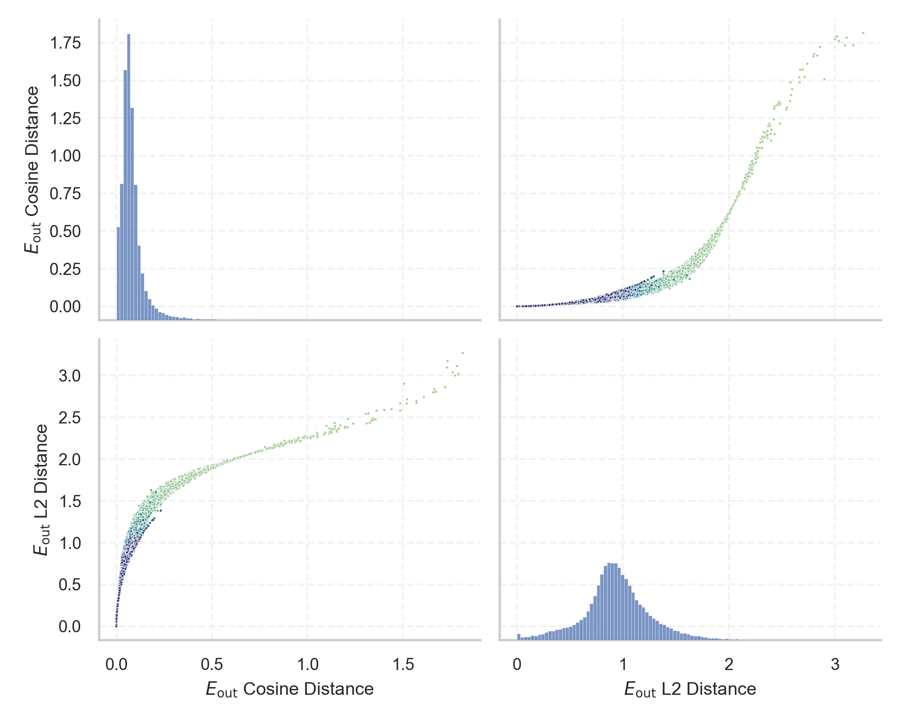
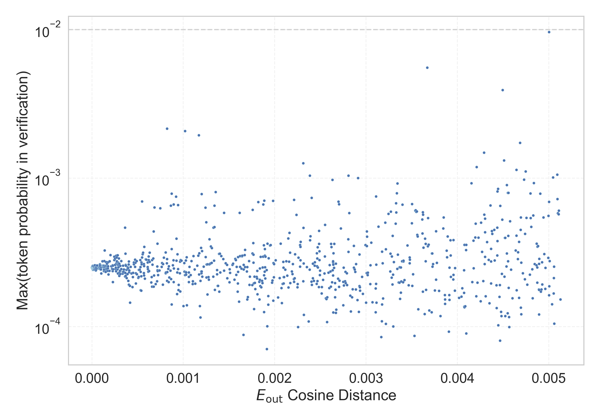

# Report for `checkpoints/step_95000`

## Model info

* Model Info: 
  * Tied embeddings: True
  * LM head uses bias: False
  * Embeddings shape: [50257, 1024]
* Tokenizer Info: 
  * Vocab Size: 50257
  * Tokenizer Class: GPT2Tokenizer
  * Tokenizer Type: BPE
  * Bytes handling: Byte Input
  * Token for verification prompt building: BuyableInstoreAndOnline
  * Token id for verification prompt building: 40242
* Indicator summary: 
  * Indicator for under-trained tokens: E_{out} Cosine Distance
  * Overall distribution: 0.085 +/- 0.090
* Detected Token Counts: 
  * Number of tested under-trained tokens: 1000, 968 non-special, 968 below p = 0.01 threshold, 966 below soft indicator threshold
  * Number of single byte tokens: 256, of which 53 below indicator threshold
  * Number of special tokens: 1, of which 1 below indicator threshold
  * Number of non-single-byte UTF-fragment tokens:  216, of which 44 below soft indicator threshold

## Under-trained token indicators plot


## Verification plot


## Under-trained token verification results
966 entries below threshold of 0.005

|   token_id | token                           |    indicator | max_prob                                                         | in_other_tokens                                                                                                                                                              |
|------------|---------------------------------|--------------|------------------------------------------------------------------|------------------------------------------------------------------------------------------------------------------------------------------------------------------------------|
|      45544 | ````` ▁サーティ `````           | -5.96046e-07 | <span style='border: 1px solid rgb(169, 68, 66);'>0.00025</span> | <span style='border: 1px solid rgb(169, 68, 66);'>````` ▁サーティワン `````</span>                                                                                           |
|      42586 | ````` ▁srfN `````               | -3.57628e-07 | <span style='border: 1px solid rgb(169, 68, 66);'>0.00025</span> |                                                                                                                                                                              |
|      36929 | ````` ▁sidx `````               | -2.38419e-07 | <span style='border: 1px solid rgb(169, 68, 66);'>0.00025</span> |                                                                                                                                                                              |
|      36940 | ````` ▁istg `````               | -2.38419e-07 | <span style='border: 1px solid rgb(169, 68, 66);'>0.00025</span> |                                                                                                                                                                              |
|      50009 | ````` ▁strutConnector `````     | -2.38419e-07 | <span style='border: 1px solid rgb(169, 68, 66);'>0.00025</span> |                                                                                                                                                                              |
|      30208 | ````` ▁externalTo `````         | -1.19209e-07 | <span style='border: 1px solid rgb(169, 68, 66);'>0.00025</span> | <span style='border: 1px solid rgb(169, 68, 66);'>````` ▁externalToEVA `````</span>, <span style='border: 1px solid rgb(169, 68, 66);'>````` ▁externalToEVAOnly `````</span> |
|      31032 | ````` SpaceEngineers `````      | -1.19209e-07 | <span style='border: 1px solid rgb(169, 68, 66);'>0.00025</span> |                                                                                                                                                                              |
|      39714 | ````` isSpecial `````           | -1.19209e-07 | <span style='border: 1px solid rgb(169, 68, 66);'>0.00025</span> | <span style='border: 1px solid rgb(169, 68, 66);'>````` isSpecialOrderable `````</span>                                                                                      |
|      39752 | ````` quickShip `````           | -1.19209e-07 | <span style='border: 1px solid rgb(169, 68, 66);'>0.00025</span> | <span style='border: 1px solid rgb(169, 68, 66);'>````` quickShipAvailable `````</span>                                                                                      |
|      39753 | ````` quickShipAvailable `````  | -1.19209e-07 | <span style='border: 1px solid rgb(169, 68, 66);'>0.00025</span> |                                                                                                                                                                              |
|      39756 | ````` inventoryQuantity `````   | -1.19209e-07 | <span style='border: 1px solid rgb(169, 68, 66);'>0.00025</span> |                                                                                                                                                                              |
|      42090 | ````` ▁TheNitromeFan `````      | -1.19209e-07 | <span style='border: 1px solid rgb(169, 68, 66);'>0.00025</span> |                                                                                                                                                                              |
|      45545 | ````` ▁サーティワン `````       | -1.19209e-07 | <span style='border: 1px solid rgb(169, 68, 66);'>0.00025</span> |                                                                                                                                                                              |
|      17900 | ````` ▁Dragonbound `````        |  0           | <span style='border: 1px solid rgb(169, 68, 66);'>0.00025</span> |                                                                                                                                                                              |
|      30202 | ````` ▁guiName `````            |  0           | <span style='border: 1px solid rgb(169, 68, 66);'>0.00025</span> |                                                                                                                                                                              |
|      30210 | ````` ▁guiActiveUnfocused ````` |  0           | <span style='border: 1px solid rgb(169, 68, 66);'>0.00025</span> |                                                                                                                                                                              |
|      31957 | ````` cffffcc `````             |  0           | <span style='border: 1px solid rgb(169, 68, 66);'>0.00025</span> |                                                                                                                                                                              |
|      39757 | ````` channelAvailability ````` |  0           | <span style='border: 1px solid rgb(169, 68, 66);'>0.00025</span> |                                                                                                                                                                              |
|      42089 | ````` ▁TheNitrome `````         |  0           | <span style='border: 1px solid rgb(169, 68, 66);'>0.00025</span> | <span style='border: 1px solid rgb(169, 68, 66);'>````` ▁TheNitromeFan `````</span>                                                                                          |
|      44320 | ````` \n\xa0 `````              |  0           | <span style='border: 1px solid rgb(169, 68, 66);'>0.00025</span> |                                                                                                                                                                              |
<details><summary>946 additional entries below threshold</summary>

|   token_id | token                                                                          |   indicator | max_prob                                                         | in_other_tokens                                                                                                                                                                                                                                                                                                                                                                                                                                                                                        |
|------------|--------------------------------------------------------------------------------|-------------|------------------------------------------------------------------|--------------------------------------------------------------------------------------------------------------------------------------------------------------------------------------------------------------------------------------------------------------------------------------------------------------------------------------------------------------------------------------------------------------------------------------------------------------------------------------------------------|
|       1849 | ````` \xa0 `````                                                               | 1.19209e-07 | <span style='border: 1px solid rgb(169, 68, 66);'>0.00025</span> | <span style='border: 1px solid rgb(169, 68, 66);'>````` \xa0\xa0 `````</span>, <span style='border: 1px solid rgb(169, 68, 66);'>````` ▁\xa0 `````</span>, <span style='border: 1px solid rgb(169, 68, 66);'>````` \xa0\xa0\xa0\xa0 `````</span>, <span style='border: 1px solid rgb(169, 68, 66);'>````` ▁\xa0▁\xa0 `````</span>, <span style='border: 1px solid rgb(169, 68, 66);'>````` \xa0\xa0\xa0\xa0\xa0\xa0\xa0\xa0 `````</span>, ...                                                          |
|      23282 | ````` ▁davidjl `````                                                           | 1.19209e-07 | <span style='border: 1px solid rgb(169, 68, 66);'>0.00025</span> |                                                                                                                                                                                                                                                                                                                                                                                                                                                                                                        |
|      25992 | ````` ▁裏覚醒 `````                                                            | 1.19209e-07 | <span style='border: 1px solid rgb(169, 68, 66);'>0.00025</span> |                                                                                                                                                                                                                                                                                                                                                                                                                                                                                                        |
|      30898 | ````` embedreportprint `````                                                   | 1.19209e-07 | <span style='border: 1px solid rgb(169, 68, 66);'>0.00025</span> | <span style='border: 1px solid rgb(169, 68, 66);'>````` cloneembedreportprint `````</span>, ````` rawdownloadcloneembedreportprint `````                                                                                                                                                                                                                                                                                                                                                               |
|      36935 | ````` ▁dstg `````                                                              | 1.19209e-07 | <span style='border: 1px solid rgb(169, 68, 66);'>0.00025</span> |                                                                                                                                                                                                                                                                                                                                                                                                                                                                                                        |
|      39172 | ````` \xa0\xa0\xa0\xa0\xa0\xa0\xa0\xa0\xa0\xa0\xa0\xa0\xa0\xa0\xa0\xa0 `````   | 1.19209e-07 | <span style='border: 1px solid rgb(169, 68, 66);'>0.00025</span> |                                                                                                                                                                                                                                                                                                                                                                                                                                                                                                        |
|      39755 | ````` isSpecialOrderable `````                                                 | 1.19209e-07 | <span style='border: 1px solid rgb(169, 68, 66);'>0.00025</span> |                                                                                                                                                                                                                                                                                                                                                                                                                                                                                                        |
|      41383 | ````` assetsadobe `````                                                        | 1.19209e-07 | <span style='border: 1px solid rgb(169, 68, 66);'>0.00025</span> |                                                                                                                                                                                                                                                                                                                                                                                                                                                                                                        |
|      43177 | ````` EStreamFrame `````                                                       | 1.19209e-07 | <span style='border: 1px solid rgb(169, 68, 66);'>0.00025</span> |                                                                                                                                                                                                                                                                                                                                                                                                                                                                                                        |
|      43569 | ````` ÍÍ `````                                                                 | 1.19209e-07 | <span style='border: 1px solid rgb(169, 68, 66);'>0.00025</span> |                                                                                                                                                                                                                                                                                                                                                                                                                                                                                                        |
|      11504 | ````` ▁\xa0▁\xa0 `````                                                         | 1.78814e-07 | <span style='border: 1px solid rgb(169, 68, 66);'>0.00025</span> | <span style='border: 1px solid rgb(169, 68, 66);'>````` ▁\xa0▁\xa0▁\xa0▁\xa0 `````</span>, <span style='border: 1px solid rgb(169, 68, 66);'>````` ▁\xa0▁\xa0▁\xa0▁\xa0▁\xa0▁\xa0▁\xa0▁\xa0 `````</span>                                                                                                                                                                                                                                                                                               |
|      17811 | ````` \xa0\xa0\xa0\xa0\xa0\xa0\xa0\xa0 `````                                   | 1.78814e-07 | <span style='border: 1px solid rgb(169, 68, 66);'>0.00025</span> | <span style='border: 1px solid rgb(169, 68, 66);'>````` \xa0\xa0\xa0\xa0\xa0\xa0\xa0\xa0\xa0\xa0\xa0\xa0\xa0\xa0\xa0\xa0 `````</span>                                                                                                                                                                                                                                                                                                                                                                  |
|      32437 | ````` ▁Smartstocks `````                                                       | 1.78814e-07 | <span style='border: 1px solid rgb(169, 68, 66);'>0.00025</span> |                                                                                                                                                                                                                                                                                                                                                                                                                                                                                                        |
|      37574 | ````` StreamerBot `````                                                        | 1.78814e-07 | <span style='border: 1px solid rgb(169, 68, 66);'>0.00025</span> | <span style='border: 1px solid rgb(169, 68, 66);'>````` TPPStreamerBot `````</span>                                                                                                                                                                                                                                                                                                                                                                                                                    |
|      39177 | ````` ItemThumbnailImage `````                                                 | 1.78814e-07 | <span style='border: 1px solid rgb(169, 68, 66);'>0.00025</span> |                                                                                                                                                                                                                                                                                                                                                                                                                                                                                                        |
|      39803 | ````` soType `````                                                             | 1.78814e-07 | <span style='border: 1px solid rgb(169, 68, 66);'>0.00025</span> |                                                                                                                                                                                                                                                                                                                                                                                                                                                                                                        |
|      39811 | ````` soDeliveryDate `````                                                     | 1.78814e-07 | <span style='border: 1px solid rgb(169, 68, 66);'>0.00025</span> |                                                                                                                                                                                                                                                                                                                                                                                                                                                                                                        |
|      40242 | ````` BuyableInstoreAndOnline `````                                            | 1.78814e-07 | <span style='border: 1px solid rgb(169, 68, 66);'>0.00025</span> |                                                                                                                                                                                                                                                                                                                                                                                                                                                                                                        |
|      41551 | ````` Downloadha `````                                                         | 1.78814e-07 | <span style='border: 1px solid rgb(169, 68, 66);'>0.00025</span> |                                                                                                                                                                                                                                                                                                                                                                                                                                                                                                        |
|      45706 | ````` ▁\xa0▁\xa0▁\xa0▁\xa0▁\xa0▁\xa0▁\xa0▁\xa0 `````                           | 1.78814e-07 | <span style='border: 1px solid rgb(169, 68, 66);'>0.00025</span> |                                                                                                                                                                                                                                                                                                                                                                                                                                                                                                        |
|       5624 | ````` ▁\xa0 `````                                                              | 2.98023e-07 | <span style='border: 1px solid rgb(169, 68, 66);'>0.00025</span> | <span style='border: 1px solid rgb(169, 68, 66);'>````` ▁\xa0▁\xa0 `````</span>, <span style='border: 1px solid rgb(169, 68, 66);'>````` ▁\xa0▁\xa0▁\xa0▁\xa0 `````</span>, <span style='border: 1px solid rgb(169, 68, 66);'>````` ▁\xa0▁\xa0▁\xa0▁\xa0▁\xa0▁\xa0▁\xa0▁\xa0 `````</span>, <span style='border: 1px solid rgb(169, 68, 66);'>````` ▁\xa0\xa0 `````</span>                                                                                                                              |
|      18472 | ````` ▁guiActive `````                                                         | 2.98023e-07 | <span style='border: 1px solid rgb(169, 68, 66);'>0.00025</span> | <span style='border: 1px solid rgb(169, 68, 66);'>````` ▁guiActiveUn `````</span>, <span style='border: 1px solid rgb(169, 68, 66);'>````` ▁guiActiveUnfocused `````</span>                                                                                                                                                                                                                                                                                                                            |
|      25193 | ````` NetMessage `````                                                         | 2.98023e-07 | <span style='border: 1px solid rgb(169, 68, 66);'>0.00025</span> | <span style='border: 1px solid rgb(169, 68, 66);'>````` PsyNetMessage `````</span>                                                                                                                                                                                                                                                                                                                                                                                                                     |
|      25658 | ````` ?????- `````                                                             | 2.98023e-07 | <span style='border: 1px solid rgb(169, 68, 66);'>0.00025</span> | <span style='border: 1px solid rgb(169, 68, 66);'>````` ?????-?????- `````</span>                                                                                                                                                                                                                                                                                                                                                                                                                      |
|      30209 | ````` ▁unfocusedRange `````                                                    | 2.98023e-07 | <span style='border: 1px solid rgb(169, 68, 66);'>0.00025</span> |                                                                                                                                                                                                                                                                                                                                                                                                                                                                                                        |
|      30897 | ````` reportprint `````                                                        | 2.98023e-07 | <span style='border: 1px solid rgb(169, 68, 66);'>0.00025</span> | <span style='border: 1px solid rgb(169, 68, 66);'>````` embedreportprint `````</span>, <span style='border: 1px solid rgb(169, 68, 66);'>````` cloneembedreportprint `````</span>, ````` rawdownloadcloneembedreportprint `````                                                                                                                                                                                                                                                                        |
|      33454 | ````` 龍喚士 `````                                                             | 2.98023e-07 | <span style='border: 1px solid rgb(169, 68, 66);'>0.00025</span> |                                                                                                                                                                                                                                                                                                                                                                                                                                                                                                        |
|      33477 | ````` \xa0\xa0\xa0 `````                                                       | 2.98023e-07 | <span style='border: 1px solid rgb(169, 68, 66);'>0.00025</span> | <span style='border: 1px solid rgb(169, 68, 66);'>````` \xa0\xa0\xa0\xa0\xa0\xa0\xa0\xa0\xa0\xa0\xa0\xa0\xa0\xa0\xa0\xa0 `````</span>                                                                                                                                                                                                                                                                                                                                                                  |
|      34206 | ````` #$#$ `````                                                               | 2.98023e-07 | <span style='border: 1px solid rgb(169, 68, 66);'>0.00025</span> |                                                                                                                                                                                                                                                                                                                                                                                                                                                                                                        |
|      35207 | ````` ▁attRot `````                                                            | 2.98023e-07 | <span style='border: 1px solid rgb(169, 68, 66);'>0.00025</span> |                                                                                                                                                                                                                                                                                                                                                                                                                                                                                                        |
|      37842 | ````` ▁partName `````                                                          | 2.98023e-07 | <span style='border: 1px solid rgb(169, 68, 66);'>0.00025</span> |                                                                                                                                                                                                                                                                                                                                                                                                                                                                                                        |
|      47654 | ````` ▁\xa0\xa0 `````                                                          | 2.98023e-07 | <span style='border: 1px solid rgb(169, 68, 66);'>0.00025</span> |                                                                                                                                                                                                                                                                                                                                                                                                                                                                                                        |
|      22686 | ````` ▁\xa0▁\xa0▁\xa0▁\xa0 `````                                               | 4.17233e-07 | <span style='border: 1px solid rgb(169, 68, 66);'>0.00025</span> | <span style='border: 1px solid rgb(169, 68, 66);'>````` ▁\xa0▁\xa0▁\xa0▁\xa0▁\xa0▁\xa0▁\xa0▁\xa0 `````</span>                                                                                                                                                                                                                                                                                                                                                                                          |
|      28666 | ````` PsyNetMessage `````                                                      | 4.17233e-07 | <span style='border: 1px solid rgb(169, 68, 66);'>0.00025</span> |                                                                                                                                                                                                                                                                                                                                                                                                                                                                                                        |
|      30211 | ````` ▁guiIcon `````                                                           | 4.17233e-07 | <span style='border: 1px solid rgb(169, 68, 66);'>0.00025</span> |                                                                                                                                                                                                                                                                                                                                                                                                                                                                                                        |
|      30212 | ````` ▁externalToEVA `````                                                     | 4.17233e-07 | <span style='border: 1px solid rgb(169, 68, 66);'>0.00025</span> | <span style='border: 1px solid rgb(169, 68, 66);'>````` ▁externalToEVAOnly `````</span>                                                                                                                                                                                                                                                                                                                                                                                                                |
|      31666 | ````` ?????-?????- `````                                                       | 4.17233e-07 | <span style='border: 1px solid rgb(169, 68, 66);'>0.00025</span> |                                                                                                                                                                                                                                                                                                                                                                                                                                                                                                        |
|      33813 | ````` =~=~ `````                                                               | 4.17233e-07 | <span style='border: 1px solid rgb(169, 68, 66);'>0.00025</span> |                                                                                                                                                                                                                                                                                                                                                                                                                                                                                                        |
|      36174 | ````` ▁RandomRedditorWithNo `````                                              | 4.17233e-07 | <span style='border: 1px solid rgb(169, 68, 66);'>0.00025</span> |                                                                                                                                                                                                                                                                                                                                                                                                                                                                                                        |
|      36938 | ````` ▁sqor `````                                                              | 4.17233e-07 | <span style='border: 1px solid rgb(169, 68, 66);'>0.00025</span> |                                                                                                                                                                                                                                                                                                                                                                                                                                                                                                        |
|      39446 | ````` ▁SetFontSize `````                                                       | 4.17233e-07 | <span style='border: 1px solid rgb(169, 68, 66);'>0.00025</span> |                                                                                                                                                                                                                                                                                                                                                                                                                                                                                                        |
|      40240 | ````` oreAndOnline `````                                                       | 4.17233e-07 | <span style='border: 1px solid rgb(169, 68, 66);'>0.00025</span> | <span style='border: 1px solid rgb(169, 68, 66);'>````` InstoreAndOnline `````</span>, <span style='border: 1px solid rgb(169, 68, 66);'>````` BuyableInstoreAndOnline `````</span>                                                                                                                                                                                                                                                                                                                    |
|      41380 | ````` natureconservancy `````                                                  | 4.17233e-07 | <span style='border: 1px solid rgb(169, 68, 66);'>0.00025</span> |                                                                                                                                                                                                                                                                                                                                                                                                                                                                                                        |
|      42202 | ````` GoldMagikarp `````                                                       | 4.17233e-07 | <span style='border: 1px solid rgb(169, 68, 66);'>0.00025</span> | <span style='border: 1px solid rgb(169, 68, 66);'>````` ▁SolidGoldMagikarp `````</span>                                                                                                                                                                                                                                                                                                                                                                                                                |
|      43065 | ````` ▁srfAttach `````                                                         | 4.17233e-07 | <span style='border: 1px solid rgb(169, 68, 66);'>0.00025</span> |                                                                                                                                                                                                                                                                                                                                                                                                                                                                                                        |
|      49781 | ````` EngineDebug `````                                                        | 4.17233e-07 | <span style='border: 1px solid rgb(169, 68, 66);'>0.00025</span> |                                                                                                                                                                                                                                                                                                                                                                                                                                                                                                        |
|      30899 | ````` cloneembedreportprint `````                                              | 5.36442e-07 | <span style='border: 1px solid rgb(169, 68, 66);'>0.00025</span> | ````` rawdownloadcloneembedreportprint `````                                                                                                                                                                                                                                                                                                                                                                                                                                                           |
|      30905 | ````` rawdownload `````                                                        | 5.36442e-07 | <span style='border: 1px solid rgb(169, 68, 66);'>0.00025</span> | ````` rawdownloadcloneembedreportprint `````                                                                                                                                                                                                                                                                                                                                                                                                                                                           |
|      36173 | ````` ▁RandomRedditor `````                                                    | 5.36442e-07 | <span style='border: 1px solid rgb(169, 68, 66);'>0.00025</span> | <span style='border: 1px solid rgb(169, 68, 66);'>````` ▁RandomRedditorWithNo `````</span>                                                                                                                                                                                                                                                                                                                                                                                                             |
|      37579 | ````` TPPStreamerBot `````                                                     | 5.36442e-07 | <span style='border: 1px solid rgb(169, 68, 66);'>0.00025</span> |                                                                                                                                                                                                                                                                                                                                                                                                                                                                                                        |
|      39142 | ````` ThumbnailImage `````                                                     | 5.36442e-07 | <span style='border: 1px solid rgb(169, 68, 66);'>0.00025</span> | <span style='border: 1px solid rgb(169, 68, 66);'>````` ItemThumbnailImage `````</span>                                                                                                                                                                                                                                                                                                                                                                                                                |
|      39655 | ````` Orderable `````                                                          | 5.96046e-07 | <span style='border: 1px solid rgb(169, 68, 66);'>0.00025</span> | <span style='border: 1px solid rgb(169, 68, 66);'>````` isSpecialOrderable `````</span>                                                                                                                                                                                                                                                                                                                                                                                                                |
|      39821 | ````` 龍契士 `````                                                             | 5.96046e-07 | <span style='border: 1px solid rgb(169, 68, 66);'>0.00025</span> |                                                                                                                                                                                                                                                                                                                                                                                                                                                                                                        |
|       4603 | ````` \xa0\xa0 `````                                                           | 7.15256e-07 | <span style='border: 1px solid rgb(169, 68, 66);'>0.00025</span> | <span style='border: 1px solid rgb(169, 68, 66);'>````` \xa0\xa0\xa0\xa0 `````</span>, <span style='border: 1px solid rgb(169, 68, 66);'>````` \xa0\xa0\xa0\xa0\xa0\xa0\xa0\xa0 `````</span>, <span style='border: 1px solid rgb(169, 68, 66);'>````` \xa0\xa0\xa0 `````</span>, <span style='border: 1px solid rgb(169, 68, 66);'>````` \xa0\xa0\xa0\xa0\xa0\xa0\xa0\xa0\xa0\xa0\xa0\xa0\xa0\xa0\xa0\xa0 `````</span>, <span style='border: 1px solid rgb(169, 68, 66);'>````` ▁\xa0\xa0 `````</span> |
|      34027 | ````` ▁actionGroup `````                                                       | 7.15256e-07 | <span style='border: 1px solid rgb(169, 68, 66);'>0.00025</span> |                                                                                                                                                                                                                                                                                                                                                                                                                                                                                                        |
|      39906 | ````` EStream `````                                                            | 7.15256e-07 | <span style='border: 1px solid rgb(169, 68, 66);'>0.00025</span> | <span style='border: 1px solid rgb(169, 68, 66);'>````` EStreamFrame `````</span>                                                                                                                                                                                                                                                                                                                                                                                                                      |
|      40278 | ````` */( `````                                                                | 7.15256e-07 | <span style='border: 1px solid rgb(169, 68, 66);'>0.00025</span> |                                                                                                                                                                                                                                                                                                                                                                                                                                                                                                        |
|      47571 | ````` ▁DevOnline `````                                                         | 7.15256e-07 | <span style='border: 1px solid rgb(169, 68, 66);'>0.00025</span> |                                                                                                                                                                                                                                                                                                                                                                                                                                                                                                        |
|      39749 | ````` DeliveryDate `````                                                       | 8.34465e-07 | <span style='border: 1px solid rgb(169, 68, 66);'>0.00025</span> | <span style='border: 1px solid rgb(169, 68, 66);'>````` soDeliveryDate `````</span>                                                                                                                                                                                                                                                                                                                                                                                                                    |
|      43453 | ````` ▁SolidGoldMagikarp `````                                                 | 8.34465e-07 | <span style='border: 1px solid rgb(169, 68, 66);'>0.00025</span> |                                                                                                                                                                                                                                                                                                                                                                                                                                                                                                        |
|      45003 | ````` ▁SetTextColor `````                                                      | 8.34465e-07 | <span style='border: 1px solid rgb(169, 68, 66);'>0.00025</span> |                                                                                                                                                                                                                                                                                                                                                                                                                                                                                                        |
|      40241 | ````` InstoreAndOnline `````                                                   | 8.9407e-07  | <span style='border: 1px solid rgb(169, 68, 66);'>0.00025</span> | <span style='border: 1px solid rgb(169, 68, 66);'>````` BuyableInstoreAndOnline `````</span>                                                                                                                                                                                                                                                                                                                                                                                                           |
|      46600 | ````` ▁Adinida `````                                                           | 8.9407e-07  | <span style='border: 1px solid rgb(169, 68, 66);'>0.00025</span> |                                                                                                                                                                                                                                                                                                                                                                                                                                                                                                        |
|      50216 | ````` ▁Leilan `````                                                            | 8.9407e-07  | <span style='border: 1px solid rgb(169, 68, 66);'>0.00025</span> |                                                                                                                                                                                                                                                                                                                                                                                                                                                                                                        |
|       8828 | ````` \xa0\xa0\xa0\xa0 `````                                                   | 1.01328e-06 | <span style='border: 1px solid rgb(169, 68, 66);'>0.00025</span> | <span style='border: 1px solid rgb(169, 68, 66);'>````` \xa0\xa0\xa0\xa0\xa0\xa0\xa0\xa0 `````</span>, <span style='border: 1px solid rgb(169, 68, 66);'>````` \xa0\xa0\xa0\xa0\xa0\xa0\xa0\xa0\xa0\xa0\xa0\xa0\xa0\xa0\xa0\xa0 `````</span>                                                                                                                                                                                                                                                           |
|      40219 | ````` oreAnd `````                                                             | 1.01328e-06 | <span style='border: 1px solid rgb(169, 68, 66);'>0.00025</span> | <span style='border: 1px solid rgb(169, 68, 66);'>````` oreAndOnline `````</span>, <span style='border: 1px solid rgb(169, 68, 66);'>````` InstoreAndOnline `````</span>, <span style='border: 1px solid rgb(169, 68, 66);'>````` BuyableInstoreAndOnline `````</span>                                                                                                                                                                                                                                 |
|      42424 | ````` DragonMagazine `````                                                     | 1.13249e-06 | <span style='border: 1px solid rgb(169, 68, 66);'>0.00025</span> |                                                                                                                                                                                                                                                                                                                                                                                                                                                                                                        |
|      43010 | ````` ▁Kinnikuman `````                                                        | 1.2517e-06  | <span style='border: 1px solid rgb(169, 68, 66);'>0.00025</span> |                                                                                                                                                                                                                                                                                                                                                                                                                                                                                                        |
|      45392 | ````` dayName `````                                                            | 1.2517e-06  | <span style='border: 1px solid rgb(169, 68, 66);'>0.00025</span> |                                                                                                                                                                                                                                                                                                                                                                                                                                                                                                        |
|      36130 | ````` ▁PsyNet `````                                                            | 1.3113e-06  | <span style='border: 1px solid rgb(169, 68, 66);'>0.00025</span> |                                                                                                                                                                                                                                                                                                                                                                                                                                                                                                        |
|      22315 | ````` ▁newcom `````                                                            | 1.43051e-06 | <span style='border: 1px solid rgb(169, 68, 66);'>0.00025</span> | ````` ▁newcomers `````, ````` ▁newcomer `````                                                                                                                                                                                                                                                                                                                                                                                                                                                          |
|      31573 | ````` ActionCode `````                                                         | 1.43051e-06 | <span style='border: 1px solid rgb(169, 68, 66);'>0.00025</span> | <span style='border: 1px solid rgb(169, 68, 66);'>````` externalActionCode `````</span>                                                                                                                                                                                                                                                                                                                                                                                                                |
|      10298 | ````` senal `````                                                              | 1.54972e-06 | <span style='border: 1px solid rgb(169, 68, 66);'>0.00025</span> | ````` ▁Arsenal `````, ````` ▁arsenal `````, ````` Arsenal `````                                                                                                                                                                                                                                                                                                                                                                                                                                        |
|      30213 | ````` ▁externalToEVAOnly `````                                                 | 1.54972e-06 | <span style='border: 1px solid rgb(169, 68, 66);'>0.00025</span> |                                                                                                                                                                                                                                                                                                                                                                                                                                                                                                        |
|      31765 | ````` MpServer `````                                                           | 1.54972e-06 | <span style='border: 1px solid rgb(169, 68, 66);'>0.00025</span> |                                                                                                                                                                                                                                                                                                                                                                                                                                                                                                        |
|      42889 | ````` ikuman `````                                                             | 1.54972e-06 | <span style='border: 1px solid rgb(169, 68, 66);'>0.00025</span> | <span style='border: 1px solid rgb(169, 68, 66);'>````` ▁Kinnikuman `````</span>                                                                                                                                                                                                                                                                                                                                                                                                                       |
|      23090 | ````` ÃÂÃÂÃÂÃÂÃÂÃÂÃÂÃÂÃÂÃÂÃÂÃÂÃÂÃÂÃÂÃÂ `````                                   | 1.60933e-06 | <span style='border: 1px solid rgb(169, 68, 66);'>0.00025</span> | <span style='border: 1px solid rgb(169, 68, 66);'>````` ÃÂÃÂÃÂÃÂÃÂÃÂÃÂÃÂÃÂÃÂÃÂÃÂÃÂÃÂÃÂÃÂÃÂÃÂÃÂÃÂÃÂÃÂÃÂÃÂÃÂÃÂÃÂÃÂÃÂÃÂÃÂÃÂ `````</span>                                                                                                                                                                                                                                                                                                                                                                  |
|      39253 | ````` ▁UCHIJ `````                                                             | 1.60933e-06 | <span style='border: 1px solid rgb(169, 68, 66);'>0.00025</span> |                                                                                                                                                                                                                                                                                                                                                                                                                                                                                                        |
|      48193 | ````` @#& `````                                                                | 1.72853e-06 | <span style='border: 1px solid rgb(169, 68, 66);'>0.00025</span> |                                                                                                                                                                                                                                                                                                                                                                                                                                                                                                        |
|      23785 | ````` "]=> `````                                                               | 1.96695e-06 | <span style='border: 1px solid rgb(169, 68, 66);'>0.00025</span> |                                                                                                                                                                                                                                                                                                                                                                                                                                                                                                        |
|      29372 | ````` ▁guiActiveUn `````                                                       | 1.96695e-06 | <span style='border: 1px solid rgb(169, 68, 66);'>0.00025</span> | <span style='border: 1px solid rgb(169, 68, 66);'>````` ▁guiActiveUnfocused `````</span>                                                                                                                                                                                                                                                                                                                                                                                                               |
|      34448 | ````` ▁ItemLevel `````                                                         | 2.14577e-06 | <span style='border: 1px solid rgb(169, 68, 66);'>0.00025</span> |                                                                                                                                                                                                                                                                                                                                                                                                                                                                                                        |
|      40012 | ````` uyomi `````                                                              | 2.14577e-06 | <span style='border: 1px solid rgb(169, 68, 66);'>0.00025</span> | <span style='border: 1px solid rgb(169, 68, 66);'>````` ▁Tsukuyomi `````</span>                                                                                                                                                                                                                                                                                                                                                                                                                        |
|      25502 | ````` ItemImage `````                                                          | 2.44379e-06 | <span style='border: 1px solid rgb(169, 68, 66);'>0.00025</span> |                                                                                                                                                                                                                                                                                                                                                                                                                                                                                                        |
|      27013 | ````` aditional `````                                                          | 2.44379e-06 | <span style='border: 1px solid rgb(169, 68, 66);'>0.00025</span> | ````` ▁Traditional `````, ````` traditional `````, ````` Traditional `````                                                                                                                                                                                                                                                                                                                                                                                                                             |
|      39165 | ````` catentry `````                                                           | 2.74181e-06 | <span style='border: 1px solid rgb(169, 68, 66);'>0.00025</span> |                                                                                                                                                                                                                                                                                                                                                                                                                                                                                                        |
|      14341 | ````` PDATE `````                                                              | 2.86102e-06 | <span style='border: 1px solid rgb(169, 68, 66);'>0.00025</span> | ````` UPDATE `````, ````` ▁UPDATE `````, ````` PDATED `````                                                                                                                                                                                                                                                                                                                                                                                                                                            |
|      43361 | ````` ゼウス `````                                                             | 3.45707e-06 | <span style='border: 1px solid rgb(169, 68, 66);'>0.00025</span> |                                                                                                                                                                                                                                                                                                                                                                                                                                                                                                        |
|       4690 | ````` ortunately `````                                                         | 3.69549e-06 | <span style='border: 1px solid rgb(169, 68, 66);'>0.00025</span> | ````` fortunately `````, ````` ▁Unfortunately `````, ````` ▁unfortunately `````, ````` Unfortunately `````, ````` ▁Fortunately `````, ...                                                                                                                                                                                                                                                                                                                                                              |
|      42066 | ````` Nitrome `````                                                            | 3.69549e-06 | <span style='border: 1px solid rgb(169, 68, 66);'>0.00025</span> | <span style='border: 1px solid rgb(169, 68, 66);'>````` ▁TheNitrome `````</span>, <span style='border: 1px solid rgb(169, 68, 66);'>````` ▁TheNitromeFan `````</span>                                                                                                                                                                                                                                                                                                                                  |
|      36926 | ````` ▁attm `````                                                              | 3.8743e-06  | <span style='border: 1px solid rgb(169, 68, 66);'>0.00025</span> |                                                                                                                                                                                                                                                                                                                                                                                                                                                                                                        |
|      32047 | ````` ▁"$:/ `````                                                              | 4.17233e-06 | <span style='border: 1px solid rgb(169, 68, 66);'>0.00025</span> |                                                                                                                                                                                                                                                                                                                                                                                                                                                                                                        |
|      38370 | ````` iHUD `````                                                               | 5.24521e-06 | <span style='border: 1px solid rgb(169, 68, 66);'>0.00025</span> |                                                                                                                                                                                                                                                                                                                                                                                                                                                                                                        |
|      41297 | ````` ▁TAMADRA `````                                                           | 5.42402e-06 | <span style='border: 1px solid rgb(169, 68, 66);'>0.00025</span> |                                                                                                                                                                                                                                                                                                                                                                                                                                                                                                        |
|      24847 | ````` ModLoader `````                                                          | 5.54323e-06 | <span style='border: 1px solid rgb(169, 68, 66);'>0.00025</span> | <span style='border: 1px solid rgb(169, 68, 66);'>````` ForgeModLoader `````</span>                                                                                                                                                                                                                                                                                                                                                                                                                    |
|      35579 | ````` ▁Mechdragon `````                                                        | 5.72205e-06 | <span style='border: 1px solid rgb(169, 68, 66);'>0.00025</span> |                                                                                                                                                                                                                                                                                                                                                                                                                                                                                                        |
|       6438 | ````` ▁裏 `````                                                                | 6.13928e-06 | <span style='border: 1px solid rgb(169, 68, 66);'>0.00025</span> | ````` ▁裏<0xE7> `````, <span style='border: 1px solid rgb(169, 68, 66);'>````` ▁裏覚醒 `````</span>, ````` ▁裏<0xE8> `````                                                                                                                                                                                                                                                                                                                                                                             |
|      38250 | ````` ▁Skydragon `````                                                         | 6.13928e-06 | <span style='border: 1px solid rgb(169, 68, 66);'>0.00025</span> |                                                                                                                                                                                                                                                                                                                                                                                                                                                                                                        |
|      45563 | ````` ⓘ `````                                                                  | 6.55651e-06 | <span style='border: 1px solid rgb(169, 68, 66);'>0.00024</span> |                                                                                                                                                                                                                                                                                                                                                                                                                                                                                                        |
|       7105 | ````` ▁volunte `````                                                           | 6.85453e-06 | <span style='border: 1px solid rgb(169, 68, 66);'>0.00025</span> | ````` ▁volunteers `````, ````` ▁volunteer `````, ````` ▁volunteered `````, ````` ▁volunteering `````                                                                                                                                                                                                                                                                                                                                                                                                   |
|      36473 | ````` luaj `````                                                               | 6.85453e-06 | <span style='border: 1px solid rgb(169, 68, 66);'>0.00025</span> |                                                                                                                                                                                                                                                                                                                                                                                                                                                                                                        |
|      47198 | ````` ItemTracker `````                                                        | 7.689e-06   | <span style='border: 1px solid rgb(169, 68, 66);'>0.00026</span> |                                                                                                                                                                                                                                                                                                                                                                                                                                                                                                        |
|      15272 | ````` ▁pione `````                                                             | 8.58307e-06 | <span style='border: 1px solid rgb(169, 68, 66);'>0.00024</span> | ````` ▁pioneer `````, ````` ▁pioneering `````, ````` ▁pioneers `````, ````` ▁pioneered `````                                                                                                                                                                                                                                                                                                                                                                                                           |
|      47614 | ````` ▁Nanto `````                                                             | 8.70228e-06 | <span style='border: 1px solid rgb(169, 68, 66);'>0.00025</span> |                                                                                                                                                                                                                                                                                                                                                                                                                                                                                                        |
|      48448 | ````` iosyn `````                                                              | 8.88109e-06 | <span style='border: 1px solid rgb(169, 68, 66);'>0.00025</span> | <span style='border: 1px solid rgb(169, 68, 66);'>````` iosyncr `````</span>, ````` ▁idiosyncr `````                                                                                                                                                                                                                                                                                                                                                                                                   |
|      48069 | ````` *=- `````                                                                | 9.71556e-06 | <span style='border: 1px solid rgb(169, 68, 66);'>0.00025</span> |                                                                                                                                                                                                                                                                                                                                                                                                                                                                                                        |
|      27006 | ````` ¯¯¯¯¯¯¯¯¯¯¯¯¯¯¯¯ `````                                                   | 1.03116e-05 | <span style='border: 1px solid rgb(169, 68, 66);'>0.00024</span> |                                                                                                                                                                                                                                                                                                                                                                                                                                                                                                        |
|      37444 | ````` ▁petertodd `````                                                         | 1.11461e-05 | <span style='border: 1px solid rgb(169, 68, 66);'>0.00025</span> |                                                                                                                                                                                                                                                                                                                                                                                                                                                                                                        |
|      29646 | ````` ▁gobl `````                                                              | 1.14441e-05 | <span style='border: 1px solid rgb(169, 68, 66);'>0.00024</span> | ````` ▁goblin `````, ````` ▁goblins `````                                                                                                                                                                                                                                                                                                                                                                                                                                                              |
|      15243 | ````` ¯¯¯¯¯¯¯¯ `````                                                           | 1.21593e-05 | <span style='border: 1px solid rgb(169, 68, 66);'>0.00025</span> | <span style='border: 1px solid rgb(169, 68, 66);'>````` ¯¯¯¯¯¯¯¯¯¯¯¯¯¯¯¯ `````</span>                                                                                                                                                                                                                                                                                                                                                                                                                  |
|      17629 | ````` ▁practition `````                                                        | 1.2517e-05  | <span style='border: 1px solid rgb(169, 68, 66);'>0.00025</span> | ````` ▁practitioners `````, ````` ▁practitioner `````                                                                                                                                                                                                                                                                                                                                                                                                                                                  |
|      13296 | ````` ▁Leban `````                                                             | 1.31726e-05 | <span style='border: 1px solid rgb(169, 68, 66);'>0.00025</span> | ````` ▁Lebanon `````, ````` ▁Lebanese `````                                                                                                                                                                                                                                                                                                                                                                                                                                                            |
|       5367 | ````` ¯¯ `````                                                                 | 1.39475e-05 | <span style='border: 1px solid rgb(169, 68, 66);'>0.00024</span> | <span style='border: 1px solid rgb(169, 68, 66);'>````` ¯¯¯¯ `````</span>, <span style='border: 1px solid rgb(169, 68, 66);'>````` ¯¯¯¯¯¯¯¯ `````</span>, <span style='border: 1px solid rgb(169, 68, 66);'>````` ¯¯¯¯¯¯¯¯¯¯¯¯¯¯¯¯ `````</span>                                                                                                                                                                                                                                                        |
|      34604 | ````` \\\\\\\\\\\\\\\\ `````                                                   | 1.43647e-05 | <span style='border: 1px solid rgb(169, 68, 66);'>0.00025</span> |                                                                                                                                                                                                                                                                                                                                                                                                                                                                                                        |
|       8980 | ````` ¯¯¯¯ `````                                                               | 1.44243e-05 | <span style='border: 1px solid rgb(169, 68, 66);'>0.00025</span> | <span style='border: 1px solid rgb(169, 68, 66);'>````` ¯¯¯¯¯¯¯¯ `````</span>, <span style='border: 1px solid rgb(169, 68, 66);'>````` ¯¯¯¯¯¯¯¯¯¯¯¯¯¯¯¯ `````</span>                                                                                                                                                                                                                                                                                                                                   |
|      49731 | ````` ▁EntityItem `````                                                        | 1.48416e-05 | <span style='border: 1px solid rgb(169, 68, 66);'>0.00025</span> |                                                                                                                                                                                                                                                                                                                                                                                                                                                                                                        |
|      49843 | ````` ▬▬ `````                                                                 | 1.54376e-05 | <span style='border: 1px solid rgb(169, 68, 66);'>0.00025</span> |                                                                                                                                                                                                                                                                                                                                                                                                                                                                                                        |
|      24973 | ````` ▁exting `````                                                            | 1.5974e-05  | <span style='border: 1px solid rgb(169, 68, 66);'>0.00025</span> | ````` ▁extingu `````, ````` ▁extinguished `````                                                                                                                                                                                                                                                                                                                                                                                                                                                        |
|      48366 | ````` ◼ `````                                                                  | 1.75834e-05 | <span style='border: 1px solid rgb(169, 68, 66);'>0.00024</span> |                                                                                                                                                                                                                                                                                                                                                                                                                                                                                                        |
|      19476 | ````` ▁carbohyd `````                                                          | 1.93119e-05 | <span style='border: 1px solid rgb(169, 68, 66);'>0.00025</span> | ````` ▁carbohydrate `````, ````` ▁carbohydrates `````                                                                                                                                                                                                                                                                                                                                                                                                                                                  |
|      32207 | ````` ▁warr `````                                                              | 1.95503e-05 | <span style='border: 1px solid rgb(169, 68, 66);'>0.00025</span> | ````` ▁warranted `````, ````` ▁warranties `````                                                                                                                                                                                                                                                                                                                                                                                                                                                        |
|       8994 | ````` ailability `````                                                         | 2.05636e-05 | <span style='border: 1px solid rgb(169, 68, 66);'>0.00025</span> | ````` ▁availability `````, ````` Availability `````, <span style='border: 1px solid rgb(169, 68, 66);'>````` channelAvailability `````</span>, ````` ▁Availability `````, ````` availability `````                                                                                                                                                                                                                                                                                                     |
|      15040 | ````` byss `````                                                               | 2.0802e-05  | <span style='border: 1px solid rgb(169, 68, 66);'>0.00025</span> | ````` ▁Abyss `````, ````` ▁abyss `````, <span style='border: 1px solid rgb(169, 68, 66);'>````` ▁Abyssal `````</span>, ````` Abyss `````                                                                                                                                                                                                                                                                                                                                                               |
|      32917 | ````` aution `````                                                             | 2.11596e-05 | <span style='border: 1px solid rgb(169, 68, 66);'>0.00025</span> | ````` ▁precaution `````, ````` ▁cautioned `````                                                                                                                                                                                                                                                                                                                                                                                                                                                        |
|      24934 | ````` ForgeModLoader `````                                                     | 2.25306e-05 | <span style='border: 1px solid rgb(169, 68, 66);'>0.00026</span> |                                                                                                                                                                                                                                                                                                                                                                                                                                                                                                        |
|      37631 | ````` FactoryReloaded `````                                                    | 2.25306e-05 | <span style='border: 1px solid rgb(169, 68, 66);'>0.00026</span> |                                                                                                                                                                                                                                                                                                                                                                                                                                                                                                        |
|       9286 | ````` ▁exha `````                                                              | 2.37823e-05 | <span style='border: 1px solid rgb(169, 68, 66);'>0.00024</span> | ````` ▁exhaust `````, ````` ▁exhausted `````, ````` ▁exhaustion `````, ````` ▁exhaustive `````, ````` ▁exhausting `````                                                                                                                                                                                                                                                                                                                                                                                |
|      30439 | ````` ▁unintention `````                                                       | 2.37823e-05 | <span style='border: 1px solid rgb(169, 68, 66);'>0.00025</span> | ````` ▁unintentionally `````, ````` ▁unintentional `````                                                                                                                                                                                                                                                                                                                                                                                                                                               |
|      31161 | ````` ▁//[ `````                                                               | 2.40207e-05 | <span style='border: 1px solid rgb(169, 68, 66);'>0.00025</span> |                                                                                                                                                                                                                                                                                                                                                                                                                                                                                                        |
|      27924 | ````` ▁srf `````                                                               | 2.60472e-05 | <span style='border: 1px solid rgb(169, 68, 66);'>0.00025</span> | <span style='border: 1px solid rgb(169, 68, 66);'>````` ▁srfN `````</span>, <span style='border: 1px solid rgb(169, 68, 66);'>````` ▁srfAttach `````</span>                                                                                                                                                                                                                                                                                                                                            |
|      18945 | ````` ▁teasp `````                                                             | 2.8491e-05  | <span style='border: 1px solid rgb(169, 68, 66);'>0.00024</span> | ````` ▁teaspoon `````, ````` ▁teaspoons `````                                                                                                                                                                                                                                                                                                                                                                                                                                                          |
|      48396 | ````` ÛÛ `````                                                                 | 3.0458e-05  | <span style='border: 1px solid rgb(169, 68, 66);'>0.00026</span> |                                                                                                                                                                                                                                                                                                                                                                                                                                                                                                        |
|      49997 | ````` ahime `````                                                              | 3.44515e-05 | <span style='border: 1px solid rgb(169, 68, 66);'>0.00025</span> |                                                                                                                                                                                                                                                                                                                                                                                                                                                                                                        |
|      44555 | ````` ▁Archdemon `````                                                         | 3.618e-05   | <span style='border: 1px solid rgb(169, 68, 66);'>0.00025</span> |                                                                                                                                                                                                                                                                                                                                                                                                                                                                                                        |
|       7961 | ````` ▁obser `````                                                             | 4.17829e-05 | <span style='border: 1px solid rgb(169, 68, 66);'>0.00024</span> | ````` ▁observe `````, ````` ▁observations `````, ````` ▁observation `````, ````` ▁observers `````, ````` ▁observing `````, ...                                                                                                                                                                                                                                                                                                                                                                         |
|      16303 | ````` ▁undermin `````                                                          | 4.27961e-05 | <span style='border: 1px solid rgb(169, 68, 66);'>0.00025</span> | ````` ▁undermine `````, ````` ▁undermining `````, ````` ▁undermined `````, ````` ▁undermines `````                                                                                                                                                                                                                                                                                                                                                                                                     |
|      44392 | ````` ▁cumbers `````                                                           | 4.36306e-05 | <span style='border: 1px solid rgb(169, 68, 66);'>0.00025</span> | ````` ▁cumbersome `````                                                                                                                                                                                                                                                                                                                                                                                                                                                                                |
|      34633 | ````` の魔 `````                                                               | 4.52399e-05 | <span style='border: 1px solid rgb(169, 68, 66);'>0.00024</span> |                                                                                                                                                                                                                                                                                                                                                                                                                                                                                                        |
|      47182 | ````` ":""},{" `````                                                           | 4.52995e-05 | <span style='border: 1px solid rgb(169, 68, 66);'>0.00025</span> |                                                                                                                                                                                                                                                                                                                                                                                                                                                                                                        |
|      34842 | ````` ▁isEnabled `````                                                         | 4.69685e-05 | <span style='border: 1px solid rgb(169, 68, 66);'>0.00025</span> |                                                                                                                                                                                                                                                                                                                                                                                                                                                                                                        |
|      25926 | ````` ▁Unloaded `````                                                          | 5.60284e-05 | <span style='border: 1px solid rgb(169, 68, 66);'>0.00026</span> |                                                                                                                                                                                                                                                                                                                                                                                                                                                                                                        |
|      48908 | ````` ▁4090 `````                                                              | 6.64592e-05 | <span style='border: 1px solid rgb(169, 68, 66);'>0.00025</span> |                                                                                                                                                                                                                                                                                                                                                                                                                                                                                                        |
|      42943 | ````` ?」 `````                                                                | 6.74725e-05 | <span style='border: 1px solid rgb(169, 68, 66);'>0.00025</span> |                                                                                                                                                                                                                                                                                                                                                                                                                                                                                                        |
|      27097 | ````` -+-+ `````                                                               | 7.43866e-05 | <span style='border: 1px solid rgb(169, 68, 66);'>0.00025</span> | <span style='border: 1px solid rgb(169, 68, 66);'>````` -+-+-+-+ `````</span>                                                                                                                                                                                                                                                                                                                                                                                                                          |
|      47975 | ````` bleacher `````                                                           | 7.56383e-05 | <span style='border: 1px solid rgb(169, 68, 66);'>0.00025</span> |                                                                                                                                                                                                                                                                                                                                                                                                                                                                                                        |
|      13198 | ````` ▁earthqu `````                                                           | 7.84397e-05 | <span style='border: 1px solid rgb(169, 68, 66);'>0.00025</span> | ````` ▁earthquake `````, ````` ▁earthquakes `````                                                                                                                                                                                                                                                                                                                                                                                                                                                      |
|      48219 | ````` ":- `````                                                                | 8.13007e-05 | <span style='border: 1px solid rgb(169, 68, 66);'>0.00025</span> |                                                                                                                                                                                                                                                                                                                                                                                                                                                                                                        |
|      16782 | ````` ▁misunder `````                                                          | 8.27909e-05 | <span style='border: 1px solid rgb(169, 68, 66);'>0.00025</span> | ````` ▁misunderstanding `````, ````` ▁misunderstood `````, ````` ▁misunderstand `````                                                                                                                                                                                                                                                                                                                                                                                                                  |
|       9364 | ````` ÃÂÃÂÃÂÃÂ `````                                                           | 8.55327e-05 | <span style='border: 1px solid rgb(169, 68, 66);'>0.00026</span> | <span style='border: 1px solid rgb(169, 68, 66);'>````` ÃÂÃÂÃÂÃÂÃÂÃÂÃÂÃÂ `````</span>, <span style='border: 1px solid rgb(169, 68, 66);'>````` ÃÂÃÂÃÂÃÂÃÂÃÂÃÂÃÂÃÂÃÂÃÂÃÂÃÂÃÂÃÂÃÂ `````</span>, <span style='border: 1px solid rgb(169, 68, 66);'>````` ÃÂÃÂÃÂÃÂÃÂÃÂÃÂÃÂÃÂÃÂÃÂÃÂÃÂÃÂÃÂÃÂÃÂÃÂÃÂÃÂÃÂÃÂÃÂÃÂÃÂÃÂÃÂÃÂÃÂÃÂÃÂÃÂ `````</span>                                                                                                                                                                    |
|      15755 | ````` ▁millenn `````                                                           | 8.70228e-05 | <span style='border: 1px solid rgb(169, 68, 66);'>0.00024</span> | ````` ▁millennials `````, ````` ▁millennia `````, ````` ▁millennium `````, ````` ▁millennial `````                                                                                                                                                                                                                                                                                                                                                                                                     |
|      13171 | ````` VIDIA `````                                                              | 8.73208e-05 | <span style='border: 1px solid rgb(169, 68, 66);'>0.00026</span> | ````` ▁NVIDIA `````, ````` NVIDIA `````                                                                                                                                                                                                                                                                                                                                                                                                                                                                |
|       7782 | ````` ▁occas `````                                                             | 8.744e-05   | <span style='border: 1px solid rgb(169, 68, 66);'>0.00025</span> | ````` ▁occasionally `````, ````` ▁occasional `````, ````` ▁occasions `````                                                                                                                                                                                                                                                                                                                                                                                                                             |
|      11910 | ````` ngth `````                                                               | 8.85725e-05 | <span style='border: 1px solid rgb(169, 68, 66);'>0.00026</span> | ````` ▁strengthen `````, ````` length `````, ````` ▁Strength `````, ````` ▁lengthy `````, ````` ▁strengths `````, ...                                                                                                                                                                                                                                                                                                                                                                                  |
|      36481 | ````` ertodd `````                                                             | 8.88109e-05 | <span style='border: 1px solid rgb(169, 68, 66);'>0.00024</span> | <span style='border: 1px solid rgb(169, 68, 66);'>````` ▁petertodd `````</span>                                                                                                                                                                                                                                                                                                                                                                                                                        |
|      42744 | ````` -+-+-+-+ `````                                                           | 9.08375e-05 | <span style='border: 1px solid rgb(169, 68, 66);'>0.00025</span> |                                                                                                                                                                                                                                                                                                                                                                                                                                                                                                        |
|      44326 | ````` ーテ `````                                                               | 9.63211e-05 | <span style='border: 1px solid rgb(169, 68, 66);'>0.00024</span> | <span style='border: 1px solid rgb(169, 68, 66);'>````` ーティ `````</span>, <span style='border: 1px solid rgb(169, 68, 66);'>````` ▁サーティ `````</span>, <span style='border: 1px solid rgb(169, 68, 66);'>````` ▁サーティワン `````</span>                                                                                                                                                                                                                                                        |
|      22997 | ````` ゴン `````                                                               | 0.000100613 | <span style='border: 1px solid rgb(169, 68, 66);'>0.00023</span> | <span style='border: 1px solid rgb(169, 68, 66);'>````` ドラゴン `````</span>                                                                                                                                                                                                                                                                                                                                                                                                                          |
|      22640 | ````` itially `````                                                            | 0.000102162 | <span style='border: 1px solid rgb(169, 68, 66);'>0.00025</span> | ````` ▁Initially `````, ````` Initially `````                                                                                                                                                                                                                                                                                                                                                                                                                                                          |
|      47682 | ````` ,,,,,,,, `````                                                           | 0.000114202 | <span style='border: 1px solid rgb(169, 68, 66);'>0.00026</span> |                                                                                                                                                                                                                                                                                                                                                                                                                                                                                                        |
|       4060 | ````` vertisement `````                                                        | 0.000114381 | <span style='border: 1px solid rgb(169, 68, 66);'>0.00028</span> | ````` Advertisement `````, ````` vertisements `````, ````` Advertisements `````, ````` ▁advertisement `````, ````` ▁advertisements `````, ...                                                                                                                                                                                                                                                                                                                                                          |
|      45199 | ````` ▁fixme `````                                                             | 0.000114799 | <span style='border: 1px solid rgb(169, 68, 66);'>0.00026</span> |                                                                                                                                                                                                                                                                                                                                                                                                                                                                                                        |
|      21807 | ````` \\\\\\\\ `````                                                           | 0.000116229 | <span style='border: 1px solid rgb(169, 68, 66);'>0.00025</span> | <span style='border: 1px solid rgb(169, 68, 66);'>````` \\\\\\\\\\\\\\\\ `````</span>                                                                                                                                                                                                                                                                                                                                                                                                                  |
|       5815 | ````` ÃÂÃÂ `````                                                               | 0.000119865 | <span style='border: 1px solid rgb(169, 68, 66);'>0.00026</span> | <span style='border: 1px solid rgb(169, 68, 66);'>````` ÃÂÃÂÃÂÃÂ `````</span>, <span style='border: 1px solid rgb(169, 68, 66);'>````` ÃÂÃÂÃÂÃÂÃÂÃÂÃÂÃÂ `````</span>, <span style='border: 1px solid rgb(169, 68, 66);'>````` ÃÂÃÂÃÂÃÂÃÂÃÂÃÂÃÂÃÂÃÂÃÂÃÂÃÂÃÂÃÂÃÂ `````</span>, <span style='border: 1px solid rgb(169, 68, 66);'>````` ÃÂÃÂÃÂÃÂÃÂÃÂÃÂÃÂÃÂÃÂÃÂÃÂÃÂÃÂÃÂÃÂÃÂÃÂÃÂÃÂÃÂÃÂÃÂÃÂÃÂÃÂÃÂÃÂÃÂÃÂÃÂÃÂ `````</span>                                                                                     |
|       6681 | ````` ▁withd `````                                                             | 0.000120461 | <span style='border: 1px solid rgb(169, 68, 66);'>0.00026</span> | ````` ▁withdraw `````, ````` ▁withdrawal `````, ````` ▁withdrawn `````, ````` ▁withdrew `````, ````` ▁withdrawing `````, ...                                                                                                                                                                                                                                                                                                                                                                           |
|      40703 | ````` ▁+--- `````                                                              | 0.000122905 | <span style='border: 1px solid rgb(169, 68, 66);'>0.00025</span> |                                                                                                                                                                                                                                                                                                                                                                                                                                                                                                        |
|       5808 | ````` ÃÂ `````                                                                 | 0.000128508 | <span style='border: 1px solid rgb(169, 68, 66);'>0.00025</span> | <span style='border: 1px solid rgb(169, 68, 66);'>````` ÃÂÃÂ `````</span>, <span style='border: 1px solid rgb(169, 68, 66);'>````` ÃÂÃÂÃÂÃÂ `````</span>, <span style='border: 1px solid rgb(169, 68, 66);'>````` ÃÂÃÂÃÂÃÂÃÂÃÂÃÂÃÂ `````</span>, <span style='border: 1px solid rgb(169, 68, 66);'>````` ÃÂÃÂÃÂÃÂÃÂÃÂÃÂÃÂÃÂÃÂÃÂÃÂÃÂÃÂÃÂÃÂ `````</span>, <span style='border: 1px solid rgb(169, 68, 66);'>````` ÃÂÃÂÃÂÃÂÃÂÃÂÃÂÃÂÃÂÃÂÃÂÃÂÃÂÃÂÃÂÃÂÃÂÃÂÃÂÃÂÃÂÃÂÃÂÃÂÃÂÃÂÃÂÃÂÃÂÃÂÃÂÃÂ `````</span>          |
|      14827 | ````` ÃÂÃÂÃÂÃÂÃÂÃÂÃÂÃÂ `````                                                   | 0.000128686 | <span style='border: 1px solid rgb(169, 68, 66);'>0.00025</span> | <span style='border: 1px solid rgb(169, 68, 66);'>````` ÃÂÃÂÃÂÃÂÃÂÃÂÃÂÃÂÃÂÃÂÃÂÃÂÃÂÃÂÃÂÃÂ `````</span>, <span style='border: 1px solid rgb(169, 68, 66);'>````` ÃÂÃÂÃÂÃÂÃÂÃÂÃÂÃÂÃÂÃÂÃÂÃÂÃÂÃÂÃÂÃÂÃÂÃÂÃÂÃÂÃÂÃÂÃÂÃÂÃÂÃÂÃÂÃÂÃÂÃÂÃÂÃÂ `````</span>                                                                                                                                                                                                                                                           |
|      20213 | ````` ▁pestic `````                                                            | 0.000129461 | <span style='border: 1px solid rgb(169, 68, 66);'>0.00024</span> | ````` ▁pesticides `````, ````` ▁pesticide `````                                                                                                                                                                                                                                                                                                                                                                                                                                                        |
|      27293 | ````` ▁antidepress `````                                                       | 0.000129998 | <span style='border: 1px solid rgb(169, 68, 66);'>0.00024</span> | ````` ▁antidepressants `````, ````` ▁antidepressant `````                                                                                                                                                                                                                                                                                                                                                                                                                                              |
|      11585 | ````` eatures `````                                                            | 0.000130653 | <span style='border: 1px solid rgb(169, 68, 66);'>0.00026</span> | ````` ▁Features `````, ````` Features `````, ````` ▁Creatures `````, ````` features `````                                                                                                                                                                                                                                                                                                                                                                                                              |
|      33023 | ````` hovah `````                                                              | 0.000131249 | <span style='border: 1px solid rgb(169, 68, 66);'>0.00024</span> | ````` ▁Jehovah `````                                                                                                                                                                                                                                                                                                                                                                                                                                                                                   |
|      20554 | ````` ▁unbeliev `````                                                          | 0.000132918 | <span style='border: 1px solid rgb(169, 68, 66);'>0.00025</span> | ````` ▁unbelievable `````, ````` ▁unbelievably `````                                                                                                                                                                                                                                                                                                                                                                                                                                                   |
|       7260 | ````` escription `````                                                         | 0.000134587 | <span style='border: 1px solid rgb(169, 68, 66);'>0.00028</span> | ````` description `````, ````` Description `````, ````` ▁Description `````, ````` ▁prescription `````, ````` ▁descriptions `````, ...                                                                                                                                                                                                                                                                                                                                                                  |
|      36862 | ````` EMOTE `````                                                              | 0.000139177 | <span style='border: 1px solid rgb(169, 68, 66);'>0.00033</span> |                                                                                                                                                                                                                                                                                                                                                                                                                                                                                                        |
|      31783 | ````` ▁BaseType `````                                                          | 0.000139773 | <span style='border: 1px solid rgb(169, 68, 66);'>0.00025</span> |                                                                                                                                                                                                                                                                                                                                                                                                                                                                                                        |
|      37389 | ````` ▁�������� `````                                                          | 0.000148654 | <span style='border: 1px solid rgb(169, 68, 66);'>0.00026</span> |                                                                                                                                                                                                                                                                                                                                                                                                                                                                                                        |
|      24307 | ````` ▁looph `````                                                             | 0.000150144 | <span style='border: 1px solid rgb(169, 68, 66);'>0.00023</span> | ````` ▁loophole `````, ````` ▁loopholes `````                                                                                                                                                                                                                                                                                                                                                                                                                                                          |
|      11974 | ````` ▁Tradable `````                                                          | 0.000153482 | <span style='border: 1px solid rgb(169, 68, 66);'>0.00025</span> |                                                                                                                                                                                                                                                                                                                                                                                                                                                                                                        |
|      34516 | ````` >>\ `````                                                                | 0.00015384  | <span style='border: 1px solid rgb(169, 68, 66);'>0.00027</span> |                                                                                                                                                                                                                                                                                                                                                                                                                                                                                                        |
|       6987 | ````` ▁therap `````                                                            | 0.000154138 | <span style='border: 1px solid rgb(169, 68, 66);'>0.00025</span> | ````` ▁therapy `````, ````` ▁therape `````, ````` ▁therapeutic `````, ````` ▁therapist `````, ````` ▁therapies `````, ...                                                                                                                                                                                                                                                                                                                                                                              |
|      17787 | ````` ▁cryst `````                                                             | 0.000155568 | <span style='border: 1px solid rgb(169, 68, 66);'>0.00024</span> | ````` ▁crystals `````, ````` ▁crystall `````                                                                                                                                                                                                                                                                                                                                                                                                                                                           |
|      40236 | ````` FINEST `````                                                             | 0.000161707 | <span style='border: 1px solid rgb(169, 68, 66);'>0.00025</span> |                                                                                                                                                                                                                                                                                                                                                                                                                                                                                                        |
|      39693 | ````` Buyable `````                                                            | 0.000161767 | <span style='border: 1px solid rgb(169, 68, 66);'>0.00026</span> | <span style='border: 1px solid rgb(169, 68, 66);'>````` BuyableInstoreAndOnline `````</span>                                                                                                                                                                                                                                                                                                                                                                                                           |
|      43298 | ````` userc `````                                                              | 0.000163436 | <span style='border: 1px solid rgb(169, 68, 66);'>0.00025</span> | ````` usercontent `````                                                                                                                                                                                                                                                                                                                                                                                                                                                                                |
|      20645 | ````` ▁dilig `````                                                             | 0.000166059 | <span style='border: 1px solid rgb(169, 68, 66);'>0.00027</span> | ````` ▁diligence `````, ````` ▁diligently `````, ````` ▁diligent `````                                                                                                                                                                                                                                                                                                                                                                                                                                 |
|      19373 | ````` ▁adolesc `````                                                           | 0.000170588 | <span style='border: 1px solid rgb(169, 68, 66);'>0.00025</span> | ````` ▁adolescents `````, ````` ▁adolescent `````, ````` ▁adolescence `````                                                                                                                                                                                                                                                                                                                                                                                                                            |
|      41868 | ````` ▁Cosponsors `````                                                        | 0.000172555 | <span style='border: 1px solid rgb(169, 68, 66);'>0.00025</span> |                                                                                                                                                                                                                                                                                                                                                                                                                                                                                                        |
|       8815 | ````` ▁tiss `````                                                              | 0.000173032 | <span style='border: 1px solid rgb(169, 68, 66);'>0.00025</span> | ````` ▁tissue `````, ````` ▁tissues `````                                                                                                                                                                                                                                                                                                                                                                                                                                                              |
|      23614 | ````` 覚醒 `````                                                               | 0.00017333  | <span style='border: 1px solid rgb(169, 68, 66);'>0.00024</span> | <span style='border: 1px solid rgb(169, 68, 66);'>````` ▁裏覚醒 `````</span>                                                                                                                                                                                                                                                                                                                                                                                                                           |
|      29740 | ````` ▁Azerb `````                                                             | 0.000174999 | <span style='border: 1px solid rgb(169, 68, 66);'>0.00026</span> | ````` ▁Azerbai `````, ````` ▁Azerbaijan `````                                                                                                                                                                                                                                                                                                                                                                                                                                                          |
|      19227 | ````` avorite `````                                                            | 0.00017786  | <span style='border: 1px solid rgb(169, 68, 66);'>0.00027</span> | ````` ▁Favorite `````, ````` favorite `````, ````` Favorite `````                                                                                                                                                                                                                                                                                                                                                                                                                                      |
|      12677 | ````` ▁tradem `````                                                            | 0.000180662 | <span style='border: 1px solid rgb(169, 68, 66);'>0.00023</span> | ````` ▁trademark `````, ````` ▁trademarks `````                                                                                                                                                                                                                                                                                                                                                                                                                                                        |
|      40415 | ````` GGGGGGGG `````                                                           | 0.000191271 | <span style='border: 1px solid rgb(169, 68, 66);'>0.00024</span> |                                                                                                                                                                                                                                                                                                                                                                                                                                                                                                        |
|       5392 | ````` ▁conclud `````                                                           | 0.000194371 | <span style='border: 1px solid rgb(169, 68, 66);'>0.00028</span> | ````` ▁concluded `````, ````` ▁conclude `````, ````` ▁concludes `````, ````` ▁concluding `````                                                                                                                                                                                                                                                                                                                                                                                                         |
|      11689 | ````` ▁unnecess `````                                                          | 0.000203013 | <span style='border: 1px solid rgb(169, 68, 66);'>0.0003</span>  | ````` ▁unnecessary `````, ````` ▁unnecessarily `````                                                                                                                                                                                                                                                                                                                                                                                                                                                   |
|      46222 | ````` ▁UNCLASSIFIED `````                                                      | 0.000210822 | <span style='border: 1px solid rgb(169, 68, 66);'>0.00026</span> |                                                                                                                                                                                                                                                                                                                                                                                                                                                                                                        |
|      13150 | ````` ▁subur `````                                                             | 0.000220835 | <span style='border: 1px solid rgb(169, 68, 66);'>0.00025</span> | ````` ▁suburban `````, ````` ▁suburbs `````, ````` ▁suburb `````                                                                                                                                                                                                                                                                                                                                                                                                                                       |
|      35992 | ````` WithNo `````                                                             | 0.000225902 | <span style='border: 1px solid rgb(169, 68, 66);'>0.00026</span> | <span style='border: 1px solid rgb(169, 68, 66);'>````` ▁RandomRedditorWithNo `````</span>                                                                                                                                                                                                                                                                                                                                                                                                             |
|      26712 | ````` ▁unden `````                                                             | 0.000226498 | <span style='border: 1px solid rgb(169, 68, 66);'>0.00024</span> | ````` ▁undeniable `````, ````` ▁undeniably `````                                                                                                                                                                                                                                                                                                                                                                                                                                                       |
|      34473 | ````` ヘラ `````                                                               | 0.000228465 | <span style='border: 1px solid rgb(169, 68, 66);'>0.0002</span>  |                                                                                                                                                                                                                                                                                                                                                                                                                                                                                                        |
|      16041 | ````` ▁referen `````                                                           | 0.000228882 | <span style='border: 1px solid rgb(169, 68, 66);'>0.00026</span> | ````` ▁referenced `````, ````` ▁referencing `````                                                                                                                                                                                                                                                                                                                                                                                                                                                      |
|       7677 | ````` ▁ingred `````                                                            | 0.000230491 | <span style='border: 1px solid rgb(169, 68, 66);'>0.00024</span> | ````` ▁ingredients `````, ````` ▁ingredient `````                                                                                                                                                                                                                                                                                                                                                                                                                                                      |
|      28500 | ````` Initialized `````                                                        | 0.000244439 | <span style='border: 1px solid rgb(169, 68, 66);'>0.0003</span>  |                                                                                                                                                                                                                                                                                                                                                                                                                                                                                                        |
|      28235 | ````` aeper `````                                                              | 0.000244796 | <span style='border: 1px solid rgb(169, 68, 66);'>0.00028</span> | ````` aepernick `````, ````` ▁Kaepernick `````                                                                                                                                                                                                                                                                                                                                                                                                                                                         |
|      43394 | ````` ▁CLSID `````                                                             | 0.000251591 | <span style='border: 1px solid rgb(169, 68, 66);'>0.00026</span> |                                                                                                                                                                                                                                                                                                                                                                                                                                                                                                        |
|      45449 | ````` CLASSIFIED `````                                                         | 0.000252545 | <span style='border: 1px solid rgb(169, 68, 66);'>0.00029</span> | <span style='border: 1px solid rgb(169, 68, 66);'>````` ▁UNCLASSIFIED `````</span>                                                                                                                                                                                                                                                                                                                                                                                                                     |
|       7601 | ````` ▁proport `````                                                           | 0.000256956 | <span style='border: 1px solid rgb(169, 68, 66);'>0.00025</span> | ````` ▁proportion `````, ````` ▁proportions `````, ````` ▁proportional `````                                                                                                                                                                                                                                                                                                                                                                                                                           |
|      42000 | ````` ▁hemor `````                                                             | 0.000261486 | <span style='border: 1px solid rgb(169, 68, 66);'>0.00025</span> | ````` ▁hemorrh `````                                                                                                                                                                                                                                                                                                                                                                                                                                                                                   |
|      32288 | ````` regor `````                                                              | 0.000263095 | <span style='border: 1px solid rgb(169, 68, 66);'>0.00024</span> | ````` ▁McGregor `````                                                                                                                                                                                                                                                                                                                                                                                                                                                                                  |
|      23711 | ````` ▁Moroc `````                                                             | 0.000266194 | <span style='border: 1px solid rgb(169, 68, 66);'>0.0003</span>  | ````` ▁Morocco `````, ````` ▁Moroccan `````                                                                                                                                                                                                                                                                                                                                                                                                                                                            |
|      41215 | ````` conservancy `````                                                        | 0.000267565 | <span style='border: 1px solid rgb(169, 68, 66);'>0.00027</span> | <span style='border: 1px solid rgb(169, 68, 66);'>````` natureconservancy `````</span>                                                                                                                                                                                                                                                                                                                                                                                                                 |
|      47530 | ````` ▬ `````                                                                  | 0.000270665 | <span style='border: 1px solid rgb(169, 68, 66);'>0.00029</span> | <span style='border: 1px solid rgb(169, 68, 66);'>````` ▬▬ `````</span>                                                                                                                                                                                                                                                                                                                                                                                                                                |
|      12662 | ````` ▁Citiz `````                                                             | 0.000272751 | <span style='border: 1px solid rgb(169, 68, 66);'>0.00028</span> | ````` ▁Citizens `````, ````` ▁Citizen `````, ````` ▁Citizenship `````                                                                                                                                                                                                                                                                                                                                                                                                                                  |
|      22263 | ````` ▁mosqu `````                                                             | 0.00027889  | <span style='border: 1px solid rgb(169, 68, 66);'>0.00024</span> | ````` ▁mosques `````, ````` ▁mosquit `````, ````` ▁mosquito `````, ````` ▁mosquitoes `````                                                                                                                                                                                                                                                                                                                                                                                                             |
|      11606 | ````` ategory `````                                                            | 0.000279129 | <span style='border: 1px solid rgb(169, 68, 66);'>0.00024</span> | ````` ▁Category `````, ````` category `````, ````` Category `````                                                                                                                                                                                                                                                                                                                                                                                                                                      |
|      48995 | ````` milo `````                                                               | 0.000279188 | <span style='border: 1px solid rgb(169, 68, 66);'>0.00026</span> |                                                                                                                                                                                                                                                                                                                                                                                                                                                                                                        |
|      12943 | ````` ▁encount `````                                                           | 0.00028044  | <span style='border: 1px solid rgb(169, 68, 66);'>0.0003</span>  | ````` ▁encountered `````, ````` ▁encounters `````, ````` ▁encountering `````                                                                                                                                                                                                                                                                                                                                                                                                                           |
|      32310 | ````` sbm `````                                                                | 0.000280797 | <span style='border: 1px solid rgb(169, 68, 66);'>0.00026</span> |                                                                                                                                                                                                                                                                                                                                                                                                                                                                                                        |
|      23305 | ````` ▁notor `````                                                             | 0.000282705 | <span style='border: 1px solid rgb(169, 68, 66);'>0.00023</span> | ````` ▁notoriously `````, ````` ▁notoriety `````                                                                                                                                                                                                                                                                                                                                                                                                                                                       |
|      32524 | ````` bryce `````                                                              | 0.000285983 | <span style='border: 1px solid rgb(169, 68, 66);'>0.00025</span> |                                                                                                                                                                                                                                                                                                                                                                                                                                                                                                        |
|      47648 | ````` TEXTURE `````                                                            | 0.000286639 | <span style='border: 1px solid rgb(169, 68, 66);'>0.00027</span> |                                                                                                                                                                                                                                                                                                                                                                                                                                                                                                        |
|      33717 | ````` >>>>>>>> `````                                                           | 0.000289977 | <span style='border: 1px solid rgb(169, 68, 66);'>0.00025</span> |                                                                                                                                                                                                                                                                                                                                                                                                                                                                                                        |
|      48683 | ````` ▁{* `````                                                                | 0.000291228 | <span style='border: 1px solid rgb(169, 68, 66);'>0.00027</span> |                                                                                                                                                                                                                                                                                                                                                                                                                                                                                                        |
|      27050 | ````` abwe `````                                                               | 0.000294566 | <span style='border: 1px solid rgb(169, 68, 66);'>0.00029</span> | ````` imbabwe `````, ````` ▁Zimbabwe `````                                                                                                                                                                                                                                                                                                                                                                                                                                                             |
|       2887 | ````` acebook `````                                                            | 0.000296652 | <span style='border: 1px solid rgb(169, 68, 66);'>0.00026</span> | ````` ▁Facebook `````, ````` Facebook `````, ````` facebook `````, ````` ▁facebook `````                                                                                                                                                                                                                                                                                                                                                                                                               |
|      12869 | ````` ▁reluct `````                                                            | 0.000297844 | <span style='border: 1px solid rgb(169, 68, 66);'>0.00022</span> | ````` ▁reluctant `````, ````` ▁reluctance `````, ````` ▁reluctantly `````                                                                                                                                                                                                                                                                                                                                                                                                                              |
|      41977 | ````` 66666666 `````                                                           | 0.000298381 | <span style='border: 1px solid rgb(169, 68, 66);'>0.00026</span> |                                                                                                                                                                                                                                                                                                                                                                                                                                                                                                        |
|      37991 | ````` @@@@@@@@ `````                                                           | 0.000301421 | <span style='border: 1px solid rgb(169, 68, 66);'>0.00023</span> |                                                                                                                                                                                                                                                                                                                                                                                                                                                                                                        |
|      43735 | ````` .」 `````                                                                | 0.000308156 | <span style='border: 1px solid rgb(169, 68, 66);'>0.00024</span> |                                                                                                                                                                                                                                                                                                                                                                                                                                                                                                        |
|      41230 | ````` govtrack `````                                                           | 0.000309467 | <span style='border: 1px solid rgb(169, 68, 66);'>0.00026</span> |                                                                                                                                                                                                                                                                                                                                                                                                                                                                                                        |
|      37226 | ````` SourceFile `````                                                         | 0.00031054  | <span style='border: 1px solid rgb(169, 68, 66);'>0.00023</span> |                                                                                                                                                                                                                                                                                                                                                                                                                                                                                                        |
|      12781 | ````` wcsstore `````                                                           | 0.000320017 | <span style='border: 1px solid rgb(169, 68, 66);'>0.00028</span> |                                                                                                                                                                                                                                                                                                                                                                                                                                                                                                        |
|       6598 | ````` ▁behavi `````                                                            | 0.00032115  | <span style='border: 1px solid rgb(169, 68, 66);'>0.00024</span> | ````` ▁behaviour `````, ````` ▁behaviors `````, ````` ▁behavioral `````, ````` ▁behaving `````, ````` ▁behaviours `````, ...                                                                                                                                                                                                                                                                                                                                                                           |
|      14531 | ````` groupon `````                                                            | 0.00033617  | <span style='border: 1px solid rgb(169, 68, 66);'>0.00023</span> |                                                                                                                                                                                                                                                                                                                                                                                                                                                                                                        |
|      41538 | ````` Magikarp `````                                                           | 0.00033766  | <span style='border: 1px solid rgb(169, 68, 66);'>0.00023</span> | <span style='border: 1px solid rgb(169, 68, 66);'>````` GoldMagikarp `````</span>, <span style='border: 1px solid rgb(169, 68, 66);'>````` ▁SolidGoldMagikarp `````</span>                                                                                                                                                                                                                                                                                                                             |
|      49267 | ````` ▁Pwr `````                                                               | 0.000341117 | <span style='border: 1px solid rgb(169, 68, 66);'>0.00026</span> |                                                                                                                                                                                                                                                                                                                                                                                                                                                                                                        |
|      36169 | ````` ▁ILCS `````                                                              | 0.000345826 | <span style='border: 1px solid rgb(169, 68, 66);'>0.00023</span> |                                                                                                                                                                                                                                                                                                                                                                                                                                                                                                        |
|       2918 | ````` ription `````                                                            | 0.00034982  | <span style='border: 1px solid rgb(169, 68, 66);'>0.00024</span> | ````` ▁description `````, ````` cription `````, <span style='border: 1px solid rgb(169, 68, 66);'>````` escription `````</span>, ````` description `````, ````` Description `````, ...                                                                                                                                                                                                                                                                                                                 |
|      36726 | ````` Reloaded `````                                                           | 0.000362217 | <span style='border: 1px solid rgb(169, 68, 66);'>0.00022</span> | <span style='border: 1px solid rgb(169, 68, 66);'>````` FactoryReloaded `````</span>                                                                                                                                                                                                                                                                                                                                                                                                                   |
|      25618 | ````` ▁councill `````                                                          | 0.000362515 | <span style='border: 1px solid rgb(169, 68, 66);'>0.00047</span> | ````` ▁councillor `````, ````` ▁councillors `````                                                                                                                                                                                                                                                                                                                                                                                                                                                      |
|      37757 | ````` glomer `````                                                             | 0.000363648 | <span style='border: 1px solid rgb(169, 68, 66);'>0.00023</span> | ````` ▁conglomer `````, ````` ▁conglomerate `````                                                                                                                                                                                                                                                                                                                                                                                                                                                      |
|      30684 | ````` ▁ⓘ `````                                                                 | 0.000366032 | <span style='border: 1px solid rgb(169, 68, 66);'>0.00031</span> |                                                                                                                                                                                                                                                                                                                                                                                                                                                                                                        |
|      44013 | ````` ▁ABE `````                                                               | 0.000367939 | <span style='border: 1px solid rgb(169, 68, 66);'>0.00026</span> |                                                                                                                                                                                                                                                                                                                                                                                                                                                                                                        |
|      18356 | ````` ▁opio `````                                                              | 0.000369608 | <span style='border: 1px solid rgb(169, 68, 66);'>0.00022</span> | ````` ▁opioid `````, ````` ▁opioids `````                                                                                                                                                                                                                                                                                                                                                                                                                                                              |
|      24731 | ````` ドラゴン `````                                                           | 0.000370502 | <span style='border: 1px solid rgb(169, 68, 66);'>0.00026</span> |                                                                                                                                                                                                                                                                                                                                                                                                                                                                                                        |
|      44033 | ````` ▀ `````                                                                  | 0.000377059 | <span style='border: 1px solid rgb(169, 68, 66);'>0.00024</span> |                                                                                                                                                                                                                                                                                                                                                                                                                                                                                                        |
|      36490 | ````` 00200000 `````                                                           | 0.00037986  | <span style='border: 1px solid rgb(169, 68, 66);'>0.00021</span> |                                                                                                                                                                                                                                                                                                                                                                                                                                                                                                        |
|      11966 | ````` ▁Marketable `````                                                        | 0.000389099 | <span style='border: 1px solid rgb(169, 68, 66);'>0.00023</span> |                                                                                                                                                                                                                                                                                                                                                                                                                                                                                                        |
|      20036 | ````` ▁resil `````                                                             | 0.000389457 | <span style='border: 1px solid rgb(169, 68, 66);'>0.00024</span> | ````` ▁resilient `````, ````` ▁resilience `````                                                                                                                                                                                                                                                                                                                                                                                                                                                        |
|      30716 | ````` ▁cannabin `````                                                          | 0.000390768 | <span style='border: 1px solid rgb(169, 68, 66);'>0.00025</span> | ````` ▁cannabinoids `````, ````` ▁cannabinoid `````                                                                                                                                                                                                                                                                                                                                                                                                                                                    |
|      45786 | ````` ▄ `````                                                                  | 0.000395417 | <span style='border: 1px solid rgb(169, 68, 66);'>0.00025</span> |                                                                                                                                                                                                                                                                                                                                                                                                                                                                                                        |
|      16323 | ````` ▁glim `````                                                              | 0.000397742 | <span style='border: 1px solid rgb(169, 68, 66);'>0.0002</span>  | ````` ▁glimpse `````, ````` ▁glimps `````                                                                                                                                                                                                                                                                                                                                                                                                                                                              |
|      16103 | ````` ▁oun `````                                                               | 0.000400841 | <span style='border: 1px solid rgb(169, 68, 66);'>0.00026</span> | ````` ▁ounces `````, ````` ▁ounce `````                                                                                                                                                                                                                                                                                                                                                                                                                                                                |
|      34543 | ````` Û `````                                                                  | 0.000402689 | <span style='border: 1px solid rgb(169, 68, 66);'>0.00028</span> | <span style='border: 1px solid rgb(169, 68, 66);'>````` ÛÛ `````</span>                                                                                                                                                                                                                                                                                                                                                                                                                                |
|       3523 | ````` ▁citiz `````                                                             | 0.000404656 | <span style='border: 1px solid rgb(169, 68, 66);'>0.00019</span> | ````` ▁citizens `````, ````` ▁citizen `````, ````` ▁citizenship `````                                                                                                                                                                                                                                                                                                                                                                                                                                  |
|      32843 | ````` ▁(?, `````                                                               | 0.000405014 | <span style='border: 1px solid rgb(169, 68, 66);'>0.00023</span> |                                                                                                                                                                                                                                                                                                                                                                                                                                                                                                        |
|       6533 | ````` ometimes `````                                                           | 0.000408292 | <span style='border: 1px solid rgb(169, 68, 66);'>0.00024</span> | ````` ▁Sometimes `````, ````` Sometimes `````, ````` sometimes `````                                                                                                                                                                                                                                                                                                                                                                                                                                   |
|      17773 | ````` ▁skelet `````                                                            | 0.000415623 | <span style='border: 1px solid rgb(169, 68, 66);'>0.00019</span> | ````` ▁skeleton `````, ````` ▁skeletons `````, ````` ▁skeletal `````                                                                                                                                                                                                                                                                                                                                                                                                                                   |
|      11273 | ````` ▁enthusi `````                                                           | 0.0004161   | <span style='border: 1px solid rgb(169, 68, 66);'>0.00015</span> | ````` ▁enthusiasm `````, ````` ▁enthusiastic `````, ````` ▁enthusiasts `````, ````` ▁enthusiast `````, ````` ▁enthusiastically `````                                                                                                                                                                                                                                                                                                                                                                   |
|      37545 | ````` ▁Sakuya `````                                                            | 0.000422597 | <span style='border: 1px solid rgb(169, 68, 66);'>0.00025</span> |                                                                                                                                                                                                                                                                                                                                                                                                                                                                                                        |
|      26642 | ````` tnc `````                                                                | 0.000432312 | <span style='border: 1px solid rgb(169, 68, 66);'>0.00023</span> |                                                                                                                                                                                                                                                                                                                                                                                                                                                                                                        |
|       8755 | ````` ▁Awoken `````                                                            | 0.000443518 | <span style='border: 1px solid rgb(169, 68, 66);'>0.00019</span> |                                                                                                                                                                                                                                                                                                                                                                                                                                                                                                        |
|      38122 | ````` fml `````                                                                | 0.000448406 | <span style='border: 1px solid rgb(169, 68, 66);'>0.00022</span> |                                                                                                                                                                                                                                                                                                                                                                                                                                                                                                        |
|      33153 | ````` ```` `````                                                               | 0.000449717 | <span style='border: 1px solid rgb(169, 68, 66);'>0.00023</span> |                                                                                                                                                                                                                                                                                                                                                                                                                                                                                                        |
|      14908 | ````` ▁awa `````                                                               | 0.000457525 | <span style='border: 1px solid rgb(169, 68, 66);'>0.00026</span> | ````` ▁awake `````, ````` ▁awaiting `````, ````` ▁await `````, ````` ▁awaken `````, ````` ▁awakening `````, ...                                                                                                                                                                                                                                                                                                                                                                                        |
|       6336 | ````` ▁Palestin `````                                                          | 0.000458479 | <span style='border: 1px solid rgb(169, 68, 66);'>0.00027</span> | ````` ▁Palestinian `````, ````` ▁Palestinians `````, ````` ▁Palestine `````                                                                                                                                                                                                                                                                                                                                                                                                                            |
|      31576 | ````` externalActionCode `````                                                 | 0.000470996 | <span style='border: 1px solid rgb(169, 68, 66);'>0.00028</span> |                                                                                                                                                                                                                                                                                                                                                                                                                                                                                                        |
|      31886 | ````` ▁gmaxwell `````                                                          | 0.000472367 | <span style='border: 1px solid rgb(169, 68, 66);'>0.00025</span> |                                                                                                                                                                                                                                                                                                                                                                                                                                                                                                        |
|      20532 | ````` ▁livest `````                                                            | 0.000476718 | <span style='border: 1px solid rgb(169, 68, 66);'>0.00027</span> | ````` ▁livestock `````, ````` ▁livestream `````                                                                                                                                                                                                                                                                                                                                                                                                                                                        |
|      10160 | ````` ▁trave `````                                                             | 0.000479341 | <span style='border: 1px solid rgb(169, 68, 66);'>0.00023</span> | ````` ▁traveling `````, ````` ▁traveled `````, ````` ▁travelling `````, ````` ▁travels `````, ````` ▁travelled `````, ...                                                                                                                                                                                                                                                                                                                                                                              |
|      36886 | ````` STDOUT `````                                                             | 0.0004794   | <span style='border: 1px solid rgb(169, 68, 66);'>0.0002</span>  |                                                                                                                                                                                                                                                                                                                                                                                                                                                                                                        |
|      31536 | ````` displayText `````                                                        | 0.000488341 | <span style='border: 1px solid rgb(169, 68, 66);'>0.00028</span> |                                                                                                                                                                                                                                                                                                                                                                                                                                                                                                        |
|      24466 | ````` emort `````                                                              | 0.000491977 | <span style='border: 1px solid rgb(169, 68, 66);'>0.00023</span> | <span style='border: 1px solid rgb(169, 68, 66);'>````` oldemort `````</span>, ````` ▁Voldemort `````                                                                                                                                                                                                                                                                                                                                                                                                  |
|       5997 | ````` sembly `````                                                             | 0.000507414 | <span style='border: 1px solid rgb(169, 68, 66);'>0.00021</span> | ````` ▁Assembly `````, ````` ▁assembly `````, ````` assembly `````, ````` Assembly `````                                                                                                                                                                                                                                                                                                                                                                                                               |
|      43038 | ````` ▁Okawaru `````                                                           | 0.000510156 | <span style='border: 1px solid rgb(169, 68, 66);'>0.00022</span> |                                                                                                                                                                                                                                                                                                                                                                                                                                                                                                        |
|      42496 | ````` ▁<+ `````                                                                | 0.000513256 | <span style='border: 1px solid rgb(169, 68, 66);'>0.00024</span> |                                                                                                                                                                                                                                                                                                                                                                                                                                                                                                        |
|      14695 | ````` ▁eleph `````                                                             | 0.000522435 | <span style='border: 1px solid rgb(169, 68, 66);'>0.00024</span> | ````` ▁elephant `````, ````` ▁elephants `````                                                                                                                                                                                                                                                                                                                                                                                                                                                          |
|      31538 | ````` actionDate `````                                                         | 0.00052923  | <span style='border: 1px solid rgb(169, 68, 66);'>0.00028</span> |                                                                                                                                                                                                                                                                                                                                                                                                                                                                                                        |
|      33929 | ````` shapeshifter `````                                                       | 0.000531435 | <span style='border: 1px solid rgb(169, 68, 66);'>0.00025</span> |                                                                                                                                                                                                                                                                                                                                                                                                                                                                                                        |
|       9049 | ````` ▁nomine `````                                                            | 0.000531733 | <span style='border: 1px solid rgb(169, 68, 66);'>0.00023</span> | ````` ▁nominee `````, ````` ▁nominees `````                                                                                                                                                                                                                                                                                                                                                                                                                                                            |
|      45422 | ````` \/\/ `````                                                               | 0.000533104 | <span style='border: 1px solid rgb(169, 68, 66);'>0.00018</span> |                                                                                                                                                                                                                                                                                                                                                                                                                                                                                                        |
|      22675 | ````` @@@@ `````                                                               | 0.00053972  | <span style='border: 1px solid rgb(169, 68, 66);'>0.00018</span> | <span style='border: 1px solid rgb(169, 68, 66);'>````` @@@@@@@@ `````</span>                                                                                                                                                                                                                                                                                                                                                                                                                          |
|      46968 | ````` ▁convol `````                                                            | 0.000540018 | <span style='border: 1px solid rgb(169, 68, 66);'>0.00022</span> | ````` ▁convoluted `````                                                                                                                                                                                                                                                                                                                                                                                                                                                                                |
|      20801 | ````` edIn `````                                                               | 0.000541627 | <span style='border: 1px solid rgb(169, 68, 66);'>0.00027</span> | ````` ▁LinkedIn `````, ````` LinkedIn `````                                                                                                                                                                                                                                                                                                                                                                                                                                                            |
|       4010 | ````` ▁challeng `````                                                          | 0.000542819 | <span style='border: 1px solid rgb(169, 68, 66);'>0.00026</span> | ````` ▁challenge `````, ````` ▁challenges `````, ````` ▁challenging `````, ````` ▁challenged `````, ````` ▁challenger `````, ...                                                                                                                                                                                                                                                                                                                                                                       |
|      13177 | ````` ▁nodd `````                                                              | 0.000547111 | <span style='border: 1px solid rgb(169, 68, 66);'>0.0007</span>  | ````` ▁nodded `````, ````` ▁nodding `````                                                                                                                                                                                                                                                                                                                                                                                                                                                              |
|      34340 | ````` ▁UCH `````                                                               | 0.000547767 | <span style='border: 1px solid rgb(169, 68, 66);'>0.00029</span> | <span style='border: 1px solid rgb(169, 68, 66);'>````` ▁UCHIJ `````</span>                                                                                                                                                                                                                                                                                                                                                                                                                            |
|      21117 | ````` ▁Jagu `````                                                              | 0.000554442 | <span style='border: 1px solid rgb(169, 68, 66);'>0.00031</span> | ````` ▁Jaguars `````, ````` ▁Jaguar `````                                                                                                                                                                                                                                                                                                                                                                                                                                                              |
|       2432 | ````` ▁weap `````                                                              | 0.000558794 | <span style='border: 1px solid rgb(169, 68, 66);'>0.00031</span> | ````` ▁weapons `````, ````` ▁weapon `````, ````` ▁weaponry `````                                                                                                                                                                                                                                                                                                                                                                                                                                       |
|      39967 | ````` •••• `````                                                               | 0.0005669   | <span style='border: 1px solid rgb(169, 68, 66);'>0.00023</span> |                                                                                                                                                                                                                                                                                                                                                                                                                                                                                                        |
|      10144 | ````` emale `````                                                              | 0.00056839  | <span style='border: 1px solid rgb(169, 68, 66);'>0.00026</span> | ````` ▁females `````, ````` ▁Female `````, ````` female `````, ````` Female `````, ````` ▁Females `````                                                                                                                                                                                                                                                                                                                                                                                                |
|      48404 | ````` ruciating `````                                                          | 0.000569761 | <span style='border: 1px solid rgb(169, 68, 66);'>0.00022</span> | ````` ▁excruciating `````                                                                                                                                                                                                                                                                                                                                                                                                                                                                              |
|       4183 | ````` ▁conflic `````                                                           | 0.000569999 | <span style='border: 1px solid rgb(169, 68, 66);'>0.00026</span> | ````` ▁conflict `````, ````` ▁conflicts `````, ````` ▁conflicting `````, ````` ▁conflicted `````                                                                                                                                                                                                                                                                                                                                                                                                       |
|      30762 | ````` ▁metic `````                                                             | 0.000573277 | <span style='border: 1px solid rgb(169, 68, 66);'>0.00035</span> | ````` ▁meticulously `````, ````` ▁meticulous `````                                                                                                                                                                                                                                                                                                                                                                                                                                                     |
|      10269 | ````` umbn `````                                                               | 0.000578165 | <span style='border: 1px solid rgb(169, 68, 66);'>0.00021</span> | ````` umbnails `````, ````` thumbnails `````, ````` umbnail `````, ````` ▁Thumbnails `````, ````` Thumbnail `````, ...                                                                                                                                                                                                                                                                                                                                                                                 |
|      15685 | ````` ▁Reincarnated `````                                                      | 0.000588596 | <span style='border: 1px solid rgb(169, 68, 66);'>0.00028</span> |                                                                                                                                                                                                                                                                                                                                                                                                                                                                                                        |
|      43661 | ````` :::::::: `````                                                           | 0.000590682 | <span style='border: 1px solid rgb(169, 68, 66);'>0.00028</span> |                                                                                                                                                                                                                                                                                                                                                                                                                                                                                                        |
|      42543 | ````` ▁Seym `````                                                              | 0.000594258 | <span style='border: 1px solid rgb(169, 68, 66);'>0.00028</span> | ````` ▁Seymour `````                                                                                                                                                                                                                                                                                                                                                                                                                                                                                   |
|      26825 | ````` ▁���� `````                                                              | 0.0006091   | <span style='border: 1px solid rgb(169, 68, 66);'>0.00025</span> | <span style='border: 1px solid rgb(169, 68, 66);'>````` ▁�������� `````</span>                                                                                                                                                                                                                                                                                                                                                                                                                         |
|      12486 | ````` ▁suspic `````                                                            | 0.000609398 | <span style='border: 1px solid rgb(169, 68, 66);'>0.00027</span> | ````` ▁suspicious `````, ````` ▁suspicion `````, ````` ▁suspicions `````                                                                                                                                                                                                                                                                                                                                                                                                                               |
|      29589 | ````` ▁Defin `````                                                             | 0.00061208  | <span style='border: 1px solid rgb(169, 68, 66);'>0.00024</span> | ````` ▁Definition `````, ````` ▁Definitely `````, ````` ▁Definitions `````, ````` ▁Definitive `````                                                                                                                                                                                                                                                                                                                                                                                                    |
|      13392 | ````` ▁toile `````                                                             | 0.000615358 | <span style='border: 1px solid rgb(169, 68, 66);'>0.00023</span> | ````` ▁toilet `````, ````` ▁toilets `````                                                                                                                                                                                                                                                                                                                                                                                                                                                              |
|      49074 | ````` ▁[\| `````                                                               | 0.000619352 | <span style='border: 1px solid rgb(169, 68, 66);'>0.0003</span>  |                                                                                                                                                                                                                                                                                                                                                                                                                                                                                                        |
|      44912 | ````` ▁.............. `````                                                    | 0.000619888 | <span style='border: 1px solid rgb(169, 68, 66);'>0.00028</span> |                                                                                                                                                                                                                                                                                                                                                                                                                                                                                                        |
|      10125 | ````` ntil `````                                                               | 0.000624716 | <span style='border: 1px solid rgb(169, 68, 66);'>0.00024</span> | ````` ▁Until `````, ````` Until `````, ````` until `````, ````` ▁ventilation `````, ````` ▁percentile `````                                                                                                                                                                                                                                                                                                                                                                                            |
|      16068 | ````` ──── `````                                                               | 0.000631869 | <span style='border: 1px solid rgb(169, 68, 66);'>0.00027</span> | <span style='border: 1px solid rgb(169, 68, 66);'>````` ──────── `````</span>                                                                                                                                                                                                                                                                                                                                                                                                                          |
|      13426 | ````` \\\\ `````                                                               | 0.000631988 | <span style='border: 1px solid rgb(169, 68, 66);'>0.00032</span> | <span style='border: 1px solid rgb(169, 68, 66);'>````` \\\\\\\\ `````</span>, <span style='border: 1px solid rgb(169, 68, 66);'>````` \\\\\\\\\\\\\\\\ `````</span>                                                                                                                                                                                                                                                                                                                                   |
|       8983 | ````` ▁satell `````                                                            | 0.000648499 | <span style='border: 1px solid rgb(169, 68, 66);'>0.0002</span>  | ````` ▁satellite `````, ````` ▁satellites `````                                                                                                                                                                                                                                                                                                                                                                                                                                                        |
|      49813 | ````` ▁Flavoring `````                                                         | 0.000652492 | <span style='border: 1px solid rgb(169, 68, 66);'>0.00022</span> |                                                                                                                                                                                                                                                                                                                                                                                                                                                                                                        |
|      11039 | ````` ▁tremend `````                                                           | 0.00065738  | <span style='border: 1px solid rgb(169, 68, 66);'>0.00019</span> | ````` ▁tremendous `````, ````` ▁tremendously `````                                                                                                                                                                                                                                                                                                                                                                                                                                                     |
|      15038 | ````` ▁seiz `````                                                              | 0.000658512 | <span style='border: 1px solid rgb(169, 68, 66);'>0.00028</span> | ````` ▁seize `````, ````` ▁seizure `````, ````` ▁seizures `````, ````` ▁seizing `````                                                                                                                                                                                                                                                                                                                                                                                                                  |
|      39886 | ````` ▁pci `````                                                               | 0.000660896 | <span style='border: 1px solid rgb(169, 68, 66);'>0.00026</span> |                                                                                                                                                                                                                                                                                                                                                                                                                                                                                                        |
|       6141 | ````` ▁myster `````                                                            | 0.000669658 | <span style='border: 1px solid rgb(169, 68, 66);'>0.00029</span> | ````` ▁mystery `````, ````` ▁mysterious `````, ````` ▁mysteries `````, ````` ▁mysteriously `````                                                                                                                                                                                                                                                                                                                                                                                                       |
|      36917 | ````` %%%% `````                                                               | 0.000674307 | <span style='border: 1px solid rgb(169, 68, 66);'>0.00019</span> |                                                                                                                                                                                                                                                                                                                                                                                                                                                                                                        |
|      27643 | ````` /\u200b `````                                                            | 0.000675738 | <span style='border: 1px solid rgb(169, 68, 66);'>0.00044</span> |                                                                                                                                                                                                                                                                                                                                                                                                                                                                                                        |
|      33937 | ````` Vaults `````                                                             | 0.00067991  | <span style='border: 1px solid rgb(169, 68, 66);'>0.00022</span> |                                                                                                                                                                                                                                                                                                                                                                                                                                                                                                        |
|      39115 | ````` '''' `````                                                               | 0.000683844 | <span style='border: 1px solid rgb(169, 68, 66);'>0.00064</span> |                                                                                                                                                                                                                                                                                                                                                                                                                                                                                                        |
|      44444 | ````` ヴァ `````                                                               | 0.000696182 | <span style='border: 1px solid rgb(169, 68, 66);'>0.00019</span> |                                                                                                                                                                                                                                                                                                                                                                                                                                                                                                        |
|      16080 | ````` ▁corrid `````                                                            | 0.000711679 | <span style='border: 1px solid rgb(169, 68, 66);'>0.0002</span>  | ````` ▁corridor `````, ````` ▁corridors `````                                                                                                                                                                                                                                                                                                                                                                                                                                                          |
|      33893 | ````` ▁MODULE `````                                                            | 0.000715017 | <span style='border: 1px solid rgb(169, 68, 66);'>0.00025</span> |                                                                                                                                                                                                                                                                                                                                                                                                                                                                                                        |
|       8438 | ````` everal `````                                                             | 0.000715911 | <span style='border: 1px solid rgb(169, 68, 66);'>0.00036</span> | ````` ▁Several `````, ````` Several `````                                                                                                                                                                                                                                                                                                                                                                                                                                                              |
|      31732 | ````` ══ `````                                                                 | 0.000716746 | <span style='border: 1px solid rgb(169, 68, 66);'>0.00024</span> |                                                                                                                                                                                                                                                                                                                                                                                                                                                                                                        |
|      46948 | ````` エル `````                                                               | 0.000719428 | <span style='border: 1px solid rgb(169, 68, 66);'>0.00024</span> |                                                                                                                                                                                                                                                                                                                                                                                                                                                                                                        |
|      42558 | ````` ▁Mehran `````                                                            | 0.0007236   | <span style='border: 1px solid rgb(169, 68, 66);'>0.00022</span> |                                                                                                                                                                                                                                                                                                                                                                                                                                                                                                        |
|      41974 | ````` accompan `````                                                           | 0.000739396 | <span style='border: 1px solid rgb(169, 68, 66);'>0.00024</span> | ````` accompanied `````, ````` ▁unaccompanied `````, ````` ▁accompanies `````                                                                                                                                                                                                                                                                                                                                                                                                                          |
|      42382 | ````` Depths `````                                                             | 0.0007478   | <span style='border: 1px solid rgb(169, 68, 66);'>0.00063</span> |                                                                                                                                                                                                                                                                                                                                                                                                                                                                                                        |
|      35818 | ````` ▁Carbuncle `````                                                         | 0.00076288  | <span style='border: 1px solid rgb(169, 68, 66);'>0.00025</span> |                                                                                                                                                                                                                                                                                                                                                                                                                                                                                                        |
|      48753 | ````` dfx `````                                                                | 0.000766695 | <span style='border: 1px solid rgb(169, 68, 66);'>0.00027</span> |                                                                                                                                                                                                                                                                                                                                                                                                                                                                                                        |
|      28670 | ````` ═ `````                                                                  | 0.000776231 | <span style='border: 1px solid rgb(169, 68, 66);'>0.00019</span> | <span style='border: 1px solid rgb(169, 68, 66);'>````` ══ `````</span>                                                                                                                                                                                                                                                                                                                                                                                                                                |
|      30856 | ````` ▁Vaugh `````                                                             | 0.000778496 | <span style='border: 1px solid rgb(169, 68, 66);'>0.00026</span> | ````` ▁Vaughn `````, ````` ▁Vaughan `````                                                                                                                                                                                                                                                                                                                                                                                                                                                              |
|      33470 | ````` 200000 `````                                                             | 0.000786483 | <span style='border: 1px solid rgb(169, 68, 66);'>0.00029</span> | <span style='border: 1px solid rgb(169, 68, 66);'>````` 00200000 `````</span>                                                                                                                                                                                                                                                                                                                                                                                                                          |
|      13562 | ````` itialized `````                                                          | 0.000806153 | <span style='border: 1px solid rgb(169, 68, 66);'>0.00023</span> | ````` initialized `````, ````` ▁initialized `````, <span style='border: 1px solid rgb(169, 68, 66);'>````` Initialized `````</span>                                                                                                                                                                                                                                                                                                                                                                    |
|      36278 | ````` icter `````                                                              | 0.000806451 | <span style='border: 1px solid rgb(169, 68, 66);'>0.00032</span> | ````` ▁stricter `````                                                                                                                                                                                                                                                                                                                                                                                                                                                                                  |
|       5271 | ````` ▁advoc `````                                                             | 0.000808656 | <span style='border: 1px solid rgb(169, 68, 66);'>0.00023</span> | ````` ▁advocates `````, ````` ▁advocate `````, ````` ▁advocacy `````, ````` ▁advocating `````, ````` ▁advocated `````                                                                                                                                                                                                                                                                                                                                                                                  |
|      44547 | ````` ▁Ichigo `````                                                            | 0.000818968 | <span style='border: 1px solid rgb(169, 68, 66);'>0.00027</span> |                                                                                                                                                                                                                                                                                                                                                                                                                                                                                                        |
|      46939 | ````` ;;;;;;;;;;;; `````                                                       | 0.000820994 | <span style='border: 1px solid rgb(255, 145, 0);'>0.0022</span>  |                                                                                                                                                                                                                                                                                                                                                                                                                                                                                                        |
|      28360 | ````` ▁antioxid `````                                                          | 0.000821948 | <span style='border: 1px solid rgb(169, 68, 66);'>0.0002</span>  | ````` ▁antioxidant `````, ````` ▁antioxidants `````                                                                                                                                                                                                                                                                                                                                                                                                                                                    |
|      47486 | ````` ━ `````                                                                  | 0.000822067 | <span style='border: 1px solid rgb(169, 68, 66);'>0.00029</span> |                                                                                                                                                                                                                                                                                                                                                                                                                                                                                                        |
|      38160 | ````` FontSize `````                                                           | 0.000823557 | <span style='border: 1px solid rgb(169, 68, 66);'>0.00023</span> | <span style='border: 1px solid rgb(169, 68, 66);'>````` ▁SetFontSize `````</span>                                                                                                                                                                                                                                                                                                                                                                                                                      |
|      32406 | ````` ▁<@ `````                                                                | 0.000834763 | <span style='border: 1px solid rgb(169, 68, 66);'>0.00025</span> |                                                                                                                                                                                                                                                                                                                                                                                                                                                                                                        |
|       2549 | ````` ournal `````                                                             | 0.000840187 | <span style='border: 1px solid rgb(169, 68, 66);'>0.0002</span>  | ````` ▁journal `````, ````` ▁Journal `````, ````` ▁journalists `````, ````` ▁journalist `````, ````` ▁journalism `````, ...                                                                                                                                                                                                                                                                                                                                                                            |
|      27246 | ````` //////////////// `````                                                   | 0.000840902 | <span style='border: 1px solid rgb(169, 68, 66);'>0.00026</span> | <span style='border: 1px solid rgb(169, 68, 66);'>````` //////////////////////////////// `````</span>                                                                                                                                                                                                                                                                                                                                                                                                  |
|      50113 | ````` .''. `````                                                               | 0.000845313 | <span style='border: 1px solid rgb(169, 68, 66);'>0.00021</span> |                                                                                                                                                                                                                                                                                                                                                                                                                                                                                                        |
|      22934 | ````` ▁tyr `````                                                               | 0.000858247 | <span style='border: 1px solid rgb(169, 68, 66);'>0.00024</span> | ````` ▁tyranny `````, ````` ▁tyres `````, ````` ▁tyrann `````, ````` ▁tyrant `````, ````` ▁tyre `````                                                                                                                                                                                                                                                                                                                                                                                                  |
|      27534 | ````` ░░ `````                                                                 | 0.000862479 | <span style='border: 1px solid rgb(169, 68, 66);'>0.00065</span> |                                                                                                                                                                                                                                                                                                                                                                                                                                                                                                        |
|       6112 | ````` ▁pregn `````                                                             | 0.000866354 | <span style='border: 1px solid rgb(169, 68, 66);'>0.00021</span> | ````` ▁pregnancy `````, ````` ▁pregnant `````, ````` ▁pregnancies `````                                                                                                                                                                                                                                                                                                                                                                                                                                |
|      43796 | ````` ▁Tsukuyomi `````                                                         | 0.000871599 | <span style='border: 1px solid rgb(169, 68, 66);'>0.00014</span> |                                                                                                                                                                                                                                                                                                                                                                                                                                                                                                        |
|      42983 | ````` ワン `````                                                               | 0.000871956 | <span style='border: 1px solid rgb(169, 68, 66);'>0.00079</span> | <span style='border: 1px solid rgb(169, 68, 66);'>````` ▁サーティワン `````</span>                                                                                                                                                                                                                                                                                                                                                                                                                     |
|      19587 | ````` chnology `````                                                           | 0.000873089 | <span style='border: 1px solid rgb(169, 68, 66);'>0.00033</span> | ````` otechnology `````, ````` Technology `````, ````` technology `````                                                                                                                                                                                                                                                                                                                                                                                                                                |
|      48874 | ````` =] `````                                                                 | 0.000884891 | <span style='border: 1px solid rgb(169, 68, 66);'>0.00026</span> |                                                                                                                                                                                                                                                                                                                                                                                                                                                                                                        |
|      34103 | ````` ウス `````                                                               | 0.000892699 | <span style='border: 1px solid rgb(169, 68, 66);'>0.00028</span> | <span style='border: 1px solid rgb(169, 68, 66);'>````` ゼウス `````</span>                                                                                                                                                                                                                                                                                                                                                                                                                            |
|       9287 | ````` perty `````                                                              | 0.000893176 | <span style='border: 1px solid rgb(169, 68, 66);'>0.00067</span> | ````` ▁Property `````, ````` Property `````, ````` property `````                                                                                                                                                                                                                                                                                                                                                                                                                                      |
|      33468 | ````` ▁├ `````                                                                 | 0.000894129 | <span style='border: 1px solid rgb(169, 68, 66);'>0.0002</span>  | ````` ▁├── `````                                                                                                                                                                                                                                                                                                                                                                                                                                                                                       |
|      15790 | ````` mercial `````                                                            | 0.000895321 | <span style='border: 1px solid rgb(169, 68, 66);'>0.00025</span> | ````` ▁Commercial `````, ````` ▁commercially `````, ````` ▁commercials `````, ````` commercial `````, ````` Commercial `````                                                                                                                                                                                                                                                                                                                                                                           |
|      44686 | ````` ーティ `````                                                             | 0.000919342 | <span style='border: 1px solid rgb(169, 68, 66);'>0.00075</span> | <span style='border: 1px solid rgb(169, 68, 66);'>````` ▁サーティ `````</span>, <span style='border: 1px solid rgb(169, 68, 66);'>````` ▁サーティワン `````</span>                                                                                                                                                                                                                                                                                                                                     |
|      11411 | ````` ▁destro `````                                                            | 0.000923753 | <span style='border: 1px solid rgb(169, 68, 66);'>0.00039</span> | ````` ▁destroying `````, ````` ▁destroys `````, ````` ▁destroyer `````                                                                                                                                                                                                                                                                                                                                                                                                                                 |
|      42470 | ````` TextColor `````                                                          | 0.000924408 | <span style='border: 1px solid rgb(169, 68, 66);'>0.00028</span> | <span style='border: 1px solid rgb(169, 68, 66);'>````` ▁SetTextColor `````</span>                                                                                                                                                                                                                                                                                                                                                                                                                     |
|      29752 | ````` ヴ `````                                                                 | 0.000931978 | <span style='border: 1px solid rgb(169, 68, 66);'>0.00017</span> | <span style='border: 1px solid rgb(169, 68, 66);'>````` ヴァ `````</span>                                                                                                                                                                                                                                                                                                                                                                                                                              |
|      15535 | ````` ▁ende `````                                                              | 0.000933707 | <span style='border: 1px solid rgb(169, 68, 66);'>0.00023</span> | ````` ▁endeav `````, ````` ▁endeavor `````, ````` ▁endeavors `````, ````` ▁endemic `````, ````` ▁endeavour `````                                                                                                                                                                                                                                                                                                                                                                                       |
|      41055 | ````` ▁CoC `````                                                               | 0.000936449 | <span style='border: 1px solid rgb(169, 68, 66);'>0.00031</span> |                                                                                                                                                                                                                                                                                                                                                                                                                                                                                                        |
|      39008 | ````` awaru `````                                                              | 0.000941873 | <span style='border: 1px solid rgb(169, 68, 66);'>0.00024</span> | <span style='border: 1px solid rgb(169, 68, 66);'>````` ▁Okawaru `````</span>                                                                                                                                                                                                                                                                                                                                                                                                                          |
|      48416 | ````` ▁shenan `````                                                            | 0.000942767 | <span style='border: 1px solid rgb(169, 68, 66);'>0.00066</span> | ````` ▁shenanigans `````                                                                                                                                                                                                                                                                                                                                                                                                                                                                               |
|      20677 | ````` ▁comr `````                                                              | 0.000947118 | <span style='border: 1px solid rgb(169, 68, 66);'>0.00018</span> | ````` ▁comrades `````, ````` ▁comrade `````                                                                                                                                                                                                                                                                                                                                                                                                                                                            |
|      46858 | ````` ▁Canaver `````                                                           | 0.000949502 | <span style='border: 1px solid rgb(169, 68, 66);'>0.00019</span> | ````` ▁Canaveral `````                                                                                                                                                                                                                                                                                                                                                                                                                                                                                 |
|      11093 | ````` ▁fert `````                                                              | 0.000960827 | <span style='border: 1px solid rgb(169, 68, 66);'>0.00023</span> | ````` ▁fertil `````, ````` ▁fertility `````, ````` ▁fertile `````, ````` ▁fertilizer `````                                                                                                                                                                                                                                                                                                                                                                                                             |
|      31739 | ````` dylib `````                                                              | 0.000963748 | <span style='border: 1px solid rgb(169, 68, 66);'>0.00027</span> |                                                                                                                                                                                                                                                                                                                                                                                                                                                                                                        |
|      30478 | ````` \": `````                                                                | 0.000965536 | <span style='border: 1px solid rgb(169, 68, 66);'>0.00017</span> |                                                                                                                                                                                                                                                                                                                                                                                                                                                                                                        |
|      27600 | ````` OHN `````                                                                | 0.000971019 | <span style='border: 1px solid rgb(169, 68, 66);'>0.00028</span> | ````` ▁JOHN `````, ````` JOHN `````                                                                                                                                                                                                                                                                                                                                                                                                                                                                    |
|      49082 | ````` ▁[& `````                                                                | 0.000978947 | <span style='border: 1px solid rgb(169, 68, 66);'>0.00028</span> |                                                                                                                                                                                                                                                                                                                                                                                                                                                                                                        |
|      35144 | ````` ▁Izan `````                                                              | 0.00100166  | <span style='border: 1px solid rgb(169, 68, 66);'>0.00014</span> |                                                                                                                                                                                                                                                                                                                                                                                                                                                                                                        |
|      45148 | ````` ▁CLIENT `````                                                            | 0.00100923  | <span style='border: 1px solid rgb(169, 68, 66);'>0.00027</span> |                                                                                                                                                                                                                                                                                                                                                                                                                                                                                                        |
|       2155 | ````` ▁rul `````                                                               | 0.00101256  | <span style='border: 1px solid rgb(169, 68, 66);'>0.00023</span> | ````` ▁rules `````, ````` ▁rule `````, ````` ▁ruling `````, ````` ▁ruled `````, ````` ▁ruler `````, ...                                                                                                                                                                                                                                                                                                                                                                                                |
|      25887 | ````` ;;;;;;;; `````                                                           | 0.00101888  | <span style='border: 1px solid rgb(255, 145, 0);'>0.0021</span>  | <span style='border: 1px solid rgb(255, 145, 0);'>````` ;;;;;;;;;;;; `````</span>                                                                                                                                                                                                                                                                                                                                                                                                                      |
|      28497 | ````` ▁✔ `````                                                                 | 0.00101894  | <span style='border: 1px solid rgb(169, 68, 66);'>0.00022</span> |                                                                                                                                                                                                                                                                                                                                                                                                                                                                                                        |
|      12630 | ````` ▁defic `````                                                             | 0.00102717  | <span style='border: 1px solid rgb(169, 68, 66);'>0.00028</span> | ````` ▁deficits `````, ````` ▁deficiency `````, ````` ▁deficiencies `````, ````` ▁deficient `````                                                                                                                                                                                                                                                                                                                                                                                                      |
|      42210 | ````` \|\|\|\| `````                                                           | 0.00102735  | <span style='border: 1px solid rgb(169, 68, 66);'>0.00023</span> |                                                                                                                                                                                                                                                                                                                                                                                                                                                                                                        |
|      34171 | ````` "]," `````                                                               | 0.00102997  | <span style='border: 1px solid rgb(169, 68, 66);'>0.00022</span> |                                                                                                                                                                                                                                                                                                                                                                                                                                                                                                        |
|      34373 | ````` ▁\' `````                                                                | 0.0010305   | <span style='border: 1px solid rgb(169, 68, 66);'>0.00023</span> |                                                                                                                                                                                                                                                                                                                                                                                                                                                                                                        |
|      34121 | ````` ▁Norn `````                                                              | 0.00103658  | <span style='border: 1px solid rgb(169, 68, 66);'>0.00029</span> |                                                                                                                                                                                                                                                                                                                                                                                                                                                                                                        |
|      45748 | ````` ▁VIDE `````                                                              | 0.00103927  | <span style='border: 1px solid rgb(169, 68, 66);'>0.00014</span> | ````` ▁VIDEOS `````                                                                                                                                                                                                                                                                                                                                                                                                                                                                                    |
|      14060 | ````` ▁predec `````                                                            | 0.00106049  | <span style='border: 1px solid rgb(169, 68, 66);'>0.00022</span> | ````` ▁predecessor `````, ````` ▁predecessors `````                                                                                                                                                                                                                                                                                                                                                                                                                                                    |
|      42234 | ````` 闘 `````                                                                 | 0.00106102  | <span style='border: 1px solid rgb(169, 68, 66);'>0.00023</span> |                                                                                                                                                                                                                                                                                                                                                                                                                                                                                                        |
|      11592 | ````` ▁``( `````                                                               | 0.00106114  | <span style='border: 1px solid rgb(169, 68, 66);'>0.0002</span>  |                                                                                                                                                                                                                                                                                                                                                                                                                                                                                                        |
|      35496 | ````` ÃÂÃÂÃÂÃÂÃÂÃÂÃÂÃÂÃÂÃÂÃÂÃÂÃÂÃÂÃÂÃÂÃÂÃÂÃÂÃÂÃÂÃÂÃÂÃÂÃÂÃÂÃÂÃÂÃÂÃÂÃÂÃÂ `````   | 0.00106674  | <span style='border: 1px solid rgb(169, 68, 66);'>0.00025</span> |                                                                                                                                                                                                                                                                                                                                                                                                                                                                                                        |
|      31727 | ````` cffff `````                                                              | 0.00108039  | <span style='border: 1px solid rgb(169, 68, 66);'>0.00022</span> | <span style='border: 1px solid rgb(169, 68, 66);'>````` cffffcc `````</span>                                                                                                                                                                                                                                                                                                                                                                                                                           |
|      43053 | ````` ▁+# `````                                                                | 0.00108814  | <span style='border: 1px solid rgb(169, 68, 66);'>0.00028</span> |                                                                                                                                                                                                                                                                                                                                                                                                                                                                                                        |
|      11548 | ````` ▁entreprene `````                                                        | 0.00110292  | <span style='border: 1px solid rgb(169, 68, 66);'>0.00019</span> | ````` ▁entrepreneurs `````, ````` ▁entrepreneur `````, ````` ▁entrepreneurial `````, ````` ▁entrepreneurship `````                                                                                                                                                                                                                                                                                                                                                                                     |
|      36406 | ````` ONSORED `````                                                            | 0.00110394  | <span style='border: 1px solid rgb(169, 68, 66);'>0.0002</span>  | ````` SPONSORED `````                                                                                                                                                                                                                                                                                                                                                                                                                                                                                  |
|       2590 | ````` ▁answ `````                                                              | 0.00111014  | <span style='border: 1px solid rgb(169, 68, 66);'>0.0003</span>  | ````` ▁answer `````, ````` ▁answers `````, ````` ▁answered `````, ````` ▁answering `````                                                                                                                                                                                                                                                                                                                                                                                                               |
|       9418 | ````` ▁distingu `````                                                          | 0.00112432  | <span style='border: 1px solid rgb(169, 68, 66);'>0.00024</span> | ````` ▁distinguish `````, ````` ▁distinguished `````, ````` ▁distinguishing `````, ````` ▁distinguishes `````                                                                                                                                                                                                                                                                                                                                                                                          |
|      27584 | ````` =-=-=-=- `````                                                           | 0.00112975  | <span style='border: 1px solid rgb(169, 68, 66);'>0.00019</span> | <span style='border: 1px solid rgb(169, 68, 66);'>````` =-=-=-=-=-=-=-=- `````</span>                                                                                                                                                                                                                                                                                                                                                                                                                  |
|      43246 | ````` akeru `````                                                              | 0.00115269  | <span style='border: 1px solid rgb(169, 68, 66);'>0.00026</span> | <span style='border: 1px solid rgb(169, 68, 66);'>````` ▁Takeru `````</span>                                                                                                                                                                                                                                                                                                                                                                                                                           |
|      16822 | ````` =-=- `````                                                               | 0.00116265  | <span style='border: 1px solid rgb(169, 68, 66);'>0.0003</span>  | <span style='border: 1px solid rgb(169, 68, 66);'>````` =-=-=-=- `````</span>, <span style='border: 1px solid rgb(169, 68, 66);'>````` =-=-=-=-=-=-=-=- `````</span>                                                                                                                                                                                                                                                                                                                                   |
|      14223 | ````` ;;;; `````                                                               | 0.0011695   | <span style='border: 1px solid rgb(255, 145, 0);'>0.0019</span>  | <span style='border: 1px solid rgb(255, 145, 0);'>````` ;;;;;;;; `````</span>, <span style='border: 1px solid rgb(255, 145, 0);'>````` ;;;;;;;;;;;; `````</span>                                                                                                                                                                                                                                                                                                                                       |
|       1841 | ````` ▁htt `````                                                               | 0.00117308  | <span style='border: 1px solid rgb(169, 68, 66);'>0.00023</span> | ````` ▁http `````, ````` ▁https `````                                                                                                                                                                                                                                                                                                                                                                                                                                                                  |
|      16150 | ````` //////// `````                                                           | 0.00117403  | <span style='border: 1px solid rgb(169, 68, 66);'>0.00031</span> | <span style='border: 1px solid rgb(169, 68, 66);'>````` //////////////// `````</span>, <span style='border: 1px solid rgb(169, 68, 66);'>````` //////////////////////////////// `````</span>                                                                                                                                                                                                                                                                                                           |
|       3587 | ````` atever `````                                                             | 0.00118101  | <span style='border: 1px solid rgb(169, 68, 66);'>0.00014</span> | ````` ▁whatever `````, ````` ▁Whatever `````, ````` Whatever `````, ````` whatever `````                                                                                                                                                                                                                                                                                                                                                                                                               |
|      44648 | ````` ''; `````                                                                | 0.00118643  | <span style='border: 1px solid rgb(169, 68, 66);'>0.0002</span>  |                                                                                                                                                                                                                                                                                                                                                                                                                                                                                                        |
|      24710 | ````` oldemort `````                                                           | 0.00118774  | <span style='border: 1px solid rgb(169, 68, 66);'>0.00012</span> | ````` ▁Voldemort `````                                                                                                                                                                                                                                                                                                                                                                                                                                                                                 |
|      47981 | ````` ▁Shinra `````                                                            | 0.00119382  | <span style='border: 1px solid rgb(169, 68, 66);'>0.00034</span> |                                                                                                                                                                                                                                                                                                                                                                                                                                                                                                        |
|       1977 | ````` ▁toget `````                                                             | 0.00119627  | <span style='border: 1px solid rgb(169, 68, 66);'>0.00024</span> | ````` ▁together `````                                                                                                                                                                                                                                                                                                                                                                                                                                                                                  |
|      39394 | ````` ▁Fenrir `````                                                            | 0.00119931  | <span style='border: 1px solid rgb(169, 68, 66);'>0.00023</span> |                                                                                                                                                                                                                                                                                                                                                                                                                                                                                                        |
|      23363 | ````` ヘ `````                                                                 | 0.0012002   | <span style='border: 1px solid rgb(169, 68, 66);'>0.00024</span> | <span style='border: 1px solid rgb(169, 68, 66);'>````` ヘラ `````</span>                                                                                                                                                                                                                                                                                                                                                                                                                              |
|      22110 | ````` ░ `````                                                                  | 0.00120038  | <span style='border: 1px solid rgb(169, 68, 66);'>0.00078</span> | <span style='border: 1px solid rgb(169, 68, 66);'>````` ░░ `````</span>                                                                                                                                                                                                                                                                                                                                                                                                                                |
|      38326 | ````` ▁0004 `````                                                              | 0.00120479  | <span style='border: 1px solid rgb(169, 68, 66);'>0.00032</span> |                                                                                                                                                                                                                                                                                                                                                                                                                                                                                                        |
|       5571 | ````` ▁acknow `````                                                            | 0.00120604  | <span style='border: 1px solid rgb(169, 68, 66);'>0.00022</span> | ````` ▁acknowled `````, ````` ▁acknowledged `````, ````` ▁acknowledge `````, ````` ▁acknowledges `````, ````` ▁acknowledging `````, ...                                                                                                                                                                                                                                                                                                                                                                |
|       8346 | ````` ▁condem `````                                                            | 0.00122321  | <span style='border: 1px solid rgb(169, 68, 66);'>0.00025</span> | ````` ▁condemned `````, ````` ▁condemn `````, ````` ▁condemnation `````, ````` ▁condemning `````, ````` ▁condemns `````                                                                                                                                                                                                                                                                                                                                                                                |
|      40516 | ````` ▒ `````                                                                  | 0.00124168  | <span style='border: 1px solid rgb(169, 68, 66);'>0.00063</span> |                                                                                                                                                                                                                                                                                                                                                                                                                                                                                                        |
|      49409 | ````` ▁Parables `````                                                          | 0.00124365  | <span style='border: 1px solid rgb(169, 68, 66);'>0.00029</span> |                                                                                                                                                                                                                                                                                                                                                                                                                                                                                                        |
|      40235 | ````` 姫 `````                                                                 | 0.00125027  | <span style='border: 1px solid rgb(169, 68, 66);'>0.0005</span>  |                                                                                                                                                                                                                                                                                                                                                                                                                                                                                                        |
|      17473 | ````` ▁contrace `````                                                          | 0.00125206  | <span style='border: 1px solid rgb(169, 68, 66);'>0.00021</span> | ````` ▁contraception `````, ````` ▁contraceptive `````, ````` ▁contraceptives `````                                                                                                                                                                                                                                                                                                                                                                                                                    |
|      25611 | ````` GGGG `````                                                               | 0.00125611  | <span style='border: 1px solid rgb(169, 68, 66);'>0.00026</span> | <span style='border: 1px solid rgb(169, 68, 66);'>````` GGGGGGGG `````</span>                                                                                                                                                                                                                                                                                                                                                                                                                          |
|       3207 | ````` ▁thous `````                                                             | 0.00126457  | <span style='border: 1px solid rgb(169, 68, 66);'>0.00017</span> | ````` ▁thousands `````, ````` ▁thousand `````                                                                                                                                                                                                                                                                                                                                                                                                                                                          |
|       3472 | ````` ▁streng `````                                                            | 0.00126523  | <span style='border: 1px solid rgb(169, 68, 66);'>0.00026</span> | ````` ▁strength `````, ````` ▁strengthen `````, ````` ▁strengths `````, ````` ▁strengthening `````, ````` ▁strengthened `````, ...                                                                                                                                                                                                                                                                                                                                                                     |
|       5785 | ````` ▁veter `````                                                             | 0.00127524  | <span style='border: 1px solid rgb(169, 68, 66);'>0.00022</span> | ````` ▁veteran `````, ````` ▁veterans `````, ````` ▁veterin `````, ````` ▁veterinary `````, ````` ▁veterinarian `````                                                                                                                                                                                                                                                                                                                                                                                  |
|      47432 | ````` ▁神 `````                                                                | 0.00127864  | <span style='border: 1px solid rgb(169, 68, 66);'>0.00021</span> |                                                                                                                                                                                                                                                                                                                                                                                                                                                                                                        |
|      49129 | ````` .................. `````                                                 | 0.00128514  | <span style='border: 1px solid rgb(169, 68, 66);'>0.00039</span> |                                                                                                                                                                                                                                                                                                                                                                                                                                                                                                        |
|      16148 | ````` ▁unlaw `````                                                             | 0.0012852   | <span style='border: 1px solid rgb(169, 68, 66);'>0.00026</span> | ````` ▁unlawful `````, ````` ▁unlawfully `````                                                                                                                                                                                                                                                                                                                                                                                                                                                         |
|      10864 | ````` iverpool `````                                                           | 0.00129741  | <span style='border: 1px solid rgb(169, 68, 66);'>0.00027</span> | ````` ▁Liverpool `````, ````` Liverpool `````                                                                                                                                                                                                                                                                                                                                                                                                                                                          |
|      24898 | ````` Recomm `````                                                             | 0.00130141  | <span style='border: 1px solid rgb(169, 68, 66);'>0.00035</span> | ````` ▁Recommend `````, ````` ▁Recommended `````, ````` Recommended `````, ````` Recommend `````                                                                                                                                                                                                                                                                                                                                                                                                       |
|       9841 | ````` irlf `````                                                               | 0.00130963  | <span style='border: 1px solid rgb(169, 68, 66);'>0.00027</span> | ````` irlfriend `````, ````` ▁girlfriend `````, ````` girlfriend `````, ````` ▁girlfriends `````                                                                                                                                                                                                                                                                                                                                                                                                       |
|      29047 | ````` maxwell `````                                                            | 0.00131136  | <span style='border: 1px solid rgb(169, 68, 66);'>0.00034</span> | <span style='border: 1px solid rgb(169, 68, 66);'>````` ▁gmaxwell `````</span>                                                                                                                                                                                                                                                                                                                                                                                                                         |
|      21955 | ````` uilt `````                                                               | 0.00132656  | <span style='border: 1px solid rgb(169, 68, 66);'>0.00022</span> | ````` ▁Built `````, ````` ▁rebuilt `````, ````` Built `````, ````` ▁Guilty `````                                                                                                                                                                                                                                                                                                                                                                                                                       |
|      19073 | ````` ドラ `````                                                               | 0.00132942  | <span style='border: 1px solid rgb(169, 68, 66);'>0.00047</span> | <span style='border: 1px solid rgb(169, 68, 66);'>````` ドラゴン `````</span>                                                                                                                                                                                                                                                                                                                                                                                                                          |
|      44112 | ````` 黒 `````                                                                 | 0.00133544  | <span style='border: 1px solid rgb(169, 68, 66);'>0.00028</span> |                                                                                                                                                                                                                                                                                                                                                                                                                                                                                                        |
|      48080 | ````` ▁Frieza `````                                                            | 0.00134027  | <span style='border: 1px solid rgb(169, 68, 66);'>0.00047</span> |                                                                                                                                                                                                                                                                                                                                                                                                                                                                                                        |
|      43910 | ````` ▁MFT `````                                                               | 0.00134087  | <span style='border: 1px solid rgb(169, 68, 66);'>0.00065</span> |                                                                                                                                                                                                                                                                                                                                                                                                                                                                                                        |
|      48497 | ````` ▁Takeru `````                                                            | 0.00134563  | <span style='border: 1px solid rgb(169, 68, 66);'>0.00018</span> |                                                                                                                                                                                                                                                                                                                                                                                                                                                                                                        |
|      38626 | ````` ▓ `````                                                                  | 0.00135356  | <span style='border: 1px solid rgb(169, 68, 66);'>0.00081</span> |                                                                                                                                                                                                                                                                                                                                                                                                                                                                                                        |
|      39691 | ````` acly `````                                                               | 0.00136799  | <span style='border: 1px solid rgb(169, 68, 66);'>0.00023</span> | ````` aclysm `````                                                                                                                                                                                                                                                                                                                                                                                                                                                                                     |
|       2477 | ````` ▁agre `````                                                              | 0.00136834  | <span style='border: 1px solid rgb(169, 68, 66);'>0.00024</span> | ````` ▁agree `````, ````` ▁agreement `````, ````` ▁agreed `````, ````` ▁agreements `````, ````` ▁agrees `````, ...                                                                                                                                                                                                                                                                                                                                                                                     |
|      12845 | ````` etheless `````                                                           | 0.00137579  | <span style='border: 1px solid rgb(169, 68, 66);'>0.00019</span> | ````` ▁nonetheless `````, ````` ▁Nonetheless `````, ````` Nonetheless `````                                                                                                                                                                                                                                                                                                                                                                                                                            |
|       7450 | ````` ▁recip `````                                                             | 0.00138009  | <span style='border: 1px solid rgb(169, 68, 66);'>0.00019</span> | ````` ▁recipe `````, ````` ▁recipes `````, ````` ▁recipient `````, ````` ▁recipients `````, ````` ▁reciproc `````, ...                                                                                                                                                                                                                                                                                                                                                                                 |
|      47936 | ````` 20439 `````                                                              | 0.00138998  | <span style='border: 1px solid rgb(169, 68, 66);'>0.00031</span> |                                                                                                                                                                                                                                                                                                                                                                                                                                                                                                        |
|      37662 | ````` ォ `````                                                                 | 0.00139368  | <span style='border: 1px solid rgb(169, 68, 66);'>0.00017</span> | <span style='border: 1px solid rgb(169, 68, 66);'>````` フォ `````</span>                                                                                                                                                                                                                                                                                                                                                                                                                              |
|      24022 | ````` :::: `````                                                               | 0.00139952  | <span style='border: 1px solid rgb(169, 68, 66);'>0.00031</span> | <span style='border: 1px solid rgb(169, 68, 66);'>````` :::::::: `````</span>                                                                                                                                                                                                                                                                                                                                                                                                                          |
|      49704 | ````` //////////////////////////////// `````                                   | 0.00140369  | <span style='border: 1px solid rgb(169, 68, 66);'>0.00023</span> |                                                                                                                                                                                                                                                                                                                                                                                                                                                                                                        |
|       1543 | ````` ▁charact `````                                                           | 0.00141579  | <span style='border: 1px solid rgb(169, 68, 66);'>0.0003</span>  | ````` ▁character `````, ````` ▁characters `````, ````` ▁characteristics `````, ````` ▁characterized `````, ````` ▁characteristic `````, ...                                                                                                                                                                                                                                                                                                                                                            |
|      25549 | ````` umbledore `````                                                          | 0.00143731  | <span style='border: 1px solid rgb(169, 68, 66);'>0.00029</span> | ````` ▁Dumbledore `````                                                                                                                                                                                                                                                                                                                                                                                                                                                                                |
|      42530 | ````` estyles `````                                                            | 0.00144535  | <span style='border: 1px solid rgb(169, 68, 66);'>0.00024</span> | ````` ▁lifestyles `````                                                                                                                                                                                                                                                                                                                                                                                                                                                                                |
|      49516 | ````` BILITIES `````                                                           | 0.00144655  | <span style='border: 1px solid rgb(169, 68, 66);'>0.00058</span> |                                                                                                                                                                                                                                                                                                                                                                                                                                                                                                        |
|      18115 | ````` izoph `````                                                              | 0.00146282  | <span style='border: 1px solid rgb(169, 68, 66);'>0.00027</span> | ````` izophren `````, ````` ▁schizophren `````, ````` ▁schizophrenia `````                                                                                                                                                                                                                                                                                                                                                                                                                             |
|      28542 | ````` ──────── `````                                                           | 0.00147754  | <span style='border: 1px solid rgb(169, 68, 66);'>0.00026</span> |                                                                                                                                                                                                                                                                                                                                                                                                                                                                                                        |
|      30667 | ````` ▁Learns `````                                                            | 0.00148165  | <span style='border: 1px solid rgb(169, 68, 66);'>0.00021</span> |                                                                                                                                                                                                                                                                                                                                                                                                                                                                                                        |
|      48527 | ````` 76561 `````                                                              | 0.00150371  | <span style='border: 1px solid rgb(169, 68, 66);'>0.0002</span>  |                                                                                                                                                                                                                                                                                                                                                                                                                                                                                                        |
|      40517 | ````` ADRA `````                                                               | 0.001508    | <span style='border: 1px solid rgb(169, 68, 66);'>0.00024</span> | <span style='border: 1px solid rgb(169, 68, 66);'>````` ▁TAMADRA `````</span>                                                                                                                                                                                                                                                                                                                                                                                                                          |
|      45337 | ````` ▁--------- `````                                                         | 0.0015111   | <span style='border: 1px solid rgb(169, 68, 66);'>0.00023</span> |                                                                                                                                                                                                                                                                                                                                                                                                                                                                                                        |
|       7589 | ````` essage `````                                                             | 0.00153822  | <span style='border: 1px solid rgb(169, 68, 66);'>0.00026</span> | ````` Message `````, ````` ▁Message `````, ````` message `````, <span style='border: 1px solid rgb(169, 68, 66);'>````` NetMessage `````</span>, <span style='border: 1px solid rgb(169, 68, 66);'>````` PsyNetMessage `````</span>, ...                                                                                                                                                                                                                                                               |
|      18686 | ````` ▁juven `````                                                             | 0.00154471  | <span style='border: 1px solid rgb(169, 68, 66);'>0.00027</span> | ````` ▁juvenile `````, ````` ▁juveniles `````                                                                                                                                                                                                                                                                                                                                                                                                                                                          |
|      45335 | ````` aterasu `````                                                            | 0.00155985  | <span style='border: 1px solid rgb(169, 68, 66);'>0.00021</span> |                                                                                                                                                                                                                                                                                                                                                                                                                                                                                                        |
|      34708 | ````` FML `````                                                                | 0.00156766  | <span style='border: 1px solid rgb(169, 68, 66);'>0.00029</span> |                                                                                                                                                                                                                                                                                                                                                                                                                                                                                                        |
|      42877 | ````` 70710 `````                                                              | 0.00157559  | <span style='border: 1px solid rgb(169, 68, 66);'>0.00028</span> |                                                                                                                                                                                                                                                                                                                                                                                                                                                                                                        |
|       8795 | ````` iscons `````                                                             | 0.00157934  | <span style='border: 1px solid rgb(169, 68, 66);'>0.00022</span> | <span style='border: 1px solid rgb(169, 68, 66);'>````` isconsin `````</span>, ````` ▁Wisconsin `````, ````` Wisconsin `````                                                                                                                                                                                                                                                                                                                                                                           |
|       2955 | ````` ▁behav `````                                                             | 0.00158405  | <span style='border: 1px solid rgb(169, 68, 66);'>0.00025</span> | ````` ▁behavior `````, <span style='border: 1px solid rgb(169, 68, 66);'>````` ▁behavi `````</span>, ````` ▁behaviour `````, ````` ▁behaviors `````, ````` ▁behavioral `````, ...                                                                                                                                                                                                                                                                                                                      |
|      34525 | ````` Connector `````                                                          | 0.00159413  | <span style='border: 1px solid rgb(169, 68, 66);'>0.00017</span> | <span style='border: 1px solid rgb(169, 68, 66);'>````` ▁strutConnector `````</span>                                                                                                                                                                                                                                                                                                                                                                                                                   |
|       8360 | ````` nesota `````                                                             | 0.00159669  | <span style='border: 1px solid rgb(169, 68, 66);'>0.0002</span>  | ````` ▁Minnesota `````, ````` Minnesota `````                                                                                                                                                                                                                                                                                                                                                                                                                                                          |
|      38790 | ````` jri `````                                                                | 0.00159883  | <span style='border: 1px solid rgb(169, 68, 66);'>0.00029</span> | ````` jriwal `````, ````` ▁Kejriwal `````                                                                                                                                                                                                                                                                                                                                                                                                                                                              |
|      48505 | ````` Ire `````                                                                | 0.00159997  | <span style='border: 1px solid rgb(169, 68, 66);'>0.00023</span> | ````` Ireland `````                                                                                                                                                                                                                                                                                                                                                                                                                                                                                    |
|      44051 | ````` ▁Clicker `````                                                           | 0.00161034  | <span style='border: 1px solid rgb(169, 68, 66);'>0.00015</span> |                                                                                                                                                                                                                                                                                                                                                                                                                                                                                                        |
|      25362 | ````` ァ `````                                                                 | 0.00161546  | <span style='border: 1px solid rgb(169, 68, 66);'>0.00059</span> | <span style='border: 1px solid rgb(169, 68, 66);'>````` ファ `````</span>, <span style='border: 1px solid rgb(169, 68, 66);'>````` ヴァ `````</span>                                                                                                                                                                                                                                                                                                                                                   |
|      47540 | ````` ▁._ `````                                                                | 0.00161999  | <span style='border: 1px solid rgb(169, 68, 66);'>0.00025</span> |                                                                                                                                                                                                                                                                                                                                                                                                                                                                                                        |
|      23054 | ````` ▁ACTIONS `````                                                           | 0.00162113  | <span style='border: 1px solid rgb(169, 68, 66);'>0.0003</span>  |                                                                                                                                                                                                                                                                                                                                                                                                                                                                                                        |
|      42867 | ````` ▁Vegeta `````                                                            | 0.00163668  | <span style='border: 1px solid rgb(169, 68, 66);'>0.00025</span> |                                                                                                                                                                                                                                                                                                                                                                                                                                                                                                        |
|      12100 | ````` ���� `````                                                               | 0.00164366  | <span style='border: 1px solid rgb(169, 68, 66);'>0.0003</span>  | <span style='border: 1px solid rgb(169, 68, 66);'>````` ▁���� `````</span>, <span style='border: 1px solid rgb(169, 68, 66);'>````` ▁�������� `````</span>                                                                                                                                                                                                                                                                                                                                             |
|      34769 | ````` ▁Tanz `````                                                              | 0.00164455  | <span style='border: 1px solid rgb(169, 68, 66);'>0.0003</span>  | ````` ▁Tanzania `````                                                                                                                                                                                                                                                                                                                                                                                                                                                                                  |
|      21876 | ````` ▁showc `````                                                             | 0.0016591   | <span style='border: 1px solid rgb(169, 68, 66);'>8.8e-05</span> | ````` ▁showcasing `````, ````` ▁showcased `````, ````` ▁showcases `````                                                                                                                                                                                                                                                                                                                                                                                                                                |
|      23846 | ````` ,,,, `````                                                               | 0.00165927  | <span style='border: 1px solid rgb(169, 68, 66);'>0.00024</span> | <span style='border: 1px solid rgb(169, 68, 66);'>````` ,,,,,,,, `````</span>                                                                                                                                                                                                                                                                                                                                                                                                                          |
|      19785 | ````` emetery `````                                                            | 0.00166118  | <span style='border: 1px solid rgb(169, 68, 66);'>0.00026</span> | ````` ▁cemetery `````, ````` ▁Cemetery `````                                                                                                                                                                                                                                                                                                                                                                                                                                                           |
|       2941 | ````` ccording `````                                                           | 0.00167155  | <span style='border: 1px solid rgb(169, 68, 66);'>0.0003</span>  | ````` ▁According `````, ````` According `````, ````` ▁accordingly `````, ````` ▁Accordingly `````, ````` according `````                                                                                                                                                                                                                                                                                                                                                                               |
|      12208 | ````` ▁traged `````                                                            | 0.00167471  | <span style='border: 1px solid rgb(169, 68, 66);'>0.00025</span> | ````` ▁tragedy `````, ````` ▁tragedies `````                                                                                                                                                                                                                                                                                                                                                                                                                                                           |
|       3322 | ````` uesday `````                                                             | 0.00167614  | <span style='border: 1px solid rgb(169, 68, 66);'>0.00033</span> | ````` ▁Tuesday `````, ````` Tuesday `````                                                                                                                                                                                                                                                                                                                                                                                                                                                              |
|       3156 | ````` ecause `````                                                             | 0.00169635  | <span style='border: 1px solid rgb(169, 68, 66);'>0.00024</span> | ````` ▁Because `````, ````` Because `````, ````` because `````                                                                                                                                                                                                                                                                                                                                                                                                                                         |
|      11896 | ````` ▁mathemat `````                                                          | 0.00169855  | <span style='border: 1px solid rgb(169, 68, 66);'>0.00015</span> | ````` ▁mathematical `````, ````` ▁mathematics `````, ````` ▁mathematic `````, ````` ▁mathematician `````                                                                                                                                                                                                                                                                                                                                                                                               |
|      37176 | ````` ensional `````                                                           | 0.00170046  | <span style='border: 1px solid rgb(169, 68, 66);'>0.00025</span> | ````` ▁dimensional `````                                                                                                                                                                                                                                                                                                                                                                                                                                                                               |
|      49339 | ````` ▁Gleaming `````                                                          | 0.00170559  | <span style='border: 1px solid rgb(169, 68, 66);'>0.00016</span> |                                                                                                                                                                                                                                                                                                                                                                                                                                                                                                        |
|      39192 | ````` berus `````                                                              | 0.00171959  | <span style='border: 1px solid rgb(169, 68, 66);'>0.00028</span> | ````` ▁Cerberus `````                                                                                                                                                                                                                                                                                                                                                                                                                                                                                  |
|      30360 | ````` dyl `````                                                                | 0.00172412  | <span style='border: 1px solid rgb(169, 68, 66);'>0.00019</span> | <span style='border: 1px solid rgb(169, 68, 66);'>````` dylib `````</span>                                                                                                                                                                                                                                                                                                                                                                                                                             |
|      38214 | ````` \"> `````                                                                | 0.00172788  | <span style='border: 1px solid rgb(169, 68, 66);'>0.00022</span> |                                                                                                                                                                                                                                                                                                                                                                                                                                                                                                        |
|      23269 | ````` ▁reper `````                                                             | 0.00175411  | <span style='border: 1px solid rgb(169, 68, 66);'>0.00019</span> | ````` ▁reperc `````, ````` ▁repercussions `````, <span style='border: 1px solid rgb(169, 68, 66);'>````` ▁reperto `````</span>, ````` ▁repertoire `````                                                                                                                                                                                                                                                                                                                                                |
|      46402 | ````` =-=-=-=-=-=-=-=- `````                                                   | 0.00175548  | <span style='border: 1px solid rgb(169, 68, 66);'>0.00031</span> |                                                                                                                                                                                                                                                                                                                                                                                                                                                                                                        |
|       2698 | ````` ▁laun `````                                                              | 0.00175953  | <span style='border: 1px solid rgb(169, 68, 66);'>0.00061</span> | ````` ▁launch `````, ````` ▁launched `````, ````` ▁launching `````, ````` ▁launches `````, ````` ▁laund `````, ...                                                                                                                                                                                                                                                                                                                                                                                     |
|      21451 | ````` ▁blat `````                                                              | 0.00176579  | <span style='border: 1px solid rgb(169, 68, 66);'>0.00037</span> | ````` ▁blatant `````, ````` ▁blatantly `````                                                                                                                                                                                                                                                                                                                                                                                                                                                           |
|       6399 | ````` ▁subsequ `````                                                           | 0.00176787  | <span style='border: 1px solid rgb(169, 68, 66);'>0.00031</span> | ````` ▁subsequent `````, ````` ▁subsequently `````                                                                                                                                                                                                                                                                                                                                                                                                                                                     |
|      32291 | ````` romeda `````                                                             | 0.00176805  | <span style='border: 1px solid rgb(169, 68, 66);'>0.00027</span> | ````` ▁Andromeda `````                                                                                                                                                                                                                                                                                                                                                                                                                                                                                 |
|      39737 | ````` quished `````                                                            | 0.0017724   | <span style='border: 1px solid rgb(169, 68, 66);'>0.0002</span>  | ````` ▁vanquished `````                                                                                                                                                                                                                                                                                                                                                                                                                                                                                |
|      15961 | ````` ascript `````                                                            | 0.00177425  | <span style='border: 1px solid rgb(169, 68, 66);'>0.00013</span> | <span style='border: 1px solid rgb(169, 68, 66);'>````` avascript `````</span>, ````` ▁Javascript `````, ````` javascript `````, ````` ▁javascript `````                                                                                                                                                                                                                                                                                                                                               |
|      38390 | ````` ▁サ `````                                                                | 0.00177759  | <span style='border: 1px solid rgb(169, 68, 66);'>0.00022</span> | <span style='border: 1px solid rgb(169, 68, 66);'>````` ▁サーティ `````</span>, <span style='border: 1px solid rgb(169, 68, 66);'>````` ▁サーティワン `````</span>                                                                                                                                                                                                                                                                                                                                     |
|      32247 | ````` ▁VID `````                                                               | 0.00178349  | <span style='border: 1px solid rgb(169, 68, 66);'>0.0002</span>  | ````` ▁VIDEO `````, <span style='border: 1px solid rgb(169, 68, 66);'>````` ▁VIDE `````</span>, ````` ▁VIDEOS `````                                                                                                                                                                                                                                                                                                                                                                                    |
|      37771 | ````` WARN `````                                                               | 0.00178683  | <span style='border: 1px solid rgb(169, 68, 66);'>0.00018</span> | ````` ▁WARNING `````, ````` ▁WARN `````                                                                                                                                                                                                                                                                                                                                                                                                                                                                |
|      45664 | ````` mbuds `````                                                              | 0.00180328  | <span style='border: 1px solid rgb(169, 68, 66);'>0.00022</span> | ````` mbudsman `````                                                                                                                                                                                                                                                                                                                                                                                                                                                                                   |
|      11885 | ````` 龍 `````                                                                 | 0.00180745  | <span style='border: 1px solid rgb(169, 68, 66);'>0.00021</span> | ````` 龍<0xE5> `````, <span style='border: 1px solid rgb(169, 68, 66);'>````` 龍喚士 `````</span>, ````` 龍<0xE5><0xA5> `````, <span style='border: 1px solid rgb(169, 68, 66);'>````` 龍契士 `````</span>                                                                                                                                                                                                                                                                                             |
|      27901 | ````` ▁Instr `````                                                             | 0.00180906  | <span style='border: 1px solid rgb(169, 68, 66);'>0.00024</span> | ````` ▁Instrument `````, ````` ▁Instruments `````, ````` ▁Instruction `````, ````` ▁Instructor `````                                                                                                                                                                                                                                                                                                                                                                                                   |
|       1896 | ````` ividual `````                                                            | 0.00181133  | <span style='border: 1px solid rgb(169, 68, 66);'>0.00017</span> | ````` ▁individual `````, ````` ▁individuals `````, ````` ividually `````, ````` ▁individually `````, ````` ▁Individual `````, ...                                                                                                                                                                                                                                                                                                                                                                      |
|      45823 | ````` ンジ `````                                                               | 0.00182027  | <span style='border: 1px solid rgb(169, 68, 66);'>0.00069</span> |                                                                                                                                                                                                                                                                                                                                                                                                                                                                                                        |
|      34607 | ````` \", `````                                                                | 0.00183052  | <span style='border: 1px solid rgb(169, 68, 66);'>0.0002</span>  |                                                                                                                                                                                                                                                                                                                                                                                                                                                                                                        |
|      36119 | ````` querque `````                                                            | 0.00183415  | <span style='border: 1px solid rgb(169, 68, 66);'>0.00015</span> | ````` buquerque `````, ````` ▁Albuquerque `````                                                                                                                                                                                                                                                                                                                                                                                                                                                        |
|       9454 | ````` ▁incent `````                                                            | 0.00183499  | <span style='border: 1px solid rgb(169, 68, 66);'>0.00021</span> | ````` ▁incentive `````, ````` ▁incentives `````, ````` ▁incentiv `````                                                                                                                                                                                                                                                                                                                                                                                                                                 |
|      26358 | ````` ":[" `````                                                               | 0.00183684  | <span style='border: 1px solid rgb(169, 68, 66);'>0.00021</span> |                                                                                                                                                                                                                                                                                                                                                                                                                                                                                                        |
|      21324 | ````` yrinth `````                                                             | 0.00183773  | <span style='border: 1px solid rgb(169, 68, 66);'>0.00025</span> | ````` ▁Labyrinth `````, ````` ▁labyrinth `````                                                                                                                                                                                                                                                                                                                                                                                                                                                         |
|      49929 | ````` tif `````                                                                | 0.00184298  | <span style='border: 1px solid rgb(169, 68, 66);'>0.00019</span> | <span style='border: 1px solid rgb(169, 68, 66);'>````` artifacts `````</span>                                                                                                                                                                                                                                                                                                                                                                                                                         |
|      43903 | ````` ptives `````                                                             | 0.00184602  | <span style='border: 1px solid rgb(169, 68, 66);'>0.0003</span>  | ````` ▁contraceptives `````, ````` ▁captives `````                                                                                                                                                                                                                                                                                                                                                                                                                                                     |
|      49324 | ````` potion `````                                                             | 0.00185347  | <span style='border: 1px solid rgb(169, 68, 66);'>0.00018</span> |                                                                                                                                                                                                                                                                                                                                                                                                                                                                                                        |
|       3286 | ````` ength `````                                                              | 0.00186157  | <span style='border: 1px solid rgb(169, 68, 66);'>0.0002</span>  | ````` ▁length `````, ````` ▁strength `````, ````` ▁strengthen `````, ````` length `````, ````` ▁Strength `````, ...                                                                                                                                                                                                                                                                                                                                                                                    |
|      23511 | ````` ▁paran `````                                                             | 0.00186682  | <span style='border: 1px solid rgb(169, 68, 66);'>0.0002</span>  | ````` ▁paranoid `````, ````` ▁paranoia `````, ````` ▁paranormal `````                                                                                                                                                                                                                                                                                                                                                                                                                                  |
|      14077 | ````` ▁artif `````                                                             | 0.00186855  | <span style='border: 1px solid rgb(169, 68, 66);'>0.00025</span> | ````` ▁artifacts `````, ````` ▁artifact `````, ````` ▁artific `````, ````` ▁artificially `````                                                                                                                                                                                                                                                                                                                                                                                                         |
|      45082 | ````` ▁perpend `````                                                           | 0.0018732   | <span style='border: 1px solid rgb(169, 68, 66);'>0.0003</span>  | ````` ▁perpendicular `````                                                                                                                                                                                                                                                                                                                                                                                                                                                                             |
|      45519 | ````` imei `````                                                               | 0.00187439  | <span style='border: 1px solid rgb(169, 68, 66);'>0.00067</span> |                                                                                                                                                                                                                                                                                                                                                                                                                                                                                                        |
|      11480 | ````` iversal `````                                                            | 0.00188148  | <span style='border: 1px solid rgb(169, 68, 66);'>0.00035</span> | ````` ▁Universal `````, ````` ▁universally `````, ````` Universal `````, ````` universal `````                                                                                                                                                                                                                                                                                                                                                                                                         |
|      14865 | ````` ▁Dise `````                                                              | 0.00188261  | <span style='border: 1px solid rgb(169, 68, 66);'>0.00022</span> | ````` ▁Disease `````, ````` ▁Diseases `````                                                                                                                                                                                                                                                                                                                                                                                                                                                            |
|      41504 | ````` farious `````                                                            | 0.0018844   | <span style='border: 1px solid rgb(169, 68, 66);'>0.00013</span> | ````` ▁nefarious `````                                                                                                                                                                                                                                                                                                                                                                                                                                                                                 |
|      48457 | ````` フォ `````                                                               | 0.00188518  | <span style='border: 1px solid rgb(169, 68, 66);'>0.00071</span> |                                                                                                                                                                                                                                                                                                                                                                                                                                                                                                        |
|      11727 | ````` ▁helicop `````                                                           | 0.00189006  | <span style='border: 1px solid rgb(169, 68, 66);'>0.00024</span> | ````` ▁helicopter `````, ````` ▁helicopters `````                                                                                                                                                                                                                                                                                                                                                                                                                                                      |
|       2103 | ````` ▁targ `````                                                              | 0.00189173  | <span style='border: 1px solid rgb(169, 68, 66);'>0.00033</span> | ````` ▁target `````, ````` ▁targets `````, ````` ▁targeted `````, ````` ▁targeting `````                                                                                                                                                                                                                                                                                                                                                                                                               |
|      36737 | ````` $$$$ `````                                                               | 0.00189197  | <span style='border: 1px solid rgb(169, 68, 66);'>0.0003</span>  |                                                                                                                                                                                                                                                                                                                                                                                                                                                                                                        |
|       3462 | ````` nesday `````                                                             | 0.00189489  | <span style='border: 1px solid rgb(169, 68, 66);'>0.00025</span> | ````` ▁Wednesday `````, ````` Wednesday `````                                                                                                                                                                                                                                                                                                                                                                                                                                                          |
|      40832 | ````` xus `````                                                                | 0.00189686  | <span style='border: 1px solid rgb(169, 68, 66);'>0.00021</span> | ````` nexus `````, ````` ▁nexus `````                                                                                                                                                                                                                                                                                                                                                                                                                                                                  |
|      47021 | ````` ▁Chocobo `````                                                           | 0.00189781  | <span style='border: 1px solid rgb(169, 68, 66);'>0.0003</span>  |                                                                                                                                                                                                                                                                                                                                                                                                                                                                                                        |
|       2804 | ````` htt `````                                                                | 0.001912    | <span style='border: 1px solid rgb(169, 68, 66);'>0.00024</span> | ````` ▁https `````, ````` http `````, ````` https `````, ````` ▁nighttime `````                                                                                                                                                                                                                                                                                                                                                                                                                        |
|      12712 | ````` wcs `````                                                                | 0.00191391  | <span style='border: 1px solid rgb(169, 68, 66);'>7.1e-05</span> | <span style='border: 1px solid rgb(169, 68, 66);'>````` wcsstore `````</span>                                                                                                                                                                                                                                                                                                                                                                                                                          |
|      30432 | ````` ゼ `````                                                                 | 0.00191933  | <span style='border: 1px solid rgb(169, 68, 66);'>0.0001</span>  | <span style='border: 1px solid rgb(169, 68, 66);'>````` ゼウス `````</span>                                                                                                                                                                                                                                                                                                                                                                                                                            |
|      41629 | ````` Accessory `````                                                          | 0.00192004  | <span style='border: 1px solid rgb(169, 68, 66);'>0.00036</span> |                                                                                                                                                                                                                                                                                                                                                                                                                                                                                                        |
|      40420 | ````` gdala `````                                                              | 0.00192958  | <span style='border: 1px solid rgb(169, 68, 66);'>0.00016</span> | ````` ▁amygdala `````                                                                                                                                                                                                                                                                                                                                                                                                                                                                                  |
|       8809 | ````` abama `````                                                              | 0.00193018  | <span style='border: 1px solid rgb(169, 68, 66);'>0.00014</span> | ````` ▁Alabama `````, ````` Alabama `````                                                                                                                                                                                                                                                                                                                                                                                                                                                              |
|      22273 | ````` oaded `````                                                              | 0.00193471  | <span style='border: 1px solid rgb(169, 68, 66);'>0.00029</span> | <span style='border: 1px solid rgb(169, 68, 66);'>````` ▁Unloaded `````</span>, ````` ▁Reloaded `````, <span style='border: 1px solid rgb(169, 68, 66);'>````` Reloaded `````</span>, <span style='border: 1px solid rgb(169, 68, 66);'>````` FactoryReloaded `````</span>, ````` ▁Loaded `````, ...                                                                                                                                                                                                   |
|      29940 | ````` FINE `````                                                               | 0.00194895  | <span style='border: 1px solid rgb(169, 68, 66);'>0.00035</span> | <span style='border: 1px solid rgb(169, 68, 66);'>````` FINEST `````</span>                                                                                                                                                                                                                                                                                                                                                                                                                            |
|      13736 | ````` ▁horizont `````                                                          | 0.00195551  | <span style='border: 1px solid rgb(169, 68, 66);'>0.00035</span> | ````` ▁horizontal `````, ````` ▁horizontally `````                                                                                                                                                                                                                                                                                                                                                                                                                                                     |
|      43549 | ````` mobi `````                                                               | 0.00197107  | <span style='border: 1px solid rgb(169, 68, 66);'>0.0002</span>  | ````` ▁automobiles `````, ````` ▁mobilization `````, ````` ▁immobil `````, ````` ▁mobilized `````                                                                                                                                                                                                                                                                                                                                                                                                      |
|      24762 | ````` ▁✓ `````                                                                 | 0.001975    | <span style='border: 1px solid rgb(169, 68, 66);'>0.0002</span>  |                                                                                                                                                                                                                                                                                                                                                                                                                                                                                                        |
|      31179 | ````` UGC `````                                                                | 0.00198221  | <span style='border: 1px solid rgb(169, 68, 66);'>0.0007</span>  |                                                                                                                                                                                                                                                                                                                                                                                                                                                                                                        |
|       3343 | ````` ▁surv `````                                                              | 0.00198388  | <span style='border: 1px solid rgb(169, 68, 66);'>0.00015</span> | ````` ▁survey `````, ````` ▁surve `````, ````` ▁survive `````, ````` ▁surveillance `````, ````` ▁survival `````, ...                                                                                                                                                                                                                                                                                                                                                                                   |
|      45201 | ````` ▁conduc `````                                                            | 0.00198555  | <span style='border: 1px solid rgb(169, 68, 66);'>0.00027</span> | ````` ▁conducive `````                                                                                                                                                                                                                                                                                                                                                                                                                                                                                 |
|      39747 | ````` ▁sts `````                                                               | 0.00199002  | <span style='border: 1px solid rgb(169, 68, 66);'>0.00022</span> |                                                                                                                                                                                                                                                                                                                                                                                                                                                                                                        |
|       2468 | ````` vironment `````                                                          | 0.00199276  | <span style='border: 1px solid rgb(169, 68, 66);'>0.00026</span> | ````` ▁environment `````, ````` ▁environmental `````, ````` ▁Environment `````, ````` vironments `````, ````` ▁environments `````, ...                                                                                                                                                                                                                                                                                                                                                                 |
|      46092 | ````` udeb `````                                                               | 0.00201148  | <span style='border: 1px solid rgb(169, 68, 66);'>0.00028</span> |                                                                                                                                                                                                                                                                                                                                                                                                                                                                                                        |
|       2827 | ````` ▁surpr `````                                                             | 0.00203758  | <span style='border: 1px solid rgb(169, 68, 66);'>0.00016</span> | ````` ▁surprise `````, ````` ▁surprising `````, ````` ▁surprised `````, ````` ▁surprisingly `````, ````` ▁surprises `````                                                                                                                                                                                                                                                                                                                                                                              |
|      45281 | ````` ▁Gohan `````                                                             | 0.00205439  | <span style='border: 1px solid rgb(169, 68, 66);'>0.00021</span> |                                                                                                                                                                                                                                                                                                                                                                                                                                                                                                        |
|      33465 | ````` ▁ACPI `````                                                              | 0.00206554  | <span style='border: 1px solid rgb(169, 68, 66);'>0.00036</span> |                                                                                                                                                                                                                                                                                                                                                                                                                                                                                                        |
|       7180 | ````` ▁spons `````                                                             | 0.00207448  | <span style='border: 1px solid rgb(169, 68, 66);'>0.00018</span> | ````` ▁sponsored `````, ````` ▁sponsor `````, ````` ▁sponsors `````, ````` ▁sponsorship `````, ````` ▁sponsoring `````                                                                                                                                                                                                                                                                                                                                                                                 |
|      38243 | ````` ▁≡ `````                                                                 | 0.00207812  | <span style='border: 1px solid rgb(169, 68, 66);'>0.00014</span> |                                                                                                                                                                                                                                                                                                                                                                                                                                                                                                        |
|       3786 | ````` ▁disapp `````                                                            | 0.00208759  | <span style='border: 1px solid rgb(169, 68, 66);'>0.00019</span> | ````` ▁disappoint `````, ````` ▁disappear `````, ````` ▁disappointed `````, ````` ▁disappeared `````, ````` ▁disappointing `````, ...                                                                                                                                                                                                                                                                                                                                                                  |
|      49778 | ````` \< `````                                                                 | 0.00209451  | <span style='border: 1px solid rgb(169, 68, 66);'>0.00027</span> |                                                                                                                                                                                                                                                                                                                                                                                                                                                                                                        |
|      42785 | ````` "}]," `````                                                              | 0.0020954   | <span style='border: 1px solid rgb(169, 68, 66);'>0.00025</span> |                                                                                                                                                                                                                                                                                                                                                                                                                                                                                                        |
|      29554 | ````` apeshifter `````                                                         | 0.00209832  | <span style='border: 1px solid rgb(169, 68, 66);'>0.00022</span> | <span style='border: 1px solid rgb(169, 68, 66);'>````` shapeshifter `````</span>                                                                                                                                                                                                                                                                                                                                                                                                                      |
|      16100 | ````` retty `````                                                              | 0.0020988   | <span style='border: 1px solid rgb(169, 68, 66);'>0.0002</span>  | ````` ▁Pretty `````, ````` Pretty `````, ````` pretty `````                                                                                                                                                                                                                                                                                                                                                                                                                                            |
|      35318 | ````` 装 `````                                                                 | 0.00210285  | <span style='border: 1px solid rgb(169, 68, 66);'>0.00022</span> |                                                                                                                                                                                                                                                                                                                                                                                                                                                                                                        |
|      39860 | ````` Textures `````                                                           | 0.0021255   | <span style='border: 1px solid rgb(169, 68, 66);'>0.00028</span> |                                                                                                                                                                                                                                                                                                                                                                                                                                                                                                        |
|      47147 | ````` lvl `````                                                                | 0.00213724  | <span style='border: 1px solid rgb(169, 68, 66);'>0.00022</span> |                                                                                                                                                                                                                                                                                                                                                                                                                                                                                                        |
|      19455 | ````` ▁Surviv `````                                                            | 0.00214738  | <span style='border: 1px solid rgb(169, 68, 66);'>0.00039</span> | ````` ▁Survival `````, ````` ▁Survivor `````, ````` ▁Survive `````, ````` ▁Survivors `````                                                                                                                                                                                                                                                                                                                                                                                                             |
|      37642 | ````` ocobo `````                                                              | 0.00215137  | <span style='border: 1px solid rgb(169, 68, 66);'>0.00018</span> | <span style='border: 1px solid rgb(169, 68, 66);'>````` ▁Chocobo `````</span>                                                                                                                                                                                                                                                                                                                                                                                                                          |
|      17022 | ````` allery `````                                                             | 0.00215745  | <span style='border: 1px solid rgb(169, 68, 66);'>0.00027</span> | ````` gallery `````, ````` Gallery `````                                                                                                                                                                                                                                                                                                                                                                                                                                                               |
|      47333 | ````` reditary `````                                                           | 0.0021615   | <span style='border: 1px solid rgb(169, 68, 66);'>0.00043</span> | ````` ▁hereditary `````                                                                                                                                                                                                                                                                                                                                                                                                                                                                                |
|       9020 | ````` ▁arrang `````                                                            | 0.00216866  | <span style='border: 1px solid rgb(169, 68, 66);'>0.00032</span> | ````` ▁arrangement `````, ````` ▁arrangements `````, ````` ▁arranged `````, ````` ▁arrange `````, ````` ▁arranging `````                                                                                                                                                                                                                                                                                                                                                                               |
|      45242 | ````` folios `````                                                             | 0.00216943  | <span style='border: 1px solid rgb(169, 68, 66);'>0.0002</span>  | ````` ▁portfolios `````                                                                                                                                                                                                                                                                                                                                                                                                                                                                                |
|       6480 | ````` ▁instr `````                                                             | 0.00218701  | <span style='border: 1px solid rgb(169, 68, 66);'>0.00024</span> | ````` ▁instructions `````, ````` ▁instrument `````, ````` ▁instruction `````, ````` ▁instruments `````, ````` ▁instructed `````, ...                                                                                                                                                                                                                                                                                                                                                                   |
|      15473 | ````` ":"/ `````                                                               | 0.00219518  | <span style='border: 1px solid rgb(169, 68, 66);'>0.00023</span> |                                                                                                                                                                                                                                                                                                                                                                                                                                                                                                        |
|      45528 | ````` ▁Adin `````                                                              | 0.00219923  | <span style='border: 1px solid rgb(169, 68, 66);'>0.00026</span> | <span style='border: 1px solid rgb(169, 68, 66);'>````` ▁Adinida `````</span>                                                                                                                                                                                                                                                                                                                                                                                                                          |
|      35793 | ````` )=( `````                                                                | 0.0022096   | <span style='border: 1px solid rgb(169, 68, 66);'>0.00021</span> |                                                                                                                                                                                                                                                                                                                                                                                                                                                                                                        |
|      45875 | ````` ▁Ezek `````                                                              | 0.00221115  | <span style='border: 1px solid rgb(169, 68, 66);'>0.0002</span>  | ````` ▁Ezekiel `````                                                                                                                                                                                                                                                                                                                                                                                                                                                                                   |
|      38894 | ````` ▁Metatron `````                                                          | 0.00221258  | <span style='border: 1px solid rgb(169, 68, 66);'>0.00071</span> |                                                                                                                                                                                                                                                                                                                                                                                                                                                                                                        |
|      40283 | ````` ▁「 `````                                                                | 0.00221747  | <span style='border: 1px solid rgb(169, 68, 66);'>0.00021</span> |                                                                                                                                                                                                                                                                                                                                                                                                                                                                                                        |
|      43217 | ````` ptin `````                                                               | 0.00222319  | <span style='border: 1px solid rgb(169, 68, 66);'>0.00031</span> | ````` ▁emptiness `````, ````` ▁leptin `````                                                                                                                                                                                                                                                                                                                                                                                                                                                            |
|      31724 | ````` oother `````                                                             | 0.0022378   | <span style='border: 1px solid rgb(169, 68, 66);'>0.00057</span> | ````` ▁smoother `````                                                                                                                                                                                                                                                                                                                                                                                                                                                                                  |
|      32015 | ````` yout `````                                                               | 0.00224942  | <span style='border: 1px solid rgb(169, 68, 66);'>0.00018</span> | ````` Layout `````, ````` youtu `````, ````` ▁youtube `````, ````` ▁youthful `````, ````` ▁layouts `````, ...                                                                                                                                                                                                                                                                                                                                                                                          |
|      43242 | ````` ▁msec `````                                                              | 0.00225037  | <span style='border: 1px solid rgb(169, 68, 66);'>0.00019</span> |                                                                                                                                                                                                                                                                                                                                                                                                                                                                                                        |
|      39666 | ````` yip `````                                                                | 0.00225484  | <span style='border: 1px solid rgb(169, 68, 66);'>0.0001</span>  | ````` ▁Tayyip `````                                                                                                                                                                                                                                                                                                                                                                                                                                                                                    |
|      40549 | ````` 』 `````                                                                 | 0.00226051  | <span style='border: 1px solid rgb(169, 68, 66);'>0.00029</span> |                                                                                                                                                                                                                                                                                                                                                                                                                                                                                                        |
|      45435 | ````` ッド `````                                                               | 0.00227737  | <span style='border: 1px solid rgb(169, 68, 66);'>0.00025</span> |                                                                                                                                                                                                                                                                                                                                                                                                                                                                                                        |
|      45877 | ````` ▁RTX `````                                                               | 0.00227767  | <span style='border: 1px solid rgb(169, 68, 66);'>0.00036</span> |                                                                                                                                                                                                                                                                                                                                                                                                                                                                                                        |
|       5144 | ````` ▁princ `````                                                             | 0.00228137  | <span style='border: 1px solid rgb(169, 68, 66);'>0.00035</span> | ````` ▁principles `````, ````` ▁principle `````, ````` ▁principal `````, ````` ▁prince `````, ````` ▁princess `````, ...                                                                                                                                                                                                                                                                                                                                                                               |
|      46497 | ````` ▁Detected `````                                                          | 0.00228304  | <span style='border: 1px solid rgb(169, 68, 66);'>0.00028</span> |                                                                                                                                                                                                                                                                                                                                                                                                                                                                                                        |
|       8911 | ````` anchester `````                                                          | 0.00228399  | <span style='border: 1px solid rgb(169, 68, 66);'>0.00037</span> | ````` ▁Manchester `````, ````` Manchester `````                                                                                                                                                                                                                                                                                                                                                                                                                                                        |
|       3330 | ````` estern `````                                                             | 0.00231254  | <span style='border: 1px solid rgb(169, 68, 66);'>0.0002</span>  | ````` ▁Western `````, ````` ▁western `````, ````` western `````, ````` Western `````, ````` ▁Northwestern `````, ...                                                                                                                                                                                                                                                                                                                                                                                   |
|      48869 | ````` ̶ `````                                                                   | 0.00231308  | <span style='border: 1px solid rgb(255, 145, 0);'>0.0013</span>  |                                                                                                                                                                                                                                                                                                                                                                                                                                                                                                        |
|       7503 | ````` ▁defe `````                                                              | 0.00231385  | <span style='border: 1px solid rgb(169, 68, 66);'>0.00046</span> | ````` ▁defence `````, ````` ▁defeated `````, ````` ▁defendant `````, ````` ▁defending `````, ````` ▁defect `````, ...                                                                                                                                                                                                                                                                                                                                                                                  |
|       2115 | ````` lished `````                                                             | 0.00231642  | <span style='border: 1px solid rgb(169, 68, 66);'>0.00027</span> | ````` ▁published `````, ````` ▁established `````, ````` ▁accomplished `````, ````` ablished `````, ````` ▁polished `````, ...                                                                                                                                                                                                                                                                                                                                                                          |
|      34261 | ````` thora `````                                                              | 0.0023182   | <span style='border: 1px solid rgb(169, 68, 66);'>0.00012</span> | ````` ▁plethora `````                                                                                                                                                                                                                                                                                                                                                                                                                                                                                  |
|       8700 | ````` ▁certific `````                                                          | 0.00235254  | <span style='border: 1px solid rgb(169, 68, 66);'>0.00025</span> | ````` ▁certificate `````, ````` ▁certification `````, ````` ▁certificates `````                                                                                                                                                                                                                                                                                                                                                                                                                        |
|      44233 | ````` ▁\|-- `````                                                              | 0.00237119  | <span style='border: 1px solid rgb(169, 68, 66);'>0.00011</span> |                                                                                                                                                                                                                                                                                                                                                                                                                                                                                                        |
|      48585 | ````` ��� `````                                                                | 0.00238341  | <span style='border: 1px solid rgb(169, 68, 66);'>0.00024</span> |                                                                                                                                                                                                                                                                                                                                                                                                                                                                                                        |
|      16892 | ````` ▁rall `````                                                              | 0.00238478  | <span style='border: 1px solid rgb(255, 145, 0);'>0.001</span>   | ````` ▁rallies `````, ````` ▁rallied `````, ````` ▁rallying `````                                                                                                                                                                                                                                                                                                                                                                                                                                      |
|      34222 | ````` ▁tion `````                                                              | 0.00238693  | <span style='border: 1px solid rgb(169, 68, 66);'>0.00038</span> |                                                                                                                                                                                                                                                                                                                                                                                                                                                                                                        |
|       3282 | ````` isode `````                                                              | 0.00239116  | <span style='border: 1px solid rgb(169, 68, 66);'>0.00041</span> | ````` ▁episode `````, ````` ▁Episode `````, ````` isodes `````, ````` ▁episodes `````, ````` Episode `````, ...                                                                                                                                                                                                                                                                                                                                                                                        |
|       4368 | ````` ▁assum `````                                                             | 0.00240231  | <span style='border: 1px solid rgb(169, 68, 66);'>0.0002</span>  | ````` ▁assume `````, ````` ▁assumed `````, ````` ▁assuming `````, ````` ▁assumption `````, ````` ▁assumptions `````, ...                                                                                                                                                                                                                                                                                                                                                                               |
|      18163 | ````` ▁suscept `````                                                           | 0.00240523  | <span style='border: 1px solid rgb(169, 68, 66);'>0.00074</span> | ````` ▁susceptible `````, ````` ▁susceptibility `````                                                                                                                                                                                                                                                                                                                                                                                                                                                  |
|      42869 | ````` ーク `````                                                               | 0.002406    | <span style='border: 1px solid rgb(169, 68, 66);'>0.00019</span> |                                                                                                                                                                                                                                                                                                                                                                                                                                                                                                        |
|      21316 | ````` alkyrie `````                                                            | 0.00241715  | <span style='border: 1px solid rgb(169, 68, 66);'>0.00021</span> | ````` ▁Valkyrie `````                                                                                                                                                                                                                                                                                                                                                                                                                                                                                  |
|       9705 | ````` //// `````                                                               | 0.00241768  | <span style='border: 1px solid rgb(169, 68, 66);'>0.00027</span> | <span style='border: 1px solid rgb(169, 68, 66);'>````` //////// `````</span>, <span style='border: 1px solid rgb(169, 68, 66);'>````` //////////////// `````</span>, <span style='border: 1px solid rgb(169, 68, 66);'>````` //////////////////////////////// `````</span>                                                                                                                                                                                                                            |
|      45724 | ````` ▁Qiao `````                                                              | 0.0024296   | <span style='border: 1px solid rgb(169, 68, 66);'>0.0002</span>  |                                                                                                                                                                                                                                                                                                                                                                                                                                                                                                        |
|      44531 | ````` krit `````                                                               | 0.00243694  | <span style='border: 1px solid rgb(169, 68, 66);'>0.00026</span> | ````` ▁Sanskrit `````                                                                                                                                                                                                                                                                                                                                                                                                                                                                                  |
|      40493 | ````` 『 `````                                                                 | 0.0024398   | <span style='border: 1px solid rgb(169, 68, 66);'>0.00027</span> |                                                                                                                                                                                                                                                                                                                                                                                                                                                                                                        |
|      20590 | ````` ▁Pengu `````                                                             | 0.00245833  | <span style='border: 1px solid rgb(169, 68, 66);'>0.00019</span> | ````` ▁Penguins `````, ````` ▁Penguin `````                                                                                                                                                                                                                                                                                                                                                                                                                                                            |
|      36767 | ````` archment `````                                                           | 0.00246239  | <span style='border: 1px solid rgb(169, 68, 66);'>0.00031</span> | ````` ▁parchment `````                                                                                                                                                                                                                                                                                                                                                                                                                                                                                 |
|      46976 | ````` ▁Monstrous `````                                                         | 0.00246465  | <span style='border: 1px solid rgb(169, 68, 66);'>0.00026</span> |                                                                                                                                                                                                                                                                                                                                                                                                                                                                                                        |
|      41424 | ````` ."," `````                                                               | 0.00246644  | <span style='border: 1px solid rgb(169, 68, 66);'>0.00029</span> |                                                                                                                                                                                                                                                                                                                                                                                                                                                                                                        |
|       6043 | ````` ▁newsp `````                                                             | 0.00246698  | <span style='border: 1px solid rgb(169, 68, 66);'>0.0002</span>  | ````` ▁newspaper `````, ````` ▁newspapers `````                                                                                                                                                                                                                                                                                                                                                                                                                                                        |
|       8816 | ````` isconsin `````                                                           | 0.00247121  | <span style='border: 1px solid rgb(169, 68, 66);'>0.00034</span> | ````` ▁Wisconsin `````, ````` Wisconsin `````                                                                                                                                                                                                                                                                                                                                                                                                                                                          |
|       4322 | ````` ▁confir `````                                                            | 0.00247324  | <span style='border: 1px solid rgb(169, 68, 66);'>0.00025</span> | ````` ▁confirmed `````, ````` ▁confirm `````, ````` ▁confirmation `````, ````` ▁confirms `````, ````` ▁confirming `````                                                                                                                                                                                                                                                                                                                                                                                |
|      11647 | ````` merce `````                                                              | 0.00248355  | <span style='border: 1px solid rgb(169, 68, 66);'>0.00019</span> | ````` ▁Commerce `````, ````` ▁commerce `````, ````` commerce `````, ````` ▁mercenaries `````, ````` ▁mercenary `````, ...                                                                                                                                                                                                                                                                                                                                                                              |
|      41945 | ````` efficients `````                                                         | 0.00248641  | <span style='border: 1px solid rgb(169, 68, 66);'>0.00036</span> | ````` ▁coefficients `````                                                                                                                                                                                                                                                                                                                                                                                                                                                                              |
|      21424 | ````` olicy `````                                                              | 0.00248653  | <span style='border: 1px solid rgb(169, 68, 66);'>0.00044</span> | ````` ▁policymakers `````, ````` policy `````, ````` Policy `````                                                                                                                                                                                                                                                                                                                                                                                                                                      |
|      23193 | ````` ................................................................ `````   | 0.00249046  | <span style='border: 1px solid rgb(169, 68, 66);'>0.00028</span> |                                                                                                                                                                                                                                                                                                                                                                                                                                                                                                        |
|      46249 | ````` =# `````                                                                 | 0.002491    | <span style='border: 1px solid rgb(169, 68, 66);'>0.00032</span> |                                                                                                                                                                                                                                                                                                                                                                                                                                                                                                        |
|      25128 | ````` ++++++++ `````                                                           | 0.00249344  | <span style='border: 1px solid rgb(169, 68, 66);'>0.00022</span> | <span style='border: 1px solid rgb(255, 145, 0);'>````` ++++++++++++++++ `````</span>                                                                                                                                                                                                                                                                                                                                                                                                                  |
|      43313 | ````` ▁%% `````                                                                | 0.00249738  | <span style='border: 1px solid rgb(169, 68, 66);'>0.00024</span> |                                                                                                                                                                                                                                                                                                                                                                                                                                                                                                        |
|      44174 | ````` ▁Primordial `````                                                        | 0.00251418  | <span style='border: 1px solid rgb(169, 68, 66);'>0.00017</span> |                                                                                                                                                                                                                                                                                                                                                                                                                                                                                                        |
|      44546 | ````` ▁Magicka `````                                                           | 0.00251663  | <span style='border: 1px solid rgb(169, 68, 66);'>0.00018</span> |                                                                                                                                                                                                                                                                                                                                                                                                                                                                                                        |
|      29335 | ````` ▁===== `````                                                             | 0.0025295   | <span style='border: 1px solid rgb(169, 68, 66);'>0.00021</span> | ````` ▁================= `````, <span style='border: 1px solid rgb(169, 68, 66);'>````` ▁================================================================= `````</span>, ````` ▁================================= `````                                                                                                                                                                                                                                                                                |
|      38093 | ````` ▁================================================================= ````` | 0.00254381  | <span style='border: 1px solid rgb(169, 68, 66);'>0.00023</span> |                                                                                                                                                                                                                                                                                                                                                                                                                                                                                                        |
|      37380 | ````` ▁Mahjong `````                                                           | 0.00254881  | <span style='border: 1px solid rgb(169, 68, 66);'>0.0003</span>  |                                                                                                                                                                                                                                                                                                                                                                                                                                                                                                        |
|      15517 | ````` raints `````                                                             | 0.00255084  | <span style='border: 1px solid rgb(169, 68, 66);'>0.00049</span> | ````` ▁constraints `````, ````` ▁restraints `````                                                                                                                                                                                                                                                                                                                                                                                                                                                      |
|      22270 | ````` ▁physic `````                                                            | 0.00256097  | <span style='border: 1px solid rgb(169, 68, 66);'>0.00016</span> | ````` ▁physicist `````, ````` ▁physicists `````                                                                                                                                                                                                                                                                                                                                                                                                                                                        |
|       3603 | ````` ufact `````                                                              | 0.00256711  | <span style='border: 1px solid rgb(169, 68, 66);'>0.00015</span> | <span style='border: 1px solid rgb(169, 68, 66);'>````` ▁manufact `````</span>, ````` ▁manufacture `````, ````` ▁manufacturing `````, ````` ▁manufacturers `````, ````` ▁manufacturer `````, ...                                                                                                                                                                                                                                                                                                       |
|      20804 | ````` 魔 `````                                                                 | 0.00257349  | <span style='border: 1px solid rgb(169, 68, 66);'>0.00011</span> | <span style='border: 1px solid rgb(169, 68, 66);'>````` の魔 `````</span>                                                                                                                                                                                                                                                                                                                                                                                                                              |
|      33725 | ````` ▁Saiyan `````                                                            | 0.00257534  | <span style='border: 1px solid rgb(169, 68, 66);'>0.00016</span> |                                                                                                                                                                                                                                                                                                                                                                                                                                                                                                        |
|      37083 | ````` paralle `````                                                            | 0.0025875   | <span style='border: 1px solid rgb(169, 68, 66);'>0.00023</span> | <span style='border: 1px solid rgb(169, 68, 66);'>````` paralleled `````</span>, ````` ▁unparalleled `````                                                                                                                                                                                                                                                                                                                                                                                             |
|      44557 | ````` iggurat `````                                                            | 0.00259817  | <span style='border: 1px solid rgb(169, 68, 66);'>0.00018</span> |                                                                                                                                                                                                                                                                                                                                                                                                                                                                                                        |
|      42360 | ````` iage `````                                                               | 0.00260192  | <span style='border: 1px solid rgb(169, 68, 66);'>0.00026</span> | ````` ▁foliage `````, ````` marriage `````, ````` ▁miscarriage `````                                                                                                                                                                                                                                                                                                                                                                                                                                   |
|      34933 | ````` ▁► `````                                                                 | 0.00261104  | <span style='border: 1px solid rgb(169, 68, 66);'>0.00024</span> |                                                                                                                                                                                                                                                                                                                                                                                                                                                                                                        |
|      44779 | ````` ▁DRAG `````                                                              | 0.00261533  | <span style='border: 1px solid rgb(169, 68, 66);'>0.00019</span> | <span style='border: 1px solid rgb(169, 68, 66);'>````` ▁DRAGON `````</span>                                                                                                                                                                                                                                                                                                                                                                                                                           |
|      27733 | ````` ▁dracon `````                                                            | 0.00261736  | <span style='border: 1px solid rgb(169, 68, 66);'>0.00036</span> | ````` ▁draconian `````                                                                                                                                                                                                                                                                                                                                                                                                                                                                                 |
|      21364 | ````` engeance `````                                                           | 0.00262189  | <span style='border: 1px solid rgb(169, 68, 66);'>0.00034</span> | ````` ▁vengeance `````, ````` ▁Vengeance `````                                                                                                                                                                                                                                                                                                                                                                                                                                                         |
|      31820 | ````` =~ `````                                                                 | 0.00262696  | <span style='border: 1px solid rgb(169, 68, 66);'>0.0002</span>  | <span style='border: 1px solid rgb(169, 68, 66);'>````` =~=~ `````</span>                                                                                                                                                                                                                                                                                                                                                                                                                              |
|       5435 | ````` ▁Ukrain `````                                                            | 0.00263131  | <span style='border: 1px solid rgb(169, 68, 66);'>0.00098</span> | ````` ▁Ukraine `````, ````` ▁Ukrainian `````, ````` ▁Ukrainians `````                                                                                                                                                                                                                                                                                                                                                                                                                                  |
|      10523 | ````` ▁metab `````                                                             | 0.00263536  | <span style='border: 1px solid rgb(169, 68, 66);'>0.00024</span> | ````` ▁metabol `````, ````` ▁metabolic `````, ````` ▁metabolism `````, ````` ▁metabolites `````                                                                                                                                                                                                                                                                                                                                                                                                        |
|      35791 | ````` ▁Trog `````                                                              | 0.00263888  | <span style='border: 1px solid rgb(169, 68, 66);'>0.00027</span> |                                                                                                                                                                                                                                                                                                                                                                                                                                                                                                        |
|      13018 | ````` "}," `````                                                               | 0.002639    | <span style='border: 1px solid rgb(169, 68, 66);'>0.00028</span> |                                                                                                                                                                                                                                                                                                                                                                                                                                                                                                        |
|      49029 | ````` _> `````                                                                 | 0.00263941  | <span style='border: 1px solid rgb(169, 68, 66);'>0.00022</span> |                                                                                                                                                                                                                                                                                                                                                                                                                                                                                                        |
|       9000 | ````` anguage `````                                                            | 0.00264007  | <span style='border: 1px solid rgb(169, 68, 66);'>0.00012</span> | ````` ▁Language `````, ````` language `````, ````` Language `````, ````` anguages `````, ````` ▁Languages `````                                                                                                                                                                                                                                                                                                                                                                                        |
|      23613 | ````` ▁Crossref `````                                                          | 0.00264078  | <span style='border: 1px solid rgb(169, 68, 66);'>0.00026</span> |                                                                                                                                                                                                                                                                                                                                                                                                                                                                                                        |
|      12374 | ````` ettings `````                                                            | 0.00264347  | <span style='border: 1px solid rgb(169, 68, 66);'>0.00031</span> | ````` ▁Settings `````, ````` Settings `````, ````` settings `````                                                                                                                                                                                                                                                                                                                                                                                                                                      |
|      49476 | ````` 武 `````                                                                 | 0.00264949  | <span style='border: 1px solid rgb(169, 68, 66);'>0.00025</span> |                                                                                                                                                                                                                                                                                                                                                                                                                                                                                                        |
|      28762 | ````` ▁Solitaire `````                                                         | 0.00265288  | <span style='border: 1px solid rgb(169, 68, 66);'>0.00036</span> |                                                                                                                                                                                                                                                                                                                                                                                                                                                                                                        |
|      16116 | ````` ▁illum `````                                                             | 0.0026598   | <span style='border: 1px solid rgb(169, 68, 66);'>0.0002</span>  | ````` ▁illuminated `````, ````` ▁illuminate `````, ````` ▁illumination `````, ````` ▁illuminating `````                                                                                                                                                                                                                                                                                                                                                                                                |
|      44785 | ````` --+ `````                                                                | 0.0026598   | <span style='border: 1px solid rgb(169, 68, 66);'>0.00016</span> |                                                                                                                                                                                                                                                                                                                                                                                                                                                                                                        |
|       6166 | ````` ▁explan `````                                                            | 0.00266445  | <span style='border: 1px solid rgb(169, 68, 66);'>0.00018</span> | ````` ▁explanation `````, ````` ▁explanations `````, ````` ▁explanatory `````                                                                                                                                                                                                                                                                                                                                                                                                                          |
|      38528 | ````` scl `````                                                                | 0.00266844  | <span style='border: 1px solid rgb(169, 68, 66);'>0.00012</span> | ````` ▁disclosing `````, ````` ▁Disclosure `````, ````` ▁Muscle `````, ````` ▁sclerosis `````                                                                                                                                                                                                                                                                                                                                                                                                          |
|      29636 | ````` ▁dst `````                                                               | 0.00266939  | <span style='border: 1px solid rgb(169, 68, 66);'>0.00027</span> | <span style='border: 1px solid rgb(169, 68, 66);'>````` ▁dstg `````</span>                                                                                                                                                                                                                                                                                                                                                                                                                             |
|      42376 | ````` othal `````                                                              | 0.00267363  | <span style='border: 1px solid rgb(169, 68, 66);'>0.00013</span> | ````` ▁hypothal `````                                                                                                                                                                                                                                                                                                                                                                                                                                                                                  |
|      48375 | ````` luster `````                                                             | 0.00269359  | <span style='border: 1px solid rgb(169, 68, 66);'>0.00021</span> | ````` ▁clustered `````, ````` ▁lackluster `````                                                                                                                                                                                                                                                                                                                                                                                                                                                        |
|      31386 | ````` _-_ `````                                                                | 0.00269794  | <span style='border: 1px solid rgb(169, 68, 66);'>0.00069</span> |                                                                                                                                                                                                                                                                                                                                                                                                                                                                                                        |
|       7990 | ````` ocument `````                                                            | 0.00270534  | <span style='border: 1px solid rgb(169, 68, 66);'>0.00019</span> | ````` ▁documentation `````, ````` ▁documentary `````, ````` ▁documented `````, ````` ▁Document `````, ````` ocumented `````, ...                                                                                                                                                                                                                                                                                                                                                                       |
|      22316 | ````` ▁detrim `````                                                            | 0.00270551  | <span style='border: 1px solid rgb(169, 68, 66);'>0.00067</span> | ````` ▁detrimental `````, ````` ▁detriment `````                                                                                                                                                                                                                                                                                                                                                                                                                                                       |
|      34713 | ````` ":""," `````                                                             | 0.00270861  | <span style='border: 1px solid rgb(169, 68, 66);'>0.0002</span>  |                                                                                                                                                                                                                                                                                                                                                                                                                                                                                                        |
|      49546 | ````` 将 `````                                                                 | 0.00272346  | <span style='border: 1px solid rgb(169, 68, 66);'>0.00046</span> |                                                                                                                                                                                                                                                                                                                                                                                                                                                                                                        |
|      19682 | ````` ternity `````                                                            | 0.00274962  | <span style='border: 1px solid rgb(169, 68, 66);'>0.00014</span> | ````` ▁eternity `````, ````` ▁fraternity `````, ````` ▁Eternity `````, ````` ▁maternity `````, ````` ▁paternity `````                                                                                                                                                                                                                                                                                                                                                                                  |
|      28428 | ````` ▁Niet `````                                                              | 0.00275105  | <span style='border: 1px solid rgb(169, 68, 66);'>0.0002</span>  | ````` ▁Nietzsche `````, ````` ▁Nieto `````                                                                                                                                                                                                                                                                                                                                                                                                                                                             |
|      20290 | ````` ▁Antar `````                                                             | 0.00275517  | <span style='border: 1px solid rgb(169, 68, 66);'>0.00025</span> | ````` ▁Antarctica `````, ````` ▁Antarctic `````                                                                                                                                                                                                                                                                                                                                                                                                                                                        |
|       9146 | ````` GBT `````                                                                | 0.00275683  | <span style='border: 1px solid rgb(169, 68, 66);'>0.00019</span> | ````` ▁LGBT `````, ````` ▁LGBTQ `````, ````` LGBT `````                                                                                                                                                                                                                                                                                                                                                                                                                                                |
|      45762 | ````` ▁endif `````                                                             | 0.0027706   | <span style='border: 1px solid rgb(169, 68, 66);'>0.0002</span>  |                                                                                                                                                                                                                                                                                                                                                                                                                                                                                                        |
|      49643 | ````` DERR `````                                                               | 0.00277495  | <span style='border: 1px solid rgb(169, 68, 66);'>0.00023</span> |                                                                                                                                                                                                                                                                                                                                                                                                                                                                                                        |
|      14560 | ````` ▁disadvant `````                                                         | 0.00277734  | <span style='border: 1px solid rgb(169, 68, 66);'>0.0002</span>  | ````` ▁disadvantage `````, ````` ▁disadvantaged `````, ````` ▁disadvantages `````                                                                                                                                                                                                                                                                                                                                                                                                                      |
|      49135 | ````` oooooooooooooooo `````                                                   | 0.00278986  | <span style='border: 1px solid rgb(169, 68, 66);'>0.00023</span> |                                                                                                                                                                                                                                                                                                                                                                                                                                                                                                        |
|      38145 | ````` ▁plent `````                                                             | 0.00279146  | <span style='border: 1px solid rgb(169, 68, 66);'>0.00019</span> | ````` ▁plentiful `````                                                                                                                                                                                                                                                                                                                                                                                                                                                                                 |
|      28394 | ````` ▁Siber `````                                                             | 0.00280571  | <span style='border: 1px solid rgb(169, 68, 66);'>0.00039</span> | ````` ▁Siberia `````, ````` ▁Siberian `````                                                                                                                                                                                                                                                                                                                                                                                                                                                            |
|      33746 | ````` WARE `````                                                               | 0.00280637  | <span style='border: 1px solid rgb(169, 68, 66);'>0.00032</span> | <span style='border: 1px solid rgb(169, 68, 66);'>````` FTWARE `````</span>, <span style='border: 1px solid rgb(169, 68, 66);'>````` ▁SOFTWARE `````</span>                                                                                                                                                                                                                                                                                                                                            |
|      47794 | ````` アル `````                                                               | 0.0028075   | <span style='border: 1px solid rgb(255, 145, 0);'>0.001</span>   |                                                                                                                                                                                                                                                                                                                                                                                                                                                                                                        |
|      10882 | ````` ▁lapt `````                                                              | 0.00281531  | <span style='border: 1px solid rgb(169, 68, 66);'>0.00058</span> | ````` ▁laptop `````, ````` ▁laptops `````                                                                                                                                                                                                                                                                                                                                                                                                                                                              |
|      34901 | ````` ▁Cth `````                                                               | 0.00282782  | <span style='border: 1px solid rgb(169, 68, 66);'>0.00016</span> | ````` ▁Cthulhu `````                                                                                                                                                                                                                                                                                                                                                                                                                                                                                   |
|      45491 | ````` ▁($) `````                                                               | 0.0028345   | <span style='border: 1px solid rgb(169, 68, 66);'>0.00013</span> |                                                                                                                                                                                                                                                                                                                                                                                                                                                                                                        |
|      48304 | ````` 版 `````                                                                 | 0.00284582  | <span style='border: 1px solid rgb(169, 68, 66);'>0.00016</span> |                                                                                                                                                                                                                                                                                                                                                                                                                                                                                                        |
|      16883 | ````` ▁coh `````                                                               | 0.00285339  | <span style='border: 1px solid rgb(169, 68, 66);'>0.00018</span> | ````` ▁cohort `````, ````` ▁coherent `````, ````` ▁cohorts `````, ````` ▁cohesive `````, ````` ▁cohesion `````                                                                                                                                                                                                                                                                                                                                                                                         |
|       6710 | ````` anwhile `````                                                            | 0.00286537  | <span style='border: 1px solid rgb(169, 68, 66);'>0.00025</span> | ````` Meanwhile `````, ````` ▁Meanwhile `````, ````` ▁meanwhile `````                                                                                                                                                                                                                                                                                                                                                                                                                                  |
|      33207 | ````` WINDOWS `````                                                            | 0.00286567  | <span style='border: 1px solid rgb(169, 68, 66);'>0.00035</span> |                                                                                                                                                                                                                                                                                                                                                                                                                                                                                                        |
|      36379 | ````` ▁Atk `````                                                               | 0.00287575  | <span style='border: 1px solid rgb(169, 68, 66);'>0.00024</span> | ````` ▁Atkins `````, ````` ▁Atkinson `````                                                                                                                                                                                                                                                                                                                                                                                                                                                             |
|      38542 | ````` ACTED `````                                                              | 0.00288236  | <span style='border: 1px solid rgb(169, 68, 66);'>0.00023</span> | ````` REDACTED `````                                                                                                                                                                                                                                                                                                                                                                                                                                                                                   |
|      48702 | ````` iosyncr `````                                                            | 0.00288904  | <span style='border: 1px solid rgb(169, 68, 66);'>0.00018</span> | ````` ▁idiosyncr `````                                                                                                                                                                                                                                                                                                                                                                                                                                                                                 |
|      34704 | ````` iatus `````                                                              | 0.00288999  | <span style='border: 1px solid rgb(169, 68, 66);'>0.00026</span> | ````` ▁hiatus `````                                                                                                                                                                                                                                                                                                                                                                                                                                                                                    |
|      49249 | ````` ▁sshd `````                                                              | 0.00290608  | <span style='border: 1px solid rgb(169, 68, 66);'>0.00015</span> |                                                                                                                                                                                                                                                                                                                                                                                                                                                                                                        |
|      45140 | ````` ▁Gerr `````                                                              | 0.00291288  | <span style='border: 1px solid rgb(255, 145, 0);'>0.001</span>   | ````` ▁Gerrard `````                                                                                                                                                                                                                                                                                                                                                                                                                                                                                   |
|      19820 | ````` ▁psychiat `````                                                          | 0.00292063  | <span style='border: 1px solid rgb(169, 68, 66);'>0.00013</span> | ````` ▁psychiatric `````, ````` ▁psychiatrist `````, ````` ▁psychiatry `````, ````` ▁psychiatrists `````                                                                                                                                                                                                                                                                                                                                                                                               |
|      42887 | ````` ▁SERV `````                                                              | 0.00292683  | <span style='border: 1px solid rgb(169, 68, 66);'>0.00031</span> | ````` ▁SERVICE `````, ````` ▁SERVICES `````                                                                                                                                                                                                                                                                                                                                                                                                                                                            |
|      44713 | ````` ▁................ `````                                                  | 0.00292838  | <span style='border: 1px solid rgb(169, 68, 66);'>0.00019</span> |                                                                                                                                                                                                                                                                                                                                                                                                                                                                                                        |
|      47418 | ````` Winged `````                                                             | 0.00293297  | <span style='border: 1px solid rgb(169, 68, 66);'>0.00018</span> |                                                                                                                                                                                                                                                                                                                                                                                                                                                                                                        |
|      31263 | ````` ulkan `````                                                              | 0.00293362  | <span style='border: 1px solid rgb(169, 68, 66);'>0.00018</span> | ````` ▁Vulkan `````                                                                                                                                                                                                                                                                                                                                                                                                                                                                                    |
|      15083 | ````` ▁Reincarn `````                                                          | 0.00295627  | <span style='border: 1px solid rgb(169, 68, 66);'>0.00022</span> | <span style='border: 1px solid rgb(169, 68, 66);'>````` ▁Reincarnated `````</span>                                                                                                                                                                                                                                                                                                                                                                                                                     |
|       3479 | ````` ursday `````                                                             | 0.0029645   | <span style='border: 1px solid rgb(169, 68, 66);'>0.00017</span> | ````` ▁Thursday `````, ````` Thursday `````                                                                                                                                                                                                                                                                                                                                                                                                                                                            |
|      38653 | ````` ▁Strongh `````                                                           | 0.00299239  | <span style='border: 1px solid rgb(169, 68, 66);'>0.00036</span> | ````` ▁Stronghold `````                                                                                                                                                                                                                                                                                                                                                                                                                                                                                |
|      29212 | ````` uggest `````                                                             | 0.00299954  | <span style='border: 1px solid rgb(169, 68, 66);'>0.00015</span> | ````` ▁Suggest `````, ````` ▁suggestive `````, ````` Suggest `````, ````` suggest `````                                                                                                                                                                                                                                                                                                                                                                                                                |
|       9882 | ````` ▁neighb `````                                                            | 0.00300598  | <span style='border: 1px solid rgb(169, 68, 66);'>0.00023</span> | ````` ▁neighbors `````, ````` ▁neighbour `````, ````` ▁neighborhoods `````, ````` ▁neighbourhood `````, ````` ▁neighboring `````, ...                                                                                                                                                                                                                                                                                                                                                                  |
|      19202 | ````` ilogy `````                                                              | 0.00300872  | <span style='border: 1px solid rgb(169, 68, 66);'>0.00035</span> | ````` ▁trilogy `````, ````` ▁Trilogy `````                                                                                                                                                                                                                                                                                                                                                                                                                                                             |
|      34999 | ````` inances `````                                                            | 0.00300908  | <span style='border: 1px solid rgb(169, 68, 66);'>0.00044</span> | ````` ▁ordinances `````                                                                                                                                                                                                                                                                                                                                                                                                                                                                                |
|       9603 | ````` theless `````                                                            | 0.00301099  | <span style='border: 1px solid rgb(169, 68, 66);'>0.0004</span>  | <span style='border: 1px solid rgb(169, 68, 66);'>````` etheless `````</span>, ````` ▁Nevertheless `````, ````` ▁nonetheless `````, ````` ▁nevertheless `````, ````` ▁Nonetheless `````, ...                                                                                                                                                                                                                                                                                                           |
|      31208 | ````` Quantity `````                                                           | 0.00301832  | <span style='border: 1px solid rgb(169, 68, 66);'>0.00022</span> | <span style='border: 1px solid rgb(169, 68, 66);'>````` inventoryQuantity `````</span>, ````` ▁Quantity `````                                                                                                                                                                                                                                                                                                                                                                                          |
|      23320 | ````` redients `````                                                           | 0.00301993  | <span style='border: 1px solid rgb(169, 68, 66);'>0.00023</span> | ````` ▁Ingredients `````, ````` Ingredients `````                                                                                                                                                                                                                                                                                                                                                                                                                                                      |
|      11306 | ````` mble `````                                                               | 0.00304556  | <span style='border: 1px solid rgb(169, 68, 66);'>0.00019</span> | ````` semble `````, ````` ▁assembled `````, ````` ▁humble `````, ````` ▁resemble `````, ````` ▁resembles `````, ...                                                                                                                                                                                                                                                                                                                                                                                    |
|      48972 | ````` ▁captcha `````                                                           | 0.00304794  | <span style='border: 1px solid rgb(169, 68, 66);'>0.00026</span> |                                                                                                                                                                                                                                                                                                                                                                                                                                                                                                        |
|      49071 | ````` ▁Miko `````                                                              | 0.00305718  | <span style='border: 1px solid rgb(169, 68, 66);'>0.00037</span> |                                                                                                                                                                                                                                                                                                                                                                                                                                                                                                        |
|      21477 | ````` ▁Sorce `````                                                             | 0.0030697   | <span style='border: 1px solid rgb(169, 68, 66);'>0.00015</span> | ````` ▁Sorcerer `````, <span style='border: 1px solid rgb(169, 68, 66);'>````` ▁Sorceress `````</span>                                                                                                                                                                                                                                                                                                                                                                                                 |
|      47400 | ````` risome `````                                                             | 0.00310397  | <span style='border: 1px solid rgb(169, 68, 66);'>0.00018</span> | ````` ▁worrisome `````                                                                                                                                                                                                                                                                                                                                                                                                                                                                                 |
|      37485 | ````` FTWARE `````                                                             | 0.00310522  | <span style='border: 1px solid rgb(169, 68, 66);'>0.00013</span> | <span style='border: 1px solid rgb(169, 68, 66);'>````` ▁SOFTWARE `````</span>                                                                                                                                                                                                                                                                                                                                                                                                                         |
|       5208 | ````` ▁appre `````                                                             | 0.00310838  | <span style='border: 1px solid rgb(169, 68, 66);'>0.00019</span> | ````` ▁appreci `````, ````` ▁appreciate `````, ````` ▁appreciated `````, ````` ▁appreciation `````, ````` ▁apprehend `````, ...                                                                                                                                                                                                                                                                                                                                                                        |
|      34832 | ````` Redditor `````                                                           | 0.00311035  | <span style='border: 1px solid rgb(169, 68, 66);'>0.00075</span> | <span style='border: 1px solid rgb(169, 68, 66);'>````` ▁RandomRedditor `````</span>, <span style='border: 1px solid rgb(169, 68, 66);'>````` ▁RandomRedditorWithNo `````</span>                                                                                                                                                                                                                                                                                                                       |
|      29880 | ````` ▁Participant `````                                                       | 0.00311166  | <span style='border: 1px solid rgb(169, 68, 66);'>0.00026</span> |                                                                                                                                                                                                                                                                                                                                                                                                                                                                                                        |
|      22496 | ````` ▁intrins `````                                                           | 0.00311416  | <span style='border: 1px solid rgb(169, 68, 66);'>0.00015</span> | ````` ▁intrinsic `````, ````` ▁intrinsically `````                                                                                                                                                                                                                                                                                                                                                                                                                                                     |
|      39467 | ````` シャ `````                                                               | 0.00313646  | <span style='border: 1px solid rgb(169, 68, 66);'>0.00047</span> |                                                                                                                                                                                                                                                                                                                                                                                                                                                                                                        |
|      30728 | ````` kef `````                                                                | 0.00316542  | <span style='border: 1px solid rgb(169, 68, 66);'>8.5e-05</span> | ````` kefeller `````, ````` ▁Rockefeller `````                                                                                                                                                                                                                                                                                                                                                                                                                                                         |
|      16333 | ````` ▁Celt `````                                                              | 0.00317347  | <span style='border: 1px solid rgb(169, 68, 66);'>0.00011</span> | ````` ▁Celtics `````, ````` ▁Celtic `````                                                                                                                                                                                                                                                                                                                                                                                                                                                              |
|      40672 | ````` ▁Sorceress `````                                                         | 0.00317538  | <span style='border: 1px solid rgb(169, 68, 66);'>0.00014</span> |                                                                                                                                                                                                                                                                                                                                                                                                                                                                                                        |
|      40265 | ````` ▁þ `````                                                                 | 0.00317544  | <span style='border: 1px solid rgb(169, 68, 66);'>0.00032</span> |                                                                                                                                                                                                                                                                                                                                                                                                                                                                                                        |
|      43971 | ````` ▁Berserker `````                                                         | 0.00318199  | <span style='border: 1px solid rgb(169, 68, 66);'>0.00027</span> |                                                                                                                                                                                                                                                                                                                                                                                                                                                                                                        |
|      25497 | ````` cyclopedia `````                                                         | 0.00318593  | <span style='border: 1px solid rgb(169, 68, 66);'>0.00016</span> | ````` ▁Encyclopedia `````, ````` ▁encyclopedia `````                                                                                                                                                                                                                                                                                                                                                                                                                                                   |
|      32506 | ````` RANT `````                                                               | 0.00321066  | <span style='border: 1px solid rgb(169, 68, 66);'>0.0005</span>  | ````` ▁WARRANT `````                                                                                                                                                                                                                                                                                                                                                                                                                                                                                   |
|       8762 | ````` },{" `````                                                               | 0.00321734  | <span style='border: 1px solid rgb(169, 68, 66);'>0.00033</span> | ````` "},{" `````, <span style='border: 1px solid rgb(169, 68, 66);'>````` ":""},{" `````</span>                                                                                                                                                                                                                                                                                                                                                                                                       |
|      45057 | ````` ▁DISTRICT `````                                                          | 0.0032174   | <span style='border: 1px solid rgb(169, 68, 66);'>0.0001</span>  |                                                                                                                                                                                                                                                                                                                                                                                                                                                                                                        |
|      42915 | ````` xtap `````                                                               | 0.00324494  | <span style='border: 1px solid rgb(169, 68, 66);'>0.00058</span> | ````` ixtape `````, ````` ▁juxtap `````                                                                                                                                                                                                                                                                                                                                                                                                                                                                |
|       6222 | ````` ▁vulner `````                                                            | 0.00326484  | <span style='border: 1px solid rgb(169, 68, 66);'>0.00024</span> | ````` ▁vulnerable `````, ````` ▁vulnerability `````, ````` ▁vulnerabilities `````                                                                                                                                                                                                                                                                                                                                                                                                                      |
|      12241 | ````` ▁horm `````                                                              | 0.003268    | <span style='border: 1px solid rgb(169, 68, 66);'>0.00031</span> | ````` ▁hormone `````, ````` ▁hormones `````, ````` ▁hormonal `````                                                                                                                                                                                                                                                                                                                                                                                                                                     |
|       7551 | ````` zona `````                                                               | 0.003272    | <span style='border: 1px solid rgb(169, 68, 66);'>0.0006</span>  | ````` ▁Arizona `````, ````` Arizona `````                                                                                                                                                                                                                                                                                                                                                                                                                                                              |
|      44274 | ````` ............. `````                                                      | 0.0032804   | <span style='border: 1px solid rgb(169, 68, 66);'>0.00021</span> | <span style='border: 1px solid rgb(169, 68, 66);'>````` ▁................ `````</span>, <span style='border: 1px solid rgb(169, 68, 66);'>````` ▁.............. `````</span>, <span style='border: 1px solid rgb(169, 68, 66);'>````` .................. `````</span>                                                                                                                                                                                                                                  |
|      46424 | ````` ▁##### `````                                                             | 0.00328207  | <span style='border: 1px solid rgb(169, 68, 66);'>0.0003</span>  |                                                                                                                                                                                                                                                                                                                                                                                                                                                                                                        |
|      49217 | ````` ▁Applicant `````                                                         | 0.00328845  | <span style='border: 1px solid rgb(169, 68, 66);'>0.00019</span> |                                                                                                                                                                                                                                                                                                                                                                                                                                                                                                        |
|      28696 | ````` Streamer `````                                                           | 0.00329101  | <span style='border: 1px solid rgb(169, 68, 66);'>0.00041</span> | <span style='border: 1px solid rgb(169, 68, 66);'>````` StreamerBot `````</span>, <span style='border: 1px solid rgb(169, 68, 66);'>````` TPPStreamerBot `````</span>                                                                                                                                                                                                                                                                                                                                  |
|      34237 | ````` uberty `````                                                             | 0.00329626  | <span style='border: 1px solid rgb(169, 68, 66);'>0.00022</span> | ````` ▁puberty `````                                                                                                                                                                                                                                                                                                                                                                                                                                                                                   |
|      45672 | ````` ▁Zup `````                                                               | 0.00329763  | <span style='border: 1px solid rgb(169, 68, 66);'>0.0001</span>  |                                                                                                                                                                                                                                                                                                                                                                                                                                                                                                        |
|      40816 | ````` earable `````                                                            | 0.0033043   | <span style='border: 1px solid rgb(169, 68, 66);'>0.00027</span> | ````` ▁unbearable `````                                                                                                                                                                                                                                                                                                                                                                                                                                                                                |
|      16648 | ````` ▁fortun `````                                                            | 0.00332421  | <span style='border: 1px solid rgb(169, 68, 66);'>0.00049</span> | ````` ▁fortunate `````, ````` ▁fortunes `````, ````` ▁fortunately `````                                                                                                                                                                                                                                                                                                                                                                                                                                |
|      44431 | ````` ティ `````                                                               | 0.00332826  | <span style='border: 1px solid rgb(169, 68, 66);'>0.00068</span> | <span style='border: 1px solid rgb(169, 68, 66);'>````` ーティ `````</span>, <span style='border: 1px solid rgb(169, 68, 66);'>````` ▁サーティ `````</span>, <span style='border: 1px solid rgb(169, 68, 66);'>````` ▁サーティワン `````</span>                                                                                                                                                                                                                                                        |
|      50200 | ````` ▁IPM `````                                                               | 0.00333083  | <span style='border: 1px solid rgb(169, 68, 66);'>0.00059</span> |                                                                                                                                                                                                                                                                                                                                                                                                                                                                                                        |
|      42026 | ````` Frameworks `````                                                         | 0.00333673  | <span style='border: 1px solid rgb(169, 68, 66);'>0.00079</span> |                                                                                                                                                                                                                                                                                                                                                                                                                                                                                                        |
|      45890 | ````` ▁Frie `````                                                              | 0.00334245  | <span style='border: 1px solid rgb(169, 68, 66);'>0.00025</span> | ````` ▁Friedrich `````, <span style='border: 1px solid rgb(169, 68, 66);'>````` ▁Frieza `````</span>                                                                                                                                                                                                                                                                                                                                                                                                   |
|       5480 | ````` ▁Palest `````                                                            | 0.00334293  | <span style='border: 1px solid rgb(169, 68, 66);'>0.00092</span> | <span style='border: 1px solid rgb(169, 68, 66);'>````` ▁Palestin `````</span>, ````` ▁Palestinian `````, ````` ▁Palestinians `````, ````` ▁Palestine `````                                                                                                                                                                                                                                                                                                                                            |
|      36752 | ````` adobe `````                                                              | 0.00334775  | <span style='border: 1px solid rgb(169, 68, 66);'>0.00031</span> | <span style='border: 1px solid rgb(169, 68, 66);'>````` assetsadobe `````</span>                                                                                                                                                                                                                                                                                                                                                                                                                       |
|      41573 | ````` @# `````                                                                 | 0.00335622  | <span style='border: 1px solid rgb(169, 68, 66);'>0.0002</span>  | <span style='border: 1px solid rgb(169, 68, 66);'>````` @#& `````</span>                                                                                                                                                                                                                                                                                                                                                                                                                               |
|      13751 | ````` ▁sacrific `````                                                          | 0.00336552  | <span style='border: 1px solid rgb(169, 68, 66);'>0.0002</span>  | ````` ▁sacrifices `````, ````` ▁sacrificed `````, ````` ▁sacrificing `````                                                                                                                                                                                                                                                                                                                                                                                                                             |
|      43049 | ````` ▁lich `````                                                              | 0.0033682   | <span style='border: 1px solid rgb(169, 68, 66);'>0.00025</span> |                                                                                                                                                                                                                                                                                                                                                                                                                                                                                                        |
|      17720 | ````` sers `````                                                               | 0.00337201  | <span style='border: 1px solid rgb(169, 68, 66);'>0.00015</span> | ````` users `````, ````` ▁Users `````, ````` asers `````, ````` ▁advisers `````, ````` isers `````, ...                                                                                                                                                                                                                                                                                                                                                                                                |
|      45798 | ````` esm `````                                                                | 0.00338018  | <span style='border: 1px solid rgb(169, 68, 66);'>0.00017</span> | ````` ▁mesmer `````                                                                                                                                                                                                                                                                                                                                                                                                                                                                                    |
|      27802 | ````` ▁certs `````                                                             | 0.00338137  | <span style='border: 1px solid rgb(169, 68, 66);'>0.00025</span> |                                                                                                                                                                                                                                                                                                                                                                                                                                                                                                        |
|      21314 | ````` ▁Vaults `````                                                            | 0.00338507  | <span style='border: 1px solid rgb(169, 68, 66);'>0.0002</span>  |                                                                                                                                                                                                                                                                                                                                                                                                                                                                                                        |
|      28326 | ````` ▁FML `````                                                               | 0.00339502  | <span style='border: 1px solid rgb(169, 68, 66);'>0.00028</span> |                                                                                                                                                                                                                                                                                                                                                                                                                                                                                                        |
|      48551 | ````` ▁DEFENSE `````                                                           | 0.00339764  | <span style='border: 1px solid rgb(169, 68, 66);'>0.00066</span> |                                                                                                                                                                                                                                                                                                                                                                                                                                                                                                        |
|      29712 | ````` ▁inval `````                                                             | 0.00340402  | <span style='border: 1px solid rgb(169, 68, 66);'>0.0002</span>  | ````` ▁invaluable `````                                                                                                                                                                                                                                                                                                                                                                                                                                                                                |
|       1369 | ````` ▁proble `````                                                            | 0.00341004  | <span style='border: 1px solid rgb(169, 68, 66);'>0.00028</span> | ````` ▁problem `````, ````` ▁problems `````, ````` ▁problematic `````                                                                                                                                                                                                                                                                                                                                                                                                                                  |
|      40073 | ````` Compat `````                                                             | 0.00341034  | <span style='border: 1px solid rgb(169, 68, 66);'>0.00028</span> | ````` ▁Compatibility `````                                                                                                                                                                                                                                                                                                                                                                                                                                                                             |
|       5649 | ````` idth `````                                                               | 0.00342065  | <span style='border: 1px solid rgb(169, 68, 66);'>0.00021</span> | ````` ▁width `````, ````` width `````, ````` ▁bandwidth `````, ````` Width `````, ````` ▁Width `````                                                                                                                                                                                                                                                                                                                                                                                                   |
|      17845 | ````` swer `````                                                               | 0.00345272  | <span style='border: 1px solid rgb(169, 68, 66);'>0.00035</span> | ````` ▁answering `````, ````` ▁Answer `````, ````` answered `````, ````` Answer `````, ````` ▁unanswered `````, ...                                                                                                                                                                                                                                                                                                                                                                                    |
|      42757 | ````` blance `````                                                             | 0.00346637  | <span style='border: 1px solid rgb(169, 68, 66);'>0.00019</span> | ````` ▁semblance `````                                                                                                                                                                                                                                                                                                                                                                                                                                                                                 |
|       3728 | ````` ruary `````                                                              | 0.00347614  | <span style='border: 1px solid rgb(169, 68, 66);'>0.00027</span> | ````` ▁February `````, ````` February `````                                                                                                                                                                                                                                                                                                                                                                                                                                                            |
|      39907 | ````` galitarian `````                                                         | 0.00347781  | <span style='border: 1px solid rgb(169, 68, 66);'>0.00029</span> | ````` ▁egalitarian `````                                                                                                                                                                                                                                                                                                                                                                                                                                                                               |
|      38574 | ````` Sov `````                                                                | 0.00347835  | <span style='border: 1px solid rgb(169, 68, 66);'>0.00028</span> | ````` Soviet `````, ````` ▁Sovereign `````                                                                                                                                                                                                                                                                                                                                                                                                                                                             |
|      46268 | ````` 光 `````                                                                 | 0.00350088  | <span style='border: 1px solid rgb(169, 68, 66);'>0.0005</span>  |                                                                                                                                                                                                                                                                                                                                                                                                                                                                                                        |
|       4256 | ````` ▁promot `````                                                            | 0.00350404  | <span style='border: 1px solid rgb(169, 68, 66);'>0.00067</span> | ````` ▁promote `````, ````` ▁promoting `````, ````` ▁promotion `````, ````` ▁promoted `````, ````` ▁promotional `````, ...                                                                                                                                                                                                                                                                                                                                                                             |
|      50179 | ````` artifacts `````                                                          | 0.00350529  | <span style='border: 1px solid rgb(169, 68, 66);'>0.00019</span> |                                                                                                                                                                                                                                                                                                                                                                                                                                                                                                        |
|      43077 | ````` ▁Grimoire `````                                                          | 0.00351387  | <span style='border: 1px solid rgb(169, 68, 66);'>0.00023</span> |                                                                                                                                                                                                                                                                                                                                                                                                                                                                                                        |
|      36850 | ````` ikarp `````                                                              | 0.00352973  | <span style='border: 1px solid rgb(169, 68, 66);'>8.7e-05</span> | <span style='border: 1px solid rgb(169, 68, 66);'>````` Magikarp `````</span>, <span style='border: 1px solid rgb(169, 68, 66);'>````` GoldMagikarp `````</span>, <span style='border: 1px solid rgb(169, 68, 66);'>````` ▁SolidGoldMagikarp `````</span>                                                                                                                                                                                                                                              |
|      30347 | ````` enhagen `````                                                            | 0.00353944  | <span style='border: 1px solid rgb(169, 68, 66);'>0.00061</span> | ````` ▁Copenhagen `````                                                                                                                                                                                                                                                                                                                                                                                                                                                                                |
|      35861 | ````` oké `````                                                                | 0.00354326  | <span style='border: 1px solid rgb(169, 68, 66);'>0.00061</span> | <span style='border: 1px solid rgb(169, 68, 66);'>````` Poké `````</span>, ````` Pokémon `````                                                                                                                                                                                                                                                                                                                                                                                                         |
|      32032 | ````` ▁Rebell `````                                                            | 0.00354946  | <span style='border: 1px solid rgb(169, 68, 66);'>0.00059</span> | ````` ▁Rebellion `````                                                                                                                                                                                                                                                                                                                                                                                                                                                                                 |
|      38601 | ````` ilater `````                                                             | 0.003555    | <span style='border: 1px solid rgb(169, 68, 66);'>0.0006</span>  | ````` ilaterally `````, ````` ▁unilaterally `````                                                                                                                                                                                                                                                                                                                                                                                                                                                      |
|      12631 | ````` ▁constitu `````                                                          | 0.00355995  | <span style='border: 1px solid rgb(169, 68, 66);'>0.00042</span> | ````` ▁constitute `````, ````` ▁constitutes `````, ````` ▁constituents `````, ````` ▁constituted `````, ````` ▁constituency `````, ...                                                                                                                                                                                                                                                                                                                                                                 |
|      41386 | ````` Poké `````                                                               | 0.00356448  | <span style='border: 1px solid rgb(169, 68, 66);'>0.00041</span> | ````` Pokémon `````                                                                                                                                                                                                                                                                                                                                                                                                                                                                                    |
|      12717 | ````` okemon `````                                                             | 0.00357032  | <span style='border: 1px solid rgb(169, 68, 66);'>0.00013</span> | ````` ▁Pokemon `````, ````` ▁pokemon `````, ````` Pokemon `````                                                                                                                                                                                                                                                                                                                                                                                                                                        |
|      25182 | ````` ortium `````                                                             | 0.00361598  | <span style='border: 1px solid rgb(169, 68, 66);'>0.00053</span> | ````` ▁consortium `````, ````` ▁Consortium `````                                                                                                                                                                                                                                                                                                                                                                                                                                                       |
|      42195 | ````` ▁Pref `````                                                              | 0.00361735  | <span style='border: 1px solid rgb(169, 68, 66);'>0.00042</span> | ````` ▁Preferences `````                                                                                                                                                                                                                                                                                                                                                                                                                                                                               |
|      34816 | ````` anyl `````                                                               | 0.00362122  | <span style='border: 1px solid rgb(169, 68, 66);'>0.00059</span> | ````` entanyl `````, ````` ▁fentanyl `````                                                                                                                                                                                                                                                                                                                                                                                                                                                             |
|      16471 | ````` >>>> `````                                                               | 0.00362176  | <span style='border: 1px solid rgb(169, 68, 66);'>0.00017</span> | <span style='border: 1px solid rgb(169, 68, 66);'>````` >>>>>>>> `````</span>                                                                                                                                                                                                                                                                                                                                                                                                                          |
|      44867 | ````` ▁nutrit `````                                                            | 0.00362319  | <span style='border: 1px solid rgb(169, 68, 66);'>0.00057</span> | ````` ▁nutritious `````                                                                                                                                                                                                                                                                                                                                                                                                                                                                                |
|      42396 | ````` イト `````                                                               | 0.00362796  | <span style='border: 1px solid rgb(169, 68, 66);'>0.00034</span> |                                                                                                                                                                                                                                                                                                                                                                                                                                                                                                        |
|      30295 | ````` MSN `````                                                                | 0.00364149  | <span style='border: 1px solid rgb(169, 68, 66);'>0.00012</span> |                                                                                                                                                                                                                                                                                                                                                                                                                                                                                                        |
|      47466 | ````` ▁SOFTWARE `````                                                          | 0.00364625  | <span style='border: 1px solid rgb(169, 68, 66);'>0.00039</span> |                                                                                                                                                                                                                                                                                                                                                                                                                                                                                                        |
|      24373 | ````` ▁discrep `````                                                           | 0.00365174  | <span style='border: 1px solid rgb(169, 68, 66);'>0.00036</span> | ````` ▁discrepancy `````, ````` ▁discrepancies `````                                                                                                                                                                                                                                                                                                                                                                                                                                                   |
|      15020 | ````` incinn `````                                                             | 0.00365233  | <span style='border: 1px solid rgb(169, 68, 66);'>0.00028</span> | ````` incinnati `````, ````` ▁Cincinnati `````                                                                                                                                                                                                                                                                                                                                                                                                                                                         |
|      15041 | ````` oldown `````                                                             | 0.00365752  | <span style='border: 1px solid rgb(169, 68, 66);'>0.00018</span> | ````` ▁cooldown `````, ````` ▁Cooldown `````, ````` Cooldown `````                                                                                                                                                                                                                                                                                                                                                                                                                                     |
|      48763 | ````` ْ `````                                                                   | 0.00367045  | <span style='border: 1px solid rgb(255, 145, 0);'>0.0056</span>  |                                                                                                                                                                                                                                                                                                                                                                                                                                                                                                        |
|      19261 | ````` emet `````                                                               | 0.00367725  | <span style='border: 1px solid rgb(169, 68, 66);'>0.00035</span> | <span style='border: 1px solid rgb(169, 68, 66);'>````` emetery `````</span>, ````` ▁cemetery `````, ````` ▁Cemetery `````                                                                                                                                                                                                                                                                                                                                                                             |
|      30929 | ````` slaught `````                                                            | 0.00367874  | <span style='border: 1px solid rgb(169, 68, 66);'>0.00054</span> | ````` ▁slaughtered `````, ````` ▁manslaughter `````, ````` ▁onslaught `````                                                                                                                                                                                                                                                                                                                                                                                                                            |
|      16495 | ````` insula `````                                                             | 0.00368547  | <span style='border: 1px solid rgb(169, 68, 66);'>0.00036</span> | ````` ▁Peninsula `````, ````` ▁peninsula `````, ````` ▁insulation `````, ````` ▁insulated `````                                                                                                                                                                                                                                                                                                                                                                                                        |
|      46649 | ````` ▁Asuka `````                                                             | 0.00369203  | <span style='border: 1px solid rgb(169, 68, 66);'>0.00013</span> |                                                                                                                                                                                                                                                                                                                                                                                                                                                                                                        |
|      37858 | ````` ヤ `````                                                                 | 0.00371879  | <span style='border: 1px solid rgb(169, 68, 66);'>0.00013</span> |                                                                                                                                                                                                                                                                                                                                                                                                                                                                                                        |
|      35913 | ````` ▁Debor `````                                                             | 0.00371975  | <span style='border: 1px solid rgb(169, 68, 66);'>0.00031</span> | ````` ▁Deborah `````                                                                                                                                                                                                                                                                                                                                                                                                                                                                                   |
|      31708 | ````` ーン `````                                                               | 0.00372499  | <span style='border: 1px solid rgb(169, 68, 66);'>0.00031</span> |                                                                                                                                                                                                                                                                                                                                                                                                                                                                                                        |
|      34580 | ````` ▁Decoder `````                                                           | 0.00372761  | <span style='border: 1px solid rgb(169, 68, 66);'>0.00025</span> |                                                                                                                                                                                                                                                                                                                                                                                                                                                                                                        |
|      22341 | ````` irtual `````                                                             | 0.00373429  | <span style='border: 1px solid rgb(169, 68, 66);'>0.00026</span> | ````` virtual `````, ````` Virtual `````                                                                                                                                                                                                                                                                                                                                                                                                                                                               |
|      10108 | ````` ▁simultane `````                                                         | 0.00375336  | <span style='border: 1px solid rgb(169, 68, 66);'>0.00018</span> | ````` ▁simultaneously `````, ````` ▁simultaneous `````                                                                                                                                                                                                                                                                                                                                                                                                                                                 |
|      17258 | ````` ▁caut `````                                                              | 0.00376588  | <span style='border: 1px solid rgb(169, 68, 66);'>0.00021</span> | ````` ▁cautious `````, ````` ▁cautioned `````, ````` ▁cautiously `````                                                                                                                                                                                                                                                                                                                                                                                                                                 |
|      36338 | ````` ▁[*] `````                                                               | 0.00376689  | <span style='border: 1px solid rgb(169, 68, 66);'>0.00044</span> |                                                                                                                                                                                                                                                                                                                                                                                                                                                                                                        |
|      35063 | ````` Filename `````                                                           | 0.00377464  | <span style='border: 1px solid rgb(169, 68, 66);'>0.00027</span> |                                                                                                                                                                                                                                                                                                                                                                                                                                                                                                        |
|      47175 | ````` ▁[+] `````                                                               | 0.00379795  | <span style='border: 1px solid rgb(169, 68, 66);'>0.00017</span> |                                                                                                                                                                                                                                                                                                                                                                                                                                                                                                        |
|       7555 | ````` ▁accomp `````                                                            | 0.00381458  | <span style='border: 1px solid rgb(169, 68, 66);'>0.00012</span> | ````` ▁accomplish `````, ````` ▁accompan `````, ````` ▁accompanied `````, ````` ▁accomplished `````, ````` ▁accompany `````, ...                                                                                                                                                                                                                                                                                                                                                                       |
|       9063 | ````` }," `````                                                                | 0.00384533  | <span style='border: 1px solid rgb(169, 68, 66);'>0.00046</span> | <span style='border: 1px solid rgb(169, 68, 66);'>````` "}," `````</span>                                                                                                                                                                                                                                                                                                                                                                                                                              |
|      31881 | ````` steamapps `````                                                          | 0.00384939  | <span style='border: 1px solid rgb(169, 68, 66);'>0.00054</span> |                                                                                                                                                                                                                                                                                                                                                                                                                                                                                                        |
|      39149 | ````` CLUD `````                                                               | 0.00386292  | <span style='border: 1px solid rgb(169, 68, 66);'>0.00016</span> | ````` ▁INCLUD `````                                                                                                                                                                                                                                                                                                                                                                                                                                                                                    |
|      27570 | ````` ▁dissatisf `````                                                         | 0.00386417  | <span style='border: 1px solid rgb(169, 68, 66);'>0.00014</span> | ````` ▁dissatisfaction `````, ````` ▁dissatisfied `````                                                                                                                                                                                                                                                                                                                                                                                                                                                |
|      49007 | ````` drm `````                                                                | 0.00386536  | <span style='border: 1px solid rgb(169, 68, 66);'>0.00015</span> |                                                                                                                                                                                                                                                                                                                                                                                                                                                                                                        |
|      14468 | ````` ################ `````                                                   | 0.00388217  | <span style='border: 1px solid rgb(169, 68, 66);'>0.00033</span> | ````` ################################ `````                                                                                                                                                                                                                                                                                                                                                                                                                                                           |
|       4431 | ````` ▁accur `````                                                             | 0.00388557  | <span style='border: 1px solid rgb(169, 68, 66);'>0.00029</span> | ````` ▁accurate `````, ````` ▁accuracy `````, ````` ▁accurately `````                                                                                                                                                                                                                                                                                                                                                                                                                                  |
|      40034 | ````` ▁NRS `````                                                               | 0.00389206  | <span style='border: 1px solid rgb(169, 68, 66);'>0.00041</span> |                                                                                                                                                                                                                                                                                                                                                                                                                                                                                                        |
|       8552 | ````` ▁incorpor `````                                                          | 0.00390589  | <span style='border: 1px solid rgb(169, 68, 66);'>9.3e-05</span> | ````` ▁incorporated `````, ````` ▁incorporate `````, ````` ▁incorporating `````, ````` ▁incorporates `````, ````` ▁incorporation `````                                                                                                                                                                                                                                                                                                                                                                 |
|      41096 | ````` ▁reperto `````                                                           | 0.00391161  | <span style='border: 1px solid rgb(169, 68, 66);'>0.00016</span> | ````` ▁repertoire `````                                                                                                                                                                                                                                                                                                                                                                                                                                                                                |
|       9201 | ````` morrow `````                                                             | 0.00391185  | <span style='border: 1px solid rgb(169, 68, 66);'>0.00015</span> | ````` ▁tomorrow `````, ````` ▁Tomorrow `````, ````` Tomorrow `````                                                                                                                                                                                                                                                                                                                                                                                                                                     |
|      44423 | ````` ▁WRITE `````                                                             | 0.00391221  | <span style='border: 1px solid rgb(169, 68, 66);'>0.00025</span> |                                                                                                                                                                                                                                                                                                                                                                                                                                                                                                        |
|      41911 | ````` halla `````                                                              | 0.00392395  | <span style='border: 1px solid rgb(169, 68, 66);'>0.00038</span> | ````` ▁Valhalla `````                                                                                                                                                                                                                                                                                                                                                                                                                                                                                  |
|       9318 | ````` ▁indu `````                                                              | 0.00392705  | <span style='border: 1px solid rgb(169, 68, 66);'>0.0003</span>  | ````` ▁industries `````, ````` ▁induced `````, ````` ▁indul `````, ````` ▁induce `````, ````` ▁induction `````, ...                                                                                                                                                                                                                                                                                                                                                                                    |
|      36764 | ````` agonists `````                                                           | 0.00392807  | <span style='border: 1px solid rgb(169, 68, 66);'>0.00022</span> | ````` ▁protagonists `````, ````` ▁antagonists `````                                                                                                                                                                                                                                                                                                                                                                                                                                                    |
|      29084 | ````` ▁ensu `````                                                              | 0.00395381  | <span style='border: 1px solid rgb(169, 68, 66);'>0.00021</span> | ````` ▁ensuing `````, ````` ▁ensured `````, ````` ▁ensued `````                                                                                                                                                                                                                                                                                                                                                                                                                                        |
|      36670 | ````` rongh `````                                                              | 0.00395638  | <span style='border: 1px solid rgb(169, 68, 66);'>0.00038</span> | <span style='border: 1px solid rgb(169, 68, 66);'>````` ▁Strongh `````</span>, ````` ▁Stronghold `````                                                                                                                                                                                                                                                                                                                                                                                                 |
|      40203 | ````` ▁Osc `````                                                               | 0.00395739  | <span style='border: 1px solid rgb(169, 68, 66);'>0.00022</span> | ````` ▁Oscars `````                                                                                                                                                                                                                                                                                                                                                                                                                                                                                    |
|      23001 | ````` choes `````                                                              | 0.00397116  | <span style='border: 1px solid rgb(169, 68, 66);'>0.00017</span> | ````` ▁echoes `````, ````` ▁Echoes `````                                                                                                                                                                                                                                                                                                                                                                                                                                                               |
|      35656 | ````` ▁------- `````                                                           | 0.00397396  | <span style='border: 1px solid rgb(169, 68, 66);'>0.00025</span> | ````` ▁-------------------- `````, <span style='border: 1px solid rgb(169, 68, 66);'>````` ▁--------- `````</span>                                                                                                                                                                                                                                                                                                                                                                                     |
|      12054 | ````` ▁scrut `````                                                             | 0.00401807  | <span style='border: 1px solid rgb(169, 68, 66);'>0.00016</span> | ````` ▁scrutiny `````, ````` ▁scrutin `````                                                                                                                                                                                                                                                                                                                                                                                                                                                            |
|      36584 | ````` CRIP `````                                                               | 0.00404501  | <span style='border: 1px solid rgb(169, 68, 66);'>0.00016</span> | ````` CRIPTION `````                                                                                                                                                                                                                                                                                                                                                                                                                                                                                   |
|      47596 | ````` xff `````                                                                | 0.00405306  | <span style='border: 1px solid rgb(169, 68, 66);'>0.00018</span> |                                                                                                                                                                                                                                                                                                                                                                                                                                                                                                        |
|      49058 | ````` MODE `````                                                               | 0.00407207  | <span style='border: 1px solid rgb(169, 68, 66);'>0.00017</span> |                                                                                                                                                                                                                                                                                                                                                                                                                                                                                                        |
|      43702 | ````` QUI `````                                                                | 0.00407273  | <span style='border: 1px solid rgb(169, 68, 66);'>0.00024</span> | ````` QUIRE `````                                                                                                                                                                                                                                                                                                                                                                                                                                                                                      |
|      44309 | ````` agascar `````                                                            | 0.00407398  | <span style='border: 1px solid rgb(169, 68, 66);'>0.00014</span> | ````` ▁Madagascar `````                                                                                                                                                                                                                                                                                                                                                                                                                                                                                |
|      48318 | ````` ▁Swordsman `````                                                         | 0.00407761  | <span style='border: 1px solid rgb(169, 68, 66);'>0.00014</span> |                                                                                                                                                                                                                                                                                                                                                                                                                                                                                                        |
|       8285 | ````` regon `````                                                              | 0.00407773  | <span style='border: 1px solid rgb(169, 68, 66);'>0.00036</span> | ````` ▁Oregon `````, ````` Oregon `````                                                                                                                                                                                                                                                                                                                                                                                                                                                                |
|       2783 | ````` ancial `````                                                             | 0.00408471  | <span style='border: 1px solid rgb(169, 68, 66);'>0.00014</span> | ````` ▁financial `````, ````` ▁Financial `````, ````` ▁financially `````, ````` Financial `````, ````` financial `````                                                                                                                                                                                                                                                                                                                                                                                 |
|      36127 | ````` Lua `````                                                                | 0.00409538  | <span style='border: 1px solid rgb(169, 68, 66);'>0.00033</span> | ````` ▁Lua `````                                                                                                                                                                                                                                                                                                                                                                                                                                                                                       |
|       9468 | ````` ▁welf `````                                                              | 0.00409615  | <span style='border: 1px solid rgb(169, 68, 66);'>0.00036</span> | ````` ▁welfare `````                                                                                                                                                                                                                                                                                                                                                                                                                                                                                   |
|      31417 | ````` ▁Bows `````                                                              | 0.00409704  | <span style='border: 1px solid rgb(169, 68, 66);'>9e-05</span>   | ````` ▁Bowser `````                                                                                                                                                                                                                                                                                                                                                                                                                                                                                    |
|       3239 | ````` ovember `````                                                            | 0.00415337  | <span style='border: 1px solid rgb(169, 68, 66);'>0.00092</span> | ````` ▁November `````, ````` November `````                                                                                                                                                                                                                                                                                                                                                                                                                                                            |
|      15362 | ````` ▁Noticed `````                                                           | 0.00416154  | <span style='border: 1px solid rgb(169, 68, 66);'>0.0002</span>  |                                                                                                                                                                                                                                                                                                                                                                                                                                                                                                        |
|      25348 | ````` ▁charism `````                                                           | 0.00417572  | <span style='border: 1px solid rgb(169, 68, 66);'>0.00038</span> | ````` ▁charismatic `````, ````` ▁charisma `````                                                                                                                                                                                                                                                                                                                                                                                                                                                        |
|      37787 | ````` Iterator `````                                                           | 0.00417805  | <span style='border: 1px solid rgb(169, 68, 66);'>0.00025</span> |                                                                                                                                                                                                                                                                                                                                                                                                                                                                                                        |
|      41939 | ````` ファ `````                                                               | 0.00419629  | <span style='border: 1px solid rgb(169, 68, 66);'>0.0004</span>  |                                                                                                                                                                                                                                                                                                                                                                                                                                                                                                        |
|      36704 | ````` 戦 `````                                                                 | 0.00419962  | <span style='border: 1px solid rgb(169, 68, 66);'>0.00049</span> |                                                                                                                                                                                                                                                                                                                                                                                                                                                                                                        |
|       8273 | ````` adelphia `````                                                           | 0.00420588  | <span style='border: 1px solid rgb(169, 68, 66);'>0.00016</span> | ````` ▁Philadelphia `````, ````` Philadelphia `````                                                                                                                                                                                                                                                                                                                                                                                                                                                    |
|      44627 | ````` ++++++++++++++++ `````                                                   | 0.00420988  | <span style='border: 1px solid rgb(255, 145, 0);'>0.0012</span>  |                                                                                                                                                                                                                                                                                                                                                                                                                                                                                                        |
|      23046 | ````` ▁indo `````                                                              | 0.00421953  | <span style='border: 1px solid rgb(169, 68, 66);'>0.0002</span>  | ````` ▁indoors `````, ````` ▁indoctr `````                                                                                                                                                                                                                                                                                                                                                                                                                                                             |
|       1947 | ````` ▁sugg `````                                                              | 0.00423074  | <span style='border: 1px solid rgb(169, 68, 66);'>0.0004</span>  | ````` ▁suggest `````, ````` ▁suggested `````, ````` ▁suggests `````, ````` ▁suggesting `````, ````` ▁suggestions `````, ...                                                                                                                                                                                                                                                                                                                                                                            |
|      12084 | ````` ▁compr `````                                                             | 0.00425422  | <span style='border: 1px solid rgb(169, 68, 66);'>0.00015</span> | ````` ▁compromise `````, ````` ▁compromised `````, ````` ▁compression `````, ````` ▁comprised `````, ````` ▁comprehend `````, ...                                                                                                                                                                                                                                                                                                                                                                      |
|       6367 | ````` ▁colle `````                                                             | 0.00425923  | <span style='border: 1px solid rgb(169, 68, 66);'>0.0005</span>  | ````` ▁collected `````, ````` ▁colleagues `````, ````` ▁collective `````, ````` ▁collecting `````, ````` ▁colleg `````, ...                                                                                                                                                                                                                                                                                                                                                                            |
|      27352 | ````` Roaming `````                                                            | 0.0042699   | <span style='border: 1px solid rgb(169, 68, 66);'>0.00032</span> |                                                                                                                                                                                                                                                                                                                                                                                                                                                                                                        |
|      48204 | ````` ラン `````                                                               | 0.00428206  | <span style='border: 1px solid rgb(169, 68, 66);'>0.0002</span>  |                                                                                                                                                                                                                                                                                                                                                                                                                                                                                                        |
|      37156 | ````` ▁Chero `````                                                             | 0.00429064  | <span style='border: 1px solid rgb(255, 145, 0);'>0.0015</span>  | ````` ▁Cherokee `````                                                                                                                                                                                                                                                                                                                                                                                                                                                                                  |
|      27566 | ````` psc `````                                                                | 0.00429368  | <span style='border: 1px solid rgb(169, 68, 66);'>0.00057</span> | ````` ▁upscale `````                                                                                                                                                                                                                                                                                                                                                                                                                                                                                   |
|       7726 | ````` ▁embr `````                                                              | 0.00429744  | <span style='border: 1px solid rgb(169, 68, 66);'>0.00026</span> | ````` ▁embrace `````, ````` ▁embraced `````, ````` ▁embry `````, ````` ▁embracing `````, ````` ▁embro `````, ...                                                                                                                                                                                                                                                                                                                                                                                       |
|      50155 | ````` ====== `````                                                             | 0.00430232  | <span style='border: 1px solid rgb(169, 68, 66);'>0.0003</span>  |                                                                                                                                                                                                                                                                                                                                                                                                                                                                                                        |
|      48472 | ````` ▁Disciple `````                                                          | 0.0043034   | <span style='border: 1px solid rgb(169, 68, 66);'>0.00053</span> |                                                                                                                                                                                                                                                                                                                                                                                                                                                                                                        |
|      36526 | ````` ▁Ply `````                                                               | 0.00430351  | <span style='border: 1px solid rgb(169, 68, 66);'>0.00043</span> | ````` ▁Plymouth `````                                                                                                                                                                                                                                                                                                                                                                                                                                                                                  |
|      42223 | ````` upuncture `````                                                          | 0.0043093   | <span style='border: 1px solid rgb(169, 68, 66);'>0.00016</span> | ````` ▁acupuncture `````                                                                                                                                                                                                                                                                                                                                                                                                                                                                               |
|      27674 | ````` DonaldTrump `````                                                        | 0.00432503  | <span style='border: 1px solid rgb(169, 68, 66);'>0.00037</span> | ````` realDonaldTrump `````                                                                                                                                                                                                                                                                                                                                                                                                                                                                            |
|      48147 | ````` ▁Luffy `````                                                             | 0.00434166  | <span style='border: 1px solid rgb(169, 68, 66);'>0.00028</span> |                                                                                                                                                                                                                                                                                                                                                                                                                                                                                                        |
|      30475 | ````` agnar `````                                                              | 0.00435168  | <span style='border: 1px solid rgb(169, 68, 66);'>0.00014</span> | ````` ▁Ragnar `````, ````` ▁Ragnarok `````                                                                                                                                                                                                                                                                                                                                                                                                                                                             |
|      43213 | ````` ▁cx `````                                                                | 0.00436139  | <span style='border: 1px solid rgb(169, 68, 66);'>0.00066</span> |                                                                                                                                                                                                                                                                                                                                                                                                                                                                                                        |
|      21563 | ````` veyard `````                                                             | 0.00436747  | <span style='border: 1px solid rgb(169, 68, 66);'>0.0002</span>  | ````` ▁graveyard `````, ````` ▁Graveyard `````                                                                                                                                                                                                                                                                                                                                                                                                                                                         |
|      29342 | ````` ▁<[ `````                                                                | 0.00436747  | <span style='border: 1px solid rgb(169, 68, 66);'>0.00033</span> |                                                                                                                                                                                                                                                                                                                                                                                                                                                                                                        |
|      36977 | ````` netflix `````                                                            | 0.00436813  | <span style='border: 1px solid rgb(169, 68, 66);'>0.00028</span> |                                                                                                                                                                                                                                                                                                                                                                                                                                                                                                        |
|      42565 | ````` ▁Adamant `````                                                           | 0.00437742  | <span style='border: 1px solid rgb(169, 68, 66);'>0.00044</span> |                                                                                                                                                                                                                                                                                                                                                                                                                                                                                                        |
|      15838 | ````` ▁pse `````                                                               | 0.00438076  | <span style='border: 1px solid rgb(169, 68, 66);'>0.00042</span> | ````` ▁pseudo `````, ````` ▁pseud `````, ````` ▁pseudonym `````                                                                                                                                                                                                                                                                                                                                                                                                                                        |
|      45101 | ````` ▁facult `````                                                            | 0.00440425  | <span style='border: 1px solid rgb(169, 68, 66);'>0.00045</span> | ````` ▁faculties `````                                                                                                                                                                                                                                                                                                                                                                                                                                                                                 |
|      32509 | ````` ":[{" `````                                                              | 0.00440794  | <span style='border: 1px solid rgb(169, 68, 66);'>0.00028</span> |                                                                                                                                                                                                                                                                                                                                                                                                                                                                                                        |
|      49015 | ````` Catalog `````                                                            | 0.00442737  | <span style='border: 1px solid rgb(169, 68, 66);'>0.00019</span> |                                                                                                                                                                                                                                                                                                                                                                                                                                                                                                        |
|      43233 | ````` ▁Ambro `````                                                             | 0.00442994  | <span style='border: 1px solid rgb(169, 68, 66);'>0.00013</span> | ````` ▁Ambrose `````                                                                                                                                                                                                                                                                                                                                                                                                                                                                                   |
|      45640 | ````` uphem `````                                                              | 0.00443637  | <span style='border: 1px solid rgb(169, 68, 66);'>0.00046</span> | ````` ▁euphem `````                                                                                                                                                                                                                                                                                                                                                                                                                                                                                    |
|      48227 | ````` ▁Occupations `````                                                       | 0.00443703  | <span style='border: 1px solid rgb(169, 68, 66);'>0.0003</span>  |                                                                                                                                                                                                                                                                                                                                                                                                                                                                                                        |
|      36828 | ````` ulhu `````                                                               | 0.00443834  | <span style='border: 1px solid rgb(169, 68, 66);'>0.00038</span> | ````` ▁Cthulhu `````                                                                                                                                                                                                                                                                                                                                                                                                                                                                                   |
|      37859 | ````` paralleled `````                                                         | 0.00443912  | <span style='border: 1px solid rgb(169, 68, 66);'>0.00082</span> | ````` ▁unparalleled `````                                                                                                                                                                                                                                                                                                                                                                                                                                                                              |
|      39222 | ````` ▁Haku `````                                                              | 0.00444412  | <span style='border: 1px solid rgb(169, 68, 66);'>0.00085</span> |                                                                                                                                                                                                                                                                                                                                                                                                                                                                                                        |
|      43238 | ````` ▁Scourge `````                                                           | 0.00444728  | <span style='border: 1px solid rgb(169, 68, 66);'>0.0001</span>  |                                                                                                                                                                                                                                                                                                                                                                                                                                                                                                        |
|      33044 | ````` emonium `````                                                            | 0.00446028  | <span style='border: 1px solid rgb(169, 68, 66);'>0.00016</span> | ````` ▁pandemonium `````                                                                                                                                                                                                                                                                                                                                                                                                                                                                               |
|      49819 | ````` ▁DRAGON `````                                                            | 0.00446397  | <span style='border: 1px solid rgb(169, 68, 66);'>0.00019</span> |                                                                                                                                                                                                                                                                                                                                                                                                                                                                                                        |
|      50098 | ````` ▁Logged `````                                                            | 0.00446612  | <span style='border: 1px solid rgb(169, 68, 66);'>8.1e-05</span> |                                                                                                                                                                                                                                                                                                                                                                                                                                                                                                        |
|       7453 | ````` ▁elig `````                                                              | 0.00446874  | <span style='border: 1px solid rgb(169, 68, 66);'>0.00065</span> | ````` ▁eligible `````, ````` ▁eligibility `````                                                                                                                                                                                                                                                                                                                                                                                                                                                        |
|      14092 | ````` ▁inflamm `````                                                           | 0.00447685  | <span style='border: 1px solid rgb(169, 68, 66);'>0.00013</span> | ````` ▁inflammation `````, ````` ▁inflammatory `````                                                                                                                                                                                                                                                                                                                                                                                                                                                   |
|      12640 | ````` munition `````                                                           | 0.00448132  | <span style='border: 1px solid rgb(169, 68, 66);'>0.00012</span> | ````` ▁ammunition `````, ````` ▁munitions `````, ````` ▁Ammunition `````                                                                                                                                                                                                                                                                                                                                                                                                                               |
|      13726 | ````` aughed `````                                                             | 0.0044871   | <span style='border: 1px solid rgb(169, 68, 66);'>0.00023</span> | ````` ▁laughed `````                                                                                                                                                                                                                                                                                                                                                                                                                                                                                   |
|      42245 | ````` ertation `````                                                           | 0.00449115  | <span style='border: 1px solid rgb(169, 68, 66);'>0.00053</span> | ````` ▁dissertation `````                                                                                                                                                                                                                                                                                                                                                                                                                                                                              |
|      44208 | ````` ِ `````                                                                   | 0.00449514  | <span style='border: 1px solid rgb(255, 145, 0);'>0.0039</span>  |                                                                                                                                                                                                                                                                                                                                                                                                                                                                                                        |
|      41993 | ````` dinand `````                                                             | 0.00451046  | <span style='border: 1px solid rgb(255, 145, 0);'>0.0013</span>  | ````` ▁Ferdinand `````                                                                                                                                                                                                                                                                                                                                                                                                                                                                                 |
|      43433 | ````` ▁Converted `````                                                         | 0.00451571  | <span style='border: 1px solid rgb(169, 68, 66);'>0.00022</span> |                                                                                                                                                                                                                                                                                                                                                                                                                                                                                                        |
|      47732 | ````` OOOOOOOO `````                                                           | 0.00451887  | <span style='border: 1px solid rgb(169, 68, 66);'>0.0004</span>  |                                                                                                                                                                                                                                                                                                                                                                                                                                                                                                        |
|      42654 | ````` ▁TTL `````                                                               | 0.00452399  | <span style='border: 1px solid rgb(169, 68, 66);'>0.0004</span>  |                                                                                                                                                                                                                                                                                                                                                                                                                                                                                                        |
|      16098 | ````` avascript `````                                                          | 0.00452465  | <span style='border: 1px solid rgb(169, 68, 66);'>0.00012</span> | ````` ▁Javascript `````, ````` javascript `````, ````` ▁javascript `````                                                                                                                                                                                                                                                                                                                                                                                                                               |
|      48997 | ````` Avg `````                                                                | 0.00453746  | <span style='border: 1px solid rgb(169, 68, 66);'>0.00025</span> |                                                                                                                                                                                                                                                                                                                                                                                                                                                                                                        |
|      38481 | ````` ▁Unsure `````                                                            | 0.00454015  | <span style='border: 1px solid rgb(169, 68, 66);'>0.00031</span> |                                                                                                                                                                                                                                                                                                                                                                                                                                                                                                        |
|       4412 | ````` ▁commer `````                                                            | 0.00454056  | <span style='border: 1px solid rgb(169, 68, 66);'>0.0009</span>  | ````` ▁commercial `````, ````` ▁commerce `````, ````` ▁commercially `````, ````` ▁commercials `````                                                                                                                                                                                                                                                                                                                                                                                                    |
|      11967 | ````` ▁preval `````                                                            | 0.00454944  | <span style='border: 1px solid rgb(169, 68, 66);'>0.00012</span> | ````` ▁prevalence `````, ````` ▁prevalent `````                                                                                                                                                                                                                                                                                                                                                                                                                                                        |
|      30961 | ````` swick `````                                                              | 0.00455117  | <span style='border: 1px solid rgb(169, 68, 66);'>0.0008</span>  | ````` ▁Brunswick `````                                                                                                                                                                                                                                                                                                                                                                                                                                                                                 |
|      23118 | ````` verages `````                                                            | 0.00455409  | <span style='border: 1px solid rgb(169, 68, 66);'>0.00028</span> | ````` ▁beverages `````, ````` ▁averages `````                                                                                                                                                                                                                                                                                                                                                                                                                                                          |
|      39031 | ````` ▁ECO `````                                                               | 0.00455606  | <span style='border: 1px solid rgb(169, 68, 66);'>0.00041</span> |                                                                                                                                                                                                                                                                                                                                                                                                                                                                                                        |
|      37957 | ````` ▁Bulg `````                                                              | 0.0045597   | <span style='border: 1px solid rgb(169, 68, 66);'>0.0008</span>  | ````` ▁Bulgarian `````                                                                                                                                                                                                                                                                                                                                                                                                                                                                                 |
|      43801 | ````` -------------------------------------------------------- `````           | 0.00456154  | <span style='border: 1px solid rgb(169, 68, 66);'>0.00018</span> |                                                                                                                                                                                                                                                                                                                                                                                                                                                                                                        |
|      38693 | ````` ▁Beir `````                                                              | 0.00456619  | <span style='border: 1px solid rgb(169, 68, 66);'>0.00012</span> | ````` ▁Beirut `````                                                                                                                                                                                                                                                                                                                                                                                                                                                                                    |
|      47708 | ````` ▁Haste `````                                                             | 0.00456709  | <span style='border: 1px solid rgb(169, 68, 66);'>0.0001</span>  |                                                                                                                                                                                                                                                                                                                                                                                                                                                                                                        |
|      28268 | ````` racuse `````                                                             | 0.00457567  | <span style='border: 1px solid rgb(169, 68, 66);'>0.00051</span> | ````` ▁Syracuse `````                                                                                                                                                                                                                                                                                                                                                                                                                                                                                  |
|      27236 | ````` ▁Nare `````                                                              | 0.00458711  | <span style='border: 1px solid rgb(169, 68, 66);'>0.00024</span> | ````` ▁Narendra `````                                                                                                                                                                                                                                                                                                                                                                                                                                                                                  |
|      41658 | ````` ケ `````                                                                 | 0.00460154  | <span style='border: 1px solid rgb(169, 68, 66);'>0.00016</span> |                                                                                                                                                                                                                                                                                                                                                                                                                                                                                                        |
|      38543 | ````` LOD `````                                                                | 0.00463849  | <span style='border: 1px solid rgb(169, 68, 66);'>0.00033</span> |                                                                                                                                                                                                                                                                                                                                                                                                                                                                                                        |
|      24077 | ````` ▁subparagraph `````                                                      | 0.00464624  | <span style='border: 1px solid rgb(169, 68, 66);'>0.00041</span> |                                                                                                                                                                                                                                                                                                                                                                                                                                                                                                        |
|      47881 | ````` ▁Incarnation `````                                                       | 0.0046469   | <span style='border: 1px solid rgb(255, 145, 0);'>0.0011</span>  |                                                                                                                                                                                                                                                                                                                                                                                                                                                                                                        |
|      12071 | ````` izont `````                                                              | 0.00464869  | <span style='border: 1px solid rgb(169, 68, 66);'>0.00018</span> | <span style='border: 1px solid rgb(169, 68, 66);'>````` ▁horizont `````</span>, ````` ▁horizontal `````, ````` ▁horizontally `````, ````` izontal `````                                                                                                                                                                                                                                                                                                                                                |
|      31542 | ````` CHAT `````                                                               | 0.00466174  | <span style='border: 1px solid rgb(169, 68, 66);'>0.00029</span> |                                                                                                                                                                                                                                                                                                                                                                                                                                                                                                        |
|       4011 | ````` ▁manufact `````                                                          | 0.004664    | <span style='border: 1px solid rgb(169, 68, 66);'>0.00032</span> | ````` ▁manufacture `````, ````` ▁manufacturing `````, ````` ▁manufacturers `````, ````` ▁manufacturer `````, ````` ▁manufactured `````, ...                                                                                                                                                                                                                                                                                                                                                            |
|      34775 | ````` ▁Gained `````                                                            | 0.00467426  | <span style='border: 1px solid rgb(169, 68, 66);'>0.00016</span> |                                                                                                                                                                                                                                                                                                                                                                                                                                                                                                        |
|      47559 | ````` ソ `````                                                                 | 0.00467497  | <span style='border: 1px solid rgb(169, 68, 66);'>0.00037</span> |                                                                                                                                                                                                                                                                                                                                                                                                                                                                                                        |
|      37481 | ````` ▁Fn `````                                                                | 0.00468493  | <span style='border: 1px solid rgb(255, 145, 0);'>0.0017</span>  | ````` ▁Fnatic `````                                                                                                                                                                                                                                                                                                                                                                                                                                                                                    |
|      49960 | ````` 機 `````                                                                 | 0.00469214  | <span style='border: 1px solid rgb(169, 68, 66);'>0.00045</span> |                                                                                                                                                                                                                                                                                                                                                                                                                                                                                                        |
|      32667 | ````` elvet `````                                                              | 0.00469345  | <span style='border: 1px solid rgb(169, 68, 66);'>0.00013</span> | ````` ▁Velvet `````, ````` ▁velvet `````                                                                                                                                                                                                                                                                                                                                                                                                                                                               |
|      45123 | ````` ▁Abyssal `````                                                           | 0.00469458  | <span style='border: 1px solid rgb(169, 68, 66);'>0.00055</span> |                                                                                                                                                                                                                                                                                                                                                                                                                                                                                                        |
|      43271 | ````` ilings `````                                                             | 0.00469792  | <span style='border: 1px solid rgb(169, 68, 66);'>0.00027</span> | ````` ▁ceilings `````, ````` ▁failings `````                                                                                                                                                                                                                                                                                                                                                                                                                                                           |
|      31898 | ````` ▁Sunder `````                                                            | 0.00469929  | <span style='border: 1px solid rgb(169, 68, 66);'>0.00012</span> | ````` ▁Sunderland `````                                                                                                                                                                                                                                                                                                                                                                                                                                                                                |
|      44797 | ````` lehem `````                                                              | 0.00471681  | <span style='border: 1px solid rgb(169, 68, 66);'>0.00023</span> | ````` ▁Bethlehem `````                                                                                                                                                                                                                                                                                                                                                                                                                                                                                 |
|      49607 | ````` gradient `````                                                           | 0.00472897  | <span style='border: 1px solid rgb(169, 68, 66);'>0.00098</span> |                                                                                                                                                                                                                                                                                                                                                                                                                                                                                                        |
|       9547 | ````` ▁brill `````                                                             | 0.0047375   | <span style='border: 1px solid rgb(169, 68, 66);'>0.00021</span> | ````` ▁brilliant `````, ````` ▁brilliance `````, ````` ▁brilliantly `````                                                                                                                                                                                                                                                                                                                                                                                                                              |
|      47090 | ````` naissance `````                                                          | 0.00473988  | <span style='border: 1px solid rgb(169, 68, 66);'>0.00042</span> | ````` ▁renaissance `````                                                                                                                                                                                                                                                                                                                                                                                                                                                                               |
|      47082 | ````` ▁...... `````                                                            | 0.00474757  | <span style='border: 1px solid rgb(255, 145, 0);'>0.0011</span>  |                                                                                                                                                                                                                                                                                                                                                                                                                                                                                                        |
|      35058 | ````` schild `````                                                             | 0.00475663  | <span style='border: 1px solid rgb(169, 68, 66);'>0.00054</span> | ````` ▁Rothschild `````                                                                                                                                                                                                                                                                                                                                                                                                                                                                                |
|      46999 | ````` gpu `````                                                                | 0.00476468  | <span style='border: 1px solid rgb(169, 68, 66);'>0.00019</span> |                                                                                                                                                                                                                                                                                                                                                                                                                                                                                                        |
|       7280 | ````` ─ `````                                                                  | 0.0047918   | <span style='border: 1px solid rgb(169, 68, 66);'>0.00022</span> | ````` ── `````, <span style='border: 1px solid rgb(169, 68, 66);'>````` ──── `````</span>, <span style='border: 1px solid rgb(169, 68, 66);'>````` ──────── `````</span>, ````` ▁├── `````                                                                                                                                                                                                                                                                                                             |
|      40629 | ````` ディ `````                                                               | 0.00479841  | <span style='border: 1px solid rgb(169, 68, 66);'>0.00079</span> |                                                                                                                                                                                                                                                                                                                                                                                                                                                                                                        |
|      48885 | ````` ▁Intake `````                                                            | 0.00480211  | <span style='border: 1px solid rgb(169, 68, 66);'>0.00054</span> |                                                                                                                                                                                                                                                                                                                                                                                                                                                                                                        |
|      49214 | ````` ▁Uriel `````                                                             | 0.00480825  | <span style='border: 1px solid rgb(169, 68, 66);'>0.00047</span> |                                                                                                                                                                                                                                                                                                                                                                                                                                                                                                        |
|      43790 | ````` ▁GEAR `````                                                              | 0.0048182   | <span style='border: 1px solid rgb(169, 68, 66);'>0.00024</span> |                                                                                                                                                                                                                                                                                                                                                                                                                                                                                                        |
|      17933 | ````` ゴ `````                                                                 | 0.00482273  | <span style='border: 1px solid rgb(169, 68, 66);'>0.00016</span> | <span style='border: 1px solid rgb(169, 68, 66);'>````` ゴン `````</span>, <span style='border: 1px solid rgb(169, 68, 66);'>````` ドラゴン `````</span>                                                                                                                                                                                                                                                                                                                                               |
|      37133 | ````` umsy `````                                                               | 0.00483012  | <span style='border: 1px solid rgb(169, 68, 66);'>0.00056</span> | ````` ▁clumsy `````                                                                                                                                                                                                                                                                                                                                                                                                                                                                                    |
|      25626 | ````` ▁CONFIG `````                                                            | 0.00483614  | <span style='border: 1px solid rgb(169, 68, 66);'>0.00093</span> |                                                                                                                                                                                                                                                                                                                                                                                                                                                                                                        |
|      20004 | ````` ▁........ `````                                                          | 0.0048455   | <span style='border: 1px solid rgb(169, 68, 66);'>0.00026</span> | ````` ▁.......... `````, <span style='border: 1px solid rgb(169, 68, 66);'>````` ▁................ `````</span>, <span style='border: 1px solid rgb(169, 68, 66);'>````` ▁.............. `````</span>                                                                                                                                                                                                                                                                                                  |
|      41766 | ````` ▁Constantin `````                                                        | 0.004866    | <span style='border: 1px solid rgb(169, 68, 66);'>0.00026</span> | ````` ▁Constantine `````, ````` ▁Constantinople `````                                                                                                                                                                                                                                                                                                                                                                                                                                                  |
|      38448 | ````` ichick `````                                                             | 0.00486827  | <span style='border: 1px solid rgb(169, 68, 66);'>0.00036</span> | ````` ▁Belichick `````                                                                                                                                                                                                                                                                                                                                                                                                                                                                                 |
|      43740 | ````` ▁Ys `````                                                                | 0.00487387  | <span style='border: 1px solid rgb(169, 68, 66);'>0.00025</span> |                                                                                                                                                                                                                                                                                                                                                                                                                                                                                                        |
|       7098 | ````` razil `````                                                              | 0.00487393  | <span style='border: 1px solid rgb(169, 68, 66);'>0.0002</span>  | ````` ▁Brazil `````, ````` ▁Brazilian `````, ````` Brazil `````                                                                                                                                                                                                                                                                                                                                                                                                                                        |
|      49464 | ````` ctx `````                                                                | 0.0048762   | <span style='border: 1px solid rgb(169, 68, 66);'>0.00035</span> |                                                                                                                                                                                                                                                                                                                                                                                                                                                                                                        |
|      49390 | ````` 五 `````                                                                 | 0.00488293  | <span style='border: 1px solid rgb(169, 68, 66);'>0.00035</span> |                                                                                                                                                                                                                                                                                                                                                                                                                                                                                                        |
|      44930 | ````` ernels `````                                                             | 0.00489157  | <span style='border: 1px solid rgb(169, 68, 66);'>0.00018</span> | ````` ▁kernels `````                                                                                                                                                                                                                                                                                                                                                                                                                                                                                   |
|       8594 | ````` ▁cig `````                                                               | 0.00489348  | <span style='border: 1px solid rgb(169, 68, 66);'>0.00018</span> | ````` ▁cigarettes `````, ````` ▁cigarette `````, ````` ▁cigar `````, ````` ▁cigars `````                                                                                                                                                                                                                                                                                                                                                                                                               |
|      38218 | ````` ▁Bahá `````                                                              | 0.0048939   | <span style='border: 1px solid rgb(169, 68, 66);'>0.00027</span> |                                                                                                                                                                                                                                                                                                                                                                                                                                                                                                        |
|      17761 | ````` minecraft `````                                                          | 0.0048942   | <span style='border: 1px solid rgb(169, 68, 66);'>0.00012</span> |                                                                                                                                                                                                                                                                                                                                                                                                                                                                                                        |
|        980 | ````` ▁differe `````                                                           | 0.00489628  | <span style='border: 1px solid rgb(169, 68, 66);'>0.00029</span> | ````` ▁different `````, ````` ▁difference `````, ````` ▁differences `````, ````` ▁differently `````, ````` ▁differential `````, ...                                                                                                                                                                                                                                                                                                                                                                    |
|      12775 | ````` ▁Portug `````                                                            | 0.00490648  | <span style='border: 1px solid rgb(169, 68, 66);'>0.00079</span> | ````` ▁Portugal `````, ````` ▁Portuguese `````                                                                                                                                                                                                                                                                                                                                                                                                                                                         |
|       7847 | ````` ▁murd `````                                                              | 0.00491291  | <span style='border: 1px solid rgb(169, 68, 66);'>0.00017</span> | ````` ▁murdered `````, ````` ▁murders `````, ````` ▁murderer `````, ````` ▁murdering `````, ````` ▁murderous `````, ...                                                                                                                                                                                                                                                                                                                                                                                |
|      35036 | ````` FORMATION `````                                                          | 0.00491971  | <span style='border: 1px solid rgb(169, 68, 66);'>0.00018</span> | ````` ▁INFORMATION `````                                                                                                                                                                                                                                                                                                                                                                                                                                                                               |
|      30581 | ````` ▁¶ `````                                                                 | 0.0049262   | <span style='border: 1px solid rgb(169, 68, 66);'>0.00027</span> |                                                                                                                                                                                                                                                                                                                                                                                                                                                                                                        |
|      34640 | ````` rored `````                                                              | 0.00492758  | <span style='border: 1px solid rgb(169, 68, 66);'>0.00019</span> | ````` ▁mirrored `````                                                                                                                                                                                                                                                                                                                                                                                                                                                                                  |
|      42451 | ````` WAYS `````                                                               | 0.00494218  | <span style='border: 1px solid rgb(169, 68, 66);'>0.00054</span> | ````` ▁ALWAYS `````                                                                                                                                                                                                                                                                                                                                                                                                                                                                                    |
|      35347 | ````` hement `````                                                             | 0.00495052  | <span style='border: 1px solid rgb(169, 68, 66);'>0.00031</span> | ````` ▁vehement `````, ````` ▁vehemently `````                                                                                                                                                                                                                                                                                                                                                                                                                                                         |
|      38399 | ````` ▁Chimera `````                                                           | 0.00496048  | <span style='border: 1px solid rgb(169, 68, 66);'>0.00018</span> |                                                                                                                                                                                                                                                                                                                                                                                                                                                                                                        |
|      28122 | ````` orget `````                                                              | 0.00496465  | <span style='border: 1px solid rgb(169, 68, 66);'>0.00025</span> | ````` orgetown `````, ````` ▁Forget `````, ````` ▁Georgetown `````, ````` ▁forgetting `````, ````` ▁unforgettable `````                                                                                                                                                                                                                                                                                                                                                                                |
|      30138 | ````` ▁[* `````                                                                | 0.00499481  | <span style='border: 1px solid rgb(169, 68, 66);'>0.00029</span> | <span style='border: 1px solid rgb(169, 68, 66);'>````` ▁[*] `````</span>                                                                                                                                                                                                                                                                                                                                                                                                                              |
|      31817 | ````` 】 `````                                                                 | 0.00499624  | <span style='border: 1px solid rgb(169, 68, 66);'>0.00056</span> |                                                                                                                                                                                                                                                                                                                                                                                                                                                                                                        |
|      24333 | ````` َ `````                                                                   | 0.00500226  | <span style='border: 1px solid rgb(255, 145, 0);'>0.0096</span>  |                                                                                                                                                                                                                                                                                                                                                                                                                                                                                                        |
|      47987 | ````` 代 `````                                                                 | 0.00500226  | <span style='border: 1px solid rgb(169, 68, 66);'>0.00016</span> |                                                                                                                                                                                                                                                                                                                                                                                                                                                                                                        |
|      25589 | ````` ワ `````                                                                 | 0.00500369  | <span style='border: 1px solid rgb(169, 68, 66);'>0.00069</span> | <span style='border: 1px solid rgb(169, 68, 66);'>````` ワン `````</span>, <span style='border: 1px solid rgb(169, 68, 66);'>````` ▁サーティワン `````</span>                                                                                                                                                                                                                                                                                                                                          |
|       5622 | ````` ▁philos `````                                                            | 0.00500596  | <span style='border: 1px solid rgb(169, 68, 66);'>0.00019</span> | ````` ▁philosoph `````, ````` ▁philosophy `````, ````` ▁philosophical `````, ````` ▁philosopher `````, ````` ▁philosophers `````, ...                                                                                                                                                                                                                                                                                                                                                                  |
|      33910 | ````` ▁ESV `````                                                               | 0.00500894  | <span style='border: 1px solid rgb(169, 68, 66);'>0.00028</span> |                                                                                                                                                                                                                                                                                                                                                                                                                                                                                                        |
|      19965 | ````` ▁redes `````                                                             | 0.00503689  | <span style='border: 1px solid rgb(169, 68, 66);'>0.00014</span> | ````` ▁redesign `````, ````` ▁redesigned `````                                                                                                                                                                                                                                                                                                                                                                                                                                                         |
|      16959 | ````` ▁DEBUG `````                                                             | 0.00504589  | <span style='border: 1px solid rgb(255, 145, 0);'>0.001</span>   |                                                                                                                                                                                                                                                                                                                                                                                                                                                                                                        |
|      45988 | ````` ▁Wyr `````                                                               | 0.00505257  | <span style='border: 1px solid rgb(169, 68, 66);'>0.00017</span> |                                                                                                                                                                                                                                                                                                                                                                                                                                                                                                        |
|       8077 | ````` verty `````                                                              | 0.00505543  | <span style='border: 1px solid rgb(169, 68, 66);'>0.00021</span> | ````` ▁poverty `````, ````` overty `````, ````` ▁Poverty `````                                                                                                                                                                                                                                                                                                                                                                                                                                         |
|      41323 | ````` ▁dmg `````                                                               | 0.00505853  | <span style='border: 1px solid rgb(169, 68, 66);'>0.00025</span> |                                                                                                                                                                                                                                                                                                                                                                                                                                                                                                        |
|      34971 | ````` ▁Alloy `````                                                             | 0.00506097  | <span style='border: 1px solid rgb(169, 68, 66);'>0.0001</span>  |                                                                                                                                                                                                                                                                                                                                                                                                                                                                                                        |
|      36382 | ````` ▁Stamina `````                                                           | 0.00509286  | <span style='border: 1px solid rgb(255, 145, 0);'>0.0011</span>  |                                                                                                                                                                                                                                                                                                                                                                                                                                                                                                        |
|      14387 | ````` ▁fundament `````                                                         | 0.00509471  | <span style='border: 1px solid rgb(169, 68, 66);'>0.00072</span> | ````` ▁fundamentally `````, ````` ▁fundamentals `````, ````` ▁fundamentalist `````                                                                                                                                                                                                                                                                                                                                                                                                                     |
|      13211 | ````` incarn `````                                                             | 0.00509971  | <span style='border: 1px solid rgb(169, 68, 66);'>0.00058</span> | <span style='border: 1px solid rgb(169, 68, 66);'>````` ▁Reincarn `````</span>, <span style='border: 1px solid rgb(169, 68, 66);'>````` ▁Reincarnated `````</span>, ````` ▁incarn `````, ````` ▁incarnation `````, ````` ▁reincarn `````                                                                                                                                                                                                                                                               |
|      48447 | ````` ▁Quadro `````                                                            | 0.00510728  | <span style='border: 1px solid rgb(169, 68, 66);'>0.00057</span> |                                                                                                                                                                                                                                                                                                                                                                                                                                                                                                        |
</details>
<details><summary>2 additional entries above threshold</summary>

|   token_id | token               |   indicator | max_prob                                                         | in_other_tokens                             |
|------------|---------------------|-------------|------------------------------------------------------------------|---------------------------------------------|
|      34495 | ````` ▁Telesc ````` |  0.00511128 | <span style='border: 1px solid rgb(169, 68, 66);'>0.00061</span> | ````` ▁Telescope `````                      |
|      16943 | ````` ▁anten `````  |  0.00512755 | <span style='border: 1px solid rgb(169, 68, 66);'>0.00015</span> | ````` ▁antenna `````, ````` ▁antennas ````` |
</details>

## Tokens with partial UTF-8 sequences
44 entries below threshold of 0.005

|   token_id | token                          |   indicator | in_other_tokens                                                                                                                                                                                      |
|------------|--------------------------------|-------------|------------------------------------------------------------------------------------------------------------------------------------------------------------------------------------------------------|
|      33434 | ````` <0x96><0x9A>士 `````     | 0           | <span style='border: 1px solid rgb(169, 68, 66);'>````` 龍喚士 `````</span>                                                                                                                          |
|      20174 | ````` ▁裏<0xE7> `````          | 1.19209e-07 |                                                                                                                                                                                                      |
|      39820 | ````` 龍<0xE5><0xA5> `````     | 1.78814e-07 | <span style='border: 1px solid rgb(169, 68, 66);'>````` 龍契士 `````</span>                                                                                                                          |
|      34504 | ````` ▁裏<0xE8> `````          | 5.36442e-07 |                                                                                                                                                                                                      |
|      23596 | ````` <0x93><0x98> `````       | 1.84774e-06 | <span style='border: 1px solid rgb(169, 68, 66);'>````` ▁ⓘ `````</span>, <span style='border: 1px solid rgb(169, 68, 66);'>````` ⓘ `````</span>                                                      |
|      22757 | ````` <0x9A>醒 `````           | 7.98702e-06 | <span style='border: 1px solid rgb(169, 68, 66);'>````` 覚醒 `````</span>, <span style='border: 1px solid rgb(169, 68, 66);'>````` ▁裏覚醒 `````</span>                                              |
|      47703 | ````` <0xA9><0xB6>極 `````     | 1.055e-05   |                                                                                                                                                                                                      |
|      39374 | ````` <0x91>士 `````           | 2.18749e-05 | <span style='border: 1px solid rgb(169, 68, 66);'>````` 龍契士 `````</span>                                                                                                                          |
|      13945 | ````` <0xA5><0x9E> `````       | 6.48499e-05 | ````` 神 `````, <span style='border: 1px solid rgb(169, 68, 66);'>````` ▁神 `````</span>                                                                                                             |
|      19049 | ````` 龍<0xE5> `````           | 6.79493e-05 | <span style='border: 1px solid rgb(169, 68, 66);'>````` 龍喚士 `````</span>, ````` 龍<0xE5><0xA5> `````, <span style='border: 1px solid rgb(169, 68, 66);'>````` 龍契士 `````</span>                 |
|      47490 | ````` <0xA9><0xB6><0xE6> ````` | 9.27448e-05 | ````` <0xA9><0xB6>極 `````                                                                                                                                                                           |
|      31204 | ````` <0x96><0x9A> `````       | 0.000306606 | ````` <0x96><0x9A>士 `````, <span style='border: 1px solid rgb(169, 68, 66);'>````` 龍喚士 `````</span>                                                                                              |
|       7134 | ````` <0x88><0x92> `````       | 0.000356913 | ````` ▁− `````, ````` − `````, ````` ▁(− `````                                                                                                                                                       |
|      43518 | ````` <0x82><0x8E> `````       | 0.000451386 |                                                                                                                                                                                                      |
|      42314 | ````` ▁<0xE0><0xA8> `````      | 0.000502765 |                                                                                                                                                                                                      |
|      43297 | ````` <0xE0><0xA9> `````       | 0.000658691 |                                                                                                                                                                                                      |
|      19469 | ````` <0xE0><0xA8> `````       | 0.000688612 | ````` ▁<0xE0><0xA8> `````                                                                                                                                                                            |
|       6408 | ````` <0xA3><0x8F> `````       | 0.000696838 | <span style='border: 1px solid rgb(169, 68, 66);'>````` ▁裏 `````</span>, ````` ▁裏<0xE7> `````, <span style='border: 1px solid rgb(169, 68, 66);'>````` ▁裏覚醒 `````</span>, ````` ▁裏<0xE8> ````` |
|      48953 | ````` <0xAD><0xB7> `````       | 0.000989199 |                                                                                                                                                                                                      |
|      45433 | ````` <0x81><0x96> `````       | 0.00115526  |                                                                                                                                                                                                      |
<details><summary>24 additional entries below threshold</summary>

|   token_id | token                      |   indicator | in_other_tokens                                                                                                                                                                                                                                                                     |
|------------|----------------------------|-------------|-------------------------------------------------------------------------------------------------------------------------------------------------------------------------------------------------------------------------------------------------------------------------------------|
|      36596 | ````` <0xBB><0x92> `````   |  0.00118166 | <span style='border: 1px solid rgb(169, 68, 66);'>````` 黒 `````</span>                                                                                                                                                                                                             |
|      43897 | ````` <0xE6><0xA9> `````   |  0.00137031 | <span style='border: 1px solid rgb(169, 68, 66);'>````` 機 `````</span>                                                                                                                                                                                                             |
|      10253 | ````` <0x86><0x92> `````   |  0.00140613 | ````` ▁→ `````, ````` <0x9A>醒 `````, <span style='border: 1px solid rgb(169, 68, 66);'>````` 覚醒 `````</span>, <span style='border: 1px solid rgb(169, 68, 66);'>````` ▁裏覚醒 `````</span>, ````` → `````                                                                        |
|      39611 | ````` <0xE1><0xB5> `````   |  0.00142807 |                                                                                                                                                                                                                                                                                     |
|      11805 | ````` <0x98><0x85> `````   |  0.0014599  | ````` ★ `````, ````` ▁★ `````, ````` ★★ `````                                                                                                                                                                                                                                       |
|      23329 | ````` <0x8E><0x8B> `````   |  0.00158238 | ````` 王 `````                                                                                                                                                                                                                                                                      |
|      26534 | ````` <0x85><0x8B> `````   |  0.00184608 | ````` ㅋ `````, ````` ㅋㅋ `````                                                                                                                                                                                                                                                    |
|      35069 | ````` <0xA5><0xB5> `````   |  0.00192243 | ````` <0xA9><0xB6>極 `````                                                                                                                                                                                                                                                          |
|      18433 | ````` <0xAD><0x94> `````   |  0.00219601 | <span style='border: 1px solid rgb(169, 68, 66);'>````` 魔 `````</span>, <span style='border: 1px solid rgb(169, 68, 66);'>````` の魔 `````</span>                                                                                                                                  |
|      11737 | ````` <0xE9><0xBE> `````   |  0.00267798 | <span style='border: 1px solid rgb(169, 68, 66);'>````` 龍 `````</span>, ````` 龍<0xE5> `````, <span style='border: 1px solid rgb(169, 68, 66);'>````` 龍喚士 `````</span>, ````` 龍<0xE5><0xA5> `````, <span style='border: 1px solid rgb(169, 68, 66);'>````` 龍契士 `````</span> |
|      49149 | ````` の<0xE5><0xAE> ````` |  0.00287491 |                                                                                                                                                                                                                                                                                     |
|      39333 | ````` <0xB2><0xBE> `````   |  0.0030396  |                                                                                                                                                                                                                                                                                     |
|      19021 | ````` <0xE7><0x9A> `````   |  0.00305688 | ````` 的 `````                                                                                                                                                                                                                                                                      |
|      48071 | ````` <0xE0><0xA6> `````   |  0.00332808 |                                                                                                                                                                                                                                                                                     |
|      35266 | ````` <0xEF><0xB8> `````   |  0.00338787 | ````` ️ `````                                                                                                                                                                                                                                                                        |
|       4204 | ````` <0xBF><0xBD> `````   |  0.00396794 | ````` � `````, ````` �� `````, <span style='border: 1px solid rgb(169, 68, 66);'>````` ���� `````</span>, ````` ▁� `````, <span style='border: 1px solid rgb(169, 68, 66);'>````` ▁���� `````</span>, ...                                                                           |
|      47728 | ````` <0xF0><0x9D> `````   |  0.0041973  |                                                                                                                                                                                                                                                                                     |
|      22880 | ````` <0xE2><0x95> `````   |  0.00421941 | <span style='border: 1px solid rgb(169, 68, 66);'>````` ═ `````</span>, <span style='border: 1px solid rgb(169, 68, 66);'>````` ══ `````</span>                                                                                                                                     |
|      41365 | ````` <0x82><0xAA> `````   |  0.00426704 |                                                                                                                                                                                                                                                                                     |
|      32518 | ````` <0xE8><0xA3> `````   |  0.00450003 | ````` ▁裏<0xE8> `````, <span style='border: 1px solid rgb(169, 68, 66);'>````` 装 `````</span>                                                                                                                                                                                      |
|      46788 | ````` <0x8A><0xB1> `````   |  0.0045405  |                                                                                                                                                                                                                                                                                     |
|      43636 | ````` <0xE5><0x82> `````   |  0.00457746 |                                                                                                                                                                                                                                                                                     |
|      21253 | ````` <0x9A><0xE9> `````   |  0.00498104 | ````` <0x9A>醒 `````, <span style='border: 1px solid rgb(169, 68, 66);'>````` 覚醒 `````</span>, <span style='border: 1px solid rgb(169, 68, 66);'>````` ▁裏覚醒 `````</span>                                                                                                       |
|      41678 | ````` <0xB6><0x85> `````   |  0.00500917 |                                                                                                                                                                                                                                                                                     |
</details>
<details><summary>172 additional entries above threshold</summary>

|   token_id | token                           |   indicator | in_other_tokens                                                                                                                                                                                                                                                                                                                          |
|------------|---------------------------------|-------------|------------------------------------------------------------------------------------------------------------------------------------------------------------------------------------------------------------------------------------------------------------------------------------------------------------------------------------------|
|      41340 | ````` <0xE0><0xBC> `````        |  0.00549102 |                                                                                                                                                                                                                                                                                                                                          |
|      29773 | ````` <0xEE><0x80> `````        |  0.00564325 |                                                                                                                                                                                                                                                                                                                                          |
|      45379 | ````` <0xE7><0x8B> `````        |  0.00594258 |                                                                                                                                                                                                                                                                                                                                          |
|      46237 | ````` <0xE8><0xAF> `````        |  0.00600779 |                                                                                                                                                                                                                                                                                                                                          |
|      45784 | ````` <0xE7><0xB7> `````        |  0.00609994 |                                                                                                                                                                                                                                                                                                                                          |
|      43769 | ````` <0x81><0xAB> `````        |  0.00623083 |                                                                                                                                                                                                                                                                                                                                          |
|      29785 | ````` <0xE9><0x97> `````        |  0.00682861 | <span style='border: 1px solid rgb(169, 68, 66);'>````` 闘 `````</span>                                                                                                                                                                                                                                                                  |
|      45617 | ````` <0xE9><0xA3> `````        |  0.00713593 |                                                                                                                                                                                                                                                                                                                                          |
|      44165 | ````` <0xE7><0xAB> `````        |  0.00719178 |                                                                                                                                                                                                                                                                                                                                          |
|      43102 | ````` <0xE8><0xBB> `````        |  0.00725293 |                                                                                                                                                                                                                                                                                                                                          |
|      18004 | ````` <0xE5><0xA3> `````        |  0.00730604 | ````` 士 `````, ````` <0x96><0x9A>士 `````, <span style='border: 1px solid rgb(169, 68, 66);'>````` 龍喚士 `````</span>, ````` <0x91>士 `````, <span style='border: 1px solid rgb(169, 68, 66);'>````` 龍契士 `````</span>                                                                                                               |
|      42062 | ````` <0x88><0xE8> `````        |  0.00741649 |                                                                                                                                                                                                                                                                                                                                          |
|      48958 | ````` <0xE8><0x88> `````        |  0.00776857 |                                                                                                                                                                                                                                                                                                                                          |
|      45539 | ````` <0xAC><0xBC> `````        |  0.00789213 |                                                                                                                                                                                                                                                                                                                                          |
|       8008 | ````` <0x84><0xA2> `````        |  0.00826585 | ````` ™ `````, ````` ™: `````                                                                                                                                                                                                                                                                                                            |
|      49426 | ````` <0xE7><0x90> `````        |  0.00851166 |                                                                                                                                                                                                                                                                                                                                          |
|      42164 | ````` ▁<0xE6><0x9C> `````       |  0.0087049  |                                                                                                                                                                                                                                                                                                                                          |
|      35707 | ````` <0xE6><0x84> `````        |  0.00880569 |                                                                                                                                                                                                                                                                                                                                          |
|      36685 | ````` <0xE5><0xA6> `````        |  0.00897717 |                                                                                                                                                                                                                                                                                                                                          |
|      32003 | ````` <0xE8><0x80> `````        |  0.00905883 | ````` 者 `````                                                                                                                                                                                                                                                                                                                           |
|      33426 | ````` の<0xE9> `````            |  0.00920647 | <span style='border: 1px solid rgb(169, 68, 66);'>````` の魔 `````</span>                                                                                                                                                                                                                                                                |
|      47078 | ````` <0xE7><0x84> `````        |  0.00923896 |                                                                                                                                                                                                                                                                                                                                          |
|      49694 | ````` <0xE9><0x9A> `````        |  0.00938874 |                                                                                                                                                                                                                                                                                                                                          |
|      34650 | ````` <0xE5><0xA7> `````        |  0.00949544 | <span style='border: 1px solid rgb(169, 68, 66);'>````` 姫 `````</span>                                                                                                                                                                                                                                                                  |
|      45495 | ````` <0xE1><0xBD> `````        |  0.00956941 |                                                                                                                                                                                                                                                                                                                                          |
|      35050 | ````` <0xB6><0xE6> `````        |  0.00970924 | ````` <0xA9><0xB6><0xE6> `````, ````` <0xA9><0xB6>極 `````                                                                                                                                                                                                                                                                               |
|      45865 | ````` <0xAB><0x98> `````        |  0.0101554  |                                                                                                                                                                                                                                                                                                                                          |
|      42527 | ````` ▁<0xE2><0x87> `````       |  0.0102667  |                                                                                                                                                                                                                                                                                                                                          |
|      50159 | ````` <0x99><0xBD> `````        |  0.0102854  |                                                                                                                                                                                                                                                                                                                                          |
|      47797 | ````` <0xE8><0x83> `````        |  0.0103071  |                                                                                                                                                                                                                                                                                                                                          |
|      47947 | ````` <0xE5><0x8B> `````        |  0.010389   |                                                                                                                                                                                                                                                                                                                                          |
|      43718 | ````` <0xE6><0xA0> `````        |  0.0104602  |                                                                                                                                                                                                                                                                                                                                          |
|      24966 | ````` ▁<0xE2><0x97> `````       |  0.0104903  | ````` ▁● `````                                                                                                                                                                                                                                                                                                                           |
|      43889 | ````` <0xE5><0x8E> `````        |  0.0108695  |                                                                                                                                                                                                                                                                                                                                          |
|      30298 | ````` <0xE5><0x89> `````        |  0.0109878  |                                                                                                                                                                                                                                                                                                                                          |
|      27032 | ````` の<0xE6> `````            |  0.0110692  |                                                                                                                                                                                                                                                                                                                                          |
|      49035 | ````` <0xE5><0x87> `````        |  0.0110971  |                                                                                                                                                                                                                                                                                                                                          |
|      37772 | ````` <0xE5><0x91> `````        |  0.0113717  |                                                                                                                                                                                                                                                                                                                                          |
|      46349 | ````` <0xE6><0x83> `````        |  0.0114329  |                                                                                                                                                                                                                                                                                                                                          |
|      45911 | ````` <0xE7><0x95> `````        |  0.0117032  |                                                                                                                                                                                                                                                                                                                                          |
|      17683 | ````` の<0xE7> `````            |  0.0118048  |                                                                                                                                                                                                                                                                                                                                          |
|      38461 | ````` <0xE9><0x96> `````        |  0.0120005  |                                                                                                                                                                                                                                                                                                                                          |
|       8955 | ````` <0x82><0xAC> `````        |  0.0121643  | ````` ▁€ `````, ````` ガ `````, ````` € `````                                                                                                                                                                                                                                                                                            |
|      25001 | ````` <0xE5><0xA5> `````        |  0.0123333  | ````` 龍<0xE5><0xA5> `````, <span style='border: 1px solid rgb(169, 68, 66);'>````` 龍契士 `````</span>, ````` 女 `````                                                                                                                                                                                                                  |
|      31479 | ````` <0xE0><0xB9> `````        |  0.01252    |                                                                                                                                                                                                                                                                                                                                          |
|      46763 | ````` <0xE6><0x95> `````        |  0.0125812  |                                                                                                                                                                                                                                                                                                                                          |
|      17358 | ````` <0xE8><0xA6> `````        |  0.0125999  | <span style='border: 1px solid rgb(169, 68, 66);'>````` 覚醒 `````</span>, <span style='border: 1px solid rgb(169, 68, 66);'>````` ▁裏覚醒 `````</span>                                                                                                                                                                                  |
|      37345 | ````` <0xE6><0xB3> `````        |  0.012677   |                                                                                                                                                                                                                                                                                                                                          |
|      38184 | ````` <0xE6><0xB5> `````        |  0.0127599  |                                                                                                                                                                                                                                                                                                                                          |
|      29826 | ````` <0xE6><0xAD> `````        |  0.0129498  | <span style='border: 1px solid rgb(169, 68, 66);'>````` 武 `````</span>                                                                                                                                                                                                                                                                  |
|      25081 | ````` <0x99><0x82> `````        |  0.0130414  | ````` ▁🙂 `````                                                                                                                                                                                                                                                                                                                          |
|      31965 | ````` <0xE7><0x89> `````        |  0.013077   | <span style='border: 1px solid rgb(169, 68, 66);'>````` 版 `````</span>                                                                                                                                                                                                                                                                  |
|      41753 | ````` <0xE5><0xBA> `````        |  0.0132858  |                                                                                                                                                                                                                                                                                                                                          |
|      37863 | ````` <0xE5><0x86> `````        |  0.0134776  |                                                                                                                                                                                                                                                                                                                                          |
|      24583 | ````` <0xE2><0x98> `````        |  0.0136169  | ````` ★★ `````, ````` ▁<0xE2><0x98> `````, ````` ☆ `````                                                                                                                                                                                                                                                                                 |
|      37605 | ````` <0xE5><0xBD> `````        |  0.0136322  |                                                                                                                                                                                                                                                                                                                                          |
|      44293 | ````` <0xE5><0x8C> `````        |  0.0137243  |                                                                                                                                                                                                                                                                                                                                          |
|      33566 | ````` <0xE7><0x9B> `````        |  0.0138343  |                                                                                                                                                                                                                                                                                                                                          |
|       6552 | ````` <0xE2><0x94> `````        |  0.0138865  | <span style='border: 1px solid rgb(169, 68, 66);'>````` ─ `````</span>, ````` ── `````, ````` ▁<0xE2><0x94> `````, <span style='border: 1px solid rgb(169, 68, 66);'>````` ──── `````</span>, ````` ▁│ `````, ...                                                                                                                        |
|      34460 | ````` <0xE9><0x80> `````        |  0.014123   |                                                                                                                                                                                                                                                                                                                                          |
|      18796 | ````` <0xE7><0x94> `````        |  0.0141795  | ````` 田 `````, ````` 生 `````                                                                                                                                                                                                                                                                                                           |
|      11019 | ````` ▁<0xE2><0x96> `````       |  0.0142988  | ````` ▁█ `````, ````` ▁■ `````, <span style='border: 1px solid rgb(169, 68, 66);'>````` ▁► `````</span>                                                                                                                                                                                                                                  |
|      32432 | ````` <0xE5><0xB7> `````        |  0.0143678  |                                                                                                                                                                                                                                                                                                                                          |
|      36181 | ````` <0xE5><0xBE> `````        |  0.0147719  |                                                                                                                                                                                                                                                                                                                                          |
|      32573 | ````` <0xE8><0xBF> `````        |  0.0148295  |                                                                                                                                                                                                                                                                                                                                          |
|      33232 | ````` <0xE5><0xBF> `````        |  0.0149461  |                                                                                                                                                                                                                                                                                                                                          |
|      40367 | ````` <0xE7><0x9C> `````        |  0.0150179  |                                                                                                                                                                                                                                                                                                                                          |
|      27764 | ````` <0xE5><0xAD> `````        |  0.0150651  | ````` 子 `````                                                                                                                                                                                                                                                                                                                           |
|      36469 | ````` ▁<0xE5><0xA4> `````       |  0.0150976  |                                                                                                                                                                                                                                                                                                                                          |
|      15474 | ````` の<0xE5> `````            |  0.0151232  | ````` の<0xE5><0xAE> `````                                                                                                                                                                                                                                                                                                               |
|      45739 | ````` <0xE8><0xAA> `````        |  0.015231   |                                                                                                                                                                                                                                                                                                                                          |
|      46479 | ````` <0xE4><0xBF> `````        |  0.0154196  |                                                                                                                                                                                                                                                                                                                                          |
|      45250 | ````` <0xE6><0x80> `````        |  0.0157486  |                                                                                                                                                                                                                                                                                                                                          |
|      24231 | ````` <0xE0><0xA5> `````        |  0.0162188  |                                                                                                                                                                                                                                                                                                                                          |
|      28156 | ````` <0xE5><0xBC> `````        |  0.0163058  |                                                                                                                                                                                                                                                                                                                                          |
|      28225 | ````` ▁<0xE0><0xA4> `````       |  0.0163825  |                                                                                                                                                                                                                                                                                                                                          |
|      14519 | ````` ▁<0xE2><0x9C> `````       |  0.0163833  | <span style='border: 1px solid rgb(169, 68, 66);'>````` ▁✓ `````</span>, <span style='border: 1px solid rgb(169, 68, 66);'>````` ▁✔ `````</span>                                                                                                                                                                                         |
|      32849 | ````` <0xE9><0x83> `````        |  0.016476   |                                                                                                                                                                                                                                                                                                                                          |
|       5099 | ````` <0xE3><0x80> `````        |  0.0165842  | ````` 「 `````, ````` 」 `````, ````` 。 `````, ````` 、 `````, <span style='border: 1px solid rgb(169, 68, 66);'>````` 】 `````</span>, ...                                                                                                                                                                                             |
|      30585 | ````` <0xE5><0xB8> `````        |  0.0166116  |                                                                                                                                                                                                                                                                                                                                          |
|      26193 | ````` <0xE8><0xA1> `````        |  0.0168709  |                                                                                                                                                                                                                                                                                                                                          |
|      19526 | ````` <0xE4><0xBD> `````        |  0.0170931  | ````` 作 `````, ````` 使 `````                                                                                                                                                                                                                                                                                                           |
|      22755 | ````` <0xE6><0x88> `````        |  0.0172002  | <span style='border: 1px solid rgb(169, 68, 66);'>````` 戦 `````</span>                                                                                                                                                                                                                                                                  |
|      43380 | ````` <0xE5><0xAF> `````        |  0.0172659  |                                                                                                                                                                                                                                                                                                                                          |
|      34932 | ````` <0xE9><0x87> `````        |  0.0177727  |                                                                                                                                                                                                                                                                                                                                          |
|      27950 | ````` <0xE5><0x8A> `````        |  0.0178849  |                                                                                                                                                                                                                                                                                                                                          |
|      37239 | ````` <0xE9><0x9B> `````        |  0.0182763  |                                                                                                                                                                                                                                                                                                                                          |
|      27670 | ````` <0xE4><0xBC> `````        |  0.0186713  |                                                                                                                                                                                                                                                                                                                                          |
|      34402 | ````` <0xE9><0x81> `````        |  0.0187949  |                                                                                                                                                                                                                                                                                                                                          |
|      17433 | ````` ▁<0xE3><0x82> `````       |  0.0187997  | <span style='border: 1px solid rgb(169, 68, 66);'>````` ▁サ `````</span>, <span style='border: 1px solid rgb(169, 68, 66);'>````` ▁サーティ `````</span>, <span style='border: 1px solid rgb(169, 68, 66);'>````` ▁サーティワン `````</span>                                                                                             |
|      20046 | ````` <0xE4><0xB9> `````        |  0.0189765  | ````` 之 `````                                                                                                                                                                                                                                                                                                                           |
|      23626 | ````` <0xE6><0x98> `````        |  0.0191547  | ````` 是 `````                                                                                                                                                                                                                                                                                                                           |
|      11976 | ````` <0xE0><0xA4> `````        |  0.0193117  | ````` ▁<0xE0><0xA4> `````, ````` ा `````                                                                                                                                                                                                                                                                                                  |
|      41840 | ````` <0xF0><0x9F><0x91> `````  |  0.0194565  | ````` ▁<0xF0><0x9F><0x91> `````                                                                                                                                                                                                                                                                                                          |
|      33699 | ````` <0xE6><0x89> `````        |  0.0194674  |                                                                                                                                                                                                                                                                                                                                          |
|      46695 | ````` <0xEB><0x8B> `````        |  0.0197079  |                                                                                                                                                                                                                                                                                                                                          |
|      33768 | ````` <0xE6><0x97> `````        |  0.0199426  |                                                                                                                                                                                                                                                                                                                                          |
|      19567 | ````` <0xE0><0xB8> `````        |  0.0201122  |                                                                                                                                                                                                                                                                                                                                          |
|      50169 | ````` ▁<0xF0><0x9F><0x91> ````` |  0.0204256  |                                                                                                                                                                                                                                                                                                                                          |
|      47991 | ````` <0xED><0x95> `````        |  0.0204591  |                                                                                                                                                                                                                                                                                                                                          |
|      34719 | ````` ▁<0xE2><0x98> `````       |  0.0206841  |                                                                                                                                                                                                                                                                                                                                          |
|      36365 | ````` <0xE6><0xB0> `````        |  0.0208689  |                                                                                                                                                                                                                                                                                                                                          |
|      32368 | ````` <0xE5><0x9B> `````        |  0.0209352  |                                                                                                                                                                                                                                                                                                                                          |
|      23294 | ````` ▁<0xE3><0x81> `````       |  0.0214832  |                                                                                                                                                                                                                                                                                                                                          |
|      22887 | ````` <0xE5><0xB0> `````        |  0.0219077  | <span style='border: 1px solid rgb(169, 68, 66);'>````` 将 `````</span>                                                                                                                                                                                                                                                                  |
|      39355 | ````` <0xE5><0x8D> `````        |  0.0223789  |                                                                                                                                                                                                                                                                                                                                          |
|      30266 | ````` <0xE6><0x9D> `````        |  0.0226861  |                                                                                                                                                                                                                                                                                                                                          |
|      20015 | ````` <0xE4><0xBB> `````        |  0.0235915  | <span style='border: 1px solid rgb(169, 68, 66);'>````` 代 `````</span>                                                                                                                                                                                                                                                                  |
|      47249 | ````` <0xF0><0x9F><0x98> `````  |  0.0236023  |                                                                                                                                                                                                                                                                                                                                          |
|      13305 | ````` ▁<0xE2><0x94> `````       |  0.0237096  | ````` ▁│ `````, <span style='border: 1px solid rgb(169, 68, 66);'>````` ▁├ `````</span>, ````` ▁├── `````                                                                                                                                                                                                                                |
|      28938 | ````` <0xE5><0x90> `````        |  0.0237988  |                                                                                                                                                                                                                                                                                                                                          |
|      13783 | ````` <0xE5><0xA4> `````        |  0.0240424  | ````` 天 `````, ````` 大 `````, ````` ▁<0xE5><0xA4> `````                                                                                                                                                                                                                                                                                |
|      28839 | ````` <0xE5><0x9C> `````        |  0.0242057  |                                                                                                                                                                                                                                                                                                                                          |
|      23877 | ````` <0xE6><0x96> `````        |  0.024281   | ````` 方 `````                                                                                                                                                                                                                                                                                                                           |
|      33176 | ````` <0xE5><0xB9> `````        |  0.0244061  |                                                                                                                                                                                                                                                                                                                                          |
|      41585 | ````` <0xE1><0xB8> `````        |  0.0244122  |                                                                                                                                                                                                                                                                                                                                          |
|      26344 | ````` <0xE5><0x88> `````        |  0.0249196  |                                                                                                                                                                                                                                                                                                                                          |
|      26486 | ````` <0xE2><0x9C> `````        |  0.0250311  | <span style='border: 1px solid rgb(169, 68, 66);'>````` ▁✔ `````</span>                                                                                                                                                                                                                                                                  |
|       5525 | ````` ▁<0xE8> `````             |  0.0251334  | <span style='border: 1px solid rgb(169, 68, 66);'>````` ▁裏 `````</span>, ````` ▁裏<0xE7> `````, <span style='border: 1px solid rgb(169, 68, 66);'>````` ▁裏覚醒 `````</span>, ````` ▁裏<0xE8> `````                                                                                                                                     |
|      14524 | ````` ▁<0xE3><0x83> `````       |  0.0255741  |                                                                                                                                                                                                                                                                                                                                          |
|       1209 | ````` <0xE3><0x83> `````        |  0.0265645  | ````` ・ `````, ````` ー `````, ````` ン `````, ````` ル `````, ````` ラ `````, ...                                                                                                                                                                                                                                                      |
|      31619 | ````` ▁<0xEB> `````             |  0.0265645  |                                                                                                                                                                                                                                                                                                                                          |
|      17804 | ````` ▁<0xE2><0x86> `````       |  0.026881   | ````` ▁↑ `````                                                                                                                                                                                                                                                                                                                           |
|      35975 | ````` <0xEC><0x9D> `````        |  0.0269135  |                                                                                                                                                                                                                                                                                                                                          |
|      15139 | ````` ▁<0xE2><0x89> `````       |  0.0271384  | ````` ▁≥ `````, <span style='border: 1px solid rgb(169, 68, 66);'>````` ▁≡ `````</span>, ````` ▁≤ `````                                                                                                                                                                                                                                  |
|       1792 | ````` <0xE3><0x82> `````        |  0.0272216  | ````` ス `````, ````` イ `````, ````` ア `````, ````` ク `````, ````` シ `````, ...                                                                                                                                                                                                                                                      |
|      15926 | ````` <0xE2><0x97> `````        |  0.0273274  | ````` ▁<0xE2><0x97> `````, ````` ● `````, ````` ▁● `````, <span style='border: 1px solid rgb(169, 68, 66);'>````` ◼ `````</span>                                                                                                                                                                                                         |
|      26292 | ````` <0xE1><0xB9> `````        |  0.0273362  |                                                                                                                                                                                                                                                                                                                                          |
|      43074 | ````` ▁<0xE2><0x9D> `````       |  0.0274012  |                                                                                                                                                                                                                                                                                                                                          |
|      22522 | ````` <0xE5><0xAE> `````        |  0.0275016  | ````` の<0xE5><0xAE> `````                                                                                                                                                                                                                                                                                                               |
|      12045 | ````` ー<0xE3><0x83> `````      |  0.0276837  | <span style='border: 1px solid rgb(169, 68, 66);'>````` ーン `````</span>, ````` ール `````, <span style='border: 1px solid rgb(169, 68, 66);'>````` ーテ `````</span>, <span style='border: 1px solid rgb(169, 68, 66);'>````` ーティ `````</span>, <span style='border: 1px solid rgb(169, 68, 66);'>````` ▁サーティ `````</span>, ... |
|      20724 | ````` ▁<0xE2><0x99> `````       |  0.027836   |                                                                                                                                                                                                                                                                                                                                          |
|      16268 | ````` ▁<0xE9> `````             |  0.0278366  |                                                                                                                                                                                                                                                                                                                                          |
|      10310 | ````` <0xE4><0xB8> `````        |  0.0281474  | ````` 一 `````, ````` 不 `````, ````` 中 `````, ````` 上 `````, ````` 三 `````                                                                                                                                                                                                                                                           |
|      32391 | ````` <0xE2><0x9D> `````        |  0.0286177  | ````` ▁<0xE2><0x9D> `````                                                                                                                                                                                                                                                                                                                |
|      33951 | ````` י<0xD7> `````             |  0.028842   |                                                                                                                                                                                                                                                                                                                                          |
|      23821 | ````` ▁<0xEC> `````             |  0.0306205  |                                                                                                                                                                                                                                                                                                                                          |
|      13328 | ````` ▁<0xE7> `````             |  0.0307345  | <span style='border: 1px solid rgb(169, 68, 66);'>````` ▁神 `````</span>                                                                                                                                                                                                                                                                 |
|      20998 | ````` <0xE5><0x8F> `````        |  0.0308982  |                                                                                                                                                                                                                                                                                                                                          |
|      12859 | ````` <0xE4><0xBA> `````        |  0.0313517  | ````` 人 `````, <span style='border: 1px solid rgb(169, 68, 66);'>````` 五 `````</span>                                                                                                                                                                                                                                                  |
|      17739 | ````` <0xE5><0x85> `````        |  0.0333259  | <span style='border: 1px solid rgb(169, 68, 66);'>````` 光 `````</span>                                                                                                                                                                                                                                                                  |
|       2515 | ````` <0xE3><0x81> `````        |  0.0356658  | ````` の `````, ````` の<0xE5> `````, ````` の<0xE7> `````, ````` い `````, ````` し `````, ...                                                                                                                                                                                                                                          |
|      29705 | ````` <0xE2><0x86> `````        |  0.036663   | ````` → `````, ````` ↑ `````                                                                                                                                                                                                                                                                                                             |
|      10545 | ````` ▁<0xE6> `````             |  0.036918   | ````` ▁<0xE6><0x9C> `````                                                                                                                                                                                                                                                                                                                |
|      10263 | ````` ▁<0xE5> `````             |  0.0372886  | ````` ▁<0xE5><0xA4> `````                                                                                                                                                                                                                                                                                                                |
|      34247 | ````` ا<0xD8> `````             |  0.0376306  |                                                                                                                                                                                                                                                                                                                                          |
|       5008 | ````` <0xE2><0x96> `````        |  0.0388994  | ````` █ `````, ````` ██ `````, ````` ▁<0xE2><0x96> `````, ````` ████ `````, <span style='border: 1px solid rgb(169, 68, 66);'>````` ░ `````</span>, ...                                                                                                                                                                                  |
|      18923 | ````` ▁<0xD9> `````             |  0.0402076  | ````` ▁و `````, ````` ▁م `````                                                                                                                                                                                                                                                                                                           |
|      14360 | ````` ▁<0xD7> `````             |  0.0404762  |                                                                                                                                                                                                                                                                                                                                          |
|      17312 | ````` <0xE6><0x9C> `````        |  0.0421783  | ````` ▁<0xE6><0x9C> `````                                                                                                                                                                                                                                                                                                                |
|      17992 | ````` <0xE2><0x99> `````        |  0.0462627  | ````` ▁<0xE2><0x99> `````, ````` ♥ `````, ````` ♦ `````                                                                                                                                                                                                                                                                                  |
|      28053 | ````` ▁<0xE1> `````             |  0.0466039  |                                                                                                                                                                                                                                                                                                                                          |
|      35705 | ````` <0xE2><0x89> `````        |  0.0473324  | <span style='border: 1px solid rgb(169, 68, 66);'>````` ▁≡ `````</span>, ````` ▁≤ `````                                                                                                                                                                                                                                                  |
|      18872 | ````` ▁<0xE2><0x88> `````       |  0.0488222  | ````` ▁∼ `````                                                                                                                                                                                                                                                                                                                           |
|      17550 | ````` ▁<0xD8> `````             |  0.0539604  | ````` ▁ال `````                                                                                                                                                                                                                                                                                                                          |
|      46256 | ````` <0xE2><0x81> `````        |  0.0549252  |                                                                                                                                                                                                                                                                                                                                          |
|      24861 | ````` <0xE2><0x88> `````        |  0.055036   | ````` ▁(− `````, ````` ▁∼ `````                                                                                                                                                                                                                                                                                                          |
|      27332 | ````` ▁<0xEF> `````             |  0.0568322  | <span style='border: 1px solid rgb(169, 68, 66);'>````` ▁�������� `````</span>                                                                                                                                                                                                                                                           |
|      34754 | ````` ▁<0xC4> `````             |  0.0569888  |                                                                                                                                                                                                                                                                                                                                          |
|      30325 | ````` ▁<0xF0><0x9F><0x98> ````` |  0.0627757  |                                                                                                                                                                                                                                                                                                                                          |
|      12520 | ````` ▁<0xF0><0x9F> `````       |  0.0648581  | ````` ▁<0xF0><0x9F><0x98> `````, ````` ▁🙂 `````, ````` ▁<0xF0><0x9F><0x91> `````                                                                                                                                                                                                                                                        |
|      18074 | ````` ▁<0xCF> `````             |  0.0658143  | ````` ▁τ `````                                                                                                                                                                                                                                                                                                                           |
|       8582 | ````` <0xF0><0x9F> `````        |  0.0712738  | ````` ▁<0xF0><0x9F> `````, ````` ▁<0xF0><0x9F><0x98> `````, ````` ▁🙂 `````, ````` <0xF0><0x9F><0x91> `````, ````` <0xF0><0x9F><0x98> `````, ...                                                                                                                                                                                         |
|       2343 | ````` ▁<0xE2> `````             |  0.0745485  | ````` ▁… `````, ````` ▁• `````, ````` ▁− `````, ````` ▁€ `````, ````` ▁<0xE2><0x96> `````, ...                                                                                                                                                                                                                                           |
|      12466 | ````` ▁<0xD0> `````             |  0.0799816  |                                                                                                                                                                                                                                                                                                                                          |
|       7377 | ````` ▁<0xCE> `````             |  0.0809236  | ````` ▁μ `````, ````` ▁α `````, ````` ▁β `````, ````` ▁Δ `````, ````` ▁μg `````                                                                                                                                                                                                                                                          |
|      25370 | ````` ▁<0xC5> `````             |  0.0822651  |                                                                                                                                                                                                                                                                                                                                          |
|      25443 | ````` о<0xD0> `````             |  0.0851756  |                                                                                                                                                                                                                                                                                                                                          |
|       1587 | ````` ▁<0xC2> `````             |  0.152725   | ````` ▁£ `````, <span style='border: 1px solid rgb(169, 68, 66);'>````` ▁\xa0 `````</span>, ````` ▁± `````, ````` ▁§ `````, ````` ▁© `````, ...                                                                                                                                                                                          |
|       6184 | ````` ▁<0xC3> `````             |  0.163558   | ````` ▁× `````, ````` ▁à `````, ````` ▁é `````, <span style='border: 1px solid rgb(169, 68, 66);'>````` ▁þ `````</span>, ````` ▁É `````, ...                                                                                                                                                                                             |
|        564 | ````` ▁<0xE2><0x80> `````       |  1.30726    | ````` ▁– `````, ````` ▁— `````, ````` ▁… `````, ````` ▁• `````, ````` ▁\u200b `````, ...                                                                                                                                                                                                                                                 |
|        447 | ````` <0xE2><0x80> `````        |  1.50669    | ````` ▁<0xE2><0x80> `````, ````` ▁– `````, ````` ▁— `````, ````` — `````, ````` … `````, ...                                                                                                                                                                                                                                             |
</details>

## Byte tokens
53 entries below threshold of 0.002

|   token_id | token              |    indicator |   ord | hex   | byte_type   |
|------------|--------------------|--------------|-------|-------|-------------|
|        210 | ````` \x16 `````   | -3.57628e-07 |    22 | 0x16  | ascii       |
|        180 | ````` <0xF8> ````` | -2.38419e-07 |   248 | 0xF8  | unused_utf8 |
|        181 | ````` <0xF9> ````` | -1.19209e-07 |   249 | 0xF9  | unused_utf8 |
|        217 | ````` \x1d `````   | -1.19209e-07 |    29 | 0x1D  | ascii       |
|        179 | ````` <0xF7> ````` |  0           |   247 | 0xF7  | unused_utf8 |
|        186 | ````` <0xFE> ````` |  0           |   254 | 0xFE  | unused_utf8 |
|        200 | ````` \x0c `````   |  0           |    12 | 0x0C  | ascii       |
|        203 | ````` \x0f `````   |  0           |    15 | 0x0F  | ascii       |
|        207 | ````` \x13 `````   |  0           |    19 | 0x13  | ascii       |
|        214 | ````` \x1a `````   |  0           |    26 | 0x1A  | ascii       |
|        218 | ````` \x1e `````   |  0           |    30 | 0x1E  | ascii       |
|        124 | ````` <0xC0> ````` |  1.19209e-07 |   192 | 0xC0  | unused_utf8 |
|        183 | ````` <0xFB> ````` |  1.19209e-07 |   251 | 0xFB  | unused_utf8 |
|        185 | ````` <0xFD> ````` |  1.19209e-07 |   253 | 0xFD  | unused_utf8 |
|        196 | ````` \x08 `````   |  1.19209e-07 |     8 | 0x08  | ascii       |
|        201 | ````` \r `````     |  1.19209e-07 |    13 | 0x0D  | ascii       |
|        213 | ````` \x19 `````   |  1.19209e-07 |    25 | 0x19  | ascii       |
|        125 | ````` <0xC1> ````` |  1.78814e-07 |   193 | 0xC1  | unused_utf8 |
|        184 | ````` <0xFC> ````` |  1.78814e-07 |   252 | 0xFC  | unused_utf8 |
|        191 | ````` \x03 `````   |  1.78814e-07 |     3 | 0x03  | ascii       |
<details><summary>33 additional entries below threshold</summary>

|   token_id | token              |   indicator |   ord | hex   | byte_type   |
|------------|--------------------|-------------|-------|-------|-------------|
|        197 | ````` \t `````     | 1.78814e-07 |     9 | 0x09  | ascii       |
|        208 | ````` \x14 `````   | 1.78814e-07 |    20 | 0x14  | ascii       |
|        211 | ````` \x17 `````   | 1.78814e-07 |    23 | 0x17  | ascii       |
|        178 | ````` <0xF6> ````` | 2.98023e-07 |   246 | 0xF6  | unused_utf8 |
|        193 | ````` \x05 `````   | 2.98023e-07 |     5 | 0x05  | ascii       |
|        202 | ````` \x0e `````   | 2.98023e-07 |    14 | 0x0E  | ascii       |
|        212 | ````` \x18 `````   | 2.98023e-07 |    24 | 0x18  | ascii       |
|        194 | ````` \x06 `````   | 4.17233e-07 |     6 | 0x06  | ascii       |
|        206 | ````` \x12 `````   | 4.17233e-07 |    18 | 0x12  | ascii       |
|        216 | ````` \x1c `````   | 4.17233e-07 |    28 | 0x1C  | ascii       |
|        204 | ````` \x10 `````   | 5.36442e-07 |    16 | 0x10  | ascii       |
|        209 | ````` \x15 `````   | 5.36442e-07 |    21 | 0x15  | ascii       |
|        189 | ````` \x01 `````   | 5.96046e-07 |     1 | 0x01  | ascii       |
|        182 | ````` <0xFA> ````` | 7.15256e-07 |   250 | 0xFA  | unused_utf8 |
|        190 | ````` \x02 `````   | 7.15256e-07 |     2 | 0x02  | ascii       |
|        195 | ````` \x07 `````   | 7.15256e-07 |     7 | 0x07  | ascii       |
|        219 | ````` \x1f `````   | 7.15256e-07 |    31 | 0x1F  | ascii       |
|        192 | ````` \x04 `````   | 8.34465e-07 |     4 | 0x04  | ascii       |
|        199 | ````` \x0b `````   | 8.34465e-07 |    11 | 0x0B  | ascii       |
|        205 | ````` \x11 `````   | 8.34465e-07 |    17 | 0x11  | ascii       |
|        215 | ````` \x1b `````   | 8.34465e-07 |    27 | 0x1B  | ascii       |
|        187 | ````` <0xFF> ````` | 8.9407e-07  |   255 | 0xFF  | unused_utf8 |
|        177 | ````` <0xF5> ````` | 1.54972e-06 |   245 | 0xF5  | unused_utf8 |
|        173 | ````` <0xF1> ````` | 3.57628e-06 |   241 | 0xF1  | utf8        |
|        155 | ````` <0xDF> ````` | 3.91603e-05 |   223 | 0xDF  | utf8        |
|        174 | ````` <0xF2> ````` | 4.15444e-05 |   242 | 0xF2  | utf8        |
|        176 | ````` <0xF4> ````` | 8.13007e-05 |   244 | 0xF4  | utf8        |
|        154 | ````` <0xDE> ````` | 0.000109315 |   222 | 0xDE  | utf8        |
|        175 | ````` <0xF3> ````` | 0.00030309  |   243 | 0xF3  | utf8        |
|        153 | ````` <0xDD> ````` | 0.000412166 |   221 | 0xDD  | utf8        |
|        144 | ````` <0xD4> ````` | 0.000699282 |   212 | 0xD4  | utf8        |
|        152 | ````` <0xDC> ````` | 0.000993967 |   220 | 0xDC  | utf8        |
|        143 | ````` <0xD3> ````` | 0.00136155  |   211 | 0xD3  | utf8        |
</details>
<details><summary>203 additional entries above threshold</summary>

|   token_id | token              |   indicator |   ord | hex   | byte_type   |
|------------|--------------------|-------------|-------|-------|-------------|
|        221 | ````` \x7f `````   |  0.00211561 |   127 | 0x7F  | ascii       |
|        172 | ````` <0xF0> ````` |  0.00307834 |   240 | 0xF0  | utf8        |
|        142 | ````` <0xD2> ````` |  0.00367838 |   210 | 0xD2  | utf8        |
|        145 | ````` <0xD5> ````` |  0.00376922 |   213 | 0xD5  | utf8        |
|        150 | ````` <0xDA> ````` |  0.0108104  |   218 | 0xDA  | utf8        |
|        170 | ````` <0xEE> ````` |  0.0139515  |   238 | 0xEE  | utf8        |
|        146 | ````` <0xD6> ````` |  0.0146134  |   214 | 0xD6  | utf8        |
|        160 | ````` <0xE4> ````` |  0.0151659  |   228 | 0xE4  | utf8        |
|        137 | ````` <0xCD> ````` |  0.0156545  |   205 | 0xCD  | utf8        |
|        151 | ````` <0xDB> ````` |  0.0160182  |   219 | 0xDB  | utf8        |
|        130 | ````` <0xC6> ````` |  0.0212756  |   198 | 0xC6  | utf8        |
|        156 | ````` <0xE0> ````` |  0.0214291  |   224 | 0xE0  | utf8        |
|        159 | ````` <0xE3> ````` |  0.0216656  |   227 | 0xE3  | utf8        |
|        132 | ````` <0xC8> ````` |  0.0292212  |   200 | 0xC8  | utf8        |
|        169 | ````` <0xED> ````` |  0.0329238  |   237 | 0xED  | utf8        |
|        131 | ````` <0xC7> ````` |  0.033556   |   199 | 0xC7  | utf8        |
|        147 | ````` <0xD7> ````` |  0.0368057  |   215 | 0xD7  | utf8        |
|        168 | ````` <0xEC> ````` |  0.0410085  |   236 | 0xEC  | utf8        |
|        166 | ````` <0xEA> ````` |  0.0416014  |   234 | 0xEA  | utf8        |
|        167 | ````` <0xEB> ````` |  0.0443495  |   235 | 0xEB  | utf8        |
|        149 | ````` <0xD9> ````` |  0.0488577  |   217 | 0xD9  | utf8        |
|        148 | ````` <0xD8> ````` |  0.051413   |   216 | 0xD8  | utf8        |
|        165 | ````` <0xE9> ````` |  0.0596783  |   233 | 0xE9  | utf8        |
|        161 | ````` <0xE5> ````` |  0.0616352  |   229 | 0xE5  | utf8        |
|        157 | ````` <0xE1> ````` |  0.063349   |   225 | 0xE1  | utf8        |
|        164 | ````` <0xE8> ````` |  0.0634533  |   232 | 0xE8  | utf8        |
|        162 | ````` <0xE6> ````` |  0.0647801  |   230 | 0xE6  | utf8        |
|        139 | ````` <0xCF> ````` |  0.0658171  |   207 | 0xCF  | utf8        |
|        163 | ````` <0xE7> ````` |  0.0693482  |   231 | 0xE7  | utf8        |
|        136 | ````` <0xCC> ````` |  0.0726848  |   204 | 0xCC  | utf8        |
|        134 | ````` <0xCA> ````` |  0.0775595  |   202 | 0xCA  | utf8        |
|        135 | ````` <0xCB> ````` |  0.0781181  |   203 | 0xCB  | utf8        |
|        158 | ````` <0xE2> ````` |  0.080264   |   226 | 0xE2  | utf8        |
|        138 | ````` <0xCE> ````` |  0.0832351  |   206 | 0xCE  | utf8        |
|        133 | ````` <0xC9> ````` |  0.0899709  |   201 | 0xC9  | utf8        |
|        104 | ````` <0xAB> ````` |  0.0938952  |   171 | 0xAB  | utf8        |
|        141 | ````` <0xD1> ````` |  0.094199   |   209 | 0xD1  | utf8        |
|        140 | ````` <0xD0> ````` |  0.0998465  |   208 | 0xD0  | utf8        |
|        128 | ````` <0xC4> ````` |  0.103131   |   196 | 0xC4  | utf8        |
|        237 | ````` <0x8F> ````` |  0.105436   |   143 | 0x8F  | utf8        |
|        171 | ````` <0xEF> ````` |  0.105498   |   239 | 0xEF  | utf8        |
|        232 | ````` <0x8A> ````` |  0.110016   |   138 | 0x8A  | utf8        |
|        230 | ````` <0x88> ````` |  0.110647   |   136 | 0x88  | utf8        |
|        114 | ````` <0xB6> ````` |  0.110884   |   182 | 0xB6  | utf8        |
|        233 | ````` <0x8B> ````` |  0.111072   |   139 | 0x8B  | utf8        |
|        102 | ````` <0xA9> ````` |  0.111538   |   169 | 0xA9  | utf8        |
|        100 | ````` <0xA7> ````` |  0.112994   |   167 | 0xA7  | utf8        |
|        103 | ````` <0xAA> ````` |  0.113739   |   170 | 0xAA  | utf8        |
|        255 | ````` <0xAD> ````` |  0.114195   |   173 | 0xAD  | utf8        |
|        101 | ````` <0xA8> ````` |  0.114497   |   168 | 0xA8  | utf8        |
|        228 | ````` <0x86> ````` |  0.114522   |   134 | 0x86  | utf8        |
|        121 | ````` <0xBD> ````` |  0.114972   |   189 | 0xBD  | utf8        |
|        243 | ````` <0x95> ````` |  0.115272   |   149 | 0x95  | utf8        |
|        115 | ````` <0xB7> ````` |  0.116398   |   183 | 0xB7  | utf8        |
|        106 | ````` <0xAE> ````` |  0.116945   |   174 | 0xAE  | utf8        |
|        236 | ````` <0x8E> ````` |  0.117879   |   142 | 0x8E  | utf8        |
|         95 | ````` <0xA2> ````` |  0.119389   |   162 | 0xA2  | utf8        |
|        234 | ````` <0x8C> ````` |  0.119972   |   140 | 0x8C  | utf8        |
|         93 | ````` ~ `````      |  0.120785   |   126 | 0x7E  | ascii       |
|        253 | ````` <0x9F> ````` |  0.121033   |   159 | 0x9F  | utf8        |
|        111 | ````` <0xB3> ````` |  0.121199   |   179 | 0xB3  | utf8        |
|         96 | ````` <0xA3> ````` |  0.121344   |   163 | 0xA3  | utf8        |
|         99 | ````` <0xA6> ````` |  0.121848   |   166 | 0xA6  | utf8        |
|        107 | ````` <0xAF> ````` |  0.122425   |   175 | 0xAF  | utf8        |
|        244 | ````` <0x96> ````` |  0.122543   |   150 | 0x96  | utf8        |
|        224 | ````` <0x82> ````` |  0.122759   |   130 | 0x82  | utf8        |
|        116 | ````` <0xB8> ````` |  0.123352   |   184 | 0xB8  | utf8        |
|         63 | ````` ` `````      |  0.123513   |    96 | 0x60  | ascii       |
|        108 | ````` <0xB0> ````` |  0.123889   |   176 | 0xB0  | utf8        |
|        113 | ````` <0xB5> ````` |  0.123975   |   181 | 0xB5  | utf8        |
|        109 | ````` <0xB1> ````` |  0.124216   |   177 | 0xB1  | utf8        |
|        112 | ````` <0xB4> ````` |  0.124665   |   180 | 0xB4  | utf8        |
|        238 | ````` <0x90> ````` |  0.12511    |   144 | 0x90  | utf8        |
|        127 | ````` <0xC3> ````` |  0.125171   |   195 | 0xC3  | utf8        |
|        235 | ````` <0x8D> ````` |  0.125518   |   141 | 0x8D  | utf8        |
|         97 | ````` <0xA4> ````` |  0.1258     |   164 | 0xA4  | utf8        |
|         98 | ````` <0xA5> ````` |  0.126141   |   165 | 0xA5  | utf8        |
|        248 | ````` <0x9A> ````` |  0.12687    |   154 | 0x9A  | utf8        |
|        231 | ````` <0x89> ````` |  0.126909   |   137 | 0x89  | utf8        |
|        118 | ````` <0xBA> ````` |  0.128151   |   186 | 0xBA  | utf8        |
|        110 | ````` <0xB2> ````` |  0.128313   |   178 | 0xB2  | utf8        |
|         94 | ````` <0xA1> ````` |  0.128381   |   161 | 0xA1  | utf8        |
|        249 | ````` <0x9B> ````` |  0.128391   |   155 | 0x9B  | utf8        |
|        129 | ````` <0xC5> ````` |  0.129094   |   197 | 0xC5  | utf8        |
|        252 | ````` <0x9E> ````` |  0.131218   |   158 | 0x9E  | utf8        |
|        119 | ````` <0xBB> ````` |  0.131279   |   187 | 0xBB  | utf8        |
|         61 | ````` ^ `````      |  0.132896   |    94 | 0x5E  | ascii       |
|        254 | ````` <0xA0> ````` |  0.133097   |   160 | 0xA0  | utf8        |
|        227 | ````` <0x85> ````` |  0.133957   |   133 | 0x85  | utf8        |
|        225 | ````` <0x83> ````` |  0.135348   |   131 | 0x83  | utf8        |
|        122 | ````` <0xBE> ````` |  0.135714   |   190 | 0xBE  | utf8        |
|        223 | ````` <0x81> ````` |  0.137845   |   129 | 0x81  | utf8        |
|        226 | ````` <0x84> ````` |  0.139554   |   132 | 0x84  | utf8        |
|        229 | ````` <0x87> ````` |  0.139889   |   135 | 0x87  | utf8        |
|        245 | ````` <0x97> ````` |  0.14001    |   151 | 0x97  | utf8        |
|        117 | ````` <0xB9> ````` |  0.142172   |   185 | 0xB9  | utf8        |
|        239 | ````` <0x91> ````` |  0.144009   |   145 | 0x91  | utf8        |
|        123 | ````` <0xBF> ````` |  0.144405   |   191 | 0xBF  | utf8        |
|        120 | ````` <0xBC> ````` |  0.144882   |   188 | 0xBC  | utf8        |
|        105 | ````` <0xAC> ````` |  0.148357   |   172 | 0xAC  | utf8        |
|        222 | ````` <0x80> ````` |  0.149108   |   128 | 0x80  | utf8        |
|        240 | ````` <0x92> ````` |  0.156201   |   146 | 0x92  | utf8        |
|        241 | ````` <0x93> ````` |  0.158968   |   147 | 0x93  | utf8        |
|        242 | ````` <0x94> ````` |  0.158999   |   148 | 0x94  | utf8        |
|         59 | ````` \ `````      |  0.161579   |    92 | 0x5C  | ascii       |
|         91 | ````` \| `````     |  0.176239   |   124 | 0x7C  | ascii       |
|         90 | ````` { `````      |  0.178708   |   123 | 0x7B  | ascii       |
|         27 | ````` < `````      |  0.186524   |    60 | 0x3C  | ascii       |
|         92 | ````` } `````      |  0.187727   |   125 | 0x7D  | ascii       |
|          2 | ````` # `````      |  0.210724   |    35 | 0x23  | ascii       |
|          3 | ````` $ `````      |  0.212231   |    36 | 0x24  | ascii       |
|         29 | ````` > `````      |  0.214114   |    62 | 0x3E  | ascii       |
|        220 | ````` ▁ `````      |  0.234881   |    32 | 0x20  | ascii       |
|        126 | ````` <0xC2> ````` |  0.239556   |   194 | 0xC2  | utf8        |
|         80 | ````` q `````      |  0.244961   |   113 | 0x71  | ascii       |
|         31 | ````` @ `````      |  0.259787   |    64 | 0x40  | ascii       |
|         28 | ````` = `````      |  0.26401    |    61 | 0x3D  | ascii       |
|         48 | ````` Q `````      |  0.274498   |    81 | 0x51  | ascii       |
|          9 | ````` * `````      |  0.295357   |    42 | 0x2A  | ascii       |
|         55 | ````` X `````      |  0.320778   |    88 | 0x58  | ascii       |
|         10 | ````` + `````      |  0.326003   |    43 | 0x2B  | ascii       |
|         57 | ````` Z `````      |  0.32898    |    90 | 0x5A  | ascii       |
|          5 | ````` & `````      |  0.33654    |    38 | 0x26  | ascii       |
|         60 | ````` ] `````      |  0.352089   |    93 | 0x5D  | ascii       |
|         56 | ````` Y `````      |  0.369306   |    89 | 0x59  | ascii       |
|         15 | ````` 0 `````      |  0.392932   |    48 | 0x30  | ascii       |
|         24 | ````` 9 `````      |  0.42586    |    57 | 0x39  | ascii       |
|         41 | ````` J `````      |  0.42673    |    74 | 0x4A  | ascii       |
|         62 | ````` _ `````      |  0.445366   |    95 | 0x5F  | ascii       |
|         23 | ````` 8 `````      |  0.452218   |    56 | 0x38  | ascii       |
|         52 | ````` U `````      |  0.452716   |    85 | 0x55  | ascii       |
|         54 | ````` W `````      |  0.457085   |    87 | 0x57  | ascii       |
|         21 | ````` 6 `````      |  0.47075    |    54 | 0x36  | ascii       |
|         58 | ````` [ `````      |  0.473867   |    91 | 0x5B  | ascii       |
|         22 | ````` 7 `````      |  0.473946   |    55 | 0x37  | ascii       |
|          4 | ````` % `````      |  0.476731   |    37 | 0x25  | ascii       |
|         36 | ````` E `````      |  0.480476   |    69 | 0x45  | ascii       |
|         46 | ````` O `````      |  0.486162   |    79 | 0x4F  | ascii       |
|         89 | ````` z `````      |  0.493192   |   122 | 0x7A  | ascii       |
|         53 | ````` V `````      |  0.493769   |    86 | 0x56  | ascii       |
|         45 | ````` N `````      |  0.508982   |    78 | 0x4E  | ascii       |
|        188 | ````` \x00 `````   |  0.516525   |       | 0x00  | ascii       |
|         73 | ````` j `````      |  0.522073   |   106 | 0x6A  | ascii       |
|         87 | ````` x `````      |  0.523226   |   120 | 0x78  | ascii       |
|         84 | ````` u `````      |  0.528533   |   117 | 0x75  | ascii       |
|         43 | ````` L `````      |  0.538229   |    76 | 0x4C  | ascii       |
|         42 | ````` K `````      |  0.541389   |    75 | 0x4B  | ascii       |
|         39 | ````` H `````      |  0.553646   |    72 | 0x48  | ascii       |
|         86 | ````` w `````      |  0.570018   |   119 | 0x77  | ascii       |
|         49 | ````` R `````      |  0.573405   |    82 | 0x52  | ascii       |
|         20 | ````` 5 `````      |  0.575392   |    53 | 0x35  | ascii       |
|         19 | ````` 4 `````      |  0.57733    |    52 | 0x34  | ascii       |
|          1 | ````` " `````      |  0.578086   |    34 | 0x22  | ascii       |
|          7 | ````` ( `````      |  0.580519   |    40 | 0x28  | ascii       |
|         51 | ````` T `````      |  0.583239   |    84 | 0x54  | ascii       |
|        251 | ````` <0x9D> ````` |  0.588601   |   157 | 0x9D  | utf8        |
|         38 | ````` G `````      |  0.589088   |    71 | 0x47  | ascii       |
|         74 | ````` k `````      |  0.591818   |   107 | 0x6B  | ascii       |
|         37 | ````` F `````      |  0.594621   |    70 | 0x46  | ascii       |
|         85 | ````` v `````      |  0.60396    |   118 | 0x76  | ascii       |
|         47 | ````` P `````      |  0.605294   |    80 | 0x50  | ascii       |
|          0 | ````` ! `````      |  0.645001   |    33 | 0x21  | ascii       |
|        246 | ````` <0x98> ````` |  0.646139   |   152 | 0x98  | utf8        |
|         44 | ````` M `````      |  0.649439   |    77 | 0x4D  | ascii       |
|         33 | ````` B `````      |  0.652774   |    66 | 0x42  | ascii       |
|         50 | ````` S `````      |  0.653041   |    83 | 0x53  | ascii       |
|          8 | ````` ) `````      |  0.656094   |    41 | 0x29  | ascii       |
|         70 | ````` g `````      |  0.65927    |   103 | 0x67  | ascii       |
|         34 | ````` C `````      |  0.661043   |    67 | 0x43  | ascii       |
|         18 | ````` 3 `````      |  0.66307    |    51 | 0x33  | ascii       |
|         81 | ````` r `````      |  0.670425   |   114 | 0x72  | ascii       |
|         79 | ````` p `````      |  0.687912   |   112 | 0x70  | ascii       |
|         71 | ````` h `````      |  0.700716   |   104 | 0x68  | ascii       |
|         75 | ````` l `````      |  0.705113   |   108 | 0x6C  | ascii       |
|         35 | ````` D `````      |  0.713017   |    68 | 0x44  | ascii       |
|         77 | ````` n `````      |  0.723533   |   110 | 0x6E  | ascii       |
|         32 | ````` A `````      |  0.735156   |    65 | 0x41  | ascii       |
|         30 | ````` ? `````      |  0.745504   |    63 | 0x3F  | ascii       |
|          6 | ````` ' `````      |  0.778705   |    39 | 0x27  | ascii       |
|         78 | ````` o `````      |  0.783239   |   111 | 0x6F  | ascii       |
|         76 | ````` m `````      |  0.808386   |   109 | 0x6D  | ascii       |
|         40 | ````` I `````      |  0.814802   |    73 | 0x49  | ascii       |
|         68 | ````` e `````      |  0.815414   |   101 | 0x65  | ascii       |
|         17 | ````` 2 `````      |  0.818761   |    50 | 0x32  | ascii       |
|         67 | ````` d `````      |  0.819165   |   100 | 0x64  | ascii       |
|         65 | ````` b `````      |  0.839263   |    98 | 0x62  | ascii       |
|         69 | ````` f `````      |  0.83993    |   102 | 0x66  | ascii       |
|         88 | ````` y `````      |  0.846123   |   121 | 0x79  | ascii       |
|         83 | ````` t `````      |  0.84895    |   116 | 0x74  | ascii       |
|         66 | ````` c `````      |  0.86982    |    99 | 0x63  | ascii       |
|        247 | ````` <0x99> ````` |  0.879914   |   153 | 0x99  | utf8        |
|         26 | ````` ; `````      |  0.889107   |    59 | 0x3B  | ascii       |
|         72 | ````` i `````      |  0.900029   |   105 | 0x69  | ascii       |
|         16 | ````` 1 `````      |  0.907318   |    49 | 0x31  | ascii       |
|        250 | ````` <0x9C> ````` |  1.14275    |   156 | 0x9C  | utf8        |
|         64 | ````` a `````      |  1.14489    |    97 | 0x61  | ascii       |
|         14 | ````` / `````      |  1.17277    |    47 | 0x2F  | ascii       |
|         82 | ````` s `````      |  1.32099    |   115 | 0x73  | ascii       |
|         25 | ````` : `````      |  1.36217    |    58 | 0x3A  | ascii       |
|        198 | ````` \n `````     |  1.48634    |    10 | 0x0A  | ascii       |
|         13 | ````` . `````      |  1.73142    |    46 | 0x2E  | ascii       |
|         12 | ````` - `````      |  1.73417    |    45 | 0x2D  | ascii       |
|         11 | ````` , `````      |  1.81376    |    44 | 0x2C  | ascii       |
</details>

## Special tokens
1 entries below threshold of 0.002

|   token_id | token                       |   indicator | max_prob                                                         |
|------------|-----------------------------|-------------|------------------------------------------------------------------|
|      50256 | ````` <\|endoftext\|> ````` | 4.17233e-07 | <span style='border: 1px solid rgb(169, 68, 66);'>0.00025</span> |

