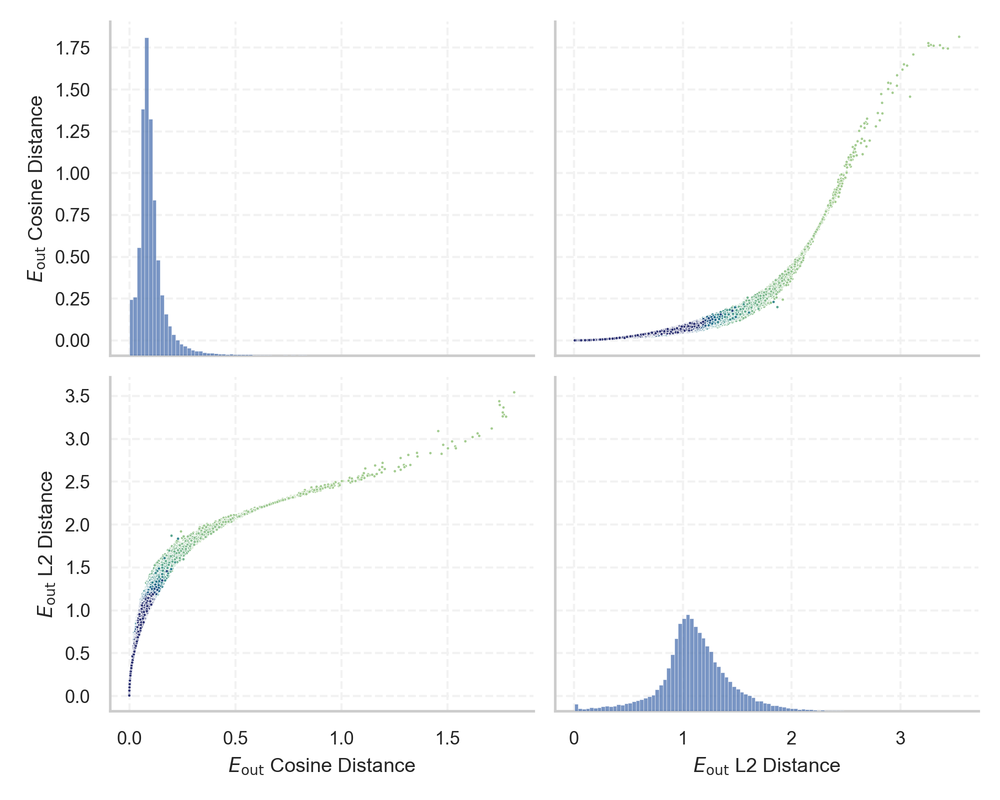
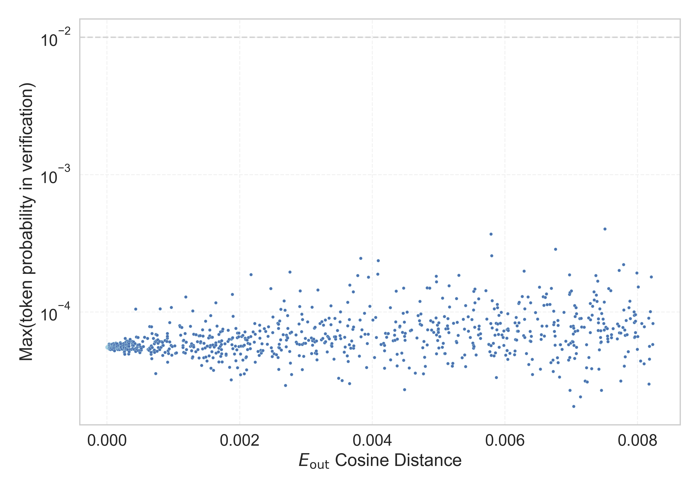

# Report for `checkpoints/step_40000`

## Model info

* Model Info: 
  * Tied embeddings: True
  * LM head uses bias: False
  * Embeddings shape: [50257, 1024]
* Tokenizer Info: 
  * Vocab Size: 50257
  * Tokenizer Class: GPT2Tokenizer
  * Tokenizer Type: BPE
  * Bytes handling: Byte Input
  * Token for verification prompt building: BuyableInstoreAndOnline
  * Token id for verification prompt building: 40242
* Indicator summary: 
  * Indicator for under-trained tokens: E_{out} Cosine Distance
  * Overall distribution: 0.107 +/- 0.091
* Detected Token Counts: 
  * Number of tested under-trained tokens: 1000, 968 non-special, 968 below p = 0.01 threshold, 966 below soft indicator threshold
  * Number of single byte tokens: 256, of which 49 below indicator threshold
  * Number of special tokens: 1, of which 1 below indicator threshold
  * Number of non-single-byte UTF-fragment tokens:  216, of which 51 below soft indicator threshold

## Under-trained token indicators plot


## Verification plot


## Under-trained token verification results
966 entries below threshold of 0.008

|   token_id | token                          |   indicator | max_prob                                                         | in_other_tokens                                                                                                                                                                                                                                                                                                                                                                                                                               |
|------------|--------------------------------|-------------|------------------------------------------------------------------|-----------------------------------------------------------------------------------------------------------------------------------------------------------------------------------------------------------------------------------------------------------------------------------------------------------------------------------------------------------------------------------------------------------------------------------------------|
|      31957 | ````` cffffcc `````            | 5.96046e-08 | <span style='border: 1px solid rgb(169, 68, 66);'>5.5e-05</span> |                                                                                                                                                                                                                                                                                                                                                                                                                                               |
|      42089 | ````` ▁TheNitrome `````        | 2.38419e-07 | <span style='border: 1px solid rgb(169, 68, 66);'>5.5e-05</span> | <span style='border: 1px solid rgb(169, 68, 66);'>````` ▁TheNitromeFan `````</span>                                                                                                                                                                                                                                                                                                                                                           |
|      30209 | ````` ▁unfocusedRange `````    | 4.17233e-07 | <span style='border: 1px solid rgb(169, 68, 66);'>5.5e-05</span> |                                                                                                                                                                                                                                                                                                                                                                                                                                               |
|      45003 | ````` ▁SetTextColor `````      | 4.17233e-07 | <span style='border: 1px solid rgb(169, 68, 66);'>5.5e-05</span> |                                                                                                                                                                                                                                                                                                                                                                                                                                               |
|       1849 | ````` \xa0 `````               | 5.36442e-07 | <span style='border: 1px solid rgb(169, 68, 66);'>5.6e-05</span> | <span style='border: 1px solid rgb(169, 68, 66);'>````` \xa0\xa0 `````</span>, <span style='border: 1px solid rgb(169, 68, 66);'>````` ▁\xa0 `````</span>, <span style='border: 1px solid rgb(169, 68, 66);'>````` \xa0\xa0\xa0\xa0 `````</span>, <span style='border: 1px solid rgb(169, 68, 66);'>````` ▁\xa0▁\xa0 `````</span>, <span style='border: 1px solid rgb(169, 68, 66);'>````` \xa0\xa0\xa0\xa0\xa0\xa0\xa0\xa0 `````</span>, ... |
|      30202 | ````` ▁guiName `````           | 5.36442e-07 | <span style='border: 1px solid rgb(169, 68, 66);'>5.6e-05</span> |                                                                                                                                                                                                                                                                                                                                                                                                                                               |
|      36862 | ````` EMOTE `````              | 5.36442e-07 | <span style='border: 1px solid rgb(169, 68, 66);'>5.5e-05</span> |                                                                                                                                                                                                                                                                                                                                                                                                                                               |
|      37574 | ````` StreamerBot `````        | 5.36442e-07 | <span style='border: 1px solid rgb(169, 68, 66);'>5.5e-05</span> | <span style='border: 1px solid rgb(169, 68, 66);'>````` TPPStreamerBot `````</span>                                                                                                                                                                                                                                                                                                                                                           |
|      39177 | ````` ItemThumbnailImage ````` | 5.36442e-07 | <span style='border: 1px solid rgb(169, 68, 66);'>5.5e-05</span> |                                                                                                                                                                                                                                                                                                                                                                                                                                               |
|      39714 | ````` isSpecial `````          | 5.36442e-07 | <span style='border: 1px solid rgb(169, 68, 66);'>5.6e-05</span> | <span style='border: 1px solid rgb(169, 68, 66);'>````` isSpecialOrderable `````</span>                                                                                                                                                                                                                                                                                                                                                       |
|      43569 | ````` ÍÍ `````                 | 5.36442e-07 | <span style='border: 1px solid rgb(169, 68, 66);'>5.5e-05</span> |                                                                                                                                                                                                                                                                                                                                                                                                                                               |
|      30208 | ````` ▁externalTo `````        | 5.96046e-07 | <span style='border: 1px solid rgb(169, 68, 66);'>5.5e-05</span> | <span style='border: 1px solid rgb(169, 68, 66);'>````` ▁externalToEVA `````</span>, <span style='border: 1px solid rgb(169, 68, 66);'>````` ▁externalToEVAOnly `````</span>                                                                                                                                                                                                                                                                  |
|      49781 | ````` EngineDebug `````        | 5.96046e-07 | <span style='border: 1px solid rgb(169, 68, 66);'>5.6e-05</span> |                                                                                                                                                                                                                                                                                                                                                                                                                                               |
|      30905 | ````` rawdownload `````        | 6.55651e-07 | <span style='border: 1px solid rgb(169, 68, 66);'>5.6e-05</span> | ````` rawdownloadcloneembedreportprint `````                                                                                                                                                                                                                                                                                                                                                                                                  |
|      11504 | ````` ▁\xa0▁\xa0 `````         | 7.7486e-07  | <span style='border: 1px solid rgb(169, 68, 66);'>5.6e-05</span> | <span style='border: 1px solid rgb(169, 68, 66);'>````` ▁\xa0▁\xa0▁\xa0▁\xa0 `````</span>, <span style='border: 1px solid rgb(169, 68, 66);'>````` ▁\xa0▁\xa0▁\xa0▁\xa0▁\xa0▁\xa0▁\xa0▁\xa0 `````</span>                                                                                                                                                                                                                                      |
|      12781 | ````` wcsstore `````           | 7.7486e-07  | <span style='border: 1px solid rgb(169, 68, 66);'>5.5e-05</span> |                                                                                                                                                                                                                                                                                                                                                                                                                                               |
|      31573 | ````` ActionCode `````         | 7.7486e-07  | <span style='border: 1px solid rgb(169, 68, 66);'>5.6e-05</span> | <span style='border: 1px solid rgb(169, 68, 66);'>````` externalActionCode `````</span>                                                                                                                                                                                                                                                                                                                                                       |
|      39756 | ````` inventoryQuantity `````  | 7.7486e-07  | <span style='border: 1px solid rgb(169, 68, 66);'>5.6e-05</span> |                                                                                                                                                                                                                                                                                                                                                                                                                                               |
|      45544 | ````` ▁サーティ `````          | 7.7486e-07  | <span style='border: 1px solid rgb(169, 68, 66);'>5.6e-05</span> | <span style='border: 1px solid rgb(169, 68, 66);'>````` ▁サーティワン `````</span>                                                                                                                                                                                                                                                                                                                                                            |
|      47654 | ````` ▁\xa0\xa0 `````          | 7.7486e-07  | <span style='border: 1px solid rgb(169, 68, 66);'>5.5e-05</span> |                                                                                                                                                                                                                                                                                                                                                                                                                                               |
<details><summary>946 additional entries below threshold</summary>

|   token_id | token                                                                          |   indicator | max_prob                                                         | in_other_tokens                                                                                                                                                                                                                                                                                                                                                                                                                                                                                        |
|------------|--------------------------------------------------------------------------------|-------------|------------------------------------------------------------------|--------------------------------------------------------------------------------------------------------------------------------------------------------------------------------------------------------------------------------------------------------------------------------------------------------------------------------------------------------------------------------------------------------------------------------------------------------------------------------------------------------|
|      19476 | ````` ▁carbohyd `````                                                          | 8.34465e-07 | <span style='border: 1px solid rgb(169, 68, 66);'>5.5e-05</span> | ````` ▁carbohydrate `````, ````` ▁carbohydrates `````                                                                                                                                                                                                                                                                                                                                                                                                                                                  |
|      23282 | ````` ▁davidjl `````                                                           | 8.34465e-07 | <span style='border: 1px solid rgb(169, 68, 66);'>5.5e-05</span> |                                                                                                                                                                                                                                                                                                                                                                                                                                                                                                        |
|      25658 | ````` ?????- `````                                                             | 8.34465e-07 | <span style='border: 1px solid rgb(169, 68, 66);'>5.5e-05</span> | <span style='border: 1px solid rgb(169, 68, 66);'>````` ?????-?????- `````</span>                                                                                                                                                                                                                                                                                                                                                                                                                      |
|      35207 | ````` ▁attRot `````                                                            | 8.34465e-07 | <span style='border: 1px solid rgb(169, 68, 66);'>5.6e-05</span> |                                                                                                                                                                                                                                                                                                                                                                                                                                                                                                        |
|      30210 | ````` ▁guiActiveUnfocused `````                                                | 9.53674e-07 | <span style='border: 1px solid rgb(169, 68, 66);'>5.5e-05</span> |                                                                                                                                                                                                                                                                                                                                                                                                                                                                                                        |
|      40219 | ````` oreAnd `````                                                             | 9.53674e-07 | <span style='border: 1px solid rgb(169, 68, 66);'>5.5e-05</span> | <span style='border: 1px solid rgb(169, 68, 66);'>````` oreAndOnline `````</span>, <span style='border: 1px solid rgb(169, 68, 66);'>````` InstoreAndOnline `````</span>, <span style='border: 1px solid rgb(169, 68, 66);'>````` BuyableInstoreAndOnline `````</span>                                                                                                                                                                                                                                 |
|      41383 | ````` assetsadobe `````                                                        | 9.53674e-07 | <span style='border: 1px solid rgb(169, 68, 66);'>5.5e-05</span> |                                                                                                                                                                                                                                                                                                                                                                                                                                                                                                        |
|      38250 | ````` ▁Skydragon `````                                                         | 1.01328e-06 | <span style='border: 1px solid rgb(169, 68, 66);'>5.5e-05</span> |                                                                                                                                                                                                                                                                                                                                                                                                                                                                                                        |
|      44320 | ````` \n\xa0 `````                                                             | 1.01328e-06 | <span style='border: 1px solid rgb(169, 68, 66);'>5.6e-05</span> |                                                                                                                                                                                                                                                                                                                                                                                                                                                                                                        |
|      17811 | ````` \xa0\xa0\xa0\xa0\xa0\xa0\xa0\xa0 `````                                   | 1.07288e-06 | <span style='border: 1px solid rgb(169, 68, 66);'>5.5e-05</span> | <span style='border: 1px solid rgb(169, 68, 66);'>````` \xa0\xa0\xa0\xa0\xa0\xa0\xa0\xa0\xa0\xa0\xa0\xa0\xa0\xa0\xa0\xa0 `````</span>                                                                                                                                                                                                                                                                                                                                                                  |
|      36173 | ````` ▁RandomRedditor `````                                                    | 1.07288e-06 | <span style='border: 1px solid rgb(169, 68, 66);'>5.5e-05</span> | <span style='border: 1px solid rgb(169, 68, 66);'>````` ▁RandomRedditorWithNo `````</span>                                                                                                                                                                                                                                                                                                                                                                                                             |
|      36940 | ````` ▁istg `````                                                              | 1.07288e-06 | <span style='border: 1px solid rgb(169, 68, 66);'>5.5e-05</span> |                                                                                                                                                                                                                                                                                                                                                                                                                                                                                                        |
|      46600 | ````` ▁Adinida `````                                                           | 1.07288e-06 | <span style='border: 1px solid rgb(169, 68, 66);'>5.5e-05</span> |                                                                                                                                                                                                                                                                                                                                                                                                                                                                                                        |
|       5815 | ````` ÃÂÃÂ `````                                                               | 1.2517e-06  | <span style='border: 1px solid rgb(169, 68, 66);'>5.5e-05</span> | <span style='border: 1px solid rgb(169, 68, 66);'>````` ÃÂÃÂÃÂÃÂ `````</span>, <span style='border: 1px solid rgb(169, 68, 66);'>````` ÃÂÃÂÃÂÃÂÃÂÃÂÃÂÃÂ `````</span>, <span style='border: 1px solid rgb(169, 68, 66);'>````` ÃÂÃÂÃÂÃÂÃÂÃÂÃÂÃÂÃÂÃÂÃÂÃÂÃÂÃÂÃÂÃÂ `````</span>, <span style='border: 1px solid rgb(169, 68, 66);'>````` ÃÂÃÂÃÂÃÂÃÂÃÂÃÂÃÂÃÂÃÂÃÂÃÂÃÂÃÂÃÂÃÂÃÂÃÂÃÂÃÂÃÂÃÂÃÂÃÂÃÂÃÂÃÂÃÂÃÂÃÂÃÂÃÂ `````</span>                                                                                     |
|      17900 | ````` ▁Dragonbound `````                                                       | 1.2517e-06  | <span style='border: 1px solid rgb(169, 68, 66);'>5.5e-05</span> |                                                                                                                                                                                                                                                                                                                                                                                                                                                                                                        |
|      45545 | ````` ▁サーティワン `````                                                      | 1.2517e-06  | <span style='border: 1px solid rgb(169, 68, 66);'>5.6e-05</span> |                                                                                                                                                                                                                                                                                                                                                                                                                                                                                                        |
|      47571 | ````` ▁DevOnline `````                                                         | 1.2517e-06  | <span style='border: 1px solid rgb(169, 68, 66);'>5.5e-05</span> |                                                                                                                                                                                                                                                                                                                                                                                                                                                                                                        |
|      25193 | ````` NetMessage `````                                                         | 1.37091e-06 | <span style='border: 1px solid rgb(169, 68, 66);'>5.5e-05</span> | <span style='border: 1px solid rgb(169, 68, 66);'>````` PsyNetMessage `````</span>                                                                                                                                                                                                                                                                                                                                                                                                                     |
|      39757 | ````` channelAvailability `````                                                | 1.37091e-06 | <span style='border: 1px solid rgb(169, 68, 66);'>5.6e-05</span> |                                                                                                                                                                                                                                                                                                                                                                                                                                                                                                        |
|      18472 | ````` ▁guiActive `````                                                         | 1.43051e-06 | <span style='border: 1px solid rgb(169, 68, 66);'>5.6e-05</span> | <span style='border: 1px solid rgb(169, 68, 66);'>````` ▁guiActiveUn `````</span>, <span style='border: 1px solid rgb(169, 68, 66);'>````` ▁guiActiveUnfocused `````</span>                                                                                                                                                                                                                                                                                                                            |
|      30439 | ````` ▁unintention `````                                                       | 1.43051e-06 | <span style='border: 1px solid rgb(169, 68, 66);'>5.5e-05</span> | ````` ▁unintentionally `````, ````` ▁unintentional `````                                                                                                                                                                                                                                                                                                                                                                                                                                               |
|      30898 | ````` embedreportprint `````                                                   | 1.43051e-06 | <span style='border: 1px solid rgb(169, 68, 66);'>5.5e-05</span> | <span style='border: 1px solid rgb(169, 68, 66);'>````` cloneembedreportprint `````</span>, ````` rawdownloadcloneembedreportprint `````                                                                                                                                                                                                                                                                                                                                                               |
|      48396 | ````` ÛÛ `````                                                                 | 1.43051e-06 | <span style='border: 1px solid rgb(169, 68, 66);'>5.5e-05</span> |                                                                                                                                                                                                                                                                                                                                                                                                                                                                                                        |
|      18945 | ````` ▁teasp `````                                                             | 1.54972e-06 | <span style='border: 1px solid rgb(169, 68, 66);'>5.5e-05</span> | ````` ▁teaspoon `````, ````` ▁teaspoons `````                                                                                                                                                                                                                                                                                                                                                                                                                                                          |
|      22686 | ````` ▁\xa0▁\xa0▁\xa0▁\xa0 `````                                               | 1.54972e-06 | <span style='border: 1px solid rgb(169, 68, 66);'>5.5e-05</span> | <span style='border: 1px solid rgb(169, 68, 66);'>````` ▁\xa0▁\xa0▁\xa0▁\xa0▁\xa0▁\xa0▁\xa0▁\xa0 `````</span>                                                                                                                                                                                                                                                                                                                                                                                          |
|      40242 | ````` BuyableInstoreAndOnline `````                                            | 1.54972e-06 | <span style='border: 1px solid rgb(169, 68, 66);'>5.6e-05</span> |                                                                                                                                                                                                                                                                                                                                                                                                                                                                                                        |
|      36929 | ````` ▁sidx `````                                                              | 1.60933e-06 | <span style='border: 1px solid rgb(169, 68, 66);'>5.5e-05</span> |                                                                                                                                                                                                                                                                                                                                                                                                                                                                                                        |
|      36935 | ````` ▁dstg `````                                                              | 1.60933e-06 | <span style='border: 1px solid rgb(169, 68, 66);'>5.5e-05</span> |                                                                                                                                                                                                                                                                                                                                                                                                                                                                                                        |
|      40240 | ````` oreAndOnline `````                                                       | 1.60933e-06 | <span style='border: 1px solid rgb(169, 68, 66);'>5.6e-05</span> | <span style='border: 1px solid rgb(169, 68, 66);'>````` InstoreAndOnline `````</span>, <span style='border: 1px solid rgb(169, 68, 66);'>````` BuyableInstoreAndOnline `````</span>                                                                                                                                                                                                                                                                                                                    |
|      37579 | ````` TPPStreamerBot `````                                                     | 1.66893e-06 | <span style='border: 1px solid rgb(169, 68, 66);'>5.6e-05</span> |                                                                                                                                                                                                                                                                                                                                                                                                                                                                                                        |
|      25502 | ````` ItemImage `````                                                          | 1.78814e-06 | <span style='border: 1px solid rgb(169, 68, 66);'>5.5e-05</span> |                                                                                                                                                                                                                                                                                                                                                                                                                                                                                                        |
|      42090 | ````` ▁TheNitromeFan `````                                                     | 1.78814e-06 | <span style='border: 1px solid rgb(169, 68, 66);'>5.5e-05</span> |                                                                                                                                                                                                                                                                                                                                                                                                                                                                                                        |
|      41551 | ````` Downloadha `````                                                         | 1.96695e-06 | <span style='border: 1px solid rgb(169, 68, 66);'>5.5e-05</span> |                                                                                                                                                                                                                                                                                                                                                                                                                                                                                                        |
|      25992 | ````` ▁裏覚醒 `````                                                            | 2.08616e-06 | <span style='border: 1px solid rgb(169, 68, 66);'>5.5e-05</span> |                                                                                                                                                                                                                                                                                                                                                                                                                                                                                                        |
|      33477 | ````` \xa0\xa0\xa0 `````                                                       | 2.44379e-06 | <span style='border: 1px solid rgb(169, 68, 66);'>5.5e-05</span> | <span style='border: 1px solid rgb(169, 68, 66);'>````` \xa0\xa0\xa0\xa0\xa0\xa0\xa0\xa0\xa0\xa0\xa0\xa0\xa0\xa0\xa0\xa0 `````</span>                                                                                                                                                                                                                                                                                                                                                                  |
|      34448 | ````` ▁ItemLevel `````                                                         | 2.44379e-06 | <span style='border: 1px solid rgb(169, 68, 66);'>5.5e-05</span> |                                                                                                                                                                                                                                                                                                                                                                                                                                                                                                        |
|      28666 | ````` PsyNetMessage `````                                                      | 2.6226e-06  | <span style='border: 1px solid rgb(169, 68, 66);'>5.5e-05</span> |                                                                                                                                                                                                                                                                                                                                                                                                                                                                                                        |
|      30212 | ````` ▁externalToEVA `````                                                     | 2.6226e-06  | <span style='border: 1px solid rgb(169, 68, 66);'>5.6e-05</span> | <span style='border: 1px solid rgb(169, 68, 66);'>````` ▁externalToEVAOnly `````</span>                                                                                                                                                                                                                                                                                                                                                                                                                |
|      38370 | ````` iHUD `````                                                               | 2.80142e-06 | <span style='border: 1px solid rgb(169, 68, 66);'>5.5e-05</span> |                                                                                                                                                                                                                                                                                                                                                                                                                                                                                                        |
|      36938 | ````` ▁sqor `````                                                              | 2.86102e-06 | <span style='border: 1px solid rgb(169, 68, 66);'>5.5e-05</span> |                                                                                                                                                                                                                                                                                                                                                                                                                                                                                                        |
|      30897 | ````` reportprint `````                                                        | 2.98023e-06 | <span style='border: 1px solid rgb(169, 68, 66);'>5.5e-05</span> | <span style='border: 1px solid rgb(169, 68, 66);'>````` embedreportprint `````</span>, <span style='border: 1px solid rgb(169, 68, 66);'>````` cloneembedreportprint `````</span>, ````` rawdownloadcloneembedreportprint `````                                                                                                                                                                                                                                                                        |
|      30899 | ````` cloneembedreportprint `````                                              | 2.98023e-06 | <span style='border: 1px solid rgb(169, 68, 66);'>5.5e-05</span> | ````` rawdownloadcloneembedreportprint `````                                                                                                                                                                                                                                                                                                                                                                                                                                                           |
|      50009 | ````` ▁strutConnector `````                                                    | 2.98023e-06 | <span style='border: 1px solid rgb(169, 68, 66);'>5.5e-05</span> |                                                                                                                                                                                                                                                                                                                                                                                                                                                                                                        |
|      47198 | ````` ItemTracker `````                                                        | 3.03984e-06 | <span style='border: 1px solid rgb(169, 68, 66);'>5.6e-05</span> |                                                                                                                                                                                                                                                                                                                                                                                                                                                                                                        |
|      39172 | ````` \xa0\xa0\xa0\xa0\xa0\xa0\xa0\xa0\xa0\xa0\xa0\xa0\xa0\xa0\xa0\xa0 `````   | 3.15905e-06 | <span style='border: 1px solid rgb(169, 68, 66);'>5.5e-05</span> |                                                                                                                                                                                                                                                                                                                                                                                                                                                                                                        |
|      41868 | ````` ▁Cosponsors `````                                                        | 3.15905e-06 | <span style='border: 1px solid rgb(169, 68, 66);'>5.5e-05</span> |                                                                                                                                                                                                                                                                                                                                                                                                                                                                                                        |
|      43361 | ````` ゼウス `````                                                             | 3.21865e-06 | <span style='border: 1px solid rgb(169, 68, 66);'>5.6e-05</span> |                                                                                                                                                                                                                                                                                                                                                                                                                                                                                                        |
|      12677 | ````` ▁tradem `````                                                            | 3.27826e-06 | <span style='border: 1px solid rgb(169, 68, 66);'>5.5e-05</span> | ````` ▁trademark `````, ````` ▁trademarks `````                                                                                                                                                                                                                                                                                                                                                                                                                                                        |
|      48069 | ````` *=- `````                                                                | 3.27826e-06 | <span style='border: 1px solid rgb(169, 68, 66);'>5.5e-05</span> |                                                                                                                                                                                                                                                                                                                                                                                                                                                                                                        |
|      33454 | ````` 龍喚士 `````                                                             | 3.39746e-06 | <span style='border: 1px solid rgb(169, 68, 66);'>5.6e-05</span> |                                                                                                                                                                                                                                                                                                                                                                                                                                                                                                        |
|      39753 | ````` quickShipAvailable `````                                                 | 3.39746e-06 | <span style='border: 1px solid rgb(169, 68, 66);'>5.5e-05</span> |                                                                                                                                                                                                                                                                                                                                                                                                                                                                                                        |
|      42202 | ````` GoldMagikarp `````                                                       | 3.57628e-06 | <span style='border: 1px solid rgb(169, 68, 66);'>5.6e-05</span> | <span style='border: 1px solid rgb(169, 68, 66);'>````` ▁SolidGoldMagikarp `````</span>                                                                                                                                                                                                                                                                                                                                                                                                                |
|      39752 | ````` quickShip `````                                                          | 3.69549e-06 | <span style='border: 1px solid rgb(169, 68, 66);'>5.6e-05</span> | <span style='border: 1px solid rgb(169, 68, 66);'>````` quickShipAvailable `````</span>                                                                                                                                                                                                                                                                                                                                                                                                                |
|      32310 | ````` sbm `````                                                                | 3.8147e-06  | <span style='border: 1px solid rgb(169, 68, 66);'>5.5e-05</span> |                                                                                                                                                                                                                                                                                                                                                                                                                                                                                                        |
|      43453 | ````` ▁SolidGoldMagikarp `````                                                 | 3.8147e-06  | <span style='border: 1px solid rgb(169, 68, 66);'>5.5e-05</span> |                                                                                                                                                                                                                                                                                                                                                                                                                                                                                                        |
|       4690 | ````` ortunately `````                                                         | 3.99351e-06 | <span style='border: 1px solid rgb(169, 68, 66);'>5.5e-05</span> | ````` fortunately `````, ````` ▁Unfortunately `````, ````` ▁unfortunately `````, ````` Unfortunately `````, ````` ▁Fortunately `````, ...                                                                                                                                                                                                                                                                                                                                                              |
|      36174 | ````` ▁RandomRedditorWithNo `````                                              | 3.99351e-06 | <span style='border: 1px solid rgb(169, 68, 66);'>5.5e-05</span> |                                                                                                                                                                                                                                                                                                                                                                                                                                                                                                        |
|      43177 | ````` EStreamFrame `````                                                       | 3.99351e-06 | <span style='border: 1px solid rgb(169, 68, 66);'>5.6e-05</span> |                                                                                                                                                                                                                                                                                                                                                                                                                                                                                                        |
|      30211 | ````` ▁guiIcon `````                                                           | 4.05312e-06 | <span style='border: 1px solid rgb(169, 68, 66);'>5.5e-05</span> |                                                                                                                                                                                                                                                                                                                                                                                                                                                                                                        |
|      42586 | ````` ▁srfN `````                                                              | 4.29153e-06 | <span style='border: 1px solid rgb(169, 68, 66);'>5.6e-05</span> |                                                                                                                                                                                                                                                                                                                                                                                                                                                                                                        |
|      34604 | ````` \\\\\\\\\\\\\\\\ `````                                                   | 4.41074e-06 | <span style='border: 1px solid rgb(169, 68, 66);'>5.5e-05</span> |                                                                                                                                                                                                                                                                                                                                                                                                                                                                                                        |
|      39755 | ````` isSpecialOrderable `````                                                 | 4.41074e-06 | <span style='border: 1px solid rgb(169, 68, 66);'>5.5e-05</span> |                                                                                                                                                                                                                                                                                                                                                                                                                                                                                                        |
|      39906 | ````` EStream `````                                                            | 4.76837e-06 | <span style='border: 1px solid rgb(169, 68, 66);'>5.6e-05</span> | <span style='border: 1px solid rgb(169, 68, 66);'>````` EStreamFrame `````</span>                                                                                                                                                                                                                                                                                                                                                                                                                      |
|      37444 | ````` ▁petertodd `````                                                         | 4.82798e-06 | <span style='border: 1px solid rgb(169, 68, 66);'>5.5e-05</span> |                                                                                                                                                                                                                                                                                                                                                                                                                                                                                                        |
|      31666 | ````` ?????-?????- `````                                                       | 4.88758e-06 | <span style='border: 1px solid rgb(169, 68, 66);'>5.6e-05</span> |                                                                                                                                                                                                                                                                                                                                                                                                                                                                                                        |
|      37842 | ````` ▁partName `````                                                          | 5.24521e-06 | <span style='border: 1px solid rgb(169, 68, 66);'>5.6e-05</span> |                                                                                                                                                                                                                                                                                                                                                                                                                                                                                                        |
|      45706 | ````` ▁\xa0▁\xa0▁\xa0▁\xa0▁\xa0▁\xa0▁\xa0▁\xa0 `````                           | 5.24521e-06 | <span style='border: 1px solid rgb(169, 68, 66);'>5.5e-05</span> |                                                                                                                                                                                                                                                                                                                                                                                                                                                                                                        |
|       9364 | ````` ÃÂÃÂÃÂÃÂ `````                                                           | 5.66244e-06 | <span style='border: 1px solid rgb(169, 68, 66);'>5.5e-05</span> | <span style='border: 1px solid rgb(169, 68, 66);'>````` ÃÂÃÂÃÂÃÂÃÂÃÂÃÂÃÂ `````</span>, <span style='border: 1px solid rgb(169, 68, 66);'>````` ÃÂÃÂÃÂÃÂÃÂÃÂÃÂÃÂÃÂÃÂÃÂÃÂÃÂÃÂÃÂÃÂ `````</span>, <span style='border: 1px solid rgb(169, 68, 66);'>````` ÃÂÃÂÃÂÃÂÃÂÃÂÃÂÃÂÃÂÃÂÃÂÃÂÃÂÃÂÃÂÃÂÃÂÃÂÃÂÃÂÃÂÃÂÃÂÃÂÃÂÃÂÃÂÃÂÃÂÃÂÃÂÃÂ `````</span>                                                                                                                                                                    |
|      40278 | ````` */( `````                                                                | 5.78165e-06 | <span style='border: 1px solid rgb(169, 68, 66);'>5.5e-05</span> |                                                                                                                                                                                                                                                                                                                                                                                                                                                                                                        |
|      34206 | ````` #$#$ `````                                                               | 5.84126e-06 | <span style='border: 1px solid rgb(169, 68, 66);'>5.5e-05</span> |                                                                                                                                                                                                                                                                                                                                                                                                                                                                                                        |
|      33813 | ````` =~=~ `````                                                               | 6.4373e-06  | <span style='border: 1px solid rgb(169, 68, 66);'>5.5e-05</span> |                                                                                                                                                                                                                                                                                                                                                                                                                                                                                                        |
|      20554 | ````` ▁unbeliev `````                                                          | 6.49691e-06 | <span style='border: 1px solid rgb(169, 68, 66);'>5.5e-05</span> | ````` ▁unbelievable `````, ````` ▁unbelievably `````                                                                                                                                                                                                                                                                                                                                                                                                                                                   |
|      32047 | ````` ▁"$:/ `````                                                              | 6.49691e-06 | <span style='border: 1px solid rgb(169, 68, 66);'>5.6e-05</span> |                                                                                                                                                                                                                                                                                                                                                                                                                                                                                                        |
|      36473 | ````` luaj `````                                                               | 6.61612e-06 | <span style='border: 1px solid rgb(169, 68, 66);'>5.5e-05</span> |                                                                                                                                                                                                                                                                                                                                                                                                                                                                                                        |
|      41380 | ````` natureconservancy `````                                                  | 6.61612e-06 | <span style='border: 1px solid rgb(169, 68, 66);'>5.6e-05</span> |                                                                                                                                                                                                                                                                                                                                                                                                                                                                                                        |
|       4603 | ````` \xa0\xa0 `````                                                           | 6.91414e-06 | <span style='border: 1px solid rgb(169, 68, 66);'>5.5e-05</span> | <span style='border: 1px solid rgb(169, 68, 66);'>````` \xa0\xa0\xa0\xa0 `````</span>, <span style='border: 1px solid rgb(169, 68, 66);'>````` \xa0\xa0\xa0\xa0\xa0\xa0\xa0\xa0 `````</span>, <span style='border: 1px solid rgb(169, 68, 66);'>````` \xa0\xa0\xa0 `````</span>, <span style='border: 1px solid rgb(169, 68, 66);'>````` \xa0\xa0\xa0\xa0\xa0\xa0\xa0\xa0\xa0\xa0\xa0\xa0\xa0\xa0\xa0\xa0 `````</span>, <span style='border: 1px solid rgb(169, 68, 66);'>````` ▁\xa0\xa0 `````</span> |
|      43065 | ````` ▁srfAttach `````                                                         | 7.09295e-06 | <span style='border: 1px solid rgb(169, 68, 66);'>5.5e-05</span> |                                                                                                                                                                                                                                                                                                                                                                                                                                                                                                        |
|       5624 | ````` ▁\xa0 `````                                                              | 7.21216e-06 | <span style='border: 1px solid rgb(169, 68, 66);'>5.5e-05</span> | <span style='border: 1px solid rgb(169, 68, 66);'>````` ▁\xa0▁\xa0 `````</span>, <span style='border: 1px solid rgb(169, 68, 66);'>````` ▁\xa0▁\xa0▁\xa0▁\xa0 `````</span>, <span style='border: 1px solid rgb(169, 68, 66);'>````` ▁\xa0▁\xa0▁\xa0▁\xa0▁\xa0▁\xa0▁\xa0▁\xa0 `````</span>, <span style='border: 1px solid rgb(169, 68, 66);'>````` ▁\xa0\xa0 `````</span>                                                                                                                              |
|      39811 | ````` soDeliveryDate `````                                                     | 7.86781e-06 | <span style='border: 1px solid rgb(169, 68, 66);'>5.6e-05</span> |                                                                                                                                                                                                                                                                                                                                                                                                                                                                                                        |
|      40241 | ````` InstoreAndOnline `````                                                   | 8.28505e-06 | <span style='border: 1px solid rgb(169, 68, 66);'>5.6e-05</span> | <span style='border: 1px solid rgb(169, 68, 66);'>````` BuyableInstoreAndOnline `````</span>                                                                                                                                                                                                                                                                                                                                                                                                           |
|      27006 | ````` ¯¯¯¯¯¯¯¯¯¯¯¯¯¯¯¯ `````                                                   | 9.11951e-06 | <span style='border: 1px solid rgb(169, 68, 66);'>5.5e-05</span> |                                                                                                                                                                                                                                                                                                                                                                                                                                                                                                        |
|      39821 | ````` 龍契士 `````                                                             | 9.47714e-06 | <span style='border: 1px solid rgb(169, 68, 66);'>5.6e-05</span> |                                                                                                                                                                                                                                                                                                                                                                                                                                                                                                        |
|      42424 | ````` DragonMagazine `````                                                     | 9.65595e-06 | <span style='border: 1px solid rgb(169, 68, 66);'>5.6e-05</span> |                                                                                                                                                                                                                                                                                                                                                                                                                                                                                                        |
|      24934 | ````` ForgeModLoader `````                                                     | 9.89437e-06 | <span style='border: 1px solid rgb(169, 68, 66);'>5.5e-05</span> |                                                                                                                                                                                                                                                                                                                                                                                                                                                                                                        |
|      27013 | ````` aditional `````                                                          | 9.89437e-06 | <span style='border: 1px solid rgb(169, 68, 66);'>5.6e-05</span> | ````` ▁Traditional `````, ````` traditional `````, ````` Traditional `````                                                                                                                                                                                                                                                                                                                                                                                                                             |
|       8828 | ````` \xa0\xa0\xa0\xa0 `````                                                   | 1.00732e-05 | <span style='border: 1px solid rgb(169, 68, 66);'>5.5e-05</span> | <span style='border: 1px solid rgb(169, 68, 66);'>````` \xa0\xa0\xa0\xa0\xa0\xa0\xa0\xa0 `````</span>, <span style='border: 1px solid rgb(169, 68, 66);'>````` \xa0\xa0\xa0\xa0\xa0\xa0\xa0\xa0\xa0\xa0\xa0\xa0\xa0\xa0\xa0\xa0 `````</span>                                                                                                                                                                                                                                                           |
|      39446 | ````` ▁SetFontSize `````                                                       | 1.04308e-05 | <span style='border: 1px solid rgb(169, 68, 66);'>5.6e-05</span> |                                                                                                                                                                                                                                                                                                                                                                                                                                                                                                        |
|      14827 | ````` ÃÂÃÂÃÂÃÂÃÂÃÂÃÂÃÂ `````                                                   | 1.12653e-05 | <span style='border: 1px solid rgb(169, 68, 66);'>5.5e-05</span> | <span style='border: 1px solid rgb(169, 68, 66);'>````` ÃÂÃÂÃÂÃÂÃÂÃÂÃÂÃÂÃÂÃÂÃÂÃÂÃÂÃÂÃÂÃÂ `````</span>, <span style='border: 1px solid rgb(169, 68, 66);'>````` ÃÂÃÂÃÂÃÂÃÂÃÂÃÂÃÂÃÂÃÂÃÂÃÂÃÂÃÂÃÂÃÂÃÂÃÂÃÂÃÂÃÂÃÂÃÂÃÂÃÂÃÂÃÂÃÂÃÂÃÂÃÂÃÂ `````</span>                                                                                                                                                                                                                                                           |
|      23614 | ````` 覚醒 `````                                                               | 1.12653e-05 | <span style='border: 1px solid rgb(169, 68, 66);'>5.6e-05</span> | <span style='border: 1px solid rgb(169, 68, 66);'>````` ▁裏覚醒 `````</span>                                                                                                                                                                                                                                                                                                                                                                                                                           |
|       5367 | ````` ¯¯ `````                                                                 | 1.14441e-05 | <span style='border: 1px solid rgb(169, 68, 66);'>5.5e-05</span> | <span style='border: 1px solid rgb(169, 68, 66);'>````` ¯¯¯¯ `````</span>, <span style='border: 1px solid rgb(169, 68, 66);'>````` ¯¯¯¯¯¯¯¯ `````</span>, <span style='border: 1px solid rgb(169, 68, 66);'>````` ¯¯¯¯¯¯¯¯¯¯¯¯¯¯¯¯ `````</span>                                                                                                                                                                                                                                                        |
|      32437 | ````` ▁Smartstocks `````                                                       | 1.18613e-05 | <span style='border: 1px solid rgb(169, 68, 66);'>5.5e-05</span> |                                                                                                                                                                                                                                                                                                                                                                                                                                                                                                        |
|      48366 | ````` ◼ `````                                                                  | 1.28746e-05 | <span style='border: 1px solid rgb(169, 68, 66);'>5.5e-05</span> |                                                                                                                                                                                                                                                                                                                                                                                                                                                                                                        |
|      48193 | ````` @#& `````                                                                | 1.3113e-05  | <span style='border: 1px solid rgb(169, 68, 66);'>5.5e-05</span> |                                                                                                                                                                                                                                                                                                                                                                                                                                                                                                        |
|      23090 | ````` ÃÂÃÂÃÂÃÂÃÂÃÂÃÂÃÂÃÂÃÂÃÂÃÂÃÂÃÂÃÂÃÂ `````                                   | 1.43051e-05 | <span style='border: 1px solid rgb(169, 68, 66);'>5.6e-05</span> | <span style='border: 1px solid rgb(169, 68, 66);'>````` ÃÂÃÂÃÂÃÂÃÂÃÂÃÂÃÂÃÂÃÂÃÂÃÂÃÂÃÂÃÂÃÂÃÂÃÂÃÂÃÂÃÂÃÂÃÂÃÂÃÂÃÂÃÂÃÂÃÂÃÂÃÂÃÂ `````</span>                                                                                                                                                                                                                                                                                                                                                                  |
|      39655 | ````` Orderable `````                                                          | 1.43051e-05 | <span style='border: 1px solid rgb(169, 68, 66);'>5.6e-05</span> | <span style='border: 1px solid rgb(169, 68, 66);'>````` isSpecialOrderable `````</span>                                                                                                                                                                                                                                                                                                                                                                                                                |
|      39693 | ````` Buyable `````                                                            | 1.52588e-05 | <span style='border: 1px solid rgb(169, 68, 66);'>5.6e-05</span> | <span style='border: 1px solid rgb(169, 68, 66);'>````` BuyableInstoreAndOnline `````</span>                                                                                                                                                                                                                                                                                                                                                                                                           |
|      13198 | ````` ▁earthqu `````                                                           | 1.59144e-05 | <span style='border: 1px solid rgb(169, 68, 66);'>5.6e-05</span> | ````` ▁earthquake `````, ````` ▁earthquakes `````                                                                                                                                                                                                                                                                                                                                                                                                                                                      |
|      34516 | ````` >>\ `````                                                                | 1.72853e-05 | <span style='border: 1px solid rgb(169, 68, 66);'>5.5e-05</span> |                                                                                                                                                                                                                                                                                                                                                                                                                                                                                                        |
|      45392 | ````` dayName `````                                                            | 1.72853e-05 | <span style='border: 1px solid rgb(169, 68, 66);'>5.6e-05</span> |                                                                                                                                                                                                                                                                                                                                                                                                                                                                                                        |
|      30213 | ````` ▁externalToEVAOnly `````                                                 | 1.84774e-05 | <span style='border: 1px solid rgb(169, 68, 66);'>5.6e-05</span> |                                                                                                                                                                                                                                                                                                                                                                                                                                                                                                        |
|      40236 | ````` FINEST `````                                                             | 1.97291e-05 | <span style='border: 1px solid rgb(169, 68, 66);'>5.5e-05</span> |                                                                                                                                                                                                                                                                                                                                                                                                                                                                                                        |
|      42066 | ````` Nitrome `````                                                            | 2.01464e-05 | <span style='border: 1px solid rgb(169, 68, 66);'>5.6e-05</span> | <span style='border: 1px solid rgb(169, 68, 66);'>````` ▁TheNitrome `````</span>, <span style='border: 1px solid rgb(169, 68, 66);'>````` ▁TheNitromeFan `````</span>                                                                                                                                                                                                                                                                                                                                  |
|       6438 | ````` ▁裏 `````                                                                | 2.09212e-05 | <span style='border: 1px solid rgb(169, 68, 66);'>5.5e-05</span> | ````` ▁裏<0xE7> `````, <span style='border: 1px solid rgb(169, 68, 66);'>````` ▁裏覚醒 `````</span>, ````` ▁裏<0xE8> `````                                                                                                                                                                                                                                                                                                                                                                             |
|      29372 | ````` ▁guiActiveUn `````                                                       | 2.10404e-05 | <span style='border: 1px solid rgb(169, 68, 66);'>5.5e-05</span> | <span style='border: 1px solid rgb(169, 68, 66);'>````` ▁guiActiveUnfocused `````</span>                                                                                                                                                                                                                                                                                                                                                                                                               |
|      43298 | ````` userc `````                                                              | 2.15769e-05 | <span style='border: 1px solid rgb(169, 68, 66);'>5.5e-05</span> | ````` usercontent `````                                                                                                                                                                                                                                                                                                                                                                                                                                                                                |
|      14341 | ````` PDATE `````                                                              | 2.18153e-05 | <span style='border: 1px solid rgb(169, 68, 66);'>5.5e-05</span> | ````` UPDATE `````, ````` ▁UPDATE `````, ````` PDATED `````                                                                                                                                                                                                                                                                                                                                                                                                                                            |
|      45563 | ````` ⓘ `````                                                                  | 2.37226e-05 | <span style='border: 1px solid rgb(169, 68, 66);'>5.6e-05</span> |                                                                                                                                                                                                                                                                                                                                                                                                                                                                                                        |
|      22997 | ````` ゴン `````                                                               | 2.39611e-05 | <span style='border: 1px solid rgb(169, 68, 66);'>5.5e-05</span> | <span style='border: 1px solid rgb(169, 68, 66);'>````` ドラゴン `````</span>                                                                                                                                                                                                                                                                                                                                                                                                                          |
|      29646 | ````` ▁gobl `````                                                              | 2.39611e-05 | <span style='border: 1px solid rgb(169, 68, 66);'>5.5e-05</span> | ````` ▁goblin `````, ````` ▁goblins `````                                                                                                                                                                                                                                                                                                                                                                                                                                                              |
|       4060 | ````` vertisement `````                                                        | 2.41399e-05 | <span style='border: 1px solid rgb(169, 68, 66);'>5.6e-05</span> | ````` Advertisement `````, ````` vertisements `````, ````` Advertisements `````, ````` ▁advertisement `````, ````` ▁advertisements `````, ...                                                                                                                                                                                                                                                                                                                                                          |
|      27293 | ````` ▁antidepress `````                                                       | 2.48551e-05 | <span style='border: 1px solid rgb(169, 68, 66);'>5.5e-05</span> | ````` ▁antidepressants `````, ````` ▁antidepressant `````                                                                                                                                                                                                                                                                                                                                                                                                                                              |
|      41297 | ````` ▁TAMADRA `````                                                           | 2.55108e-05 | <span style='border: 1px solid rgb(169, 68, 66);'>5.6e-05</span> |                                                                                                                                                                                                                                                                                                                                                                                                                                                                                                        |
|      42889 | ````` ikuman `````                                                             | 2.57492e-05 | <span style='border: 1px solid rgb(169, 68, 66);'>5.6e-05</span> | <span style='border: 1px solid rgb(169, 68, 66);'>````` ▁Kinnikuman `````</span>                                                                                                                                                                                                                                                                                                                                                                                                                       |
|      15243 | ````` ¯¯¯¯¯¯¯¯ `````                                                           | 2.60472e-05 | <span style='border: 1px solid rgb(169, 68, 66);'>5.5e-05</span> | <span style='border: 1px solid rgb(169, 68, 66);'>````` ¯¯¯¯¯¯¯¯¯¯¯¯¯¯¯¯ `````</span>                                                                                                                                                                                                                                                                                                                                                                                                                  |
|      24307 | ````` ▁looph `````                                                             | 2.63453e-05 | <span style='border: 1px solid rgb(169, 68, 66);'>5.6e-05</span> | ````` ▁loophole `````, ````` ▁loopholes `````                                                                                                                                                                                                                                                                                                                                                                                                                                                          |
|      50216 | ````` ▁Leilan `````                                                            | 2.77162e-05 | <span style='border: 1px solid rgb(169, 68, 66);'>5.7e-05</span> |                                                                                                                                                                                                                                                                                                                                                                                                                                                                                                        |
|      41230 | ````` govtrack `````                                                           | 2.78354e-05 | <span style='border: 1px solid rgb(169, 68, 66);'>5.6e-05</span> |                                                                                                                                                                                                                                                                                                                                                                                                                                                                                                        |
|      39253 | ````` ▁UCHIJ `````                                                             | 2.79546e-05 | <span style='border: 1px solid rgb(169, 68, 66);'>5.6e-05</span> |                                                                                                                                                                                                                                                                                                                                                                                                                                                                                                        |
|      18356 | ````` ▁opio `````                                                              | 2.98023e-05 | <span style='border: 1px solid rgb(169, 68, 66);'>5.7e-05</span> | ````` ▁opioid `````, ````` ▁opioids `````                                                                                                                                                                                                                                                                                                                                                                                                                                                              |
|      22640 | ````` itially `````                                                            | 3.00407e-05 | <span style='border: 1px solid rgb(169, 68, 66);'>5.6e-05</span> | ````` ▁Initially `````, ````` Initially `````                                                                                                                                                                                                                                                                                                                                                                                                                                                          |
|      27924 | ````` ▁srf `````                                                               | 3.02196e-05 | <span style='border: 1px solid rgb(169, 68, 66);'>5.6e-05</span> | <span style='border: 1px solid rgb(169, 68, 66);'>````` ▁srfN `````</span>, <span style='border: 1px solid rgb(169, 68, 66);'>````` ▁srfAttach `````</span>                                                                                                                                                                                                                                                                                                                                            |
|      39165 | ````` catentry `````                                                           | 3.05176e-05 | <span style='border: 1px solid rgb(169, 68, 66);'>5.5e-05</span> |                                                                                                                                                                                                                                                                                                                                                                                                                                                                                                        |
|      34473 | ````` ヘラ `````                                                               | 3.06964e-05 | <span style='border: 1px solid rgb(169, 68, 66);'>5.6e-05</span> |                                                                                                                                                                                                                                                                                                                                                                                                                                                                                                        |
|      34633 | ````` の魔 `````                                                               | 3.12328e-05 | <span style='border: 1px solid rgb(169, 68, 66);'>5.8e-05</span> |                                                                                                                                                                                                                                                                                                                                                                                                                                                                                                        |
|      33023 | ````` hovah `````                                                              | 3.3021e-05  | <span style='border: 1px solid rgb(169, 68, 66);'>5.7e-05</span> | ````` ▁Jehovah `````                                                                                                                                                                                                                                                                                                                                                                                                                                                                                   |
|      36886 | ````` STDOUT `````                                                             | 3.35574e-05 | <span style='border: 1px solid rgb(169, 68, 66);'>5.4e-05</span> |                                                                                                                                                                                                                                                                                                                                                                                                                                                                                                        |
|      42470 | ````` TextColor `````                                                          | 3.39746e-05 | <span style='border: 1px solid rgb(169, 68, 66);'>5.6e-05</span> | <span style='border: 1px solid rgb(169, 68, 66);'>````` ▁SetTextColor `````</span>                                                                                                                                                                                                                                                                                                                                                                                                                     |
|      44326 | ````` ーテ `````                                                               | 3.57032e-05 | <span style='border: 1px solid rgb(169, 68, 66);'>5.5e-05</span> | <span style='border: 1px solid rgb(169, 68, 66);'>````` ーティ `````</span>, <span style='border: 1px solid rgb(169, 68, 66);'>````` ▁サーティ `````</span>, <span style='border: 1px solid rgb(169, 68, 66);'>````` ▁サーティワン `````</span>                                                                                                                                                                                                                                                        |
|      31538 | ````` actionDate `````                                                         | 3.64184e-05 | <span style='border: 1px solid rgb(169, 68, 66);'>5.5e-05</span> |                                                                                                                                                                                                                                                                                                                                                                                                                                                                                                        |
|      40012 | ````` uyomi `````                                                              | 3.6478e-05  | <span style='border: 1px solid rgb(169, 68, 66);'>5.5e-05</span> | <span style='border: 1px solid rgb(169, 68, 66);'>````` ▁Tsukuyomi `````</span>                                                                                                                                                                                                                                                                                                                                                                                                                        |
|      31576 | ````` externalActionCode `````                                                 | 3.67165e-05 | <span style='border: 1px solid rgb(169, 68, 66);'>5.4e-05</span> |                                                                                                                                                                                                                                                                                                                                                                                                                                                                                                        |
|      48908 | ````` ▁4090 `````                                                              | 3.71933e-05 | <span style='border: 1px solid rgb(169, 68, 66);'>5.6e-05</span> |                                                                                                                                                                                                                                                                                                                                                                                                                                                                                                        |
|      31536 | ````` displayText `````                                                        | 3.82066e-05 | <span style='border: 1px solid rgb(169, 68, 66);'>5.5e-05</span> |                                                                                                                                                                                                                                                                                                                                                                                                                                                                                                        |
|      36130 | ````` ▁PsyNet `````                                                            | 4.00543e-05 | <span style='border: 1px solid rgb(169, 68, 66);'>5.8e-05</span> |                                                                                                                                                                                                                                                                                                                                                                                                                                                                                                        |
|      30684 | ````` ▁ⓘ `````                                                                 | 4.08888e-05 | <span style='border: 1px solid rgb(169, 68, 66);'>5.6e-05</span> |                                                                                                                                                                                                                                                                                                                                                                                                                                                                                                        |
|      31886 | ````` ▁gmaxwell `````                                                          | 4.22597e-05 | <span style='border: 1px solid rgb(169, 68, 66);'>5.7e-05</span> |                                                                                                                                                                                                                                                                                                                                                                                                                                                                                                        |
|      17473 | ````` ▁contrace `````                                                          | 4.6134e-05  | <span style='border: 1px solid rgb(169, 68, 66);'>5.3e-05</span> | ````` ▁contraception `````, ````` ▁contraceptive `````, ````` ▁contraceptives `````                                                                                                                                                                                                                                                                                                                                                                                                                    |
|       8994 | ````` ailability `````                                                         | 5.26309e-05 | <span style='border: 1px solid rgb(169, 68, 66);'>5.3e-05</span> | ````` ▁availability `````, ````` Availability `````, <span style='border: 1px solid rgb(169, 68, 66);'>````` channelAvailability `````</span>, ````` ▁Availability `````, ````` availability `````                                                                                                                                                                                                                                                                                                     |
|      17629 | ````` ▁practition `````                                                        | 5.4121e-05  | <span style='border: 1px solid rgb(169, 68, 66);'>5.4e-05</span> | ````` ▁practitioners `````, ````` ▁practitioner `````                                                                                                                                                                                                                                                                                                                                                                                                                                                  |
|      24973 | ````` ▁exting `````                                                            | 5.75185e-05 | <span style='border: 1px solid rgb(169, 68, 66);'>5.7e-05</span> | ````` ▁extingu `````, ````` ▁extinguished `````                                                                                                                                                                                                                                                                                                                                                                                                                                                        |
|       5392 | ````` ▁conclud `````                                                           | 5.84722e-05 | <span style='border: 1px solid rgb(169, 68, 66);'>5.8e-05</span> | ````` ▁concluded `````, ````` ▁conclude `````, ````` ▁concludes `````, ````` ▁concluding `````                                                                                                                                                                                                                                                                                                                                                                                                         |
|      27097 | ````` -+-+ `````                                                               | 5.96642e-05 | <span style='border: 1px solid rgb(169, 68, 66);'>5.8e-05</span> | <span style='border: 1px solid rgb(169, 68, 66);'>````` -+-+-+-+ `````</span>                                                                                                                                                                                                                                                                                                                                                                                                                          |
|      15040 | ````` byss `````                                                               | 6.03795e-05 | <span style='border: 1px solid rgb(169, 68, 66);'>5.6e-05</span> | ````` ▁Abyss `````, ````` ▁abyss `````, <span style='border: 1px solid rgb(169, 68, 66);'>````` ▁Abyssal `````</span>, ````` Abyss `````                                                                                                                                                                                                                                                                                                                                                               |
|      41215 | ````` conservancy `````                                                        | 6.47902e-05 | <span style='border: 1px solid rgb(169, 68, 66);'>5.5e-05</span> | <span style='border: 1px solid rgb(169, 68, 66);'>````` natureconservancy `````</span>                                                                                                                                                                                                                                                                                                                                                                                                                 |
|      43394 | ````` ▁CLSID `````                                                             | 6.74129e-05 | <span style='border: 1px solid rgb(169, 68, 66);'>5.7e-05</span> |                                                                                                                                                                                                                                                                                                                                                                                                                                                                                                        |
|       6598 | ````` ▁behavi `````                                                            | 6.74725e-05 | <span style='border: 1px solid rgb(169, 68, 66);'>5.8e-05</span> | ````` ▁behaviour `````, ````` ▁behaviors `````, ````` ▁behavioral `````, ````` ▁behaving `````, ````` ▁behaviours `````, ...                                                                                                                                                                                                                                                                                                                                                                           |
|      15272 | ````` ▁pione `````                                                             | 7.19428e-05 | <span style='border: 1px solid rgb(169, 68, 66);'>5.7e-05</span> | ````` ▁pioneer `````, ````` ▁pioneering `````, ````` ▁pioneers `````, ````` ▁pioneered `````                                                                                                                                                                                                                                                                                                                                                                                                           |
|      10298 | ````` senal `````                                                              | 7.76649e-05 | <span style='border: 1px solid rgb(169, 68, 66);'>5.6e-05</span> | ````` ▁Arsenal `````, ````` ▁arsenal `````, ````` Arsenal `````                                                                                                                                                                                                                                                                                                                                                                                                                                        |
|      25618 | ````` ▁councill `````                                                          | 7.76649e-05 | <span style='border: 1px solid rgb(169, 68, 66);'>5.8e-05</span> | ````` ▁councillor `````, ````` ▁councillors `````                                                                                                                                                                                                                                                                                                                                                                                                                                                      |
|      33153 | ````` ```` `````                                                               | 8.12411e-05 | <span style='border: 1px solid rgb(169, 68, 66);'>5.4e-05</span> |                                                                                                                                                                                                                                                                                                                                                                                                                                                                                                        |
|      31161 | ````` ▁//[ `````                                                               | 9.02414e-05 | <span style='border: 1px solid rgb(169, 68, 66);'>5.6e-05</span> |                                                                                                                                                                                                                                                                                                                                                                                                                                                                                                        |
|      46939 | ````` ;;;;;;;;;;;; `````                                                       | 9.03606e-05 | <span style='border: 1px solid rgb(169, 68, 66);'>5.6e-05</span> |                                                                                                                                                                                                                                                                                                                                                                                                                                                                                                        |
|      25887 | ````` ;;;;;;;; `````                                                           | 9.05395e-05 | <span style='border: 1px solid rgb(169, 68, 66);'>5.6e-05</span> | <span style='border: 1px solid rgb(169, 68, 66);'>````` ;;;;;;;;;;;; `````</span>                                                                                                                                                                                                                                                                                                                                                                                                                      |
|      47614 | ````` ▁Nanto `````                                                             | 9.16719e-05 | <span style='border: 1px solid rgb(169, 68, 66);'>5.5e-05</span> |                                                                                                                                                                                                                                                                                                                                                                                                                                                                                                        |
|      42543 | ````` ▁Seym `````                                                              | 9.76324e-05 | <span style='border: 1px solid rgb(169, 68, 66);'>5.9e-05</span> | ````` ▁Seymour `````                                                                                                                                                                                                                                                                                                                                                                                                                                                                                   |
|      31032 | ````` SpaceEngineers `````                                                     | 9.93013e-05 | <span style='border: 1px solid rgb(169, 68, 66);'>5.6e-05</span> |                                                                                                                                                                                                                                                                                                                                                                                                                                                                                                        |
|      35992 | ````` WithNo `````                                                             | 0.000100613 | <span style='border: 1px solid rgb(169, 68, 66);'>5.6e-05</span> | <span style='border: 1px solid rgb(169, 68, 66);'>````` ▁RandomRedditorWithNo `````</span>                                                                                                                                                                                                                                                                                                                                                                                                             |
|       6987 | ````` ▁therap `````                                                            | 0.000102401 | <span style='border: 1px solid rgb(169, 68, 66);'>5.6e-05</span> | ````` ▁therapy `````, ````` ▁therape `````, ````` ▁therapeutic `````, ````` ▁therapist `````, ````` ▁therapies `````, ...                                                                                                                                                                                                                                                                                                                                                                              |
|      20801 | ````` edIn `````                                                               | 0.000107169 | <span style='border: 1px solid rgb(169, 68, 66);'>5.7e-05</span> | ````` ▁LinkedIn `````, ````` LinkedIn `````                                                                                                                                                                                                                                                                                                                                                                                                                                                            |
|      40415 | ````` GGGGGGGG `````                                                           | 0.000109613 | <span style='border: 1px solid rgb(169, 68, 66);'>5.2e-05</span> |                                                                                                                                                                                                                                                                                                                                                                                                                                                                                                        |
|      38626 | ````` ▓ `````                                                                  | 0.000112772 | <span style='border: 1px solid rgb(169, 68, 66);'>5.5e-05</span> |                                                                                                                                                                                                                                                                                                                                                                                                                                                                                                        |
|       7601 | ````` ▁proport `````                                                           | 0.00011456  | <span style='border: 1px solid rgb(169, 68, 66);'>5.8e-05</span> | ````` ▁proportion `````, ````` ▁proportions `````, ````` ▁proportional `````                                                                                                                                                                                                                                                                                                                                                                                                                           |
|      21807 | ````` \\\\\\\\ `````                                                           | 0.000133336 | <span style='border: 1px solid rgb(169, 68, 66);'>5.9e-05</span> | <span style='border: 1px solid rgb(169, 68, 66);'>````` \\\\\\\\\\\\\\\\ `````</span>                                                                                                                                                                                                                                                                                                                                                                                                                  |
|      42000 | ````` ▁hemor `````                                                             | 0.000134051 | <span style='border: 1px solid rgb(169, 68, 66);'>5.5e-05</span> | ````` ▁hemorrh `````                                                                                                                                                                                                                                                                                                                                                                                                                                                                                   |
|      36490 | ````` 00200000 `````                                                           | 0.000136614 | <span style='border: 1px solid rgb(169, 68, 66);'>5.9e-05</span> |                                                                                                                                                                                                                                                                                                                                                                                                                                                                                                        |
|      13150 | ````` ▁subur `````                                                             | 0.000145376 | <span style='border: 1px solid rgb(169, 68, 66);'>5.6e-05</span> | ````` ▁suburban `````, ````` ▁suburbs `````, ````` ▁suburb `````                                                                                                                                                                                                                                                                                                                                                                                                                                       |
|      36917 | ````` %%%% `````                                                               | 0.000145495 | <span style='border: 1px solid rgb(169, 68, 66);'>5.5e-05</span> |                                                                                                                                                                                                                                                                                                                                                                                                                                                                                                        |
|      35496 | ````` ÃÂÃÂÃÂÃÂÃÂÃÂÃÂÃÂÃÂÃÂÃÂÃÂÃÂÃÂÃÂÃÂÃÂÃÂÃÂÃÂÃÂÃÂÃÂÃÂÃÂÃÂÃÂÃÂÃÂÃÂÃÂÃÂ `````   | 0.000149786 | <span style='border: 1px solid rgb(169, 68, 66);'>5.4e-05</span> |                                                                                                                                                                                                                                                                                                                                                                                                                                                                                                        |
|      19227 | ````` avorite `````                                                            | 0.000150859 | <span style='border: 1px solid rgb(169, 68, 66);'>5.7e-05</span> | ````` ▁Favorite `````, ````` favorite `````, ````` Favorite `````                                                                                                                                                                                                                                                                                                                                                                                                                                      |
|       6533 | ````` ometimes `````                                                           | 0.000151098 | <span style='border: 1px solid rgb(169, 68, 66);'>5.9e-05</span> | ````` ▁Sometimes `````, ````` Sometimes `````, ````` sometimes `````                                                                                                                                                                                                                                                                                                                                                                                                                                   |
|      40235 | ````` 姫 `````                                                                 | 0.000156701 | <span style='border: 1px solid rgb(169, 68, 66);'>5.4e-05</span> |                                                                                                                                                                                                                                                                                                                                                                                                                                                                                                        |
|      20036 | ````` ▁resil `````                                                             | 0.000157475 | <span style='border: 1px solid rgb(169, 68, 66);'>5.3e-05</span> | ````` ▁resilient `````, ````` ▁resilience `````                                                                                                                                                                                                                                                                                                                                                                                                                                                        |
|      29752 | ````` ヴ `````                                                                 | 0.000164509 | <span style='border: 1px solid rgb(169, 68, 66);'>5.3e-05</span> | <span style='border: 1px solid rgb(169, 68, 66);'>````` ヴァ `````</span>                                                                                                                                                                                                                                                                                                                                                                                                                              |
|      45199 | ````` ▁fixme `````                                                             | 0.000174165 | <span style='border: 1px solid rgb(169, 68, 66);'>5.7e-05</span> |                                                                                                                                                                                                                                                                                                                                                                                                                                                                                                        |
|      29740 | ````` ▁Azerb `````                                                             | 0.000178516 | <span style='border: 1px solid rgb(169, 68, 66);'>5.4e-05</span> | ````` ▁Azerbai `````, ````` ▁Azerbaijan `````                                                                                                                                                                                                                                                                                                                                                                                                                                                          |
|      43735 | ````` .」 `````                                                                | 0.000179172 | <span style='border: 1px solid rgb(169, 68, 66);'>5.4e-05</span> |                                                                                                                                                                                                                                                                                                                                                                                                                                                                                                        |
|      11689 | ````` ▁unnecess `````                                                          | 0.000182152 | <span style='border: 1px solid rgb(169, 68, 66);'>5.4e-05</span> | ````` ▁unnecessary `````, ````` ▁unnecessarily `````                                                                                                                                                                                                                                                                                                                                                                                                                                                   |
|      20213 | ````` ▁pestic `````                                                            | 0.000188887 | <span style='border: 1px solid rgb(169, 68, 66);'>5.3e-05</span> | ````` ▁pesticides `````, ````` ▁pesticide `````                                                                                                                                                                                                                                                                                                                                                                                                                                                        |
|      44555 | ````` ▁Archdemon `````                                                         | 0.00019753  | <span style='border: 1px solid rgb(169, 68, 66);'>6e-05</span>   |                                                                                                                                                                                                                                                                                                                                                                                                                                                                                                        |
|       7105 | ````` ▁volunte `````                                                           | 0.000199616 | <span style='border: 1px solid rgb(169, 68, 66);'>5.6e-05</span> | ````` ▁volunteers `````, ````` ▁volunteer `````, ````` ▁volunteered `````, ````` ▁volunteering `````                                                                                                                                                                                                                                                                                                                                                                                                   |
|      12869 | ````` ▁reluct `````                                                            | 0.000200868 | <span style='border: 1px solid rgb(169, 68, 66);'>6e-05</span>   | ````` ▁reluctant `````, ````` ▁reluctance `````, ````` ▁reluctantly `````                                                                                                                                                                                                                                                                                                                                                                                                                              |
|      11548 | ````` ▁entreprene `````                                                        | 0.000201046 | <span style='border: 1px solid rgb(169, 68, 66);'>5.7e-05</span> | ````` ▁entrepreneurs `````, ````` ▁entrepreneur `````, ````` ▁entrepreneurial `````, ````` ▁entrepreneurship `````                                                                                                                                                                                                                                                                                                                                                                                     |
|      37389 | ````` ▁�������� `````                                                          | 0.000202835 | <span style='border: 1px solid rgb(169, 68, 66);'>5.5e-05</span> |                                                                                                                                                                                                                                                                                                                                                                                                                                                                                                        |
|      48448 | ````` iosyn `````                                                              | 0.000203609 | <span style='border: 1px solid rgb(169, 68, 66);'>5.4e-05</span> | <span style='border: 1px solid rgb(169, 68, 66);'>````` iosyncr `````</span>, ````` ▁idiosyncr `````                                                                                                                                                                                                                                                                                                                                                                                                   |
|      28670 | ````` ═ `````                                                                  | 0.000204384 | <span style='border: 1px solid rgb(169, 68, 66);'>5.5e-05</span> | <span style='border: 1px solid rgb(169, 68, 66);'>````` ══ `````</span>                                                                                                                                                                                                                                                                                                                                                                                                                                |
|      14695 | ````` ▁eleph `````                                                             | 0.000204623 | <span style='border: 1px solid rgb(169, 68, 66);'>5.8e-05</span> | ````` ▁elephant `````, ````` ▁elephants `````                                                                                                                                                                                                                                                                                                                                                                                                                                                          |
|      44686 | ````` ーティ `````                                                             | 0.000205398 | <span style='border: 1px solid rgb(169, 68, 66);'>5.5e-05</span> | <span style='border: 1px solid rgb(169, 68, 66);'>````` ▁サーティ `````</span>, <span style='border: 1px solid rgb(169, 68, 66);'>````` ▁サーティワン `````</span>                                                                                                                                                                                                                                                                                                                                     |
|      39803 | ````` soType `````                                                             | 0.000206649 | <span style='border: 1px solid rgb(169, 68, 66);'>5.6e-05</span> |                                                                                                                                                                                                                                                                                                                                                                                                                                                                                                        |
|      36926 | ````` ▁attm `````                                                              | 0.000210941 | <span style='border: 1px solid rgb(169, 68, 66);'>5.6e-05</span> |                                                                                                                                                                                                                                                                                                                                                                                                                                                                                                        |
|      16103 | ````` ▁oun `````                                                               | 0.000226736 | <span style='border: 1px solid rgb(169, 68, 66);'>5.4e-05</span> | ````` ▁ounces `````, ````` ▁ounce `````                                                                                                                                                                                                                                                                                                                                                                                                                                                                |
|      43010 | ````` ▁Kinnikuman `````                                                        | 0.000235736 | <span style='border: 1px solid rgb(169, 68, 66);'>5.7e-05</span> |                                                                                                                                                                                                                                                                                                                                                                                                                                                                                                        |
|       8980 | ````` ¯¯¯¯ `````                                                               | 0.000247836 | <span style='border: 1px solid rgb(169, 68, 66);'>5.9e-05</span> | <span style='border: 1px solid rgb(169, 68, 66);'>````` ¯¯¯¯¯¯¯¯ `````</span>, <span style='border: 1px solid rgb(169, 68, 66);'>````` ¯¯¯¯¯¯¯¯¯¯¯¯¯¯¯¯ `````</span>                                                                                                                                                                                                                                                                                                                                   |
|      29047 | ````` maxwell `````                                                            | 0.00025022  | <span style='border: 1px solid rgb(169, 68, 66);'>5.5e-05</span> | <span style='border: 1px solid rgb(169, 68, 66);'>````` ▁gmaxwell `````</span>                                                                                                                                                                                                                                                                                                                                                                                                                         |
|      39142 | ````` ThumbnailImage `````                                                     | 0.000252843 | <span style='border: 1px solid rgb(169, 68, 66);'>5.6e-05</span> | <span style='border: 1px solid rgb(169, 68, 66);'>````` ItemThumbnailImage `````</span>                                                                                                                                                                                                                                                                                                                                                                                                                |
|      39749 | ````` DeliveryDate `````                                                       | 0.000254452 | <span style='border: 1px solid rgb(169, 68, 66);'>5.4e-05</span> | <span style='border: 1px solid rgb(169, 68, 66);'>````` soDeliveryDate `````</span>                                                                                                                                                                                                                                                                                                                                                                                                                    |
|       9286 | ````` ▁exha `````                                                              | 0.000254989 | <span style='border: 1px solid rgb(169, 68, 66);'>5.7e-05</span> | ````` ▁exhaust `````, ````` ▁exhausted `````, ````` ▁exhaustion `````, ````` ▁exhaustive `````, ````` ▁exhausting `````                                                                                                                                                                                                                                                                                                                                                                                |
|      34027 | ````` ▁actionGroup `````                                                       | 0.000255287 | <span style='border: 1px solid rgb(169, 68, 66);'>5.5e-05</span> |                                                                                                                                                                                                                                                                                                                                                                                                                                                                                                        |
|      11592 | ````` ▁``( `````                                                               | 0.000260293 | <span style='border: 1px solid rgb(169, 68, 66);'>5.1e-05</span> |                                                                                                                                                                                                                                                                                                                                                                                                                                                                                                        |
|      35579 | ````` ▁Mechdragon `````                                                        | 0.00026226  | <span style='border: 1px solid rgb(169, 68, 66);'>5.2e-05</span> |                                                                                                                                                                                                                                                                                                                                                                                                                                                                                                        |
|      47182 | ````` ":""},{" `````                                                           | 0.000266612 | <span style='border: 1px solid rgb(169, 68, 66);'>4.9e-05</span> |                                                                                                                                                                                                                                                                                                                                                                                                                                                                                                        |
|      11585 | ````` eatures `````                                                            | 0.000272512 | <span style='border: 1px solid rgb(169, 68, 66);'>6.4e-05</span> | ````` ▁Features `````, ````` Features `````, ````` ▁Creatures `````, ````` features `````                                                                                                                                                                                                                                                                                                                                                                                                              |
|      48683 | ````` ▁{* `````                                                                | 0.000278533 | <span style='border: 1px solid rgb(169, 68, 66);'>5.3e-05</span> |                                                                                                                                                                                                                                                                                                                                                                                                                                                                                                        |
|      34340 | ````` ▁UCH `````                                                               | 0.000278831 | <span style='border: 1px solid rgb(169, 68, 66);'>5.8e-05</span> | <span style='border: 1px solid rgb(169, 68, 66);'>````` ▁UCHIJ `````</span>                                                                                                                                                                                                                                                                                                                                                                                                                            |
|      48404 | ````` ruciating `````                                                          | 0.00028187  | <span style='border: 1px solid rgb(169, 68, 66);'>5.4e-05</span> | ````` ▁excruciating `````                                                                                                                                                                                                                                                                                                                                                                                                                                                                              |
|      37757 | ````` glomer `````                                                             | 0.000283659 | <span style='border: 1px solid rgb(169, 68, 66);'>5.5e-05</span> | ````` ▁conglomer `````, ````` ▁conglomerate `````                                                                                                                                                                                                                                                                                                                                                                                                                                                      |
|      39967 | ````` •••• `````                                                               | 0.000283718 | <span style='border: 1px solid rgb(169, 68, 66);'>6.1e-05</span> |                                                                                                                                                                                                                                                                                                                                                                                                                                                                                                        |
|      24466 | ````` emort `````                                                              | 0.000288427 | <span style='border: 1px solid rgb(169, 68, 66);'>5.5e-05</span> | <span style='border: 1px solid rgb(169, 68, 66);'>````` oldemort `````</span>, ````` ▁Voldemort `````                                                                                                                                                                                                                                                                                                                                                                                                  |
|      32288 | ````` regor `````                                                              | 0.000294089 | <span style='border: 1px solid rgb(169, 68, 66);'>5.8e-05</span> | ````` ▁McGregor `````                                                                                                                                                                                                                                                                                                                                                                                                                                                                                  |
|       7782 | ````` ▁occas `````                                                             | 0.000299454 | <span style='border: 1px solid rgb(169, 68, 66);'>6.2e-05</span> | ````` ▁occasionally `````, ````` ▁occasional `````, ````` ▁occasions `````                                                                                                                                                                                                                                                                                                                                                                                                                             |
|      15755 | ````` ▁millenn `````                                                           | 0.000309169 | <span style='border: 1px solid rgb(169, 68, 66);'>5.6e-05</span> | ````` ▁millennials `````, ````` ▁millennia `````, ````` ▁millennium `````, ````` ▁millennial `````                                                                                                                                                                                                                                                                                                                                                                                                     |
|      13171 | ````` VIDIA `````                                                              | 0.000310183 | <span style='border: 1px solid rgb(169, 68, 66);'>6e-05</span>   | ````` ▁NVIDIA `````, ````` NVIDIA `````                                                                                                                                                                                                                                                                                                                                                                                                                                                                |
|      42943 | ````` ?」 `````                                                                | 0.00031054  | <span style='border: 1px solid rgb(169, 68, 66);'>5.3e-05</span> |                                                                                                                                                                                                                                                                                                                                                                                                                                                                                                        |
|      11273 | ````` ▁enthusi `````                                                           | 0.000312269 | <span style='border: 1px solid rgb(169, 68, 66);'>5.6e-05</span> | ````` ▁enthusiasm `````, ````` ▁enthusiastic `````, ````` ▁enthusiasts `````, ````` ▁enthusiast `````, ````` ▁enthusiastically `````                                                                                                                                                                                                                                                                                                                                                                   |
|      42744 | ````` -+-+-+-+ `````                                                           | 0.000314057 | <span style='border: 1px solid rgb(169, 68, 66);'>5.8e-05</span> |                                                                                                                                                                                                                                                                                                                                                                                                                                                                                                        |
|      22934 | ````` ▁tyr `````                                                               | 0.000314236 | <span style='border: 1px solid rgb(169, 68, 66);'>6.1e-05</span> | ````` ▁tyranny `````, ````` ▁tyres `````, ````` ▁tyrann `````, ````` ▁tyrant `````, ````` ▁tyre `````                                                                                                                                                                                                                                                                                                                                                                                                  |
|      16303 | ````` ▁undermin `````                                                          | 0.000318229 | <span style='border: 1px solid rgb(169, 68, 66);'>6e-05</span>   | ````` ▁undermine `````, ````` ▁undermining `````, ````` ▁undermined `````, ````` ▁undermines `````                                                                                                                                                                                                                                                                                                                                                                                                     |
|       9049 | ````` ▁nomine `````                                                            | 0.000324368 | <span style='border: 1px solid rgb(169, 68, 66);'>5e-05</span>   | ````` ▁nominee `````, ````` ▁nominees `````                                                                                                                                                                                                                                                                                                                                                                                                                                                            |
|      22675 | ````` @@@@ `````                                                               | 0.000329137 | <span style='border: 1px solid rgb(169, 68, 66);'>5.9e-05</span> | <span style='border: 1px solid rgb(169, 68, 66);'>````` @@@@@@@@ `````</span>                                                                                                                                                                                                                                                                                                                                                                                                                          |
|      23711 | ````` ▁Moroc `````                                                             | 0.00033021  | <span style='border: 1px solid rgb(169, 68, 66);'>5.6e-05</span> | ````` ▁Morocco `````, ````` ▁Moroccan `````                                                                                                                                                                                                                                                                                                                                                                                                                                                            |
|      44392 | ````` ▁cumbers `````                                                           | 0.000334382 | <span style='border: 1px solid rgb(169, 68, 66);'>5.1e-05</span> | ````` ▁cumbersome `````                                                                                                                                                                                                                                                                                                                                                                                                                                                                                |
|      37991 | ````` @@@@@@@@ `````                                                           | 0.00033915  | <span style='border: 1px solid rgb(169, 68, 66);'>6.1e-05</span> |                                                                                                                                                                                                                                                                                                                                                                                                                                                                                                        |
|      32207 | ````` ▁warr `````                                                              | 0.000345588 | <span style='border: 1px solid rgb(169, 68, 66);'>5.3e-05</span> | ````` ▁warranted `````, ````` ▁warranties `````                                                                                                                                                                                                                                                                                                                                                                                                                                                        |
|      38326 | ````` ▁0004 `````                                                              | 0.000346363 | <span style='border: 1px solid rgb(169, 68, 66);'>6.3e-05</span> |                                                                                                                                                                                                                                                                                                                                                                                                                                                                                                        |
|       5808 | ````` ÃÂ `````                                                                 | 0.000367343 | <span style='border: 1px solid rgb(169, 68, 66);'>6.1e-05</span> | <span style='border: 1px solid rgb(169, 68, 66);'>````` ÃÂÃÂ `````</span>, <span style='border: 1px solid rgb(169, 68, 66);'>````` ÃÂÃÂÃÂÃÂ `````</span>, <span style='border: 1px solid rgb(169, 68, 66);'>````` ÃÂÃÂÃÂÃÂÃÂÃÂÃÂÃÂ `````</span>, <span style='border: 1px solid rgb(169, 68, 66);'>````` ÃÂÃÂÃÂÃÂÃÂÃÂÃÂÃÂÃÂÃÂÃÂÃÂÃÂÃÂÃÂÃÂ `````</span>, <span style='border: 1px solid rgb(169, 68, 66);'>````` ÃÂÃÂÃÂÃÂÃÂÃÂÃÂÃÂÃÂÃÂÃÂÃÂÃÂÃÂÃÂÃÂÃÂÃÂÃÂÃÂÃÂÃÂÃÂÃÂÃÂÃÂÃÂÃÂÃÂÃÂÃÂÃÂ `````</span>          |
|      49997 | ````` ahime `````                                                              | 0.000368118 | <span style='border: 1px solid rgb(169, 68, 66);'>5.3e-05</span> |                                                                                                                                                                                                                                                                                                                                                                                                                                                                                                        |
|      16782 | ````` ▁misunder `````                                                          | 0.000381529 | <span style='border: 1px solid rgb(169, 68, 66);'>5.7e-05</span> | ````` ▁misunderstanding `````, ````` ▁misunderstood `````, ````` ▁misunderstand `````                                                                                                                                                                                                                                                                                                                                                                                                                  |
|      38160 | ````` FontSize `````                                                           | 0.000381529 | <span style='border: 1px solid rgb(169, 68, 66);'>6.1e-05</span> | <span style='border: 1px solid rgb(169, 68, 66);'>````` ▁SetFontSize `````</span>                                                                                                                                                                                                                                                                                                                                                                                                                      |
|      32917 | ````` aution `````                                                             | 0.000383317 | <span style='border: 1px solid rgb(169, 68, 66);'>5.9e-05</span> | ````` ▁precaution `````, ````` ▁cautioned `````                                                                                                                                                                                                                                                                                                                                                                                                                                                        |
|      39008 | ````` awaru `````                                                              | 0.000385523 | <span style='border: 1px solid rgb(169, 68, 66);'>5.4e-05</span> | <span style='border: 1px solid rgb(169, 68, 66);'>````` ▁Okawaru `````</span>                                                                                                                                                                                                                                                                                                                                                                                                                          |
|      33937 | ````` Vaults `````                                                             | 0.000392258 | <span style='border: 1px solid rgb(169, 68, 66);'>6e-05</span>   |                                                                                                                                                                                                                                                                                                                                                                                                                                                                                                        |
|      36481 | ````` ertodd `````                                                             | 0.000397921 | <span style='border: 1px solid rgb(169, 68, 66);'>5.7e-05</span> | <span style='border: 1px solid rgb(169, 68, 66);'>````` ▁petertodd `````</span>                                                                                                                                                                                                                                                                                                                                                                                                                        |
|      12943 | ````` ▁encount `````                                                           | 0.000399053 | <span style='border: 1px solid rgb(169, 68, 66);'>6e-05</span>   | ````` ▁encountered `````, ````` ▁encounters `````, ````` ▁encountering `````                                                                                                                                                                                                                                                                                                                                                                                                                           |
|      46222 | ````` ▁UNCLASSIFIED `````                                                      | 0.000406206 | <span style='border: 1px solid rgb(169, 68, 66);'>5.4e-05</span> |                                                                                                                                                                                                                                                                                                                                                                                                                                                                                                        |
|      16080 | ````` ▁corrid `````                                                            | 0.000419974 | <span style='border: 1px solid rgb(169, 68, 66);'>5.9e-05</span> | ````` ▁corridor `````, ````` ▁corridors `````                                                                                                                                                                                                                                                                                                                                                                                                                                                          |
|       6681 | ````` ▁withd `````                                                             | 0.000422239 | <span style='border: 1px solid rgb(169, 68, 66);'>5.9e-05</span> | ````` ▁withdraw `````, ````` ▁withdrawal `````, ````` ▁withdrawn `````, ````` ▁withdrew `````, ````` ▁withdrawing `````, ...                                                                                                                                                                                                                                                                                                                                                                           |
|      10269 | ````` umbn `````                                                               | 0.000429988 | <span style='border: 1px solid rgb(169, 68, 66);'>5.2e-05</span> | ````` umbnails `````, ````` thumbnails `````, <span style='border: 1px solid rgb(169, 68, 66);'>````` umbnail `````</span>, ````` ▁Thumbnails `````, ````` Thumbnail `````, ...                                                                                                                                                                                                                                                                                                                        |
|      17773 | ````` ▁skelet `````                                                            | 0.000431359 | <span style='border: 1px solid rgb(169, 68, 66);'>5.4e-05</span> | ````` ▁skeleton `````, ````` ▁skeletons `````, ````` ▁skeletal `````                                                                                                                                                                                                                                                                                                                                                                                                                                   |
|       5997 | ````` sembly `````                                                             | 0.000431716 | <span style='border: 1px solid rgb(169, 68, 66);'>0.00011</span> | ````` ▁Assembly `````, ````` ▁assembly `````, ````` assembly `````, ````` Assembly `````                                                                                                                                                                                                                                                                                                                                                                                                               |
|      19373 | ````` ▁adolesc `````                                                           | 0.000439942 | <span style='border: 1px solid rgb(169, 68, 66);'>6.6e-05</span> | ````` ▁adolescents `````, ````` ▁adolescent `````, ````` ▁adolescence `````                                                                                                                                                                                                                                                                                                                                                                                                                            |
|       7677 | ````` ▁ingred `````                                                            | 0.000447273 | <span style='border: 1px solid rgb(169, 68, 66);'>5.4e-05</span> | ````` ▁ingredients `````, ````` ▁ingredient `````                                                                                                                                                                                                                                                                                                                                                                                                                                                      |
|      42382 | ````` Depths `````                                                             | 0.000454724 | <span style='border: 1px solid rgb(169, 68, 66);'>5.6e-05</span> |                                                                                                                                                                                                                                                                                                                                                                                                                                                                                                        |
|      31732 | ````` ══ `````                                                                 | 0.00045979  | <span style='border: 1px solid rgb(169, 68, 66);'>5.7e-05</span> |                                                                                                                                                                                                                                                                                                                                                                                                                                                                                                        |
|      47975 | ````` bleacher `````                                                           | 0.000465512 | <span style='border: 1px solid rgb(169, 68, 66);'>5.8e-05</span> |                                                                                                                                                                                                                                                                                                                                                                                                                                                                                                        |
|       1977 | ````` ▁toget `````                                                             | 0.000466108 | <span style='border: 1px solid rgb(169, 68, 66);'>6.5e-05</span> | ````` ▁together `````                                                                                                                                                                                                                                                                                                                                                                                                                                                                                  |
|      16323 | ````` ▁glim `````                                                              | 0.000469565 | <span style='border: 1px solid rgb(169, 68, 66);'>5.3e-05</span> | ````` ▁glimpse `````, ````` ▁glimps `````                                                                                                                                                                                                                                                                                                                                                                                                                                                              |
|      47648 | ````` TEXTURE `````                                                            | 0.000486672 | <span style='border: 1px solid rgb(169, 68, 66);'>5.8e-05</span> |                                                                                                                                                                                                                                                                                                                                                                                                                                                                                                        |
|      23846 | ````` ,,,, `````                                                               | 0.000495672 | <span style='border: 1px solid rgb(169, 68, 66);'>5.1e-05</span> | <span style='border: 1px solid rgb(169, 68, 66);'>````` ,,,,,,,, `````</span>                                                                                                                                                                                                                                                                                                                                                                                                                          |
|      47981 | ````` ▁Shinra `````                                                            | 0.000495791 | <span style='border: 1px solid rgb(169, 68, 66);'>5.3e-05</span> |                                                                                                                                                                                                                                                                                                                                                                                                                                                                                                        |
|      11606 | ````` ategory `````                                                            | 0.000505149 | <span style='border: 1px solid rgb(169, 68, 66);'>5.6e-05</span> | ````` ▁Category `````, ````` category `````, ````` Category `````                                                                                                                                                                                                                                                                                                                                                                                                                                      |
|      26712 | ````` ▁unden `````                                                             | 0.000514805 | <span style='border: 1px solid rgb(169, 68, 66);'>5.3e-05</span> | ````` ▁undeniable `````, ````` ▁undeniably `````                                                                                                                                                                                                                                                                                                                                                                                                                                                       |
|      40516 | ````` ▒ `````                                                                  | 0.000517011 | <span style='border: 1px solid rgb(169, 68, 66);'>5.4e-05</span> |                                                                                                                                                                                                                                                                                                                                                                                                                                                                                                        |
|       8983 | ````` ▁satell `````                                                            | 0.000534952 | <span style='border: 1px solid rgb(169, 68, 66);'>6.1e-05</span> | ````` ▁satellite `````, ````` ▁satellites `````                                                                                                                                                                                                                                                                                                                                                                                                                                                        |
|      46948 | ````` エル `````                                                               | 0.000547945 | <span style='border: 1px solid rgb(169, 68, 66);'>5.6e-05</span> |                                                                                                                                                                                                                                                                                                                                                                                                                                                                                                        |
|      14223 | ````` ;;;; `````                                                               | 0.000565708 | <span style='border: 1px solid rgb(169, 68, 66);'>6.6e-05</span> | <span style='border: 1px solid rgb(169, 68, 66);'>````` ;;;;;;;; `````</span>, <span style='border: 1px solid rgb(169, 68, 66);'>````` ;;;;;;;;;;;; `````</span>                                                                                                                                                                                                                                                                                                                                       |
|      34842 | ````` ▁isEnabled `````                                                         | 0.000611246 | <span style='border: 1px solid rgb(169, 68, 66);'>6.4e-05</span> |                                                                                                                                                                                                                                                                                                                                                                                                                                                                                                        |
|      41977 | ````` 66666666 `````                                                           | 0.000618458 | <span style='border: 1px solid rgb(169, 68, 66);'>5.4e-05</span> |                                                                                                                                                                                                                                                                                                                                                                                                                                                                                                        |
|       3523 | ````` ▁citiz `````                                                             | 0.000627637 | <span style='border: 1px solid rgb(169, 68, 66);'>5.3e-05</span> | ````` ▁citizens `````, ````` ▁citizen `````, ````` ▁citizenship `````                                                                                                                                                                                                                                                                                                                                                                                                                                  |
|       7503 | ````` ▁defe `````                                                              | 0.000630021 | <span style='border: 1px solid rgb(169, 68, 66);'>5.3e-05</span> | ````` ▁defence `````, ````` ▁defeated `````, ````` ▁defendant `````, ````` ▁defending `````, ````` ▁defect `````, ...                                                                                                                                                                                                                                                                                                                                                                                  |
|      45422 | ````` \/\/ `````                                                               | 0.000642002 | <span style='border: 1px solid rgb(169, 68, 66);'>5.5e-05</span> |                                                                                                                                                                                                                                                                                                                                                                                                                                                                                                        |
|      43038 | ````` ▁Okawaru `````                                                           | 0.000643075 | <span style='border: 1px solid rgb(169, 68, 66);'>7.8e-05</span> |                                                                                                                                                                                                                                                                                                                                                                                                                                                                                                        |
|      32524 | ````` bryce `````                                                              | 0.000650525 | <span style='border: 1px solid rgb(169, 68, 66);'>5.4e-05</span> |                                                                                                                                                                                                                                                                                                                                                                                                                                                                                                        |
|      17787 | ````` ▁cryst `````                                                             | 0.00066179  | <span style='border: 1px solid rgb(169, 68, 66);'>4.9e-05</span> | ````` ▁crystals `````, ````` ▁crystall `````                                                                                                                                                                                                                                                                                                                                                                                                                                                           |
|       2887 | ````` acebook `````                                                            | 0.000664115 | <span style='border: 1px solid rgb(169, 68, 66);'>5.1e-05</span> | ````` ▁Facebook `````, ````` Facebook `````, ````` facebook `````, ````` ▁facebook `````                                                                                                                                                                                                                                                                                                                                                                                                               |
|      28360 | ````` ▁antioxid `````                                                          | 0.00066632  | <span style='border: 1px solid rgb(169, 68, 66);'>5.7e-05</span> | ````` ▁antioxidant `````, ````` ▁antioxidants `````                                                                                                                                                                                                                                                                                                                                                                                                                                                    |
|      24847 | ````` ModLoader `````                                                          | 0.000669301 | <span style='border: 1px solid rgb(169, 68, 66);'>7.8e-05</span> | <span style='border: 1px solid rgb(169, 68, 66);'>````` ForgeModLoader `````</span>                                                                                                                                                                                                                                                                                                                                                                                                                    |
|      20677 | ````` ▁comr `````                                                              | 0.000672579 | <span style='border: 1px solid rgb(169, 68, 66);'>4.6e-05</span> | ````` ▁comrades `````, ````` ▁comrade `````                                                                                                                                                                                                                                                                                                                                                                                                                                                            |
|      36169 | ````` ▁ILCS `````                                                              | 0.000675619 | <span style='border: 1px solid rgb(169, 68, 66);'>7e-05</span>   |                                                                                                                                                                                                                                                                                                                                                                                                                                                                                                        |
|      48874 | ````` =] `````                                                                 | 0.000681698 | <span style='border: 1px solid rgb(169, 68, 66);'>5.5e-05</span> |                                                                                                                                                                                                                                                                                                                                                                                                                                                                                                        |
|      48995 | ````` milo `````                                                               | 0.000697434 | <span style='border: 1px solid rgb(169, 68, 66);'>6.4e-05</span> |                                                                                                                                                                                                                                                                                                                                                                                                                                                                                                        |
|      41974 | ````` accompan `````                                                           | 0.000705659 | <span style='border: 1px solid rgb(169, 68, 66);'>5.2e-05</span> | ````` accompanied `````, ````` ▁unaccompanied `````, ````` ▁accompanies `````                                                                                                                                                                                                                                                                                                                                                                                                                          |
|      40703 | ````` ▁+--- `````                                                              | 0.000711679 | <span style='border: 1px solid rgb(169, 68, 66);'>5.3e-05</span> |                                                                                                                                                                                                                                                                                                                                                                                                                                                                                                        |
|      48527 | ````` 76561 `````                                                              | 0.000712931 | <span style='border: 1px solid rgb(169, 68, 66);'>5.9e-05</span> |                                                                                                                                                                                                                                                                                                                                                                                                                                                                                                        |
|      12845 | ````` etheless `````                                                           | 0.000714958 | <span style='border: 1px solid rgb(169, 68, 66);'>5.1e-05</span> | ````` ▁nonetheless `````, ````` ▁Nonetheless `````, ````` Nonetheless `````                                                                                                                                                                                                                                                                                                                                                                                                                            |
|      46402 | ````` =-=-=-=-=-=-=-=- `````                                                   | 0.000721276 | <span style='border: 1px solid rgb(169, 68, 66);'>6.1e-05</span> |                                                                                                                                                                                                                                                                                                                                                                                                                                                                                                        |
|      34543 | ````` Û `````                                                                  | 0.000731766 | <span style='border: 1px solid rgb(169, 68, 66);'>3.6e-05</span> | <span style='border: 1px solid rgb(169, 68, 66);'>````` ÛÛ `````</span>                                                                                                                                                                                                                                                                                                                                                                                                                                |
|      42234 | ````` 闘 `````                                                                 | 0.000732303 | <span style='border: 1px solid rgb(169, 68, 66);'>6.1e-05</span> |                                                                                                                                                                                                                                                                                                                                                                                                                                                                                                        |
|       9020 | ````` ▁arrang `````                                                            | 0.000737667 | <span style='border: 1px solid rgb(169, 68, 66);'>6.9e-05</span> | ````` ▁arrangement `````, ````` ▁arrangements `````, ````` ▁arranged `````, ````` ▁arrange `````, ````` ▁arranging `````                                                                                                                                                                                                                                                                                                                                                                               |
|      12662 | ````` ▁Citiz `````                                                             | 0.000748694 | <span style='border: 1px solid rgb(169, 68, 66);'>6.2e-05</span> | ````` ▁Citizens `````, ````` ▁Citizen `````, ````` ▁Citizenship `````                                                                                                                                                                                                                                                                                                                                                                                                                                  |
|       4010 | ````` ▁challeng `````                                                          | 0.000754833 | <span style='border: 1px solid rgb(169, 68, 66);'>5.2e-05</span> | ````` ▁challenge `````, ````` ▁challenges `````, ````` ▁challenging `````, ````` ▁challenged `````, ````` ▁challenger `````, ...                                                                                                                                                                                                                                                                                                                                                                       |
|      22315 | ````` ▁newcom `````                                                            | 0.000756085 | <span style='border: 1px solid rgb(169, 68, 66);'>6.8e-05</span> | ````` ▁newcomers `````, ````` ▁newcomer `````                                                                                                                                                                                                                                                                                                                                                                                                                                                          |
|      37642 | ````` ocobo `````                                                              | 0.000763774 | <span style='border: 1px solid rgb(169, 68, 66);'>6.3e-05</span> | <span style='border: 1px solid rgb(169, 68, 66);'>````` ▁Chocobo `````</span>                                                                                                                                                                                                                                                                                                                                                                                                                          |
|      15685 | ````` ▁Reincarnated `````                                                      | 0.000767231 | <span style='border: 1px solid rgb(169, 68, 66);'>5.9e-05</span> |                                                                                                                                                                                                                                                                                                                                                                                                                                                                                                        |
|      43796 | ````` ▁Tsukuyomi `````                                                         | 0.000773489 | <span style='border: 1px solid rgb(169, 68, 66);'>5.5e-05</span> |                                                                                                                                                                                                                                                                                                                                                                                                                                                                                                        |
|       9287 | ````` perty `````                                                              | 0.000791311 | <span style='border: 1px solid rgb(169, 68, 66);'>5.3e-05</span> | ````` ▁Property `````, ````` Property `````, ````` property `````                                                                                                                                                                                                                                                                                                                                                                                                                                      |
|       7961 | ````` ▁obser `````                                                             | 0.00079149  | <span style='border: 1px solid rgb(169, 68, 66);'>6.1e-05</span> | ````` ▁observe `````, ````` ▁observations `````, ````` ▁observation `````, ````` ▁observers `````, ````` ▁observing `````, ...                                                                                                                                                                                                                                                                                                                                                                         |
|      47682 | ````` ,,,,,,,, `````                                                           | 0.000799775 | <span style='border: 1px solid rgb(169, 68, 66);'>0.00011</span> |                                                                                                                                                                                                                                                                                                                                                                                                                                                                                                        |
|      49409 | ````` ▁Parables `````                                                          | 0.000815153 | <span style='border: 1px solid rgb(169, 68, 66);'>5.5e-05</span> |                                                                                                                                                                                                                                                                                                                                                                                                                                                                                                        |
|      27050 | ````` abwe `````                                                               | 0.000825822 | <span style='border: 1px solid rgb(169, 68, 66);'>6.1e-05</span> | ````` imbabwe `````, ````` ▁Zimbabwe `````                                                                                                                                                                                                                                                                                                                                                                                                                                                             |
|      30762 | ````` ▁metic `````                                                             | 0.000834167 | <span style='border: 1px solid rgb(169, 68, 66);'>6e-05</span>   | ````` ▁meticulously `````, ````` ▁meticulous `````                                                                                                                                                                                                                                                                                                                                                                                                                                                     |
|      11974 | ````` ▁Tradable `````                                                          | 0.000838518 | <span style='border: 1px solid rgb(169, 68, 66);'>5.7e-05</span> |                                                                                                                                                                                                                                                                                                                                                                                                                                                                                                        |
|      45435 | ````` ッド `````                                                               | 0.000838935 | <span style='border: 1px solid rgb(169, 68, 66);'>4.8e-05</span> |                                                                                                                                                                                                                                                                                                                                                                                                                                                                                                        |
|      37545 | ````` ▁Sakuya `````                                                            | 0.000846803 | <span style='border: 1px solid rgb(169, 68, 66);'>5.7e-05</span> |                                                                                                                                                                                                                                                                                                                                                                                                                                                                                                        |
|      27600 | ````` OHN `````                                                                | 0.000872254 | <span style='border: 1px solid rgb(169, 68, 66);'>5.1e-05</span> | ````` ▁JOHN `````, ````` JOHN `````                                                                                                                                                                                                                                                                                                                                                                                                                                                                    |
|      13736 | ````` ▁horizont `````                                                          | 0.000875175 | <span style='border: 1px solid rgb(169, 68, 66);'>6.2e-05</span> | ````` ▁horizontal `````, ````` ▁horizontally `````                                                                                                                                                                                                                                                                                                                                                                                                                                                     |
|      43053 | ````` ▁+# `````                                                                | 0.000900984 | <span style='border: 1px solid rgb(169, 68, 66);'>6.1e-05</span> |                                                                                                                                                                                                                                                                                                                                                                                                                                                                                                        |
|      16822 | ````` =-=- `````                                                               | 0.000907362 | <span style='border: 1px solid rgb(169, 68, 66);'>6.5e-05</span> | <span style='border: 1px solid rgb(169, 68, 66);'>````` =-=-=-=- `````</span>, <span style='border: 1px solid rgb(169, 68, 66);'>````` =-=-=-=-=-=-=-=- `````</span>                                                                                                                                                                                                                                                                                                                                   |
|      24731 | ````` ドラゴン `````                                                           | 0.000908256 | <span style='border: 1px solid rgb(169, 68, 66);'>7e-05</span>   |                                                                                                                                                                                                                                                                                                                                                                                                                                                                                                        |
|      49267 | ````` ▁Pwr `````                                                               | 0.000908911 | <span style='border: 1px solid rgb(169, 68, 66);'>6.7e-05</span> |                                                                                                                                                                                                                                                                                                                                                                                                                                                                                                        |
|      41538 | ````` Magikarp `````                                                           | 0.000912488 | <span style='border: 1px solid rgb(169, 68, 66);'>4.3e-05</span> | <span style='border: 1px solid rgb(169, 68, 66);'>````` GoldMagikarp `````</span>, <span style='border: 1px solid rgb(169, 68, 66);'>````` ▁SolidGoldMagikarp `````</span>                                                                                                                                                                                                                                                                                                                             |
|      50113 | ````` .''. `````                                                               | 0.000917792 | <span style='border: 1px solid rgb(169, 68, 66);'>5.2e-05</span> |                                                                                                                                                                                                                                                                                                                                                                                                                                                                                                        |
|       8755 | ````` ▁Awoken `````                                                            | 0.000925541 | <span style='border: 1px solid rgb(169, 68, 66);'>5e-05</span>   |                                                                                                                                                                                                                                                                                                                                                                                                                                                                                                        |
|      31783 | ````` ▁BaseType `````                                                          | 0.000938118 | <span style='border: 1px solid rgb(169, 68, 66);'>5.4e-05</span> |                                                                                                                                                                                                                                                                                                                                                                                                                                                                                                        |
|      12486 | ````` ▁suspic `````                                                            | 0.000944257 | <span style='border: 1px solid rgb(169, 68, 66);'>8.4e-05</span> | ````` ▁suspicious `````, ````` ▁suspicion `````, ````` ▁suspicions `````                                                                                                                                                                                                                                                                                                                                                                                                                               |
|       8815 | ````` ▁tiss `````                                                              | 0.000944674 | <span style='border: 1px solid rgb(169, 68, 66);'>6.1e-05</span> | ````` ▁tissue `````, ````` ▁tissues `````                                                                                                                                                                                                                                                                                                                                                                                                                                                              |
|       8700 | ````` ▁certific `````                                                          | 0.000965774 | <span style='border: 1px solid rgb(169, 68, 66);'>5.7e-05</span> | ````` ▁certificate `````, ````` ▁certification `````, ````` ▁certificates `````                                                                                                                                                                                                                                                                                                                                                                                                                        |
|      22263 | ````` ▁mosqu `````                                                             | 0.000968933 | <span style='border: 1px solid rgb(169, 68, 66);'>0.00011</span> | ````` ▁mosques `````, ````` ▁mosquit `````, ````` ▁mosquito `````, ````` ▁mosquitoes `````                                                                                                                                                                                                                                                                                                                                                                                                             |
|      36278 | ````` icter `````                                                              | 0.000976205 | <span style='border: 1px solid rgb(169, 68, 66);'>4.9e-05</span> | ````` ▁stricter `````                                                                                                                                                                                                                                                                                                                                                                                                                                                                                  |
|       3286 | ````` ength `````                                                              | 0.000983179 | <span style='border: 1px solid rgb(169, 68, 66);'>5.6e-05</span> | ````` ▁length `````, ````` ▁strength `````, ````` ▁strengthen `````, ````` length `````, ````` ▁Strength `````, ...                                                                                                                                                                                                                                                                                                                                                                                    |
|       2432 | ````` ▁weap `````                                                              | 0.00102037  | <span style='border: 1px solid rgb(169, 68, 66);'>5.7e-05</span> | ````` ▁weapons `````, ````` ▁weapon `````, ````` ▁weaponry `````                                                                                                                                                                                                                                                                                                                                                                                                                                       |
|      23363 | ````` ヘ `````                                                                 | 0.00103116  | <span style='border: 1px solid rgb(169, 68, 66);'>5e-05</span>   | <span style='border: 1px solid rgb(169, 68, 66);'>````` ヘラ `````</span>                                                                                                                                                                                                                                                                                                                                                                                                                              |
|       8346 | ````` ▁condem `````                                                            | 0.0010466   | <span style='border: 1px solid rgb(169, 68, 66);'>5e-05</span>   | ````` ▁condemned `````, ````` ▁condemn `````, ````` ▁condemnation `````, ````` ▁condemning `````, ````` ▁condemns `````                                                                                                                                                                                                                                                                                                                                                                                |
|      33929 | ````` shapeshifter `````                                                       | 0.00109589  | <span style='border: 1px solid rgb(169, 68, 66);'>8e-05</span>   |                                                                                                                                                                                                                                                                                                                                                                                                                                                                                                        |
|       8438 | ````` everal `````                                                             | 0.00110394  | <span style='border: 1px solid rgb(169, 68, 66);'>7.8e-05</span> | ````` ▁Several `````, ````` Several `````                                                                                                                                                                                                                                                                                                                                                                                                                                                              |
|      44547 | ````` ▁Ichigo `````                                                            | 0.00110912  | <span style='border: 1px solid rgb(169, 68, 66);'>6.8e-05</span> |                                                                                                                                                                                                                                                                                                                                                                                                                                                                                                        |
|      12630 | ````` ▁defic `````                                                             | 0.00112671  | <span style='border: 1px solid rgb(169, 68, 66);'>7.7e-05</span> | ````` ▁deficits `````, ````` ▁deficiency `````, ````` ▁deficiencies `````, ````` ▁deficient `````                                                                                                                                                                                                                                                                                                                                                                                                      |
|      11039 | ````` ▁tremend `````                                                           | 0.0011434   | <span style='border: 1px solid rgb(169, 68, 66);'>5.7e-05</span> | ````` ▁tremendous `````, ````` ▁tremendously `````                                                                                                                                                                                                                                                                                                                                                                                                                                                     |
|      20590 | ````` ▁Pengu `````                                                             | 0.00114596  | <span style='border: 1px solid rgb(169, 68, 66);'>5.5e-05</span> | ````` ▁Penguins `````, ````` ▁Penguin `````                                                                                                                                                                                                                                                                                                                                                                                                                                                            |
|       7260 | ````` escription `````                                                         | 0.00114709  | <span style='border: 1px solid rgb(169, 68, 66);'>6.2e-05</span> | ````` description `````, ````` Description `````, ````` ▁Description `````, ````` ▁prescription `````, ````` ▁descriptions `````, ...                                                                                                                                                                                                                                                                                                                                                                  |
|      28235 | ````` aeper `````                                                              | 0.00115383  | <span style='border: 1px solid rgb(169, 68, 66);'>5.1e-05</span> | ````` aepernick `````, ````` ▁Kaepernick `````                                                                                                                                                                                                                                                                                                                                                                                                                                                         |
|      15473 | ````` ":"/ `````                                                               | 0.00115561  | <span style='border: 1px solid rgb(169, 68, 66);'>6.2e-05</span> |                                                                                                                                                                                                                                                                                                                                                                                                                                                                                                        |
|      35818 | ````` ▁Carbuncle `````                                                         | 0.00117773  | <span style='border: 1px solid rgb(169, 68, 66);'>7e-05</span>   |                                                                                                                                                                                                                                                                                                                                                                                                                                                                                                        |
|      14060 | ````` ▁predec `````                                                            | 0.00117874  | <span style='border: 1px solid rgb(169, 68, 66);'>5e-05</span>   | ````` ▁predecessor `````, ````` ▁predecessors `````                                                                                                                                                                                                                                                                                                                                                                                                                                                    |
|      11896 | ````` ▁mathemat `````                                                          | 0.00118595  | <span style='border: 1px solid rgb(169, 68, 66);'>0.00013</span> | ````` ▁mathematical `````, ````` ▁mathematics `````, ````` ▁mathematic `````, ````` ▁mathematician `````                                                                                                                                                                                                                                                                                                                                                                                               |
|      27246 | ````` //////////////// `````                                                   | 0.00119007  | <span style='border: 1px solid rgb(169, 68, 66);'>6e-05</span>   | <span style='border: 1px solid rgb(169, 68, 66);'>````` //////////////////////////////// `````</span>                                                                                                                                                                                                                                                                                                                                                                                                  |
|      23305 | ````` ▁notor `````                                                             | 0.00119323  | <span style='border: 1px solid rgb(169, 68, 66);'>6e-05</span>   | ````` ▁notoriously `````, ````` ▁notoriety `````                                                                                                                                                                                                                                                                                                                                                                                                                                                       |
|      16148 | ````` ▁unlaw `````                                                             | 0.00119567  | <span style='border: 1px solid rgb(169, 68, 66);'>5.3e-05</span> | ````` ▁unlawful `````, ````` ▁unlawfully `````                                                                                                                                                                                                                                                                                                                                                                                                                                                         |
|      43661 | ````` :::::::: `````                                                           | 0.00125712  | <span style='border: 1px solid rgb(169, 68, 66);'>5.6e-05</span> |                                                                                                                                                                                                                                                                                                                                                                                                                                                                                                        |
|      32015 | ````` yout `````                                                               | 0.00125808  | <span style='border: 1px solid rgb(169, 68, 66);'>7.9e-05</span> | ````` Layout `````, ````` youtu `````, ````` ▁youtube `````, ````` ▁youthful `````, ````` ▁layouts `````, ...                                                                                                                                                                                                                                                                                                                                                                                          |
|      36726 | ````` Reloaded `````                                                           | 0.00127     | <span style='border: 1px solid rgb(169, 68, 66);'>5.7e-05</span> | <span style='border: 1px solid rgb(169, 68, 66);'>````` FactoryReloaded `````</span>                                                                                                                                                                                                                                                                                                                                                                                                                   |
|      21955 | ````` uilt `````                                                               | 0.00127262  | <span style='border: 1px solid rgb(169, 68, 66);'>5.2e-05</span> | ````` ▁Built `````, ````` ▁rebuilt `````, ````` Built `````, ````` ▁Guilty `````                                                                                                                                                                                                                                                                                                                                                                                                                       |
|      44112 | ````` 黒 `````                                                                 | 0.00127363  | <span style='border: 1px solid rgb(169, 68, 66);'>5.9e-05</span> |                                                                                                                                                                                                                                                                                                                                                                                                                                                                                                        |
|      34103 | ````` ウス `````                                                               | 0.00128019  | <span style='border: 1px solid rgb(169, 68, 66);'>5.7e-05</span> | <span style='border: 1px solid rgb(169, 68, 66);'>````` ゼウス `````</span>                                                                                                                                                                                                                                                                                                                                                                                                                            |
|      20645 | ````` ▁dilig `````                                                             | 0.00128365  | <span style='border: 1px solid rgb(169, 68, 66);'>4.6e-05</span> | ````` ▁diligence `````, ````` ▁diligently `````, ````` ▁diligent `````                                                                                                                                                                                                                                                                                                                                                                                                                                 |
|      16041 | ````` ▁referen `````                                                           | 0.00129104  | <span style='border: 1px solid rgb(169, 68, 66);'>4.7e-05</span> | ````` ▁referenced `````, ````` ▁referencing `````                                                                                                                                                                                                                                                                                                                                                                                                                                                      |
|      15038 | ````` ▁seiz `````                                                              | 0.00129282  | <span style='border: 1px solid rgb(169, 68, 66);'>0.0001</span>  | ````` ▁seize `````, ````` ▁seizure `````, ````` ▁seizures `````, ````` ▁seizing `````                                                                                                                                                                                                                                                                                                                                                                                                                  |
|       1543 | ````` ▁charact `````                                                           | 0.00130373  | <span style='border: 1px solid rgb(169, 68, 66);'>5.7e-05</span> | ````` ▁character `````, ````` ▁characters `````, ````` ▁characteristics `````, ````` ▁characterized `````, ````` ▁characteristic `````, ...                                                                                                                                                                                                                                                                                                                                                            |
|      45201 | ````` ▁conduc `````                                                            | 0.00130582  | <span style='border: 1px solid rgb(169, 68, 66);'>6.9e-05</span> | ````` ▁conducive `````                                                                                                                                                                                                                                                                                                                                                                                                                                                                                 |
|      11093 | ````` ▁fert `````                                                              | 0.00130767  | <span style='border: 1px solid rgb(169, 68, 66);'>5.6e-05</span> | ````` ▁fertil `````, ````` ▁fertility `````, ````` ▁fertile `````, ````` ▁fertilizer `````                                                                                                                                                                                                                                                                                                                                                                                                             |
|      42360 | ````` iage `````                                                               | 0.00133657  | <span style='border: 1px solid rgb(169, 68, 66);'>5.1e-05</span> | ````` ▁foliage `````, ````` marriage `````, ````` ▁miscarriage `````                                                                                                                                                                                                                                                                                                                                                                                                                                   |
|       2941 | ````` ccording `````                                                           | 0.00134236  | <span style='border: 1px solid rgb(169, 68, 66);'>6.8e-05</span> | ````` ▁According `````, ````` According `````, ````` ▁accordingly `````, ````` ▁Accordingly `````, ````` according `````                                                                                                                                                                                                                                                                                                                                                                               |
|      30856 | ````` ▁Vaugh `````                                                             | 0.00136393  | <span style='border: 1px solid rgb(169, 68, 66);'>6.1e-05</span> | ````` ▁Vaughn `````, ````` ▁Vaughan `````                                                                                                                                                                                                                                                                                                                                                                                                                                                              |
|      49074 | ````` ▁[\| `````                                                               | 0.00136828  | <span style='border: 1px solid rgb(169, 68, 66);'>5.3e-05</span> |                                                                                                                                                                                                                                                                                                                                                                                                                                                                                                        |
|       6112 | ````` ▁pregn `````                                                             | 0.00138611  | <span style='border: 1px solid rgb(169, 68, 66);'>4.6e-05</span> | ````` ▁pregnancy `````, ````` ▁pregnant `````, ````` ▁pregnancies `````                                                                                                                                                                                                                                                                                                                                                                                                                                |
|      11411 | ````` ▁destro `````                                                            | 0.00138634  | <span style='border: 1px solid rgb(169, 68, 66);'>6.7e-05</span> | ````` ▁destroying `````, ````` ▁destroys `````, ````` ▁destroyer `````                                                                                                                                                                                                                                                                                                                                                                                                                                 |
|      10125 | ````` ntil `````                                                               | 0.00140429  | <span style='border: 1px solid rgb(169, 68, 66);'>6.7e-05</span> | ````` ▁Until `````, ````` Until `````, ````` until `````, ````` ▁ventilation `````, ````` ▁percentile `````                                                                                                                                                                                                                                                                                                                                                                                            |
|       4183 | ````` ▁conflic `````                                                           | 0.0014087   | <span style='border: 1px solid rgb(169, 68, 66);'>6e-05</span>   | ````` ▁conflict `````, ````` ▁conflicts `````, ````` ▁conflicting `````, ````` ▁conflicted `````                                                                                                                                                                                                                                                                                                                                                                                                       |
|      49731 | ````` ▁EntityItem `````                                                        | 0.00141251  | <span style='border: 1px solid rgb(169, 68, 66);'>6.1e-05</span> |                                                                                                                                                                                                                                                                                                                                                                                                                                                                                                        |
|       3472 | ````` ▁streng `````                                                            | 0.00142473  | <span style='border: 1px solid rgb(169, 68, 66);'>4.1e-05</span> | ````` ▁strength `````, ````` ▁strengthen `````, ````` ▁strengths `````, ````` ▁strengthening `````, ````` ▁strengthened `````, ...                                                                                                                                                                                                                                                                                                                                                                     |
|      11885 | ````` 龍 `````                                                                 | 0.00143933  | <span style='border: 1px solid rgb(169, 68, 66);'>7.4e-05</span> | ````` 龍<0xE5> `````, <span style='border: 1px solid rgb(169, 68, 66);'>````` 龍喚士 `````</span>, ````` 龍<0xE5><0xA5> `````, <span style='border: 1px solid rgb(169, 68, 66);'>````` 龍契士 `````</span>                                                                                                                                                                                                                                                                                             |
|      29589 | ````` ▁Defin `````                                                             | 0.00144053  | <span style='border: 1px solid rgb(169, 68, 66);'>5.4e-05</span> | ````` ▁Definition `````, ````` ▁Definitely `````, ````` ▁Definitions `````, ````` ▁Definitive `````                                                                                                                                                                                                                                                                                                                                                                                                    |
|      37226 | ````` SourceFile `````                                                         | 0.00144774  | <span style='border: 1px solid rgb(169, 68, 66);'>6.7e-05</span> |                                                                                                                                                                                                                                                                                                                                                                                                                                                                                                        |
|      30478 | ````` \": `````                                                                | 0.00145757  | <span style='border: 1px solid rgb(169, 68, 66);'>4.7e-05</span> |                                                                                                                                                                                                                                                                                                                                                                                                                                                                                                        |
|      10144 | ````` emale `````                                                              | 0.00146008  | <span style='border: 1px solid rgb(169, 68, 66);'>5.9e-05</span> | ````` ▁females `````, ````` ▁Female `````, ````` female `````, ````` Female `````, ````` ▁Females `````                                                                                                                                                                                                                                                                                                                                                                                                |
|      47530 | ````` ▬ `````                                                                  | 0.0014779   | <span style='border: 1px solid rgb(169, 68, 66);'>5.5e-05</span> | <span style='border: 1px solid rgb(169, 68, 66);'>````` ▬▬ `````</span>                                                                                                                                                                                                                                                                                                                                                                                                                                |
|      42877 | ````` 70710 `````                                                              | 0.00148439  | <span style='border: 1px solid rgb(169, 68, 66);'>8.6e-05</span> |                                                                                                                                                                                                                                                                                                                                                                                                                                                                                                        |
|      12712 | ````` wcs `````                                                                | 0.00148964  | <span style='border: 1px solid rgb(169, 68, 66);'>4.7e-05</span> | <span style='border: 1px solid rgb(169, 68, 66);'>````` wcsstore `````</span>                                                                                                                                                                                                                                                                                                                                                                                                                          |
|      23785 | ````` "]=> `````                                                               | 0.00150555  | <span style='border: 1px solid rgb(169, 68, 66);'>4.4e-05</span> |                                                                                                                                                                                                                                                                                                                                                                                                                                                                                                        |
|      42983 | ````` ワン `````                                                               | 0.0015111   | <span style='border: 1px solid rgb(169, 68, 66);'>5.7e-05</span> | <span style='border: 1px solid rgb(169, 68, 66);'>````` ▁サーティワン `````</span>                                                                                                                                                                                                                                                                                                                                                                                                                     |
|      33893 | ````` ▁MODULE `````                                                            | 0.00153118  | <span style='border: 1px solid rgb(169, 68, 66);'>6.5e-05</span> |                                                                                                                                                                                                                                                                                                                                                                                                                                                                                                        |
|      48753 | ````` dfx `````                                                                | 0.00153869  | <span style='border: 1px solid rgb(169, 68, 66);'>4.8e-05</span> |                                                                                                                                                                                                                                                                                                                                                                                                                                                                                                        |
|      12208 | ````` ▁traged `````                                                            | 0.00154865  | <span style='border: 1px solid rgb(169, 68, 66);'>6.7e-05</span> | ````` ▁tragedy `````, ````` ▁tragedies `````                                                                                                                                                                                                                                                                                                                                                                                                                                                           |
|      46968 | ````` ▁convol `````                                                            | 0.0015496   | <span style='border: 1px solid rgb(169, 68, 66);'>7.4e-05</span> | ````` ▁convoluted `````                                                                                                                                                                                                                                                                                                                                                                                                                                                                                |
|       5271 | ````` ▁advoc `````                                                             | 0.00155026  | <span style='border: 1px solid rgb(169, 68, 66);'>5.7e-05</span> | ````` ▁advocates `````, ````` ▁advocate `````, ````` ▁advocacy `````, ````` ▁advocating `````, ````` ▁advocated `````                                                                                                                                                                                                                                                                                                                                                                                  |
|       4322 | ````` ▁confir `````                                                            | 0.00155044  | <span style='border: 1px solid rgb(169, 68, 66);'>5.6e-05</span> | ````` ▁confirmed `````, ````` ▁confirm `````, ````` ▁confirmation `````, ````` ▁confirms `````, ````` ▁confirming `````                                                                                                                                                                                                                                                                                                                                                                                |
|      33717 | ````` >>>>>>>> `````                                                           | 0.00156105  | <span style='border: 1px solid rgb(169, 68, 66);'>9.4e-05</span> |                                                                                                                                                                                                                                                                                                                                                                                                                                                                                                        |
|       2590 | ````` ▁answ `````                                                              | 0.00156248  | <span style='border: 1px solid rgb(169, 68, 66);'>5.7e-05</span> | ````` ▁answer `````, ````` ▁answers `````, ````` ▁answered `````, ````` ▁answering `````                                                                                                                                                                                                                                                                                                                                                                                                               |
|      39115 | ````` '''' `````                                                               | 0.00156492  | <span style='border: 1px solid rgb(169, 68, 66);'>3.9e-05</span> |                                                                                                                                                                                                                                                                                                                                                                                                                                                                                                        |
|      45449 | ````` CLASSIFIED `````                                                         | 0.00156897  | <span style='border: 1px solid rgb(169, 68, 66);'>6.5e-05</span> | <span style='border: 1px solid rgb(169, 68, 66);'>````` ▁UNCLASSIFIED `````</span>                                                                                                                                                                                                                                                                                                                                                                                                                     |
|      20532 | ````` ▁livest `````                                                            | 0.00157928  | <span style='border: 1px solid rgb(169, 68, 66);'>5.1e-05</span> | ````` ▁livestock `````, ````` ▁livestream `````                                                                                                                                                                                                                                                                                                                                                                                                                                                        |
|      26642 | ````` tnc `````                                                                | 0.00158668  | <span style='border: 1px solid rgb(169, 68, 66);'>6.6e-05</span> |                                                                                                                                                                                                                                                                                                                                                                                                                                                                                                        |
|      47432 | ````` ▁神 `````                                                                | 0.0015924   | <span style='border: 1px solid rgb(169, 68, 66);'>5.8e-05</span> |                                                                                                                                                                                                                                                                                                                                                                                                                                                                                                        |
|       6336 | ````` ▁Palestin `````                                                          | 0.00159872  | <span style='border: 1px solid rgb(169, 68, 66);'>4.7e-05</span> | ````` ▁Palestinian `````, ````` ▁Palestinians `````, ````` ▁Palestine `````                                                                                                                                                                                                                                                                                                                                                                                                                            |
|       6141 | ````` ▁myster `````                                                            | 0.00160342  | <span style='border: 1px solid rgb(169, 68, 66);'>3.8e-05</span> | ````` ▁mystery `````, ````` ▁mysterious `````, ````` ▁mysteries `````, ````` ▁mysteriously `````                                                                                                                                                                                                                                                                                                                                                                                                       |
|      37631 | ````` FactoryReloaded `````                                                    | 0.00161594  | <span style='border: 1px solid rgb(169, 68, 66);'>5.6e-05</span> |                                                                                                                                                                                                                                                                                                                                                                                                                                                                                                        |
|      14908 | ````` ▁awa `````                                                               | 0.00163645  | <span style='border: 1px solid rgb(169, 68, 66);'>5.8e-05</span> | ````` ▁awake `````, ````` ▁awaiting `````, ````` ▁await `````, ````` ▁awaken `````, ````` ▁awakening `````, ...                                                                                                                                                                                                                                                                                                                                                                                        |
|      31739 | ````` dylib `````                                                              | 0.00163823  | <span style='border: 1px solid rgb(169, 68, 66);'>0.00012</span> |                                                                                                                                                                                                                                                                                                                                                                                                                                                                                                        |
|      19073 | ````` ドラ `````                                                               | 0.00163966  | <span style='border: 1px solid rgb(169, 68, 66);'>6e-05</span>   | <span style='border: 1px solid rgb(169, 68, 66);'>````` ドラゴン `````</span>                                                                                                                                                                                                                                                                                                                                                                                                                          |
|      49643 | ````` DERR `````                                                               | 0.00164062  | <span style='border: 1px solid rgb(169, 68, 66);'>5.7e-05</span> |                                                                                                                                                                                                                                                                                                                                                                                                                                                                                                        |
|      11910 | ````` ngth `````                                                               | 0.00164211  | <span style='border: 1px solid rgb(169, 68, 66);'>5e-05</span>   | ````` ▁strengthen `````, ````` length `````, ````` ▁Strength `````, ````` ▁lengthy `````, ````` ▁strengths `````, ...                                                                                                                                                                                                                                                                                                                                                                                  |
|       8911 | ````` anchester `````                                                          | 0.00165904  | <span style='border: 1px solid rgb(169, 68, 66);'>7.9e-05</span> | ````` ▁Manchester `````, ````` Manchester `````                                                                                                                                                                                                                                                                                                                                                                                                                                                        |
|      49704 | ````` //////////////////////////////// `````                                   | 0.00167716  | <span style='border: 1px solid rgb(169, 68, 66);'>5.1e-05</span> |                                                                                                                                                                                                                                                                                                                                                                                                                                                                                                        |
|      37662 | ````` ォ `````                                                                 | 0.00168544  | <span style='border: 1px solid rgb(169, 68, 66);'>6.9e-05</span> | <span style='border: 1px solid rgb(169, 68, 66);'>````` フォ `````</span>                                                                                                                                                                                                                                                                                                                                                                                                                              |
|      37858 | ````` ヤ `````                                                                 | 0.00168622  | <span style='border: 1px solid rgb(169, 68, 66);'>4.3e-05</span> |                                                                                                                                                                                                                                                                                                                                                                                                                                                                                                        |
|      49778 | ````` \< `````                                                                 | 0.00168628  | <span style='border: 1px solid rgb(169, 68, 66);'>5.5e-05</span> |                                                                                                                                                                                                                                                                                                                                                                                                                                                                                                        |
|      30360 | ````` dyl `````                                                                | 0.00169063  | <span style='border: 1px solid rgb(169, 68, 66);'>6.1e-05</span> | <span style='border: 1px solid rgb(169, 68, 66);'>````` dylib `````</span>                                                                                                                                                                                                                                                                                                                                                                                                                             |
|      13177 | ````` ▁nodd `````                                                              | 0.00170594  | <span style='border: 1px solid rgb(169, 68, 66);'>5.6e-05</span> | ````` ▁nodded `````, ````` ▁nodding `````                                                                                                                                                                                                                                                                                                                                                                                                                                                              |
|      31765 | ````` MpServer `````                                                           | 0.00170839  | <span style='border: 1px solid rgb(169, 68, 66);'>7.2e-05</span> |                                                                                                                                                                                                                                                                                                                                                                                                                                                                                                        |
|      40629 | ````` ディ `````                                                               | 0.00171059  | <span style='border: 1px solid rgb(169, 68, 66);'>6.1e-05</span> |                                                                                                                                                                                                                                                                                                                                                                                                                                                                                                        |
|      44444 | ````` ヴァ `````                                                               | 0.00171214  | <span style='border: 1px solid rgb(169, 68, 66);'>4.8e-05</span> |                                                                                                                                                                                                                                                                                                                                                                                                                                                                                                        |
|      45748 | ````` ▁VIDE `````                                                              | 0.00172287  | <span style='border: 1px solid rgb(169, 68, 66);'>5.8e-05</span> | ````` ▁VIDEOS `````                                                                                                                                                                                                                                                                                                                                                                                                                                                                                    |
|      49843 | ````` ▬▬ `````                                                                 | 0.00172341  | <span style='border: 1px solid rgb(169, 68, 66);'>5.3e-05</span> |                                                                                                                                                                                                                                                                                                                                                                                                                                                                                                        |
|      26358 | ````` ":[" `````                                                               | 0.00172663  | <span style='border: 1px solid rgb(169, 68, 66);'>6.2e-05</span> |                                                                                                                                                                                                                                                                                                                                                                                                                                                                                                        |
|      12241 | ````` ▁horm `````                                                              | 0.00172698  | <span style='border: 1px solid rgb(169, 68, 66);'>5e-05</span>   | ````` ▁hormone `````, ````` ▁hormones `````, ````` ▁hormonal `````                                                                                                                                                                                                                                                                                                                                                                                                                                     |
|      36406 | ````` ONSORED `````                                                            | 0.0017361   | <span style='border: 1px solid rgb(169, 68, 66);'>4.3e-05</span> | <span style='border: 1px solid rgb(169, 68, 66);'>````` SPONSORED `````</span>                                                                                                                                                                                                                                                                                                                                                                                                                         |
|       8816 | ````` isconsin `````                                                           | 0.00173986  | <span style='border: 1px solid rgb(169, 68, 66);'>7.3e-05</span> | ````` ▁Wisconsin `````, ````` Wisconsin `````                                                                                                                                                                                                                                                                                                                                                                                                                                                          |
|      42785 | ````` "}]," `````                                                              | 0.00174451  | <span style='border: 1px solid rgb(169, 68, 66);'>7.5e-05</span> |                                                                                                                                                                                                                                                                                                                                                                                                                                                                                                        |
|       6399 | ````` ▁subsequ `````                                                           | 0.00177711  | <span style='border: 1px solid rgb(169, 68, 66);'>5.9e-05</span> | ````` ▁subsequent `````, ````` ▁subsequently `````                                                                                                                                                                                                                                                                                                                                                                                                                                                     |
|       6480 | ````` ▁instr `````                                                             | 0.00179356  | <span style='border: 1px solid rgb(169, 68, 66);'>4.8e-05</span> | ````` ▁instructions `````, ````` ▁instrument `````, ````` ▁instruction `````, ````` ▁instruments `````, ````` ▁instructed `````, ...                                                                                                                                                                                                                                                                                                                                                                   |
|      11480 | ````` iversal `````                                                            | 0.00179452  | <span style='border: 1px solid rgb(169, 68, 66);'>5e-05</span>   | ````` ▁Universal `````, ````` ▁universally `````, ````` Universal `````, ````` universal `````                                                                                                                                                                                                                                                                                                                                                                                                         |
|      16100 | ````` retty `````                                                              | 0.00182074  | <span style='border: 1px solid rgb(169, 68, 66);'>6.1e-05</span> | ````` ▁Pretty `````, ````` Pretty `````, ````` pretty `````                                                                                                                                                                                                                                                                                                                                                                                                                                            |
|      47021 | ````` ▁Chocobo `````                                                           | 0.00182509  | <span style='border: 1px solid rgb(169, 68, 66);'>7.4e-05</span> |                                                                                                                                                                                                                                                                                                                                                                                                                                                                                                        |
|      39467 | ````` シャ `````                                                               | 0.00184011  | <span style='border: 1px solid rgb(169, 68, 66);'>6.3e-05</span> |                                                                                                                                                                                                                                                                                                                                                                                                                                                                                                        |
|      30432 | ````` ゼ `````                                                                 | 0.00184667  | <span style='border: 1px solid rgb(169, 68, 66);'>4e-05</span>   | <span style='border: 1px solid rgb(169, 68, 66);'>````` ゼウス `````</span>                                                                                                                                                                                                                                                                                                                                                                                                                            |
|       3587 | ````` atever `````                                                             | 0.00187087  | <span style='border: 1px solid rgb(169, 68, 66);'>3.2e-05</span> | ````` ▁whatever `````, ````` ▁Whatever `````, ````` Whatever `````, ````` whatever `````                                                                                                                                                                                                                                                                                                                                                                                                               |
|      27584 | ````` =-=-=-=- `````                                                           | 0.00187695  | <span style='border: 1px solid rgb(169, 68, 66);'>6.3e-05</span> | <span style='border: 1px solid rgb(169, 68, 66);'>````` =-=-=-=-=-=-=-=- `````</span>                                                                                                                                                                                                                                                                                                                                                                                                                  |
|       9146 | ````` GBT `````                                                                | 0.00188309  | <span style='border: 1px solid rgb(169, 68, 66);'>5.8e-05</span> | ````` ▁LGBT `````, ````` ▁LGBTQ `````, ````` LGBT `````                                                                                                                                                                                                                                                                                                                                                                                                                                                |
|      40517 | ````` ADRA `````                                                               | 0.00188702  | <span style='border: 1px solid rgb(169, 68, 66);'>6.4e-05</span> | <span style='border: 1px solid rgb(169, 68, 66);'>````` ▁TAMADRA `````</span>                                                                                                                                                                                                                                                                                                                                                                                                                          |
|       8795 | ````` iscons `````                                                             | 0.00188857  | <span style='border: 1px solid rgb(169, 68, 66);'>0.00013</span> | <span style='border: 1px solid rgb(169, 68, 66);'>````` isconsin `````</span>, ````` ▁Wisconsin `````, ````` Wisconsin `````                                                                                                                                                                                                                                                                                                                                                                           |
|      35318 | ````` 装 `````                                                                 | 0.0018943   | <span style='border: 1px solid rgb(169, 68, 66);'>6.5e-05</span> |                                                                                                                                                                                                                                                                                                                                                                                                                                                                                                        |
|      48457 | ````` フォ `````                                                               | 0.00189519  | <span style='border: 1px solid rgb(169, 68, 66);'>5.4e-05</span> |                                                                                                                                                                                                                                                                                                                                                                                                                                                                                                        |
|       3207 | ````` ▁thous `````                                                             | 0.00189829  | <span style='border: 1px solid rgb(169, 68, 66);'>9.3e-05</span> | ````` ▁thousands `````, ````` ▁thousand `````                                                                                                                                                                                                                                                                                                                                                                                                                                                          |
|      35793 | ````` )=( `````                                                                | 0.00191957  | <span style='border: 1px solid rgb(169, 68, 66);'>5e-05</span>   |                                                                                                                                                                                                                                                                                                                                                                                                                                                                                                        |
|       9882 | ````` ▁neighb `````                                                            | 0.00193518  | <span style='border: 1px solid rgb(169, 68, 66);'>5.6e-05</span> | ````` ▁neighbors `````, ````` ▁neighbour `````, ````` ▁neighborhoods `````, ````` ▁neighbourhood `````, ````` ▁neighboring `````, ...                                                                                                                                                                                                                                                                                                                                                                  |
|      17845 | ````` swer `````                                                               | 0.00194061  | <span style='border: 1px solid rgb(169, 68, 66);'>7.6e-05</span> | ````` ▁answering `````, ````` ▁Answer `````, ````` answered `````, ````` Answer `````, ````` ▁unanswered `````, ...                                                                                                                                                                                                                                                                                                                                                                                    |
|      45823 | ````` ンジ `````                                                               | 0.00194341  | <span style='border: 1px solid rgb(169, 68, 66);'>4.4e-05</span> |                                                                                                                                                                                                                                                                                                                                                                                                                                                                                                        |
|      35144 | ````` ▁Izan `````                                                              | 0.00195736  | <span style='border: 1px solid rgb(169, 68, 66);'>5.3e-05</span> |                                                                                                                                                                                                                                                                                                                                                                                                                                                                                                        |
|      11966 | ````` ▁Marketable `````                                                        | 0.00196427  | <span style='border: 1px solid rgb(169, 68, 66);'>6.5e-05</span> |                                                                                                                                                                                                                                                                                                                                                                                                                                                                                                        |
|      18115 | ````` izoph `````                                                              | 0.00196564  | <span style='border: 1px solid rgb(169, 68, 66);'>3.9e-05</span> | ````` izophren `````, ````` ▁schizophren `````, ````` ▁schizophrenia `````                                                                                                                                                                                                                                                                                                                                                                                                                             |
|      48416 | ````` ▁shenan `````                                                            | 0.0019657   | <span style='border: 1px solid rgb(169, 68, 66);'>7e-05</span>   | ````` ▁shenanigans `````                                                                                                                                                                                                                                                                                                                                                                                                                                                                               |
|      48869 | ````` ̶ `````                                                                   | 0.00198275  | <span style='border: 1px solid rgb(169, 68, 66);'>6.6e-05</span> |                                                                                                                                                                                                                                                                                                                                                                                                                                                                                                        |
|      10160 | ````` ▁trave `````                                                             | 0.00198597  | <span style='border: 1px solid rgb(169, 68, 66);'>5.6e-05</span> | ````` ▁traveling `````, ````` ▁traveled `````, ````` ▁travelling `````, ````` ▁travels `````, ````` ▁travelled `````, ...                                                                                                                                                                                                                                                                                                                                                                              |
|      39886 | ````` ▁pci `````                                                               | 0.00198835  | <span style='border: 1px solid rgb(169, 68, 66);'>7e-05</span>   |                                                                                                                                                                                                                                                                                                                                                                                                                                                                                                        |
|       9418 | ````` ▁distingu `````                                                          | 0.00201297  | <span style='border: 1px solid rgb(169, 68, 66);'>3.5e-05</span> | ````` ▁distinguish `````, ````` ▁distinguished `````, ````` ▁distinguishing `````, ````` ▁distinguishes `````                                                                                                                                                                                                                                                                                                                                                                                          |
|      47540 | ````` ▁._ `````                                                                | 0.00201333  | <span style='border: 1px solid rgb(169, 68, 66);'>4.9e-05</span> |                                                                                                                                                                                                                                                                                                                                                                                                                                                                                                        |
|       3603 | ````` ufact `````                                                              | 0.00201911  | <span style='border: 1px solid rgb(169, 68, 66);'>5.7e-05</span> | ````` ▁manufact `````, ````` ▁manufacture `````, ````` ▁manufacturing `````, ````` ▁manufacturers `````, ````` ▁manufacturer `````, ...                                                                                                                                                                                                                                                                                                                                                                |
|      33468 | ````` ▁├ `````                                                                 | 0.00203001  | <span style='border: 1px solid rgb(169, 68, 66);'>6.6e-05</span> | ````` ▁├── `````                                                                                                                                                                                                                                                                                                                                                                                                                                                                                       |
|      22110 | ````` ░ `````                                                                  | 0.00204617  | <span style='border: 1px solid rgb(169, 68, 66);'>6.8e-05</span> | <span style='border: 1px solid rgb(169, 68, 66);'>````` ░░ `````</span>                                                                                                                                                                                                                                                                                                                                                                                                                                |
|      45664 | ````` mbuds `````                                                              | 0.00204903  | <span style='border: 1px solid rgb(169, 68, 66);'>4.5e-05</span> | ````` mbudsman `````                                                                                                                                                                                                                                                                                                                                                                                                                                                                                   |
|      49813 | ````` ▁Flavoring `````                                                         | 0.00205171  | <span style='border: 1px solid rgb(169, 68, 66);'>5.7e-05</span> |                                                                                                                                                                                                                                                                                                                                                                                                                                                                                                        |
|       2549 | ````` ournal `````                                                             | 0.00206739  | <span style='border: 1px solid rgb(169, 68, 66);'>3.5e-05</span> | ````` ▁journal `````, ````` ▁Journal `````, ````` ▁journalists `````, ````` ▁journalist `````, ````` ▁journalism `````, ...                                                                                                                                                                                                                                                                                                                                                                            |
|      42396 | ````` イト `````                                                               | 0.0020684   | <span style='border: 1px solid rgb(169, 68, 66);'>5.7e-05</span> |                                                                                                                                                                                                                                                                                                                                                                                                                                                                                                        |
|       8552 | ````` ▁incorpor `````                                                          | 0.00207788  | <span style='border: 1px solid rgb(169, 68, 66);'>7.2e-05</span> | ````` ▁incorporated `````, ````` ▁incorporate `````, ````` ▁incorporating `````, ````` ▁incorporates `````, ````` ▁incorporation `````                                                                                                                                                                                                                                                                                                                                                                 |
|       2477 | ````` ▁agre `````                                                              | 0.00208235  | <span style='border: 1px solid rgb(169, 68, 66);'>6.5e-05</span> | ````` ▁agree `````, ````` ▁agreement `````, ````` ▁agreed `````, ````` ▁agreements `````, ````` ▁agrees `````, ...                                                                                                                                                                                                                                                                                                                                                                                     |
|      24373 | ````` ▁discrep `````                                                           | 0.0020898   | <span style='border: 1px solid rgb(169, 68, 66);'>6.3e-05</span> | ````` ▁discrepancy `````, ````` ▁discrepancies `````                                                                                                                                                                                                                                                                                                                                                                                                                                                   |
|      31727 | ````` cffff `````                                                              | 0.00209421  | <span style='border: 1px solid rgb(169, 68, 66);'>4.6e-05</span> | <span style='border: 1px solid rgb(169, 68, 66);'>````` cffffcc `````</span>                                                                                                                                                                                                                                                                                                                                                                                                                           |
|      34171 | ````` "]," `````                                                               | 0.00210071  | <span style='border: 1px solid rgb(169, 68, 66);'>4.7e-05</span> |                                                                                                                                                                                                                                                                                                                                                                                                                                                                                                        |
|       5571 | ````` ▁acknow `````                                                            | 0.00210345  | <span style='border: 1px solid rgb(169, 68, 66);'>3.8e-05</span> | ````` ▁acknowled `````, ````` ▁acknowledged `````, ````` ▁acknowledge `````, ````` ▁acknowledges `````, ````` ▁acknowledging `````, ...                                                                                                                                                                                                                                                                                                                                                                |
|      39747 | ````` ▁sts `````                                                               | 0.00210953  | <span style='border: 1px solid rgb(169, 68, 66);'>6.3e-05</span> |                                                                                                                                                                                                                                                                                                                                                                                                                                                                                                        |
|      21424 | ````` olicy `````                                                              | 0.00211757  | <span style='border: 1px solid rgb(169, 68, 66);'>5.3e-05</span> | ````` ▁policymakers `````, ````` policy `````, ````` Policy `````                                                                                                                                                                                                                                                                                                                                                                                                                                      |
|      47333 | ````` reditary `````                                                           | 0.00212371  | <span style='border: 1px solid rgb(169, 68, 66);'>5.9e-05</span> | ````` ▁hereditary `````                                                                                                                                                                                                                                                                                                                                                                                                                                                                                |
|       8809 | ````` abama `````                                                              | 0.00213009  | <span style='border: 1px solid rgb(169, 68, 66);'>6.5e-05</span> | ````` ▁Alabama `````, ````` Alabama `````                                                                                                                                                                                                                                                                                                                                                                                                                                                              |
|      49082 | ````` ▁[& `````                                                                | 0.00215328  | <span style='border: 1px solid rgb(169, 68, 66);'>5.9e-05</span> |                                                                                                                                                                                                                                                                                                                                                                                                                                                                                                        |
|      13296 | ````` ▁Leban `````                                                             | 0.00216061  | <span style='border: 1px solid rgb(169, 68, 66);'>5.4e-05</span> | ````` ▁Lebanon `````, ````` ▁Lebanese `````                                                                                                                                                                                                                                                                                                                                                                                                                                                            |
|      19820 | ````` ▁psychiat `````                                                          | 0.00216556  | <span style='border: 1px solid rgb(169, 68, 66);'>6.6e-05</span> | ````` ▁psychiatric `````, ````` ▁psychiatrist `````, ````` ▁psychiatry `````, ````` ▁psychiatrists `````                                                                                                                                                                                                                                                                                                                                                                                               |
|      45672 | ````` ▁Zup `````                                                               | 0.00217158  | <span style='border: 1px solid rgb(169, 68, 66);'>0.00019</span> |                                                                                                                                                                                                                                                                                                                                                                                                                                                                                                        |
|      45786 | ````` ▄ `````                                                                  | 0.00220227  | <span style='border: 1px solid rgb(169, 68, 66);'>7.2e-05</span> |                                                                                                                                                                                                                                                                                                                                                                                                                                                                                                        |
|      17022 | ````` allery `````                                                             | 0.00221962  | <span style='border: 1px solid rgb(169, 68, 66);'>6e-05</span>   | ````` gallery `````, ````` Gallery `````                                                                                                                                                                                                                                                                                                                                                                                                                                                               |
|      25362 | ````` ァ `````                                                                 | 0.0022282   | <span style='border: 1px solid rgb(169, 68, 66);'>8.3e-05</span> | <span style='border: 1px solid rgb(169, 68, 66);'>````` ファ `````</span>, <span style='border: 1px solid rgb(169, 68, 66);'>````` ヴァ `````</span>                                                                                                                                                                                                                                                                                                                                                   |
|      27643 | ````` /\u200b `````                                                            | 0.00223351  | <span style='border: 1px solid rgb(169, 68, 66);'>6.9e-05</span> |                                                                                                                                                                                                                                                                                                                                                                                                                                                                                                        |
|      13751 | ````` ▁sacrific `````                                                          | 0.00223392  | <span style='border: 1px solid rgb(169, 68, 66);'>4.3e-05</span> | ````` ▁sacrifices `````, ````` ▁sacrificed `````, ````` ▁sacrificing `````                                                                                                                                                                                                                                                                                                                                                                                                                             |
|      43899 | ````` ギ `````                                                                 | 0.00227654  | <span style='border: 1px solid rgb(169, 68, 66);'>5.2e-05</span> |                                                                                                                                                                                                                                                                                                                                                                                                                                                                                                        |
|       7180 | ````` ▁spons `````                                                             | 0.00229257  | <span style='border: 1px solid rgb(169, 68, 66);'>4.8e-05</span> | ````` ▁sponsored `````, ````` ▁sponsor `````, ````` ▁sponsors `````, ````` ▁sponsorship `````, ````` ▁sponsoring `````                                                                                                                                                                                                                                                                                                                                                                                 |
|      19587 | ````` chnology `````                                                           | 0.00230056  | <span style='border: 1px solid rgb(169, 68, 66);'>8e-05</span>   | ````` otechnology `````, ````` Technology `````, ````` technology `````                                                                                                                                                                                                                                                                                                                                                                                                                                |
|      31179 | ````` UGC `````                                                                | 0.00230533  | <span style='border: 1px solid rgb(169, 68, 66);'>6.4e-05</span> |                                                                                                                                                                                                                                                                                                                                                                                                                                                                                                        |
|       2103 | ````` ▁targ `````                                                              | 0.00230557  | <span style='border: 1px solid rgb(169, 68, 66);'>7.3e-05</span> | ````` ▁target `````, ````` ▁targets `````, ````` ▁targeted `````, ````` ▁targeting `````                                                                                                                                                                                                                                                                                                                                                                                                               |
|      41945 | ````` efficients `````                                                         | 0.00231898  | <span style='border: 1px solid rgb(169, 68, 66);'>5.3e-05</span> | ````` ▁coefficients `````                                                                                                                                                                                                                                                                                                                                                                                                                                                                              |
|      18163 | ````` ▁suscept `````                                                           | 0.00232434  | <span style='border: 1px solid rgb(169, 68, 66);'>5e-05</span>   | ````` ▁susceptible `````, ````` ▁susceptibility `````                                                                                                                                                                                                                                                                                                                                                                                                                                                  |
|      48219 | ````` ":- `````                                                                | 0.002334    | <span style='border: 1px solid rgb(169, 68, 66);'>5.9e-05</span> |                                                                                                                                                                                                                                                                                                                                                                                                                                                                                                        |
|      34373 | ````` ▁\' `````                                                                | 0.00233966  | <span style='border: 1px solid rgb(169, 68, 66);'>5.2e-05</span> |                                                                                                                                                                                                                                                                                                                                                                                                                                                                                                        |
|      14092 | ````` ▁inflamm `````                                                           | 0.00234884  | <span style='border: 1px solid rgb(169, 68, 66);'>5.2e-05</span> | ````` ▁inflammation `````, ````` ▁inflammatory `````                                                                                                                                                                                                                                                                                                                                                                                                                                                   |
|      44033 | ````` ▀ `````                                                                  | 0.00237119  | <span style='border: 1px solid rgb(169, 68, 66);'>7.6e-05</span> |                                                                                                                                                                                                                                                                                                                                                                                                                                                                                                        |
|      14865 | ````` ▁Dise `````                                                              | 0.00239182  | <span style='border: 1px solid rgb(169, 68, 66);'>7.2e-05</span> | ````` ▁Disease `````, ````` ▁Diseases `````                                                                                                                                                                                                                                                                                                                                                                                                                                                            |
|      15535 | ````` ▁ende `````                                                              | 0.00241727  | <span style='border: 1px solid rgb(169, 68, 66);'>5.8e-05</span> | ````` ▁endeav `````, ````` ▁endeavor `````, ````` ▁endeavors `````, ````` ▁endemic `````, ````` ▁endeavour `````                                                                                                                                                                                                                                                                                                                                                                                       |
|      16068 | ````` ──── `````                                                               | 0.00242841  | <span style='border: 1px solid rgb(169, 68, 66);'>6.7e-05</span> | <span style='border: 1px solid rgb(169, 68, 66);'>````` ──────── `````</span>                                                                                                                                                                                                                                                                                                                                                                                                                          |
|      11647 | ````` merce `````                                                              | 0.00243253  | <span style='border: 1px solid rgb(169, 68, 66);'>7.8e-05</span> | ````` ▁Commerce `````, ````` ▁commerce `````, ````` commerce `````, ````` ▁mercenaries `````, ````` ▁mercenary `````, ...                                                                                                                                                                                                                                                                                                                                                                              |
|      43246 | ````` akeru `````                                                              | 0.00246942  | <span style='border: 1px solid rgb(169, 68, 66);'>0.00015</span> | <span style='border: 1px solid rgb(169, 68, 66);'>````` ▁Takeru `````</span>                                                                                                                                                                                                                                                                                                                                                                                                                           |
|       3282 | ````` isode `````                                                              | 0.00247556  | <span style='border: 1px solid rgb(169, 68, 66);'>5.5e-05</span> | ````` ▁episode `````, ````` ▁Episode `````, ````` isodes `````, ````` ▁episodes `````, ````` Episode `````, ...                                                                                                                                                                                                                                                                                                                                                                                        |
|      33465 | ````` ▁ACPI `````                                                              | 0.00248885  | <span style='border: 1px solid rgb(169, 68, 66);'>4.7e-05</span> |                                                                                                                                                                                                                                                                                                                                                                                                                                                                                                        |
|       6043 | ````` ▁newsp `````                                                             | 0.00249112  | <span style='border: 1px solid rgb(169, 68, 66);'>5.2e-05</span> | ````` ▁newspaper `````, ````` ▁newspapers `````                                                                                                                                                                                                                                                                                                                                                                                                                                                        |
|      48497 | ````` ▁Takeru `````                                                            | 0.002496    | <span style='border: 1px solid rgb(169, 68, 66);'>7.1e-05</span> |                                                                                                                                                                                                                                                                                                                                                                                                                                                                                                        |
|      13562 | ````` itialized `````                                                          | 0.00249934  | <span style='border: 1px solid rgb(169, 68, 66);'>9.2e-05</span> | ````` initialized `````, ````` ▁initialized `````, <span style='border: 1px solid rgb(169, 68, 66);'>````` Initialized `````</span>                                                                                                                                                                                                                                                                                                                                                                    |
|      34525 | ````` Connector `````                                                          | 0.00251693  | <span style='border: 1px solid rgb(169, 68, 66);'>5e-05</span>   | <span style='border: 1px solid rgb(169, 68, 66);'>````` ▁strutConnector `````</span>                                                                                                                                                                                                                                                                                                                                                                                                                   |
|       9603 | ````` theless `````                                                            | 0.00255471  | <span style='border: 1px solid rgb(169, 68, 66);'>4.9e-05</span> | <span style='border: 1px solid rgb(169, 68, 66);'>````` etheless `````</span>, ````` ▁Nevertheless `````, ````` ▁nonetheless `````, ````` ▁nevertheless `````, ````` ▁Nonetheless `````, ...                                                                                                                                                                                                                                                                                                           |
|      39666 | ````` yip `````                                                                | 0.00257313  | <span style='border: 1px solid rgb(169, 68, 66);'>8.3e-05</span> | ````` ▁Tayyip `````                                                                                                                                                                                                                                                                                                                                                                                                                                                                                    |
|      38214 | ````` \"> `````                                                                | 0.00257844  | <span style='border: 1px solid rgb(169, 68, 66);'>4.7e-05</span> |                                                                                                                                                                                                                                                                                                                                                                                                                                                                                                        |
|      27534 | ````` ░░ `````                                                                 | 0.00258362  | <span style='border: 1px solid rgb(169, 68, 66);'>7.6e-05</span> |                                                                                                                                                                                                                                                                                                                                                                                                                                                                                                        |
|       7450 | ````` ▁recip `````                                                             | 0.00258666  | <span style='border: 1px solid rgb(169, 68, 66);'>8.1e-05</span> | ````` ▁recipe `````, ````` ▁recipes `````, ````` ▁recipient `````, ````` ▁recipients `````, ````` ▁reciproc `````, ...                                                                                                                                                                                                                                                                                                                                                                                 |
|       1896 | ````` ividual `````                                                            | 0.00258929  | <span style='border: 1px solid rgb(169, 68, 66);'>5.5e-05</span> | ````` ▁individual `````, ````` ▁individuals `````, ````` ividually `````, ````` ▁individually `````, ````` ▁Individual `````, ...                                                                                                                                                                                                                                                                                                                                                                      |
|       1841 | ````` ▁htt `````                                                               | 0.0025894   | <span style='border: 1px solid rgb(169, 68, 66);'>3.8e-05</span> | ````` ▁http `````, ````` ▁https `````                                                                                                                                                                                                                                                                                                                                                                                                                                                                  |
|      24898 | ````` Recomm `````                                                             | 0.00259489  | <span style='border: 1px solid rgb(169, 68, 66);'>5.8e-05</span> | ````` ▁Recommend `````, ````` ▁Recommended `````, ````` Recommended `````, ````` Recommend `````                                                                                                                                                                                                                                                                                                                                                                                                       |
|      41424 | ````` ."," `````                                                               | 0.00260055  | <span style='border: 1px solid rgb(169, 68, 66);'>5.5e-05</span> |                                                                                                                                                                                                                                                                                                                                                                                                                                                                                                        |
|      25611 | ````` GGGG `````                                                               | 0.00260264  | <span style='border: 1px solid rgb(169, 68, 66);'>8.6e-05</span> | <span style='border: 1px solid rgb(169, 68, 66);'>````` GGGGGGGG `````</span>                                                                                                                                                                                                                                                                                                                                                                                                                          |
|      29342 | ````` ▁<[ `````                                                                | 0.00261688  | <span style='border: 1px solid rgb(169, 68, 66);'>6.3e-05</span> |                                                                                                                                                                                                                                                                                                                                                                                                                                                                                                        |
|      47936 | ````` 20439 `````                                                              | 0.0026198   | <span style='border: 1px solid rgb(169, 68, 66);'>0.0001</span>  |                                                                                                                                                                                                                                                                                                                                                                                                                                                                                                        |
|      48702 | ````` iosyncr `````                                                            | 0.00262851  | <span style='border: 1px solid rgb(169, 68, 66);'>5.3e-05</span> | ````` ▁idiosyncr `````                                                                                                                                                                                                                                                                                                                                                                                                                                                                                 |
|      48204 | ````` ラン `````                                                               | 0.00265372  | <span style='border: 1px solid rgb(169, 68, 66);'>6.8e-05</span> |                                                                                                                                                                                                                                                                                                                                                                                                                                                                                                        |
|      44233 | ````` ▁\|-- `````                                                              | 0.00266868  | <span style='border: 1px solid rgb(169, 68, 66);'>0.00012</span> |                                                                                                                                                                                                                                                                                                                                                                                                                                                                                                        |
|      47794 | ````` アル `````                                                               | 0.00268465  | <span style='border: 1px solid rgb(169, 68, 66);'>0.0001</span>  |                                                                                                                                                                                                                                                                                                                                                                                                                                                                                                        |
|      26825 | ````` ▁���� `````                                                              | 0.00268888  | <span style='border: 1px solid rgb(169, 68, 66);'>2.9e-05</span> | <span style='border: 1px solid rgb(169, 68, 66);'>````` ▁�������� `````</span>                                                                                                                                                                                                                                                                                                                                                                                                                         |
|       3786 | ````` ▁disapp `````                                                            | 0.00270009  | <span style='border: 1px solid rgb(169, 68, 66);'>5.6e-05</span> | ````` ▁disappoint `````, ````` ▁disappear `````, ````` ▁disappointed `````, ````` ▁disappeared `````, ````` ▁disappointing `````, ...                                                                                                                                                                                                                                                                                                                                                                  |
|       2155 | ````` ▁rul `````                                                               | 0.00270283  | <span style='border: 1px solid rgb(169, 68, 66);'>6.8e-05</span> | ````` ▁rules `````, ````` ▁rule `````, ````` ▁ruling `````, ````` ▁ruled `````, ````` ▁ruler `````, ...                                                                                                                                                                                                                                                                                                                                                                                                |
|       7589 | ````` essage `````                                                             | 0.0027051   | <span style='border: 1px solid rgb(169, 68, 66);'>6.3e-05</span> | ````` Message `````, ````` ▁Message `````, ````` message `````, <span style='border: 1px solid rgb(169, 68, 66);'>````` NetMessage `````</span>, <span style='border: 1px solid rgb(169, 68, 66);'>````` PsyNetMessage `````</span>, ...                                                                                                                                                                                                                                                               |
|      42496 | ````` ▁<+ `````                                                                | 0.00271672  | <span style='border: 1px solid rgb(169, 68, 66);'>6.6e-05</span> |                                                                                                                                                                                                                                                                                                                                                                                                                                                                                                        |
|      46092 | ````` udeb `````                                                               | 0.00272119  | <span style='border: 1px solid rgb(169, 68, 66);'>6.5e-05</span> |                                                                                                                                                                                                                                                                                                                                                                                                                                                                                                        |
|      29164 | ````` :{ `````                                                                 | 0.00272328  | <span style='border: 1px solid rgb(169, 68, 66);'>9.4e-05</span> |                                                                                                                                                                                                                                                                                                                                                                                                                                                                                                        |
|      39737 | ````` quished `````                                                            | 0.00272655  | <span style='border: 1px solid rgb(169, 68, 66);'>7.6e-05</span> | ````` ▁vanquished `````                                                                                                                                                                                                                                                                                                                                                                                                                                                                                |
|      45148 | ````` ▁CLIENT `````                                                            | 0.00275296  | <span style='border: 1px solid rgb(169, 68, 66);'>5.2e-05</span> |                                                                                                                                                                                                                                                                                                                                                                                                                                                                                                        |
|      34832 | ````` Redditor `````                                                           | 0.00275803  | <span style='border: 1px solid rgb(169, 68, 66);'>0.0002</span>  | <span style='border: 1px solid rgb(169, 68, 66);'>````` ▁RandomRedditor `````</span>, <span style='border: 1px solid rgb(169, 68, 66);'>````` ▁RandomRedditorWithNo `````</span>                                                                                                                                                                                                                                                                                                                       |
|      34901 | ````` ▁Cth `````                                                               | 0.00276184  | <span style='border: 1px solid rgb(169, 68, 66);'>7e-05</span>   | ````` ▁Cthulhu `````                                                                                                                                                                                                                                                                                                                                                                                                                                                                                   |
|      38528 | ````` scl `````                                                                | 0.00276399  | <span style='border: 1px solid rgb(169, 68, 66);'>4.2e-05</span> | ````` ▁disclosing `````, ````` ▁Disclosure `````, ````` ▁Muscle `````, ````` ▁sclerosis `````                                                                                                                                                                                                                                                                                                                                                                                                          |
|      16648 | ````` ▁fortun `````                                                            | 0.00278163  | <span style='border: 1px solid rgb(169, 68, 66);'>3.5e-05</span> | ````` ▁fortunate `````, ````` ▁fortunes `````, ````` ▁fortunately `````                                                                                                                                                                                                                                                                                                                                                                                                                                |
|      49929 | ````` tif `````                                                                | 0.0027824   | <span style='border: 1px solid rgb(169, 68, 66);'>7.2e-05</span> | <span style='border: 1px solid rgb(169, 68, 66);'>````` artifacts `````</span>                                                                                                                                                                                                                                                                                                                                                                                                                         |
|       2827 | ````` ▁surpr `````                                                             | 0.00284797  | <span style='border: 1px solid rgb(169, 68, 66);'>6.8e-05</span> | ````` ▁surprise `````, ````` ▁surprising `````, ````` ▁surprised `````, ````` ▁surprisingly `````, ````` ▁surprises `````                                                                                                                                                                                                                                                                                                                                                                              |
|      40420 | ````` gdala `````                                                              | 0.00285053  | <span style='border: 1px solid rgb(169, 68, 66);'>6e-05</span>   | ````` ▁amygdala `````                                                                                                                                                                                                                                                                                                                                                                                                                                                                                  |
|      21876 | ````` ▁showc `````                                                             | 0.00286466  | <span style='border: 1px solid rgb(169, 68, 66);'>5.9e-05</span> | ````` ▁showcasing `````, ````` ▁showcased `````, ````` ▁showcases `````                                                                                                                                                                                                                                                                                                                                                                                                                                |
|      22273 | ````` oaded `````                                                              | 0.00289428  | <span style='border: 1px solid rgb(169, 68, 66);'>8.2e-05</span> | <span style='border: 1px solid rgb(169, 68, 66);'>````` ▁Unloaded `````</span>, ````` ▁Reloaded `````, <span style='border: 1px solid rgb(169, 68, 66);'>````` Reloaded `````</span>, <span style='border: 1px solid rgb(169, 68, 66);'>````` FactoryReloaded `````</span>, ````` ▁Loaded `````, ...                                                                                                                                                                                                   |
|      40031 | ````` staking `````                                                            | 0.00289601  | <span style='border: 1px solid rgb(169, 68, 66);'>4.8e-05</span> | ````` ▁painstaking `````                                                                                                                                                                                                                                                                                                                                                                                                                                                                               |
|      50200 | ````` ▁IPM `````                                                               | 0.00290191  | <span style='border: 1px solid rgb(169, 68, 66);'>5.8e-05</span> |                                                                                                                                                                                                                                                                                                                                                                                                                                                                                                        |
|      14077 | ````` ▁artif `````                                                             | 0.0029034   | <span style='border: 1px solid rgb(169, 68, 66);'>0.00011</span> | ````` ▁artifacts `````, ````` ▁artifact `````, ````` ▁artific `````, ````` ▁artificially `````                                                                                                                                                                                                                                                                                                                                                                                                         |
|      48505 | ````` Ire `````                                                                | 0.00291282  | <span style='border: 1px solid rgb(169, 68, 66);'>0.00014</span> | ````` Ireland `````                                                                                                                                                                                                                                                                                                                                                                                                                                                                                    |
|      40832 | ````` xus `````                                                                | 0.0029344   | <span style='border: 1px solid rgb(169, 68, 66);'>7.2e-05</span> | ````` nexus `````, ````` ▁nexus `````                                                                                                                                                                                                                                                                                                                                                                                                                                                                  |
|      49339 | ````` ▁Gleaming `````                                                          | 0.00293791  | <span style='border: 1px solid rgb(169, 68, 66);'>9.6e-05</span> |                                                                                                                                                                                                                                                                                                                                                                                                                                                                                                        |
|      42210 | ````` \|\|\|\| `````                                                           | 0.00294298  | <span style='border: 1px solid rgb(169, 68, 66);'>3.8e-05</span> |                                                                                                                                                                                                                                                                                                                                                                                                                                                                                                        |
|      29212 | ````` uggest `````                                                             | 0.00294381  | <span style='border: 1px solid rgb(169, 68, 66);'>5.8e-05</span> | ````` ▁Suggest `````, ````` ▁suggestive `````, ````` Suggest `````, ````` suggest `````                                                                                                                                                                                                                                                                                                                                                                                                                |
|      28394 | ````` ▁Siber `````                                                             | 0.00294757  | <span style='border: 1px solid rgb(169, 68, 66);'>8.8e-05</span> | ````` ▁Siberia `````, ````` ▁Siberian `````                                                                                                                                                                                                                                                                                                                                                                                                                                                            |
|       9841 | ````` irlf `````                                                               | 0.00296491  | <span style='border: 1px solid rgb(169, 68, 66);'>4.8e-05</span> | ````` irlfriend `````, ````` ▁girlfriend `````, ````` girlfriend `````, ````` ▁girlfriends `````                                                                                                                                                                                                                                                                                                                                                                                                       |
|      13018 | ````` "}," `````                                                               | 0.00296891  | <span style='border: 1px solid rgb(169, 68, 66);'>5.9e-05</span> |                                                                                                                                                                                                                                                                                                                                                                                                                                                                                                        |
|      32247 | ````` ▁VID `````                                                               | 0.0029887   | <span style='border: 1px solid rgb(169, 68, 66);'>6.4e-05</span> | ````` ▁VIDEO `````, <span style='border: 1px solid rgb(169, 68, 66);'>````` ▁VIDE `````</span>, ````` ▁VIDEOS `````                                                                                                                                                                                                                                                                                                                                                                                    |
|      49960 | ````` 機 `````                                                                 | 0.00299352  | <span style='border: 1px solid rgb(169, 68, 66);'>5.9e-05</span> |                                                                                                                                                                                                                                                                                                                                                                                                                                                                                                        |
|      45242 | ````` folios `````                                                             | 0.00302333  | <span style='border: 1px solid rgb(169, 68, 66);'>8.5e-05</span> | ````` ▁portfolios `````                                                                                                                                                                                                                                                                                                                                                                                                                                                                                |
|      43242 | ````` ▁msec `````                                                              | 0.00303698  | <span style='border: 1px solid rgb(169, 68, 66);'>6.2e-05</span> |                                                                                                                                                                                                                                                                                                                                                                                                                                                                                                        |
|      36119 | ````` querque `````                                                            | 0.00308001  | <span style='border: 1px solid rgb(169, 68, 66);'>6.5e-05</span> | ````` buquerque `````, ````` ▁Albuquerque `````                                                                                                                                                                                                                                                                                                                                                                                                                                                        |
|      38122 | ````` fml `````                                                                | 0.00308293  | <span style='border: 1px solid rgb(169, 68, 66);'>5e-05</span>   |                                                                                                                                                                                                                                                                                                                                                                                                                                                                                                        |
|      46858 | ````` ▁Canaver `````                                                           | 0.00309223  | <span style='border: 1px solid rgb(169, 68, 66);'>0.00011</span> | ````` ▁Canaveral `````                                                                                                                                                                                                                                                                                                                                                                                                                                                                                 |
|      39860 | ````` Textures `````                                                           | 0.00309765  | <span style='border: 1px solid rgb(169, 68, 66);'>6.2e-05</span> |                                                                                                                                                                                                                                                                                                                                                                                                                                                                                                        |
|      30716 | ````` ▁cannabin `````                                                          | 0.00309902  | <span style='border: 1px solid rgb(169, 68, 66);'>5.7e-05</span> | ````` ▁cannabinoids `````, ````` ▁cannabinoid `````                                                                                                                                                                                                                                                                                                                                                                                                                                                    |
|      47175 | ````` ▁[+] `````                                                               | 0.00311434  | <span style='border: 1px solid rgb(169, 68, 66);'>6.4e-05</span> |                                                                                                                                                                                                                                                                                                                                                                                                                                                                                                        |
|      17258 | ````` ▁caut `````                                                              | 0.00312638  | <span style='border: 1px solid rgb(169, 68, 66);'>7.6e-05</span> | ````` ▁cautious `````, ````` ▁cautioned `````, ````` ▁cautiously `````                                                                                                                                                                                                                                                                                                                                                                                                                                 |
|      44425 | ````` ridor `````                                                              | 0.00313187  | <span style='border: 1px solid rgb(169, 68, 66);'>6.1e-05</span> | ````` ▁Corridor `````                                                                                                                                                                                                                                                                                                                                                                                                                                                                                  |
|      44648 | ````` ''; `````                                                                | 0.00313526  | <span style='border: 1px solid rgb(169, 68, 66);'>7.7e-05</span> |                                                                                                                                                                                                                                                                                                                                                                                                                                                                                                        |
|      37771 | ````` WARN `````                                                               | 0.00314021  | <span style='border: 1px solid rgb(169, 68, 66);'>5e-05</span>   | ````` ▁WARNING `````, <span style='border: 1px solid rgb(169, 68, 66);'>````` ▁WARN `````</span>                                                                                                                                                                                                                                                                                                                                                                                                       |
|      36737 | ````` $$$$ `````                                                               | 0.00315428  | <span style='border: 1px solid rgb(169, 68, 66);'>5.2e-05</span> |                                                                                                                                                                                                                                                                                                                                                                                                                                                                                                        |
|      20290 | ````` ▁Antar `````                                                             | 0.00315636  | <span style='border: 1px solid rgb(169, 68, 66);'>6.2e-05</span> | ````` ▁Antarctica `````, ````` ▁Antarctic `````                                                                                                                                                                                                                                                                                                                                                                                                                                                        |
|      16150 | ````` //////// `````                                                           | 0.00316012  | <span style='border: 1px solid rgb(169, 68, 66);'>5e-05</span>   | <span style='border: 1px solid rgb(169, 68, 66);'>````` //////////////// `````</span>, <span style='border: 1px solid rgb(169, 68, 66);'>````` //////////////////////////////// `````</span>                                                                                                                                                                                                                                                                                                           |
|      13426 | ````` \\\\ `````                                                               | 0.0031637   | <span style='border: 1px solid rgb(169, 68, 66);'>4.5e-05</span> | <span style='border: 1px solid rgb(169, 68, 66);'>````` \\\\\\\\ `````</span>, <span style='border: 1px solid rgb(169, 68, 66);'>````` \\\\\\\\\\\\\\\\ `````</span>                                                                                                                                                                                                                                                                                                                                   |
|      27901 | ````` ▁Instr `````                                                             | 0.00317949  | <span style='border: 1px solid rgb(169, 68, 66);'>0.00014</span> | ````` ▁Instrument `````, ````` ▁Instruments `````, ````` ▁Instruction `````, ````` ▁Instructor `````                                                                                                                                                                                                                                                                                                                                                                                                   |
|      49214 | ````` ▁Uriel `````                                                             | 0.0032087   | <span style='border: 1px solid rgb(169, 68, 66);'>8.2e-05</span> |                                                                                                                                                                                                                                                                                                                                                                                                                                                                                                        |
|      19965 | ````` ▁redes `````                                                             | 0.00323033  | <span style='border: 1px solid rgb(169, 68, 66);'>6.3e-05</span> | ````` ▁redesign `````, ````` ▁redesigned `````                                                                                                                                                                                                                                                                                                                                                                                                                                                         |
|      41055 | ````` ▁CoC `````                                                               | 0.0032379   | <span style='border: 1px solid rgb(169, 68, 66);'>8.5e-05</span> |                                                                                                                                                                                                                                                                                                                                                                                                                                                                                                        |
|      45082 | ````` ▁perpend `````                                                           | 0.00325125  | <span style='border: 1px solid rgb(169, 68, 66);'>6.4e-05</span> | ````` ▁perpendicular `````                                                                                                                                                                                                                                                                                                                                                                                                                                                                             |
|      25926 | ````` ▁Unloaded `````                                                          | 0.0032624   | <span style='border: 1px solid rgb(169, 68, 66);'>8e-05</span>   |                                                                                                                                                                                                                                                                                                                                                                                                                                                                                                        |
|       2918 | ````` ription `````                                                            | 0.00328058  | <span style='border: 1px solid rgb(169, 68, 66);'>6e-05</span>   | ````` ▁description `````, ````` cription `````, <span style='border: 1px solid rgb(169, 68, 66);'>````` escription `````</span>, ````` description `````, ````` Description `````, ...                                                                                                                                                                                                                                                                                                                 |
|       9705 | ````` //// `````                                                               | 0.00329155  | <span style='border: 1px solid rgb(169, 68, 66);'>7e-05</span>   | <span style='border: 1px solid rgb(169, 68, 66);'>````` //////// `````</span>, <span style='border: 1px solid rgb(169, 68, 66);'>````` //////////////// `````</span>, <span style='border: 1px solid rgb(169, 68, 66);'>````` //////////////////////////////// `````</span>                                                                                                                                                                                                                            |
|      47418 | ````` Winged `````                                                             | 0.0032928   | <span style='border: 1px solid rgb(169, 68, 66);'>8.8e-05</span> |                                                                                                                                                                                                                                                                                                                                                                                                                                                                                                        |
|       7726 | ````` ▁embr `````                                                              | 0.00329566  | <span style='border: 1px solid rgb(169, 68, 66);'>6.1e-05</span> | ````` ▁embrace `````, ````` ▁embraced `````, ````` ▁embry `````, ````` ▁embracing `````, ````` ▁embro `````, ...                                                                                                                                                                                                                                                                                                                                                                                       |
|      47486 | ````` ━ `````                                                                  | 0.00332093  | <span style='border: 1px solid rgb(169, 68, 66);'>5.1e-05</span> |                                                                                                                                                                                                                                                                                                                                                                                                                                                                                                        |
|      39724 | ````` aturdays `````                                                           | 0.00332779  | <span style='border: 1px solid rgb(169, 68, 66);'>6.7e-05</span> | ````` ▁Saturdays `````                                                                                                                                                                                                                                                                                                                                                                                                                                                                                 |
|      11727 | ````` ▁helicop `````                                                           | 0.00333965  | <span style='border: 1px solid rgb(169, 68, 66);'>6.5e-05</span> | ````` ▁helicopter `````, ````` ▁helicopters `````                                                                                                                                                                                                                                                                                                                                                                                                                                                      |
|      45528 | ````` ▁Adin `````                                                              | 0.00334895  | <span style='border: 1px solid rgb(169, 68, 66);'>9e-05</span>   | <span style='border: 1px solid rgb(169, 68, 66);'>````` ▁Adinida `````</span>                                                                                                                                                                                                                                                                                                                                                                                                                          |
|      13392 | ````` ▁toile `````                                                             | 0.00335127  | <span style='border: 1px solid rgb(169, 68, 66);'>6.4e-05</span> | ````` ▁toilet `````, ````` ▁toilets `````                                                                                                                                                                                                                                                                                                                                                                                                                                                              |
|      33910 | ````` ▁ESV `````                                                               | 0.00337458  | <span style='border: 1px solid rgb(169, 68, 66);'>0.00011</span> |                                                                                                                                                                                                                                                                                                                                                                                                                                                                                                        |
|      39691 | ````` acly `````                                                               | 0.00337625  | <span style='border: 1px solid rgb(169, 68, 66);'>8.1e-05</span> | ````` aclysm `````                                                                                                                                                                                                                                                                                                                                                                                                                                                                                     |
|      44431 | ````` ティ `````                                                               | 0.00338292  | <span style='border: 1px solid rgb(169, 68, 66);'>5.7e-05</span> | <span style='border: 1px solid rgb(169, 68, 66);'>````` ーティ `````</span>, <span style='border: 1px solid rgb(169, 68, 66);'>````` ▁サーティ `````</span>, <span style='border: 1px solid rgb(169, 68, 66);'>````` ▁サーティワン `````</span>                                                                                                                                                                                                                                                        |
|      39397 | ````` ^^^^ `````                                                               | 0.00338948  | <span style='border: 1px solid rgb(169, 68, 66);'>5.9e-05</span> |                                                                                                                                                                                                                                                                                                                                                                                                                                                                                                        |
|      40493 | ````` 『 `````                                                                 | 0.00339031  | <span style='border: 1px solid rgb(169, 68, 66);'>5.6e-05</span> |                                                                                                                                                                                                                                                                                                                                                                                                                                                                                                        |
|       2225 | ````` ▁describ `````                                                           | 0.00342005  | <span style='border: 1px solid rgb(169, 68, 66);'>4.5e-05</span> | ````` ▁described `````, ````` ▁describe `````, ````` ▁describes `````, ````` ▁describing `````                                                                                                                                                                                                                                                                                                                                                                                                         |
|      49546 | ````` 将 `````                                                                 | 0.00342703  | <span style='border: 1px solid rgb(169, 68, 66);'>6.6e-05</span> |                                                                                                                                                                                                                                                                                                                                                                                                                                                                                                        |
|       6166 | ````` ▁explan `````                                                            | 0.00343442  | <span style='border: 1px solid rgb(169, 68, 66);'>9e-05</span>   | ````` ▁explanation `````, ````` ▁explanations `````, ````` ▁explanatory `````                                                                                                                                                                                                                                                                                                                                                                                                                          |
|      38390 | ````` ▁サ `````                                                                | 0.00344425  | <span style='border: 1px solid rgb(169, 68, 66);'>6.3e-05</span> | <span style='border: 1px solid rgb(169, 68, 66);'>````` ▁サーティ `````</span>, <span style='border: 1px solid rgb(169, 68, 66);'>````` ▁サーティワン `````</span>                                                                                                                                                                                                                                                                                                                                     |
|      49324 | ````` potion `````                                                             | 0.00344664  | <span style='border: 1px solid rgb(169, 68, 66);'>6.6e-05</span> |                                                                                                                                                                                                                                                                                                                                                                                                                                                                                                        |
|      46424 | ````` ▁##### `````                                                             | 0.00347483  | <span style='border: 1px solid rgb(169, 68, 66);'>7.3e-05</span> |                                                                                                                                                                                                                                                                                                                                                                                                                                                                                                        |
|      44013 | ````` ▁ABE `````                                                               | 0.00349289  | <span style='border: 1px solid rgb(169, 68, 66);'>3.3e-05</span> |                                                                                                                                                                                                                                                                                                                                                                                                                                                                                                        |
|       2955 | ````` ▁behav `````                                                             | 0.00351089  | <span style='border: 1px solid rgb(169, 68, 66);'>8.5e-05</span> | ````` ▁behavior `````, <span style='border: 1px solid rgb(169, 68, 66);'>````` ▁behavi `````</span>, ````` ▁behaviour `````, ````` ▁behaviors `````, ````` ▁behavioral `````, ...                                                                                                                                                                                                                                                                                                                      |
|      49129 | ````` .................. `````                                                 | 0.0035122   | <span style='border: 1px solid rgb(169, 68, 66);'>6.7e-05</span> |                                                                                                                                                                                                                                                                                                                                                                                                                                                                                                        |
|      38653 | ````` ▁Strongh `````                                                           | 0.00351799  | <span style='border: 1px solid rgb(169, 68, 66);'>0.0001</span>  | ````` ▁Stronghold `````                                                                                                                                                                                                                                                                                                                                                                                                                                                                                |
|      47147 | ````` lvl `````                                                                | 0.00352418  | <span style='border: 1px solid rgb(169, 68, 66);'>6.4e-05</span> |                                                                                                                                                                                                                                                                                                                                                                                                                                                                                                        |
|      44912 | ````` ▁.............. `````                                                    | 0.00354558  | <span style='border: 1px solid rgb(169, 68, 66);'>3.2e-05</span> |                                                                                                                                                                                                                                                                                                                                                                                                                                                                                                        |
|      42565 | ````` ▁Adamant `````                                                           | 0.00357735  | <span style='border: 1px solid rgb(169, 68, 66);'>5.1e-05</span> |                                                                                                                                                                                                                                                                                                                                                                                                                                                                                                        |
|       1947 | ````` ▁sugg `````                                                              | 0.00358343  | <span style='border: 1px solid rgb(169, 68, 66);'>6.5e-05</span> | ````` ▁suggest `````, ````` ▁suggested `````, ````` ▁suggests `````, ````` ▁suggesting `````, ````` ▁suggestions `````, ...                                                                                                                                                                                                                                                                                                                                                                            |
|      49086 | ````` ▁Allaah `````                                                            | 0.0035888   | <span style='border: 1px solid rgb(169, 68, 66);'>5.6e-05</span> |                                                                                                                                                                                                                                                                                                                                                                                                                                                                                                        |
|       2698 | ````` ▁laun `````                                                              | 0.00362241  | <span style='border: 1px solid rgb(169, 68, 66);'>4.8e-05</span> | ````` ▁launch `````, ````` ▁launched `````, ````` ▁launching `````, ````` ▁launches `````, ````` ▁laund `````, ...                                                                                                                                                                                                                                                                                                                                                                                     |
|      45724 | ````` ▁Qiao `````                                                              | 0.00362682  | <span style='border: 1px solid rgb(169, 68, 66);'>7.9e-05</span> |                                                                                                                                                                                                                                                                                                                                                                                                                                                                                                        |
|      45875 | ````` ▁Ezek `````                                                              | 0.00362778  | <span style='border: 1px solid rgb(169, 68, 66);'>0.00012</span> | ````` ▁Ezekiel `````                                                                                                                                                                                                                                                                                                                                                                                                                                                                                   |
|      47559 | ````` ソ `````                                                                 | 0.00363517  | <span style='border: 1px solid rgb(169, 68, 66);'>4.4e-05</span> |                                                                                                                                                                                                                                                                                                                                                                                                                                                                                                        |
|       7555 | ````` ▁accomp `````                                                            | 0.00365186  | <span style='border: 1px solid rgb(169, 68, 66);'>5.8e-05</span> | ````` ▁accomplish `````, ````` ▁accompan `````, ````` ▁accompanied `````, ````` ▁accomplished `````, ````` ▁accompany `````, ...                                                                                                                                                                                                                                                                                                                                                                       |
|      31820 | ````` =~ `````                                                                 | 0.00365299  | <span style='border: 1px solid rgb(169, 68, 66);'>8.8e-05</span> | <span style='border: 1px solid rgb(169, 68, 66);'>````` =~=~ `````</span>                                                                                                                                                                                                                                                                                                                                                                                                                              |
|      49135 | ````` oooooooooooooooo `````                                                   | 0.00365782  | <span style='border: 1px solid rgb(169, 68, 66);'>3e-05</span>   |                                                                                                                                                                                                                                                                                                                                                                                                                                                                                                        |
|      40672 | ````` ▁Sorceress `````                                                         | 0.00365931  | <span style='border: 1px solid rgb(169, 68, 66);'>0.00016</span> |                                                                                                                                                                                                                                                                                                                                                                                                                                                                                                        |
|       5785 | ````` ▁veter `````                                                             | 0.00367349  | <span style='border: 1px solid rgb(169, 68, 66);'>5.5e-05</span> | ````` ▁veteran `````, ````` ▁veterans `````, ````` ▁veterin `````, ````` ▁veterinary `````, ````` ▁veterinarian `````                                                                                                                                                                                                                                                                                                                                                                                  |
|      45519 | ````` imei `````                                                               | 0.00368845  | <span style='border: 1px solid rgb(169, 68, 66);'>6.1e-05</span> |                                                                                                                                                                                                                                                                                                                                                                                                                                                                                                        |
|      38543 | ````` LOD `````                                                                | 0.00370753  | <span style='border: 1px solid rgb(169, 68, 66);'>7.5e-05</span> |                                                                                                                                                                                                                                                                                                                                                                                                                                                                                                        |
|      17933 | ````` ゴ `````                                                                 | 0.00371164  | <span style='border: 1px solid rgb(169, 68, 66);'>0.00014</span> | <span style='border: 1px solid rgb(169, 68, 66);'>````` ゴン `````</span>, <span style='border: 1px solid rgb(169, 68, 66);'>````` ドラゴン `````</span>                                                                                                                                                                                                                                                                                                                                               |
|      29940 | ````` FINE `````                                                               | 0.00371611  | <span style='border: 1px solid rgb(169, 68, 66);'>5.5e-05</span> | <span style='border: 1px solid rgb(169, 68, 66);'>````` FINEST `````</span>                                                                                                                                                                                                                                                                                                                                                                                                                            |
|      33207 | ````` WINDOWS `````                                                            | 0.00371677  | <span style='border: 1px solid rgb(169, 68, 66);'>7.8e-05</span> |                                                                                                                                                                                                                                                                                                                                                                                                                                                                                                        |
|      14531 | ````` groupon `````                                                            | 0.0037182   | <span style='border: 1px solid rgb(169, 68, 66);'>5.7e-05</span> |                                                                                                                                                                                                                                                                                                                                                                                                                                                                                                        |
|      43213 | ````` ▁cx `````                                                                | 0.00377876  | <span style='border: 1px solid rgb(169, 68, 66);'>0.00018</span> |                                                                                                                                                                                                                                                                                                                                                                                                                                                                                                        |
|      40549 | ````` 』 `````                                                                 | 0.00380427  | <span style='border: 1px solid rgb(169, 68, 66);'>4.8e-05</span> |                                                                                                                                                                                                                                                                                                                                                                                                                                                                                                        |
|       5144 | ````` ▁princ `````                                                             | 0.00381345  | <span style='border: 1px solid rgb(169, 68, 66);'>8.7e-05</span> | ````` ▁principles `````, ````` ▁principle `````, ````` ▁principal `````, ````` ▁prince `````, ````` ▁princess `````, ...                                                                                                                                                                                                                                                                                                                                                                               |
|       6710 | ````` anwhile `````                                                            | 0.00382364  | <span style='border: 1px solid rgb(169, 68, 66);'>0.00025</span> | ````` Meanwhile `````, ````` ▁Meanwhile `````, ````` ▁meanwhile `````                                                                                                                                                                                                                                                                                                                                                                                                                                  |
|      35063 | ````` Filename `````                                                           | 0.00382745  | <span style='border: 1px solid rgb(169, 68, 66);'>6.6e-05</span> |                                                                                                                                                                                                                                                                                                                                                                                                                                                                                                        |
|      17720 | ````` sers `````                                                               | 0.00384271  | <span style='border: 1px solid rgb(169, 68, 66);'>7.4e-05</span> | ````` users `````, ````` ▁Users `````, ````` asers `````, ````` ▁advisers `````, ````` isers `````, ...                                                                                                                                                                                                                                                                                                                                                                                                |
|      16471 | ````` >>>> `````                                                               | 0.00388163  | <span style='border: 1px solid rgb(169, 68, 66);'>9.8e-05</span> | <span style='border: 1px solid rgb(169, 68, 66);'>````` >>>>>>>> `````</span>                                                                                                                                                                                                                                                                                                                                                                                                                          |
|      30347 | ````` enhagen `````                                                            | 0.00389004  | <span style='border: 1px solid rgb(169, 68, 66);'>6.9e-05</span> | ````` ▁Copenhagen `````                                                                                                                                                                                                                                                                                                                                                                                                                                                                                |
|      34607 | ````` \", `````                                                                | 0.00391269  | <span style='border: 1px solid rgb(169, 68, 66);'>3.9e-05</span> |                                                                                                                                                                                                                                                                                                                                                                                                                                                                                                        |
|      22496 | ````` ▁intrins `````                                                           | 0.00392401  | <span style='border: 1px solid rgb(169, 68, 66);'>5.9e-05</span> | ````` ▁intrinsic `````, ````` ▁intrinsically `````                                                                                                                                                                                                                                                                                                                                                                                                                                                     |
|      43801 | ````` -------------------------------------------------------- `````           | 0.00393933  | <span style='border: 1px solid rgb(169, 68, 66);'>6.9e-05</span> |                                                                                                                                                                                                                                                                                                                                                                                                                                                                                                        |
|       6847 | ````` itial `````                                                              | 0.00394088  | <span style='border: 1px solid rgb(169, 68, 66);'>0.00018</span> | ````` ▁initially `````, <span style='border: 1px solid rgb(169, 68, 66);'>````` itialized `````</span>, ````` initialized `````, ````` stitial `````, ````` ▁Initial `````, ...                                                                                                                                                                                                                                                                                                                        |
|      32509 | ````` ":[{" `````                                                              | 0.00396192  | <span style='border: 1px solid rgb(169, 68, 66);'>0.00011</span> |                                                                                                                                                                                                                                                                                                                                                                                                                                                                                                        |
|      44785 | ````` --+ `````                                                                | 0.00400794  | <span style='border: 1px solid rgb(169, 68, 66);'>8.8e-05</span> |                                                                                                                                                                                                                                                                                                                                                                                                                                                                                                        |
|       7990 | ````` ocument `````                                                            | 0.0040316   | <span style='border: 1px solid rgb(169, 68, 66);'>4.7e-05</span> | ````` ▁documentation `````, ````` ▁documentary `````, ````` ▁documented `````, ````` ▁Document `````, ````` ocumented `````, ...                                                                                                                                                                                                                                                                                                                                                                       |
|       2115 | ````` lished `````                                                             | 0.00405043  | <span style='border: 1px solid rgb(169, 68, 66);'>9.1e-05</span> | ````` ▁published `````, ````` ▁established `````, ````` ▁accomplished `````, ````` ablished `````, ````` ▁polished `````, ...                                                                                                                                                                                                                                                                                                                                                                          |
|      45635 | ````` 使 `````                                                                 | 0.00406003  | <span style='border: 1px solid rgb(169, 68, 66);'>6.5e-05</span> |                                                                                                                                                                                                                                                                                                                                                                                                                                                                                                        |
|      28500 | ````` Initialized `````                                                        | 0.00408113  | <span style='border: 1px solid rgb(169, 68, 66);'>0.00019</span> |                                                                                                                                                                                                                                                                                                                                                                                                                                                                                                        |
|      25128 | ````` ++++++++ `````                                                           | 0.00408989  | <span style='border: 1px solid rgb(169, 68, 66);'>0.00024</span> | <span style='border: 1px solid rgb(169, 68, 66);'>````` ++++++++++++++++ `````</span>                                                                                                                                                                                                                                                                                                                                                                                                                  |
|      16892 | ````` ▁rall `````                                                              | 0.00413269  | <span style='border: 1px solid rgb(169, 68, 66);'>5.8e-05</span> | ````` ▁rallies `````, ````` ▁rallied `````, ````` ▁rallying `````                                                                                                                                                                                                                                                                                                                                                                                                                                      |
|      16495 | ````` insula `````                                                             | 0.00416815  | <span style='border: 1px solid rgb(169, 68, 66);'>5.9e-05</span> | ````` ▁Peninsula `````, ````` ▁peninsula `````, ````` ▁insulation `````, ````` ▁insulated `````                                                                                                                                                                                                                                                                                                                                                                                                        |
|      14468 | ````` ################ `````                                                   | 0.00418234  | <span style='border: 1px solid rgb(169, 68, 66);'>5.2e-05</span> | <span style='border: 1px solid rgb(169, 68, 66);'>````` ################################ `````</span>                                                                                                                                                                                                                                                                                                                                                                                                  |
|      10523 | ````` ▁metab `````                                                             | 0.00418448  | <span style='border: 1px solid rgb(169, 68, 66);'>3.9e-05</span> | ````` ▁metabol `````, ````` ▁metabolic `````, ````` ▁metabolism `````, ````` ▁metabolites `````                                                                                                                                                                                                                                                                                                                                                                                                        |
|      45890 | ````` ▁Frie `````                                                              | 0.00418484  | <span style='border: 1px solid rgb(169, 68, 66);'>5.7e-05</span> | ````` ▁Friedrich `````, <span style='border: 1px solid rgb(169, 68, 66);'>````` ▁Frieza `````</span>                                                                                                                                                                                                                                                                                                                                                                                                   |
|      23511 | ````` ▁paran `````                                                             | 0.00419629  | <span style='border: 1px solid rgb(169, 68, 66);'>7e-05</span>   | ````` ▁paranoid `````, ````` ▁paranoia `````, ````` ▁paranormal `````                                                                                                                                                                                                                                                                                                                                                                                                                                  |
|       9454 | ````` ▁incent `````                                                            | 0.00421602  | <span style='border: 1px solid rgb(169, 68, 66);'>6.6e-05</span> | ````` ▁incentive `````, ````` ▁incentives `````, ````` ▁incentiv `````                                                                                                                                                                                                                                                                                                                                                                                                                                 |
|      20804 | ````` 魔 `````                                                                 | 0.00423145  | <span style='border: 1px solid rgb(169, 68, 66);'>7e-05</span>   | <span style='border: 1px solid rgb(169, 68, 66);'>````` の魔 `````</span>                                                                                                                                                                                                                                                                                                                                                                                                                              |
|      10790 | ````` ▁ancest `````                                                            | 0.00423944  | <span style='border: 1px solid rgb(169, 68, 66);'>7e-05</span>   | ````` ▁ancestors `````, ````` ▁ancestry `````, ````` ▁ancestor `````, ````` ▁ancestral `````                                                                                                                                                                                                                                                                                                                                                                                                           |
|      25549 | ````` umbledore `````                                                          | 0.00427157  | <span style='border: 1px solid rgb(169, 68, 66);'>0.00011</span> | ````` ▁Dumbledore `````                                                                                                                                                                                                                                                                                                                                                                                                                                                                                |
|       2804 | ````` htt `````                                                                | 0.00427467  | <span style='border: 1px solid rgb(169, 68, 66);'>4.5e-05</span> | ````` ▁https `````, ````` http `````, ````` https `````, ````` ▁nighttime `````                                                                                                                                                                                                                                                                                                                                                                                                                        |
|      15517 | ````` raints `````                                                             | 0.00431228  | <span style='border: 1px solid rgb(169, 68, 66);'>6.2e-05</span> | ````` ▁constraints `````, ````` ▁restraints `````                                                                                                                                                                                                                                                                                                                                                                                                                                                      |
|      44557 | ````` iggurat `````                                                            | 0.00433397  | <span style='border: 1px solid rgb(169, 68, 66);'>6.8e-05</span> |                                                                                                                                                                                                                                                                                                                                                                                                                                                                                                        |
|      31052 | ````` olkien `````                                                             | 0.00434262  | <span style='border: 1px solid rgb(169, 68, 66);'>6.2e-05</span> | ````` ▁Tolkien `````                                                                                                                                                                                                                                                                                                                                                                                                                                                                                   |
|      28268 | ````` racuse `````                                                             | 0.00435239  | <span style='border: 1px solid rgb(169, 68, 66);'>8.5e-05</span> | ````` ▁Syracuse `````                                                                                                                                                                                                                                                                                                                                                                                                                                                                                  |
|      24710 | ````` oldemort `````                                                           | 0.00435984  | <span style='border: 1px solid rgb(169, 68, 66);'>0.00014</span> | ````` ▁Voldemort `````                                                                                                                                                                                                                                                                                                                                                                                                                                                                                 |
|      44309 | ````` agascar `````                                                            | 0.00437295  | <span style='border: 1px solid rgb(169, 68, 66);'>4.9e-05</span> | ````` ▁Madagascar `````                                                                                                                                                                                                                                                                                                                                                                                                                                                                                |
|      18686 | ````` ▁juven `````                                                             | 0.00437433  | <span style='border: 1px solid rgb(169, 68, 66);'>4e-05</span>   | ````` ▁juvenile `````, ````` ▁juveniles `````                                                                                                                                                                                                                                                                                                                                                                                                                                                          |
|      19890 | ````` ▁membr `````                                                             | 0.00437605  | <span style='border: 1px solid rgb(169, 68, 66);'>6.3e-05</span> | ````` ▁membrane `````, ````` ▁membranes `````                                                                                                                                                                                                                                                                                                                                                                                                                                                          |
|      37083 | ````` paralle `````                                                            | 0.00441319  | <span style='border: 1px solid rgb(169, 68, 66);'>7.8e-05</span> | <span style='border: 1px solid rgb(169, 68, 66);'>````` paralleled `````</span>, ````` ▁unparalleled `````                                                                                                                                                                                                                                                                                                                                                                                             |
|      24223 | ````` xxxxxxxx `````                                                           | 0.0044139   | <span style='border: 1px solid rgb(169, 68, 66);'>7.9e-05</span> |                                                                                                                                                                                                                                                                                                                                                                                                                                                                                                        |
|      48080 | ````` ▁Frieza `````                                                            | 0.004444    | <span style='border: 1px solid rgb(169, 68, 66);'>5e-05</span>   |                                                                                                                                                                                                                                                                                                                                                                                                                                                                                                        |
|      36003 | ````` Marginal `````                                                           | 0.00445479  | <span style='border: 1px solid rgb(169, 68, 66);'>7.1e-05</span> |                                                                                                                                                                                                                                                                                                                                                                                                                                                                                                        |
|       9318 | ````` ▁indu `````                                                              | 0.00446612  | <span style='border: 1px solid rgb(169, 68, 66);'>9.8e-05</span> | ````` ▁industries `````, ````` ▁induced `````, ````` ▁indul `````, ````` ▁induce `````, ````` ▁induction `````, ...                                                                                                                                                                                                                                                                                                                                                                                    |
|      12071 | ````` izont `````                                                              | 0.00447077  | <span style='border: 1px solid rgb(169, 68, 66);'>4.4e-05</span> | <span style='border: 1px solid rgb(169, 68, 66);'>````` ▁horizont `````</span>, ````` ▁horizontal `````, ````` ▁horizontally `````, ````` izontal `````                                                                                                                                                                                                                                                                                                                                                |
|      12374 | ````` ettings `````                                                            | 0.0044713   | <span style='border: 1px solid rgb(169, 68, 66);'>0.00015</span> | ````` ▁Settings `````, ````` Settings `````, ````` settings `````                                                                                                                                                                                                                                                                                                                                                                                                                                      |
|      29335 | ````` ▁===== `````                                                             | 0.004484    | <span style='border: 1px solid rgb(169, 68, 66);'>8.4e-05</span> | ````` ▁================= `````, <span style='border: 1px solid rgb(169, 68, 66);'>````` ▁================================================================= `````</span>, <span style='border: 1px solid rgb(169, 68, 66);'>````` ▁================================= `````</span>                                                                                                                                                                                                                       |
|      44274 | ````` ............. `````                                                      | 0.00448549  | <span style='border: 1px solid rgb(169, 68, 66);'>2.7e-05</span> | <span style='border: 1px solid rgb(169, 68, 66);'>````` ▁................ `````</span>, <span style='border: 1px solid rgb(169, 68, 66);'>````` ▁.............. `````</span>, <span style='border: 1px solid rgb(169, 68, 66);'>````` .................. `````</span>                                                                                                                                                                                                                                  |
|      36581 | ````` reddits `````                                                            | 0.00448638  | <span style='border: 1px solid rgb(169, 68, 66);'>6.7e-05</span> | ````` ▁subreddits `````                                                                                                                                                                                                                                                                                                                                                                                                                                                                                |
|      46268 | ````` 光 `````                                                                 | 0.00449342  | <span style='border: 1px solid rgb(169, 68, 66);'>6.2e-05</span> |                                                                                                                                                                                                                                                                                                                                                                                                                                                                                                        |
|      17553 | ````` =\" `````                                                                | 0.00449526  | <span style='border: 1px solid rgb(169, 68, 66);'>7e-05</span>   |                                                                                                                                                                                                                                                                                                                                                                                                                                                                                                        |
|      32843 | ````` ▁(?, `````                                                               | 0.00452304  | <span style='border: 1px solid rgb(169, 68, 66);'>0.0001</span>  |                                                                                                                                                                                                                                                                                                                                                                                                                                                                                                        |
|       9000 | ````` anguage `````                                                            | 0.00455618  | <span style='border: 1px solid rgb(169, 68, 66);'>3.9e-05</span> | ````` ▁Language `````, ````` language `````, ````` Language `````, ````` anguages `````, ````` ▁Languages `````                                                                                                                                                                                                                                                                                                                                                                                        |
|      43549 | ````` mobi `````                                                               | 0.00457305  | <span style='border: 1px solid rgb(169, 68, 66);'>7.3e-05</span> | ````` ▁automobiles `````, ````` ▁mobilization `````, ````` ▁immobil `````, ````` ▁mobilized `````                                                                                                                                                                                                                                                                                                                                                                                                      |
|       8360 | ````` nesota `````                                                             | 0.0045898   | <span style='border: 1px solid rgb(169, 68, 66);'>7.4e-05</span> | ````` ▁Minnesota `````, ````` Minnesota `````                                                                                                                                                                                                                                                                                                                                                                                                                                                          |
|      30667 | ````` ▁Learns `````                                                            | 0.00464916  | <span style='border: 1px solid rgb(169, 68, 66);'>3.6e-05</span> |                                                                                                                                                                                                                                                                                                                                                                                                                                                                                                        |
|       8285 | ````` regon `````                                                              | 0.0046705   | <span style='border: 1px solid rgb(169, 68, 66);'>6.5e-05</span> | ````` ▁Oregon `````, ````` Oregon `````                                                                                                                                                                                                                                                                                                                                                                                                                                                                |
|      44051 | ````` ▁Clicker `````                                                           | 0.00469041  | <span style='border: 1px solid rgb(169, 68, 66);'>9.4e-05</span> |                                                                                                                                                                                                                                                                                                                                                                                                                                                                                                        |
|      50155 | ````` ====== `````                                                             | 0.00471139  | <span style='border: 1px solid rgb(169, 68, 66);'>8.7e-05</span> |                                                                                                                                                                                                                                                                                                                                                                                                                                                                                                        |
|      49476 | ````` 武 `````                                                                 | 0.00471646  | <span style='border: 1px solid rgb(169, 68, 66);'>0.00012</span> |                                                                                                                                                                                                                                                                                                                                                                                                                                                                                                        |
|      44713 | ````` ▁................ `````                                                  | 0.00472045  | <span style='border: 1px solid rgb(169, 68, 66);'>8.2e-05</span> |                                                                                                                                                                                                                                                                                                                                                                                                                                                                                                        |
|       1369 | ````` ▁proble `````                                                            | 0.0047332   | <span style='border: 1px solid rgb(169, 68, 66);'>9.7e-05</span> | ````` ▁problem `````, ````` ▁problems `````, ````` ▁problematic `````                                                                                                                                                                                                                                                                                                                                                                                                                                  |
|       2468 | ````` vironment `````                                                          | 0.00474155  | <span style='border: 1px solid rgb(169, 68, 66);'>8e-05</span>   | ````` ▁environment `````, ````` ▁environmental `````, ````` ▁Environment `````, ````` vironments `````, ````` ▁environments `````, ...                                                                                                                                                                                                                                                                                                                                                                 |
|      21477 | ````` ▁Sorce `````                                                             | 0.00476104  | <span style='border: 1px solid rgb(169, 68, 66);'>5.5e-05</span> | ````` ▁Sorcerer `````, <span style='border: 1px solid rgb(169, 68, 66);'>````` ▁Sorceress `````</span>                                                                                                                                                                                                                                                                                                                                                                                                 |
|      34284 | ````` estinal `````                                                            | 0.00477058  | <span style='border: 1px solid rgb(169, 68, 66);'>3.5e-05</span> | ````` intestinal `````, ````` ▁gastrointestinal `````                                                                                                                                                                                                                                                                                                                                                                                                                                                  |
|      42869 | ````` ーク `````                                                               | 0.00477725  | <span style='border: 1px solid rgb(169, 68, 66);'>6.1e-05</span> |                                                                                                                                                                                                                                                                                                                                                                                                                                                                                                        |
|      35604 | ````` ベ `````                                                                 | 0.00478786  | <span style='border: 1px solid rgb(169, 68, 66);'>4.7e-05</span> |                                                                                                                                                                                                                                                                                                                                                                                                                                                                                                        |
|      46249 | ````` =# `````                                                                 | 0.00479895  | <span style='border: 1px solid rgb(169, 68, 66);'>4e-05</span>   |                                                                                                                                                                                                                                                                                                                                                                                                                                                                                                        |
|      22322 | ````` AppData `````                                                            | 0.00482547  | <span style='border: 1px solid rgb(169, 68, 66);'>0.00015</span> |                                                                                                                                                                                                                                                                                                                                                                                                                                                                                                        |
|      25182 | ````` ortium `````                                                             | 0.0048275   | <span style='border: 1px solid rgb(169, 68, 66);'>5.8e-05</span> | ````` ▁consortium `````, ````` ▁Consortium `````                                                                                                                                                                                                                                                                                                                                                                                                                                                       |
|      45335 | ````` aterasu `````                                                            | 0.00483525  | <span style='border: 1px solid rgb(169, 68, 66);'>7.4e-05</span> |                                                                                                                                                                                                                                                                                                                                                                                                                                                                                                        |
|      42558 | ````` ▁Mehran `````                                                            | 0.00486398  | <span style='border: 1px solid rgb(169, 68, 66);'>0.00015</span> |                                                                                                                                                                                                                                                                                                                                                                                                                                                                                                        |
|      15041 | ````` oldown `````                                                             | 0.00488102  | <span style='border: 1px solid rgb(169, 68, 66);'>8.7e-05</span> | ````` ▁cooldown `````, ````` ▁Cooldown `````, ````` Cooldown `````                                                                                                                                                                                                                                                                                                                                                                                                                                     |
|      38894 | ````` ▁Metatron `````                                                          | 0.00489277  | <span style='border: 1px solid rgb(169, 68, 66);'>7.4e-05</span> |                                                                                                                                                                                                                                                                                                                                                                                                                                                                                                        |
|      34580 | ````` ▁Decoder `````                                                           | 0.00491631  | <span style='border: 1px solid rgb(169, 68, 66);'>8.4e-05</span> |                                                                                                                                                                                                                                                                                                                                                                                                                                                                                                        |
|      27674 | ````` DonaldTrump `````                                                        | 0.00492638  | <span style='border: 1px solid rgb(169, 68, 66);'>7.1e-05</span> | ````` realDonaldTrump `````                                                                                                                                                                                                                                                                                                                                                                                                                                                                            |
|      23269 | ````` ▁reper `````                                                             | 0.00496191  | <span style='border: 1px solid rgb(169, 68, 66);'>9.1e-05</span> | ````` ▁reperc `````, ````` ▁repercussions `````, <span style='border: 1px solid rgb(169, 68, 66);'>````` ▁reperto `````</span>, ````` ▁repertoire `````                                                                                                                                                                                                                                                                                                                                                |
|      34775 | ````` ▁Gained `````                                                            | 0.00496417  | <span style='border: 1px solid rgb(169, 68, 66);'>0.00018</span> |                                                                                                                                                                                                                                                                                                                                                                                                                                                                                                        |
|      15362 | ````` ▁Noticed `````                                                           | 0.00496632  | <span style='border: 1px solid rgb(169, 68, 66);'>0.00017</span> |                                                                                                                                                                                                                                                                                                                                                                                                                                                                                                        |
|      34121 | ````` ▁Norn `````                                                              | 0.00496703  | <span style='border: 1px solid rgb(169, 68, 66);'>6.8e-05</span> |                                                                                                                                                                                                                                                                                                                                                                                                                                                                                                        |
|        846 | ````` ▁includ `````                                                            | 0.00496805  | <span style='border: 1px solid rgb(169, 68, 66);'>5e-05</span>   | ````` ▁including `````, ````` ▁include `````, ````` ▁included `````, ````` ▁includes `````                                                                                                                                                                                                                                                                                                                                                                                                             |
|       5435 | ````` ▁Ukrain `````                                                            | 0.00498217  | <span style='border: 1px solid rgb(169, 68, 66);'>8e-05</span>   | ````` ▁Ukraine `````, ````` ▁Ukrainian `````, ````` ▁Ukrainians `````                                                                                                                                                                                                                                                                                                                                                                                                                                  |
|      30728 | ````` kef `````                                                                | 0.00498646  | <span style='border: 1px solid rgb(169, 68, 66);'>6.2e-05</span> | ````` kefeller `````, ````` ▁Rockefeller `````                                                                                                                                                                                                                                                                                                                                                                                                                                                         |
|      43910 | ````` ▁MFT `````                                                               | 0.00499028  | <span style='border: 1px solid rgb(169, 68, 66);'>7.4e-05</span> |                                                                                                                                                                                                                                                                                                                                                                                                                                                                                                        |
|       3462 | ````` nesday `````                                                             | 0.00499517  | <span style='border: 1px solid rgb(169, 68, 66);'>7.1e-05</span> | ````` ▁Wednesday `````, ````` Wednesday `````                                                                                                                                                                                                                                                                                                                                                                                                                                                          |
|      44952 | ````` foreseen `````                                                           | 0.00499678  | <span style='border: 1px solid rgb(169, 68, 66);'>7.5e-05</span> | ````` ▁unforeseen `````                                                                                                                                                                                                                                                                                                                                                                                                                                                                                |
|      34713 | ````` ":""," `````                                                             | 0.00500119  | <span style='border: 1px solid rgb(169, 68, 66);'>8.3e-05</span> |                                                                                                                                                                                                                                                                                                                                                                                                                                                                                                        |
|      45626 | ````` landish `````                                                            | 0.00500244  | <span style='border: 1px solid rgb(169, 68, 66);'>5.5e-05</span> | ````` ▁outlandish `````                                                                                                                                                                                                                                                                                                                                                                                                                                                                                |
|      12054 | ````` ▁scrut `````                                                             | 0.00501496  | <span style='border: 1px solid rgb(169, 68, 66);'>6.6e-05</span> | ````` ▁scrutiny `````, ````` ▁scrutin `````                                                                                                                                                                                                                                                                                                                                                                                                                                                            |
|      25497 | ````` cyclopedia `````                                                         | 0.00505638  | <span style='border: 1px solid rgb(169, 68, 66);'>5.5e-05</span> | ````` ▁Encyclopedia `````, ````` ▁encyclopedia `````                                                                                                                                                                                                                                                                                                                                                                                                                                                   |
|      39996 | ````` addons `````                                                             | 0.00505781  | <span style='border: 1px solid rgb(169, 68, 66);'>0.00013</span> |                                                                                                                                                                                                                                                                                                                                                                                                                                                                                                        |
|      41629 | ````` Accessory `````                                                          | 0.00506932  | <span style='border: 1px solid rgb(169, 68, 66);'>5.9e-05</span> |                                                                                                                                                                                                                                                                                                                                                                                                                                                                                                        |
|      50179 | ````` artifacts `````                                                          | 0.0050869   | <span style='border: 1px solid rgb(169, 68, 66);'>9.3e-05</span> |                                                                                                                                                                                                                                                                                                                                                                                                                                                                                                        |
|      40073 | ````` Compat `````                                                             | 0.00508958  | <span style='border: 1px solid rgb(169, 68, 66);'>5e-05</span>   | ````` ▁Compatibility `````                                                                                                                                                                                                                                                                                                                                                                                                                                                                             |
|      13780 | ````` oided `````                                                              | 0.00509894  | <span style='border: 1px solid rgb(169, 68, 66);'>5e-05</span>   | ````` ▁avoided `````                                                                                                                                                                                                                                                                                                                                                                                                                                                                                   |
|      45662 | ````` raltar `````                                                             | 0.00510859  | <span style='border: 1px solid rgb(169, 68, 66);'>7.5e-05</span> | ````` ▁Gibraltar `````                                                                                                                                                                                                                                                                                                                                                                                                                                                                                 |
|       8029 | ````` ▁desper `````                                                            | 0.0051316   | <span style='border: 1px solid rgb(169, 68, 66);'>7.9e-05</span> | ````` ▁desperate `````, ````` ▁desperately `````, ````` ▁desperation `````                                                                                                                                                                                                                                                                                                                                                                                                                             |
|      19682 | ````` ternity `````                                                            | 0.00513774  | <span style='border: 1px solid rgb(169, 68, 66);'>7.6e-05</span> | ````` ▁eternity `````, ````` ▁fraternity `````, ````` ▁Eternity `````, ````` ▁maternity `````, ````` ▁paternity `````                                                                                                                                                                                                                                                                                                                                                                                  |
|      25719 | ````` "}, `````                                                                | 0.00513852  | <span style='border: 1px solid rgb(169, 68, 66);'>4.2e-05</span> | <span style='border: 1px solid rgb(169, 68, 66);'>````` ":""},{" `````</span>                                                                                                                                                                                                                                                                                                                                                                                                                          |
|      29084 | ````` ▁ensu `````                                                              | 0.00514001  | <span style='border: 1px solid rgb(169, 68, 66);'>9e-05</span>   | ````` ▁ensuing `````, ````` ▁ensured `````, ````` ▁ensued `````                                                                                                                                                                                                                                                                                                                                                                                                                                        |
|      12640 | ````` munition `````                                                           | 0.00515479  | <span style='border: 1px solid rgb(169, 68, 66);'>7.1e-05</span> | ````` ▁ammunition `````, ````` ▁munitions `````, ````` ▁Ammunition `````                                                                                                                                                                                                                                                                                                                                                                                                                               |
|       3343 | ````` ▁surv `````                                                              | 0.00515836  | <span style='border: 1px solid rgb(169, 68, 66);'>0.00016</span> | ````` ▁survey `````, ````` ▁surve `````, ````` ▁survive `````, ````` ▁surveillance `````, ````` ▁survival `````, ...                                                                                                                                                                                                                                                                                                                                                                                   |
|      47400 | ````` risome `````                                                             | 0.00516403  | <span style='border: 1px solid rgb(169, 68, 66);'>0.00011</span> | ````` ▁worrisome `````                                                                                                                                                                                                                                                                                                                                                                                                                                                                                 |
|      23544 | ````` エ `````                                                                 | 0.0052076   | <span style='border: 1px solid rgb(169, 68, 66);'>4e-05</span>   | <span style='border: 1px solid rgb(169, 68, 66);'>````` エル `````</span>                                                                                                                                                                                                                                                                                                                                                                                                                              |
|       7847 | ````` ▁murd `````                                                              | 0.0052126   | <span style='border: 1px solid rgb(169, 68, 66);'>4.2e-05</span> | ````` ▁murdered `````, ````` ▁murders `````, ````` ▁murderer `````, ````` ▁murdering `````, ````` ▁murderous `````, ...                                                                                                                                                                                                                                                                                                                                                                                |
|      42468 | ````` 是 `````                                                                 | 0.00522256  | <span style='border: 1px solid rgb(169, 68, 66);'>8.3e-05</span> |                                                                                                                                                                                                                                                                                                                                                                                                                                                                                                        |
|       3728 | ````` ruary `````                                                              | 0.00526464  | <span style='border: 1px solid rgb(169, 68, 66);'>6.1e-05</span> | ````` ▁February `````, ````` February `````                                                                                                                                                                                                                                                                                                                                                                                                                                                            |
|       9924 | ````` izabeth `````                                                            | 0.00526917  | <span style='border: 1px solid rgb(169, 68, 66);'>0.00013</span> | ````` ▁Elizabeth `````, ````` Elizabeth `````                                                                                                                                                                                                                                                                                                                                                                                                                                                          |
|      11919 | ````` "},{" `````                                                              | 0.00527406  | <span style='border: 1px solid rgb(169, 68, 66);'>6e-05</span>   | <span style='border: 1px solid rgb(169, 68, 66);'>````` ":""},{" `````</span>                                                                                                                                                                                                                                                                                                                                                                                                                          |
|      35147 | ````` ·· `````                                                                 | 0.00527936  | <span style='border: 1px solid rgb(169, 68, 66);'>8.4e-05</span> |                                                                                                                                                                                                                                                                                                                                                                                                                                                                                                        |
|      41096 | ````` ▁reperto `````                                                           | 0.00529486  | <span style='border: 1px solid rgb(169, 68, 66);'>6.8e-05</span> | ````` ▁repertoire `````                                                                                                                                                                                                                                                                                                                                                                                                                                                                                |
|      15961 | ````` ascript `````                                                            | 0.00530499  | <span style='border: 1px solid rgb(169, 68, 66);'>0.00018</span> | ````` avascript `````, ````` ▁Javascript `````, ````` javascript `````, ````` ▁javascript `````                                                                                                                                                                                                                                                                                                                                                                                                        |
|      41504 | ````` farious `````                                                            | 0.00535291  | <span style='border: 1px solid rgb(169, 68, 66);'>4.6e-05</span> | ````` ▁nefarious `````                                                                                                                                                                                                                                                                                                                                                                                                                                                                                 |
|       6009 | ````` ▁perspect `````                                                          | 0.00537241  | <span style='border: 1px solid rgb(169, 68, 66);'>8.9e-05</span> | ````` ▁perspective `````, ````` ▁perspectives `````                                                                                                                                                                                                                                                                                                                                                                                                                                                    |
|       5649 | ````` idth `````                                                               | 0.00538802  | <span style='border: 1px solid rgb(169, 68, 66);'>7.5e-05</span> | ````` ▁width `````, ````` width `````, ````` ▁bandwidth `````, ````` Width `````, ````` ▁Width `````                                                                                                                                                                                                                                                                                                                                                                                                   |
|      39907 | ````` galitarian `````                                                         | 0.00539094  | <span style='border: 1px solid rgb(169, 68, 66);'>4.9e-05</span> | ````` ▁egalitarian `````                                                                                                                                                                                                                                                                                                                                                                                                                                                                               |
|      15838 | ````` ▁pse `````                                                               | 0.00540483  | <span style='border: 1px solid rgb(169, 68, 66);'>4e-05</span>   | ````` ▁pseudo `````, ````` ▁pseud `````, ````` ▁pseudonym `````                                                                                                                                                                                                                                                                                                                                                                                                                                        |
|      25348 | ````` ▁charism `````                                                           | 0.00540668  | <span style='border: 1px solid rgb(169, 68, 66);'>0.00011</span> | ````` ▁charismatic `````, ````` ▁charisma `````                                                                                                                                                                                                                                                                                                                                                                                                                                                        |
|       9063 | ````` }," `````                                                                | 0.00544542  | <span style='border: 1px solid rgb(169, 68, 66);'>9.2e-05</span> | <span style='border: 1px solid rgb(169, 68, 66);'>````` "}," `````</span>                                                                                                                                                                                                                                                                                                                                                                                                                              |
|      21364 | ````` engeance `````                                                           | 0.00544858  | <span style='border: 1px solid rgb(169, 68, 66);'>7.3e-05</span> | ````` ▁vengeance `````, ````` ▁Vengeance `````                                                                                                                                                                                                                                                                                                                                                                                                                                                         |
|      37859 | ````` paralleled `````                                                         | 0.00547618  | <span style='border: 1px solid rgb(169, 68, 66);'>6.5e-05</span> | ````` ▁unparalleled `````                                                                                                                                                                                                                                                                                                                                                                                                                                                                              |
|      16333 | ````` ▁Celt `````                                                              | 0.00550008  | <span style='border: 1px solid rgb(169, 68, 66);'>8.8e-05</span> | ````` ▁Celtics `````, ````` ▁Celtic `````                                                                                                                                                                                                                                                                                                                                                                                                                                                              |
|      16116 | ````` ▁illum `````                                                             | 0.00551474  | <span style='border: 1px solid rgb(169, 68, 66);'>5.9e-05</span> | ````` ▁illuminated `````, ````` ▁illuminate `````, ````` ▁illumination `````, ````` ▁illuminating `````                                                                                                                                                                                                                                                                                                                                                                                                |
|      32571 | ````` ▁Rohing `````                                                            | 0.00552422  | <span style='border: 1px solid rgb(169, 68, 66);'>5.7e-05</span> | ````` ▁Rohingya `````                                                                                                                                                                                                                                                                                                                                                                                                                                                                                  |
|      19306 | ````` ▁prosec `````                                                            | 0.00552517  | <span style='border: 1px solid rgb(169, 68, 66);'>5.4e-05</span> | ````` ▁prosecuted `````, ````` ▁prosecute `````, ````` ▁prosecutions `````, ````` ▁prosecuting `````                                                                                                                                                                                                                                                                                                                                                                                                   |
|      31881 | ````` steamapps `````                                                          | 0.00552642  | <span style='border: 1px solid rgb(169, 68, 66);'>0.0001</span>  |                                                                                                                                                                                                                                                                                                                                                                                                                                                                                                        |
|      21117 | ````` ▁Jagu `````                                                              | 0.00552922  | <span style='border: 1px solid rgb(169, 68, 66);'>0.00014</span> | ````` ▁Jaguars `````, ````` ▁Jaguar `````                                                                                                                                                                                                                                                                                                                                                                                                                                                              |
|      12717 | ````` okemon `````                                                             | 0.00553387  | <span style='border: 1px solid rgb(169, 68, 66);'>5.6e-05</span> | ````` ▁Pokemon `````, ````` ▁pokemon `````, ````` Pokemon `````                                                                                                                                                                                                                                                                                                                                                                                                                                        |
|      49249 | ````` ▁sshd `````                                                              | 0.00554383  | <span style='border: 1px solid rgb(169, 68, 66);'>7.8e-05</span> |                                                                                                                                                                                                                                                                                                                                                                                                                                                                                                        |
|      43271 | ````` ilings `````                                                             | 0.00554723  | <span style='border: 1px solid rgb(169, 68, 66);'>0.00015</span> | ````` ▁ceilings `````, ````` ▁failings `````                                                                                                                                                                                                                                                                                                                                                                                                                                                           |
|      24022 | ````` :::: `````                                                               | 0.00554812  | <span style='border: 1px solid rgb(169, 68, 66);'>0.00012</span> | <span style='border: 1px solid rgb(169, 68, 66);'>````` :::::::: `````</span>                                                                                                                                                                                                                                                                                                                                                                                                                          |
|      34237 | ````` uberty `````                                                             | 0.00556409  | <span style='border: 1px solid rgb(169, 68, 66);'>4.9e-05</span> | ````` ▁puberty `````                                                                                                                                                                                                                                                                                                                                                                                                                                                                                   |
|      44546 | ````` ▁Magicka `````                                                           | 0.00560129  | <span style='border: 1px solid rgb(169, 68, 66);'>6.8e-05</span> |                                                                                                                                                                                                                                                                                                                                                                                                                                                                                                        |
|      14387 | ````` ▁fundament `````                                                         | 0.005602    | <span style='border: 1px solid rgb(169, 68, 66);'>0.00012</span> | ````` ▁fundamentally `````, ````` ▁fundamentals `````, ````` ▁fundamentalist `````                                                                                                                                                                                                                                                                                                                                                                                                                     |
|      38243 | ````` ▁≡ `````                                                                 | 0.00560588  | <span style='border: 1px solid rgb(169, 68, 66);'>7.5e-05</span> |                                                                                                                                                                                                                                                                                                                                                                                                                                                                                                        |
|      46893 | ````` amaru `````                                                              | 0.0056116   | <span style='border: 1px solid rgb(169, 68, 66);'>7.9e-05</span> |                                                                                                                                                                                                                                                                                                                                                                                                                                                                                                        |
|      41573 | ````` @# `````                                                                 | 0.00563002  | <span style='border: 1px solid rgb(169, 68, 66);'>6.9e-05</span> | <span style='border: 1px solid rgb(169, 68, 66);'>````` @#& `````</span>                                                                                                                                                                                                                                                                                                                                                                                                                               |
|       9468 | ````` ▁welf `````                                                              | 0.00563037  | <span style='border: 1px solid rgb(169, 68, 66);'>6.4e-05</span> | ````` ▁welfare `````                                                                                                                                                                                                                                                                                                                                                                                                                                                                                   |
|      22316 | ````` ▁detrim `````                                                            | 0.00571215  | <span style='border: 1px solid rgb(169, 68, 66);'>0.00014</span> | ````` ▁detrimental `````, ````` ▁detriment `````                                                                                                                                                                                                                                                                                                                                                                                                                                                       |
|       3330 | ````` estern `````                                                             | 0.00572771  | <span style='border: 1px solid rgb(169, 68, 66);'>8.9e-05</span> | ````` ▁Western `````, ````` ▁western `````, ````` western `````, ````` Western `````, ````` ▁Northwestern `````, ...                                                                                                                                                                                                                                                                                                                                                                                   |
|       4368 | ````` ▁assum `````                                                             | 0.00575322  | <span style='border: 1px solid rgb(169, 68, 66);'>5.8e-05</span> | ````` ▁assume `````, ````` ▁assumed `````, ````` ▁assuming `````, ````` ▁assumption `````, ````` ▁assumptions `````, ...                                                                                                                                                                                                                                                                                                                                                                               |
|      35861 | ````` oké `````                                                                | 0.00575715  | <span style='border: 1px solid rgb(169, 68, 66);'>5.8e-05</span> | <span style='border: 1px solid rgb(169, 68, 66);'>````` Poké `````</span>, ````` Pokémon `````                                                                                                                                                                                                                                                                                                                                                                                                         |
|      35600 | ````` lucent `````                                                             | 0.00577199  | <span style='border: 1px solid rgb(169, 68, 66);'>5.1e-05</span> | ````` ▁translucent `````                                                                                                                                                                                                                                                                                                                                                                                                                                                                               |
|      12426 | ````` ▁sophistic `````                                                         | 0.00578439  | <span style='border: 1px solid rgb(169, 68, 66);'>8.3e-05</span> | ````` ▁sophisticated `````, ````` ▁sophistication `````                                                                                                                                                                                                                                                                                                                                                                                                                                                |
|      19785 | ````` emetery `````                                                            | 0.00578815  | <span style='border: 1px solid rgb(169, 68, 66);'>5.7e-05</span> | ````` ▁cemetery `````, ````` ▁Cemetery `````                                                                                                                                                                                                                                                                                                                                                                                                                                                           |
|      37156 | ````` ▁Chero `````                                                             | 0.00578916  | <span style='border: 1px solid rgb(169, 68, 66);'>0.00037</span> | ````` ▁Cherokee `````                                                                                                                                                                                                                                                                                                                                                                                                                                                                                  |
|      21959 | ````` デ `````                                                                 | 0.00579196  | <span style='border: 1px solid rgb(169, 68, 66);'>4.8e-05</span> | <span style='border: 1px solid rgb(169, 68, 66);'>````` ディ `````</span>                                                                                                                                                                                                                                                                                                                                                                                                                              |
|      12631 | ````` ▁constitu `````                                                          | 0.00579959  | <span style='border: 1px solid rgb(169, 68, 66);'>0.00026</span> | ````` ▁constitute `````, ````` ▁constitutes `````, ````` ▁constituents `````, ````` ▁constituted `````, ````` ▁constituency `````, ...                                                                                                                                                                                                                                                                                                                                                                 |
|      28696 | ````` Streamer `````                                                           | 0.00580609  | <span style='border: 1px solid rgb(169, 68, 66);'>7.7e-05</span> | <span style='border: 1px solid rgb(169, 68, 66);'>````` StreamerBot `````</span>, <span style='border: 1px solid rgb(169, 68, 66);'>````` TPPStreamerBot `````</span>                                                                                                                                                                                                                                                                                                                                  |
|      41939 | ````` ファ `````                                                               | 0.00580662  | <span style='border: 1px solid rgb(169, 68, 66);'>0.00012</span> |                                                                                                                                                                                                                                                                                                                                                                                                                                                                                                        |
|      38218 | ````` ▁Bahá `````                                                              | 0.00582439  | <span style='border: 1px solid rgb(169, 68, 66);'>5.9e-05</span> |                                                                                                                                                                                                                                                                                                                                                                                                                                                                                                        |
|      21451 | ````` ▁blat `````                                                              | 0.00583589  | <span style='border: 1px solid rgb(169, 68, 66);'>4.8e-05</span> | ````` ▁blatant `````, ````` ▁blatantly `````                                                                                                                                                                                                                                                                                                                                                                                                                                                           |
|      31724 | ````` oother `````                                                             | 0.00583935  | <span style='border: 1px solid rgb(169, 68, 66);'>0.00011</span> | ````` ▁smoother `````                                                                                                                                                                                                                                                                                                                                                                                                                                                                                  |
|      37380 | ````` ▁Mahjong `````                                                           | 0.00585002  | <span style='border: 1px solid rgb(169, 68, 66);'>6.8e-05</span> |                                                                                                                                                                                                                                                                                                                                                                                                                                                                                                        |
|       8594 | ````` ▁cig `````                                                               | 0.00585622  | <span style='border: 1px solid rgb(169, 68, 66);'>5e-05</span>   | ````` ▁cigarettes `````, ````` ▁cigarette `````, ````` ▁cigar `````, ````` ▁cigars `````                                                                                                                                                                                                                                                                                                                                                                                                               |
|       5208 | ````` ▁appre `````                                                             | 0.00586575  | <span style='border: 1px solid rgb(169, 68, 66);'>8.3e-05</span> | ````` ▁appreci `````, ````` ▁appreciate `````, ````` ▁appreciated `````, ````` ▁appreciation `````, ````` ▁apprehend `````, ...                                                                                                                                                                                                                                                                                                                                                                        |
|      36850 | ````` ikarp `````                                                              | 0.00586957  | <span style='border: 1px solid rgb(169, 68, 66);'>3.3e-05</span> | <span style='border: 1px solid rgb(169, 68, 66);'>````` Magikarp `````</span>, <span style='border: 1px solid rgb(169, 68, 66);'>````` GoldMagikarp `````</span>, <span style='border: 1px solid rgb(169, 68, 66);'>````` ▁SolidGoldMagikarp `````</span>                                                                                                                                                                                                                                              |
|      40413 | ````` zbek `````                                                               | 0.00587767  | <span style='border: 1px solid rgb(169, 68, 66);'>7.4e-05</span> | ````` ▁Uzbek `````                                                                                                                                                                                                                                                                                                                                                                                                                                                                                     |
|      47596 | ````` xff `````                                                                | 0.00588554  | <span style='border: 1px solid rgb(169, 68, 66);'>0.00011</span> |                                                                                                                                                                                                                                                                                                                                                                                                                                                                                                        |
|      44052 | ````` ▁expr `````                                                              | 0.00588685  | <span style='border: 1px solid rgb(169, 68, 66);'>0.00011</span> |                                                                                                                                                                                                                                                                                                                                                                                                                                                                                                        |
|      47086 | ````` anship `````                                                             | 0.00589043  | <span style='border: 1px solid rgb(169, 68, 66);'>8.2e-05</span> | ````` smanship `````                                                                                                                                                                                                                                                                                                                                                                                                                                                                                   |
|      49464 | ````` ctx `````                                                                | 0.00590336  | <span style='border: 1px solid rgb(169, 68, 66);'>6.9e-05</span> |                                                                                                                                                                                                                                                                                                                                                                                                                                                                                                        |
|      32506 | ````` RANT `````                                                               | 0.00590748  | <span style='border: 1px solid rgb(169, 68, 66);'>9.5e-05</span> | ````` ▁WARRANT `````                                                                                                                                                                                                                                                                                                                                                                                                                                                                                   |
|      34816 | ````` anyl `````                                                               | 0.00591135  | <span style='border: 1px solid rgb(169, 68, 66);'>5.5e-05</span> | ````` entanyl `````, ````` ▁fentanyl `````                                                                                                                                                                                                                                                                                                                                                                                                                                                             |
|      42311 | ````` arnaev `````                                                             | 0.00593168  | <span style='border: 1px solid rgb(169, 68, 66);'>8.3e-05</span> | ````` ▁Tsarnaev `````                                                                                                                                                                                                                                                                                                                                                                                                                                                                                  |
|       9201 | ````` morrow `````                                                             | 0.00594532  | <span style='border: 1px solid rgb(169, 68, 66);'>9.9e-05</span> | ````` ▁tomorrow `````, ````` ▁Tomorrow `````, ````` Tomorrow `````                                                                                                                                                                                                                                                                                                                                                                                                                                     |
|      22270 | ````` ▁physic `````                                                            | 0.00595349  | <span style='border: 1px solid rgb(169, 68, 66);'>6.8e-05</span> | ````` ▁physicist `````, ````` ▁physicists `````                                                                                                                                                                                                                                                                                                                                                                                                                                                        |
|      24762 | ````` ▁✓ `````                                                                 | 0.00597364  | <span style='border: 1px solid rgb(169, 68, 66);'>6.5e-05</span> |                                                                                                                                                                                                                                                                                                                                                                                                                                                                                                        |
|      42915 | ````` xtap `````                                                               | 0.00598186  | <span style='border: 1px solid rgb(169, 68, 66);'>5.7e-05</span> | ````` ixtape `````, ````` ▁juxtap `````                                                                                                                                                                                                                                                                                                                                                                                                                                                                |
|      10864 | ````` iverpool `````                                                           | 0.0059821   | <span style='border: 1px solid rgb(169, 68, 66);'>7.3e-05</span> | ````` ▁Liverpool `````, ````` Liverpool `````                                                                                                                                                                                                                                                                                                                                                                                                                                                          |
|      31854 | ````` 【 `````                                                                 | 0.00601155  | <span style='border: 1px solid rgb(169, 68, 66);'>4.8e-05</span> |                                                                                                                                                                                                                                                                                                                                                                                                                                                                                                        |
|      40816 | ````` earable `````                                                            | 0.00602967  | <span style='border: 1px solid rgb(169, 68, 66);'>6.4e-05</span> | ````` ▁unbearable `````                                                                                                                                                                                                                                                                                                                                                                                                                                                                                |
|      42757 | ````` blance `````                                                             | 0.00603032  | <span style='border: 1px solid rgb(169, 68, 66);'>5.2e-05</span> | ````` ▁semblance `````                                                                                                                                                                                                                                                                                                                                                                                                                                                                                 |
|      34708 | ````` FML `````                                                                | 0.00603294  | <span style='border: 1px solid rgb(169, 68, 66);'>7.4e-05</span> |                                                                                                                                                                                                                                                                                                                                                                                                                                                                                                        |
|      40561 | ````` apego `````                                                              | 0.00604355  | <span style='border: 1px solid rgb(169, 68, 66);'>9.7e-05</span> | ````` ▁scapego `````                                                                                                                                                                                                                                                                                                                                                                                                                                                                                   |
|      48375 | ````` luster `````                                                             | 0.00604385  | <span style='border: 1px solid rgb(169, 68, 66);'>4.5e-05</span> | ````` ▁clustered `````, ````` ▁lackluster `````                                                                                                                                                                                                                                                                                                                                                                                                                                                        |
|      44867 | ````` ▁nutrit `````                                                            | 0.0060451   | <span style='border: 1px solid rgb(169, 68, 66);'>7.5e-05</span> | ````` ▁nutritious `````                                                                                                                                                                                                                                                                                                                                                                                                                                                                                |
|      25195 | ````` urtles `````                                                             | 0.00605083  | <span style='border: 1px solid rgb(169, 68, 66);'>7.3e-05</span> | ````` ▁turtles `````, ````` ▁Turtles `````                                                                                                                                                                                                                                                                                                                                                                                                                                                             |
|      28542 | ````` ──────── `````                                                           | 0.00607449  | <span style='border: 1px solid rgb(169, 68, 66);'>5e-05</span>   |                                                                                                                                                                                                                                                                                                                                                                                                                                                                                                        |
|      23046 | ````` ▁indo `````                                                              | 0.00614357  | <span style='border: 1px solid rgb(169, 68, 66);'>4.9e-05</span> | ````` ▁indoors `````, ````` ▁indoctr `````                                                                                                                                                                                                                                                                                                                                                                                                                                                             |
|      48670 | ````` ▁rg `````                                                                | 0.00615066  | <span style='border: 1px solid rgb(169, 68, 66);'>5.2e-05</span> |                                                                                                                                                                                                                                                                                                                                                                                                                                                                                                        |
|      46497 | ````` ▁Detected `````                                                          | 0.00615281  | <span style='border: 1px solid rgb(169, 68, 66);'>8.3e-05</span> |                                                                                                                                                                                                                                                                                                                                                                                                                                                                                                        |
|      36670 | ````` rongh `````                                                              | 0.00615686  | <span style='border: 1px solid rgb(169, 68, 66);'>6.3e-05</span> | <span style='border: 1px solid rgb(169, 68, 66);'>````` ▁Strongh `````</span>, ````` ▁Stronghold `````                                                                                                                                                                                                                                                                                                                                                                                                 |
|      37176 | ````` ensional `````                                                           | 0.00616938  | <span style='border: 1px solid rgb(169, 68, 66);'>9.1e-05</span> | ````` ▁dimensional `````                                                                                                                                                                                                                                                                                                                                                                                                                                                                               |
|      36828 | ````` ulhu `````                                                               | 0.00617743  | <span style='border: 1px solid rgb(169, 68, 66);'>6.2e-05</span> | ````` ▁Cthulhu `````                                                                                                                                                                                                                                                                                                                                                                                                                                                                                   |
|      29636 | ````` ▁dst `````                                                               | 0.0061819   | <span style='border: 1px solid rgb(169, 68, 66);'>7.9e-05</span> | <span style='border: 1px solid rgb(169, 68, 66);'>````` ▁dstg `````</span>                                                                                                                                                                                                                                                                                                                                                                                                                             |
|       9981 | ````` ▁compe `````                                                             | 0.0061869   | <span style='border: 1px solid rgb(169, 68, 66);'>7.3e-05</span> | ````` ▁competing `````, ````` ▁compelling `````, ````` ▁competitors `````, ````` ▁competent `````, ````` ▁compelled `````, ...                                                                                                                                                                                                                                                                                                                                                                         |
|      11730 | ````` paren `````                                                              | 0.00618893  | <span style='border: 1px solid rgb(169, 68, 66);'>7.2e-05</span> | ````` parency `````, ````` ▁transparent `````, ````` ▁transparency `````, ````` ▁Apparently `````, ````` ▁parental `````, ...                                                                                                                                                                                                                                                                                                                                                                          |
|      19455 | ````` ▁Surviv `````                                                            | 0.00619936  | <span style='border: 1px solid rgb(169, 68, 66);'>7.3e-05</span> | ````` ▁Survival `````, ````` ▁Survivor `````, ````` ▁Survive `````, ````` ▁Survivors `````                                                                                                                                                                                                                                                                                                                                                                                                             |
|      32406 | ````` ▁<@ `````                                                                | 0.00620592  | <span style='border: 1px solid rgb(169, 68, 66);'>0.00012</span> |                                                                                                                                                                                                                                                                                                                                                                                                                                                                                                        |
|      34769 | ````` ▁Tanz `````                                                              | 0.00621092  | <span style='border: 1px solid rgb(169, 68, 66);'>8.3e-05</span> | ````` ▁Tanzania `````                                                                                                                                                                                                                                                                                                                                                                                                                                                                                  |
|      49015 | ````` Catalog `````                                                            | 0.00621414  | <span style='border: 1px solid rgb(169, 68, 66);'>0.00012</span> |                                                                                                                                                                                                                                                                                                                                                                                                                                                                                                        |
|      15790 | ````` mercial `````                                                            | 0.00625861  | <span style='border: 1px solid rgb(169, 68, 66);'>0.00013</span> | ````` ▁Commercial `````, ````` ▁commercially `````, ````` ▁commercials `````, ````` commercial `````, ````` Commercial `````                                                                                                                                                                                                                                                                                                                                                                           |
|      23473 | ````` owship `````                                                             | 0.0062806   | <span style='border: 1px solid rgb(169, 68, 66);'>6.7e-05</span> | ````` ▁Fellowship `````, ````` ▁fellowship `````                                                                                                                                                                                                                                                                                                                                                                                                                                                       |
|      34999 | ````` inances `````                                                            | 0.00628793  | <span style='border: 1px solid rgb(169, 68, 66);'>0.0002</span>  | ````` ▁ordinances `````                                                                                                                                                                                                                                                                                                                                                                                                                                                                                |
|      43077 | ````` ▁Grimoire `````                                                          | 0.00629544  | <span style='border: 1px solid rgb(169, 68, 66);'>8.8e-05</span> |                                                                                                                                                                                                                                                                                                                                                                                                                                                                                                        |
|      38601 | ````` ilater `````                                                             | 0.00629795  | <span style='border: 1px solid rgb(169, 68, 66);'>6.5e-05</span> | ````` ilaterally `````, ````` ▁unilaterally `````                                                                                                                                                                                                                                                                                                                                                                                                                                                      |
|      37527 | ````` ▁Sasuke `````                                                            | 0.00629938  | <span style='border: 1px solid rgb(169, 68, 66);'>0.00011</span> |                                                                                                                                                                                                                                                                                                                                                                                                                                                                                                        |
|      36767 | ````` archment `````                                                           | 0.00632358  | <span style='border: 1px solid rgb(169, 68, 66);'>5e-05</span>   | ````` ▁parchment `````                                                                                                                                                                                                                                                                                                                                                                                                                                                                                 |
|      38574 | ````` Sov `````                                                                | 0.00634646  | <span style='border: 1px solid rgb(169, 68, 66);'>0.00013</span> | ````` Soviet `````, ````` ▁Sovereign `````                                                                                                                                                                                                                                                                                                                                                                                                                                                             |
|      36584 | ````` CRIP `````                                                               | 0.00635713  | <span style='border: 1px solid rgb(169, 68, 66);'>4.2e-05</span> | ````` CRIPTION `````                                                                                                                                                                                                                                                                                                                                                                                                                                                                                   |
|      25919 | ````` ▁nep `````                                                               | 0.00637919  | <span style='border: 1px solid rgb(169, 68, 66);'>6.2e-05</span> | ````` ▁nephew `````                                                                                                                                                                                                                                                                                                                                                                                                                                                                                    |
|      47090 | ````` naissance `````                                                          | 0.00638115  | <span style='border: 1px solid rgb(169, 68, 66);'>7.2e-05</span> | ````` ▁renaissance `````                                                                                                                                                                                                                                                                                                                                                                                                                                                                               |
|      30295 | ````` MSN `````                                                                | 0.00638539  | <span style='border: 1px solid rgb(169, 68, 66);'>0.00012</span> |                                                                                                                                                                                                                                                                                                                                                                                                                                                                                                        |
|      26911 | ````` ▁snipp `````                                                             | 0.00639141  | <span style='border: 1px solid rgb(169, 68, 66);'>6.1e-05</span> | ````` ▁snippet `````, ````` ▁snippets `````                                                                                                                                                                                                                                                                                                                                                                                                                                                            |
|      22341 | ````` irtual `````                                                             | 0.00639749  | <span style='border: 1px solid rgb(169, 68, 66);'>6.6e-05</span> | ````` virtual `````, ````` Virtual `````                                                                                                                                                                                                                                                                                                                                                                                                                                                               |
|      49058 | ````` MODE `````                                                               | 0.00640994  | <span style='border: 1px solid rgb(169, 68, 66);'>4.5e-05</span> |                                                                                                                                                                                                                                                                                                                                                                                                                                                                                                        |
|      48727 | ````` iterator `````                                                           | 0.00641578  | <span style='border: 1px solid rgb(169, 68, 66);'>3.5e-05</span> |                                                                                                                                                                                                                                                                                                                                                                                                                                                                                                        |
|      12084 | ````` ▁compr `````                                                             | 0.00646049  | <span style='border: 1px solid rgb(169, 68, 66);'>9.9e-05</span> | ````` ▁compromise `````, ````` ▁compromised `````, ````` ▁compression `````, ````` ▁comprised `````, ````` ▁comprehend `````, ...                                                                                                                                                                                                                                                                                                                                                                      |
|      33792 | ````` ormonal `````                                                            | 0.00649238  | <span style='border: 1px solid rgb(169, 68, 66);'>8.9e-05</span> | ````` ▁hormonal `````                                                                                                                                                                                                                                                                                                                                                                                                                                                                                  |
|      49527 | ````` ████████ `````                                                           | 0.00652051  | <span style='border: 1px solid rgb(169, 68, 66);'>0.00015</span> |                                                                                                                                                                                                                                                                                                                                                                                                                                                                                                        |
|      10882 | ````` ▁lapt `````                                                              | 0.00653327  | <span style='border: 1px solid rgb(169, 68, 66);'>3.8e-05</span> | ````` ▁laptop `````, ````` ▁laptops `````                                                                                                                                                                                                                                                                                                                                                                                                                                                              |
|      48227 | ````` ▁Occupations `````                                                       | 0.00654459  | <span style='border: 1px solid rgb(169, 68, 66);'>6.3e-05</span> |                                                                                                                                                                                                                                                                                                                                                                                                                                                                                                        |
|       4431 | ````` ▁accur `````                                                             | 0.00654864  | <span style='border: 1px solid rgb(169, 68, 66);'>6.8e-05</span> | ````` ▁accurate `````, ````` ▁accuracy `````, ````` ▁accurately `````                                                                                                                                                                                                                                                                                                                                                                                                                                  |
|      49071 | ````` ▁Miko `````                                                              | 0.00655812  | <span style='border: 1px solid rgb(169, 68, 66);'>7.9e-05</span> |                                                                                                                                                                                                                                                                                                                                                                                                                                                                                                        |
|      49551 | ````` imaru `````                                                              | 0.00657588  | <span style='border: 1px solid rgb(169, 68, 66);'>0.00013</span> |                                                                                                                                                                                                                                                                                                                                                                                                                                                                                                        |
|      38362 | ````` }: `````                                                                 | 0.00658798  | <span style='border: 1px solid rgb(169, 68, 66);'>0.00011</span> |                                                                                                                                                                                                                                                                                                                                                                                                                                                                                                        |
|       3422 | ````` ▁neigh `````                                                             | 0.00659537  | <span style='border: 1px solid rgb(169, 68, 66);'>6.7e-05</span> | ````` ▁neighbor `````, ````` ▁neighborhood `````, <span style='border: 1px solid rgb(169, 68, 66);'>````` ▁neighb `````</span>, ````` ▁neighbors `````, ````` ▁neighbour `````, ...                                                                                                                                                                                                                                                                                                                    |
|      15020 | ````` incinn `````                                                             | 0.00660646  | <span style='border: 1px solid rgb(169, 68, 66);'>0.00013</span> | ````` incinnati `````, ````` ▁Cincinnati `````                                                                                                                                                                                                                                                                                                                                                                                                                                                         |
|      36704 | ````` 戦 `````                                                                 | 0.00662726  | <span style='border: 1px solid rgb(169, 68, 66);'>0.00014</span> |                                                                                                                                                                                                                                                                                                                                                                                                                                                                                                        |
|      28497 | ````` ▁✔ `````                                                                 | 0.00662768  | <span style='border: 1px solid rgb(169, 68, 66);'>7.9e-05</span> |                                                                                                                                                                                                                                                                                                                                                                                                                                                                                                        |
|      33470 | ````` 200000 `````                                                             | 0.00663507  | <span style='border: 1px solid rgb(169, 68, 66);'>0.00011</span> | <span style='border: 1px solid rgb(169, 68, 66);'>````` 00200000 `````</span>                                                                                                                                                                                                                                                                                                                                                                                                                          |
|      11967 | ````` ▁preval `````                                                            | 0.0066787   | <span style='border: 1px solid rgb(169, 68, 66);'>0.00011</span> | ````` ▁prevalence `````, ````` ▁prevalent `````                                                                                                                                                                                                                                                                                                                                                                                                                                                        |
|       3479 | ````` ursday `````                                                             | 0.00669116  | <span style='border: 1px solid rgb(169, 68, 66);'>4.3e-05</span> | ````` ▁Thursday `````, ````` Thursday `````                                                                                                                                                                                                                                                                                                                                                                                                                                                            |
|      30581 | ````` ▁¶ `````                                                                 | 0.00669813  | <span style='border: 1px solid rgb(169, 68, 66);'>0.00015</span> |                                                                                                                                                                                                                                                                                                                                                                                                                                                                                                        |
|      36297 | ````` chwitz `````                                                             | 0.00672424  | <span style='border: 1px solid rgb(169, 68, 66);'>4.5e-05</span> | ````` ▁Auschwitz `````                                                                                                                                                                                                                                                                                                                                                                                                                                                                                 |
|      48458 | ````` ザ `````                                                                 | 0.00672662  | <span style='border: 1px solid rgb(169, 68, 66);'>3.7e-05</span> |                                                                                                                                                                                                                                                                                                                                                                                                                                                                                                        |
|      36752 | ````` adobe `````                                                              | 0.00673348  | <span style='border: 1px solid rgb(169, 68, 66);'>0.0001</span>  | <span style='border: 1px solid rgb(169, 68, 66);'>````` assetsadobe `````</span>                                                                                                                                                                                                                                                                                                                                                                                                                       |
|      45640 | ````` uphem `````                                                              | 0.00673383  | <span style='border: 1px solid rgb(169, 68, 66);'>8.1e-05</span> | ````` ▁euphem `````                                                                                                                                                                                                                                                                                                                                                                                                                                                                                    |
|      31708 | ````` ーン `````                                                               | 0.0067426   | <span style='border: 1px solid rgb(169, 68, 66);'>8.4e-05</span> |                                                                                                                                                                                                                                                                                                                                                                                                                                                                                                        |
|      27733 | ````` ▁dracon `````                                                            | 0.00674617  | <span style='border: 1px solid rgb(169, 68, 66);'>7.2e-05</span> | ````` ▁draconian `````                                                                                                                                                                                                                                                                                                                                                                                                                                                                                 |
|       7551 | ````` zona `````                                                               | 0.00675446  | <span style='border: 1px solid rgb(169, 68, 66);'>5.7e-05</span> | ````` ▁Arizona `````, ````` Arizona `````                                                                                                                                                                                                                                                                                                                                                                                                                                                              |
|      29146 | ````` …………………… `````                                                           | 0.00675625  | <span style='border: 1px solid rgb(169, 68, 66);'>6.7e-05</span> |                                                                                                                                                                                                                                                                                                                                                                                                                                                                                                        |
|      44627 | ````` ++++++++++++++++ `````                                                   | 0.00676173  | <span style='border: 1px solid rgb(169, 68, 66);'>0.00029</span> |                                                                                                                                                                                                                                                                                                                                                                                                                                                                                                        |
|      35799 | ````` ット `````                                                               | 0.00678957  | <span style='border: 1px solid rgb(169, 68, 66);'>4.6e-05</span> |                                                                                                                                                                                                                                                                                                                                                                                                                                                                                                        |
|       3410 | ````` ▁experien `````                                                          | 0.00679851  | <span style='border: 1px solid rgb(169, 68, 66);'>8.7e-05</span> | ````` ▁experienced `````, ````` ▁experiences `````, ````` ▁experiencing `````                                                                                                                                                                                                                                                                                                                                                                                                                          |
|      23926 | ````` ================================================================ `````   | 0.00680047  | <span style='border: 1px solid rgb(169, 68, 66);'>8e-05</span>   | <span style='border: 1px solid rgb(169, 68, 66);'>````` ▁================================================================= `````</span>                                                                                                                                                                                                                                                                                                                                                                |
|      34261 | ````` thora `````                                                              | 0.0068022   | <span style='border: 1px solid rgb(169, 68, 66);'>4.3e-05</span> | ````` ▁plethora `````                                                                                                                                                                                                                                                                                                                                                                                                                                                                                  |
|      45491 | ````` ▁($) `````                                                               | 0.00682217  | <span style='border: 1px solid rgb(169, 68, 66);'>3.4e-05</span> |                                                                                                                                                                                                                                                                                                                                                                                                                                                                                                        |
|      15149 | ````` ▁cryptoc `````                                                           | 0.00683433  | <span style='border: 1px solid rgb(169, 68, 66);'>5.8e-05</span> | ````` ▁cryptocurrency `````, ````` ▁cryptocurrencies `````                                                                                                                                                                                                                                                                                                                                                                                                                                             |
|      28326 | ````` ▁FML `````                                                               | 0.00683725  | <span style='border: 1px solid rgb(169, 68, 66);'>5.8e-05</span> |                                                                                                                                                                                                                                                                                                                                                                                                                                                                                                        |
|      32546 | ````` パ `````                                                                 | 0.00686234  | <span style='border: 1px solid rgb(169, 68, 66);'>5.3e-05</span> |                                                                                                                                                                                                                                                                                                                                                                                                                                                                                                        |
|      39394 | ````` ▁Fenrir `````                                                            | 0.00688767  | <span style='border: 1px solid rgb(169, 68, 66);'>9.9e-05</span> |                                                                                                                                                                                                                                                                                                                                                                                                                                                                                                        |
|      49390 | ````` 五 `````                                                                 | 0.00691682  | <span style='border: 1px solid rgb(169, 68, 66);'>6.1e-05</span> |                                                                                                                                                                                                                                                                                                                                                                                                                                                                                                        |
|      50108 | ````` Msg `````                                                                | 0.00696081  | <span style='border: 1px solid rgb(169, 68, 66);'>5.8e-05</span> |                                                                                                                                                                                                                                                                                                                                                                                                                                                                                                        |
|      37485 | ````` FTWARE `````                                                             | 0.00696087  | <span style='border: 1px solid rgb(169, 68, 66);'>4.5e-05</span> | ````` ▁SOFTWARE `````                                                                                                                                                                                                                                                                                                                                                                                                                                                                                  |
|      28725 | ````` ▁>< `````                                                                | 0.00697309  | <span style='border: 1px solid rgb(169, 68, 66);'>0.00019</span> |                                                                                                                                                                                                                                                                                                                                                                                                                                                                                                        |
|      45123 | ````` ▁Abyssal `````                                                           | 0.00697464  | <span style='border: 1px solid rgb(169, 68, 66);'>0.00013</span> |                                                                                                                                                                                                                                                                                                                                                                                                                                                                                                        |
|      46923 | ````` utherford `````                                                          | 0.00697684  | <span style='border: 1px solid rgb(169, 68, 66);'>4.7e-05</span> | ````` ▁Rutherford `````                                                                                                                                                                                                                                                                                                                                                                                                                                                                                |
|      43903 | ````` ptives `````                                                             | 0.00698042  | <span style='border: 1px solid rgb(169, 68, 66);'>0.00014</span> | ````` ▁contraceptives `````, ````` ▁captives `````                                                                                                                                                                                                                                                                                                                                                                                                                                                     |
|      38145 | ````` ▁plent `````                                                             | 0.00698066  | <span style='border: 1px solid rgb(169, 68, 66);'>2.7e-05</span> | ````` ▁plentiful `````                                                                                                                                                                                                                                                                                                                                                                                                                                                                                 |
|      20566 | ````` umbnail `````                                                            | 0.00699198  | <span style='border: 1px solid rgb(169, 68, 66);'>5.9e-05</span> | ````` ▁Thumbnails `````, ````` Thumbnail `````, <span style='border: 1px solid rgb(169, 68, 66);'>````` ThumbnailImage `````</span>, <span style='border: 1px solid rgb(169, 68, 66);'>````` ItemThumbnailImage `````</span>, ````` ▁thumbnail `````                                                                                                                                                                                                                                                   |
|      43660 | ````` bernatorial `````                                                        | 0.00699484  | <span style='border: 1px solid rgb(169, 68, 66);'>7.8e-05</span> | ````` ▁gubernatorial `````                                                                                                                                                                                                                                                                                                                                                                                                                                                                             |
|       8382 | ````` ▁comprom `````                                                           | 0.00700021  | <span style='border: 1px solid rgb(169, 68, 66);'>0.00014</span> | ````` ▁compromise `````, ````` ▁compromised `````, ````` ▁compromising `````, ````` ▁compromises `````                                                                                                                                                                                                                                                                                                                                                                                                 |
|      11833 | ````` ▁sovere `````                                                            | 0.00701416  | <span style='border: 1px solid rgb(169, 68, 66);'>6.1e-05</span> | ````` ▁sovereignty `````, ````` ▁sovereign `````                                                                                                                                                                                                                                                                                                                                                                                                                                                       |
|        980 | ````` ▁differe `````                                                           | 0.00702631  | <span style='border: 1px solid rgb(169, 68, 66);'>6.1e-05</span> | ````` ▁different `````, ````` ▁difference `````, ````` ▁differences `````, ````` ▁differently `````, ````` ▁differential `````, ...                                                                                                                                                                                                                                                                                                                                                                    |
|      45762 | ````` ▁endif `````                                                             | 0.00703019  | <span style='border: 1px solid rgb(169, 68, 66);'>6.9e-05</span> |                                                                                                                                                                                                                                                                                                                                                                                                                                                                                                        |
|      12404 | ````` @@ `````                                                                 | 0.0070309   | <span style='border: 1px solid rgb(169, 68, 66);'>7.9e-05</span> | <span style='border: 1px solid rgb(169, 68, 66);'>````` @@@@ `````</span>, ````` ▁@@ `````, <span style='border: 1px solid rgb(169, 68, 66);'>````` @@@@@@@@ `````</span>                                                                                                                                                                                                                                                                                                                              |
|      39021 | ````` HAHAHAHA `````                                                           | 0.00703532  | <span style='border: 1px solid rgb(169, 68, 66);'>7.6e-05</span> |                                                                                                                                                                                                                                                                                                                                                                                                                                                                                                        |
|      31542 | ````` CHAT `````                                                               | 0.00703537  | <span style='border: 1px solid rgb(169, 68, 66);'>2.1e-05</span> |                                                                                                                                                                                                                                                                                                                                                                                                                                                                                                        |
|      28383 | ````` skirts `````                                                             | 0.00704116  | <span style='border: 1px solid rgb(169, 68, 66);'>5.7e-05</span> | ````` ▁outskirts `````, ````` ▁skirts `````                                                                                                                                                                                                                                                                                                                                                                                                                                                            |
|      15116 | ````` ~~~~~~~~ `````                                                           | 0.00704944  | <span style='border: 1px solid rgb(169, 68, 66);'>4.6e-05</span> | ````` ~~~~~~~~~~~~~~~~ `````                                                                                                                                                                                                                                                                                                                                                                                                                                                                           |
|      24806 | ````` ェ `````                                                                 | 0.007052    | <span style='border: 1px solid rgb(169, 68, 66);'>0.00011</span> |                                                                                                                                                                                                                                                                                                                                                                                                                                                                                                        |
|      37102 | ````` ¨ `````                                                                  | 0.00705737  | <span style='border: 1px solid rgb(169, 68, 66);'>7.2e-05</span> |                                                                                                                                                                                                                                                                                                                                                                                                                                                                                                        |
|      36127 | ````` Lua `````                                                                | 0.00705808  | <span style='border: 1px solid rgb(169, 68, 66);'>9.3e-05</span> | ````` ▁Lua `````                                                                                                                                                                                                                                                                                                                                                                                                                                                                                       |
|      23193 | ````` ................................................................ `````   | 0.00707144  | <span style='border: 1px solid rgb(169, 68, 66);'>0.00011</span> |                                                                                                                                                                                                                                                                                                                                                                                                                                                                                                        |
|       3322 | ````` uesday `````                                                             | 0.00707698  | <span style='border: 1px solid rgb(169, 68, 66);'>5e-05</span>   | ````` ▁Tuesday `````, ````` Tuesday `````                                                                                                                                                                                                                                                                                                                                                                                                                                                              |
|      49607 | ````` gradient `````                                                           | 0.0070802   | <span style='border: 1px solid rgb(169, 68, 66);'>5.5e-05</span> |                                                                                                                                                                                                                                                                                                                                                                                                                                                                                                        |
|      41964 | ````` ▁thw `````                                                               | 0.00708038  | <span style='border: 1px solid rgb(169, 68, 66);'>9.7e-05</span> | ````` ▁thwarted `````                                                                                                                                                                                                                                                                                                                                                                                                                                                                                  |
|      35036 | ````` FORMATION `````                                                          | 0.00709558  | <span style='border: 1px solid rgb(169, 68, 66);'>7.3e-05</span> | ````` ▁INFORMATION `````                                                                                                                                                                                                                                                                                                                                                                                                                                                                               |
|      31263 | ````` ulkan `````                                                              | 0.00712889  | <span style='border: 1px solid rgb(169, 68, 66);'>9e-05</span>   | ````` ▁Vulkan `````                                                                                                                                                                                                                                                                                                                                                                                                                                                                                    |
|      40034 | ````` ▁NRS `````                                                               | 0.00713843  | <span style='border: 1px solid rgb(169, 68, 66);'>2.4e-05</span> |                                                                                                                                                                                                                                                                                                                                                                                                                                                                                                        |
|      34704 | ````` iatus `````                                                              | 0.00715023  | <span style='border: 1px solid rgb(169, 68, 66);'>9e-05</span>   | ````` ▁hiatus `````                                                                                                                                                                                                                                                                                                                                                                                                                                                                                    |
|      11306 | ````` mble `````                                                               | 0.00715792  | <span style='border: 1px solid rgb(169, 68, 66);'>7.8e-05</span> | ````` semble `````, ````` ▁assembled `````, ````` ▁humble `````, ````` ▁resemble `````, ````` ▁resembles `````, ...                                                                                                                                                                                                                                                                                                                                                                                    |
|      38093 | ````` ▁================================================================= ````` | 0.00719589  | <span style='border: 1px solid rgb(169, 68, 66);'>7.7e-05</span> |                                                                                                                                                                                                                                                                                                                                                                                                                                                                                                        |
|      12100 | ````` ���� `````                                                               | 0.00720942  | <span style='border: 1px solid rgb(169, 68, 66);'>3.1e-05</span> | <span style='border: 1px solid rgb(169, 68, 66);'>````` ▁���� `````</span>, <span style='border: 1px solid rgb(169, 68, 66);'>````` ▁�������� `````</span>                                                                                                                                                                                                                                                                                                                                             |
|      31386 | ````` _-_ `````                                                                | 0.0072298   | <span style='border: 1px solid rgb(169, 68, 66);'>3.9e-05</span> |                                                                                                                                                                                                                                                                                                                                                                                                                                                                                                        |
|      46111 | ````` ▁================================= `````                                 | 0.00723094  | <span style='border: 1px solid rgb(169, 68, 66);'>5.8e-05</span> |                                                                                                                                                                                                                                                                                                                                                                                                                                                                                                        |
|      25053 | ````` ノ `````                                                                 | 0.00724024  | <span style='border: 1px solid rgb(169, 68, 66);'>3.1e-05</span> |                                                                                                                                                                                                                                                                                                                                                                                                                                                                                                        |
|      35347 | ````` hement `````                                                             | 0.00726104  | <span style='border: 1px solid rgb(169, 68, 66);'>9.1e-05</span> | ````` ▁vehement `````, ````` ▁vehemently `````                                                                                                                                                                                                                                                                                                                                                                                                                                                         |
|      41658 | ````` ケ `````                                                                 | 0.00726432  | <span style='border: 1px solid rgb(169, 68, 66);'>4.7e-05</span> |                                                                                                                                                                                                                                                                                                                                                                                                                                                                                                        |
|       7804 | ````` ######## `````                                                           | 0.00728571  | <span style='border: 1px solid rgb(169, 68, 66);'>0.00012</span> | <span style='border: 1px solid rgb(169, 68, 66);'>````` ################ `````</span>, <span style='border: 1px solid rgb(169, 68, 66);'>````` ################################ `````</span>                                                                                                                                                                                                                                                                                                           |
|      40265 | ````` ▁þ `````                                                                 | 0.00728697  | <span style='border: 1px solid rgb(169, 68, 66);'>7.1e-05</span> |                                                                                                                                                                                                                                                                                                                                                                                                                                                                                                        |
|      43302 | ````` スト `````                                                               | 0.00728893  | <span style='border: 1px solid rgb(169, 68, 66);'>8.8e-05</span> |                                                                                                                                                                                                                                                                                                                                                                                                                                                                                                        |
|      49346 | ````` ▁creatine `````                                                          | 0.00730884  | <span style='border: 1px solid rgb(169, 68, 66);'>3.9e-05</span> |                                                                                                                                                                                                                                                                                                                                                                                                                                                                                                        |
|      31817 | ````` 】 `````                                                                 | 0.00731379  | <span style='border: 1px solid rgb(169, 68, 66);'>9.5e-05</span> |                                                                                                                                                                                                                                                                                                                                                                                                                                                                                                        |
|       4256 | ````` ▁promot `````                                                            | 0.00732118  | <span style='border: 1px solid rgb(169, 68, 66);'>0.00011</span> | ````` ▁promote `````, ````` ▁promoting `````, ````` ▁promotion `````, ````` ▁promoted `````, ````` ▁promotional `````, ...                                                                                                                                                                                                                                                                                                                                                                             |
|      32291 | ````` romeda `````                                                             | 0.00734323  | <span style='border: 1px solid rgb(169, 68, 66);'>0.00014</span> | ````` ▁Andromeda `````                                                                                                                                                                                                                                                                                                                                                                                                                                                                                 |
|      48447 | ````` ▁Quadro `````                                                            | 0.00734776  | <span style='border: 1px solid rgb(169, 68, 66);'>0.00012</span> |                                                                                                                                                                                                                                                                                                                                                                                                                                                                                                        |
|      29113 | ````` ################################ `````                                   | 0.00737149  | <span style='border: 1px solid rgb(169, 68, 66);'>0.00018</span> |                                                                                                                                                                                                                                                                                                                                                                                                                                                                                                        |
|      27352 | ````` Roaming `````                                                            | 0.00737858  | <span style='border: 1px solid rgb(169, 68, 66);'>0.00013</span> |                                                                                                                                                                                                                                                                                                                                                                                                                                                                                                        |
|      36408 | ````` iannopoulos `````                                                        | 0.00738698  | <span style='border: 1px solid rgb(169, 68, 66);'>0.00012</span> | ````` ▁Yiannopoulos `````                                                                                                                                                                                                                                                                                                                                                                                                                                                                              |
|      18803 | ````` 士 `````                                                                 | 0.00739938  | <span style='border: 1px solid rgb(169, 68, 66);'>0.00017</span> | ````` <0x96><0x9A>士 `````, <span style='border: 1px solid rgb(169, 68, 66);'>````` 龍喚士 `````</span>, ````` <0x91>士 `````, <span style='border: 1px solid rgb(169, 68, 66);'>````` 龍契士 `````</span>                                                                                                                                                                                                                                                                                             |
|      46140 | ````` ▁rgb `````                                                               | 0.00740451  | <span style='border: 1px solid rgb(169, 68, 66);'>7.3e-05</span> |                                                                                                                                                                                                                                                                                                                                                                                                                                                                                                        |
|      37787 | ````` Iterator `````                                                           | 0.00741071  | <span style='border: 1px solid rgb(169, 68, 66);'>8.3e-05</span> |                                                                                                                                                                                                                                                                                                                                                                                                                                                                                                        |
|      27852 | ````` ダ `````                                                                 | 0.00741076  | <span style='border: 1px solid rgb(169, 68, 66);'>8.9e-05</span> |                                                                                                                                                                                                                                                                                                                                                                                                                                                                                                        |
|      35260 | ````` livious `````                                                            | 0.00741524  | <span style='border: 1px solid rgb(169, 68, 66);'>3.8e-05</span> | ````` ▁oblivious `````                                                                                                                                                                                                                                                                                                                                                                                                                                                                                 |
|      49201 | ````` Obj `````                                                                | 0.00742227  | <span style='border: 1px solid rgb(169, 68, 66);'>5.3e-05</span> |                                                                                                                                                                                                                                                                                                                                                                                                                                                                                                        |
|      38693 | ````` ▁Beir `````                                                              | 0.00743181  | <span style='border: 1px solid rgb(169, 68, 66);'>0.00011</span> | ````` ▁Beirut `````                                                                                                                                                                                                                                                                                                                                                                                                                                                                                    |
|      22241 | ````` ]= `````                                                                 | 0.00744033  | <span style='border: 1px solid rgb(169, 68, 66);'>6.5e-05</span> | <span style='border: 1px solid rgb(169, 68, 66);'>````` "]=> `````</span>                                                                                                                                                                                                                                                                                                                                                                                                                              |
|      43353 | ````` ール `````                                                               | 0.00744545  | <span style='border: 1px solid rgb(169, 68, 66);'>7.3e-05</span> |                                                                                                                                                                                                                                                                                                                                                                                                                                                                                                        |
|      39241 | ````` ▁CLS `````                                                               | 0.00744581  | <span style='border: 1px solid rgb(169, 68, 66);'>6e-05</span>   | <span style='border: 1px solid rgb(169, 68, 66);'>````` ▁CLSID `````</span>                                                                                                                                                                                                                                                                                                                                                                                                                            |
|       9547 | ````` ▁brill `````                                                             | 0.00745285  | <span style='border: 1px solid rgb(169, 68, 66);'>6.1e-05</span> | ````` ▁brilliant `````, ````` ▁brilliance `````, ````` ▁brilliantly `````                                                                                                                                                                                                                                                                                                                                                                                                                              |
|      25589 | ````` ワ `````                                                                 | 0.00745654  | <span style='border: 1px solid rgb(169, 68, 66);'>2.7e-05</span> | <span style='border: 1px solid rgb(169, 68, 66);'>````` ワン `````</span>, <span style='border: 1px solid rgb(169, 68, 66);'>````` ▁サーティワン `````</span>                                                                                                                                                                                                                                                                                                                                          |
|      46745 | ````` Ptr `````                                                                | 0.00745934  | <span style='border: 1px solid rgb(169, 68, 66);'>9.8e-05</span> |                                                                                                                                                                                                                                                                                                                                                                                                                                                                                                        |
|      44779 | ````` ▁DRAG `````                                                              | 0.00747794  | <span style='border: 1px solid rgb(169, 68, 66);'>8.9e-05</span> | ````` ▁DRAGON `````                                                                                                                                                                                                                                                                                                                                                                                                                                                                                    |
|      29812 | ````` ubric `````                                                              | 0.00748938  | <span style='border: 1px solid rgb(169, 68, 66);'>8.2e-05</span> | ````` ▁lubric `````, ````` ▁Kubrick `````                                                                                                                                                                                                                                                                                                                                                                                                                                                              |
|      28428 | ````` ▁Niet `````                                                              | 0.00749636  | <span style='border: 1px solid rgb(169, 68, 66);'>7.4e-05</span> | ````` ▁Nietzsche `````, ````` ▁Nieto `````                                                                                                                                                                                                                                                                                                                                                                                                                                                             |
|      41560 | ````` ▁td `````                                                                | 0.00749874  | <span style='border: 1px solid rgb(169, 68, 66);'>0.00012</span> |                                                                                                                                                                                                                                                                                                                                                                                                                                                                                                        |
|       8762 | ````` },{" `````                                                               | 0.00750697  | <span style='border: 1px solid rgb(169, 68, 66);'>0.0004</span>  | <span style='border: 1px solid rgb(169, 68, 66);'>````` "},{" `````</span>, <span style='border: 1px solid rgb(169, 68, 66);'>````` ":""},{" `````</span>                                                                                                                                                                                                                                                                                                                                              |
|      44975 | ````` ▁appellant `````                                                         | 0.00752133  | <span style='border: 1px solid rgb(169, 68, 66);'>7.7e-05</span> |                                                                                                                                                                                                                                                                                                                                                                                                                                                                                                        |
|      33012 | ````` ifference `````                                                          | 0.00754368  | <span style='border: 1px solid rgb(169, 68, 66);'>7.6e-05</span> | ````` ▁indifference `````, ````` ▁Differences `````, ````` ▁Difference `````                                                                                                                                                                                                                                                                                                                                                                                                                           |
|       2783 | ````` ancial `````                                                             | 0.00754488  | <span style='border: 1px solid rgb(169, 68, 66);'>6.7e-05</span> | ````` ▁financial `````, ````` ▁Financial `````, ````` ▁financially `````, ````` Financial `````, ````` financial `````                                                                                                                                                                                                                                                                                                                                                                                 |
|      24077 | ````` ▁subparagraph `````                                                      | 0.00754821  | <span style='border: 1px solid rgb(169, 68, 66);'>6.4e-05</span> |                                                                                                                                                                                                                                                                                                                                                                                                                                                                                                        |
|      43313 | ````` ▁%% `````                                                                | 0.00755191  | <span style='border: 1px solid rgb(169, 68, 66);'>6.1e-05</span> |                                                                                                                                                                                                                                                                                                                                                                                                                                                                                                        |
|      22906 | ````` Tokens `````                                                             | 0.00756395  | <span style='border: 1px solid rgb(169, 68, 66);'>0.00015</span> | ````` ▁Tokens `````                                                                                                                                                                                                                                                                                                                                                                                                                                                                                    |
|      48304 | ````` 版 `````                                                                 | 0.00759715  | <span style='border: 1px solid rgb(169, 68, 66);'>0.00014</span> |                                                                                                                                                                                                                                                                                                                                                                                                                                                                                                        |
|      26575 | ````` ▁quir `````                                                              | 0.0076046   | <span style='border: 1px solid rgb(169, 68, 66);'>6.5e-05</span> | ````` ▁quirky `````, ````` ▁quirks `````                                                                                                                                                                                                                                                                                                                                                                                                                                                               |
|      16959 | ````` ▁DEBUG `````                                                             | 0.00760525  | <span style='border: 1px solid rgb(169, 68, 66);'>6.8e-05</span> |                                                                                                                                                                                                                                                                                                                                                                                                                                                                                                        |
|       5622 | ````` ▁philos `````                                                            | 0.00763029  | <span style='border: 1px solid rgb(169, 68, 66);'>7.6e-05</span> | ````` ▁philosoph `````, ````` ▁philosophy `````, ````` ▁philosophical `````, ````` ▁philosopher `````, ````` ▁philosophers `````, ...                                                                                                                                                                                                                                                                                                                                                                  |
|      23414 | ````` ▁tomat `````                                                             | 0.00769484  | <span style='border: 1px solid rgb(169, 68, 66);'>6.4e-05</span> | ````` ▁tomatoes `````, ````` ▁tomato `````                                                                                                                                                                                                                                                                                                                                                                                                                                                             |
|      36470 | ````` ▁xp `````                                                                | 0.00769567  | <span style='border: 1px solid rgb(169, 68, 66);'>8.2e-05</span> |                                                                                                                                                                                                                                                                                                                                                                                                                                                                                                        |
|      49007 | ````` drm `````                                                                | 0.00771683  | <span style='border: 1px solid rgb(169, 68, 66);'>7.9e-05</span> |                                                                                                                                                                                                                                                                                                                                                                                                                                                                                                        |
|      29712 | ````` ▁inval `````                                                             | 0.00772274  | <span style='border: 1px solid rgb(169, 68, 66);'>0.0002</span>  | ````` ▁invaluable `````                                                                                                                                                                                                                                                                                                                                                                                                                                                                                |
|      49056 | ````` ryu `````                                                                | 0.00772536  | <span style='border: 1px solid rgb(169, 68, 66);'>7e-05</span>   |                                                                                                                                                                                                                                                                                                                                                                                                                                                                                                        |
|      23320 | ````` redients `````                                                           | 0.00774652  | <span style='border: 1px solid rgb(169, 68, 66);'>7e-05</span>   | ````` ▁Ingredients `````, ````` Ingredients `````                                                                                                                                                                                                                                                                                                                                                                                                                                                      |
|      50098 | ````` ▁Logged `````                                                            | 0.00774729  | <span style='border: 1px solid rgb(169, 68, 66);'>3.1e-05</span> |                                                                                                                                                                                                                                                                                                                                                                                                                                                                                                        |
|       8773 | ````` intendo `````                                                            | 0.00777757  | <span style='border: 1px solid rgb(169, 68, 66);'>7.7e-05</span> | ````` ▁Nintendo `````, ````` Nintendo `````                                                                                                                                                                                                                                                                                                                                                                                                                                                            |
|      46495 | ````` eneg `````                                                               | 0.00778759  | <span style='border: 1px solid rgb(169, 68, 66);'>0.00022</span> | ````` ▁Schwarzenegger `````, ````` ▁renegoti `````, ````` ▁Senegal `````, ````` ▁Monteneg `````                                                                                                                                                                                                                                                                                                                                                                                                        |
|      44808 | ````` 00007 `````                                                              | 0.00779164  | <span style='border: 1px solid rgb(169, 68, 66);'>0.0001</span>  |                                                                                                                                                                                                                                                                                                                                                                                                                                                                                                        |
|       7453 | ````` ▁elig `````                                                              | 0.00779909  | <span style='border: 1px solid rgb(169, 68, 66);'>4e-05</span>   | ````` ▁eligible `````, ````` ▁eligibility `````                                                                                                                                                                                                                                                                                                                                                                                                                                                        |
|       4408 | ````` ▁scen `````                                                              | 0.00780737  | <span style='border: 1px solid rgb(169, 68, 66);'>7.4e-05</span> | ````` ▁scenes `````, ````` ▁scenario `````, ````` ▁scenarios `````, ````` ▁scent `````, ````` ▁scenery `````, ...                                                                                                                                                                                                                                                                                                                                                                                      |
|      41256 | ````` NRS `````                                                                | 0.0078125   | <span style='border: 1px solid rgb(169, 68, 66);'>4.7e-05</span> |                                                                                                                                                                                                                                                                                                                                                                                                                                                                                                        |
|      35572 | ````` 田 `````                                                                 | 0.00781476  | <span style='border: 1px solid rgb(169, 68, 66);'>6.8e-05</span> |                                                                                                                                                                                                                                                                                                                                                                                                                                                                                                        |
|      44916 | ````` ネ `````                                                                 | 0.00782746  | <span style='border: 1px solid rgb(169, 68, 66);'>8.7e-05</span> |                                                                                                                                                                                                                                                                                                                                                                                                                                                                                                        |
|      44531 | ````` krit `````                                                               | 0.00784099  | <span style='border: 1px solid rgb(169, 68, 66);'>6.8e-05</span> | ````` ▁Sanskrit `````                                                                                                                                                                                                                                                                                                                                                                                                                                                                                  |
|      35656 | ````` ▁------- `````                                                           | 0.00785917  | <span style='border: 1px solid rgb(169, 68, 66);'>5.1e-05</span> | ````` ▁-------------------- `````, ````` ▁--------- `````                                                                                                                                                                                                                                                                                                                                                                                                                                              |
|      36977 | ````` netflix `````                                                            | 0.00786996  | <span style='border: 1px solid rgb(169, 68, 66);'>0.00011</span> |                                                                                                                                                                                                                                                                                                                                                                                                                                                                                                        |
|      28935 | ````` ▁Volunte `````                                                           | 0.00788206  | <span style='border: 1px solid rgb(169, 68, 66);'>0.00012</span> | ````` ▁Volunteer `````, ````` ▁Volunteers `````                                                                                                                                                                                                                                                                                                                                                                                                                                                        |
|      19261 | ````` emet `````                                                               | 0.007891    | <span style='border: 1px solid rgb(169, 68, 66);'>8.9e-05</span> | <span style='border: 1px solid rgb(169, 68, 66);'>````` emetery `````</span>, ````` ▁cemetery `````, ````` ▁Cemetery `````                                                                                                                                                                                                                                                                                                                                                                             |
|      16646 | ````` ィ `````                                                                 | 0.00794786  | <span style='border: 1px solid rgb(169, 68, 66);'>0.0001</span>  | <span style='border: 1px solid rgb(169, 68, 66);'>````` ディ `````</span>, <span style='border: 1px solid rgb(169, 68, 66);'>````` ティ `````</span>, <span style='border: 1px solid rgb(169, 68, 66);'>````` ーティ `````</span>, <span style='border: 1px solid rgb(169, 68, 66);'>````` ▁サーティ `````</span>, <span style='border: 1px solid rgb(169, 68, 66);'>````` ▁サーティワン `````</span>                                                                                                  |
|      14560 | ````` ▁disadvant `````                                                         | 0.00794882  | <span style='border: 1px solid rgb(169, 68, 66);'>8.4e-05</span> | ````` ▁disadvantage `````, ````` ▁disadvantaged `````, ````` ▁disadvantages `````                                                                                                                                                                                                                                                                                                                                                                                                                      |
|      46976 | ````` ▁Monstrous `````                                                         | 0.0079515   | <span style='border: 1px solid rgb(169, 68, 66);'>9.5e-05</span> |                                                                                                                                                                                                                                                                                                                                                                                                                                                                                                        |
|      42660 | ````` ▁WARN `````                                                              | 0.00795317  | <span style='border: 1px solid rgb(169, 68, 66);'>6.5e-05</span> |                                                                                                                                                                                                                                                                                                                                                                                                                                                                                                        |
|      16201 | ````` ktop `````                                                               | 0.00796205  | <span style='border: 1px solid rgb(169, 68, 66);'>6.6e-05</span> | ````` ▁Desktop `````, ````` Desktop `````, ````` desktop `````                                                                                                                                                                                                                                                                                                                                                                                                                                         |
|      39827 | ````` enfranch `````                                                           | 0.00796723  | <span style='border: 1px solid rgb(169, 68, 66);'>8.6e-05</span> | ````` ▁disenfranch `````                                                                                                                                                                                                                                                                                                                                                                                                                                                                               |
|      41372 | ````` obbies `````                                                             | 0.00796801  | <span style='border: 1px solid rgb(169, 68, 66);'>9.6e-05</span> | ````` ▁hobbies `````                                                                                                                                                                                                                                                                                                                                                                                                                                                                                   |
|      20621 | ````` akespe `````                                                             | 0.00796807  | <span style='border: 1px solid rgb(169, 68, 66);'>7.1e-05</span> | ````` akespeare `````, ````` ▁Shakespeare `````                                                                                                                                                                                                                                                                                                                                                                                                                                                        |
|      41386 | ````` Poké `````                                                               | 0.00799018  | <span style='border: 1px solid rgb(169, 68, 66);'>0.00019</span> | ````` Pokémon `````                                                                                                                                                                                                                                                                                                                                                                                                                                                                                    |
|      19331 | ````` ▁reconc `````                                                            | 0.00799644  | <span style='border: 1px solid rgb(169, 68, 66);'>5.3e-05</span> | ````` ▁reconciliation `````, ````` ▁reconcile `````, ````` ▁reconcil `````                                                                                                                                                                                                                                                                                                                                                                                                                             |
|      22501 | ````` strous `````                                                             | 0.00800484  | <span style='border: 1px solid rgb(169, 68, 66);'>6.6e-05</span> | ````` ▁monstrous `````, <span style='border: 1px solid rgb(169, 68, 66);'>````` ▁Monstrous `````</span>                                                                                                                                                                                                                                                                                                                                                                                                |
|      21316 | ````` alkyrie `````                                                            | 0.0080092   | <span style='border: 1px solid rgb(169, 68, 66);'>0.00015</span> | ````` ▁Valkyrie `````                                                                                                                                                                                                                                                                                                                                                                                                                                                                                  |
|      41323 | ````` ▁dmg `````                                                               | 0.00804573  | <span style='border: 1px solid rgb(169, 68, 66);'>4.4e-05</span> |                                                                                                                                                                                                                                                                                                                                                                                                                                                                                                        |
|      47987 | ````` 代 `````                                                                 | 0.00806403  | <span style='border: 1px solid rgb(169, 68, 66);'>8.2e-05</span> |                                                                                                                                                                                                                                                                                                                                                                                                                                                                                                        |
|      24336 | ````` テ `````                                                                 | 0.00809902  | <span style='border: 1px solid rgb(169, 68, 66);'>4.2e-05</span> | <span style='border: 1px solid rgb(169, 68, 66);'>````` ーテ `````</span>, <span style='border: 1px solid rgb(169, 68, 66);'>````` ティ `````</span>, <span style='border: 1px solid rgb(169, 68, 66);'>````` ーティ `````</span>, <span style='border: 1px solid rgb(169, 68, 66);'>````` ▁サーティ `````</span>, <span style='border: 1px solid rgb(169, 68, 66);'>````` ▁サーティワン `````</span>                                                                                                  |
|      39850 | ````` %] `````                                                                 | 0.00810206  | <span style='border: 1px solid rgb(169, 68, 66);'>7.8e-05</span> |                                                                                                                                                                                                                                                                                                                                                                                                                                                                                                        |
|      36764 | ````` agonists `````                                                           | 0.00816739  | <span style='border: 1px solid rgb(169, 68, 66);'>9e-05</span>   | ````` ▁protagonists `````, ````` ▁antagonists `````                                                                                                                                                                                                                                                                                                                                                                                                                                                    |
|      47082 | ````` ▁...... `````                                                            | 0.00817031  | <span style='border: 1px solid rgb(169, 68, 66);'>3e-05</span>   |                                                                                                                                                                                                                                                                                                                                                                                                                                                                                                        |
|      34697 | ````` terness `````                                                            | 0.0081774   | <span style='border: 1px solid rgb(169, 68, 66);'>5.6e-05</span> | ````` ▁bitterness `````                                                                                                                                                                                                                                                                                                                                                                                                                                                                                |
|      29953 | ````` #$ `````                                                                 | 0.00817859  | <span style='border: 1px solid rgb(169, 68, 66);'>4.5e-05</span> | <span style='border: 1px solid rgb(169, 68, 66);'>````` #$#$ `````</span>                                                                                                                                                                                                                                                                                                                                                                                                                              |
|      38764 | ````` ▁Obj `````                                                               | 0.00819242  | <span style='border: 1px solid rgb(169, 68, 66);'>0.0001</span>  |                                                                                                                                                                                                                                                                                                                                                                                                                                                                                                        |
|      36379 | ````` ▁Atk `````                                                               | 0.00820529  | <span style='border: 1px solid rgb(169, 68, 66);'>0.00018</span> | ````` ▁Atkins `````, ````` ▁Atkinson `````                                                                                                                                                                                                                                                                                                                                                                                                                                                             |
</details>


## Tokens with partial UTF-8 sequences
51 entries below threshold of 0.008

|   token_id | token                          |   indicator | in_other_tokens                                                                                                                                                                                      |
|------------|--------------------------------|-------------|------------------------------------------------------------------------------------------------------------------------------------------------------------------------------------------------------|
|      39820 | ````` 龍<0xE5><0xA5> `````     | 1.07288e-06 | <span style='border: 1px solid rgb(169, 68, 66);'>````` 龍契士 `````</span>                                                                                                                          |
|      33434 | ````` <0x96><0x9A>士 `````     | 1.78814e-06 | <span style='border: 1px solid rgb(169, 68, 66);'>````` 龍喚士 `````</span>                                                                                                                          |
|      34504 | ````` ▁裏<0xE8> `````          | 2.44379e-06 |                                                                                                                                                                                                      |
|      23596 | ````` <0x93><0x98> `````       | 4.41074e-06 | <span style='border: 1px solid rgb(169, 68, 66);'>````` ▁ⓘ `````</span>, <span style='border: 1px solid rgb(169, 68, 66);'>````` ⓘ `````</span>                                                      |
|      20174 | ````` ▁裏<0xE7> `````          | 4.88758e-06 |                                                                                                                                                                                                      |
|      22757 | ````` <0x9A>醒 `````           | 8.70228e-06 | <span style='border: 1px solid rgb(169, 68, 66);'>````` 覚醒 `````</span>, <span style='border: 1px solid rgb(169, 68, 66);'>````` ▁裏覚醒 `````</span>                                              |
|      39374 | ````` <0x91>士 `````           | 1.24574e-05 | <span style='border: 1px solid rgb(169, 68, 66);'>````` 龍契士 `````</span>                                                                                                                          |
|      19049 | ````` 龍<0xE5> `````           | 1.44839e-05 | <span style='border: 1px solid rgb(169, 68, 66);'>````` 龍喚士 `````</span>, ````` 龍<0xE5><0xA5> `````, <span style='border: 1px solid rgb(169, 68, 66);'>````` 龍契士 `````</span>                 |
|      47703 | ````` <0xA9><0xB6>極 `````     | 2.47359e-05 |                                                                                                                                                                                                      |
|      13945 | ````` <0xA5><0x9E> `````       | 2.66433e-05 | ````` 神 `````, <span style='border: 1px solid rgb(169, 68, 66);'>````` ▁神 `````</span>                                                                                                             |
|      47490 | ````` <0xA9><0xB6><0xE6> ````` | 0.000452995 | ````` <0xA9><0xB6>極 `````                                                                                                                                                                           |
|       6408 | ````` <0xA3><0x8F> `````       | 0.000535905 | <span style='border: 1px solid rgb(169, 68, 66);'>````` ▁裏 `````</span>, ````` ▁裏<0xE7> `````, <span style='border: 1px solid rgb(169, 68, 66);'>````` ▁裏覚醒 `````</span>, ````` ▁裏<0xE8> ````` |
|      31204 | ````` <0x96><0x9A> `````       | 0.000717044 | ````` <0x96><0x9A>士 `````, <span style='border: 1px solid rgb(169, 68, 66);'>````` 龍喚士 `````</span>                                                                                              |
|      36596 | ````` <0xBB><0x92> `````       | 0.000727236 | <span style='border: 1px solid rgb(169, 68, 66);'>````` 黒 `````</span>                                                                                                                              |
|      26534 | ````` <0x85><0x8B> `````       | 0.000734508 | ````` ㅋ `````, ````` ㅋㅋ `````                                                                                                                                                                     |
|      48953 | ````` <0xAD><0xB7> `````       | 0.000861406 |                                                                                                                                                                                                      |
|      43518 | ````` <0x82><0x8E> `````       | 0.00111765  |                                                                                                                                                                                                      |
|      49149 | ````` の<0xE5><0xAE> `````     | 0.00118315  |                                                                                                                                                                                                      |
|       7134 | ````` <0x88><0x92> `````       | 0.00143212  | ````` ▁− `````, ````` − `````, ````` ▁(− `````                                                                                                                                                       |
|      35069 | ````` <0xA5><0xB5> `````       | 0.00173229  | ````` <0xA9><0xB6>極 `````                                                                                                                                                                           |
<details><summary>31 additional entries below threshold</summary>

|   token_id | token                     |   indicator | in_other_tokens                                                                                                                                                                                                                                                                     |
|------------|---------------------------|-------------|-------------------------------------------------------------------------------------------------------------------------------------------------------------------------------------------------------------------------------------------------------------------------------------|
|      45433 | ````` <0x81><0x96> `````  |  0.00200677 |                                                                                                                                                                                                                                                                                     |
|      11805 | ````` <0x98><0x85> `````  |  0.00201273 | ````` ★ `````, ````` ▁★ `````, ````` ★★ `````                                                                                                                                                                                                                                       |
|      10253 | ````` <0x86><0x92> `````  |  0.00230217 | ````` ▁→ `````, ````` <0x9A>醒 `````, <span style='border: 1px solid rgb(169, 68, 66);'>````` 覚醒 `````</span>, <span style='border: 1px solid rgb(169, 68, 66);'>````` ▁裏覚醒 `````</span>, ````` → `````                                                                        |
|      11737 | ````` <0xE9><0xBE> `````  |  0.00248104 | <span style='border: 1px solid rgb(169, 68, 66);'>````` 龍 `````</span>, ````` 龍<0xE5> `````, <span style='border: 1px solid rgb(169, 68, 66);'>````` 龍喚士 `````</span>, ````` 龍<0xE5><0xA5> `````, <span style='border: 1px solid rgb(169, 68, 66);'>````` 龍契士 `````</span> |
|      41340 | ````` <0xE0><0xBC> `````  |  0.00264001 |                                                                                                                                                                                                                                                                                     |
|      43897 | ````` <0xE6><0xA9> `````  |  0.00265807 | <span style='border: 1px solid rgb(169, 68, 66);'>````` 機 `````</span>                                                                                                                                                                                                             |
|      21253 | ````` <0x9A><0xE9> `````  |  0.00271851 | ````` <0x9A>醒 `````, <span style='border: 1px solid rgb(169, 68, 66);'>````` 覚醒 `````</span>, <span style='border: 1px solid rgb(169, 68, 66);'>````` ▁裏覚醒 `````</span>                                                                                                       |
|      18433 | ````` <0xAD><0x94> `````  |  0.00297493 | <span style='border: 1px solid rgb(169, 68, 66);'>````` 魔 `````</span>, <span style='border: 1px solid rgb(169, 68, 66);'>````` の魔 `````</span>                                                                                                                                  |
|      47728 | ````` <0xF0><0x9D> `````  |  0.00317878 |                                                                                                                                                                                                                                                                                     |
|      39611 | ````` <0xE1><0xB5> `````  |  0.00318718 |                                                                                                                                                                                                                                                                                     |
|      23329 | ````` <0x8E><0x8B> `````  |  0.00319999 | ````` 王 `````                                                                                                                                                                                                                                                                      |
|      41678 | ````` <0xB6><0x85> `````  |  0.00330198 |                                                                                                                                                                                                                                                                                     |
|      43769 | ````` <0x81><0xAB> `````  |  0.00360358 |                                                                                                                                                                                                                                                                                     |
|       4204 | ````` <0xBF><0xBD> `````  |  0.00361508 | ````` � `````, ````` �� `````, <span style='border: 1px solid rgb(169, 68, 66);'>````` ���� `````</span>, ````` ▁� `````, <span style='border: 1px solid rgb(169, 68, 66);'>````` ▁���� `````</span>, ...                                                                           |
|      42062 | ````` <0x88><0xE8> `````  |  0.00365889 |                                                                                                                                                                                                                                                                                     |
|      29773 | ````` <0xEE><0x80> `````  |  0.00427192 |                                                                                                                                                                                                                                                                                     |
|      43636 | ````` <0xE5><0x82> `````  |  0.00464618 |                                                                                                                                                                                                                                                                                     |
|      39333 | ````` <0xB2><0xBE> `````  |  0.00494909 |                                                                                                                                                                                                                                                                                     |
|      45539 | ````` <0xAC><0xBC> `````  |  0.00538099 |                                                                                                                                                                                                                                                                                     |
|      41365 | ````` <0x82><0xAA> `````  |  0.00540751 |                                                                                                                                                                                                                                                                                     |
|      50159 | ````` <0x99><0xBD> `````  |  0.00571787 |                                                                                                                                                                                                                                                                                     |
|      19021 | ````` <0xE7><0x9A> `````  |  0.00587374 | ````` 的 `````                                                                                                                                                                                                                                                                      |
|      22880 | ````` <0xE2><0x95> `````  |  0.0064308  | <span style='border: 1px solid rgb(169, 68, 66);'>````` ═ `````</span>, <span style='border: 1px solid rgb(169, 68, 66);'>````` ══ `````</span>                                                                                                                                     |
|      34650 | ````` <0xE5><0xA7> `````  |  0.00648069 | <span style='border: 1px solid rgb(169, 68, 66);'>````` 姫 `````</span>                                                                                                                                                                                                             |
|      43102 | ````` <0xE8><0xBB> `````  |  0.00671917 |                                                                                                                                                                                                                                                                                     |
|      32518 | ````` <0xE8><0xA3> `````  |  0.00679624 | ````` ▁裏<0xE8> `````, <span style='border: 1px solid rgb(169, 68, 66);'>````` 装 `````</span>                                                                                                                                                                                      |
|      46349 | ````` <0xE6><0x83> `````  |  0.00706935 |                                                                                                                                                                                                                                                                                     |
|      36685 | ````` <0xE5><0xA6> `````  |  0.00721556 |                                                                                                                                                                                                                                                                                     |
|      45784 | ````` <0xE7><0xB7> `````  |  0.00736421 |                                                                                                                                                                                                                                                                                     |
|      35050 | ````` <0xB6><0xE6> `````  |  0.0081526  | ````` <0xA9><0xB6><0xE6> `````, ````` <0xA9><0xB6>極 `````                                                                                                                                                                                                                          |
|      42314 | ````` ▁<0xE0><0xA8> ````` |  0.00821984 |                                                                                                                                                                                                                                                                                     |
</details>


## Byte tokens
49 entries below threshold of 0.002

|   token_id | token              |   indicator |   ord | hex   | byte_type   |
|------------|--------------------|-------------|-------|-------|-------------|
|        183 | ````` <0xFB> ````` | 5.36442e-07 |   251 | 0xFB  | unused_utf8 |
|        184 | ````` <0xFC> ````` | 5.36442e-07 |   252 | 0xFC  | unused_utf8 |
|        197 | ````` \t `````     | 5.36442e-07 |     9 | 0x09  | ascii       |
|        200 | ````` \x0c `````   | 5.96046e-07 |    12 | 0x0C  | ascii       |
|        173 | ````` <0xF1> ````` | 6.55651e-07 |   241 | 0xF1  | utf8        |
|        176 | ````` <0xF4> ````` | 8.34465e-07 |   244 | 0xF4  | utf8        |
|        214 | ````` \x1a `````   | 8.34465e-07 |    26 | 0x1A  | ascii       |
|        216 | ````` \x1c `````   | 8.34465e-07 |    28 | 0x1C  | ascii       |
|        212 | ````` \x18 `````   | 1.01328e-06 |    24 | 0x18  | ascii       |
|        210 | ````` \x16 `````   | 1.07288e-06 |    22 | 0x16  | ascii       |
|        202 | ````` \x0e `````   | 1.2517e-06  |    14 | 0x0E  | ascii       |
|        211 | ````` \x17 `````   | 1.2517e-06  |    23 | 0x17  | ascii       |
|        219 | ````` \x1f `````   | 1.37091e-06 |    31 | 0x1F  | ascii       |
|        180 | ````` <0xF8> ````` | 1.43051e-06 |   248 | 0xF8  | unused_utf8 |
|        206 | ````` \x12 `````   | 1.43051e-06 |    18 | 0x12  | ascii       |
|        181 | ````` <0xF9> ````` | 1.54972e-06 |   249 | 0xF9  | unused_utf8 |
|        203 | ````` \x0f `````   | 1.54972e-06 |    15 | 0x0F  | ascii       |
|        217 | ````` \x1d `````   | 1.54972e-06 |    29 | 0x1D  | ascii       |
|        186 | ````` <0xFE> ````` | 1.60933e-06 |   254 | 0xFE  | unused_utf8 |
|        191 | ````` \x03 `````   | 1.60933e-06 |     3 | 0x03  | ascii       |
<details><summary>29 additional entries below threshold</summary>

|   token_id | token              |   indicator |   ord | hex   | byte_type   |
|------------|--------------------|-------------|-------|-------|-------------|
|        207 | ````` \x13 `````   | 1.78814e-06 |    19 | 0x13  | ascii       |
|        174 | ````` <0xF2> ````` | 2.02656e-06 |   242 | 0xF2  | utf8        |
|        179 | ````` <0xF7> ````` | 2.02656e-06 |   247 | 0xF7  | unused_utf8 |
|        124 | ````` <0xC0> ````` | 2.44379e-06 |   192 | 0xC0  | unused_utf8 |
|        125 | ````` <0xC1> ````` | 2.6226e-06  |   193 | 0xC1  | unused_utf8 |
|        208 | ````` \x14 `````   | 3.03984e-06 |    20 | 0x14  | ascii       |
|        218 | ````` \x1e `````   | 3.21865e-06 |    30 | 0x1E  | ascii       |
|        185 | ````` <0xFD> ````` | 3.27826e-06 |   253 | 0xFD  | unused_utf8 |
|        193 | ````` \x05 `````   | 4.17233e-06 |     5 | 0x05  | ascii       |
|        201 | ````` \r `````     | 4.17233e-06 |    13 | 0x0D  | ascii       |
|        196 | ````` \x08 `````   | 4.58956e-06 |     8 | 0x08  | ascii       |
|        178 | ````` <0xF6> ````` | 4.70877e-06 |   246 | 0xF6  | unused_utf8 |
|        194 | ````` \x06 `````   | 5.42402e-06 |     6 | 0x06  | ascii       |
|        213 | ````` \x19 `````   | 6.61612e-06 |    25 | 0x19  | ascii       |
|        205 | ````` \x11 `````   | 7.27177e-06 |    17 | 0x11  | ascii       |
|        192 | ````` \x04 `````   | 7.689e-06   |     4 | 0x04  | ascii       |
|        182 | ````` <0xFA> ````` | 8.28505e-06 |   250 | 0xFA  | unused_utf8 |
|        209 | ````` \x15 `````   | 9.05991e-06 |    21 | 0x15  | ascii       |
|        190 | ````` \x02 `````   | 9.29832e-06 |     2 | 0x02  | ascii       |
|        189 | ````` \x01 `````   | 9.65595e-06 |     1 | 0x01  | ascii       |
|        187 | ````` <0xFF> ````` | 9.71556e-06 |   255 | 0xFF  | unused_utf8 |
|        199 | ````` \x0b `````   | 1.01924e-05 |    11 | 0x0B  | ascii       |
|        215 | ````` \x1b `````   | 1.04308e-05 |    27 | 0x1B  | ascii       |
|        195 | ````` \x07 `````   | 1.06692e-05 |     7 | 0x07  | ascii       |
|        204 | ````` \x10 `````   | 1.43647e-05 |    16 | 0x10  | ascii       |
|        177 | ````` <0xF5> ````` | 2.05636e-05 |   245 | 0xF5  | unused_utf8 |
|        155 | ````` <0xDF> ````` | 2.13385e-05 |   223 | 0xDF  | utf8        |
|        154 | ````` <0xDE> ````` | 0.000317752 |   222 | 0xDE  | utf8        |
|        153 | ````` <0xDD> ````` | 0.000326037 |   221 | 0xDD  | utf8        |
</details>


## Special tokens
1 entries below threshold of 0.002

|   token_id | token                       |   indicator | max_prob                                                         |
|------------|-----------------------------|-------------|------------------------------------------------------------------|
|      50256 | ````` <\|endoftext\|> ````` | 4.41074e-06 | <span style='border: 1px solid rgb(169, 68, 66);'>5.5e-05</span> |

