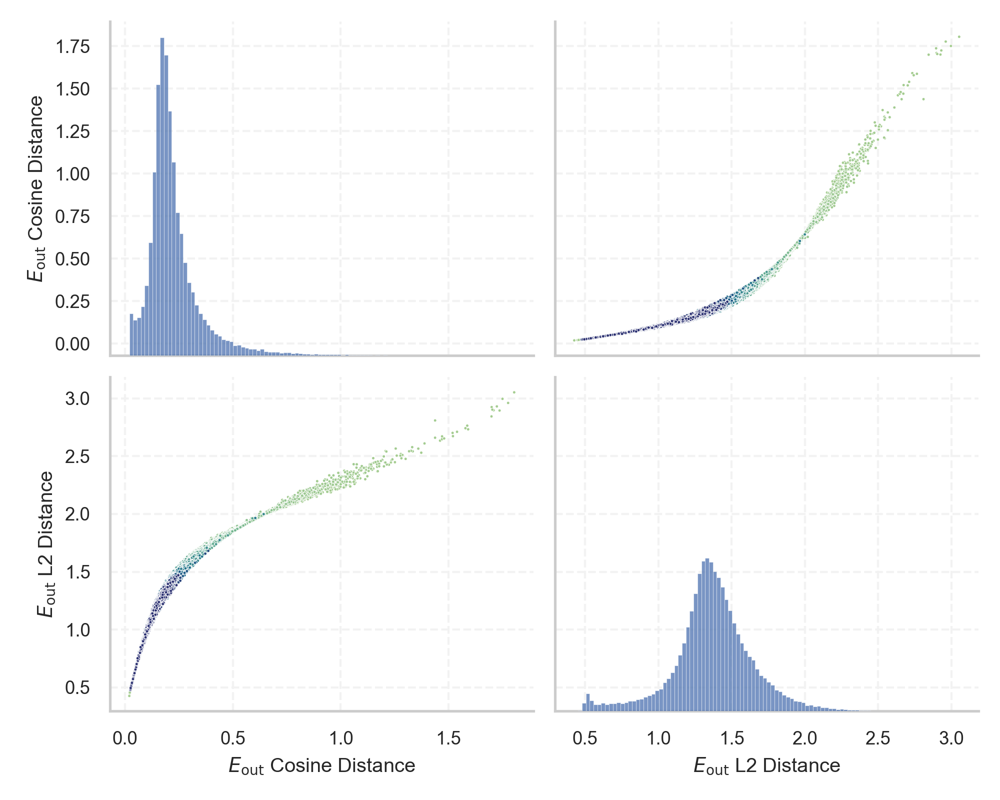
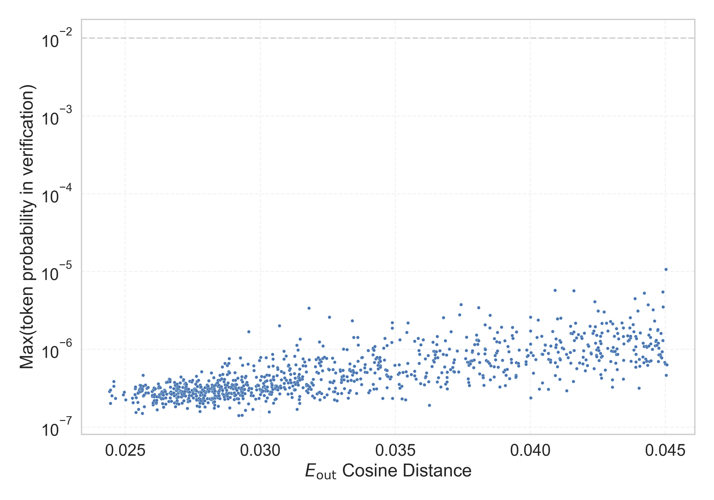

# Report for `checkpoints/step_5000`

## Model info

* Model Info: 
  * Tied embeddings: True
  * LM head uses bias: False
  * Embeddings shape: [50257, 1024]
* Tokenizer Info: 
  * Vocab Size: 50257
  * Tokenizer Class: GPT2Tokenizer
  * Tokenizer Type: BPE
  * Bytes handling: Byte Input
  * Token for verification prompt building: BuyableInstoreAndOnline
  * Token id for verification prompt building: 40242
* Indicator summary: 
  * Indicator for under-trained tokens: E_{out} Cosine Distance
  * Overall distribution: 0.226 +/- 0.133
* Detected Token Counts: 
  * Number of tested under-trained tokens: 1000, 968 non-special, 968 below p = 0.01 threshold, 966 below soft indicator threshold
  * Number of single byte tokens: 256, of which 52 below indicator threshold
  * Number of special tokens: 1, of which 1 below indicator threshold
  * Number of non-single-byte UTF-fragment tokens:  216, of which 37 below soft indicator threshold

## Under-trained token indicators plot


## Verification plot


## Under-trained token verification results
966 entries below threshold of 0.045

|   token_id | token                          |   indicator | max_prob                                                         | in_other_tokens                                                                                          |
|------------|--------------------------------|-------------|------------------------------------------------------------------|----------------------------------------------------------------------------------------------------------|
|      27097 | ````` -+-+ `````               |   0.0244477 | <span style='border: 1px solid rgb(169, 68, 66);'>3e-07</span>   | <span style='border: 1px solid rgb(169, 68, 66);'>````` -+-+-+-+ `````</span>                            |
|      36935 | ````` ▁dstg `````              |   0.0244507 | <span style='border: 1px solid rgb(169, 68, 66);'>2e-07</span>   |                                                                                                          |
|      31576 | ````` externalActionCode ````` |   0.0245005 | <span style='border: 1px solid rgb(169, 68, 66);'>2.5e-07</span> |                                                                                                          |
|      45544 | ````` ▁サーティ `````          |   0.024569  | <span style='border: 1px solid rgb(169, 68, 66);'>3.9e-07</span> | <span style='border: 1px solid rgb(169, 68, 66);'>````` ▁サーティワン `````</span>                       |
|      20677 | ````` ▁comr `````              |   0.0245735 | <span style='border: 1px solid rgb(169, 68, 66);'>3.4e-07</span> | ````` ▁comrades `````, ````` ▁comrade `````                                                              |
|      40236 | ````` FINEST `````             |   0.0246379 | <span style='border: 1px solid rgb(169, 68, 66);'>2.3e-07</span> |                                                                                                          |
|      27293 | ````` ▁antidepress `````       |   0.0249255 | <span style='border: 1px solid rgb(169, 68, 66);'>2.6e-07</span> | ````` ▁antidepressants `````, ````` ▁antidepressant `````                                                |
|      31536 | ````` displayText `````        |   0.0249591 | <span style='border: 1px solid rgb(169, 68, 66);'>2.8e-07</span> |                                                                                                          |
|      38250 | ````` ▁Skydragon `````         |   0.0250096 | <span style='border: 1px solid rgb(169, 68, 66);'>2.3e-07</span> |                                                                                                          |
|      36940 | ````` ▁istg `````              |   0.0252576 | <span style='border: 1px solid rgb(169, 68, 66);'>2.4e-07</span> |                                                                                                          |
|      30439 | ````` ▁unintention `````       |   0.0252912 | <span style='border: 1px solid rgb(169, 68, 66);'>2.1e-07</span> | ````` ▁unintentionally `````, ````` ▁unintentional `````                                                 |
|      11896 | ````` ▁mathemat `````          |   0.0253535 | <span style='border: 1px solid rgb(169, 68, 66);'>2.6e-07</span> | ````` ▁mathematical `````, ````` ▁mathematics `````, ````` ▁mathematic `````, ````` ▁mathematician ````` |
|      29740 | ````` ▁Azerb `````             |   0.0253736 | <span style='border: 1px solid rgb(169, 68, 66);'>3.3e-07</span> | ````` ▁Azerbai `````, ````` ▁Azerbaijan `````                                                            |
|      39756 | ````` inventoryQuantity `````  |   0.0253895 | <span style='border: 1px solid rgb(169, 68, 66);'>1.5e-07</span> |                                                                                                          |
|      30684 | ````` ▁ⓘ `````                 |   0.0254624 | <span style='border: 1px solid rgb(169, 68, 66);'>2.1e-07</span> |                                                                                                          |
|      43065 | ````` ▁srfAttach `````         |   0.025471  | <span style='border: 1px solid rgb(169, 68, 66);'>2.8e-07</span> |                                                                                                          |
|      39655 | ````` Orderable `````          |   0.0254729 | <span style='border: 1px solid rgb(169, 68, 66);'>2.7e-07</span> | <span style='border: 1px solid rgb(169, 68, 66);'>````` isSpecialOrderable `````</span>                  |
|      46948 | ````` エル `````               |   0.0255386 | <span style='border: 1px solid rgb(169, 68, 66);'>3.4e-07</span> |                                                                                                          |
|      33454 | ````` 龍喚士 `````             |   0.025545  | <span style='border: 1px solid rgb(169, 68, 66);'>3.1e-07</span> |                                                                                                          |
|      37631 | ````` FactoryReloaded `````    |   0.0255611 | <span style='border: 1px solid rgb(169, 68, 66);'>2.9e-07</span> |                                                                                                          |
<details><summary>946 additional entries below threshold</summary>

|   token_id | token                                                                        |   indicator | max_prob                                                         | in_other_tokens                                                                                                                                                                                                                                                                                                                                                                                                                                                                                        |
|------------|------------------------------------------------------------------------------|-------------|------------------------------------------------------------------|--------------------------------------------------------------------------------------------------------------------------------------------------------------------------------------------------------------------------------------------------------------------------------------------------------------------------------------------------------------------------------------------------------------------------------------------------------------------------------------------------------|
|      49997 | ````` ahime `````                                                            |   0.0255647 | <span style='border: 1px solid rgb(169, 68, 66);'>3.4e-07</span> |                                                                                                                                                                                                                                                                                                                                                                                                                                                                                                        |
|      39446 | ````` ▁SetFontSize `````                                                     |   0.0255895 | <span style='border: 1px solid rgb(169, 68, 66);'>3.1e-07</span> |                                                                                                                                                                                                                                                                                                                                                                                                                                                                                                        |
|      34516 | ````` >>\ `````                                                              |   0.0256176 | <span style='border: 1px solid rgb(169, 68, 66);'>2.9e-07</span> |                                                                                                                                                                                                                                                                                                                                                                                                                                                                                                        |
|      39142 | ````` ThumbnailImage `````                                                   |   0.0256264 | <span style='border: 1px solid rgb(169, 68, 66);'>1.5e-07</span> | <span style='border: 1px solid rgb(169, 68, 66);'>````` ItemThumbnailImage `````</span>                                                                                                                                                                                                                                                                                                                                                                                                                |
|      49843 | ````` ▬▬ `````                                                               |   0.0256297 | <span style='border: 1px solid rgb(169, 68, 66);'>3.1e-07</span> |                                                                                                                                                                                                                                                                                                                                                                                                                                                                                                        |
|      40219 | ````` oreAnd `````                                                           |   0.0256616 | <span style='border: 1px solid rgb(169, 68, 66);'>4.7e-07</span> | <span style='border: 1px solid rgb(169, 68, 66);'>````` oreAndOnline `````</span>, <span style='border: 1px solid rgb(169, 68, 66);'>````` InstoreAndOnline `````</span>, <span style='border: 1px solid rgb(169, 68, 66);'>````` BuyableInstoreAndOnline `````</span>                                                                                                                                                                                                                                 |
|      30211 | ````` ▁guiIcon `````                                                         |   0.0256619 | <span style='border: 1px solid rgb(169, 68, 66);'>3.4e-07</span> |                                                                                                                                                                                                                                                                                                                                                                                                                                                                                                        |
|       1849 | ````` \xa0 `````                                                             |   0.0256667 | <span style='border: 1px solid rgb(169, 68, 66);'>2.5e-07</span> | <span style='border: 1px solid rgb(169, 68, 66);'>````` \xa0\xa0 `````</span>, <span style='border: 1px solid rgb(169, 68, 66);'>````` ▁\xa0 `````</span>, <span style='border: 1px solid rgb(169, 68, 66);'>````` \xa0\xa0\xa0\xa0 `````</span>, <span style='border: 1px solid rgb(169, 68, 66);'>````` ▁\xa0▁\xa0 `````</span>, <span style='border: 1px solid rgb(169, 68, 66);'>````` \xa0\xa0\xa0\xa0\xa0\xa0\xa0\xa0 `````</span>, ...                                                          |
|      11504 | ````` ▁\xa0▁\xa0 `````                                                       |   0.0256941 | <span style='border: 1px solid rgb(169, 68, 66);'>2.6e-07</span> | <span style='border: 1px solid rgb(169, 68, 66);'>````` ▁\xa0▁\xa0▁\xa0▁\xa0 `````</span>, <span style='border: 1px solid rgb(169, 68, 66);'>````` ▁\xa0▁\xa0▁\xa0▁\xa0▁\xa0▁\xa0▁\xa0▁\xa0 `````</span>                                                                                                                                                                                                                                                                                               |
|       5815 | ````` ÃÂÃÂ `````                                                             |   0.0256969 | <span style='border: 1px solid rgb(169, 68, 66);'>1.8e-07</span> | <span style='border: 1px solid rgb(169, 68, 66);'>````` ÃÂÃÂÃÂÃÂ `````</span>, <span style='border: 1px solid rgb(169, 68, 66);'>````` ÃÂÃÂÃÂÃÂÃÂÃÂÃÂÃÂ `````</span>, <span style='border: 1px solid rgb(169, 68, 66);'>````` ÃÂÃÂÃÂÃÂÃÂÃÂÃÂÃÂÃÂÃÂÃÂÃÂÃÂÃÂÃÂÃÂ `````</span>, <span style='border: 1px solid rgb(169, 68, 66);'>````` ÃÂÃÂÃÂÃÂÃÂÃÂÃÂÃÂÃÂÃÂÃÂÃÂÃÂÃÂÃÂÃÂÃÂÃÂÃÂÃÂÃÂÃÂÃÂÃÂÃÂÃÂÃÂÃÂÃÂÃÂÃÂÃÂ `````</span>                                                                                     |
|      20590 | ````` ▁Pengu `````                                                           |   0.0257459 | <span style='border: 1px solid rgb(169, 68, 66);'>3.5e-07</span> | ````` ▁Penguins `````, ````` ▁Penguin `````                                                                                                                                                                                                                                                                                                                                                                                                                                                            |
|      24934 | ````` ForgeModLoader `````                                                   |   0.0257598 | <span style='border: 1px solid rgb(169, 68, 66);'>2.8e-07</span> |                                                                                                                                                                                                                                                                                                                                                                                                                                                                                                        |
|      43010 | ````` ▁Kinnikuman `````                                                      |   0.0257958 | <span style='border: 1px solid rgb(169, 68, 66);'>3.2e-07</span> |                                                                                                                                                                                                                                                                                                                                                                                                                                                                                                        |
|      39693 | ````` Buyable `````                                                          |   0.0258449 | <span style='border: 1px solid rgb(169, 68, 66);'>3.3e-07</span> | <span style='border: 1px solid rgb(169, 68, 66);'>````` BuyableInstoreAndOnline `````</span>                                                                                                                                                                                                                                                                                                                                                                                                           |
|       7260 | ````` escription `````                                                       |   0.0259883 | <span style='border: 1px solid rgb(169, 68, 66);'>2.9e-07</span> | ````` description `````, ````` Description `````, ````` ▁Description `````, ````` ▁prescription `````, ````` ▁descriptions `````, ...                                                                                                                                                                                                                                                                                                                                                                  |
|      34027 | ````` ▁actionGroup `````                                                     |   0.0260022 | <span style='border: 1px solid rgb(169, 68, 66);'>2.5e-07</span> |                                                                                                                                                                                                                                                                                                                                                                                                                                                                                                        |
|      31573 | ````` ActionCode `````                                                       |   0.0260046 | <span style='border: 1px solid rgb(169, 68, 66);'>2.6e-07</span> | <span style='border: 1px solid rgb(169, 68, 66);'>````` externalActionCode `````</span>                                                                                                                                                                                                                                                                                                                                                                                                                |
|      49781 | ````` EngineDebug `````                                                      |   0.026027  | <span style='border: 1px solid rgb(169, 68, 66);'>1.9e-07</span> |                                                                                                                                                                                                                                                                                                                                                                                                                                                                                                        |
|      30212 | ````` ▁externalToEVA `````                                                   |   0.0260319 | <span style='border: 1px solid rgb(169, 68, 66);'>2.1e-07</span> | <span style='border: 1px solid rgb(169, 68, 66);'>````` ▁externalToEVAOnly `````</span>                                                                                                                                                                                                                                                                                                                                                                                                                |
|      28235 | ````` aeper `````                                                            |   0.0260432 | <span style='border: 1px solid rgb(169, 68, 66);'>3e-07</span>   | ````` aepernick `````, ````` ▁Kaepernick `````                                                                                                                                                                                                                                                                                                                                                                                                                                                         |
|      39811 | ````` soDeliveryDate `````                                                   |   0.0260649 | <span style='border: 1px solid rgb(169, 68, 66);'>3.2e-07</span> |                                                                                                                                                                                                                                                                                                                                                                                                                                                                                                        |
|       7105 | ````` ▁volunte `````                                                         |   0.026068  | <span style='border: 1px solid rgb(169, 68, 66);'>2.2e-07</span> | ````` ▁volunteers `````, ````` ▁volunteer `````, ````` ▁volunteered `````, ````` ▁volunteering `````                                                                                                                                                                                                                                                                                                                                                                                                   |
|      45003 | ````` ▁SetTextColor `````                                                    |   0.0260842 | <span style='border: 1px solid rgb(169, 68, 66);'>2.6e-07</span> |                                                                                                                                                                                                                                                                                                                                                                                                                                                                                                        |
|      39714 | ````` isSpecial `````                                                        |   0.0261384 | <span style='border: 1px solid rgb(169, 68, 66);'>2e-07</span>   | <span style='border: 1px solid rgb(169, 68, 66);'>````` isSpecialOrderable `````</span>                                                                                                                                                                                                                                                                                                                                                                                                                |
|      30897 | ````` reportprint `````                                                      |   0.0261493 | <span style='border: 1px solid rgb(169, 68, 66);'>2.1e-07</span> | <span style='border: 1px solid rgb(169, 68, 66);'>````` embedreportprint `````</span>, <span style='border: 1px solid rgb(169, 68, 66);'>````` cloneembedreportprint `````</span>, ````` rawdownloadcloneembedreportprint `````                                                                                                                                                                                                                                                                        |
|      36173 | ````` ▁RandomRedditor `````                                                  |   0.0261602 | <span style='border: 1px solid rgb(169, 68, 66);'>2.2e-07</span> | <span style='border: 1px solid rgb(169, 68, 66);'>````` ▁RandomRedditorWithNo `````</span>                                                                                                                                                                                                                                                                                                                                                                                                             |
|      38370 | ````` iHUD `````                                                             |   0.0261714 | <span style='border: 1px solid rgb(169, 68, 66);'>2.5e-07</span> |                                                                                                                                                                                                                                                                                                                                                                                                                                                                                                        |
|      27246 | ````` //////////////// `````                                                 |   0.0262181 | <span style='border: 1px solid rgb(169, 68, 66);'>3.6e-07</span> | <span style='border: 1px solid rgb(169, 68, 66);'>````` //////////////////////////////// `````</span>                                                                                                                                                                                                                                                                                                                                                                                                  |
|      12662 | ````` ▁Citiz `````                                                           |   0.0262334 | <span style='border: 1px solid rgb(169, 68, 66);'>3.2e-07</span> | ````` ▁Citizens `````, ````` ▁Citizen `````, ````` ▁Citizenship `````                                                                                                                                                                                                                                                                                                                                                                                                                                  |
|      40240 | ````` oreAndOnline `````                                                     |   0.026258  | <span style='border: 1px solid rgb(169, 68, 66);'>2.4e-07</span> | <span style='border: 1px solid rgb(169, 68, 66);'>````` InstoreAndOnline `````</span>, <span style='border: 1px solid rgb(169, 68, 66);'>````` BuyableInstoreAndOnline `````</span>                                                                                                                                                                                                                                                                                                                    |
|      31538 | ````` actionDate `````                                                       |   0.0262911 | <span style='border: 1px solid rgb(169, 68, 66);'>3.2e-07</span> |                                                                                                                                                                                                                                                                                                                                                                                                                                                                                                        |
|      38160 | ````` FontSize `````                                                         |   0.0263191 | <span style='border: 1px solid rgb(169, 68, 66);'>2.4e-07</span> | <span style='border: 1px solid rgb(169, 68, 66);'>````` ▁SetFontSize `````</span>                                                                                                                                                                                                                                                                                                                                                                                                                      |
|      14223 | ````` ;;;; `````                                                             |   0.0263326 | <span style='border: 1px solid rgb(169, 68, 66);'>2.7e-07</span> | <span style='border: 1px solid rgb(169, 68, 66);'>````` ;;;;;;;; `````</span>, <span style='border: 1px solid rgb(169, 68, 66);'>````` ;;;;;;;;;;;; `````</span>                                                                                                                                                                                                                                                                                                                                       |
|      37226 | ````` SourceFile `````                                                       |   0.0263328 | <span style='border: 1px solid rgb(169, 68, 66);'>2.7e-07</span> |                                                                                                                                                                                                                                                                                                                                                                                                                                                                                                        |
|      46402 | ````` =-=-=-=-=-=-=-=- `````                                                 |   0.0263386 | <span style='border: 1px solid rgb(169, 68, 66);'>2.3e-07</span> |                                                                                                                                                                                                                                                                                                                                                                                                                                                                                                        |
|      42889 | ````` ikuman `````                                                           |   0.0263559 | <span style='border: 1px solid rgb(169, 68, 66);'>2.8e-07</span> | <span style='border: 1px solid rgb(169, 68, 66);'>````` ▁Kinnikuman `````</span>                                                                                                                                                                                                                                                                                                                                                                                                                       |
|      25658 | ````` ?????- `````                                                           |   0.026383  | <span style='border: 1px solid rgb(169, 68, 66);'>2e-07</span>   | <span style='border: 1px solid rgb(169, 68, 66);'>````` ?????-?????- `````</span>                                                                                                                                                                                                                                                                                                                                                                                                                      |
|      48702 | ````` iosyncr `````                                                          |   0.0263934 | <span style='border: 1px solid rgb(169, 68, 66);'>2.8e-07</span> | ````` ▁idiosyncr `````                                                                                                                                                                                                                                                                                                                                                                                                                                                                                 |
|      42202 | ````` GoldMagikarp `````                                                     |   0.0264021 | <span style='border: 1px solid rgb(169, 68, 66);'>2.3e-07</span> | <span style='border: 1px solid rgb(169, 68, 66);'>````` ▁SolidGoldMagikarp `````</span>                                                                                                                                                                                                                                                                                                                                                                                                                |
|      39755 | ````` isSpecialOrderable `````                                               |   0.0264068 | <span style='border: 1px solid rgb(169, 68, 66);'>2.6e-07</span> |                                                                                                                                                                                                                                                                                                                                                                                                                                                                                                        |
|      16103 | ````` ▁oun `````                                                             |   0.0264153 | <span style='border: 1px solid rgb(169, 68, 66);'>1.8e-07</span> | ````` ▁ounces `````, ````` ▁ounce `````                                                                                                                                                                                                                                                                                                                                                                                                                                                                |
|      30202 | ````` ▁guiName `````                                                         |   0.0264492 | <span style='border: 1px solid rgb(169, 68, 66);'>3e-07</span>   |                                                                                                                                                                                                                                                                                                                                                                                                                                                                                                        |
|      41215 | ````` conservancy `````                                                      |   0.0264734 | <span style='border: 1px solid rgb(169, 68, 66);'>2.9e-07</span> | <span style='border: 1px solid rgb(169, 68, 66);'>````` natureconservancy `````</span>                                                                                                                                                                                                                                                                                                                                                                                                                 |
|      30898 | ````` embedreportprint `````                                                 |   0.0264928 | <span style='border: 1px solid rgb(169, 68, 66);'>2e-07</span>   | <span style='border: 1px solid rgb(169, 68, 66);'>````` cloneembedreportprint `````</span>, ````` rawdownloadcloneembedreportprint `````                                                                                                                                                                                                                                                                                                                                                               |
|      30905 | ````` rawdownload `````                                                      |   0.0264989 | <span style='border: 1px solid rgb(169, 68, 66);'>2.4e-07</span> | ````` rawdownloadcloneembedreportprint `````                                                                                                                                                                                                                                                                                                                                                                                                                                                           |
|      31727 | ````` cffff `````                                                            |   0.0265177 | <span style='border: 1px solid rgb(169, 68, 66);'>3.8e-07</span> | <span style='border: 1px solid rgb(169, 68, 66);'>````` cffffcc `````</span>                                                                                                                                                                                                                                                                                                                                                                                                                           |
|      42424 | ````` DragonMagazine `````                                                   |   0.0265285 | <span style='border: 1px solid rgb(169, 68, 66);'>2.7e-07</span> |                                                                                                                                                                                                                                                                                                                                                                                                                                                                                                        |
|      42470 | ````` TextColor `````                                                        |   0.0265742 | <span style='border: 1px solid rgb(169, 68, 66);'>3.8e-07</span> | <span style='border: 1px solid rgb(169, 68, 66);'>````` ▁SetTextColor `````</span>                                                                                                                                                                                                                                                                                                                                                                                                                     |
|      39757 | ````` channelAvailability `````                                              |   0.026609  | <span style='border: 1px solid rgb(169, 68, 66);'>2.1e-07</span> |                                                                                                                                                                                                                                                                                                                                                                                                                                                                                                        |
|      13018 | ````` "}," `````                                                             |   0.0266235 | <span style='border: 1px solid rgb(169, 68, 66);'>4.1e-07</span> |                                                                                                                                                                                                                                                                                                                                                                                                                                                                                                        |
|      13150 | ````` ▁subur `````                                                           |   0.0266494 | <span style='border: 1px solid rgb(169, 68, 66);'>4.1e-07</span> | ````` ▁suburban `````, ````` ▁suburbs `````, ````` ▁suburb `````                                                                                                                                                                                                                                                                                                                                                                                                                                       |
|      37842 | ````` ▁partName `````                                                        |   0.0266551 | <span style='border: 1px solid rgb(169, 68, 66);'>2.7e-07</span> |                                                                                                                                                                                                                                                                                                                                                                                                                                                                                                        |
|      26712 | ````` ▁unden `````                                                           |   0.0266578 | <span style='border: 1px solid rgb(169, 68, 66);'>3.8e-07</span> | ````` ▁undeniable `````, ````` ▁undeniably `````                                                                                                                                                                                                                                                                                                                                                                                                                                                       |
|      26642 | ````` tnc `````                                                              |   0.0266643 | <span style='border: 1px solid rgb(169, 68, 66);'>2.4e-07</span> |                                                                                                                                                                                                                                                                                                                                                                                                                                                                                                        |
|      47682 | ````` ,,,,,,,, `````                                                         |   0.0266722 | <span style='border: 1px solid rgb(169, 68, 66);'>3.3e-07</span> |                                                                                                                                                                                                                                                                                                                                                                                                                                                                                                        |
|       8980 | ````` ¯¯¯¯ `````                                                             |   0.0266974 | <span style='border: 1px solid rgb(169, 68, 66);'>2.7e-07</span> | <span style='border: 1px solid rgb(169, 68, 66);'>````` ¯¯¯¯¯¯¯¯ `````</span>, <span style='border: 1px solid rgb(169, 68, 66);'>````` ¯¯¯¯¯¯¯¯¯¯¯¯¯¯¯¯ `````</span>                                                                                                                                                                                                                                                                                                                                   |
|      46939 | ````` ;;;;;;;;;;;; `````                                                     |   0.0267035 | <span style='border: 1px solid rgb(169, 68, 66);'>2.7e-07</span> |                                                                                                                                                                                                                                                                                                                                                                                                                                                                                                        |
|       8828 | ````` \xa0\xa0\xa0\xa0 `````                                                 |   0.0267083 | <span style='border: 1px solid rgb(169, 68, 66);'>2.2e-07</span> | <span style='border: 1px solid rgb(169, 68, 66);'>````` \xa0\xa0\xa0\xa0\xa0\xa0\xa0\xa0 `````</span>, <span style='border: 1px solid rgb(169, 68, 66);'>````` \xa0\xa0\xa0\xa0\xa0\xa0\xa0\xa0\xa0\xa0\xa0\xa0\xa0\xa0\xa0\xa0 `````</span>                                                                                                                                                                                                                                                           |
|      41868 | ````` ▁Cosponsors `````                                                      |   0.026791  | <span style='border: 1px solid rgb(169, 68, 66);'>2.7e-07</span> |                                                                                                                                                                                                                                                                                                                                                                                                                                                                                                        |
|      24847 | ````` ModLoader `````                                                        |   0.0267918 | <span style='border: 1px solid rgb(169, 68, 66);'>3.1e-07</span> | <span style='border: 1px solid rgb(169, 68, 66);'>````` ForgeModLoader `````</span>                                                                                                                                                                                                                                                                                                                                                                                                                    |
|      30209 | ````` ▁unfocusedRange `````                                                  |   0.0268168 | <span style='border: 1px solid rgb(169, 68, 66);'>2e-07</span>   |                                                                                                                                                                                                                                                                                                                                                                                                                                                                                                        |
|      11585 | ````` eatures `````                                                          |   0.0268229 | <span style='border: 1px solid rgb(169, 68, 66);'>3.8e-07</span> | ````` ▁Features `````, ````` Features `````, ````` ▁Creatures `````, ````` features `````                                                                                                                                                                                                                                                                                                                                                                                                              |
|      43361 | ````` ゼウス `````                                                           |   0.0268432 | <span style='border: 1px solid rgb(169, 68, 66);'>3.5e-07</span> |                                                                                                                                                                                                                                                                                                                                                                                                                                                                                                        |
|      42090 | ````` ▁TheNitromeFan `````                                                   |   0.0268592 | <span style='border: 1px solid rgb(169, 68, 66);'>1.8e-07</span> |                                                                                                                                                                                                                                                                                                                                                                                                                                                                                                        |
|      14531 | ````` groupon `````                                                          |   0.0269055 | <span style='border: 1px solid rgb(169, 68, 66);'>2.7e-07</span> |                                                                                                                                                                                                                                                                                                                                                                                                                                                                                                        |
|      48874 | ````` =] `````                                                               |   0.0269125 | <span style='border: 1px solid rgb(169, 68, 66);'>2.4e-07</span> |                                                                                                                                                                                                                                                                                                                                                                                                                                                                                                        |
|      23785 | ````` "]=> `````                                                             |   0.0269126 | <span style='border: 1px solid rgb(169, 68, 66);'>3.2e-07</span> |                                                                                                                                                                                                                                                                                                                                                                                                                                                                                                        |
|       5997 | ````` sembly `````                                                           |   0.0269155 | <span style='border: 1px solid rgb(169, 68, 66);'>3.6e-07</span> | ````` ▁Assembly `````, ````` ▁assembly `````, ````` assembly `````, ````` Assembly `````                                                                                                                                                                                                                                                                                                                                                                                                               |
|      37991 | ````` @@@@@@@@ `````                                                         |   0.0269166 | <span style='border: 1px solid rgb(169, 68, 66);'>2.2e-07</span> |                                                                                                                                                                                                                                                                                                                                                                                                                                                                                                        |
|      25618 | ````` ▁councill `````                                                        |   0.0269221 | <span style='border: 1px solid rgb(169, 68, 66);'>2e-07</span>   | ````` ▁councillor `````, ````` ▁councillors `````                                                                                                                                                                                                                                                                                                                                                                                                                                                      |
|      37444 | ````` ▁petertodd `````                                                       |   0.0269268 | <span style='border: 1px solid rgb(169, 68, 66);'>3.1e-07</span> |                                                                                                                                                                                                                                                                                                                                                                                                                                                                                                        |
|       6438 | ````` ▁裏 `````                                                              |   0.0269372 | <span style='border: 1px solid rgb(169, 68, 66);'>2.5e-07</span> | ````` ▁裏<0xE7> `````, <span style='border: 1px solid rgb(169, 68, 66);'>````` ▁裏覚醒 `````</span>, ````` ▁裏<0xE8> `````                                                                                                                                                                                                                                                                                                                                                                             |
|      22640 | ````` itially `````                                                          |   0.026942  | <span style='border: 1px solid rgb(169, 68, 66);'>3.1e-07</span> | ````` ▁Initially `````, ````` Initially `````                                                                                                                                                                                                                                                                                                                                                                                                                                                          |
|      40235 | ````` 姫 `````                                                               |   0.0269455 | <span style='border: 1px solid rgb(169, 68, 66);'>3.3e-07</span> |                                                                                                                                                                                                                                                                                                                                                                                                                                                                                                        |
|       5624 | ````` ▁\xa0 `````                                                            |   0.0269613 | <span style='border: 1px solid rgb(169, 68, 66);'>2.7e-07</span> | <span style='border: 1px solid rgb(169, 68, 66);'>````` ▁\xa0▁\xa0 `````</span>, <span style='border: 1px solid rgb(169, 68, 66);'>````` ▁\xa0▁\xa0▁\xa0▁\xa0 `````</span>, <span style='border: 1px solid rgb(169, 68, 66);'>````` ▁\xa0▁\xa0▁\xa0▁\xa0▁\xa0▁\xa0▁\xa0▁\xa0 `````</span>, <span style='border: 1px solid rgb(169, 68, 66);'>````` ▁\xa0\xa0 `````</span>                                                                                                                              |
|      47571 | ````` ▁DevOnline `````                                                       |   0.0269613 | <span style='border: 1px solid rgb(169, 68, 66);'>2.5e-07</span> |                                                                                                                                                                                                                                                                                                                                                                                                                                                                                                        |
|      17811 | ````` \xa0\xa0\xa0\xa0\xa0\xa0\xa0\xa0 `````                                 |   0.0269656 | <span style='border: 1px solid rgb(169, 68, 66);'>2.5e-07</span> | <span style='border: 1px solid rgb(169, 68, 66);'>````` \xa0\xa0\xa0\xa0\xa0\xa0\xa0\xa0\xa0\xa0\xa0\xa0\xa0\xa0\xa0\xa0 `````</span>                                                                                                                                                                                                                                                                                                                                                                  |
|      14060 | ````` ▁predec `````                                                          |   0.0269824 | <span style='border: 1px solid rgb(169, 68, 66);'>2e-07</span>   | ````` ▁predecessor `````, ````` ▁predecessors `````                                                                                                                                                                                                                                                                                                                                                                                                                                                    |
|      36926 | ````` ▁attm `````                                                            |   0.0269943 | <span style='border: 1px solid rgb(169, 68, 66);'>3.3e-07</span> |                                                                                                                                                                                                                                                                                                                                                                                                                                                                                                        |
|      36886 | ````` STDOUT `````                                                           |   0.0270142 | <span style='border: 1px solid rgb(169, 68, 66);'>3e-07</span>   |                                                                                                                                                                                                                                                                                                                                                                                                                                                                                                        |
|      35496 | ````` ÃÂÃÂÃÂÃÂÃÂÃÂÃÂÃÂÃÂÃÂÃÂÃÂÃÂÃÂÃÂÃÂÃÂÃÂÃÂÃÂÃÂÃÂÃÂÃÂÃÂÃÂÃÂÃÂÃÂÃÂÃÂÃÂ ````` |   0.027018  | <span style='border: 1px solid rgb(169, 68, 66);'>2.9e-07</span> |                                                                                                                                                                                                                                                                                                                                                                                                                                                                                                        |
|      33813 | ````` =~=~ `````                                                             |   0.0270355 | <span style='border: 1px solid rgb(169, 68, 66);'>2.8e-07</span> |                                                                                                                                                                                                                                                                                                                                                                                                                                                                                                        |
|      26825 | ````` ▁���� `````                                                            |   0.0270366 | <span style='border: 1px solid rgb(169, 68, 66);'>3.7e-07</span> | <span style='border: 1px solid rgb(169, 68, 66);'>````` ▁�������� `````</span>                                                                                                                                                                                                                                                                                                                                                                                                                         |
|      44686 | ````` ーティ `````                                                           |   0.0270565 | <span style='border: 1px solid rgb(169, 68, 66);'>4.4e-07</span> | <span style='border: 1px solid rgb(169, 68, 66);'>````` ▁サーティ `````</span>, <span style='border: 1px solid rgb(169, 68, 66);'>````` ▁サーティワン `````</span>                                                                                                                                                                                                                                                                                                                                     |
|      44555 | ````` ▁Archdemon `````                                                       |   0.0270597 | <span style='border: 1px solid rgb(169, 68, 66);'>2.9e-07</span> |                                                                                                                                                                                                                                                                                                                                                                                                                                                                                                        |
|      17900 | ````` ▁Dragonbound `````                                                     |   0.0270708 | <span style='border: 1px solid rgb(169, 68, 66);'>2.8e-07</span> |                                                                                                                                                                                                                                                                                                                                                                                                                                                                                                        |
|      47182 | ````` ":""},{" `````                                                         |   0.0270773 | <span style='border: 1px solid rgb(169, 68, 66);'>2.4e-07</span> |                                                                                                                                                                                                                                                                                                                                                                                                                                                                                                        |
|      39165 | ````` catentry `````                                                         |   0.0270867 | <span style='border: 1px solid rgb(169, 68, 66);'>2.7e-07</span> |                                                                                                                                                                                                                                                                                                                                                                                                                                                                                                        |
|      22686 | ````` ▁\xa0▁\xa0▁\xa0▁\xa0 `````                                             |   0.027095  | <span style='border: 1px solid rgb(169, 68, 66);'>2.7e-07</span> | <span style='border: 1px solid rgb(169, 68, 66);'>````` ▁\xa0▁\xa0▁\xa0▁\xa0▁\xa0▁\xa0▁\xa0▁\xa0 `````</span>                                                                                                                                                                                                                                                                                                                                                                                          |
|       5808 | ````` ÃÂ `````                                                               |   0.0270989 | <span style='border: 1px solid rgb(169, 68, 66);'>2e-07</span>   | <span style='border: 1px solid rgb(169, 68, 66);'>````` ÃÂÃÂ `````</span>, <span style='border: 1px solid rgb(169, 68, 66);'>````` ÃÂÃÂÃÂÃÂ `````</span>, <span style='border: 1px solid rgb(169, 68, 66);'>````` ÃÂÃÂÃÂÃÂÃÂÃÂÃÂÃÂ `````</span>, <span style='border: 1px solid rgb(169, 68, 66);'>````` ÃÂÃÂÃÂÃÂÃÂÃÂÃÂÃÂÃÂÃÂÃÂÃÂÃÂÃÂÃÂÃÂ `````</span>, <span style='border: 1px solid rgb(169, 68, 66);'>````` ÃÂÃÂÃÂÃÂÃÂÃÂÃÂÃÂÃÂÃÂÃÂÃÂÃÂÃÂÃÂÃÂÃÂÃÂÃÂÃÂÃÂÃÂÃÂÃÂÃÂÃÂÃÂÃÂÃÂÃÂÃÂÃÂ `````</span>          |
|      46968 | ````` ▁convol `````                                                          |   0.0271314 | <span style='border: 1px solid rgb(169, 68, 66);'>3.3e-07</span> | ````` ▁convoluted `````                                                                                                                                                                                                                                                                                                                                                                                                                                                                                |
|      42785 | ````` "}]," `````                                                            |   0.0271509 | <span style='border: 1px solid rgb(169, 68, 66);'>4e-07</span>   |                                                                                                                                                                                                                                                                                                                                                                                                                                                                                                        |
|      41380 | ````` natureconservancy `````                                                |   0.027153  | <span style='border: 1px solid rgb(169, 68, 66);'>2.5e-07</span> |                                                                                                                                                                                                                                                                                                                                                                                                                                                                                                        |
|      10298 | ````` senal `````                                                            |   0.0271603 | <span style='border: 1px solid rgb(169, 68, 66);'>4.1e-07</span> | ````` ▁Arsenal `````, ````` ▁arsenal `````, ````` Arsenal `````                                                                                                                                                                                                                                                                                                                                                                                                                                        |
|      18945 | ````` ▁teasp `````                                                           |   0.0271654 | <span style='border: 1px solid rgb(169, 68, 66);'>2.2e-07</span> | ````` ▁teaspoon `````, ````` ▁teaspoons `````                                                                                                                                                                                                                                                                                                                                                                                                                                                          |
|      40278 | ````` */( `````                                                              |   0.0271807 | <span style='border: 1px solid rgb(169, 68, 66);'>2.7e-07</span> |                                                                                                                                                                                                                                                                                                                                                                                                                                                                                                        |
|      33477 | ````` \xa0\xa0\xa0 `````                                                     |   0.0271961 | <span style='border: 1px solid rgb(169, 68, 66);'>3.6e-07</span> | <span style='border: 1px solid rgb(169, 68, 66);'>````` \xa0\xa0\xa0\xa0\xa0\xa0\xa0\xa0\xa0\xa0\xa0\xa0\xa0\xa0\xa0\xa0 `````</span>                                                                                                                                                                                                                                                                                                                                                                  |
|      19373 | ````` ▁adolesc `````                                                         |   0.0271966 | <span style='border: 1px solid rgb(169, 68, 66);'>2.9e-07</span> | ````` ▁adolescents `````, ````` ▁adolescent `````, ````` ▁adolescence `````                                                                                                                                                                                                                                                                                                                                                                                                                            |
|      23614 | ````` 覚醒 `````                                                             |   0.0272187 | <span style='border: 1px solid rgb(169, 68, 66);'>3.2e-07</span> | <span style='border: 1px solid rgb(169, 68, 66);'>````` ▁裏覚醒 `````</span>                                                                                                                                                                                                                                                                                                                                                                                                                           |
|      10269 | ````` umbn `````                                                             |   0.0272231 | <span style='border: 1px solid rgb(169, 68, 66);'>3.6e-07</span> | ````` umbnails `````, ````` thumbnails `````, ````` umbnail `````, ````` ▁Thumbnails `````, ````` Thumbnail `````, ...                                                                                                                                                                                                                                                                                                                                                                                 |
|      21876 | ````` ▁showc `````                                                           |   0.0272271 | <span style='border: 1px solid rgb(169, 68, 66);'>2.5e-07</span> | ````` ▁showcasing `````, ````` ▁showcased `````, ````` ▁showcases `````                                                                                                                                                                                                                                                                                                                                                                                                                                |
|      23282 | ````` ▁davidjl `````                                                         |   0.0272364 | <span style='border: 1px solid rgb(169, 68, 66);'>3.7e-07</span> |                                                                                                                                                                                                                                                                                                                                                                                                                                                                                                        |
|      43298 | ````` userc `````                                                            |   0.0272365 | <span style='border: 1px solid rgb(169, 68, 66);'>3.1e-07</span> | ````` usercontent `````                                                                                                                                                                                                                                                                                                                                                                                                                                                                                |
|      31957 | ````` cffffcc `````                                                          |   0.0272552 | <span style='border: 1px solid rgb(169, 68, 66);'>3.4e-07</span> |                                                                                                                                                                                                                                                                                                                                                                                                                                                                                                        |
|      31765 | ````` MpServer `````                                                         |   0.0272567 | <span style='border: 1px solid rgb(169, 68, 66);'>3.3e-07</span> |                                                                                                                                                                                                                                                                                                                                                                                                                                                                                                        |
|      34633 | ````` の魔 `````                                                             |   0.0272632 | <span style='border: 1px solid rgb(169, 68, 66);'>3.6e-07</span> |                                                                                                                                                                                                                                                                                                                                                                                                                                                                                                        |
|      24307 | ````` ▁looph `````                                                           |   0.0272921 | <span style='border: 1px solid rgb(169, 68, 66);'>3.1e-07</span> | ````` ▁loophole `````, ````` ▁loopholes `````                                                                                                                                                                                                                                                                                                                                                                                                                                                          |
|      14695 | ````` ▁eleph `````                                                           |   0.0272943 | <span style='border: 1px solid rgb(169, 68, 66);'>1.7e-07</span> | ````` ▁elephant `````, ````` ▁elephants `````                                                                                                                                                                                                                                                                                                                                                                                                                                                          |
|      29372 | ````` ▁guiActiveUn `````                                                     |   0.0273045 | <span style='border: 1px solid rgb(169, 68, 66);'>2.9e-07</span> | <span style='border: 1px solid rgb(169, 68, 66);'>````` ▁guiActiveUnfocused `````</span>                                                                                                                                                                                                                                                                                                                                                                                                               |
|      37574 | ````` StreamerBot `````                                                      |   0.0273222 | <span style='border: 1px solid rgb(169, 68, 66);'>2.3e-07</span> | <span style='border: 1px solid rgb(169, 68, 66);'>````` TPPStreamerBot `````</span>                                                                                                                                                                                                                                                                                                                                                                                                                    |
|      48069 | ````` *=- `````                                                              |   0.027324  | <span style='border: 1px solid rgb(169, 68, 66);'>2.1e-07</span> |                                                                                                                                                                                                                                                                                                                                                                                                                                                                                                        |
|       8795 | ````` iscons `````                                                           |   0.0273422 | <span style='border: 1px solid rgb(169, 68, 66);'>3.1e-07</span> | <span style='border: 1px solid rgb(169, 68, 66);'>````` isconsin `````</span>, ````` ▁Wisconsin `````, ````` Wisconsin `````                                                                                                                                                                                                                                                                                                                                                                           |
|      41551 | ````` Downloadha `````                                                       |   0.0273489 | <span style='border: 1px solid rgb(169, 68, 66);'>2.4e-07</span> |                                                                                                                                                                                                                                                                                                                                                                                                                                                                                                        |
|      39253 | ````` ▁UCHIJ `````                                                           |   0.0273503 | <span style='border: 1px solid rgb(169, 68, 66);'>2.8e-07</span> |                                                                                                                                                                                                                                                                                                                                                                                                                                                                                                        |
|      40241 | ````` InstoreAndOnline `````                                                 |   0.0273603 | <span style='border: 1px solid rgb(169, 68, 66);'>2.2e-07</span> | <span style='border: 1px solid rgb(169, 68, 66);'>````` BuyableInstoreAndOnline `````</span>                                                                                                                                                                                                                                                                                                                                                                                                           |
|      10160 | ````` ▁trave `````                                                           |   0.0273663 | <span style='border: 1px solid rgb(169, 68, 66);'>2.5e-07</span> | ````` ▁traveling `````, ````` ▁traveled `````, ````` ▁travelling `````, ````` ▁travels `````, ````` ▁travelled `````, ...                                                                                                                                                                                                                                                                                                                                                                              |
|      36130 | ````` ▁PsyNet `````                                                          |   0.0273784 | <span style='border: 1px solid rgb(169, 68, 66);'>2.8e-07</span> |                                                                                                                                                                                                                                                                                                                                                                                                                                                                                                        |
|      36473 | ````` luaj `````                                                             |   0.0273855 | <span style='border: 1px solid rgb(169, 68, 66);'>3.9e-07</span> |                                                                                                                                                                                                                                                                                                                                                                                                                                                                                                        |
|      12869 | ````` ▁reluct `````                                                          |   0.0274579 | <span style='border: 1px solid rgb(169, 68, 66);'>2.5e-07</span> | ````` ▁reluctant `````, ````` ▁reluctance `````, ````` ▁reluctantly `````                                                                                                                                                                                                                                                                                                                                                                                                                              |
|      25992 | ````` ▁裏覚醒 `````                                                          |   0.0274606 | <span style='border: 1px solid rgb(169, 68, 66);'>3.8e-07</span> |                                                                                                                                                                                                                                                                                                                                                                                                                                                                                                        |
|       6681 | ````` ▁withd `````                                                           |   0.0274739 | <span style='border: 1px solid rgb(169, 68, 66);'>3e-07</span>   | ````` ▁withdraw `````, ````` ▁withdrawal `````, ````` ▁withdrawn `````, ````` ▁withdrew `````, ````` ▁withdrawing `````, ...                                                                                                                                                                                                                                                                                                                                                                           |
|      36929 | ````` ▁sidx `````                                                            |   0.0274892 | <span style='border: 1px solid rgb(169, 68, 66);'>4e-07</span>   |                                                                                                                                                                                                                                                                                                                                                                                                                                                                                                        |
|      30210 | ````` ▁guiActiveUnfocused `````                                              |   0.0274977 | <span style='border: 1px solid rgb(169, 68, 66);'>2.8e-07</span> |                                                                                                                                                                                                                                                                                                                                                                                                                                                                                                        |
|      50009 | ````` ▁strutConnector `````                                                  |   0.0275152 | <span style='border: 1px solid rgb(169, 68, 66);'>2.7e-07</span> |                                                                                                                                                                                                                                                                                                                                                                                                                                                                                                        |
|      39803 | ````` soType `````                                                           |   0.0275213 | <span style='border: 1px solid rgb(169, 68, 66);'>2.4e-07</span> |                                                                                                                                                                                                                                                                                                                                                                                                                                                                                                        |
|      12677 | ````` ▁tradem `````                                                          |   0.0275555 | <span style='border: 1px solid rgb(169, 68, 66);'>3e-07</span>   | ````` ▁trademark `````, ````` ▁trademarks `````                                                                                                                                                                                                                                                                                                                                                                                                                                                        |
|      46600 | ````` ▁Adinida `````                                                         |   0.0275577 | <span style='border: 1px solid rgb(169, 68, 66);'>3.1e-07</span> |                                                                                                                                                                                                                                                                                                                                                                                                                                                                                                        |
|      48908 | ````` ▁4090 `````                                                            |   0.027567  | <span style='border: 1px solid rgb(169, 68, 66);'>3e-07</span>   |                                                                                                                                                                                                                                                                                                                                                                                                                                                                                                        |
|      41424 | ````` ."," `````                                                             |   0.0276016 | <span style='border: 1px solid rgb(169, 68, 66);'>3.6e-07</span> |                                                                                                                                                                                                                                                                                                                                                                                                                                                                                                        |
|      42000 | ````` ▁hemor `````                                                           |   0.0276022 | <span style='border: 1px solid rgb(169, 68, 66);'>2.6e-07</span> | ````` ▁hemorrh `````                                                                                                                                                                                                                                                                                                                                                                                                                                                                                   |
|      25193 | ````` NetMessage `````                                                       |   0.0276117 | <span style='border: 1px solid rgb(169, 68, 66);'>3e-07</span>   | <span style='border: 1px solid rgb(169, 68, 66);'>````` PsyNetMessage `````</span>                                                                                                                                                                                                                                                                                                                                                                                                                     |
|      30208 | ````` ▁externalTo `````                                                      |   0.0276288 | <span style='border: 1px solid rgb(169, 68, 66);'>2.9e-07</span> | <span style='border: 1px solid rgb(169, 68, 66);'>````` ▁externalToEVA `````</span>, <span style='border: 1px solid rgb(169, 68, 66);'>````` ▁externalToEVAOnly `````</span>                                                                                                                                                                                                                                                                                                                           |
|      40012 | ````` uyomi `````                                                            |   0.027632  | <span style='border: 1px solid rgb(169, 68, 66);'>4.5e-07</span> | <span style='border: 1px solid rgb(169, 68, 66);'>````` ▁Tsukuyomi `````</span>                                                                                                                                                                                                                                                                                                                                                                                                                        |
|      30899 | ````` cloneembedreportprint `````                                            |   0.0276335 | <span style='border: 1px solid rgb(169, 68, 66);'>2.5e-07</span> | ````` rawdownloadcloneembedreportprint `````                                                                                                                                                                                                                                                                                                                                                                                                                                                           |
|      48193 | ````` @#& `````                                                              |   0.0276341 | <span style='border: 1px solid rgb(169, 68, 66);'>2.3e-07</span> |                                                                                                                                                                                                                                                                                                                                                                                                                                                                                                        |
|      45545 | ````` ▁サーティワン `````                                                    |   0.0276446 | <span style='border: 1px solid rgb(169, 68, 66);'>2.2e-07</span> |                                                                                                                                                                                                                                                                                                                                                                                                                                                                                                        |
|      48219 | ````` ":- `````                                                              |   0.0276588 | <span style='border: 1px solid rgb(169, 68, 66);'>3.9e-07</span> |                                                                                                                                                                                                                                                                                                                                                                                                                                                                                                        |
|      22263 | ````` ▁mosqu `````                                                           |   0.0276599 | <span style='border: 1px solid rgb(169, 68, 66);'>1.9e-07</span> | ````` ▁mosques `````, ````` ▁mosquit `````, ````` ▁mosquito `````, ````` ▁mosquitoes `````                                                                                                                                                                                                                                                                                                                                                                                                             |
|      34340 | ````` ▁UCH `````                                                             |   0.0276641 | <span style='border: 1px solid rgb(169, 68, 66);'>3.3e-07</span> | <span style='border: 1px solid rgb(169, 68, 66);'>````` ▁UCHIJ `````</span>                                                                                                                                                                                                                                                                                                                                                                                                                            |
|      48366 | ````` ◼ `````                                                                |   0.0277137 | <span style='border: 1px solid rgb(169, 68, 66);'>4e-07</span>   |                                                                                                                                                                                                                                                                                                                                                                                                                                                                                                        |
|      14827 | ````` ÃÂÃÂÃÂÃÂÃÂÃÂÃÂÃÂ `````                                                 |   0.0277268 | <span style='border: 1px solid rgb(169, 68, 66);'>2.4e-07</span> | <span style='border: 1px solid rgb(169, 68, 66);'>````` ÃÂÃÂÃÂÃÂÃÂÃÂÃÂÃÂÃÂÃÂÃÂÃÂÃÂÃÂÃÂÃÂ `````</span>, <span style='border: 1px solid rgb(169, 68, 66);'>````` ÃÂÃÂÃÂÃÂÃÂÃÂÃÂÃÂÃÂÃÂÃÂÃÂÃÂÃÂÃÂÃÂÃÂÃÂÃÂÃÂÃÂÃÂÃÂÃÂÃÂÃÂÃÂÃÂÃÂÃÂÃÂÃÂ `````</span>                                                                                                                                                                                                                                                           |
|      47975 | ````` bleacher `````                                                         |   0.0277309 | <span style='border: 1px solid rgb(169, 68, 66);'>2.8e-07</span> |                                                                                                                                                                                                                                                                                                                                                                                                                                                                                                        |
|      39752 | ````` quickShip `````                                                        |   0.0277496 | <span style='border: 1px solid rgb(169, 68, 66);'>2.2e-07</span> | <span style='border: 1px solid rgb(169, 68, 66);'>````` quickShipAvailable `````</span>                                                                                                                                                                                                                                                                                                                                                                                                                |
|      43569 | ````` ÍÍ `````                                                               |   0.0277505 | <span style='border: 1px solid rgb(169, 68, 66);'>1.8e-07</span> |                                                                                                                                                                                                                                                                                                                                                                                                                                                                                                        |
|       8755 | ````` ▁Awoken `````                                                          |   0.0277603 | <span style='border: 1px solid rgb(169, 68, 66);'>2e-07</span>   |                                                                                                                                                                                                                                                                                                                                                                                                                                                                                                        |
|      35207 | ````` ▁attRot `````                                                          |   0.0277638 | <span style='border: 1px solid rgb(169, 68, 66);'>1.6e-07</span> |                                                                                                                                                                                                                                                                                                                                                                                                                                                                                                        |
|      31032 | ````` SpaceEngineers `````                                                   |   0.0277819 | <span style='border: 1px solid rgb(169, 68, 66);'>2.3e-07</span> |                                                                                                                                                                                                                                                                                                                                                                                                                                                                                                        |
|      23711 | ````` ▁Moroc `````                                                           |   0.0277851 | <span style='border: 1px solid rgb(169, 68, 66);'>2.6e-07</span> | ````` ▁Morocco `````, ````` ▁Moroccan `````                                                                                                                                                                                                                                                                                                                                                                                                                                                            |
|      38626 | ````` ▓ `````                                                                |   0.0277855 | <span style='border: 1px solid rgb(169, 68, 66);'>3.3e-07</span> |                                                                                                                                                                                                                                                                                                                                                                                                                                                                                                        |
|      41383 | ````` assetsadobe `````                                                      |   0.027786  | <span style='border: 1px solid rgb(169, 68, 66);'>2.8e-07</span> |                                                                                                                                                                                                                                                                                                                                                                                                                                                                                                        |
|      20645 | ````` ▁dilig `````                                                           |   0.0278009 | <span style='border: 1px solid rgb(169, 68, 66);'>3.3e-07</span> | ````` ▁diligence `````, ````` ▁diligently `````, ````` ▁diligent `````                                                                                                                                                                                                                                                                                                                                                                                                                                 |
|      50216 | ````` ▁Leilan `````                                                          |   0.0278078 | <span style='border: 1px solid rgb(169, 68, 66);'>2.2e-07</span> |                                                                                                                                                                                                                                                                                                                                                                                                                                                                                                        |
|      27924 | ````` ▁srf `````                                                             |   0.0278155 | <span style='border: 1px solid rgb(169, 68, 66);'>2.8e-07</span> | <span style='border: 1px solid rgb(169, 68, 66);'>````` ▁srfN `````</span>, <span style='border: 1px solid rgb(169, 68, 66);'>````` ▁srfAttach `````</span>                                                                                                                                                                                                                                                                                                                                            |
|      16041 | ````` ▁referen `````                                                         |   0.0278291 | <span style='border: 1px solid rgb(169, 68, 66);'>5.2e-07</span> | ````` ▁referenced `````, ````` ▁referencing `````                                                                                                                                                                                                                                                                                                                                                                                                                                                      |
|      28666 | ````` PsyNetMessage `````                                                    |   0.0278603 | <span style='border: 1px solid rgb(169, 68, 66);'>3e-07</span>   |                                                                                                                                                                                                                                                                                                                                                                                                                                                                                                        |
|      49731 | ````` ▁EntityItem `````                                                      |   0.0278618 | <span style='border: 1px solid rgb(169, 68, 66);'>2.1e-07</span> |                                                                                                                                                                                                                                                                                                                                                                                                                                                                                                        |
|      45199 | ````` ▁fixme `````                                                           |   0.0278676 | <span style='border: 1px solid rgb(169, 68, 66);'>2.6e-07</span> |                                                                                                                                                                                                                                                                                                                                                                                                                                                                                                        |
|       7782 | ````` ▁occas `````                                                           |   0.0278762 | <span style='border: 1px solid rgb(169, 68, 66);'>2e-07</span>   | ````` ▁occasionally `````, ````` ▁occasional `````, ````` ▁occasions `````                                                                                                                                                                                                                                                                                                                                                                                                                             |
|      41977 | ````` 66666666 `````                                                         |   0.0278808 | <span style='border: 1px solid rgb(169, 68, 66);'>2.6e-07</span> |                                                                                                                                                                                                                                                                                                                                                                                                                                                                                                        |
|      11592 | ````` ▁``( `````                                                             |   0.0278853 | <span style='border: 1px solid rgb(169, 68, 66);'>2.3e-07</span> |                                                                                                                                                                                                                                                                                                                                                                                                                                                                                                        |
|       8438 | ````` everal `````                                                           |   0.0278978 | <span style='border: 1px solid rgb(169, 68, 66);'>2.4e-07</span> | ````` ▁Several `````, ````` Several `````                                                                                                                                                                                                                                                                                                                                                                                                                                                              |
|      47654 | ````` ▁\xa0\xa0 `````                                                        |   0.027925  | <span style='border: 1px solid rgb(169, 68, 66);'>2.9e-07</span> |                                                                                                                                                                                                                                                                                                                                                                                                                                                                                                        |
|      33717 | ````` >>>>>>>> `````                                                         |   0.0279275 | <span style='border: 1px solid rgb(169, 68, 66);'>2.6e-07</span> |                                                                                                                                                                                                                                                                                                                                                                                                                                                                                                        |
|      12712 | ````` wcs `````                                                              |   0.0279375 | <span style='border: 1px solid rgb(169, 68, 66);'>2.5e-07</span> | <span style='border: 1px solid rgb(169, 68, 66);'>````` wcsstore `````</span>                                                                                                                                                                                                                                                                                                                                                                                                                          |
|      29646 | ````` ▁gobl `````                                                            |   0.0279437 | <span style='border: 1px solid rgb(169, 68, 66);'>2.2e-07</span> | ````` ▁goblin `````, ````` ▁goblins `````                                                                                                                                                                                                                                                                                                                                                                                                                                                              |
|      43177 | ````` EStreamFrame `````                                                     |   0.0279492 | <span style='border: 1px solid rgb(169, 68, 66);'>1.8e-07</span> |                                                                                                                                                                                                                                                                                                                                                                                                                                                                                                        |
|      22675 | ````` @@@@ `````                                                             |   0.0279493 | <span style='border: 1px solid rgb(169, 68, 66);'>3.2e-07</span> | <span style='border: 1px solid rgb(169, 68, 66);'>````` @@@@@@@@ `````</span>                                                                                                                                                                                                                                                                                                                                                                                                                          |
|      36862 | ````` EMOTE `````                                                            |   0.0279722 | <span style='border: 1px solid rgb(169, 68, 66);'>2.8e-07</span> |                                                                                                                                                                                                                                                                                                                                                                                                                                                                                                        |
|      12781 | ````` wcsstore `````                                                         |   0.02802   | <span style='border: 1px solid rgb(169, 68, 66);'>2.9e-07</span> |                                                                                                                                                                                                                                                                                                                                                                                                                                                                                                        |
|      16150 | ````` //////// `````                                                         |   0.0280282 | <span style='border: 1px solid rgb(169, 68, 66);'>3.5e-07</span> | <span style='border: 1px solid rgb(169, 68, 66);'>````` //////////////// `````</span>, <span style='border: 1px solid rgb(169, 68, 66);'>````` //////////////////////////////// `````</span>                                                                                                                                                                                                                                                                                                           |
|      39821 | ````` 龍契士 `````                                                           |   0.0280373 | <span style='border: 1px solid rgb(169, 68, 66);'>2.3e-07</span> |                                                                                                                                                                                                                                                                                                                                                                                                                                                                                                        |
|       5392 | ````` ▁conclud `````                                                         |   0.0280377 | <span style='border: 1px solid rgb(169, 68, 66);'>3.2e-07</span> | ````` ▁concluded `````, ````` ▁conclude `````, ````` ▁concludes `````, ````` ▁concluding `````                                                                                                                                                                                                                                                                                                                                                                                                         |
|      25887 | ````` ;;;;;;;; `````                                                         |   0.0280611 | <span style='border: 1px solid rgb(169, 68, 66);'>2.1e-07</span> | <span style='border: 1px solid rgb(169, 68, 66);'>````` ;;;;;;;;;;;; `````</span>                                                                                                                                                                                                                                                                                                                                                                                                                      |
|      27050 | ````` abwe `````                                                             |   0.0280618 | <span style='border: 1px solid rgb(169, 68, 66);'>3.1e-07</span> | ````` imbabwe `````, ````` ▁Zimbabwe `````                                                                                                                                                                                                                                                                                                                                                                                                                                                             |
|      36174 | ````` ▁RandomRedditorWithNo `````                                            |   0.0280882 | <span style='border: 1px solid rgb(169, 68, 66);'>2.9e-07</span> |                                                                                                                                                                                                                                                                                                                                                                                                                                                                                                        |
|       2698 | ````` ▁laun `````                                                            |   0.028089  | <span style='border: 1px solid rgb(169, 68, 66);'>4e-07</span>   | ````` ▁launch `````, ````` ▁launched `````, ````` ▁launching `````, ````` ▁launches `````, ````` ▁laund `````, ...                                                                                                                                                                                                                                                                                                                                                                                     |
|      44546 | ````` ▁Magicka `````                                                         |   0.0281013 | <span style='border: 1px solid rgb(169, 68, 66);'>2.9e-07</span> |                                                                                                                                                                                                                                                                                                                                                                                                                                                                                                        |
|      13562 | ````` itialized `````                                                        |   0.0281228 | <span style='border: 1px solid rgb(169, 68, 66);'>3.1e-07</span> | ````` initialized `````, ````` ▁initialized `````, <span style='border: 1px solid rgb(169, 68, 66);'>````` Initialized `````</span>                                                                                                                                                                                                                                                                                                                                                                    |
|      11910 | ````` ngth `````                                                             |   0.0281385 | <span style='border: 1px solid rgb(169, 68, 66);'>2.3e-07</span> | ````` ▁strengthen `````, ````` length `````, ````` ▁Strength `````, ````` ▁lengthy `````, ````` ▁strengths `````, ...                                                                                                                                                                                                                                                                                                                                                                                  |
|      19820 | ````` ▁psychiat `````                                                        |   0.0281835 | <span style='border: 1px solid rgb(169, 68, 66);'>5e-07</span>   | ````` ▁psychiatric `````, ````` ▁psychiatrist `````, ````` ▁psychiatry `````, ````` ▁psychiatrists `````                                                                                                                                                                                                                                                                                                                                                                                               |
|      49267 | ````` ▁Pwr `````                                                             |   0.0281892 | <span style='border: 1px solid rgb(169, 68, 66);'>3.1e-07</span> |                                                                                                                                                                                                                                                                                                                                                                                                                                                                                                        |
|      39749 | ````` DeliveryDate `````                                                     |   0.0281898 | <span style='border: 1px solid rgb(169, 68, 66);'>2.3e-07</span> | <span style='border: 1px solid rgb(169, 68, 66);'>````` soDeliveryDate `````</span>                                                                                                                                                                                                                                                                                                                                                                                                                    |
|      36938 | ````` ▁sqor `````                                                            |   0.028213  | <span style='border: 1px solid rgb(169, 68, 66);'>3.5e-07</span> |                                                                                                                                                                                                                                                                                                                                                                                                                                                                                                        |
|      10144 | ````` emale `````                                                            |   0.0282173 | <span style='border: 1px solid rgb(169, 68, 66);'>2.4e-07</span> | ````` ▁females `````, ````` ▁Female `````, ````` female `````, ````` Female `````, ````` ▁Females `````                                                                                                                                                                                                                                                                                                                                                                                                |
|      44392 | ````` ▁cumbers `````                                                         |   0.0282256 | <span style='border: 1px solid rgb(169, 68, 66);'>3.3e-07</span> | ````` ▁cumbersome `````                                                                                                                                                                                                                                                                                                                                                                                                                                                                                |
|      11606 | ````` ategory `````                                                          |   0.0282264 | <span style='border: 1px solid rgb(169, 68, 66);'>2.9e-07</span> | ````` ▁Category `````, ````` category `````, ````` Category `````                                                                                                                                                                                                                                                                                                                                                                                                                                      |
|      17773 | ````` ▁skelet `````                                                          |   0.028228  | <span style='border: 1px solid rgb(169, 68, 66);'>3e-07</span>   | ````` ▁skeleton `````, ````` ▁skeletons `````, ````` ▁skeletal `````                                                                                                                                                                                                                                                                                                                                                                                                                                   |
|      19476 | ````` ▁carbohyd `````                                                        |   0.0282285 | <span style='border: 1px solid rgb(169, 68, 66);'>2.3e-07</span> | ````` ▁carbohydrate `````, ````` ▁carbohydrates `````                                                                                                                                                                                                                                                                                                                                                                                                                                                  |
|       3523 | ````` ▁citiz `````                                                           |   0.0282338 | <span style='border: 1px solid rgb(169, 68, 66);'>2.9e-07</span> | ````` ▁citizens `````, ````` ▁citizen `````, ````` ▁citizenship `````                                                                                                                                                                                                                                                                                                                                                                                                                                  |
|       5367 | ````` ¯¯ `````                                                               |   0.0282408 | <span style='border: 1px solid rgb(169, 68, 66);'>2.9e-07</span> | <span style='border: 1px solid rgb(169, 68, 66);'>````` ¯¯¯¯ `````</span>, <span style='border: 1px solid rgb(169, 68, 66);'>````` ¯¯¯¯¯¯¯¯ `````</span>, <span style='border: 1px solid rgb(169, 68, 66);'>````` ¯¯¯¯¯¯¯¯¯¯¯¯¯¯¯¯ `````</span>                                                                                                                                                                                                                                                        |
|      48396 | ````` ÛÛ `````                                                               |   0.0282639 | <span style='border: 1px solid rgb(169, 68, 66);'>2.1e-07</span> |                                                                                                                                                                                                                                                                                                                                                                                                                                                                                                        |
|      48995 | ````` milo `````                                                             |   0.0282702 | <span style='border: 1px solid rgb(169, 68, 66);'>2.3e-07</span> |                                                                                                                                                                                                                                                                                                                                                                                                                                                                                                        |
|      25919 | ````` ▁nep `````                                                             |   0.028275  | <span style='border: 1px solid rgb(169, 68, 66);'>4.3e-07</span> | ````` ▁nephew `````                                                                                                                                                                                                                                                                                                                                                                                                                                                                                    |
|      35818 | ````` ▁Carbuncle `````                                                       |   0.028276  | <span style='border: 1px solid rgb(169, 68, 66);'>3e-07</span>   |                                                                                                                                                                                                                                                                                                                                                                                                                                                                                                        |
|      45392 | ````` dayName `````                                                          |   0.0282885 | <span style='border: 1px solid rgb(169, 68, 66);'>3.2e-07</span> |                                                                                                                                                                                                                                                                                                                                                                                                                                                                                                        |
|      30716 | ````` ▁cannabin `````                                                        |   0.0282928 | <span style='border: 1px solid rgb(169, 68, 66);'>3.1e-07</span> | ````` ▁cannabinoids `````, ````` ▁cannabinoid `````                                                                                                                                                                                                                                                                                                                                                                                                                                                    |
|       6598 | ````` ▁behavi `````                                                          |   0.0282938 | <span style='border: 1px solid rgb(169, 68, 66);'>1.8e-07</span> | ````` ▁behaviour `````, ````` ▁behaviors `````, ````` ▁behavioral `````, ````` ▁behaving `````, ````` ▁behaviours `````, ...                                                                                                                                                                                                                                                                                                                                                                           |
|      47432 | ````` ▁神 `````                                                              |   0.028294  | <span style='border: 1px solid rgb(169, 68, 66);'>2.7e-07</span> |                                                                                                                                                                                                                                                                                                                                                                                                                                                                                                        |
|      24466 | ````` emort `````                                                            |   0.0282972 | <span style='border: 1px solid rgb(169, 68, 66);'>3.4e-07</span> | <span style='border: 1px solid rgb(169, 68, 66);'>````` oldemort `````</span>, ````` ▁Voldemort `````                                                                                                                                                                                                                                                                                                                                                                                                  |
|      40415 | ````` GGGGGGGG `````                                                         |   0.0282995 | <span style='border: 1px solid rgb(169, 68, 66);'>2.1e-07</span> |                                                                                                                                                                                                                                                                                                                                                                                                                                                                                                        |
|      31666 | ````` ?????-?????- `````                                                     |   0.0283099 | <span style='border: 1px solid rgb(169, 68, 66);'>1.9e-07</span> |                                                                                                                                                                                                                                                                                                                                                                                                                                                                                                        |
|       8983 | ````` ▁satell `````                                                          |   0.028318  | <span style='border: 1px solid rgb(169, 68, 66);'>2.9e-07</span> | ````` ▁satellite `````, ````` ▁satellites `````                                                                                                                                                                                                                                                                                                                                                                                                                                                        |
|      13198 | ````` ▁earthqu `````                                                         |   0.0283233 | <span style='border: 1px solid rgb(169, 68, 66);'>2.5e-07</span> | ````` ▁earthquake `````, ````` ▁earthquakes `````                                                                                                                                                                                                                                                                                                                                                                                                                                                      |
|      43453 | ````` ▁SolidGoldMagikarp `````                                               |   0.0283327 | <span style='border: 1px solid rgb(169, 68, 66);'>2.4e-07</span> |                                                                                                                                                                                                                                                                                                                                                                                                                                                                                                        |
|       1896 | ````` ividual `````                                                          |   0.0283396 | <span style='border: 1px solid rgb(169, 68, 66);'>2.5e-07</span> | ````` ▁individual `````, ````` ▁individuals `````, ````` ividually `````, ````` ▁individually `````, ````` ▁Individual `````, ...                                                                                                                                                                                                                                                                                                                                                                      |
|      34543 | ````` Û `````                                                                |   0.028345  | <span style='border: 1px solid rgb(169, 68, 66);'>3.5e-07</span> | <span style='border: 1px solid rgb(169, 68, 66);'>````` ÛÛ `````</span>                                                                                                                                                                                                                                                                                                                                                                                                                                |
|      42089 | ````` ▁TheNitrome `````                                                      |   0.0284013 | <span style='border: 1px solid rgb(169, 68, 66);'>2.4e-07</span> | <span style='border: 1px solid rgb(169, 68, 66);'>````` ▁TheNitromeFan `````</span>                                                                                                                                                                                                                                                                                                                                                                                                                    |
|      45563 | ````` ⓘ `````                                                                |   0.0284113 | <span style='border: 1px solid rgb(169, 68, 66);'>2.5e-07</span> |                                                                                                                                                                                                                                                                                                                                                                                                                                                                                                        |
|      22997 | ````` ゴン `````                                                             |   0.0284143 | <span style='border: 1px solid rgb(169, 68, 66);'>3.7e-07</span> | <span style='border: 1px solid rgb(169, 68, 66);'>````` ドラゴン `````</span>                                                                                                                                                                                                                                                                                                                                                                                                                          |
|      37771 | ````` WARN `````                                                             |   0.0284318 | <span style='border: 1px solid rgb(169, 68, 66);'>3.4e-07</span> | ````` ▁WARNING `````, <span style='border: 1px solid rgb(169, 68, 66);'>````` ▁WARN `````</span>                                                                                                                                                                                                                                                                                                                                                                                                       |
|      43735 | ````` .」 `````                                                              |   0.0284351 | <span style='border: 1px solid rgb(169, 68, 66);'>4e-07</span>   |                                                                                                                                                                                                                                                                                                                                                                                                                                                                                                        |
|      25502 | ````` ItemImage `````                                                        |   0.0284386 | <span style='border: 1px solid rgb(169, 68, 66);'>2.8e-07</span> |                                                                                                                                                                                                                                                                                                                                                                                                                                                                                                        |
|      27600 | ````` OHN `````                                                              |   0.0284398 | <span style='border: 1px solid rgb(169, 68, 66);'>2.4e-07</span> | ````` ▁JOHN `````, ````` JOHN `````                                                                                                                                                                                                                                                                                                                                                                                                                                                                    |
|      31783 | ````` ▁BaseType `````                                                        |   0.0284463 | <span style='border: 1px solid rgb(169, 68, 66);'>1.9e-07</span> |                                                                                                                                                                                                                                                                                                                                                                                                                                                                                                        |
|      11411 | ````` ▁destro `````                                                          |   0.028466  | <span style='border: 1px solid rgb(169, 68, 66);'>2.9e-07</span> | ````` ▁destroying `````, ````` ▁destroys `````, ````` ▁destroyer `````                                                                                                                                                                                                                                                                                                                                                                                                                                 |
|      16323 | ````` ▁glim `````                                                            |   0.0284668 | <span style='border: 1px solid rgb(169, 68, 66);'>3.5e-07</span> | ````` ▁glimpse `````, ````` ▁glimps `````                                                                                                                                                                                                                                                                                                                                                                                                                                                              |
|      11974 | ````` ▁Tradable `````                                                        |   0.0284733 | <span style='border: 1px solid rgb(169, 68, 66);'>2.5e-07</span> |                                                                                                                                                                                                                                                                                                                                                                                                                                                                                                        |
|      42066 | ````` Nitrome `````                                                          |   0.0285026 | <span style='border: 1px solid rgb(169, 68, 66);'>2.3e-07</span> | <span style='border: 1px solid rgb(169, 68, 66);'>````` ▁TheNitrome `````</span>, <span style='border: 1px solid rgb(169, 68, 66);'>````` ▁TheNitromeFan `````</span>                                                                                                                                                                                                                                                                                                                                  |
|      15243 | ````` ¯¯¯¯¯¯¯¯ `````                                                         |   0.0285058 | <span style='border: 1px solid rgb(169, 68, 66);'>3.1e-07</span> | <span style='border: 1px solid rgb(169, 68, 66);'>````` ¯¯¯¯¯¯¯¯¯¯¯¯¯¯¯¯ `````</span>                                                                                                                                                                                                                                                                                                                                                                                                                  |
|      32310 | ````` sbm `````                                                              |   0.0285072 | <span style='border: 1px solid rgb(169, 68, 66);'>4.7e-07</span> |                                                                                                                                                                                                                                                                                                                                                                                                                                                                                                        |
|      20554 | ````` ▁unbeliev `````                                                        |   0.0285095 | <span style='border: 1px solid rgb(169, 68, 66);'>3.2e-07</span> | ````` ▁unbelievable `````, ````` ▁unbelievably `````                                                                                                                                                                                                                                                                                                                                                                                                                                                   |
|      16782 | ````` ▁misunder `````                                                        |   0.0285154 | <span style='border: 1px solid rgb(169, 68, 66);'>4e-07</span>   | ````` ▁misunderstanding `````, ````` ▁misunderstood `````, ````` ▁misunderstand `````                                                                                                                                                                                                                                                                                                                                                                                                                  |
|      44013 | ````` ▁ABE `````                                                             |   0.0285584 | <span style='border: 1px solid rgb(169, 68, 66);'>3.3e-07</span> |                                                                                                                                                                                                                                                                                                                                                                                                                                                                                                        |
|      11966 | ````` ▁Marketable `````                                                      |   0.0285689 | <span style='border: 1px solid rgb(169, 68, 66);'>4.2e-07</span> |                                                                                                                                                                                                                                                                                                                                                                                                                                                                                                        |
|      37389 | ````` ▁�������� `````                                                        |   0.028591  | <span style='border: 1px solid rgb(169, 68, 66);'>3e-07</span>   |                                                                                                                                                                                                                                                                                                                                                                                                                                                                                                        |
|       9454 | ````` ▁incent `````                                                          |   0.0285928 | <span style='border: 1px solid rgb(169, 68, 66);'>5.9e-07</span> | ````` ▁incentive `````, ````` ▁incentives `````, ````` ▁incentiv `````                                                                                                                                                                                                                                                                                                                                                                                                                                 |
|       4060 | ````` vertisement `````                                                      |   0.0285995 | <span style='border: 1px solid rgb(169, 68, 66);'>2.7e-07</span> | ````` Advertisement `````, ````` vertisements `````, ````` Advertisements `````, ````` ▁advertisement `````, ````` ▁advertisements `````, ...                                                                                                                                                                                                                                                                                                                                                          |
|      43053 | ````` ▁+# `````                                                              |   0.0286059 | <span style='border: 1px solid rgb(169, 68, 66);'>3e-07</span>   |                                                                                                                                                                                                                                                                                                                                                                                                                                                                                                        |
|       8762 | ````` },{" `````                                                             |   0.0286139 | <span style='border: 1px solid rgb(169, 68, 66);'>4.8e-07</span> | <span style='border: 1px solid rgb(169, 68, 66);'>````` "},{" `````</span>, <span style='border: 1px solid rgb(169, 68, 66);'>````` ":""},{" `````</span>                                                                                                                                                                                                                                                                                                                                              |
|      45449 | ````` CLASSIFIED `````                                                       |   0.0286313 | <span style='border: 1px solid rgb(169, 68, 66);'>2.6e-07</span> | <span style='border: 1px solid rgb(169, 68, 66);'>````` ▁UNCLASSIFIED `````</span>                                                                                                                                                                                                                                                                                                                                                                                                                     |
|      38653 | ````` ▁Strongh `````                                                         |   0.028633  | <span style='border: 1px solid rgb(169, 68, 66);'>2.6e-07</span> | ````` ▁Stronghold `````                                                                                                                                                                                                                                                                                                                                                                                                                                                                                |
|      33468 | ````` ▁├ `````                                                               |   0.028651  | <span style='border: 1px solid rgb(169, 68, 66);'>3.8e-07</span> | <span style='border: 1px solid rgb(169, 68, 66);'>````` ▁├── `````</span>                                                                                                                                                                                                                                                                                                                                                                                                                              |
|      15755 | ````` ▁millenn `````                                                         |   0.0286673 | <span style='border: 1px solid rgb(169, 68, 66);'>2.4e-07</span> | ````` ▁millennials `````, ````` ▁millennia `````, ````` ▁millennium `````, ````` ▁millennial `````                                                                                                                                                                                                                                                                                                                                                                                                     |
|      39753 | ````` quickShipAvailable `````                                               |   0.0286762 | <span style='border: 1px solid rgb(169, 68, 66);'>4.1e-07</span> |                                                                                                                                                                                                                                                                                                                                                                                                                                                                                                        |
|      41297 | ````` ▁TAMADRA `````                                                         |   0.0286777 | <span style='border: 1px solid rgb(169, 68, 66);'>2.3e-07</span> |                                                                                                                                                                                                                                                                                                                                                                                                                                                                                                        |
|      24731 | ````` ドラゴン `````                                                         |   0.0286903 | <span style='border: 1px solid rgb(169, 68, 66);'>6.6e-07</span> |                                                                                                                                                                                                                                                                                                                                                                                                                                                                                                        |
|      17629 | ````` ▁practition `````                                                      |   0.0286947 | <span style='border: 1px solid rgb(169, 68, 66);'>3.5e-07</span> | ````` ▁practitioners `````, ````` ▁practitioner `````                                                                                                                                                                                                                                                                                                                                                                                                                                                  |
|      24710 | ````` oldemort `````                                                         |   0.0287055 | <span style='border: 1px solid rgb(169, 68, 66);'>3.2e-07</span> | ````` ▁Voldemort `````                                                                                                                                                                                                                                                                                                                                                                                                                                                                                 |
|      39177 | ````` ItemThumbnailImage `````                                               |   0.0287133 | <span style='border: 1px solid rgb(169, 68, 66);'>2.6e-07</span> |                                                                                                                                                                                                                                                                                                                                                                                                                                                                                                        |
|       9049 | ````` ▁nomine `````                                                          |   0.0287488 | <span style='border: 1px solid rgb(169, 68, 66);'>3e-07</span>   | ````` ▁nominee `````, ````` ▁nominees `````                                                                                                                                                                                                                                                                                                                                                                                                                                                            |
|       9364 | ````` ÃÂÃÂÃÂÃÂ `````                                                         |   0.028754  | <span style='border: 1px solid rgb(169, 68, 66);'>2.7e-07</span> | <span style='border: 1px solid rgb(169, 68, 66);'>````` ÃÂÃÂÃÂÃÂÃÂÃÂÃÂÃÂ `````</span>, <span style='border: 1px solid rgb(169, 68, 66);'>````` ÃÂÃÂÃÂÃÂÃÂÃÂÃÂÃÂÃÂÃÂÃÂÃÂÃÂÃÂÃÂÃÂ `````</span>, <span style='border: 1px solid rgb(169, 68, 66);'>````` ÃÂÃÂÃÂÃÂÃÂÃÂÃÂÃÂÃÂÃÂÃÂÃÂÃÂÃÂÃÂÃÂÃÂÃÂÃÂÃÂÃÂÃÂÃÂÃÂÃÂÃÂÃÂÃÂÃÂÃÂÃÂÃÂ `````</span>                                                                                                                                                                    |
|       9286 | ````` ▁exha `````                                                            |   0.0287628 | <span style='border: 1px solid rgb(169, 68, 66);'>2.6e-07</span> | ````` ▁exhaust `````, ````` ▁exhausted `````, ````` ▁exhaustion `````, ````` ▁exhaustive `````, ````` ▁exhausting `````                                                                                                                                                                                                                                                                                                                                                                                |
|      20801 | ````` edIn `````                                                             |   0.0287728 | <span style='border: 1px solid rgb(169, 68, 66);'>3.5e-07</span> | ````` ▁LinkedIn `````, ````` LinkedIn `````                                                                                                                                                                                                                                                                                                                                                                                                                                                            |
|      13171 | ````` VIDIA `````                                                            |   0.028774  | <span style='border: 1px solid rgb(169, 68, 66);'>4.7e-07</span> | ````` ▁NVIDIA `````, ````` NVIDIA `````                                                                                                                                                                                                                                                                                                                                                                                                                                                                |
|      34473 | ````` ヘラ `````                                                             |   0.0287797 | <span style='border: 1px solid rgb(169, 68, 66);'>6.2e-07</span> |                                                                                                                                                                                                                                                                                                                                                                                                                                                                                                        |
|      45422 | ````` \/\/ `````                                                             |   0.0287798 | <span style='border: 1px solid rgb(169, 68, 66);'>2.7e-07</span> |                                                                                                                                                                                                                                                                                                                                                                                                                                                                                                        |
|      27006 | ````` ¯¯¯¯¯¯¯¯¯¯¯¯¯¯¯¯ `````                                                 |   0.0287967 | <span style='border: 1px solid rgb(169, 68, 66);'>2.4e-07</span> |                                                                                                                                                                                                                                                                                                                                                                                                                                                                                                        |
|      12845 | ````` etheless `````                                                         |   0.0288043 | <span style='border: 1px solid rgb(169, 68, 66);'>3.7e-07</span> | ````` ▁nonetheless `````, ````` ▁Nonetheless `````, ````` Nonetheless `````                                                                                                                                                                                                                                                                                                                                                                                                                            |
|      40242 | ````` BuyableInstoreAndOnline `````                                          |   0.0288049 | <span style='border: 1px solid rgb(169, 68, 66);'>2.3e-07</span> |                                                                                                                                                                                                                                                                                                                                                                                                                                                                                                        |
|       5144 | ````` ▁princ `````                                                           |   0.0288267 | <span style='border: 1px solid rgb(169, 68, 66);'>6.6e-07</span> | ````` ▁principles `````, ````` ▁principle `````, ````` ▁principal `````, ````` ▁prince `````, ````` ▁princess `````, ...                                                                                                                                                                                                                                                                                                                                                                               |
|      30762 | ````` ▁metic `````                                                           |   0.0288318 | <span style='border: 1px solid rgb(169, 68, 66);'>5.2e-07</span> | ````` ▁meticulously `````, ````` ▁meticulous `````                                                                                                                                                                                                                                                                                                                                                                                                                                                     |
|      36406 | ````` ONSORED `````                                                          |   0.0288384 | <span style='border: 1px solid rgb(169, 68, 66);'>3.3e-07</span> | ````` SPONSORED `````                                                                                                                                                                                                                                                                                                                                                                                                                                                                                  |
|      23054 | ````` ▁ACTIONS `````                                                         |   0.0288473 | <span style='border: 1px solid rgb(169, 68, 66);'>2.7e-07</span> |                                                                                                                                                                                                                                                                                                                                                                                                                                                                                                        |
|       6336 | ````` ▁Palestin `````                                                        |   0.0288516 | <span style='border: 1px solid rgb(169, 68, 66);'>7.6e-07</span> | ````` ▁Palestinian `````, ````` ▁Palestinians `````, ````` ▁Palestine `````                                                                                                                                                                                                                                                                                                                                                                                                                            |
|       3207 | ````` ▁thous `````                                                           |   0.0288544 | <span style='border: 1px solid rgb(169, 68, 66);'>5e-07</span>   | ````` ▁thousands `````, ````` ▁thousand `````                                                                                                                                                                                                                                                                                                                                                                                                                                                          |
|      39906 | ````` EStream `````                                                          |   0.0288622 | <span style='border: 1px solid rgb(169, 68, 66);'>1.8e-07</span> | <span style='border: 1px solid rgb(169, 68, 66);'>````` EStreamFrame `````</span>                                                                                                                                                                                                                                                                                                                                                                                                                      |
|      46222 | ````` ▁UNCLASSIFIED `````                                                    |   0.028881  | <span style='border: 1px solid rgb(169, 68, 66);'>2.4e-07</span> |                                                                                                                                                                                                                                                                                                                                                                                                                                                                                                        |
|      15473 | ````` ":"/ `````                                                             |   0.0289091 | <span style='border: 1px solid rgb(169, 68, 66);'>3.2e-07</span> |                                                                                                                                                                                                                                                                                                                                                                                                                                                                                                        |
|       4603 | ````` \xa0\xa0 `````                                                         |   0.0289154 | <span style='border: 1px solid rgb(169, 68, 66);'>2.7e-07</span> | <span style='border: 1px solid rgb(169, 68, 66);'>````` \xa0\xa0\xa0\xa0 `````</span>, <span style='border: 1px solid rgb(169, 68, 66);'>````` \xa0\xa0\xa0\xa0\xa0\xa0\xa0\xa0 `````</span>, <span style='border: 1px solid rgb(169, 68, 66);'>````` \xa0\xa0\xa0 `````</span>, <span style='border: 1px solid rgb(169, 68, 66);'>````` \xa0\xa0\xa0\xa0\xa0\xa0\xa0\xa0\xa0\xa0\xa0\xa0\xa0\xa0\xa0\xa0 `````</span>, <span style='border: 1px solid rgb(169, 68, 66);'>````` ▁\xa0\xa0 `````</span> |
|      33023 | ````` hovah `````                                                            |   0.0289262 | <span style='border: 1px solid rgb(169, 68, 66);'>3.3e-07</span> | ````` ▁Jehovah `````                                                                                                                                                                                                                                                                                                                                                                                                                                                                                   |
|      11273 | ````` ▁enthusi `````                                                         |   0.0289492 | <span style='border: 1px solid rgb(169, 68, 66);'>2.7e-07</span> | ````` ▁enthusiasm `````, ````` ▁enthusiastic `````, ````` ▁enthusiasts `````, ````` ▁enthusiast `````, ````` ▁enthusiastically `````                                                                                                                                                                                                                                                                                                                                                                   |
|      32207 | ````` ▁warr `````                                                            |   0.0289505 | <span style='border: 1px solid rgb(169, 68, 66);'>3.5e-07</span> | ````` ▁warranted `````, ````` ▁warranties `````                                                                                                                                                                                                                                                                                                                                                                                                                                                        |
|      32524 | ````` bryce `````                                                            |   0.0289953 | <span style='border: 1px solid rgb(169, 68, 66);'>3.1e-07</span> |                                                                                                                                                                                                                                                                                                                                                                                                                                                                                                        |
|      49813 | ````` ▁Flavoring `````                                                       |   0.028998  | <span style='border: 1px solid rgb(169, 68, 66);'>3.5e-07</span> |                                                                                                                                                                                                                                                                                                                                                                                                                                                                                                        |
|      48448 | ````` iosyn `````                                                            |   0.0290008 | <span style='border: 1px solid rgb(169, 68, 66);'>4e-07</span>   | <span style='border: 1px solid rgb(169, 68, 66);'>````` iosyncr `````</span>, ````` ▁idiosyncr `````                                                                                                                                                                                                                                                                                                                                                                                                   |
|      35579 | ````` ▁Mechdragon `````                                                      |   0.0290121 | <span style='border: 1px solid rgb(169, 68, 66);'>2.7e-07</span> |                                                                                                                                                                                                                                                                                                                                                                                                                                                                                                        |
|      36490 | ````` 00200000 `````                                                         |   0.0290271 | <span style='border: 1px solid rgb(169, 68, 66);'>2.7e-07</span> |                                                                                                                                                                                                                                                                                                                                                                                                                                                                                                        |
|      48683 | ````` ▁{* `````                                                              |   0.02903   | <span style='border: 1px solid rgb(169, 68, 66);'>2.3e-07</span> |                                                                                                                                                                                                                                                                                                                                                                                                                                                                                                        |
|      48404 | ````` ruciating `````                                                        |   0.0290315 | <span style='border: 1px solid rgb(169, 68, 66);'>2.8e-07</span> | ````` ▁excruciating `````                                                                                                                                                                                                                                                                                                                                                                                                                                                                              |
|      25926 | ````` ▁Unloaded `````                                                        |   0.0290526 | <span style='border: 1px solid rgb(169, 68, 66);'>2.5e-07</span> |                                                                                                                                                                                                                                                                                                                                                                                                                                                                                                        |
|       2155 | ````` ▁rul `````                                                             |   0.029063  | <span style='border: 1px solid rgb(169, 68, 66);'>5e-07</span>   | ````` ▁rules `````, ````` ▁rule `````, ````` ▁ruling `````, ````` ▁ruled `````, ````` ▁ruler `````, ...                                                                                                                                                                                                                                                                                                                                                                                                |
|      15272 | ````` ▁pione `````                                                           |   0.0290693 | <span style='border: 1px solid rgb(169, 68, 66);'>3.4e-07</span> | ````` ▁pioneer `````, ````` ▁pioneering `````, ````` ▁pioneers `````, ````` ▁pioneered `````                                                                                                                                                                                                                                                                                                                                                                                                           |
|      35793 | ````` )=( `````                                                              |   0.0290734 | <span style='border: 1px solid rgb(169, 68, 66);'>3.1e-07</span> |                                                                                                                                                                                                                                                                                                                                                                                                                                                                                                        |
|       4183 | ````` ▁conflic `````                                                         |   0.0290741 | <span style='border: 1px solid rgb(169, 68, 66);'>4e-07</span>   | ````` ▁conflict `````, ````` ▁conflicts `````, ````` ▁conflicting `````, ````` ▁conflicted `````                                                                                                                                                                                                                                                                                                                                                                                                       |
|      44320 | ````` \n\xa0 `````                                                           |   0.0290897 | <span style='border: 1px solid rgb(169, 68, 66);'>3.6e-07</span> |                                                                                                                                                                                                                                                                                                                                                                                                                                                                                                        |
|       8815 | ````` ▁tiss `````                                                            |   0.0290901 | <span style='border: 1px solid rgb(169, 68, 66);'>2.6e-07</span> | ````` ▁tissue `````, ````` ▁tissues `````                                                                                                                                                                                                                                                                                                                                                                                                                                                              |
|      49074 | ````` ▁[\| `````                                                             |   0.029093  | <span style='border: 1px solid rgb(169, 68, 66);'>3.2e-07</span> |                                                                                                                                                                                                                                                                                                                                                                                                                                                                                                        |
|      39172 | ````` \xa0\xa0\xa0\xa0\xa0\xa0\xa0\xa0\xa0\xa0\xa0\xa0\xa0\xa0\xa0\xa0 ````` |   0.0291249 | <span style='border: 1px solid rgb(169, 68, 66);'>3.5e-07</span> |                                                                                                                                                                                                                                                                                                                                                                                                                                                                                                        |
|      27643 | ````` /\u200b `````                                                          |   0.0291328 | <span style='border: 1px solid rgb(169, 68, 66);'>3e-07</span>   |                                                                                                                                                                                                                                                                                                                                                                                                                                                                                                        |
|      32917 | ````` aution `````                                                           |   0.0291357 | <span style='border: 1px solid rgb(169, 68, 66);'>2.3e-07</span> | ````` ▁precaution `````, ````` ▁cautioned `````                                                                                                                                                                                                                                                                                                                                                                                                                                                        |
|      35992 | ````` WithNo `````                                                           |   0.0291684 | <span style='border: 1px solid rgb(169, 68, 66);'>4.3e-07</span> | <span style='border: 1px solid rgb(169, 68, 66);'>````` ▁RandomRedditorWithNo `````</span>                                                                                                                                                                                                                                                                                                                                                                                                             |
|      30213 | ````` ▁externalToEVAOnly `````                                               |   0.0291849 | <span style='border: 1px solid rgb(169, 68, 66);'>2.7e-07</span> |                                                                                                                                                                                                                                                                                                                                                                                                                                                                                                        |
|      23090 | ````` ÃÂÃÂÃÂÃÂÃÂÃÂÃÂÃÂÃÂÃÂÃÂÃÂÃÂÃÂÃÂÃÂ `````                                 |   0.0291957 | <span style='border: 1px solid rgb(169, 68, 66);'>2.3e-07</span> | <span style='border: 1px solid rgb(169, 68, 66);'>````` ÃÂÃÂÃÂÃÂÃÂÃÂÃÂÃÂÃÂÃÂÃÂÃÂÃÂÃÂÃÂÃÂÃÂÃÂÃÂÃÂÃÂÃÂÃÂÃÂÃÂÃÂÃÂÃÂÃÂÃÂÃÂÃÂ `````</span>                                                                                                                                                                                                                                                                                                                                                                  |
|      32047 | ````` ▁"$:/ `````                                                            |   0.0292009 | <span style='border: 1px solid rgb(169, 68, 66);'>1.4e-07</span> |                                                                                                                                                                                                                                                                                                                                                                                                                                                                                                        |
|      48527 | ````` 76561 `````                                                            |   0.0292138 | <span style='border: 1px solid rgb(169, 68, 66);'>3.2e-07</span> |                                                                                                                                                                                                                                                                                                                                                                                                                                                                                                        |
|      31886 | ````` ▁gmaxwell `````                                                        |   0.0292144 | <span style='border: 1px solid rgb(169, 68, 66);'>2.1e-07</span> |                                                                                                                                                                                                                                                                                                                                                                                                                                                                                                        |
|      32288 | ````` regor `````                                                            |   0.0292618 | <span style='border: 1px solid rgb(169, 68, 66);'>7.8e-07</span> | ````` ▁McGregor `````                                                                                                                                                                                                                                                                                                                                                                                                                                                                                  |
|      13177 | ````` ▁nodd `````                                                            |   0.0292628 | <span style='border: 1px solid rgb(169, 68, 66);'>2.6e-07</span> | ````` ▁nodded `````, ````` ▁nodding `````                                                                                                                                                                                                                                                                                                                                                                                                                                                              |
|      40517 | ````` ADRA `````                                                             |   0.0292909 | <span style='border: 1px solid rgb(169, 68, 66);'>3.2e-07</span> | <span style='border: 1px solid rgb(169, 68, 66);'>````` ▁TAMADRA `````</span>                                                                                                                                                                                                                                                                                                                                                                                                                          |
|      34448 | ````` ▁ItemLevel `````                                                       |   0.0292931 | <span style='border: 1px solid rgb(169, 68, 66);'>3e-07</span>   |                                                                                                                                                                                                                                                                                                                                                                                                                                                                                                        |
|       6987 | ````` ▁therap `````                                                          |   0.0293051 | <span style='border: 1px solid rgb(169, 68, 66);'>4e-07</span>   | ````` ▁therapy `````, ````` ▁therape `````, ````` ▁therapeutic `````, ````` ▁therapist `````, ````` ▁therapies `````, ...                                                                                                                                                                                                                                                                                                                                                                              |
|      32437 | ````` ▁Smartstocks `````                                                     |   0.0293059 | <span style='border: 1px solid rgb(169, 68, 66);'>2.8e-07</span> |                                                                                                                                                                                                                                                                                                                                                                                                                                                                                                        |
|      36917 | ````` %%%% `````                                                             |   0.0293073 | <span style='border: 1px solid rgb(169, 68, 66);'>2.9e-07</span> |                                                                                                                                                                                                                                                                                                                                                                                                                                                                                                        |
|      31161 | ````` ▁//[ `````                                                             |   0.0293117 | <span style='border: 1px solid rgb(169, 68, 66);'>3.2e-07</span> |                                                                                                                                                                                                                                                                                                                                                                                                                                                                                                        |
|      24973 | ````` ▁exting `````                                                          |   0.0293119 | <span style='border: 1px solid rgb(169, 68, 66);'>2.6e-07</span> | ````` ▁extingu `````, ````` ▁extinguished `````                                                                                                                                                                                                                                                                                                                                                                                                                                                        |
|      34713 | ````` ":""," `````                                                           |   0.0293185 | <span style='border: 1px solid rgb(169, 68, 66);'>4.4e-07</span> |                                                                                                                                                                                                                                                                                                                                                                                                                                                                                                        |
|      42586 | ````` ▁srfN `````                                                            |   0.0293254 | <span style='border: 1px solid rgb(169, 68, 66);'>1.4e-07</span> |                                                                                                                                                                                                                                                                                                                                                                                                                                                                                                        |
|      49129 | ````` .................. `````                                               |   0.0293381 | <span style='border: 1px solid rgb(169, 68, 66);'>6.3e-07</span> |                                                                                                                                                                                                                                                                                                                                                                                                                                                                                                        |
|      49339 | ````` ▁Gleaming `````                                                        |   0.0293414 | <span style='border: 1px solid rgb(169, 68, 66);'>3.8e-07</span> |                                                                                                                                                                                                                                                                                                                                                                                                                                                                                                        |
|      14341 | ````` PDATE `````                                                            |   0.0293439 | <span style='border: 1px solid rgb(169, 68, 66);'>2.5e-07</span> | ````` UPDATE `````, ````` ▁UPDATE `````, ````` PDATED `````                                                                                                                                                                                                                                                                                                                                                                                                                                            |
|      11689 | ````` ▁unnecess `````                                                        |   0.0293524 | <span style='border: 1px solid rgb(169, 68, 66);'>2.8e-07</span> | ````` ▁unnecessary `````, ````` ▁unnecessarily `````                                                                                                                                                                                                                                                                                                                                                                                                                                                   |
|       3587 | ````` atever `````                                                           |   0.0293579 | <span style='border: 1px solid rgb(169, 68, 66);'>2.3e-07</span> | ````` ▁whatever `````, ````` ▁Whatever `````, ````` Whatever `````, ````` whatever `````                                                                                                                                                                                                                                                                                                                                                                                                               |
|       8994 | ````` ailability `````                                                       |   0.0293784 | <span style='border: 1px solid rgb(169, 68, 66);'>3e-07</span>   | ````` ▁availability `````, ````` Availability `````, <span style='border: 1px solid rgb(169, 68, 66);'>````` channelAvailability `````</span>, ````` ▁Availability `````, ````` availability `````                                                                                                                                                                                                                                                                                                     |
|      40703 | ````` ▁+--- `````                                                            |   0.0293804 | <span style='border: 1px solid rgb(169, 68, 66);'>3.4e-07</span> |                                                                                                                                                                                                                                                                                                                                                                                                                                                                                                        |
|      22315 | ````` ▁newcom `````                                                          |   0.0294156 | <span style='border: 1px solid rgb(169, 68, 66);'>3.1e-07</span> | ````` ▁newcomers `````, ````` ▁newcomer `````                                                                                                                                                                                                                                                                                                                                                                                                                                                          |
|      20213 | ````` ▁pestic `````                                                          |   0.029429  | <span style='border: 1px solid rgb(169, 68, 66);'>2.7e-07</span> | ````` ▁pesticides `````, ````` ▁pesticide `````                                                                                                                                                                                                                                                                                                                                                                                                                                                        |
|      47981 | ````` ▁Shinra `````                                                          |   0.0294365 | <span style='border: 1px solid rgb(169, 68, 66);'>4.3e-07</span> |                                                                                                                                                                                                                                                                                                                                                                                                                                                                                                        |
|       2941 | ````` ccording `````                                                         |   0.0294459 | <span style='border: 1px solid rgb(169, 68, 66);'>1.7e-07</span> | ````` ▁According `````, ````` According `````, ````` ▁accordingly `````, ````` ▁Accordingly `````, ````` according `````                                                                                                                                                                                                                                                                                                                                                                               |
|      38122 | ````` fml `````                                                              |   0.029467  | <span style='border: 1px solid rgb(169, 68, 66);'>3.5e-07</span> |                                                                                                                                                                                                                                                                                                                                                                                                                                                                                                        |
|      10864 | ````` iverpool `````                                                         |   0.0294673 | <span style='border: 1px solid rgb(169, 68, 66);'>4.5e-07</span> | ````` ▁Liverpool `````, ````` Liverpool `````                                                                                                                                                                                                                                                                                                                                                                                                                                                          |
|       7450 | ````` ▁recip `````                                                           |   0.0295045 | <span style='border: 1px solid rgb(169, 68, 66);'>3.8e-07</span> | ````` ▁recipe `````, ````` ▁recipes `````, ````` ▁recipient `````, ````` ▁recipients `````, ````` ▁reciproc `````, ...                                                                                                                                                                                                                                                                                                                                                                                 |
|      46858 | ````` ▁Canaver `````                                                         |   0.0295238 | <span style='border: 1px solid rgb(169, 68, 66);'>3.5e-07</span> | ````` ▁Canaveral `````                                                                                                                                                                                                                                                                                                                                                                                                                                                                                 |
|      42943 | ````` ?」 `````                                                              |   0.0295477 | <span style='border: 1px solid rgb(169, 68, 66);'>6.5e-07</span> |                                                                                                                                                                                                                                                                                                                                                                                                                                                                                                        |
|      18356 | ````` ▁opio `````                                                            |   0.0295612 | <span style='border: 1px solid rgb(169, 68, 66);'>3e-07</span>   | ````` ▁opioid `````, ````` ▁opioids `````                                                                                                                                                                                                                                                                                                                                                                                                                                                              |
|      20532 | ````` ▁livest `````                                                          |   0.0295646 | <span style='border: 1px solid rgb(169, 68, 66);'>2e-07</span>   | ````` ▁livestock `````, ````` ▁livestream `````                                                                                                                                                                                                                                                                                                                                                                                                                                                        |
|      25362 | ````` ァ `````                                                               |   0.0295733 | <span style='border: 1px solid rgb(169, 68, 66);'>1.7e-06</span> | ````` ファ `````, <span style='border: 1px solid rgb(169, 68, 66);'>````` ヴァ `````</span>                                                                                                                                                                                                                                                                                                                                                                                                            |
|      23305 | ````` ▁notor `````                                                           |   0.0295885 | <span style='border: 1px solid rgb(169, 68, 66);'>3.2e-07</span> | ````` ▁notoriously `````, ````` ▁notoriety `````                                                                                                                                                                                                                                                                                                                                                                                                                                                       |
|      47198 | ````` ItemTracker `````                                                      |   0.0296568 | <span style='border: 1px solid rgb(169, 68, 66);'>2.6e-07</span> |                                                                                                                                                                                                                                                                                                                                                                                                                                                                                                        |
|      18472 | ````` ▁guiActive `````                                                       |   0.0296676 | <span style='border: 1px solid rgb(169, 68, 66);'>2.8e-07</span> | <span style='border: 1px solid rgb(169, 68, 66);'>````` ▁guiActiveUn `````</span>, <span style='border: 1px solid rgb(169, 68, 66);'>````` ▁guiActiveUnfocused `````</span>                                                                                                                                                                                                                                                                                                                            |
|      45786 | ````` ▄ `````                                                                |   0.0296757 | <span style='border: 1px solid rgb(169, 68, 66);'>3.1e-07</span> |                                                                                                                                                                                                                                                                                                                                                                                                                                                                                                        |
|      19227 | ````` avorite `````                                                          |   0.0297232 | <span style='border: 1px solid rgb(169, 68, 66);'>1.7e-07</span> | ````` ▁Favorite `````, ````` favorite `````, ````` Favorite `````                                                                                                                                                                                                                                                                                                                                                                                                                                      |
|      37579 | ````` TPPStreamerBot `````                                                   |   0.0297382 | <span style='border: 1px solid rgb(169, 68, 66);'>2.5e-07</span> |                                                                                                                                                                                                                                                                                                                                                                                                                                                                                                        |
|      43796 | ````` ▁Tsukuyomi `````                                                       |   0.029758  | <span style='border: 1px solid rgb(169, 68, 66);'>6.1e-07</span> |                                                                                                                                                                                                                                                                                                                                                                                                                                                                                                        |
|       7180 | ````` ▁spons `````                                                           |   0.0297631 | <span style='border: 1px solid rgb(169, 68, 66);'>5.3e-07</span> | ````` ▁sponsored `````, ````` ▁sponsor `````, ````` ▁sponsors `````, ````` ▁sponsorship `````, ````` ▁sponsoring `````                                                                                                                                                                                                                                                                                                                                                                                 |
|       8346 | ````` ▁condem `````                                                          |   0.0298304 | <span style='border: 1px solid rgb(169, 68, 66);'>2.3e-07</span> | ````` ▁condemned `````, ````` ▁condemn `````, ````` ▁condemnation `````, ````` ▁condemning `````, ````` ▁condemns `````                                                                                                                                                                                                                                                                                                                                                                                |
|      39747 | ````` ▁sts `````                                                             |   0.0298451 | <span style='border: 1px solid rgb(169, 68, 66);'>3.4e-07</span> |                                                                                                                                                                                                                                                                                                                                                                                                                                                                                                        |
|      41055 | ````` ▁CoC `````                                                             |   0.0298526 | <span style='border: 1px solid rgb(169, 68, 66);'>4.4e-07</span> |                                                                                                                                                                                                                                                                                                                                                                                                                                                                                                        |
|      47540 | ````` ▁._ `````                                                              |   0.0298647 | <span style='border: 1px solid rgb(169, 68, 66);'>3e-07</span>   |                                                                                                                                                                                                                                                                                                                                                                                                                                                                                                        |
|      20036 | ````` ▁resil `````                                                           |   0.029896  | <span style='border: 1px solid rgb(169, 68, 66);'>3.5e-07</span> | ````` ▁resilient `````, ````` ▁resilience `````                                                                                                                                                                                                                                                                                                                                                                                                                                                        |
|      38326 | ````` ▁0004 `````                                                            |   0.0299298 | <span style='border: 1px solid rgb(169, 68, 66);'>3.4e-07</span> |                                                                                                                                                                                                                                                                                                                                                                                                                                                                                                        |
|      45706 | ````` ▁\xa0▁\xa0▁\xa0▁\xa0▁\xa0▁\xa0▁\xa0▁\xa0 `````                         |   0.0299513 | <span style='border: 1px solid rgb(169, 68, 66);'>2.3e-07</span> |                                                                                                                                                                                                                                                                                                                                                                                                                                                                                                        |
|      21451 | ````` ▁blat `````                                                            |   0.0299706 | <span style='border: 1px solid rgb(169, 68, 66);'>7.2e-07</span> | ````` ▁blatant `````, ````` ▁blatantly `````                                                                                                                                                                                                                                                                                                                                                                                                                                                           |
|      15041 | ````` oldown `````                                                           |   0.029986  | <span style='border: 1px solid rgb(169, 68, 66);'>3.1e-07</span> | ````` ▁cooldown `````, ````` ▁Cooldown `````, ````` Cooldown `````                                                                                                                                                                                                                                                                                                                                                                                                                                     |
|      37176 | ````` ensional `````                                                         |   0.0300009 | <span style='border: 1px solid rgb(169, 68, 66);'>3e-07</span>   | ````` ▁dimensional `````                                                                                                                                                                                                                                                                                                                                                                                                                                                                               |
|      27013 | ````` aditional `````                                                        |   0.0300059 | <span style='border: 1px solid rgb(169, 68, 66);'>2.6e-07</span> | ````` ▁Traditional `````, ````` traditional `````, ````` Traditional `````                                                                                                                                                                                                                                                                                                                                                                                                                             |
|      36726 | ````` Reloaded `````                                                         |   0.0300072 | <span style='border: 1px solid rgb(169, 68, 66);'>4e-07</span>   | <span style='border: 1px solid rgb(169, 68, 66);'>````` FactoryReloaded `````</span>                                                                                                                                                                                                                                                                                                                                                                                                                   |
|      34103 | ````` ウス `````                                                             |   0.0300115 | <span style='border: 1px solid rgb(169, 68, 66);'>7.9e-07</span> | <span style='border: 1px solid rgb(169, 68, 66);'>````` ゼウス `````</span>                                                                                                                                                                                                                                                                                                                                                                                                                            |
|      15038 | ````` ▁seiz `````                                                            |   0.0300387 | <span style='border: 1px solid rgb(169, 68, 66);'>2.9e-07</span> | ````` ▁seize `````, ````` ▁seizure `````, ````` ▁seizures `````, ````` ▁seizing `````                                                                                                                                                                                                                                                                                                                                                                                                                  |
|      30478 | ````` \": `````                                                              |   0.0300477 | <span style='border: 1px solid rgb(169, 68, 66);'>4.5e-07</span> |                                                                                                                                                                                                                                                                                                                                                                                                                                                                                                        |
|      22273 | ````` oaded `````                                                            |   0.0300547 | <span style='border: 1px solid rgb(169, 68, 66);'>3e-07</span>   | <span style='border: 1px solid rgb(169, 68, 66);'>````` ▁Unloaded `````</span>, ````` ▁Reloaded `````, <span style='border: 1px solid rgb(169, 68, 66);'>````` Reloaded `````</span>, <span style='border: 1px solid rgb(169, 68, 66);'>````` FactoryReloaded `````</span>, ````` ▁Loaded `````, ...                                                                                                                                                                                                   |
|      49704 | ````` //////////////////////////////// `````                                 |   0.0300589 | <span style='border: 1px solid rgb(169, 68, 66);'>2.8e-07</span> |                                                                                                                                                                                                                                                                                                                                                                                                                                                                                                        |
|      11548 | ````` ▁entreprene `````                                                      |   0.030102  | <span style='border: 1px solid rgb(169, 68, 66);'>2.9e-07</span> | ````` ▁entrepreneurs `````, ````` ▁entrepreneur `````, ````` ▁entrepreneurial `````, ````` ▁entrepreneurship `````                                                                                                                                                                                                                                                                                                                                                                                     |
|      34206 | ````` #$#$ `````                                                             |   0.0301077 | <span style='border: 1px solid rgb(169, 68, 66);'>3.3e-07</span> |                                                                                                                                                                                                                                                                                                                                                                                                                                                                                                        |
|       7601 | ````` ▁proport `````                                                         |   0.0301153 | <span style='border: 1px solid rgb(169, 68, 66);'>3.7e-07</span> | ````` ▁proportion `````, ````` ▁proportions `````, ````` ▁proportional `````                                                                                                                                                                                                                                                                                                                                                                                                                           |
|      44326 | ````` ーテ `````                                                             |   0.0301469 | <span style='border: 1px solid rgb(169, 68, 66);'>2.6e-07</span> | <span style='border: 1px solid rgb(169, 68, 66);'>````` ーティ `````</span>, <span style='border: 1px solid rgb(169, 68, 66);'>````` ▁サーティ `````</span>, <span style='border: 1px solid rgb(169, 68, 66);'>````` ▁サーティワン `````</span>                                                                                                                                                                                                                                                        |
|      45664 | ````` mbuds `````                                                            |   0.0301518 | <span style='border: 1px solid rgb(169, 68, 66);'>4.4e-07</span> | ````` mbudsman `````                                                                                                                                                                                                                                                                                                                                                                                                                                                                                   |
|       2549 | ````` ournal `````                                                           |   0.0301532 | <span style='border: 1px solid rgb(169, 68, 66);'>3.4e-07</span> | ````` ▁journal `````, ````` ▁Journal `````, ````` ▁journalists `````, ````` ▁journalist `````, ````` ▁journalism `````, ...                                                                                                                                                                                                                                                                                                                                                                            |
|      38214 | ````` \"> `````                                                              |   0.0301901 | <span style='border: 1px solid rgb(169, 68, 66);'>3.2e-07</span> |                                                                                                                                                                                                                                                                                                                                                                                                                                                                                                        |
|      46249 | ````` =# `````                                                               |   0.0301918 | <span style='border: 1px solid rgb(169, 68, 66);'>3.9e-07</span> |                                                                                                                                                                                                                                                                                                                                                                                                                                                                                                        |
|      28360 | ````` ▁antioxid `````                                                        |   0.0301962 | <span style='border: 1px solid rgb(169, 68, 66);'>2.9e-07</span> | ````` ▁antioxidant `````, ````` ▁antioxidants `````                                                                                                                                                                                                                                                                                                                                                                                                                                                    |
|      38894 | ````` ▁Metatron `````                                                        |   0.0301992 | <span style='border: 1px solid rgb(169, 68, 66);'>3.1e-07</span> |                                                                                                                                                                                                                                                                                                                                                                                                                                                                                                        |
|      40516 | ````` ▒ `````                                                                |   0.0302054 | <span style='border: 1px solid rgb(169, 68, 66);'>2.2e-07</span> |                                                                                                                                                                                                                                                                                                                                                                                                                                                                                                        |
|       4690 | ````` ortunately `````                                                       |   0.030212  | <span style='border: 1px solid rgb(169, 68, 66);'>7.8e-07</span> | ````` fortunately `````, ````` ▁Unfortunately `````, ````` ▁unfortunately `````, ````` Unfortunately `````, ````` ▁Fortunately `````, ...                                                                                                                                                                                                                                                                                                                                                              |
|      49409 | ````` ▁Parables `````                                                        |   0.0302247 | <span style='border: 1px solid rgb(169, 68, 66);'>3e-07</span>   |                                                                                                                                                                                                                                                                                                                                                                                                                                                                                                        |
|      27584 | ````` =-=-=-=- `````                                                         |   0.0302401 | <span style='border: 1px solid rgb(169, 68, 66);'>4.7e-07</span> | <span style='border: 1px solid rgb(169, 68, 66);'>````` =-=-=-=-=-=-=-=- `````</span>                                                                                                                                                                                                                                                                                                                                                                                                                  |
|      11919 | ````` "},{" `````                                                            |   0.0302407 | <span style='border: 1px solid rgb(169, 68, 66);'>3.9e-07</span> | <span style='border: 1px solid rgb(169, 68, 66);'>````` ":""},{" `````</span>                                                                                                                                                                                                                                                                                                                                                                                                                          |
|      13296 | ````` ▁Leban `````                                                           |   0.0302507 | <span style='border: 1px solid rgb(169, 68, 66);'>3.3e-07</span> | ````` ▁Lebanon `````, ````` ▁Lebanese `````                                                                                                                                                                                                                                                                                                                                                                                                                                                            |
|      47936 | ````` 20439 `````                                                            |   0.0302568 | <span style='border: 1px solid rgb(169, 68, 66);'>2.4e-07</span> |                                                                                                                                                                                                                                                                                                                                                                                                                                                                                                        |
|      39192 | ````` berus `````                                                            |   0.0302624 | <span style='border: 1px solid rgb(169, 68, 66);'>3.3e-07</span> | ````` ▁Cerberus `````                                                                                                                                                                                                                                                                                                                                                                                                                                                                                  |
|       2432 | ````` ▁weap `````                                                            |   0.0302638 | <span style='border: 1px solid rgb(169, 68, 66);'>2.9e-07</span> | ````` ▁weapons `````, ````` ▁weapon `````, ````` ▁weaponry `````                                                                                                                                                                                                                                                                                                                                                                                                                                       |
|      12717 | ````` okemon `````                                                           |   0.0303122 | <span style='border: 1px solid rgb(169, 68, 66);'>6e-07</span>   | ````` ▁Pokemon `````, ````` ▁pokemon `````, ````` Pokemon `````                                                                                                                                                                                                                                                                                                                                                                                                                                        |
|      50113 | ````` .''. `````                                                             |   0.0303306 | <span style='border: 1px solid rgb(169, 68, 66);'>4.6e-07</span> |                                                                                                                                                                                                                                                                                                                                                                                                                                                                                                        |
|       1977 | ````` ▁toget `````                                                           |   0.0303325 | <span style='border: 1px solid rgb(169, 68, 66);'>1.6e-07</span> | ````` ▁together `````                                                                                                                                                                                                                                                                                                                                                                                                                                                                                  |
|      43394 | ````` ▁CLSID `````                                                           |   0.0303472 | <span style='border: 1px solid rgb(169, 68, 66);'>2.7e-07</span> |                                                                                                                                                                                                                                                                                                                                                                                                                                                                                                        |
|      39115 | ````` '''' `````                                                             |   0.0303803 | <span style='border: 1px solid rgb(169, 68, 66);'>2.8e-07</span> |                                                                                                                                                                                                                                                                                                                                                                                                                                                                                                        |
|      36169 | ````` ▁ILCS `````                                                            |   0.0304097 | <span style='border: 1px solid rgb(169, 68, 66);'>2.7e-07</span> |                                                                                                                                                                                                                                                                                                                                                                                                                                                                                                        |
|       3422 | ````` ▁neigh `````                                                           |   0.0304184 | <span style='border: 1px solid rgb(169, 68, 66);'>3.6e-07</span> | ````` ▁neighbor `````, ````` ▁neighborhood `````, <span style='border: 1px solid rgb(169, 68, 66);'>````` ▁neighb `````</span>, ````` ▁neighbors `````, ````` ▁neighbour `````, ...                                                                                                                                                                                                                                                                                                                    |
|      42543 | ````` ▁Seym `````                                                            |   0.0304275 | <span style='border: 1px solid rgb(169, 68, 66);'>3.3e-07</span> | ````` ▁Seymour `````                                                                                                                                                                                                                                                                                                                                                                                                                                                                                   |
|      15685 | ````` ▁Reincarnated `````                                                    |   0.0304285 | <span style='border: 1px solid rgb(169, 68, 66);'>2.8e-07</span> |                                                                                                                                                                                                                                                                                                                                                                                                                                                                                                        |
|       5435 | ````` ▁Ukrain `````                                                          |   0.0304394 | <span style='border: 1px solid rgb(169, 68, 66);'>3.5e-07</span> | ````` ▁Ukraine `````, ````` ▁Ukrainian `````, ````` ▁Ukrainians `````                                                                                                                                                                                                                                                                                                                                                                                                                                  |
|      33465 | ````` ▁ACPI `````                                                            |   0.0304543 | <span style='border: 1px solid rgb(169, 68, 66);'>8.6e-07</span> |                                                                                                                                                                                                                                                                                                                                                                                                                                                                                                        |
|      12486 | ````` ▁suspic `````                                                          |   0.0304652 | <span style='border: 1px solid rgb(169, 68, 66);'>3.1e-07</span> | ````` ▁suspicious `````, ````` ▁suspicion `````, ````` ▁suspicions `````                                                                                                                                                                                                                                                                                                                                                                                                                               |
|      48753 | ````` dfx `````                                                              |   0.030467  | <span style='border: 1px solid rgb(169, 68, 66);'>4.2e-07</span> |                                                                                                                                                                                                                                                                                                                                                                                                                                                                                                        |
|      47530 | ````` ▬ `````                                                                |   0.0304728 | <span style='border: 1px solid rgb(169, 68, 66);'>6.1e-07</span> | <span style='border: 1px solid rgb(169, 68, 66);'>````` ▬▬ `````</span>                                                                                                                                                                                                                                                                                                                                                                                                                                |
|      47486 | ````` ━ `````                                                                |   0.0304749 | <span style='border: 1px solid rgb(169, 68, 66);'>7.5e-07</span> |                                                                                                                                                                                                                                                                                                                                                                                                                                                                                                        |
|       7961 | ````` ▁obser `````                                                           |   0.0304878 | <span style='border: 1px solid rgb(169, 68, 66);'>4.5e-07</span> | ````` ▁observe `````, ````` ▁observations `````, ````` ▁observation `````, ````` ▁observers `````, ````` ▁observing `````, ...                                                                                                                                                                                                                                                                                                                                                                         |
|      29589 | ````` ▁Defin `````                                                           |   0.0304899 | <span style='border: 1px solid rgb(169, 68, 66);'>2e-07</span>   | ````` ▁Definition `````, ````` ▁Definitely `````, ````` ▁Definitions `````, ````` ▁Definitive `````                                                                                                                                                                                                                                                                                                                                                                                                    |
|      42496 | ````` ▁<+ `````                                                              |   0.0304961 | <span style='border: 1px solid rgb(169, 68, 66);'>4.1e-07</span> |                                                                                                                                                                                                                                                                                                                                                                                                                                                                                                        |
|      16080 | ````` ▁corrid `````                                                          |   0.0305434 | <span style='border: 1px solid rgb(169, 68, 66);'>2.3e-07</span> | ````` ▁corridor `````, ````` ▁corridors `````                                                                                                                                                                                                                                                                                                                                                                                                                                                          |
|       9418 | ````` ▁distingu `````                                                        |   0.0305563 | <span style='border: 1px solid rgb(169, 68, 66);'>3.1e-07</span> | ````` ▁distinguish `````, ````` ▁distinguished `````, ````` ▁distinguishing `````, ````` ▁distinguishes `````                                                                                                                                                                                                                                                                                                                                                                                          |
|       6141 | ````` ▁myster `````                                                          |   0.030557  | <span style='border: 1px solid rgb(169, 68, 66);'>3.2e-07</span> | ````` ▁mystery `````, ````` ▁mysterious `````, ````` ▁mysteries `````, ````` ▁mysteriously `````                                                                                                                                                                                                                                                                                                                                                                                                       |
|      11093 | ````` ▁fert `````                                                            |   0.0305641 | <span style='border: 1px solid rgb(169, 68, 66);'>3.4e-07</span> | ````` ▁fertil `````, ````` ▁fertility `````, ````` ▁fertile `````, ````` ▁fertilizer `````                                                                                                                                                                                                                                                                                                                                                                                                             |
|      39008 | ````` awaru `````                                                            |   0.0305859 | <span style='border: 1px solid rgb(169, 68, 66);'>2.3e-07</span> | <span style='border: 1px solid rgb(169, 68, 66);'>````` ▁Okawaru `````</span>                                                                                                                                                                                                                                                                                                                                                                                                                          |
|      11480 | ````` iversal `````                                                          |   0.0306047 | <span style='border: 1px solid rgb(169, 68, 66);'>3.4e-07</span> | ````` ▁Universal `````, ````` ▁universally `````, ````` Universal `````, ````` universal `````                                                                                                                                                                                                                                                                                                                                                                                                         |
|      29752 | ````` ヴ `````                                                               |   0.0306109 | <span style='border: 1px solid rgb(169, 68, 66);'>3.3e-07</span> | <span style='border: 1px solid rgb(169, 68, 66);'>````` ヴァ `````</span>                                                                                                                                                                                                                                                                                                                                                                                                                              |
|      42744 | ````` -+-+-+-+ `````                                                         |   0.0306193 | <span style='border: 1px solid rgb(169, 68, 66);'>4.6e-07</span> |                                                                                                                                                                                                                                                                                                                                                                                                                                                                                                        |
|      41974 | ````` accompan `````                                                         |   0.0306343 | <span style='border: 1px solid rgb(169, 68, 66);'>5.8e-07</span> | ````` accompanied `````, ````` ▁unaccompanied `````, ````` ▁accompanies `````                                                                                                                                                                                                                                                                                                                                                                                                                          |
|       9841 | ````` irlf `````                                                             |   0.0306433 | <span style='border: 1px solid rgb(169, 68, 66);'>5.5e-07</span> | ````` irlfriend `````, ````` ▁girlfriend `````, ````` girlfriend `````, ````` ▁girlfriends `````                                                                                                                                                                                                                                                                                                                                                                                                       |
|      16303 | ````` ▁undermin `````                                                        |   0.0306449 | <span style='border: 1px solid rgb(169, 68, 66);'>3e-07</span>   | ````` ▁undermine `````, ````` ▁undermining `````, ````` ▁undermined `````, ````` ▁undermines `````                                                                                                                                                                                                                                                                                                                                                                                                     |
|      27901 | ````` ▁Instr `````                                                           |   0.0306962 | <span style='border: 1px solid rgb(169, 68, 66);'>3.3e-07</span> | ````` ▁Instrument `````, ````` ▁Instruments `````, ````` ▁Instruction `````, ````` ▁Instructor `````                                                                                                                                                                                                                                                                                                                                                                                                   |
|      37662 | ````` ォ `````                                                               |   0.0307058 | <span style='border: 1px solid rgb(169, 68, 66);'>2e-06</span>   | <span style='border: 1px solid rgb(169, 68, 66);'>````` フォ `````</span>                                                                                                                                                                                                                                                                                                                                                                                                                              |
|       2103 | ````` ▁targ `````                                                            |   0.0307195 | <span style='border: 1px solid rgb(169, 68, 66);'>2.7e-07</span> | ````` ▁target `````, ````` ▁targets `````, ````` ▁targeted `````, ````` ▁targeting `````                                                                                                                                                                                                                                                                                                                                                                                                               |
|      30360 | ````` dyl `````                                                              |   0.030742  | <span style='border: 1px solid rgb(169, 68, 66);'>3.4e-07</span> | <span style='border: 1px solid rgb(169, 68, 66);'>````` dylib `````</span>                                                                                                                                                                                                                                                                                                                                                                                                                             |
|      30667 | ````` ▁Learns `````                                                          |   0.0307658 | <span style='border: 1px solid rgb(169, 68, 66);'>3.2e-07</span> |                                                                                                                                                                                                                                                                                                                                                                                                                                                                                                        |
|       9882 | ````` ▁neighb `````                                                          |   0.0307779 | <span style='border: 1px solid rgb(169, 68, 66);'>4.1e-07</span> | ````` ▁neighbors `````, ````` ▁neighbour `````, ````` ▁neighborhoods `````, ````` ▁neighbourhood `````, ````` ▁neighboring `````, ...                                                                                                                                                                                                                                                                                                                                                                  |
|      49007 | ````` drm `````                                                              |   0.0307823 | <span style='border: 1px solid rgb(169, 68, 66);'>5.2e-07</span> |                                                                                                                                                                                                                                                                                                                                                                                                                                                                                                        |
|      40832 | ````` xus `````                                                              |   0.0308787 | <span style='border: 1px solid rgb(169, 68, 66);'>7.5e-07</span> | ````` nexus `````, ````` ▁nexus `````                                                                                                                                                                                                                                                                                                                                                                                                                                                                  |
|      28670 | ````` ═ `````                                                                |   0.0308794 | <span style='border: 1px solid rgb(169, 68, 66);'>9.5e-07</span> | <span style='border: 1px solid rgb(169, 68, 66);'>````` ══ `````</span>                                                                                                                                                                                                                                                                                                                                                                                                                                |
|      24898 | ````` Recomm `````                                                           |   0.0308802 | <span style='border: 1px solid rgb(169, 68, 66);'>5e-07</span>   | ````` ▁Recommend `````, ````` ▁Recommended `````, ````` Recommended `````, ````` Recommend `````                                                                                                                                                                                                                                                                                                                                                                                                       |
|      47418 | ````` Winged `````                                                           |   0.0308877 | <span style='border: 1px solid rgb(169, 68, 66);'>3.3e-07</span> |                                                                                                                                                                                                                                                                                                                                                                                                                                                                                                        |
|       2804 | ````` htt `````                                                              |   0.0308888 | <span style='border: 1px solid rgb(169, 68, 66);'>3.7e-07</span> | ````` ▁https `````, ````` http `````, ````` https `````, ````` ▁nighttime `````                                                                                                                                                                                                                                                                                                                                                                                                                        |
|       2590 | ````` ▁answ `````                                                            |   0.0309063 | <span style='border: 1px solid rgb(169, 68, 66);'>4.3e-07</span> | ````` ▁answer `````, ````` ▁answers `````, ````` ▁answered `````, ````` ▁answering `````                                                                                                                                                                                                                                                                                                                                                                                                               |
|       9020 | ````` ▁arrang `````                                                          |   0.0309236 | <span style='border: 1px solid rgb(169, 68, 66);'>3.1e-07</span> | ````` ▁arrangement `````, ````` ▁arrangements `````, ````` ▁arranged `````, ````` ▁arrange `````, ````` ▁arranging `````                                                                                                                                                                                                                                                                                                                                                                               |
|      44627 | ````` ++++++++++++++++ `````                                                 |   0.030959  | <span style='border: 1px solid rgb(169, 68, 66);'>8.2e-07</span> |                                                                                                                                                                                                                                                                                                                                                                                                                                                                                                        |
|      34604 | ````` \\\\\\\\\\\\\\\\ `````                                                 |   0.0309674 | <span style='border: 1px solid rgb(169, 68, 66);'>4e-07</span>   |                                                                                                                                                                                                                                                                                                                                                                                                                                                                                                        |
|      45875 | ````` ▁Ezek `````                                                            |   0.0310286 | <span style='border: 1px solid rgb(169, 68, 66);'>2.7e-07</span> | ````` ▁Ezekiel `````                                                                                                                                                                                                                                                                                                                                                                                                                                                                                   |
|      47648 | ````` TEXTURE `````                                                          |   0.0310374 | <span style='border: 1px solid rgb(169, 68, 66);'>6.1e-07</span> |                                                                                                                                                                                                                                                                                                                                                                                                                                                                                                        |
|      44648 | ````` ''; `````                                                              |   0.0310377 | <span style='border: 1px solid rgb(169, 68, 66);'>3.7e-07</span> |                                                                                                                                                                                                                                                                                                                                                                                                                                                                                                        |
|      12640 | ````` munition `````                                                         |   0.0310534 | <span style='border: 1px solid rgb(169, 68, 66);'>6.3e-07</span> | ````` ▁ammunition `````, ````` ▁munitions `````, ````` ▁Ammunition `````                                                                                                                                                                                                                                                                                                                                                                                                                               |
|       6043 | ````` ▁newsp `````                                                           |   0.0310754 | <span style='border: 1px solid rgb(169, 68, 66);'>5.4e-07</span> | ````` ▁newspaper `````, ````` ▁newspapers `````                                                                                                                                                                                                                                                                                                                                                                                                                                                        |
|      45762 | ````` ▁endif `````                                                           |   0.0310796 | <span style='border: 1px solid rgb(169, 68, 66);'>3.2e-07</span> |                                                                                                                                                                                                                                                                                                                                                                                                                                                                                                        |
|      38528 | ````` scl `````                                                              |   0.0311088 | <span style='border: 1px solid rgb(169, 68, 66);'>5.6e-07</span> | ````` ▁disclosing `````, ````` ▁Disclosure `````, ````` ▁Muscle `````, ````` ▁sclerosis `````                                                                                                                                                                                                                                                                                                                                                                                                          |
|      43246 | ````` akeru `````                                                            |   0.0311088 | <span style='border: 1px solid rgb(169, 68, 66);'>4e-07</span>   | <span style='border: 1px solid rgb(169, 68, 66);'>````` ▁Takeru `````</span>                                                                                                                                                                                                                                                                                                                                                                                                                           |
|      14468 | ````` ################ `````                                                 |   0.0311274 | <span style='border: 1px solid rgb(169, 68, 66);'>4.8e-07</span> | <span style='border: 1px solid rgb(169, 68, 66);'>````` ################################ `````</span>                                                                                                                                                                                                                                                                                                                                                                                                  |
|      44233 | ````` ▁\|-- `````                                                            |   0.0311403 | <span style='border: 1px solid rgb(169, 68, 66);'>3.7e-07</span> |                                                                                                                                                                                                                                                                                                                                                                                                                                                                                                        |
|      36481 | ````` ertodd `````                                                           |   0.0311553 | <span style='border: 1px solid rgb(169, 68, 66);'>2.7e-07</span> | <span style='border: 1px solid rgb(169, 68, 66);'>````` ▁petertodd `````</span>                                                                                                                                                                                                                                                                                                                                                                                                                        |
|       2468 | ````` vironment `````                                                        |   0.0311748 | <span style='border: 1px solid rgb(169, 68, 66);'>2.4e-07</span> | ````` ▁environment `````, ````` ▁environmental `````, ````` ▁Environment `````, ````` vironments `````, ````` ▁environments `````, ...                                                                                                                                                                                                                                                                                                                                                                 |
|       6166 | ````` ▁explan `````                                                          |   0.0312036 | <span style='border: 1px solid rgb(169, 68, 66);'>3.4e-07</span> | ````` ▁explanation `````, ````` ▁explanations `````, ````` ▁explanatory `````                                                                                                                                                                                                                                                                                                                                                                                                                          |
|      37642 | ````` ocobo `````                                                            |   0.031253  | <span style='border: 1px solid rgb(169, 68, 66);'>3e-07</span>   | ````` ▁Chocobo `````                                                                                                                                                                                                                                                                                                                                                                                                                                                                                   |
|      21955 | ````` uilt `````                                                             |   0.0312634 | <span style='border: 1px solid rgb(169, 68, 66);'>3.7e-07</span> | ````` ▁Built `````, ````` ▁rebuilt `````, ````` Built `````, ````` ▁Guilty `````                                                                                                                                                                                                                                                                                                                                                                                                                       |
|       2477 | ````` ▁agre `````                                                            |   0.0312637 | <span style='border: 1px solid rgb(169, 68, 66);'>3e-07</span>   | ````` ▁agree `````, ````` ▁agreement `````, ````` ▁agreed `````, ````` ▁agreements `````, ````` ▁agrees `````, ...                                                                                                                                                                                                                                                                                                                                                                                     |
|      37757 | ````` glomer `````                                                           |   0.0312657 | <span style='border: 1px solid rgb(169, 68, 66);'>4.9e-07</span> | ````` ▁conglomer `````, ````` ▁conglomerate `````                                                                                                                                                                                                                                                                                                                                                                                                                                                      |
|      45748 | ````` ▁VIDE `````                                                            |   0.0312717 | <span style='border: 1px solid rgb(169, 68, 66);'>8.1e-07</span> | ````` ▁VIDEOS `````                                                                                                                                                                                                                                                                                                                                                                                                                                                                                    |
|      16100 | ````` retty `````                                                            |   0.0312865 | <span style='border: 1px solid rgb(169, 68, 66);'>4.3e-07</span> | ````` ▁Pretty `````, ````` Pretty `````, ````` pretty `````                                                                                                                                                                                                                                                                                                                                                                                                                                            |
|       1841 | ````` ▁htt `````                                                             |   0.0312902 | <span style='border: 1px solid rgb(169, 68, 66);'>3e-07</span>   | ````` ▁http `````, ````` ▁https `````                                                                                                                                                                                                                                                                                                                                                                                                                                                                  |
|       6533 | ````` ometimes `````                                                         |   0.0313054 | <span style='border: 1px solid rgb(169, 68, 66);'>3.5e-07</span> | ````` ▁Sometimes `````, ````` Sometimes `````, ````` sometimes `````                                                                                                                                                                                                                                                                                                                                                                                                                                   |
|       9603 | ````` theless `````                                                          |   0.0313195 | <span style='border: 1px solid rgb(169, 68, 66);'>6.3e-07</span> | <span style='border: 1px solid rgb(169, 68, 66);'>````` etheless `````</span>, ````` ▁Nevertheless `````, ````` ▁nonetheless `````, ````` ▁nevertheless `````, ````` ▁Nonetheless `````, ...                                                                                                                                                                                                                                                                                                           |
|      31732 | ````` ══ `````                                                               |   0.0313537 | <span style='border: 1px solid rgb(169, 68, 66);'>1.1e-06</span> |                                                                                                                                                                                                                                                                                                                                                                                                                                                                                                        |
|      45724 | ````` ▁Qiao `````                                                            |   0.031364  | <span style='border: 1px solid rgb(169, 68, 66);'>1.7e-07</span> |                                                                                                                                                                                                                                                                                                                                                                                                                                                                                                        |
|      15040 | ````` byss `````                                                             |   0.0313756 | <span style='border: 1px solid rgb(169, 68, 66);'>3.9e-07</span> | ````` ▁Abyss `````, ````` ▁abyss `````, <span style='border: 1px solid rgb(169, 68, 66);'>````` ▁Abyssal `````</span>, <span style='border: 1px solid rgb(169, 68, 66);'>````` Abyss `````</span>                                                                                                                                                                                                                                                                                                      |
|      41386 | ````` Poké `````                                                             |   0.0313761 | <span style='border: 1px solid rgb(169, 68, 66);'>3.7e-07</span> | ````` Pokémon `````                                                                                                                                                                                                                                                                                                                                                                                                                                                                                    |
|      35600 | ````` lucent `````                                                           |   0.0313947 | <span style='border: 1px solid rgb(169, 68, 66);'>9.8e-07</span> | ````` ▁translucent `````                                                                                                                                                                                                                                                                                                                                                                                                                                                                               |
|      41230 | ````` govtrack `````                                                         |   0.0314091 | <span style='border: 1px solid rgb(169, 68, 66);'>3.5e-07</span> |                                                                                                                                                                                                                                                                                                                                                                                                                                                                                                        |
|       3282 | ````` isode `````                                                            |   0.0314164 | <span style='border: 1px solid rgb(169, 68, 66);'>4.4e-07</span> | ````` ▁episode `````, ````` ▁Episode `````, ````` isodes `````, ````` ▁episodes `````, ````` Episode `````, ...                                                                                                                                                                                                                                                                                                                                                                                        |
|       2955 | ````` ▁behav `````                                                           |   0.0314227 | <span style='border: 1px solid rgb(169, 68, 66);'>4.2e-07</span> | ````` ▁behavior `````, <span style='border: 1px solid rgb(169, 68, 66);'>````` ▁behavi `````</span>, ````` ▁behaviour `````, ````` ▁behaviors `````, ````` ▁behavioral `````, ...                                                                                                                                                                                                                                                                                                                      |
|       6399 | ````` ▁subsequ `````                                                         |   0.0314363 | <span style='border: 1px solid rgb(169, 68, 66);'>4.8e-07</span> | ````` ▁subsequent `````, ````` ▁subsequently `````                                                                                                                                                                                                                                                                                                                                                                                                                                                     |
|       6847 | ````` itial `````                                                            |   0.0314381 | <span style='border: 1px solid rgb(169, 68, 66);'>2.3e-07</span> | ````` ▁initially `````, <span style='border: 1px solid rgb(169, 68, 66);'>````` itialized `````</span>, ````` initialized `````, ````` stitial `````, ````` ▁Initial `````, ...                                                                                                                                                                                                                                                                                                                        |
|      18115 | ````` izoph `````                                                            |   0.0314516 | <span style='border: 1px solid rgb(169, 68, 66);'>4.2e-07</span> | ````` izophren `````, ````` ▁schizophren `````, ````` ▁schizophrenia `````                                                                                                                                                                                                                                                                                                                                                                                                                             |
|      35144 | ````` ▁Izan `````                                                            |   0.0314538 | <span style='border: 1px solid rgb(169, 68, 66);'>2.5e-07</span> |                                                                                                                                                                                                                                                                                                                                                                                                                                                                                                        |
|      17787 | ````` ▁cryst `````                                                           |   0.0314546 | <span style='border: 1px solid rgb(169, 68, 66);'>5.6e-07</span> | ````` ▁crystals `````, ````` ▁crystall `````                                                                                                                                                                                                                                                                                                                                                                                                                                                           |
|      12943 | ````` ▁encount `````                                                         |   0.0314569 | <span style='border: 1px solid rgb(169, 68, 66);'>2e-07</span>   | ````` ▁encountered `````, ````` ▁encounters `````, ````` ▁encountering `````                                                                                                                                                                                                                                                                                                                                                                                                                           |
|      43242 | ````` ▁msec `````                                                            |   0.0314683 | <span style='border: 1px solid rgb(169, 68, 66);'>4e-07</span>   |                                                                                                                                                                                                                                                                                                                                                                                                                                                                                                        |
|      28542 | ````` ──────── `````                                                         |   0.031473  | <span style='border: 1px solid rgb(169, 68, 66);'>1.4e-06</span> |                                                                                                                                                                                                                                                                                                                                                                                                                                                                                                        |
|      47614 | ````` ▁Nanto `````                                                           |   0.0315557 | <span style='border: 1px solid rgb(169, 68, 66);'>4.1e-07</span> |                                                                                                                                                                                                                                                                                                                                                                                                                                                                                                        |
|      33929 | ````` shapeshifter `````                                                     |   0.0315664 | <span style='border: 1px solid rgb(169, 68, 66);'>4.4e-07</span> |                                                                                                                                                                                                                                                                                                                                                                                                                                                                                                        |
|      42210 | ````` \|\|\|\| `````                                                         |   0.0315816 | <span style='border: 1px solid rgb(169, 68, 66);'>7.6e-07</span> |                                                                                                                                                                                                                                                                                                                                                                                                                                                                                                        |
|       7990 | ````` ocument `````                                                          |   0.0315821 | <span style='border: 1px solid rgb(169, 68, 66);'>3.2e-07</span> | ````` ▁documentation `````, ````` ▁documentary `````, ````` ▁documented `````, ````` ▁Document `````, ````` ocumented `````, ...                                                                                                                                                                                                                                                                                                                                                                       |
|       1543 | ````` ▁charact `````                                                         |   0.0315858 | <span style='border: 1px solid rgb(169, 68, 66);'>6.2e-07</span> | ````` ▁character `````, ````` ▁characters `````, ````` ▁characteristics `````, ````` ▁characterized `````, ````` ▁characteristic `````, ...                                                                                                                                                                                                                                                                                                                                                            |
|      41538 | ````` Magikarp `````                                                         |   0.0316443 | <span style='border: 1px solid rgb(169, 68, 66);'>6.9e-07</span> | <span style='border: 1px solid rgb(169, 68, 66);'>````` GoldMagikarp `````</span>, <span style='border: 1px solid rgb(169, 68, 66);'>````` ▁SolidGoldMagikarp `````</span>                                                                                                                                                                                                                                                                                                                             |
|      45823 | ````` ンジ `````                                                             |   0.0316824 | <span style='border: 1px solid rgb(169, 68, 66);'>6.1e-07</span> |                                                                                                                                                                                                                                                                                                                                                                                                                                                                                                        |
|      12630 | ````` ▁defic `````                                                           |   0.0317041 | <span style='border: 1px solid rgb(169, 68, 66);'>5.1e-07</span> | ````` ▁deficits `````, ````` ▁deficiency `````, ````` ▁deficiencies `````, ````` ▁deficient `````                                                                                                                                                                                                                                                                                                                                                                                                      |
|      15517 | ````` raints `````                                                           |   0.0317142 | <span style='border: 1px solid rgb(169, 68, 66);'>2.9e-07</span> | ````` ▁constraints `````, ````` ▁restraints `````                                                                                                                                                                                                                                                                                                                                                                                                                                                      |
|      14908 | ````` ▁awa `````                                                             |   0.0317143 | <span style='border: 1px solid rgb(169, 68, 66);'>3.4e-07</span> | ````` ▁awake `````, ````` ▁awaiting `````, ````` ▁await `````, ````` ▁awaken `````, ````` ▁awakening `````, ...                                                                                                                                                                                                                                                                                                                                                                                        |
|      32406 | ````` ▁<@ `````                                                              |   0.031715  | <span style='border: 1px solid rgb(169, 68, 66);'>3.5e-07</span> |                                                                                                                                                                                                                                                                                                                                                                                                                                                                                                        |
|      26358 | ````` ":[" `````                                                             |   0.0317661 | <span style='border: 1px solid rgb(169, 68, 66);'>3.4e-07</span> |                                                                                                                                                                                                                                                                                                                                                                                                                                                                                                        |
|      16471 | ````` >>>> `````                                                             |   0.0317665 | <span style='border: 1px solid rgb(169, 68, 66);'>2.8e-07</span> | <span style='border: 1px solid rgb(169, 68, 66);'>````` >>>>>>>> `````</span>                                                                                                                                                                                                                                                                                                                                                                                                                          |
|       5571 | ````` ▁acknow `````                                                          |   0.0317819 | <span style='border: 1px solid rgb(169, 68, 66);'>3.1e-07</span> | ````` ▁acknowled `````, ````` ▁acknowledged `````, ````` ▁acknowledge `````, ````` ▁acknowledges `````, ````` ▁acknowledging `````, ...                                                                                                                                                                                                                                                                                                                                                                |
|      19073 | ````` ドラ `````                                                             |   0.0317993 | <span style='border: 1px solid rgb(169, 68, 66);'>3.4e-06</span> | <span style='border: 1px solid rgb(169, 68, 66);'>````` ドラゴン `````</span>                                                                                                                                                                                                                                                                                                                                                                                                                          |
|      44444 | ````` ヴァ `````                                                             |   0.0318116 | <span style='border: 1px solid rgb(169, 68, 66);'>7.3e-07</span> |                                                                                                                                                                                                                                                                                                                                                                                                                                                                                                        |
|      45528 | ````` ▁Adin `````                                                            |   0.0318265 | <span style='border: 1px solid rgb(169, 68, 66);'>3.3e-07</span> | <span style='border: 1px solid rgb(169, 68, 66);'>````` ▁Adinida `````</span>                                                                                                                                                                                                                                                                                                                                                                                                                          |
|      50200 | ````` ▁IPM `````                                                             |   0.0318822 | <span style='border: 1px solid rgb(169, 68, 66);'>3.1e-07</span> |                                                                                                                                                                                                                                                                                                                                                                                                                                                                                                        |
|      31820 | ````` =~ `````                                                               |   0.0318998 | <span style='border: 1px solid rgb(169, 68, 66);'>3.7e-07</span> | <span style='border: 1px solid rgb(169, 68, 66);'>````` =~=~ `````</span>                                                                                                                                                                                                                                                                                                                                                                                                                              |
|      34832 | ````` Redditor `````                                                         |   0.0319203 | <span style='border: 1px solid rgb(169, 68, 66);'>3.6e-07</span> | <span style='border: 1px solid rgb(169, 68, 66);'>````` ▁RandomRedditor `````</span>, <span style='border: 1px solid rgb(169, 68, 66);'>````` ▁RandomRedditorWithNo `````</span>                                                                                                                                                                                                                                                                                                                       |
|      48375 | ````` luster `````                                                           |   0.0319303 | <span style='border: 1px solid rgb(169, 68, 66);'>2.5e-07</span> | ````` ▁clustered `````, ````` ▁lackluster `````                                                                                                                                                                                                                                                                                                                                                                                                                                                        |
|      29940 | ````` FINE `````                                                             |   0.0319569 | <span style='border: 1px solid rgb(169, 68, 66);'>4.1e-07</span> | <span style='border: 1px solid rgb(169, 68, 66);'>````` FINEST `````</span>                                                                                                                                                                                                                                                                                                                                                                                                                            |
|      11727 | ````` ▁helicop `````                                                         |   0.0319641 | <span style='border: 1px solid rgb(169, 68, 66);'>3.5e-07</span> | ````` ▁helicopter `````, ````` ▁helicopters `````                                                                                                                                                                                                                                                                                                                                                                                                                                                      |
|       7589 | ````` essage `````                                                           |   0.0320027 | <span style='border: 1px solid rgb(169, 68, 66);'>2.4e-07</span> | ````` Message `````, ````` ▁Message `````, ````` message `````, <span style='border: 1px solid rgb(169, 68, 66);'>````` NetMessage `````</span>, <span style='border: 1px solid rgb(169, 68, 66);'>````` PsyNetMessage `````</span>, ...                                                                                                                                                                                                                                                               |
|      44912 | ````` ▁.............. `````                                                  |   0.0320401 | <span style='border: 1px solid rgb(169, 68, 66);'>6e-07</span>   |                                                                                                                                                                                                                                                                                                                                                                                                                                                                                                        |
|      30138 | ````` ▁[* `````                                                              |   0.0320663 | <span style='border: 1px solid rgb(169, 68, 66);'>7.4e-07</span> | <span style='border: 1px solid rgb(169, 68, 66);'>````` ▁[*] `````</span>                                                                                                                                                                                                                                                                                                                                                                                                                              |
|      16822 | ````` =-=- `````                                                             |   0.0320891 | <span style='border: 1px solid rgb(169, 68, 66);'>5.1e-07</span> | <span style='border: 1px solid rgb(169, 68, 66);'>````` =-=-=-=- `````</span>, <span style='border: 1px solid rgb(169, 68, 66);'>````` =-=-=-=-=-=-=-=- `````</span>                                                                                                                                                                                                                                                                                                                                   |
|      36278 | ````` icter `````                                                            |   0.0321046 | <span style='border: 1px solid rgb(169, 68, 66);'>2.7e-07</span> | ````` ▁stricter `````                                                                                                                                                                                                                                                                                                                                                                                                                                                                                  |
|      32509 | ````` ":[{" `````                                                            |   0.0321491 | <span style='border: 1px solid rgb(169, 68, 66);'>7.8e-07</span> |                                                                                                                                                                                                                                                                                                                                                                                                                                                                                                        |
|      31881 | ````` steamapps `````                                                        |   0.0321521 | <span style='border: 1px solid rgb(169, 68, 66);'>4.9e-07</span> |                                                                                                                                                                                                                                                                                                                                                                                                                                                                                                        |
|      28268 | ````` racuse `````                                                           |   0.032164  | <span style='border: 1px solid rgb(169, 68, 66);'>2.8e-07</span> | ````` ▁Syracuse `````                                                                                                                                                                                                                                                                                                                                                                                                                                                                                  |
|      34607 | ````` \", `````                                                              |   0.0321805 | <span style='border: 1px solid rgb(169, 68, 66);'>6.7e-07</span> |                                                                                                                                                                                                                                                                                                                                                                                                                                                                                                        |
|      44033 | ````` ▀ `````                                                                |   0.0321876 | <span style='border: 1px solid rgb(169, 68, 66);'>1.2e-06</span> |                                                                                                                                                                                                                                                                                                                                                                                                                                                                                                        |
|       7726 | ````` ▁embr `````                                                            |   0.0321959 | <span style='border: 1px solid rgb(169, 68, 66);'>2.8e-07</span> | ````` ▁embrace `````, ````` ▁embraced `````, ````` ▁embry `````, ````` ▁embracing `````, ````` ▁embro `````, ...                                                                                                                                                                                                                                                                                                                                                                                       |
|      32843 | ````` ▁(?, `````                                                             |   0.0322046 | <span style='border: 1px solid rgb(169, 68, 66);'>2.2e-07</span> |                                                                                                                                                                                                                                                                                                                                                                                                                                                                                                        |
|      42877 | ````` 70710 `````                                                            |   0.0322091 | <span style='border: 1px solid rgb(169, 68, 66);'>7.3e-07</span> |                                                                                                                                                                                                                                                                                                                                                                                                                                                                                                        |
|      16148 | ````` ▁unlaw `````                                                           |   0.032235  | <span style='border: 1px solid rgb(169, 68, 66);'>6.2e-07</span> | ````` ▁unlawful `````, ````` ▁unlawfully `````                                                                                                                                                                                                                                                                                                                                                                                                                                                         |
|      18163 | ````` ▁suscept `````                                                         |   0.0322526 | <span style='border: 1px solid rgb(169, 68, 66);'>6.9e-07</span> | ````` ▁susceptible `````, ````` ▁susceptibility `````                                                                                                                                                                                                                                                                                                                                                                                                                                                  |
|      43038 | ````` ▁Okawaru `````                                                         |   0.032254  | <span style='border: 1px solid rgb(169, 68, 66);'>4.1e-07</span> |                                                                                                                                                                                                                                                                                                                                                                                                                                                                                                        |
|       8360 | ````` nesota `````                                                           |   0.0322733 | <span style='border: 1px solid rgb(169, 68, 66);'>2.7e-07</span> | ````` ▁Minnesota `````, ````` Minnesota `````                                                                                                                                                                                                                                                                                                                                                                                                                                                          |
|       9287 | ````` perty `````                                                            |   0.0323006 | <span style='border: 1px solid rgb(169, 68, 66);'>5.3e-07</span> | ````` ▁Property `````, ````` Property `````, ````` property `````                                                                                                                                                                                                                                                                                                                                                                                                                                      |
|      22110 | ````` ░ `````                                                                |   0.0323106 | <span style='border: 1px solid rgb(169, 68, 66);'>7.7e-07</span> | <span style='border: 1px solid rgb(169, 68, 66);'>````` ░░ `````</span>                                                                                                                                                                                                                                                                                                                                                                                                                                |
|      48585 | ````` ��� `````                                                              |   0.0323198 | <span style='border: 1px solid rgb(169, 68, 66);'>1.1e-06</span> |                                                                                                                                                                                                                                                                                                                                                                                                                                                                                                        |
|      23269 | ````` ▁reper `````                                                           |   0.032373  | <span style='border: 1px solid rgb(169, 68, 66);'>2.4e-07</span> | ````` ▁reperc `````, ````` ▁repercussions `````, <span style='border: 1px solid rgb(169, 68, 66);'>````` ▁reperto `````</span>, ````` ▁repertoire `````                                                                                                                                                                                                                                                                                                                                                |
|      42887 | ````` ▁SERV `````                                                            |   0.0323794 | <span style='border: 1px solid rgb(169, 68, 66);'>7.9e-07</span> | ````` ▁SERVICE `````, ````` ▁SERVICES `````                                                                                                                                                                                                                                                                                                                                                                                                                                                            |
|      39996 | ````` addons `````                                                           |   0.0324534 | <span style='border: 1px solid rgb(169, 68, 66);'>7.6e-07</span> |                                                                                                                                                                                                                                                                                                                                                                                                                                                                                                        |
|      46092 | ````` udeb `````                                                             |   0.0324705 | <span style='border: 1px solid rgb(169, 68, 66);'>2.6e-07</span> |                                                                                                                                                                                                                                                                                                                                                                                                                                                                                                        |
|      28500 | ````` Initialized `````                                                      |   0.032527  | <span style='border: 1px solid rgb(169, 68, 66);'>5.6e-07</span> |                                                                                                                                                                                                                                                                                                                                                                                                                                                                                                        |
|      34373 | ````` ▁\' `````                                                              |   0.0325479 | <span style='border: 1px solid rgb(169, 68, 66);'>5.4e-07</span> |                                                                                                                                                                                                                                                                                                                                                                                                                                                                                                        |
|      10125 | ````` ntil `````                                                             |   0.032548  | <span style='border: 1px solid rgb(169, 68, 66);'>3.1e-07</span> | ````` ▁Until `````, ````` Until `````, ````` until `````, ````` ▁ventilation `````, ````` ▁percentile `````                                                                                                                                                                                                                                                                                                                                                                                            |
|      42983 | ````` ワン `````                                                             |   0.03256   | <span style='border: 1px solid rgb(169, 68, 66);'>2.6e-06</span> | <span style='border: 1px solid rgb(169, 68, 66);'>````` ▁サーティワン `````</span>                                                                                                                                                                                                                                                                                                                                                                                                                     |
|      34237 | ````` uberty `````                                                           |   0.0325765 | <span style='border: 1px solid rgb(169, 68, 66);'>3.8e-07</span> | ````` ▁puberty `````                                                                                                                                                                                                                                                                                                                                                                                                                                                                                   |
|      33153 | ````` ```` `````                                                             |   0.0325906 | <span style='border: 1px solid rgb(169, 68, 66);'>3.8e-07</span> |                                                                                                                                                                                                                                                                                                                                                                                                                                                                                                        |
|      40420 | ````` gdala `````                                                            |   0.0326708 | <span style='border: 1px solid rgb(169, 68, 66);'>7.7e-07</span> | ````` ▁amygdala `````                                                                                                                                                                                                                                                                                                                                                                                                                                                                                  |
|      42360 | ````` iage `````                                                             |   0.0326871 | <span style='border: 1px solid rgb(169, 68, 66);'>3.7e-07</span> | ````` ▁foliage `````, ````` marriage `````, ````` ▁miscarriage `````                                                                                                                                                                                                                                                                                                                                                                                                                                   |
|      15535 | ````` ▁ende `````                                                            |   0.0326944 | <span style='border: 1px solid rgb(169, 68, 66);'>5.5e-07</span> | ````` ▁endeav `````, ````` ▁endeavor `````, ````` ▁endeavors `````, ````` ▁endemic `````, ````` ▁endeavour `````                                                                                                                                                                                                                                                                                                                                                                                       |
|       6367 | ````` ▁colle `````                                                           |   0.0327091 | <span style='border: 1px solid rgb(169, 68, 66);'>2.8e-07</span> | ````` ▁collected `````, ````` ▁colleagues `````, ````` ▁collective `````, ````` ▁collecting `````, ````` ▁colleg `````, ...                                                                                                                                                                                                                                                                                                                                                                            |
|      27674 | ````` DonaldTrump `````                                                      |   0.0327267 | <span style='border: 1px solid rgb(169, 68, 66);'>3.9e-07</span> | ````` realDonaldTrump `````                                                                                                                                                                                                                                                                                                                                                                                                                                                                            |
|      43910 | ````` ▁MFT `````                                                             |   0.0327473 | <span style='border: 1px solid rgb(169, 68, 66);'>2.3e-07</span> |                                                                                                                                                                                                                                                                                                                                                                                                                                                                                                        |
|       9146 | ````` GBT `````                                                              |   0.0327502 | <span style='border: 1px solid rgb(169, 68, 66);'>6.9e-07</span> | ````` ▁LGBT `````, ````` ▁LGBTQ `````, ````` LGBT `````                                                                                                                                                                                                                                                                                                                                                                                                                                                |
|      45798 | ````` esm `````                                                              |   0.0327573 | <span style='border: 1px solid rgb(169, 68, 66);'>2.9e-07</span> | ````` ▁mesmer `````                                                                                                                                                                                                                                                                                                                                                                                                                                                                                    |
|      19587 | ````` chnology `````                                                         |   0.0327773 | <span style='border: 1px solid rgb(169, 68, 66);'>3.2e-07</span> | ````` otechnology `````, ````` Technology `````, ````` technology `````                                                                                                                                                                                                                                                                                                                                                                                                                                |
|      45435 | ````` ッド `````                                                             |   0.0327878 | <span style='border: 1px solid rgb(169, 68, 66);'>5e-07</span>   |                                                                                                                                                                                                                                                                                                                                                                                                                                                                                                        |
|      14224 | ````` utical `````                                                           |   0.0328419 | <span style='border: 1px solid rgb(169, 68, 66);'>2.2e-07</span> | ````` aceutical `````, ````` ▁pharmaceutical `````, ````` autical `````, ````` ▁Pharmaceutical `````                                                                                                                                                                                                                                                                                                                                                                                                   |
|      17022 | ````` allery `````                                                           |   0.0328694 | <span style='border: 1px solid rgb(169, 68, 66);'>2.7e-07</span> | ````` gallery `````, ````` Gallery `````                                                                                                                                                                                                                                                                                                                                                                                                                                                               |
|      41504 | ````` farious `````                                                          |   0.0329592 | <span style='border: 1px solid rgb(169, 68, 66);'>5.4e-07</span> | ````` ▁nefarious `````                                                                                                                                                                                                                                                                                                                                                                                                                                                                                 |
|       2918 | ````` ription `````                                                          |   0.0329622 | <span style='border: 1px solid rgb(169, 68, 66);'>5.2e-07</span> | ````` ▁description `````, ````` cription `````, <span style='border: 1px solid rgb(169, 68, 66);'>````` escription `````</span>, ````` description `````, ````` Description `````, ...                                                                                                                                                                                                                                                                                                                 |
|      48991 | ````` cmp `````                                                              |   0.0329968 | <span style='border: 1px solid rgb(169, 68, 66);'>3.8e-07</span> |                                                                                                                                                                                                                                                                                                                                                                                                                                                                                                        |
|      49082 | ````` ▁[& `````                                                              |   0.0330117 | <span style='border: 1px solid rgb(169, 68, 66);'>4.1e-07</span> |                                                                                                                                                                                                                                                                                                                                                                                                                                                                                                        |
|       3286 | ````` ength `````                                                            |   0.033013  | <span style='border: 1px solid rgb(169, 68, 66);'>2.7e-07</span> | ````` ▁length `````, ````` ▁strength `````, ````` ▁strengthen `````, ````` length `````, ````` ▁Strength `````, ...                                                                                                                                                                                                                                                                                                                                                                                    |
|      48049 | ````` ▁● `````                                                               |   0.0330192 | <span style='border: 1px solid rgb(169, 68, 66);'>4e-07</span>   |                                                                                                                                                                                                                                                                                                                                                                                                                                                                                                        |
|       6710 | ````` anwhile `````                                                          |   0.0330269 | <span style='border: 1px solid rgb(169, 68, 66);'>4.5e-07</span> | ````` Meanwhile `````, ````` ▁Meanwhile `````, ````` ▁meanwhile `````                                                                                                                                                                                                                                                                                                                                                                                                                                  |
|      49643 | ````` DERR `````                                                             |   0.0330612 | <span style='border: 1px solid rgb(169, 68, 66);'>5.4e-07</span> |                                                                                                                                                                                                                                                                                                                                                                                                                                                                                                        |
|      17473 | ````` ▁contrace `````                                                        |   0.0330806 | <span style='border: 1px solid rgb(169, 68, 66);'>4.6e-07</span> | ````` ▁contraception `````, ````` ▁contraceptive `````, ````` ▁contraceptives `````                                                                                                                                                                                                                                                                                                                                                                                                                    |
|       4322 | ````` ▁confir `````                                                          |   0.0330834 | <span style='border: 1px solid rgb(169, 68, 66);'>4.6e-07</span> | ````` ▁confirmed `````, ````` ▁confirm `````, ````` ▁confirmation `````, ````` ▁confirms `````, ````` ▁confirming `````                                                                                                                                                                                                                                                                                                                                                                                |
|      17720 | ````` sers `````                                                             |   0.0330841 | <span style='border: 1px solid rgb(169, 68, 66);'>1e-06</span>   | ````` users `````, ````` ▁Users `````, ````` asers `````, ````` ▁advisers `````, ````` isers `````, ...                                                                                                                                                                                                                                                                                                                                                                                                |
|      34261 | ````` thora `````                                                            |   0.0331023 | <span style='border: 1px solid rgb(169, 68, 66);'>4.1e-07</span> | ````` ▁plethora `````                                                                                                                                                                                                                                                                                                                                                                                                                                                                                  |
|       7555 | ````` ▁accomp `````                                                          |   0.0331126 | <span style='border: 1px solid rgb(169, 68, 66);'>3.1e-07</span> | ````` ▁accomplish `````, ````` ▁accompan `````, ````` ▁accompanied `````, ````` ▁accomplished `````, ````` ▁accompany `````, ...                                                                                                                                                                                                                                                                                                                                                                       |
|      16068 | ````` ──── `````                                                             |   0.0332119 | <span style='border: 1px solid rgb(169, 68, 66);'>9.9e-07</span> | <span style='border: 1px solid rgb(169, 68, 66);'>````` ──────── `````</span>                                                                                                                                                                                                                                                                                                                                                                                                                          |
|       4010 | ````` ▁challeng `````                                                        |   0.0332123 | <span style='border: 1px solid rgb(169, 68, 66);'>4.5e-07</span> | ````` ▁challenge `````, ````` ▁challenges `````, ````` ▁challenging `````, ````` ▁challenged `````, ````` ▁challenger `````, ...                                                                                                                                                                                                                                                                                                                                                                       |
|      47082 | ````` ▁...... `````                                                          |   0.0332422 | <span style='border: 1px solid rgb(169, 68, 66);'>3.9e-07</span> |                                                                                                                                                                                                                                                                                                                                                                                                                                                                                                        |
|       7677 | ````` ▁ingred `````                                                          |   0.0332561 | <span style='border: 1px solid rgb(169, 68, 66);'>2.4e-07</span> | ````` ▁ingredients `````, ````` ▁ingredient `````                                                                                                                                                                                                                                                                                                                                                                                                                                                      |
|       6112 | ````` ▁pregn `````                                                           |   0.0332797 | <span style='border: 1px solid rgb(169, 68, 66);'>2.8e-07</span> | ````` ▁pregnancy `````, ````` ▁pregnant `````, ````` ▁pregnancies `````                                                                                                                                                                                                                                                                                                                                                                                                                                |
|      35147 | ````` ·· `````                                                               |   0.033309  | <span style='border: 1px solid rgb(169, 68, 66);'>5.6e-07</span> |                                                                                                                                                                                                                                                                                                                                                                                                                                                                                                        |
|      41629 | ````` Accessory `````                                                        |   0.0333137 | <span style='border: 1px solid rgb(169, 68, 66);'>5.4e-07</span> |                                                                                                                                                                                                                                                                                                                                                                                                                                                                                                        |
|      25128 | ````` ++++++++ `````                                                         |   0.0333218 | <span style='border: 1px solid rgb(169, 68, 66);'>6.5e-07</span> | <span style='border: 1px solid rgb(169, 68, 66);'>````` ++++++++++++++++ `````</span>                                                                                                                                                                                                                                                                                                                                                                                                                  |
|      48505 | ````` Ire `````                                                              |   0.0333238 | <span style='border: 1px solid rgb(169, 68, 66);'>3e-07</span>   | ````` Ireland `````                                                                                                                                                                                                                                                                                                                                                                                                                                                                                    |
|      34842 | ````` ▁isEnabled `````                                                       |   0.0333625 | <span style='border: 1px solid rgb(169, 68, 66);'>5.2e-07</span> |                                                                                                                                                                                                                                                                                                                                                                                                                                                                                                        |
|      42382 | ````` Depths `````                                                           |   0.0333665 | <span style='border: 1px solid rgb(169, 68, 66);'>4e-07</span>   |                                                                                                                                                                                                                                                                                                                                                                                                                                                                                                        |
|      37858 | ````` ヤ `````                                                               |   0.0334038 | <span style='border: 1px solid rgb(169, 68, 66);'>2.3e-06</span> |                                                                                                                                                                                                                                                                                                                                                                                                                                                                                                        |
|      32015 | ````` yout `````                                                             |   0.0334116 | <span style='border: 1px solid rgb(169, 68, 66);'>4.7e-07</span> | ````` Layout `````, ````` youtu `````, ````` ▁youtube `````, ````` ▁youthful `````, ````` ▁layouts `````, ...                                                                                                                                                                                                                                                                                                                                                                                          |
|      28497 | ````` ▁✔ `````                                                               |   0.0334299 | <span style='border: 1px solid rgb(169, 68, 66);'>5.3e-07</span> |                                                                                                                                                                                                                                                                                                                                                                                                                                                                                                        |
|      37083 | ````` paralle `````                                                          |   0.0334527 | <span style='border: 1px solid rgb(169, 68, 66);'>5e-07</span>   | <span style='border: 1px solid rgb(169, 68, 66);'>````` paralleled `````</span>, ````` ▁unparalleled `````                                                                                                                                                                                                                                                                                                                                                                                             |
|      12100 | ````` ���� `````                                                             |   0.0334554 | <span style='border: 1px solid rgb(169, 68, 66);'>1.4e-06</span> | <span style='border: 1px solid rgb(169, 68, 66);'>````` ▁���� `````</span>, <span style='border: 1px solid rgb(169, 68, 66);'>````` ▁�������� `````</span>                                                                                                                                                                                                                                                                                                                                             |
|      29047 | ````` maxwell `````                                                          |   0.0334622 | <span style='border: 1px solid rgb(169, 68, 66);'>5.1e-07</span> | <span style='border: 1px solid rgb(169, 68, 66);'>````` ▁gmaxwell `````</span>                                                                                                                                                                                                                                                                                                                                                                                                                         |
|       3156 | ````` ecause `````                                                           |   0.0334774 | <span style='border: 1px solid rgb(169, 68, 66);'>3.9e-07</span> | ````` ▁Because `````, ````` Because `````, ````` because `````                                                                                                                                                                                                                                                                                                                                                                                                                                         |
|      27352 | ````` Roaming `````                                                          |   0.033484  | <span style='border: 1px solid rgb(169, 68, 66);'>6.1e-07</span> |                                                                                                                                                                                                                                                                                                                                                                                                                                                                                                        |
|       5785 | ````` ▁veter `````                                                           |   0.0335646 | <span style='border: 1px solid rgb(169, 68, 66);'>5e-07</span>   | ````` ▁veteran `````, ````` ▁veterans `````, ````` ▁veterin `````, ````` ▁veterinary `````, ````` ▁veterinarian `````                                                                                                                                                                                                                                                                                                                                                                                  |
|      24373 | ````` ▁discrep `````                                                         |   0.0335681 | <span style='border: 1px solid rgb(169, 68, 66);'>2.7e-07</span> | ````` ▁discrepancy `````, ````` ▁discrepancies `````                                                                                                                                                                                                                                                                                                                                                                                                                                                   |
|       3239 | ````` ovember `````                                                          |   0.0335823 | <span style='border: 1px solid rgb(169, 68, 66);'>4.1e-07</span> | ````` ▁November `````, ````` November `````                                                                                                                                                                                                                                                                                                                                                                                                                                                            |
|      23846 | ````` ,,,, `````                                                             |   0.0336104 | <span style='border: 1px solid rgb(169, 68, 66);'>1.4e-06</span> | <span style='border: 1px solid rgb(169, 68, 66);'>````` ,,,,,,,, `````</span>                                                                                                                                                                                                                                                                                                                                                                                                                          |
|      48997 | ````` Avg `````                                                              |   0.0336155 | <span style='border: 1px solid rgb(169, 68, 66);'>7e-07</span>   |                                                                                                                                                                                                                                                                                                                                                                                                                                                                                                        |
|       9318 | ````` ▁indu `````                                                            |   0.0336292 | <span style='border: 1px solid rgb(169, 68, 66);'>1.1e-06</span> | ````` ▁industries `````, ````` ▁induced `````, ````` ▁indul `````, ````` ▁induce `````, ````` ▁induction `````, ...                                                                                                                                                                                                                                                                                                                                                                                    |
|      38574 | ````` Sov `````                                                              |   0.0337127 | <span style='border: 1px solid rgb(169, 68, 66);'>4.2e-07</span> | ````` Soviet `````, ````` ▁Sovereign `````                                                                                                                                                                                                                                                                                                                                                                                                                                                             |
|      29636 | ````` ▁dst `````                                                             |   0.0337136 | <span style='border: 1px solid rgb(169, 68, 66);'>5.4e-07</span> | <span style='border: 1px solid rgb(169, 68, 66);'>````` ▁dstg `````</span>                                                                                                                                                                                                                                                                                                                                                                                                                             |
|       9705 | ````` //// `````                                                             |   0.0337489 | <span style='border: 1px solid rgb(169, 68, 66);'>3.5e-07</span> | <span style='border: 1px solid rgb(169, 68, 66);'>````` //////// `````</span>, <span style='border: 1px solid rgb(169, 68, 66);'>````` //////////////// `````</span>, <span style='border: 1px solid rgb(169, 68, 66);'>````` //////////////////////////////// `````</span>                                                                                                                                                                                                                            |
|       2887 | ````` acebook `````                                                          |   0.0337524 | <span style='border: 1px solid rgb(169, 68, 66);'>7.8e-07</span> | ````` ▁Facebook `````, ````` Facebook `````, ````` facebook `````, ````` ▁facebook `````                                                                                                                                                                                                                                                                                                                                                                                                               |
|       7503 | ````` ▁defe `````                                                            |   0.0337725 | <span style='border: 1px solid rgb(169, 68, 66);'>7.9e-07</span> | ````` ▁defence `````, ````` ▁defeated `````, ````` ▁defendant `````, ````` ▁defending `````, ````` ▁defect `````, ...                                                                                                                                                                                                                                                                                                                                                                                  |
|      30347 | ````` enhagen `````                                                          |   0.0338666 | <span style='border: 1px solid rgb(169, 68, 66);'>5.8e-07</span> | ````` ▁Copenhagen `````                                                                                                                                                                                                                                                                                                                                                                                                                                                                                |
|      41945 | ````` efficients `````                                                       |   0.0338867 | <span style='border: 1px solid rgb(169, 68, 66);'>6.4e-07</span> | ````` ▁coefficients `````                                                                                                                                                                                                                                                                                                                                                                                                                                                                              |
|      34171 | ````` "]," `````                                                             |   0.0338869 | <span style='border: 1px solid rgb(169, 68, 66);'>5.1e-07</span> |                                                                                                                                                                                                                                                                                                                                                                                                                                                                                                        |
|      33893 | ````` ▁MODULE `````                                                          |   0.0339559 | <span style='border: 1px solid rgb(169, 68, 66);'>5.1e-07</span> |                                                                                                                                                                                                                                                                                                                                                                                                                                                                                                        |
|      35306 | ````` ▁├── `````                                                             |   0.0340001 | <span style='border: 1px solid rgb(169, 68, 66);'>9.6e-07</span> |                                                                                                                                                                                                                                                                                                                                                                                                                                                                                                        |
|       5271 | ````` ▁advoc `````                                                           |   0.0340182 | <span style='border: 1px solid rgb(169, 68, 66);'>2.8e-07</span> | ````` ▁advocates `````, ````` ▁advocate `````, ````` ▁advocacy `````, ````` ▁advocating `````, ````` ▁advocated `````                                                                                                                                                                                                                                                                                                                                                                                  |
|       8809 | ````` abama `````                                                            |   0.0340556 | <span style='border: 1px solid rgb(169, 68, 66);'>3e-07</span>   | ````` ▁Alabama `````, ````` Alabama `````                                                                                                                                                                                                                                                                                                                                                                                                                                                              |
|      37527 | ````` ▁Sasuke `````                                                          |   0.0340795 | <span style='border: 1px solid rgb(169, 68, 66);'>5.6e-07</span> |                                                                                                                                                                                                                                                                                                                                                                                                                                                                                                        |
|      22934 | ````` ▁tyr `````                                                             |   0.0340856 | <span style='border: 1px solid rgb(169, 68, 66);'>5.5e-07</span> | ````` ▁tyranny `````, ````` ▁tyres `````, ````` ▁tyrann `````, ````` ▁tyrant `````, ````` ▁tyre `````                                                                                                                                                                                                                                                                                                                                                                                                  |
|      37787 | ````` Iterator `````                                                         |   0.0341702 | <span style='border: 1px solid rgb(169, 68, 66);'>1e-06</span>   |                                                                                                                                                                                                                                                                                                                                                                                                                                                                                                        |
|       1947 | ````` ▁sugg `````                                                            |   0.0341714 | <span style='border: 1px solid rgb(169, 68, 66);'>8.5e-07</span> | ````` ▁suggest `````, ````` ▁suggested `````, ````` ▁suggests `````, ````` ▁suggesting `````, ````` ▁suggestions `````, ...                                                                                                                                                                                                                                                                                                                                                                            |
|      24022 | ````` :::: `````                                                             |   0.0341794 | <span style='border: 1px solid rgb(169, 68, 66);'>1e-06</span>   | <span style='border: 1px solid rgb(169, 68, 66);'>````` :::::::: `````</span>                                                                                                                                                                                                                                                                                                                                                                                                                          |
|      17845 | ````` swer `````                                                             |   0.0341825 | <span style='border: 1px solid rgb(169, 68, 66);'>3.6e-07</span> | ````` ▁answering `````, ````` ▁Answer `````, ````` answered `````, ````` Answer `````, ````` ▁unanswered `````, ...                                                                                                                                                                                                                                                                                                                                                                                    |
|      44051 | ````` ▁Clicker `````                                                         |   0.0342081 | <span style='border: 1px solid rgb(169, 68, 66);'>3.1e-07</span> |                                                                                                                                                                                                                                                                                                                                                                                                                                                                                                        |
|      37545 | ````` ▁Sakuya `````                                                          |   0.0342116 | <span style='border: 1px solid rgb(169, 68, 66);'>9.7e-07</span> |                                                                                                                                                                                                                                                                                                                                                                                                                                                                                                        |
|      16892 | ````` ▁rall `````                                                            |   0.0342292 | <span style='border: 1px solid rgb(169, 68, 66);'>6.8e-07</span> | ````` ▁rallies `````, ````` ▁rallied `````, ````` ▁rallying `````                                                                                                                                                                                                                                                                                                                                                                                                                                      |
|      44274 | ````` ............. `````                                                    |   0.0342402 | <span style='border: 1px solid rgb(169, 68, 66);'>5e-07</span>   | <span style='border: 1px solid rgb(169, 68, 66);'>````` ▁................ `````</span>, <span style='border: 1px solid rgb(169, 68, 66);'>````` ▁.............. `````</span>, <span style='border: 1px solid rgb(169, 68, 66);'>````` .................. `````</span>                                                                                                                                                                                                                                  |
|      44112 | ````` 黒 `````                                                               |   0.0342485 | <span style='border: 1px solid rgb(169, 68, 66);'>1.1e-06</span> |                                                                                                                                                                                                                                                                                                                                                                                                                                                                                                        |
|       2827 | ````` ▁surpr `````                                                           |   0.0342751 | <span style='border: 1px solid rgb(169, 68, 66);'>7.6e-07</span> | ````` ▁surprise `````, ````` ▁surprising `````, ````` ▁surprised `````, ````` ▁surprisingly `````, ````` ▁surprises `````                                                                                                                                                                                                                                                                                                                                                                              |
|      49086 | ````` ▁Allaah `````                                                          |   0.0343058 | <span style='border: 1px solid rgb(169, 68, 66);'>3.1e-07</span> |                                                                                                                                                                                                                                                                                                                                                                                                                                                                                                        |
|       5208 | ````` ▁appre `````                                                           |   0.0343245 | <span style='border: 1px solid rgb(169, 68, 66);'>7.9e-07</span> | ````` ▁appreci `````, ````` ▁appreciate `````, ````` ▁appreciated `````, ````` ▁appreciation `````, ````` ▁apprehend `````, ...                                                                                                                                                                                                                                                                                                                                                                        |
|      21477 | ````` ▁Sorce `````                                                           |   0.0343621 | <span style='border: 1px solid rgb(169, 68, 66);'>6.2e-07</span> | ````` ▁Sorcerer `````, ````` ▁Sorceress `````                                                                                                                                                                                                                                                                                                                                                                                                                                                          |
|      11039 | ````` ▁tremend `````                                                         |   0.0343687 | <span style='border: 1px solid rgb(169, 68, 66);'>5.6e-07</span> | ````` ▁tremendous `````, ````` ▁tremendously `````                                                                                                                                                                                                                                                                                                                                                                                                                                                     |
|      19455 | ````` ▁Surviv `````                                                          |   0.0343943 | <span style='border: 1px solid rgb(169, 68, 66);'>6.8e-07</span> | ````` ▁Survival `````, ````` ▁Survivor `````, ````` ▁Survive `````, ````` ▁Survivors `````                                                                                                                                                                                                                                                                                                                                                                                                             |
|      27570 | ````` ▁dissatisf `````                                                       |   0.0344139 | <span style='border: 1px solid rgb(169, 68, 66);'>7.6e-07</span> | ````` ▁dissatisfaction `````, ````` ▁dissatisfied `````                                                                                                                                                                                                                                                                                                                                                                                                                                                |
|      10108 | ````` ▁simultane `````                                                       |   0.0344202 | <span style='border: 1px solid rgb(169, 68, 66);'>7.5e-07</span> | ````` ▁simultaneously `````, ````` ▁simultaneous `````                                                                                                                                                                                                                                                                                                                                                                                                                                                 |
|      15790 | ````` mercial `````                                                          |   0.0344287 | <span style='border: 1px solid rgb(169, 68, 66);'>4.2e-07</span> | ````` ▁Commercial `````, ````` ▁commercially `````, ````` ▁commercials `````, ````` commercial `````, ````` Commercial `````                                                                                                                                                                                                                                                                                                                                                                           |
|      21424 | ````` olicy `````                                                            |   0.0344296 | <span style='border: 1px solid rgb(169, 68, 66);'>7.9e-07</span> | ````` ▁policymakers `````, ````` policy `````, ````` Policy `````                                                                                                                                                                                                                                                                                                                                                                                                                                      |
|      38243 | ````` ▁≡ `````                                                               |   0.0344455 | <span style='border: 1px solid rgb(169, 68, 66);'>6.2e-07</span> |                                                                                                                                                                                                                                                                                                                                                                                                                                                                                                        |
|      15961 | ````` ascript `````                                                          |   0.0344499 | <span style='border: 1px solid rgb(169, 68, 66);'>5.9e-07</span> | ````` avascript `````, ````` ▁Javascript `````, ````` javascript `````, ````` ▁javascript `````                                                                                                                                                                                                                                                                                                                                                                                                        |
|      43549 | ````` mobi `````                                                             |   0.0344507 | <span style='border: 1px solid rgb(169, 68, 66);'>7e-07</span>   | ````` ▁automobiles `````, ````` ▁mobilization `````, ````` ▁immobil `````, ````` ▁mobilized `````                                                                                                                                                                                                                                                                                                                                                                                                      |
|      34284 | ````` estinal `````                                                          |   0.0345317 | <span style='border: 1px solid rgb(169, 68, 66);'>2.4e-07</span> | ````` intestinal `````, ````` ▁gastrointestinal `````                                                                                                                                                                                                                                                                                                                                                                                                                                                  |
|      39886 | ````` ▁pci `````                                                             |   0.0345678 | <span style='border: 1px solid rgb(169, 68, 66);'>1e-06</span>   |                                                                                                                                                                                                                                                                                                                                                                                                                                                                                                        |
|       2115 | ````` lished `````                                                           |   0.0345955 | <span style='border: 1px solid rgb(169, 68, 66);'>7.3e-07</span> | ````` ▁published `````, ````` ▁established `````, ````` ▁accomplished `````, ````` ablished `````, ````` ▁polished `````, ...                                                                                                                                                                                                                                                                                                                                                                          |
|      49324 | ````` potion `````                                                           |   0.0346111 | <span style='border: 1px solid rgb(169, 68, 66);'>1.4e-06</span> |                                                                                                                                                                                                                                                                                                                                                                                                                                                                                                        |
|      36119 | ````` querque `````                                                          |   0.0346388 | <span style='border: 1px solid rgb(169, 68, 66);'>5.4e-07</span> | ````` buquerque `````, ````` ▁Albuquerque `````                                                                                                                                                                                                                                                                                                                                                                                                                                                        |
|      11730 | ````` paren `````                                                            |   0.0346717 | <span style='border: 1px solid rgb(169, 68, 66);'>4.7e-07</span> | ````` parency `````, ````` ▁transparent `````, ````` ▁transparency `````, ````` ▁Apparently `````, ````` ▁parental `````, ...                                                                                                                                                                                                                                                                                                                                                                          |
|      45082 | ````` ▁perpend `````                                                         |   0.0346894 | <span style='border: 1px solid rgb(169, 68, 66);'>1.1e-06</span> | ````` ▁perpendicular `````                                                                                                                                                                                                                                                                                                                                                                                                                                                                             |
|      45242 | ````` folios `````                                                           |   0.0346932 | <span style='border: 1px solid rgb(169, 68, 66);'>3.2e-07</span> | ````` ▁portfolios `````                                                                                                                                                                                                                                                                                                                                                                                                                                                                                |
|       3322 | ````` uesday `````                                                           |   0.0346975 | <span style='border: 1px solid rgb(169, 68, 66);'>5.4e-07</span> | ````` ▁Tuesday `````, ````` Tuesday `````                                                                                                                                                                                                                                                                                                                                                                                                                                                              |
|      23046 | ````` ▁indo `````                                                            |   0.0347022 | <span style='border: 1px solid rgb(169, 68, 66);'>4.5e-07</span> | ````` ▁indoors `````, ````` ▁indoctr `````                                                                                                                                                                                                                                                                                                                                                                                                                                                             |
|      43903 | ````` ptives `````                                                           |   0.0347251 | <span style='border: 1px solid rgb(169, 68, 66);'>4.5e-07</span> | ````` ▁contraceptives `````, ````` ▁captives `````                                                                                                                                                                                                                                                                                                                                                                                                                                                     |
|      44435 | ````` ▁______ `````                                                          |   0.0348063 | <span style='border: 1px solid rgb(169, 68, 66);'>4.2e-07</span> |                                                                                                                                                                                                                                                                                                                                                                                                                                                                                                        |
|      22341 | ````` irtual `````                                                           |   0.0348417 | <span style='border: 1px solid rgb(169, 68, 66);'>4.4e-07</span> | ````` virtual `````, ````` Virtual `````                                                                                                                                                                                                                                                                                                                                                                                                                                                               |
|      38390 | ````` ▁サ `````                                                              |   0.0348692 | <span style='border: 1px solid rgb(169, 68, 66);'>1.2e-06</span> | <span style='border: 1px solid rgb(169, 68, 66);'>````` ▁サーティ `````</span>, <span style='border: 1px solid rgb(169, 68, 66);'>````` ▁サーティワン `````</span>                                                                                                                                                                                                                                                                                                                                     |
|      19421 | ````` ▁│ `````                                                               |   0.0348849 | <span style='border: 1px solid rgb(169, 68, 66);'>1.9e-06</span> |                                                                                                                                                                                                                                                                                                                                                                                                                                                                                                        |
|      23363 | ````` ヘ `````                                                               |   0.034891  | <span style='border: 1px solid rgb(169, 68, 66);'>2.2e-06</span> | <span style='border: 1px solid rgb(169, 68, 66);'>````` ヘラ `````</span>                                                                                                                                                                                                                                                                                                                                                                                                                              |
|       9981 | ````` ▁compe `````                                                           |   0.0348925 | <span style='border: 1px solid rgb(169, 68, 66);'>2.3e-07</span> | ````` ▁competing `````, ````` ▁compelling `````, ````` ▁competitors `````, ````` ▁competent `````, ````` ▁compelled `````, ...                                                                                                                                                                                                                                                                                                                                                                         |
|      48416 | ````` ▁shenan `````                                                          |   0.034981  | <span style='border: 1px solid rgb(169, 68, 66);'>6.2e-07</span> | ````` ▁shenanigans `````                                                                                                                                                                                                                                                                                                                                                                                                                                                                               |
|       9000 | ````` anguage `````                                                          |   0.0351095 | <span style='border: 1px solid rgb(169, 68, 66);'>4.8e-07</span> | ````` ▁Language `````, ````` language `````, ````` Language `````, ````` anguages `````, ````` ▁Languages `````                                                                                                                                                                                                                                                                                                                                                                                        |
|      34704 | ````` iatus `````                                                            |   0.0351414 | <span style='border: 1px solid rgb(169, 68, 66);'>6.3e-07</span> | ````` ▁hiatus `````                                                                                                                                                                                                                                                                                                                                                                                                                                                                                    |
|       9468 | ````` ▁welf `````                                                            |   0.0351468 | <span style='border: 1px solid rgb(169, 68, 66);'>3.5e-07</span> | ````` ▁welfare `````                                                                                                                                                                                                                                                                                                                                                                                                                                                                                   |
|      49135 | ````` oooooooooooooooo `````                                                 |   0.0351559 | <span style='border: 1px solid rgb(169, 68, 66);'>5e-07</span>   |                                                                                                                                                                                                                                                                                                                                                                                                                                                                                                        |
|      27534 | ````` ░░ `````                                                               |   0.0351677 | <span style='border: 1px solid rgb(169, 68, 66);'>1.3e-06</span> |                                                                                                                                                                                                                                                                                                                                                                                                                                                                                                        |
|      19682 | ````` ternity `````                                                          |   0.0351735 | <span style='border: 1px solid rgb(169, 68, 66);'>3.2e-07</span> | ````` ▁eternity `````, ````` ▁fraternity `````, ````` ▁Eternity `````, ````` ▁maternity `````, ````` ▁paternity `````                                                                                                                                                                                                                                                                                                                                                                                  |
|      18686 | ````` ▁juven `````                                                           |   0.0352409 | <span style='border: 1px solid rgb(169, 68, 66);'>3.4e-07</span> | ````` ▁juvenile `````, ````` ▁juveniles `````                                                                                                                                                                                                                                                                                                                                                                                                                                                          |
|       5622 | ````` ▁philos `````                                                          |   0.0352529 | <span style='border: 1px solid rgb(169, 68, 66);'>2.3e-07</span> | ````` ▁philosoph `````, ````` ▁philosophy `````, ````` ▁philosophical `````, ````` ▁philosopher `````, ````` ▁philosophers `````, ...                                                                                                                                                                                                                                                                                                                                                                  |
|      12071 | ````` izont `````                                                            |   0.0352853 | <span style='border: 1px solid rgb(169, 68, 66);'>5e-07</span>   | <span style='border: 1px solid rgb(169, 68, 66);'>````` ▁horizont `````</span>, ````` ▁horizontal `````, ````` ▁horizontally `````, ````` izontal `````                                                                                                                                                                                                                                                                                                                                                |
|      16883 | ````` ▁coh `````                                                             |   0.0353841 | <span style='border: 1px solid rgb(169, 68, 66);'>2.3e-07</span> | ````` ▁cohort `````, ````` ▁coherent `````, ````` ▁cohorts `````, ````` ▁cohesive `````, ````` ▁cohesion `````                                                                                                                                                                                                                                                                                                                                                                                         |
|       3330 | ````` estern `````                                                           |   0.0353982 | <span style='border: 1px solid rgb(169, 68, 66);'>5.1e-07</span> | ````` ▁Western `````, ````` ▁western `````, ````` western `````, ````` Western `````, ````` ▁Northwestern `````, ...                                                                                                                                                                                                                                                                                                                                                                                   |
|       5649 | ````` idth `````                                                             |   0.0354291 | <span style='border: 1px solid rgb(169, 68, 66);'>1.7e-06</span> | ````` ▁width `````, ````` width `````, ````` ▁bandwidth `````, ````` Width `````, ````` ▁Width `````                                                                                                                                                                                                                                                                                                                                                                                                   |
|      12241 | ````` ▁horm `````                                                            |   0.0354389 | <span style='border: 1px solid rgb(169, 68, 66);'>4.5e-07</span> | ````` ▁hormone `````, ````` ▁hormones `````, ````` ▁hormonal `````                                                                                                                                                                                                                                                                                                                                                                                                                                     |
|       9063 | ````` }," `````                                                              |   0.0354614 | <span style='border: 1px solid rgb(169, 68, 66);'>6.6e-07</span> | <span style='border: 1px solid rgb(169, 68, 66);'>````` "}," `````</span>                                                                                                                                                                                                                                                                                                                                                                                                                              |
|      30432 | ````` ゼ `````                                                               |   0.0354698 | <span style='border: 1px solid rgb(169, 68, 66);'>2.2e-06</span> | <span style='border: 1px solid rgb(169, 68, 66);'>````` ゼウス `````</span>                                                                                                                                                                                                                                                                                                                                                                                                                            |
|      32571 | ````` ▁Rohing `````                                                          |   0.035597  | <span style='border: 1px solid rgb(169, 68, 66);'>4.7e-07</span> | ````` ▁Rohingya `````                                                                                                                                                                                                                                                                                                                                                                                                                                                                                  |
|      14865 | ````` ▁Dise `````                                                            |   0.0357121 | <span style='border: 1px solid rgb(169, 68, 66);'>4.6e-07</span> | ````` ▁Disease `````, ````` ▁Diseases `````                                                                                                                                                                                                                                                                                                                                                                                                                                                            |
|      16333 | ````` ▁Celt `````                                                            |   0.0357124 | <span style='border: 1px solid rgb(169, 68, 66);'>5.2e-07</span> | ````` ▁Celtics `````, ````` ▁Celtic `````                                                                                                                                                                                                                                                                                                                                                                                                                                                              |
|      42565 | ````` ▁Adamant `````                                                         |   0.0357147 | <span style='border: 1px solid rgb(169, 68, 66);'>1.3e-06</span> |                                                                                                                                                                                                                                                                                                                                                                                                                                                                                                        |
|      39031 | ````` ▁ECO `````                                                             |   0.0357721 | <span style='border: 1px solid rgb(169, 68, 66);'>4.2e-07</span> |                                                                                                                                                                                                                                                                                                                                                                                                                                                                                                        |
|      23193 | ````` ................................................................ ````` |   0.0358474 | <span style='border: 1px solid rgb(169, 68, 66);'>1.4e-06</span> |                                                                                                                                                                                                                                                                                                                                                                                                                                                                                                        |
|      25549 | ````` umbledore `````                                                        |   0.0358707 | <span style='border: 1px solid rgb(169, 68, 66);'>9.6e-07</span> | ````` ▁Dumbledore `````                                                                                                                                                                                                                                                                                                                                                                                                                                                                                |
|       8351 | ````` ":{" `````                                                             |   0.035883  | <span style='border: 1px solid rgb(169, 68, 66);'>6.6e-07</span> |                                                                                                                                                                                                                                                                                                                                                                                                                                                                                                        |
|      13392 | ````` ▁toile `````                                                           |   0.0359039 | <span style='border: 1px solid rgb(169, 68, 66);'>8.7e-07</span> | ````` ▁toilet `````, ````` ▁toilets `````                                                                                                                                                                                                                                                                                                                                                                                                                                                              |
|      34816 | ````` anyl `````                                                             |   0.0359382 | <span style='border: 1px solid rgb(169, 68, 66);'>3.6e-07</span> | ````` entanyl `````, ````` ▁fentanyl `````                                                                                                                                                                                                                                                                                                                                                                                                                                                             |
|      43801 | ````` -------------------------------------------------------- `````         |   0.0359431 | <span style='border: 1px solid rgb(169, 68, 66);'>1.1e-06</span> |                                                                                                                                                                                                                                                                                                                                                                                                                                                                                                        |
|      37811 | ````` """ `````                                                              |   0.0360299 | <span style='border: 1px solid rgb(169, 68, 66);'>1.3e-06</span> |                                                                                                                                                                                                                                                                                                                                                                                                                                                                                                        |
|      32891 | ````` ▁subscript `````                                                       |   0.0360804 | <span style='border: 1px solid rgb(169, 68, 66);'>3.5e-07</span> | ````` ▁subscriptions `````                                                                                                                                                                                                                                                                                                                                                                                                                                                                             |
|      13780 | ````` oided `````                                                            |   0.0361155 | <span style='border: 1px solid rgb(169, 68, 66);'>7.5e-07</span> | ````` ▁avoided `````                                                                                                                                                                                                                                                                                                                                                                                                                                                                                   |
|      36379 | ````` ▁Atk `````                                                             |   0.0361161 | <span style='border: 1px solid rgb(169, 68, 66);'>4.3e-07</span> | ````` ▁Atkins `````, ````` ▁Atkinson `````                                                                                                                                                                                                                                                                                                                                                                                                                                                             |
|      23473 | ````` owship `````                                                           |   0.0361307 | <span style='border: 1px solid rgb(169, 68, 66);'>4.5e-07</span> | ````` ▁Fellowship `````, ````` ▁fellowship `````                                                                                                                                                                                                                                                                                                                                                                                                                                                       |
|      45201 | ````` ▁conduc `````                                                          |   0.0361551 | <span style='border: 1px solid rgb(169, 68, 66);'>5e-07</span>   | ````` ▁conducive `````                                                                                                                                                                                                                                                                                                                                                                                                                                                                                 |
|      36977 | ````` netflix `````                                                          |   0.0362163 | <span style='border: 1px solid rgb(169, 68, 66);'>8.3e-07</span> |                                                                                                                                                                                                                                                                                                                                                                                                                                                                                                        |
|      33937 | ````` Vaults `````                                                           |   0.0362383 | <span style='border: 1px solid rgb(169, 68, 66);'>3.8e-07</span> |                                                                                                                                                                                                                                                                                                                                                                                                                                                                                                        |
|      20290 | ````` ▁Antar `````                                                           |   0.036267  | <span style='border: 1px solid rgb(169, 68, 66);'>1.9e-07</span> | ````` ▁Antarctica `````, ````` ▁Antarctic `````                                                                                                                                                                                                                                                                                                                                                                                                                                                        |
|      49819 | ````` ▁DRAGON `````                                                          |   0.0363567 | <span style='border: 1px solid rgb(169, 68, 66);'>6e-07</span>   |                                                                                                                                                                                                                                                                                                                                                                                                                                                                                                        |
|      49464 | ````` ctx `````                                                              |   0.0363975 | <span style='border: 1px solid rgb(169, 68, 66);'>1.2e-06</span> |                                                                                                                                                                                                                                                                                                                                                                                                                                                                                                        |
|      38790 | ````` jri `````                                                              |   0.0364141 | <span style='border: 1px solid rgb(169, 68, 66);'>7.2e-07</span> | <span style='border: 1px solid rgb(169, 68, 66);'>````` jriwal `````</span>, ````` ▁Kejriwal `````                                                                                                                                                                                                                                                                                                                                                                                                     |
|      25497 | ````` cyclopedia `````                                                       |   0.03642   | <span style='border: 1px solid rgb(169, 68, 66);'>9.5e-07</span> | ````` ▁Encyclopedia `````, ````` ▁encyclopedia `````                                                                                                                                                                                                                                                                                                                                                                                                                                                   |
|      17553 | ````` =\" `````                                                              |   0.0364369 | <span style='border: 1px solid rgb(169, 68, 66);'>6.9e-07</span> |                                                                                                                                                                                                                                                                                                                                                                                                                                                                                                        |
|      31739 | ````` dylib `````                                                            |   0.0364582 | <span style='border: 1px solid rgb(169, 68, 66);'>9.4e-07</span> |                                                                                                                                                                                                                                                                                                                                                                                                                                                                                                        |
|      37380 | ````` ▁Mahjong `````                                                         |   0.0364714 | <span style='border: 1px solid rgb(169, 68, 66);'>8.5e-07</span> |                                                                                                                                                                                                                                                                                                                                                                                                                                                                                                        |
|      13751 | ````` ▁sacrific `````                                                        |   0.0364797 | <span style='border: 1px solid rgb(169, 68, 66);'>7.7e-07</span> | ````` ▁sacrifices `````, ````` ▁sacrificed `````, ````` ▁sacrificing `````                                                                                                                                                                                                                                                                                                                                                                                                                             |
|      45626 | ````` landish `````                                                          |   0.0365214 | <span style='border: 1px solid rgb(169, 68, 66);'>9.3e-07</span> | ````` ▁outlandish `````                                                                                                                                                                                                                                                                                                                                                                                                                                                                                |
|      19785 | ````` emetery `````                                                          |   0.0365373 | <span style='border: 1px solid rgb(169, 68, 66);'>1.2e-06</span> | ````` ▁cemetery `````, ````` ▁Cemetery `````                                                                                                                                                                                                                                                                                                                                                                                                                                                           |
|      49249 | ````` ▁sshd `````                                                            |   0.0365496 | <span style='border: 1px solid rgb(169, 68, 66);'>1.5e-06</span> |                                                                                                                                                                                                                                                                                                                                                                                                                                                                                                        |
|      39691 | ````` acly `````                                                             |   0.0365521 | <span style='border: 1px solid rgb(169, 68, 66);'>3.8e-07</span> | ````` aclysm `````                                                                                                                                                                                                                                                                                                                                                                                                                                                                                     |
|      30581 | ````` ▁¶ `````                                                               |   0.0365717 | <span style='border: 1px solid rgb(169, 68, 66);'>7.8e-07</span> |                                                                                                                                                                                                                                                                                                                                                                                                                                                                                                        |
|      48318 | ````` ▁Swordsman `````                                                       |   0.0365995 | <span style='border: 1px solid rgb(169, 68, 66);'>4.3e-07</span> |                                                                                                                                                                                                                                                                                                                                                                                                                                                                                                        |
|      41906 | ````` ▁******************************** `````                                |   0.0366517 | <span style='border: 1px solid rgb(169, 68, 66);'>9.6e-07</span> |                                                                                                                                                                                                                                                                                                                                                                                                                                                                                                        |
|      35861 | ````` oké `````                                                              |   0.0366886 | <span style='border: 1px solid rgb(169, 68, 66);'>3.3e-07</span> | <span style='border: 1px solid rgb(169, 68, 66);'>````` Poké `````</span>, ````` Pokémon `````                                                                                                                                                                                                                                                                                                                                                                                                         |
|       8273 | ````` adelphia `````                                                         |   0.0367176 | <span style='border: 1px solid rgb(169, 68, 66);'>5e-07</span>   | ````` ▁Philadelphia `````, ````` Philadelphia `````                                                                                                                                                                                                                                                                                                                                                                                                                                                    |
|      36752 | ````` adobe `````                                                            |   0.0367748 | <span style='border: 1px solid rgb(169, 68, 66);'>8.7e-07</span> | <span style='border: 1px solid rgb(169, 68, 66);'>````` assetsadobe `````</span>                                                                                                                                                                                                                                                                                                                                                                                                                       |
|      50179 | ````` artifacts `````                                                        |   0.0367863 | <span style='border: 1px solid rgb(169, 68, 66);'>2.6e-06</span> |                                                                                                                                                                                                                                                                                                                                                                                                                                                                                                        |
|      44785 | ````` --+ `````                                                              |   0.0368293 | <span style='border: 1px solid rgb(169, 68, 66);'>5.9e-07</span> |                                                                                                                                                                                                                                                                                                                                                                                                                                                                                                        |
|      28935 | ````` ▁Volunte `````                                                         |   0.0368565 | <span style='border: 1px solid rgb(169, 68, 66);'>1.3e-06</span> | ````` ▁Volunteer `````, ````` ▁Volunteers `````                                                                                                                                                                                                                                                                                                                                                                                                                                                        |
|      12208 | ````` ▁traged `````                                                          |   0.036864  | <span style='border: 1px solid rgb(169, 68, 66);'>3.6e-07</span> | ````` ▁tragedy `````, ````` ▁tragedies `````                                                                                                                                                                                                                                                                                                                                                                                                                                                           |
|      49778 | ````` \< `````                                                               |   0.0369012 | <span style='border: 1px solid rgb(169, 68, 66);'>8.5e-07</span> |                                                                                                                                                                                                                                                                                                                                                                                                                                                                                                        |
|      43217 | ````` ptin `````                                                             |   0.0369114 | <span style='border: 1px solid rgb(169, 68, 66);'>4.4e-07</span> | ````` ▁emptiness `````, ````` ▁leptin `````                                                                                                                                                                                                                                                                                                                                                                                                                                                            |
|       3472 | ````` ▁streng `````                                                          |   0.0369146 | <span style='border: 1px solid rgb(169, 68, 66);'>3.8e-07</span> | ````` ▁strength `````, ````` ▁strengthen `````, ````` ▁strengths `````, ````` ▁strengthening `````, ````` ▁strengthened `````, ...                                                                                                                                                                                                                                                                                                                                                                     |
|       4412 | ````` ▁commer `````                                                          |   0.03692   | <span style='border: 1px solid rgb(169, 68, 66);'>5.1e-07</span> | ````` ▁commercial `````, ````` ▁commerce `````, ````` ▁commercially `````, ````` ▁commercials `````                                                                                                                                                                                                                                                                                                                                                                                                    |
|      34901 | ````` ▁Cth `````                                                             |   0.036923  | <span style='border: 1px solid rgb(169, 68, 66);'>3.1e-07</span> | ````` ▁Cthulhu `````                                                                                                                                                                                                                                                                                                                                                                                                                                                                                   |
|      25182 | ````` ortium `````                                                           |   0.0370003 | <span style='border: 1px solid rgb(169, 68, 66);'>1e-06</span>   | ````` ▁consortium `````, ````` ▁Consortium `````                                                                                                                                                                                                                                                                                                                                                                                                                                                       |
|      34999 | ````` inances `````                                                          |   0.0370511 | <span style='border: 1px solid rgb(169, 68, 66);'>5.5e-07</span> | ````` ▁ordinances `````                                                                                                                                                                                                                                                                                                                                                                                                                                                                                |
|      42311 | ````` arnaev `````                                                           |   0.0370619 | <span style='border: 1px solid rgb(169, 68, 66);'>1.7e-06</span> | ````` ▁Tsarnaev `````                                                                                                                                                                                                                                                                                                                                                                                                                                                                                  |
|       3343 | ````` ▁surv `````                                                            |   0.0371256 | <span style='border: 1px solid rgb(169, 68, 66);'>5.8e-07</span> | ````` ▁survey `````, ````` ▁surve `````, ````` ▁survive `````, ````` ▁surveillance `````, ````` ▁survival `````, ...                                                                                                                                                                                                                                                                                                                                                                                   |
|       4256 | ````` ▁promot `````                                                          |   0.0371637 | <span style='border: 1px solid rgb(169, 68, 66);'>6.7e-07</span> | ````` ▁promote `````, ````` ▁promoting `````, ````` ▁promotion `````, ````` ▁promoted `````, ````` ▁promotional `````, ...                                                                                                                                                                                                                                                                                                                                                                             |
|      38696 | ````` perse `````                                                            |   0.0371662 | <span style='border: 1px solid rgb(169, 68, 66);'>5.2e-07</span> | ````` ▁disperse `````, ````` ▁persever `````                                                                                                                                                                                                                                                                                                                                                                                                                                                           |
|      45519 | ````` imei `````                                                             |   0.0371901 | <span style='border: 1px solid rgb(169, 68, 66);'>7.3e-07</span> |                                                                                                                                                                                                                                                                                                                                                                                                                                                                                                        |
|      29212 | ````` uggest `````                                                           |   0.0371917 | <span style='border: 1px solid rgb(169, 68, 66);'>5.1e-07</span> | ````` ▁Suggest `````, ````` ▁suggestive `````, ````` Suggest `````, ````` suggest `````                                                                                                                                                                                                                                                                                                                                                                                                                |
|      21807 | ````` \\\\\\\\ `````                                                         |   0.037295  | <span style='border: 1px solid rgb(169, 68, 66);'>9.6e-07</span> | <span style='border: 1px solid rgb(169, 68, 66);'>````` \\\\\\\\\\\\\\\\ `````</span>                                                                                                                                                                                                                                                                                                                                                                                                                  |
|      47333 | ````` reditary `````                                                         |   0.0373448 | <span style='border: 1px solid rgb(169, 68, 66);'>5.1e-07</span> | ````` ▁hereditary `````                                                                                                                                                                                                                                                                                                                                                                                                                                                                                |
|       6480 | ````` ▁instr `````                                                           |   0.0373849 | <span style='border: 1px solid rgb(169, 68, 66);'>2.8e-06</span> | ````` ▁instructions `````, ````` ▁instrument `````, ````` ▁instruction `````, ````` ▁instruments `````, ````` ▁instructed `````, ...                                                                                                                                                                                                                                                                                                                                                                   |
|      48457 | ````` フォ `````                                                             |   0.0374378 | <span style='border: 1px solid rgb(169, 68, 66);'>3.8e-06</span> |                                                                                                                                                                                                                                                                                                                                                                                                                                                                                                        |
|      34708 | ````` FML `````                                                              |   0.0376015 | <span style='border: 1px solid rgb(169, 68, 66);'>7.6e-07</span> |                                                                                                                                                                                                                                                                                                                                                                                                                                                                                                        |
|      42558 | ````` ▁Mehran `````                                                          |   0.0376303 | <span style='border: 1px solid rgb(169, 68, 66);'>9.7e-07</span> |                                                                                                                                                                                                                                                                                                                                                                                                                                                                                                        |
|      33207 | ````` WINDOWS `````                                                          |   0.0376422 | <span style='border: 1px solid rgb(169, 68, 66);'>1.4e-06</span> |                                                                                                                                                                                                                                                                                                                                                                                                                                                                                                        |
|      45101 | ````` ▁facult `````                                                          |   0.0376739 | <span style='border: 1px solid rgb(169, 68, 66);'>6.8e-07</span> | ````` ▁faculties `````                                                                                                                                                                                                                                                                                                                                                                                                                                                                                 |
|      44713 | ````` ▁................ `````                                                |   0.0376983 | <span style='border: 1px solid rgb(169, 68, 66);'>4.2e-07</span> |                                                                                                                                                                                                                                                                                                                                                                                                                                                                                                        |
|      45507 | ````` Els `````                                                              |   0.0377147 | <span style='border: 1px solid rgb(169, 68, 66);'>3.8e-07</span> | ````` Elsa `````, ````` Elsewhere `````                                                                                                                                                                                                                                                                                                                                                                                                                                                                |
|      45672 | ````` ▁Zup `````                                                             |   0.0377281 | <span style='border: 1px solid rgb(169, 68, 66);'>6.2e-07</span> |                                                                                                                                                                                                                                                                                                                                                                                                                                                                                                        |
|      49929 | ````` tif `````                                                              |   0.0377299 | <span style='border: 1px solid rgb(169, 68, 66);'>6.8e-07</span> | <span style='border: 1px solid rgb(169, 68, 66);'>````` artifacts `````</span>                                                                                                                                                                                                                                                                                                                                                                                                                         |
|       3603 | ````` ufact `````                                                            |   0.0377452 | <span style='border: 1px solid rgb(169, 68, 66);'>3.4e-07</span> | <span style='border: 1px solid rgb(169, 68, 66);'>````` ▁manufact `````</span>, ````` ▁manufacture `````, ````` ▁manufacturing `````, ````` ▁manufacturers `````, ````` ▁manufacturer `````, ...                                                                                                                                                                                                                                                                                                       |
|      17258 | ````` ▁caut `````                                                            |   0.0377834 | <span style='border: 1px solid rgb(169, 68, 66);'>6.5e-07</span> | ````` ▁cautious `````, ````` ▁cautioned `````, ````` ▁cautiously `````                                                                                                                                                                                                                                                                                                                                                                                                                                 |
|       7847 | ````` ▁murd `````                                                            |   0.0377988 | <span style='border: 1px solid rgb(169, 68, 66);'>7.1e-07</span> | ````` ▁murdered `````, ````` ▁murders `````, ````` ▁murderer `````, ````` ▁murdering `````, ````` ▁murderous `````, ...                                                                                                                                                                                                                                                                                                                                                                                |
|      49527 | ````` ████████ `````                                                         |   0.0378503 | <span style='border: 1px solid rgb(169, 68, 66);'>7.1e-07</span> |                                                                                                                                                                                                                                                                                                                                                                                                                                                                                                        |
|      32360 | ````` negie `````                                                            |   0.0378519 | <span style='border: 1px solid rgb(169, 68, 66);'>9.2e-07</span> | ````` ▁Carnegie `````                                                                                                                                                                                                                                                                                                                                                                                                                                                                                  |
|      15362 | ````` ▁Noticed `````                                                         |   0.0378567 | <span style='border: 1px solid rgb(169, 68, 66);'>9.6e-07</span> |                                                                                                                                                                                                                                                                                                                                                                                                                                                                                                        |
|      47147 | ````` lvl `````                                                              |   0.0379032 | <span style='border: 1px solid rgb(169, 68, 66);'>5.8e-07</span> |                                                                                                                                                                                                                                                                                                                                                                                                                                                                                                        |
|      39860 | ````` Textures `````                                                         |   0.037921  | <span style='border: 1px solid rgb(169, 68, 66);'>7.3e-07</span> |                                                                                                                                                                                                                                                                                                                                                                                                                                                                                                        |
|      21364 | ````` engeance `````                                                         |   0.0379414 | <span style='border: 1px solid rgb(169, 68, 66);'>1.1e-06</span> | ````` ▁vengeance `````, ````` ▁Vengeance `````                                                                                                                                                                                                                                                                                                                                                                                                                                                         |
|      39967 | ````` •••• `````                                                             |   0.0380072 | <span style='border: 1px solid rgb(169, 68, 66);'>1.5e-06</span> |                                                                                                                                                                                                                                                                                                                                                                                                                                                                                                        |
|      32291 | ````` romeda `````                                                           |   0.0380189 | <span style='border: 1px solid rgb(169, 68, 66);'>1.3e-06</span> | ````` ▁Andromeda `````                                                                                                                                                                                                                                                                                                                                                                                                                                                                                 |
|       3786 | ````` ▁disapp `````                                                          |   0.0380559 | <span style='border: 1px solid rgb(169, 68, 66);'>1.2e-06</span> | ````` ▁disappoint `````, ````` ▁disappear `````, ````` ▁disappointed `````, ````` ▁disappeared `````, ````` ▁disappointing `````, ...                                                                                                                                                                                                                                                                                                                                                                  |
|      28428 | ````` ▁Niet `````                                                            |   0.0380712 | <span style='border: 1px solid rgb(169, 68, 66);'>1.3e-06</span> | ````` ▁Nietzsche `````, ````` ▁Nieto `````                                                                                                                                                                                                                                                                                                                                                                                                                                                             |
|      12084 | ````` ▁compr `````                                                           |   0.0380759 | <span style='border: 1px solid rgb(169, 68, 66);'>8.8e-07</span> | ````` ▁compromise `````, ````` ▁compromised `````, ````` ▁compression `````, ````` ▁comprised `````, ````` ▁comprehend `````, ...                                                                                                                                                                                                                                                                                                                                                                      |
|      44547 | ````` ▁Ichigo `````                                                          |   0.0380892 | <span style='border: 1px solid rgb(169, 68, 66);'>1.3e-06</span> |                                                                                                                                                                                                                                                                                                                                                                                                                                                                                                        |
|      47794 | ````` アル `````                                                             |   0.0380894 | <span style='border: 1px solid rgb(169, 68, 66);'>3.4e-06</span> |                                                                                                                                                                                                                                                                                                                                                                                                                                                                                                        |
|      48227 | ````` ▁Occupations `````                                                     |   0.0381214 | <span style='border: 1px solid rgb(169, 68, 66);'>6.8e-07</span> |                                                                                                                                                                                                                                                                                                                                                                                                                                                                                                        |
|      16648 | ````` ▁fortun `````                                                          |   0.0381274 | <span style='border: 1px solid rgb(169, 68, 66);'>4.9e-07</span> | ````` ▁fortunate `````, ````` ▁fortunes `````, ````` ▁fortunately `````                                                                                                                                                                                                                                                                                                                                                                                                                                |
|      40719 | ````` ▁\(\ `````                                                             |   0.0382474 | <span style='border: 1px solid rgb(169, 68, 66);'>4.6e-07</span> |                                                                                                                                                                                                                                                                                                                                                                                                                                                                                                        |
|      45491 | ````` ▁($) `````                                                             |   0.0382562 | <span style='border: 1px solid rgb(169, 68, 66);'>4.3e-07</span> |                                                                                                                                                                                                                                                                                                                                                                                                                                                                                                        |
|      24445 | ````` ▁Cind `````                                                            |   0.0382832 | <span style='border: 1px solid rgb(169, 68, 66);'>3.5e-07</span> | ````` ▁Cindy `````, ````` ▁Cinderella `````                                                                                                                                                                                                                                                                                                                                                                                                                                                            |
|      30531 | ````` DEBUG `````                                                            |   0.0383134 | <span style='border: 1px solid rgb(169, 68, 66);'>8.8e-07</span> |                                                                                                                                                                                                                                                                                                                                                                                                                                                                                                        |
|       6222 | ````` ▁vulner `````                                                          |   0.0383245 | <span style='border: 1px solid rgb(169, 68, 66);'>2.1e-06</span> | ````` ▁vulnerable `````, ````` ▁vulnerability `````, ````` ▁vulnerabilities `````                                                                                                                                                                                                                                                                                                                                                                                                                      |
|      42376 | ````` othal `````                                                            |   0.0383275 | <span style='border: 1px solid rgb(169, 68, 66);'>1e-06</span>   | ````` ▁hypothal `````                                                                                                                                                                                                                                                                                                                                                                                                                                                                                  |
|      29554 | ````` apeshifter `````                                                       |   0.0383308 | <span style='border: 1px solid rgb(169, 68, 66);'>9.9e-07</span> | <span style='border: 1px solid rgb(169, 68, 66);'>````` shapeshifter `````</span>                                                                                                                                                                                                                                                                                                                                                                                                                      |
|      26911 | ````` ▁snipp `````                                                           |   0.0383744 | <span style='border: 1px solid rgb(169, 68, 66);'>7.2e-07</span> | ````` ▁snippet `````, ````` ▁snippets `````                                                                                                                                                                                                                                                                                                                                                                                                                                                            |
|      33547 | ````` aneers `````                                                           |   0.0384355 | <span style='border: 1px solid rgb(169, 68, 66);'>7e-07</span>   | ````` ▁Buccaneers `````                                                                                                                                                                                                                                                                                                                                                                                                                                                                                |
|       8700 | ````` ▁certific `````                                                        |   0.038487  | <span style='border: 1px solid rgb(169, 68, 66);'>6.6e-07</span> | ````` ▁certificate `````, ````` ▁certification `````, ````` ▁certificates `````                                                                                                                                                                                                                                                                                                                                                                                                                        |
|      36127 | ````` Lua `````                                                              |   0.038499  | <span style='border: 1px solid rgb(169, 68, 66);'>1.9e-06</span> | ````` ▁Lua `````                                                                                                                                                                                                                                                                                                                                                                                                                                                                                       |
|      49551 | ````` imaru `````                                                            |   0.0385094 | <span style='border: 1px solid rgb(169, 68, 66);'>2.7e-06</span> |                                                                                                                                                                                                                                                                                                                                                                                                                                                                                                        |
|      36767 | ````` archment `````                                                         |   0.0385214 | <span style='border: 1px solid rgb(169, 68, 66);'>4e-07</span>   | ````` ▁parchment `````                                                                                                                                                                                                                                                                                                                                                                                                                                                                                 |
|      38953 | ````` gemony `````                                                           |   0.0385418 | <span style='border: 1px solid rgb(169, 68, 66);'>6.2e-07</span> | ````` ▁hegemony `````                                                                                                                                                                                                                                                                                                                                                                                                                                                                                  |
|      33792 | ````` ormonal `````                                                          |   0.0386579 | <span style='border: 1px solid rgb(169, 68, 66);'>6e-07</span>   | ````` ▁hormonal `````                                                                                                                                                                                                                                                                                                                                                                                                                                                                                  |
|      22316 | ````` ▁detrim `````                                                          |   0.0386598 | <span style='border: 1px solid rgb(169, 68, 66);'>4.4e-07</span> | ````` ▁detrimental `````, ````` ▁detriment `````                                                                                                                                                                                                                                                                                                                                                                                                                                                       |
|       7453 | ````` ▁elig `````                                                            |   0.0386704 | <span style='border: 1px solid rgb(169, 68, 66);'>1.4e-06</span> | ````` ▁eligible `````, ````` ▁eligibility `````                                                                                                                                                                                                                                                                                                                                                                                                                                                        |
|      11967 | ````` ▁preval `````                                                          |   0.0386956 | <span style='border: 1px solid rgb(169, 68, 66);'>8.4e-07</span> | ````` ▁prevalence `````, ````` ▁prevalent `````                                                                                                                                                                                                                                                                                                                                                                                                                                                        |
|      11833 | ````` ▁sovere `````                                                          |   0.0387152 | <span style='border: 1px solid rgb(169, 68, 66);'>7.3e-07</span> | ````` ▁sovereignty `````, ````` ▁sovereign `````                                                                                                                                                                                                                                                                                                                                                                                                                                                       |
|      29712 | ````` ▁inval `````                                                           |   0.0387506 | <span style='border: 1px solid rgb(169, 68, 66);'>9e-07</span>   | ````` ▁invaluable `````                                                                                                                                                                                                                                                                                                                                                                                                                                                                                |
|      47175 | ````` ▁[+] `````                                                             |   0.0387592 | <span style='border: 1px solid rgb(169, 68, 66);'>1.3e-06</span> |                                                                                                                                                                                                                                                                                                                                                                                                                                                                                                        |
|      48869 | ````` ̶ `````                                                                 |   0.038782  | <span style='border: 1px solid rgb(169, 68, 66);'>1.6e-06</span> |                                                                                                                                                                                                                                                                                                                                                                                                                                                                                                        |
|      38693 | ````` ▁Beir `````                                                            |   0.0387845 | <span style='border: 1px solid rgb(169, 68, 66);'>9.5e-07</span> | ````` ▁Beirut `````                                                                                                                                                                                                                                                                                                                                                                                                                                                                                    |
|      22496 | ````` ▁intrins `````                                                         |   0.0388105 | <span style='border: 1px solid rgb(169, 68, 66);'>5.9e-07</span> | ````` ▁intrinsic `````, ````` ▁intrinsically `````                                                                                                                                                                                                                                                                                                                                                                                                                                                     |
|      45281 | ````` ▁Gohan `````                                                           |   0.0388655 | <span style='border: 1px solid rgb(169, 68, 66);'>1.2e-06</span> |                                                                                                                                                                                                                                                                                                                                                                                                                                                                                                        |
|      16116 | ````` ▁illum `````                                                           |   0.0388758 | <span style='border: 1px solid rgb(169, 68, 66);'>3.3e-07</span> | ````` ▁illuminated `````, ````` ▁illuminate `````, ````` ▁illumination `````, ````` ▁illuminating `````                                                                                                                                                                                                                                                                                                                                                                                                |
|      29146 | ````` …………………… `````                                                         |   0.0389345 | <span style='border: 1px solid rgb(169, 68, 66);'>1.9e-06</span> |                                                                                                                                                                                                                                                                                                                                                                                                                                                                                                        |
|      30856 | ````` ▁Vaugh `````                                                           |   0.0389656 | <span style='border: 1px solid rgb(169, 68, 66);'>7.2e-07</span> | ````` ▁Vaughn `````, ````` ▁Vaughan `````                                                                                                                                                                                                                                                                                                                                                                                                                                                              |
|      40034 | ````` ▁NRS `````                                                             |   0.0390118 | <span style='border: 1px solid rgb(169, 68, 66);'>5.1e-07</span> |                                                                                                                                                                                                                                                                                                                                                                                                                                                                                                        |
|      40109 | ````` Cmd `````                                                              |   0.0390574 | <span style='border: 1px solid rgb(169, 68, 66);'>1.3e-06</span> |                                                                                                                                                                                                                                                                                                                                                                                                                                                                                                        |
|      34121 | ````` ▁Norn `````                                                            |   0.0390658 | <span style='border: 1px solid rgb(169, 68, 66);'>5.4e-07</span> |                                                                                                                                                                                                                                                                                                                                                                                                                                                                                                        |
|       3479 | ````` ursday `````                                                           |   0.0390796 | <span style='border: 1px solid rgb(169, 68, 66);'>3.4e-07</span> | ````` ▁Thursday `````, ````` Thursday `````                                                                                                                                                                                                                                                                                                                                                                                                                                                            |
|      43313 | ````` ▁%% `````                                                              |   0.0391043 | <span style='border: 1px solid rgb(169, 68, 66);'>4.6e-07</span> |                                                                                                                                                                                                                                                                                                                                                                                                                                                                                                        |
|      35063 | ````` Filename `````                                                         |   0.0391489 | <span style='border: 1px solid rgb(169, 68, 66);'>5.6e-07</span> |                                                                                                                                                                                                                                                                                                                                                                                                                                                                                                        |
|      11647 | ````` merce `````                                                            |   0.0391707 | <span style='border: 1px solid rgb(169, 68, 66);'>1.1e-06</span> | ````` ▁Commerce `````, ````` ▁commerce `````, ````` commerce `````, ````` ▁mercenaries `````, ````` ▁mercenary `````, ...                                                                                                                                                                                                                                                                                                                                                                              |
|       3462 | ````` nesday `````                                                           |   0.0392039 | <span style='border: 1px solid rgb(169, 68, 66);'>9.3e-07</span> | ````` ▁Wednesday `````, ````` Wednesday `````                                                                                                                                                                                                                                                                                                                                                                                                                                                          |
|      40561 | ````` apego `````                                                            |   0.0392309 | <span style='border: 1px solid rgb(169, 68, 66);'>4.2e-07</span> | ````` ▁scapego `````                                                                                                                                                                                                                                                                                                                                                                                                                                                                                   |
|      16495 | ````` insula `````                                                           |   0.0392923 | <span style='border: 1px solid rgb(169, 68, 66);'>7.5e-07</span> | ````` ▁Peninsula `````, ````` ▁peninsula `````, ````` ▁insulation `````, ````` ▁insulated `````                                                                                                                                                                                                                                                                                                                                                                                                        |
|      44867 | ````` ▁nutrit `````                                                          |   0.0393078 | <span style='border: 1px solid rgb(169, 68, 66);'>6.7e-07</span> | ````` ▁nutritious `````                                                                                                                                                                                                                                                                                                                                                                                                                                                                                |
|      35913 | ````` ▁Debor `````                                                           |   0.0393275 | <span style='border: 1px solid rgb(169, 68, 66);'>1.5e-06</span> | ````` ▁Deborah `````                                                                                                                                                                                                                                                                                                                                                                                                                                                                                   |
|      39467 | ````` シャ `````                                                             |   0.0393428 | <span style='border: 1px solid rgb(169, 68, 66);'>1.9e-06</span> |                                                                                                                                                                                                                                                                                                                                                                                                                                                                                                        |
|      34222 | ````` ▁tion `````                                                            |   0.039359  | <span style='border: 1px solid rgb(169, 68, 66);'>1.4e-06</span> |                                                                                                                                                                                                                                                                                                                                                                                                                                                                                                        |
|      13211 | ````` incarn `````                                                           |   0.0394614 | <span style='border: 1px solid rgb(169, 68, 66);'>4.3e-07</span> | ````` ▁Reincarn `````, <span style='border: 1px solid rgb(169, 68, 66);'>````` ▁Reincarnated `````</span>, ````` ▁incarn `````, ````` ▁incarnation `````, ````` ▁reincarn `````                                                                                                                                                                                                                                                                                                                        |
|      45123 | ````` ▁Abyssal `````                                                         |   0.0394676 | <span style='border: 1px solid rgb(169, 68, 66);'>4.7e-07</span> |                                                                                                                                                                                                                                                                                                                                                                                                                                                                                                        |
|      34769 | ````` ▁Tanz `````                                                            |   0.0394729 | <span style='border: 1px solid rgb(169, 68, 66);'>4.5e-07</span> | ````` ▁Tanzania `````                                                                                                                                                                                                                                                                                                                                                                                                                                                                                  |
|      25348 | ````` ▁charism `````                                                         |   0.0394838 | <span style='border: 1px solid rgb(169, 68, 66);'>6.7e-07</span> | ````` ▁charismatic `````, ````` ▁charisma `````                                                                                                                                                                                                                                                                                                                                                                                                                                                        |
|      43661 | ````` :::::::: `````                                                         |   0.039486  | <span style='border: 1px solid rgb(169, 68, 66);'>1.7e-06</span> |                                                                                                                                                                                                                                                                                                                                                                                                                                                                                                        |
|      31724 | ````` oother `````                                                           |   0.0395605 | <span style='border: 1px solid rgb(169, 68, 66);'>6.6e-07</span> | ````` ▁smoother `````                                                                                                                                                                                                                                                                                                                                                                                                                                                                                  |
|      14077 | ````` ▁artif `````                                                           |   0.03957   | <span style='border: 1px solid rgb(169, 68, 66);'>6.1e-07</span> | ````` ▁artifacts `````, ````` ▁artifact `````, ````` ▁artific `````, ````` ▁artificially `````                                                                                                                                                                                                                                                                                                                                                                                                         |
|      36297 | ````` chwitz `````                                                           |   0.0395908 | <span style='border: 1px solid rgb(169, 68, 66);'>9.8e-07</span> | ````` ▁Auschwitz `````                                                                                                                                                                                                                                                                                                                                                                                                                                                                                 |
|      20621 | ````` akespe `````                                                           |   0.0398428 | <span style='border: 1px solid rgb(169, 68, 66);'>6.4e-07</span> | ````` akespeare `````, ````` ▁Shakespeare `````                                                                                                                                                                                                                                                                                                                                                                                                                                                        |
|      19890 | ````` ▁membr `````                                                           |   0.0398459 | <span style='border: 1px solid rgb(169, 68, 66);'>6.9e-07</span> | ````` ▁membrane `````, ````` ▁membranes `````                                                                                                                                                                                                                                                                                                                                                                                                                                                          |
|      31263 | ````` ulkan `````                                                            |   0.0398711 | <span style='border: 1px solid rgb(169, 68, 66);'>9.8e-07</span> | ````` ▁Vulkan `````                                                                                                                                                                                                                                                                                                                                                                                                                                                                                    |
|      16201 | ````` ktop `````                                                             |   0.0398826 | <span style='border: 1px solid rgb(169, 68, 66);'>8.1e-07</span> | ````` ▁Desktop `````, ````` Desktop `````, ````` desktop `````                                                                                                                                                                                                                                                                                                                                                                                                                                         |
|       2783 | ````` ancial `````                                                           |   0.0399207 | <span style='border: 1px solid rgb(169, 68, 66);'>8.3e-07</span> | ````` ▁financial `````, ````` ▁Financial `````, ````` ▁financially `````, ````` Financial `````, ````` financial `````                                                                                                                                                                                                                                                                                                                                                                                 |
|       8816 | ````` isconsin `````                                                         |   0.0400057 | <span style='border: 1px solid rgb(169, 68, 66);'>1.2e-06</span> | ````` ▁Wisconsin `````, ````` Wisconsin `````                                                                                                                                                                                                                                                                                                                                                                                                                                                          |
|      44309 | ````` agascar `````                                                          |   0.0400066 | <span style='border: 1px solid rgb(169, 68, 66);'>1.7e-06</span> | ````` ▁Madagascar `````                                                                                                                                                                                                                                                                                                                                                                                                                                                                                |
|      31854 | ````` 【 `````                                                               |   0.0400134 | <span style='border: 1px solid rgb(169, 68, 66);'>2.6e-06</span> |                                                                                                                                                                                                                                                                                                                                                                                                                                                                                                        |
|      10790 | ````` ▁ancest `````                                                          |   0.0400171 | <span style='border: 1px solid rgb(169, 68, 66);'>2.4e-07</span> | ````` ▁ancestors `````, ````` ▁ancestry `````, ````` ▁ancestor `````, ````` ▁ancestral `````                                                                                                                                                                                                                                                                                                                                                                                                           |
|      48801 | ````` Timer `````                                                            |   0.0400317 | <span style='border: 1px solid rgb(169, 68, 66);'>9.1e-07</span> |                                                                                                                                                                                                                                                                                                                                                                                                                                                                                                        |
|      34354 | ````` OPLE `````                                                             |   0.0401049 | <span style='border: 1px solid rgb(169, 68, 66);'>8.3e-07</span> | ````` ▁PEOPLE `````                                                                                                                                                                                                                                                                                                                                                                                                                                                                                    |
|       2225 | ````` ▁describ `````                                                         |   0.0401125 | <span style='border: 1px solid rgb(169, 68, 66);'>5e-07</span>   | ````` ▁described `````, ````` ▁describe `````, ````` ▁describes `````, ````` ▁describing `````                                                                                                                                                                                                                                                                                                                                                                                                         |
|      29113 | ````` ################################ `````                                 |   0.0402008 | <span style='border: 1px solid rgb(169, 68, 66);'>7.4e-07</span> |                                                                                                                                                                                                                                                                                                                                                                                                                                                                                                        |
|      23118 | ````` verages `````                                                          |   0.0402508 | <span style='border: 1px solid rgb(169, 68, 66);'>1.4e-06</span> | ````` ▁beverages `````, ````` ▁averages `````                                                                                                                                                                                                                                                                                                                                                                                                                                                          |
|      41911 | ````` halla `````                                                            |   0.0402879 | <span style='border: 1px solid rgb(169, 68, 66);'>2.4e-06</span> | ````` ▁Valhalla `````                                                                                                                                                                                                                                                                                                                                                                                                                                                                                  |
|      13736 | ````` ▁horizont `````                                                        |   0.0403377 | <span style='border: 1px solid rgb(169, 68, 66);'>3.1e-07</span> | ````` ▁horizontal `````, ````` ▁horizontally `````                                                                                                                                                                                                                                                                                                                                                                                                                                                     |
|      41096 | ````` ▁reperto `````                                                         |   0.0404224 | <span style='border: 1px solid rgb(169, 68, 66);'>1.5e-06</span> | ````` ▁repertoire `````                                                                                                                                                                                                                                                                                                                                                                                                                                                                                |
|      19331 | ````` ▁reconc `````                                                          |   0.0404306 | <span style='border: 1px solid rgb(169, 68, 66);'>8.7e-07</span> | ````` ▁reconciliation `````, ````` ▁reconcile `````, ````` ▁reconcil `````                                                                                                                                                                                                                                                                                                                                                                                                                             |
|      21117 | ````` ▁Jagu `````                                                            |   0.040454  | <span style='border: 1px solid rgb(169, 68, 66);'>3.7e-07</span> | ````` ▁Jaguars `````, ````` ▁Jaguar `````                                                                                                                                                                                                                                                                                                                                                                                                                                                              |
|      40031 | ````` staking `````                                                          |   0.0404607 | <span style='border: 1px solid rgb(169, 68, 66);'>8.6e-07</span> | ````` ▁painstaking `````                                                                                                                                                                                                                                                                                                                                                                                                                                                                               |
|      39737 | ````` quished `````                                                          |   0.0405262 | <span style='border: 1px solid rgb(169, 68, 66);'>9.7e-07</span> | ````` ▁vanquished `````                                                                                                                                                                                                                                                                                                                                                                                                                                                                                |
|      49058 | ````` MODE `````                                                             |   0.0405518 | <span style='border: 1px solid rgb(169, 68, 66);'>1.1e-06</span> |                                                                                                                                                                                                                                                                                                                                                                                                                                                                                                        |
|      23511 | ````` ▁paran `````                                                           |   0.040556  | <span style='border: 1px solid rgb(169, 68, 66);'>1.1e-06</span> | ````` ▁paranoid `````, ````` ▁paranoia `````, ````` ▁paranormal `````                                                                                                                                                                                                                                                                                                                                                                                                                                  |
|      16553 | ````` ▁ank `````                                                             |   0.0406737 | <span style='border: 1px solid rgb(169, 68, 66);'>8.9e-07</span> | ````` ▁ankle `````, ````` ▁ankles `````                                                                                                                                                                                                                                                                                                                                                                                                                                                                |
|      29335 | ````` ▁===== `````                                                           |   0.040674  | <span style='border: 1px solid rgb(169, 68, 66);'>3.1e-07</span> | ````` ▁================= `````, ````` ▁================================================================= `````, ````` ▁================================= `````                                                                                                                                                                                                                                                                                                                                         |
|      49217 | ````` ▁Applicant `````                                                       |   0.0406764 | <span style='border: 1px solid rgb(169, 68, 66);'>7.4e-07</span> |                                                                                                                                                                                                                                                                                                                                                                                                                                                                                                        |
|      16878 | ````` ▁fict `````                                                            |   0.0407497 | <span style='border: 1px solid rgb(169, 68, 66);'>7.3e-07</span> | ````` ▁fictional `````, ````` ▁fictitious `````                                                                                                                                                                                                                                                                                                                                                                                                                                                        |
|      13600 | ````` ▁Hispan `````                                                          |   0.0407538 | <span style='border: 1px solid rgb(169, 68, 66);'>6.8e-07</span> | ````` ▁Hispanic `````, ````` ▁Hispanics `````                                                                                                                                                                                                                                                                                                                                                                                                                                                          |
|      31542 | ````` CHAT `````                                                             |   0.0407575 | <span style='border: 1px solid rgb(169, 68, 66);'>1.1e-06</span> |                                                                                                                                                                                                                                                                                                                                                                                                                                                                                                        |
|      10523 | ````` ▁metab `````                                                           |   0.0408267 | <span style='border: 1px solid rgb(169, 68, 66);'>1.7e-06</span> | ````` ▁metabol `````, ````` ▁metabolic `````, ````` ▁metabolism `````, ````` ▁metabolites `````                                                                                                                                                                                                                                                                                                                                                                                                        |
|      49546 | ````` 将 `````                                                               |   0.0409216 | <span style='border: 1px solid rgb(169, 68, 66);'>5.8e-06</span> |                                                                                                                                                                                                                                                                                                                                                                                                                                                                                                        |
|      41573 | ````` @# `````                                                               |   0.0409285 | <span style='border: 1px solid rgb(169, 68, 66);'>6.7e-07</span> | <span style='border: 1px solid rgb(169, 68, 66);'>````` @#& `````</span>                                                                                                                                                                                                                                                                                                                                                                                                                               |
|      29342 | ````` ▁<[ `````                                                              |   0.0409293 | <span style='border: 1px solid rgb(169, 68, 66);'>4.6e-07</span> |                                                                                                                                                                                                                                                                                                                                                                                                                                                                                                        |
|      37669 | ````` invoke `````                                                           |   0.0409481 | <span style='border: 1px solid rgb(169, 68, 66);'>1.1e-06</span> |                                                                                                                                                                                                                                                                                                                                                                                                                                                                                                        |
|      35347 | ````` hement `````                                                           |   0.0409565 | <span style='border: 1px solid rgb(169, 68, 66);'>1.4e-06</span> | ````` ▁vehement `````, ````` ▁vehemently `````                                                                                                                                                                                                                                                                                                                                                                                                                                                         |
|      38764 | ````` ▁Obj `````                                                             |   0.0409623 | <span style='border: 1px solid rgb(169, 68, 66);'>1.1e-06</span> |                                                                                                                                                                                                                                                                                                                                                                                                                                                                                                        |
|      46687 | ````` ▁Pixie `````                                                           |   0.0410046 | <span style='border: 1px solid rgb(169, 68, 66);'>6e-07</span>   |                                                                                                                                                                                                                                                                                                                                                                                                                                                                                                        |
|      44755 | ````` ctrl `````                                                             |   0.0410091 | <span style='border: 1px solid rgb(169, 68, 66);'>2.5e-06</span> |                                                                                                                                                                                                                                                                                                                                                                                                                                                                                                        |
|      43213 | ````` ▁cx `````                                                              |   0.0410362 | <span style='border: 1px solid rgb(169, 68, 66);'>9.2e-07</span> |                                                                                                                                                                                                                                                                                                                                                                                                                                                                                                        |
|      43913 | ````` mpeg `````                                                             |   0.0410908 | <span style='border: 1px solid rgb(169, 68, 66);'>1.3e-06</span> |                                                                                                                                                                                                                                                                                                                                                                                                                                                                                                        |
|      12054 | ````` ▁scrut `````                                                           |   0.0410926 | <span style='border: 1px solid rgb(169, 68, 66);'>4.1e-07</span> | ````` ▁scrutiny `````, ````` ▁scrutin `````                                                                                                                                                                                                                                                                                                                                                                                                                                                            |
|      38543 | ````` LOD `````                                                              |   0.0410931 | <span style='border: 1px solid rgb(169, 68, 66);'>7.6e-07</span> |                                                                                                                                                                                                                                                                                                                                                                                                                                                                                                        |
|      46497 | ````` ▁Detected `````                                                        |   0.041115  | <span style='border: 1px solid rgb(169, 68, 66);'>7.3e-07</span> |                                                                                                                                                                                                                                                                                                                                                                                                                                                                                                        |
|      29084 | ````` ▁ensu `````                                                            |   0.0411273 | <span style='border: 1px solid rgb(169, 68, 66);'>1.2e-06</span> | ````` ▁ensuing `````, ````` ▁ensured `````, ````` ▁ensued `````                                                                                                                                                                                                                                                                                                                                                                                                                                        |
|      28725 | ````` ▁>< `````                                                              |   0.0411317 | <span style='border: 1px solid rgb(169, 68, 66);'>2.5e-06</span> |                                                                                                                                                                                                                                                                                                                                                                                                                                                                                                        |
|      48497 | ````` ▁Takeru `````                                                          |   0.0411817 | <span style='border: 1px solid rgb(169, 68, 66);'>1e-06</span>   |                                                                                                                                                                                                                                                                                                                                                                                                                                                                                                        |
|      25611 | ````` GGGG `````                                                             |   0.041234  | <span style='border: 1px solid rgb(169, 68, 66);'>1e-06</span>   | <span style='border: 1px solid rgb(169, 68, 66);'>````` GGGGGGGG `````</span>                                                                                                                                                                                                                                                                                                                                                                                                                          |
|      33746 | ````` WARE `````                                                             |   0.0413437 | <span style='border: 1px solid rgb(169, 68, 66);'>8.6e-07</span> | <span style='border: 1px solid rgb(169, 68, 66);'>````` FTWARE `````</span>, ````` ▁SOFTWARE `````                                                                                                                                                                                                                                                                                                                                                                                                     |
|      29812 | ````` ubric `````                                                            |   0.0413488 | <span style='border: 1px solid rgb(169, 68, 66);'>2.9e-07</span> | ````` ▁lubric `````, ````` ▁Kubrick `````                                                                                                                                                                                                                                                                                                                                                                                                                                                              |
|      17761 | ````` minecraft `````                                                        |   0.0414055 | <span style='border: 1px solid rgb(169, 68, 66);'>7.8e-07</span> |                                                                                                                                                                                                                                                                                                                                                                                                                                                                                                        |
|      14560 | ````` ▁disadvant `````                                                       |   0.0414818 | <span style='border: 1px solid rgb(169, 68, 66);'>9.1e-07</span> | ````` ▁disadvantage `````, ````` ▁disadvantaged `````, ````` ▁disadvantages `````                                                                                                                                                                                                                                                                                                                                                                                                                      |
|      46764 | ````` iqueness `````                                                         |   0.0414929 | <span style='border: 1px solid rgb(169, 68, 66);'>2e-06</span>   | ````` ▁uniqueness `````                                                                                                                                                                                                                                                                                                                                                                                                                                                                                |
|      48472 | ````` ▁Disciple `````                                                        |   0.041501  | <span style='border: 1px solid rgb(169, 68, 66);'>6.7e-07</span> |                                                                                                                                                                                                                                                                                                                                                                                                                                                                                                        |
|      38218 | ````` ▁Bahá `````                                                            |   0.0415045 | <span style='border: 1px solid rgb(169, 68, 66);'>1.6e-06</span> |                                                                                                                                                                                                                                                                                                                                                                                                                                                                                                        |
|      39394 | ````` ▁Fenrir `````                                                          |   0.0415657 | <span style='border: 1px solid rgb(169, 68, 66);'>1.6e-06</span> |                                                                                                                                                                                                                                                                                                                                                                                                                                                                                                        |
|      42660 | ````` ▁WARN `````                                                            |   0.0415995 | <span style='border: 1px solid rgb(169, 68, 66);'>3.9e-07</span> |                                                                                                                                                                                                                                                                                                                                                                                                                                                                                                        |
|      49476 | ````` 武 `````                                                               |   0.0416105 | <span style='border: 1px solid rgb(169, 68, 66);'>5.7e-06</span> |                                                                                                                                                                                                                                                                                                                                                                                                                                                                                                        |
|      12374 | ````` ettings `````                                                          |   0.0416166 | <span style='border: 1px solid rgb(169, 68, 66);'>1.7e-06</span> | ````` ▁Settings `````, ````` Settings `````, ````` settings `````                                                                                                                                                                                                                                                                                                                                                                                                                                      |
|      40651 | ````` bestos `````                                                           |   0.0416253 | <span style='border: 1px solid rgb(169, 68, 66);'>9.7e-07</span> | ````` ▁asbestos `````                                                                                                                                                                                                                                                                                                                                                                                                                                                                                  |
|      39666 | ````` yip `````                                                              |   0.0416297 | <span style='border: 1px solid rgb(169, 68, 66);'>1.3e-06</span> | ````` ▁Tayyip `````                                                                                                                                                                                                                                                                                                                                                                                                                                                                                    |
|      38601 | ````` ilater `````                                                           |   0.0416747 | <span style='border: 1px solid rgb(169, 68, 66);'>2.2e-06</span> | ````` ilaterally `````, ````` ▁unilaterally `````                                                                                                                                                                                                                                                                                                                                                                                                                                                      |
|      29918 | ````` orkshire `````                                                         |   0.0417087 | <span style='border: 1px solid rgb(169, 68, 66);'>1.4e-06</span> | ````` ▁Yorkshire `````                                                                                                                                                                                                                                                                                                                                                                                                                                                                                 |
|        980 | ````` ▁differe `````                                                         |   0.0417166 | <span style='border: 1px solid rgb(169, 68, 66);'>5.7e-07</span> | ````` ▁different `````, ````` ▁difference `````, ````` ▁differences `````, ````` ▁differently `````, ````` ▁differential `````, ...                                                                                                                                                                                                                                                                                                                                                                    |
|      40073 | ````` Compat `````                                                           |   0.0417845 | <span style='border: 1px solid rgb(169, 68, 66);'>1.6e-06</span> | ````` ▁Compatibility `````                                                                                                                                                                                                                                                                                                                                                                                                                                                                             |
|      39241 | ````` ▁CLS `````                                                             |   0.041822  | <span style='border: 1px solid rgb(169, 68, 66);'>6.7e-07</span> | <span style='border: 1px solid rgb(169, 68, 66);'>````` ▁CLSID `````</span>                                                                                                                                                                                                                                                                                                                                                                                                                            |
|       8911 | ````` anchester `````                                                        |   0.0419006 | <span style='border: 1px solid rgb(169, 68, 66);'>1.5e-06</span> | ````` ▁Manchester `````, ````` Manchester `````                                                                                                                                                                                                                                                                                                                                                                                                                                                        |
|       8029 | ````` ▁desper `````                                                          |   0.0419182 | <span style='border: 1px solid rgb(169, 68, 66);'>1.4e-06</span> | ````` ▁desperate `````, ````` ▁desperately `````, ````` ▁desperation `````                                                                                                                                                                                                                                                                                                                                                                                                                             |
|      27566 | ````` psc `````                                                              |   0.041953  | <span style='border: 1px solid rgb(169, 68, 66);'>6.5e-07</span> | ````` ▁upscale `````                                                                                                                                                                                                                                                                                                                                                                                                                                                                                   |
|      10882 | ````` ▁lapt `````                                                            |   0.0419588 | <span style='border: 1px solid rgb(169, 68, 66);'>8e-07</span>   | ````` ▁laptop `````, ````` ▁laptops `````                                                                                                                                                                                                                                                                                                                                                                                                                                                              |
|      36737 | ````` $$$$ `````                                                             |   0.0419766 | <span style='border: 1px solid rgb(169, 68, 66);'>9.6e-07</span> |                                                                                                                                                                                                                                                                                                                                                                                                                                                                                                        |
|      37485 | ````` FTWARE `````                                                           |   0.0420037 | <span style='border: 1px solid rgb(169, 68, 66);'>1.6e-06</span> | ````` ▁SOFTWARE `````                                                                                                                                                                                                                                                                                                                                                                                                                                                                                  |
|      24807 | ````` inventory `````                                                        |   0.0420389 | <span style='border: 1px solid rgb(169, 68, 66);'>5.3e-07</span> | <span style='border: 1px solid rgb(169, 68, 66);'>````` inventoryQuantity `````</span>                                                                                                                                                                                                                                                                                                                                                                                                                 |
|       3728 | ````` ruary `````                                                            |   0.0420651 | <span style='border: 1px solid rgb(169, 68, 66);'>7.3e-07</span> | ````` ▁February `````, ````` February `````                                                                                                                                                                                                                                                                                                                                                                                                                                                            |
|      42030 | ````` foundland `````                                                        |   0.0421199 | <span style='border: 1px solid rgb(169, 68, 66);'>6.2e-07</span> | ````` ▁Newfoundland `````                                                                                                                                                                                                                                                                                                                                                                                                                                                                              |
|      30295 | ````` MSN `````                                                              |   0.0421371 | <span style='border: 1px solid rgb(169, 68, 66);'>1.1e-06</span> |                                                                                                                                                                                                                                                                                                                                                                                                                                                                                                        |
|      49073 | ````` Abyss `````                                                            |   0.0421607 | <span style='border: 1px solid rgb(169, 68, 66);'>1.1e-06</span> |                                                                                                                                                                                                                                                                                                                                                                                                                                                                                                        |
|      30728 | ````` kef `````                                                              |   0.0422127 | <span style='border: 1px solid rgb(169, 68, 66);'>2e-06</span>   | ````` kefeller `````, ````` ▁Rockefeller `````                                                                                                                                                                                                                                                                                                                                                                                                                                                         |
|      21316 | ````` alkyrie `````                                                          |   0.04225   | <span style='border: 1px solid rgb(169, 68, 66);'>9e-07</span>   | ````` ▁Valkyrie `````                                                                                                                                                                                                                                                                                                                                                                                                                                                                                  |
|       6526 | ````` ouston `````                                                           |   0.0422556 | <span style='border: 1px solid rgb(169, 68, 66);'>8.7e-07</span> | ````` ▁Houston `````, ````` Houston `````                                                                                                                                                                                                                                                                                                                                                                                                                                                              |
|      46999 | ````` gpu `````                                                              |   0.0423219 | <span style='border: 1px solid rgb(169, 68, 66);'>1.6e-06</span> |                                                                                                                                                                                                                                                                                                                                                                                                                                                                                                        |
|       7804 | ````` ######## `````                                                         |   0.0423576 | <span style='border: 1px solid rgb(169, 68, 66);'>1.7e-06</span> | <span style='border: 1px solid rgb(169, 68, 66);'>````` ################ `````</span>, <span style='border: 1px solid rgb(169, 68, 66);'>````` ################################ `````</span>                                                                                                                                                                                                                                                                                                           |
|      47090 | ````` naissance `````                                                        |   0.0423668 | <span style='border: 1px solid rgb(169, 68, 66);'>5.7e-07</span> | ````` ▁renaissance `````                                                                                                                                                                                                                                                                                                                                                                                                                                                                               |
|      43899 | ````` ギ `````                                                               |   0.04239   | <span style='border: 1px solid rgb(169, 68, 66);'>4.1e-06</span> |                                                                                                                                                                                                                                                                                                                                                                                                                                                                                                        |
|      29485 | ````` APTER `````                                                            |   0.042412  | <span style='border: 1px solid rgb(169, 68, 66);'>2e-06</span>   | ````` CHAPTER `````                                                                                                                                                                                                                                                                                                                                                                                                                                                                                    |
|      36764 | ````` agonists `````                                                         |   0.0424165 | <span style='border: 1px solid rgb(169, 68, 66);'>1.2e-06</span> | ````` ▁protagonists `````, ````` ▁antagonists `````                                                                                                                                                                                                                                                                                                                                                                                                                                                    |
|      36003 | ````` Marginal `````                                                         |   0.042452  | <span style='border: 1px solid rgb(169, 68, 66);'>8.4e-07</span> |                                                                                                                                                                                                                                                                                                                                                                                                                                                                                                        |
|      18249 | ````` ▁submar `````                                                          |   0.0424594 | <span style='border: 1px solid rgb(169, 68, 66);'>1.5e-06</span> | ````` ▁submarine `````, ````` ▁submarines `````                                                                                                                                                                                                                                                                                                                                                                                                                                                        |
|       8485 | ````` ▁enthus `````                                                          |   0.0424598 | <span style='border: 1px solid rgb(169, 68, 66);'>8.1e-07</span> | <span style='border: 1px solid rgb(169, 68, 66);'>````` ▁enthusi `````</span>, ````` ▁enthusiasm `````, ````` ▁enthusiastic `````, ````` ▁enthusiasts `````, ````` ▁enthusiast `````, ...                                                                                                                                                                                                                                                                                                              |
|      37133 | ````` umsy `````                                                             |   0.0424622 | <span style='border: 1px solid rgb(169, 68, 66);'>9.8e-07</span> | ````` ▁clumsy `````                                                                                                                                                                                                                                                                                                                                                                                                                                                                                    |
|       8285 | ````` regon `````                                                            |   0.0425135 | <span style='border: 1px solid rgb(169, 68, 66);'>1.1e-06</span> | ````` ▁Oregon `````, ````` Oregon `````                                                                                                                                                                                                                                                                                                                                                                                                                                                                |
|      49516 | ````` BILITIES `````                                                         |   0.0425177 | <span style='border: 1px solid rgb(169, 68, 66);'>3.1e-06</span> |                                                                                                                                                                                                                                                                                                                                                                                                                                                                                                        |
|      42915 | ````` xtap `````                                                             |   0.0425407 | <span style='border: 1px solid rgb(169, 68, 66);'>9.7e-07</span> | ````` ixtape `````, ````` ▁juxtap `````                                                                                                                                                                                                                                                                                                                                                                                                                                                                |
|      48737 | ````` ▁Runes `````                                                           |   0.042551  | <span style='border: 1px solid rgb(169, 68, 66);'>7.2e-07</span> |                                                                                                                                                                                                                                                                                                                                                                                                                                                                                                        |
|       8077 | ````` verty `````                                                            |   0.0425909 | <span style='border: 1px solid rgb(169, 68, 66);'>1.3e-06</span> | ````` ▁poverty `````, ````` overty `````, ````` ▁Poverty `````                                                                                                                                                                                                                                                                                                                                                                                                                                         |
|      47086 | ````` anship `````                                                           |   0.0426011 | <span style='border: 1px solid rgb(169, 68, 66);'>8.9e-07</span> | ````` smanship `````                                                                                                                                                                                                                                                                                                                                                                                                                                                                                   |
|      45890 | ````` ▁Frie `````                                                            |   0.0426017 | <span style='border: 1px solid rgb(169, 68, 66);'>1.5e-06</span> | ````` ▁Friedrich `````, <span style='border: 1px solid rgb(169, 68, 66);'>````` ▁Frieza `````</span>                                                                                                                                                                                                                                                                                                                                                                                                   |
|      41323 | ````` ▁dmg `````                                                             |   0.0426123 | <span style='border: 1px solid rgb(169, 68, 66);'>4.7e-07</span> |                                                                                                                                                                                                                                                                                                                                                                                                                                                                                                        |
|      46424 | ````` ▁##### `````                                                           |   0.0426216 | <span style='border: 1px solid rgb(169, 68, 66);'>1.2e-06</span> |                                                                                                                                                                                                                                                                                                                                                                                                                                                                                                        |
|      10063 | ````` ▁contrad `````                                                         |   0.0426273 | <span style='border: 1px solid rgb(169, 68, 66);'>7.9e-07</span> | ````` ▁contradict `````, ````` ▁contradiction `````, ````` ▁contradictory `````, ````` ▁contradictions `````, ````` ▁contradicts `````, ...                                                                                                                                                                                                                                                                                                                                                            |
|      32247 | ````` ▁VID `````                                                             |   0.0426403 | <span style='border: 1px solid rgb(169, 68, 66);'>4.3e-07</span> | ````` ▁VIDEO `````, <span style='border: 1px solid rgb(169, 68, 66);'>````` ▁VIDE `````</span>, ````` ▁VIDEOS `````                                                                                                                                                                                                                                                                                                                                                                                    |
|      34634 | ````` oneliness `````                                                        |   0.0426536 | <span style='border: 1px solid rgb(169, 68, 66);'>2.2e-06</span> | ````` ▁loneliness `````                                                                                                                                                                                                                                                                                                                                                                                                                                                                                |
|      37156 | ````` ▁Chero `````                                                           |   0.0426546 | <span style='border: 1px solid rgb(169, 68, 66);'>1.6e-06</span> | ````` ▁Cherokee `````                                                                                                                                                                                                                                                                                                                                                                                                                                                                                  |
|      33470 | ````` 200000 `````                                                           |   0.0427335 | <span style='border: 1px solid rgb(169, 68, 66);'>3e-06</span>   | <span style='border: 1px solid rgb(169, 68, 66);'>````` 00200000 `````</span>                                                                                                                                                                                                                                                                                                                                                                                                                          |
|      22314 | ````` ▁nostalg `````                                                         |   0.0427792 | <span style='border: 1px solid rgb(169, 68, 66);'>5.4e-07</span> | ````` ▁nostalgia `````, ````` ▁nostalgic `````                                                                                                                                                                                                                                                                                                                                                                                                                                                         |
|      45662 | ````` raltar `````                                                           |   0.0428211 | <span style='border: 1px solid rgb(169, 68, 66);'>2.2e-06</span> | ````` ▁Gibraltar `````                                                                                                                                                                                                                                                                                                                                                                                                                                                                                 |
|      27236 | ````` ▁Nare `````                                                            |   0.0428701 | <span style='border: 1px solid rgb(169, 68, 66);'>1e-06</span>   | ````` ▁Narendra `````                                                                                                                                                                                                                                                                                                                                                                                                                                                                                  |
|       9201 | ````` morrow `````                                                           |   0.0428727 | <span style='border: 1px solid rgb(169, 68, 66);'>1.7e-06</span> | ````` ▁tomorrow `````, ````` ▁Tomorrow `````, ````` Tomorrow `````                                                                                                                                                                                                                                                                                                                                                                                                                                     |
|      43782 | ````` lyak `````                                                             |   0.0429716 | <span style='border: 1px solid rgb(169, 68, 66);'>2.3e-06</span> | ````` ▁Kislyak `````                                                                                                                                                                                                                                                                                                                                                                                                                                                                                   |
|      42530 | ````` estyles `````                                                          |   0.042977  | <span style='border: 1px solid rgb(169, 68, 66);'>7e-07</span>   | ````` ▁lifestyles `````                                                                                                                                                                                                                                                                                                                                                                                                                                                                                |
|      21195 | ````` ▁Kavanaugh `````                                                       |   0.0430108 | <span style='border: 1px solid rgb(169, 68, 66);'>9.5e-07</span> |                                                                                                                                                                                                                                                                                                                                                                                                                                                                                                        |
|      38145 | ````` ▁plent `````                                                           |   0.0430388 | <span style='border: 1px solid rgb(169, 68, 66);'>3.3e-07</span> | ````` ▁plentiful `````                                                                                                                                                                                                                                                                                                                                                                                                                                                                                 |
|       1518 | ````` ajor `````                                                             |   0.0430459 | <span style='border: 1px solid rgb(169, 68, 66);'>4.1e-07</span> | ````` ▁major `````, ````` ▁majority `````, ````` ▁Major `````, ````` ▁Majority `````, ````` major `````, ...                                                                                                                                                                                                                                                                                                                                                                                           |
|      11885 | ````` 龍 `````                                                               |   0.0430551 | <span style='border: 1px solid rgb(169, 68, 66);'>2.1e-06</span> | ````` 龍<0xE5> `````, <span style='border: 1px solid rgb(169, 68, 66);'>````` 龍喚士 `````</span>, ````` 龍<0xE5><0xA5> `````, <span style='border: 1px solid rgb(169, 68, 66);'>````` 龍契士 `````</span>                                                                                                                                                                                                                                                                                             |
|      15020 | ````` incinn `````                                                           |   0.0430686 | <span style='border: 1px solid rgb(169, 68, 66);'>1.1e-06</span> | ````` incinnati `````, ````` ▁Cincinnati `````                                                                                                                                                                                                                                                                                                                                                                                                                                                         |
|      49607 | ````` gradient `````                                                         |   0.0430788 | <span style='border: 1px solid rgb(169, 68, 66);'>9.4e-07</span> |                                                                                                                                                                                                                                                                                                                                                                                                                                                                                                        |
|      40816 | ````` earable `````                                                          |   0.043111  | <span style='border: 1px solid rgb(169, 68, 66);'>1.5e-06</span> | ````` ▁unbearable `````                                                                                                                                                                                                                                                                                                                                                                                                                                                                                |
|      15263 | ````` aukee `````                                                            |   0.0431417 | <span style='border: 1px solid rgb(169, 68, 66);'>9.4e-07</span> | ````` waukee `````, ````` ▁Milwaukee `````                                                                                                                                                                                                                                                                                                                                                                                                                                                             |
|        846 | ````` ▁includ `````                                                          |   0.0431635 | <span style='border: 1px solid rgb(169, 68, 66);'>6.6e-07</span> | ````` ▁including `````, ````` ▁include `````, ````` ▁included `````, ````` ▁includes `````                                                                                                                                                                                                                                                                                                                                                                                                             |
|      46923 | ````` utherford `````                                                        |   0.0431895 | <span style='border: 1px solid rgb(169, 68, 66);'>8.6e-07</span> | ````` ▁Rutherford `````                                                                                                                                                                                                                                                                                                                                                                                                                                                                                |
|      34525 | ````` Connector `````                                                        |   0.0431941 | <span style='border: 1px solid rgb(169, 68, 66);'>1.9e-06</span> | <span style='border: 1px solid rgb(169, 68, 66);'>````` ▁strutConnector `````</span>                                                                                                                                                                                                                                                                                                                                                                                                                   |
|      34697 | ````` terness `````                                                          |   0.0432087 | <span style='border: 1px solid rgb(169, 68, 66);'>1e-06</span>   | ````` ▁bitterness `````                                                                                                                                                                                                                                                                                                                                                                                                                                                                                |
|      22270 | ````` ▁physic `````                                                          |   0.0432149 | <span style='border: 1px solid rgb(169, 68, 66);'>5.5e-07</span> | ````` ▁physicist `````, ````` ▁physicists `````                                                                                                                                                                                                                                                                                                                                                                                                                                                        |
|      49071 | ````` ▁Miko `````                                                            |   0.0432324 | <span style='border: 1px solid rgb(169, 68, 66);'>8.6e-07</span> |                                                                                                                                                                                                                                                                                                                                                                                                                                                                                                        |
|      36338 | ````` ▁[*] `````                                                             |   0.0432406 | <span style='border: 1px solid rgb(169, 68, 66);'>1.6e-06</span> |                                                                                                                                                                                                                                                                                                                                                                                                                                                                                                        |
|      43077 | ````` ▁Grimoire `````                                                        |   0.0432699 | <span style='border: 1px solid rgb(169, 68, 66);'>1.4e-06</span> |                                                                                                                                                                                                                                                                                                                                                                                                                                                                                                        |
|      24239 | ````` Mods `````                                                             |   0.0433974 | <span style='border: 1px solid rgb(169, 68, 66);'>2.2e-06</span> | ````` ▁Mods `````                                                                                                                                                                                                                                                                                                                                                                                                                                                                                      |
|      27733 | ````` ▁dracon `````                                                          |   0.0434484 | <span style='border: 1px solid rgb(169, 68, 66);'>4.2e-07</span> | ````` ▁draconian `````                                                                                                                                                                                                                                                                                                                                                                                                                                                                                 |
|      44531 | ````` krit `````                                                             |   0.0434488 | <span style='border: 1px solid rgb(169, 68, 66);'>1.9e-06</span> | ````` ▁Sanskrit `````                                                                                                                                                                                                                                                                                                                                                                                                                                                                                  |
|      44779 | ````` ▁DRAG `````                                                            |   0.0434493 | <span style='border: 1px solid rgb(169, 68, 66);'>1.5e-06</span> | <span style='border: 1px solid rgb(169, 68, 66);'>````` ▁DRAGON `````</span>                                                                                                                                                                                                                                                                                                                                                                                                                           |
|       3410 | ````` ▁experien `````                                                        |   0.0434544 | <span style='border: 1px solid rgb(169, 68, 66);'>7.2e-07</span> | ````` ▁experienced `````, ````` ▁experiences `````, ````` ▁experiencing `````                                                                                                                                                                                                                                                                                                                                                                                                                          |
|      25895 | ````` idepress `````                                                         |   0.0434629 | <span style='border: 1px solid rgb(169, 68, 66);'>1.2e-06</span> | <span style='border: 1px solid rgb(169, 68, 66);'>````` ▁antidepress `````</span>, ````` ▁antidepressants `````, ````` ▁antidepressant `````                                                                                                                                                                                                                                                                                                                                                           |
|      31913 | ````` ▁Puzzles `````                                                         |   0.0436093 | <span style='border: 1px solid rgb(169, 68, 66);'>1.5e-06</span> |                                                                                                                                                                                                                                                                                                                                                                                                                                                                                                        |
|      42195 | ````` ▁Pref `````                                                            |   0.0436221 | <span style='border: 1px solid rgb(169, 68, 66);'>1.3e-06</span> | ````` ▁Preferences `````                                                                                                                                                                                                                                                                                                                                                                                                                                                                               |
|      36581 | ````` reddits `````                                                          |   0.0436607 | <span style='border: 1px solid rgb(169, 68, 66);'>1.3e-06</span> | ````` ▁subreddits `````                                                                                                                                                                                                                                                                                                                                                                                                                                                                                |
|      19965 | ````` ▁redes `````                                                           |   0.0436869 | <span style='border: 1px solid rgb(169, 68, 66);'>1.9e-06</span> | ````` ▁redesign `````, ````` ▁redesigned `````                                                                                                                                                                                                                                                                                                                                                                                                                                                         |
|      48204 | ````` ラン `````                                                             |   0.0437052 | <span style='border: 1px solid rgb(169, 68, 66);'>2.6e-06</span> |                                                                                                                                                                                                                                                                                                                                                                                                                                                                                                        |
|       6349 | ````` ▁coord `````                                                           |   0.0437137 | <span style='border: 1px solid rgb(169, 68, 66);'>1.4e-06</span> | ````` ▁coordin `````, ````` ▁coordinator `````, ````` ▁coordination `````, ````` ▁coordinate `````, ````` ▁coordinated `````, ...                                                                                                                                                                                                                                                                                                                                                                      |
|      50098 | ````` ▁Logged `````                                                          |   0.0437139 | <span style='border: 1px solid rgb(169, 68, 66);'>1.5e-06</span> |                                                                                                                                                                                                                                                                                                                                                                                                                                                                                                        |
|      48080 | ````` ▁Frieza `````                                                          |   0.0437264 | <span style='border: 1px solid rgb(169, 68, 66);'>7e-07</span>   |                                                                                                                                                                                                                                                                                                                                                                                                                                                                                                        |
|      14030 | ````` ++++ `````                                                             |   0.0438086 | <span style='border: 1px solid rgb(169, 68, 66);'>2.1e-06</span> | <span style='border: 1px solid rgb(169, 68, 66);'>````` ++++++++ `````</span>, <span style='border: 1px solid rgb(169, 68, 66);'>````` ++++++++++++++++ `````</span>                                                                                                                                                                                                                                                                                                                                   |
|      23719 | ````` ALSE `````                                                             |   0.0438379 | <span style='border: 1px solid rgb(169, 68, 66);'>9.8e-07</span> | ````` ▁FALSE `````                                                                                                                                                                                                                                                                                                                                                                                                                                                                                     |
|      14092 | ````` ▁inflamm `````                                                         |   0.0438402 | <span style='border: 1px solid rgb(169, 68, 66);'>1.7e-06</span> | ````` ▁inflammation `````, ````` ▁inflammatory `````                                                                                                                                                                                                                                                                                                                                                                                                                                                   |
|      45335 | ````` aterasu `````                                                          |   0.0438809 | <span style='border: 1px solid rgb(169, 68, 66);'>4.5e-06</span> |                                                                                                                                                                                                                                                                                                                                                                                                                                                                                                        |
|      14387 | ````` ▁fundament `````                                                       |   0.0439035 | <span style='border: 1px solid rgb(169, 68, 66);'>5.9e-07</span> | ````` ▁fundamentally `````, ````` ▁fundamentals `````, ````` ▁fundamentalist `````                                                                                                                                                                                                                                                                                                                                                                                                                     |
|      31052 | ````` olkien `````                                                           |   0.0439049 | <span style='border: 1px solid rgb(169, 68, 66);'>1.5e-06</span> | ````` ▁Tolkien `````                                                                                                                                                                                                                                                                                                                                                                                                                                                                                   |
|      28326 | ````` ▁FML `````                                                             |   0.0439051 | <span style='border: 1px solid rgb(169, 68, 66);'>1.1e-06</span> |                                                                                                                                                                                                                                                                                                                                                                                                                                                                                                        |
|       4052 | ````` ▁encour `````                                                          |   0.0439163 | <span style='border: 1px solid rgb(169, 68, 66);'>8.7e-07</span> | ````` ▁encourage `````, ````` ▁encouraged `````, ````` ▁encouraging `````, ````` ▁encourages `````, ````` ▁encouragement `````                                                                                                                                                                                                                                                                                                                                                                         |
|      27985 | ````` ▁Puzz `````                                                            |   0.0439173 | <span style='border: 1px solid rgb(169, 68, 66);'>6.9e-07</span> | <span style='border: 1px solid rgb(169, 68, 66);'>````` ▁Puzzles `````</span>                                                                                                                                                                                                                                                                                                                                                                                                                          |
|      39222 | ````` ▁Haku `````                                                            |   0.0439368 | <span style='border: 1px solid rgb(169, 68, 66);'>1.4e-06</span> |                                                                                                                                                                                                                                                                                                                                                                                                                                                                                                        |
|      42234 | ````` 闘 `````                                                               |   0.04399   | <span style='border: 1px solid rgb(169, 68, 66);'>3.1e-06</span> |                                                                                                                                                                                                                                                                                                                                                                                                                                                                                                        |
|      28696 | ````` Streamer `````                                                         |   0.0440294 | <span style='border: 1px solid rgb(169, 68, 66);'>3.2e-07</span> | <span style='border: 1px solid rgb(169, 68, 66);'>````` StreamerBot `````</span>, <span style='border: 1px solid rgb(169, 68, 66);'>````` TPPStreamerBot `````</span>                                                                                                                                                                                                                                                                                                                                  |
|      43702 | ````` QUI `````                                                              |   0.0440376 | <span style='border: 1px solid rgb(169, 68, 66);'>7.5e-07</span> | ````` QUIRE `````                                                                                                                                                                                                                                                                                                                                                                                                                                                                                      |
|      11573 | ````` ▁helic `````                                                           |   0.0440543 | <span style='border: 1px solid rgb(169, 68, 66);'>6.1e-07</span> | <span style='border: 1px solid rgb(169, 68, 66);'>````` ▁helicop `````</span>, ````` ▁helicopter `````, ````` ▁helicopters `````                                                                                                                                                                                                                                                                                                                                                                       |
|      26488 | ````` '/ `````                                                               |   0.044074  | <span style='border: 1px solid rgb(169, 68, 66);'>1.6e-06</span> | ````` ▁'/ `````                                                                                                                                                                                                                                                                                                                                                                                                                                                                                        |
|      23414 | ````` ▁tomat `````                                                           |   0.0441678 | <span style='border: 1px solid rgb(169, 68, 66);'>8e-07</span>   | ````` ▁tomatoes `````, ````` ▁tomato `````                                                                                                                                                                                                                                                                                                                                                                                                                                                             |
|      42654 | ````` ▁TTL `````                                                             |   0.0441792 | <span style='border: 1px solid rgb(169, 68, 66);'>1.2e-06</span> |                                                                                                                                                                                                                                                                                                                                                                                                                                                                                                        |
|      36017 | ````` ▁dex `````                                                             |   0.0442106 | <span style='border: 1px solid rgb(169, 68, 66);'>6.8e-07</span> | ````` ▁dexter `````, ````` ▁dexterity `````                                                                                                                                                                                                                                                                                                                                                                                                                                                            |
|      37763 | ````` ▁phyl `````                                                            |   0.0442114 | <span style='border: 1px solid rgb(169, 68, 66);'>1.1e-06</span> | ````` ▁phylogen `````                                                                                                                                                                                                                                                                                                                                                                                                                                                                                  |
|      40493 | ````` 『 `````                                                               |   0.0442281 | <span style='border: 1px solid rgb(169, 68, 66);'>5.3e-06</span> |                                                                                                                                                                                                                                                                                                                                                                                                                                                                                                        |
|      39827 | ````` enfranch `````                                                         |   0.0442765 | <span style='border: 1px solid rgb(169, 68, 66);'>7.5e-07</span> | ````` ▁disenfranch `````                                                                                                                                                                                                                                                                                                                                                                                                                                                                               |
|      39724 | ````` aturdays `````                                                         |   0.0442941 | <span style='border: 1px solid rgb(169, 68, 66);'>1.1e-06</span> | ````` ▁Saturdays `````                                                                                                                                                                                                                                                                                                                                                                                                                                                                                 |
|      14978 | ````` pection `````                                                          |   0.0443085 | <span style='border: 1px solid rgb(169, 68, 66);'>7e-07</span>   | ````` ▁inspection `````, ````` ▁inspections `````, ````` spection `````, ````` ▁Inspection `````                                                                                                                                                                                                                                                                                                                                                                                                       |
|      31208 | ````` Quantity `````                                                         |   0.0443222 | <span style='border: 1px solid rgb(169, 68, 66);'>1.1e-06</span> | <span style='border: 1px solid rgb(169, 68, 66);'>````` inventoryQuantity `````</span>, ````` ▁Quantity `````                                                                                                                                                                                                                                                                                                                                                                                          |
|      39907 | ````` galitarian `````                                                       |   0.0443497 | <span style='border: 1px solid rgb(169, 68, 66);'>6.3e-07</span> | ````` ▁egalitarian `````                                                                                                                                                                                                                                                                                                                                                                                                                                                                               |
|      31817 | ````` 】 `````                                                               |   0.0443673 | <span style='border: 1px solid rgb(169, 68, 66);'>3.7e-06</span> |                                                                                                                                                                                                                                                                                                                                                                                                                                                                                                        |
|      39890 | ````` jriwal `````                                                           |   0.0443881 | <span style='border: 1px solid rgb(169, 68, 66);'>1.5e-06</span> | ````` ▁Kejriwal `````                                                                                                                                                                                                                                                                                                                                                                                                                                                                                  |
|      46257 | ````` assies `````                                                           |   0.0443895 | <span style='border: 1px solid rgb(169, 68, 66);'>1.1e-06</span> | ````` ▁embassies `````                                                                                                                                                                                                                                                                                                                                                                                                                                                                                 |
|      26575 | ````` ▁quir `````                                                            |   0.0444138 | <span style='border: 1px solid rgb(169, 68, 66);'>7e-07</span>   | ````` ▁quirky `````, ````` ▁quirks `````                                                                                                                                                                                                                                                                                                                                                                                                                                                               |
|      25645 | ````` 0000000000000000 `````                                                 |   0.044443  | <span style='border: 1px solid rgb(169, 68, 66);'>1.8e-06</span> |                                                                                                                                                                                                                                                                                                                                                                                                                                                                                                        |
|      42026 | ````` Frameworks `````                                                       |   0.0444533 | <span style='border: 1px solid rgb(169, 68, 66);'>1.4e-06</span> |                                                                                                                                                                                                                                                                                                                                                                                                                                                                                                        |
|      19306 | ````` ▁prosec `````                                                          |   0.0444653 | <span style='border: 1px solid rgb(169, 68, 66);'>1.2e-06</span> | ````` ▁prosecuted `````, ````` ▁prosecute `````, ````` ▁prosecutions `````, ````` ▁prosecuting `````                                                                                                                                                                                                                                                                                                                                                                                                   |
|      23320 | ````` redients `````                                                         |   0.0444672 | <span style='border: 1px solid rgb(169, 68, 66);'>7.1e-07</span> | ````` ▁Ingredients `````, ````` Ingredients `````                                                                                                                                                                                                                                                                                                                                                                                                                                                      |
|      42300 | ````` umenthal `````                                                         |   0.0445246 | <span style='border: 1px solid rgb(169, 68, 66);'>1e-06</span>   | ````` ▁Blumenthal `````                                                                                                                                                                                                                                                                                                                                                                                                                                                                                |
|      49015 | ````` Catalog `````                                                          |   0.0445459 | <span style='border: 1px solid rgb(169, 68, 66);'>3.2e-06</span> |                                                                                                                                                                                                                                                                                                                                                                                                                                                                                                        |
|      38067 | ````` workshop `````                                                         |   0.044603  | <span style='border: 1px solid rgb(169, 68, 66);'>2.3e-06</span> |                                                                                                                                                                                                                                                                                                                                                                                                                                                                                                        |
|      12426 | ````` ▁sophistic `````                                                       |   0.0446332 | <span style='border: 1px solid rgb(169, 68, 66);'>1.1e-06</span> | ````` ▁sophisticated `````, ````` ▁sophistication `````                                                                                                                                                                                                                                                                                                                                                                                                                                                |
|      44952 | ````` foreseen `````                                                         |   0.0446488 | <span style='border: 1px solid rgb(169, 68, 66);'>1.3e-06</span> | ````` ▁unforeseen `````                                                                                                                                                                                                                                                                                                                                                                                                                                                                                |
|      27358 | ````` SAY `````                                                              |   0.0446636 | <span style='border: 1px solid rgb(169, 68, 66);'>1.3e-06</span> | ````` ▁SAY `````                                                                                                                                                                                                                                                                                                                                                                                                                                                                                       |
|      25719 | ````` "}, `````                                                              |   0.0446891 | <span style='border: 1px solid rgb(169, 68, 66);'>1.1e-06</span> | <span style='border: 1px solid rgb(169, 68, 66);'>````` ":""},{" `````</span>                                                                                                                                                                                                                                                                                                                                                                                                                          |
|      18883 | ````` irements `````                                                         |   0.0447179 | <span style='border: 1px solid rgb(169, 68, 66);'>1.7e-06</span> | ````` ▁Requirements `````, ````` Requirements `````                                                                                                                                                                                                                                                                                                                                                                                                                                                    |
|      34580 | ````` ▁Decoder `````                                                         |   0.0447249 | <span style='border: 1px solid rgb(169, 68, 66);'>1.8e-06</span> |                                                                                                                                                                                                                                                                                                                                                                                                                                                                                                        |
|      43895 | ````` thens `````                                                            |   0.0447428 | <span style='border: 1px solid rgb(169, 68, 66);'>1.2e-06</span> | ````` ▁strengthens `````                                                                                                                                                                                                                                                                                                                                                                                                                                                                               |
|      41097 | ````` ioch `````                                                             |   0.0447434 | <span style='border: 1px solid rgb(169, 68, 66);'>7e-07</span>   | ````` ▁Antioch `````, ````` ▁biochemical `````                                                                                                                                                                                                                                                                                                                                                                                                                                                         |
|      44423 | ````` ▁WRITE `````                                                           |   0.044759  | <span style='border: 1px solid rgb(169, 68, 66);'>1e-06</span>   |                                                                                                                                                                                                                                                                                                                                                                                                                                                                                                        |
|      35895 | ````` ebted `````                                                            |   0.0447648 | <span style='border: 1px solid rgb(169, 68, 66);'>8.5e-07</span> | ````` ▁indebted `````                                                                                                                                                                                                                                                                                                                                                                                                                                                                                  |
|       4011 | ````` ▁manufact `````                                                        |   0.0448133 | <span style='border: 1px solid rgb(169, 68, 66);'>8.5e-07</span> | ````` ▁manufacture `````, ````` ▁manufacturing `````, ````` ▁manufacturers `````, ````` ▁manufacturer `````, ````` ▁manufactured `````, ...                                                                                                                                                                                                                                                                                                                                                            |
|      36850 | ````` ikarp `````                                                            |   0.0448377 | <span style='border: 1px solid rgb(169, 68, 66);'>8e-07</span>   | <span style='border: 1px solid rgb(169, 68, 66);'>````` Magikarp `````</span>, <span style='border: 1px solid rgb(169, 68, 66);'>````` GoldMagikarp `````</span>, <span style='border: 1px solid rgb(169, 68, 66);'>````` ▁SolidGoldMagikarp `````</span>                                                                                                                                                                                                                                              |
|      37859 | ````` paralleled `````                                                       |   0.0448427 | <span style='border: 1px solid rgb(169, 68, 66);'>1.6e-06</span> | ````` ▁unparalleled `````                                                                                                                                                                                                                                                                                                                                                                                                                                                                              |
|      29863 | ````` akuya `````                                                            |   0.0448682 | <span style='border: 1px solid rgb(169, 68, 66);'>7.8e-07</span> | <span style='border: 1px solid rgb(169, 68, 66);'>````` ▁Sakuya `````</span>                                                                                                                                                                                                                                                                                                                                                                                                                           |
|      39149 | ````` CLUD `````                                                             |   0.0448852 | <span style='border: 1px solid rgb(169, 68, 66);'>9.3e-07</span> | ````` ▁INCLUD `````                                                                                                                                                                                                                                                                                                                                                                                                                                                                                    |
|      19335 | ````` achelor `````                                                          |   0.0449094 | <span style='border: 1px solid rgb(169, 68, 66);'>1.3e-06</span> | ````` ▁bachelor `````, ````` ▁Bachelor `````                                                                                                                                                                                                                                                                                                                                                                                                                                                           |
|      40549 | ````` 』 `````                                                               |   0.0449153 | <span style='border: 1px solid rgb(169, 68, 66);'>5.5e-06</span> |                                                                                                                                                                                                                                                                                                                                                                                                                                                                                                        |
|      48763 | ````` ْ `````                                                                 |   0.0449247 | <span style='border: 1px solid rgb(169, 68, 66);'>3.5e-06</span> |                                                                                                                                                                                                                                                                                                                                                                                                                                                                                                        |
|       4431 | ````` ▁accur `````                                                           |   0.0449855 | <span style='border: 1px solid rgb(169, 68, 66);'>6.8e-07</span> | ````` ▁accurate `````, ````` ▁accuracy `````, ````` ▁accurately `````                                                                                                                                                                                                                                                                                                                                                                                                                                  |
|      45384 | ````` utherland `````                                                        |   0.0450112 | <span style='border: 1px solid rgb(169, 68, 66);'>6.5e-07</span> | ````` ▁Sutherland `````                                                                                                                                                                                                                                                                                                                                                                                                                                                                                |
|      35572 | ````` 田 `````                                                               |   0.0450282 | <span style='border: 1px solid rgb(169, 68, 66);'>1.1e-05</span> |                                                                                                                                                                                                                                                                                                                                                                                                                                                                                                        |
</details>


## Tokens with partial UTF-8 sequences
37 entries below threshold of 0.045

|   token_id | token                          |   indicator | in_other_tokens                                                                                                                                                                                      |
|------------|--------------------------------|-------------|------------------------------------------------------------------------------------------------------------------------------------------------------------------------------------------------------|
|      23596 | ````` <0x93><0x98> `````       |   0.0252891 | <span style='border: 1px solid rgb(169, 68, 66);'>````` ▁ⓘ `````</span>, <span style='border: 1px solid rgb(169, 68, 66);'>````` ⓘ `````</span>                                                      |
|      13945 | ````` <0xA5><0x9E> `````       |   0.0256079 | ````` 神 `````, <span style='border: 1px solid rgb(169, 68, 66);'>````` ▁神 `````</span>                                                                                                             |
|      20174 | ````` ▁裏<0xE7> `````          |   0.0258699 |                                                                                                                                                                                                      |
|      22757 | ````` <0x9A>醒 `````           |   0.0265355 | <span style='border: 1px solid rgb(169, 68, 66);'>````` 覚醒 `````</span>, <span style='border: 1px solid rgb(169, 68, 66);'>````` ▁裏覚醒 `````</span>                                              |
|      43518 | ````` <0x82><0x8E> `````       |   0.0266447 |                                                                                                                                                                                                      |
|      34504 | ````` ▁裏<0xE8> `````          |   0.0272433 |                                                                                                                                                                                                      |
|      19049 | ````` 龍<0xE5> `````           |   0.0273197 | <span style='border: 1px solid rgb(169, 68, 66);'>````` 龍喚士 `````</span>, ````` 龍<0xE5><0xA5> `````, <span style='border: 1px solid rgb(169, 68, 66);'>````` 龍契士 `````</span>                 |
|      47490 | ````` <0xA9><0xB6><0xE6> ````` |   0.0277821 | ````` <0xA9><0xB6>極 `````                                                                                                                                                                           |
|      33434 | ````` <0x96><0x9A>士 `````     |   0.027895  | <span style='border: 1px solid rgb(169, 68, 66);'>````` 龍喚士 `````</span>                                                                                                                          |
|      39820 | ````` 龍<0xE5><0xA5> `````     |   0.0282544 | <span style='border: 1px solid rgb(169, 68, 66);'>````` 龍契士 `````</span>                                                                                                                          |
|      43297 | ````` <0xE0><0xA9> `````       |   0.0286409 |                                                                                                                                                                                                      |
|      39374 | ````` <0x91>士 `````           |   0.029552  | <span style='border: 1px solid rgb(169, 68, 66);'>````` 龍契士 `````</span>                                                                                                                          |
|      47703 | ````` <0xA9><0xB6>極 `````     |   0.0300805 |                                                                                                                                                                                                      |
|      19469 | ````` <0xE0><0xA8> `````       |   0.0306697 | ````` ▁<0xE0><0xA8> `````                                                                                                                                                                            |
|      42314 | ````` ▁<0xE0><0xA8> `````      |   0.0308369 |                                                                                                                                                                                                      |
|      36596 | ````` <0xBB><0x92> `````       |   0.0321783 | <span style='border: 1px solid rgb(169, 68, 66);'>````` 黒 `````</span>                                                                                                                              |
|      31204 | ````` <0x96><0x9A> `````       |   0.0331315 | ````` <0x96><0x9A>士 `````, <span style='border: 1px solid rgb(169, 68, 66);'>````` 龍喚士 `````</span>                                                                                              |
|      39611 | ````` <0xE1><0xB5> `````       |   0.0331488 |                                                                                                                                                                                                      |
|       6408 | ````` <0xA3><0x8F> `````       |   0.0333661 | <span style='border: 1px solid rgb(169, 68, 66);'>````` ▁裏 `````</span>, ````` ▁裏<0xE7> `````, <span style='border: 1px solid rgb(169, 68, 66);'>````` ▁裏覚醒 `````</span>, ````` ▁裏<0xE8> ````` |
|      47728 | ````` <0xF0><0x9D> `````       |   0.0337986 |                                                                                                                                                                                                      |
<details><summary>17 additional entries below threshold</summary>

|   token_id | token                    |   indicator | in_other_tokens                                                                                                                                                                                                                                                                     |
|------------|--------------------------|-------------|-------------------------------------------------------------------------------------------------------------------------------------------------------------------------------------------------------------------------------------------------------------------------------------|
|      35069 | ````` <0xA5><0xB5> ````` |   0.0338075 | ````` <0xA9><0xB6>極 `````                                                                                                                                                                                                                                                          |
|      11805 | ````` <0x98><0x85> ````` |   0.0344163 | ````` ★ `````, ````` ▁★ `````, ````` ★★ `````                                                                                                                                                                                                                                       |
|      48953 | ````` <0xAD><0xB7> ````` |   0.0353573 |                                                                                                                                                                                                                                                                                     |
|      43897 | ````` <0xE6><0xA9> ````` |   0.0360245 | ````` 機 `````                                                                                                                                                                                                                                                                      |
|      45433 | ````` <0x81><0x96> ````` |   0.0364114 |                                                                                                                                                                                                                                                                                     |
|      19021 | ````` <0xE7><0x9A> ````` |   0.0364568 | ````` 的 `````                                                                                                                                                                                                                                                                      |
|      29773 | ````` <0xEE><0x80> ````` |   0.0374642 |                                                                                                                                                                                                                                                                                     |
|      11737 | ````` <0xE9><0xBE> ````` |   0.0375294 | <span style='border: 1px solid rgb(169, 68, 66);'>````` 龍 `````</span>, ````` 龍<0xE5> `````, <span style='border: 1px solid rgb(169, 68, 66);'>````` 龍喚士 `````</span>, ````` 龍<0xE5><0xA5> `````, <span style='border: 1px solid rgb(169, 68, 66);'>````` 龍契士 `````</span> |
|      48071 | ````` <0xE0><0xA6> ````` |   0.0378274 |                                                                                                                                                                                                                                                                                     |
|      23329 | ````` <0x8E><0x8B> ````` |   0.0379936 | ````` 王 `````                                                                                                                                                                                                                                                                      |
|       7134 | ````` <0x88><0x92> ````` |   0.0380985 | ````` ▁− `````, ````` − `````, ````` ▁(− `````                                                                                                                                                                                                                                      |
|      26534 | ````` <0x85><0x8B> ````` |   0.0388912 | ````` ㅋ `````, ````` ㅋㅋ `````                                                                                                                                                                                                                                                    |
|       4204 | ````` <0xBF><0xBD> ````` |   0.0407732 | ````` � `````, ````` �� `````, <span style='border: 1px solid rgb(169, 68, 66);'>````` ���� `````</span>, ````` ▁� `````, <span style='border: 1px solid rgb(169, 68, 66);'>````` ▁���� `````</span>, ...                                                                           |
|      45539 | ````` <0xAC><0xBC> ````` |   0.041105  |                                                                                                                                                                                                                                                                                     |
|      22880 | ````` <0xE2><0x95> ````` |   0.0415859 | <span style='border: 1px solid rgb(169, 68, 66);'>````` ═ `````</span>, <span style='border: 1px solid rgb(169, 68, 66);'>````` ══ `````</span>                                                                                                                                     |
|      43769 | ````` <0x81><0xAB> ````` |   0.0422718 |                                                                                                                                                                                                                                                                                     |
|      10253 | ````` <0x86><0x92> ````` |   0.0436648 | ````` ▁→ `````, ````` <0x9A>醒 `````, <span style='border: 1px solid rgb(169, 68, 66);'>````` 覚醒 `````</span>, <span style='border: 1px solid rgb(169, 68, 66);'>````` ▁裏覚醒 `````</span>, ````` → `````                                                                        |
</details>


## Byte tokens
52 entries below threshold of 0.032

|   token_id | token              |   indicator |   ord | hex   | byte_type   |
|------------|--------------------|-------------|-------|-------|-------------|
|        182 | ````` <0xFA> ````` |   0.0196257 |   250 | 0xFA  | unused_utf8 |
|        180 | ````` <0xF8> ````` |   0.0213126 |   248 | 0xF8  | unused_utf8 |
|        178 | ````` <0xF6> ````` |   0.0217891 |   246 | 0xF6  | unused_utf8 |
|        187 | ````` <0xFF> ````` |   0.0221969 |   255 | 0xFF  | unused_utf8 |
|        186 | ````` <0xFE> ````` |   0.0227858 |   254 | 0xFE  | unused_utf8 |
|        177 | ````` <0xF5> ````` |   0.0227886 |   245 | 0xF5  | unused_utf8 |
|        181 | ````` <0xF9> ````` |   0.0229305 |   249 | 0xF9  | unused_utf8 |
|        185 | ````` <0xFD> ````` |   0.0235816 |   253 | 0xFD  | unused_utf8 |
|        179 | ````` <0xF7> ````` |   0.0235847 |   247 | 0xF7  | unused_utf8 |
|        184 | ````` <0xFC> ````` |   0.0236767 |   252 | 0xFC  | unused_utf8 |
|        183 | ````` <0xFB> ````` |   0.0239247 |   251 | 0xFB  | unused_utf8 |
|        197 | ````` \t `````     |   0.0244102 |     9 | 0x09  | ascii       |
|        190 | ````` \x02 `````   |   0.0253631 |     2 | 0x02  | ascii       |
|        194 | ````` \x06 `````   |   0.0254027 |     6 | 0x06  | ascii       |
|        208 | ````` \x14 `````   |   0.0254936 |    20 | 0x14  | ascii       |
|        219 | ````` \x1f `````   |   0.0255132 |    31 | 0x1F  | ascii       |
|        124 | ````` <0xC0> ````` |   0.025933  |   192 | 0xC0  | unused_utf8 |
|        210 | ````` \x16 `````   |   0.0260748 |    22 | 0x16  | ascii       |
|        207 | ````` \x13 `````   |   0.0261028 |    19 | 0x13  | ascii       |
|        199 | ````` \x0b `````   |   0.0261804 |    11 | 0x0B  | ascii       |
<details><summary>32 additional entries below threshold</summary>

|   token_id | token              |   indicator |   ord | hex   | byte_type   |
|------------|--------------------|-------------|-------|-------|-------------|
|        200 | ````` \x0c `````   |   0.026247  |    12 | 0x0C  | ascii       |
|        216 | ````` \x1c `````   |   0.0262654 |    28 | 0x1C  | ascii       |
|        196 | ````` \x08 `````   |   0.0264659 |     8 | 0x08  | ascii       |
|        206 | ````` \x12 `````   |   0.026686  |    18 | 0x12  | ascii       |
|        202 | ````` \x0e `````   |   0.0268093 |    14 | 0x0E  | ascii       |
|        201 | ````` \r `````     |   0.0268955 |    13 | 0x0D  | ascii       |
|        195 | ````` \x07 `````   |   0.0268981 |     7 | 0x07  | ascii       |
|        214 | ````` \x1a `````   |   0.0269204 |    26 | 0x1A  | ascii       |
|        212 | ````` \x18 `````   |   0.0269718 |    24 | 0x18  | ascii       |
|        215 | ````` \x1b `````   |   0.027131  |    27 | 0x1B  | ascii       |
|        175 | ````` <0xF3> ````` |   0.0272723 |   243 | 0xF3  | utf8        |
|        218 | ````` \x1e `````   |   0.0273889 |    30 | 0x1E  | ascii       |
|        176 | ````` <0xF4> ````` |   0.0274941 |   244 | 0xF4  | utf8        |
|        154 | ````` <0xDE> ````` |   0.0275339 |   222 | 0xDE  | utf8        |
|        204 | ````` \x10 `````   |   0.0275493 |    16 | 0x10  | ascii       |
|        217 | ````` \x1d `````   |   0.0276241 |    29 | 0x1D  | ascii       |
|        155 | ````` <0xDF> ````` |   0.0277061 |   223 | 0xDF  | utf8        |
|        192 | ````` \x04 `````   |   0.0277752 |     4 | 0x04  | ascii       |
|        205 | ````` \x11 `````   |   0.0277863 |    17 | 0x11  | ascii       |
|        174 | ````` <0xF2> ````` |   0.0278775 |   242 | 0xF2  | utf8        |
|        211 | ````` \x17 `````   |   0.0280421 |    23 | 0x17  | ascii       |
|        203 | ````` \x0f `````   |   0.0280643 |    15 | 0x0F  | ascii       |
|        213 | ````` \x19 `````   |   0.0282594 |    25 | 0x19  | ascii       |
|        193 | ````` \x05 `````   |   0.028389  |     5 | 0x05  | ascii       |
|        189 | ````` \x01 `````   |   0.0284491 |     1 | 0x01  | ascii       |
|        144 | ````` <0xD4> ````` |   0.0284654 |   212 | 0xD4  | utf8        |
|        125 | ````` <0xC1> ````` |   0.0288606 |   193 | 0xC1  | unused_utf8 |
|        209 | ````` \x15 `````   |   0.0290563 |    21 | 0x15  | ascii       |
|        153 | ````` <0xDD> ````` |   0.0291515 |   221 | 0xDD  | utf8        |
|        152 | ````` <0xDC> ````` |   0.0294372 |   220 | 0xDC  | utf8        |
|        191 | ````` \x03 `````   |   0.0303784 |     3 | 0x03  | ascii       |
|        173 | ````` <0xF1> ````` |   0.0308363 |   241 | 0xF1  | utf8        |
</details>


## Special tokens
1 entries below threshold of 0.032

|   token_id | token                       |   indicator | max_prob                                                         |
|------------|-----------------------------|-------------|------------------------------------------------------------------|
|      50256 | ````` <\|endoftext\|> ````` |   0.0258504 | <span style='border: 1px solid rgb(169, 68, 66);'>2.8e-07</span> |

